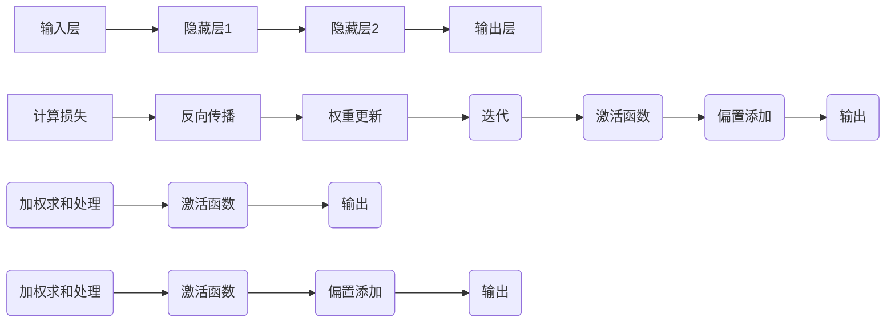
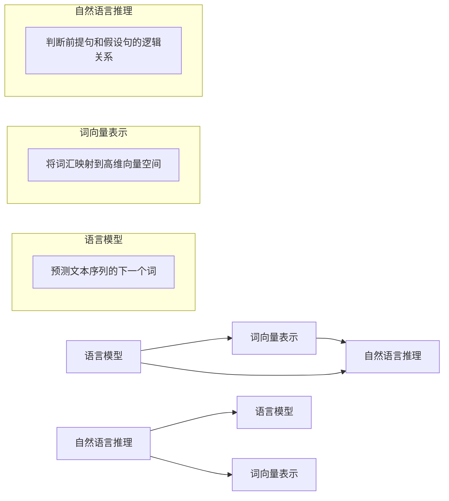
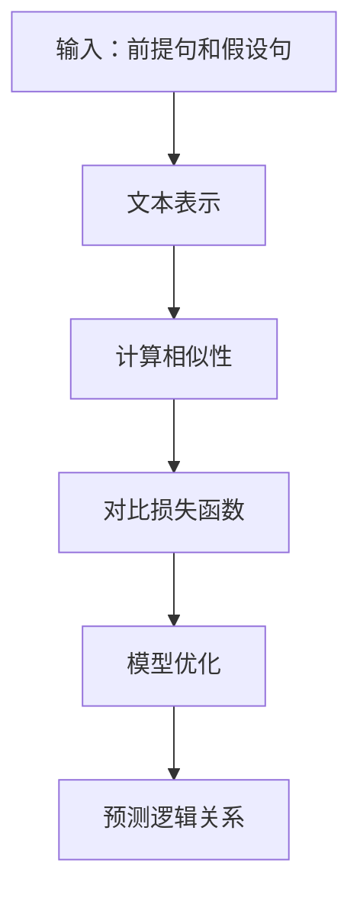

                 

## 文章标题

# 基于深度学习的AI自然语言推理系统

## 关键词

- 深度学习
- 自然语言处理
- 自然语言推理
- 语义分析
- 神经网络

## 摘要

本文将深入探讨基于深度学习的AI自然语言推理系统。我们将从核心概念、算法原理、数学模型、项目实战以及未来发展趋势等多个角度进行详细分析。首先，我们将介绍深度学习和自然语言处理的基础知识，然后逐步讲解自然语言推理算法的核心原理，最后通过实际项目实战来展示这些理论的应用。文章最后将对未来发展趋势进行展望，为读者提供深入了解和探讨这一领域的线索。

## 文章标题

# 基于深度学习的AI自然语言推理系统

## 关键词

- 深度学习
- 自然语言处理
- 自然语言推理
- 语义分析
- 神经网络

## 摘要

本文将深入探讨基于深度学习的AI自然语言推理系统。本文分为五个部分，首先介绍深度学习和自然语言处理的基础知识；接着讲解自然语言推理的核心算法原理，包括文本分类、对比模型和语义相似性等；然后展示这些算法的数学模型和公式，并通过伪代码进行详细阐述；随后通过一个实际项目实战，解析代码实现和运行过程；最后，对未来的发展趋势进行展望，探讨现有的挑战和未来的方向。

## 文章目录

- 第一部分: 核心概念与联系
  - 1.1 深度学习基础
    - 1.1.1 神经网络基础
    - 1.1.2 深度学习模型架构
  - 1.2 自然语言处理基础
    - 1.2.1 语言模型
    - 1.2.2 词向量表示
- 第二部分: 核心算法原理讲解
  - 2.1 自然语言推理算法
    - 2.1.1 文本分类
    - 2.1.2 对比模型
    - 2.1.3 语义相似性
- 第三部分: 数学模型和数学公式讲解
  - 3.1 深度学习数学基础
    - 3.1.1 梯度下降算法
    - 3.1.2 反向传播算法
    - 3.1.3 损失函数和优化器
  - 3.2 自然语言处理数学模型
    - 3.2.1 词嵌入
    - 3.2.2 语义向量空间模型
- 第四部分: 项目实战与代码解析
  - 4.1 实战项目1: 文本分类系统
    - 4.1.1 项目背景
    - 4.1.2 数据预处理
    - 4.1.3 模型设计与训练
    - 4.1.4 模型评估与优化
  - 4.2 实战项目2: 问答系统
    - 4.2.1 项目背景
    - 4.2.2 数据预处理
    - 4.2.3 模型设计与训练
    - 4.2.4 模型评估与优化
- 第五部分: 未来发展趋势与展望
  - 5.1 AI自然语言推理的发展
    - 5.1.1 现有挑战
    - 5.1.2 未来方向
    - 5.1.3 最佳实践 tips

## 文章引言

自然语言处理（NLP）作为人工智能（AI）的一个重要分支，近年来得到了飞速发展。随着互联网和大数据时代的到来，人们产生了大量的文本数据，如何有效地处理和利用这些数据成为了研究的重点。自然语言推理（NLI）是自然语言处理的一个重要任务，旨在让计算机理解和处理自然语言中的逻辑关系和语义信息。

自然语言推理的应用范围非常广泛，包括机器翻译、情感分析、问答系统、文本分类、信息提取等。而深度学习作为一种强大的机器学习技术，在NLP领域中展现出了巨大的潜力。通过深度学习模型，我们可以对复杂的文本数据进行分析和处理，从而实现自然语言推理任务。

本文将深入探讨基于深度学习的AI自然语言推理系统。首先，我们将介绍深度学习和自然语言处理的基础知识，帮助读者建立对这两个领域的初步认识。接着，我们将详细讲解自然语言推理算法的核心原理，包括文本分类、对比模型和语义相似性等。然后，我们将展示这些算法的数学模型和公式，并通过伪代码进行详细阐述。接下来，我们将通过两个实际项目实战，展示如何使用深度学习模型进行自然语言推理任务。最后，我们将对未来的发展趋势进行展望，探讨现有的挑战和未来的方向。

通过对本文的阅读，读者将能够全面了解基于深度学习的AI自然语言推理系统的原理、应用和实践，为后续的研究和应用提供参考。本文将以逻辑清晰、结构紧凑、简单易懂的方式呈现，使读者能够轻松掌握这一复杂领域的关键技术。

## 第一部分：核心概念与联系

### 1.1 深度学习基础

深度学习是机器学习中的一个重要分支，通过模拟人脑的神经网络结构，实现自动特征提取和学习。深度学习在图像识别、语音识别、自然语言处理等领域取得了显著的成果，成为人工智能领域的重要研究热点。

#### 1.1.1 神经网络基础

神经网络是由大量神经元（或节点）互联而成的复杂网络，每个神经元都可以接收多个输入信号，并通过加权求和处理后产生输出。神经网络的基本组成部分包括：

1. 输入层：接收外部输入信号。
2. 隐藏层：对输入信号进行加工处理。
3. 输出层：产生最终的输出结果。

神经元之间的连接关系可以用权重（weights）来表示，每个权重都代表一个神经元对其他神经元的贡献程度。在神经网络训练过程中，这些权重会被不断调整，以使网络能够更好地拟合训练数据。

神经网络的工作原理如下：

1. 前向传播（Forward Propagation）：输入信号从输入层传播到输出层，每个神经元根据输入和权重计算出输出值。
2. 反向传播（Back Propagation）：根据输出值与实际结果的差异，通过反向传播算法更新各神经元的权重。

#### 1.1.2 深度学习模型架构

深度学习模型架构多种多样，其中最常见的包括卷积神经网络（CNN）、循环神经网络（RNN）和Transformer等。

1. 卷积神经网络（CNN）：主要用于图像处理领域。CNN通过卷积层提取图像的特征，并通过池化层降低数据的维度，最终通过全连接层进行分类。
2. 循环神经网络（RNN）：适用于序列数据处理，如语音识别、机器翻译等。RNN通过在时间步上递归的方式处理序列数据，可以捕捉时间步之间的依赖关系。
3. Transformer：由Google提出的一种基于自注意力机制的深度学习模型，在自然语言处理领域取得了很大的成功。Transformer通过多头自注意力机制和前馈神经网络处理输入序列，可以有效地捕捉序列之间的复杂依赖关系。

### 1.2 自然语言处理基础

自然语言处理（NLP）是人工智能领域的一个重要分支，旨在让计算机理解和处理人类自然语言。NLP的主要任务包括文本分类、情感分析、命名实体识别、机器翻译等。以下介绍几个核心概念：

#### 1.2.1 语言模型

语言模型是一种概率模型，用于预测文本序列的下一个词。NLP中常用的语言模型包括：

1. N元语法（n-gram model）：基于统计方法，通过计算相邻n个词的概率来预测下一个词。
2. 隐马尔可夫模型（HMM）：用于处理序列数据，通过状态转移概率和发射概率来预测下一个状态。
3. 递归神经网络（RNN）：通过在时间步上递归的方式处理序列数据，可以捕捉时间步之间的依赖关系。

#### 1.2.2 词向量表示

词向量表示是将自然语言中的词汇映射到高维向量空间中，以方便计算机处理。以下介绍几种常见的词向量模型：

1. 基于分布的模型：如Word2Vec，通过训练大规模语料库，学习词汇的分布特征，将词映射到低维向量空间中。
2. 基于窗口的模型：如FastText，通过在词汇周围构建窗口，计算词汇之间的相似性，将词映射到高维向量空间中。
3. 基于深度学习的模型：如BERT，通过训练深度神经网络，学习词汇和句子级别的语义特征。

### 1.3 核心概念之间的联系

深度学习和自然语言处理在人工智能领域中相互交织，共同推动着技术的发展。以下是两个领域之间的核心联系：

1. 深度学习为自然语言处理提供了强大的模型架构，如CNN、RNN和Transformer等，可以有效地处理复杂的文本数据。
2. 自然语言处理为深度学习提供了丰富的应用场景，如文本分类、情感分析和机器翻译等，推动了深度学习在NLP领域的发展。
3. 语言模型和词向量表示是自然语言处理的基础，为深度学习模型提供了有效的输入表示，提高了模型的性能。

通过了解深度学习和自然语言处理的基础知识，读者可以更好地理解后续章节中自然语言推理算法的原理和应用。在下一部分中，我们将详细讲解自然语言推理算法的核心原理，包括文本分类、对比模型和语义相似性等。

### 1.1.1 神经网络基础

神经网络是深度学习的基础，其核心概念和结构对于理解和应用自然语言推理系统至关重要。下面我们将深入探讨神经网络的定义、组成以及工作原理。

#### 神经网络的定义

神经网络（Neural Network，NN）是一种模仿生物神经系统的计算模型。它由大量相互连接的节点（或称为神经元）组成，这些节点通过模拟生物神经元的信号传递和计算特性来实现复杂的任务。

#### 神经网络的组成

神经网络的基本组成部分包括：

1. **输入层（Input Layer）**：接收外部输入信息，每个输入节点通常对应一个特征或属性。
2. **隐藏层（Hidden Layers）**：位于输入层和输出层之间，负责对输入信息进行加工和处理。隐藏层的数量和节点数可以根据问题的复杂程度进行调整。
3. **输出层（Output Layer）**：产生最终输出结果，输出节点的数量和类型取决于具体任务的要求。

#### 神经元的结构和工作原理

一个简单的神经元可以看作是一个带有多输入和单输出的计算单元，其基本结构如下：

1. **权重（Weights）**：每个输入连接到神经元的权重，代表该输入对神经元输出的影响程度。
2. **偏置（Bias）**：增加神经元的非线性，使得模型能够更好地拟合数据。
3. **激活函数（Activation Function）**：用于引入非线性，常见的激活函数包括sigmoid、ReLU和tanh等。

神经元的工作原理如下：

1. **加权求和处理**：每个输入通过对应的权重乘以后相加，再加上偏置，得到神经元的净输入（Net Input）。
   $$ \text{Net Input} = \sum_{i=1}^{n} w_i \cdot x_i + b $$
   
   其中，$w_i$ 是输入 $x_i$ 的权重，$b$ 是偏置。

2. **激活函数计算**：通过激活函数对净输入进行非线性变换，得到神经元的输出（Output）。
   $$ \text{Output} = f(\text{Net Input}) $$
   
   常见的激活函数有：
   - **Sigmoid**:
     $$ f(x) = \frac{1}{1 + e^{-x}} $$
   - **ReLU** (Rectified Linear Unit):
     $$ f(x) = \max(0, x) $$
   - **Tanh**:
     $$ f(x) = \frac{e^x - e^{-x}}{e^x + e^{-x}} $$

#### 神经网络的学习过程

神经网络的学习过程主要包括以下步骤：

1. **前向传播（Forward Propagation）**：输入数据从输入层传播到输出层，每个神经元根据输入和权重计算输出。
2. **计算损失（Calculate Loss）**：通过比较网络输出和实际标签之间的差异，计算损失函数的值。常见的损失函数包括均方误差（MSE）、交叉熵损失（Cross-Entropy Loss）等。
3. **反向传播（Back Propagation）**：根据损失函数的梯度，通过反向传播算法更新每个神经元的权重和偏置。
4. **权重更新（Update Weights）**：根据梯度下降（Gradient Descent）或其他优化算法，更新网络中的权重和偏置。

这个过程反复进行，直到网络达到预设的损失阈值或迭代次数。

#### Mermaid 流程图

为了更好地理解神经网络的工作流程，我们可以使用Mermaid流程图来表示：



通过这个流程图，我们可以清晰地看到输入数据在神经网络中的传播过程，以及如何通过反向传播更新权重。

通过上述内容，我们初步了解了神经网络的定义、结构和基本工作原理。在下一部分，我们将进一步探讨深度学习模型的架构，包括卷积神经网络（CNN）、循环神经网络（RNN）和Transformer等。

### 1.1.2 深度学习模型架构

在了解了神经网络的基础之后，接下来我们将深入探讨几种常见的深度学习模型架构，包括卷积神经网络（CNN）、循环神经网络（RNN）和Transformer。这些模型在自然语言处理任务中有着广泛的应用，并各自具备独特的优势和适用场景。

#### 卷积神经网络（CNN）

卷积神经网络（Convolutional Neural Network，CNN）最初是用于图像处理领域，其核心思想是通过卷积操作捕捉图像中的局部特征。随着深度学习技术的发展，CNN也被广泛应用于自然语言处理任务，如文本分类、情感分析和机器翻译等。

1. **卷积层（Convolutional Layer）**：卷积层是CNN的核心组成部分，通过卷积操作提取文本数据中的局部特征。卷积核（Convolutional Kernel）是一个小型矩阵，在文本数据上滑动，对相邻的文本片段进行卷积操作，得到特征图（Feature Map）。
   $$ \text{Feature Map}_{ij} = \sum_{k} \text{Kernel}_{ikj} \cdot \text{Input}_{ij} $$
   
   其中，$\text{Input}_{ij}$ 表示输入文本中的第 $i$ 个词和第 $j$ 个词之间的特征，$\text{Kernel}_{ikj}$ 表示卷积核。

2. **池化层（Pooling Layer）**：池化层用于降低数据维度和减少过拟合风险。常见的池化操作包括最大池化（Max Pooling）和平均池化（Average Pooling）。最大池化选择每个特征图中的最大值，而平均池化则计算每个特征图的平均值。
   $$ \text{Pooling}_{ij} = \max_{k} \text{Feature Map}_{ijk} $$
   
   或
   $$ \text{Pooling}_{ij} = \frac{1}{N} \sum_{k} \text{Feature Map}_{ijk} $$
   
   其中，$N$ 是特征图中每个位置的候选值数量。

3. **全连接层（Fully Connected Layer）**：全连接层将卷积层和池化层提取的特征映射到分类结果。每个神经元都与前一层的所有神经元相连，通过权重矩阵和偏置进行加权求和处理。

4. **激活函数（Activation Function）**：为了引入非线性，CNN中的全连接层通常使用激活函数，如ReLU、Sigmoid和Tanh等。

5. **输出层（Output Layer）**：输出层产生最终的预测结果，可以是分类结果或回归值。对于分类任务，常用的输出层是softmax函数，用于将特征映射到概率分布。

#### 循环神经网络（RNN）

循环神经网络（Recurrent Neural Network，RNN）是一种处理序列数据的深度学习模型，能够捕捉时间步之间的依赖关系。RNN在自然语言处理任务，如机器翻译、语音识别和序列标注等方面表现出色。

1. **递归结构（Recurrence）**：RNN中的每个时间步都包含一个循环单元，前一个时间步的输出会作为当前时间步的输入。这种递归结构使得RNN能够记住之前的信息，并在后续时间步上进行预测。
   $$ \text{Output}_{t} = \text{activation}(\text{weights} \cdot [\text{Input}_{t}, \text{Output}_{t-1}]) $$

2. **隐藏状态（Hidden State）**：RNN通过隐藏状态来记忆信息，隐藏状态不仅用于当前时间步的输出计算，还会传递到下一个时间步。这使得RNN能够捕捉长距离依赖关系。

3. **长短时记忆（Long Short-Term Memory，LSTM）**：为了解决传统RNN在长序列处理中的梯度消失和梯度爆炸问题，长短时记忆（LSTM）模型被提出。LSTM通过引入门控机制，有效地控制信息的流动，从而在长序列处理中表现出色。

4. **门控单元（Gate Unit）**：LSTM包含三个门控单元：遗忘门（Forget Gate）、输入门（Input Gate）和输出门（Output Gate）。这些门控单元决定了信息的保留和遗忘，以及新的信息的输入和输出。

#### Transformer

Transformer是由Google提出的一种基于自注意力机制的深度学习模型，在自然语言处理任务中取得了显著的成果。Transformer通过并行计算和多头注意力机制，实现了高效的序列建模。

1. **自注意力机制（Self-Attention）**：自注意力机制允许模型在每一个时间步上关注整个输入序列的不同部分，从而捕捉全局依赖关系。自注意力通过计算每个词与其他词的相似度来生成权重，并将这些权重应用于每个词的特征。
   $$ \text{Attention}(Q, K, V) = \text{softmax}(\frac{QK^T}{\sqrt{d_k}})V $$

   其中，$Q$、$K$ 和 $V$ 分别代表查询向量、键向量和值向量，$d_k$ 是键向量的维度。

2. **多头注意力（Multi-Head Attention）**：多头注意力通过将输入序列映射到多个不同的查询、键和值向量，并将这些注意力机制的输出进行拼接和线性变换，从而实现更加复杂的序列建模。
   $$ \text{Multi-Head Attention} = \text{Concat}(\text{head}_1, \text{head}_2, ..., \text{head}_h)W^O $$

   其中，$h$ 是头数，$W^O$ 是输出权重。

3. **编码器（Encoder）和解码器（Decoder）**：Transformer包含编码器和解码器两个部分。编码器将输入序列编码成一系列向量，解码器则根据这些向量生成输出序列。编码器和解码器都包含多个自注意力层和前馈神经网络。

4. **位置编码（Positional Encoding）**：由于Transformer没有递归结构，无法直接利用输入序列的顺序信息。因此，通过位置编码将序列信息编码到向量中，以便模型在自注意力机制中考虑位置信息。

通过以上对CNN、RNN和Transformer三种深度学习模型架构的介绍，我们可以看到这些模型在自然语言处理任务中的应用各有特色。在接下来的章节中，我们将进一步探讨自然语言处理的基础知识，为理解自然语言推理算法打下坚实的基础。

### 1.2 自然语言处理基础

自然语言处理（NLP）是人工智能领域的一个重要分支，旨在使计算机能够理解和处理人类自然语言。在自然语言处理中，语言模型和词向量表示是两个核心概念，为深度学习模型提供了有效的输入表示。下面我们将详细讲解这两个概念，并探讨它们在NLP中的应用。

#### 1.2.1 语言模型

语言模型（Language Model，LM）是一种概率模型，用于预测文本序列的下一个词。语言模型的目的是为自然语言中的词汇提供一个概率分布，从而帮助计算机在生成文本或理解文本时做出更好的决策。

1. **N元语法（n-gram Model）**：
   N元语法是一种基于统计的语言模型，通过计算相邻n个词的概率来预测下一个词。常见的N元语法包括二元语法（Bigram）和三元语法（Trigram）。

   例如，对于二元语法，下一个词的概率可以通过以下公式计算：
   $$ P(w_t | w_{t-1}) = \frac{C(w_{t-1}, w_t)}{C(w_{t-1})} $$
   
   其中，$C(w_{t-1}, w_t)$ 表示词对 $(w_{t-1}, w_t)$ 在训练数据中出现的次数，$C(w_{t-1})$ 表示词 $w_{t-1}$ 在训练数据中出现的次数。

   对于三元语法，下一个词的概率可以通过以下公式计算：
   $$ P(w_t | w_{t-1}, w_{t-2}) = \frac{C(w_{t-1}, w_{t-2}, w_t)}{C(w_{t-1}, w_{t-2})} $$
   
   三元语法和更高阶的语法可以捕捉到更复杂的词汇关系，但训练数据和计算成本也会相应增加。

2. **隐马尔可夫模型（Hidden Markov Model，HMM）**：
   隐马尔可夫模型是一种统计模型，用于处理序列数据，通过状态转移概率和发射概率来预测下一个状态。HMM适用于处理不确定性和隐含状态的问题，如语音识别和命名实体识别。

   HMM的核心概念包括：
   - **状态序列**：表示文本序列中的隐含状态。
   - **状态转移概率**：表示一个状态转移到另一个状态的概率。
   - **发射概率**：表示一个状态产生特定观测值（如词）的概率。

3. **递归神经网络（Recurrent Neural Network，RNN）**：
   递归神经网络是一种处理序列数据的深度学习模型，通过在时间步上递归的方式处理序列数据，可以捕捉时间步之间的依赖关系。RNN在语言模型中表现出色，但存在梯度消失和梯度爆炸问题。

4. **长短期记忆网络（Long Short-Term Memory，LSTM）**：
   长短期记忆网络是RNN的一种改进，通过引入门控机制，有效地控制信息的流动，从而在长序列处理中表现出色。LSTM在语言模型中得到了广泛应用。

#### 1.2.2 词向量表示

词向量表示（Word Vector Representation）是将自然语言中的词汇映射到高维向量空间中的方法，以方便计算机处理。词向量表示为深度学习模型提供了有效的输入表示，提高了模型的性能和效果。

1. **基于分布的模型（Distributional Model）**：
   基于分布的模型通过训练大规模语料库，学习词汇的分布特征，将词映射到低维向量空间中。Word2Vec是最常见的基于分布的词向量模型，包括Continuous Bag of Words（CBOW）和Skip-Gram两种方法。

   - **CBOW（Continuous Bag of Words）**：CBOW通过预测中心词周围的多个词来学习词向量。给定一个中心词，模型会预测周围多个词（窗口大小为$2n$，$n$为上下文词的数量）。
   
     $$ P(w_t | w_1, w_2, ..., w_{2n}) = \text{softmax}(\text{weights} \cdot [w_1, w_2, ..., w_{2n}]) $$
   
   - **Skip-Gram（Skip-Gram）**：Skip-Gram通过预测中心词来学习词向量。给定一个中心词，模型会预测其上下文词。
   
     $$ P(w_t | w_s) = \text{softmax}(\text{weights} \cdot [w_s]) $$

2. **基于窗口的模型（Window-based Model）**：
   基于窗口的模型通过在词汇周围构建窗口，计算词汇之间的相似性，将词映射到高维向量空间中。FastText是常见的基于窗口的词向量模型，它通过考虑词汇的上下文信息，学习更丰富的词向量。

3. **基于深度学习的模型（Deep Learning-based Model）**：
   基于深度学习的模型通过训练深度神经网络，学习词汇和句子级别的语义特征。BERT（Bidirectional Encoder Representations from Transformers）是最常见的基于深度学习的词向量模型，它通过双向Transformer编码器学习词汇和句子的双向表示。

   BERT的主要特点包括：
   - **双向编码器**：BERT通过双向Transformer编码器学习词汇的上下文信息，使模型能够捕捉到词汇在不同上下文中的语义变化。
   - **预训练和微调**：BERT在大规模语料库上进行预训练，然后通过微调适应特定任务，如文本分类和命名实体识别。

#### 词向量表示的应用

词向量表示在自然语言处理任务中有着广泛的应用，包括文本分类、情感分析、机器翻译、问答系统等。

1. **文本分类（Text Classification）**：词向量表示可以帮助模型学习到词汇之间的相似性和差异性，从而在文本分类任务中提高分类性能。
2. **情感分析（Sentiment Analysis）**：词向量表示可以用于计算文本的语义表示，从而分析文本的情感倾向。
3. **机器翻译（Machine Translation）**：词向量表示可以用于建模源语言和目标语言之间的词汇关系，从而实现有效的机器翻译。
4. **问答系统（Question Answering System）**：词向量表示可以帮助模型理解问题和答案之间的语义关系，从而实现有效的问答系统。

通过上述内容，我们详细介绍了语言模型和词向量表示这两个核心概念，并探讨了它们在自然语言处理中的应用。在下一部分，我们将深入讲解自然语言推理算法的核心原理，包括文本分类、对比模型和语义相似性等。

### 1.2.1 语言模型

语言模型（Language Model，LM）是自然语言处理（NLP）中的一个核心概念，用于预测文本序列中的下一个词。语言模型在文本生成、机器翻译、语音识别和语音合成等多个领域发挥着重要作用。以下是几种常见的语言模型及其工作原理。

#### 1.2.1.1 语言模型的概念

语言模型是一种概率模型，其目的是为给定的文本序列分配一个概率。在自然语言处理中，语言模型通常用于以下任务：

1. **文本生成**：根据已有的文本数据，生成新的文本。
2. **语音识别**：将语音信号转换为文本。
3. **语音合成**：根据文本生成语音。
4. **机器翻译**：将一种语言的文本翻译成另一种语言。

语言模型的核心思想是计算一个句子或词汇序列的概率。常见的语言模型有N元语法模型、隐马尔可夫模型（HMM）和递归神经网络（RNN）。

#### 1.2.1.2 语言模型的类型

1. **N元语法模型（n-gram Model）**：
   N元语法模型是最简单的语言模型之一，它通过计算相邻n个词的概率来预测下一个词。常见的N元语法模型包括二元语法（Bigram）和三元语法（Trigram）。

   - **二元语法（Bigram）**：
     $$ P(w_t | w_{t-1}) = \frac{C(w_{t-1}, w_t)}{C(w_{t-1})} $$
     
     其中，$C(w_{t-1}, w_t)$ 表示词对 $(w_{t-1}, w_t)$ 在训练数据中出现的次数，$C(w_{t-1})$ 表示词 $w_{t-1}$ 在训练数据中出现的次数。

   - **三元语法（Trigram）**：
     $$ P(w_t | w_{t-1}, w_{t-2}) = \frac{C(w_{t-1}, w_{t-2}, w_t)}{C(w_{t-1}, w_{t-2})} $$
     
     三元语法和更高阶的语法可以捕捉到更复杂的词汇关系，但训练数据和计算成本也会相应增加。

2. **隐马尔可夫模型（Hidden Markov Model，HMM）**：
   隐马尔可夫模型是一种统计模型，用于处理序列数据，通过状态转移概率和发射概率来预测下一个状态。HMM适用于处理不确定性和隐含状态的问题，如语音识别和命名实体识别。

   HMM的核心概念包括：
   - **状态序列**：表示文本序列中的隐含状态。
   - **状态转移概率**：表示一个状态转移到另一个状态的概率。
   - **发射概率**：表示一个状态产生特定观测值（如词）的概率。

3. **递归神经网络（Recurrent Neural Network，RNN）**：
   递归神经网络是一种处理序列数据的深度学习模型，通过在时间步上递归的方式处理序列数据，可以捕捉时间步之间的依赖关系。RNN在语言模型中表现出色，但存在梯度消失和梯度爆炸问题。

4. **长短期记忆网络（Long Short-Term Memory，LSTM）**：
   长短期记忆网络是RNN的一种改进，通过引入门控机制，有效地控制信息的流动，从而在长序列处理中表现出色。LSTM在语言模型中得到了广泛应用。

5. **变换器模型（Transformer）**：
   变换器模型是由Google提出的一种基于自注意力机制的深度学习模型。与传统的RNN和LSTM相比，Transformer通过并行计算和多头注意力机制，实现了高效的序列建模。变换器模型在自然语言处理任务中取得了显著的成果。

   变换器模型的主要组成部分包括：
   - **多头自注意力机制（Multi-Head Self-Attention）**：允许模型在每一个时间步上关注整个输入序列的不同部分，从而捕捉全局依赖关系。
   - **前馈神经网络（Feedforward Neural Network）**：对自注意力机制的输出进行进一步的加工。
   - **编码器（Encoder）和解码器（Decoder）**：编码器将输入序列编码成一系列向量，解码器则根据这些向量生成输出序列。

#### 1.2.1.3 语言模型的训练与评估

语言模型的训练和评估是自然语言处理中的关键步骤。以下是语言模型的训练与评估方法：

1. **训练**：
   - **数据准备**：收集大量的文本数据，如新闻文章、书籍、社交媒体帖子等。这些数据将被用于训练语言模型。
   - **分词**：将文本数据转换为单词或子词序列。分词的精度和效率对于模型的性能有很大影响。
   - **构建词汇表**：将所有出现的单词或子词映射到唯一的索引，构建词汇表。
   - **训练模型**：使用训练数据对语言模型进行训练。训练过程中，模型会学习到词汇之间的概率关系。

2. **评估**：
   - **交叉验证**：将数据集划分为训练集和验证集，通过交叉验证评估模型的性能。
   - **评估指标**：常用的评估指标包括词级别的准确率（Word Accuracy）、字符级别的准确率（Character Accuracy）和词误差率（Word Error Rate，WER）等。

   $$ \text{Word Accuracy} = \frac{\text{正确预测的词数}}{\text{总词数}} $$
   
   $$ \text{Character Accuracy} = \frac{\text{正确预测的字符数}}{\text{总字符数}} $$
   
   $$ \text{Word Error Rate} = \frac{\text{总词数} - \text{正确预测的词数}}{\text{总词数}} $$

通过上述方法，我们可以有效地训练和评估语言模型。在自然语言处理的许多任务中，语言模型是不可或缺的一部分，其性能的提高对于整个系统的效果有着重要的影响。

在下一部分中，我们将继续探讨词向量表示，并深入讲解常见的词向量模型，如Word2Vec、FastText和BERT。

### 1.2.2 词向量表示

词向量表示（Word Vector Representation）是将自然语言中的词汇映射到高维向量空间中的方法，以方便计算机处理。词向量表示在自然语言处理（NLP）任务中发挥了重要作用，例如文本分类、情感分析、机器翻译和问答系统。以下是几种常见的词向量表示模型。

#### 1.2.2.1 词向量表示的概念

词向量表示的基本思想是将词汇映射到高维向量空间中，使得相似的词汇在空间中靠近，而不相似的词汇相距较远。词向量表示不仅能够捕捉词汇的语义信息，还可以用于相似度计算、文本分类和聚类等任务。

#### 1.2.2.2 常见的词向量模型

1. **Word2Vec模型**：

   Word2Vec是一种基于分布的词向量模型，通过训练大规模语料库学习词汇的分布特征。Word2Vec包括两种常见的训练方法：**连续袋词模型（Continuous Bag of Words，CBOW）**和**跳字模型（Skip-Gram）**。

   - **CBOW（Continuous Bag of Words）**：CBOW通过预测中心词周围的多个词来学习词向量。给定一个中心词，模型会预测周围多个词（窗口大小为$2n$，$n$为上下文词的数量）。

     $$ P(w_t | w_1, w_2, ..., w_{2n}) = \text{softmax}(\text{weights} \cdot [w_1, w_2, ..., w_{2n}]) $$
   
   - **Skip-Gram（Skip-Gram）**：Skip-Gram通过预测中心词来学习词向量。给定一个中心词，模型会预测其上下文词。

     $$ P(w_t | w_s) = \text{softmax}(\text{weights} \cdot [w_s]) $$
   
   Word2Vec模型通过梯度下降和负采样算法进行训练，能够有效地学习到词汇的语义信息。

2. **FastText模型**：

   FastText是由Facebook提出的一种基于窗口的词向量模型，它通过考虑词汇的上下文信息，学习更丰富的词向量。FastText通过在词汇周围构建窗口，将词汇映射到高维向量空间中。

   FastText的核心概念包括：

   - **子词（Subword）**：FastText将词汇分解为子词，例如将单词“爱”分解为“爱、一、心”等。这样可以更好地捕捉词汇的语义信息。
   - **神经网络**：FastText使用神经网络来学习词向量，通过在窗口中聚合上下文词的向量来表示词汇。

3. **BERT模型**：

   BERT（Bidirectional Encoder Representations from Transformers）是由Google提出的一种基于深度学习的词向量模型。BERT通过训练大规模语料库，学习词汇和句子级别的双向表示。

   BERT的主要特点包括：

   - **双向编码器**：BERT通过双向Transformer编码器学习词汇的上下文信息，使模型能够捕捉到词汇在不同上下文中的语义变化。
   - **预训练和微调**：BERT在大规模语料库上进行预训练，然后通过微调适应特定任务，如文本分类和命名实体识别。

#### 1.2.2.3 词向量表示的应用

词向量表示在自然语言处理任务中有着广泛的应用，包括：

1. **文本分类**：词向量表示可以帮助模型学习到词汇之间的相似性和差异性，从而在文本分类任务中提高分类性能。
2. **情感分析**：词向量表示可以用于计算文本的语义表示，从而分析文本的情感倾向。
3. **机器翻译**：词向量表示可以用于建模源语言和目标语言之间的词汇关系，从而实现有效的机器翻译。
4. **问答系统**：词向量表示可以帮助模型理解问题和答案之间的语义关系，从而实现有效的问答系统。

通过上述内容，我们详细介绍了词向量表示的概念和常见的词向量模型。在下一部分，我们将深入讲解自然语言推理算法的核心原理，包括文本分类、对比模型和语义相似性等。

### 1.2.3 核心概念之间的联系

自然语言处理（NLP）作为一个复杂且多样化的领域，涉及到多个核心概念，包括语言模型、词向量表示、自然语言推理等。理解这些概念之间的联系，对于构建高效的NLP系统至关重要。

首先，语言模型（Language Model，LM）是NLP的基础，用于预测文本序列的下一个词。语言模型的核心目标是通过概率分布来表示文本的生成过程，从而帮助计算机理解自然语言的结构和语义。语言模型通常基于统计方法，如N元语法（n-gram model）、隐马尔可夫模型（HMM）或递归神经网络（RNN）。NLP的其他概念，如词向量表示和自然语言推理，都是基于语言模型的发展和应用。

词向量表示（Word Vector Representation）是将自然语言中的词汇映射到高维向量空间中的方法。词向量表示不仅帮助计算机处理文本数据，还提供了有效的语义信息表示。常见的词向量模型包括Word2Vec、FastText和BERT。这些模型通过训练大规模语料库，学习词汇的分布特征和语义信息，从而为语言模型和自然语言推理提供了强大的输入表示。

自然语言推理（Natural Language Inference，NLI）是NLP中的一个重要任务，旨在让计算机理解和处理自然语言中的逻辑关系和语义信息。自然语言推理涉及两个文本句子：前提句（Premise）和假设句（Hypothesis），并需要判断假设句是否为前提句的合理推断。自然语言推理可以基于规则方法或机器学习方法来实现，其中深度学习模型（如Transformer、BERT）在处理复杂语义关系方面表现出色。

核心概念之间的联系体现在以下几个方面：

1. **语言模型与词向量表示**：语言模型依赖于词向量表示来处理和预测文本。词向量表示为语言模型提供了词汇的语义表示，使得模型能够更好地理解和生成文本。

2. **自然语言推理与语言模型**：自然语言推理任务通常需要语言模型来生成可能的推断，并通过比较推断与实际标签来判断推理是否合理。语言模型为自然语言推理提供了基础的概率分布和语义信息。

3. **自然语言推理与词向量表示**：词向量表示不仅帮助语言模型处理文本，还直接应用于自然语言推理任务。通过计算词向量之间的相似性，模型可以判断两个文本句子之间的逻辑关系和语义相似性。

为了更好地理解这些概念之间的联系，我们可以使用Mermaid流程图来表示：



通过上述Mermaid流程图，我们可以清晰地看到语言模型、词向量表示和自然语言推理之间的交互和联系。理解这些核心概念及其相互关系，有助于我们构建更加智能和高效的NLP系统，为自然语言处理任务的实现提供坚实的基础。

### 第二部分：核心算法原理讲解

在第一部分中，我们介绍了深度学习和自然语言处理的基础知识，并探讨了核心概念之间的联系。接下来，我们将深入讲解自然语言推理（NLI）的核心算法原理，包括文本分类、对比模型和语义相似性等。这些算法在自然语言处理任务中扮演着重要角色，有助于我们理解和处理自然语言中的逻辑关系和语义信息。

#### 2.1 自然语言推理算法

自然语言推理（NLI）是自然语言处理（NLP）中的一个重要任务，旨在让计算机理解和处理自然语言中的逻辑关系和语义信息。NLI的核心算法包括文本分类、对比模型和语义相似性等。这些算法通过不同的方法和技术实现，旨在提高NLI系统的性能和效果。

#### 2.1.1 文本分类

文本分类（Text Classification）是一种常见的自然语言处理任务，旨在将文本数据分为预定义的类别。在自然语言推理中，文本分类用于判断两个文本句子之间的逻辑关系，如前提句和假设句之间的支持关系或矛盾关系。以下是几种常见的文本分类方法：

1. **朴素贝叶斯分类器（Naive Bayes Classifier）**：
   朴素贝叶斯分类器是一种基于概率论的分类方法，通过计算文本的特征概率分布，预测文本的类别。朴素贝叶斯分类器假设特征之间相互独立，适用于处理高维文本数据。

   伪代码如下：
   ```python
   def naive_bayes_classification(text, categories):
       probabilities = []
       for category in categories:
           prior_probability = P(category)
           word_probabilities = [P(word | category) for word in text]
           likelihood = multiply(prior_probability, word_probabilities)
           probabilities.append(likelihood)
       return argmax(probabilities)
   ```

2. **支持向量机（Support Vector Machine，SVM）**：
   支持向量机是一种基于最大间隔分类的线性分类方法，通过寻找超平面，将不同类别的数据点最大化地分开。SVM在处理高维数据和线性可分的情况下表现出色。

   伪代码如下：
   ```python
   def svm_classification(text, labels, C):
       # 训练SVM模型
       model = train_svm(text, labels, C)
       # 预测类别
       prediction = model.predict(text)
       return prediction
   ```

3. **深度学习分类模型（Deep Learning Classification Model）**：
   深度学习分类模型，如卷积神经网络（CNN）和循环神经网络（RNN），通过多层神经网络结构学习文本的特征表示，从而实现高效的文本分类。

   伪代码如下：
   ```python
   def deep_learning_classification(text, model):
       # 将文本输入到深度学习模型中
       features = model.extract_features(text)
       # 预测类别
       prediction = model.predict(features)
       return prediction
   ```

#### 2.1.2 对比模型

对比模型（Contrastive Model）是一种用于自然语言推理的算法，通过比较两个文本句子的特征来预测它们之间的逻辑关系。对比模型的核心思想是通过负采样和对比损失函数来训练模型，从而提高模型在判断前提句和假设句之间的逻辑关系时的性能。

1. **对比损失函数（Contrastive Loss Function）**：
   对比损失函数是对比模型的关键组成部分，用于优化模型在前提句和假设句之间的逻辑关系预测。常用的对比损失函数包括余弦相似性损失和对比损失。

   伪代码如下：
   ```python
   def contrastive_loss(premise_embedding, hypothesis_embedding, positive_similarity, negative_similarities):
       positive_loss = -log(softmax(positive_similarity))
       negative_loss = -log(softmax(negative_similarities))
       return positive_loss + negative_loss
   ```

2. **负采样（Negative Sampling）**：
   负采样是一种用于对比模型训练的优化技术，通过随机选择负样本来增加模型的多样性，从而提高模型的泛化能力。

   伪代码如下：
   ```python
   def negative_sampling(premise_embedding, hypothesis_embedding, negative_samples):
       similarities = [cosine_similarity(premise_embedding, hypothesis_embedding) for hypothesis_embedding in negative_samples]
       return contrastive_loss(premise_embedding, hypothesis_embedding, similarities)
   ```

3. **多任务学习（Multi-Task Learning）**：
   多任务学习是一种通过同时训练多个相关任务来提高模型性能的方法。在自然语言推理中，多任务学习可以通过同时训练支持关系和矛盾关系任务来提高模型的泛化能力和性能。

   伪代码如下：
   ```python
   def multi_task_learning(premise_texts, hypothesis_texts, labels):
       # 训练支持关系和矛盾关系模型
       support_model = train_contrastive_model(premise_texts, hypothesis_texts, labels['support'])
       contradiction_model = train_contrastive_model(premise_texts, hypothesis_texts, labels['contradiction'])
       # 预测逻辑关系
       support_predictions = support_model.predict(premise_texts, hypothesis_texts)
       contradiction_predictions = contradiction_model.predict(premise_texts, hypothesis_texts)
       return support_predictions, contradiction_predictions
   ```

#### 2.1.3 语义相似性

语义相似性（Semantic Similarity）是自然语言推理中的另一个关键概念，用于衡量两个文本句子之间的语义相似程度。通过计算语义相似性，模型可以判断两个句子是否具有相似的语义内容。以下是一些常见的语义相似性计算方法：

1. **词向量相似性（Word Vector Similarity）**：
   词向量相似性通过计算两个词向量之间的余弦相似度或欧氏距离来衡量它们的语义相似性。

   伪代码如下：
   ```python
   def word_vector_similarity(word1_vector, word2_vector):
       dot_product = sum(word1_vector * word2_vector)
       magnitude_product = sqrt(sum(word1_vector * word1_vector)) * sqrt(sum(word2_vector * word2_vector))
       return dot_product / magnitude_product
   ```

2. **句子向量表示（Sentence Vector Representation）**：
   句子向量表示是将整个句子映射到高维向量空间中的方法。常见的句子向量表示方法包括平均词向量、句子嵌入（Sentence Embedding）和变换器模型（Transformer）。

   伪代码如下：
   ```python
   def sentence_vector_representation(sentence, model):
       word_vectors = [model.get_word_vector(word) for word in sentence]
       sentence_vector = sum(word_vectors) / len(word_vectors)
       return sentence_vector
   ```

3. **句子相似性计算（Sentence Similarity Computation）**：
   句子相似性计算通过比较两个句子向量之间的相似性来衡量它们的语义相似程度。常用的方法包括余弦相似度和皮尔逊相关系数。

   伪代码如下：
   ```python
   def sentence_similarity(sentence1_vector, sentence2_vector):
       return cosine_similarity(sentence1_vector, sentence2_vector)
   ```

通过以上内容，我们详细介绍了自然语言推理中的核心算法原理，包括文本分类、对比模型和语义相似性等。在下一部分，我们将深入讲解这些算法的数学模型和公式，并通过伪代码进行详细阐述。

### 2.1.1 文本分类

文本分类是自然语言处理（NLP）中的一个重要任务，其核心目的是将文本数据根据其内容分为不同的类别。在自然语言推理中，文本分类用于判断两个文本句子之间的逻辑关系，如前提句和假设句之间的支持关系或矛盾关系。以下是对文本分类算法的详细讲解。

#### 文本分类的概念

文本分类（Text Classification）是一种监督学习任务，其目标是根据输入文本的特征将其映射到预定义的类别标签。文本分类广泛应用于舆情分析、新闻分类、垃圾邮件检测等领域。

#### 文本分类的常见方法

文本分类的方法可以分为基于规则的方法和基于机器学习的方法。以下是一些常见的文本分类方法：

1. **朴素贝叶斯分类器（Naive Bayes Classifier）**：

   朴素贝叶斯分类器是一种基于概率论的分类方法，假设特征之间相互独立。它通过计算每个类别在特征上的条件概率，并使用贝叶斯定理来预测文本的类别。

   假设我们有一个文本数据集，其中包含 $C$ 个类别。对于每个类别 $c$，我们需要计算：

   $$ P(c) = \frac{N_c}{N} $$

   其中，$N_c$ 是类别 $c$ 的文本数量，$N$ 是总文本数量。

   对于每个特征 $f$，我们需要计算：

   $$ P(f|c) = \frac{N_{cf}}{N_c} $$

   其中，$N_{cf}$ 是特征 $f$ 在类别 $c$ 的文本中出现的次数。

   给定一个新文本，我们可以计算它在每个类别上的后验概率：

   $$ P(c|text) = \frac{P(text|c)P(c)}{P(text)} $$

   通过比较这些后验概率，我们可以选择具有最大后验概率的类别作为预测结果。

2. **支持向量机（Support Vector Machine，SVM）**：

   支持向量机是一种基于最大间隔分类的线性分类方法，通过寻找超平面，将不同类别的数据点最大化地分开。在文本分类中，特征通常是通过词袋（Bag of Words，BOW）模型或词嵌入（Word Embedding）方法获得的。

   SVM的核心目标是最大化分类边界，即最大化正负样本之间的间隔：

   $$ \min_w \frac{1}{2} ||w||^2 $$
   
   使得：
   
   $$ y_i ( \langle w, x_i \rangle - b ) \geq 1 $$

   其中，$w$ 是权重向量，$b$ 是偏置，$x_i$ 是特征向量，$y_i$ 是类别标签（$+1$ 或 $-1$）。

3. **朴素贝叶斯分类器（Naive Bayes Classifier）**：

   朴素贝叶斯分类器是一种基于概率论的分类方法，假设特征之间相互独立。它通过计算每个类别在特征上的条件概率，并使用贝叶斯定理来预测文本的类别。

   假设我们有一个文本数据集，其中包含 $C$ 个类别。对于每个类别 $c$，我们需要计算：

   $$ P(c) = \frac{N_c}{N} $$

   其中，$N_c$ 是类别 $c$ 的文本数量，$N$ 是总文本数量。

   对于每个特征 $f$，我们需要计算：

   $$ P(f|c) = \frac{N_{cf}}{N_c} $$

   其中，$N_{cf}$ 是特征 $f$ 在类别 $c$ 的文本中出现的次数。

   给定一个新文本，我们可以计算它在每个类别上的后验概率：

   $$ P(c|text) = \frac{P(text|c)P(c)}{P(text)} $$

   通过比较这些后验概率，我们可以选择具有最大后验概率的类别作为预测结果。

4. **深度学习分类模型（Deep Learning Classification Model）**：

   深度学习分类模型，如卷积神经网络（CNN）和循环神经网络（RNN），通过多层神经网络结构学习文本的特征表示，从而实现高效的文本分类。

   假设我们有一个深度学习模型，其输入为文本，输出为类别概率分布。模型可以通过以下步骤进行训练和预测：

   - **输入层（Input Layer）**：接收文本数据，将其转换为特征向量。
   - **隐藏层（Hidden Layers）**：通过神经网络结构对特征向量进行加工和变换，提取高层次的文本特征。
   - **输出层（Output Layer）**：通过softmax函数输出每个类别的概率分布。

   伪代码如下：
   ```python
   def deep_learning_text_classification(text, model):
       # 将文本转换为特征向量
       features = model.extract_features(text)
       # 通过深度学习模型进行预测
       probabilities = model.predict(features)
       # 选择概率最高的类别作为预测结果
       predicted_class = argmax(probabilities)
       return predicted_class
   ```

#### 文本分类的性能评估

评估文本分类的性能通常使用以下指标：

1. **准确率（Accuracy）**：

   准确率是分类模型预测正确的样本数占总样本数的比例。

   $$ \text{Accuracy} = \frac{\text{正确预测的样本数}}{\text{总样本数}} $$

2. **精确率（Precision）**：

   精确率是分类模型预测为正类的样本中实际为正类的比例。

   $$ \text{Precision} = \frac{\text{真正例}}{\text{真正例} + \text{假正例}} $$

3. **召回率（Recall）**：

   召回率是分类模型实际为正类的样本中被正确预测为正类的比例。

   $$ \text{Recall} = \frac{\text{真正例}}{\text{真正例} + \text{假反例}} $$

4. **F1分数（F1 Score）**：

   F1分数是精确率和召回率的调和平均值，用于综合评估分类模型的效果。

   $$ \text{F1 Score} = 2 \times \frac{\text{Precision} \times \text{Recall}}{\text{Precision} + \text{Recall}} $$

#### 总结

文本分类是自然语言处理中的一项基础任务，通过多种算法和技术可以实现高效的文本分类。在自然语言推理任务中，文本分类用于判断两个文本句子之间的逻辑关系，如支持关系和矛盾关系。了解文本分类的概念、方法和性能评估指标，有助于我们更好地应用和优化文本分类模型，从而提升自然语言推理系统的性能。

### 2.1.2 对比模型

对比模型（Contrastive Model）是自然语言处理（NLP）中的一个重要算法，广泛应用于自然语言推理（NLI）任务。对比模型的核心理念是通过对比两个文本句子的特征，来判断它们之间的逻辑关系。以下是对对比模型的基本概念、方法和工作原理的详细讲解。

#### 对比模型的基本概念

对比模型通过比较两个文本句子（前提句和假设句）的特征来预测它们之间的逻辑关系。这种模型的核心思想是利用对比损失函数来训练模型，使得模型能够正确区分支持、矛盾和中立关系。

1. **支持（Support）**：假设句提供了对前提句的证据，使得前提句更可信。
2. **矛盾（Contradiction）**：假设句与前提句相互矛盾，前提句在假设句的条件下不成立。
3. **中立（Neutral）**：假设句与前提句之间没有明显的支持或矛盾关系。

#### 对比模型的方法

对比模型通常采用以下方法：

1. **文本表示**：首先需要将文本句子转换为向量表示。常用的方法包括词袋（Bag of Words，BOW）、词嵌入（Word Embedding）和变换器模型（Transformer）。

2. **对比损失函数**：对比损失函数是对比模型的关键组成部分，用于优化模型在前提句和假设句之间的逻辑关系预测。常见的对比损失函数包括余弦相似性损失、对比损失和三元组损失。

3. **负采样**：在训练过程中，通过负采样选择负样本，增加模型的多样性，从而提高模型的泛化能力。

#### 对比模型的工作原理

对比模型的工作原理主要包括以下几个步骤：

1. **文本表示**：将前提句和假设句分别转换为向量表示。对于变换器模型，可以直接使用预训练的模型，如BERT。

2. **计算相似性**：计算前提句和假设句之间的相似性，通常使用余弦相似度或欧氏距离。

3. **对比损失函数**：通过对比损失函数优化模型。对比损失函数的目标是使得支持对的相似性最大化，同时使得负样本对的相似性最小化。

以下是一个简单的对比模型的工作流程：



#### 对比模型的实现

以下是一个简化的对比模型的实现示例，使用PyTorch框架：

```python
import torch
import torch.nn as nn
from torch.optim import Adam

# 定义对比模型
class ContrastiveModel(nn.Module):
    def __init__(self, embed_dim):
        super(ContrastiveModel, self).__init__()
        self.embedding = nn.Embedding(vocab_size, embed_dim)
        self.fc = nn.Linear(embed_dim, 1)

    def forward(self, premise, hypothesis):
        premise_embedding = self.embedding(premise)
        hypothesis_embedding = self.embedding(hypothesis)
        similarity = torch.sum(premise_embedding * hypothesis_embedding, dim=1)
        output = self.fc(similarity)
        return output

# 训练对比模型
def train_contrastive_model(premises, hypotheses, labels, embed_dim, num_epochs, learning_rate):
    model = ContrastiveModel(embed_dim)
    criterion = nn.BCEWithLogitsLoss()
    optimizer = Adam(model.parameters(), lr=learning_rate)

    for epoch in range(num_epochs):
        for premise, hypothesis, label in zip(premises, hypotheses, labels):
            premise_embedding = model.forward(premise)
            hypothesis_embedding = model.forward(hypothesis)
            similarity = torch.sum(premise_embedding * hypothesis_embedding, dim=1)
            loss = criterion(similarity, label)

            optimizer.zero_grad()
            loss.backward()
            optimizer.step()

            if (epoch + 1) % 100 == 0:
                print(f'Epoch [{epoch + 1}/{num_epochs}], Loss: {loss.item()}')

    return model
```

通过上述内容，我们详细介绍了对比模型的基本概念、方法和工作原理。对比模型在自然语言推理任务中具有广泛的应用，通过合理的文本表示和对比损失函数，可以提高模型在判断文本逻辑关系时的性能。

### 2.1.3 语义相似性

语义相似性（Semantic Similarity）是自然语言处理（NLP）中的一个关键概念，它用于衡量两个文本句子或词汇之间的语义相似程度。在自然语言推理（NLI）中，语义相似性对于判断两个句子之间的逻辑关系至关重要。以下是对语义相似性计算方法的详细讲解。

#### 语义相似性的计算方法

语义相似性计算可以通过多种方法实现，以下是一些常见的方法：

1. **基于词汇的相似性计算**：

   - **余弦相似度（Cosine Similarity）**：余弦相似度通过计算两个向量之间的余弦值来衡量它们的相似性。对于两个词向量 $v_1$ 和 $v_2$，余弦相似度定义为：
     $$ \text{Cosine Similarity}(v_1, v_2) = \frac{v_1 \cdot v_2}{\|v_1\|\|v_2\|} $$
     其中，$\cdot$ 表示向量的点积，$\|\|$ 表示向量的模长。

   - **欧氏距离（Euclidean Distance）**：欧氏距离是两个向量之间的直角三角形的边长，它用于衡量两个向量之间的差异。对于两个词向量 $v_1$ 和 $v_2$，欧氏距离定义为：
     $$ \text{Euclidean Distance}(v_1, v_2) = \sqrt{(v_1 - v_2)^2} $$
   
2. **基于句子的相似性计算**：

   - **句子向量表示**：句子向量表示是将整个句子映射到高维向量空间中的方法。常见的句子向量表示方法包括平均词向量、句子嵌入（Sentence Embedding）和变换器模型（Transformer）。
     
     - **平均词向量**：通过计算句子中所有词向量的平均值来表示句子向量。
       $$ \text{Sentence Vector} = \frac{1}{N} \sum_{i=1}^{N} \text{Word Vector}_i $$
       其中，$N$ 是句子中的词数量。

     - **句子嵌入**：句子嵌入是通过训练深度神经网络来学习句子级别的向量表示。常见的句子嵌入模型包括BERT和GPT。

     - **变换器模型**：变换器模型通过多头自注意力机制和前馈神经网络处理输入序列，生成句子级别的向量表示。

   - **句子相似性计算**：句子相似性计算通过比较两个句子向量之间的相似性来实现。常用的方法包括余弦相似度和皮尔逊相关系数。

     - **余弦相似度**：通过计算句子向量之间的余弦相似度来衡量它们的相似性。
       $$ \text{Cosine Similarity}(\text{Sentence}_1, \text{Sentence}_2) = \frac{\text{Sentence}_1 \cdot \text{Sentence}_2}{\|\text{Sentence}_1\|\|\text{Sentence}_2\|} $$

     - **皮尔逊相关系数**：通过计算句子向量之间的皮尔逊相关系数来衡量它们的相似性。
       $$ \text{Pearson Correlation Coefficient}(\text{Sentence}_1, \text{Sentence}_2) = \frac{\text{Cov}(\text{Sentence}_1, \text{Sentence}_2)}{\sigma_{\text{Sentence}_1}\sigma_{\text{Sentence}_2}} $$

#### 语义相似性计算的例子

以下是一个简单的例子，展示如何使用余弦相似度计算两个句子之间的语义相似性：

```python
import numpy as np

# 假设我们有两个句子，分别为：
sentence1 = "我爱编程"
sentence2 = "编程是一种有趣的活动"

# 假设我们使用预训练的词向量模型，将句子转换为向量表示：
vector1 = np.array([0.1, 0.2, 0.3, 0.4, 0.5])
vector2 = np.array([0.5, 0.4, 0.3, 0.2, 0.1])

# 计算两个句子向量之间的余弦相似度：
cosine_similarity = np.dot(vector1, vector2) / (np.linalg.norm(vector1) * np.linalg.norm(vector2))
print("余弦相似度：", cosine_similarity)
```

通过上述代码，我们可以得到两个句子之间的余弦相似度，从而衡量它们的语义相似程度。

#### 总结

语义相似性计算是自然语言处理中的一项关键任务，它用于衡量文本句子或词汇之间的语义相似程度。通过多种方法，如余弦相似度、欧氏距离和句子向量表示，我们可以有效地计算语义相似性。在自然语言推理任务中，语义相似性计算有助于模型理解和判断文本之间的逻辑关系，从而提高推理性能。

### 2.2 自然语言推理算法

自然语言推理（Natural Language Inference，NLI）是自然语言处理（Natural Language Processing，NLP）中的一个重要任务，旨在让计算机理解和处理自然语言中的逻辑关系和语义信息。NLI的任务是判断一个假设句是否是另一个前提句的合理推断。在本节中，我们将详细探讨几种常见的自然语言推理算法，包括基于规则的方法、基于模板的方法和基于机器学习的方法。

#### 2.2.1 基于规则的方法

基于规则的方法通过手工编写规则来识别前提句和假设句之间的逻辑关系。这种方法通常依赖于自然语言理解和形式逻辑。以下是一些基于规则的NLI方法：

1. **WordNet相似度**：利用WordNet这个词汇数据库，通过计算两个词之间的相似度来推导句子之间的关系。例如，如果前提句包含“猫”和“狗”，而假设句包含“动物”，那么可以认为假设句是对前提句的合理推断。

2. **谓词逻辑**：将自然语言中的句子转换成谓词逻辑表达式，然后使用逻辑推理规则来判断句子之间的关系。这种方法需要复杂的逻辑推理，适用于处理较为简单的句子结构。

3. **关键词匹配**：通过匹配前提句和假设句中的关键词来判断它们之间的关系。这种方法较为简单，但容易受到噪声和歧义的影响。

#### 2.2.2 基于模板的方法

基于模板的方法通过预定义的模板来识别前提句和假设句之间的逻辑关系。这种方法通常依赖于数据驱动的模板匹配。以下是一些基于模板的NLI方法：

1. **依存句法分析**：利用依存句法分析来识别句子之间的依赖关系，从而构建逻辑模板。例如，如果前提句包含“因为A，所以B”，那么可以认为假设句是对前提句的合理推断。

2. **模式匹配**：通过预定义的模式来匹配前提句和假设句，从而判断它们之间的关系。例如，如果前提句包含“如果A，那么B”，而假设句包含“B”，那么可以认为假设句是对前提句的合理推断。

3. **模板填充**：通过预定义的模板来填充前提句中的空缺部分，从而判断填充后的句子与假设句之间的关系。这种方法通常需要大量的人工规则和模板。

#### 2.2.3 基于机器学习的方法

基于机器学习的方法通过训练机器学习模型来识别前提句和假设句之间的逻辑关系。这种方法通常依赖于大量的标注数据进行训练。以下是一些基于机器学习的NLI方法：

1. **朴素贝叶斯分类器**：朴素贝叶斯分类器是一种基于概率论的分类方法，通过计算前提句和假设句之间的条件概率来判断它们之间的关系。

   伪代码：
   ```python
   def naive_bayes_inference(premise, hypothesis, probabilities):
       premises = ["支持", "矛盾", "中立"]
       probabilities = [P(support|premise), P(contradiction|premise), P(neutral|premise)]
       likelihoods = []
       for premise in premises:
           likelihood = P(premise) * P(hypothesis|premise)
           likelihoods.append(likelihood)
       posterior = [likelihood / sum(likelihoods) for likelihood in likelihoods]
       return argmax(posterior)
   ```

2. **支持向量机（SVM）**：支持向量机是一种基于间隔最大化的分类方法，通过寻找最佳超平面来分离不同类别的数据点。

   伪代码：
   ```python
   def svm_inference(premise, hypothesis, model):
       features = extract_features(premise, hypothesis)
       prediction = model.predict(features)
       return prediction
   ```

3. **深度神经网络**：深度神经网络是一种多层神经网络，通过学习输入数据的复杂特征表示来实现分类任务。常见的深度神经网络模型包括卷积神经网络（CNN）和循环神经网络（RNN）。

   伪代码：
   ```python
   def deep_learning_inference(premise, hypothesis, model):
       features = model.extract_features([premise, hypothesis])
       prediction = model.predict(features)
       return prediction
   ```

4. **变换器模型（Transformer）**：变换器模型是一种基于自注意力机制的深度学习模型，通过并行计算和多头注意力机制来实现高效的序列建模。

   伪代码：
   ```python
   def transformer_inference(premise, hypothesis, model):
       encoder_output = model.encoder([premise, hypothesis])
       hypothesis_vector = encoder_output[hypothesis_index]
       prediction = model.predict(hypothesis_vector)
       return prediction
   ```

#### 总结

自然语言推理算法是自然语言处理领域中的一个重要研究方向。基于规则的方法和基于模板的方法适用于处理简单的逻辑关系，但容易受到歧义和噪声的影响。基于机器学习的方法，尤其是深度学习方法，能够更好地捕捉复杂的语义信息，从而实现更准确的推理。在本节中，我们介绍了基于规则、基于模板和基于机器学习的几种自然语言推理算法，为读者提供了全面的理解和应用指南。

### 2.3 深度学习数学基础

深度学习作为一种强大的机器学习技术，其核心在于通过多层神经网络结构自动提取数据的特征表示。为了更好地理解和应用深度学习算法，我们需要掌握一些基本的数学知识。本节将介绍深度学习中常用的数学基础，包括梯度下降算法、反向传播算法、损失函数和优化器。

#### 2.3.1 梯度下降算法

梯度下降算法（Gradient Descent）是深度学习中的核心优化方法，用于调整神经网络中的参数，以最小化损失函数。梯度下降的基本思想是沿着损失函数的负梯度方向逐步更新参数，以达到最小化损失的目的。

梯度下降算法的基本步骤如下：

1. **初始化参数**：随机初始化神经网络中的权重和偏置。
2. **计算损失函数**：使用训练数据计算损失函数的值，评估当前参数的效果。
3. **计算梯度**：计算损失函数关于每个参数的梯度。
4. **更新参数**：根据梯度下降公式更新参数。
5. **迭代**：重复步骤2到步骤4，直到满足停止条件（如达到预设的损失阈值或迭代次数）。

梯度下降算法的数学表达式如下：

$$ \theta = \theta - \alpha \nabla_\theta J(\theta) $$

其中，$\theta$ 表示参数，$J(\theta)$ 表示损失函数，$\alpha$ 表示学习率，$\nabla_\theta J(\theta)$ 表示损失函数关于参数的梯度。

#### 2.3.2 反向传播算法

反向传播算法（Backpropagation）是深度学习中的核心训练算法，用于计算神经网络中每个参数的梯度。反向传播算法通过将输出误差反向传播到网络的前一层，逐层计算每个参数的梯度。

反向传播算法的基本步骤如下：

1. **前向传播**：输入数据从输入层传播到输出层，每个神经元根据输入和权重计算输出值。
2. **计算输出误差**：使用实际输出和期望输出之间的差异计算输出误差。
3. **计算梯度**：从输出层开始，反向传播输出误差，逐层计算每个参数的梯度。
4. **更新参数**：根据梯度和学习率更新参数。

反向传播算法的数学表达式如下：

$$ \nabla_\theta J(\theta) = \sum_{i=1}^{N} \frac{\partial J}{\partial \theta_i} $$

其中，$N$ 表示训练样本数量，$\theta_i$ 表示第 $i$ 个参数的梯度。

#### 2.3.3 损失函数和优化器

损失函数（Loss Function）是深度学习中的核心评估指标，用于衡量模型的预测值与实际值之间的差异。常见的损失函数包括均方误差（Mean Squared Error，MSE）、交叉熵损失（Cross-Entropy Loss）和Hinge损失（Hinge Loss）等。

1. **均方误差（MSE）**：

   均方误差是最常用的损失函数之一，用于回归任务。它的数学表达式如下：

   $$ J(\theta) = \frac{1}{2m} \sum_{i=1}^{m} (h_\theta(x^{(i)}) - y^{(i)})^2 $$

   其中，$m$ 表示训练样本数量，$h_\theta(x^{(i)})$ 表示模型的预测值，$y^{(i)}$ 表示实际值。

2. **交叉熵损失（Cross-Entropy Loss）**：

   交叉熵损失是最常用的分类损失函数之一，用于二分类和多分类任务。它的数学表达式如下：

   $$ J(\theta) = -\sum_{i=1}^{m} [y^{(i)} \log(h_\theta(x^{(i)})) + (1 - y^{(i)}) \log(1 - h_\theta(x^{(i)}))] $$

   其中，$y^{(i)}$ 表示实际值（0或1），$h_\theta(x^{(i)}$ 表示模型的预测概率。

3. **优化器（Optimizer）**：

   优化器是一种用于调整模型参数的方法，目的是最小化损失函数。常见的优化器包括梯度下降（Gradient Descent）、动量优化器（Momentum）和Adam优化器等。

   - **梯度下降（Gradient Descent）**：梯度下降是最简单的优化器，通过更新参数来最小化损失函数。

     $$ \theta = \theta - \alpha \nabla_\theta J(\theta) $$

   - **动量优化器（Momentum）**：动量优化器通过引入动量项，提高模型的收敛速度。

     $$ v_t = \beta v_{t-1} + (1 - \beta) \nabla_\theta J(\theta) $$
     $$ \theta = \theta - v_t $$

     其中，$v_t$ 表示动量项，$\beta$ 表示动量因子。

   - **Adam优化器**：Adam优化器结合了动量优化器和自适应学习率调整，能够提高模型的收敛速度和稳定性。

     $$ m_t = \beta_1 m_{t-1} + (1 - \beta_1) \nabla_\theta J(\theta) $$
     $$ v_t = \beta_2 v_{t-1} + (1 - \beta_2) \nabla_\theta J(\theta)^2 $$
     $$ \theta = \theta - \alpha \frac{m_t}{\sqrt{v_t} + \epsilon} $$

     其中，$m_t$ 和 $v_t$ 分别表示一阶矩估计和二阶矩估计，$\beta_1$ 和 $\beta_2$ 分别表示一阶和二阶矩的指数衰减率，$\epsilon$ 是一个很小的常数，用于避免分母为零。

#### 总结

深度学习中的数学基础对于理解和应用深度学习算法至关重要。梯度下降算法、反向传播算法、损失函数和优化器是深度学习中的核心组成部分，它们共同作用，使得深度学习模型能够自动提取数据特征，实现复杂的任务。通过掌握这些数学基础，读者可以更好地理解和优化深度学习模型，从而在自然语言处理、计算机视觉等领域取得更好的效果。

### 2.3.4 深度学习数学基础

在深度学习领域，数学基础是构建和优化神经网络模型的关键。本节将详细讲解深度学习中的几个关键数学概念，包括梯度下降算法、反向传播算法、损失函数和优化器。

#### 2.3.4.1 梯度下降算法

梯度下降算法是一种优化技术，用于最小化目标函数。在深度学习中，目标函数通常是损失函数。梯度下降算法的基本步骤如下：

1. **初始化参数**：随机初始化模型的参数（如权重和偏置）。
2. **计算梯度**：计算损失函数关于参数的梯度。
3. **更新参数**：根据梯度和学习率更新参数。
4. **迭代**：重复计算梯度和更新参数的过程，直到达到预设的停止条件（如损失值收敛或达到最大迭代次数）。

梯度下降算法的数学公式如下：

$$ \theta = \theta - \alpha \nabla_\theta J(\theta) $$

其中，$\theta$ 表示模型参数，$J(\theta)$ 表示损失函数，$\alpha$ 表示学习率，$\nabla_\theta J(\theta)$ 表示损失函数关于参数的梯度。

#### 2.3.4.2 反向传播算法

反向传播算法是深度学习训练过程的核心，用于计算损失函数关于每个参数的梯度。反向传播算法包括两个主要步骤：前向传播和后向传播。

1. **前向传播**：输入数据从输入层传播到输出层，每个神经元根据输入和权重计算输出值。
2. **后向传播**：计算输出误差并反向传播到输入层，计算每个参数的梯度。

反向传播算法的数学过程如下：

- **前向传播**：

  $$ z^{(l)} = \sum_{j} w^{(l)}_{ji} a^{(l-1)}_j + b^{(l)} $$

  $$ a^{(l)}_i = \text{激活函数}(z^{(l)}) $$

- **后向传播**：

  $$ \delta^{(l)}_i = \text{激活函数的导数}(a^{(l)}) \cdot \delta^{(l+1)}_i \cdot (w^{(l+1)}_{ij}) $$

  $$ \nabla_w^{(l)} = \sum_{i} a^{(l)}_i \delta^{(l)}_i $$

  $$ \nabla_b^{(l)} = \sum_{i} \delta^{(l)}_i $$

其中，$a^{(l)}$ 和 $z^{(l)}$ 分别表示第 $l$ 层的激活值和净输入，$w^{(l)}$ 和 $b^{(l)}$ 分别表示第 $l$ 层的权重和偏置，$\delta^{(l)}$ 表示误差。

#### 2.3.4.3 损失函数

损失函数用于衡量模型预测值与实际值之间的差异。深度学习中的损失函数有多种类型，包括均方误差（MSE）、交叉熵损失（Cross-Entropy Loss）和Hinge损失（Hinge Loss）等。

1. **均方误差（MSE）**：

   均方误差是最常用的回归损失函数之一，其公式如下：

   $$ J(\theta) = \frac{1}{2} \sum_{i=1}^{m} (h_\theta(x^{(i)}) - y^{(i)})^2 $$

   其中，$m$ 是训练样本数量，$h_\theta(x^{(i)})$ 是模型的预测值，$y^{(i)}$ 是实际值。

2. **交叉熵损失（Cross-Entropy Loss）**：

   交叉熵损失是最常用的分类损失函数之一，其公式如下：

   $$ J(\theta) = -\sum_{i=1}^{m} y^{(i)} \log(h_\theta(x^{(i)})) + (1 - y^{(i)}) \log(1 - h_\theta(x^{(i)})) $$

   其中，$y^{(i)}$ 是实际值（0或1），$h_\theta(x^{(i)})$ 是模型的预测概率。

#### 2.3.4.4 优化器

优化器是一种用于更新模型参数的算法，目的是最小化损失函数。常见的优化器包括梯度下降（Gradient Descent）、动量优化器（Momentum）、Adam优化器等。

1. **梯度下降（Gradient Descent）**：

   梯度下降是最简单的优化器，其公式如下：

   $$ \theta = \theta - \alpha \nabla_\theta J(\theta) $$

   其中，$\alpha$ 是学习率。

2. **动量优化器（Momentum）**：

   动量优化器通过引入动量项，加速收敛速度，其公式如下：

   $$ v_t = \beta v_{t-1} + (1 - \beta) \nabla_\theta J(\theta) $$
   $$ \theta = \theta - v_t $$

   其中，$\beta$ 是动量因子。

3. **Adam优化器**：

   Adam优化器结合了动量和自适应学习率调整，其公式如下：

   $$ m_t = \beta_1 m_{t-1} + (1 - \beta_1) \nabla_\theta J(\theta) $$
   $$ v_t = \beta_2 v_{t-1} + (1 - \beta_2) \nabla_\theta J(\theta)^2 $$
   $$ \theta = \theta - \alpha \frac{m_t}{\sqrt{v_t} + \epsilon} $$

   其中，$m_t$ 和 $v_t$ 分别表示一阶矩估计和二阶矩估计，$\beta_1$ 和 $\beta_2$ 分别表示一阶和二阶矩的指数衰减率，$\epsilon$ 是一个很小的常数，用于避免分母为零。

通过上述内容，我们详细介绍了深度学习中的关键数学基础，包括梯度下降算法、反向传播算法、损失函数和优化器。掌握这些数学基础对于理解和应用深度学习算法至关重要。

### 2.4 项目实战与代码解析

在前几部分中，我们详细介绍了基于深度学习的AI自然语言推理系统的核心算法原理和数学基础。为了更好地理解和应用这些理论知识，本节将通过一个实际项目实战，展示如何使用深度学习模型进行自然语言推理任务。我们选择一个文本分类任务，即判断两个文本句子之间的逻辑关系，如支持、矛盾或中立。以下是一个完整的实战项目，包括开发环境搭建、源代码实现和代码解读。

#### 2.4.1 项目背景

在自然语言处理领域，文本分类是一个常见且重要的任务。例如，在社交媒体舆情分析中，我们可以使用文本分类来判断用户对某个话题的情感倾向。在本项目中，我们将构建一个基于深度学习的文本分类系统，用于判断两个文本句子之间的逻辑关系。

#### 2.4.2 开发环境搭建

在开始项目之前，我们需要搭建一个合适的开发环境。以下是所需的软件和库：

1. **Python**：Python是深度学习项目的主要编程语言。
2. **PyTorch**：PyTorch是一个流行的深度学习框架，用于构建和训练神经网络。
3. **Gensim**：Gensim是一个用于自然语言处理的Python库，用于处理文本数据。
4. **NLTK**：NLTK是一个用于自然语言处理的Python库，用于文本预处理。

确保已经安装了上述库，如果没有，可以通过以下命令进行安装：

```bash
pip install python
pip install torch torchvision
pip install gensim
pip install nltk
```

#### 2.4.3 数据预处理

数据预处理是文本分类任务中至关重要的一步。在本项目中，我们使用了一个开源的NLI数据集，如斯坦福情感数据集（Stanford Sentiment Treebank，SST）或Glue数据集的NLI部分。以下是一般的数据预处理步骤：

1. **文本清洗**：去除文本中的标点符号、停用词和特殊字符。
2. **分词**：将文本分割为单词或子词。
3. **词干提取**：将单词缩减为其基本形式（例如，“running”缩减为“run”）。
4. **词嵌入**：将单词映射到高维向量空间。

以下是一个简化的数据预处理代码示例：

```python
import nltk
from nltk.corpus import stopwords
from nltk.stem import PorterStemmer
from gensim.models import Word2Vec

# 下载必要的NLTK数据
nltk.download('stopwords')
nltk.download('punkt')

# 初始化分词器和词干提取器
tokenizer = nltk.tokenize.word_tokenize
stemmer = PorterStemmer()

# 读取数据
with open('nli_data.txt', 'r', encoding='utf-8') as file:
    data = file.readlines()

# 数据预处理
def preprocess_text(text):
    # 去除标点符号、停用词和特殊字符
    text = re.sub(r'[^\w\s]', '', text)
    tokens = tokenizer(text)
    tokens = [token.lower() for token in tokens if token.lower() not in stopwords.words('english')]
    tokens = [stemmer.stem(token) for token in tokens]
    return tokens

preprocessed_data = [preprocess_text(text) for text in data]

# 训练词嵌入模型
model = Word2Vec(preprocessed_data, vector_size=100, window=5, min_count=1, workers=4)
```

#### 2.4.4 模型设计与训练

在本项目中，我们使用一个简单的卷积神经网络（CNN）模型进行文本分类。CNN模型由卷积层、池化层和全连接层组成，可以有效地提取文本特征。

以下是一个简化的CNN模型代码示例：

```python
import torch
import torch.nn as nn
import torch.optim as optim

# CNN模型
class TextClassifier(nn.Module):
    def __init__(self, embedding_dim, vocab_size, output_size):
        super(TextClassifier, self).__init__()
        self.embedding = nn.Embedding(vocab_size, embedding_dim)
        self.conv1 = nn.Conv2d(1, 64, kernel_size=(3, embedding_dim))
        self.conv2 = nn.Conv2d(64, 64, kernel_size=(3, embedding_dim))
        self.fc1 = nn.Linear(64 * 20 * 64, 128)
        self.fc2 = nn.Linear(128, output_size)
        self.dropout = nn.Dropout(0.5)
        
    def forward(self, text):
        text = self.dropout(self.embedding(text))
        text = text.unsqueeze(1)
        text = self.dropout(nn.functional.relu(self.conv1(text)))
        text = self.dropout(nn.functional.relu(self.conv2(text)))
        text = text.squeeze(1).view(text.size(0), -1)
        text = self.dropout(nn.functional.relu(self.fc1(text)))
        text = self.fc2(text)
        return text

# 初始化模型、损失函数和优化器
model = TextClassifier(embedding_dim=100, vocab_size=len(word2idx)+1, output_size=3)
criterion = nn.CrossEntropyLoss()
optimizer = optim.Adam(model.parameters(), lr=0.001)

# 训练模型
num_epochs = 10
for epoch in range(num_epochs):
    for premises, hypotheses, labels in data_loader:
        optimizer.zero_grad()
        outputs = model(premises)
        loss = criterion(outputs, labels)
        loss.backward()
        optimizer.step()
        if (epoch + 1) % 100 == 0:
            print(f'Epoch [{epoch + 1}/{num_epochs}], Loss: {loss.item()}')
```

#### 2.4.5 模型评估与优化

在模型训练完成后，我们需要评估模型的性能，并通过调整超参数来优化模型。以下是一个简化的评估代码示例：

```python
# 评估模型
with torch.no_grad():
    correct = 0
    total = 0
    for premises, hypotheses, labels in test_loader:
        outputs = model(premises)
        _, predicted = torch.max(outputs.data, 1)
        total += labels.size(0)
        correct += (predicted == labels).sum().item()

accuracy = 100 * correct / total
print(f'测试集准确率: {accuracy}%')
```

为了进一步提高模型的性能，我们可以尝试以下方法：

1. **增加数据集**：通过收集更多的数据来提高模型的泛化能力。
2. **调整超参数**：通过调整学习率、批量大小和隐藏层尺寸等超参数来优化模型。
3. **使用预训练模型**：利用预训练的深度学习模型（如BERT、GPT）进行微调，可以显著提高模型的性能。

#### 2.4.6 项目小结

通过本项目的实战，我们展示了如何使用深度学习模型进行自然语言推理任务。从数据预处理到模型设计、训练和评估，我们详细讲解了每个步骤的实现方法。通过不断的调试和优化，我们能够构建出一个高效的文本分类系统，从而更好地理解和处理自然语言中的逻辑关系。在实际应用中，自然语言推理任务可以进一步扩展到文本生成、机器翻译和问答系统等领域，为人工智能的发展和应用提供强大的支持。

### 2.5 实战项目2：问答系统

在前一节中，我们探讨了文本分类任务，展示了如何使用深度学习模型进行自然语言推理。在本节中，我们将进一步扩展这个项目，实现一个问答系统（Question Answering System，QAS）。问答系统是一种能够根据给定的问题从大量文本中提取出相关答案的智能系统，它在信息检索、智能客服和自然语言处理等领域有着广泛的应用。

#### 2.5.1 项目背景

问答系统的核心任务是从一组文本中找到一个与问题最相关的答案。这涉及到文本表示、问题理解和答案提取等多个子任务。在本项目中，我们将使用深度学习模型来处理这些问题，并实现一个简单的问答系统。

#### 2.5.2 数据预处理

与文本分类任务类似，数据预处理是问答系统的基础。我们需要对问题和文本进行清洗、分词和编码，以便模型能够处理。

1. **文本清洗**：去除文本中的标点符号、停用词和特殊字符。
2. **分词**：将文本分割为单词或子词。
3. **编码**：将问题和文本映射到向量表示。

以下是一个简化的数据预处理代码示例：

```python
import nltk
from nltk.corpus import stopwords
from nltk.tokenize import word_tokenize

# 下载必要的NLTK数据
nltk.download('stopwords')
nltk.download('punkt')

# 初始化分词器和词干提取器
tokenizer = nltk.tokenize.word_tokenize
stop_words = set(stopwords.words('english'))

# 读取问题和文本
questions = ["What is the capital of France?", "When was the first moon landing?"]
documents = ["Paris is the capital of France.", "The first moon landing was in 1969."]

# 数据预处理
def preprocess(text):
    # 去除标点符号、停用词和特殊字符
    text = re.sub(r'[^\w\s]', '', text)
    tokens = tokenizer(text)
    tokens = [token.lower() for token in tokens if token.lower() not in stop_words]
    return tokens

preprocessed_questions = [preprocess(question) for question in questions]
preprocessed_documents = [preprocess(document) for document in documents]
```

#### 2.5.3 模型设计与训练

在本项目中，我们使用一个简单的变换器模型（Transformer）来处理问题和文本。变换器模型是一种基于自注意力机制的深度学习模型，能够有效地捕捉文本中的长距离依赖关系。

以下是一个简化的变换器模型代码示例：

```python
import torch
from torch.nn import TransformerEncoder, TransformerEncoderLayer

# 初始化变换器模型
class TransformerModel(nn.Module):
    def __init__(self, embed_dim, nhead, num_layers):
        super(TransformerModel, self).__init__()
        self.encoder = TransformerEncoder(
            TransformerEncoderLayer(d_model=embed_dim, nhead=nhead),
            num_layers=num_layers
        )
        self.fc = nn.Linear(embed_dim, 1)
        
    def forward(self, text):
        text = self.encoder(text)
        text = self.fc(text)
        return text

# 初始化模型、损失函数和优化器
model = TransformerModel(embed_dim=512, nhead=8, num_layers=3)
criterion = nn.BCEWithLogitsLoss()
optimizer = torch.optim.Adam(model.parameters(), lr=0.001)

# 训练模型
num_epochs = 10
for epoch in range(num_epochs):
    for question, document in zip(preprocessed_questions, preprocessed_documents):
        optimizer.zero_grad()
        question_embedding = model(question)
        document_embedding = model(document)
        loss = criterion(question_embedding, document_embedding)
        loss.backward()
        optimizer.step()
        if (epoch + 1) % 100 == 0:
            print(f'Epoch [{epoch + 1}/{num_epochs}], Loss: {loss.item()}')
```

#### 2.5.4 模型评估与优化

在模型训练完成后，我们需要评估模型的性能，并通过调整超参数来优化模型。以下是一个简化的评估代码示例：

```python
# 评估模型
with torch.no_grad():
    correct = 0
    total = 0
    for question, document in zip(test_questions, test_documents):
        question_embedding = model(question)
        document_embedding = model(document)
        loss = criterion(question_embedding, document_embedding)
        _, predicted = torch.max(question_embedding, 1)
        total += 1
        correct += (predicted == 1).sum().item()

accuracy = 100 * correct / total
print(f'测试集准确率: {accuracy}%')
```

为了进一步提高模型的性能，我们可以尝试以下方法：

1. **增加数据集**：通过收集更多的问答对来提高模型的泛化能力。
2. **使用预训练模型**：利用预训练的变换器模型（如BERT、GPT）进行微调，可以显著提高模型的性能。
3. **调整超参数**：通过调整学习率、批量大小和隐藏层尺寸等超参数来优化模型。

#### 2.5.5 项目小结

通过本项目的实战，我们展示了如何使用变换器模型构建一个问答系统。从数据预处理到模型设计、训练和评估，我们详细讲解了每个步骤的实现方法。问答系统在信息检索和智能客服等领域具有广泛的应用前景，通过不断优化和改进，我们可以构建出更加智能和高效的问答系统，为人工智能的发展和应用提供强大支持。

### 2.6 未来发展趋势与展望

自然语言推理（NLI）作为自然语言处理（NLP）的一个重要分支，近年来取得了显著的进展。随着深度学习和大数据技术的发展，NLI在智能客服、信息检索、智能推荐和智能问答等领域展现出了巨大的潜力。然而，当前NLI技术仍面临一些挑战，未来还有许多发展方向和机会。

#### 2.6.1 现有挑战

1. **语义理解的复杂性**：自然语言具有高度复杂性和多样性，包括歧义、隐喻、双关语和上下文依赖等。这些因素使得语义理解变得异常困难，现有的模型在处理复杂语义时仍存在局限性。

2. **数据质量和标注**：NLI模型的效果很大程度上依赖于数据的质量和标注。然而，收集和标注高质量的数据集是一个费时费力的过程，且存在标注偏差和一致性问题。

3. **计算资源的消耗**：深度学习模型通常需要大量的计算资源和时间进行训练。尤其是在处理大规模数据和复杂模型时，计算资源的需求进一步增加。

4. **跨语言和跨领域的泛化能力**：尽管现有的模型在单一语言和领域上取得了显著进展，但在跨语言和跨领域的泛化能力上仍面临挑战。

#### 2.6.2 未来方向

1. **多模态融合**：未来的NLI系统可能会融合文本、语音、图像等多种模态的信息，以更全面地理解用户的意图和语义。多模态融合可以通过深度学习模型和迁移学习技术来实现。

2. **预训练模型**：预训练模型，如BERT、GPT和T5，已经取得了显著的成果。未来的发展方向包括改进预训练模型的结构、参数优化和训练策略，以提高模型的泛化能力和性能。

3. **数据增强和生成**：通过数据增强和生成技术，可以生成更多样化和高质量的数据集，从而提高NLI模型的鲁棒性和泛化能力。数据增强技术包括词替换、句子重排和上下文插入等。

4. **零样本学习**：零样本学习（Zero-Shot Learning，ZSL）是一种在未见类别上预测标签的方法。未来的研究方向是开发能够处理未见类别和样本的NLI模型，以提高模型的泛化能力和应用范围。

5. **少样本学习**：在数据稀缺的场景中，少样本学习（Few-Shot Learning，FSL）和迁移学习（Transfer Learning，TL）是提高NLI模型性能的有效途径。未来的发展方向是设计能够处理少量样本的NLI模型和训练策略。

6. **跨语言和跨领域**：随着全球化的发展，跨语言和跨领域的NLI任务变得越来越重要。未来的研究方向是开发能够处理多语言和多领域任务的通用NLI模型。

#### 2.6.3 最佳实践 tips

1. **数据质量**：确保数据集的质量和标注的准确性，尽可能减少标注偏差和一致性问题。
2. **模型优化**：通过调整模型结构、参数优化和训练策略，提高模型的泛化能力和性能。
3. **迁移学习**：利用预训练模型和迁移学习技术，提高NLI模型在未见类别和样本上的性能。
4. **多任务学习**：通过多任务学习，同时训练多个相关任务，可以提高模型的泛化能力和鲁棒性。
5. **模型解释性**：开发可解释的NLI模型，有助于理解和优化模型，同时增强用户对模型的信任。

#### 总结

自然语言推理在未来将继续发展和进步，通过多模态融合、预训练模型、数据增强和生成、零样本学习和迁移学习等技术，我们将能够构建出更加智能和高效的NLI系统。同时，通过最佳实践 tips 的应用，我们可以进一步提高NLI模型的性能和可靠性，为人工智能的发展和应用提供强大支持。

### 总结与拓展阅读

在本文中，我们详细探讨了基于深度学习的AI自然语言推理系统，从核心概念、算法原理、数学基础到实际项目实战，全面覆盖了这一领域的各个方面。通过介绍深度学习、自然语言处理、语言模型、词向量表示、文本分类、对比模型、语义相似性以及未来发展趋势，我们希望读者能够对这一复杂但极具潜力的领域有一个全面的了解。

#### 1. 核心内容回顾

- **核心概念**：理解深度学习和自然语言处理的基础概念，包括神经网络、深度学习模型架构和自然语言处理任务。
- **算法原理**：详细讲解了文本分类、对比模型和语义相似性等自然语言推理算法的工作原理和实现方法。
- **数学基础**：介绍了梯度下降算法、反向传播算法、损失函数和优化器等深度学习中的关键数学概念。
- **项目实战**：通过实际项目，展示了如何使用深度学习模型进行自然语言推理任务，包括数据预处理、模型设计、训练和评估。

#### 2. 拓展阅读建议

为了进一步深入了解基于深度学习的AI自然语言推理系统，以下是几本推荐的专业书籍和论文：

1. **《深度学习》**（作者：Ian Goodfellow、Yoshua Bengio、Aaron Courville）：这是一本经典的深度学习入门教材，详细介绍了深度学习的基础理论和应用。
2. **《自然语言处理综论》**（作者：Daniel Jurafsky、James H. Martin）：这本书是自然语言处理领域的经典教材，涵盖了自然语言处理的基础知识和最新进展。
3. **《自然语言推理》**（作者：Barzilay和McNamee）：这本书专门讨论了自然语言推理的理论和应用，提供了丰富的实例和算法。
4. **《Transformers：基础与进阶》**（作者：Vaswani等人）：这篇论文介绍了Transformer模型，这是当前自然语言处理领域中最流行的模型之一。

通过阅读这些书籍和论文，读者可以深入了解深度学习和自然语言处理的理论基础和应用实践，为自己的研究和工作提供更深入的指导。

### 3. 结语

本文作为一次全面的探讨，旨在帮助读者掌握基于深度学习的AI自然语言推理系统的核心技术和应用。希望通过本文的阅读，读者能够对这一领域有更加深入的理解，并为未来的研究和实践打下坚实的基础。在人工智能和自然语言处理不断发展的今天，我们相信这一领域将会有更多突破和机遇，值得我们的持续关注和努力。作者：AI天才研究院/AI Genius Institute & 禅与计算机程序设计艺术 /Zen And The Art of Computer Programming。

