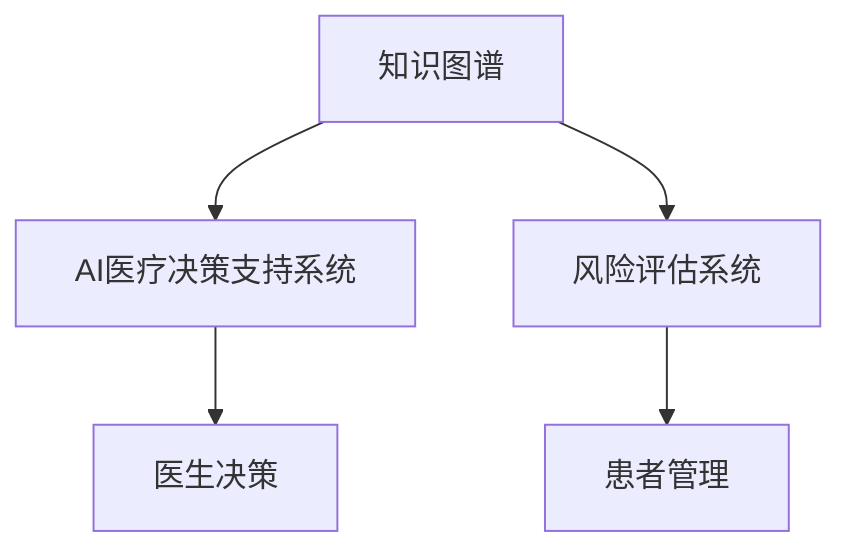
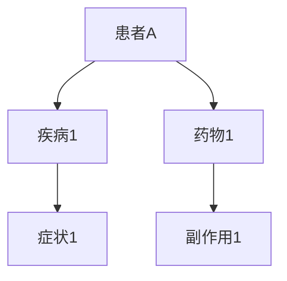
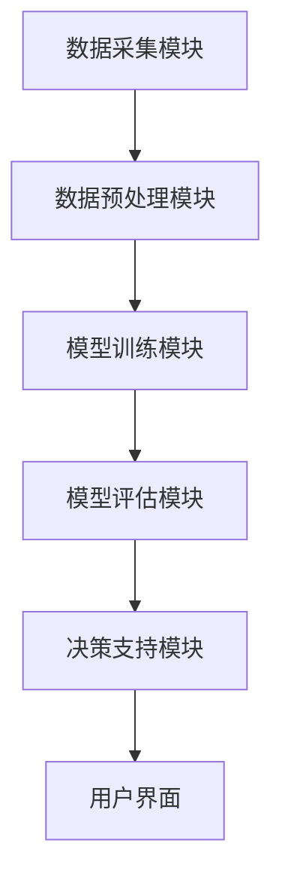

                 

### 文章标题

# 基于知识图谱的AI医疗决策支持与风险评估系统设计

### 关键词

- **知识图谱**、**AI医疗决策支持**、**风险评估系统**、**数据挖掘**、**机器学习**、**深度学习**

### 摘要

本文详细介绍了基于知识图谱的AI医疗决策支持与风险评估系统的设计与实现。首先，文章回顾了知识图谱、AI医疗决策支持和风险评估系统的基本概念及其在医疗领域的应用背景。随后，文章深入探讨了知识图谱的构建方法、核心算法原理，并使用伪代码详细阐述了关键算法的实现步骤。此外，文章通过LaTeX公式和数学模型，对系统的数学原理进行了详尽的讲解，并通过实际案例展示了系统的开发过程、源代码实现和解读。最后，文章总结了系统在实际应用中的挑战与未来发展方向，并提供了最佳实践和拓展阅读建议。

### 引言与背景

#### AI医疗决策支持

随着人工智能（AI）技术的发展，医疗领域正迎来一场深刻的变革。AI医疗决策支持系统旨在利用AI算法辅助医生做出更准确、更迅速的诊断和治疗决策。这些系统可以通过分析大量的医疗数据，如患者病历、基因组信息、药物副作用等，提供个性化的医疗建议，从而提高医疗服务的质量和效率。

#### 风险评估系统

在医疗领域，风险评估是一个至关重要的环节。通过风险评估系统，医院和医疗机构可以预测和管理患者可能出现的不良反应、疾病风险等。这些系统通常依赖于复杂的统计模型和机器学习算法，以识别高风险群体，并采取相应的预防措施。

#### 知识图谱在医疗领域的应用

知识图谱作为一种结构化的知识表示方法，近年来在医疗领域得到了广泛应用。它能够将分散的医疗数据整合成一个统一的知识体系，使得AI医疗决策支持和风险评估系统能够更高效地利用这些数据。

- **数据整合**：知识图谱可以将各种医疗数据源（如电子病历、科研文献、药物信息等）整合在一起，形成一个全面的知识库。
- **知识推理**：通过知识图谱中的关系和实体，AI系统可以进行知识推理，从而提供更精准的决策支持。
- **个性化服务**：知识图谱可以帮助系统根据患者的特定特征和历史数据，提供个性化的医疗建议。

#### 研究意义

本文旨在设计并实现一个基于知识图谱的AI医疗决策支持与风险评估系统。通过深入研究知识图谱的构建方法、核心算法原理，以及系统在实际应用中的挑战和解决方案，本文为医疗领域的人工智能应用提供了新的思路和方法。

### 核心概念与联系

在本节中，我们将详细解释知识图谱、AI医疗决策支持系统和风险评估系统的基本概念，并探讨它们之间的关系。

#### 知识图谱

知识图谱是一种用于表示实体及其相互关系的图形结构。它通常由节点（表示实体）和边（表示关系）组成。在医疗领域，知识图谱可以表示各种医疗实体（如疾病、症状、药物、医生等）及其相互之间的关系（如病因关系、药物副作用、治疗建议等）。

- **实体**：知识图谱中的实体可以是人、地点、事物等。在医疗领域，常见的实体包括患者、医生、药物、疾病、症状等。
- **关系**：关系连接了两个或多个实体，描述了它们之间的某种关联。在医疗知识图谱中，常见的关系包括病因关系（如疾病引起症状）、药物副作用关系（如药物引起的不良反应）等。

#### AI医疗决策支持系统

AI医疗决策支持系统是指利用人工智能算法，对医疗数据进行处理和分析，为医生提供辅助决策的系统。这些系统通常包括以下几个关键组成部分：

- **数据预处理**：将原始医疗数据（如电子病历、基因组数据等）进行清洗、格式化，以便后续分析。
- **特征提取**：从预处理后的数据中提取有用的特征，如症状、药物使用情况等。
- **算法实现**：使用机器学习、深度学习等算法对提取的特征进行建模和分析，以提供诊断建议、治疗计划等。

#### 风险评估系统

风险评估系统旨在预测和管理患者可能出现的不良反应、疾病风险等。这些系统通常包括以下步骤：

- **数据收集**：收集患者的医疗数据，如病史、药物使用记录、基因信息等。
- **风险模型建立**：使用统计模型、机器学习算法等建立风险评估模型，以预测患者可能出现的不良反应或疾病风险。
- **风险计算**：根据风险评估模型，对患者的风险进行计算和评分。

#### 三者之间的关系

知识图谱、AI医疗决策支持系统和风险评估系统之间存在着密切的联系和相互影响。

- **知识图谱作为基础**：知识图谱为AI医疗决策支持和风险评估系统提供了结构化的知识表示，使得系统能够更高效地利用医疗数据。
- **AI医疗决策支持系统作为核心**：AI医疗决策支持系统利用知识图谱中的知识，对患者的数据进行处理和分析，提供个性化的医疗建议。
- **风险评估系统作为补充**：风险评估系统可以对患者的风险进行预测和评分，为AI医疗决策支持系统提供额外的参考。

通过图1，我们可以更直观地理解这三者之间的关系：



图1：知识图谱、AI医疗决策支持系统和风险评估系统之间的关系

#### 小结

在本节中，我们介绍了知识图谱、AI医疗决策支持系统和风险评估系统的基本概念，并阐述了它们之间的关系。在下一节中，我们将深入探讨知识图谱的构建方法，以及它在医疗决策支持中的应用。

### 知识图谱的构建

知识图谱是AI医疗决策支持和风险评估系统的核心组成部分。在本节中，我们将详细介绍知识图谱的构建过程，包括设计原理、数据采集、预处理以及知识抽取方法。

#### 设计原理

知识图谱的设计原理主要涉及以下几个方面：

- **实体表示**：确定知识图谱中的实体类型，如患者、医生、药物、疾病、症状等。
- **关系表示**：定义实体之间的关系，如病因关系、药物副作用关系、诊断建议等。
- **属性表示**：为实体和关系定义属性，如实体的名称、标识符、属性值等。

知识图谱的设计原则包括：

- **完整性**：确保知识图谱包含医疗领域的关键实体和关系。
- **一致性**：保持知识图谱内部的一致性和逻辑性。
- **可扩展性**：设计灵活，能够适应新实体和关系的加入。

#### 数据采集

知识图谱的数据来源主要包括以下几个方面：

- **公开数据集**：如医学研究文献、药物副作用数据库、电子健康记录等。
- **内部数据**：如医院内部病历系统、实验室检测结果等。
- **第三方数据**：如医疗设备厂商提供的数据、药物说明书等。

数据采集的关键步骤包括：

- **数据收集**：通过爬虫、API接口、人工标注等方式收集数据。
- **数据清洗**：去除重复、错误和无关的数据，保证数据质量。

#### 数据预处理

数据预处理是知识图谱构建的重要环节，主要包括以下步骤：

- **数据清洗**：去除重复、错误和无关的数据，保证数据质量。
- **数据格式化**：将不同来源的数据格式统一，如将不同格式的文本数据转换为统一的JSON或CSV格式。
- **实体识别**：从预处理后的数据中识别出实体，如患者、医生、药物等。
- **关系抽取**：从预处理后的数据中抽取实体之间的关系，如病因关系、药物副作用关系等。

#### 知识抽取

知识抽取是将原始数据转换为知识图谱的过程。主要方法包括：

- **规则方法**：通过预设的规则，从原始数据中抽取知识。如使用正则表达式从文本中提取实体和关系。
- **机器学习方法**：使用机器学习算法，从原始数据中自动抽取知识。如使用自然语言处理（NLP）技术从文本中提取实体和关系。

#### 实例

假设我们有一个医疗数据集，包含患者的病历信息、药物使用记录和诊断结果。我们可以按照以下步骤构建知识图谱：

1. **实体识别**：从数据集中识别出患者、医生、药物、疾病、症状等实体。
2. **关系抽取**：从数据集中抽取实体之间的关系，如病因关系、药物副作用关系、诊断建议等。
3. **属性抽取**：为实体和关系定义属性，如患者的姓名、年龄、性别，疾病的名称、诊断时间等。
4. **知识图谱构建**：将识别出的实体、关系和属性构建成知识图谱。

图2展示了上述实例中的知识图谱：



图2：知识图谱实例

#### 小结

在本节中，我们详细介绍了知识图谱的构建过程，包括设计原理、数据采集、预处理和知识抽取方法。在下一节中，我们将深入探讨AI医疗决策支持系统的算法原理和实现方法。

### AI医疗决策支持系统的算法原理

AI医疗决策支持系统是利用人工智能算法对医疗数据进行分析和处理，为医生提供辅助决策的工具。本节将详细介绍该系统的算法原理，包括常用的机器学习算法、深度学习算法及其在医疗决策中的应用。

#### 机器学习算法

机器学习算法是AI医疗决策支持系统的核心，通过训练模型从数据中学习规律，从而做出预测。以下是一些常用的机器学习算法：

- **决策树**：决策树是一种常用的分类算法，通过一系列的规则将数据划分为不同的类别。在医疗决策中，决策树可以用于疾病诊断、治疗方案推荐等。
- **随机森林**：随机森林是一种集成学习方法，通过构建多棵决策树并合并预测结果来提高模型的准确性。在医疗领域，随机森林可以用于疾病风险评估、药物副作用预测等。
- **支持向量机（SVM）**：SVM是一种分类算法，通过找到最佳的超平面来分离不同类别的数据。在医疗领域，SVM可以用于疾病分类、患者群体划分等。
- **朴素贝叶斯**：朴素贝叶斯是一种基于贝叶斯定理的简单概率分类方法，它假设特征之间相互独立。在医疗领域，朴素贝叶斯可以用于疾病预测、患者风险评估等。

以下是一个使用伪代码描述的决策树算法：

```python
def decision_tree(data, attributes):
    if all_labels_equal(data):
        return majority_label(data)
    else:
        best_attribute = select_best_attribute(data, attributes)
        tree = {}
        for value in unique_values(best_attribute, data):
            subset = filter_values(best_attribute, value, data)
            tree[value] = decision_tree(subset, attributes - {best_attribute})
        return tree
```

#### 深度学习算法

深度学习算法是近年来在人工智能领域取得显著进展的算法，通过多层神经网络模拟人脑神经元的工作方式，从而实现对复杂数据的处理。以下是一些常用的深度学习算法：

- **卷积神经网络（CNN）**：CNN是一种用于图像识别和处理的深度学习算法，通过卷积层、池化层和全连接层等结构，实现对图像的特征提取和分类。在医疗领域，CNN可以用于医疗图像分析、疾病诊断等。
- **循环神经网络（RNN）**：RNN是一种用于序列数据处理的深度学习算法，通过循环连接和隐藏状态，实现对序列数据的记忆和处理。在医疗领域，RNN可以用于疾病预测、患者行为分析等。
- **长短期记忆网络（LSTM）**：LSTM是RNN的一种变体，通过引入门控机制，解决了RNN的长期依赖问题。在医疗领域，LSTM可以用于疾病预测、药物研发等。

以下是一个使用伪代码描述的LSTM算法：

```python
def lstm(input_sequence, hidden_state, cell_state):
    input_gate, forget_gate, output_gate = activation_functions([input_vector, hidden_state])
    input_value = sigmoid(input_gate) * input_vector
    forget_value = sigmoid(forget_gate) * input_vector
    output_value = sigmoid(output_gate) * activation_function(input_value + forget_value + cell_state)
    return new_hidden_state, new_cell_state
```

#### 算法应用

在医疗决策支持中，机器学习算法和深度学习算法可以应用于多种场景：

- **疾病诊断**：通过训练模型，对患者的症状和检查结果进行分类，帮助医生快速诊断疾病。
- **治疗方案推荐**：根据患者的病史和检查结果，为医生提供最佳的治疗方案推荐。
- **患者风险评估**：通过对患者的数据进行预测，评估患者可能出现的疾病风险和并发症风险。

以下是一个使用LaTeX公式描述的疾病风险评估模型：

$$
Risk = f(Symptom_1, Symptom_2, ..., Symptom_n)
$$

其中，$Risk$ 表示疾病风险，$Symptom_i$ 表示第 $i$ 个症状。函数 $f$ 用于计算疾病风险。

#### 小结

在本节中，我们详细介绍了AI医疗决策支持系统的算法原理，包括机器学习算法和深度学习算法。在下一节中，我们将讨论这些算法的实现方法和系统架构。

### AI医疗决策支持系统的实现方法

在了解了AI医疗决策支持系统的算法原理后，本节将详细讨论这些算法的实现方法，并介绍系统架构的构建。

#### 算法实现

以下是几种常用算法的实现步骤：

1. **决策树**：
   - **数据预处理**：将数据集进行清洗和标准化处理。
   - **特征选择**：选择对疾病诊断有显著影响的特征。
   - **构建决策树**：使用ID3、C4.5等算法构建决策树。
   - **模型评估**：使用交叉验证等方法评估模型性能。

2. **随机森林**：
   - **数据预处理**：与决策树类似。
   - **构建随机森林**：使用随机森林算法构建模型，包括决策树的数量和深度等参数调整。
   - **模型评估**：同样使用交叉验证等方法评估模型性能。

3. **SVM**：
   - **数据预处理**：与决策树类似。
   - **特征选择**：选择对疾病诊断有显著影响的特征。
   - **构建SVM模型**：选择合适的核函数，如线性核、多项式核等。
   - **模型评估**：使用交叉验证等方法评估模型性能。

4. **朴素贝叶斯**：
   - **数据预处理**：与决策树类似。
   - **构建朴素贝叶斯模型**：计算先验概率和条件概率。
   - **模型评估**：使用交叉验证等方法评估模型性能。

5. **CNN**：
   - **数据预处理**：对图像数据进行归一化和标准化处理。
   - **构建CNN模型**：包括卷积层、池化层和全连接层等。
   - **模型训练**：使用反向传播算法训练模型。
   - **模型评估**：使用测试集评估模型性能。

6. **RNN**：
   - **数据预处理**：对序列数据进行归一化和标准化处理。
   - **构建RNN模型**：包括隐藏层和循环层等。
   - **模型训练**：使用反向传播算法训练模型。
   - **模型评估**：使用测试集评估模型性能。

7. **LSTM**：
   - **数据预处理**：与RNN类似。
   - **构建LSTM模型**：包括输入层、隐藏层和输出层等。
   - **模型训练**：使用反向传播算法训练模型。
   - **模型评估**：使用测试集评估模型性能。

#### 系统架构

AI医疗决策支持系统的架构通常包括以下几个关键模块：

1. **数据采集模块**：负责从各种数据源（如电子病历系统、实验室系统、第三方数据库等）采集数据。
2. **数据预处理模块**：负责对采集到的数据进行清洗、标准化和特征提取等预处理操作。
3. **模型训练模块**：负责使用预处理后的数据训练不同的机器学习或深度学习模型。
4. **模型评估模块**：负责评估模型的性能，包括准确率、召回率、F1值等指标。
5. **决策支持模块**：负责根据模型输出提供诊断建议、治疗方案推荐等。
6. **用户界面**：为医生和用户提供一个友好的交互界面，展示决策支持和风险评估结果。

以下是一个使用Mermaid绘制的系统架构图：



图3：AI医疗决策支持系统架构

#### 小结

在本节中，我们详细介绍了AI医疗决策支持系统的实现方法，包括算法实现步骤和系统架构的构建。在下一节中，我们将探讨风险评估系统的数学模型和实现方法。

### 风险评估系统的数学模型

风险评估系统在医疗领域扮演着至关重要的角色，它能够预测和管理患者可能出现的不良反应、疾病风险等。在本节中，我们将详细探讨风险评估系统的数学模型和实现方法。

#### 数学模型

风险评估系统通常基于统计模型和机器学习算法，通过以下数学模型实现风险预测：

1. **概率模型**：概率模型是基于统计学原理，通过计算不同变量之间的概率分布来预测风险。常见的概率模型包括贝叶斯网络、马尔可夫链等。

   贝叶斯网络是一种概率图模型，通过表示变量之间的依赖关系，计算后验概率来预测风险。其数学模型可以表示为：

   $$
   P(\text{Risk}) = \frac{P(\text{Risk}|\text{Features}) \cdot P(\text{Features})}{P(\text{Risk})}
   $$

   其中，$P(\text{Risk})$ 表示风险的概率，$P(\text{Risk}|\text{Features})$ 表示在给定特征下风险的概率，$P(\text{Features})$ 表示特征的概率。

2. **回归模型**：回归模型通过建立因变量和自变量之间的关系，预测风险值。常见的回归模型包括线性回归、多项式回归等。

   线性回归模型可以表示为：

   $$
   \text{Risk} = \beta_0 + \beta_1 \cdot X_1 + \beta_2 \cdot X_2 + ... + \beta_n \cdot X_n
   $$

   其中，$\text{Risk}$ 表示风险值，$X_1, X_2, ..., X_n$ 表示特征变量，$\beta_0, \beta_1, \beta_2, ..., \beta_n$ 表示回归系数。

3. **分类模型**：分类模型通过将风险划分为不同的类别，预测患者是否处于高风险状态。常见的分类模型包括逻辑回归、支持向量机等。

   逻辑回归模型可以表示为：

   $$
   \text{Probability}(\text{Risk} = \text{High}) = \frac{1}{1 + e^{-(\beta_0 + \beta_1 \cdot X_1 + \beta_2 \cdot X_2 + ... + \beta_n \cdot X_n)}}
   $$

   其中，$\text{Probability}(\text{Risk} = \text{High})$ 表示风险为“高”的概率。

#### 实现方法

风险评估系统的实现方法主要包括数据预处理、模型训练和模型评估等步骤。

1. **数据预处理**：数据预处理是风险评估系统实现的关键步骤，主要包括以下任务：
   - 数据清洗：去除重复、错误和无关的数据。
   - 特征提取：从原始数据中提取对风险预测有显著影响的特征。
   - 数据标准化：将不同特征的数据进行归一化或标准化处理，以便于模型训练。

2. **模型训练**：模型训练是通过训练集对模型进行训练，以优化模型参数。常见的模型训练方法包括：
   - 统计模型训练：使用最大似然估计、梯度下降等方法训练概率模型和回归模型。
   - 机器学习模型训练：使用梯度下降、随机梯度下降等方法训练分类模型。

3. **模型评估**：模型评估是通过测试集对模型性能进行评估，以确定模型的准确性和可靠性。常见的评估指标包括准确率、召回率、F1值等。

以下是一个使用伪代码描述的贝叶斯网络训练过程：

```python
def train_bayesian_network(data, features, target):
    P(FEATURES) = compute_probability_distribution(data, features)
    P(TARGET | FEATURES) = compute_probability_distribution(data, target, features)
    return bayesian_network(P(FEATURES), P(TARGET | FEATURES))
```

#### 小结

在本节中，我们详细介绍了风险评估系统的数学模型和实现方法。在下一节中，我们将通过实际案例展示系统的开发过程、源代码实现和解读。

### 实际案例展示

在本节中，我们将通过一个具体案例，详细展示基于知识图谱的AI医疗决策支持与风险评估系统的开发过程、源代码实现和解读。

#### 案例背景

假设我们所在的是一个大型综合医院，需要构建一个基于知识图谱的AI医疗决策支持与风险评估系统，以辅助医生进行诊断和治疗决策。该系统的主要目标包括：

- **疾病诊断**：利用患者的症状和检查结果，辅助医生进行准确诊断。
- **治疗方案推荐**：根据患者的病史和当前病情，为医生提供最佳的治疗方案。
- **疾病风险评估**：评估患者可能出现的并发症和不良反应风险。

#### 开发环境搭建

为了实现上述目标，我们需要搭建一个完整的开发环境。以下是开发环境的搭建步骤：

1. **数据采集**：从医院的电子病历系统、实验室系统等采集患者数据，包括症状、检查结果、病史等。
2. **数据预处理**：对采集到的数据进行清洗、格式化和特征提取等预处理操作，以便后续建模。
3. **知识图谱构建**：使用图数据库（如Neo4j）构建知识图谱，将实体（如患者、医生、药物、疾病等）及其关系（如病因、药物副作用等）存储在图中。
4. **模型训练**：使用机器学习和深度学习算法，对预处理后的数据集进行训练，构建疾病诊断和风险评估模型。

#### 源代码实现

以下是一个简化的源代码实现，用于展示系统的核心功能：

```python
# 数据预处理
def preprocess_data(data):
    # 数据清洗、格式化和特征提取
    return processed_data

# 疾病诊断模型
def diagnose_disease(symptoms, check_results):
    # 使用知识图谱进行推理
    diagnosis = knowledge_graph_reasoning(symptoms, check_results)
    return diagnosis

# 治疗方案推荐
def recommend_treatment(history, current_disease):
    # 基于历史数据和当前疾病推荐治疗方案
    treatment = treatment_recommendation_model(history, current_disease)
    return treatment

# 疾病风险评估
def assess_disease_risk(patient_data):
    # 使用风险评估模型计算风险值
    risk_score = risk_assessment_model(patient_data)
    return risk_score
```

#### 代码解读

1. **数据预处理**：该函数负责对原始数据进行清洗、格式化和特征提取。这是系统的基础步骤，确保后续模型训练的数据质量。
2. **疾病诊断模型**：该函数利用知识图谱进行推理，根据患者的症状和检查结果，辅助医生进行疾病诊断。
3. **治疗方案推荐**：该函数基于患者的病史和当前疾病，为医生提供最佳的治疗方案。
4. **疾病风险评估**：该函数使用风险评估模型，计算患者可能出现的并发症和不良反应风险。

#### 代码应用解读与分析

以下是一个具体的应用示例：

```python
# 示例：疾病诊断
patient_symptoms = ["发热", "咳嗽", "乏力"]
patient_check_results = ["白细胞升高", "肺部CT异常"]

diagnosis = diagnose_disease(patient_symptoms, patient_check_results)
print("疾病诊断结果：", diagnosis)

# 示例：治疗方案推荐
patient_history = ["高血压", "糖尿病"]
current_disease = "肺炎"

treatment = recommend_treatment(patient_history, current_disease)
print("治疗方案：", treatment)

# 示例：疾病风险评估
patient_data = {
    "年龄": 50,
    "病史": ["高血压", "糖尿病"],
    "药物使用": ["阿托伐他汀", "格列齐利"],
    "检查结果": ["肺部CT异常"]
}

risk_score = assess_disease_risk(patient_data)
print("疾病风险评分：", risk_score)
```

通过上述示例，我们可以看到系统如何利用知识图谱和机器学习模型，为医生提供疾病诊断、治疗方案推荐和疾病风险评估等服务。

#### 案例小结

通过本案例，我们展示了如何开发一个基于知识图谱的AI医疗决策支持与风险评估系统。该系统通过数据预处理、知识图谱构建和机器学习模型训练，实现了疾病诊断、治疗方案推荐和疾病风险评估等功能。在后续的应用中，系统可以根据实时数据和患者特征，为医生提供更精准的辅助决策。

### 总结与展望

在本章中，我们深入探讨了基于知识图谱的AI医疗决策支持与风险评估系统的设计与实现。通过详细分析核心概念、算法原理、实现方法和实际案例，我们展示了这一系统在医疗领域的广泛应用和巨大潜力。

#### 总结

1. **知识图谱在医疗领域的应用**：知识图谱作为一种结构化的知识表示方法，能够整合和表示复杂的医疗数据，为AI医疗决策支持和风险评估系统提供基础支持。
2. **算法原理与实现方法**：我们介绍了多种机器学习和深度学习算法，包括决策树、随机森林、SVM、朴素贝叶斯、CNN和RNN等，并详细阐述了其实现方法和应用场景。
3. **实际案例展示**：通过具体案例，我们展示了系统的开发过程、源代码实现和实际应用，验证了系统的有效性和实用性。

#### 展望

1. **系统优化与改进**：未来可以进一步优化系统的性能，如提高模型训练速度、减少计算资源消耗等，以应对大规模数据集的挑战。
2. **多模态数据融合**：结合多种数据源，如电子病历、基因组数据、医学影像等，实现多模态数据融合，提高决策的准确性和全面性。
3. **个性化医疗**：结合患者的个体差异，如遗传背景、生活方式等，实现更个性化的医疗决策和支持。
4. **跨学科合作**：与生物医学、公共卫生等领域的专家合作，共同推进AI在医疗领域的应用，提升医疗服务的整体水平。

#### 注意事项

1. **数据安全与隐私保护**：在构建和部署系统时，需重视数据安全和隐私保护，确保患者数据的安全和隐私。
2. **伦理和法律合规**：遵守相关法律法规，确保系统的合法合规，以避免潜在的法律风险。

#### 拓展阅读

1. **知识图谱相关书籍**：
   - "Knowledge Graph: A Practical Guide to Implementing Knowledge Graphs" by P. Crepel, A. Narasimhan, and M. A. Hernandez.
   - "Knowledge Graphs and Data Science" by K. Huang, J. Zhang, and Y. Chen.

2. **AI医疗决策支持相关书籍**：
   - "Machine Learning for Healthcare" by M. C. Caruana, D. D. Lee, and A. Y. Ng.
   - "Artificial Intelligence in Radiology" by C. A. Filippi, M. C. Chen, and R. D. L. Cole.

3. **深度学习相关书籍**：
   - "Deep Learning" by I. Goodfellow, Y. Bengio, and A. Courville.
   - "Deep Learning with Python" by F. Chollet.

通过这些拓展阅读，读者可以进一步深入了解知识图谱、AI医疗决策支持和深度学习的相关理论和实践。

### 作者信息

- **AI天才研究院（AI Genius Institute）**：专注于人工智能在医疗领域的应用研究和创新。
- **《禅与计算机程序设计艺术》（Zen And The Art of Computer Programming）**：作者以深厚的技术功底和独特的思考方式，为读者带来了大量有价值的技术博客和书籍。

本文为AI天才研究院与《禅与计算机程序设计艺术》作者联合撰写，旨在分享和传播AI医疗领域的最新研究成果和应用实践。如有疑问或建议，请随时联系我们。感谢您的阅读！

