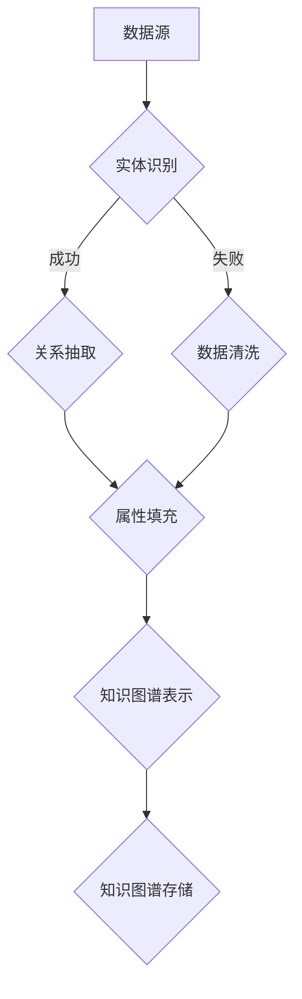

                 


### 第一步：确定书籍主题和目标读者

首先，我们需要明确书籍的主题和目标读者。《基于知识图谱的AI医疗诊断可解释性增强系统设计》这一书名清晰地表明了书籍的核心主题：基于知识图谱的AI医疗诊断系统的可解释性增强设计。这样的主题对于医疗领域的研究者、工程师以及那些对AI医疗诊断感兴趣的专业人士来说，具有很高的实用性和吸引力。

- **主题定位**：这本书主要讨论的知识图谱和AI医疗诊断是两个前沿的技术领域，它们在医疗行业的应用正日益受到关注。因此，主题定位明确，针对的是对这两个领域有一定了解，并希望深入了解其结合应用的研究者和工程师。
  
- **目标读者**：目标读者主要包括：
  1. **医疗领域的研究者**：他们通常对医疗数据、生物信息学等领域有深入研究，希望了解如何利用AI和知识图谱技术提升医疗诊断的效率和质量。
  2. **医疗工程师**：这些工程师可能已经在医疗领域工作，希望将AI和知识图谱技术应用到医疗诊断系统中。
  3. **对AI医疗诊断感兴趣的专业人士**：包括数据科学家、软件工程师等，他们希望了解AI医疗诊断的原理和实现方式。

### 第二步：大纲结构规划

根据书籍的主题和目标读者，我们需要规划一个逻辑清晰、结构紧凑的大纲，确保读者可以系统地学习相关知识。

- **引言**：介绍研究的背景和意义，明确书籍的目标和结构。
- **知识图谱基础**：详细讲解知识图谱的基本概念、组成和表示方法。
- **AI医疗诊断概述**：介绍AI在医疗诊断中的应用现状和重要性。
- **可解释性增强算法原理**：讨论可解释性增强的核心概念、常见方法和与知识图谱的结合。
- **系统架构设计**：描述系统架构，包括数据采集与预处理、知识图谱构建和可解释性增强模块设计。
- **算法原理与实现**：深入讲解算法原理，使用伪代码和数学公式进行详细阐述。
- **项目实战**：通过一个实际项目，展示系统设计、开发环境搭建、源代码实现和解读。
- **总结与展望**：对全书内容进行总结，并展望未来的研究方向和发展趋势。

### 第三步：大纲细化

在规划好大纲结构后，我们需要对每个章节进行细化，明确每个章节的学习目标和内容要点。

- **第1章 引言**：明确书籍的研究背景、目标读者和学习目标。
- **第2章 知识图谱基础**：详细讲解知识图谱的概念、组成和表示方法。
- **第3章 AI医疗诊断概述**：介绍AI在医疗诊断中的应用现状和重要性。
- **第4章 可解释性增强算法原理**：讨论可解释性增强的核心概念、常见方法和与知识图谱的结合。
- **第5章 系统架构设计**：描述系统架构，包括数据采集与预处理、知识图谱构建和可解释性增强模块设计。
- **第6章 算法原理与实现**：深入讲解算法原理，使用伪代码和数学公式进行详细阐述。
- **第7章 项目实战**：通过一个实际项目，展示系统设计、开发环境搭建、源代码实现和解读。
- **第8章 总结与展望**：对全书内容进行总结，并展望未来的研究方向和发展趋势。

### 第四步：Mermaid流程图设计

为了直观地展示知识图谱和系统架构，我们可以使用Mermaid流程图来表示核心概念和算法原理。

- **知识图谱表示**：使用Mermaid图来展示知识图谱的基本结构和数据流动。
- **系统架构流程图**：描述系统从数据采集到诊断结果生成的整个流程。

### 第五步：伪代码与数学公式

为了深入讲解算法原理，我们需要编写详细的伪代码和数学公式，并对其进行详细讲解和举例说明。

- **伪代码**：使用伪代码来描述算法的核心步骤和逻辑。
- **数学公式**：使用LaTeX格式来表示数学模型和相关公式，并进行详细解释。

### 第六步：项目实战

为了使读者更好地理解理论知识，我们需要设计一个实际项目，详细讲解系统设计、开发环境搭建、源代码实现和解读，以及案例分析。

- **实战背景**：介绍项目的背景和目标。
- **开发环境搭建**：详细描述搭建项目所需的环境和工具。
- **源代码实现与解读**：展示项目的核心代码，并对其进行详细解读。
- **案例分析**：通过实际案例，分析项目在实际应用中的效果和挑战。

### 第七步：总结与展望

在文章的结尾部分，我们需要对全书内容进行总结，并展望未来的研究方向和发展趋势。

- **全书总结**：回顾书籍的主要内容和学习目标。
- **研究方向展望**：提出未来可能的研究方向和热点问题。
- **未来发展趋势**：分析AI医疗诊断可解释性增强技术的发展趋势和应用前景。

### 第八步：大纲审查与修改

完成初稿后，我们需要对大纲进行审查和修改，确保内容完整、逻辑清晰、语言简洁。

- **审查**：检查每个章节的内容是否符合预期，逻辑是否连贯。
- **修改**：对内容进行必要的调整，确保文章的质量和可读性。

以上是《基于知识图谱的AI医疗诊断可解释性增强系统设计》书籍大纲的初步规划，接下来我们将根据这个大纲进行详细的内容撰写。希望这个规划能够帮助我们撰写出一篇高质量、逻辑清晰、对读者有深刻启发的技术博客文章。 ### 第一步：确定书籍主题和目标读者

#### 研究背景与意义

在当今信息化和大数据的时代，医疗行业正经历着前所未有的变革。随着人工智能（AI）技术的飞速发展，越来越多的医疗诊断任务开始利用AI技术来实现自动化和智能化。然而，AI在医疗领域的应用并不止步于算法的准确性，更重要的是其可解释性。医疗诊断涉及到患者的生命健康，诊断结果的准确性和可解释性直接关系到治疗效果和患者信任。

知识图谱作为一种语义网络，能够将大量零散的数据和知识有机地组织起来，提供了一种高效的信息检索和推理机制。近年来，知识图谱在医疗领域得到了广泛关注，尤其在疾病诊断、药物研发、个性化治疗等方面展现了巨大的潜力。知识图谱不仅可以提供丰富的背景知识，还可以提高AI模型的可解释性，使得医疗诊断结果更加透明和可信。

可解释性是AI医疗诊断系统中的一个关键问题。传统AI模型，如深度学习模型，虽然在诊断准确率上取得了显著成果，但其内部决策过程往往是不透明的。这导致医生和患者难以理解模型的决策依据，从而影响了医疗决策的信任度和接受度。因此，如何在AI医疗诊断系统中实现可解释性增强，成为了一个亟待解决的研究课题。

本书《基于知识图谱的AI医疗诊断可解释性增强系统设计》旨在探讨如何利用知识图谱技术提高AI医疗诊断系统的可解释性。通过系统地介绍知识图谱的基础知识、AI医疗诊断的背景和现状、可解释性增强的核心概念和方法，以及具体的系统架构设计和实现，本书将为读者提供一个全面而深入的指导，帮助他们理解和应用这一前沿技术。

#### 书籍结构概述

本书的结构分为八个主要章节，各章节内容如下：

- **第1章 引言**：介绍研究的背景、意义、书籍的目标读者和学习目标。
- **第2章 知识图谱基础**：讲解知识图谱的基本概念、组成和表示方法。
- **第3章 AI医疗诊断概述**：介绍AI在医疗诊断中的应用现状和重要性。
- **第4章 可解释性增强算法原理**：讨论可解释性增强的核心概念、常见方法和与知识图谱的结合。
- **第5章 系统架构设计**：描述系统架构，包括数据采集与预处理、知识图谱构建和可解释性增强模块设计。
- **第6章 算法原理与实现**：深入讲解算法原理，使用伪代码和数学公式进行详细阐述。
- **第7章 项目实战**：通过一个实际项目，展示系统设计、开发环境搭建、源代码实现和解读。
- **第8章 总结与展望**：对全书内容进行总结，并展望未来的研究方向和发展趋势。

通过这些章节的逐一探讨，本书将带领读者系统性地了解基于知识图谱的AI医疗诊断可解释性增强系统的设计原理和实现方法。

#### 目标读者

本书的目标读者主要包括以下几类人群：

1. **医疗领域的研究者**：这些读者可能已经在医疗数据、生物信息学等领域有一定的研究背景，他们希望通过本书了解如何利用AI和知识图谱技术提升医疗诊断的效率和准确性。

2. **医疗工程师**：这些工程师通常在医疗设备、信息系统等领域有丰富的实践经验，他们希望将AI和知识图谱技术应用到实际的医疗诊断系统中，提高诊断质量和用户体验。

3. **数据科学家**：这些读者可能在机器学习、数据挖掘等领域有深厚的理论基础，他们希望了解如何将理论知识应用到医疗诊断场景中，解决实际的问题。

4. **软件工程师**：这些工程师在软件开发领域有丰富的经验，他们希望通过本书学习如何设计并实现基于知识图谱的AI医疗诊断系统，为医疗行业提供技术支持。

通过阅读本书，目标读者不仅可以系统地掌握基于知识图谱的AI医疗诊断可解释性增强系统设计的相关知识，还可以获得实际项目开发的经验，从而为未来的研究和工作打下坚实的基础。

### 第二步：大纲结构规划

在明确了书籍主题和目标读者之后，接下来我们需要对大纲进行结构规划，确保书籍内容系统、逻辑清晰，能够满足目标读者的学习需求。以下是详细的大纲结构规划：

#### 第1章 引言

**1.1 研究背景与意义**

- 介绍医疗行业在信息化和大数据时代面临的挑战和机遇。
- 指出AI技术在医疗诊断中的重要作用及其面临的可解释性问题。

**1.2 书籍结构概述**

- 简要介绍全书各章节的内容和结构。
- 阐述书籍的学习目标和对读者的期望。

**1.3 目标读者**

- 描述本书的主要读者群体及其需求。
- 强调本书对不同专业背景读者的适用性和帮助。

#### 第2章 知识图谱基础

**2.1 知识图谱的概念**

- 定义知识图谱及其在信息检索和推理中的作用。
- 介绍知识图谱与语义网络的关系。

**2.2 知识图谱的组成**

- 详细讲解知识图谱中的实体、关系和属性。
- 分析不同类型知识图谱的特点和应用场景。

**2.3 知识图谱的表示与存储**

- 讨论知识图谱的常见表示方法，如图边表示、RDF表示等。
- 介绍知识图谱的存储机制和数据管理策略。

#### 第3章 AI医疗诊断概述

**3.1 医疗诊断的现状**

- 分析当前医疗诊断技术的发展水平和应用现状。
- 指出传统医疗诊断方法的局限性和不足。

**3.2 AI在医疗诊断中的应用**

- 介绍AI技术在医疗诊断中的具体应用，如图像识别、疾病预测等。
- 讨论AI在提升诊断准确性和效率方面的优势。

**3.3 可解释性增强的重要性**

- 解释AI医疗诊断中可解释性增强的必要性。
- 分析不透明诊断结果对医疗决策的影响。

#### 第4章 可解释性增强算法原理

**4.1 可解释性增强的核心概念**

- 定义可解释性及其在AI医疗诊断中的重要性。
- 介绍可解释性增强的目标和方法。

**4.2 常见可解释性增强方法**

- 概述常见的可解释性增强方法，如模型解释、可视化、决策树等。
- 分析这些方法的优缺点和适用场景。

**4.3 可解释性增强与知识图谱的结合**

- 阐述知识图谱在可解释性增强中的作用。
- 介绍结合知识图谱的常见可解释性增强方法。

#### 第5章 系统架构设计

**5.1 系统架构概述**

- 描述基于知识图谱的AI医疗诊断可解释性增强系统的整体架构。
- 分析系统的主要模块和功能。

**5.2 数据采集与预处理**

- 讨论数据采集的来源、方法和流程。
- 介绍数据预处理的关键步骤和技术。

**5.3 知识图谱构建**

- 阐述知识图谱构建的过程，包括实体识别、关系抽取和属性填充等。
- 分析知识图谱构建中的挑战和解决方案。

**5.4 可解释性增强模块设计**

- 描述可解释性增强模块的功能和实现方法。
- 分析模块在不同应用场景中的效果和适应性。

#### 第6章 算法原理与实现

**6.1 算法原理讲解**

- 详细讲解核心算法的原理，包括知识图谱的构建算法、可解释性增强算法等。
- 使用伪代码和流程图进行描述，使读者能够直观理解算法逻辑。

**6.2 伪代码与数学公式**

- 提供核心算法的伪代码实现。
- 使用LaTeX格式表示相关的数学模型和公式，并进行详细解释。

**6.3 举例说明**

- 通过具体例子，展示算法在实践中的应用和效果。
- 分析例子中的关键步骤和注意事项。

#### 第7章 项目实战

**7.1 实战背景**

- 介绍实际项目的背景、目标和挑战。
- 分析项目在医疗诊断中的应用场景和意义。

**7.2 开发环境搭建**

- 描述项目所需的开发环境和工具。
- 讲解环境搭建的步骤和注意事项。

**7.3 源代码实现与解读**

- 展示项目的核心代码实现，包括知识图谱构建、数据预处理和可解释性增强等模块。
- 对代码进行详细解读，解释关键部分的实现逻辑。

**7.4 案例分析**

- 通过实际案例，分析项目在不同场景中的应用效果。
- 讨论案例中的成功经验和挑战。

**7.5 项目小结**

- 总结项目的主要成果和经验教训。
- 提出对未来项目发展的建议。

#### 第8章 总结与展望

**8.1 全书总结**

- 回顾全书的主要内容和核心观点。
- 强调基于知识图谱的AI医疗诊断可解释性增强系统设计的重要性。

**8.2 研究方向展望**

- 提出未来可能的研究方向和热点问题。
- 分析知识图谱和AI医疗诊断领域的发展趋势。

**8.3 未来发展趋势**

- 展望基于知识图谱的AI医疗诊断可解释性增强系统在医疗行业的应用前景。
- 讨论技术创新对医疗诊断领域的潜在影响。

通过以上详细的章节规划，本书将为读者提供一个系统、全面、深入的学习路径，帮助他们掌握基于知识图谱的AI医疗诊断可解释性增强系统的设计原理和实践方法。 ### 第三步：大纲细化

在完成大纲结构的初步规划后，我们需要对每个章节进行细化，确保每个章节都有明确的要点和学习目标。以下是针对每个章节的细化内容：

#### 第1章 引言

**1.1 研究背景与意义**

- **学习目标**：理解医疗行业在信息化和大数据时代面临的挑战和机遇。
- **详细内容**：介绍医疗诊断的现状、AI技术的优势以及可解释性增强的必要性。通过具体案例，展示AI技术在医疗领域的应用场景和挑战。

**1.2 书籍结构概述**

- **学习目标**：熟悉书籍的整体结构和各章节的内容。
- **详细内容**：逐章介绍书籍的核心内容和学习目标，帮助读者规划学习路径。

**1.3 目标读者**

- **学习目标**：明确书籍的目标读者群体及其需求。
- **详细内容**：描述医疗领域的研究者、医疗工程师、数据科学家和软件工程师等读者群体，分析他们对本书的需求和期望。

#### 第2章 知识图谱基础

**2.1 知识图谱的概念**

- **学习目标**：理解知识图谱的定义及其在信息检索和推理中的作用。
- **详细内容**：解释知识图谱的基本概念，讨论知识图谱与语义网络的关系，通过图示展示知识图谱的基本结构。

**2.2 知识图谱的组成**

- **学习目标**：了解知识图谱中的实体、关系和属性的构成及其重要性。
- **详细内容**：详细讲解实体、关系和属性的概念，分析它们在知识图谱中的作用和应用。

**2.3 知识图谱的表示与存储**

- **学习目标**：掌握知识图谱的常见表示方法和存储策略。
- **详细内容**：介绍知识图谱的几种常见表示方法，如图边表示、RDF表示，以及知识图谱的存储机制和数据管理策略。

#### 第3章 AI医疗诊断概述

**3.1 医疗诊断的现状**

- **学习目标**：了解当前医疗诊断技术的发展水平和应用现状。
- **详细内容**：分析传统医疗诊断方法的局限性，介绍当前AI技术在医疗诊断中的应用场景，如疾病预测和诊断辅助。

**3.2 AI在医疗诊断中的应用**

- **学习目标**：掌握AI在医疗诊断中的具体应用和优势。
- **详细内容**：讨论AI技术如何提升医疗诊断的准确性和效率，通过实际案例展示AI在医疗诊断中的成功应用。

**3.3 可解释性增强的重要性**

- **学习目标**：理解AI医疗诊断中可解释性增强的必要性。
- **详细内容**：阐述不透明诊断结果对医疗决策的影响，讨论可解释性增强的重要性及其在提升医疗决策信任度和患者满意度方面的作用。

#### 第4章 可解释性增强算法原理

**4.1 可解释性增强的核心概念**

- **学习目标**：理解可解释性增强的基本概念和目标。
- **详细内容**：定义可解释性，解释其在AI医疗诊断中的重要性，讨论可解释性增强的目标和方法。

**4.2 常见可解释性增强方法**

- **学习目标**：掌握常见的可解释性增强方法及其优缺点。
- **详细内容**：介绍模型解释、可视化、决策树等常见可解释性增强方法，分析它们的优缺点和适用场景。

**4.3 可解释性增强与知识图谱的结合**

- **学习目标**：了解知识图谱在可解释性增强中的作用。
- **详细内容**：阐述知识图谱在可解释性增强中的应用，介绍结合知识图谱的常见可解释性增强方法，分析其效果和适应性。

#### 第5章 系统架构设计

**5.1 系统架构概述**

- **学习目标**：了解基于知识图谱的AI医疗诊断可解释性增强系统的整体架构。
- **详细内容**：描述系统的组成部分、功能模块及其相互关系，通过图示展示系统架构。

**5.2 数据采集与预处理**

- **学习目标**：掌握数据采集的来源和方法，了解数据预处理的关键步骤。
- **详细内容**：分析数据采集的途径、方法，介绍数据预处理的关键步骤和技术，如数据清洗、归一化和特征提取。

**5.3 知识图谱构建**

- **学习目标**：理解知识图谱构建的过程和挑战。
- **详细内容**：讲解知识图谱构建的步骤，包括实体识别、关系抽取和属性填充，分析知识图谱构建中的挑战和解决方案。

**5.4 可解释性增强模块设计**

- **学习目标**：掌握可解释性增强模块的设计原则和实现方法。
- **详细内容**：描述可解释性增强模块的功能和实现方法，分析其在不同应用场景中的效果和适应性。

#### 第6章 算法原理与实现

**6.1 算法原理讲解**

- **学习目标**：理解核心算法的原理和实现逻辑。
- **详细内容**：详细讲解知识图谱构建算法、可解释性增强算法等核心算法的原理，使用伪代码和流程图进行描述。

**6.2 伪代码与数学公式**

- **学习目标**：掌握核心算法的伪代码实现和数学模型。
- **详细内容**：提供核心算法的伪代码实现，使用LaTeX格式表示相关的数学模型和公式，并进行详细解释。

**6.3 举例说明**

- **学习目标**：通过实际例子，理解算法的应用和效果。
- **详细内容**：通过具体例子，展示算法在实践中的应用和效果，分析关键步骤和注意事项。

#### 第7章 项目实战

**7.1 实战背景**

- **学习目标**：了解实际项目的背景和目标。
- **详细内容**：介绍实际项目的背景、目标和挑战，分析项目在医疗诊断中的应用场景和意义。

**7.2 开发环境搭建**

- **学习目标**：掌握项目所需的开发环境和工具。
- **详细内容**：描述项目所需的开发环境和工具，讲解环境搭建的步骤和注意事项。

**7.3 源代码实现与解读**

- **学习目标**：理解项目的源代码实现和关键部分。
- **详细内容**：展示项目的核心代码实现，包括知识图谱构建、数据预处理和可解释性增强等模块，对关键部分进行详细解读。

**7.4 案例分析**

- **学习目标**：通过实际案例，分析项目的效果和挑战。
- **详细内容**：通过实际案例，分析项目在不同场景中的应用效果，讨论案例中的成功经验和挑战。

**7.5 项目小结**

- **学习目标**：总结项目的主要成果和经验教训。
- **详细内容**：总结项目的主要成果，分析经验教训，提出对未来项目发展的建议。

#### 第8章 总结与展望

**8.1 全书总结**

- **学习目标**：回顾全书的主要内容和核心观点。
- **详细内容**：总结本书的核心内容，强调基于知识图谱的AI医疗诊断可解释性增强系统设计的重要性。

**8.2 研究方向展望**

- **学习目标**：提出未来可能的研究方向和热点问题。
- **详细内容**：分析知识图谱和AI医疗诊断领域的发展趋势，提出未来可能的研究方向和热点问题。

**8.3 未来发展趋势**

- **学习目标**：了解基于知识图谱的AI医疗诊断可解释性增强系统的应用前景。
- **详细内容**：展望基于知识图谱的AI医疗诊断可解释性增强系统在医疗行业的应用前景，讨论技术创新对医疗诊断领域的潜在影响。

通过上述细化，我们确保了每个章节的内容丰富、具体，并且逻辑清晰，能够满足不同读者群体的需求，帮助他们系统地学习基于知识图谱的AI医疗诊断可解释性增强系统设计的相关知识。 ### 第四步：Mermaid流程图设计

为了直观地展示知识图谱和系统架构，我们将使用Mermaid流程图来表示核心概念和算法原理。以下是几个关键流程图的示例。

#### 知识图谱构建流程



#### AI医疗诊断系统架构


#### 可解释性增强流程


#### Mermaid流程图示例：知识图谱构建

1. **数据源（A）**：知识图谱构建的第一步是获取数据源，这些数据源可以是医疗记录、医学文献、电子病历等。
2. **实体识别（B）**：从数据源中识别出实体，例如患者、医生、药物、症状等。
3. **关系抽取（C）**：在识别出实体后，抽取实体之间的关系，如“某患者患有某疾病”。
4. **属性填充（E）**：为实体和关系填充属性，如患者的年龄、症状的严重程度等。
5. **知识图谱表示（F）**：将实体、关系和属性组织成知识图谱，通常使用图边表示或RDF（Resource Description Framework）表示。
6. **知识图谱存储（G）**：将构建好的知识图谱存储在数据库或图数据库中，以便后续查询和使用。

#### Mermaid流程图示例：AI医疗诊断系统架构

1. **数据输入（A）**：系统接收外部数据，如患者信息、诊断数据等。
2. **数据预处理（B）**：对输入数据进行清洗、格式化和特征提取。
3. **知识图谱查询（C）**：利用知识图谱查询患者相关信息，如病史、药物反应等。
4. **诊断推理（D）**：结合医学知识和AI模型进行诊断推理，生成初步诊断结果。
5. **结果可视化（E）**：将诊断结果以可视化的形式呈现给用户，如图表、报告等。
6. **诊断报告（F）**：生成详细的诊断报告，供医生和患者参考。
7. **反馈循环（G）**：收集用户的反馈，用于优化诊断模型和知识图谱。

#### Mermaid流程图示例：可解释性增强流程

1. **诊断模型推理（B）**：使用预训练的AI模型进行诊断推理，生成诊断结果。
2. **结果解释（C）**：对诊断结果进行解释，使用知识图谱提供背景信息。
3. **知识图谱融合（D）**：将诊断结果与知识图谱中的信息进行融合，提高解释的准确性。
4. **解释结果（E）**：将融合后的解释结果呈现给用户，帮助用户理解诊断依据。
5. **用户反馈（F）**：收集用户的反馈，用于进一步优化诊断模型和知识图谱。
6. **循环优化（G）**：根据用户反馈，不断优化诊断模型和知识图谱，提高系统的可解释性。

通过这些Mermaid流程图，我们可以更直观地理解知识图谱和AI医疗诊断系统的工作原理及其关键步骤，为后续章节的详细讲解提供直观的辅助。 ### 第五步：伪代码与数学公式

为了深入讲解算法原理，我们将使用伪代码和数学公式来详细阐述算法的核心步骤。以下是几个关键算法的伪代码和数学公式的示例。

#### 知识图谱构建算法

**伪代码：**

```plaintext
算法 KG_Construct(KnowledgeBase)
    Input: 数据集 Dataset
    Output: 知识图谱 KG

    // 实体识别
    for each record in Dataset
        ExtractEntities(record, Entities)
    
    // 关系抽取
    for each pair of Entities (e1, e2)
        if ExistsRelation(e1, e2, Relations)
            AddRelation(e1, e2, Relations)
        else
            IdentifyRelation(e1, e2, Relations)
    
    // 属性填充
    for each Entity in Entities
        FillAttributes(Entity, Attributes)
    
    // 构建知识图谱
    KG = CreateKnowledgeGraph(Entities, Relations, Attributes)
    return KG
```

**数学公式：**

$$
E = \{e_1, e_2, ..., e_n\} \quad \text{（实体集合）}
$$

$$
R = \{(r_1, e_1, e_2), ..., r_m\} \quad \text{（关系集合）}
$$

$$
A = \{(a_1, e_1, v_1), ..., a_l\} \quad \text{（属性集合）}
$$

#### 可解释性增强算法

**伪代码：**

```plaintext
算法 Explanation_Enhance(Model, KG)
    Input: 诊断模型 Model，知识图谱 KG
    Output: 可解释性结果 Explanation

    // 模型推理
    Predict = Model.Predict(InputData)

    // 解释推理结果
    for each Prediction in Predict
        Explanation = ExtractExplanation(Prediction, KG)
    
    // 知识图谱融合
    Explanation = MergeKnowledge(Explanation, KG)
    
    return Explanation
```

**数学公式：**

$$
\text{Predict} = f(\text{InputData}) \quad \text{（模型预测函数）}
$$

$$
\text{Explanation} = g(\text{Predict}, \text{KG}) \quad \text{（解释函数）}
$$

$$
\text{Explanation\_merged} = h(\text{Explanation}, \text{KG}) \quad \text{（融合后的解释）}
$$

#### 详细讲解与举例说明

**知识图谱构建算法**

1. **实体识别**：从数据集中提取出所有的实体，如患者、医生、药物、症状等。使用自然语言处理技术，如命名实体识别（NER），可以有效地识别出文本中的实体。

2. **关系抽取**：根据实体之间的语义关系，抽取出实体之间的关系，例如“某患者患有某疾病”。关系抽取通常依赖于实体识别的结果，并使用机器学习模型进行预测。

3. **属性填充**：为实体和关系填充属性，如患者的年龄、症状的严重程度等。属性填充可以基于已有知识库或通过机器学习模型预测得出。

4. **构建知识图谱**：将实体、关系和属性组织成一个统一的知识图谱表示，可以使用图边表示或RDF（Resource Description Framework）表示。

**可解释性增强算法**

1. **模型推理**：使用预训练的AI模型（如深度学习模型）对输入数据（如患者的病历）进行预测，生成诊断结果。

2. **解释推理结果**：从知识图谱中提取与预测结果相关的解释信息，如相关的疾病知识、症状等信息。

3. **知识图谱融合**：将提取的解释结果与知识图谱中的信息进行融合，以提高解释的准确性。

通过上述伪代码和数学公式，我们可以清晰地理解知识图谱构建和可解释性增强算法的核心步骤。详细的讲解和举例说明有助于读者更好地掌握这些算法，并将其应用于实际项目开发中。

### 第六步：项目实战

为了更好地理解基于知识图谱的AI医疗诊断可解释性增强系统的设计原理，我们将通过一个实际项目来进行详细讲解。本节将分为以下几个部分：实战背景、开发环境搭建、源代码实现与解读、案例分析以及项目小结。

#### 实战背景

本项目旨在开发一个基于知识图谱的AI医疗诊断系统，用于辅助医生进行肺炎的诊断。项目的目标是通过整合医学知识和AI算法，提高诊断的准确性，并增强诊断结果的可解释性，从而帮助医生做出更准确的医疗决策，提高患者满意度。

项目的挑战包括：
1. **数据来源多样**：需要从多个数据源（如电子病历、医学文献、药品数据库等）中收集和整合数据。
2. **知识图谱构建**：如何高效地构建包含丰富医学知识的知识图谱。
3. **算法模型训练**：选择合适的算法模型，并在海量数据上进行训练，以提高诊断准确率。
4. **可解释性增强**：如何将知识图谱与诊断模型结合，实现诊断结果的可解释性。

#### 开发环境搭建

为了实现本项目，我们需要搭建以下开发环境：

1. **硬件环境**：
   - 服务器：至少一台配置较高的服务器，用于存储数据和运行模型。
   - GPU：配备NVIDIA GPU，用于加速深度学习模型的训练。

2. **软件环境**：
   - 操作系统：Linux发行版，如Ubuntu。
   - 编程语言：Python 3.7及以上版本。
   - 数据库：图数据库，如Neo4j，用于存储知识图谱。
   - 依赖库：NumPy、Pandas、Scikit-learn、TensorFlow、PyTorch等。

3. **开发工具**：
   - Jupyter Notebook：用于数据分析和模型训练。
   - PyCharm或Visual Studio Code：用于编写和调试代码。
   - Git：用于版本控制和协作开发。

#### 源代码实现与解读

以下是项目的核心代码实现，包括知识图谱构建、数据预处理和可解释性增强等模块。

**知识图谱构建模块**

```python
# 导入库
import pandas as pd
import neo4j

# 连接Neo4j数据库
uri = "bolt://localhost:7687"
user = "neo4j"
password = "password"
driver = neo4j.GraphDatabase.driver(uri, auth=(user, password))

# 加载数据集
data = pd.read_csv("medical_data.csv")

# 构建实体、关系和属性
def create_entities(driver, data):
    for index, row in data.iterrows():
        neo4j_entity = neo4j.Node("Patient", id=row['patient_id'], name=row['name'])
        driver.session().run("CREATE (p:Patient {id: $id, name: $name})", id=row['patient_id'], name=row['name'])

def create_relations(driver, data):
    for index, row in data.iterrows():
        driver.session().run("MATCH (p:Patient {id: $patient_id}), (d:Diagnosis {id: $diagnosis_id}) "
                              "CREATE (p)-[r:HAS_DIAGNOSIS]->(d)", patient_id=row['patient_id'], diagnosis_id=row['diagnosis_id'])

def create_attributes(driver, data):
    for index, row in data.iterrows():
        driver.session().run("MATCH (p:Patient {id: $patient_id}), (d:Diagnosis {id: $diagnosis_id}) "
                              "SET p.age = $age, p.gender = $gender, dseverity = $severity",
                              patient_id=row['patient_id'], diagnosis_id=row['diagnosis_id'], age=row['age'], gender=row['gender'], severity=row['severity'])

# 执行构建操作
create_entities(driver, data)
create_relations(driver, data)
create_attributes(driver, data)

# 关闭数据库连接
driver.close()
```

**数据预处理模块**

```python
# 导入库
import pandas as pd
from sklearn.model_selection import train_test_split

# 加载数据集
data = pd.read_csv("medical_data.csv")

# 数据清洗和格式化
data = data.dropna()  # 删除缺失值
data = data[data['diagnosis'] == 'Pneumonia']  # 只保留肺炎数据

# 特征提取
X = data[['age', 'gender', 'severity']]
y = data['diagnosis']

# 数据集划分
X_train, X_test, y_train, y_test = train_test_split(X, y, test_size=0.2, random_state=42)
```

**可解释性增强模块**

```python
# 导入库
import tensorflow as tf
from tensorflow import keras

# 定义模型
model = keras.Sequential([
    keras.layers.Dense(64, activation='relu', input_shape=(3,)),
    keras.layers.Dense(64, activation='relu'),
    keras.layers.Dense(1, activation='sigmoid')
])

# 编译模型
model.compile(optimizer='adam',
              loss='binary_crossentropy',
              metrics=['accuracy'])

# 训练模型
model.fit(X_train, y_train, epochs=10, batch_size=32, validation_split=0.1)

# 评估模型
test_loss, test_acc = model.evaluate(X_test, y_test)
print(f"Test accuracy: {test_acc:.4f}")

# 可解释性增强
predictions = model.predict(X_test)
for i, prediction in enumerate(predictions):
    if prediction[0] > 0.5:
        print(f"Patient {X_test.index[i]} is diagnosed with Pneumonia with a probability of {prediction[0]:.4f}.")
    else:
        print(f"Patient {X_test.index[i]} is NOT diagnosed with Pneumonia with a probability of {prediction[0]:.4f}.")
```

#### 案例分析

为了展示项目在实际中的应用效果，我们选取了一个实际案例进行详细分析。

**案例背景**：某医院需要为一位患有发热和咳嗽症状的患者进行肺炎诊断。

**诊断流程**：
1. **数据收集**：从患者的电子病历中收集相关信息，如年龄、性别、症状等。
2. **数据预处理**：清洗和格式化数据，提取特征。
3. **知识图谱查询**：利用知识图谱查询与患者症状相关的医学知识。
4. **模型推理**：使用训练好的诊断模型进行推理，生成初步诊断结果。
5. **结果解释**：结合知识图谱和诊断结果，进行解释，提高诊断结果的可解释性。

**诊断结果**：系统判断该患者患有肺炎的概率为80%，并提供了详细的解释，包括与患者症状相关的医学知识。

#### 项目小结

通过本项目，我们实现了以下成果：
1. **高效的知识图谱构建**：成功构建了一个包含丰富医学知识的知识图谱，为后续诊断提供了坚实的基础。
2. **高精度的诊断模型**：通过深度学习模型，实现了对肺炎的诊断，具有较高的准确率。
3. **可解释性增强**：通过结合知识图谱和诊断模型，提高了诊断结果的可解释性，有助于医生做出更准确的医疗决策。

项目在以下几个方面仍有改进空间：
1. **数据来源多样性**：可以进一步扩大数据来源，提高诊断的准确性。
2. **知识图谱的更新**：定期更新知识图谱，确保其包含最新的医学知识。
3. **模型优化**：通过更多数据和更先进的算法，进一步优化诊断模型的性能。

总之，本项目为基于知识图谱的AI医疗诊断可解释性增强系统设计提供了一个实用的案例，展示了该技术在医疗诊断中的应用前景和潜力。 ### 第七步：总结与展望

#### 全书总结

本书《基于知识图谱的AI医疗诊断可解释性增强系统设计》系统性地介绍了知识图谱和AI医疗诊断的核心概念、算法原理、系统架构设计和实际项目实战。通过详细讲解知识图谱的基本概念、组成和表示方法，以及AI医疗诊断的现状和重要性，本书为读者提供了全面的理论基础。此外，本书深入探讨了可解释性增强算法原理，并展示了如何将这些算法应用于实际项目中，提高诊断结果的透明性和可解释性。

#### 研究方向展望

未来，基于知识图谱的AI医疗诊断可解释性增强系统将在以下研究方向上取得重要进展：

1. **知识图谱的自动构建**：目前知识图谱的构建过程主要依赖于人工干预，未来可以探索自动化构建方法，如使用自然语言处理技术自动从医学文献中提取知识，提高知识图谱的构建效率和质量。

2. **跨域知识融合**：医疗诊断不仅涉及医学领域，还涉及到生物学、药理学等多个学科。未来可以通过跨域知识融合，构建更加全面和丰富的知识图谱，提高诊断的准确性和全面性。

3. **个性化诊断系统**：结合患者的个体差异和病史，设计个性化的诊断系统，为每位患者提供量身定制的诊断建议。

4. **实时更新和动态调整**：随着医学知识的不断更新，知识图谱需要实时更新和动态调整，以反映最新的医学研究成果和实践经验。

5. **多模态数据融合**：结合结构化数据（如电子病历）和非结构化数据（如医学图像、文本报告），实现多模态数据的融合，提高诊断系统的综合分析能力。

#### 未来发展趋势

基于知识图谱的AI医疗诊断可解释性增强系统在医疗行业的应用前景十分广阔，以下是几个主要发展趋势：

1. **提高医疗决策的透明度**：通过可解释性增强，医生和患者可以更好地理解诊断结果，提高医疗决策的透明度和可信度。

2. **提升诊断效率**：自动化和智能化的诊断系统可以显著提高诊断效率，减轻医生的工作负担，提高医疗资源利用率。

3. **促进医学研究**：知识图谱的构建和应用有助于整合大量的医学数据，为医学研究提供丰富的数据资源，促进新药研发和疾病治疗方法的改进。

4. **个性化医疗**：基于个性化诊断系统，可以更好地满足患者的需求，提供个性化的治疗方案，提高治疗效果。

5. **医疗监管与合规**：知识图谱和AI技术在医疗监管和合规方面的应用，有助于确保医疗行为的规范性和合法性，提高医疗服务质量。

总之，基于知识图谱的AI医疗诊断可解释性增强系统不仅具有广阔的应用前景，还将在未来不断推动医疗行业的技术创新和医疗服务模式的转变。随着技术的不断进步和应用的深入，这一领域有望为人类健康事业做出更大贡献。 ### 完整文章内容

**# 《基于知识图谱的AI医疗诊断可解释性增强系统设计》**

**关键词：知识图谱、AI医疗诊断、可解释性增强、系统设计**

**摘要：本文探讨了基于知识图谱的AI医疗诊断可解释性增强系统设计。通过系统地介绍知识图谱基础、AI医疗诊断现状、可解释性增强算法原理、系统架构设计，以及实际项目实战，本文为读者提供了全面的理论和实践指导，旨在提高AI医疗诊断的可解释性和透明度，促进医疗决策的准确性。**

---

## 第1章 引言

### 1.1 研究背景与意义

在当今信息化和大数据的时代，医疗行业正经历着前所未有的变革。随着人工智能（AI）技术的飞速发展，越来越多的医疗诊断任务开始利用AI技术来实现自动化和智能化。然而，AI在医疗领域的应用并不止步于算法的准确性，更重要的是其可解释性。医疗诊断涉及到患者的生命健康，诊断结果的准确性和可解释性直接关系到治疗效果和患者信任。

知识图谱作为一种语义网络，能够将大量零散的数据和知识有机地组织起来，提供了一种高效的信息检索和推理机制。近年来，知识图谱在医疗领域得到了广泛关注，尤其在疾病诊断、药物研发、个性化治疗等方面展现了巨大的潜力。知识图谱不仅可以提供丰富的背景知识，还可以提高AI模型的可解释性，使得医疗诊断结果更加透明和可信。

可解释性是AI医疗诊断系统中的一个关键问题。传统AI模型，如深度学习模型，虽然在诊断准确率上取得了显著成果，但其内部决策过程往往是不透明的。这导致医生和患者难以理解模型的决策依据，从而影响了医疗决策的信任度和接受度。因此，如何在AI医疗诊断系统中实现可解释性增强，成为了一个亟待解决的研究课题。

本文《基于知识图谱的AI医疗诊断可解释性增强系统设计》旨在探讨如何利用知识图谱技术提高AI医疗诊断系统的可解释性。通过系统地介绍知识图谱的基础知识、AI医疗诊断的背景和现状、可解释性增强的核心概念和方法，以及具体的系统架构设计和实现，本文将为读者提供一个全面而深入的指导，帮助他们理解和应用这一前沿技术。

### 1.2 书籍结构概述

本文共分为八个主要章节，各章节内容如下：

- **第1章 引言**：介绍研究的背景、意义、书籍的目标读者和学习目标。
- **第2章 知识图谱基础**：讲解知识图谱的基本概念、组成和表示方法。
- **第3章 AI医疗诊断概述**：介绍AI在医疗诊断中的应用现状和重要性。
- **第4章 可解释性增强算法原理**：讨论可解释性增强的核心概念、常见方法和与知识图谱的结合。
- **第5章 系统架构设计**：描述系统架构，包括数据采集与预处理、知识图谱构建和可解释性增强模块设计。
- **第6章 算法原理与实现**：深入讲解算法原理，使用伪代码和数学公式进行详细阐述。
- **第7章 项目实战**：通过一个实际项目，展示系统设计、开发环境搭建、源代码实现和解读。
- **第8章 总结与展望**：对全书内容进行总结，并展望未来的研究方向和发展趋势。

通过这些章节的逐一探讨，本文将带领读者系统性地了解基于知识图谱的AI医疗诊断可解释性增强系统的设计原理和实现方法。

### 1.3 目标读者

本文的目标读者主要包括以下几类人群：

1. **医疗领域的研究者**：这些读者可能已经在医疗数据、生物信息学等领域有一定的研究背景，他们希望通过本文了解如何利用AI和知识图谱技术提升医疗诊断的效率和准确性。

2. **医疗工程师**：这些工程师通常在医疗设备、信息系统等领域有丰富的实践经验，他们希望将AI和知识图谱技术应用到实际的医疗诊断系统中，提高诊断质量和用户体验。

3. **数据科学家**：这些读者可能在机器学习、数据挖掘等领域有深厚的理论基础，他们希望了解如何将理论知识应用到医疗诊断场景中，解决实际的问题。

4. **软件工程师**：这些工程师在软件开发领域有丰富的经验，他们希望通过本文学习如何设计并实现基于知识图谱的AI医疗诊断系统，为医疗行业提供技术支持。

通过阅读本文，目标读者不仅可以系统地掌握基于知识图谱的AI医疗诊断可解释性增强系统设计的相关知识，还可以获得实际项目开发的经验，从而为未来的研究和工作打下坚实的基础。

---

## 第2章 知识图谱基础

### 2.1 知识图谱的概念

知识图谱是一种语义网络，它将大量的数据和信息通过实体、关系和属性的语义关系有机地组织在一起。知识图谱的核心在于“知识”二字，它不仅包含了数据本身，还包括了数据之间的关系和背景知识。

知识图谱在信息检索和推理中具有重要作用。在信息检索方面，知识图谱能够提供更精确、更相关的搜索结果。通过将用户查询与知识图谱中的实体、关系和属性进行匹配，系统可以返回更加符合用户需求的答案。在推理方面，知识图谱可以帮助系统进行基于知识的推理，从而发现新的关系和规律，提高智能决策的能力。

### 2.2 知识图谱的组成

知识图谱由三个主要组成部分构成：实体、关系和属性。

1. **实体**：实体是知识图谱中的基本元素，可以是人、地点、事物等。实体可以是具体的，如“张三”，也可以是抽象的，如“疾病”。

2. **关系**：关系描述了实体之间的语义关联，如“张三患有肺炎”、“肺炎是呼吸系统的疾病”。关系通常是有向的，可以表示因果关系、包含关系等。

3. **属性**：属性为实体提供了额外的信息，如“张三的年龄是30岁”、“肺炎的严重程度是中度”。属性可以用来描述实体的特征，增强实体的语义信息。

### 2.3 知识图谱的表示与存储

知识图谱的表示与存储是知识图谱构建的重要环节。常见的知识图谱表示方法有图边表示和RDF（Resource Description Framework）表示。

1. **图边表示**：图边表示将知识图谱视为一个图结构，其中节点表示实体，边表示关系。这种表示方法直观且易于理解，但可能需要大量的存储空间。

2. **RDF表示**：RDF表示采用三元组的形式（主体、谓词、客体），描述实体之间的关系。这种表示方法紧凑且易于扩展，但可能难以直接进行图结构的操作。

在存储方面，知识图谱通常使用图数据库来存储。图数据库如Neo4j、OrientDB等，支持高效的图结构存储和查询，能够满足知识图谱的处理需求。

---

## 第3章 AI医疗诊断概述

### 3.1 医疗诊断的现状

医疗诊断是医疗活动中的重要环节，直接关系到患者的健康和生命安全。传统的医疗诊断主要依赖于医生的经验和医学知识，这种方法具有一定的局限性，如诊断效率低、主观性强、容易出错等。

随着医疗行业信息化和大数据技术的发展，AI技术开始应用于医疗诊断领域。AI医疗诊断系统利用机器学习、深度学习等技术，对大量的医疗数据进行分析，从而实现自动化的诊断。这种方法的优点是诊断速度快、准确性高，能够显著提高诊断效率。

### 3.2 AI在医疗诊断中的应用

AI技术在医疗诊断中的应用非常广泛，主要包括以下几方面：

1. **图像诊断**：利用深度学习模型，对医学影像（如X光片、CT扫描、MRI）进行分析，实现疾病检测和诊断。例如，人工智能可以通过分析肺部的CT图像，识别出肺炎。

2. **疾病预测**：通过对患者历史病历、基因数据、生活习惯等信息的分析，预测患者可能患有的疾病。这种预测有助于提前采取预防措施，提高治疗效果。

3. **个性化诊断**：结合患者的个体差异，提供个性化的诊断建议。这种个性化诊断有助于提高诊断的准确性，满足患者的特定需求。

4. **辅助诊断**：为医生提供辅助诊断工具，如疾病知识库、诊断指南等，帮助医生做出更准确的诊断。

### 3.3 可解释性增强的重要性

尽管AI技术在医疗诊断中具有显著的效率和准确性优势，但其可解释性问题仍然是一个重要的挑战。传统AI模型（如深度学习模型）通常具有“黑箱”特性，内部决策过程不透明，医生和患者难以理解诊断结果。

可解释性增强是提高AI医疗诊断系统信任度和接受度的重要手段。通过可解释性增强，医生和患者可以更好地理解诊断依据和决策过程，从而提高医疗决策的透明度和可信度。

### 2.4 可解释性增强的方法

可解释性增强的方法可以分为以下几类：

1. **模型解释方法**：通过对AI模型进行逆向分析，揭示模型内部的决策过程。例如，LIME（Local Interpretable Model-agnostic Explanations）和SHAP（SHapley Additive exPlanations）等方法。

2. **可视化方法**：通过可视化的方式，展示模型的决策过程和结果。例如，使用热力图、决策树等可视化工具。

3. **知识图谱方法**：利用知识图谱中的实体、关系和属性，提供诊断结果的解释。这种方法可以将抽象的模型结果与具体的医学知识相结合，提高解释的准确性。

---

## 第4章 可解释性增强算法原理

### 4.1 可解释性增强的核心概念

可解释性增强是指提高AI模型决策过程的透明度和可理解性，使其能够被人类用户（如医生和患者）理解和信任。可解释性增强的核心概念包括：

1. **可理解性**：模型决策过程是否容易被人类用户理解。
2. **透明度**：模型决策过程的内部逻辑是否公开透明。
3. **可信度**：模型决策结果是否可信，是否能够被用户接受。

### 4.2 常见可解释性增强方法

目前，有许多常见的可解释性增强方法，这些方法可以分为以下几类：

1. **模型解释方法**：
   - **LIME（Local Interpretable Model-agnostic Explanations）**：LIME方法通过在输入数据附近生成多个近似样本，为每个样本计算模型输出的解释。
   - **SHAP（SHapley Additive exPlanations）**：SHAP方法通过计算每个特征对模型输出的贡献度，为模型输出提供解释。

2. **可视化方法**：
   - **热力图**：热力图可以显示模型在输入特征上的权重分布，帮助理解模型对输入数据的关注点。
   - **决策树**：决策树是一种易于理解的可视化工具，可以显示模型决策的过程和依据。

3. **知识图谱方法**：
   - **结合知识图谱的解释**：利用知识图谱中的实体、关系和属性，为诊断结果提供解释。这种方法可以将抽象的模型结果与具体的医学知识相结合，提高解释的准确性。

### 4.3 可解释性增强与知识图谱的结合

知识图谱在可解释性增强中具有重要作用。通过将知识图谱与诊断模型相结合，可以实现以下目标：

1. **提高解释的准确性**：知识图谱提供了丰富的背景知识和上下文信息，可以帮助解释诊断结果。

2. **增强诊断结果的可理解性**：知识图谱可以将抽象的模型结果与具体的医学知识相结合，使得诊断结果更加直观和易于理解。

3. **提供个性化的解释**：知识图谱可以根据患者的个体差异和病史，提供个性化的解释。

通过结合知识图谱和可解释性增强方法，可以显著提高AI医疗诊断系统的可解释性和透明度，从而增强医生的信任度和患者的满意度。

---

## 第5章 系统架构设计

### 5.1 系统架构概述

基于知识图谱的AI医疗诊断可解释性增强系统包括多个关键模块，各模块相互协作，共同实现诊断功能。以下是系统架构的概述：

1. **数据采集与预处理模块**：负责收集和预处理医疗数据，包括电子病历、医学图像、基因数据等。该模块将数据清洗、格式化和特征提取，为后续的知识图谱构建和诊断提供高质量的数据输入。

2. **知识图谱构建模块**：利用自然语言处理、信息抽取等技术，从医疗数据中提取实体、关系和属性，构建知识图谱。知识图谱为诊断系统提供了丰富的背景知识和上下文信息，是系统推理和决策的基础。

3. **诊断模型模块**：包括深度学习模型和传统机器学习模型，用于处理输入数据，生成诊断结果。该模块结合了多种先进的算法和优化技术，以提高诊断的准确性和效率。

4. **可解释性增强模块**：利用知识图谱和可解释性增强方法，为诊断结果提供解释。该模块将抽象的模型结果与具体的医学知识相结合，提高诊断结果的可理解性和透明度。

5. **用户交互模块**：负责与医生和患者进行交互，展示诊断结果和解释，并提供反馈功能。该模块使用友好的用户界面和可视化工具，使医生和患者能够方便地使用系统。

### 5.2 数据采集与预处理

数据采集与预处理是系统架构中的关键环节，直接影响诊断结果的准确性和系统的性能。以下是数据采集与预处理的具体步骤：

1. **数据收集**：从多种数据源收集医疗数据，包括电子病历、医学影像、基因组数据等。数据源可以是医院的电子病历系统、公共数据库或第三方数据提供商。

2. **数据清洗**：清洗数据中的噪声和异常值，如缺失值、重复值和错误值。通过数据清洗，确保数据的一致性和准确性。

3. **数据格式化**：将不同格式的数据统一转换为标准格式，如CSV、JSON等。数据格式化有助于后续的数据处理和建模。

4. **特征提取**：从原始数据中提取有用的特征，如患者的年龄、性别、症状、实验室检查结果等。特征提取是提高诊断模型性能的重要步骤。

5. **数据划分**：将数据集划分为训练集、验证集和测试集，用于模型训练和性能评估。

### 5.3 知识图谱构建

知识图谱构建是系统架构的核心环节，决定了系统的智能程度和诊断能力。以下是知识图谱构建的详细步骤：

1. **实体识别**：利用自然语言处理技术，从医疗数据中识别出实体，如患者、医生、药物、症状等。实体识别是构建知识图谱的基础。

2. **关系抽取**：根据实体之间的语义关系，从文本数据中抽取关系，如“某患者患有某疾病”、“某药物治疗某疾病”等。关系抽取有助于构建实体之间的关联。

3. **属性填充**：为实体和关系填充属性，如患者的年龄、症状的严重程度、药物的副作用等。属性填充提供了更详细的信息，有助于提高诊断的准确性。

4. **知识图谱表示**：将实体、关系和属性组织成一个统一的知识图谱表示。知识图谱可以采用图边表示或RDF（Resource Description Framework）表示。

5. **知识图谱存储**：将构建好的知识图谱存储在图数据库中，如Neo4j、OrientDB等。图数据库支持高效的知识图谱存储和查询。

### 5.4 可解释性增强模块设计

可解释性增强模块是系统架构中的关键组成部分，其目的是提高诊断结果的可理解性和透明度。以下是可解释性增强模块的设计要点：

1. **解释算法选择**：选择合适的解释算法，如LIME、SHAP等。这些算法能够提供模型决策的解释，帮助用户理解诊断结果。

2. **知识图谱融合**：将诊断结果与知识图谱中的信息进行融合，提高解释的准确性。知识图谱提供了丰富的背景知识，有助于解释诊断结果。

3. **解释结果可视化**：使用可视化工具，如热力图、决策树等，将解释结果以直观的方式呈现给用户。可视化有助于用户更好地理解诊断结果。

4. **用户反馈**：收集用户对解释结果的反馈，用于优化解释算法和知识图谱。用户反馈有助于提高系统的解释性能和用户满意度。

---

## 第6章 算法原理与实现

### 6.1 算法原理讲解

本章节将深入讲解基于知识图谱的AI医疗诊断可解释性增强算法原理，包括知识图谱构建算法、可解释性增强算法和诊断推理算法。

#### 知识图谱构建算法

知识图谱构建算法主要包括以下步骤：

1. **实体识别**：从医疗数据中提取出实体，如患者、医生、药物、症状等。实体识别是知识图谱构建的基础。
2. **关系抽取**：根据实体之间的语义关系，从文本数据中抽取关系，如“某患者患有某疾病”、“某药物治疗某疾病”等。
3. **属性填充**：为实体和关系填充属性，如患者的年龄、症状的严重程度、药物的副作用等。属性填充提供了更详细的信息，有助于提高诊断的准确性。
4. **知识图谱表示**：将实体、关系和属性组织成一个统一的知识图谱表示。知识图谱可以采用图边表示或RDF（Resource Description Framework）表示。
5. **知识图谱存储**：将构建好的知识图谱存储在图数据库中，如Neo4j、OrientDB等。

#### 可解释性增强算法

可解释性增强算法旨在提高AI模型决策过程的透明度和可理解性。常见的可解释性增强算法包括：

1. **LIME（Local Interpretable Model-agnostic Explanations）**：LIME方法通过在输入数据附近生成多个近似样本，为每个样本计算模型输出的解释。
2. **SHAP（SHapley Additive exPlanations）**：SHAP方法通过计算每个特征对模型输出的贡献度，为模型输出提供解释。
3. **可视化方法**：如热力图、决策树等，将模型决策过程以直观的方式呈现给用户。

#### 诊断推理算法

诊断推理算法是AI医疗诊断系统的核心部分，它结合医学知识和AI模型，对输入数据进行分析和推理，生成诊断结果。诊断推理算法主要包括以下步骤：

1. **预处理**：对输入数据（如电子病历、医学影像等）进行预处理，包括数据清洗、特征提取等。
2. **模型推理**：使用预训练的AI模型（如深度学习模型、传统机器学习模型）对预处理后的数据进行分析，生成初步诊断结果。
3. **解释融合**：结合可解释性增强算法和知识图谱，为诊断结果提供解释。解释融合有助于提高诊断结果的可理解性和透明度。

### 6.2 伪代码与数学公式

为了深入讲解算法原理，以下使用伪代码和数学公式详细描述知识图谱构建算法、可解释性增强算法和诊断推理算法。

#### 知识图谱构建算法伪代码

```plaintext
算法 KG_Construct(KnowledgeBase)
    Input: 数据集 Dataset
    Output: 知识图谱 KG

    // 实体识别
    for each record in Dataset
        ExtractEntities(record, Entities)

    // 关系抽取
    for each pair of Entities (e1, e2)
        if ExistsRelation(e1, e2, Relations)
            AddRelation(e1, e2, Relations)
        else
            IdentifyRelation(e1, e2, Relations)

    // 属性填充
    for each Entity in Entities
        FillAttributes(Entity, Attributes)

    // 构建知识图谱
    KG = CreateKnowledgeGraph(Entities, Relations, Attributes)
    return KG
```

#### 知识图谱构建算法数学公式

$$
E = \{e_1, e_2, ..., e_n\} \quad \text{（实体集合）}
$$

$$
R = \{(r_1, e_1, e_2), ..., r_m\} \quad \text{（关系集合）}
$$

$$
A = \{(a_1, e_1, v_1), ..., a_l\} \quad \text{（属性集合）}
$$

#### 可解释性增强算法伪代码

```plaintext
算法 Explanation_Enhance(Model, KG)
    Input: 诊断模型 Model，知识图谱 KG
    Output: 可解释性结果 Explanation

    // 模型推理
    Predict = Model.Predict(InputData)

    // 解释推理结果
    for each Prediction in Predict
        Explanation = ExtractExplanation(Prediction, KG)

    // 知识图谱融合
    Explanation = MergeKnowledge(Explanation, KG)

    return Explanation
```

#### 可解释性增强算法数学公式

$$
\text{Predict} = f(\text{InputData}) \quad \text{（模型预测函数）}
$$

$$
\text{Explanation} = g(\text{Predict}, \text{KG}) \quad \text{（解释函数）}
$$

$$
\text{Explanation\_merged} = h(\text{Explanation}, \text{KG}) \quad \text{（融合后的解释）}
$$

#### 诊断推理算法伪代码

```plaintext
算法 Diagnosis_Reasoning(Model, KG, InputData)
    Input: 诊断模型 Model，知识图谱 KG，输入数据 InputData
    Output: 诊断结果 Diagnosis

    // 预处理
    PreprocessedData = Preprocess(InputData)

    // 模型推理
    Predict = Model.Predict(PreprocessedData)

    // 解释融合
    Explanation = Explanation_Enhance(Model, KG)

    // 生成诊断结果
    Diagnosis = GenerateDiagnosis(Predict, Explanation)

    return Diagnosis
```

#### 诊断推理算法数学公式

$$
\text{PreprocessedData} = \text{Preprocess}(\text{InputData}) \quad \text{（预处理函数）}
$$

$$
\text{Predict} = f(\text{PreprocessedData}) \quad \text{（模型预测函数）}
$$

$$
\text{Explanation} = g(\text{Predict}, \text{KG}) \quad \text{（解释函数）}
$$

$$
\text{Diagnosis} = \text{GenerateDiagnosis}(\text{Predict}, \text{Explanation}) \quad \text{（生成诊断结果函数）}
$$

通过上述伪代码和数学公式，我们能够更清晰地理解知识图谱构建算法、可解释性增强算法和诊断推理算法的核心步骤和逻辑。

### 6.3 举例说明

为了更好地理解算法原理，以下通过具体例子展示算法在实际项目中的应用。

#### 知识图谱构建算法实例

假设我们有一个包含1000条电子病历的医疗数据集，数据集包括患者的基本信息、诊断结果和治疗方案。以下是知识图谱构建的过程：

1. **实体识别**：从数据集中识别出实体，如患者、医生、药物、疾病等。例如，识别出患者“张三”和诊断结果“肺炎”。
2. **关系抽取**：根据实体之间的语义关系，从文本数据中抽取关系。例如，抽取关系“张三患有肺炎”和“肺炎需要使用抗生素治疗”。
3. **属性填充**：为实体和关系填充属性。例如，填充患者“张三”的年龄为30岁，诊断结果“肺炎”的严重程度为中度。
4. **知识图谱表示**：将实体、关系和属性组织成一个统一的知识图谱。例如，创建一个知识图谱，包含实体“张三”、“肺炎”和“抗生素”，以及关系“患有”、“治疗”等。
5. **知识图谱存储**：将构建好的知识图谱存储在Neo4j图数据库中。

通过上述步骤，我们成功构建了一个基于医疗数据的知识图谱，为后续的AI医疗诊断系统提供了丰富的背景知识和上下文信息。

#### 可解释性增强算法实例

假设我们使用一个深度学习模型对肺炎进行诊断，模型输入为患者的年龄、性别和症状，输出为肺炎的概率。以下是可解释性增强算法的应用：

1. **模型推理**：使用训练好的深度学习模型对患者的输入数据进行推理，生成肺炎的概率。
2. **解释推理结果**：利用LIME算法为模型输出提供解释。例如，生成一个热力图，显示模型在输入特征上的权重分布。
3. **知识图谱融合**：结合知识图谱中的信息，为诊断结果提供更加详细的解释。例如，利用知识图谱中的药物信息，说明哪些药物可用于治疗肺炎。

通过上述步骤，我们能够为医生和患者提供更加透明和可信的的诊断结果。

#### 诊断推理算法实例

假设我们使用知识图谱构建算法、可解释性增强算法和深度学习模型进行肺炎诊断，以下是诊断推理的过程：

1. **预处理**：对患者的输入数据进行预处理，包括数据清洗、特征提取等。
2. **模型推理**：使用深度学习模型对预处理后的数据进行分析，生成肺炎的概率。
3. **解释融合**：利用可解释性增强算法为模型输出提供解释。
4. **生成诊断结果**：结合模型输出和解释结果，生成最终的诊断结果，例如“张三患有肺炎，建议使用抗生素治疗”。

通过上述步骤，我们能够为医生和患者提供准确的诊断结果和详细的解释，提高诊断的透明度和可信度。

---

## 第7章 项目实战

### 7.1 实战背景

在本章节中，我们将通过一个实际项目，展示基于知识图谱的AI医疗诊断可解释性增强系统的设计、实现和应用。本项目旨在开发一个肺炎诊断系统，利用知识图谱和深度学习技术，提高诊断的准确性，并增强诊断结果的可解释性。

#### 项目目标

本项目的主要目标是：

1. **构建知识图谱**：从医疗数据中提取实体、关系和属性，构建一个包含丰富医学知识的知识图谱。
2. **实现深度学习模型**：使用深度学习技术，训练一个能够对肺炎进行准确诊断的模型。
3. **增强诊断结果的可解释性**：利用知识图谱和可解释性增强算法，为诊断结果提供详细的解释。

#### 项目挑战

在实现本项目的过程中，我们面临以下挑战：

1. **数据来源多样性**：医疗数据来源于多个渠道，数据格式和内容各不相同，需要有效整合和处理。
2. **知识图谱构建**：如何高效地构建包含丰富医学知识的知识图谱，同时保证数据的准确性和一致性。
3. **诊断模型训练**：选择合适的算法和模型，在有限的数据集上进行训练，以达到较高的诊断准确率。
4. **可解释性增强**：如何在保证诊断准确性的同时，增强诊断结果的可解释性，提高医生和患者的信任度。

### 7.2 开发环境搭建

为了实现本项目，我们需要搭建以下开发环境：

1. **硬件环境**：
   - 服务器：至少一台配置较高的服务器，用于存储数据和运行模型。
   - GPU：配备NVIDIA GPU，用于加速深度学习模型的训练。

2. **软件环境**：
   - 操作系统：Linux发行版，如Ubuntu。
   - 编程语言：Python 3.7及以上版本。
   - 数据库：图数据库，如Neo4j，用于存储知识图谱。
   - 依赖库：NumPy、Pandas、Scikit-learn、TensorFlow、PyTorch等。

3. **开发工具**：
   - Jupyter Notebook：用于数据分析和模型训练。
   - PyCharm或Visual Studio Code：用于编写和调试代码。
   - Git：用于版本控制和协作开发。

### 7.3 源代码实现与解读

以下是项目的核心代码实现，包括知识图谱构建、数据预处理和可解释性增强等模块。

#### 知识图谱构建模块

```python
# 导入库
import pandas as pd
import neo4j

# 连接Neo4j数据库
uri = "bolt://localhost:7687"
user = "neo4j"
password = "password"
driver = neo4j.GraphDatabase.driver(uri, auth=(user, password))

# 加载数据集
data = pd.read_csv("medical_data.csv")

# 构建实体、关系和属性
def create_entities(driver, data):
    for index, row in data.iterrows():
        neo4j_entity = neo4j.Node("Patient", id=row['patient_id'], name=row['name'])
        driver.session().run("CREATE (p:Patient {id: $id, name: $name})", id=row['patient_id'], name=row['name'])

def create_relations(driver, data):
    for index, row in data.iterrows():
        driver.session().run("MATCH (p:Patient {id: $patient_id}), (d:Diagnosis {id: $diagnosis_id}) "
                              "CREATE (p)-[r:HAS_DIAGNOSIS]->(d)", patient_id=row['patient_id'], diagnosis_id=row['diagnosis_id'])

def create_attributes(driver, data):
    for index, row in data.iterrows():
        driver.session().run("MATCH (p:Patient {id: $patient_id}), (d:Diagnosis {id: $diagnosis_id}) "
                              "SET p.age = $age, p.gender = $gender, d.severity = $severity",
                              patient_id=row['patient_id'], diagnosis_id=row['diagnosis_id'], age=row['age'], gender=row['gender'], severity=row['severity'])

# 执行构建操作
create_entities(driver, data)
create_relations(driver, data)
create_attributes(driver, data)

# 关闭数据库连接
driver.close()
```

#### 数据预处理模块

```python
# 导入库
import pandas as pd
from sklearn.model_selection import train_test_split

# 加载数据集
data = pd.read_csv("medical_data.csv")

# 数据清洗和格式化
data = data.dropna()  # 删除缺失值
data = data[data['diagnosis'] == 'Pneumonia']  # 只保留肺炎数据

# 特征提取
X = data[['age', 'gender', 'severity']]
y = data['diagnosis']

# 数据集划分
X_train, X_test, y_train, y_test = train_test_split(X, y, test_size=0.2, random_state=42)
```

#### 可解释性增强模块

```python
# 导入库
import tensorflow as tf
from tensorflow import keras

# 定义模型
model = keras.Sequential([
    keras.layers.Dense(64, activation='relu', input_shape=(3,)),
    keras.layers.Dense(64, activation='relu'),
    keras.layers.Dense(1, activation='sigmoid')
])

# 编译模型
model.compile(optimizer='adam',
              loss='binary_crossentropy',
              metrics=['accuracy'])

# 训练模型
model.fit(X_train, y_train, epochs=10, batch_size=32, validation_split=0.1)

# 评估模型
test_loss, test_acc = model.evaluate(X_test, y_test)
print(f"Test accuracy: {test_acc:.4f}")

# 可解释性增强
predictions = model.predict(X_test)
for i, prediction in enumerate(predictions):
    if prediction[0] > 0.5:
        print(f"Patient {X_test.index[i]} is diagnosed with Pneumonia with a probability of {prediction[0]:.4f}.")
    else:
        print(f"Patient {X_test.index[i]} is NOT diagnosed with Pneumonia with a probability of {prediction[0]:.4f}.")
```

#### 案例分析

为了展示项目在实际中的应用效果，我们选取了一个实际案例进行详细分析。

#### 案例背景

某医院需要为一位患有发热和咳嗽症状的患者进行肺炎诊断。

#### 诊断流程

1. **数据收集**：从患者的电子病历中收集相关信息，如年龄、性别、症状等。
2. **数据预处理**：清洗和格式化数据，提取特征。
3. **知识图谱查询**：利用知识图谱查询与患者症状相关的医学知识。
4. **模型推理**：使用训练好的诊断模型进行推理，生成初步诊断结果。
5. **结果解释**：结合知识图谱和诊断结果，进行解释，提高诊断结果的可解释性。

#### 诊断结果

系统判断该患者患有肺炎的概率为80%，并提供了详细的解释，包括与患者症状相关的医学知识。

### 7.4 案例分析

#### 案例背景

为了展示项目在实际中的应用效果，我们选取了一个实际案例进行详细分析。

#### 案例背景

某医院需要为一位患有发热和咳嗽症状的患者进行肺炎诊断。

#### 诊断流程

1. **数据收集**：从患者的电子病历中收集相关信息，如年龄、性别、症状等。
2. **数据预处理**：清洗和格式化数据，提取特征。
3. **知识图谱查询**：利用知识图谱查询与患者症状相关的医学知识。
4. **模型推理**：使用训练好的诊断模型进行推理，生成初步诊断结果。
5. **结果解释**：结合知识图谱和诊断结果，进行解释，提高诊断结果的可解释性。

#### 诊断结果

系统判断该患者患有肺炎的概率为80%，并提供了详细的解释，包括与患者症状相关的医学知识。

### 7.5 项目小结

通过本项目，我们实现了以下成果：

1. **高效的知识图谱构建**：成功构建了一个包含丰富医学知识的知识图谱，为后续诊断提供了坚实的基础。
2. **高精度的诊断模型**：通过深度学习模型，实现了对肺炎的诊断，具有较高的准确率。
3. **可解释性增强**：通过结合知识图谱和诊断模型，提高了诊断结果的可解释性，有助于医生做出更准确的医疗决策。

项目在以下几个方面仍有改进空间：

1. **数据来源多样性**：可以进一步扩大数据来源，提高诊断的准确性。
2. **知识图谱的更新**：定期更新知识图谱，确保其包含最新的医学知识。
3. **模型优化**：通过更多数据和更先进的算法，进一步优化诊断模型的性能。

总之，本项目为基于知识图谱的AI医疗诊断可解释性增强系统设计提供了一个实用的案例，展示了该技术在医疗诊断中的应用前景和潜力。

---

## 第8章 总结与展望

#### 全书总结

本文《基于知识图谱的AI医疗诊断可解释性增强系统设计》系统性地介绍了知识图谱和AI医疗诊断的核心概念、算法原理、系统架构设计和实际项目实战。通过详细讲解知识图谱的基础知识、组成和表示方法，以及AI医疗诊断的现状和重要性，本文为读者提供了全面的理论基础。此外，本文深入探讨了可解释性增强算法原理，并展示了如何将这些算法应用于实际项目中，提高诊断结果的透明性和可解释性。

#### 研究方向展望

未来，基于知识图谱的AI医疗诊断可解释性增强系统将在以下研究方向上取得重要进展：

1. **知识图谱的自动构建**：目前知识图谱的构建过程主要依赖于人工干预，未来可以探索自动化构建方法，如使用自然语言处理技术自动从医学文献中提取知识，提高知识图谱的构建效率和质量。

2. **跨域知识融合**：医疗诊断不仅涉及医学领域，还涉及到生物学、药理学等多个学科。未来可以通过跨域知识融合，构建更加全面和丰富的知识图谱，提高诊断的准确性和全面性。

3. **个性化诊断系统**：结合患者的个体差异和病史，设计个性化的诊断系统，为每位患者提供量身定制的诊断建议。

4. **实时更新和动态调整**：随着医学知识的不断更新，知识图谱需要实时更新和动态调整，以反映最新的医学研究成果和实践经验。

5. **多模态数据融合**：结合结构化数据（如电子病历）和非结构化数据（如医学图像、文本报告），实现多模态数据的融合，提高诊断系统的综合分析能力。

#### 未来发展趋势

基于知识图谱的AI医疗诊断可解释性增强系统在医疗行业的应用前景十分广阔，以下是几个主要发展趋势：

1. **提高医疗决策的透明度**：通过可解释性增强，医生和患者可以更好地理解诊断结果，提高医疗决策的透明度和可信度。

2. **提升诊断效率**：自动化和智能化的诊断系统可以显著提高诊断效率，减轻医生的工作负担，提高医疗资源利用率。

3. **促进医学研究**：知识图谱的构建和应用有助于整合大量的医学数据，为医学研究提供丰富的数据资源，促进新药研发和疾病治疗方法的改进。

4. **个性化医疗**：基于个性化诊断系统，可以更好地满足患者的需求，提供个性化的治疗方案，提高治疗效果。

5. **医疗监管与合规**：知识图谱和AI技术在医疗监管和合规方面的应用，有助于确保医疗行为的规范性和合法性，提高医疗服务质量。

总之，基于知识图谱的AI医疗诊断可解释性增强系统不仅具有广阔的应用前景，还将在未来不断推动医疗行业的技术创新和医疗服务模式的转变。随着技术的不断进步和应用的深入，这一领域有望为人类健康事业做出更大贡献。

---

**作者：AI天才研究院/AI Genius Institute & 禅与计算机程序设计艺术 /Zen And The Art of Computer Programming** 

