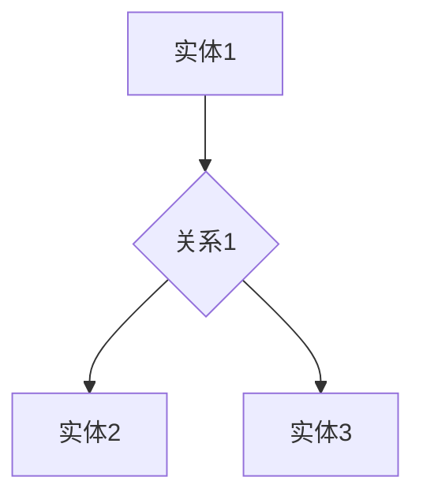
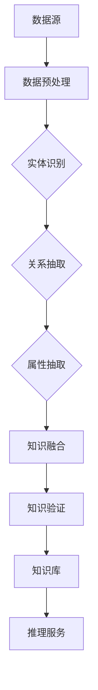

                 


# 文章标题：基于知识图谱的大规模推理系统优化技术

> 关键词：知识图谱、大规模推理系统、优化技术、分布式计算、算法优化、性能提升

> 摘要：本文将深入探讨知识图谱和大规模推理系统的优化技术，从基础知识到实践案例，全面分析优化方法的原理、实现和效果，旨在为开发者提供系统、全面的优化指南。

## 引言

知识图谱作为一种用于表示实体及其关系的图形结构，已经成为人工智能领域的重要工具。它不仅为智能搜索、推荐系统和智能问答等领域提供了强大的支持，还在金融、医疗、物流等行业中得到了广泛应用。而大规模推理系统则是在知识图谱基础上，利用推理算法对知识进行深度分析，以解决复杂问题。然而，随着数据规模的扩大和复杂度的增加，大规模推理系统的性能和效率面临巨大挑战。因此，优化技术的研究与应用显得尤为重要。

本文将围绕知识图谱和大规模推理系统，从以下几个方面展开讨论：

1. 知识图谱基础：介绍知识图谱的基本概念、核心概念和构建方法。
2. 大规模推理系统基础：讲解大规模推理系统的定义、类型、架构和算法。
3. 优化技术与方法：详细分析算法优化、系统架构优化和分布式计算等优化技术。
4. 实际应用与案例：通过具体案例展示优化技术的应用效果。
5. 总结与展望：总结全书内容，展望未来发展趋势。

## 第1章 知识图谱基本概念与原理

### 1.1 知识图谱的定义

知识图谱（Knowledge Graph）是一种用于表示实体及其关系的图形结构。它由节点（Node）、边（Edge）和属性（Attribute）组成，其中节点表示实体，边表示实体之间的关系，属性用于描述节点或边的特征。

### 1.2 知识图谱的核心概念

知识图谱的核心概念包括：

1. 实体（Entity）：知识图谱中的基本元素，表示现实世界中的对象，如人、地点、组织等。
2. 关系（Relationship）：描述实体之间关系的概念，如“属于”、“位于”、“就职于”等。
3. 属性（Attribute）：用于描述实体或关系的特征，如“年龄”、“身高”、“职位”等。

### 1.3 知识图谱的架构

知识图谱的架构可以分为三个层次：

1. 数据层：存储原始数据和转换后的结构化数据。
2. 知识层：对数据进行分析和处理，形成具有语义信息的知识。
3. 服务层：提供知识查询、推理和可视化等功能。

### 1.4 知识图谱的Mermaid流程图

下面是一个简单的知识图谱Mermaid流程图示例：



## 第2章 知识图谱的构建

### 2.1 数据源选择

构建知识图谱需要从大量的原始数据中提取有用的信息。数据源的选择至关重要，常见的数据源包括：

1. 开放数据集：如DBpedia、Freebase等。
2. 半结构化数据：如XML、JSON等。
3. 结构化数据：如关系数据库、图数据库等。

### 2.2 实体识别

实体识别是指从文本中识别出实体，并将其映射到知识图谱中的节点。实体识别的方法包括：

1. 基于规则的方法：通过预定义的规则进行实体识别。
2. 基于机器学习的方法：利用模型对实体进行分类和识别。
3. 基于知识图谱的方法：利用知识图谱中的信息进行实体识别。

### 2.3 关系抽取

关系抽取是指从文本中识别出实体之间的关系。关系抽取的方法包括：

1. 基于规则的方法：通过预定义的规则进行关系抽取。
2. 基于机器学习的方法：利用模型对关系进行分类和识别。
3. 基于知识图谱的方法：利用知识图谱中的信息进行关系抽取。

### 2.4 知识图谱构建流程

知识图谱的构建流程包括以下几个步骤：

1. 数据预处理：对原始数据进行清洗、去重和格式化等操作。
2. 实体识别：从文本中识别出实体，并将其映射到知识图谱中的节点。
3. 关系抽取：从文本中识别出实体之间的关系，并将其存储在知识图谱中。
4. 知识融合：对相同或相似实体和关系进行合并。
5. 知识验证：对知识图谱进行验证，确保其准确性。

## 第3章 大规模推理系统概述

### 3.1 推理系统的定义

推理系统（Reasoning System）是一种基于规则或模型，对知识进行推理和分析的计算机系统。推理系统通常由推理机（Reasoner）、知识库（Knowledge Base）和推理算法（Reasoning Algorithm）组成。

### 3.2 推理系统的类型

推理系统可以分为以下几种类型：

1. 基于规则的推理系统：利用预定义的规则进行推理。
2. 基于模型的推理系统：利用机器学习模型进行推理。
3. 基于知识图谱的推理系统：利用知识图谱进行推理。

### 3.3 推理系统的架构

推理系统的架构通常包括以下几个部分：

1. 知识库：存储领域知识和推理规则。
2. 推理机：执行推理操作，如推理、推理路径搜索等。
3. 推理算法：实现推理过程，如推理引擎、搜索算法等。
4. 用户接口：提供用户交互界面，如查询接口、可视化界面等。

### 3.4 推理系统的算法

推理系统的算法可以分为以下几种类型：

1. 基于规则推理算法：如前向推理、后向推理、双向推理等。
2. 基于模型推理算法：如逻辑回归、决策树、神经网络等。
3. 基于知识图谱推理算法：如路径搜索、图算法等。

## 第4章 大规模推理系统的优化技术

### 4.1 算法优化

算法优化是提高推理系统性能的关键技术。常见的算法优化方法包括：

1. 算法改进：通过改进现有算法，提高其效率和准确性。
2. 算法组合：将多种算法组合起来，实现更好的效果。
3. 算法并行化：将算法分解成多个部分，利用多线程或多处理器进行并行计算。

### 4.2 系统架构优化

系统架构优化可以从以下几个方面进行：

1. 分布式存储：利用分布式存储系统，提高数据存储和访问性能。
2. 分布式计算：利用分布式计算框架，实现并行推理。
3. 缓存机制：利用缓存技术，减少数据访问延迟。

### 4.3 分布式计算

分布式计算是提高推理系统性能的重要手段。常见的分布式计算框架包括：

1. Hadoop：基于MapReduce模型，适用于大规模数据处理。
2. Spark：基于内存计算，适用于实时数据处理。
3. Flink：适用于流处理和批处理，具有高吞吐量和低延迟。

### 4.4 数据存储优化

数据存储优化可以从以下几个方面进行：

1. 数据压缩：利用压缩技术，减少数据存储空间。
2. 数据索引：利用索引技术，提高数据访问速度。
3. 数据分区：将数据分区存储，提高并发访问性能。

## 第5章 实际应用与案例

### 5.1 案例一：企业知识库构建与推理

本案例将展示如何使用知识图谱和推理系统构建企业知识库，并利用优化技术提高推理性能。

### 5.2 案例二：社交媒体内容推荐

本案例将介绍如何使用知识图谱和推理系统进行社交媒体内容推荐，并分析优化技术对推荐效果的影响。

### 5.3 案例三：智能客服系统

本案例将展示如何使用知识图谱和推理系统构建智能客服系统，并分析优化技术在客服系统中的应用效果。

## 第6章 总结与展望

### 6.1 知识图谱与大规模推理系统的未来发展趋势

知识图谱和大规模推理系统作为人工智能领域的重要技术，未来发展趋势包括：

1. 数据规模和复杂度的增加，推动优化技术的不断创新。
2. 多领域知识融合，实现更广泛的智能应用。
3. 开放平台和生态系统的建设，促进技术的普及和落地。

### 6.2 优化技术的挑战与机遇

优化技术面临以下挑战和机遇：

1. 挑战：数据质量和一致性、算法效率和准确性、系统可扩展性等。
2. 机遇：分布式计算、机器学习、深度学习等技术的发展，为优化技术提供了新的思路和方法。

### 6.3 开发者指南

对于开发者，以下是一些建议：

1. 掌握基础知识：了解知识图谱和大规模推理系统的基本概念、原理和算法。
2. 学习优化技术：掌握分布式计算、算法优化、系统架构优化等优化技术。
3. 实践和案例：通过实际案例，积累经验，提高实战能力。
4. 持续学习：关注领域最新动态，不断学习和更新知识。

## 作者信息

作者：AI天才研究院/AI Genius Institute & 禅与计算机程序设计艺术 /Zen And The Art of Computer Programming

以上就是本文的完整内容。通过本文的讨论，我们深入了解了知识图谱和大规模推理系统的优化技术，为开发者提供了系统、全面的优化指南。希望本文对您有所帮助，如果您有任何疑问或建议，请随时留言讨论。

----------------------------------------------------------------

## 第1章 知识图谱基本概念与原理

### 1.1 知识图谱的定义

知识图谱（Knowledge Graph）是一种用于表示实体及其关系的图形结构，它通过节点（Node）、边（Edge）和属性（Attribute）来描述现实世界中的对象和它们之间的关系。知识图谱的核心在于将语义信息以结构化的方式存储，使得计算机能够更好地理解和处理知识。

知识图谱的应用非常广泛，涵盖了搜索引擎、智能问答、推荐系统、自然语言处理等多个领域。例如，Google搜索引擎使用知识图谱来提高搜索结果的准确性和相关性，Facebook利用知识图谱为用户提供更个性化的推荐服务。

### 1.2 知识图谱的核心概念

知识图谱的核心概念主要包括实体（Entity）、关系（Relationship）和属性（Attribute）。

1. **实体（Entity）**：实体是知识图谱中的基本元素，代表现实世界中的个体，如人、地点、组织、物品等。实体可以是一级实体，如“北京”，也可以是二级实体，如“故宫”。
   
2. **关系（Relationship）**：关系描述实体之间的关系，如“属于”、“位于”、“就职于”等。关系可以是单向的，也可以是双向的，如“学生”和“就读于”之间的关系是双向的。

3. **属性（Attribute）**：属性用于描述实体或关系的特征，如人的“年龄”、“身高”、“职位”，地点的“经纬度”、“海拔”等。

### 1.3 知识图谱的架构

知识图谱的架构通常包括三个层次：

1. **数据层**：数据层是知识图谱的基础，它包括原始数据源和预处理后的数据。原始数据可以来自多种渠道，如网络爬虫、关系数据库、开放数据集等。

2. **知识层**：知识层是在数据层基础上，通过实体识别、关系抽取、属性抽取等技术，将原始数据转化为具有语义信息的结构化知识。这一层是知识图谱的核心，它包含实体、关系和属性。

3. **应用层**：应用层是知识图谱的对外接口，它提供查询、推理、可视化等功能，使得用户可以方便地使用知识图谱。应用层通常包含前端界面和后端服务。

### 1.4 知识图谱的Mermaid流程图

为了更好地理解知识图谱的构建过程，我们可以使用Mermaid语言绘制一个简单的知识图谱流程图。以下是一个示例：



在这个流程图中，数据源通过预处理、实体识别、关系抽取和属性抽取等步骤，最终形成知识库。知识库可以供推理服务使用，进行推理操作。

### 1.5 知识图谱的应用

知识图谱的应用场景非常广泛，以下是一些典型的应用：

1. **搜索引擎优化**：通过知识图谱，搜索引擎可以更好地理解用户查询，提高搜索结果的准确性和相关性。

2. **推荐系统**：知识图谱可以用于推荐系统，通过分析用户行为和实体关系，为用户推荐相关的内容或服务。

3. **智能问答**：知识图谱可以为智能问答系统提供知识支持，使得系统能够理解用户的问题，并给出准确的答案。

4. **自然语言处理**：知识图谱可以帮助自然语言处理任务，如文本分类、情感分析、实体识别等。

5. **金融风控**：知识图谱可以用于金融风控，通过分析实体之间的关系，发现潜在的欺诈行为。

6. **医疗健康**：知识图谱可以帮助医疗健康领域，通过分析疾病、药物、医生等实体之间的关系，为疾病诊断和治疗提供支持。

### 1.6 知识图谱的优势和挑战

**优势：**

1. **语义理解**：知识图谱通过结构化的方式表示知识，使得计算机能够更好地理解和处理语义信息。
2. **关联发现**：知识图谱可以揭示实体之间的关系，为数据分析提供新的视角。
3. **智能推理**：基于知识图谱的推理系统可以实现智能推理，解决复杂问题。
4. **个性化推荐**：知识图谱可以用于个性化推荐，为用户提供更准确、更个性化的服务。

**挑战：**

1. **数据质量**：知识图谱的质量很大程度上取决于数据质量，包括数据的一致性、完整性和准确性。
2. **存储和计算**：大规模知识图谱的存储和计算是一个挑战，需要高效的算法和架构。
3. **实时性**：知识图谱的更新和维护需要保证实时性，以满足快速变化的应用需求。

### 1.7 小结

本章介绍了知识图谱的基本概念、核心概念、架构和应用，并通过Mermaid流程图展示了知识图谱的构建过程。通过本章的学习，读者可以了解知识图谱的基本原理和重要性，为后续章节的学习打下基础。

## 第2章 知识图谱的构建

### 2.1 数据源选择

构建知识图谱的第一步是选择合适的数据源。数据源的选择直接影响到知识图谱的质量和覆盖范围。常见的数据源包括：

1. **开放数据集**：如DBpedia、Freebase、WikiData等，这些数据集通常已经结构化，可以直接用于知识图谱构建。
2. **关系数据库**：如SQL Server、MySQL、PostgreSQL等，这些数据库中存储了大量结构化数据，可以通过数据库查询技术提取知识。
3. **半结构化数据**：如XML、JSON、CSV等，这些数据可以通过解析技术转化为结构化数据。
4. **社交媒体数据**：如Twitter、Facebook等，这些数据可以提供丰富的实体关系信息。

在选择数据源时，需要考虑以下几个因素：

- **数据质量**：数据源的准确性、一致性和完整性。
- **数据量**：数据源的规模，数据量越大，知识图谱的覆盖面越广。
- **数据结构**：数据源的结构化程度，结构化的数据更容易转换为知识图谱。
- **数据更新频率**：数据源的更新频率，高频更新的数据源可以提供最新的知识。

### 2.2 实体识别

实体识别是知识图谱构建的重要步骤，它指的是从非结构化或半结构化数据中识别出实体，并将其映射到知识图谱中的节点。实体识别的方法包括：

1. **基于规则的方法**：通过预定义的规则进行实体识别，如正则表达式、命名实体识别规则等。
2. **基于机器学习的方法**：利用机器学习模型对实体进行分类和识别，如文本分类、命名实体识别等。
3. **基于知识图谱的方法**：利用知识图谱中的信息进行实体识别，如实体链接、实体匹配等。

实体识别的关键技术包括：

- **词性标注**：对文本进行词性标注，识别出名词、动词等实体候选词。
- **命名实体识别**：识别出文本中的命名实体，如人名、地名、组织名等。
- **实体分类**：对识别出的实体进行分类，如将人名分类为“人物”、“企业”等。
- **实体匹配**：将识别出的实体与知识图谱中的实体进行匹配，确保实体映射的准确性。

### 2.3 关系抽取

关系抽取是指从文本中识别出实体之间的关系，并将其存储在知识图谱中。关系抽取的方法包括：

1. **基于规则的方法**：通过预定义的规则进行关系抽取，如关系模板匹配、依存句法分析等。
2. **基于机器学习的方法**：利用机器学习模型对关系进行分类和识别，如条件随机场（CRF）、支持向量机（SVM）等。
3. **基于知识图谱的方法**：利用知识图谱中的信息进行关系抽取，如模式匹配、图算法等。

关系抽取的关键技术包括：

- **依存句法分析**：通过分析句子中的依存关系，识别出实体之间的关系。
- **模式匹配**：通过预定义的模式匹配关系，从文本中提取关系。
- **实体对识别**：识别出文本中的实体对，并根据实体对之间的关系进行抽取。

### 2.4 知识图谱构建流程

知识图谱的构建流程通常包括以下几个步骤：

1. **数据预处理**：对原始数据进行清洗、去重和格式化等操作，确保数据的质量和一致性。
2. **实体识别**：从非结构化或半结构化数据中识别出实体，并将其映射到知识图谱中的节点。
3. **关系抽取**：从文本中识别出实体之间的关系，并将其存储在知识图谱中。
4. **知识融合**：对相同或相似实体和关系进行合并，确保知识图谱的准确性。
5. **知识验证**：对知识图谱进行验证，确保其准确性和一致性。
6. **知识库构建**：将构建好的知识图谱存储到知识库中，供后续推理和使用。

### 2.5 数据预处理

数据预处理是知识图谱构建的重要环节，它包括以下几个步骤：

1. **文本清洗**：去除文本中的无关信息，如HTML标签、特殊符号等。
2. **分词**：将文本划分为单词或短语，为后续的实体识别和关系抽取做准备。
3. **词性标注**：对分词结果进行词性标注，识别出名词、动词等实体候选词。
4. **实体识别**：根据词性标注结果，识别出文本中的实体。
5. **关系抽取**：根据实体之间的关系，识别出文本中的关系。

### 2.6 实体识别案例

以下是一个简单的实体识别案例，假设我们有一个包含新闻文本的数据集，我们需要从中识别出实体，并将其映射到知识图谱中的节点。

```python
# 假设我们有一个新闻文本：
text = "微软公司的CEO萨提亚·纳德拉计划在未来五年内将公司转变为云计算巨头。"

# 进行文本清洗和分词
cleaned_text = clean_text(text)
words = split_text(cleaned_text)

# 进行词性标注
tagged_words = perform_ponorm(words)

# 识别实体
entities = identify_entities(tagged_words)

# 将实体映射到知识图谱中的节点
for entity in entities:
    knowledge_graph.add_node(entity)
```

在上面的案例中，我们首先对新闻文本进行清洗和分词，然后进行词性标注，最后识别出实体并将其添加到知识图谱中的节点。

### 2.7 关系抽取案例

以下是一个简单的

