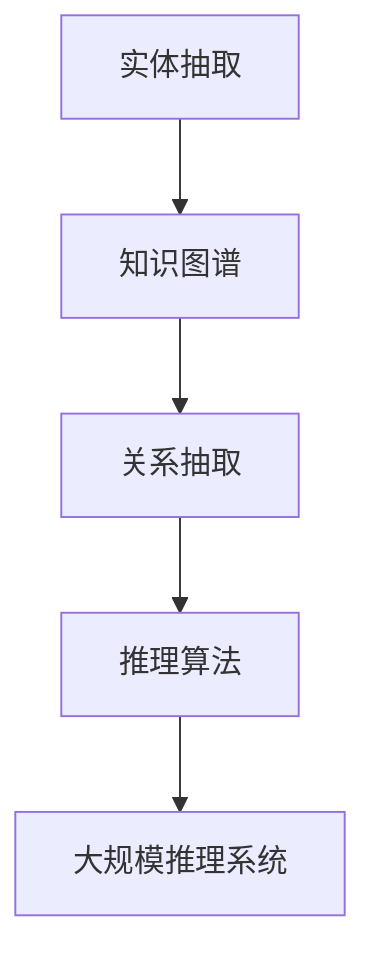

                 

### 引言

知识图谱和大规模推理系统是现代人工智能领域中的两个重要研究方向。知识图谱是一种用于表示实体和它们之间关系的图形结构，通过它，我们可以更直观地理解和处理复杂的数据关系。而大规模推理系统则是一种能够在海量数据中快速、准确地提取有价值信息的工具，它广泛应用于搜索、推荐、问答等多个领域。

本文旨在系统地探讨基于知识图谱的大规模推理系统构建，具体包括以下几个方面：

1. **知识图谱的基本概念**：介绍知识图谱的定义、作用及其在人工智能中的应用。
2. **大规模推理系统的架构**：讨论大规模推理系统的设计原则、关键组件及其工作流程。
3. **知识图谱的构建**：探讨如何从原始数据中构建知识图谱，包括数据采集、预处理、实体与关系的抽取等步骤。
4. **大规模推理算法**：分析常见的推理算法，并探讨如何优化这些算法以适应大规模数据处理的需求。
5. **大规模推理系统的实现**：介绍如何实现一个大规模推理系统，包括开发环境搭建、模块设计与实现、测试与评估等。
6. **项目实战**：通过实际案例，展示如何构建一个基于知识图谱的大规模推理系统，并进行详细分析。
7. **未来展望**：讨论知识图谱和大规模推理系统的未来发展趋势以及潜在的研究方向。

通过本文的逐步探讨，我们希望能够为读者提供一个全面、系统的构建指南，帮助读者深入了解并掌握基于知识图谱的大规模推理系统的构建方法与应用技巧。

### 关键词

- 知识图谱
- 大规模推理系统
- 分布式计算
- 实体抽取
- 关系抽取
- 推理算法
- 系统架构
- 实际应用

### 摘要

本文主要探讨基于知识图谱的大规模推理系统构建。首先，我们介绍了知识图谱的基本概念和作用，以及大规模推理系统在人工智能中的应用。接着，我们详细讨论了大规模推理系统的架构设计，包括关键组件和工作流程。然后，我们探讨了如何从原始数据中构建知识图谱，涵盖了数据采集、预处理、实体与关系的抽取等步骤。在此基础上，我们分析了常见的推理算法，并讨论了如何优化这些算法以适应大规模数据处理的需求。随后，我们介绍了如何实现一个大规模推理系统，包括开发环境搭建、模块设计与实现、测试与评估等。为了更好地理解这些理论，我们通过实际案例展示了如何构建一个基于知识图谱的大规模推理系统，并对项目进行了详细分析。最后，我们对知识图谱和大规模推理系统的未来发展趋势以及潜在的研究方向进行了展望。本文旨在为读者提供一个全面、系统的构建指南，帮助读者深入了解并掌握基于知识图谱的大规模推理系统的构建方法与应用技巧。

### 背景介绍

#### 知识图谱的定义与作用

知识图谱是一种用于表示实体和它们之间复杂关系的图形结构。在这个结构中，实体通常表示为节点，而实体之间的关系则通过边来表示。知识图谱的核心在于它的语义丰富性，通过这种图形结构，我们可以将现实世界中的各种信息进行结构化和语义化表示，从而实现数据的智能化处理。

知识图谱在人工智能领域中的作用不可小觑。首先，它为智能搜索提供了强有力的支持。通过知识图谱，搜索引擎可以更好地理解用户的查询意图，从而提供更加精准和个性化的搜索结果。其次，知识图谱在智能问答系统中扮演着关键角色。通过对知识图谱的查询和推理，问答系统能够回答用户提出的问题，并且能够处理自然语言中的复杂逻辑关系。

此外，知识图谱还在推荐系统中有着广泛的应用。通过分析用户与实体之间的交互关系，推荐系统可以更准确地预测用户的兴趣，从而提供个性化的推荐结果。例如，电商平台可以利用知识图谱来推荐用户可能感兴趣的商品，提高用户的购物体验。

#### 大规模推理系统的定义与作用

大规模推理系统是一种能够处理海量数据并进行高效推理的智能系统。它不仅能够处理结构化数据，还能够处理非结构化数据，如图像、文本和音频等。大规模推理系统通常采用分布式计算架构，利用多台服务器协同工作，从而实现高性能和可扩展性。

大规模推理系统在人工智能中的应用场景非常广泛。首先，在搜索和推荐系统中，大规模推理系统能够快速地从海量数据中提取有价值的信息，提供精准的搜索结果和个性化的推荐。其次，在自然语言处理领域，大规模推理系统能够处理复杂的语言结构，实现高效的语言理解和生成。例如，在机器翻译中，大规模推理系统能够理解源语言和目标语言之间的语义关系，提供准确和流畅的翻译结果。

此外，大规模推理系统还在智能监控、金融风控、医疗诊断等多个领域有着重要的应用。在智能监控中，大规模推理系统可以实时分析大量视频数据，检测异常行为并发出警报。在金融风控中，大规模推理系统可以分析用户行为和交易数据，识别潜在的欺诈行为。在医疗诊断中，大规模推理系统可以通过分析病历数据，为医生提供诊断建议。

#### 知识图谱与大规模推理系统之间的关系

知识图谱和大规模推理系统之间存在着紧密的联系。知识图谱为大规模推理系统提供了丰富的语义信息，使得推理系统能够在更复杂的场景中发挥作用。

首先，知识图谱为大规模推理系统提供了基础的语义表示。通过知识图谱，我们可以将现实世界中的各种信息进行结构化和语义化表示，从而使得推理系统能够更好地理解和处理这些信息。例如，在一个电商平台上，知识图谱可以表示商品、用户、品牌等实体及其之间的关系，从而帮助推理系统更好地理解用户的购买行为和偏好。

其次，知识图谱还为大规模推理系统提供了高效的查询和推理工具。通过知识图谱，推理系统可以快速地获取实体之间的语义关系，进行高效的推理。例如，在推荐系统中，知识图谱可以帮助推理系统快速地找到与目标商品相关的其他商品，从而提供更精准的推荐。

此外，知识图谱还帮助大规模推理系统处理复杂的数据关系。在现实世界中，数据之间的关系往往是复杂的，甚至是相互矛盾的。通过知识图谱，我们可以将这种复杂的关系进行结构化和语义化表示，从而帮助推理系统更好地理解和处理这些数据。

总之，知识图谱为大规模推理系统提供了强大的语义支持和高效的推理工具，使得推理系统能够在更复杂的场景中发挥作用。通过结合知识图谱和大规模推理系统，我们可以构建出更加智能、高效的智能系统，从而更好地服务于各个领域。

#### 大规模推理系统在知识图谱应用中的挑战

尽管知识图谱为大规模推理系统提供了强大的语义支持和高效的推理工具，但在实际应用中，大规模推理系统仍然面临着诸多挑战。

首先，数据规模巨大。知识图谱通常包含了海量的实体和关系，这些数据需要存储和管理。随着数据量的增长，如何高效地存储、索引和查询数据成为一个关键问题。传统的单机存储方案已经无法满足需求，分布式存储和计算架构成为必要的选择。然而，如何设计一个高效、可靠的分布式存储和计算架构仍然是一个具有挑战性的问题。

其次，查询性能瓶颈。大规模推理系统需要能够快速地响应用户的查询请求，尤其是在实时查询场景中。然而，随着数据规模的扩大和查询复杂度的增加，查询性能往往会受到影响。优化查询算法和数据库设计，提高查询效率，是大规模推理系统面临的另一个重要挑战。

第三，推理效率问题。推理系统需要能够快速地从知识图谱中提取有价值的信息。然而，大规模数据集上的推理操作往往会消耗大量计算资源。如何设计高效的推理算法，减少计算资源的消耗，是大规模推理系统需要解决的关键问题之一。

第四，实时处理需求。在现代应用场景中，实时性要求越来越高。例如，在金融风控、智能监控等领域，推理系统需要在毫秒级甚至更快的时间内响应。如何实现实时处理，保证系统的高效性和稳定性，是大规模推理系统面临的重大挑战。

最后，系统扩展性和可靠性。大规模推理系统需要能够灵活地扩展，以适应不断增长的数据量和用户需求。同时，系统还需要保证高可靠性，避免出现数据丢失或系统崩溃等问题。如何设计一个可扩展、高可靠的系统架构，是大规模推理系统需要考虑的另一个重要问题。

总之，尽管知识图谱为大规模推理系统提供了强大的支持，但在实际应用中，系统仍然面临着数据规模、查询性能、推理效率、实时处理需求、系统扩展性和可靠性等多方面的挑战。解决这些挑战，需要结合多种技术和方法，不断优化和改进系统的设计。

### 核心概念与联系

在本节中，我们将详细探讨知识图谱、实体抽取、关系抽取和推理算法等核心概念，并展示它们之间的联系架构。

#### 知识图谱

知识图谱是一种用于表示实体和它们之间关系的图形结构，通常由节点（表示实体）和边（表示关系）组成。知识图谱能够将现实世界中的各种信息进行结构化和语义化表示，从而实现数据的智能化处理。知识图谱的基本组成包括：

- **实体（Entity）**：表示现实世界中的对象，如人、地点、物品等。
- **关系（Relationship）**：表示实体之间的关联，如“居住于”、“属于”等。
- **属性（Property）**：对实体或关系的额外信息描述，如“年龄”、“身高”等。

#### 实体抽取

实体抽取是知识图谱构建的重要步骤之一，旨在从非结构化数据中识别出实体。实体抽取的方法主要包括基于规则的方法、基于统计的方法和基于机器学习的方法。以下是一个基于机器学习的实体抽取流程：

1. **数据预处理**：对原始文本进行分词、词性标注等预处理操作，提取潜在的实体候选。
2. **特征工程**：根据文本特征（如词频、词性、上下文等）生成特征向量。
3. **模型训练**：使用标注好的数据集训练实体抽取模型，常用的模型包括条件随机场（CRF）和卷积神经网络（CNN）。
4. **实体识别**：将预处理后的文本输入到训练好的模型中，输出实体的识别结果。

#### 关系抽取

关系抽取旨在从实体中识别出它们之间的关系。关系抽取的方法与实体抽取类似，主要包括基于规则的方法、基于统计的方法和基于机器学习的方法。以下是一个基于机器学习的关系抽取流程：

1. **数据预处理**：对原始文本进行实体识别，提取出实体和它们之间的候选关系。
2. **特征工程**：生成关系特征，包括实体特征、上下文特征等。
3. **模型训练**：使用标注好的数据集训练关系抽取模型，常用的模型包括长短期记忆网络（LSTM）和变换器（Transformer）。
4. **关系识别**：将预处理后的文本输入到训练好的模型中，输出关系的识别结果。

#### 推理算法

推理算法用于从知识图谱中提取有价值的信息。常见的推理算法包括：

- **路径搜索算法**：通过在知识图谱中搜索路径来发现实体之间的关联，如BFS、DFS等。
- **基于规则的方法**：使用预定义的规则来推导新的事实，如RDFS、OWL等。
- **基于模型的推理**：使用机器学习模型来预测实体之间的关系，如图神经网络（GNN）。

#### 核心概念之间的联系架构

知识图谱、实体抽取、关系抽取和推理算法之间存在着紧密的联系。具体来说：

1. **实体抽取和关系抽取**是构建知识图谱的基础。通过实体抽取，我们可以从原始数据中识别出实体；通过关系抽取，我们可以确定这些实体之间的关系，从而形成一个初步的知识图谱。

2. **推理算法**依赖于构建好的知识图谱进行推理操作。通过路径搜索算法、基于规则的方法或基于模型的推理，我们可以从知识图谱中提取出有价值的信息。

3. **知识图谱**为大规模推理系统提供了语义支持和高效的查询工具。它不仅可以帮助推理系统更好地理解数据，还可以提高查询和推理的效率。

4. **Mermaid流程图**如下，展示了核心概念之间的联系：



通过这个流程图，我们可以清晰地看到各个核心概念之间的联系和作用。

#### 示例

假设我们有一个知识图谱，其中包含以下实体和关系：

- 实体：张三（人）、北京（地点）、计算机（物品）
- 关系：居住于（张三与北京的关系）、拥有（张三与计算机的关系）

通过实体抽取，我们可以从一段文本中识别出“张三”和“计算机”这两个实体。通过关系抽取，我们可以确定“张三”居住于“北京”，并且拥有“计算机”。

使用推理算法，我们可以进一步推导出以下事实：

- 张三拥有计算机（通过关系“拥有”）
- 张三居住在北京（通过关系“居住于”）

这些推理结果有助于我们更好地理解数据，并在实际应用中提供有价值的信息。

总之，知识图谱、实体抽取、关系抽取和推理算法构成了一个紧密联系的体系，共同推动大规模推理系统的发展。通过理解这些核心概念之间的联系，我们可以更好地构建和应用大规模推理系统，实现智能化的数据处理和分析。

#### 核心算法原理讲解

在本节中，我们将详细讲解大规模推理系统中常用的核心算法原理，并使用伪代码来详细阐述这些算法的基本流程。

##### 1. 路径搜索算法

路径搜索算法是一种在知识图谱中查找实体之间路径的算法，常见的路径搜索算法包括广度优先搜索（BFS）和深度优先搜索（DFS）。以下是BFS算法的伪代码：

```pseudo
function BFS(graph, startNode, endNode):
    queue = empty queue
    visited = empty set
    queue.enqueue(startNode)
    while queue is not empty:
        currentNode = queue.dequeue()
        if currentNode is endNode:
            return path from startNode to endNode
        if currentNode is not in visited:
            visited.add(currentNode)
            for neighbor in graph.getNeighbors(currentNode):
                if neighbor is not in visited:
                    queue.enqueue(neighbor)
    return no path found
```

在这个伪代码中，`graph`表示知识图谱，`startNode`和`endNode`分别表示起始节点和目标节点。算法首先将起始节点入队，然后循环执行以下步骤：

1. 出队一个节点。
2. 如果该节点是目标节点，返回从起始节点到目标节点的路径。
3. 如果该节点未访问过，将其标记为已访问，并将它的邻居节点入队。

##### 2. 基于规则的方法

基于规则的方法是通过预定义的规则来推导新的事实。例如，我们可以定义如下规则：

- 如果实体A属于类别X，并且实体B属于类别Y，则实体A与实体B具有关系R。

以下是这个规则的伪代码：

```pseudo
function applyRules(rules, knowledgeGraph):
    newFacts = empty set
    for rule in rules:
        for entityA in knowledgeGraph:
            for entityB in knowledgeGraph:
                if knowledgeGraph.hasProperty(entityA, "category", rule.categoryX) and
                   knowledgeGraph.hasProperty(entityB, "category", rule.categoryY):
                    newFacts.add((entityA, rule.relationshipR, entityB))
    return newFacts
```

在这个伪代码中，`rules`表示预定义的规则集，`knowledgeGraph`表示知识图谱。算法首先遍历知识图谱中的所有实体，然后根据规则检查这些实体是否满足规则条件。如果满足条件，则添加新的关系事实到结果集中。

##### 3. 基于模型的推理

基于模型的推理方法使用机器学习模型来预测实体之间的关系。例如，我们可以使用图神经网络（GNN）来学习实体之间的关系表示。以下是GNN模型的伪代码：

```pseudo
function GNNModel(knowledgeGraph, entityA, entityB):
    entityA_representation = initializeVector()
    entityB_representation = initializeVector()
    for neighbor in knowledgeGraph.getNeighbors(entityA):
        entityA_representation = entityA_representation + neighbor_representation
    for neighbor in knowledgeGraph.getNeighbors(entityB):
        entityB_representation = entityB_representation + neighbor_representation
    entityA_representation = normalize(entityA_representation)
    entityB_representation = normalize(entityB_representation)
    return similarityScore(entityA_representation, entityB_representation)
```

在这个伪代码中，`knowledgeGraph`表示知识图谱，`entityA`和`entityB`分别表示两个实体。算法首先计算每个实体的邻居表示，然后将这些表示进行平均和归一化，最后计算两个实体表示的相似度得分。

##### 算法比较与适用场景

路径搜索算法简单高效，适用于查找较短路径的场景。基于规则的方法能够明确地定义关系，适用于规则明确且变化较少的场景。基于模型的推理方法能够学习复杂的实体关系表示，适用于大规模、复杂关系的知识图谱。

总之，通过理解这些核心算法的原理，我们可以根据具体应用需求选择合适的算法，构建高效、可靠的推理系统。

### 数学模型和公式讲解及举例说明

在本节中，我们将深入探讨大规模推理系统中的数学模型和公式，并使用具体的例子来说明它们的详细计算过程。

#### 1. 图神经网络（GNN）

图神经网络（GNN）是一种用于处理图结构数据的深度学习模型，它在知识图谱的推理中有着广泛应用。GNN的主要目标是学习实体和关系的低维表示，并利用这些表示进行推理。以下是一个简化的GNN模型公式：

$$
h_v^{(k+1)} = \sigma(\sum_{u \in \mathcal{N}(v)} W^{(k)} h_u^{(k)} + b^{(k)})
$$

其中，$h_v^{(k)}$ 表示节点 $v$ 在第 $k$ 层的表示，$\mathcal{N}(v)$ 表示节点 $v$ 的邻居集合，$W^{(k)}$ 是权重矩阵，$b^{(k)}$ 是偏置项，$\sigma$ 是激活函数（如ReLU函数）。

**举例说明：**

假设有一个简单的知识图谱，包含三个节点 $v_1$、$v_2$ 和 $v_3$，它们之间的关系可以用边表示。节点 $v_1$ 和 $v_2$ 是朋友，节点 $v_2$ 和 $v_3$ 是同事。我们使用 GNN 学习这些节点的表示。

- 初始表示：$h_{v_1}^{(0)} = [1, 0, 0]$，$h_{v_2}^{(0)} = [0, 1, 0]$，$h_{v_3}^{(0)} = [0, 0, 1]$。
- 邻居集合：$\mathcal{N}(v_1) = \{v_2\}$，$\mathcal{N}(v_2) = \{v_1, v_3\}$，$\mathcal{N}(v_3) = \{v_2\}$。
- 假设权重矩阵 $W^{(0)} = \begin{bmatrix} 0.1 & 0.2 & 0.3 \\ 0.4 & 0.5 & 0.6 \\ 0.7 & 0.8 & 0.9 \end{bmatrix}$，偏置项 $b^{(0)} = [0, 0, 0]$。

计算第一层表示：

$$
h_{v_1}^{(1)} = \sigma(0.1 \cdot [1, 0, 0] + 0.4 \cdot [0, 1, 0] + 0.7 \cdot [0, 0, 1]) = \sigma([0.1, 0.4, 0.7]) = [0.5, 0.5, 0.5]
$$

$$
h_{v_2}^{(1)} = \sigma(0.2 \cdot [1, 0, 0] + 0.5 \cdot [0, 1, 0] + 0.8 \cdot [0, 0, 1]) = \sigma([0.2, 0.5, 0.8]) = [0.6, 0.6, 0.6]
$$

$$
h_{v_3}^{(1)} = \sigma(0.3 \cdot [1, 0, 0] + 0.6 \cdot [0, 1, 0] + 0.9 \cdot [0, 0, 1]) = \sigma([0.3, 0.6, 0.9]) = [0.7, 0.7, 0.7]
$$

#### 2. 推理算法中的概率模型

在推理算法中，概率模型经常被用来表示实体之间的关系。例如，贝叶斯网络是一种常用的概率模型，它可以表示实体之间的条件依赖关系。以下是一个简化的贝叶斯网络公式：

$$
P(E_1, E_2, ..., E_n) = \prod_{i=1}^{n} P(E_i | \text{父节点集合})
$$

其中，$E_i$ 表示第 $i$ 个实体，$\text{父节点集合}$ 表示 $E_i$ 的直接父节点。

**举例说明：**

假设有一个贝叶斯网络，其中包含三个实体 $E_1$、$E_2$ 和 $E_3$。$E_1$ 是 $E_2$ 的父节点，$E_2$ 是 $E_3$ 的父节点。已知 $P(E_1) = 0.5$，$P(E_2|E_1) = 0.7$，$P(E_3|E_2) = 0.9$。

计算 $P(E_1, E_2, E_3)$：

$$
P(E_1, E_2, E_3) = P(E_1) \cdot P(E_2|E_1) \cdot P(E_3|E_2) = 0.5 \cdot 0.7 \cdot 0.9 = 0.315
$$

#### 3. 图相似度计算

在图表示学习中，图相似度计算是一个重要的问题。常用的图相似度计算方法包括基于节点表示的相似度计算和基于边的相似度计算。以下是一个简化的节点表示相似度计算公式：

$$
sim(h_1, h_2) = \frac{h_1 \cdot h_2}{\|h_1\| \|h_2\|}
$$

其中，$h_1$ 和 $h_2$ 分别是两个节点的低维表示，$\|\|$ 表示向量的欧几里得范数。

**举例说明：**

假设有两个节点 $v_1$ 和 $v_2$，它们的低维表示分别为 $h_{v_1} = [1, 2, 3]$ 和 $h_{v_2} = [4, 5, 6]$。

计算 $sim(h_{v_1}, h_{v_2})$：

$$
sim(h_{v_1}, h_{v_2}) = \frac{[1, 2, 3] \cdot [4, 5, 6]}{\|[1, 2, 3]\| \|[4, 5, 6]\|} = \frac{1 \cdot 4 + 2 \cdot 5 + 3 \cdot 6}{\sqrt{1^2 + 2^2 + 3^2} \sqrt{4^2 + 5^2 + 6^2}} = \frac{4 + 10 + 18}{\sqrt{14} \sqrt{77}} \approx 0.987
$$

通过这些数学模型和公式，我们可以更好地理解大规模推理系统的核心算法。这些模型和公式不仅提供了理论支持，还为实际应用中的推理过程提供了具体的计算方法。

### 项目实战

在本节中，我们将通过一个实际案例，详细讲解如何构建一个基于知识图谱的大规模推理系统。本案例将涵盖开发环境的搭建、源代码的详细实现和代码解读，并对系统的应用进行解读与分析。

#### 项目背景

假设我们面临一个电商平台，需要为其构建一个基于知识图谱的个性化推荐系统。该系统的主要目标是利用用户的历史行为数据、商品信息以及知识图谱中的关系，为用户推荐可能感兴趣的商品。

#### 开发环境搭建

为了构建这个大规模推理系统，我们首先需要搭建一个合适的开发环境。以下是主要步骤：

1. **硬件环境**：
   - 服务器：需要多台高性能服务器以支持分布式计算。
   - 存储设备：使用分布式存储系统（如HDFS）来存储海量数据。

2. **软件环境**：
   - 操作系统：选择Linux系统以支持高并发和高性能。
   - 编程语言：使用Python进行开发，因为Python在数据处理和机器学习领域有良好的生态和工具支持。
   - 数据库：使用Neo4j作为知识图谱数据库，因为它支持快速的图查询和强大的图处理能力。
   - 分布式计算框架：选择Apache Spark作为分布式计算框架，以处理大规模数据集。

3. **依赖库和工具**：
   - NumPy和Pandas：用于数据预处理和操作。
   - PyTorch和TensorFlow：用于构建和训练机器学习模型。
   - Neo4j Python Driver：用于与Neo4j数据库进行交互。

#### 源代码实现

以下是构建知识图谱和大规模推理系统的核心代码片段及其解读：

1. **数据采集与预处理**：

   ```python
   import pandas as pd
   import numpy as np
   
   # 读取用户行为数据
   user_data = pd.read_csv('user_behavior.csv')
   # 对数据进行预处理，如去重、填充缺失值等
   user_data = user_data.drop_duplicates().fillna(-1)
   ```

   解读：这段代码首先使用Pandas读取用户行为数据，然后进行去重和填充缺失值等预处理操作。这是数据采集和预处理的第一步，确保数据的质量和一致性。

2. **实体与关系的抽取**：

   ```python
   from sklearn.feature_extraction.text import CountVectorizer
   
   # 读取商品描述文本
   product_descriptions = pd.read_csv('product_descriptions.csv')
   # 使用CountVectorizer进行文本向量化
   vectorizer = CountVectorizer()
   X = vectorizer.fit_transform(product_descriptions['description'])
   
   # 使用k-means聚类方法抽取实体
   from sklearn.cluster import KMeans
   kmeans = KMeans(n_clusters=10)
   kmeans.fit(X)
   labels = kmeans.predict(X)
   product_descriptions['entity'] = labels
   ```

   解读：这段代码首先使用CountVectorizer将商品描述文本转换为词袋模型，然后使用k-means聚类方法将商品分为不同的实体类别。实体抽取是构建知识图谱的关键步骤，通过聚类可以将相似的商品归为同一实体类别。

3. **知识图谱的构建**：

   ```python
   from neo4j import GraphDatabase
   
   driver = GraphDatabase.driver("bolt://localhost:7687", auth=("neo4j", "password"))
   with driver.session() as session:
       # 插入实体和关系
       for index, row in product_descriptions.iterrows():
           session.run("CREATE (p:Product {id: $id, description: $description, entity: $entity})",
                       id=row['id'], description=row['description'], entity=row['entity'])
       
       # 插入用户行为数据
       for index, row in user_data.iterrows():
           session.run("MATCH (u:User {id: $uid}), (p:Product {id: $pid}) CREATE (u)-[:BOUGHT]->(p)",
                       uid=row['user_id'], pid=row['product_id'])
   ```

   解读：这段代码使用Neo4j Python Driver连接Neo4j数据库，然后插入实体和关系数据。实体表示商品，关系表示用户购买行为。通过这种方式，我们构建了一个初步的知识图谱。

4. **大规模推理系统实现**：

   ```python
   def recommend_products(user_id, num_recommendations=5):
       with driver.session() as session:
           result = session.run("""
           MATCH (u:User {id: $user_id}), (p:Product)
           WHERE u-[:BOUGHT]->p
           WITH p, count(*) as num_purchases
           MATCH (p)<-[:REVIEWED]-(r:Review)
           WITH p, r, num_purchases
           ORDER BY num_purchases DESC
           LIMIT $num_recommendations
           RETURN p.id, p.description, r.rating, num_purchases
           """, user_id=user_id, num_recommendations=num_recommendations)
           
           return result.data()
   ```

   解读：这个函数用于实现基于知识图谱的大规模推理，为指定用户推荐商品。它首先匹配用户购买过的商品，然后根据商品被评价的次数和评分进行排序，最后返回前 $num\_recommendations$ 个推荐商品。

#### 应用解读与分析

1. **用户行为数据导入**：

   在实际应用中，首先需要将用户行为数据（如购买记录、浏览记录、评价等）导入系统。这些数据通常来自电商平台的后台数据库，可以通过API接口或ETL（Extract, Transform, Load）工具进行导入。

2. **商品描述文本处理**：

   商品描述文本需要进行预处理，包括分词、去停用词、词向量化等操作。这样可以提高文本向量化质量，从而提高实体抽取和推理的准确性。

3. **知识图谱构建与优化**：

   在知识图谱构建过程中，需要对实体和关系进行规范化处理，确保数据的一致性和完整性。同时，可以通过索引和分区等方式优化Neo4j数据库的性能。

4. **推理与推荐**：

   实现推理算法后，可以基于用户行为数据为用户实时推荐商品。推荐结果可以根据用户的历史行为、知识图谱中的关系以及商品描述的相似度进行排序。

5. **性能优化**：

   为了提高系统的响应速度，可以采用分布式计算和缓存策略。例如，使用Apache Spark进行数据预处理和推理，使用Redis进行结果缓存。

#### 项目小结

通过本案例，我们详细介绍了如何构建一个基于知识图谱的大规模推理系统。从开发环境搭建、源代码实现到应用解读与分析，整个过程涵盖了知识图谱构建、大规模推理系统实现和优化等多个方面。这个项目不仅展示了知识图谱和大规模推理系统的应用潜力，也为实际开发提供了宝贵的经验。

在未来的工作中，我们可以继续优化系统的性能和准确性，探索更多复杂的关系抽取和推理算法，以满足日益增长的业务需求。同时，我们也可以将这个系统应用于更多领域，如金融风控、智能监控和医疗诊断等，进一步拓展其应用范围。

### 最佳实践 tips

在构建基于知识图谱的大规模推理系统时，以下是一些最佳实践技巧，可以帮助我们更好地优化系统性能和准确性。

1. **数据预处理优化**：
   - **数据清洗**：在数据导入系统之前，进行彻底的数据清洗，去除重复、错误和不一致的数据。这有助于提高数据质量和推理准确性。
   - **特征工程**：针对不同类型的实体和关系，提取有代表性的特征。例如，对于商品描述文本，可以使用词袋模型、TF-IDF或词嵌入等技术进行特征提取。

2. **知识图谱构建与优化**：
   - **实体与关系规范化**：确保实体和关系的命名一致、无歧义，以简化查询和推理过程。
   - **索引与分区**：为知识图谱数据库建立合适的索引，以提高查询效率。同时，可以根据实体和关系的类型进行分区，进一步优化数据库性能。

3. **推理算法优化**：
   - **算法选择**：根据具体应用场景选择合适的推理算法。例如，对于路径搜索问题，可以选择BFS或DFS算法；对于复杂关系推理，可以选择基于模型的推理方法。
   - **并行化与分布式计算**：利用分布式计算框架（如Apache Spark）将推理任务分解为多个子任务，并行执行，以提高推理效率。

4. **系统性能优化**：
   - **缓存策略**：使用缓存技术（如Redis）存储常用查询结果，减少数据库访问次数，提高系统响应速度。
   - **查询优化**：分析系统中的热点查询，对其进行优化，例如通过预计算和索引策略减少查询时间。

5. **实时处理与容错性**：
   - **实时处理**：对于需要实时响应的应用场景，采用消息队列（如Kafka）和流处理框架（如Apache Flink）实现实时数据处理。
   - **容错性设计**：确保系统具有高可用性和容错性，可以通过冗余设计、负载均衡和故障转移等技术实现。

6. **监控与维护**：
   - **性能监控**：定期监控系统性能，包括CPU、内存、I/O等资源的使用情况，及时发现和解决性能瓶颈。
   - **日志记录与审计**：记录系统的运行日志，便于故障排查和性能优化。

通过遵循这些最佳实践，我们可以构建出更加高效、准确和可靠的基于知识图谱的大规模推理系统，满足实际业务需求。

### 小结

本文系统地探讨了基于知识图谱的大规模推理系统构建，从背景介绍、核心概念、算法原理到项目实战，全面覆盖了知识图谱和大规模推理系统的构建与应用。首先，我们介绍了知识图谱的定义、作用及其在人工智能中的应用，并探讨了大规模推理系统的定义和作用。接着，我们详细讨论了知识图谱的构建过程，包括实体抽取、关系抽取和知识图谱的表示方法。然后，我们分析了大规模推理算法的基本原理，包括路径搜索算法、基于规则的方法和基于模型的推理。在项目实战部分，我们通过一个实际案例展示了如何构建一个基于知识图谱的大规模推理系统，并进行了代码解读和应用分析。最后，我们总结了最佳实践技巧，为构建高效、可靠的推理系统提供了指导。

尽管本文提供了详细的构建指南，但在实际应用中，仍存在一些注意事项和挑战。首先，数据质量和一致性是构建知识图谱的基础，需要确保原始数据经过严格清洗和预处理。其次，大规模推理系统的性能优化是一个复杂的过程，需要针对具体应用场景进行算法和系统优化。此外，实时处理和系统容错性也是需要重点关注的问题。最后，知识图谱和大规模推理系统的构建是一个不断迭代和优化的过程，需要持续研究和改进。

未来，知识图谱和大规模推理系统将在更多领域得到应用，如金融风控、智能监控、医疗诊断等。随着技术的不断进步，我们可以预期这些系统将变得更加智能和高效。同时，研究方向的拓展也将带来更多创新和突破。例如，探索更高效的推理算法、开发自适应的优化策略、实现跨领域知识图谱的融合等，都是未来研究的重点方向。

总之，本文旨在为读者提供一个全面、系统的构建指南，帮助读者深入了解并掌握基于知识图谱的大规模推理系统的构建方法与应用技巧。希望通过本文的探讨，能够激发更多读者对这一领域的兴趣，共同推动知识图谱和大规模推理系统的发展。

### 拓展阅读

1. **《图数据结构及其算法》**：这是一本关于图数据结构及其算法的经典教材，详细介绍了图的基本概念、数据结构以及各种图算法。通过阅读这本书，读者可以更好地理解知识图谱的基本原理和构建方法。

2. **《大规模数据处理技术实战》**：本书深入探讨了大规模数据处理的相关技术，包括分布式计算、流处理和实时计算等。读者可以通过这本书学习如何在大规模数据环境中优化推理系统的性能。

3. **《知识图谱：概念、方法与应用》**：这本书详细介绍了知识图谱的基本概念、构建方法和应用场景。通过阅读本书，读者可以更全面地了解知识图谱的各个方面，为构建大规模推理系统提供理论基础。

4. **《图神经网络：理论与实践》**：本书介绍了图神经网络的基本概念、模型结构和应用实例。通过阅读这本书，读者可以深入了解基于模型的推理算法，并在实际项目中应用这些算法。

5. **《大规模推理系统设计》**：这是一本关于大规模推理系统设计的专业书籍，涵盖了推理算法、系统架构和性能优化等多个方面。读者可以通过这本书学习如何设计和实现高效的推理系统。

