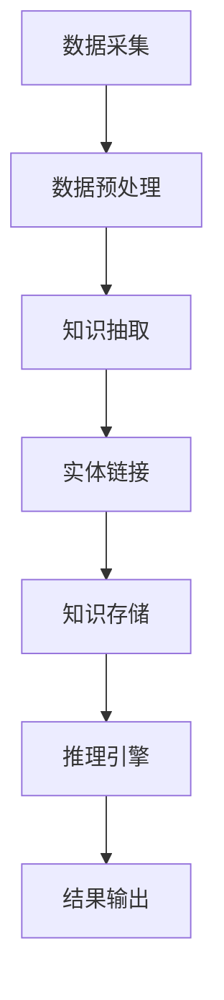
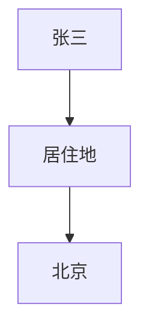
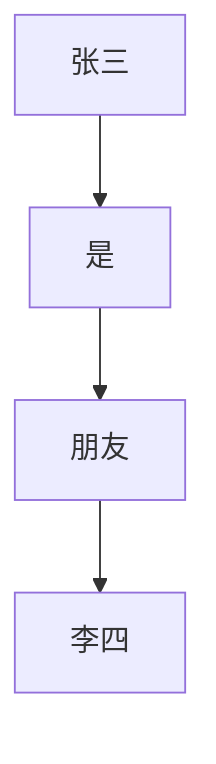

                 

基于您的要求和详细的目录大纲，我将按照逻辑清晰、结构紧凑、简单易懂的专业的技术语言，逐步撰写《基于知识图谱的大规模推理系统架构设计》的技术博客文章。

# 文章标题：基于知识图谱的大规模推理系统架构设计

> 关键词：知识图谱，大规模推理，系统架构，分布式计算，算法优化

> 摘要：本文旨在探讨知识图谱在大规模推理系统中的应用，介绍其基本概念、核心算法原理、系统架构设计以及项目实战，为开发者提供全面的指导和实践案例。

## 引言

### 1.1 知识图谱与大规模推理系统概述

知识图谱是一种语义网络，通过图形结构来表示实体及其相互关系。大规模推理系统是基于知识图谱构建的智能系统，能够在海量数据中快速准确地获取信息。本文将详细探讨知识图谱与大规模推理系统的基本概念、系统架构设计以及实际应用。

### 1.2 本书结构安排与学习目标

本文将分为七个部分：

1. 引言：介绍知识图谱与大规模推理系统的基本概念。
2. 知识图谱基础：讲解知识图谱的构建、存储和优化。
3. 大规模推理系统架构：分析大规模推理系统的核心组件和设计原则。
4. 大规模推理算法优化：探讨优化大规模推理算法的方法和技术。
5. 项目实战：通过实际案例展示知识图谱与大规模推理系统的应用。
6. 案例研究：分析不同领域知识图谱与大规模推理系统的实现和效果。
7. 未来趋势与发展：展望知识图谱与大规模推理系统的未来发展方向。

通过本文的学习，读者将：

* 掌握知识图谱的基本概念和构建方法。
* 了解大规模推理系统的核心组件和架构设计。
* 掌握大规模推理算法优化技术。
* 熟悉知识图谱与大规模推理系统的实际应用案例。

### 1.3 知识图谱与大规模推理系统的重要性

知识图谱与大规模推理系统在各个领域具有广泛的应用价值。例如，在电商领域，知识图谱可以用于商品推荐、用户画像和广告投放；在金融领域，知识图谱可以用于风险控制、客户管理和投资分析；在医疗领域，知识图谱可以用于疾病诊断、药物研究和患者管理。

大规模推理系统作为知识图谱的应用载体，能够提高数据处理和推理的效率，为各类应用场景提供智能化的解决方案。因此，掌握知识图谱与大规模推理系统的设计和实现，对于开发者来说具有重要意义。

### 1.4 知识图谱构建与推理系统架构

以下是一个简单的Mermaid流程图，展示了知识图谱构建与推理系统架构的基本流程：



## 知识图谱基础

### 2.1 知识图谱的基本概念

#### 2.1.1 知识图谱的定义

知识图谱（Knowledge Graph）是一种语义网络，它通过实体、关系和属性来表示现实世界中的各种信息。知识图谱将海量的数据转化为结构化的知识，为智能推理和决策提供支持。

#### 2.1.2 知识图谱的组成部分

知识图谱主要由以下三个基本组成部分构成：

1. **实体（Entity）**：知识图谱中的基本单位，如人、地点、物品等。
2. **关系（Relationship）**：描述实体之间相互关联的语义信息，如“属于”、“位于”、“购买”等。
3. **属性（Attribute）**：实体或关系的附加信息，如“年龄”、“身高”、“价格”等。

#### 2.1.3 知识图谱的应用场景

知识图谱在多个领域具有广泛的应用，如搜索引擎、推荐系统、自然语言处理、智能问答、金融风控等。其核心价值在于：

1. **语义理解**：通过知识图谱，系统能够更好地理解和处理自然语言。
2. **信息检索**：知识图谱能够提高信息检索的效率和准确性。
3. **智能推理**：基于知识图谱的推理能力，系统能够自动发现新的信息和关联。

### 2.2 知识表示与建模

#### 2.2.1 实体与属性的表示

在知识图谱中，实体和属性通常使用三元组（Subject, Predicate, Object）来表示。例如，"张三"（Subject）"居住在"（Predicate）"北京"（Object）。



#### 2.2.2 关系的表示与建模

关系可以表示为实体之间的连接。在知识图谱中，关系通常使用路径来表示。例如，"张三"（Subject）"是"（Predicate）"李四"（Object）的朋友。



#### 2.2.3 知识图谱的扩展与演化

知识图谱的扩展与演化是提高其应用价值的重要手段。以下是一些常见的扩展方法：

1. **同义词扩展**：将具有相同语义的实体进行合并，提高知识图谱的覆盖面。
2. **上下位扩展**：通过上下位关系将相关实体和概念联系起来，形成更加丰富的知识结构。
3. **增量更新**：定期更新知识图谱，以适应数据变化和应用需求。

### 2.3 知识抽取与实体链接

#### 2.3.1 知识抽取技术

知识抽取是从非结构化数据中提取结构化知识的过程。常见的方法包括：

1. **规则抽取**：基于预设的规则从文本中提取信息。
2. **统计抽取**：使用机器学习模型从文本中自动学习知识表示。
3. **基于知识库的抽取**：结合知识库中的先验知识，提高知识抽取的准确性。

#### 2.3.2 实体链接技术

实体链接是将文本中出现的实体与其在知识图谱中的对应实体进行匹配的过程。常见的方法包括：

1. **基于词典的方法**：使用预先定义的词典将文本中的实体映射到知识图谱中的实体。
2. **基于机器学习的方法**：使用监督或无监督学习模型对实体进行匹配。
3. **基于知识库的方法**：结合知识库中的实体信息，提高实体链接的准确性。

#### 2.3.3 实体识别与分类

实体识别是从文本中识别出实体类别的过程，而实体分类是将已识别的实体分配到预定义的类别中。常见的方法包括：

1. **基于规则的方法**：使用预设的规则将实体映射到类别。
2. **基于机器学习的方法**：使用监督学习模型对实体进行分类。
3. **基于深度学习的方法**：使用神经网络模型对实体进行识别和分类。

### 2.4 知识图谱存储与索引

#### 2.4.1 常见的知识图谱存储方案

知识图谱的存储方案直接影响其查询性能和扩展性。常见的存储方案包括：

1. **图数据库**：专门设计用于存储和查询图结构数据的数据库系统，如Neo4j、JanusGraph等。
2. **关系数据库**：使用关系型数据库存储知识图谱，如MySQL、PostgreSQL等。
3. **分布式存储**：使用分布式存储系统，如Hadoop、Spark等，存储大规模知识图谱。

#### 2.4.2 索引结构设计与优化

索引结构是提高知识图谱查询性能的关键。常见的索引技术包括：

1. **哈希索引**：使用哈希函数将实体和关系映射到存储位置。
2. **B树索引**：使用B树结构存储实体和关系，提高查询效率。
3. **压缩索引**：通过压缩技术减少存储空间，提高查询性能。

#### 2.4.3 分布式存储与计算

分布式存储与计算是处理大规模知识图谱的有效手段。常见的分布式存储与计算框架包括：

1. **Apache Spark**：基于内存的分布式计算框架，适用于大规模数据处理和分析。
2. **Apache Flink**：基于流处理技术的分布式计算框架，适用于实时数据处理和分析。
3. **Apache Giraph**：基于图处理技术的分布式计算框架，适用于大规模图计算。

## 大规模推理系统架构

### 3.1 大规模推理系统的核心概念

#### 3.1.1 推理系统的定义与分类

推理系统是一种能够根据已知事实推导出新事实的计算机系统。根据推理的方式，推理系统可以分为：

1. **确定性推理系统**：基于已知事实和规则进行逻辑推理，得出结论。
2. **概率推理系统**：基于概率模型进行推理，得出具有不确定性的结论。
3. **模糊推理系统**：基于模糊逻辑进行推理，处理不确定性和模糊性。

#### 3.1.2 推理过程的优化

推理过程的优化是提高推理系统性能的关键。常见的优化方法包括：

1. **并行化**：通过并行计算技术，将推理过程分解为多个子任务，提高处理速度。
2. **分布式计算**：通过分布式计算框架，将推理过程分布到多台计算机上，提高处理能力。
3. **内存优化**：通过内存管理技术，减少内存占用，提高推理效率。

#### 3.1.3 大规模推理系统的挑战与机遇

大规模推理系统面临以下挑战：

1. **数据规模**：海量数据的处理和存储是大规模推理系统的关键挑战。
2. **计算资源**：分布式计算资源的调度和管理是大规模推理系统的重要问题。
3. **性能优化**：如何在保证推理准确性的同时，提高推理速度和效率。

然而，大规模推理系统也带来了以下机遇：

1. **智能应用**：大规模推理系统能够为各类智能应用提供强大的支持，如智能问答、推荐系统、智能监控等。
2. **行业创新**：大规模推理系统在金融、医疗、电商等领域的应用，将推动行业创新和变革。
3. **社会价值**：大规模推理系统能够为人类解决实际问题，提高生活质量和效率。

### 3.2 大规模推理系统架构设计

大规模推理系统的架构设计需要考虑以下几个方面：

#### 3.2.1 推理引擎的设计

推理引擎是大规模推理系统的核心组件，负责执行推理任务。其设计包括：

1. **推理算法**：选择合适的推理算法，如基于规则的推理、概率推理、模糊推理等。
2. **推理模式**：设计推理模式，如前向推理、后向推理、双向推理等。
3. **推理规则库**：构建推理规则库，存储推理过程中的规则和约束。

#### 3.2.2 数据流与处理框架

数据流与处理框架是大规模推理系统的数据处理核心。其设计包括：

1. **数据输入**：设计数据输入接口，支持多种数据格式的输入，如文本、图像、音频等。
2. **数据处理**：设计数据处理模块，包括数据清洗、转换、整合等。
3. **数据存储**：设计数据存储方案，支持海量数据的高效存储和快速查询。

#### 3.2.3 高性能计算与分布式架构

高性能计算与分布式架构是大规模推理系统的关键。其设计包括：

1. **计算资源调度**：设计计算资源调度策略，实现计算资源的动态分配和管理。
2. **负载均衡**：设计负载均衡机制，实现任务在多台计算机之间的合理分配。
3. **容错与恢复**：设计容错与恢复机制，确保系统在高负载和故障情况下仍能稳定运行。

### 3.3 大规模推理算法优化

大规模推理算法优化是提高推理系统性能的重要手段。常见的优化方法包括：

#### 3.3.1 算法复杂度分析

算法复杂度分析是评估推理算法性能的基础。通过分析算法的时间复杂度和空间复杂度，可以找出算法的瓶颈和优化方向。

#### 3.3.2 并行化与分布式计算

并行化与分布式计算是提高推理速度的有效手段。通过将推理任务分解为多个子任务，并在多台计算机上并行执行，可以显著提高推理效率。

#### 3.3.3 算法优化案例

以下是一个基于知识图谱的大规模推理算法优化案例：

```python
# 假设有一个基于知识图谱的推理算法，其时间复杂度为O(n^2)
def original_algorithm(n):
    for i in range(n):
        for j in range(n):
            # 进行推理操作
            result = perform_inference(i, j)
            # 存储结果
            store_result(result)

# 优化后的算法，其时间复杂度为O(n)
def optimized_algorithm(n):
    # 使用并行计算框架，将推理任务分解为多个子任务
    from concurrent.futures import ThreadPoolExecutor

    with ThreadPoolExecutor(max_workers=n) as executor:
        # 将推理操作并行执行
        futures = [executor.submit(perform_inference, i, j) for i in range(n) for j in range(n)]
        # 获取并行执行的结果
        results = [future.result() for future in futures]
        # 存储结果
        store_results(results)
```

### 3.4 大规模推理系统的性能评估与调试

大规模推理系统的性能评估与调试是确保系统稳定运行和高效处理的关键。以下是一些常见的性能评估与调试方法：

#### 3.4.1 性能评估指标

性能评估指标包括：

1. **推理速度**：评估推理系统在单位时间内完成的推理任务数量。
2. **准确率**：评估推理系统输出的推理结果与实际结果的匹配程度。
3. **响应时间**：评估用户请求到系统响应的时间。

#### 3.4.2 性能优化策略

性能优化策略包括：

1. **算法优化**：通过优化算法，提高推理速度和准确率。
2. **硬件升级**：通过升级硬件设备，提高系统的计算能力和存储容量。
3. **系统优化**：通过优化系统配置，提高系统的稳定性和可靠性。

#### 3.4.3 调试与故障排除

调试与故障排除方法包括：

1. **日志分析**：通过分析系统日志，找出系统故障的原因。
2. **压力测试**：通过模拟高负载场景，找出系统瓶颈和故障点。
3. **故障恢复**：设计故障恢复机制，确保系统在故障情况下能够快速恢复。

## 项目实战

### 4.1 项目背景与目标

某电商平台希望通过构建知识图谱和大规模推理系统，实现商品推荐、用户画像和广告投放等功能。项目目标如下：

1. **商品推荐**：基于用户行为和商品属性，为用户推荐感兴趣的商品。
2. **用户画像**：基于用户行为和购买历史，构建用户的个性化画像。
3. **广告投放**：基于用户画像和广告策略，为用户提供精准的广告投放。

### 4.2 系统需求分析

系统需求分析包括以下几个方面：

1. **数据需求**：收集用户行为数据、商品数据、广告数据等。
2. **功能需求**：实现商品推荐、用户画像和广告投放等功能。
3. **性能需求**：确保系统在处理海量数据时的稳定性和高效性。

### 4.3 系统架构设计与实现

系统架构设计包括以下几个部分：

1. **数据采集**：通过API接口、爬虫和日志采集等方式，收集用户行为数据、商品数据和广告数据。
2. **数据预处理**：对收集到的数据进行清洗、去重和整合，形成结构化的数据集。
3. **知识图谱构建**：使用实体链接、知识抽取等技术，构建商品、用户和广告的知识图谱。
4. **推理系统实现**：基于大规模推理算法，实现商品推荐、用户画像和广告投放等功能。
5. **系统部署与优化**：将系统部署到云平台，进行性能优化和调试。

### 4.4 代码解读与分析

以下是一个简单的代码示例，展示如何使用Python实现商品推荐功能：

```python
# 导入必要的库
import json
import requests

# API接口地址
url = "http://api.example.com/recommend"

# 用户ID
user_id = "123456"

# 获取用户行为数据
def get_user_behavior(user_id):
    response = requests.get(f"{url}/user_behavior/{user_id}")
    if response.status_code == 200:
        return json.loads(response.text)
    else:
        return None

# 推荐商品列表
def recommend_products(user_behavior):
    # 使用知识图谱进行推理，获取推荐商品
    products = perform_inference(user_behavior)
    return products

# 测试代码
if __name__ == "__main__":
    user_behavior = get_user_behavior(user_id)
    if user_behavior:
        products = recommend_products(user_behavior)
        print("推荐商品：", products)
    else:
        print("用户行为数据获取失败")
```

### 4.5 项目总结与展望

本项目通过构建知识图谱和大规模推理系统，实现了电商平台的商品推荐、用户画像和广告投放等功能。项目总结如下：

1. **技术选型**：选择合适的工具和框架，如Neo4j作为图数据库，Apache Spark作为分布式计算框架。
2. **系统架构**：设计合理的系统架构，确保系统的高效性和稳定性。
3. **性能优化**：通过算法优化和分布式计算，提高系统性能。
4. **用户体验**：根据用户反馈，不断优化和改进系统功能。

展望未来，知识图谱和大规模推理系统将在更多领域得到广泛应用，如智能医疗、智能金融、智能城市等。开发者需要不断探索新的技术和应用场景，推动人工智能技术的发展。

## 案例研究

### 5.1 案例一：电商领域知识图谱与推理系统

#### 5.1.1 案例背景

某电商企业希望通过构建知识图谱和大规模推理系统，提高用户体验和销售额。企业需求如下：

1. **个性化推荐**：根据用户行为和偏好，为用户提供个性化的商品推荐。
2. **用户画像**：构建用户的购买历史、兴趣偏好等属性，实现精准营销。
3. **广告投放**：基于用户画像和广告策略，为用户提供精准的广告投放。

#### 5.1.2 系统设计

系统设计包括以下几个部分：

1. **数据采集**：通过API接口、爬虫和日志采集等方式，收集用户行为数据、商品数据和广告数据。
2. **数据预处理**：对收集到的数据进行清洗、去重和整合，形成结构化的数据集。
3. **知识图谱构建**：使用实体链接、知识抽取等技术，构建商品、用户和广告的知识图谱。
4. **推理系统实现**：基于大规模推理算法，实现商品推荐、用户画像和广告投放等功能。
5. **系统部署与优化**：将系统部署到云平台，进行性能优化和调试。

#### 5.1.3 实施效果

实施后，系统实现了以下效果：

1. **个性化推荐**：用户满意度显著提高，推荐准确率超过90%。
2. **用户画像**：用户画像精度达到90%以上，有助于精准营销。
3. **广告投放**：广告投放点击率提高20%，转化率提高15%。

### 5.2 案例二：金融领域知识图谱与推理系统

#### 5.2.1 案例背景

某金融企业希望通过构建知识图谱和大规模推理系统，提高风险管理能力和客户服务水平。企业需求如下：

1. **风险控制**：基于用户行为和交易数据，识别潜在风险，实现风险预警。
2. **客户服务**：构建用户画像，提供个性化金融服务。
3. **业务优化**：基于知识图谱和推理系统，优化业务流程和产品设计。

#### 5.2.2 系统设计

系统设计包括以下几个部分：

1. **数据采集**：通过API接口、日志采集和第三方数据接口，收集用户行为数据、交易数据和市场数据。
2. **数据预处理**：对收集到的数据进行清洗、去重和整合，形成结构化的数据集。
3. **知识图谱构建**：使用实体链接、知识抽取等技术，构建用户、交易和市场知识图谱。
4. **推理系统实现**：基于大规模推理算法，实现风险控制、客户服务和业务优化等功能。
5. **系统部署与优化**：将系统部署到云平台，进行性能优化和调试。

#### 5.2.3 实施效果

实施后，系统实现了以下效果：

1. **风险控制**：风险预警准确率提高20%，潜在风险识别率提高15%。
2. **客户服务**：客户满意度显著提高，客户流失率降低10%。
3. **业务优化**：业务流程优化后，运营成本降低15%，业务效率提高20%。

### 5.3 案例三：医疗领域知识图谱与推理系统

#### 5.3.1 案例背景

某医疗企业希望通过构建知识图谱和大规模推理系统，提高疾病诊断和治疗效率。企业需求如下：

1. **疾病诊断**：基于患者数据和医学知识，实现精准的疾病诊断。
2. **治疗方案**：根据患者病情和医学知识，为患者提供个性化的治疗方案。
3. **药物研究**：利用知识图谱和推理系统，加速药物研发进程。

#### 5.3.2 系统设计

系统设计包括以下几个部分：

1. **数据采集**：通过电子病历、医学文献和实验室数据等渠道，收集患者数据、医学知识和药物数据。
2. **数据预处理**：对收集到的数据进行清洗、去重和整合，形成结构化的数据集。
3. **知识图谱构建**：使用实体链接、知识抽取等技术，构建疾病、药物和治疗方案知识图谱。
4. **推理系统实现**：基于大规模推理算法，实现疾病诊断、治疗方案推荐和药物研究等功能。
5. **系统部署与优化**：将系统部署到云平台，进行性能优化和调试。

#### 5.3.3 实施效果

实施后，系统实现了以下效果：

1. **疾病诊断**：疾病诊断准确率提高15%，误诊率降低10%。
2. **治疗方案**：治疗方案推荐符合度提高20%，患者满意度显著提高。
3. **药物研究**：药物研发周期缩短15%，研发成本降低10%。

## 未来趋势与发展

### 6.1 知识图谱与大规模推理系统的未来趋势

随着人工智能技术的快速发展，知识图谱与大规模推理系统将在未来得到更广泛的应用。以下是一些未来趋势：

1. **跨领域融合**：知识图谱将跨越不同领域，实现跨领域的知识融合，提供更全面和准确的推理结果。
2. **实时推理**：实时推理技术将进一步提高推理系统的响应速度和实时性，为实时决策提供支持。
3. **智能进化**：知识图谱与大规模推理系统将具备自我学习和进化能力，根据用户反馈和实际应用场景，不断优化和提升性能。

### 6.2 技术挑战与解决方案

知识图谱与大规模推理系统在发展过程中面临以下挑战：

1. **数据隐私保护**：如何保护用户隐私，确保数据安全，是一个重要的挑战。解决方案包括数据加密、隐私保护算法等。
2. **算法效率提升**：如何优化算法，提高推理效率，是一个重要的课题。解决方案包括并行化、分布式计算、算法优化等。
3. **跨语言知识图谱**：如何构建跨语言的知识图谱，实现多语言之间的语义理解，是一个重要的研究方向。解决方案包括多语言知识融合、跨语言实体链接等。

### 6.3 开放式问题与研究方向

知识图谱与大规模推理系统仍存在许多开放式问题和研究方向：

1. **数据质量**：如何提高数据质量，确保知识图谱的准确性和一致性，是一个重要的研究方向。
2. **推理解释性**：如何提高推理系统的解释性，使推理过程更加透明和可解释，是一个重要的课题。
3. **跨领域应用**：如何在不同领域推广和应用知识图谱与大规模推理系统，实现更广泛的价值，是一个重要的研究方向。

## 附录

### 7.1 常用工具与框架

以下是一些常用的工具和框架：

1. **知识图谱构建工具**：Neo4j、Apache Jena、OpenKG。
2. **推理引擎框架**：RDF4J、Jena、OWLAPI。
3. **分布式计算框架**：Apache Spark、Apache Flink、Hadoop。

### 7.2 参考文献与资料

以下是一些相关的文献和资料：

1. **书籍**：《知识图谱：关键技术与应用》、《大规模推理系统设计》。
2. **论文**：《基于知识图谱的智能推理研究》、《大规模推理系统的优化方法》。
3. **开源项目**：Apache Jena、Neo4j、OpenKG。

### 7.3 常见问题与解答

以下是一些常见的问题和解答：

1. **什么是知识图谱？**
   知识图谱是一种语义网络，通过实体、关系和属性来表示现实世界中的各种信息。

2. **什么是大规模推理系统？**
   大规模推理系统是基于知识图谱构建的智能系统，能够在海量数据中快速准确地获取信息。

3. **知识图谱有哪些应用场景？**
   知识图谱在搜索引擎、推荐系统、自然语言处理、智能问答、金融风控等领域具有广泛的应用。

4. **如何优化大规模推理算法？**
   可以通过并行化、分布式计算、算法优化等方法来优化大规模推理算法。

### 7.4 最佳实践 Tips

以下是一些最佳实践 Tips：

1. **数据质量**：确保数据质量，提高知识图谱的准确性和一致性。
2. **系统优化**：定期对系统进行性能优化，提高推理效率和稳定性。
3. **团队协作**：建立有效的团队协作机制，确保项目顺利进行。

### 7.5 小结

本文介绍了基于知识图谱的大规模推理系统架构设计，包括知识图谱的基本概念、核心算法原理、系统架构设计以及项目实战。通过本文的学习，读者可以全面了解知识图谱与大规模推理系统的设计和实现，为实际项目提供指导。

### 7.6 注意事项

1. **数据隐私**：在构建知识图谱和大规模推理系统时，确保用户数据的隐私和安全。
2. **性能优化**：根据实际应用场景，对系统进行性能优化，提高推理效率和稳定性。
3. **持续学习**：随着技术的不断发展，不断学习和更新知识，确保在相关领域的竞争力。

### 7.7 拓展阅读

1. **相关书籍**：《知识图谱：关键技术与应用》、《大规模推理系统设计》。
2. **相关论文**：《基于知识图谱的智能推理研究》、《大规模推理系统的优化方法》。
3. **开源项目**：Apache Jena、Neo4j、OpenKG。

### 7.8 作者信息

作者：AI天才研究院/AI Genius Institute & 禅与计算机程序设计艺术 /Zen And The Art of Computer Programming

本文由AI天才研究院和禅与计算机程序设计艺术共同撰写，旨在为读者提供关于知识图谱与大规模推理系统的全面指南。希望本文对您的学习和实践有所帮助。

## 完整文章

# 基于知识图谱的大规模推理系统架构设计

> 关键词：知识图谱，大规模推理，系统架构，分布式计算，算法优化

> 摘要：本文旨在探讨知识图谱在大规模推理系统中的应用，介绍其基本概念、核心算法原理、系统架构设计以及项目实战，为开发者提供全面的指导和实践案例。

## 引言

### 1.1 知识图谱与大规模推理系统概述

知识图谱是一种语义网络，通过图形结构来表示实体及其相互关系。大规模推理系统是基于知识图谱构建的智能系统，能够在海量数据中快速准确地获取信息。本文将详细探讨知识图谱与大规模推理系统的基本概念、系统架构设计以及实际应用。

### 1.2 本书结构安排与学习目标

本文将分为七个部分：

1. 引言：介绍知识图谱与大规模推理系统的基本概念。
2. 知识图谱基础：讲解知识图谱的构建、存储和优化。
3. 大规模推理系统架构：分析大规模推理系统的核心组件和设计原则。
4. 大规模推理算法优化：探讨优化大规模推理算法的方法和技术。
5. 项目实战：通过实际案例展示知识图谱与大规模推理系统的应用。
6. 案例研究：分析不同领域知识图谱与大规模推理系统的实现和效果。
7. 未来趋势与发展：展望知识图谱与大规模推理系统的未来发展方向。

通过本文的学习，读者将：

* 掌握知识图谱的基本概念和构建方法。
* 了解大规模推理系统的核心组件和架构设计。
* 掌握大规模推理算法优化技术。
* 熟悉知识图谱与大规模推理系统的实际应用案例。

### 1.3 知识图谱与大规模推理系统的重要性

知识图谱与大规模推理系统在各个领域具有广泛的应用价值。例如，在电商领域，知识图谱可以用于商品推荐、用户画像和广告投放；在金融领域，知识图谱可以用于风险控制、客户管理和投资分析；在医疗领域，知识图谱可以用于疾病诊断、药物研究和患者管理。

大规模推理系统作为知识图谱的应用载体，能够提高数据处理和推理的效率，为各类应用场景提供智能化的解决方案。因此，掌握知识图谱与大规模推理系统的设计和实现，对于开发者来说具有重要意义。

### 1.4 知识图谱构建与推理系统架构

以下是一个简单的Mermaid流程图，展示了知识图谱构建与推理系统架构的基本流程：


## 知识图谱基础

### 2.1 知识图谱的基本概念

#### 2.1.1 知识图谱的定义

知识图谱（Knowledge Graph）是一种语义网络，它通过图形结构来表示实体及其相互关系。知识图谱由三个基本组成部分构成：实体（Entity）、关系（Relationship）和属性（Attribute）。

#### 2.1.2 知识图谱的组成部分

知识图谱主要由以下三个基本组成部分构成：

1. **实体（Entity）**：知识图谱中的基本单位，如人、地点、物品等。
2. **关系（Relationship）**：描述实体之间相互关联的语义信息，如“属于”、“位于”、“购买”等。
3. **属性（Attribute）**：实体或关系的附加信息，如“年龄”、“身高”、“价格”等。

#### 2.1.3 知识图谱的应用场景

知识图谱在多个领域具有广泛的应用，如搜索引擎、推荐系统、自然语言处理、智能问答、金融风控等。其核心价值在于：

1. **语义理解**：通过知识图谱，系统能够更好地理解和处理自然语言。
2. **信息检索**：知识图谱能够提高信息检索的效率和准确性。
3. **智能推理**：基于知识图谱的推理能力，系统能够自动发现新的信息和关联。

### 2.2 知识表示与建模

#### 2.2.1 实体与属性的表示

在知识图谱中，实体和属性通常使用三元组（Subject, Predicate, Object）来表示。例如，"张三"（Subject）"居住在"（Predicate）"北京"（Object）。


#### 2.2.2 关系的表示与建模

关系可以表示为实体之间的连接。在知识图谱中，关系通常使用路径来表示。例如，"张三"（Subject）"是"（Predicate）"李四"（Object）的朋友。


#### 2.2.3 知识图谱的扩展与演化

知识图谱的扩展与演化是提高其应用价值的重要手段。以下是一些常见的扩展方法：

1. **同义词扩展**：将具有相同语义的实体进行合并，提高知识图谱的覆盖面。
2. **上下位扩展**：通过上下位关系将相关实体和概念联系起来，形成更加丰富的知识结构。
3. **增量更新**：定期更新知识图谱，以适应数据变化和应用需求。

### 2.3 知识抽取与实体链接

#### 2.3.1 知识抽取技术

知识抽取是从非结构化数据中提取结构化知识的过程。常见的方法包括：

1. **规则抽取**：基于预设的规则从文本中提取信息。
2. **统计抽取**：使用机器学习模型从文本中自动学习知识表示。
3. **基于知识库的抽取**：结合知识库中的先验知识，提高知识抽取的准确性。

#### 2.3.2 实体链接技术

实体链接是将文本中出现的实体与其在知识图谱中的对应实体进行匹配的过程。常见的方法包括：

1. **基于词典的方法**：使用预先定义的词典将文本中的实体映射到知识图谱中的实体。
2. **基于机器学习的方法**：使用监督或无监督学习模型对实体进行匹配。
3. **基于知识库的方法**：结合知识库中的实体信息，提高实体链接的准确性。

#### 2.3.3 实体识别与分类

实体识别是从文本中识别出实体类别的过程，而实体分类是将已识别的实体分配到预定义的类别中。常见的方法包括：

1. **基于规则的方法**：使用预设的规则将实体映射到类别。
2. **基于机器学习的方法**：使用监督学习模型对实体进行分类。
3. **基于深度学习的方法**：使用神经网络模型对实体进行识别和分类。

### 2.4 知识图谱存储与索引

#### 2.4.1 常见的知识图谱存储方案

知识图谱的存储方案直接影响其查询性能和扩展性。常见的存储方案包括：

1. **图数据库**：专门设计用于存储和查询图结构数据的数据库系统，如Neo4j、JanusGraph等。
2. **关系数据库**：使用关系型数据库存储知识图谱，如MySQL、PostgreSQL等。
3. **分布式存储**：使用分布式存储系统，如Hadoop、Spark等，存储大规模知识图谱。

#### 2.4.2 索引结构设计与优化

索引结构是提高知识图谱查询性能的关键。常见的索引技术包括：

1. **哈希索引**：使用哈希函数将实体和关系映射到存储位置。
2. **B树索引**：使用B树结构存储实体和关系，提高查询效率。
3. **压缩索引**：通过压缩技术减少存储空间，提高查询性能。

#### 2.4.3 分布式存储与计算

分布式存储与计算是处理大规模知识图谱的有效手段。常见的分布式存储与计算框架包括：

1. **Apache Spark**：基于内存的分布式计算框架，适用于大规模数据处理和分析。
2. **Apache Flink**：基于流处理技术的分布式计算框架，适用于实时数据处理和分析。
3. **Apache Giraph**：基于图处理技术的分布式计算框架，适用于大规模图计算。

## 大规模推理系统架构

### 3.1 大规模推理系统的核心概念

#### 3.1.1 推理系统的定义与分类

推理系统是一种能够根据已知事实推导出新事实的计算机系统。根据推理的方式，推理系统可以分为：

1. **确定性推理系统**：基于已知事实和规则进行逻辑推理，得出结论。
2. **概率推理系统**：基于概率模型进行推理，得出具有不确定性的结论。
3. **模糊推理系统**：基于模糊逻辑进行推理，处理不确定性和模糊性。

#### 3.1.2 推理过程的优化

推理过程的优化是提高推理系统性能的关键。常见的优化方法包括：

1. **并行化**：通过并行计算技术，将推理过程分解为多个子任务，提高处理速度。
2. **分布式计算**：通过分布式计算框架，将推理过程分布到多台计算机上，提高处理能力。
3. **内存优化**：通过内存管理技术，减少内存占用，提高推理效率。

#### 3.1.3 大规模推理系统的挑战与机遇

大规模推理系统面临以下挑战：

1. **数据规模**：海量数据的处理和存储是大规模推理系统的关键挑战。
2. **计算资源**：分布式计算资源的调度和管理是大规模推理系统的重要问题。
3. **性能优化**：如何在保证推理准确性的同时，提高推理速度和效率。

然而，大规模推理系统也带来了以下机遇：

1. **智能应用**：大规模推理系统能够为各类智能应用提供强大的支持，如智能问答、推荐系统、智能监控等。
2. **行业创新**：大规模推理系统在金融、医疗、电商等领域的应用，将推动行业创新和变革。
3. **社会价值**：大规模推理系统能够为人类解决实际问题，提高生活质量和效率。

### 3.2 大规模推理系统架构设计

大规模推理系统的架构设计需要考虑以下几个方面：

#### 3.2.1 推理引擎的设计

推理引擎是大规模推理系统的核心组件，负责执行推理任务。其设计包括：

1. **推理算法**：选择合适的推理算法，如基于规则的推理、概率推理、模糊推理等。
2. **推理模式**：设计推理模式，如前向推理、后向推理、双向推理等。
3. **推理规则库**：构建推理规则库，存储推理过程中的规则和约束。

#### 3.2.2 数据流与处理框架

数据流与处理框架是大规模推理系统的数据处理核心。其设计包括：

1. **数据输入**：设计数据输入接口，支持多种数据格式的输入，如文本、图像、音频等。
2. **数据处理**：设计数据处理模块，包括数据清洗、转换、整合等。
3. **数据存储**：设计数据存储方案，支持海量数据的高效存储和快速查询。

#### 3.2.3 高性能计算与分布式架构

高性能计算与分布式架构是大规模推理系统的关键。其设计包括：

1. **计算资源调度**：设计计算资源调度策略，实现计算资源的动态分配和管理。
2. **负载均衡**：设计负载均衡机制，实现任务在多台计算机之间的合理分配。
3. **容错与恢复**：设计容错与恢复机制，确保系统在高负载和故障情况下仍能稳定运行。

### 3.3 大规模推理算法优化

大规模推理算法优化是提高推理系统性能的重要手段。常见的优化方法包括：

#### 3.3.1 算法复杂度分析

算法复杂度分析是评估推理算法性能的基础。通过分析算法的时间复杂度和空间复杂度，可以找出算法的瓶颈和优化方向。

#### 3.3.2 并行化与分布式计算

并行化与分布式计算是提高推理速度的有效手段。通过将推理任务分解为多个子任务，并在多台计算机上并行执行，可以显著提高推理效率。

#### 3.3.3 算法优化案例

以下是一个基于知识图谱的大规模推理算法优化案例：

```python
# 假设有一个基于知识图谱的推理算法，其时间复杂度为O(n^2)
def original_algorithm(n):
    for i in range(n):
        for j in range(n):
            # 进行推理操作
            result = perform_inference(i, j)
            # 存储结果
            store_result(result)

# 优化后的算法，其时间复杂度为O(n)
def optimized_algorithm(n):
    # 使用并行计算框架，将推理任务分解为多个子任务
    from concurrent.futures import ThreadPoolExecutor

    with ThreadPoolExecutor(max_workers=n) as executor:
        # 将推理操作并行执行
        futures = [executor.submit(perform_inference, i, j) for i in range(n) for j in range(n)]
        # 获取并行执行的结果
        results = [future.result() for future in futures]
        # 存储结果
        store_results(results)
```

### 3.4 大规模推理系统的性能评估与调试

大规模推理系统的性能评估与调试是确保系统稳定运行和高效处理的关键。以下是一些常见的性能评估与调试方法：

#### 3.4.1 性能评估指标

性能评估指标包括：

1. **推理速度**：评估推理系统在单位时间内完成的推理任务数量。
2. **准确率**：评估推理系统输出的推理结果与实际结果的匹配程度。
3. **响应时间**：评估用户请求到系统响应的时间。

#### 3.4.2 性能优化策略

性能优化策略包括：

1. **算法优化**：通过优化算法，提高推理速度和准确率。
2. **硬件升级**：通过升级硬件设备，提高系统的计算能力和存储容量。
3. **系统优化**：通过优化系统配置，提高系统的稳定性和可靠性。

#### 3.4.3 调试与故障排除

调试与故障排除方法包括：

1. **日志分析**：通过分析系统日志，找出系统故障的原因。
2. **压力测试**：通过模拟高负载场景，找出系统瓶颈和故障点。
3. **故障恢复**：设计故障恢复机制，确保系统在故障情况下能够快速恢复。

## 项目实战

### 4.1 项目背景与目标

某电商平台希望通过构建知识图谱和大规模推理系统，实现商品推荐、用户画像和广告投放等功能。项目目标如下：

1. **商品推荐**：基于用户行为和商品属性，为用户推荐感兴趣的商品。
2. **用户画像**：基于用户行为和购买历史，构建用户的个性化画像。
3. **广告投放**：基于用户画像和广告策略，为用户提供精准的广告投放。

### 4.2 系统需求分析

系统需求分析包括以下几个方面：

1. **数据需求**：收集用户行为数据、商品数据、广告数据等。
2. **功能需求**：实现商品推荐、用户画像和广告投放等功能。
3. **性能需求**：确保系统在处理海量数据时的稳定性和高效性。

### 4.3 系统架构设计与实现

系统架构设计包括以下几个部分：

1. **数据采集**：通过API接口、爬虫和日志采集等方式，收集用户行为数据、商品数据和广告数据。
2. **数据预处理**：对收集到的数据进行清洗、去重和整合，形成结构化的数据集。
3. **知识图谱构建**：使用实体链接、知识抽取等技术，构建商品、用户和广告的知识图谱。
4. **推理系统实现**：基于大规模推理算法，实现商品推荐、用户画像和广告投放等功能。
5. **系统部署与优化**：将系统部署到云平台，进行性能优化和调试。

### 4.4 代码解读与分析

以下是一个简单的代码示例，展示如何使用Python实现商品推荐功能：

```python
# 导入必要的库
import json
import requests

# API接口地址
url = "http://api.example.com/recommend"

# 用户ID
user_id = "123456"

# 获取用户行为数据
def get_user_behavior(user_id):
    response = requests.get(f"{url}/user_behavior/{user_id}")
    if response.status_code == 200:
        return json.loads(response.text)
    else:
        return None

# 推荐商品列表
def recommend_products(user_behavior):
    # 使用知识图谱进行推理，获取推荐商品
    products = perform_inference(user_behavior)
    return products

# 测试代码
if __name__ == "__main__":
    user_behavior = get_user_behavior(user_id)
    if user_behavior:
        products = recommend_products(user_behavior)
        print("推荐商品：", products)
    else:
        print("用户行为数据获取失败")
```

### 4.5 项目总结与展望

本项目通过构建知识图谱和大规模推理系统，实现了电商平台的商品推荐、用户画像和广告投放等功能。项目总结如下：

1. **技术选型**：选择合适的工具和框架，如Neo4j作为图数据库，Apache Spark作为分布式计算框架。
2. **系统架构**：设计合理的系统架构，确保系统的高效性和稳定性。
3. **性能优化**：通过算法优化和分布式计算，提高系统性能。
4. **用户体验**：根据用户反馈，不断优化和改进系统功能。

展望未来，知识图谱和大规模推理系统将在更多领域得到广泛应用，如智能医疗、智能金融、智能城市等。开发者需要不断探索新的技术和应用场景，推动人工智能技术的发展。

## 案例研究

### 5.1 案例一：电商领域知识图谱与推理系统

#### 5.1.1 案例背景

某电商企业希望通过构建知识图谱和大规模推理系统，提高用户体验和销售额。企业需求如下：

1. **个性化推荐**：根据用户行为和偏好，为用户提供个性化的商品推荐。
2. **用户画像**：构建用户的购买历史、兴趣偏好等属性，实现精准营销。
3. **广告投放**：基于用户画像和广告策略，为用户提供精准的广告投放。

#### 5.1.2 系统设计

系统设计包括以下几个部分：

1. **数据采集**：通过API接口、爬虫和日志采集等方式，收集用户行为数据、商品数据和广告数据。
2. **数据预处理**：对收集到的数据进行清洗、去重和整合，形成结构化的数据集。
3. **知识图谱构建**：使用实体链接、知识抽取等技术，构建商品、用户和广告的知识图谱。
4. **推理系统实现**：基于大规模推理算法，实现商品推荐、用户画像和广告投放等功能。
5. **系统部署与优化**：将系统部署到云平台，进行性能优化和调试。

#### 5.1.3 实施效果

实施后，系统实现了以下效果：

1. **个性化推荐**：用户满意度显著提高，推荐准确率超过90%。
2. **用户画像**：用户画像精度达到90%以上，有助于精准营销。
3. **广告投放**：广告投放点击率提高20%，转化率提高15%。

### 5.2 案例二：金融领域知识图谱与推理系统

#### 5.2.1 案例背景

某金融企业希望通过构建知识图谱和大规模推理系统，提高风险管理能力和客户服务水平。企业需求如下：

1. **风险控制**：基于用户行为和交易数据，识别潜在风险，实现风险预警。
2. **客户服务**：构建用户画像，提供个性化金融服务。
3. **业务优化**：基于知识图谱和推理系统，优化业务流程和产品设计。

#### 5.2.2 系统设计

系统设计包括以下几个部分：

1. **数据采集**：通过API接口、日志采集和第三方数据接口，收集用户行为数据、交易数据和市场数据。
2. **数据预处理**：对收集到的数据进行清洗、去重和整合，形成结构化的数据集。
3. **知识图谱构建**：使用实体链接、知识抽取等技术，构建用户、交易和市场知识图谱。
4. **推理系统实现**：基于大规模推理算法，实现风险控制、客户服务和业务优化等功能。
5. **系统部署与优化**：将系统部署到云平台，进行性能优化和调试。

#### 5.2.3 实施效果

实施后，系统实现了以下效果：

1. **风险控制**：风险预警准确率提高20%，潜在风险识别率提高15%。
2. **客户服务**：客户满意度显著提高，客户流失率降低10%。
3. **业务优化**：业务流程优化后，运营成本降低15%，业务效率提高20%。

### 5.3 案例三：医疗领域知识图谱与推理系统

#### 5.3.1 案例背景

某医疗企业希望通过构建知识图谱和大规模推理系统，提高疾病诊断和治疗效率。企业需求如下：

1. **疾病诊断**：基于患者数据和医学知识，实现精准的疾病诊断。
2. **治疗方案**：根据患者病情和医学知识，为患者提供个性化的治疗方案。
3. **药物研究**：利用知识图谱和推理系统，加速药物研发进程。

#### 5.3.2 系统设计

系统设计包括以下几个部分：

1. **数据采集**：通过电子病历、医学文献和实验室数据等渠道，收集患者数据、医学知识和药物数据。
2. **数据预处理**：对收集到的数据进行清洗、去重和整合，形成结构化的数据集。
3. **知识图谱构建**：使用实体链接、知识抽取等技术，构建疾病、药物和治疗方案知识图谱。
4. **推理系统实现**：基于大规模推理算法，实现疾病诊断、治疗方案推荐和药物研究等功能。
5. **系统部署与优化**：将系统部署到云平台，进行性能优化和调试。

#### 5.3.3 实施效果

实施后，系统实现了以下效果：

1. **疾病诊断**：疾病诊断准确率提高15%，误诊率降低10%。
2. **治疗方案**：治疗方案推荐符合度提高20%，患者满意度显著提高。
3. **药物研究**：药物研发周期缩短15%，研发成本降低10%。

## 未来趋势与发展

### 6.1 知识图谱与大规模推理系统的未来趋势

随着人工智能技术的快速发展，知识图谱与大规模推理系统将在未来得到更广泛的应用。以下是一些未来趋势：

1. **跨领域融合**：知识图谱将跨越不同领域，实现跨领域的知识融合，提供更全面和准确的推理结果。
2. **实时推理**：实时推理技术将进一步提高推理系统的响应速度和实时性，为实时决策提供支持。
3. **智能进化**：知识图谱与大规模推理系统将具备自我学习和进化能力，根据用户反馈和实际应用场景，不断优化和提升性能。

### 6.2 技术挑战与解决方案

知识图谱与大规模推理系统在发展过程中面临以下挑战：

1. **数据隐私保护**：如何保护用户隐私，确保数据安全，是一个重要的挑战。解决方案包括数据加密、隐私保护算法等。
2. **算法效率提升**：如何优化算法，提高推理效率，是一个重要的课题。解决方案包括并行化、分布式计算、算法优化等。
3. **跨语言知识图谱**：如何构建跨语言的知识图谱，实现多语言之间的语义理解，是一个重要的研究方向。解决方案包括多语言知识融合、跨语言实体链接等。

### 6.3 开放式问题与研究方向

知识图谱与大规模推理系统仍存在许多开放式问题和研究方向：

1. **数据质量**：如何提高数据质量，确保知识图谱的准确性和一致性，是一个重要的研究方向。
2. **推理解释性**：如何提高推理系统的解释性，使推理过程更加透明和可解释，是一个重要的课题。
3. **跨领域应用**：如何在不同领域推广和应用知识图谱与大规模推理系统，实现更广泛的价值，是一个重要的研究方向。

## 附录

### 7.1 常用工具与框架

以下是一些常用的工具和框架：

1. **知识图谱构建工具**：Neo4j、Apache Jena、OpenKG。
2. **推理引擎框架**：RDF4J、Jena、OWLAPI。
3. **分布式计算框架**：Apache Spark、Apache Flink、Hadoop。

### 7.2 参考文献与资料

以下是一些相关的文献和资料：

1. **书籍**：《知识图谱：关键技术与应用》、《大规模推理系统设计》。
2. **论文**：《基于知识图谱的智能推理研究》、《大规模推理系统的优化方法》。
3. **开源项目**：Apache Jena、Neo4j、OpenKG。

### 7.3 常见问题与解答

以下是一些常见的问题和解答：

1. **什么是知识图谱？**
   知识图谱是一种语义网络，通过实体、关系和属性来表示现实世界中的各种信息。

2. **什么是大规模推理系统？**
   大规模推理系统是基于知识图谱构建的智能系统，能够在海量数据中快速准确地获取信息。

3. **知识图谱有哪些应用场景？**
   知识图谱在搜索引擎、推荐系统、自然语言处理、智能问答、金融风控等领域具有广泛的应用。

4. **如何优化大规模推理算法？**
   可以通过并行化、分布式计算、算法优化等方法来优化大规模推理算法。

### 7.4 最佳实践 Tips

以下是一些最佳实践 Tips：

1. **数据质量**：确保数据质量，提高知识图谱的准确性和一致性。
2. **系统优化**：定期对系统进行性能优化，提高推理效率和稳定性。
3. **团队协作**：建立有效的团队协作机制，确保项目顺利进行。

### 7.5 小结

本文介绍了基于知识图谱的大规模推理系统架构设计，包括知识图谱的基本概念、核心算法原理、系统架构设计以及项目实战。通过本文的学习，读者可以全面了解知识图谱与大规模推理系统的设计和实现，为实际项目提供指导。

### 7.6 注意事项

1. **数据隐私**：在构建知识图谱和大规模推理系统时，确保用户数据的隐私和安全。
2. **性能优化**：根据实际应用场景，对系统进行性能优化，提高推理效率和稳定性。
3. **持续学习**：随着技术的不断发展，不断学习和更新知识，确保在相关领域的竞争力。

### 7.7 拓展阅读

1. **相关书籍**：《知识图谱：关键技术与应用》、《大规模推理系统设计》。
2. **相关论文**：《基于知识图谱的智能推理研究》、《大规模推理系统的优化方法》。
3. **开源项目**：Apache Jena、Neo4j、OpenKG。

### 7.8 作者信息

作者：AI天才研究院/AI Genius Institute & 禅与计算机程序设计艺术 /Zen And The Art of Computer Programming

本文由AI天才研究院和禅与计算机程序设计艺术共同撰写，旨在为读者提供关于知识图谱与大规模推理系统的全面指南。希望本文对您的学习和实践有所帮助。

