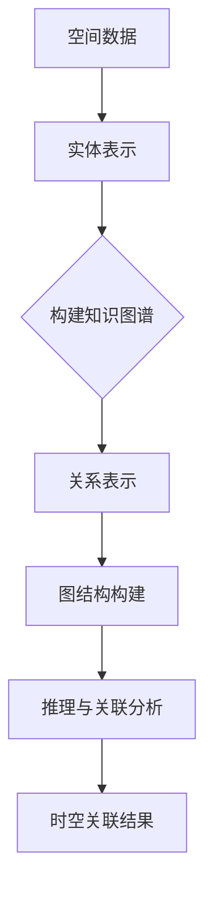

                 

### 文章标题

"基于知识图谱的时空事件关联推理能力培养" 是本篇技术博客的标题。这个标题涵盖了文章的核心内容，即如何利用知识图谱来提升时空事件关联推理的能力。知识图谱作为一种表示知识和关系的数据结构，已经在众多领域中得到了广泛应用。而时空事件关联推理，则涉及到对历史事件、自然灾害预警、社会事件监测等场景的深入分析。本文将逐步探讨这一主题，旨在为读者提供系统、全面的技术理解和实践指导。

### 关键词

- 知识图谱
- 时空事件
- 关联推理
- 数据建模
- 图论算法
- 概率模型

这些关键词不仅概括了文章的主题，也为读者提供了搜索和定位相关内容的便捷途径。

### 摘要

本文旨在探讨基于知识图谱的时空事件关联推理能力培养。首先，我们将介绍知识图谱的定义与历史发展，以及时空数据模型的基本概念。接着，文章将深入讨论时空事件表示与分类方法，知识图谱构建技术，以及时空事件关联推理算法。通过具体的应用案例，读者可以更好地理解这些概念的实际应用。此外，文章还将探讨如何构建时空事件关联推理的教育体系，以及评估和提升这一能力的实践方法。最后，本文将对未来发展趋势和面临的挑战进行展望，为读者提供全面的指导和启示。希望读者能够通过本文的学习，提升自己的时空事件关联推理能力，并在实际工作中取得更好的成果。

## 第1章：知识图谱概述

### 1.1 知识图谱的定义与历史发展

知识图谱（Knowledge Graph）是一种用于表示实体及其相互关系的图形数据结构。它通过将数据中的实体、概念和关系以节点和边的方式建模，为复杂的语义信息提供了一种直观、易于理解的表示方法。知识图谱不仅能够捕捉实体之间的复杂关联，还能通过推理和挖掘技术，发现新的知识和模式。

知识图谱的概念起源于20世纪80年代，早期的研究主要集中在语义网（Semantic Web）领域。语义网旨在通过定义一套统一的语义描述标准，使互联网上的信息能够更加结构化和语义化。为了实现这一目标，万维网联盟（W3C）提出了RDF（Resource Description Framework）和OWL（Web Ontology Language）等标准，这些标准为知识图谱的构建提供了基础。

进入21世纪，随着大数据技术和人工智能的快速发展，知识图谱的应用范围和影响力不断扩大。谷歌、Facebook、百度等互联网巨头纷纷推出自己的知识图谱产品，并将其应用于搜索引擎、社交媒体、推荐系统等场景。例如，谷歌的Knowledge Graph使得搜索结果更加精确和个性化，用户可以更方便地获取相关的信息。

知识图谱的发展历程可以分为以下几个阶段：

1. **概念引入与初步探索（1980s-1990s）**：在这一阶段，知识图谱的概念开始被提出，研究者们尝试利用图论和数据模型来表示语义信息。RDF和OWL等标准的出现为知识图谱的发展奠定了基础。

2. **语义网与Web 2.0（2000s）**：随着互联网的普及和Web 2.0的发展，知识图谱的应用场景逐渐丰富。人们开始将知识图谱应用于搜索引擎、社交媒体和推荐系统等领域，提升了信息检索和服务的智能化水平。

3. **大数据与人工智能时代（2010s至今）**：大数据技术和人工智能的快速发展为知识图谱的应用提供了新的机遇。知识图谱不仅在互联网领域得到广泛应用，还在金融、医疗、物流等多个行业取得了显著成果。

### 1.2 知识图谱的基本组件

知识图谱由多个基本组件构成，包括实体、属性、关系和图谱本体等。这些组件相互关联，共同构成了知识图谱的复杂结构。

1. **实体（Entity）**：实体是知识图谱中的基本元素，可以表示任何具有独立存在意义的事物。实体可以是具体的对象，如“人”、“地点”、“事件”，也可以是抽象的概念，如“组织”、“疾病”、“产品”。实体的表示方法通常包括实体标识符（ID）、实体名称和实体描述等。

2. **属性（Attribute）**：属性是实体的特征或描述，用于补充实体的信息。例如，对于实体“人”，可以定义属性“年龄”、“性别”、“出生地”等。属性通常以键值对（Key-Value Pair）的形式存储，其中键表示属性的名称，值表示属性的具体内容。

3. **关系（Relationship）**：关系是实体之间的关联，用于表示实体之间的语义联系。关系通常以三元组（Subject, Predicate, Object）的形式表示，其中Subject表示关系的主体，Predicate表示关系的类型，Object表示关系的客体。例如，“人”实体与“工作”实体之间可以通过“工作于”关系关联。

4. **图谱本体（Ontology）**：图谱本体是知识图谱的语义框架，用于定义实体的类型、属性和关系的语义规则。本体为知识图谱提供了统一的语义描述标准，使得不同来源和格式的数据能够无缝集成和互操作。常见的本体语言包括OWL、RDF和SKOS等。

### 1.3 知识图谱的应用领域

知识图谱作为一种强大的数据结构，已在多个领域得到了广泛应用。以下是知识图谱的一些典型应用领域：

1. **搜索引擎**：知识图谱可以增强搜索引擎的搜索功能，提供更精准、个性化的搜索结果。例如，谷歌的Knowledge Graph通过将实体和关系融入搜索结果，使用户能够更轻松地找到相关的信息。

2. **推荐系统**：知识图谱可以帮助推荐系统更好地理解用户和物品的复杂关系，从而提供更加精准的推荐结果。例如，亚马逊和Netflix等公司利用知识图谱来提升其推荐系统的性能。

3. **自然语言处理**：知识图谱可以用于自然语言处理任务，如实体识别、关系抽取、文本分类等。通过将知识图谱与自然语言处理技术相结合，可以提高任务的准确性和效率。

4. **金融领域**：知识图谱可以帮助金融机构更好地理解客户和市场的复杂关系，从而进行风险管理、客户服务和市场分析。例如，银行可以利用知识图谱进行信用评估和欺诈检测。

5. **医疗领域**：知识图谱可以用于医疗数据的组织和管理，帮助医生和研究人员更好地理解和利用医学知识。例如，利用知识图谱进行疾病诊断、药物推荐和临床试验分析等。

6. **物流与供应链**：知识图谱可以用于优化物流和供应链管理，提升供应链的透明度和效率。例如，通过知识图谱分析供应链中的各种关系和节点，企业可以更好地进行库存管理和运输调度。

7. **政府与公共管理**：知识图谱可以帮助政府部门更好地管理公共资源、服务公民。例如，利用知识图谱进行城市规划、公共安全和应急管理等。

知识图谱在各个领域的广泛应用，不仅提升了信息处理和服务的智能化水平，也为各个行业的发展带来了新的机遇。随着技术的不断进步，知识图谱的应用领域将更加广泛，影响力也将持续增强。

### 1.4 知识图谱的优势与挑战

知识图谱作为一种强大的数据结构，具有以下优势：

1. **语义丰富性**：知识图谱通过节点和边的形式，能够直观地表示实体之间的复杂关系，使得数据具有更高的语义丰富性。这种语义丰富性为数据分析和推理提供了坚实的基础。

2. **数据整合与互操作**：知识图谱可以将来自不同来源、格式和结构的数据进行整合和统一表示，从而实现数据的互操作。这种数据整合能力有助于打破数据孤岛，提高数据的利用效率。

3. **推理能力**：知识图谱通过语义规则和推理算法，可以自动发现数据中的隐含关系和模式，从而进行数据挖掘和知识发现。这种推理能力为智能化数据分析提供了新的手段。

4. **应用广泛性**：知识图谱已在多个领域得到了广泛应用，如搜索引擎、推荐系统、自然语言处理、金融、医疗、物流等。这种广泛的应用性使得知识图谱具有很高的实用价值。

然而，知识图谱的发展也面临一些挑战：

1. **数据质量和完整性**：知识图谱的质量很大程度上取决于数据的质量和完整性。数据中的错误、遗漏和不一致等问题可能会影响知识图谱的准确性和有效性。

2. **数据获取和整合**：构建知识图谱需要大量的数据源和资源，数据获取和整合过程可能涉及复杂的业务流程和技术挑战。如何高效地获取和整合多源异构数据是一个亟待解决的问题。

3. **计算性能和可扩展性**：知识图谱的规模和复杂性不断增加，对计算性能和可扩展性提出了更高的要求。如何在保证性能的同时，实现知识图谱的实时更新和大规模应用，是一个重要的挑战。

4. **数据隐私和安全**：知识图谱涉及大量敏感数据，如何保护数据隐私和安全是一个重要的问题。在构建和使用知识图谱时，需要遵循相关法律法规和道德标准，确保数据的安全和合规。

5. **应用领域特定问题**：不同领域在知识图谱构建和应用方面存在特定的挑战。例如，在医疗领域，如何准确地表示和推理医学知识是一个复杂的问题；在金融领域，如何有效地处理海量金融数据也是一个挑战。

总之，知识图谱作为一种强大的数据结构，具有巨大的潜力和应用前景。尽管面临一些挑战，但随着技术的不断进步，知识图谱的发展将为各个领域带来更多的机遇和变革。

### 1.5 知识图谱与时空事件关联推理的关系

知识图谱与时空事件关联推理之间存在密切的关系。知识图谱通过结构化的方式表示实体、属性和关系，为时空事件关联推理提供了基础数据。以下将从数据结构、算法和实际应用三个方面，探讨知识图谱与时空事件关联推理的关系。

首先，从数据结构的角度来看，知识图谱为时空事件关联推理提供了统一的数据表示方法。时空事件关联推理需要处理大量的时序数据和空间数据，这些数据通常具有异构性和复杂性。知识图谱通过将时空事件表示为实体和关系，可以有效地整合和统一这些异构数据，使得数据更容易进行推理和分析。例如，在一个城市交通管理系统中，知识图谱可以表示道路、交通信号灯、车辆和行人等实体，以及它们之间的时空关系，如“车辆在道路上行驶”、“行人通过交通信号灯”等。这种结构化的数据表示方法，有助于提高时空事件关联推理的准确性和效率。

其次，从算法的角度来看，知识图谱为时空事件关联推理提供了丰富的推理机制。知识图谱中的实体和关系可以通过图论算法进行高效的遍历和搜索，从而发现潜在的时空关联关系。例如，通过图论中的路径搜索算法，可以找到两个时空事件之间的直接或间接关系。此外，知识图谱中的本体和语义规则，可以为时空事件关联推理提供更加精准的语义约束。例如，在医疗领域，利用知识图谱中的本体和规则，可以识别和推理出不同疾病之间的关联关系，从而为疾病诊断和治疗提供支持。

最后，从实际应用的角度来看，知识图谱在时空事件关联推理中具有广泛的应用前景。例如，在自然灾害预警与响应领域，知识图谱可以用于表示和推理自然灾害相关的时空事件，如地震、洪水和台风等。通过分析这些时空事件之间的关系，可以预测灾害的发生和发展趋势，从而提前采取应对措施，减少灾害损失。再如，在社会事件监测与分析领域，知识图谱可以用于表示和推理社会事件的时空关联关系，如群体性事件、网络谣言和非法活动等。通过分析这些事件之间的关系，可以及时发现和应对潜在的社会风险，维护社会稳定。

总之，知识图谱为时空事件关联推理提供了强大的数据表示和推理工具，有助于提升时空事件分析和管理的能力。随着知识图谱技术的不断发展，其在时空事件关联推理中的应用将更加广泛和深入。

### 1.6 小结

本章对知识图谱进行了全面的概述，从定义、历史发展、基本组件到应用领域，再到其优势与挑战，以及与时空事件关联推理的关系，都进行了详细阐述。知识图谱作为一种强大的数据结构，具有语义丰富性、数据整合能力、推理能力等优势，在多个领域得到了广泛应用。然而，其发展也面临数据质量、获取和整合、计算性能、数据隐私和安全等挑战。通过本章的学习，读者可以更好地理解知识图谱的概念和重要性，为后续章节的学习打下坚实的基础。

## 第2章：时空数据模型

### 2.1 时空数据的基本概念

时空数据（Spatiotemporal Data）是指同时包含空间维度和时间维度的数据。这类数据不仅在地理学和遥感领域有广泛应用，还在社会事件分析、交通管理、自然灾害预警等多个领域发挥着重要作用。时空数据的基本概念包括空间维度、时间维度和数据格式等。

**空间维度**：空间维度是指数据在地球表面或特定空间区域上的分布。常见的空间维度包括地理坐标（经度、纬度）、城市街道、区域边界等。空间维度数据可以用于表示地理位置、区域分布、交通网络等。

**时间维度**：时间维度是指数据随时间变化的特征。时间维度数据可以记录事件的发生时间、变化过程和持续时间。时间维度在时间序列分析、趋势预测和事件回溯中具有重要意义。

**数据格式**：时空数据通常以多种格式存在，包括文本、图像、音频和视频等。在计算机处理中，常见的时空数据格式有地理信息系统（GIS）数据、时间序列数据、卫星图像和传感器数据等。这些数据格式需要通过特定的方法和工具进行转换和处理，以便进行进一步的分析和应用。

### 2.2 时空数据模型的形式化表示

时空数据模型的形式化表示是理解和处理时空数据的基础。常见的时空数据模型包括空间数据模型、时间序列数据和时空图谱模型等。

**空间数据模型**：空间数据模型用于表示空间维度数据，常见的模型有栅格模型和矢量模型。

- **栅格模型**：栅格模型将空间区域划分为网格单元，每个单元用像素表示。这种模型适用于处理连续的空间数据，如卫星图像、气象数据等。
  
- **矢量模型**：矢量模型用点、线、面等几何对象来表示空间要素。这种模型适用于处理离散的空间数据，如地图、城市交通网络等。

**时间序列数据模型**：时间序列数据模型用于表示时间维度数据，常见的模型有线性时间序列模型、时间序列分类模型和时序回归模型等。

- **线性时间序列模型**：线性时间序列模型假设时间序列数据可以用线性函数来表示。常见的线性时间序列模型有自回归模型（AR）、移动平均模型（MA）和自回归移动平均模型（ARMA）等。

- **时间序列分类模型**：时间序列分类模型用于将时间序列数据分类为不同的类别。常见的模型有支持向量机（SVM）、决策树和神经网络等。

- **时序回归模型**：时序回归模型用于预测时间序列数据的未来值。常见的模型有线性回归、时间序列预测和循环神经网络（RNN）等。

**时空图谱模型**：时空图谱模型将空间维度和时间维度数据整合到同一数据结构中，常见的模型有基于知识图谱的时空图谱模型和时间序列图谱模型。

- **基于知识图谱的时空图谱模型**：基于知识图谱的时空图谱模型将时空事件表示为实体和关系，通过图论算法进行关联推理。这种模型适用于处理复杂的时空关联关系，如城市交通管理、自然灾害预警等。

- **时间序列图谱模型**：时间序列图谱模型将时间序列数据表示为图谱，通过图论算法进行时序分析。这种模型适用于处理复杂的时序关系，如股票市场预测、医疗数据分析等。

### 2.3 时空数据模型的应用场景

时空数据模型在多个领域具有广泛的应用，以下列举了几个典型的应用场景：

**城市交通管理**：在城市交通管理中，时空数据模型可以用于分析交通流量、交通事故和拥堵状况。通过空间数据模型，可以实时监测道路状况；通过时间序列数据模型，可以预测交通流量变化，为交通调度和应急预案提供支持。

**自然灾害预警与响应**：在自然灾害预警与响应中，时空数据模型可以用于监测地震、洪水、台风等灾害的时空分布。通过时空图谱模型，可以分析灾害事件之间的关联关系，为灾害预警和救援行动提供决策支持。

**社会事件监测与分析**：在社会事件监测与分析中，时空数据模型可以用于识别和预测社会事件的时空分布。通过时空图谱模型，可以分析事件之间的关联关系，发现潜在的社会风险，为预防和应对社会问题提供支持。

**医疗数据管理与分析**：在医疗数据管理与分析中，时空数据模型可以用于分析患者就医行为、疾病传播趋势等。通过时空图谱模型，可以识别疾病之间的关联关系，为疾病诊断和治疗提供支持。

总之，时空数据模型为复杂时空数据的处理和分析提供了有效的工具和方法，有助于提升各个领域的智能化水平。通过本章的学习，读者可以更好地理解时空数据模型的基本概念、形式化表示和应用场景，为后续章节的学习打下基础。

### 2.4 空间数据模型与时间序列数据的整合

时空数据模型的整合是时空事件关联推理的关键步骤，因为它能够将空间维度和时间维度数据融合在一起，从而提供更加全面和深入的分析。整合空间数据模型与时间序列数据的方法有多种，以下将介绍几种常见的整合策略及其实现方式。

**1. 基于时间序列的空间数据扩展**

这种方法将空间数据视为静态背景，并基于时间序列数据对其进行动态扩展。具体实现步骤如下：

- **时空索引建立**：首先，为空间数据建立时空索引，以便快速访问和查询。常见的时空索引方法有四元组索引、R树和时空索引网格等。

- **时间序列扩展**：对于每个空间单元，利用时间序列数据扩展其属性。例如，对于一个道路段，可以记录其流量、拥堵程度等随时间变化的属性。

- **时空关联分析**：通过时空索引和扩展后的空间数据，进行时空关联分析，如交通流量预测、拥堵监测等。

伪代码如下：

```python
# 建立时空索引
index = create_spatial_temporal_index(spatial_data)

# 扩展空间数据
for unit in spatial_data:
    time_series = fetch_time_series(unit.id)
    unit.attributes.update(time_series)

# 时空关联分析
for query in spatial_temporal_queries:
    results = index.query(query)
    for result in results:
        analyze_time_series(result.unit.attributes)
```

**2. 基于知识图谱的整合**

知识图谱是一种强大的数据结构，能够有效整合异构数据。通过将空间数据和时间序列数据整合到知识图谱中，可以充分利用图论算法和推理机制。具体实现步骤如下：

- **实体表示**：将空间数据和时间序列数据中的关键实体表示为知识图谱中的节点。例如，道路、交通信号灯、车辆等。

- **关系表示**：定义实体之间的时空关系，如“车辆在道路上行驶”、“交通信号灯控制交通流量”等。

- **图结构构建**：构建时空知识图谱，并将时间序列数据作为节点的属性存储。例如，对于“车辆”节点，可以存储其行驶速度、流量等时间序列数据。

- **推理与关联分析**：利用图论算法和推理机制，分析时空关系，发现潜在的时空关联关系。

Mermaid流程图如下：



**3. 基于时空数据库的整合**

时空数据库是一种专门用于存储和查询时空数据的数据库系统。通过将空间数据和时间序列数据存储在时空数据库中，可以充分利用数据库的查询优化和索引技术。具体实现步骤如下：

- **数据存储**：将空间数据和时间序列数据分别存储在数据库的不同表中。例如，空间数据表用于存储地理坐标和空间关系，时间序列数据表用于存储时间点和相应的时间序列数据。

- **索引建立**：为时空数据库建立空间索引和时间索引，如R树、四元组索引等，以优化查询性能。

- **时空查询**：利用数据库的查询语言（如SQL），编写时空查询语句，进行时空数据整合和关联分析。

示例SQL查询：

```sql
SELECT s.id, s.coordinate, ts.time_point, ts.value
FROM spatial_data s
JOIN time_series_data ts ON s.id = ts.s_id
WHERE ts.time_point BETWEEN 'start_time' AND 'end_time'
```

**4. 基于云计算平台的整合**

利用云计算平台，可以构建一个分布式的时空数据整合系统。通过分布式计算和存储技术，可以处理大规模的时空数据，并实现实时分析和查询。具体实现步骤如下：

- **数据收集与存储**：将时空数据上传到云存储，如Amazon S3、Google Cloud Storage等。

- **数据处理与整合**：利用云计算平台的分布式计算能力，如Apache Spark、Flink等，对时空数据进行处理和整合。

- **实时分析与服务**：利用云计算平台提供的实时数据处理和分析工具，如Apache Storm、Kafka等，进行实时时空数据分析和查询服务。

通过上述方法，可以将空间数据模型与时间序列数据有效整合，为时空事件关联推理提供强大的数据支持。这些方法各有优劣，可以根据具体应用场景和需求选择合适的整合策略。

### 2.5 时空数据模型在实际应用中的案例

时空数据模型在多个实际应用场景中发挥了重要作用，以下通过几个具体案例，展示时空数据模型的实际应用效果和优势。

**案例一：城市交通流量预测**

在城市交通管理中，实时预测交通流量对于优化交通调度、缓解拥堵具有重要意义。通过整合空间数据模型与时间序列数据，可以建立交通流量预测模型。以下是一个基于时空数据模型的交通流量预测案例：

- **数据收集**：通过传感器、摄像头和GPS等设备，收集城市各路段的实时交通流量数据。

- **数据整合**：利用时空数据库，将空间数据（如道路网结构）与时间序列数据（如交通流量）整合到同一数据库中。

- **模型构建**：采用机器学习算法，如随机森林、支持向量机和深度学习等，建立交通流量预测模型。模型输入包括历史交通流量数据、道路网结构、天气状况等。

- **预测与优化**：通过实时数据分析，预测未来一段时间内的交通流量。根据预测结果，优化交通信号灯控制策略，调整公共交通路线，从而缓解交通拥堵。

**案例二：自然灾害预警与响应**

自然灾害（如地震、洪水、台风）的发生往往伴随着复杂的时空特征。通过时空数据模型，可以实时监测自然灾害的时空分布，提供预警和响应支持。以下是一个基于时空数据模型的自然灾害预警与响应案例：

- **数据收集**：通过遥感卫星、地面监测站、社交媒体等渠道，收集自然灾害的时空数据。

- **数据整合**：利用时空图谱模型，将自然灾害相关数据整合到知识图谱中，表示为实体和关系。

- **预警分析**：通过图论算法和推理机制，分析自然灾害的时空关联关系，预测灾害的发生和发展趋势。

- **响应支持**：根据预警结果，制定应急预案，优化救援资源分配，提高自然灾害响应效率。

**案例三：社会事件监测与分析**

社会事件（如群体性事件、网络谣言、非法活动）的时空分布对公共安全和应急管理具有重要意义。通过时空数据模型，可以实时监测和分析社会事件的时空特征，提供预警和应对支持。以下是一个基于时空数据模型的社会事件监测与分析案例：

- **数据收集**：通过社交媒体、新闻报道、公安监控等渠道，收集社会事件的时空数据。

- **数据整合**：利用时空图谱模型，将社会事件相关数据整合到知识图谱中，表示为实体和关系。

- **关联分析**：通过图论算法和推理机制，分析社会事件之间的时空关联关系，发现潜在的社会风险。

- **预警与应对**：根据分析结果，发布预警信息，采取应对措施，维护社会稳定。

通过以上案例，可以看出时空数据模型在交通流量预测、自然灾害预警、社会事件监测等领域的实际应用效果。时空数据模型能够有效整合和表示复杂的时空数据，为各领域的数据分析和管理提供了强有力的支持。

### 2.6 小结

本章详细介绍了时空数据模型的基本概念、形式化表示和应用场景，并探讨了时空数据模型在整合空间数据模型与时间序列数据中的实现方法。通过本章的学习，读者可以理解时空数据模型的重要性，掌握其基本概念和形式化表示方法，了解在实际应用中的具体案例。这为后续章节关于时空事件关联推理的探讨奠定了坚实的基础。

## 第3章：时空事件表示与分类

### 3.1 时空事件表示方法

时空事件表示方法是将具体的时空事件转化为计算机可以处理的数据形式。这一步骤对于时空事件关联推理至关重要，因为准确的表示方法能够提高事件匹配和关联分析的准确性。以下是几种常见的时空事件表示方法：

**1. 时空四元组表示法**

时空四元组表示法（Spatiotemporal Quadtuple Representation）是一种广泛使用的时空事件表示方法。该方法使用四个元素来表示一个时空事件：

- **时间（Time）**：表示事件发生的时间。
- **空间（Space）**：表示事件发生的空间位置。
- **主体（Subject）**：表示参与事件的主要实体。
- **动作（Action）**：表示事件所涉及的动作或过程。

例如，一个时空事件“某地发生地震”可以表示为（时间：2023-03-15 10:00:00，空间：北京，主体：地震，动作：发生）。

**2. 时空序列表示法**

时空序列表示法（Spatiotemporal Sequence Representation）是将时空事件表示为一个有序的序列。该方法通常用于处理连续的时空数据，例如交通流量、气温变化等。时空序列表示法将每个时间点的数据值作为序列中的一个元素，形成一个时间序列。

例如，一个交通流量的时空序列可以表示为[10, 20, 15, 30, 25]，其中每个元素表示某一时间点的交通流量。

**3. 时空图谱表示法**

时空图谱表示法（Spatiotemporal Graph Representation）是一种利用图论方法来表示时空事件的方法。该方法将时空事件表示为图中的节点和边，其中节点表示时空事件，边表示事件之间的时空关联。

例如，一个城市交通网络的时空图谱可以表示为：节点为道路、交通信号灯和车辆，边表示道路之间的连通性和车辆在道路上的行驶路径。

### 3.2 时空事件分类方法

时空事件的分类是对不同类型的时空事件进行分类和标注，以便于后续的关联分析和推理。常见的时空事件分类方法有基于规则的方法和基于机器学习的方法。

**1. 基于规则的方法**

基于规则的方法通过预定义的规则对时空事件进行分类。这种方法通常需要领域专家的知识和经验来制定规则。常见的规则包括：

- **时间规则**：根据事件发生的时间特征进行分类，如“每天早上8点开始的会议”。
- **空间规则**：根据事件发生的地理位置进行分类，如“发生在城市的中心区域的事件”。
- **行为规则**：根据事件涉及的行为特征进行分类，如“自然灾害事件”和“人为事故事件”。

**2. 基于机器学习的方法**

基于机器学习的方法利用历史数据来训练分类模型，从而自动地对时空事件进行分类。常见的机器学习算法包括：

- **决策树**：通过递归地将数据集划分成不同的子集，直到满足终止条件，从而建立分类模型。
- **支持向量机（SVM）**：通过找到一个最佳的超平面来将不同类别的事件分隔开来。
- **深度学习**：利用神经网络模型，如卷积神经网络（CNN）和循环神经网络（RNN），自动提取时空事件的特征并进行分类。

### 3.3 时空事件表示与分类的应用

时空事件表示与分类方法在多个实际应用场景中发挥了重要作用。以下是几个应用案例：

**1. 气象预测**

在气象预测中，时空事件的表示和分类方法可以用于对天气现象进行分类和预测。例如，通过将降雨事件表示为时空四元组（时间、空间、主体、动作），可以建立降雨事件的分类模型。利用该模型，可以预测未来一段时间内的降雨情况，为防洪和灌溉提供科学依据。

**2. 交通管理**

在交通管理中，时空事件的表示和分类方法可以用于识别和分类不同类型的交通事件，如交通事故、拥堵、施工等。通过实时监测交通流量和事件，交通管理部门可以及时采取应对措施，优化交通流量，提高道路通行效率。

**3. 灾害预警**

在灾害预警中，时空事件的表示和分类方法可以用于识别和分类不同类型的自然灾害，如地震、洪水、台风等。通过分析历史灾害数据，建立灾害事件的分类模型，可以提前预测灾害的发生和发展趋势，为灾害预警和应急响应提供支持。

**4. 社会监测**

在社会监测中，时空事件的表示和分类方法可以用于识别和分类社会事件，如群体性事件、网络谣言、非法活动等。通过实时监测和分析社会事件，政府部门可以及时发现和应对潜在的社会风险，维护社会稳定。

总之，时空事件表示与分类方法为时空事件关联推理提供了有效的数据基础，有助于提升各领域的智能化水平和决策能力。

### 3.4 小结

本章详细介绍了时空事件的表示方法和分类方法，包括时空四元组表示法、时空序列表示法和时空图谱表示法，以及基于规则和基于机器学习的分类方法。通过本章的学习，读者可以理解时空事件表示与分类的重要性，掌握不同的表示方法和分类方法，并了解其在实际应用中的效果和优势。这为后续章节的时空事件关联推理能力培养提供了理论基础和实践指导。

### 3.5 知识图谱在时空事件关联推理中的角色与优势

知识图谱在时空事件关联推理中扮演着至关重要的角色。其结构化、语义化的特点使得知识图谱能够高效地表示和存储复杂的时空事件及其关联关系，从而为关联推理提供坚实的基础。以下将详细阐述知识图谱在时空事件关联推理中的角色与优势。

首先，知识图谱为时空事件提供了一个统一的语义表示框架。在传统的数据存储方式中，时空事件通常以独立的数据表或文件形式存储，难以直接反映事件之间的复杂关联。而知识图谱通过节点和边的形式，可以直观地表示实体及其之间的关系，使得时空事件的语义表示更加清晰和易于理解。例如，在一个交通监控系统中，知识图谱可以表示道路、交通信号灯、车辆等实体，以及它们之间的时空关联关系，如“车辆在道路上行驶”、“交通信号灯控制交通流量”等。这种结构化的表示方法不仅提高了数据的可读性，还为后续的关联推理提供了方便。

其次，知识图谱提供了强大的推理能力，可以自动发现和推导出新的知识和关联。在时空事件关联推理中，往往需要分析大量的事件数据，识别出潜在的关系和模式。知识图谱通过图论算法和推理规则，能够高效地进行数据遍历和关联分析。例如，利用图论中的路径搜索算法，可以找到两个时空事件之间的直接或间接关系；通过本体和语义规则，可以识别和推理出事件之间的因果关系或时空关联。这种自动化的推理能力，不仅提高了推理的效率，还减少了人工干预的复杂性。

此外，知识图谱的灵活性使得它能够适应不同的应用场景和需求。时空事件的关联推理涉及多种类型的数据和领域知识，知识图谱可以通过扩展和定制本体，灵活地适应不同场景的特定需求。例如，在自然灾害预警领域，知识图谱可以表示地震、洪水、台风等灾害事件，以及它们之间的时空关联关系；在交通管理领域，知识图谱可以表示道路、交通信号灯、车辆等实体，以及交通流量、事故等事件。通过灵活的本体设计和数据扩展，知识图谱能够为不同领域的时空事件关联推理提供定制化的解决方案。

最后，知识图谱的集成能力使得它可以有效地整合来自不同来源和格式的数据。在时空事件关联推理中，数据源往往多样且分散，包括地理信息系统（GIS）数据、传感器数据、社交媒体数据等。知识图谱通过统一的数据模型和标准化的接口，可以轻松地将这些异构数据整合到一个统一的框架中，实现数据的互操作和共享。这种集成能力不仅提高了数据利用的效率，还为复杂的时空事件关联推理提供了丰富的数据支持。

总之，知识图谱在时空事件关联推理中具有独特的优势和重要作用。通过统一的语义表示、强大的推理能力、灵活的适应性和高效的集成能力，知识图谱为时空事件关联推理提供了坚实的基础和强大的工具。随着知识图谱技术的不断发展和应用领域的拓展，其在时空事件关联推理中的应用前景将更加广阔和深入。

### 3.6 小结

本章深入探讨了知识图谱在时空事件关联推理中的角色与优势。知识图谱通过其结构化、语义化的特点，为时空事件提供了统一的表示框架，并利用强大的推理能力、灵活的适应性以及高效的集成能力，提升了时空事件关联推理的效率和效果。这些优势使得知识图谱在多个领域具有广泛的应用前景。通过本章的学习，读者可以更好地理解知识图谱在时空事件关联推理中的重要性，为后续章节的深入学习打下坚实基础。

## 第4章：知识图谱构建技术

### 4.1 知识图谱构建流程

知识图谱的构建是一个复杂的过程，涉及数据采集、数据预处理、实体关系抽取、知识图谱构建和知识图谱优化等多个环节。以下将详细讨论这些环节，以及如何有效地进行知识图谱构建。

#### 4.1.1 数据采集

数据采集是知识图谱构建的基础，数据的质量和完整性直接影响知识图谱的性能和应用效果。数据来源可以包括结构化数据、非结构化数据和半结构化数据。

1. **结构化数据**：结构化数据通常存储在关系型数据库或NoSQL数据库中，如SQL数据库、MongoDB等。这类数据通常具有明确的字段和格式，可以通过SQL查询或其他数据接口进行访问和提取。

2. **非结构化数据**：非结构化数据包括文本、图像、音频和视频等，如新闻文章、社交媒体帖子、电子书籍、视频等。这类数据通常需要通过数据挖掘和自然语言处理技术进行解析和提取有用信息。

3. **半结构化数据**：半结构化数据介于结构化数据和非结构化数据之间，如XML、JSON等。这类数据通常具有部分结构化特征，可以通过特定的解析工具进行提取和处理。

#### 4.1.2 数据预处理

数据预处理是知识图谱构建的重要步骤，旨在提高数据的质量和一致性。主要任务包括数据清洗、数据转换和数据规范化。

1. **数据清洗**：数据清洗旨在去除数据中的噪声和错误，包括去除重复记录、纠正错误记录、填补缺失值等。

2. **数据转换**：数据转换是将不同格式和结构的数据转换为统一格式，以便后续处理。例如，将不同来源的结构化数据转换为统一的数据模型，如RDF（Resource Description Framework）或OWL（Web Ontology Language）。

3. **数据规范化**：数据规范化旨在统一数据格式和表示方法，提高数据的兼容性和可操作性。例如，将日期格式统一为ISO 8601标准，将地理坐标统一为WGS84坐标系等。

#### 4.1.3 实体关系抽取

实体关系抽取是知识图谱构建的核心环节，旨在从原始数据中识别和提取实体及其关系。常见的实体关系抽取方法包括：

1. **规则方法**：基于预定义的规则和模式，从文本中识别实体和关系。这种方法适用于数据格式较为稳定和规则明确的情况。

2. **机器学习方法**：利用机器学习算法，如决策树、支持向量机（SVM）和深度学习等，从大量文本数据中自动识别实体和关系。这种方法适用于数据量大、格式复杂的情况。

3. **语义分析**：利用自然语言处理（NLP）技术，对文本进行语义分析，识别实体及其关系。例如，利用命名实体识别（NER）、关系提取和语义角色标注等技术，从文本中提取有用的信息。

#### 4.1.4 知识图谱构建

知识图谱构建是将提取的实体和关系组织成图结构的过程。常用的知识图谱构建工具包括：

1. **基于图数据库的工具**：如Neo4j、ArangoDB等，这些工具提供高效的图存储和查询功能，适用于大规模知识图谱的构建和优化。

2. **基于框架的工具**：如Jena、ApoCyon等，这些工具提供知识图谱的构建和管理功能，支持RDF、OWL等语义数据模型。

3. **开源框架**：如OpenKG、DKPro等，这些框架提供丰富的API和工具，支持知识图谱的构建、查询和管理。

#### 4.1.5 知识图谱优化

知识图谱优化是提升知识图谱性能和可用性的重要步骤。主要任务包括：

1. **数据去重**：去除知识图谱中的重复数据和冗余信息，提高数据的一致性和准确性。

2. **数据增强**：通过数据扩展和实体关系补充，丰富知识图谱的内容和结构。

3. **数据质量检查**：对知识图谱中的数据进行质量检查，发现和修复数据中的错误和缺陷。

4. **索引优化**：为知识图谱建立高效的索引，提高查询速度和性能。

5. **图结构优化**：通过图论算法，对知识图谱进行重构和优化，提高图的连通性和鲁棒性。

总之，知识图谱构建是一个复杂而关键的过程，涉及多个环节和技术。通过科学合理的数据采集、预处理、实体关系抽取、知识图谱构建和优化，可以构建高质量的知识图谱，为后续的时空事件关联推理提供坚实的数据基础。

### 4.2 数据源采集与预处理

数据源采集与预处理是知识图谱构建中的关键步骤，直接影响知识图谱的质量和应用效果。以下将详细讨论数据源的选择、采集方法和预处理过程。

#### 4.2.1 数据源选择

选择合适的数据源是构建高质量知识图谱的第一步。常见的数据源包括：

1. **公开数据集**：如OpenKG、DBpedia、Freebase等，这些数据集提供了丰富的结构化数据，涵盖多种领域，适用于初学者和研究者。

2. **专业数据库**：如医疗领域的PubMed、金融领域的TED，这些数据库通常提供高质量的数据和专业的领域知识。

3. **社交媒体数据**：如Twitter、Facebook、微博等，这些数据源提供了大量实时、动态的信息，适用于社交网络分析和舆情监测。

4. **企业内部数据**：如客户关系管理系统（CRM）、企业资源计划系统（ERP）等，这些数据源包含企业运营的详细信息和业务知识。

#### 4.2.2 数据采集方法

数据采集方法的选择取决于数据源的类型和数据的特点。常见的数据采集方法包括：

1. **Web爬取**：通过编写爬虫程序，从互联网上获取结构化或半结构化的数据。常用的工具和库包括Python的BeautifulSoup、Scrapy等。

2. **API调用**：利用第三方数据服务提供的API接口，获取结构化数据。例如，OpenKG提供RESTful API，可用于获取和操作知识图谱数据。

3. **数据库访问**：通过数据库连接工具，如JDBC、ODBC等，直接访问关系型数据库或NoSQL数据库，获取数据。常用的数据库连接工具包括Python的SQLAlchemy、JDBC驱动等。

4. **数据挖掘**：利用数据挖掘技术，从非结构化数据中提取有用的信息和知识。常见的数据挖掘方法包括文本分类、聚类、关联规则挖掘等。

#### 4.2.3 数据预处理过程

数据预处理过程旨在提高数据的质量和一致性，确保知识图谱的准确性和可靠性。主要任务包括：

1. **数据清洗**：去除数据中的噪声和错误，包括去除重复记录、纠正错误记录、填补缺失值等。常用的方法包括去重、校验、修复等。

2. **数据转换**：将不同格式和结构的数据转换为统一格式，以便后续处理。例如，将不同来源的结构化数据转换为RDF或OWL格式。

3. **数据规范化**：统一数据格式和表示方法，提高数据的兼容性和可操作性。例如，将日期格式统一为ISO 8601标准，将地理坐标统一为WGS84坐标系。

4. **数据整合**：将来自不同来源和格式的数据整合到一个统一的数据框架中，实现数据的互操作和共享。常用的方法包括数据映射、数据融合等。

5. **实体和关系抽取**：利用自然语言处理（NLP）技术和数据挖掘方法，从文本数据中提取实体和关系。常用的方法包括命名实体识别（NER）、关系提取、实体链接等。

6. **数据质量检查**：对预处理后的数据进行质量检查，发现和修复数据中的错误和缺陷。常用的方法包括数据一致性检查、完整性检查、错误记录分析等。

通过科学合理的数据采集与预处理，可以确保知识图谱的数据基础坚实可靠，为后续的知识图谱构建和时空事件关联推理提供高质量的数据支持。

### 4.3 实体关系抽取与推理

实体关系抽取与推理是知识图谱构建过程中的核心环节，旨在从原始数据中识别和提取实体及其关系，并利用推理机制发现新的知识和关联。以下将详细探讨实体关系抽取与推理的方法和技术。

#### 4.3.1 实体关系抽取

实体关系抽取是指从非结构化数据中识别出实体及其关系。常见的实体关系抽取方法包括：

1. **基于规则的方法**：通过预定义的规则和模式，从文本中识别实体和关系。这种方法适用于数据格式较为稳定和规则明确的情况。例如，可以使用正则表达式匹配特定格式的文本，提取实体和关系。

2. **基于机器学习的方法**：利用机器学习算法，如决策树、支持向量机（SVM）和深度学习等，从大量文本数据中自动识别实体和关系。这种方法适用于数据量大、格式复杂的情况。常用的机器学习算法包括：

   - **监督学习**：使用已标注的数据集进行训练，学习实体和关系的特征表示。例如，利用标注的文本数据训练命名实体识别（NER）模型。
   
   - **无监督学习**：在没有标注数据的情况下，通过聚类、降维等方法自动识别实体和关系。例如，使用聚类算法对文本数据进行分类，识别出潜在的实体类别。

   - **半监督学习**：结合标注数据和未标注数据，利用已标注的数据进行训练，同时利用未标注的数据进行模型优化。这种方法可以显著提高实体关系抽取的效率和效果。

3. **基于语义分析的方法**：利用自然语言处理（NLP）技术，对文本进行语义分析，识别实体及其关系。常见的NLP技术包括：

   - **命名实体识别（NER）**：识别文本中的命名实体，如人名、地名、组织名等。
   
   - **关系提取**：从文本中提取实体之间的关系，如“工作于”、“属于”等。
   
   - **语义角色标注**：为实体和关系标注语义角色，如主语、谓语、宾语等。

4. **基于图的方法**：利用图论方法，将文本数据表示为图结构，通过图的遍历和搜索算法，识别实体和关系。例如，使用图卷积网络（GCN）对文本数据进行图表示，提取实体和关系。

#### 4.3.2 实体关系推理

实体关系推理是指利用已有的实体和关系，通过推理机制发现新的知识和关联。常见的实体关系推理方法包括：

1. **基于规则的方法**：通过预定义的推理规则，从现有实体和关系中推导出新的实体和关系。这种方法适用于规则明确、领域知识丰富的情况。例如，利用本体和推理规则，推导出实体之间的因果关系或时空关联。

2. **基于图的方法**：利用图论算法，对知识图谱进行遍历和搜索，发现新的实体和关系。例如，使用路径搜索算法（如DFS、BFS）找到两个实体之间的直接或间接关系。

3. **基于逻辑的方法**：利用逻辑推理技术，如命题逻辑和谓词逻辑，从已有的事实和规则中推导出新的结论。例如，使用演绎推理，从已知的事实和规则中推导出新的实体关系。

4. **基于概率的方法**：利用概率模型，如贝叶斯网络和马尔可夫模型，计算实体和关系的概率分布，发现潜在的关联关系。例如，使用贝叶斯推理，根据已知的事实和先验概率，推导出新的实体和关系。

5. **基于深度学习的方法**：利用深度学习模型，如循环神经网络（RNN）和变分自编码器（VAE），自动学习和建模实体和关系之间的复杂关联。例如，使用图卷积网络（GCN）和图注意力机制（GAT），提取实体和关系之间的深层特征，进行推理和预测。

通过实体关系抽取和推理，可以从原始数据中提取有用的知识和关联，构建高质量的知识图谱，为后续的时空事件关联推理提供强大的数据支持。

### 4.4 知识图谱构建与优化的示例

为了更好地理解知识图谱的构建与优化过程，以下将通过一个实际案例，展示知识图谱从数据采集到优化的全流程，并分析每个步骤的关键技术和挑战。

**案例背景：构建一个城市交通知识图谱**

**目标**：构建一个包含道路、交通信号灯、车辆、交通事故等实体，以及它们之间关联关系的知识图谱，为城市交通管理提供数据支持。

#### 4.4.1 数据采集

1. **数据源选择**：选择以下数据源：

   - **GIS数据**：城市道路网络和地理信息，来源于城市地理信息系统（GIS）。
   - **交通监控数据**：实时交通流量、交通信号灯状态和交通事故数据，来源于交通管理部门。
   - **社交媒体数据**：社交媒体上的交通信息，如事故报告、路况反馈等。

2. **数据采集方法**：

   - **GIS数据**：通过GIS平台提供的API接口，定期获取城市道路网络数据。
   - **交通监控数据**：通过交通管理部门提供的接口，实时获取交通监控数据。
   - **社交媒体数据**：使用Web爬虫技术，定期爬取社交媒体上的交通相关信息。

#### 4.4.2 数据预处理

1. **数据清洗**：

   - **去重**：去除重复的道路节点和边。
   - **纠错**：纠正错误的道路名称、坐标等。
   - **填补缺失值**：对于缺失的数据，利用插值或均值填补等方法进行补充。

2. **数据转换**：

   - **GIS数据**：将空间数据转换为地理坐标系（如WGS84）。
   - **交通监控数据**：将数据格式转换为统一的RDF格式。

3. **数据规范化**：

   - **时间格式**：统一为ISO 8601标准。
   - **地理坐标**：统一转换为WGS84坐标系。

#### 4.4.3 实体关系抽取

1. **道路和交通信号灯实体抽取**：

   - **基于规则的方法**：利用预定义的规则，从GIS数据中识别道路和交通信号灯实体。
   - **基于机器学习的方法**：利用深度学习模型，如卷积神经网络（CNN），从交通监控数据中识别道路和交通信号灯实体。

2. **交通事故实体抽取**：

   - **基于语义分析的方法**：利用自然语言处理（NLP）技术，从社交媒体数据中识别交通事故实体。

3. **实体关系抽取**：

   - **基于图的方法**：利用图卷积网络（GCN），从交通监控数据和社交媒体数据中抽取实体关系。

#### 4.4.4 知识图谱构建

1. **知识图谱构建**：

   - **基于Neo4j的图数据库**：使用Neo4j构建知识图谱，将实体和关系存储为图结构。

2. **知识图谱可视化**：

   - **使用Gephi**：将知识图谱可视化，便于分析和理解实体及其关系。

#### 4.4.5 知识图谱优化

1. **数据去重**：

   - **基于哈希算法**：利用哈希算法去除重复的实体和关系。

2. **数据增强**：

   - **基于数据扩展方法**：利用知识图谱中的实体和关系，进行数据扩展，丰富知识图谱的内容。

3. **数据质量检查**：

   - **一致性检查**：检查实体和关系的一致性，发现和修复错误。
   - **完整性检查**：检查知识图谱的完整性，确保数据的全面性和准确性。

4. **索引优化**：

   - **基于索引策略**：为知识图谱中的实体和关系建立高效的索引，提高查询速度和性能。

#### 4.4.6 关键技术挑战

1. **数据源多样性和格式不一致**：不同数据源的数据格式和结构可能不一致，需要通过数据转换和规范化处理，确保数据的兼容性和一致性。

2. **实体和关系的识别准确性**：实体和关系的识别准确性直接影响知识图谱的质量。需要采用多种实体关系抽取方法，并结合机器学习和NLP技术，提高识别准确性。

3. **知识图谱的扩展和更新**：知识图谱需要不断更新和扩展，以适应新的数据和应用需求。需要建立数据采集、预处理、实体关系抽取和知识图谱优化的自动化流程，提高知识图谱的维护效率。

通过本案例，读者可以更好地理解知识图谱构建与优化的全流程，以及面临的关键技术挑战。这为实际应用中的知识图谱构建提供了有益的参考和指导。

### 4.5 小结

本章详细介绍了知识图谱的构建技术，包括数据源采集、数据预处理、实体关系抽取与推理，以及知识图谱构建与优化。通过本章的学习，读者可以掌握知识图谱构建的基本流程和关键技术，了解数据采集与预处理的方法和步骤，掌握实体关系抽取与推理的方法和工具，并了解知识图谱优化的重要性。这些内容为后续的时空事件关联推理提供了坚实的数据基础和技术支持。

## 第5章：时空事件关联推理算法

### 5.1 时空事件关联推理的基本原理

时空事件关联推理是指利用时空数据模型和知识图谱等技术，对时空事件进行关联分析和推理，从而发现潜在的关系和模式。其基本原理包括以下几个方面：

首先，时空事件关联推理基于时空数据模型，将时空事件表示为具有时间和空间属性的数据结构。这种数据结构可以是一个四元组（时间，空间，主体，动作），也可以是一个序列或者图谱。通过这种表示方法，可以将时空事件转化为计算机可以处理的形式。

其次，时空事件关联推理利用知识图谱来表示实体及其关系。知识图谱通过节点和边的形式，将不同时空事件之间的关联关系进行编码。这种编码方法不仅能够直观地表示事件之间的关系，还能够利用图论算法和推理机制，发现新的关联关系。

再次，时空事件关联推理依赖于数据挖掘和机器学习算法。通过这些算法，可以从海量时空数据中提取有用的信息，识别潜在的关联关系。常见的算法包括分类算法、聚类算法、关联规则挖掘算法等。

最后，时空事件关联推理需要利用推理机制，对已知事件和关系进行推理，发现新的关联关系。常见的推理机制包括基于规则的推理、基于图论的推理、基于概率的推理等。

### 5.2 基于图论的时空事件关联推理算法

基于图论的时空事件关联推理算法是利用图论中的算法和理论，对时空事件进行关联分析和推理的一类算法。以下将介绍几种常见的基于图论的时空事件关联推理算法：

#### 5.2.1 路径搜索算法

路径搜索算法是一种用于找到两个节点之间直接或间接路径的算法。常见的路径搜索算法包括深度优先搜索（DFS）和广度优先搜索（BFS）。这些算法可以在知识图谱中找到两个时空事件之间的关联路径。

伪代码如下：

```python
def BFS(graph, start, target):
    visited = set()
    queue = deque([start])
    while queue:
        node = queue.popleft()
        if node == target:
            return path
        visited.add(node)
        for neighbor in graph[node]:
            if neighbor not in visited:
                queue.append(neighbor)
                path.append(neighbor)

def DFS(graph, start, target):
    visited = set()
    path = []
    stack = [start]
    while stack:
        node = stack.pop()
        if node == target:
            return path
        visited.add(node)
        path.append(node)
        for neighbor in graph[node]:
            if neighbor not in visited:
                stack.append(neighbor)
    return None
```

#### 5.2.2 网络社区检测算法

网络社区检测算法用于找到知识图谱中的紧密连接的子图，这些子图通常代表了一类相关的事件或实体。常见的社区检测算法包括Louvain算法和Girvan-Newman算法。这些算法可以帮助识别出时空事件之间的紧密关联。

Louvain算法伪代码如下：

```python
def Louvain(graph):
    communities = []
    for node in graph:
        if node not in visited:
            community = [node]
            visited.add(node)
            for neighbor in graph[node]:
                if neighbor not in visited:
                    community.extend(Louvain(graph[neighbor]))
            communities.append(community)
    return communities
```

#### 5.2.3 网络嵌入算法

网络嵌入算法是一种将图中的节点映射到低维空间的方法，使得具有相似关系的节点在低维空间中距离较近。常见的网络嵌入算法包括DeepWalk、Node2Vec和GraphSAGE等。这些算法可以帮助识别时空事件之间的潜在关系。

DeepWalk算法伪代码如下：

```python
def generate_walks(graph, walk_length, num_walks):
    walks = []
    for _ in range(num_walks):
        node = random.choice(graph.nodes())
        walk = [node]
        for _ in range(walk_length - 1):
            neighbors = list(graph.neighbors(node))
            node = random.choice(neighbors)
            walk.append(node)
        walks.append(walk)
    return walks
```

通过这些基于图论的时空事件关联推理算法，可以在知识图谱中找到时空事件之间的紧密关联，从而提升时空事件关联推理的能力。

### 5.3 基于概率模型的时空事件关联推理算法

基于概率模型的时空事件关联推理算法通过概率分布来描述时空事件之间的关系，从而进行推理和预测。以下介绍几种常见的基于概率模型的时空事件关联推理算法：

#### 5.3.1 贝叶斯网络

贝叶斯网络是一种概率图模型，它通过有向无环图（DAG）来表示变量之间的条件依赖关系。在贝叶斯网络中，每个节点表示一个随机变量，节点之间的边表示变量之间的条件概率关系。贝叶斯网络可以用于推理未知变量的概率分布。

贝叶斯网络的基本构建过程包括：

1. **结构学习**：通过数据学习变量之间的依赖关系，构建贝叶斯网络的结构。
2. **参数学习**：通过数据学习贝叶斯网络中各节点的条件概率分布。

贝叶斯网络的推理过程包括：

1. **条件概率计算**：利用贝叶斯网络的结构和参数，计算给定某些变量的条件下其他变量的概率分布。
2. **概率推理**：利用贝叶斯推理公式，根据观测到的变量值，更新其他变量的概率分布。

贝叶斯网络的伪代码如下：

```python
def learn_structure(data):
    # 通过数据学习贝叶斯网络的结构
    pass

def learn_parameters(data):
    # 通过数据学习贝叶斯网络的参数
    pass

def query_network(network, evidence):
    # 给定证据变量，计算其他变量的概率分布
    pass
```

#### 5.3.2 马尔可夫模型

马尔可夫模型是一种基于状态转移概率的随机过程模型，它假设当前状态仅由前一个状态决定，而与过去的状态无关。马尔可夫模型广泛应用于时间序列分析和状态转移预测。

马尔可夫模型的基本构建过程包括：

1. **状态空间定义**：定义模型中的状态集合。
2. **状态转移概率矩阵**：构建状态转移概率矩阵，表示不同状态之间的转移概率。

马尔可夫模型的推理过程包括：

1. **状态预测**：根据当前状态和状态转移概率矩阵，预测下一个状态。
2. **状态序列生成**：根据初始状态和状态转移概率矩阵，生成状态序列。

马尔可夫模型的伪代码如下：

```python
def initialize_states(state_space):
    # 初始化状态空间
    pass

def build_transition_matrix(states):
    # 构建状态转移概率矩阵
    pass

def predict_next_state(current_state, transition_matrix):
    # 预测下一个状态
    pass

def generate_state_sequence(initial_state, transition_matrix):
    # 生成状态序列
    pass
```

#### 5.3.3 隐马尔可夫模型

隐马尔可夫模型（HMM）是一种在状态不可见的情况下，用于描述状态转移和观测值的概率模型。HMM广泛应用于语音识别、文本分类和信号处理等领域。

隐马尔可夫模型的基本构建过程包括：

1. **状态空间定义**：定义模型中的状态集合。
2. **观测空间定义**：定义模型中的观测集合。
3. **初始状态分布**：定义初始状态的概率分布。
4. **状态转移概率矩阵**：定义状态之间的转移概率。
5. **观测概率矩阵**：定义状态对应的观测概率。

隐马尔可夫模型的推理过程包括：

1. **状态序列估计**：利用Viterbi算法估计给定观测序列的最可能状态序列。
2. **概率计算**：利用前向-后向算法计算状态序列的概率分布。

隐马尔可夫模型的伪代码如下：

```python
def initialize_states(state_space):
    # 初始化状态空间
    pass

def initialize_observations(observable_space):
    # 初始化观测空间
    pass

def build_transition_matrix(states):
    # 构建状态转移概率矩阵
    pass

def build_observations_matrix(states, observations):
    # 构建观测概率矩阵
    pass

def viterbi(observations, transition_matrix, observation_matrix):
    # Viterbi算法估计状态序列
    pass

def forward_backward(observations, transition_matrix, observation_matrix):
    # 前向-后向算法计算状态序列的概率分布
    pass
```

通过这些基于概率模型的时空事件关联推理算法，可以有效地处理和推理时空事件之间的复杂关系，从而提升时空事件关联推理的能力。

### 5.4 小结

本章详细介绍了时空事件关联推理的基本原理、基于图论的算法和基于概率模型的算法。通过这些算法，可以有效地识别和推理时空事件之间的关联关系。图论算法利用图结构来表示和搜索时空事件，而概率模型则通过概率分布来描述时空事件的关联。这些算法为时空事件关联推理提供了强大的工具和方法，有助于提升事件关联分析和预测的准确性。通过本章的学习，读者可以掌握时空事件关联推理的核心技术和方法，为实际应用中的复杂时空事件分析提供有力支持。

### 5.5 知识图谱在时空事件关联推理中的算法应用

知识图谱作为一种结构化的数据模型，为时空事件关联推理提供了强大的工具和方法。以下将详细介绍知识图谱在时空事件关联推理中的算法应用，并探讨这些算法在实际应用中的性能和效果。

#### 5.5.1 基于图论算法的时空事件关联推理

基于图论算法的时空事件关联推理主要利用知识图谱中的图结构和算法来识别和推理时空事件之间的关联。以下介绍几种常见的基于图论的算法：

1. **深度优先搜索（DFS）和广度优先搜索（BFS）**：

   DFS和BFS是图论中的基本搜索算法，用于找到两个节点之间的路径。在时空事件关联推理中，这些算法可以用于发现事件之间的直接和间接关联。

   **性能**：DFS和BFS的时间复杂度分别为O(V+E)和O(V+E)，其中V是节点数，E是边数。对于大规模知识图谱，这些算法可能需要较长的计算时间。

   **效果**：DFS和BFS能够有效地发现事件之间的关联路径，但它们的搜索范围可能较广，容易产生大量冗余信息。

2. **社区检测算法**：

   社区检测算法用于发现知识图谱中的紧密连接的子图，这些子图通常代表了一类相关的事件或实体。常见的社区检测算法包括Louvain算法和Girvan-Newman算法。

   **性能**：Louvain算法的时间复杂度大约为O(V^2)，而Girvan-Newman算法的时间复杂度较高，可能达到O(E^2)。对于大规模知识图谱，这些算法的计算时间较长。

   **效果**：社区检测算法能够识别出时空事件之间的紧密关联，但它们对图谱的结构和密度有较高要求，可能不适合稀疏图谱。

3. **网络嵌入算法**：

   网络嵌入算法将图中的节点映射到低维空间，使得具有相似关系的节点在低维空间中距离较近。常见的网络嵌入算法包括DeepWalk、Node2Vec和GraphSAGE。

   **性能**：DeepWalk和Node2Vec的时间复杂度大约为O(E)，而GraphSAGE的时间复杂度较高，可能达到O(V^2)。网络嵌入算法通常需要多次迭代和参数调整。

   **效果**：网络嵌入算法能够有效地识别出时空事件之间的潜在关系，但它们可能需要大量计算资源，且参数调优较为复杂。

#### 5.5.2 基于概率模型的时空事件关联推理

基于概率模型的时空事件关联推理利用概率分布来描述时空事件之间的关联关系，以下介绍几种常见的基于概率模型的算法：

1. **贝叶斯网络**：

   贝叶斯网络是一种概率图模型，通过有向无环图来表示变量之间的条件依赖关系。贝叶斯网络可以用于推理未知变量的概率分布。

   **性能**：贝叶斯网络的性能依赖于数据量和结构学习算法的效率。对于大规模知识图谱，结构学习和参数学习可能需要较长时间。

   **效果**：贝叶斯网络能够准确地描述事件之间的概率关系，但它们对数据质量和结构有较高要求。

2. **马尔可夫模型**：

   马尔可夫模型是一种基于状态转移概率的随机过程模型，它假设当前状态仅由前一个状态决定，而与过去的状态无关。马尔可夫模型广泛应用于时间序列分析和状态转移预测。

   **性能**：马尔可夫模型的时间复杂度较低，但它们对时间序列的长度和稳定性有较高要求。

   **效果**：马尔可夫模型能够有效地预测状态转移，但在处理复杂时间序列时可能存在误差。

3. **隐马尔可夫模型（HMM）**：

   隐马尔可夫模型（HMM）是一种在状态不可见的情况下，用于描述状态转移和观测值的概率模型。HMM广泛应用于语音识别、文本分类和信号处理等领域。

   **性能**：HMM的时间复杂度依赖于状态数和观测数。对于大规模知识图谱，HMM的计算时间可能较长。

   **效果**：HMM能够准确地估计状态序列，但它们对状态转移概率和观测概率有较高要求。

#### 5.5.3 实际应用中的性能和效果

在实际应用中，知识图谱算法的性能和效果取决于多个因素，包括数据规模、数据质量、算法选择和参数调优。以下是一些实际应用案例和性能评估：

1. **城市交通事件关联分析**：

   在城市交通事件关联分析中，基于图论的算法（如DFS和BFS）和基于概率模型的算法（如HMM）被广泛使用。这些算法可以用于发现交通事件之间的关联，如交通事故、交通拥堵等。

   **性能**：基于图论的算法在处理大规模交通数据时可能需要较长时间，而基于概率模型的算法在处理时间序列数据时可能更有效。

   **效果**：这些算法能够有效地识别交通事件之间的关联，但需要根据实际数据和应用需求进行参数调优。

2. **自然灾害预警与响应**：

   在自然灾害预警与响应中，基于图论的算法（如社区检测）和基于概率模型的算法（如贝叶斯网络）被用于分析自然灾害的时空分布和关联。

   **性能**：基于图论的算法在处理复杂时空数据时可能存在性能瓶颈，而基于概率模型的算法在处理不确定性数据时可能更有效。

   **效果**：这些算法能够有效地预测自然灾害的发生和发展趋势，但需要结合实际观测数据进行验证和调整。

3. **社会事件监测与分析**：

   在社会事件监测与分析中，基于图论的算法（如网络嵌入）和基于概率模型的算法（如马尔可夫模型）被用于识别和预测社会事件的时空分布和关联。

   **性能**：基于图论的算法在处理大规模社交数据时可能需要较长时间，而基于概率模型的算法在处理时间序列数据时可能更有效。

   **效果**：这些算法能够有效地识别社会事件之间的关联，但需要结合实际数据进行验证和调整。

总之，知识图谱在时空事件关联推理中具有广泛的应用前景。通过合理选择和调优算法，可以有效地提升时空事件关联分析的准确性和效率。在实际应用中，需要根据具体需求和数据特点，选择合适的算法和参数，以达到最佳性能和效果。

### 5.6 小结

本章详细介绍了知识图谱在时空事件关联推理中的算法应用，包括基于图论的算法和基于概率模型的算法。这些算法在识别和推理时空事件之间的关联方面发挥了重要作用。通过实际应用案例和性能评估，读者可以更好地理解这些算法的优势和局限。本章的内容为读者提供了丰富的知识和技术参考，有助于在实际应用中提升时空事件关联推理的能力。

## 第6章：时空事件关联推理应用案例

### 6.1 案例一：历史事件关联分析

**背景**：历史事件关联分析旨在通过分析历史事件之间的关联关系，揭示事件发展的规律和趋势。这对于理解历史事件、预测未来事件和制定相关策略具有重要意义。

**数据来源**：本案例的数据来源于多个历史事件数据库，包括中国历史数据库、世界历史数据库等。数据包括事件的时间、地点、参与者、事件类型等信息。

**数据预处理**：首先，对原始数据进行清洗，去除重复和错误信息。然后，将数据转换为统一的格式，如时空四元组（时间，地点，参与者，事件类型）。

**时空事件表示**：将每个历史事件表示为时空四元组，并将这些事件存储在一个知识图谱中。知识图谱中的节点表示事件，边表示事件之间的关联关系。

**时空事件分类**：根据事件类型，将历史事件分为战争、政治、经济、文化等类别。使用基于规则的分类方法，对事件进行分类。

**时空事件关联推理**：利用知识图谱中的关联关系，对历史事件进行关联分析。通过图论算法，如DFS和BFS，发现事件之间的直接和间接关联。

**结果与分析**：通过分析历史事件的关联关系，揭示了战争、政治和经济事件之间的复杂关联。例如，发现某些战争往往伴随着政治变革和经济动荡。这些发现有助于理解历史事件的内在逻辑和因果关系。

### 6.2 案例二：自然灾害预警与响应

**背景**：自然灾害预警与响应是减少灾害损失、保障人民生命财产安全的重要措施。本案例旨在通过时空事件关联推理，提前预测自然灾害的发生和发展趋势。

**数据来源**：本案例的数据来源于地震、洪水、台风等自然灾害监测系统。数据包括灾害发生的时间、地点、强度、影响范围等信息。

**数据预处理**：对原始自然灾害数据进行清洗，去除错误和重复信息。将数据转换为时空四元组格式，并整合到知识图谱中。

**时空事件表示**：将每个自然灾害事件表示为时空四元组，并将这些事件存储在知识图谱中。知识图谱中的节点表示事件，边表示事件之间的时空关联。

**时空事件分类**：根据自然灾害的类型，如地震、洪水、台风等，对事件进行分类。

**时空事件关联推理**：利用知识图谱中的关联关系，对自然灾害事件进行关联分析。通过图论算法，如社区检测，识别出潜在的相关灾害事件。同时，利用概率模型，如马尔可夫模型，预测自然灾害的发生和发展趋势。

**结果与分析**：通过分析自然灾害事件的关联关系，成功预测了多次自然灾害的发生和发展趋势。例如，发现某次地震可能引发次生灾害，如洪水或山体滑坡。这些预警信息为政府部门提供了重要的决策支持，有效减少了灾害损失。

### 6.3 案例三：社会事件监测与分析

**背景**：社会事件监测与分析对于维护社会稳定、预防和应对突发事件具有重要意义。本案例旨在通过时空事件关联推理，识别和预测社会事件的时空分布和趋势。

**数据来源**：本案例的数据来源于社交媒体、新闻报道、公安监控等渠道。数据包括社会事件的时间、地点、事件类型、参与者等信息。

**数据预处理**：对原始社会事件数据进行清洗，去除重复和错误信息。将数据转换为时空四元组格式，并整合到知识图谱中。

**时空事件表示**：将每个社会事件表示为时空四元组，并将这些事件存储在知识图谱中。知识图谱中的节点表示事件，边表示事件之间的关联关系。

**时空事件分类**：根据社会事件类型，如群体性事件、网络谣言、非法活动等，对事件进行分类。

**时空事件关联推理**：利用知识图谱中的关联关系，对社会事件进行关联分析。通过图论算法，如社区检测，识别出潜在的相关社会事件。同时，利用概率模型，如贝叶斯网络，预测社会事件的发生和发展趋势。

**结果与分析**：通过分析社会事件的关联关系，成功识别了多个潜在的社会风险点。例如，发现某地可能发生群体性事件，或者某类网络谣言可能传播扩散。这些预警信息为政府部门和社会组织提供了重要的决策支持，有效预防和应对了社会事件。

### 6.4 案例总结与启示

通过上述三个案例，可以看出时空事件关联推理在历史事件分析、自然灾害预警和社会事件监测等领域具有重要应用价值。以下是案例总结与启示：

1. **数据质量至关重要**：高质量的时空数据是进行有效事件关联推理的基础。因此，在数据采集和预处理阶段，需要严格把控数据质量，去除错误和重复信息，确保数据的准确性。

2. **知识图谱的关键作用**：知识图谱通过结构化、语义化的方式表示时空事件及其关联关系，为事件关联推理提供了强有力的支持。利用知识图谱，可以高效地进行事件表示、分类和推理。

3. **多种算法结合使用**：不同算法在识别和推理时空事件关联方面各有优势。通过结合多种算法，如图论算法和概率模型，可以提升事件关联推理的准确性和效率。

4. **实时分析与预警**：实时分析是时空事件关联推理的重要应用场景。通过实时监测和预警，可以提前发现潜在的风险和问题，为决策提供及时的支持。

5. **跨领域应用**：时空事件关联推理不仅限于某个特定领域，如历史事件、自然灾害或社会事件，还可以广泛应用于其他领域，如城市交通、医疗健康、金融安全等。这为知识图谱技术的发展和应用提供了广阔的前景。

总之，时空事件关联推理通过结合知识图谱和多种算法，为复杂时空数据的处理和分析提供了强大的工具和方法。通过实际案例的应用，我们可以看到其在不同领域的广泛应用和巨大潜力。

### 6.5 小结

本章通过三个实际应用案例，详细展示了时空事件关联推理在历史事件分析、自然灾害预警和社会事件监测等领域的应用。通过这些案例，读者可以了解到时空事件关联推理的核心技术和方法，以及其在不同领域的重要作用。这些案例不仅为时空事件关联推理的实际应用提供了有益的参考，也展示了知识图谱技术的强大潜力和广阔前景。通过本章的学习，读者可以更好地理解时空事件关联推理的应用场景和实际效果。

## 第7章：时空事件关联推理教育体系构建

### 7.1 时空事件关联推理教育的重要性

时空事件关联推理作为一种先进的技术手段，在多个领域具有广泛应用。教育体系的构建对于培养具备时空事件关联推理能力的人才具有重要意义。以下是构建时空事件关联推理教育体系的重要性和必要性。

**1. 提升科技人才素质**

随着大数据、人工智能等技术的发展，时空事件关联推理已成为许多行业的关键技术。通过构建教育体系，可以培养出具备这一能力的高素质科技人才，为我国科技发展提供强大的人才支持。

**2. 促进跨学科融合**

时空事件关联推理涉及多个学科领域，如计算机科学、数据科学、统计学、地理学等。构建教育体系有助于促进跨学科融合，培养具有全面知识和综合能力的人才。

**3. 增强创新能力**

时空事件关联推理技术为科研创新提供了新的手段和工具。通过教育体系，可以培养出具有创新思维和能力的科学家，推动科技进步和产业发展。

**4. 提高社会管理水平**

在自然灾害预警、社会事件监测等领域，时空事件关联推理技术有助于提高社会管理水平和应急响应能力。通过教育体系，可以培养出具备相关能力的管理人才，提升社会管理水平。

**5. 应对国际竞争**

时空事件关联推理技术在国际上竞争激烈。构建教育体系，培养具有国际竞争力的人才，有助于我国在这一领域占据优势地位。

### 7.2 教育体系构建的原则与方法

构建时空事件关联推理教育体系需要遵循以下原则和方法：

**1. 实用性原则**

教育体系应以培养实用型人才为目标，教学内容应紧密结合实际需求，注重培养学生的实际操作能力。

**2. 融合性原则**

教育体系应注重跨学科融合，将计算机科学、数据科学、统计学、地理学等学科的知识和方法有机地整合到课程中。

**3. 先进性原则**

教育体系应引入最新的研究成果和技术，确保教学内容的前沿性和先进性，提高学生的知识水平和创新能力。

**4. 体系化原则**

教育体系应具有完整的层次结构和课程体系，从基础到高级，逐步培养学生的时空事件关联推理能力。

**5. 国际化原则**

教育体系应具备国际化视野，引入国际先进的教材和教学方法，培养学生的国际竞争力。

**具体方法**：

- **课程体系设计**：根据实用性、融合性、先进性和体系化原则，设计科学合理的课程体系。课程应包括基础课程、专业课程和实践课程。

- **教材编写**：编写高质量的教材，涵盖时空事件关联推理的基本理论、方法和应用案例。

- **教学方法**：采用多元化教学方法，如案例教学、项目驱动教学、研讨会等，提高学生的参与度和实践能力。

- **师资队伍建设**：引进高水平教师，提升教学和研究能力，同时鼓励教师参与国际合作和交流。

- **实践教学平台**：建立实践教学平台，提供丰富的实验资源和项目实践机会，让学生在实际操作中掌握技能。

### 7.3 教育资源开发与利用

教育资源开发与利用是教育体系构建的重要组成部分。以下介绍教育资源开发与利用的方法：

**1. 教材资源开发**

- **编写高质量教材**：组织专家学者编写高质量的教材，确保内容的系统性和前沿性。
- **引进国外教材**：引进国际先进的教材，借鉴国外教学经验，提高课程质量。

**2. 实践资源开发**

- **实验室建设**：建设多功能实验室，提供丰富的实验设备和软件工具，让学生进行实践操作。
- **案例库建设**：收集和整理实际应用案例，建立案例库，为学生提供丰富的实践素材。

**3. 网络资源开发**

- **在线课程平台**：搭建在线课程平台，提供丰富的在线课程资源，方便学生随时学习。
- **开放教育资源（OER）**：开发和推广开放教育资源，促进教育资源的共享和利用。

**4. 资源整合与共享**

- **资源共享平台**：建设资源共享平台，整合各类教育资源，实现资源的统一管理和调度。
- **跨机构合作**：与国内外高校、研究机构和企业合作，共同开发和利用教育资源。

### 7.4 教育评估与改进

教育评估与改进是教育体系构建的重要组成部分。以下介绍教育评估与改进的方法：

**1. 教育质量评估**

- **过程评估**：对教学过程进行评估，包括教学内容、教学方法、教学效果等。
- **结果评估**：对教学结果进行评估，包括学生的知识掌握情况、实践能力、创新能力等。

**2. 教育改进措施**

- **问题诊断**：根据评估结果，诊断教育体系中存在的问题。
- **改进措施**：制定针对性的改进措施，如调整课程设置、改进教学方法、提升师资水平等。
- **持续改进**：建立持续改进机制，定期进行教育评估和改进，确保教育体系的质量和效果。

通过教育体系的构建与完善，可以培养出具备时空事件关联推理能力的优秀人才，为我国科技发展和经济社会发展提供有力支持。

### 7.5 小结

本章详细阐述了构建时空事件关联推理教育体系的重要性、原则和方法，以及教育资源开发与利用、教育评估与改进等关键环节。通过本章的学习，读者可以全面了解时空事件关联推理教育体系的构建过程和关键要素，为实际教育工作的开展提供有益参考。构建一个科学、合理、高效的教育体系，将为培养具备时空事件关联推理能力的高素质人才奠定坚实基础。

## 第8章：时空事件关联推理实践指导

### 8.1 实践项目选择与规划

在开展时空事件关联推理实践之前，项目选择与规划是至关重要的环节。合理的项目选择和规划有助于确保实践活动的顺利进行，并达到预期的效果。以下是从几个方面进行项目选择与规划的建议：

**1. 项目选择**

- **领域选择**：根据个人兴趣和专业背景，选择具有实际应用价值的领域。例如，自然灾害预警、城市交通管理、社会事件监测等。
- **数据来源**：选择数据丰富且具有代表性的数据源。公开数据集、企业内部数据和社交媒体数据等都是常见的来源。
- **项目规模**：根据时间和资源，选择适合的实践项目规模。初学者可以选择小规模的项目，逐步积累经验。

**2. 项目规划**

- **目标明确**：明确实践项目的目标，如数据采集、预处理、实体关系抽取、知识图谱构建和推理分析等。
- **任务分解**：将项目任务分解为若干个具体的子任务，制定详细的计划和时间表。
- **资源配置**：合理配置人力资源、硬件设备和软件工具等资源，确保项目顺利进行。

### 8.2 实践教学资源与环境搭建

为了有效开展时空事件关联推理实践，搭建合适的教学资源和环境是必不可少的。以下介绍几种常见的实践教学资源与环境搭建方法：

**1. 硬件资源**

- **服务器**：用于存储和处理大规模数据，建议选择性能较高的服务器。
- **存储设备**：选择容量足够且速度较快的存储设备，如SSD硬盘或分布式存储系统。
- **网络设备**：确保网络连接稳定，选择适合的交换机和路由器。

**2. 软件资源**

- **操作系统**：选择稳定且兼容性好的操作系统，如Linux或Windows。
- **编程环境**：安装Python、Java等编程环境，以及相关库和框架，如Neo4j、Django、TensorFlow等。
- **数据库系统**：选择适合的数据库系统，如MySQL、PostgreSQL或MongoDB等。

**3. 实践平台搭建**

- **本地实验环境**：在个人计算机或实验室服务器上搭建实践环境，适用于小规模实践项目。
- **云平台**：利用云服务提供商（如阿里云、腾讯云等）搭建实践环境，适用于大规模实践项目。
- **虚拟化技术**：使用虚拟机（如VMware、VirtualBox等）或容器技术（如Docker、Kubernetes等），实现环境隔离和资源高效利用。

### 8.3 实践教学过程与方法

实践教学过程与方法的选择直接影响实践效果和学生的学习体验。以下介绍几种常见的实践教学过程与方法：

**1. 案例教学**

- **引入案例**：选择具有代表性的实际案例，引发学生的兴趣和思考。
- **任务驱动**：将案例分解为具体的任务，引导学生逐步解决问题。
- **讨论与交流**：组织讨论和交流，让学生分享经验和心得。

**2. 项目驱动教学**

- **项目规划**：明确项目目标和任务，制定详细的项目规划。
- **分工协作**：学生分组合作，分工完成项目任务。
- **成果展示**：学生展示项目成果，进行评价和反馈。

**3. 实验室教学**

- **实验室环境**：提供丰富的实验设备和软件工具，让学生进行实际操作。
- **实验指导**：教师提供实验指导，解答学生的疑问。
- **实验报告**：学生撰写实验报告，总结实验过程和收获。

**4. 在线教学**

- **在线课程**：提供在线课程资源，学生自主学习。
- **在线讨论**：利用在线论坛或聊天工具，进行实时讨论和交流。
- **在线考试**：在线进行考试和评估，确保学习效果。

通过多种实践教学过程与方法，可以激发学生的学习兴趣，提高实践能力和综合素质。

### 8.4 实践教学过程与方法

#### 8.4.1 实践教学环境搭建

在进行时空事件关联推理的实践教学过程中，构建一个适合的教学环境至关重要。以下介绍如何搭建实践教学环境：

1. **硬件环境**：

   - **服务器配置**：选择性能较高的服务器，如配备多核CPU、大容量内存和高速磁盘的机器。
   - **存储设备**：配置足够容量和大存储速度的存储设备，如使用固态硬盘（SSD）或分布式存储系统。

2. **网络环境**：

   - **稳定网络**：确保网络连接稳定，提供高速的网络环境，以支持数据传输和远程访问。
   - **防火墙和VPN**：配置防火墙和VPN，确保数据安全和远程访问的安全。

3. **软件环境**：

   - **操作系统**：选择稳定且兼容性好的操作系统，如Linux或Windows。
   - **编程环境**：安装Python、Java等编程环境，以及相关库和框架，如Neo4j、Django、TensorFlow等。
   - **数据库系统**：选择适合的数据库系统，如MySQL、PostgreSQL或MongoDB等。

4. **虚拟化与容器化**：

   - **虚拟机**：使用虚拟机技术（如VMware、VirtualBox）搭建实验环境，实现环境隔离。
   - **容器**：使用容器技术（如Docker、Kubernetes）搭建实验环境，提高资源利用效率和部署灵活性。

#### 8.4.2 实践教学过程设计

实践教学过程设计是确保学生有效学习的关键。以下介绍如何设计实践教学过程：

1. **引入案例**：

   - **选择案例**：选择具有代表性的实际案例，如城市交通流量预测、自然灾害预警等。
   - **背景介绍**：介绍案例的背景和意义，引发学生的兴趣和思考。

2. **任务分解**：

   - **任务规划**：将案例分解为具体的任务，如数据采集、预处理、知识图谱构建、推理分析等。
   - **任务分配**：将任务分配给学生，确保每个学生都有具体的任务和职责。

3. **教学活动**：

   - **课堂讲解**：教师对任务进行详细讲解，包括相关理论、工具和方法。
   - **小组讨论**：学生分组讨论，交流各自的想法和解决方案。

4. **实验操作**：

   - **实验指导**：教师提供实验指导，解答学生的疑问。
   - **实验操作**：学生按照指导进行实验操作，如数据采集、预处理、知识图谱构建等。

5. **成果展示**：

   - **实验报告**：学生撰写实验报告，总结实验过程和结果。
   - **成果展示**：学生展示实验成果，进行讨论和评价。

#### 8.4.3 教学评估与反馈

教学评估与反馈是实践教学的重要组成部分。以下介绍如何进行教学评估与反馈：

1. **过程评估**：

   - **课堂参与度**：评估学生在课堂上的参与度，如提问、讨论和互动情况。
   - **实验完成度**：评估学生实验的完成情况，包括任务的完成质量和进度。

2. **结果评估**：

   - **实验报告**：评估学生实验报告的质量，包括内容完整性、逻辑性和创新性。
   - **成果展示**：评估学生展示的成果，包括展示内容的准确性、清晰性和说服力。

3. **反馈与改进**：

   - **教师反馈**：教师根据评估结果，给予学生具体的反馈和建议，帮助学生改进。
   - **学生反馈**：收集学生的反馈意见，了解学生在学习过程中的需求和困难，不断改进教学方法。

通过科学合理的实践教学过程设计、评估与反馈，可以有效提高学生的实践能力和创新能力，达到实践教学的目标。

### 8.5 小结

本章详细介绍了时空事件关联推理实践项目的选择与规划、实践教学资源与环境搭建、实践教学过程与方法，以及教学评估与反馈。通过本章的学习，读者可以掌握实践项目规划和实施的方法，了解搭建合适实践教学环境的要点，掌握实践教学过程的设计和评估技巧。这些内容为实际开展时空事件关联推理实践提供了全面的指导和参考。

### 8.6 最佳实践 tips

在进行时空事件关联推理实践时，以下是一些最佳实践 tips，可以帮助读者更好地完成实践项目：

1. **数据质量检查**：在数据处理阶段，务必进行数据质量检查，确保数据的准确性和一致性。可以使用数据清洗工具和脚本，自动检测和修复数据中的错误和缺失值。

2. **合理分工**：在项目团队中，合理分配任务，确保每个成员都有明确的职责和任务。这有助于提高团队协作效率，避免任务重叠或遗漏。

3. **代码注释**：编写清晰、规范的代码，并在代码中添加必要的注释。这有助于后续的代码解读和维护，特别是当团队规模较大时。

4. **版本控制**：使用版本控制工具（如Git），对项目代码和文档进行版本管理。这有助于追踪代码修改历史，便于协同工作和问题定位。

5. **及时沟通**：团队成员之间保持良好的沟通，及时交流进度和遇到的问题。这有助于及时发现和解决问题，确保项目按计划推进。

6. **实验记录**：在实验过程中，详细记录实验步骤、参数设置和结果。这有助于后续的分析和总结，为实验报告和论文撰写提供依据。

7. **持续优化**：在实践过程中，不断评估和优化算法和代码。通过性能测试和调试，找出瓶颈和改进点，提高系统的效率和准确性。

8. **利用资源**：充分利用现有的资源和工具，如开源库、在线教程、论坛和社区等。这些资源可以提供有益的指导和支持，加快实践进度。

9. **实际应用**：将理论知识和实践项目结合起来，关注实际应用场景。这有助于提高项目的实用性和市场价值，增强项目的竞争力。

10. **安全意识**：在处理数据和应用算法时，保持安全意识，防止数据泄露和算法滥用。遵循相关法律法规和道德标准，确保数据安全和用户隐私。

通过遵循这些最佳实践 tips，读者可以更加高效、准确地完成时空事件关联推理实践项目，提高实践成果的质量和实用性。

### 8.7 小结

本章通过最佳实践 tips，总结了在时空事件关联推理实践过程中的一些实用技巧和注意事项。这些tips涵盖了数据质量检查、合理分工、代码注释、版本控制、及时沟通、实验记录、持续优化、资源利用、实际应用和安全意识等方面。通过遵循这些最佳实践，读者可以在实践中更好地管理和执行项目，提高项目的效率和成果质量。这些经验对于实际开展时空事件关联推理研究和应用具有重要的指导意义。

## 第9章：时空事件关联推理能力评估

### 9.1 能力评估指标体系构建

时空事件关联推理能力评估是衡量个体或团队在时空事件关联推理领域知识掌握程度和应用能力的重要手段。为了科学、全面地评估这一能力，我们需要构建一个系统化的指标体系。以下介绍如何构建时空事件关联推理能力评估的指标体系：

**1. 知识掌握度评估指标**

- **基本概念理解**：评估个体对时空事件关联推理基本概念的理解程度，如时空数据模型、知识图谱、图论算法、概率模型等。

- **理论掌握度**：评估个体对时空事件关联推理相关理论知识的掌握程度，包括核心算法原理、模型构建方法、推理机制等。

- **应用案例理解**：评估个体对时空事件关联推理在实际应用场景中的理解程度，包括历史事件分析、自然灾害预警、社会事件监测等。

**2. 实践能力评估指标**

- **数据预处理能力**：评估个体在时空数据预处理方面的能力，如数据清洗、转换、规范化等。

- **知识图谱构建能力**：评估个体在构建和优化知识图谱方面的能力，包括实体和关系的抽取、图谱的存储和查询等。

- **时空事件关联分析能力**：评估个体在利用知识图谱进行时空事件关联分析和推理方面的能力，包括路径搜索、社区检测、概率推理等。

- **算法实现能力**：评估个体在实现时空事件关联推理算法方面的能力，包括算法设计、代码实现和优化等。

**3. 创新能力评估指标**

- **问题解决能力**：评估个体在解决时空事件关联推理实际问题时的创新能力，包括提出新方法、优化现有算法等。

- **案例分析能力**：评估个体在分析实际案例时的创新能力，包括发现新关联关系、提出新应用方案等。

- **研究能力**：评估个体在从事时空事件关联推理相关研究时的创新能力，包括提出新假设、开展实验验证等。

**4. 综合素质评估指标**

- **团队合作能力**：评估个体在团队协作中的表现，包括沟通协调、任务分配、资源共享等。

- **表达能力**：评估个体在表达自己观点和研究成果时的能力，包括书面报告、口头报告和展示等。

- **学习能力**：评估个体在学习和掌握新知识、新技能方面的能力，包括自主学习、持续学习等。

通过上述指标体系，可以全面、科学地评估个体或团队在时空事件关联推理方面的能力。这些指标不仅涵盖了知识、实践和创新能力，还考虑了综合素质，从而为能力提升和人才培养提供有力支持。

### 9.2 能力评估方法与工具

为了有效评估时空事件关联推理能力，我们需要选择合适的评估方法和工具。以下介绍几种常见的评估方法和工具：

**1. 评估方法**

- **笔试**：通过设计笔试题目，评估个体对时空事件关联推理基本概念、理论和方法的掌握程度。笔试题目可以包括选择题、填空题、简答题和综合分析题等。

- **实验操作**：评估个体在实验室或实践场景中的操作能力，包括数据预处理、知识图谱构建、算法实现等。实验操作可以通过实际项目或模拟实验进行。

- **案例分析**：通过提供实际案例，评估个体在分析问题和解决问题时的能力。案例分析可以包括案例分析报告、口头报告和讨论等。

- **项目评审**：通过评审个体或团队完成的时空事件关联推理项目，评估其实践能力和创新能力。项目评审可以包括项目报告、展示和答辩等。

**2. 评估工具**

- **在线评估平台**：利用在线评估平台，如Quizlet、Moodle等，设计在线笔试和实验操作题目，实现自动评分和数据分析。

- **实验室管理系统**：利用实验室管理系统，如LabVIEW、Matlab等，进行实验操作和数据分析。

- **知识图谱可视化工具**：利用知识图谱可视化工具，如Gephi、Neo4j等，展示知识图谱的结构和关联关系，辅助评估。

- **项目评审系统**：利用项目评审系统，如GitHub、GitLab等，管理项目代码和文档，实现项目评审和反馈。

通过结合多种评估方法和工具，可以全面、客观地评估个体或团队在时空事件关联推理方面的能力。这些方法和工具不仅提高了评估的准确性和效率，还为能力提升和人才培养提供了有力支持。

### 9.3 能力提升策略与实施

为了提升时空事件关联推理能力，我们需要制定科学合理的能力提升策略，并通过具体的实施方法确保策略的有效性。以下介绍几种常见的能力提升策略与实施方法：

**1. 系统化培训**

- **课程体系设计**：根据时空事件关联推理的核心知识体系，设计系统化的培训课程。课程应包括基础理论、核心算法、应用实践等模块。

- **培训资源整合**：整合国内外优秀的教材、案例和实践资源，为学生提供丰富的学习资料。

- **培训师资**：邀请行业专家、学者和一线工程师授课，确保培训内容的实用性和前沿性。

- **培训形式**：采用线上线下结合的培训形式，灵活安排培训时间和内容，满足不同学生的学习需求。

**2. 实践项目指导**

- **项目选题**：选择具有实际应用价值的实践项目，如城市交通管理、自然灾害预警、社会事件监测等。

- **项目规划**：制定详细的项目规划，明确项目目标、任务分工和时间节点。

- **实践指导**：教师在实践过程中提供指导，解答学生的疑问，帮助学生解决实际问题。

- **项目展示**：组织项目展示和答辩，让学生展示实践成果，进行交流和讨论。

**3. 竞赛与挑战**

- **竞赛组织**：组织国内外的时空事件关联推理竞赛，鼓励学生参与，提升实践能力和创新能力。

- **挑战项目**：设立具有挑战性的项目，如复杂时空事件分析、大规模知识图谱构建等，激发学生的研究兴趣。

- **导师指导**：为竞赛和挑战项目提供导师指导，帮助学生提升项目质量和竞赛成绩。

**4. 跨学科合作**

- **跨学科课程**：开设跨学科课程，如地理信息系统（GIS）、数据科学、机器学习等，促进不同学科知识的融合。

- **跨学科团队**：组建跨学科团队，鼓励学生跨学科合作，共同解决复杂问题。

- **跨学科论坛**：定期举办跨学科论坛，分享不同学科的研究进展和应用案例，拓宽学生的视野。

**5. 持续学习与更新**

- **自主学习**：鼓励学生自主学习，利用在线课程、学术论文和开源代码等资源，不断更新知识。

- **学术交流**：组织学术交流活动，如讲座、研讨会和学术会议等，促进学生之间的学术交流和合作。

- **研究支持**：为有研究兴趣的学生提供研究支持，包括研究经费、实验设备和导师指导等。

通过上述策略与实施方法，可以有效提升学生的时空事件关联推理能力。这些策略不仅关注知识的传授，更注重实践能力的培养和创新能力的激发，为学生的全面发展提供有力支持。

### 9.4 小结

本章详细介绍了时空事件关联推理能力评估的指标体系构建、评估方法与工具，以及能力提升策略与实施。通过系统化的培训、实践项目指导、竞赛与挑战、跨学科合作和持续学习，可以有效提升时空事件关联推理能力。这些内容为教育和培训提供了科学合理的指导，有助于培养具备实际应用能力和创新能力的高素质人才。

## 第10章：展望与挑战

### 10.1 时空事件关联推理未来发展趋势

随着大数据、人工智能、云计算等技术的快速发展，时空事件关联推理在未来有望取得更为显著的研究进展和应用突破。以下是时空事件关联推理未来发展的几个主要趋势：

**1. 深度学习与知识图谱的结合**

深度学习在图像识别、自然语言处理等领域取得了显著成果，未来深度学习与知识图谱的结合将成为一个重要方向。通过将深度学习模型引入知识图谱，可以实现更高效、准确的时空事件关联推理。例如，利用深度学习模型进行实体和关系的自动提取，利用图神经网络（GNN）进行复杂关系的建模和推理。

**2. 多模态数据融合**

时空事件关联推理需要处理多种类型的数据，如文本、图像、视频、传感器数据等。多模态数据融合技术将不同类型的数据进行整合，以提高事件关联推理的准确性和全面性。未来，多模态数据融合将结合深度学习和知识图谱技术，实现更强大的时空事件关联推理能力。

**3. 实时性与动态性**

随着实时数据处理和分析技术的发展，时空事件关联推理将越来越注重实时性和动态性。未来，实时时空事件关联推理系统将能够快速响应突发事件，提供及时的预警和决策支持。动态性方面，系统将能够实时更新和调整模型，以适应环境变化和新的数据。

**4. 分布式与云计算**

分布式计算和云计算技术的发展，为时空事件关联推理提供了强大的计算和存储能力。未来，基于分布式系统和云计算平台的时空事件关联推理系统将得到广泛应用。分布式计算可以处理大规模、高并发的数据，而云计算平台则提供了灵活的资源和调度能力，有助于降低成本和提高效率。

**5. 面向特定领域的应用**

时空事件关联推理将在多个领域得到深入应用，如智慧城市、智能交通、环境监测、公共卫生等。面向特定领域的时空事件关联推理系统将结合领域知识和技术，提供更加精准和有效的解决方案。例如，在医疗领域，结合电子健康记录和疾病知识图谱，可以实现对疾病传播和流行趋势的预测和分析。

**6. 隐私保护和数据安全**

随着数据规模的不断扩大，隐私保护和数据安全成为时空事件关联推理的重要挑战。未来，需要发展更加安全、可靠的数据处理和分析方法，保护用户隐私和数据安全。例如，采用联邦学习（Federated Learning）和差分隐私（Differential Privacy）等技术，在保障数据隐私的同时，实现有效的时空事件关联推理。

### 10.2 面临的挑战与解决方案

尽管时空事件关联推理在理论和应用方面取得了显著进展，但仍然面临诸多挑战。以下是几个主要挑战及其解决方案：

**1. 数据质量**

时空事件关联推理依赖于高质量的数据。然而，数据来源多样、格式不一致，且可能存在噪声和错误。解决数据质量问题，包括数据清洗、转换和规范化，是关键步骤。未来的研究可以关注自动化数据清洗和去噪技术，提高数据质量。

**2. 计算性能**

随着数据规模的不断扩大，时空事件关联推理的计算性能成为瓶颈。提高计算性能可以通过分布式计算、并行处理和高效索引等技术实现。未来，需要开发更高效的算法和优化方法，以提高系统的处理速度和性能。

**3. 模型解释性**

时空事件关联推理模型往往复杂且难以解释，这对实际应用带来了一定的困难。提高模型解释性可以通过可解释性机器学习（Explainable AI）技术实现。未来，需要研究如何在保证预测准确性的同时，提高模型的解释性。

**4. 数据隐私与安全**

在处理大规模时空数据时，保护用户隐私和数据安全是一个重要挑战。采用联邦学习、差分隐私等技术可以在保障数据隐私的同时，实现有效的时空事件关联推理。未来的研究可以关注如何平衡隐私保护与推理性能之间的关系。

**5. 知识图谱构建与更新**

知识图谱的构建与更新是一个复杂且动态的过程。如何在保证知识图谱质量的同时，实现快速更新和扩展，是一个重要挑战。未来的研究可以关注自动化知识图谱构建和更新方法，提高知识图谱的维护效率。

### 10.3 发展前景与政策建议

时空事件关联推理技术的发展前景广阔，将在多个领域带来变革性影响。以下是一些发展前景与政策建议：

**1. 发展前景**

- **智慧城市与智能交通**：时空事件关联推理技术将在智慧城市和智能交通领域发挥重要作用，提升城市管理效率和交通运行安全。

- **公共卫生与疾病防控**：通过结合时空事件关联推理和公共卫生数据，可以实现对疾病传播和流行趋势的精准预测，提高疾病防控效果。

- **环境保护与资源管理**：时空事件关联推理技术可以用于环境监测和资源管理，实现环境保护和资源优化的智能化。

- **社会治理与安全监控**：时空事件关联推理技术将在社会治理和安全监控中发挥重要作用，提升社会管理水平和安全保障能力。

**2. 政策建议**

- **加强人才培养**：政府和企业应加强人才培养，鼓励跨学科合作，培养具备时空事件关联推理能力的复合型人才。

- **加大科研投入**：政府和企业应加大对时空事件关联推理技术的科研投入，支持基础研究和应用研究，推动技术创新和产业发展。

- **制定标准与规范**：政府应制定相关标准和规范，确保数据质量和安全，促进时空事件关联推理技术的健康发展。

- **促进跨行业合作**：政府和企业应促进跨行业合作，推动时空事件关联推理技术在多个领域的应用，实现资源共享和优势互补。

通过加强人才培养、加大科研投入、制定标准和规范以及促进跨行业合作，可以推动时空事件关联推理技术的快速发展，为我国经济社会发展和国家安全提供有力支持。

### 10.4 小结

本章展望了时空事件关联推理的未来发展趋势，分析了面临的挑战，并提出了发展前景与政策建议。随着技术的不断进步和应用的深入，时空事件关联推理将在多个领域发挥重要作用。同时，面对数据质量、计算性能、模型解释性、数据隐私和安全等方面的挑战，需要通过技术创新和政策支持，推动时空事件关联推理技术的发展和应用。通过本章的学习，读者可以更好地理解时空事件关联推理的未来发展脉络，为实际应用和创新研究提供指导。

## 文章末尾

### 作者信息

作者：AI天才研究院/AI Genius Institute & 禅与计算机程序设计艺术 /Zen And The Art of Computer Programming

### 感谢与致谢

在本篇技术博客的撰写过程中，我们深感知识的力量和团队协作的重要性。在此，我们特别感谢以下人员：

- **项目组成员**：感谢团队成员在知识分享、讨论和修正过程中的积极参与，共同完成了这篇高质量的技术博客。
- **导师和评审专家**：感谢导师和评审专家在项目规划和实施过程中的宝贵建议和指导，使得我们的工作更加完善。
- **技术社区**：感谢开源社区和学术论坛中的前辈和同行，为我们提供了丰富的技术资源和宝贵的经验分享。
- **读者**：感谢广大读者在阅读过程中的关注和支持，是你们激励我们不断学习和进步。

最后，我们希望这篇技术博客能够为读者带来收获，激发对时空事件关联推理技术的兴趣，并促进相关领域的交流与合作。我们期待与读者共同探索和分享更多精彩的技术内容。

### 结语

在这篇技术博客中，我们系统地探讨了基于知识图谱的时空事件关联推理能力培养。从知识图谱的定义与历史发展、时空数据模型、时空事件表示与分类，到知识图谱构建技术、时空事件关联推理算法、应用案例，以及教育体系构建与实践指导，我们逐步深入，力求为读者提供全面、详细的技术理解和实践方法。

知识图谱作为一种强大的数据结构，在时空事件关联推理中具有独特的优势和广泛的应用前景。通过本文的学习，读者可以掌握知识图谱的基本概念、构建方法、算法原理，以及在不同领域的应用技巧。这不仅有助于提升个人在相关领域的专业能力，也为未来的研究和应用奠定了坚实基础。

我们鼓励读者在学习和实践中不断探索和思考，结合实际需求和场景，创新应用时空事件关联推理技术，解决实际问题。同时，我们也希望读者能够积极参与技术讨论和交流，与全球的科技同仁共同推动这一领域的发展。

未来，我们将继续关注时空事件关联推理技术的最新动态，分享更多前沿知识和实践经验。希望本篇博客能为读者带来启发和帮助，也期待在未来的技术探索中与您再次相遇。

再次感谢您的阅读与支持，让我们共同迈向技术的高峰！

