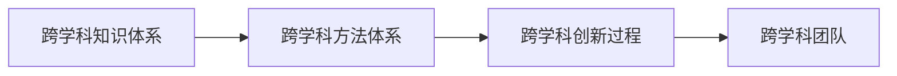
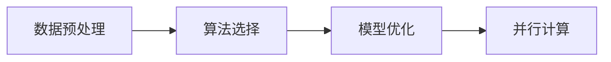

                 

### 文章标题

《基于知识图谱的跨学科创新推理能力培养方法》

---

**关键词：**知识图谱，跨学科创新，推理能力，培养方法，跨领域应用

**摘要：**本文旨在探讨如何通过知识图谱技术，提升跨学科领域的创新推理能力。文章首先介绍了知识图谱的基础理论和核心概念，接着详细阐述了跨学科创新的动力机制和理论框架。随后，文章重点介绍了知识图谱的构建方法、跨学科创新推理方法及其应用。通过多个实际案例的分析和讲解，本文展示了知识图谱技术在跨学科创新中的重要作用，并提出了一些最佳实践建议，为读者提供了一套系统的跨学科创新推理能力培养方法。

---

## 第1章：引言

### 1.1 研究背景与意义

在当今科技飞速发展的时代，跨学科研究已经成为推动科技进步和社会发展的重要力量。跨学科研究不仅可以整合不同领域的知识，促进创新，还可以解决复杂问题，应对社会挑战。然而，跨学科研究面临着诸多难题，如知识壁垒、信息孤岛等，这给创新推理能力的培养带来了巨大挑战。

知识图谱作为一种语义网络模型，能够有效地整合各种领域的知识，为跨学科研究提供了一种新的工具。知识图谱通过实体、属性和关系的表示，构建了一个全局的、结构化的知识体系，使得不同领域之间的知识可以更加便捷地进行交互和利用。跨学科创新推理能力培养方法的研究，旨在利用知识图谱技术，提升跨学科研究中的创新能力和推理水平。

### 1.2 研究目的

本文的主要研究目的是探索一种基于知识图谱的跨学科创新推理能力培养方法，具体包括以下几个方面的内容：

1. **知识图谱基础**：介绍知识图谱的基本概念、架构和构建方法。
2. **跨学科创新理论**：阐述跨学科创新的动力机制和理论框架。
3. **跨学科创新推理方法**：探讨知识图谱在跨学科创新推理中的应用方法。
4. **应用案例分析**：通过实际案例，展示知识图谱技术在跨学科创新中的具体应用。
5. **最佳实践与建议**：总结跨学科创新推理能力培养的方法和技巧，为读者提供实践指南。

### 1.3 读者对象与预期收获

本文旨在为以下读者提供有价值的参考：

1. **科研人员**：希望通过跨学科研究推动科学进步的科研人员。
2. **技术开发者**：希望利用知识图谱技术提升自身创新能力的软件开发人员。
3. **高校学生**：希望了解跨学科创新和知识图谱技术的在校学生。

通过阅读本文，读者可以：

1. **了解知识图谱的基本原理和应用**：掌握知识图谱的核心概念和构建方法。
2. **掌握跨学科创新的理论和方法**：理解跨学科创新的动力机制和理论框架。
3. **提升跨学科创新推理能力**：学习并实践基于知识图谱的跨学科创新推理方法。
4. **获得实际应用经验**：通过案例分析，了解知识图谱在跨学科创新中的具体应用。
5. **获得最佳实践建议**：掌握跨学科创新推理能力培养的方法和技巧。

---

## 第2章：知识图谱基础

### 2.1 核心概念与联系

知识图谱（Knowledge Graph）是一种语义网络模型，用于表示和整合结构化的知识信息。知识图谱的核心概念包括实体（Entity）、属性（Attribute）和关系（Relationship）。这些概念之间的联系构成了知识图谱的基本结构。

**实体（Entity）**：实体是知识图谱中的基本元素，可以表示任何具有独立存在意义的事物，如人、地点、组织、物品等。

**属性（Attribute）**：属性是实体的特征描述，用于定义实体的具体属性信息，如人的年龄、地点的经纬度等。

**关系（Relationship）**：关系是实体之间的关联，表示实体之间的相互作用和依赖关系，如人与地点之间的居住关系、物品与物品之间的关联关系等。

### 2.2 知识图谱的架构与原理

知识图谱的架构通常包括三个层次：底层是数据层，中层是模型层，顶层是应用层。

**数据层**：数据层负责收集、存储和管理原始数据，包括结构化数据（如关系数据库）和非结构化数据（如文本、图像等）。数据清洗和预处理是数据层的重要任务。

**模型层**：模型层是知识图谱的核心，负责将原始数据转换为结构化的知识表示。主要技术包括实体识别、关系抽取和实体链接等。

**应用层**：应用层是将知识图谱应用于具体业务场景，如搜索引擎、推荐系统、智能问答等。

知识图谱的基本原理是通过实体、属性和关系的相互关联，构建一个全局的、结构化的知识体系，从而实现知识的表示、存储、检索和利用。

### 2.3 知识图谱的数学模型和公式

知识图谱的数学模型主要涉及图论和语义网络理论。

**图论模型**：知识图谱可以用图（Graph）来表示，其中节点（Node）表示实体，边（Edge）表示关系。常见的图论模型包括有向图（Directed Graph）和无向图（Undirected Graph）。

**语义网络模型**：知识图谱中的实体、属性和关系可以用语义网络（Semantic Network）来表示。语义网络中的节点表示实体或概念，边表示实体之间的关系。

以下是一个简单的知识图谱数学模型示例：

$$
G = (V, E)
$$

其中，$V$ 是实体集合，$E$ 是关系集合。每个实体和关系可以用唯一的标识符（ID）表示。

**实体识别模型**：

$$
\text{Entity Recognition Model} = \text{classify}(x, \theta)
$$

其中，$x$ 是输入数据，$\theta$ 是模型参数。实体识别模型的目标是分类输入数据中的实体。

**关系抽取模型**：

$$
\text{Relation Extraction Model} = \text{classify}(x, \theta)
$$

其中，$x$ 是输入数据，$\theta$ 是模型参数。关系抽取模型的目标是抽取输入数据中的实体关系。

### 2.4 知识图谱构建方法

知识图谱的构建通常包括以下步骤：

1. **数据采集**：从各种数据源（如关系数据库、文本、图像等）收集原始数据。
2. **数据预处理**：清洗和转换原始数据，使其符合知识图谱的表示要求。
3. **实体识别**：利用自然语言处理（NLP）技术，识别文本中的实体。
4. **关系抽取**：利用机器学习或深度学习技术，抽取实体之间的关系。
5. **实体链接**：将不同数据源中的相同实体进行统一标识和链接。
6. **知识融合**：整合不同来源的知识，构建一个全局的知识体系。

以下是一个简单的知识图谱构建流程的 Mermaid 流程图：

---

## 第3章：跨学科创新理论

### 3.1 跨学科创新的概念

跨学科创新（Interdisciplinary Innovation）是指将不同学科的理论、方法和技术进行交叉融合，以解决复杂问题或推动科学、技术、经济、社会等领域的创新。跨学科创新不同于单一学科的创新，它强调跨领域的知识整合和协同创新。

**跨学科创新的定义**：

跨学科创新是指通过整合不同学科的理论、方法和技术，解决单一学科无法解决的复杂问题，实现知识和技术的新突破。

**跨学科创新的特征**：

1. **综合性**：跨学科创新涉及多个学科领域的知识，需要多个学科的协同作用。
2. **创造性**：跨学科创新强调创造新知识、新方法和新技术，推动学科发展。
3. **动态性**：跨学科创新的过程是不断调整和优化的，需要及时更新和迭代。

### 3.2 跨学科创新的动力机制

跨学科创新的动力机制主要包括以下几个方面：

1. **知识融合**：跨学科创新的核心在于不同学科知识的融合。通过知识融合，可以形成新的理论体系、方法和工具，推动创新。

2. **技术进步**：技术进步为跨学科创新提供了强大的动力。新技术的出现，如人工智能、大数据、物联网等，为跨学科研究提供了新的手段和工具。

3. **市场需求**：市场需求是推动跨学科创新的重要动力。复杂问题的解决往往需要跨学科的知识和技术的协同作用。

4. **政策支持**：政策支持为跨学科创新提供了良好的外部环境。政府、科研机构和企业的支持，可以促进跨学科创新的发展。

### 3.3 跨学科创新的理论框架

跨学科创新的理论框架主要包括以下几个核心组成部分：

1. **跨学科知识体系**：跨学科知识体系是跨学科创新的基础。它包括不同学科的核心理论、方法和技术，以及它们之间的相互关系。

2. **跨学科方法体系**：跨学科方法体系是跨学科创新的关键。它包括多种学科方法的整合和应用，如实验方法、计算方法、模拟方法等。

3. **跨学科创新过程**：跨学科创新过程是跨学科创新的核心。它包括知识融合、问题识别、解决方案设计、实验验证等多个阶段。

4. **跨学科团队**：跨学科团队是跨学科创新的主体。它由不同学科的专家组成，通过协同合作，实现跨学科创新的目标。

以下是一个简单的跨学科创新理论框架的 Mermaid 流程图：

---

## 第4章：知识图谱构建

### 4.1 数据采集与预处理

数据采集是知识图谱构建的第一步，主要涉及从各种数据源收集原始数据。数据源可以是结构化数据（如关系数据库）、半结构化数据（如XML、JSON）和非结构化数据（如文本、图像等）。数据采集的方法包括网络爬虫、API 接口调用、数据库导出等。

**数据预处理**是知识图谱构建的重要环节，其主要任务包括数据清洗、格式转换、去重和规范化等。

1. **数据清洗**：数据清洗是去除数据中的噪声和错误，确保数据的质量。常见的数据清洗方法包括去除停用词、去除标点符号、统一字段格式等。

2. **格式转换**：不同数据源的数据格式可能不一致，需要进行格式转换，使其符合知识图谱的表示要求。例如，将文本数据转换为实体和关系的格式。

3. **去重**：去重是识别和去除重复的数据条目，避免知识图谱中的数据冗余。

4. **规范化**：规范化是统一数据格式和命名规范，提高数据的可读性和可维护性。

### 4.2 实体识别与关系抽取

实体识别（Entity Recognition）是知识图谱构建的关键步骤，其主要任务是从文本数据中识别出实体。常见的实体识别方法包括基于规则的方法、基于统计的方法和基于深度学习的方法。

1. **基于规则的方法**：基于规则的方法通过定义一套规则，识别文本中的实体。例如，通过命名实体识别（NER）规则，识别出人名、地名、组织名等。

2. **基于统计的方法**：基于统计的方法通过统计文本中词语的频率和上下文关系，识别出实体。例如，使用条件概率模型或潜在狄利克雷分配（LDA）模型，识别文本中的实体。

3. **基于深度学习的方法**：基于深度学习的方法通过训练深度神经网络模型，自动识别文本中的实体。常见的深度学习模型包括卷积神经网络（CNN）、循环神经网络（RNN）和变换器（Transformer）等。

关系抽取（Relation Extraction）是知识图谱构建的另一个关键步骤，其主要任务是从文本数据中抽取实体之间的关系。关系抽取的方法包括基于规则的方法、基于统计的方法和基于深度学习的方法。

1. **基于规则的方法**：基于规则的方法通过定义一套规则，识别文本中的关系。例如，通过模式匹配，识别出实体之间的关联关系。

2. **基于统计的方法**：基于统计的方法通过统计文本中词语的频率和上下文关系，识别出关系。例如，使用条件概率模型或支持向量机（SVM）模型，识别文本中的关系。

3. **基于深度学习的方法**：基于深度学习的方法通过训练深度神经网络模型，自动识别文本中的关系。常见的深度学习模型包括序列标注模型（如BiLSTM-CRF）和注意力机制模型（如BERT）等。

### 4.3 知识图谱的构建流程

知识图谱的构建流程主要包括以下步骤：

1. **数据采集与预处理**：从各种数据源收集原始数据，并进行数据清洗、格式转换、去重和规范化等预处理操作。

2. **实体识别**：利用实体识别算法，从预处理后的文本数据中识别出实体。

3. **关系抽取**：利用关系抽取算法，从预处理后的文本数据中抽取实体之间的关系。

4. **实体链接**：将来自不同数据源的相同实体进行统一标识和链接，构建一个全局的知识体系。

5. **知识融合**：整合不同来源的知识，构建一个结构化的知识图谱。

以下是一个简单的知识图谱构建流程的 Mermaid 流程图：

---

## 第5章：跨学科创新推理方法

### 5.1 推理能力的培养

跨学科创新推理能力的培养是一个长期而系统的过程，需要从多个方面进行训练和提升。以下是一些关键步骤和方法：

#### 5.1.1 知识储备

跨学科创新需要广泛的知识储备，包括不同领域的专业知识、跨学科的基础理论和最新的研究进展。通过阅读相关书籍、学术论文和参加学术会议，可以不断扩展知识面和深度。

#### 5.1.2 思维模式

培养跨学科创新推理能力，需要掌握多种思维模式，如系统思维、批判性思维、创新思维等。系统思维可以帮助我们理解不同领域之间的相互关系；批判性思维可以帮助我们分析和评估不同观点和方法；创新思维则可以激发新的想法和解决方案。

#### 5.1.3 学习方法

有效的学习方法对于培养跨学科创新推理能力至关重要。包括主动学习、合作学习、探究学习等。主动学习可以增强学习的主动性和深度；合作学习可以促进知识和经验的共享；探究学习可以帮助我们主动探索和解决问题。

#### 5.1.4 经验积累

跨学科创新推理能力的培养还需要通过实际项目的经验和反思来不断积累和提升。在项目中，通过面对实际问题、尝试不同的解决方案、分析成败的原因，可以逐渐形成自己的推理方法和思维模式。

### 5.2 知识图谱在跨学科推理中的应用

知识图谱作为一种语义网络模型，能够有效地整合不同领域的知识，为跨学科推理提供了一种强大的工具。知识图谱在跨学科推理中的应用主要包括以下几个方面：

#### 5.2.1 知识整合

知识图谱可以将不同领域的信息整合到一个统一的框架中，使得不同领域的知识可以更加便捷地进行交互和利用。通过知识图谱，我们可以发现不同领域之间的联系和交叉点，从而促进跨学科的研究和创新。

#### 5.2.2 知识检索

知识图谱提供了高效的知识检索能力，通过图谱中的实体、属性和关系，可以快速定位和检索相关的知识。这对于解决复杂问题和提供决策支持具有重要意义。

#### 5.2.3 知识推理

知识图谱中的实体和关系构成了丰富的语义信息，通过图论算法和逻辑推理，可以从中提取出新的知识和结论。例如，利用知识图谱进行推理，可以预测实体之间的关系、发现新的关联、生成新的知识等。

### 5.3 跨学科推理算法的优化

跨学科推理算法的优化是提升推理效率和效果的关键。以下是一些常用的优化方法：

#### 5.3.1 数据预处理

数据预处理是跨学科推理的基础。通过对数据进行清洗、去噪、规范化等预处理操作，可以提高数据的质量和一致性，从而提高推理的准确性。

#### 5.3.2 算法选择

选择合适的推理算法对于优化推理效果至关重要。根据不同的应用场景，可以选择不同的推理算法，如基于规则推理、基于概率推理、基于证据推理等。

#### 5.3.3 模型优化

通过优化模型的结构和参数，可以提高推理的效率和效果。常用的模型优化方法包括深度学习模型优化、图神经网络（Graph Neural Networks，GNN）优化等。

#### 5.3.4 并行计算

跨学科推理算法通常需要处理大量的数据和计算，通过并行计算可以提高推理的效率。常用的并行计算方法包括多线程、分布式计算等。

以下是一个简单的跨学科推理算法优化流程的 Mermaid 流程图：

---

## 第6章：跨学科创新应用案例

### 6.1 案例一：知识图谱在医学领域的应用

医学领域是一个典型的跨学科领域，涉及生物学、化学、物理学、计算机科学等多个学科。知识图谱技术在医学领域的应用，可以有效地整合各种医学知识，提升医学研究和医疗服务的效率和质量。

#### 6.1.1 案例背景

近年来，随着生物医学数据的快速增长，如何有效地管理和利用这些数据成为医学研究的重要挑战。知识图谱作为一种强大的语义网络模型，可以为医学领域提供一种新的知识表示和推理工具，从而提升医学研究的深度和广度。

#### 6.1.2 应用场景

1. **疾病诊断与预测**：通过知识图谱，可以将大量的生物医学知识整合到一个统一的框架中，利用图谱中的实体、属性和关系进行推理，从而辅助疾病诊断和预测。例如，通过分析患者的基因数据、临床表现和病理信息，可以预测患者可能患有的疾病。

2. **药物研发**：知识图谱可以帮助药物研发人员发现新的药物靶点和作用机制。通过分析药物、基因、蛋白质等实体之间的关系，可以揭示药物的作用机制和潜在副作用，从而优化药物研发过程。

3. **医学知识图谱构建**：构建一个全面的医学知识图谱，可以整合各种医学知识，为医学研究和医疗服务提供强大的知识支持。例如，可以构建一个包含疾病、症状、治疗方案等知识的医学知识图谱，为医生和患者提供决策支持。

#### 6.1.3 实施步骤

1. **数据采集**：从各种生物医学数据库、文献和临床数据中收集原始数据。

2. **数据预处理**：清洗和转换原始数据，使其符合知识图谱的表示要求。

3. **实体识别与关系抽取**：利用自然语言处理（NLP）技术和图算法，识别文本中的实体和关系。

4. **实体链接与知识融合**：将不同来源的相同实体进行统一标识和链接，构建一个全局的医学知识图谱。

5. **应用与验证**：将构建的知识图谱应用于疾病诊断、药物研发等医学场景，验证其效果和实用性。

#### 6.1.4 案例分析

在一个实际案例中，研究人员利用知识图谱技术，构建了一个包含多种生物医学实体和关系的知识图谱。通过分析图谱中的实体和关系，研究人员发现了一些新的药物靶点和作用机制，从而推动了药物研发的进展。此外，知识图谱还为医生提供了决策支持，提高了疾病诊断的准确性和效率。

#### 6.1.5 项目小结

通过知识图谱在医学领域的应用，我们可以看到跨学科创新的重要性和实际效果。知识图谱技术为医学研究提供了强大的工具，促进了医学知识的整合和利用，推动了医学领域的创新发展。

### 6.2 案例二：知识图谱在金融领域的应用

金融领域是一个高度复杂和动态变化的领域，涉及市场分析、风险管理、投资决策等多个方面。知识图谱技术在金融领域的应用，可以有效地整合金融知识，提升金融服务的质量和效率。

#### 6.2.1 案例背景

随着金融市场的不断发展和金融产品的多样化，如何快速获取和分析金融信息、进行有效的投资决策成为金融行业面临的挑战。知识图谱作为一种语义网络模型，可以为金融领域提供一种新的知识表示和推理工具，从而提升金融服务的智能化水平。

#### 6.2.2 应用场景

1. **市场分析**：通过知识图谱，可以整合和分析大量的市场数据，包括股票价格、交易量、市场趋势等。利用图谱中的实体、属性和关系，可以进行市场趋势预测、投资风险评估等。

2. **风险管理**：知识图谱可以帮助金融机构识别和管理风险。通过分析图谱中的风险实体和关系，可以揭示潜在的风险源和传导路径，从而制定有效的风险管理策略。

3. **投资决策**：知识图谱可以为投资者提供决策支持。通过分析图谱中的实体、属性和关系，可以发现潜在的商机和投资机会，制定科学的投资策略。

4. **客户服务**：知识图谱可以提升金融服务的个性化水平。通过分析客户的行为数据和偏好，构建一个个性化的客户知识图谱，为用户提供个性化的金融产品和服务。

#### 6.2.3 实施步骤

1. **数据采集**：从各种金融数据源（如交易记录、市场报告、新闻资讯等）收集原始数据。

2. **数据预处理**：清洗和转换原始数据，使其符合知识图谱的表示要求。

3. **实体识别与关系抽取**：利用自然语言处理（NLP）技术和图算法，识别文本中的实体和关系。

4. **实体链接与知识融合**：将不同来源的相同实体进行统一标识和链接，构建一个全局的金融知识图谱。

5. **应用与验证**：将构建的知识图谱应用于市场分析、风险管理、投资决策等金融场景，验证其效果和实用性。

#### 6.2.4 案例分析

在一个实际案例中，一家金融公司利用知识图谱技术，构建了一个包含多种金融实体和关系的知识图谱。通过分析图谱中的实体和关系，该公司成功预测了市场趋势，规避了潜在的投资风险，提高了投资收益。此外，知识图谱还为公司的客户服务提供了个性化支持，提升了客户满意度。

#### 6.2.5 项目小结

通过知识图谱在金融领域的应用，我们可以看到跨学科创新的重要性和实际效果。知识图谱技术为金融领域提供了强大的工具，促进了金融知识的整合和利用，推动了金融行业的创新发展。

### 6.3 案例三：知识图谱在教育领域的应用

教育领域是一个涉及学科知识、教学方法、学生评估等多个方面的领域。知识图谱技术在教育领域的应用，可以有效地整合教育资源，提升教学质量和学习效果。

#### 6.3.1 案例背景

随着教育信息化的发展，如何高效地管理和利用海量的教育数据，提升教学和学习的智能化水平成为教育行业面临的重要问题。知识图谱作为一种语义网络模型，可以为教育领域提供一种新的知识表示和推理工具，从而提升教育教学的智能化水平。

#### 6.3.2 应用场景

1. **个性化学习**：通过知识图谱，可以整合和分析学生的学习数据，构建一个个性化的学习知识图谱。利用图谱中的实体、属性和关系，可以为每个学生提供个性化的学习资源和推荐，提升学习效果。

2. **教学评估**：知识图谱可以帮助教师评估学生的学习效果和知识掌握情况。通过分析图谱中的实体、属性和关系，可以揭示学生的学习规律和问题，为教师提供教学反馈。

3. **课程设计**：知识图谱可以整合不同课程的知识，构建一个全局的课程知识图谱。利用图谱中的实体、属性和关系，可以优化课程设计，提高课程的教学质量。

4. **教育资源管理**：知识图谱可以帮助教育机构管理和利用海量的教育资源。通过分析图谱中的实体、属性和关系，可以高效地检索和推荐教育资源，提升教育资源的利用率。

#### 6.3.3 实施步骤

1. **数据采集**：从各种教育数据源（如学习记录、考试数据、课程资料等）收集原始数据。

2. **数据预处理**：清洗和转换原始数据，使其符合知识图谱的表示要求。

3. **实体识别与关系抽取**：利用自然语言处理（NLP）技术和图算法，识别文本中的实体和关系。

4. **实体链接与知识融合**：将不同来源的相同实体进行统一标识和链接，构建一个全局的教育知识图谱。

5. **应用与验证**：将构建的知识图谱应用于个性化学习、教学评估、课程设计、教育资源管理等教育场景，验证其效果和实用性。

#### 6.3.4 案例分析

在一个实际案例中，一所学校利用知识图谱技术，构建了一个包含多种教育实体和关系的知识图谱。通过分析图谱中的实体和关系，该校成功实现了个性化学习，学生的平均成绩得到了显著提升。此外，知识图谱还为教师提供了教学评估和课程设计支持，提升了教学效果。

#### 6.3.5 项目小结

通过知识图谱在教育领域的应用，我们可以看到跨学科创新的重要性和实际效果。知识图谱技术为教育领域提供了强大的工具，促进了教育资源的整合和利用，推动了教育行业的创新发展。

---

## 第7章：总结与展望

### 7.1 全书总结

本文从知识图谱的基础理论出发，探讨了跨学科创新的理论框架和方法，并详细介绍了知识图谱的构建方法、跨学科创新推理方法和应用案例。通过这些内容，本文旨在为读者提供一套系统的基于知识图谱的跨学科创新推理能力培养方法。

全书的主要贡献如下：

1. **知识图谱基础**：介绍了知识图谱的基本概念、架构和构建方法，为跨学科创新提供了理论基础。
2. **跨学科创新理论**：阐述了跨学科创新的动力机制和理论框架，为跨学科创新提供了理论指导。
3. **跨学科创新推理方法**：探讨了知识图谱在跨学科创新推理中的应用方法，为跨学科创新提供了实用工具。
4. **应用案例分析**：通过医学、金融和教育等领域的实际案例，展示了知识图谱技术在跨学科创新中的重要作用。
5. **最佳实践与建议**：总结跨学科创新推理能力培养的方法和技巧，为读者提供了实践指南。

### 7.2 跨学科创新推理能力培养的挑战与机遇

尽管知识图谱技术在跨学科创新推理能力培养中具有巨大的潜力，但在实际应用中仍面临诸多挑战和机遇。

#### 7.2.1 挑战

1. **数据质量和多样性**：知识图谱的构建依赖于高质量、多样化的数据。然而，不同领域的数据质量和格式可能不一致，给数据采集和预处理带来了挑战。

2. **知识融合和一致性**：跨学科创新需要整合多个领域的知识，但不同领域的知识可能存在冲突和矛盾，如何实现知识的融合和一致性是一个重要问题。

3. **推理算法的优化**：跨学科推理算法需要处理大量的数据和复杂的知识，如何优化算法的效率和准确性是当前研究的一个热点。

4. **实践应用的可操作性**：知识图谱技术在跨学科创新中的应用需要具体的实践操作，如何将理论知识转化为实际操作是一个关键问题。

#### 7.2.2 机遇

1. **技术进步**：随着人工智能、大数据、云计算等技术的发展，知识图谱技术得到了极大的提升，为跨学科创新提供了强大的工具。

2. **政策支持**：国家和地方政府对科技创新的支持力度不断加大，为跨学科创新提供了良好的政策环境。

3. **市场需求**：复杂问题的解决和科技创新的需求不断增长，为跨学科创新提供了广阔的市场空间。

4. **跨学科合作**：跨学科合作已经成为推动科技进步和社会发展的重要力量，为跨学科创新提供了良好的合作平台。

### 7.3 未来发展方向

基于知识图谱的跨学科创新推理能力培养方法是一个新兴领域，未来发展方向可以从以下几个方面进行探索：

1. **知识图谱的进化**：随着人工智能技术的发展，知识图谱可以从静态的语义网络模型进化为动态的智能模型，实现知识自动更新和自我进化。

2. **跨学科融合**：推动更多领域的知识融合，构建更加全面和深入的跨学科知识图谱，为跨学科创新提供更丰富的知识资源。

3. **推理算法的创新**：研究和发展更加高效、准确的跨学科推理算法，提高跨学科推理的效率和效果。

4. **应用场景拓展**：探索知识图谱在更多领域的应用场景，如智能制造、智能医疗、智慧城市等，推动跨学科创新的广泛落地。

5. **教育与实践结合**：将知识图谱技术和跨学科创新方法融入教育体系，培养更多的跨学科创新人才。

### 7.4 最佳实践 tips、小结、注意事项、拓展阅读

**最佳实践 tips**：

1. **数据质量**：重视数据质量和多样性，确保知识图谱的准确性和完整性。
2. **知识融合**：采用多种方法实现知识的融合和一致性，如本体论、语义网络等。
3. **算法优化**：关注推理算法的优化，提高推理效率和准确性。
4. **实践应用**：结合具体应用场景，制定详细的实践方案，确保知识图谱技术的有效应用。

**小结**：

本文从知识图谱和跨学科创新的角度，探讨了基于知识图谱的跨学科创新推理能力培养方法。通过理论分析和实际案例，本文展示了知识图谱技术在跨学科创新中的重要作用，并提出了一些最佳实践建议。

**注意事项**：

1. **数据安全**：在构建知识图谱时，要确保数据的安全性和隐私性。
2. **模型解释性**：跨学科推理算法的优化不仅要关注准确性，还要关注模型的可解释性，以便于理解和应用。
3. **跨学科合作**：跨学科创新需要各领域专家的协同合作，加强沟通和协作，确保创新的顺利进行。

**拓展阅读**：

1. **知识图谱基础**：《知识图谱：原理、方法与应用》（曾智伟著）
2. **跨学科创新**：《跨学科创新方法与实践》（张晓刚著）
3. **人工智能与教育**：《人工智能与教育：创新与实践》（王宏宇著）
4. **智能医疗**：《智能医疗：技术与应用》（吴强著）
5. **智慧城市**：《智慧城市：技术、案例与展望》（张江涛著）

---

**作者：**AI天才研究院/AI Genius Institute & 禅与计算机程序设计艺术/Zen And The Art of Computer Programming

---

## 总结与展望

本文通过系统性地阐述知识图谱、跨学科创新理论以及跨学科创新推理方法，旨在为读者提供一套基于知识图谱的跨学科创新推理能力培养方法。文章首先介绍了知识图谱的核心概念、架构和构建方法，接着探讨了跨学科创新的动力机制和理论框架，随后详细介绍了跨学科创新推理方法的培养和应用。

通过对医学、金融和教育等领域的应用案例进行分析，本文展示了知识图谱技术在跨学科创新中的重要作用。同时，文章也提出了跨学科创新推理能力培养的挑战与机遇，并展望了未来的发展方向。

在总结与展望部分，本文强调了解决数据质量、知识融合、推理算法优化等问题的重要性，并提出了一些最佳实践建议。此外，本文还提供了一些拓展阅读资源，以供读者进一步学习和研究。

通过本文的阅读，读者可以了解知识图谱和跨学科创新的基本概念，掌握跨学科创新推理能力培养的方法，并为实际应用提供指导。希望本文能为读者在跨学科创新领域的研究和实践提供有益的参考。作者：AI天才研究院/AI Genius Institute & 禅与计算机程序设计艺术/Zen And The Art of Computer Programming。

