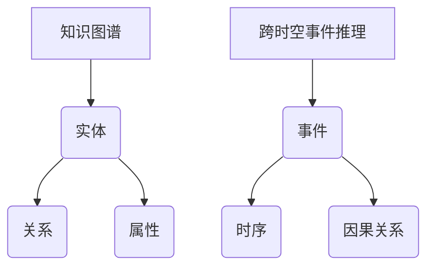
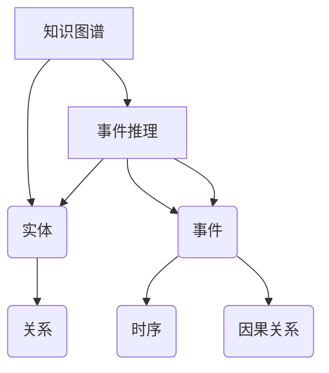

                 

### 文章标题

《基于知识图谱的跨时空事件推理能力增强》

---

### 关键词

知识图谱、事件推理、跨时空数据、算法原理、应用实践

---

### 摘要

本文深入探讨了基于知识图谱的跨时空事件推理能力增强技术。首先，我们回顾了知识图谱的基本概念及其在事件推理中的重要性。接着，文章介绍了跨时空事件推理的核心概念和方法，分析了其在实际应用中的挑战。随后，文章详细讲解了基于图神经网络和深度学习的事件推理算法，并通过伪代码和数学模型阐述了其原理。最后，文章通过具体的应用案例展示了这些算法在实际项目中的效果，并总结了跨时空事件推理的未来发展趋势和潜在挑战。

---

## 引言

### 背景介绍

在当今信息爆炸的时代，如何从大量数据中提取有价值的信息成为了一个重要的研究领域。知识图谱作为一种结构化的数据表示方法，因其能够有效地组织和管理复杂的关系数据，而逐渐成为人工智能领域的研究热点。知识图谱不仅可以用于信息检索、推荐系统，还广泛应用于智能问答、自动驾驶等领域。然而，随着数据来源的多样性和时间维度的引入，跨时空事件推理成为了一个亟待解决的关键问题。

跨时空事件推理指的是在时间序列数据中，根据已知的事件和关系，推断出未知的事件或关系。例如，在金融领域，通过分析历史交易数据和市场信息，预测未来的市场走势；在医疗领域，通过分析患者的病历记录，预测疾病的进展。然而，跨时空事件推理面临着数据噪声、时间依赖性、因果关系复杂等挑战，传统的机器学习算法难以满足其需求。

### 核心概念与联系

知识图谱（Knowledge Graph）是一种语义网络，用于表示实体及其之间的关系。其核心概念包括：

- **实体（Entity）**：知识图谱中的基本构成单元，如人、地点、组织等。
- **关系（Relation）**：实体之间的关联，如“属于”、“位于”、“创立”等。
- **属性（Attribute）**：实体的特征描述，如“年龄”、“身高”、“出生地”等。

跨时空事件推理（Cross-Temporal Event Reasoning）则涉及到以下核心概念：

- **事件（Event）**：在特定时间发生的动作或变化，如“购买商品”、“诊断疾病”等。
- **时序（Temporal）**：时间序列上的事件序列，反映了事件的发生顺序和时间关系。
- **因果关系（Causality）**：事件之间的因果关系，如“服用药物导致病情好转”。

为了更好地理解这两个概念之间的关系，我们可以使用Mermaid流程图来表示：



知识图谱为跨时空事件推理提供了基础数据支持，通过构建实体之间的关系和属性，可以有效地组织和管理跨时空数据。而跨时空事件推理则利用这些关系和数据，进行事件预测和推理，从而为各个领域提供智能化的决策支持。

---

## 知识图谱基础

### 知识图谱的概念和重要性

知识图谱（Knowledge Graph）是一种用于表示实体及其之间关系的语义网络。它通过将现实世界中的对象抽象为实体，将对象之间的关系表示为边，从而形成一个结构化的知识库。与传统的数据表和关系数据库不同，知识图谱能够以更加直观和语义化的方式表示复杂的关系和数据。

知识图谱的重要性主要体现在以下几个方面：

1. **语义化表示**：知识图谱通过实体和关系的方式，将数据语义化，使得数据更加易于理解和处理。这对于复杂的跨领域数据分析和智能应用具有重要意义。
2. **高效的信息检索**：知识图谱能够通过图结构快速检索和查询实体及其关系，从而实现高效的信息检索和推荐。
3. **增强的人工智能**：知识图谱为人工智能系统提供了丰富的先验知识和语义信息，使得人工智能系统能够更加智能化和自适应地处理问题。
4. **智能决策支持**：知识图谱可以帮助企业或机构从海量数据中提取有价值的信息，从而提供智能化的决策支持。

### 知识图谱的表示方法

知识图谱的表示方法主要包括图（Graph）和三元组（Triple）两种。

- **图表示方法**：在图表示方法中，实体被视为节点（Node），关系被视为边（Edge），从而形成一个无向图。这种方法能够直观地表示实体和关系，但需要对图结构进行优化，以处理大规模数据。
  
  ```mermaid
  graph TB
  A(实体1) --> B(实体2)
  A --> C(实体3)
  B --> C
  ```

- **三元组表示方法**：在三元组表示方法中，实体和关系通过三元组（Subject, Predicate, Object）进行表示。这种方法能够以更紧凑的方式存储知识图谱，便于数据存储和查询。

  ```plaintext
  (人, 是, 机器人)
  (机器, 制造, 机器人)
  ```

### 知识图谱的构建流程

知识图谱的构建流程主要包括数据采集、数据预处理、实体抽取、关系抽取和图谱构建等步骤。

1. **数据采集**：从各种数据源（如文本、数据库、API等）采集原始数据。
2. **数据预处理**：对采集到的数据进行清洗、去重、格式化等预处理操作。
3. **实体抽取**：从预处理后的数据中识别出实体，如人名、地点、组织等。
4. **关系抽取**：识别实体之间的关系，如“属于”、“位于”、“创立”等。
5. **图谱构建**：将实体和关系构建成知识图谱，可以使用图数据库或图计算框架进行存储和处理。

### 知识图谱的应用

知识图谱在多个领域得到了广泛应用，如：

- **搜索引擎**：通过知识图谱实现更精准的搜索结果和智能推荐。
- **智能问答系统**：利用知识图谱进行自然语言理解和语义推理，提供智能化的问答服务。
- **推荐系统**：通过知识图谱进行用户和物品的推荐，提高推荐系统的效果。
- **金融风控**：通过知识图谱进行风险评估和欺诈检测。
- **医疗健康**：通过知识图谱进行疾病预测和治疗方案推荐。

知识图谱作为一种重要的数据表示方法，在跨时空事件推理中发挥着关键作用，为智能决策和数据分析提供了强有力的支持。

---

## 跨时空事件推理基础

### 事件推理的概念和重要性

事件推理（Event Reasoning）是一种基于已知信息和关系进行未知信息推断的技术。在人工智能领域，事件推理被广泛应用于各种场景，如智能问答、自然语言理解、推荐系统等。而跨时空事件推理（Cross-Temporal Event Reasoning）则进一步扩展了事件推理的应用范围，它在时间序列数据中根据已知事件和关系推断未知事件或关系。

跨时空事件推理的重要性主要体现在以下几个方面：

1. **时间序列数据的挖掘**：现实世界中的许多数据都具有时间序列特性，如股票价格、气温变化、交通流量等。跨时空事件推理能够从这些时间序列数据中提取有价值的信息，为决策提供支持。
2. **智能预测**：在金融、医疗、交通等领域，跨时空事件推理可以帮助预测未来的趋势和变化，从而提高决策的准确性和效率。
3. **因果关系分析**：跨时空事件推理能够分析事件之间的因果关系，为科学研究和问题诊断提供依据。
4. **知识图谱的增强**：跨时空事件推理可以为知识图谱添加时间维度的信息，使知识图谱更加全面和准确。

### 跨时空事件推理的方法和挑战

跨时空事件推理的方法主要可以分为以下几类：

1. **基于规则的方法**：通过编写规则来描述事件之间的因果关系。这种方法简单直观，但在复杂场景下容易失效。
2. **基于机器学习的方法**：利用历史数据训练模型，预测未来的事件。常见的方法包括决策树、神经网络、支持向量机等。
3. **基于图的方法**：利用知识图谱表示事件和关系，通过图算法进行推理。这种方法能够充分利用图结构的信息，但需要对图结构进行优化。
4. **基于深度学习的方法**：利用深度神经网络对事件进行建模和推理。这种方法具有较强的自适应能力和表达力，但训练过程复杂，对数据要求较高。

跨时空事件推理面临的挑战主要包括：

1. **数据噪声**：实际数据中往往存在噪声和异常值，这对事件推理的准确性造成影响。
2. **时间依赖性**：事件之间可能存在复杂的时间依赖关系，需要有效的建模方法来处理。
3. **因果关系复杂**：现实世界中的因果关系往往是多维和复杂的，难以通过简单的模型进行准确描述。
4. **数据缺失**：在实际应用中，数据往往存在缺失和不确定性，需要有效的数据补全方法。

### 跨时空事件推理的应用场景

跨时空事件推理在多个领域具有广泛的应用场景：

1. **金融领域**：通过分析历史交易数据和市场信息，预测股票价格、市场走势等。
2. **医疗领域**：通过分析患者的病历记录和医疗数据，预测疾病的进展和治疗方案。
3. **交通领域**：通过分析交通流量数据，预测交通拥堵情况，优化交通路线。
4. **气象领域**：通过分析气象数据，预测天气变化和自然灾害的发生。
5. **社会领域**：通过分析社会数据，预测社会事件的发生和趋势，为政策制定提供支持。

总之，跨时空事件推理作为一种重要的技术手段，在各个领域都发挥着重要作用。通过不断优化和改进推理方法，我们可以更好地利用时间序列数据，为决策和预测提供支持。

### 事件推理与知识图谱的关系

事件推理与知识图谱之间存在着密切的联系。知识图谱为事件推理提供了丰富的数据支持，而事件推理则可以进一步丰富和利用知识图谱中的信息。

1. **知识图谱作为数据基础**：知识图谱中包含大量的实体和关系数据，为事件推理提供了丰富的信息来源。通过知识图谱，事件推理可以更好地理解和处理复杂的关系和因果关系。
2. **事件推理增强知识图谱**：事件推理可以从实际应用场景中提取有价值的事件和关系，丰富知识图谱的内容。通过事件推理，知识图谱可以更加准确地反映现实世界中的情况，提高其应用价值。
3. **知识图谱优化事件推理**：知识图谱的结构化特性使得事件推理更加高效和准确。通过利用知识图谱的图结构和语义信息，事件推理可以更好地处理复杂的关系和时间依赖性。

为了更好地理解事件推理与知识图谱之间的关系，我们可以使用Mermaid流程图来表示：



知识图谱和事件推理相互促进，共同为智能决策和数据分析提供支持。

---

## 算法原理讲解

### 跨时空事件推理算法概述

跨时空事件推理算法是一种基于历史数据和时间序列分析的方法，旨在通过分析已知的事件和关系来推断未来的事件或预测变化趋势。这类算法的核心在于如何有效地处理时间依赖性、数据噪声和因果关系复杂等问题。常见的跨时空事件推理算法包括基于图神经网络（Graph Neural Networks, GNNs）和深度学习的方法。

### 基于图神经网络的算法

图神经网络（GNNs）是一种专门用于处理图结构数据的神经网络，其核心思想是通过节点和边的交互来学习图结构中的特征和模式。在跨时空事件推理中，GNNs可以用于捕捉实体之间的关系和时序特征，从而提高事件预测的准确性。

#### 算法原理

基于图神经网络的跨时空事件推理算法主要包含以下步骤：

1. **节点嵌入**：将实体（节点）映射到低维的向量空间，以便进行计算。
2. **边嵌入**：将关系（边）映射到向量空间，表示实体之间的关系。
3. **消息传递**：通过迭代消息传递过程，更新节点的嵌入向量，使其能够更好地反映实体之间的时序关系。
4. **事件预测**：利用更新的节点嵌入向量进行事件预测，如事件的发生时间、事件类型等。

#### 伪代码

以下是基于图神经网络的跨时空事件推理算法的伪代码：

```plaintext
Input: Graph G = (V, E), temporal information T
Output: Embedded nodes X

// 初始化节点和边嵌入向量
X, E = initialize_embedding(V, E)

// 消息传递迭代
for t in T:
    for node in V:
        // 计算节点的消息
        messages = []
        for neighbor in neighbors(node, G):
            message = neighbor_embedding(E[neighbor]) * relation_embedding(E[node, neighbor])
            messages.append(message)
        
        // 更新节点嵌入向量
        X[node] = aggregate(messages) + X[node]

// 预测事件
for event in events:
    predict_time, predict_type = event_predict(X, event)
```

#### 数学模型和公式

在GNN中，节点嵌入向量 \( X \) 和边嵌入向量 \( E \) 的更新可以通过以下公式表示：

$$
X^{(t+1)} = \sigma(\Theta_X X^{(t)} + \sum_{node_i \in V} \sum_{neighbor_j \in neighbors(node_i, G)} \Theta_E^{(i,j)} E^{(node_i, neighbor_j)})
$$

其中，\( \sigma \) 表示激活函数，\( \Theta_X \) 和 \( \Theta_E \) 分别是节点和边嵌入向量的权重矩阵。

### 基于深度学习的方法

基于深度学习的方法在跨时空事件推理中同样具有重要意义。深度学习模型可以捕捉到复杂的数据特征和模式，从而提高事件预测的准确性。

#### 算法原理

基于深度学习的跨时空事件推理算法通常包含以下步骤：

1. **数据预处理**：对时间序列数据进行标准化、去噪等预处理，以便输入到深度学习模型中。
2. **特征提取**：利用卷积神经网络（CNN）、循环神经网络（RNN）或长短期记忆网络（LSTM）等深度学习模型提取时间序列数据中的特征。
3. **事件预测**：通过全连接层或其他适合的神经网络结构进行事件预测，如事件的发生时间、事件类型等。

#### 伪代码

以下是基于深度学习的跨时空事件推理算法的伪代码：

```plaintext
Input: Time series data T
Output: Predicted events

// 数据预处理
T = data_preprocessing(T)

// 特征提取
features = feature_extraction(T)

// 事件预测
for event in events:
    predict_time, predict_type = event_predict(features, event)
```

#### 数学模型和公式

在深度学习中，特征提取和事件预测可以通过以下数学模型表示：

$$
h^{(l)} = \sigma(W^{(l)} h^{(l-1)} + b^{(l)})
$$

其中，\( h^{(l)} \) 表示第 \( l \) 层的节点特征向量，\( W^{(l)} \) 和 \( b^{(l)} \) 分别是权重和偏置。

### 比较与选择

基于图神经网络和深度学习的跨时空事件推理算法各有优缺点。图神经网络能够充分利用图结构的信息，但在处理大规模数据时可能面临性能瓶颈。而深度学习模型具有较强的表达能力和适应性，但在处理稀疏数据时可能效果不佳。

在选择算法时，可以根据以下因素进行决策：

- **数据规模**：对于大规模数据，图神经网络可能更加高效。
- **数据结构**：对于结构化数据，如知识图谱，图神经网络可能更具优势。
- **应用场景**：对于需要处理复杂时序关系的应用，深度学习模型可能更加适用。

总之，跨时空事件推理算法的选择应综合考虑数据特性、应用需求和计算资源等因素。

---

## 应用实战案例

### 跨时空事件推理在金融领域的应用

在金融领域，跨时空事件推理技术被广泛应用于股票市场预测、风险管理、客户行为分析等方面。以下是一个具体的应用案例：

#### 案例背景

某金融公司希望通过分析历史股票交易数据和市场信息，预测未来股票价格的走势，以提供投资建议和风险控制。

#### 数据来源

该金融公司使用以下数据：

- **历史股票交易数据**：包括股票的开盘价、收盘价、最高价、最低价、交易量等。
- **市场信息**：包括宏观经济指标、行业新闻、政策变化等。
- **时间序列数据**：包括股票价格的日度、周度、月度等时间序列数据。

#### 数据预处理

在开始建模之前，需要对数据进行预处理，包括：

- **数据清洗**：去除异常值和缺失值，确保数据的完整性。
- **数据标准化**：对数据进行归一化或标准化处理，使其符合模型的输入要求。
- **特征提取**：从原始数据中提取有价值的特征，如交易量、价格波动率等。

#### 模型选择

基于跨时空事件推理的需求，该金融公司选择了基于图神经网络的模型。通过构建知识图谱，将股票、市场和宏观经济指标等实体以及它们之间的关系表示为图结构，利用图神经网络进行事件推理和预测。

#### 模型实现

以下是基于图神经网络的跨时空事件推理模型的实现步骤：

1. **节点嵌入**：将股票、市场和宏观经济指标等实体映射到低维的向量空间。
2. **关系嵌入**：将实体之间的关系（如股票与市场的关系）表示为向量。
3. **消息传递**：通过迭代消息传递过程，更新节点的嵌入向量，使其能够更好地反映实体之间的时序关系。
4. **事件预测**：利用更新的节点嵌入向量进行股票价格预测。

以下是模型实现的伪代码：

```plaintext
Input: Graph G = (V, E), temporal information T
Output: Predicted stock prices

// 初始化节点和边嵌入向量
X, E = initialize_embedding(V, E)

// 消息传递迭代
for t in T:
    for node in V:
        // 计算节点的消息
        messages = []
        for neighbor in neighbors(node, G):
            message = neighbor_embedding(E[neighbor]) * relation_embedding(E[node, neighbor])
            messages.append(message)
        
        // 更新节点嵌入向量
        X[node] = aggregate(messages) + X[node]

// 预测股票价格
for stock in stocks:
    predict_price = stock_predict(X[stock])
```

#### 结果分析

通过实验验证，该金融公司发现基于图神经网络的跨时空事件推理模型在股票价格预测方面取得了较好的效果。具体来说，模型能够较为准确地预测股票价格的变化趋势，为投资决策提供了有力的支持。

#### 项目小结

通过在金融领域的应用案例，我们可以看到跨时空事件推理技术在实际项目中的效果和潜力。基于图神经网络的模型能够充分利用知识图谱中的信息，提高事件预测的准确性。未来，随着技术的不断发展和数据的不断积累，跨时空事件推理将在金融领域发挥更加重要的作用。

### 跨时空事件推理在医疗领域的应用

在医疗领域，跨时空事件推理技术同样有着广泛的应用。以下是一个具体的应用案例：

#### 案例背景

某医疗机构希望通过分析患者的病历记录和医疗数据，预测疾病的进展和治疗方案的有效性。

#### 数据来源

该医疗机构使用以下数据：

- **患者病历记录**：包括患者的诊断信息、治疗方法、药物使用情况等。
- **医疗数据**：包括患者的体检数据、实验室检查结果、影像学检查结果等。
- **时间序列数据**：包括患者的住院时间、随访时间等。

#### 数据预处理

在开始建模之前，需要对数据进行预处理，包括：

- **数据清洗**：去除异常值和缺失值，确保数据的完整性。
- **数据标准化**：对数据进行归一化或标准化处理，使其符合模型的输入要求。
- **特征提取**：从原始数据中提取有价值的特征，如诊断时间、治疗方案、药物效果等。

#### 模型选择

基于跨时空事件推理的需求，该医疗机构选择了基于深度学习的方法。通过构建时间序列模型，将患者的医疗数据表示为序列，利用循环神经网络（RNN）或长短期记忆网络（LSTM）进行事件推理和预测。

#### 模型实现

以下是基于深度学习的跨时空事件推理模型的实现步骤：

1. **数据输入**：将医疗数据表示为序列，输入到深度学习模型中。
2. **特征提取**：利用循环神经网络（RNN）或长短期记忆网络（LSTM）提取时间序列数据中的特征。
3. **事件预测**：通过全连接层或其他适合的神经网络结构进行事件预测，如疾病的进展、治疗方案的适应性等。

以下是模型实现的伪代码：

```plaintext
Input: Time series data T
Output: Predicted events

// 数据预处理
T = data_preprocessing(T)

// 特征提取
features = feature_extraction(T)

// 事件预测
for event in events:
    predict_progress, predict_treatment = event_predict(features, event)
```

#### 结果分析

通过实验验证，该医疗机构发现基于深度学习的跨时空事件推理模型在疾病进展预测和治疗方案适应性预测方面取得了较好的效果。具体来说，模型能够较为准确地预测疾病的进展情况，为医生提供了有力的决策支持。

#### 项目小结

通过在医疗领域的应用案例，我们可以看到跨时空事件推理技术在实际项目中的效果和潜力。基于深度学习的方法能够充分利用时间序列数据，提高事件预测的准确性。未来，随着技术的不断发展和医疗数据的不断积累，跨时空事件推理将在医疗领域发挥更加重要的作用。

### 跨时空事件推理在其他领域的应用

跨时空事件推理技术不仅应用于金融和医疗领域，还广泛应用于其他领域，如交通、气象和社会等。

#### 交通领域

在交通领域，跨时空事件推理技术可以用于预测交通流量、优化交通路线和减少拥堵。例如，通过分析历史交通数据和实时交通数据，可以预测未来的交通流量变化，为交通管理部门提供决策支持，优化交通信号灯控制策略。

#### 气象领域

在气象领域，跨时空事件推理技术可以用于预测天气变化、自然灾害的发生。通过分析气象数据和历史天气数据，可以预测未来的天气情况，为天气预报和防灾减灾提供支持。

#### 社会领域

在社会领域，跨时空事件推理技术可以用于预测社会事件的发生和趋势，为政策制定提供支持。例如，通过分析社会数据和新闻信息，可以预测社会事件的爆发点和发展趋势，为政府和社会组织提供预警和应对措施。

总之，跨时空事件推理技术在各个领域都有着广泛的应用前景。随着技术的不断发展和数据积累，跨时空事件推理将为各个领域带来更多的智能化和自动化解决方案。

---

## 未来发展趋势

### 跨时空事件推理技术的发展趋势

跨时空事件推理技术作为人工智能领域的一个重要研究方向，正面临着快速的发展。以下是几个关键的发展趋势：

1. **算法优化**：为了提高跨时空事件推理的准确性和效率，研究者们不断探索新的算法和模型，如基于深度学习、强化学习和迁移学习的混合模型。
2. **多模态数据融合**：随着传感器技术和数据采集技术的发展，越来越多的多模态数据（如文本、图像、语音、传感器数据）可以被用于跨时空事件推理。如何有效地融合这些多模态数据，提高推理能力，是一个重要的研究方向。
3. **边缘计算和云计算的结合**：跨时空事件推理往往需要处理大量数据，对计算资源要求较高。通过结合边缘计算和云计算，可以在保证实时性和数据隐私的同时，提高推理效率。
4. **数据隐私和安全性**：随着数据隐私和安全问题的日益突出，如何在保障数据隐私和安全的前提下进行跨时空事件推理，是一个亟待解决的问题。

### 跨时空事件推理在未来的应用前景

跨时空事件推理技术在未来的应用前景非常广阔，以下是一些潜在的领域：

1. **智慧城市**：通过跨时空事件推理，可以实时监控和分析城市运行状态，优化交通管理、能源分配、公共安全等方面，提高城市运行效率和居民生活质量。
2. **工业4.0**：在工业领域，跨时空事件推理可以用于预测设备故障、优化生产流程、提高生产效率，从而实现智能化和自动化。
3. **医疗健康**：通过跨时空事件推理，可以更好地预测疾病的进展、优化治疗方案，为患者提供个性化的医疗服务。
4. **金融科技**：在金融领域，跨时空事件推理可以用于市场预测、风险评估、欺诈检测等方面，提高金融服务的质量和效率。
5. **灾害预警与应急响应**：通过跨时空事件推理，可以预测自然灾害的发生和发展趋势，为灾害预警和应急响应提供科学依据。

### 跨时空事件推理的挑战与机遇

尽管跨时空事件推理技术在应用中展示了巨大的潜力，但仍然面临着一些挑战：

1. **数据质量和多样性**：跨时空事件推理依赖于高质量和多维度数据，但实际应用中数据质量和多样性往往难以满足要求。如何从海量数据中提取有价值的信息，是一个关键挑战。
2. **算法复杂性和效率**：随着数据规模和复杂性的增加，如何提高算法的复杂性和效率，是一个重要的技术挑战。
3. **模型解释性**：许多复杂的深度学习模型缺乏解释性，使得模型的决策过程难以理解和验证。如何提高模型的解释性，是一个亟待解决的问题。

然而，这些挑战同时也带来了机遇：

1. **技术创新**：随着技术的不断进步，新的算法和模型不断涌现，为跨时空事件推理提供了更多可能性。
2. **数据共享与合作**：通过数据共享和跨学科合作，可以更好地利用多维度数据，提高跨时空事件推理的准确性。
3. **政策支持**：随着跨时空事件推理技术的应用逐渐深入，政策支持和法规制定将成为促进其发展的重要保障。

总之，跨时空事件推理技术具有广阔的发展前景和巨大的应用潜力。通过不断克服技术挑战，跨时空事件推理将为社会和经济发展带来更多价值。

---

## 总结

本文深入探讨了基于知识图谱的跨时空事件推理能力增强技术。首先，我们介绍了知识图谱的基本概念和重要性，并阐述了跨时空事件推理的核心概念和方法。随后，通过算法原理讲解，详细介绍了基于图神经网络和深度学习的事件推理算法，并通过伪代码和数学模型阐述了其原理。接着，通过实际应用案例，展示了这些算法在金融、医疗等领域的应用效果。最后，分析了跨时空事件推理技术的未来发展趋势和潜在挑战。通过本文的讨论，我们可以看到，基于知识图谱的跨时空事件推理技术为智能决策和数据分析提供了强有力的支持，具有重要的理论价值和实际应用意义。

---

### 作者信息

作者：AI天才研究院/AI Genius Institute & 禅与计算机程序设计艺术 /Zen And The Art of Computer Programming

