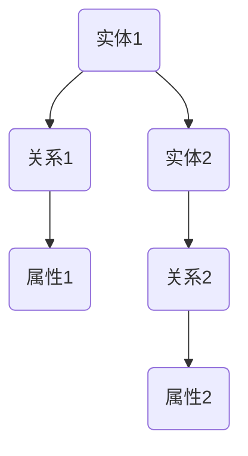
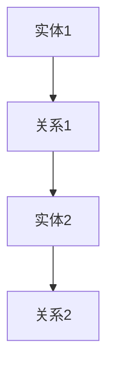
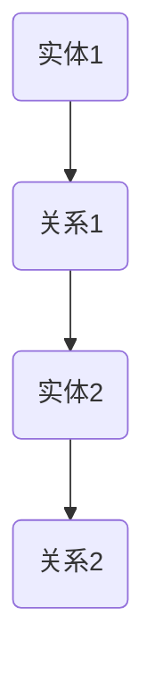

                 


### 文章标题：基于知识图谱的跨领域创新推理能力培养

> 关键词：知识图谱、跨领域创新、推理能力、人工智能

> 摘要：
本文首先介绍了知识图谱的基本概念及其在跨领域创新中的重要性，随后详细阐述了知识图谱的表示方法、构建过程以及应用场景。接着，本文探讨了跨领域创新推理能力的培养策略，包括跨学科知识融合、跨领域数据共享和跨领域专家合作等方面。最后，本文通过实践案例展示了知识图谱在跨领域创新中的应用效果，并对未来发展方向进行了展望。

----------------------------------------------------------------

### 第1章：引言与背景

#### 1.1 跨领域创新的重要性

跨领域创新已成为推动现代社会进步的重要驱动力。随着科技日新月异的发展，不同领域之间的交叉融合越来越普遍，传统的单一领域创新已经无法满足日益复杂的现实需求。跨领域创新不仅能够整合不同领域的知识和技术，还能够激发新的思维火花，从而产生巨大的社会和经济效益。

在人工智能时代，知识图谱作为一种重要的信息组织方式，为跨领域创新提供了强有力的技术支持。知识图谱能够将海量数据中的实体、关系和属性进行结构化表示，为跨领域创新提供了一种统一的语言和框架。

#### 1.2 知识图谱的基本概念

知识图谱（Knowledge Graph）是一种用于表示和存储知识的方法，它将现实世界中的各种实体及其相互关系以图形的形式进行组织。知识图谱的主要目的是通过结构化的数据来支持信息的检索、推理和自动化决策。

知识图谱的核心组成部分包括：

1. **实体（Entity）**：代表现实世界中的各种对象，如人、地点、事物等。
2. **关系（Relationship）**：描述实体之间的相互作用和联系，如“是”、“属于”、“位于”等。
3. **属性（Attribute）**：描述实体的特征或属性，如“年龄”、“身高”、“颜色”等。

知识图谱的表示方法包括实体-关系-属性（E-R）模型、语义网络表示和图数据库表示等。

#### 1.3 知识图谱与跨领域创新的联系

知识图谱为跨领域创新提供了以下几方面的支持：

1. **知识整合**：知识图谱能够将不同领域的知识进行结构化整合，为跨领域创新提供丰富的知识资源。
2. **知识推理**：知识图谱支持基于数据的推理，能够发现实体之间的关系，为跨领域创新提供新的洞察。
3. **知识共享**：知识图谱提供了一种统一的知识表示框架，有助于跨领域之间的知识共享和协同创新。

#### 1.4 本书的目的与结构安排

本书旨在系统地探讨基于知识图谱的跨领域创新推理能力培养。具体内容包括：

1. **知识图谱基础**：介绍知识图谱的基本概念、表示方法、构建过程等。
2. **知识图谱在跨领域创新中的应用**：分析知识图谱在跨领域推荐系统、问题解决和预测等方面的应用。
3. **跨领域创新推理能力培养**：探讨跨领域创新推理能力的定义、分类及培养策略。
4. **实践案例与经验分享**：通过实际案例展示知识图谱在跨领域创新中的应用效果。
5. **挑战与未来展望**：分析跨领域创新推理能力培养的挑战及其未来发展。

本书结构安排如下：

- 第1章：引言与背景
- 第2章：知识图谱基础
- 第3章：知识图谱在跨领域创新中的应用
- 第4章：跨领域创新推理能力培养
- 第5章：实践案例与经验分享
- 第6章：挑战与未来展望
- 第7章：总结与展望

通过以上内容，本书旨在为读者提供关于知识图谱与跨领域创新的全面了解，并探讨如何培养跨领域创新推理能力，以应对未来复杂多变的社会和技术环境。

----------------------------------------------------------------

## 第2章：知识图谱基础

### 2.1 知识图谱的定义与特点

知识图谱（Knowledge Graph）是一种用于表示和存储知识的方法，它将现实世界中的各种实体及其相互关系以图形的形式进行组织。知识图谱的目的是通过结构化的数据来支持信息的检索、推理和自动化决策。

#### 2.1.1 知识图谱的基本概念

知识图谱由三个核心组成部分构成：

1. **实体（Entity）**：代表现实世界中的各种对象，如人、地点、事物等。实体是知识图谱中的基本单元。
2. **关系（Relationship）**：描述实体之间的相互作用和联系。例如，“是”、“属于”、“位于”等。关系连接实体，构成了知识图谱中的主要路径。
3. **属性（Attribute）**：描述实体的特征或属性。例如，“年龄”、“身高”、“颜色”等。属性为实体提供了额外的信息。

#### 2.1.2 知识图谱的类型

知识图谱可以根据其应用领域和表示方式分为不同的类型：

1. **领域知识图谱**：专注于特定领域的知识表示，如医疗、金融、教育等。
2. **通用知识图谱**：涵盖广泛领域的知识表示，如DBpedia、YAGO等。
3. **混合知识图谱**：结合领域知识图谱和通用知识图谱，提供更全面的知识表示。

#### 2.1.3 知识图谱的组成

知识图谱的组成主要包括以下几个方面：

1. **实体库**：包含所有实体及其属性的信息。
2. **关系库**：描述实体之间关系的集合。
3. **属性库**：记录实体的各种属性值。
4. **索引**：提供快速查询和访问的机制。
5. **推理引擎**：支持基于知识的推理和自动化决策。

### 2.2 知识图谱表示方法

知识图谱的表示方法主要包括实体-关系-属性（E-R）模型、语义网络表示和图数据库表示等。

#### 2.2.1 实体-关系-属性（E-R）模型

实体-关系-属性（E-R）模型是知识图谱的一种常见表示方法。它通过实体、关系和属性的组合来表示知识。



在E-R模型中，实体和关系通过属性进行关联，从而形成一个结构化的知识表示。

#### 2.2.2 语义网络表示

语义网络表示是一种基于图结构的知识表示方法。它通过节点和边来表示实体和关系，同时使用标签和属性来描述实体和关系的特征。



语义网络表示强调实体和关系之间的语义联系，从而提供了一种语义层次的知识表示。

#### 2.2.3 图数据库表示

图数据库是一种专门用于存储和查询图结构的数据库系统。它通过图和属性来表示知识，提供高效的数据存储和查询能力。



图数据库表示将知识图谱作为图的存储结构，从而提供了一种高效的知识表示和查询方法。

### 2.3 知识图谱构建方法

知识图谱的构建是一个复杂的过程，通常包括数据源收集与预处理、实体识别与抽取、关系抽取与表示以及知识融合与优化等步骤。

#### 2.3.1 数据源收集与预处理

数据源收集与预处理是知识图谱构建的第一步。数据源可以是结构化数据（如数据库）、半结构化数据（如XML）和非结构化数据（如文本）。在收集数据后，需要对数据进行清洗、去重和格式化等预处理操作，以确保数据的质量和一致性。

#### 2.3.2 实体识别与抽取

实体识别与抽取是从原始数据中提取实体信息的过程。实体识别通常使用命名实体识别（Named Entity Recognition，NER）技术，从文本中识别出实体。实体抽取则进一步提取实体的属性和关系信息。

#### 2.3.3 关系抽取与表示

关系抽取与表示是知识图谱构建的关键步骤。关系抽取是从原始数据中提取实体之间的关系信息。关系表示则将关系以图形的形式进行组织，从而形成知识图谱。

#### 2.3.4 知识融合与优化

知识融合与优化是在知识图谱构建过程中，将不同来源的知识进行整合和优化的过程。知识融合旨在消除知识中的冗余和不一致，提高知识图谱的质量。知识优化则通过算法和模型对知识图谱进行优化，以提升其查询效率和推理能力。

#### 2.3.5 知识图谱评估

知识图谱评估是衡量知识图谱质量的重要环节。常见的评估指标包括知识覆盖度、知识准确度和知识一致性等。通过评估，可以发现知识图谱中的问题，并进行相应的优化。

### 2.4 知识图谱在跨领域创新中的应用

知识图谱在跨领域创新中具有广泛的应用。以下是一些典型的应用场景：

1. **跨领域推荐系统**：知识图谱可以用于构建跨领域的推荐系统，通过整合不同领域的知识，为用户提供个性化的推荐。
2. **跨领域问题解决**：知识图谱可以帮助解决跨领域的问题，通过知识图谱中的关系和属性，发现解决方案。
3. **跨领域创新预测**：知识图谱可以用于预测跨领域的创新趋势，通过分析知识图谱中的实体、关系和属性，发现潜在的创新机会。

通过以上内容，我们了解了知识图谱的定义、特点、表示方法和构建过程。在下一章中，我们将进一步探讨知识图谱在跨领域创新中的应用。

----------------------------------------------------------------

## 第3章：知识图谱在跨领域创新中的应用

### 3.1 跨领域知识图谱构建

#### 3.1.1 跨领域知识图谱的挑战

构建跨领域知识图谱面临着一系列挑战。首先，不同领域之间存在巨大的知识差异，包括术语、概念和结构等。这要求知识图谱构建过程中进行跨领域的知识整合和映射。其次，数据源的质量和一致性也是一个重要问题，不同领域的数据可能存在噪声、缺失和不一致的情况。此外，跨领域的知识图谱需要处理大量的异构数据，包括结构化和非结构化数据。

为了应对这些挑战，需要采取一系列策略：

1. **领域适配**：根据不同领域的特点和需求，对知识图谱进行定制化的调整，使其能够更好地适应特定领域的应用。
2. **数据清洗**：对原始数据进行清洗和预处理，包括去除噪声、填补缺失值和统一数据格式等。
3. **知识融合**：采用异构数据融合技术，将不同领域的知识进行整合，形成一个统一的知识表示框架。
4. **模型选择**：根据跨领域的知识特点，选择合适的模型和算法，以提高知识图谱的构建效率和准确性。

#### 3.1.2 跨领域知识图谱的构建策略

跨领域知识图谱的构建可以分为以下几个步骤：

1. **数据收集**：从多个领域的数据源中收集信息，包括结构化数据、非结构化数据和半结构化数据。
2. **数据预处理**：对收集到的数据进行清洗、去重和格式化等预处理操作，以提高数据的质量和一致性。
3. **实体识别与抽取**：利用命名实体识别（NER）技术，从文本数据中识别出实体，并抽取实体的属性和关系。
4. **关系抽取与表示**：根据实体之间的语义关系，构建实体之间的关系网络，并使用图结构进行表示。
5. **知识融合与优化**：将不同领域的知识进行整合和优化，消除冗余和不一致，提高知识图谱的整体质量。

### 3.2 跨领域知识图谱的应用场景

跨领域知识图谱在多个应用场景中发挥着重要作用，以下是一些典型的应用场景：

#### 3.2.1 跨领域推荐系统

跨领域推荐系统是跨领域知识图谱的一个重要应用。通过跨领域知识图谱，可以整合不同领域的用户行为数据和内容信息，为用户提供个性化的推荐。例如，一个电子商务平台可以通过跨领域知识图谱，将商品、用户和品牌等实体进行关联，并根据用户的购买历史和偏好，推荐相关的商品和品牌。

跨领域推荐系统的一般工作流程如下：

1. **用户与内容实体识别**：利用命名实体识别技术，从用户的评价、评论和浏览记录等数据中识别出用户和内容实体。
2. **跨领域实体关联**：根据实体之间的语义关系，将用户与内容实体进行关联，形成一个跨领域的实体网络。
3. **推荐策略**：根据用户的兴趣和行为，从跨领域的实体网络中提取相关的推荐候选，并根据推荐算法进行排序和筛选。

#### 3.2.2 跨领域问题解决

跨领域知识图谱可以帮助解决跨领域的问题，通过知识图谱中的关系和属性，发现解决方案。例如，在医疗领域，可以通过跨领域知识图谱，将患者、疾病、药物和治疗手段等实体进行关联，为医生提供诊断和治疗建议。

跨领域问题解决的一般工作流程如下：

1. **问题建模**：根据问题的特点和需求，建立跨领域知识图谱，并确定问题的主要实体和关系。
2. **知识查询与推理**：利用知识图谱中的关系和属性，进行知识查询和推理，发现潜在的解决方案。
3. **方案评估与优化**：对提出的解决方案进行评估和优化，选择最优的解决方案。

#### 3.2.3 跨领域创新预测

跨领域知识图谱可以用于预测跨领域的创新趋势，通过分析知识图谱中的实体、关系和属性，发现潜在的创新机会。例如，在科技领域，可以通过跨领域知识图谱，预测未来的科技发展趋势和关键领域。

跨领域创新预测的一般工作流程如下：

1. **知识图谱构建**：根据科技领域的相关数据，构建跨领域知识图谱，包括实体、关系和属性。
2. **趋势分析**：利用知识图谱中的关系和属性，进行趋势分析和预测，发现潜在的科技发展趋势。
3. **创新机会识别**：根据趋势分析结果，识别出潜在的创新机会，并提供相关的创新建议。

### 3.3 成功案例分析

#### 3.3.1 案例一：基于知识图谱的医疗诊断

医疗诊断是跨领域知识图谱的一个成功应用。通过跨领域知识图谱，可以将医学知识、患者信息和诊断方法等进行整合，为医生提供辅助诊断。

具体案例描述如下：

- **场景**：一位医生需要为患者进行诊断，患者患有某种疾病。
- **步骤**：
  1. **数据收集**：从电子病历、文献和数据库中收集患者的医疗信息，包括症状、检查结果和病史等。
  2. **数据预处理**：对收集到的医疗信息进行清洗、去重和格式化等预处理操作。
  3. **知识图谱构建**：利用实体识别和关系抽取技术，构建跨领域知识图谱，包括疾病、症状、检查项目和诊断方法等。
  4. **知识查询与推理**：利用知识图谱，查询与患者症状相关的疾病和诊断方法，进行推理和筛选。
  5. **诊断建议**：根据查询结果，为医生提供诊断建议，辅助医生进行诊断。

通过这个案例，可以看出跨领域知识图谱在医疗诊断中的应用价值。它不仅提高了诊断的准确性和效率，还减少了医生的劳动强度。

#### 3.3.2 案例二：基于知识图谱的金融风控

金融风控是另一个跨领域知识图谱的成功应用。通过跨领域知识图谱，可以将金融机构、客户、交易信息等进行整合，为金融企业提供风控支持。

具体案例描述如下：

- **场景**：一家金融机构需要对客户进行信用评估，以确定是否批准贷款。
- **步骤**：
  1. **数据收集**：从金融机构的内部数据和第三方数据源收集客户的个人信息、信用记录、交易行为等。
  2. **数据预处理**：对收集到的客户信息进行清洗、去重和格式化等预处理操作。
  3. **知识图谱构建**：利用实体识别和关系抽取技术，构建跨领域知识图谱，包括金融机构、客户、交易信息等。
  4. **知识查询与推理**：利用知识图谱，查询与客户相关的信用记录和交易行为，进行推理和评估。
  5. **信用评估**：根据查询结果，为金融机构提供信用评估报告，辅助决策是否批准贷款。

通过这个案例，可以看出跨领域知识图谱在金融风控中的应用价值。它帮助金融机构更好地了解客户的风险状况，提高了信用评估的准确性和效率。

### 3.4 总结与展望

跨领域知识图谱在跨领域创新中具有广泛的应用前景。通过构建跨领域知识图谱，可以整合不同领域的知识，提供更加智能和个性化的服务。然而，跨领域知识图谱的构建和应用仍然面临着诸多挑战，如数据质量、知识融合和推理效率等。未来的研究将聚焦于这些挑战，并探索更加高效和智能的跨领域知识图谱构建和应用方法。

----------------------------------------------------------------

## 第4章：跨领域创新推理能力培养

### 4.1 推理能力的定义与分类

推理能力（Reasoning Ability）是指个体在已知信息的基础上，通过逻辑思维、分析判断和问题解决等方式，推导出新的结论或预测的能力。在跨领域创新中，推理能力尤为重要，因为它能够帮助个体在复杂多变的环境中快速做出合理的决策。

推理能力可以根据其性质和方式分为以下几类：

#### 4.1.1 逻辑推理

逻辑推理（Logical Reasoning）是基于逻辑规则和逻辑形式进行推理的方法。逻辑推理主要包括演绎推理和归纳推理。

1. **演绎推理**（Deductive Reasoning）：从一般性原则出发，推导出具体的结论。例如，所有人类都会死亡（大前提），苏格拉底是人类（小前提），因此，苏格拉底会死亡（结论）。

2. **归纳推理**（Inductive Reasoning）：从具体的实例出发，推导出一般性的规律或结论。例如，观察到每天太阳都会升起，因此推断太阳明天也会升起。

#### 4.1.2 类比推理

类比推理（Analogical Reasoning）是通过比较两个或多个相似的情况，推断出新的结论。类比推理基于相似性原则，认为如果两个情况在某些方面相似，那么在其他方面也可能相似。

例如，如果知道苹果会在树上生长，并且观察到橘子树上有类似的结构，那么可以推断橘子也可能在树上生长。

#### 4.1.3 情境推理

情境推理（Situational Reasoning）是指在特定情境下，根据情境信息和常识进行推理的方法。情境推理强调情境的多样性和复杂性，需要综合考虑多种因素。

例如，在驾驶汽车时，司机需要根据交通信号、路况和其他车辆的行为进行实时推理和决策。

#### 4.1.4 模型推理

模型推理（Model-based Reasoning）是指基于模型和假设进行推理的方法。模型推理通常涉及建立数学模型或计算机模拟，然后通过模型分析和预测。

例如，在经济学中，经济学家会建立经济模型，通过模型分析和预测经济增长、通货膨胀等经济指标。

### 4.2 知识图谱驱动的推理方法

知识图谱作为一种结构化的知识表示方法，为推理提供了强大的支持。知识图谱驱动的推理方法主要包括基于规则的方法、基于图算法的方法和基于机器学习方法的方法。

#### 4.2.1 基于规则的方法

基于规则的方法（Rule-based Reasoning）是利用预定义的规则进行推理。规则通常以“如果-那么”的形式表示，例如，“如果今天是星期五，那么明天是星期六”。

伪代码示例：
```python
def rule_based_reasoning(fact1, fact2):
    if fact1 == "今天是星期五":
        conclusion = "明天是星期六"
    elif fact1 == "所有猫都会叫":
        conclusion = "如果这个是猫，那么它会叫"
    return conclusion
```

#### 4.2.2 基于图算法的方法

基于图算法的方法（Graph-based Reasoning）利用图结构和算法进行推理。常见的图算法包括路径搜索算法、最短路径算法和社区检测算法等。

伪代码示例（最短路径算法）：
```python
def shortest_path(graph, start, end):
    # 使用Dijkstra算法找到从start到end的最短路径
    distances = {node: float('infinity') for node in graph}
    distances[start] = 0
    unvisited = set(graph)

    while unvisited:
        current = min(unvisited, key=lambda node: distances[node])
        if current == end:
            break
        unvisited.remove(current)
        for neighbor, weight in graph[current].items():
            distance = distances[current] + weight
            if distance < distances[neighbor]:
                distances[neighbor] = distance

    path = []
    current = end
    while current != start:
        path.insert(0, current)
        current = prev[current]
    path.insert(0, start)
    return path
```

#### 4.2.3 基于机器学习方法的方法

基于机器学习方法的方法（Machine Learning-based Reasoning）利用机器学习模型进行推理。常见的机器学习模型包括神经网络、决策树和支持向量机等。

伪代码示例（神经网络推理）：
```python
import tensorflow as tf

# 定义神经网络模型
model = tf.keras.Sequential([
    tf.keras.layers.Dense(units=128, activation='relu', input_shape=(input_shape,)),
    tf.keras.layers.Dense(units=64, activation='relu'),
    tf.keras.layers.Dense(units=1)
])

# 编译模型
model.compile(optimizer='adam', loss='mean_squared_error')

# 训练模型
model.fit(x_train, y_train, epochs=10)

# 推理
def neural_network_reasoning(model, input_data):
    prediction = model.predict(input_data)
    return prediction
```

### 4.3 跨领域创新推理能力培养策略

跨领域创新推理能力的培养需要从多个方面入手，包括跨学科知识融合、跨领域数据共享和跨领域专家合作等。

#### 4.3.1 跨学科知识融合

跨学科知识融合是培养跨领域创新推理能力的重要策略。通过跨学科知识融合，可以整合不同领域的知识，形成新的思维模式和解决问题的方法。

具体策略包括：

1. **交叉学科课程**：开设交叉学科课程，让学生系统地学习不同领域的知识。
2. **跨学科研究项目**：鼓励学生和研究人员参与跨学科的研究项目，以实践跨学科知识融合。
3. **学术交流**：举办跨学科研讨会和学术交流会议，促进不同学科之间的交流与合作。

#### 4.3.2 跨领域数据共享

跨领域数据共享是培养跨领域创新推理能力的重要保障。通过跨领域数据共享，可以整合不同领域的数据资源，为跨领域创新提供丰富的数据支持。

具体策略包括：

1. **数据平台建设**：建立跨领域的数据平台，实现数据的集中管理和共享。
2. **数据标准化**：制定跨领域数据标准，确保数据的一致性和可互操作性。
3. **数据安全与隐私保护**：确保跨领域数据的安全和隐私，制定相应的数据保护政策。

#### 4.3.3 跨领域专家合作

跨领域专家合作是培养跨领域创新推理能力的重要途径。通过跨领域专家合作，可以充分发挥不同领域专家的专长，共同应对复杂的跨领域问题。

具体策略包括：

1. **跨领域团队建设**：组建跨领域的创新团队，促进不同领域专家的合作。
2. **专家协作机制**：建立专家协作机制，确保跨领域专家之间的有效沟通和协作。
3. **知识共享与交流**：定期举办跨领域专家研讨会和交流活动，促进知识的共享和交流。

通过以上策略，可以有效培养跨领域创新推理能力，为跨领域创新提供有力支持。

----------------------------------------------------------------

## 第5章：实践案例与经验分享

### 5.1 跨领域创新实践案例

跨领域创新在多个领域取得了显著成果，以下列举了几个具有代表性的实践案例。

#### 5.1.1 案例一：智能家居创新

智能家居（Smart Home）是将物联网（IoT）、人工智能和自动化技术应用于家居环境中，以提高居住舒适度和能源效率。智能家居创新涉及到多个领域，如家电、建筑、通信和能源等。

具体步骤如下：

1. **需求分析**：通过用户调研和数据分析，确定智能家居的需求和功能。
2. **系统集成**：将各种智能设备（如智能门锁、智能灯光、智能空调等）进行系统集成，实现设备间的互联互通。
3. **数据分析与优化**：利用大数据分析和机器学习算法，对用户行为进行建模，实现智能场景化和个性化推荐。
4. **用户体验测试**：通过用户体验测试，不断优化智能家居系统，提高用户满意度。

#### 5.1.2 案例二：农业智能化

农业智能化（Smart Agriculture）是通过物联网、人工智能和大数据等技术，提高农业生产效率和农产品质量。农业智能化涉及农业、信息技术、生物技术和环境科学等多个领域。

具体步骤如下：

1. **数据采集与处理**：利用传感器和物联网技术，采集土壤、气候、植物生长等数据，并通过大数据分析技术进行处理。
2. **智能决策支持**：基于数据分析和模型预测，为农民提供智能化的种植、灌溉、施肥和病虫害防治建议。
3. **远程监控与管理系统**：利用物联网技术和云计算平台，实现对农田的远程监控和智能管理。
4. **用户体验与反馈**：通过用户反馈和数据分析，持续优化智能农业系统，提高用户体验。

#### 5.1.3 案例三：教育领域创新

教育领域创新（Education Innovation）是将信息技术和人工智能应用于教育过程中，以提高教育质量和教学效果。教育领域创新涉及教育理论、教学方法、教育技术和教育管理等多个领域。

具体步骤如下：

1. **教学资源整合**：通过教育资源共享平台，整合各种教学资源，包括课程、教材、教学视频和实验项目等。
2. **个性化学习推荐**：利用大数据分析和机器学习算法，根据学生的学习兴趣、水平和需求，推荐个性化的学习资源和学习路径。
3. **智能教学系统**：开发智能教学系统，实现自动化、智能化的教学过程，包括智能授课、智能评测和智能辅导等。
4. **教学效果评估与反馈**：通过教学效果评估和用户反馈，持续优化智能教育系统，提高教学质量。

### 5.2 成功经验分享

在跨领域创新过程中，许多组织和个人取得了成功，以下是几个具有代表性的成功经验分享。

#### 5.2.1 人才培养模式

跨领域创新需要具备多学科知识和跨领域技能的人才。因此，人才培养模式需要从以下几个方面进行优化：

1. **跨学科教育**：加强跨学科教育，培养学生具备多学科知识。
2. **实践项目**：通过实践项目，让学生在真实场景中应用所学知识，锻炼跨领域技能。
3. **国际化视野**：鼓励学生参加国际交流项目，拓宽国际视野，增强跨文化沟通能力。

#### 5.2.2 创新团队建设

跨领域创新团队的成功离不开有效的团队建设和协作。以下是一些建议：

1. **团队结构**：建立多元化的团队结构，包括不同领域、不同背景的成员。
2. **沟通机制**：建立有效的沟通机制，确保团队成员之间的信息共享和协作。
3. **激励机制**：制定激励机制，鼓励团队成员积极参与跨领域创新项目。

#### 5.2.3 跨领域合作机制

跨领域合作是跨领域创新的重要途径。以下是一些建议：

1. **合作平台**：建立跨领域合作平台，促进不同领域之间的合作与交流。
2. **资源共享**：实现跨领域资源的共享，包括技术、数据和人才等。
3. **合作模式**：探索多样化的合作模式，如联合研发、技术合作和战略联盟等。

通过以上实践案例和成功经验分享，我们可以看到跨领域创新在各个领域的广泛应用和巨大潜力。未来的跨领域创新将继续推动社会进步和经济发展，为实现可持续发展和智慧社会的目标做出重要贡献。

----------------------------------------------------------------

## 第6章：挑战与未来展望

### 6.1 跨领域创新推理能力培养的挑战

跨领域创新推理能力培养面临诸多挑战，这些挑战不仅影响知识的整合与共享，还制约了跨领域创新的发展。以下是几个主要挑战及其解决方案：

#### 6.1.1 数据质量与一致性

数据质量与一致性是跨领域创新推理能力培养的核心挑战之一。不同领域的数据格式、度量单位和数据源之间存在显著差异，导致数据质量参差不齐。例如，医疗数据与金融数据在数据类型和结构上存在显著差异，这使得数据整合变得复杂。

**解决方案**：
- **标准化数据格式**：制定跨领域数据标准，确保数据格式的一致性。
- **数据清洗与预处理**：采用数据清洗和预处理技术，消除噪声、填补缺失值、统一数据单位，提高数据质量。
- **数据质量管理框架**：建立数据质量管理框架，监控数据质量，确保数据在跨领域应用中的可靠性。

#### 6.1.2 跨领域知识表示

跨领域知识表示是另一个挑战。不同领域拥有独特的概念和术语，使得知识表示需要高度定制化。例如，在医学领域中，“病情”与“诊断”的概念与金融领域的“风险”与“投资”有很大不同，这要求知识图谱需要能够灵活地表示和整合这些概念。

**解决方案**：
- **本体工程**：通过本体工程构建跨领域本体，为不同领域的概念提供统一的表示。
- **映射与融合**：采用映射与融合技术，将不同领域的知识表示进行整合，形成一个统一的语义空间。
- **知识共享平台**：建立知识共享平台，促进跨领域知识的交换与整合。

#### 6.1.3 跨领域协作机制

跨领域协作机制是实现跨领域创新的重要保障。不同领域专家之间的沟通和协作往往存在障碍，包括文化差异、知识共享障碍和利益冲突等。

**解决方案**：
- **跨领域专家网络**：建立跨领域专家网络，促进专家之间的交流和合作。
- **共享工作平台**：提供共享的工作平台，支持跨领域项目团队的合作。
- **激励机制**：建立激励机制，鼓励跨领域专家的合作和知识共享。

### 6.2 未来展望

尽管存在挑战，跨领域创新推理能力的培养具有广阔的发展前景。随着技术的不断进步，未来将在以下几个方面实现突破：

#### 6.2.1 知识图谱技术的发展趋势

知识图谱技术将在未来继续发展，推动跨领域创新推理能力的提升。以下是几个主要趋势：

- **知识图谱的自动构建**：利用机器学习和自然语言处理技术，实现知识图谱的自动构建，降低知识图谱构建的难度和成本。
- **多模态知识图谱**：结合文本、图像、语音等多种数据类型，构建多模态知识图谱，提高知识的表示和推理能力。
- **知识图谱的可解释性**：增强知识图谱的可解释性，使得知识图谱的应用更加透明和可靠。

#### 6.2.2 跨领域创新推理能力的提升

随着知识图谱技术的进步，跨领域创新推理能力将得到显著提升。以下是几个主要方向：

- **推理算法优化**：采用更先进的推理算法，如深度学习、图神经网络等，提高跨领域推理的效率和准确性。
- **跨领域知识融合**：通过跨领域知识融合，实现更全面和准确的知识表示，为跨领域创新提供有力支持。
- **智能推理系统**：开发智能推理系统，实现自动化和智能化的跨领域推理，降低跨领域推理的人力成本。

#### 6.2.3 跨领域创新在教育领域的应用前景

跨领域创新在教育领域的应用前景广阔。以下是几个主要应用方向：

- **个性化学习**：利用知识图谱和推理技术，为学习者提供个性化的学习资源和学习路径，提高学习效果。
- **课程设计**：通过跨领域知识融合，设计更全面和富有创新性的课程，培养学生的跨领域思维和创新能力。
- **教育评价**：采用跨领域评价方法，对学生的学习成果进行全方位评价，促进学生的全面发展。

综上所述，跨领域创新推理能力培养面临着诸多挑战，但同时也具有巨大的发展潜力。随着技术的不断进步和应用场景的不断扩展，跨领域创新推理能力将得到进一步提升，为人类社会的发展带来新的机遇和挑战。

----------------------------------------------------------------

## 第7章：总结与展望

### 7.1 本书内容总结

本书系统地介绍了基于知识图谱的跨领域创新推理能力培养。主要内容包括：

1. **知识图谱基础**：详细阐述了知识图谱的基本概念、表示方法、构建过程以及应用场景。
2. **知识图谱在跨领域创新中的应用**：分析了知识图谱在跨领域推荐系统、问题解决和预测等方面的应用。
3. **跨领域创新推理能力培养**：探讨了跨领域创新推理能力的定义、分类及培养策略。
4. **实践案例与经验分享**：通过实际案例展示了知识图谱在跨领域创新中的应用效果。
5. **挑战与未来展望**：分析了跨领域创新推理能力培养的挑战及其未来发展。

### 7.2 跨领域创新推理能力培养的意义

跨领域创新推理能力培养具有重要的现实意义和深远的影响：

1. **推动科技创新**：跨领域创新推理能力培养能够激发新的科技突破，推动科技进步和产业升级。
2. **提升企业竞争力**：跨领域创新推理能力培养有助于企业整合资源，提高创新效率和竞争力。
3. **促进社会进步**：跨领域创新推理能力培养能够解决复杂的社会问题，提高社会整体福祉。

### 7.3 本书对相关领域的影响与贡献

本书对相关领域具有以下影响与贡献：

1. **知识图谱研究**：系统总结了知识图谱的基本概念和方法，为知识图谱研究提供了参考。
2. **跨领域创新**：提出了跨领域创新推理能力培养的策略和方法，为跨领域创新提供了理论指导。
3. **教育与实践**：提供了丰富的实践案例和经验分享，为教育和实际应用提供了参考。

### 7.4 展望未来

未来的研究将继续探索知识图谱与跨领域创新的深度融合，重点关注以下几个方面：

1. **知识图谱的智能化**：通过深度学习、图神经网络等技术，实现知识图谱的智能化和自适应化。
2. **跨领域融合方法**：探索更有效的跨领域知识融合方法，提高知识图谱的表示和推理能力。
3. **跨领域应用场景**：拓展知识图谱在更多领域中的应用，如医疗、金融、教育等，推动跨领域创新的全面发展。

通过不断的研究和实践，跨领域创新推理能力培养将发挥更大的作用，为人类社会的发展做出更大的贡献。

----------------------------------------------------------------

## 附录：知识图谱与跨领域创新相关资源

### A.1 知识图谱资源

#### A.1.1 开源知识图谱库

1. **DBpedia**：一个基于维基百科的语义知识图谱，包含了大量的实体、关系和属性信息。
2. **YAGO**：一个基于维基百科和语义网的开放知识图谱，涵盖了广泛的主题和领域。
3. **Wikidata**：一个基于维基百科的事实数据库，提供了大量的实体、属性和关系信息。

#### A.1.2 知识图谱工具与平台

1. **Neo4j**：一个高性能的图数据库，广泛用于知识图谱的构建和应用。
2. **AllegroGraph**：一个高级的图数据库和知识图谱平台，提供了丰富的数据管理和推理功能。
3. **OpenKE**：一个开源的知识嵌入工具包，支持知识图谱的构建和推理。

### A.2 跨领域创新相关资源

#### A.2.1 跨领域研究论文

1. **"Knowledge Graph for Cross-Domain Applications"**：一篇综述性论文，详细介绍了知识图谱在跨领域应用中的研究进展。
2. **"Cross-Domain Knowledge Integration for Intelligent Systems"**：一篇研究论文，探讨了跨领域知识整合的方法和技术。
3. **"Multi-Domain Learning for Cross-Domain Recommendation"**：一篇研究论文，提出了多领域学习算法，用于跨领域推荐系统。

#### A.2.2 跨领域创新书籍

1. **《跨领域创新：突破传统思维的限制》**：一本介绍跨领域创新理论和实践的书籍，适合对跨领域创新感兴趣的读者。
2. **《跨学科思维：如何实现跨界创新》**：一本介绍跨学科思维方法和跨领域创新策略的书籍，有助于培养跨领域创新能力。
3. **《知识图谱：构建智能世界的基石》**：一本介绍知识图谱基本概念、构建方法和应用的书籍，为知识图谱的研究和应用提供了指导。

#### A.2.3 跨领域创新竞赛

1. **Kaggle Cross-Domain Data Science Competition**：一个面向跨领域数据科学竞赛的平台，提供了丰富的跨领域数据集和挑战。
2. **Netflix Prize**：一个关于推荐系统的跨领域竞赛，吸引了全球顶尖的数据科学家参与。
3. **NASA Tournament Lab**：一个面向太空探索和科技创新的跨领域竞赛平台，提供了多个跨领域项目挑战。

以上资源为读者提供了丰富的知识图谱与跨领域创新的学习和研究材料，有助于深入了解相关领域的最新进展和应用实践。读者可以根据自身兴趣和需求，选择合适的资源进行学习和研究。

