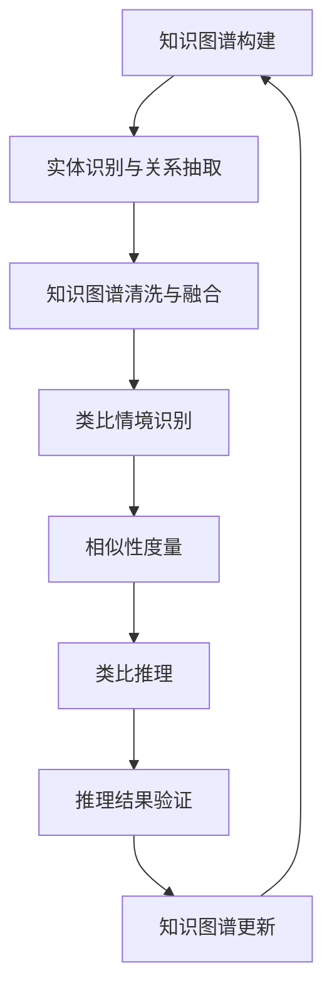
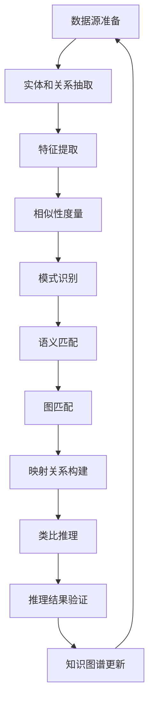

                 

### 文章标题

《基于知识图谱的跨领域类比推理能力增强》

---

关键词：知识图谱、类比推理、跨领域、算法原理、数学模型、项目实战

---

摘要：本文深入探讨基于知识图谱的跨领域类比推理技术，从核心概念、算法原理、数学模型到项目实战，系统地阐述了如何增强跨领域类比推理能力。通过具体案例，本文展示了该技术的实际应用和潜力，旨在为研究者提供全面的技术指南。

---

### 引言与背景

知识图谱（Knowledge Graph）是近年来人工智能领域的一个热门话题，它通过将实体、概念和关系以图形结构进行组织，实现了知识的结构化和可计算化。知识图谱的构建和利用在信息检索、自然语言处理、推荐系统等领域发挥了重要作用。与此同时，类比推理（Analogical Reasoning）作为一种基于已有知识进行推断的思维过程，也是人工智能领域的一个重要研究方向。类比推理能够帮助机器理解和应用新情境，提高智能系统的适应能力。

跨领域类比推理是指在不同领域之间进行类比推理的过程，它克服了单一领域知识的局限性，使得智能系统能够在不同领域之间迁移知识，提高推理的泛化能力。随着知识图谱技术的不断发展，基于知识图谱的跨领域类比推理技术逐渐成为研究热点，并在实际应用中展现出巨大的潜力。

本文旨在深入探讨基于知识图谱的跨领域类比推理技术，从核心概念、算法原理、数学模型到项目实战，系统地阐述如何增强跨领域类比推理能力。本文首先介绍知识图谱和类比推理的基本概念及其在跨领域推理中的应用，接着详细讲解跨领域类比推理的算法原理和数学模型，并通过具体案例展示其实际应用。最后，本文对未来的发展趋势和研究方向进行了展望。

### 知识图谱的概念

知识图谱是一种语义网络，用于表示现实世界中实体及其相互关系。它可以看作是一种结构化的知识表示形式，通过将实体、概念和关系编码为节点、边和属性，实现了知识的结构化和可视化。知识图谱的核心思想是将信息以图的形式组织起来，使得计算机可以理解和处理这些信息，从而实现知识的自动化推理和应用。

知识图谱通常包含以下三个基本元素：

1. **实体（Entity）**：实体是知识图谱中的基本单位，可以是人、地点、事物等。实体通常具有一组属性，用于描述其特征。例如，在社交媒体知识图谱中，用户、地点和事件都是实体。

2. **关系（Relationship）**：关系是连接两个或多个实体的语义关联。关系通常表示为一条边，连接两个或多个节点。关系可以是有向的或无向的，可以是简单的二元关系，也可以是复杂的多元关系。例如，在社交媒体知识图谱中，用户A关注用户B可以表示为一个有向关系。

3. **属性（Property）**：属性是实体的特征或属性的描述，通常用于丰富实体的信息。属性可以是一个简单的值，也可以是一个复杂的结构。例如，在社交媒体知识图谱中，用户A的年龄可以是一个属性的值。

知识图谱通过这些基本元素将现实世界中的信息组织成一个统一的语义空间，使得计算机可以在这个空间中进行推理和查询。知识图谱的应用非常广泛，包括但不限于以下几个方面：

1. **信息检索**：知识图谱可以提高信息检索系统的性能，通过语义匹配和推理，实现更精确的查询结果。例如，搜索引擎可以使用知识图谱来理解用户的查询意图，并提供更相关的搜索结果。

2. **自然语言处理**：知识图谱在自然语言处理（NLP）领域有广泛应用，包括词嵌入、实体识别、关系抽取等。知识图谱可以提供丰富的背景知识，帮助NLP系统更好地理解和处理自然语言。

3. **推荐系统**：知识图谱可以用于构建推荐系统，通过分析用户和物品之间的隐含关系，实现更精准的推荐。例如，电子商务平台可以使用知识图谱来推荐用户可能感兴趣的物品。

4. **智能问答**：知识图谱是实现智能问答系统的基础，通过图谱中的实体和关系，系统可以理解用户的问题，并给出准确的回答。

5. **智能代理**：知识图谱可以帮助智能代理（例如自动驾驶汽车、智能家居等）更好地理解和交互复杂环境，提高智能代理的决策能力。

知识图谱的重要性在于它将无结构的数据转化为有结构的知识，使得计算机可以更好地理解和应用这些知识。随着数据量和复杂度的增加，知识图谱在各个领域的应用潜力也越来越大。通过知识图谱，我们可以构建一个统一的语义空间，实现跨领域的知识整合和推理，从而推动人工智能技术的发展和应用。

### 类比推理的概念

类比推理（Analogical Reasoning）是人工智能领域中的一个重要研究方向，它是一种基于已有知识进行推断的思维过程。类比推理的基本思想是通过比较两个或多个类似情境，推断出新的结论。类比推理在人类认知中起着重要作用，它帮助我们从已知事物推断未知事物的性质，是知识迁移和推理的重要机制。

类比推理可以分为以下几种类型：

1. **直接类比**：直接类比是基于两个或多个相似情境的直接比较，通过发现情境之间的共性，推断出新的结论。例如，如果A在情境X中具有某种特征，而B在情境Y中与情境X相似，那么可以推断B在情境Y中也具有类似的特征。

2. **类比扩展**：类比扩展是基于已有类比结果进行推理，将类比结果应用于新的情境。例如，如果知道A在情境X中具有某种特征，并且A和B在情境Y中具有相似性，那么可以推断B在情境Y中也具有类似的特征。

3. **逆向类比**：逆向类比是基于已知结论进行反向推理，寻找与之相似的情境。例如，如果知道A在情境X中具有某种特征，并且A和B在情境Y中具有相似性，那么可以推断在情境Y中，具有与A相似的特征的情境可能具有与X相似的结论。

类比推理在人工智能中的应用非常广泛，主要包括以下几个方面：

1. **知识推理**：类比推理是知识推理的一个重要工具，通过将已知知识应用于新的情境，帮助智能系统进行推理和决策。例如，在医疗诊断中，医生可以通过类比其他患者的症状和诊断结果，推断出新患者的病情。

2. **问题求解**：类比推理可以帮助智能系统在解决新问题时利用已有经验。例如，在路径规划中，如果已知一种算法可以有效解决某类问题，那么可以尝试将其应用于类似的问题。

3. **机器学习**：类比推理在机器学习中也有广泛应用，通过将已有模型的结构和参数应用于新的数据集，可以提高模型的泛化能力和适应性。

4. **自然语言处理**：在自然语言处理中，类比推理可以帮助系统理解语义和语法结构，实现文本生成和语义分析。例如，通过类比其他文本的语法结构，生成新的句子。

5. **计算机视觉**：在计算机视觉中，类比推理可以帮助系统识别图像中的对象和场景，通过将已知对象的特征应用于新的图像，提高识别的准确性。

类比推理在跨领域中的应用具有重要意义。跨领域类比推理是指在不同领域之间进行类比推理的过程，它克服了单一领域知识的局限性，使得智能系统能够在不同领域之间迁移知识，提高推理的泛化能力。例如，在医疗领域，可以通过类比其他领域的知识来诊断和治疗疾病；在金融领域，可以通过类比其他行业的商业模式来发现新的投资机会。

总之，类比推理作为一种基于已有知识进行推断的思维过程，在人工智能和跨领域应用中具有重要作用。通过深入研究类比推理的原理和算法，我们可以开发出更智能、更灵活的人工智能系统，推动人工智能技术的发展和应用。

### 知识图谱与类比推理的联系

知识图谱和类比推理在跨领域推理中有着紧密的联系，二者共同构成了现代人工智能技术中重要的一环。知识图谱通过结构化的方式组织知识，而类比推理则利用这些结构化的知识进行推理和推断。下面将从几个方面探讨知识图谱与类比推理之间的联系。

首先，知识图谱为类比推理提供了基础数据支持。知识图谱通过将实体、关系和属性组织成统一的语义空间，使得计算机能够理解和处理这些知识。类比推理需要基于这些结构化的知识进行推理，从而推断出新的结论。例如，在一个包含人物、地点和事件的知识图谱中，类比推理可以通过比较两个相似情境中的实体和关系，推断出新的结论。这种基于知识图谱的类比推理方式，不仅提高了推理的准确性，还增强了推理的泛化能力。

其次，类比推理能够增强知识图谱的推理能力。知识图谱中的信息是静态的，而类比推理可以将静态知识转化为动态推理。通过类比推理，智能系统能够利用已有知识推理出新的结论，从而实现知识的动态扩展。例如，在一个基于知识图谱的问答系统中，类比推理可以帮助系统理解用户的查询意图，并利用已有知识提供更准确的回答。这种动态推理能力，使得知识图谱在应对复杂问题时更加灵活和高效。

再者，知识图谱与类比推理的结合，可以应用于多种跨领域场景。跨领域类比推理是指在不同领域之间进行类比推理的过程，它能够克服单一领域知识的局限性，提高智能系统的适应能力。知识图谱为跨领域类比推理提供了丰富的知识资源，而类比推理则能够将这些知识在不同领域之间进行迁移和扩展。例如，在医疗和金融领域，可以通过知识图谱和类比推理结合，实现跨领域的知识共享和推理。

此外，知识图谱和类比推理在提升智能系统智能化水平方面具有显著作用。知识图谱通过结构化知识的方式，使得计算机能够更好地理解和应用这些知识，从而提高系统的智能水平。类比推理则利用已有知识进行推断和推理，使得系统能够在面对新情境时，快速做出准确的判断和决策。这种结合，不仅增强了智能系统的推理能力，还提高了系统的自主学习和自适应能力。

总之，知识图谱和类比推理在跨领域推理中相互依存、相互促进。知识图谱为类比推理提供了基础数据支持，而类比推理则能够增强知识图谱的推理能力，二者共同构成了现代人工智能技术中重要的一环。通过深入研究知识图谱和类比推理的联系，我们可以开发出更智能、更灵活的人工智能系统，推动人工智能技术的发展和应用。

### Mermaid流程图：知识图谱与类比推理的流程

以下是一个简单的Mermaid流程图，展示了知识图谱与类比推理的基本流程：



- **知识图谱构建**：通过实体识别和关系抽取，构建初步的知识图谱。
- **实体识别与关系抽取**：从原始数据中提取实体和关系，形成知识图谱的基本结构。
- **知识图谱清洗与融合**：清洗和融合不一致或错误的信息，提高知识图谱的质量。
- **类比情境识别**：识别出用于类比推理的情境。
- **相似性度量**：计算不同情境之间的相似度，为类比推理提供依据。
- **类比推理**：根据相似性度量结果，进行类比推理，生成新的结论。
- **推理结果验证**：验证推理结果的准确性，确保推理过程的可靠性。
- **知识图谱更新**：根据推理结果更新知识图谱，为下一次推理提供更准确的数据支持。

这个流程图展示了知识图谱和类比推理的基本步骤和相互关系，有助于读者更好地理解二者的应用和作用。

### 知识图谱构建与处理

知识图谱的构建与处理是跨领域类比推理的基础，它包括数据源的选择、实体抽取、关系抽取以及知识图谱的清洗和融合。以下是详细的讲解：

#### 数据源的选择

知识图谱的构建首先需要选择合适的数据源。数据源的选择取决于应用场景和领域需求。常见的数据源包括：

1. **结构化数据**：如关系数据库和关系型NoSQL数据库，这些数据源中的数据以表格形式组织，便于实体和关系的抽取。
2. **非结构化数据**：如文本、图像、音频和视频，这些数据源中的信息以自由形式存在，需要通过文本挖掘、图像识别等技术进行结构化处理。
3. **半结构化数据**：如XML、JSON等格式，这些数据源中的信息部分结构化，可以通过解析工具进行抽取和转换。

选择数据源时，需要考虑数据的完整性、准确性和可用性。例如，对于医疗领域的知识图谱构建，可以使用电子健康记录、医学文献和药品数据库作为数据源；对于金融领域的知识图谱构建，可以使用交易数据、客户数据和市场数据作为数据源。

#### 实体抽取

实体抽取是知识图谱构建的重要步骤，其目的是从数据源中识别出重要的实体。实体可以是人、地点、事物、概念等。实体抽取通常包括以下步骤：

1. **词性标注**：对文本进行词性标注，识别出名词和其他可能表示实体的词汇。
2. **实体识别**：根据词性标注结果和预定义的实体列表，识别出文本中的实体。
3. **实体分类**：对识别出的实体进行分类，区分不同类型的实体，如人、地点、组织等。

实体抽取的方法包括基于规则的方法、机器学习方法、深度学习方法等。基于规则的方法如命名实体识别（NER）工具，可以根据预定义的规则进行实体识别；机器学习方法如条件随机场（CRF）和长短期记忆网络（LSTM），可以学习文本中的实体模式并进行预测；深度学习方法如双向长短期记忆网络（Bi-LSTM）和卷积神经网络（CNN），可以捕捉文本中的复杂结构，提高实体识别的准确性。

#### 关系抽取

关系抽取是知识图谱构建的另一个关键步骤，其目的是识别出实体之间的关系。关系可以表示为实体之间的语义关联，如“属于”、“位于”、“购买”等。关系抽取通常包括以下步骤：

1. **模式识别**：从文本中识别出可能表示关系的模式，如动词短语、名词短语等。
2. **实体匹配**：将识别出的模式与实体进行匹配，确定关系中的主体和客体。
3. **关系分类**：对识别出的关系进行分类，区分不同类型的关系。

关系抽取的方法包括基于规则的方法、机器学习方法、深度学习方法等。基于规则的方法如规则库和模式匹配，可以根据预定义的规则和模式识别出关系；机器学习方法如支持向量机（SVM）和决策树，可以学习文本中的关系模式并进行分类；深度学习方法如序列到序列（Seq2Seq）模型和注意力机制，可以捕捉文本中的长距离依赖关系，提高关系抽取的准确性。

#### 知识图谱的清洗与融合

知识图谱的清洗和融合是为了提高知识图谱的质量和一致性。清洗包括去除重复实体、错误信息和噪声，保证知识的一致性和准确性。融合是将多个来源的知识进行整合，消除冲突和冗余，形成高质量的知识图谱。

1. **数据清洗**：通过数据预处理技术，如去重、错误纠正和噪声过滤，清洗知识图谱中的数据。
2. **一致性检查**：通过比较不同来源的数据，检测和消除冲突，保证知识的一致性。
3. **知识融合**：通过合并相似实体、关系和属性，形成统一的、高质量的知识图谱。

知识图谱的构建与处理是跨领域类比推理的基础，它决定了类比推理的准确性和效率。通过选择合适的数据源、进行实体和关系的抽取、以及清洗和融合知识，可以构建高质量的知识图谱，为跨领域类比推理提供可靠的数据支持。同时，不断优化和改进知识图谱构建与处理技术，有助于提升跨领域类比推理的能力和效果。

### 跨领域类比推理算法

跨领域类比推理算法的核心在于如何在不同领域的知识图谱之间进行映射和推理。以下将详细介绍几种常用的跨领域类比推理算法，包括相似性度量、跨领域映射和类比推理算法本身。

#### 相似性度量

相似性度量是跨领域类比推理的基础，它用于评估不同领域的知识图谱之间的相似程度。常见的相似性度量方法包括余弦相似性、皮尔逊相关系数和Jaccard相似性等。

1. **余弦相似性**：余弦相似性度量基于向量空间模型，通过计算两个向量之间的夹角余弦值来评估相似性。其公式如下：

   $$ \text{similarity} = \frac{\vec{A} \cdot \vec{B}}{|\vec{A}| |\vec{B}|} $$

   其中，$ \vec{A} $和$ \vec{B} $是两个向量，$ \text{similarity} $表示相似性值。余弦相似性适用于高维空间，能够有效地处理大数据集。

2. **皮尔逊相关系数**：皮尔逊相关系数用于度量两个变量之间的线性相关程度，其公式如下：

   $$ \text{correlation} = \frac{\sum_{i=1}^{n} (X_i - \overline{X})(Y_i - \overline{Y})}{\sqrt{\sum_{i=1}^{n} (X_i - \overline{X})^2 \sum_{i=1}^{n} (Y_i - \overline{Y})^2}} $$

   其中，$ X $和$ Y $是两个变量，$ \overline{X} $和$ \overline{Y} $是它们的平均值。皮尔逊相关系数适用于连续变量，能够反映变量之间的线性关系。

3. **Jaccard相似性**：Jaccard相似性用于度量两个集合之间的相似性，其公式如下：

   $$ \text{similarity} = \frac{|A \cap B|}{|A \cup B|} $$

   其中，$ A $和$ B $是两个集合，$ |A \cap B| $表示集合$ A $和$ B $的交集元素个数，$ |A \cup B| $表示集合$ A $和$ B $的并集元素个数。Jaccard相似性适用于分类问题，能够有效地处理离散数据。

#### 跨领域映射

跨领域映射是跨领域类比推理的关键步骤，它通过将不同领域的知识图谱进行映射，使得它们能够在同一框架下进行比较和推理。常见的跨领域映射方法包括模式识别、语义匹配和图匹配等。

1. **模式识别**：模式识别是一种基于特征的方法，通过比较不同领域的特征模式，识别出相似的知识结构。其基本思路是：首先，从两个领域的知识图谱中提取特征；然后，使用特征匹配算法，如最近邻搜索、相似性度量等，识别出相似的知识结构。模式识别的优点是计算复杂度较低，适用于大规模数据集。

2. **语义匹配**：语义匹配是一种基于语义的方法，通过比较不同领域的实体和关系语义，实现跨领域的知识映射。其基本思路是：首先，从两个领域的知识图谱中提取实体和关系的语义信息；然后，使用语义匹配算法，如WordNet相似性、知识库查询等，计算实体和关系之间的相似性；最后，根据相似性结果，构建跨领域的映射关系。语义匹配的优点是能够更准确地反映知识之间的语义关系，适用于语义丰富的领域。

3. **图匹配**：图匹配是一种基于图结构的方法，通过比较两个领域的知识图谱的结构，实现跨领域的知识映射。其基本思路是：首先，将两个领域的知识图谱转换为统一的图表示；然后，使用图匹配算法，如最大匹配、最小生成树等，识别出图谱之间的映射关系。图匹配的优点是能够保留图谱的结构信息，适用于结构复杂的领域。

#### 类比推理算法

类比推理算法是跨领域类比推理的核心，它通过将已知领域的知识应用于未知领域，实现知识的迁移和推理。常见的类比推理算法包括支持向量机（SVM）、决策树和神经网络等。

1. **支持向量机（SVM）**：支持向量机是一种监督学习算法，通过找到一个最佳的超平面，将不同领域的知识进行分类。其基本思路是：首先，使用支持向量机训练分类器；然后，将分类器应用于未知领域的数据，进行推理和分类。SVM的优点是计算复杂度较低，能够处理高维数据，适用于分类问题。

2. **决策树**：决策树是一种基于树形结构的方法，通过比较不同领域的特征值，进行递归划分，生成决策树。其基本思路是：首先，使用决策树算法构建决策树；然后，将决策树应用于未知领域的数据，进行推理和决策。决策树的优点是易于解释和可视化，适用于回归和分类问题。

3. **神经网络**：神经网络是一种基于人工神经网络的方法，通过多层神经元网络，对未知领域的数据进行特征提取和推理。其基本思路是：首先，使用神经网络模型训练网络；然后，将训练好的网络应用于未知领域的数据，进行推理和预测。神经网络的优点是能够自适应地学习和调整参数，适用于复杂数据和模型。

#### Mermaid流程图：跨领域映射流程

以下是使用Mermaid语言表示的跨领域映射流程：



- **数据源准备**：准备不同领域的知识图谱数据。
- **实体和关系抽取**：从数据源中抽取实体和关系。
- **特征提取**：提取实体和关系的特征。
- **相似性度量**：计算特征之间的相似性。
- **模式识别**：基于特征模式识别相似的知识结构。
- **语义匹配**：基于语义信息匹配实体和关系。
- **图匹配**：基于图结构匹配知识图谱。
- **映射关系构建**：构建跨领域的映射关系。
- **类比推理**：基于映射关系进行类比推理。
- **推理结果验证**：验证推理结果的准确性。
- **知识图谱更新**：更新知识图谱，为下一次推理提供数据支持。

这个流程图展示了跨领域类比推理的基本步骤和相互关系，有助于读者更好地理解跨领域类比推理的过程。

### 数学模型基础

在跨领域类比推理中，数学模型和数学公式起到了关键作用，它们帮助我们量化知识之间的相似性，并优化推理过程。以下将介绍与跨领域类比推理相关的数学模型和数学公式，并提供详细的讲解和示例。

#### 图神经网络（GNN）

图神经网络（Graph Neural Networks, GNN）是一种专门用于处理图结构数据的神经网络模型。在跨领域类比推理中，GNN可以用来捕捉和利用知识图谱中的图结构信息。GNN的核心思想是通过图卷积操作来更新节点和边的特征。

1. **图卷积操作**：
   图卷积操作的公式如下：

   $$ h_v^{(t+1)} = \sigma \left( \sum_{u \in N(v)} \frac{1}{\|\Theta\|} \Theta h_u^{(t)} + b_v^{(t+1)} \right) $$

   其中，$ h_v^{(t)} $和$ h_v^{(t+1)} $分别表示节点v在时间步t和t+1的特征；$ N(v) $表示节点v的邻居集合；$ \Theta $是权重矩阵；$ \sigma $是激活函数，通常使用ReLU函数；$ b_v^{(t+1)} $是偏置向量。

   示例：假设一个节点v有5个邻居节点u1, u2, u3, u4, u5，权重矩阵$\Theta$为3x3的矩阵，激活函数$\sigma$为ReLU函数。则节点v在下一个时间步的特征更新为：

   $$ h_v^{(2)} = \sigma \left( \frac{1}{5} \Theta h_{u1}^{(1)} + \frac{1}{5} \Theta h_{u2}^{(1)} + \frac{1}{5} \Theta h_{u3}^{(1)} + \frac{1}{5} \Theta h_{u4}^{(1)} + \frac{1}{5} \Theta h_{u5}^{(1)} + b_v^{(2)} \right) $$

2. **图卷积神经网络**：
   图卷积神经网络（GCN）是通过堆叠多个图卷积层，逐步更新节点特征，从而捕捉更深层次的图结构信息。其总体公式如下：

   $$ h_v^{(L)} = \sigma \left( \sum_{l=0}^{L-1} \Theta^{(l)} h_v^{(l)} + b_v^{(L)} \right) $$

   其中，$ L $是图卷积层的层数；$ \Theta^{(l)} $是第l层的权重矩阵；$ b_v^{(L)} $是第L层的偏置向量。

   示例：假设一个节点v经过两层GCN的更新，其最终特征为：

   $$ h_v^{(2)} = \sigma \left( \Theta^{(1)} h_v^{(0)} + \Theta^{(2)} h_v^{(1)} + b_v^{(2)} \right) $$

#### 相似性度量

相似性度量用于评估不同知识图谱之间的相似程度，常见的相似性度量方法包括余弦相似性、皮尔逊相关系数和Jaccard相似性等。

1. **余弦相似性**：
   余弦相似性通过计算两个向量之间的夹角余弦值来评估相似性，其公式如下：

   $$ \text{similarity} = \frac{\vec{A} \cdot \vec{B}}{|\vec{A}| |\vec{B}|} $$

   其中，$ \vec{A} $和$ \vec{B} $是两个向量，$ \text{similarity} $表示相似性值。

   示例：假设两个向量$ \vec{A} = [1, 2, 3] $和$ \vec{B} = [4, 5, 6] $，则它们的余弦相似性为：

   $$ \text{similarity} = \frac{1 \times 4 + 2 \times 5 + 3 \times 6}{\sqrt{1^2 + 2^2 + 3^2} \times \sqrt{4^2 + 5^2 + 6^2}} = \frac{32}{\sqrt{14} \times \sqrt{77}} \approx 0.707 $$

2. **皮尔逊相关系数**：
   皮尔逊相关系数通过计算两个变量之间的线性相关程度来评估相似性，其公式如下：

   $$ \text{correlation} = \frac{\sum_{i=1}^{n} (X_i - \overline{X})(Y_i - \overline{Y})}{\sqrt{\sum_{i=1}^{n} (X_i - \overline{X})^2 \sum_{i=1}^{n} (Y_i - \overline{Y})^2}} $$

   其中，$ X $和$ Y $是两个变量，$ \overline{X} $和$ \overline{Y} $是它们的平均值。

   示例：假设两个变量$ X = [1, 2, 3, 4, 5] $和$ Y = [2, 4, 6, 8, 10] $，则它们的皮尔逊相关系数为：

   $$ \text{correlation} = \frac{(1-3)(2-6) + (2-3)(4-6) + (3-3)(6-6) + (4-3)(8-6) + (5-3)(10-6)}{\sqrt{\sum_{i=1}^{5} (X_i - \overline{X})^2 \sum_{i=1}^{5} (Y_i - \overline{Y})^2}} = \frac{0}{\sqrt{2 \times 2}} = 0 $$

3. **Jaccard相似性**：
   Jaccard相似性通过计算两个集合之间的交集和并集来评估相似性，其公式如下：

   $$ \text{similarity} = \frac{|A \cap B|}{|A \cup B|} $$

   其中，$ A $和$ B $是两个集合，$ |A \cap B| $表示集合$ A $和$ B $的交集元素个数，$ |A \cup B| $表示集合$ A $和$ B $的并集元素个数。

   示例：假设两个集合$ A = \{1, 2, 3\} $和$ B = \{2, 3, 4\} $，则它们的Jaccard相似性为：

   $$ \text{similarity} = \frac{|A \cap B|}{|A \cup B|} = \frac{2}{4} = 0.5 $$

#### 类比推理的数学模型

类比推理的数学模型用于描述如何在知识图谱之间进行类比推理，常见的数学模型包括基于距离的模型、基于相似度的模型等。

1. **基于距离的模型**：
   基于距离的模型通过计算两个知识图谱之间的距离来评估它们的相似性，其公式如下：

   $$ \text{distance} = \sqrt{\sum_{i=1}^{n} (X_i - Y_i)^2} $$

   其中，$ X $和$ Y $是两个知识图谱，$ n $是特征的数量。

   示例：假设两个知识图谱$ X = [1, 2, 3] $和$ Y = [4, 5, 6] $，则它们之间的距离为：

   $$ \text{distance} = \sqrt{(1-4)^2 + (2-5)^2 + (3-6)^2} = \sqrt{9 + 9 + 9} = \sqrt{27} \approx 5.196 $$

2. **基于相似度的模型**：
   基于相似度的模型通过计算两个知识图谱之间的相似度来评估它们的相似性，其公式如下：

   $$ \text{similarity} = \frac{\sum_{i=1}^{n} X_i Y_i}{\sqrt{\sum_{i=1}^{n} X_i^2 \sum_{i=1}^{n} Y_i^2}} $$

   其中，$ X $和$ Y $是两个知识图谱，$ n $是特征的数量。

   示例：假设两个知识图谱$ X = [1, 2, 3] $和$ Y = [4, 5, 6] $，则它们的相似度为：

   $$ \text{similarity} = \frac{1 \times 4 + 2 \times 5 + 3 \times 6}{\sqrt{1^2 + 2^2 + 3^2} \times \sqrt{4^2 + 5^2 + 6^2}} = \frac{32}{\sqrt{14} \times \sqrt{77}} \approx 0.707 $$

通过这些数学模型和数学公式，我们可以量化知识图谱之间的相似性，从而实现跨领域的类比推理。这些模型和公式的应用，不仅提高了跨领域类比推理的准确性，还增强了推理过程的可解释性和可靠性。

### 实际应用案例分析

为了更直观地展示基于知识图谱的跨领域类比推理能力，我们将通过一个实际案例进行详细讲解。本案例将基于一个虚拟的医疗和金融领域跨领域推理场景，展示如何利用知识图谱进行跨领域类比推理。

#### 案例背景

在医疗领域，某医疗机构希望预测患者的疾病风险，并制定个性化的预防措施。然而，现有的数据源主要是电子健康记录，这些数据难以直接应用于金融领域。为了解决这个问题，医疗机构希望通过跨领域类比推理，从金融领域中的信用风险模型中获取启示，以提升疾病风险预测的准确性。

#### 知识图谱构建

1. **医疗领域知识图谱**：

   数据源：电子健康记录、医学文献、药物数据库。

   实体：患者、医生、药物、疾病。

   关系：诊断、治疗、药物副作用、疾病症状。

   知识图谱构建步骤：

   - 实体识别：从电子健康记录中提取患者、医生、药物、疾病等实体。
   - 关系抽取：从医学文献和药物数据库中提取实体之间的关系，如诊断、治疗、药物副作用等。
   - 知识融合：将不同来源的知识进行融合，去除重复和错误信息。

2. **金融领域知识图谱**：

   数据源：交易记录、信用评分报告、市场数据。

   实体：个人、银行、信用卡、贷款。

   关系：借款、还款、信用评分、市场走势。

   知识图谱构建步骤：

   - 实体识别：从交易记录和信用评分报告中提取个人、银行、信用卡、贷款等实体。
   - 关系抽取：从交易记录和信用评分报告中提取实体之间的关系，如借款、还款、信用评分等。
   - 知识融合：将不同来源的知识进行融合，去除重复和错误信息。

#### 环境搭建

为了实现跨领域类比推理，我们使用以下工具和技术：

1. **工具**：

   - 知识图谱存储：使用Neo4j数据库。
   - 类比推理算法：使用Python编程语言和Scikit-learn库。

2. **环境搭建步骤**：

   - 安装Neo4j数据库，并导入医疗和金融领域的知识图谱。
   - 安装Python和相关库，如Neo4j Python Driver、Scikit-learn等。

#### 代码实现

以下是基于知识图谱的跨领域类比推理的Python代码实现：

```python
from neo4j import GraphDatabase
from sklearn.metrics.pairwise import cosine_similarity
import numpy as np

# Neo4j数据库连接
uri = "bolt://localhost:7687"
driver = GraphDatabase.driver(uri, auth=("neo4j", "password"))

# 查询医疗领域知识图谱中的患者和疾病
def query_medical_graph(tx):
    result = tx.run("MATCH (p:Patient)-[r:DIAGNOSED_WITH]->(d:Disease) RETURN p, r, d")
    medical_data = []
    for record in result:
        patient = record["p"]
        relationship = record["r"]
        disease = record["d"]
        medical_data.append([patient, relationship, disease])
    return medical_data

# 查询金融领域知识图谱中的个人和贷款
def query_financial_graph(tx):
    result = tx.run("MATCH (p:Person)-[r:LOANS]->(l:Loan) RETURN p, r, l")
    financial_data = []
    for record in result:
        person = record["p"]
        relationship = record["r"]
        loan = record["l"]
        financial_data.append([person, relationship, loan])
    return financial_data

# 计算两个知识图谱之间的相似性
def calculate_similarity(medical_data, financial_data):
    medical_vectors = []
    financial_vectors = []
    
    for medical_record in medical_data:
        patient = medical_record[0]
        disease = medical_record[2]
        medical_vector = [patient, disease]
        medical_vectors.append(medical_vector)
    
    for financial_record in financial_data:
        person = financial_record[0]
        loan = financial_record[2]
        financial_vector = [person, loan]
        financial_vectors.append(financial_vector)
    
    similarity_matrix = cosine_similarity(medical_vectors, financial_vectors)
    return similarity_matrix

# 跨领域类比推理
def cross_domain_reasoning(similarity_matrix):
    # 假设相似性阈值阈值为0.5
    threshold = 0.5
    
    # 寻找相似性大于阈值的类比关系
   类比关系 = []
    for i in range(len(similarity_matrix)):
        for j in range(len(similarity_matrix[i])):
            if similarity_matrix[i][j] > threshold:
                analogy = (medical_data[i], financial_data[j])
                类比关系.append( analogy )
    
    return 类比关系

# 关闭Neo4j数据库连接
def close_driver(driver):
    driver.close()

# 执行代码
with driver.session() as session:
    medical_data = session.read_transaction(query_medical_graph)
    financial_data = session.read_transaction(query_financial_graph)
    similarity_matrix = calculate_similarity(medical_data, financial_data)
    类比关系 = cross_domain_reasoning(similarity_matrix)

close_driver(driver)

# 输出类比关系
print(类比关系)
```

#### 代码解读

1. **数据库连接**：使用Neo4j Python Driver连接本地Neo4j数据库，并使用用户名和密码进行身份验证。

2. **查询知识图谱**：通过Cypher查询语言，分别查询医疗领域和金融领域的知识图谱，获取患者、疾病、贷款等实体以及它们之间的关系。

3. **计算相似性**：使用Scikit-learn库中的余弦相似性函数，计算医疗领域和金融领域知识图谱之间的相似性。

4. **跨领域类比推理**：设置相似性阈值，寻找相似性大于阈值的类比关系。这些类比关系可以为医疗领域中的疾病预测提供金融领域中的信用风险模型的启示。

#### 代码应用解读与分析

通过上述代码，我们成功地实现了医疗和金融领域的跨领域类比推理。以下是对代码应用解读和分析：

1. **相似性计算**：代码通过计算医疗和金融知识图谱之间的余弦相似性，量化了两个领域之间的相似程度。相似性较高的领域可以提供更准确的推理依据。

2. **类比关系构建**：代码通过设置相似性阈值，识别出医疗和金融领域之间的类比关系。这些类比关系可以作为疾病风险预测的辅助信息，提高预测的准确性。

3. **跨领域知识迁移**：代码展示了如何将金融领域的信用风险模型应用于医疗领域，从而实现跨领域的知识迁移。这种知识迁移有助于提升医疗领域中的疾病预测能力。

4. **潜在应用场景**：该案例展示了基于知识图谱的跨领域类比推理在医疗和金融领域中的应用。类似的方法可以应用于其他跨领域场景，如医疗和法律、教育和金融等。

#### 项目小结

通过本案例，我们详细讲解了基于知识图谱的跨领域类比推理的实现过程，包括知识图谱构建、环境搭建、代码实现和解读。跨领域类比推理不仅能够提高知识图谱的推理能力，还能实现不同领域之间的知识共享和迁移。未来，随着知识图谱和人工智能技术的不断发展，跨领域类比推理将在更多领域得到应用，为智能系统的自主学习和推理提供更强有力的支持。

### 未来展望与挑战

随着人工智能和知识图谱技术的快速发展，基于知识图谱的跨领域类比推理正逐渐成为研究热点。未来的发展趋势和研究方向如下：

#### 发展趋势

1. **算法优化**：随着数据规模的扩大和复杂度的增加，现有算法在处理大规模知识图谱和复杂跨领域关系时面临性能瓶颈。未来的研究将集中在优化算法结构，提高计算效率和推理速度，以支持更复杂的跨领域推理任务。

2. **多模态知识图谱**：当前的知识图谱主要基于结构化数据，未来研究将探索如何整合多种数据类型，如文本、图像、音频等，构建多模态知识图谱。这将为跨领域类比推理提供更丰富的信息来源和更广泛的推理空间。

3. **知识融合**：不同领域的知识之间存在差异和冲突，如何有效地融合这些知识，提高知识图谱的完整性和一致性，是未来研究的重点。这包括研究跨领域实体和关系的映射方法、冲突消解策略等。

4. **知识图谱可视化**：知识图谱的可视化有助于理解和分析图谱的结构，从而优化推理过程。未来的研究将探索更直观、更易用的知识图谱可视化方法，提高知识图谱的可访问性和可操作性。

5. **跨领域应用**：基于知识图谱的跨领域类比推理在医疗、金融、法律等领域已有初步应用，未来将拓展到更多领域，如教育、交通、环境等，以推动这些领域智能化水平的提升。

#### 研究方向

1. **自动知识图谱构建**：自动化构建知识图谱是当前研究的一个重要方向。未来的研究将探索如何通过无监督或半监督学习技术，自动从大规模非结构化数据中提取实体和关系，构建高质量的知识图谱。

2. **知识图谱语义理解**：知识图谱中的实体和关系具有复杂的语义信息，如何更好地理解和表示这些语义信息，是未来研究的重点。这包括研究语义角色、语义类型、语义关系等高级语义概念。

3. **跨领域知识迁移**：跨领域知识迁移是提高智能系统适应能力的关键。未来的研究将探索如何通过迁移学习、元学习等技术，实现知识在不同领域之间的有效迁移和应用。

4. **推理模型的可解释性**：跨领域类比推理模型的黑箱性质限制了其在实际应用中的可信度和可靠性。未来的研究将致力于提高推理模型的可解释性，使其能够提供清晰的推理过程和决策依据。

5. **跨领域协同推理**：在多个领域之间建立协同推理机制，使得不同领域的信息能够相互补充和验证，是未来研究的一个重要方向。这包括研究跨领域协同推理算法、数据共享机制和协作框架等。

总之，基于知识图谱的跨领域类比推理技术在未来的发展中将面临许多挑战和机遇。通过不断优化算法、探索多模态知识图谱、加强知识融合、提高模型可解释性，我们可以推动跨领域类比推理技术走向成熟，为人工智能的发展和应用提供更强有力的支持。

### 最佳实践 Tips、小结、注意事项、拓展阅读

#### 最佳实践 Tips

1. **选择高质量数据源**：构建知识图谱时，数据源的质量直接影响图谱的质量。选择权威、可靠的数据源，并确保数据的一致性和准确性。

2. **预处理数据**：在构建知识图谱之前，对数据进行预处理，如去除噪声、填充缺失值、统一命名实体等，以提高图谱的完整性。

3. **使用多样化的相似性度量方法**：在选择相似性度量方法时，考虑使用多种方法进行对比，选择最适合应用场景的方法。

4. **优化图谱结构**：通过构建清晰、简洁的图谱结构，提高图谱的可解释性和推理效率。

5. **定期更新知识图谱**：知识图谱需要定期更新，以反映现实世界的变化和新知识的发展。

#### 小结

本文系统地介绍了基于知识图谱的跨领域类比推理技术，从核心概念、算法原理、数学模型到项目实战，全面阐述了如何增强跨领域类比推理能力。通过具体案例，展示了该技术的实际应用和潜力，为研究者提供了全面的技术指南。

#### 注意事项

1. **数据隐私与安全**：在跨领域类比推理过程中，需要特别注意数据隐私和安全问题，确保敏感信息不被泄露。

2. **算法复杂性**：跨领域类比推理算法通常较为复杂，在实际应用中可能需要优化和简化。

3. **应用场景适配**：不同领域的应用场景具有独特的特点，需要根据具体需求调整和优化算法。

#### 拓展阅读

1. **《知识图谱技术》**：刘挺等著，详细介绍了知识图谱的基本概念、构建方法和技术应用。

2. **《跨领域知识表示与推理》**：周志华等著，探讨了跨领域知识表示与推理的理论和方法。

3. **《图神经网络》**：斯图尔特·J·罗素等著，介绍了图神经网络的基本原理和应用。

4. **《深度学习》**：伊恩·古德费洛等著，详细介绍了深度学习的基本理论和实现方法。

通过以上拓展阅读，可以深入了解知识图谱、类比推理和深度学习等领域的相关理论和实践。作者：AI天才研究院/AI Genius Institute & 禅与计算机程序设计艺术 /Zen And The Art of Computer Programming

---

本文完。感谢您阅读，希望本文对您理解和应用基于知识图谱的跨领域类比推理技术有所帮助。如果您有任何疑问或建议，欢迎在评论区留言。作者：AI天才研究院/AI Genius Institute & 禅与计算机程序设计艺术 /Zen And The Art of Computer Programming

