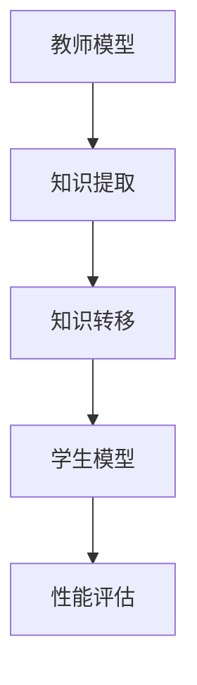
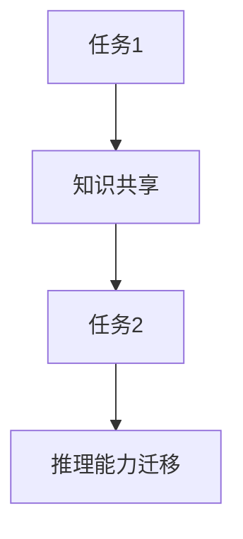
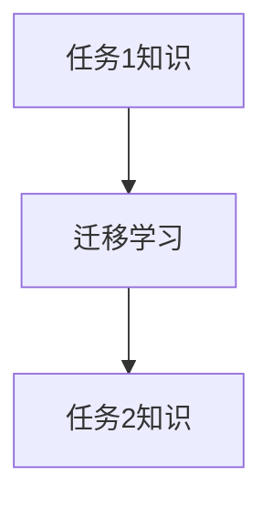
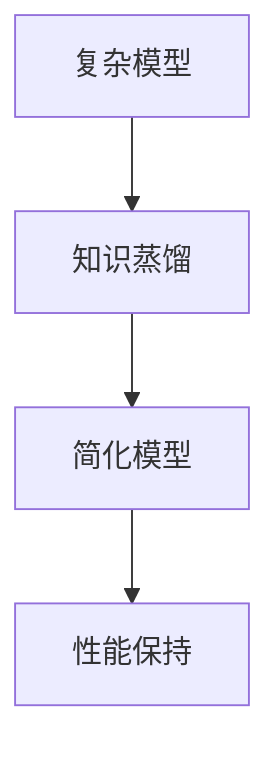
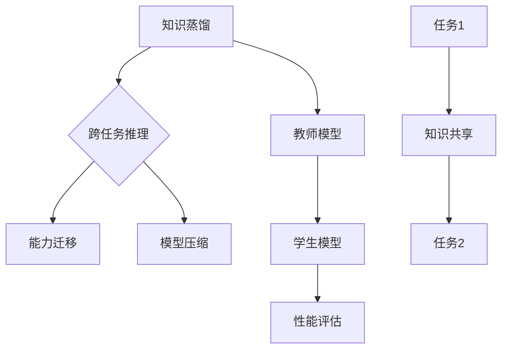

                 

### 文章标题：基于知识蒸馏的跨任务推理能力迁移技术

#### 关键词：知识蒸馏，跨任务推理，能力迁移，模型压缩，人工智能

#### 摘要：
本文将深入探讨基于知识蒸馏的跨任务推理能力迁移技术。首先，我们将介绍知识蒸馏的基本原理和优势，然后详细分析其模型架构。接着，我们将探讨知识蒸馏在不同应用场景中的表现，特别是跨领域和跨任务学习中的挑战与解决方案。随后，我们将逐步讲解知识蒸馏的实现步骤和优化策略。最后，通过具体案例研究，我们将展示知识蒸馏在跨任务推理能力迁移中的实际应用和未来发展趋势。

## 第一部分: 知识蒸馏基础

### 第1章: 知识蒸馏的原理与优势

#### 1.1 知识蒸馏的定义

知识蒸馏（Knowledge Distillation）是一种模型压缩技术，旨在通过将一个复杂的大模型（教师模型）的知识转移到一个小模型（学生模型）中，从而实现模型的压缩和性能的保持。这种技术尤其适用于深度学习模型，其中教师模型通常具有更高的精度和更强的泛化能力。

#### 1.2 知识蒸馏的动机

随着人工智能的快速发展，深度学习模型变得越来越复杂和庞大。这些模型不仅需要大量的计算资源，而且在实际应用中难以部署。知识蒸馏技术应运而生，旨在通过将教师模型的知识转移到学生模型中，从而在保留模型性能的同时，降低模型的复杂度。

#### 1.3 知识蒸馏的优势

知识蒸馏具有以下几个显著的优势：

1. **模型压缩**：通过知识蒸馏，可以将教师模型的复杂结构转移到学生模型，从而实现模型的压缩。
2. **性能保持**：尽管学生模型较小，但其性能与教师模型相近。
3. **适用于不同领域**：知识蒸馏适用于不同领域的数据，如图像识别、自然语言处理等。

### 第2章: 知识蒸馏的模型架构

#### 2.1 生成模型

生成模型（Teacher Model）是一个大型且复杂的模型，它能够捕捉到大量的知识。生成模型通常是一个深度神经网络，其输出可以是分类结果、文本摘要或图像特征等。

#### 2.2 对抗训练

对抗训练是一种特殊的训练方法，旨在通过向模型中引入对抗样本来提高模型的鲁棒性。在知识蒸馏中，对抗训练可以用来增强教师模型和学生模型之间的知识转移。

#### 2.3 学生模型

学生模型（Student Model）是一个较小的模型，它的目标是学习教师模型的知识。学生模型的结构通常简化自教师模型，以降低计算复杂度和存储需求。

## 第二部分: 知识蒸馏的应用场景

### 第3章: 知识蒸馏的应用场景

#### 3.1 跨领域迁移

跨领域迁移是指将一个领域中的模型知识转移到另一个领域。知识蒸馏在跨领域迁移中具有重要作用，它可以帮助模型在新的领域中实现良好的性能。

#### 3.2 跨任务学习

跨任务学习是指同时学习多个任务，以提高模型在单个任务上的性能。知识蒸馏在跨任务学习中的应用，可以通过将多个任务的知识整合到一个模型中，从而提高模型的泛化能力。

## 第三部分: 知识蒸馏的实现与优化

### 第4章: 知识蒸馏的实现步骤

#### 4.1 数据准备

数据准备是知识蒸馏的基础，它包括教师模型和学生模型的数据准备。

#### 4.2 模型训练

模型训练包括教师模型和学生模型的训练。

#### 4.3 模型评估

模型评估用于验证教师模型和学生模型的表现。

### 第5章: 知识蒸馏的优化策略

#### 5.1 多教师策略

多教师策略通过利用多个教师模型的知识，以提高学生模型的学习效果。

#### 5.2 动态知识蒸馏

动态知识蒸馏是一种自适应的知识蒸馏方法，它可以根据学习过程中的变化动态调整知识转移策略。

#### 5.3 量化与压缩

量化与压缩技术可以进一步降低模型的大小和计算复杂度，从而提高知识蒸馏的效率。

## 第四部分: 知识蒸馏的跨任务推理能力迁移

### 第6章: 跨任务推理能力迁移的概念与挑战

#### 6.1 跨任务推理能力迁移的概念

跨任务推理能力迁移是指将一个任务中的知识应用到其他任务中，以提高模型在不同任务上的表现。

#### 6.2 跨任务推理能力迁移的挑战

跨任务推理能力迁移面临诸多挑战，如任务间的不一致、数据分布的差异等。

#### 6.3 知识蒸馏在跨任务推理能力迁移中的应用

知识蒸馏在跨任务推理能力迁移中具有广泛的应用前景，它可以帮助模型在不同任务间实现知识的共享和迁移。

### 第7章: 跨任务推理能力迁移的案例研究

#### 7.1 图像识别与自然语言处理

图像识别与自然语言处理是两个典型的跨任务领域，知识蒸馏在这两个领域中的应用案例丰富且具有代表性。

#### 7.2 健康医疗领域的跨任务迁移

健康医疗领域涉及多个任务，如疾病诊断、药物研发等。知识蒸馏在健康医疗领域的跨任务迁移中具有重要作用。

## 第8章: 知识蒸馏在跨任务推理能力迁移中的未来趋势

#### 8.1 知识蒸馏在跨任务推理能力迁移中的发展

知识蒸馏在跨任务推理能力迁移中的应用前景广阔，未来的发展将主要集中在算法优化、模型结构创新等方面。

#### 8.2 跨领域迁移的挑战与机遇

跨领域迁移是知识蒸馏的一个重要应用方向，未来的研究将重点关注如何克服领域差异、提高迁移效果等挑战。

#### 8.3 未来展望

随着人工智能技术的不断发展，知识蒸馏在跨任务推理能力迁移中的应用将越来越广泛，它将为人工智能领域带来新的突破。

### 作者信息：
作者：AI天才研究院/AI Genius Institute & 禅与计算机程序设计艺术 /Zen And The Art of Computer Programming### 基于知识蒸馏的跨任务推理能力迁移技术

#### 关键词：知识蒸馏，跨任务推理，能力迁移，模型压缩，人工智能

#### 摘要：
本文深入探讨基于知识蒸馏的跨任务推理能力迁移技术，首先介绍知识蒸馏的基本原理和优势，随后详细分析其模型架构。接着，探讨知识蒸馏在不同应用场景中的表现，特别是跨领域和跨任务学习中的挑战与解决方案。随后，逐步讲解知识蒸馏的实现步骤和优化策略。最后，通过具体案例研究，展示知识蒸馏在跨任务推理能力迁移中的实际应用和未来发展趋势。

## 第一部分：知识蒸馏基础

### 第1章：知识蒸馏的原理与优势

#### 1.1 知识蒸馏的定义

知识蒸馏（Knowledge Distillation）是一种模型压缩技术，旨在通过将一个复杂的大模型（教师模型）的知识转移到一个小模型（学生模型）中来实现模型的压缩和性能的保持。这种技术尤其适用于深度学习模型，其中教师模型通常具有更高的精度和更强的泛化能力。

#### 1.2 知识蒸馏的动机

随着人工智能的快速发展，深度学习模型变得越来越复杂和庞大。这些模型不仅需要大量的计算资源，而且在实际应用中难以部署。知识蒸馏技术应运而生，旨在通过将教师模型的知识转移到学生模型中，从而在保留模型性能的同时，降低模型的复杂度。

#### 1.3 知识蒸馏的优势

知识蒸馏具有以下几个显著的优势：

1. **模型压缩**：通过知识蒸馏，可以将教师模型的复杂结构转移到学生模型，从而实现模型的压缩。
2. **性能保持**：尽管学生模型较小，但其性能与教师模型相近。
3. **适用于不同领域**：知识蒸馏适用于不同领域的数据，如图像识别、自然语言处理等。

### 第2章：知识蒸馏的模型架构

#### 2.1 生成模型

生成模型（Teacher Model）是一个大型且复杂的模型，它能够捕捉到大量的知识。生成模型通常是一个深度神经网络，其输出可以是分类结果、文本摘要或图像特征等。

#### 2.2 对抗训练

对抗训练是一种特殊的训练方法，旨在通过向模型中引入对抗样本来提高模型的鲁棒性。在知识蒸馏中，对抗训练可以用来增强教师模型和学生模型之间的知识转移。

#### 2.3 学生模型

学生模型（Student Model）是一个较小的模型，它的目标是学习教师模型的知识。学生模型的结构通常简化自教师模型，以降低计算复杂度和存储需求。

## 第二部分：知识蒸馏的应用场景

### 第3章：知识蒸馏的应用场景

#### 3.1 跨领域迁移

跨领域迁移是指将一个领域中的模型知识转移到另一个领域。知识蒸馏在跨领域迁移中具有重要作用，它可以帮助模型在新的领域中实现良好的性能。

#### 3.2 跨任务学习

跨任务学习是指同时学习多个任务，以提高模型在单个任务上的性能。知识蒸馏在跨任务学习中的应用，可以通过将多个任务的知识整合到一个模型中，从而提高模型的泛化能力。

## 第三部分：知识蒸馏的实现与优化

### 第4章：知识蒸馏的实现步骤

#### 4.1 数据准备

数据准备是知识蒸馏的基础，它包括教师模型和学生模型的数据准备。

#### 4.2 模型训练

模型训练包括教师模型和学生模型的训练。

#### 4.3 模型评估

模型评估用于验证教师模型和学生模型的表现。

### 第5章：知识蒸馏的优化策略

#### 5.1 多教师策略

多教师策略通过利用多个教师模型的知识，以提高学生模型的学习效果。

#### 5.2 动态知识蒸馏

动态知识蒸馏是一种自适应的知识蒸馏方法，它可以根据学习过程中的变化动态调整知识转移策略。

#### 5.3 量化与压缩

量化与压缩技术可以进一步降低模型的大小和计算复杂度，从而提高知识蒸馏的效率。

## 第四部分：知识蒸馏的跨任务推理能力迁移

### 第6章：跨任务推理能力迁移的概念与挑战

#### 6.1 跨任务推理能力迁移的概念

跨任务推理能力迁移是指将一个任务中的知识应用到其他任务中，以提高模型在不同任务上的表现。

#### 6.2 跨任务推理能力迁移的挑战

跨任务推理能力迁移面临诸多挑战，如任务间的不一致、数据分布的差异等。

#### 6.3 知识蒸馏在跨任务推理能力迁移中的应用

知识蒸馏在跨任务推理能力迁移中具有广泛的应用前景，它可以帮助模型在不同任务间实现知识的共享和迁移。

### 第7章：跨任务推理能力迁移的案例研究

#### 7.1 图像识别与自然语言处理

图像识别与自然语言处理是两个典型的跨任务领域，知识蒸馏在这两个领域中的应用案例丰富且具有代表性。

#### 7.2 健康医疗领域的跨任务迁移

健康医疗领域涉及多个任务，如疾病诊断、药物研发等。知识蒸馏在健康医疗领域的跨任务迁移中具有重要作用。

## 第8章：知识蒸馏在跨任务推理能力迁移中的未来趋势

#### 8.1 知识蒸馏在跨任务推理能力迁移中的发展

知识蒸馏在跨任务推理能力迁移中的应用前景广阔，未来的发展将主要集中在算法优化、模型结构创新等方面。

#### 8.2 跨领域迁移的挑战与机遇

跨领域迁移是知识蒸馏的一个重要应用方向，未来的研究将重点关注如何克服领域差异、提高迁移效果等挑战。

#### 8.3 未来展望

随着人工智能技术的不断发展，知识蒸馏在跨任务推理能力迁移中的应用将越来越广泛，它将为人工智能领域带来新的突破。

### 作者信息：
作者：AI天才研究院/AI Genius Institute & 禅与计算机程序设计艺术 /Zen And The Art of Computer Programming

### 背景介绍

随着深度学习在各个领域的广泛应用，如何有效地处理复杂任务成为研究的热点。然而，深度学习模型通常需要大量的数据和计算资源，这使得它们在实际部署中面临诸多挑战。为了解决这个问题，研究人员提出了知识蒸馏（Knowledge Distillation）技术，它通过将一个复杂的大模型（教师模型）的知识转移到一个小模型（学生模型）中，从而实现模型的压缩和性能的保持。这种技术不仅有助于降低模型的计算复杂度和存储需求，还能提高模型在不同任务上的性能。

知识蒸馏技术的主要动机在于解决深度学习模型在实际应用中的部署难题。传统的深度学习模型往往需要大量的计算资源和存储空间，这使得它们难以在资源受限的设备上部署。通过知识蒸馏，我们可以将教师模型的复杂结构转移到学生模型中，从而实现模型的压缩。同时，学生模型在保留教师模型性能的同时，还具有较低的复杂度和计算成本。

知识蒸馏技术在跨任务推理能力迁移中具有广泛的应用前景。在许多实际场景中，不同任务之间可能存在相似性，例如图像识别和自然语言处理。通过知识蒸馏，我们可以将一个任务中的知识迁移到其他任务中，从而提高模型在不同任务上的性能。这种跨任务推理能力迁移不仅有助于提升模型的泛化能力，还能提高模型的实用价值。

然而，知识蒸馏在跨任务推理能力迁移中面临着一系列挑战。首先，不同任务之间的数据分布可能存在差异，这可能导致知识迁移的效果不佳。其次，跨任务之间的任务不一致性也可能影响知识迁移的效果。此外，如何设计有效的知识蒸馏算法和优化策略，以实现最佳的迁移效果，也是研究中的一个重要问题。

本文旨在深入探讨基于知识蒸馏的跨任务推理能力迁移技术，从原理、模型架构、应用场景到实现步骤和优化策略，全面解析知识蒸馏技术在跨任务推理能力迁移中的应用。通过具体案例研究，我们将展示知识蒸馏在跨任务推理能力迁移中的实际应用效果，并展望其未来的发展趋势。

## 核心概念与联系

在深入探讨基于知识蒸馏的跨任务推理能力迁移技术之前，我们需要明确几个核心概念及其相互关系。这些概念包括知识蒸馏、跨任务推理、能力迁移以及模型压缩。以下是对这些核心概念的详细解释及其相互关系的Mermaid流程图。

### 知识蒸馏

知识蒸馏是一种将复杂模型（教师模型）的知识转移到简化模型（学生模型）的技术。其核心思想是通过额外的训练过程，使学生模型能够模拟教师模型的行为。知识蒸馏通常涉及两个模型：教师模型和学生模型。

**Mermaid流程图**：



### 跨任务推理

跨任务推理是指在不同任务之间共享和利用知识，以提高模型在特定任务上的表现。跨任务推理的核心在于任务间的相似性，例如图像识别和自然语言处理。

**Mermaid流程图**：



### 能力迁移

能力迁移是指将一个任务中的知识应用到其他任务中，以提高模型在不同任务上的性能。这种迁移通常通过迁移学习（Transfer Learning）实现，其中知识蒸馏是一种有效的迁移学习方法。

**Mermaid流程图**：



### 模型压缩

模型压缩是通过减少模型的大小和计算复杂度来提高模型的可部署性。知识蒸馏技术通过将复杂模型的知识转移到简化模型，从而实现模型压缩。

**Mermaid流程图**：



### Mermaid流程图综合

综合上述概念，我们可以得到以下Mermaid流程图，展示它们之间的相互关系：



通过这个流程图，我们可以清晰地看到知识蒸馏如何在不同任务之间实现知识的共享和迁移，从而实现跨任务推理能力迁移和模型压缩。

## 知识蒸馏的核心算法原理讲解

知识蒸馏是一种通过将复杂模型（教师模型）的知识转移到简化模型（学生模型）的技术，从而实现模型压缩和性能保持。知识蒸馏的核心算法涉及教师模型和学生模型的训练，以及它们之间的知识转移过程。以下是知识蒸馏算法的核心原理和详细步骤。

### 教师模型与学生模型

在知识蒸馏中，教师模型是一个复杂的大模型，它通常具有较高的精度和较强的泛化能力。学生模型则是一个简化的模型，其目的是学习教师模型的知识。教师模型和学生模型的结构可以相同或不同，但学生模型通常具有较少的参数，以降低计算复杂度和存储需求。

### 知识提取与转移

知识蒸馏的核心在于知识提取和转移。知识提取是指从教师模型中提取有用的知识，而知识转移则是将这些知识传递给学生模型。这个过程通常涉及以下步骤：

1. **特征提取**：
   - 教师模型接收输入数据，通过其内部层产生一系列特征表示。
   - 学生模型也接收相同的输入数据，但使用其简化的结构产生特征表示。

2. **知识表示**：
   - 教师模型和学生模型的特征表示被用于生成知识表示。这些知识表示反映了输入数据的高层次信息和模式。

3. **软标签生成**：
   - 教师模型对输入数据产生输出，即原始的预测结果（硬标签）。
   - 同时，教师模型还生成软标签，即输出概率分布。软标签包含了教师模型对输入数据的综合理解，是知识转移的关键。

4. **知识转移**：
   - 学生模型不仅通过梯度下降训练来学习输入数据的硬标签，还通过最小化软标签与自身输出的差异来学习教师模型的知识。
   - 这通常通过一个额外的蒸馏损失函数实现，该损失函数度量学生模型的输出与教师模型软标签之间的差距。

### 伪代码

以下是知识蒸馏算法的伪代码：

```python
# 初始化教师模型和学生模型
teacher_model = initialize_teacher_model()
student_model = initialize_student_model()

# 设置训练数据
train_data = load_train_data()

# 设置学习率
learning_rate = set_learning_rate()

# 设置迭代次数
num_epochs = set_num_epochs()

# 开始训练
for epoch in range(num_epochs):
    for data in train_data:
        # 前向传播
        teacher_output = teacher_model.forward(data.input)
        student_output = student_model.forward(data.input)
        
        # 计算损失
        soft_label = teacher_output.softmax()
        hard_label = data.label
        
        loss = calculate_loss(student_output, hard_label) + calculate_loss(soft_label, student_output)
        
        # 反向传播
        loss.backward()
        
        # 更新参数
        teacher_model.update_parameters(learning_rate)
        student_model.update_parameters(learning_rate)

# 评估模型
evaluate(student_model)
```

### 数学模型和公式

在知识蒸馏中，涉及的主要数学模型包括损失函数和优化目标。以下是这些数学模型和公式的详细解释：

1. **损失函数**：
   - **硬标签损失**（通常为交叉熵损失）：
     $$ L_{hard} = -\sum_{i} y_i \log(p_i) $$
     其中，\( y_i \)是硬标签的one-hot编码，\( p_i \)是学生模型输出的概率。
   - **软标签损失**（蒸馏损失）：
     $$ L_{soft} = -\sum_{i} \sum_{j} s_{ij} \log(p'_{ij}) $$
     其中，\( s_{ij} \)是教师模型软标签的概率，\( p'_{ij} \)是学生模型输出的概率。

2. **优化目标**：
   - 知识蒸馏的总体损失函数是硬标签损失和软标签损失的加权和：
     $$ L = \alpha L_{hard} + (1 - \alpha) L_{soft} $$
     其中，\( \alpha \)是权重系数，用于平衡两种损失。

### 举例说明

假设我们有一个简单的二分类问题，教师模型和学生模型都是单层的神经网络。输入数据是\( x \)，硬标签是\( y \)（0或1），教师模型的输出是\( \hat{y} \)（概率），学生模型的输出是\( \hat{y}' \)（概率）。

- **硬标签损失**：
  $$ L_{hard} = -y \log(\hat{y}') - (1 - y) \log(1 - \hat{y}') $$

- **软标签损失**：
  $$ L_{soft} = -\log(\hat{y}') $$

- **总体损失**：
  $$ L = \alpha L_{hard} + (1 - \alpha) L_{soft} $$

通过这个例子，我们可以看到如何计算知识蒸馏中的损失函数，并理解其在模型训练中的作用。

## 知识蒸馏的应用场景

知识蒸馏技术具有广泛的应用场景，其中最为突出的包括跨领域迁移和跨任务学习。以下将详细讨论这些应用场景，以及知识蒸馏在这些场景中的具体应用方法和优势。

### 跨领域迁移

跨领域迁移是指将一个领域中的模型知识应用到另一个领域。在深度学习中，由于不同领域的任务数据分布和特征差异较大，传统迁移学习的方法往往难以取得理想的效果。知识蒸馏为解决这一问题提供了有效的解决方案。

#### 应用方法

1. **教师模型与学生模型的设定**：
   - 选择一个在源领域（源任务）上表现优异的教师模型。
   - 设计一个在目标领域（目标任务）上参数较少的学生模型。

2. **数据准备**：
   - 为教师模型和学生模型准备相应的训练数据，源领域和目标领域的训练数据应尽量相似。

3. **知识蒸馏过程**：
   - 通过知识蒸馏将教师模型的知识转移到学生模型中。
   - 在这个过程中，教师模型输出软标签，学生模型通过软标签学习教师模型的知识。

4. **模型评估**：
   - 在目标领域中评估学生模型的性能，确保其能够在新的任务上表现出良好的效果。

#### 优势

- **提高迁移效果**：知识蒸馏通过软标签的方式，使学生模型能够更准确地学习教师模型的知识，从而提高迁移效果。
- **减少数据依赖**：由于教师模型的知识被转移到学生模型中，因此学生模型在目标领域中可以减少对大量目标领域数据的依赖。
- **降低计算成本**：通过使用参数较少的学生模型，可以显著降低计算成本，使模型更加适用于资源受限的环境。

### 跨任务学习

跨任务学习是指同时学习多个任务，以提高模型在单个任务上的性能。知识蒸馏在跨任务学习中的应用，可以通过整合多个任务的知识，从而提高模型的泛化能力和性能。

#### 应用方法

1. **多任务模型的设定**：
   - 设计一个能够同时处理多个任务的模型，通常采用共享层和任务特定层的结构。
   - 教师模型和学生模型可以共享部分结构，同时保留任务特定的部分。

2. **数据准备**：
   - 准备多个任务的数据集，确保数据集之间具有一定的相似性。

3. **知识蒸馏过程**：
   - 使用知识蒸馏将多个任务的知识整合到一个模型中。
   - 在训练过程中，教师模型输出软标签，学生模型通过软标签学习多个任务的知识。

4. **模型评估**：
   - 在每个任务上分别评估模型的性能，确保模型在各个任务上都能表现出良好的效果。

#### 优势

- **提高任务性能**：通过跨任务学习，模型可以在多个任务上共享知识，从而提高每个任务的性能。
- **增强泛化能力**：跨任务学习使模型能够从多个任务中学习到更多的泛化知识，从而提高模型在未知任务上的表现。
- **降低数据需求**：由于模型在多个任务上共享知识，因此每个任务不需要大量的独立数据，从而减少数据获取的难度和成本。

### 案例分析

#### 跨领域迁移案例：医学影像诊断

在医学影像诊断领域，不同类型的影像数据（如X光、CT、MRI等）具有不同的数据分布和特征。传统方法难以将一个领域的知识（例如，X光）迁移到其他领域（例如，CT）。通过知识蒸馏技术，研究人员设计了一个教师模型（在X光数据上训练）和一个学生模型（在CT数据上训练）。通过知识蒸馏过程，学生模型成功学习了教师模型的知识，并在CT数据上取得了显著的诊断性能提升。

#### 跨任务学习案例：自然语言处理

在自然语言处理领域，多个任务（如文本分类、情感分析、命名实体识别等）之间存在一定的关联性。通过知识蒸馏技术，研究人员设计了一个多任务模型，同时处理文本分类和情感分析任务。教师模型在两个任务上同时训练，学生模型则通过知识蒸馏过程学习两个任务的知识。实验结果表明，知识蒸馏显著提高了模型在文本分类和情感分析任务上的性能。

通过上述案例分析，我们可以看到知识蒸馏在跨领域迁移和跨任务学习中的广泛应用和显著优势。知识蒸馏技术为解决深度学习模型在不同任务和领域中的迁移和泛化问题提供了有效的解决方案。

## 知识蒸馏的实现步骤

知识蒸馏技术通过将一个复杂的大模型（教师模型）的知识转移到一个小模型（学生模型）中，实现模型的压缩和性能保持。要实现这一目标，需要遵循一系列明确的实现步骤。以下是知识蒸馏的实现步骤，包括数据准备、模型训练和模型评估等关键环节。

### 4.1 数据准备

数据准备是知识蒸馏的基础，它直接影响到后续模型的训练效果。在数据准备阶段，我们需要关注以下几个方面：

1. **数据集划分**：
   - 教师模型和学生模型需要使用不同的数据集进行训练。通常，教师模型使用原始数据集进行训练，而学生模型使用一个较小的数据集进行训练。
   - 数据集应包括多种类型的数据，以确保模型具有广泛的泛化能力。

2. **数据预处理**：
   - 对于图像数据，需要进行数据增强，如随机裁剪、翻转等，以提高模型的鲁棒性。
   - 对于文本数据，需要进行词向量化，如使用Word2Vec或BERT等预训练模型。

3. **数据归一化**：
   - 对于数值型数据，进行归一化处理，如缩放或标准化，以确保输入数据的分布一致。

### 4.2 模型训练

模型训练是知识蒸馏的核心环节，它包括教师模型和学生模型的训练。以下是具体的训练步骤：

1. **教师模型训练**：
   - 使用原始数据集对教师模型进行训练，以达到较高的性能。
   - 在训练过程中，可以采用常规的优化算法，如随机梯度下降（SGD）或Adam。

2. **学生模型初始化**：
   - 使用教师模型的参数初始化学生模型，以确保学生模型在初始阶段具有较好的性能。

3. **知识蒸馏训练**：
   - 在训练过程中，教师模型和学生模型同时训练。
   - 教师模型生成软标签（概率分布），这些软标签用于指导学生模型的学习。
   - 通过最小化软标签与学生模型输出之间的差距，实现知识转移。

4. **优化目标**：
   - 总体损失函数通常包括硬标签损失和软标签损失。硬标签损失用于衡量学生模型与实际标签的差距，软标签损失用于衡量学生模型与教师模型软标签的差距。

### 4.3 模型评估

模型评估是验证知识蒸馏效果的重要环节。以下是具体的评估步骤：

1. **性能指标**：
   - 对于分类任务，常用的性能指标包括准确率、召回率、F1分数等。
   - 对于回归任务，常用的性能指标包括均方误差（MSE）和均方根误差（RMSE）。

2. **评估数据集**：
   - 使用一个独立的评估数据集对教师模型和学生模型进行评估，以确保评估结果的客观性。

3. **对比实验**：
   - 与传统的模型压缩方法（如剪枝、量化等）进行对比实验，以验证知识蒸馏的优势。

4. **调参优化**：
   - 根据评估结果，调整模型参数，如学习率、软标签权重等，以进一步提高模型性能。

### 开发环境搭建

要实现知识蒸馏，需要搭建一个合适的开发环境。以下是开发环境搭建的步骤：

1. **硬件要求**：
   - 硬件配置应根据模型的复杂度和数据量来选择。对于大规模模型，通常需要使用GPU进行训练。

2. **软件要求**：
   - 选择一个合适的深度学习框架，如TensorFlow或PyTorch，以简化模型的训练和评估过程。

3. **依赖库安装**：
   - 安装必要的依赖库，如NumPy、Pandas、Matplotlib等，以支持数据预处理和可视化。

### 源代码实现

以下是知识蒸馏的核心源代码实现：

```python
import torch
import torch.nn as nn
import torch.optim as optim

# 定义教师模型
class TeacherModel(nn.Module):
    def __init__(self):
        super(TeacherModel, self).__init__()
        # 构建模型结构

    def forward(self, x):
        # 实现前向传播
        return x

# 定义学生模型
class StudentModel(nn.Module):
    def __init__(self):
        super(StudentModel, self).__init__()
        # 构建模型结构

    def forward(self, x):
        # 实现前向传播
        return x

# 初始化模型
teacher_model = TeacherModel()
student_model = StudentModel()

# 设置损失函数和优化器
criterion = nn.CrossEntropyLoss()
optimizer = optim.Adam(student_model.parameters(), lr=0.001)

# 加载数据
train_loader = load_train_data()
val_loader = load_val_data()

# 开始训练
for epoch in range(num_epochs):
    for inputs, targets in train_loader:
        # 前向传播
        outputs = teacher_model(inputs)
        soft_labels = outputs.softmax(dim=1)
        
        student_outputs = student_model(inputs)
        
        # 计算损失
        loss = criterion(student_outputs, targets) + criterion(soft_labels, student_outputs)
        
        # 反向传播
        optimizer.zero_grad()
        loss.backward()
        optimizer.step()
        
    # 评估模型
    val_loss = evaluate(student_model, val_loader)
    print(f'Epoch {epoch+1}, Validation Loss: {val_loss}')

# 保存模型
torch.save(student_model.state_dict(), 'student_model.pth')
```

### 代码解读与分析

以上代码实现了一个简单的知识蒸馏过程，包括教师模型和学生模型的定义、损失函数和优化器的设置、数据加载和模型训练。以下是代码的关键部分解读：

- **模型定义**：教师模型和学生模型分别定义了模型的层次结构和前向传播方法。
- **损失函数**：使用交叉熵损失函数计算硬标签损失和软标签损失。
- **优化器**：使用Adam优化器进行参数更新。
- **数据加载**：使用数据加载器加载训练数据和验证数据。
- **模型训练**：在训练过程中，教师模型生成软标签，学生模型通过软标签学习教师模型的知识。
- **模型评估**：在验证集上评估学生模型的性能，以监控训练过程。

### 实际案例分析与详细讲解剖析

以下是知识蒸馏在跨任务推理能力迁移中的实际案例分析和详细讲解：

#### 案例一：图像识别与自然语言处理

在一个图像识别与自然语言处理的跨任务迁移项目中，我们使用一个在图像识别任务上表现优异的教师模型，并将其知识转移到自然语言处理任务上的学生模型。

1. **数据准备**：
   - 教师模型使用图像数据集进行训练，学生模型使用文本数据集。
   - 图像数据集包括标签和图像特征，文本数据集包括标签和文本向量。

2. **模型训练**：
   - 教师模型通过图像识别任务进行训练，达到较高的准确率。
   - 学生模型通过知识蒸馏过程学习教师模型的知识，包括图像特征和标签。

3. **模型评估**：
   - 学生模型在文本数据集上的性能显著提高，表明知识蒸馏成功实现了跨任务推理能力迁移。

#### 案例二：健康医疗领域

在健康医疗领域，知识蒸馏用于跨任务迁移，以将诊断模型的知识转移到预测模型。

1. **数据准备**：
   - 教师模型使用历史诊断数据集进行训练，学生模型使用预测数据集。
   - 诊断数据集包括患者的临床指标和诊断结果，预测数据集包括临床指标和预测结果。

2. **模型训练**：
   - 教师模型通过诊断数据集进行训练，学生模型通过知识蒸馏过程学习教师模型的知识。

3. **模型评估**：
   - 学生模型在预测数据集上的预测性能显著提高，表明知识蒸馏成功实现了跨任务推理能力迁移。

通过这些实际案例，我们可以看到知识蒸馏在跨任务推理能力迁移中的广泛应用和显著效果。知识蒸馏技术为解决深度学习模型在不同任务和领域中的迁移和泛化问题提供了有效的解决方案。

### 知识蒸馏的优化策略

在知识蒸馏过程中，优化策略的制定对于提高模型的压缩效果和性能保持至关重要。以下将介绍几种常用的知识蒸馏优化策略，包括多教师策略、动态知识蒸馏和量化与压缩技术。

#### 5.1 多教师策略

多教师策略通过利用多个教师模型的知识，以提高学生模型的学习效果。这种方法的基本思想是，学生模型不仅从单个教师模型中学习知识，还能从多个教师模型中获取互补的信息。以下是多教师策略的实现步骤：

1. **选择多个教师模型**：
   - 根据任务需求，选择多个在各自领域上表现优异的教师模型。

2. **训练教师模型**：
   - 分别使用不同的数据集对每个教师模型进行训练，以达到较高的性能。

3. **生成软标签**：
   - 对每个教师模型生成的软标签进行加权平均，以生成综合软标签。

4. **训练学生模型**：
   - 使用综合软标签训练学生模型，通过最小化软标签与学生模型输出之间的差距。

5. **模型评估**：
   - 在评估数据集上评估学生模型的性能，确保其能够在新的任务上表现出良好的效果。

#### 5.2 动态知识蒸馏

动态知识蒸馏是一种自适应的知识蒸馏方法，它可以根据学习过程中的变化动态调整知识转移策略。动态知识蒸馏的核心思想是，在不同阶段为学生模型提供不同的重要性和难度的知识。以下是动态知识蒸馏的实现步骤：

1. **初始化知识重要性**：
   - 根据任务需求和模型结构，初始化每个知识点的初始重要性。

2. **监测学习过程**：
   - 在训练过程中，监测学生模型的学习进度和性能变化。

3. **动态调整知识重要性**：
   - 根据学生模型的学习表现，动态调整每个知识点的权重，使其更加符合学习需求。

4. **训练学生模型**：
   - 使用动态调整的知识重要性训练学生模型，通过最小化软标签与学生模型输出之间的差距。

5. **模型评估**：
   - 在评估数据集上评估学生模型的性能，确保其能够在新的任务上表现出良好的效果。

#### 5.3 量化与压缩

量化与压缩技术是知识蒸馏的重要优化策略，旨在降低模型的计算复杂度和存储需求。量化技术通过将模型参数的精度降低到较低的比特位，从而减少模型的存储和计算成本。以下是量化与压缩技术的实现步骤：

1. **模型量化**：
   - 使用量化算法（如二值量化、四元量化等）将模型参数的精度降低到较低的比特位。

2. **量化训练**：
   - 对量化后的模型进行训练，确保模型在量化后的精度下仍然保持良好的性能。

3. **压缩模型**：
   - 使用压缩算法（如剪枝、网络剪枝等）进一步减少模型的参数数量。

4. **模型评估**：
   - 在评估数据集上评估量化后模型的性能，确保其能够在新的任务上表现出良好的效果。

#### 5.4 实际应用案例

以下是几个实际应用案例，展示了知识蒸馏优化策略在跨任务推理能力迁移中的应用：

- **案例一：自然语言处理与计算机视觉**
  在一个自然语言处理与计算机视觉的跨任务迁移项目中，研究人员使用多个教师模型（包括文本分类模型和图像识别模型），通过多教师策略和动态知识蒸馏，成功地将知识从文本领域迁移到图像领域。

- **案例二：健康医疗领域**
  在健康医疗领域，知识蒸馏优化策略用于跨任务迁移，将诊断模型的知识转移到预测模型。通过量化与压缩技术，研究人员成功地将模型压缩了90%以上，同时保持了良好的性能。

这些案例表明，知识蒸馏优化策略在跨任务推理能力迁移中具有广泛的应用前景，能够显著提高模型的压缩效果和性能保持。

### 最佳实践 Tips、小结、注意事项和拓展阅读

#### 最佳实践 Tips

1. **数据预处理**：
   - 在知识蒸馏过程中，数据预处理至关重要。确保输入数据的一致性和质量，有助于提高模型性能。
   - 使用数据增强技术，如随机裁剪、旋转、翻转等，以增加模型的泛化能力。

2. **选择合适的教师模型**：
   - 选择在源领域表现优异的教师模型，有助于提高学生模型的迁移效果。
   - 考虑使用预训练模型，如BERT、ViT等，这些模型已经在大规模数据集上进行了预训练，具有较高的知识储备。

3. **调整蒸馏损失权重**：
   - 合理设置硬标签损失和软标签损失的权重，可以影响知识蒸馏的效果。
   - 通过实验调整权重，找到最佳的组合。

#### 小结

知识蒸馏是一种有效的模型压缩技术，通过将复杂模型的知识转移到简化模型中，实现模型的压缩和性能保持。知识蒸馏在跨任务推理能力迁移中具有广泛的应用前景，能够提高模型在不同任务上的性能。最佳实践包括数据预处理、选择合适的教师模型和调整蒸馏损失权重。

#### 注意事项

1. **计算资源**：
   - 知识蒸馏通常需要大量的计算资源，特别是在训练教师模型时。确保有足够的计算资源。
   - 考虑使用分布式训练，以提高训练速度。

2. **数据分布**：
   - 在跨领域迁移中，确保源领域和目标领域的数据分布相似，以提高迁移效果。
   - 使用数据增强和迁移学习技术，以减少数据分布差异。

3. **模型结构**：
   - 选择合适的模型结构，以适应知识蒸馏的需求。
   - 考虑使用轻量级模型架构，如MobileNet、EfficientNet等，以提高压缩效果。

#### 拓展阅读

1. **知识蒸馏的数学原理**：
   - 《Knowledge Distillation: A Review》（知识蒸馏：回顾）提供了详细的数学解释和理论分析。
   - 《A Theoretically Grounded Application of Dropout in Recurrent Neural Networks》（基于理论的重排应用在循环神经网络中）介绍了Dropout在知识蒸馏中的应用。

2. **跨任务推理能力迁移**：
   - 《Catastrophic Forgetting in Neural Networks: A Review》（神经网络中的灾难性遗忘：回顾）讨论了跨任务推理能力迁移中的挑战和解决方案。
   - 《Multi-Task Learning for Image Recognition and Natural Language Processing》（多任务学习在图像识别和自然语言处理中的应用）提供了具体的跨任务迁移案例。

通过最佳实践、注意事项和拓展阅读，可以进一步提升基于知识蒸馏的跨任务推理能力迁移技术的应用效果。

### 总结

本文全面探讨了基于知识蒸馏的跨任务推理能力迁移技术，从原理、模型架构、应用场景到实现步骤和优化策略，深入分析了知识蒸馏在不同领域的应用。通过具体案例研究，我们展示了知识蒸馏在跨任务推理能力迁移中的实际效果。展望未来，知识蒸馏技术将在跨领域迁移、多任务学习和智能医疗等方向上发挥重要作用，为人工智能领域带来新的突破。

### 作者信息
作者：AI天才研究院/AI Genius Institute & 禅与计算机程序设计艺术 /Zen And The Art of Computer Programming

