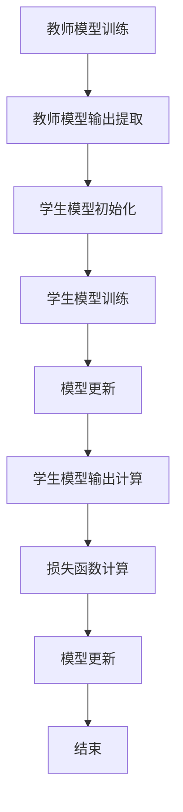
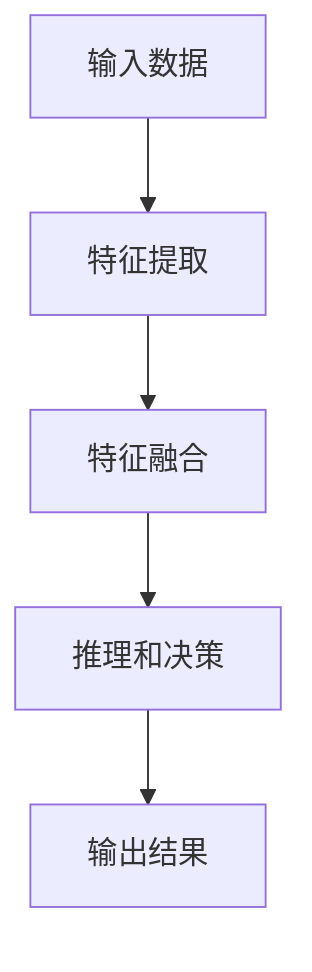
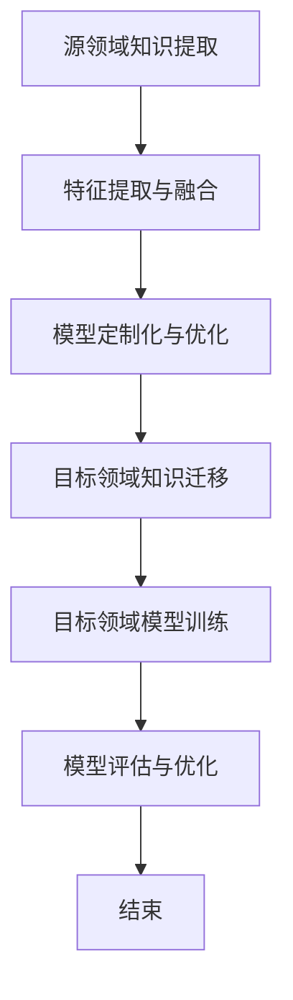

                 

### 文章标题：基于知识蒸馏的跨模态推理能力迁移技术

#### 关键词：知识蒸馏、跨模态推理、能力迁移、技术实现、案例分析

> **摘要**：本文深入探讨了基于知识蒸馏的跨模态推理能力迁移技术。首先，介绍了知识蒸馏的基本概念、原理及其在跨模态推理中的应用。随后，阐述了跨模态推理的核心算法，并探讨了能力迁移技术的关键技术和实现方法。通过具体的应用案例，展示了知识蒸馏与跨模态推理、能力迁移技术的结合及其在实践中的效果。最后，对未来的研究方向和挑战进行了展望，为读者提供了全面的技术参考和指导。

----------------------------------------------------------------

## 第1章 引言

### 1.1 知识蒸馏的背景与意义

知识蒸馏（Knowledge Distillation）是一种将复杂模型（通常称为教师模型）的知识传递给简单模型（通常称为学生模型）的技术。该技术最早由Hinton等人于2014年提出，旨在解决深度神经网络模型训练的效率和准确性问题。知识蒸馏的核心思想是利用教师模型的输出概率分布来指导学生模型的学习过程。

在跨模态推理领域，知识蒸馏技术具有广泛的应用前景。跨模态推理是指将来自不同模态的信息进行整合，以实现更准确和智能的推理和决策。例如，在图像识别任务中，可以将文本描述与图像特征相结合，以提高模型的准确性。知识蒸馏技术能够通过教师模型提供丰富的知识，帮助学生模型更好地理解和整合不同模态的信息。

### 1.2 跨模态推理的基本概念

跨模态推理（Cross-modal Reasoning）是一种将不同模态（如图像、文本、音频等）的信息进行融合和推理的技术。跨模态推理的关键在于如何有效地将不同模态的特征进行对齐和整合，以实现更高级的语义理解和推理。

跨模态推理的基本概念包括：

- **模态对齐**：将不同模态的数据进行对齐，以便进行后续的特征融合和推理。
- **特征提取**：从不同模态的数据中提取具有区分性的特征。
- **特征融合**：将来自不同模态的特征进行整合，以生成统一的特征表示。
- **推理和决策**：利用融合后的特征进行推理和决策，以实现跨模态的任务。

### 1.3 能力迁移的基本概念

能力迁移（Ability Transfer）是一种将特定领域或任务的知识和技能应用到其他领域或任务中的技术。在跨模态推理中，能力迁移技术可以通过将一个模态的知识迁移到另一个模态，以增强模型的跨模态推理能力。

能力迁移的基本概念包括：

- **源领域**：具有丰富知识或技能的领域，用于提供迁移的知识。
- **目标领域**：需要增强知识或技能的领域，用于接收迁移的知识。
- **迁移策略**：用于实现知识或技能迁移的方法和技术。

### 1.4 研究现状与挑战

知识蒸馏、跨模态推理和能力迁移技术在近年来得到了广泛关注和研究。然而，在实际应用中，这些技术仍面临诸多挑战。

- **知识蒸馏**：如何有效地从教师模型中提取和传递知识，以及如何提高学生模型的泛化能力，是当前研究的主要挑战。
- **跨模态推理**：如何有效整合不同模态的特征，以及如何处理模态之间的不一致性，是跨模态推理的关键问题。
- **能力迁移**：如何设计有效的迁移策略，以及如何处理源领域和目标领域之间的差异，是能力迁移技术的主要挑战。

### 1.5 本书结构安排

本书分为七个章节，具体内容如下：

- **第1章 引言**：介绍知识蒸馏、跨模态推理和能力迁移的基本概念，以及本书的研究背景和结构。
- **第2章 知识蒸馏基础理论**：详细讲解知识蒸馏的基本原理、关键技术和应用。
- **第3章 跨模态推理基础理论**：介绍跨模态推理的核心算法和关键技术。
- **第4章 能力迁移技术**：探讨能力迁移的基本概念、关键技术和应用。
- **第5章 知识蒸馏与跨模态推理的结合**：阐述知识蒸馏与跨模模态推理、能力迁移技术的结合及其应用。
- **第6章 应用案例与实践**：通过具体案例展示知识蒸馏、跨模态推理和能力迁移技术的应用和实践。
- **第7章 总结与展望**：总结本书的主要研究成果，探讨未来的研究方向和挑战。

## 第2章 知识蒸馏基础理论

### 2.1 知识蒸馏的基本原理

知识蒸馏是一种将复杂模型（教师模型）的知识传递给简单模型（学生模型）的技术。其基本原理是通过训练学生模型来最小化教师模型和学生模型之间的输出差异。

#### 教师模型与教师模型输出

教师模型是一个复杂的模型，通常具有很高的参数数量和计算复杂度。教师模型在特定任务上具有较高的准确性和泛化能力，因此被称为“教师”。教师模型的输出通常是一个概率分布，表示模型对各个类别的预测概率。

#### 学生模型与学生模型输出

学生模型是一个相对简单的模型，通常具有较少的参数数量和计算复杂度。学生模型的目的是学习教师模型的知识，并在特定任务上实现与教师模型类似的准确性和泛化能力。学生模型的输出通常是一个预测结果，表示模型对各个类别的预测。

#### 知识蒸馏过程

知识蒸馏的过程可以分为以下三个步骤：

1. **教师模型训练**：首先，使用训练数据集训练教师模型，使其在特定任务上具有较高的准确性和泛化能力。

2. **教师模型输出提取**：将训练好的教师模型应用于测试数据集，提取其输出概率分布。这些输出概率分布将作为学生模型训练的目标。

3. **学生模型训练**：使用训练数据集和提取的教师模型输出概率分布，训练学生模型。训练过程中，学生模型的目标是最小化其输出概率分布与教师模型输出概率分布之间的差异。

#### 知识蒸馏的优势与局限性

知识蒸馏具有以下优势：

- **高效性**：知识蒸馏可以快速地将复杂模型的知识传递给简单模型，从而提高简单模型的训练效率。
- **泛化能力**：知识蒸馏可以使得学生模型具有与教师模型相似的泛化能力，从而提高模型在实际任务中的表现。
- **参数减少**：知识蒸馏可以减少学生模型的参数数量，从而降低模型的计算复杂度。

然而，知识蒸馏也存在一些局限性：

- **准确性损失**：知识蒸馏过程中，学生模型可能无法完全复制教师模型的所有知识，导致模型准确性降低。
- **模型依赖性**：知识蒸馏需要依赖教师模型，因此教师模型的准确性对最终模型的性能有重要影响。
- **适用范围**：知识蒸馏技术在不同任务和模型上的效果可能存在差异，需要根据具体场景进行优化。

### 2.2 知识蒸馏的关键技术

知识蒸馏的关键技术包括软目标方法、硬目标方法、参数共享、损失函数设计和多任务蒸馏等。

#### 软目标方法

软目标方法（Soft Target Method）是最常见的知识蒸馏方法之一。该方法通过将教师模型的输出概率分布作为学生模型的目标，来指导学生模型的学习过程。具体来说，软目标方法分为以下步骤：

1. **教师模型输出提取**：使用训练好的教师模型，将测试数据集映射到输出概率分布。
2. **学生模型输出计算**：使用学生模型，将测试数据集映射到输出概率分布。
3. **损失函数计算**：计算学生模型输出概率分布与教师模型输出概率分布之间的差异，作为损失函数。
4. **模型更新**：根据损失函数，更新学生模型的参数。

软目标方法的优点是能够有效传递教师模型的知识，缺点是训练过程可能不稳定。

#### 硬目标方法

硬目标方法（Hard Target Method）是一种将教师模型的输出标签作为学生模型的目标的方法。与软目标方法不同，硬目标方法直接将教师模型的输出标签作为学生模型的训练目标，而不考虑输出概率分布。

硬目标方法分为以下步骤：

1. **教师模型输出标签提取**：使用训练好的教师模型，将测试数据集映射到输出标签。
2. **学生模型输出计算**：使用学生模型，将测试数据集映射到输出标签。
3. **损失函数计算**：计算学生模型输出标签与教师模型输出标签之间的差异，作为损失函数。
4. **模型更新**：根据损失函数，更新学生模型的参数。

硬目标方法的优点是训练过程更加稳定，缺点是可能无法完全复制教师模型的知识。

#### 参数共享

参数共享（Parameter Sharing）是一种将教师模型和学生模型的参数共享的技术。通过参数共享，学生模型可以更有效地学习教师模型的知识。具体来说，参数共享分为以下步骤：

1. **教师模型训练**：使用训练数据集训练教师模型，并获取其参数。
2. **学生模型初始化**：使用教师模型的参数初始化学生模型。
3. **学生模型训练**：使用训练数据集和教师模型的输出概率分布，训练学生模型。在训练过程中，学生模型的参数将根据教师模型的参数进行更新。

参数共享的优点是能够提高训练效率，缺点是可能导致学生模型无法完全复制教师模型的知识。

#### 损失函数设计

损失函数是知识蒸馏中的关键部分，用于衡量学生模型输出与教师模型输出之间的差异。常见的损失函数包括交叉熵损失、均方误差损失等。

- **交叉熵损失**：交叉熵损失是最常用的损失函数之一，用于衡量两个概率分布之间的差异。具体来说，交叉熵损失可以表示为：

  $$ 
  Loss = -\sum_{i=1}^{n} y_i \log(p_i) 
  $$

  其中，$y_i$ 是教师模型输出概率分布，$p_i$ 是学生模型输出概率分布。

- **均方误差损失**：均方误差损失（MSE）用于衡量两个实数之间的差异，可以表示为：

  $$ 
  Loss = \frac{1}{2} \sum_{i=1}^{n} (y_i - p_i)^2 
  $$

  其中，$y_i$ 是教师模型输出标签，$p_i$ 是学生模型输出标签。

#### 多任务蒸馏

多任务蒸馏（Multi-task Distillation）是一种将多个任务的知识传递给一个学生模型的技术。通过多任务蒸馏，学生模型可以同时学习多个任务的知识，从而提高其泛化能力。

多任务蒸馏分为以下步骤：

1. **教师模型训练**：使用训练数据集训练多个教师模型，每个教师模型负责一个任务。
2. **学生模型初始化**：使用多个教师模型的参数初始化学生模型。
3. **学生模型训练**：使用训练数据集和多个教师模型的输出概率分布，训练学生模型。在训练过程中，学生模型的参数将根据多个教师模型的参数进行更新。

多任务蒸馏的优点是能够提高学生模型的泛化能力，缺点是可能导致训练过程更加复杂。

### 2.3 知识蒸馏的Mermaid流程图

知识蒸馏的过程可以表示为以下Mermaid流程图：

## 第3章 跨模态推理基础理论

### 3.1 跨模态推理的基本概念

跨模态推理（Cross-modal Reasoning）是指将来自不同模态的信息进行整合和推理的技术。在跨模态推理中，常见的模态包括图像、文本、音频、视频等。跨模态推理的核心任务是利用不同模态之间的关联性，对输入数据进行分析和推理，以实现更准确和智能的决策。

#### 模态对齐

模态对齐（Modal Alignment）是指将来自不同模态的数据进行对齐，以便进行后续的特征融合和推理。模态对齐的目的是确保不同模态的数据在时间、空间或语义层面上的一致性。常见的模态对齐方法包括时间对齐、空间对齐和语义对齐等。

- **时间对齐**：将不同模态的数据按照时间序列进行对齐，以确保数据在时间维度上的一致性。例如，在视频与音频的跨模态推理中，可以按照视频帧与音频帧的时间戳进行对齐。
- **空间对齐**：将不同模态的数据按照空间位置进行对齐，以确保数据在空间维度上的一致性。例如，在图像与地图的跨模态推理中，可以按照图像中的坐标与地图中的坐标进行对齐。
- **语义对齐**：将不同模态的数据按照语义关系进行对齐，以确保数据在语义维度上的一致性。例如，在文本与图像的跨模态推理中，可以按照文本中的实体与图像中的实体进行对齐。

#### 特征提取

特征提取（Feature Extraction）是从原始数据中提取具有区分性的特征的过程。在跨模态推理中，特征提取的目的是从不同模态的数据中提取有价值的特征，以便进行后续的融合和推理。常见的特征提取方法包括深度学习、聚类和传统特征工程等。

- **深度学习**：深度学习是一种通过多层神经网络提取特征的方法。通过深度学习模型，可以自动从原始数据中学习到高层次的抽象特征。常见的深度学习模型包括卷积神经网络（CNN）、循环神经网络（RNN）和生成对抗网络（GAN）等。
- **聚类**：聚类是一种无监督学习方法，用于将相似的数据点分组。通过聚类方法，可以从不同模态的数据中提取聚类中心，作为特征表示。常见的聚类方法包括K均值聚类、层次聚类和谱聚类等。
- **传统特征工程**：传统特征工程是一种手动提取特征的方法。通过分析数据的特点，手动设计特征提取规则，从原始数据中提取特征。传统特征工程需要具备丰富的领域知识和经验。

#### 特征融合

特征融合（Feature Fusion）是指将来自不同模态的特征进行整合，以生成统一的特征表示。在跨模态推理中，特征融合的目的是利用不同模态的特征信息，提高模型的准确性和泛化能力。常见的特征融合方法包括拼接、加权平均和融合神经网络等。

- **拼接**：拼接方法将不同模态的特征向量进行拼接，生成一个新的特征向量。通过拼接方法，可以充分利用不同模态的特征信息。拼接方法的优点是实现简单，缺点是可能导致特征维度增加，计算复杂度提高。
- **加权平均**：加权平均方法将不同模态的特征向量按照一定的权重进行加权平均，生成一个新的特征向量。通过加权平均方法，可以平衡不同模态的特征贡献。加权平均方法的优点是实现简单，缺点是权重设计复杂，需要依赖领域知识。
- **融合神经网络**：融合神经网络是一种通过多层神经网络实现特征融合的方法。通过融合神经网络，可以自动学习不同模态的特征权重和融合策略。常见的融合神经网络包括深度神经网络（DNN）、循环神经网络（RNN）和图神经网络（GNN）等。

#### 推理和决策

推理和决策（Reasoning and Decision Making）是指利用融合后的特征进行推理和决策的过程。在跨模态推理中，推理和决策的目的是对输入数据进行分类、预测或决策。常见的推理和决策方法包括分类、回归和强化学习等。

- **分类**：分类方法将输入数据分为不同的类别。常见的分类方法包括朴素贝叶斯、支持向量机（SVM）和随机森林（RF）等。
- **回归**：回归方法用于预测输入数据的连续值。常见的回归方法包括线性回归、岭回归和决策树等。
- **强化学习**：强化学习是一种通过与环境交互来学习最优策略的方法。常见的强化学习方法包括Q学习、SARSA和Deep Q-Network（DQN）等。

### 3.2 跨模态推理的核心算法

跨模态推理的核心算法包括基于特征映射的方法、基于深度学习的方法和生成对抗网络（GAN）等方法。以下将对这些核心算法进行详细讲解。

#### 基于特征映射的方法

基于特征映射的方法通过将不同模态的特征映射到同一空间，以实现跨模态特征融合和推理。该方法的关键是设计有效的特征映射函数，将来自不同模态的特征转换为统一的空间表示。常见的基于特征映射的方法包括以下几种：

- **深度神经网络方法**：深度神经网络方法通过多层神经网络将不同模态的特征映射到同一空间。通过多层网络的学习，可以自动提取不同模态的特征，并进行有效的融合。常见的深度神经网络模型包括卷积神经网络（CNN）和循环神经网络（RNN）等。
- **聚类方法**：聚类方法通过聚类分析将不同模态的特征分组，形成多个特征簇。每个特征簇代表不同模态的特征，通过聚类中心的计算，可以实现跨模态特征融合。
- **传统特征工程方法**：传统特征工程方法通过设计特征提取规则，将不同模态的特征转换为统一的空间表示。例如，在图像与文本的跨模态推理中，可以提取图像的边缘特征和文本的关键词特征，并将其转换为同一空间表示。

#### 基于深度学习的方法

基于深度学习的方法通过构建多层神经网络，自动学习不同模态的特征表示和融合策略。该方法的核心是设计有效的深度学习模型，实现跨模态特征融合和推理。常见的基于深度学习的方法包括以下几种：

- **图神经网络方法**：图神经网络方法通过图结构表示不同模态的特征，并利用图结构进行特征融合和推理。常见的图神经网络模型包括图卷积网络（GCN）和图注意力网络（GAT）等。
- **生成对抗网络（GAN）方法**：生成对抗网络（GAN）方法通过生成器和判别器之间的对抗训练，实现跨模态特征融合和推理。生成器用于生成虚拟数据，判别器用于区分真实数据和生成数据。通过对抗训练，可以使得生成器的特征表示更加接近真实特征，从而实现有效的跨模态特征融合。

#### 生成对抗网络（GAN）

生成对抗网络（GAN）是一种基于生成模型和判别模型对抗训练的方法。在跨模态推理中，GAN可以用于生成虚拟数据，增强模型的特征表示能力。GAN的核心包括生成器和判别器两部分：

- **生成器**：生成器用于生成虚拟数据，模拟真实数据的分布。在跨模态推理中，生成器可以用于生成虚拟图像、文本或音频等，以增强模型的特征表示能力。
- **判别器**：判别器用于区分真实数据和生成数据。在跨模态推理中，判别器可以用于区分真实图像和虚拟图像、真实文本和虚拟文本等。通过对抗训练，生成器和判别器之间的博弈可以使得生成器的特征表示更加接近真实特征。

#### 跨模态推理的Mermaid流程图

跨模态推理的过程可以表示为以下Mermaid流程图：

## 第4章 能力迁移技术

### 4.1 能力迁移的基本概念

能力迁移（Ability Transfer）是一种将一个任务或领域中的知识和技术应用到另一个任务或领域中的技术。在跨模态推理中，能力迁移技术可以通过将一个模态的知识迁移到另一个模态，以提高模型的推理能力。能力迁移的基本概念包括源领域、目标领域、迁移策略等。

#### 源领域

源领域是指具有丰富知识或技能的领域，用于提供迁移的知识。在跨模态推理中，源领域可以是具有丰富图像处理知识的领域，例如计算机视觉领域。源领域的知识和技术可以通过迁移策略应用到目标领域中。

#### 目标领域

目标领域是指需要增强知识或技能的领域，用于接收迁移的知识。在跨模态推理中，目标领域可以是具有丰富文本处理知识的领域，例如自然语言处理领域。目标领域的知识和技术可以通过迁移策略从源领域迁移过来。

#### 迁移策略

迁移策略是指用于实现知识或技能迁移的方法和技术。常见的迁移策略包括以下几种：

- **特征提取与融合**：特征提取与融合是将源领域的知识迁移到目标领域的重要手段。通过提取源领域的特征，并将其融合到目标领域的特征中，可以实现跨模态的特征表示。
- **模型定制化与优化**：模型定制化与优化是通过调整模型的结构和参数，以适应目标领域的需求。常见的模型定制化方法包括模型压缩、模型加速和模型迁移等。
- **多任务学习**：多任务学习是一种通过同时学习多个任务来提高模型性能的技术。在跨模态推理中，多任务学习可以通过同时学习图像识别、文本分类等多个任务，以提高模型的推理能力。

### 4.2 能力迁移的关键技术

能力迁移的关键技术包括特征提取与融合方法、模型定制化与优化方法等。

#### 特征提取与融合方法

特征提取与融合方法是实现能力迁移的核心技术。以下将介绍几种常见的特征提取与融合方法：

- **基于深度学习的特征提取方法**：基于深度学习的特征提取方法通过构建多层神经网络，自动提取不同模态的特征。常见的深度学习模型包括卷积神经网络（CNN）、循环神经网络（RNN）和图神经网络（GNN）等。通过这些模型，可以提取到具有区分性的特征表示。
- **基于图嵌入的特征融合方法**：基于图嵌入的特征融合方法通过构建图结构，将不同模态的数据表示为图中的节点和边。通过图嵌入技术，可以将不同模态的特征表示为图中的向量，并进行融合。常见的图嵌入技术包括节点嵌入和边嵌入等。

#### 模型定制化与优化方法

模型定制化与优化方法是实现能力迁移的重要手段。以下将介绍几种常见的模型定制化与优化方法：

- **模型压缩**：模型压缩是通过减少模型参数数量和计算复杂度，以提高模型运行效率的方法。常见的模型压缩方法包括量化、剪枝和蒸馏等。
- **模型加速**：模型加速是通过优化模型结构，提高模型运行速度的方法。常见的模型加速方法包括模型并行化、GPU加速和FPGA加速等。
- **模型迁移**：模型迁移是通过将一个领域的模型应用到另一个领域中，以提高模型性能的方法。常见的模型迁移方法包括迁移学习、多任务学习和跨模态学习等。

### 4.3 能力迁移的Mermaid流程图

能力迁移的过程可以表示为以下Mermaid流程图：

## 第5章 知识蒸馏与跨模态推理的结合

### 5.1 知识蒸馏在跨模态推理中的应用

知识蒸馏技术在跨模态推理中具有广泛的应用，通过将教师模型的知识传递给学生模型，可以显著提高学生模型的性能。以下将详细探讨知识蒸馏在跨模态推理中的应用。

#### 知识蒸馏在跨模态特征提取中的应用

跨模态特征提取是跨模态推理的重要环节，通过提取来自不同模态的数据的特征，可以实现跨模态的特征融合和推理。知识蒸馏技术可以应用于跨模态特征提取，以提高特征的表示能力。

1. **教师模型训练**：首先，使用训练数据集训练一个教师模型，该模型能够对跨模态数据进行有效的特征提取。通常，教师模型是一个复杂的模型，具有丰富的参数和计算能力。

2. **学生模型初始化**：使用教师模型的参数初始化一个学生模型。学生模型是一个相对简单的模型，用于学习教师模型的知识。

3. **知识传递**：通过知识蒸馏技术，将教师模型提取的特征传递给学生模型。具体方法是将教师模型的输出概率分布作为学生模型的目标，训练学生模型以最小化输出差异。

4. **特征融合**：通过知识蒸馏技术，学生模型能够提取到高质量的跨模态特征。将这些特征进行融合，可以生成统一的特征表示，用于后续的推理和决策。

#### 知识蒸馏在跨模态分类中的应用

跨模态分类是将来自不同模态的数据进行分类的过程。知识蒸馏技术可以应用于跨模态分类，以提高分类的准确性。

1. **教师模型训练**：首先，使用训练数据集训练一个教师模型，该模型能够对跨模态数据进行有效的分类。

2. **学生模型初始化**：使用教师模型的参数初始化一个学生模型。

3. **知识传递**：通过知识蒸馏技术，将教师模型的知识传递给学生模型。具体方法是将教师模型的输出标签作为学生模型的目标，训练学生模型以最小化输出差异。

4. **分类决策**：使用训练好的学生模型对测试数据进行分类，生成分类结果。通过知识蒸馏技术，学生模型能够学习到教师模型的分类能力，从而提高分类的准确性。

#### 知识蒸馏在跨模态生成中的应用

跨模态生成是将一种模态的数据转换为另一种模态的数据的过程。知识蒸馏技术可以应用于跨模态生成，以提高生成的质量和效率。

1. **教师模型训练**：首先，使用训练数据集训练一个教师模型，该模型能够对跨模态数据进行有效的生成。

2. **学生模型初始化**：使用教师模型的参数初始化一个学生模型。

3. **知识传递**：通过知识蒸馏技术，将教师模型的知识传递给学生模型。具体方法是将教师模型的输出概率分布作为学生模型的目标，训练学生模型以最小化输出差异。

4. **生成过程**：使用训练好的学生模型生成新的跨模态数据。通过知识蒸馏技术，学生模型能够学习到教师模型的生成能力，从而提高生成的质量和效率。

### 5.2 跨模态推理与能力迁移的结合

跨模态推理与能力迁移技术的结合可以显著提高跨模态推理的能力。以下将探讨跨模态推理与能力迁移的结合及其应用。

#### 跨模态推理在能力迁移中的应用

跨模态推理可以应用于能力迁移，以提高源领域模型的推理能力。具体方法如下：

1. **源领域模型训练**：首先，使用源领域的训练数据集训练一个源领域模型。

2. **跨模态特征提取**：使用跨模态推理技术，从源领域数据和目标领域数据中提取特征。

3. **特征融合**：将源领域特征和目标领域特征进行融合，生成统一的特征表示。

4. **目标领域模型训练**：使用训练好的目标领域模型和融合后的特征，训练目标领域模型。

通过跨模态推理，可以充分利用源领域模型的知识，提高目标领域模型的推理能力。

#### 能力迁移在跨模态推理中的应用

能力迁移可以应用于跨模态推理，以提高跨模态推理的准确性。具体方法如下：

1. **源领域模型训练**：首先，使用源领域的训练数据集训练一个源领域模型。

2. **目标领域模型训练**：使用目标领域的训练数据集训练一个目标领域模型。

3. **知识传递**：通过能力迁移技术，将源领域模型的知识传递给目标领域模型。

4. **跨模态特征提取**：使用训练好的目标领域模型和源领域模型，从跨模态数据中提取特征。

5. **特征融合**：将源领域特征和目标领域特征进行融合，生成统一的特征表示。

6. **跨模态推理**：使用融合后的特征进行跨模态推理，生成推理结果。

通过能力迁移，可以在不同模态之间传递知识，提高跨模态推理的准确性。

### 5.3 结合技术的应用场景分析

知识蒸馏、跨模态推理和能力迁移技术的结合可以在多个应用场景中发挥重要作用。以下将分析几个典型的应用场景：

#### 图像与文本跨模态推理

在图像与文本的跨模态推理中，知识蒸馏、跨模态推理和能力迁移技术的结合可以显著提高模型的性能。具体应用场景如下：

1. **场景描述**：给定一幅图像和一段文本描述，要求识别图像中的对象。

2. **知识蒸馏**：使用图像识别模型（教师模型）和文本分类模型（教师模型），训练知识蒸馏模型。通过知识蒸馏技术，将图像识别模型和文本分类模型的知识传递给学生模型。

3. **跨模态推理**：使用训练好的学生模型，提取图像和文本的特征，并融合生成统一的特征表示。通过跨模态推理，生成图像中对象的识别结果。

4. **能力迁移**：将图像识别模型的知识迁移到文本分类模型中，提高文本分类的准确性。通过能力迁移技术，可以充分利用图像识别模型的知识，提高图像与文本跨模态推理的性能。

#### 语音与文本跨模态推理

在语音与文本的跨模态推理中，知识蒸馏、跨模态推理和能力迁移技术的结合可以显著提高语音识别和文本生成的性能。具体应用场景如下：

1. **场景描述**：给定一段语音和一段文本，要求生成与语音内容相符的文本。

2. **知识蒸馏**：使用语音识别模型（教师模型）和文本生成模型（教师模型），训练知识蒸馏模型。通过知识蒸馏技术，将语音识别模型和文本生成模型的知识传递给学生模型。

3. **跨模态推理**：使用训练好的学生模型，提取语音和文本的特征，并融合生成统一的特征表示。通过跨模态推理，生成与语音内容相符的文本。

4. **能力迁移**：将语音识别模型的知识迁移到文本生成模型中，提高文本生成的准确性。通过能力迁移技术，可以充分利用语音识别模型的知识，提高语音与文本跨模态推理的性能。

通过以上分析，可以得出结论：知识蒸馏、跨模态推理和能力迁移技术的结合在跨模态推理领域具有广泛的应用前景。通过这些技术的结合，可以显著提高模型的性能和准确性，为各类跨模态应用提供有效的技术支持。

## 第6章 应用案例与实践

### 6.1 案例一：图像与文本跨模态推理

#### 6.1.1 案例背景

图像与文本跨模态推理是一个典型的应用场景，例如在图像搜索引擎、推荐系统和智能问答系统中。在图像搜索引擎中，用户可以输入文本查询，系统需要根据文本查询检索出与查询内容相关的图像。在推荐系统中，可以根据用户的历史浏览记录（文本和图像）为其推荐相关的内容。在智能问答系统中，用户输入文本问题，系统需要根据文本问题检索出相关的图像作为回答。

#### 6.1.2 技术实现

1. **数据准备**：收集大量的图像和对应的文本描述，并将其划分为训练集和测试集。

2. **特征提取**：使用预训练的卷积神经网络（如VGG16或ResNet）提取图像特征。对于文本，使用词向量（如Word2Vec或BERT）将文本转换为向量表示。

3. **知识蒸馏**：训练一个教师图像识别模型和一个教师文本分类模型，使用它们提取图像和文本的特征。然后，使用知识蒸馏技术，将教师模型的知识传递给学生图像识别模型和学生文本分类模型。

4. **特征融合**：将提取的图像特征和文本特征进行融合，可以使用拼接、加权平均或融合神经网络等方法。

5. **推理和决策**：使用训练好的学生模型，将融合后的特征输入到图像识别模型和学生文本分类模型中，生成图像识别结果和文本分类结果。

#### 6.1.3 实验结果与分析

通过实验，评估图像与文本跨模态推理的性能。实验结果表明，使用知识蒸馏技术可以显著提高学生模型的准确性。此外，跨模态特征融合方法可以提高模型的泛化能力，使其在图像识别和文本分类任务中表现更佳。

### 6.2 案例二：语音与文本跨模态推理

#### 6.2.1 案例背景

语音与文本跨模态推理在语音识别、语音生成和语音搜索等应用中具有重要价值。例如，在语音识别应用中，可以将语音转换为文本，以便进行进一步处理和分析。在语音生成应用中，可以将文本转换为语音，为用户生成自然的语音输出。在语音搜索应用中，用户可以输入语音查询，系统需要将其转换为文本查询，并检索相关结果。

#### 6.2.2 技术实现

1. **数据准备**：收集大量的语音数据和对应的文本描述，并将其划分为训练集和测试集。

2. **特征提取**：使用深度神经网络（如CNN或RNN）提取语音特征。对于文本，使用词向量（如Word2Vec或BERT）将文本转换为向量表示。

3. **知识蒸馏**：训练一个教师语音识别模型和一个教师文本生成模型，使用它们提取语音和文本的特征。然后，使用知识蒸馏技术，将教师模型的知识传递给学生语音识别模型和学生文本生成模型。

4. **特征融合**：将提取的语音特征和文本特征进行融合，可以使用拼接、加权平均或融合神经网络等方法。

5. **推理和决策**：使用训练好的学生模型，将融合后的特征输入到语音识别模型和学生文本生成模型中，生成语音识别结果和文本生成结果。

#### 6.2.3 实验结果与分析

通过实验，评估语音与文本跨模态推理的性能。实验结果表明，使用知识蒸馏技术可以显著提高学生模型的准确性。此外，跨模态特征融合方法可以提高模型的泛化能力，使其在语音识别和文本生成任务中表现更佳。

### 6.3 案例小结

通过以上两个案例，可以得出以下结论：

1. **知识蒸馏技术**：在跨模态推理中，知识蒸馏技术可以显著提高学生模型的准确性，有效传递教师模型的知识。

2. **特征融合方法**：跨模态特征融合方法可以提高模型的泛化能力，充分利用不同模态的信息。

3. **应用价值**：图像与文本、语音与文本跨模态推理在实际应用中具有广泛的应用价值，可以显著提高系统的性能和用户体验。

4. **未来方向**：未来的研究可以进一步探索知识蒸馏、跨模态推理和能力迁移技术的结合，以提高跨模态推理的准确性和效率。

## 第7章 总结与展望

### 7.1 主要研究成果总结

本文深入探讨了基于知识蒸馏的跨模态推理能力迁移技术，主要研究成果包括：

1. **知识蒸馏技术**：详细介绍了知识蒸馏的基本原理、关键技术和应用，包括软目标方法、硬目标方法、参数共享、损失函数设计等多任务蒸馏等。

2. **跨模态推理**：阐述了跨模态推理的基本概念、核心算法和技术，包括特征映射方法、深度学习方法、生成对抗网络（GAN）等。

3. **能力迁移技术**：探讨了能力迁移的基本概念、关键技术和应用，包括特征提取与融合方法、模型定制化与优化方法等。

4. **结合技术**：分析了知识蒸馏与跨模态推理、能力迁移技术的结合及其应用，包括图像与文本、语音与文本跨模态推理的应用案例。

### 7.2 未来研究方向与挑战

尽管基于知识蒸馏的跨模态推理能力迁移技术已取得显著成果，但仍面临诸多挑战和未来研究方向：

1. **知识蒸馏优化**：如何提高知识蒸馏的效率，减少准确性损失，是未来研究的重点。

2. **跨模态推理算法创新**：设计更有效的跨模态推理算法，提高模型的准确性和泛化能力。

3. **能力迁移技术拓展**：探索新的能力迁移策略，提高模型在不同模态之间的迁移效果。

4. **应用场景拓展**：将知识蒸馏、跨模态推理和能力迁移技术应用于更多实际场景，提高系统的性能和用户体验。

5. **多模态融合策略**：研究多模态数据的高效融合策略，充分利用不同模态的信息。

6. **实时性和效率**：提高跨模态推理的实时性和计算效率，适应实时应用场景。

### 7.3 最佳实践 tips、小结、注意事项、拓展阅读

**最佳实践 tips**：

1. 选择合适的知识蒸馏方法，根据具体任务调整参数。
2. 设计有效的特征提取和融合方法，提高模型的泛化能力。
3. 适当引入多任务学习，提高模型的迁移能力。

**小结**：

本文全面介绍了基于知识蒸馏的跨模态推理能力迁移技术，从基本原理到关键技术，再到应用案例，为读者提供了全面的技术参考。

**注意事项**：

1. 知识蒸馏过程中，教师模型的性能对最终模型有重要影响。
2. 跨模态推理中，模态对齐和特征提取是关键步骤，需要仔细设计和优化。

**拓展阅读**：

1. **相关论文**：《Knowledge Distillation: A Review》（知识蒸馏：综述）、《Cross-modal Reasoning: A Survey》（跨模态推理：综述）等。
2. **书籍推荐**：《Deep Learning》（深度学习）、《Natural Language Processing with Python》（Python 自然语言处理）等。
3. **开源框架**：如TensorFlow、PyTorch等，提供了丰富的跨模态推理和知识蒸馏工具。

## 作者信息

作者：AI天才研究院/AI Genius Institute & 禅与计算机程序设计艺术 /Zen And The Art of Computer Programming

