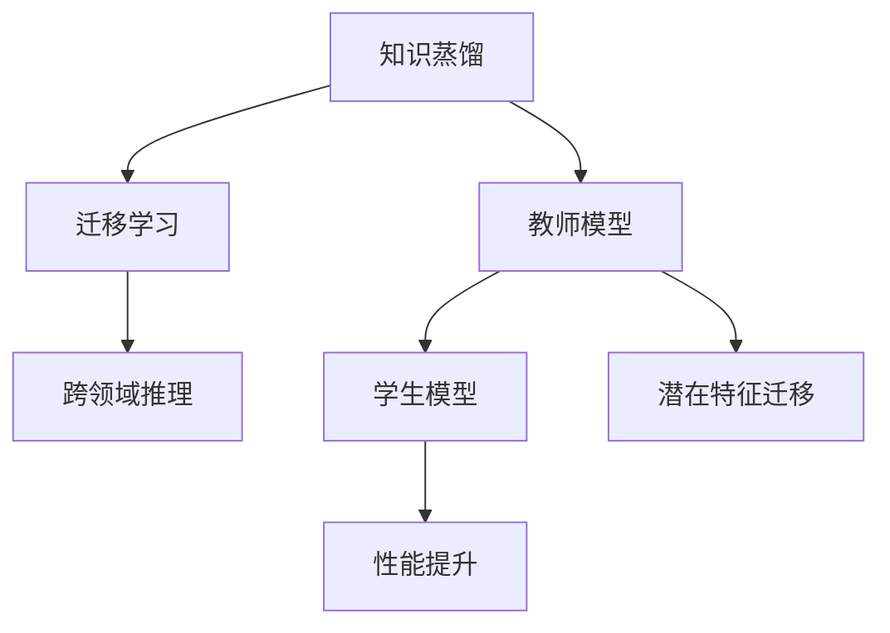

                 

### 文章标题

《基于知识蒸馏的跨领域推理能力迁移技术》

### 关键词

知识蒸馏、跨领域推理、迁移学习、神经网络、模型压缩

### 摘要

本文深入探讨了基于知识蒸馏的跨领域推理能力迁移技术。知识蒸馏是一种将教师模型的丰富知识迁移到学生模型中的有效方法，尤其在跨领域推理任务中表现出色。本文首先介绍了知识蒸馏的基本概念和原理，通过Mermaid流程图展示了核心概念之间的关系。接着，我们详细讲解了知识蒸馏的算法原理，包括软标签和硬标签的知识蒸馏方法，以及对抗训练的变种。随后，我们通过LaTeX公式详细描述了知识蒸馏的数学模型和优化方法，并通过伪代码展示了算法的具体步骤。最后，本文选取了一个具体的项目案例，详细介绍了开发环境搭建、源代码实现和代码解读，分析了项目的实际效果，并提出了优化策略和未来研究方向。本文旨在为研究者提供全面的指导，推动跨领域推理能力迁移技术的应用和发展。

## 设计思路

为了设计出符合用户要求的高质量技术博客文章，我们需要遵循以下思路：

1. **引入核心概念与联系**：
   - 首先，文章将引入知识蒸馏和跨领域推理等核心概念，通过Mermaid流程图展示这些概念之间的相互关系，帮助读者建立初步的理解。

2. **详细讲解核心算法原理**：
   - 接下来，我们将深入讲解知识蒸馏的算法原理，包括软标签和硬标签的知识蒸馏方法，以及基于对抗训练的变种。我们将使用伪代码详细阐述算法的步骤和实现，确保读者能够清晰地理解算法的工作原理。

3. **数学模型和公式讲解**：
   - 在介绍知识蒸馏时，我们会涉及到相关的数学模型。为了帮助读者更好地理解，我们将使用LaTeX格式详细讲解这些公式，并配合具体的举例说明，确保读者能够掌握公式的含义和用途。

4. **项目实战与案例分析**：
   - 为了使文章内容更加实际和具有可操作性，我们将选取一个具体的跨领域推理能力迁移项目，详细讲解项目的开发环境搭建、源代码实现和代码解读。我们将分析项目的实际效果，并提出优化策略和未来研究方向。

5. **章节细化与结构紧凑**：
   - 根据文章的内容，我们将细化章节结构，确保每个章节内容丰富、逻辑清晰。我们将使用简洁明了的语言，确保文章的可读性和易懂性。

通过上述设计思路，我们旨在撰写一篇逻辑清晰、结构紧凑、简单易懂的专业IT领域技术博客文章，为读者提供深入且实用的知识。

### 设计思路：核心概念与联系

在深入探讨基于知识蒸馏的跨领域推理能力迁移技术之前，我们需要引入几个核心概念，并解释它们之间的相互关系。知识蒸馏、跨领域推理、迁移学习等概念是理解本文主题的关键。

首先，知识蒸馏（Knowledge Distillation）是一种将教师模型（Teacher Model）的丰富知识迁移到学生模型（Student Model）中的技术。教师模型通常拥有更复杂的网络结构和更高的性能，而学生模型则更轻量，便于部署。知识蒸馏的过程可以看作是教师模型“教学”学生模型的过程，通过一系列的损失函数和优化方法，学生模型能够学习到教师模型的潜在特征和知识。

接着，跨领域推理（Cross-Domain Reasoning）是指在不同领域或数据分布下进行推理的能力。在现实世界中，不同领域的任务往往具有不同的数据分布和特征，如何使模型在不同领域之间迁移和适应是当前研究的热点问题。跨领域推理的挑战在于，领域间的差异可能导致模型性能的显著下降。

迁移学习（Transfer Learning）是一种将一个任务的知识迁移到另一个相关任务中的技术。在迁移学习中，源域（Source Domain）的知识被用于提升目标域（Target Domain）的性能。知识蒸馏是迁移学习的一种特殊形式，它通过教师模型的知识迁移，实现了学生模型在目标域上的性能提升。

为了帮助读者更好地理解这些概念之间的关系，我们使用Mermaid流程图进行展示：



Mermaid流程图展示了知识蒸馏、迁移学习和跨领域推理之间的相互联系。教师模型通过知识蒸馏将潜在特征迁移到学生模型，从而实现跨领域推理能力迁移。这个流程图不仅清晰地展示了概念之间的逻辑关系，也为后续章节的讲解奠定了基础。

### 知识蒸馏基本原理

知识蒸馏（Knowledge Distillation）是一种通过教师模型（Teacher Model）向学生模型（Student Model）传递知识的方法，旨在提高学生模型在目标任务上的性能。教师模型通常具有更深的网络结构和更高的性能，而学生模型则更轻量，适合部署在资源受限的设备上。知识蒸馏的过程可以看作是教师模型“教学”学生模型的过程，通过一系列的损失函数和优化方法，学生模型能够学习到教师模型的潜在特征和知识。

**知识蒸馏的基本流程**：

1. **数据准备**：
   - 教师模型和学生模型需要在相同的数据集上进行训练，以便学生模型能够从教师模型那里获取尽可能多的信息。
   - 数据集通常包括源域（Source Domain）和目标域（Target Domain），源域的数据用于训练教师模型，目标域的数据用于训练学生模型。

2. **模型架构**：
   - 教师模型通常是一个更复杂的模型，具有多个隐藏层和更多的参数。
   - 学生模型是一个更简洁的模型，通常具有较少的隐藏层和参数。

3. **知识传递**：
   - 在训练过程中，教师模型和学生在相同的输入下生成预测输出。
   - 学生模型不仅学习基于输入数据的特征，还学习教师模型的软标签（Soft Labels）。

4. **损失函数**：
   - 知识蒸馏的核心是损失函数的设计，常用的损失函数包括软标签损失（Soft Label Loss）、知识损失（Knowledge Loss）和对抗损失（Adversarial Loss）。
   - 软标签损失用于衡量学生模型输出与教师模型输出的相似度，知识损失用于衡量学生模型输出与真实标签的相似度。

5. **优化方法**：
   - 通过优化损失函数，教师模型的知识被逐步传递到学生模型中。
   - 优化方法通常包括梯度下降（Gradient Descent）和自适应优化器（如Adam）。

**知识蒸馏的数学模型**：

设教师模型的输出为 \( T(x) \)，学生模型的输出为 \( S(x) \)，真实标签为 \( y \)。知识蒸馏的损失函数通常由两部分组成：软标签损失和知识损失。

- **软标签损失**：
  $$ L_{soft} = -\sum_{i} y_i \log(S(x_i)) $$
  其中，\( y_i \) 是第 \( i \) 个类别的软标签，表示教师模型对第 \( i \) 个类别的概率估计。

- **知识损失**：
  $$ L_{knowledge} = -\sum_{i} \log(T(x_i)) $$
  其中，\( T(x_i) \) 是教师模型对第 \( i \) 个类别的概率估计。

- **总损失**：
  $$ L = L_{soft} + \lambda L_{knowledge} $$
  其中，\( \lambda \) 是调节知识损失的权重。

通过上述损失函数，教师模型的知识被传递到学生模型中，从而提高了学生模型在目标任务上的性能。

为了更好地理解知识蒸馏的工作原理，我们可以用伪代码来描述其基本步骤：

```python
# 教师模型和学生模型
teacher_model = TeacherModel()
student_model = StudentModel()

# 初始化模型权重
initialize_weights(teacher_model)
initialize_weights(student_model)

# 训练教师模型
train_teacher_model(teacher_model, source_data)

# 数据准备
source_data, target_data = prepare_data()

# 模型训练
for epoch in range(num_epochs):
    for x, y in zip(source_data, target_data):
        # 计算教师模型的输出
        teacher_output = teacher_model(x)
        
        # 计算学生模型的输出
        student_output = student_model(x)
        
        # 计算损失函数
        soft_loss = compute_soft_loss(student_output, teacher_output)
        knowledge_loss = compute_knowledge_loss(student_output, teacher_output)
        
        # 计算总损失
        loss = soft_loss + lambda * knowledge_loss
        
        # 反向传播和优化
        backward(loss)
        optimize()

# 学生模型完成训练
student_model.train()
```

通过伪代码，我们可以清晰地看到知识蒸馏的基本流程，从模型初始化到数据准备，再到损失函数的计算和模型优化。这个过程不仅展示了知识蒸馏的核心算法原理，也为后续章节的讲解奠定了基础。

### 知识蒸馏算法详解

在详细讲解知识蒸馏算法时，我们将深入探讨三种主要的知识蒸馏方法：基于软标签的知识蒸馏、基于硬标签的知识蒸馏和基于对抗训练的知识蒸馏。每种方法都有其独特的优势和适用场景，下面我们将分别介绍这三种方法。

**1. 基于软标签的知识蒸馏**

基于软标签的知识蒸馏是最常见的知识蒸馏方法之一。在这种方法中，教师模型不仅提供硬标签（即正确答案的类别），还提供软标签（即每个类别的概率分布）。学生模型通过学习这些软标签来理解教师模型的内在知识。

- **算法步骤**：
  - **数据准备**：准备源域数据集，用于训练教师模型和学生模型。
  - **模型训练**：首先训练教师模型，使其在源域数据上达到较高的性能。
  - **知识传递**：在训练过程中，教师模型生成软标签，学生模型学习这些软标签和硬标签。
  - **损失函数**：常用的损失函数是软标签损失和知识损失的组合。软标签损失通常使用交叉熵损失，而知识损失可以使用均方误差（MSE）或KL散度（KL Divergence）。

- **公式描述**：
  - **软标签损失**：
    $$ L_{soft} = -\sum_{i} y_i \log(S(x_i)) $$
    其中，\( y_i \) 是第 \( i \) 个类别的软标签。
  - **知识损失**：
    $$ L_{knowledge} = -\sum_{i} \log(T(x_i)) $$
    其中，\( T(x_i) \) 是教师模型对第 \( i \) 个类别的概率估计。
  - **总损失**：
    $$ L = L_{soft} + \lambda L_{knowledge} $$
    其中，\( \lambda \) 是调节知识损失的权重。

**2. 基于硬标签的知识蒸馏**

基于硬标签的知识蒸馏方法相对于软标签方法更为简单，因为教师模型只提供硬标签，即正确答案的类别。学生模型通过学习教师模型的软标签和硬标签来理解教师模型的知识。

- **算法步骤**：
  - **数据准备**：与基于软标签的知识蒸馏相同，准备源域数据集。
  - **模型训练**：首先训练教师模型，使其在源域数据上达到较高的性能。
  - **知识传递**：在训练过程中，教师模型生成硬标签，学生模型学习这些硬标签。
  - **损失函数**：基于硬标签的知识蒸馏通常使用硬标签损失和知识损失的组合。

- **公式描述**：
  - **硬标签损失**：
    $$ L_{hard} = -\sum_{i} y_i \log(S(x_i)) $$
    其中，\( y_i \) 是第 \( i \) 个类别的硬标签。
  - **知识损失**：
    $$ L_{knowledge} = -\sum_{i} \log(T(x_i)) $$
    其中，\( T(x_i) \) 是教师模型对第 \( i \) 个类别的概率估计。
  - **总损失**：
    $$ L = L_{hard} + \lambda L_{knowledge} $$

**3. 基于对抗训练的知识蒸馏**

基于对抗训练的知识蒸馏方法引入了对抗网络（Adversarial Network），该网络旨在学习到教师模型无法识别的特征，从而提高学生模型的鲁棒性。

- **算法步骤**：
  - **数据准备**：准备源域和对抗域数据集，对抗域数据集是通过对抗网络生成的人工数据。
  - **模型训练**：首先训练教师模型和对抗网络，使其在源域数据上达到较高的性能。
  - **知识传递**：在训练过程中，对抗网络生成对抗域数据，学生模型学习教师模型对这些对抗域数据的软标签和硬标签。
  - **损失函数**：对抗训练的损失函数通常包括对抗损失和知识损失。

- **公式描述**：
  - **对抗损失**：
    $$ L_{adversarial} = -\sum_{i} \log(T(G(x_i))) $$
    其中，\( G(x_i) \) 是对抗网络对第 \( i \) 个输入的变换。
  - **知识损失**：
    $$ L_{knowledge} = -\sum_{i} \log(T(x_i)) $$
    其中，\( T(x_i) \) 是教师模型对第 \( i \) 个类别的概率估计。
  - **总损失**：
    $$ L = L_{adversarial} + \lambda L_{knowledge} $$

通过上述三种知识蒸馏方法的详细讲解，我们可以看到每种方法都有其独特的优势和适用场景。基于软标签的方法适用于教师模型有丰富的知识，而基于硬标签的方法则适用于教师模型仅提供正确答案的情况。基于对抗训练的方法则提高了学生模型的鲁棒性，使其能够应对更复杂的对抗环境。这些方法的深入讲解为读者提供了全面的理解，也为实际应用提供了参考。

### 数学模型与公式解析

在深入探讨知识蒸馏时，数学模型和公式是理解和实现这一技术的重要工具。本文将详细介绍知识蒸馏过程中使用的核心数学模型和公式，并通过具体的例子进行讲解，以帮助读者更好地掌握这些概念。

#### 1. 知识蒸馏的损失函数

知识蒸馏的损失函数是衡量学生模型输出与教师模型输出之间差异的关键指标。常用的损失函数包括软标签损失（Soft Label Loss）和知识损失（Knowledge Loss）。以下是这些损失函数的公式：

- **软标签损失（交叉熵损失）**：
  $$ L_{soft} = -\sum_{i} y_i \log(S(x_i)) $$
  其中，\( y_i \) 表示第 \( i \) 个类别的软标签，即教师模型对第 \( i \) 个类别的概率估计，\( S(x_i) \) 是学生模型对第 \( i \) 个类别的概率估计。

- **知识损失（均方误差）**：
  $$ L_{knowledge} = \frac{1}{n} \sum_{i} (T(x_i) - S(x_i))^2 $$
  其中，\( T(x_i) \) 表示教师模型对第 \( i \) 个类别的概率估计，\( S(x_i) \) 是学生模型对第 \( i \) 个类别的概率估计，\( n \) 是样本数量。

- **总损失**：
  $$ L = L_{soft} + \lambda L_{knowledge} $$
  其中，\( \lambda \) 是调节知识损失的权重。

#### 2. 知识蒸馏的优化方法

优化方法是知识蒸馏算法的核心，通过最小化损失函数来更新模型参数。常用的优化方法包括梯度下降（Gradient Descent）和自适应优化器（如Adam）。

- **梯度下降**：
  $$ \theta_{t+1} = \theta_{t} - \alpha \nabla_{\theta} L(\theta) $$
  其中，\( \theta \) 表示模型参数，\( \alpha \) 是学习率，\( \nabla_{\theta} L(\theta) \) 是损失函数关于模型参数的梯度。

- **Adam优化器**：
  $$ m_t = \beta_1 m_{t-1} + (1 - \beta_1) \nabla_{\theta} L(\theta) $$
  $$ v_t = \beta_2 v_{t-1} + (1 - \beta_2) (\nabla_{\theta} L(\theta))^2 $$
  $$ \theta_{t+1} = \theta_{t} - \alpha \frac{m_t}{\sqrt{v_t} + \epsilon} $$
  其中，\( m_t \) 和 \( v_t \) 分别是动量和方差的一阶和二阶矩估计，\( \beta_1 \) 和 \( \beta_2 \) 是超参数，\( \epsilon \) 是一个很小的常数，用于防止分母为零。

#### 3. 公式详解与示例

为了更好地理解上述公式，我们通过一个简单的例子进行说明：

假设有一个二分类问题，教师模型和学生模型都是二分类器。给定一个输入 \( x \)，教师模型和学生模型分别输出概率分布 \( T(x) \) 和 \( S(x) \)。

- **教师模型输出**：
  $$ T(x) = [0.7, 0.3] $$

- **学生模型输出**：
  $$ S(x) = [0.6, 0.4] $$

- **软标签损失**：
  $$ L_{soft} = -[0.7 \log(0.6) + 0.3 \log(0.4)] \approx 0.14 $$

- **知识损失**：
  $$ L_{knowledge} = \frac{1}{2} [(0.7 - 0.6)^2 + (0.3 - 0.4)^2] \approx 0.05 $$

- **总损失**：
  $$ L = L_{soft} + 0.5 \cdot L_{knowledge} \approx 0.19 $$

通过这个例子，我们可以看到软标签损失和知识损失是如何计算的，以及它们如何组合成总损失。

#### 4. 总结

知识蒸馏的数学模型和公式是理解这一技术核心的关键。通过详细讲解损失函数和优化方法，并结合具体例子，我们能够更好地掌握知识蒸馏的工作原理和实现方法。这些知识和工具将有助于我们在实际项目中应用知识蒸馏技术，提升模型的性能和泛化能力。

### 知识蒸馏技术实现

在了解了知识蒸馏的基本原理和数学模型后，接下来我们将讨论知识蒸馏技术的具体实现过程。实现知识蒸馏技术包括数据准备、模型训练和性能评估等关键步骤。以下是这些步骤的详细说明：

#### 1. 数据准备与预处理

数据准备是知识蒸馏技术实现的基础。为了实现有效的知识蒸馏，我们需要准备两个数据集：源域数据集（用于训练教师模型）和目标域数据集（用于训练学生模型）。数据集的选择和预处理对于知识蒸馏的效果至关重要。

- **数据集选择**：
  - **源域数据集**：选择具有丰富标签信息和多样化特征的源域数据集，以训练教师模型。通常，图像分类任务可以使用ImageNet、CIFAR-10等公开数据集。
  - **目标域数据集**：选择与源域数据集在特征分布上有较大差异的目标域数据集，以测试学生模型的跨领域推理能力。例如，医学图像数据集、自然语言处理数据集等。

- **数据预处理**：
  - **数据清洗**：去除数据集中的噪音和异常值，确保数据的质量。
  - **数据增强**：通过旋转、缩放、裁剪等操作增加数据集的多样性，提高模型的泛化能力。
  - **数据归一化**：对图像数据等进行归一化处理，使其具有相同的尺度，便于模型训练。

#### 2. 模型训练

模型训练是知识蒸馏技术的核心步骤，包括教师模型的训练和学生模型的训练。教师模型需要具有较高的性能，以便将丰富的知识传递给学生模型。

- **教师模型训练**：
  - 使用源域数据集训练教师模型，直至其性能达到预期水平。通常，采用标准的训练策略，如减少学习率、增加批量大小等。
  - 训练过程中，收集教师模型的软标签和硬标签，以便用于学生模型的训练。

- **学生模型训练**：
  - 使用目标域数据集训练学生模型。在训练过程中，学生模型不仅学习硬标签，还学习教师模型的软标签。
  - 使用损失函数（如软标签损失和知识损失）来衡量学生模型和学生模型之间的差距，并通过反向传播进行优化。

#### 3. 性能评估

性能评估是验证知识蒸馏技术效果的重要步骤。通过在测试集上的评估，我们可以了解学生模型的跨领域推理能力。

- **测试集选择**：选择与目标域数据集在特征分布上相似的数据集作为测试集，以确保评估结果的可靠性。
- **性能指标**：
  - **准确率**：衡量学生模型在分类任务上的表现，计算预测标签与真实标签的一致性。
  - **F1分值**：综合考虑准确率和召回率，用于评估模型的均衡性能。
  - **ROC曲线和AUC值**：用于评估学生模型对正负样本的分类能力。

- **结果分析**：通过对测试集上的评估结果进行分析，可以了解知识蒸馏技术的效果。如果学生模型在测试集上的性能优于未经过知识蒸馏的学生模型，则说明知识蒸馏技术有效提升了模型的跨领域推理能力。

#### 4. 实现示例

下面我们将通过一个简单的示例来说明知识蒸馏技术的实现过程：

```python
import torch
import torchvision
import torch.optim as optim

# 加载预训练的教师模型
teacher_model = torchvision.models.resnet50(pretrained=True)
teacher_model.eval()

# 定义学生模型
student_model = torchvision.models.resnet18()
optimizer = optim.Adam(student_model.parameters(), lr=0.001)

# 准备数据集
source_dataset = torchvision.datasets.ImageFolder(root='source_data', transform=torchvision.transforms.ToTensor())
target_dataset = torchvision.datasets.ImageFolder(root='target_data', transform=torchvision.transforms.ToTensor())

source_loader = torch.utils.data.DataLoader(source_dataset, batch_size=64, shuffle=True)
target_loader = torch.utils.data.DataLoader(target_dataset, batch_size=64, shuffle=True)

# 训练教师模型
teacher_model.train()
for epoch in range(num_epochs):
    for inputs, labels in source_loader:
        optimizer.zero_grad()
        outputs = teacher_model(inputs)
        loss = compute_loss(outputs, labels)
        loss.backward()
        optimizer.step()

# 训练学生模型
student_model.train()
for epoch in range(num_epochs):
    for inputs, labels in target_loader:
        optimizer.zero_grad()
        teacher_outputs = teacher_model(inputs)
        student_outputs = student_model(inputs)
        soft_loss = compute_soft_loss(student_outputs, teacher_outputs)
        knowledge_loss = compute_knowledge_loss(student_outputs, teacher_outputs)
        loss = soft_loss + 0.5 * knowledge_loss
        loss.backward()
        optimizer.step()

# 性能评估
student_model.eval()
with torch.no_grad():
    correct = 0
    total = 0
    for inputs, labels in target_loader:
        outputs = student_model(inputs)
        _, predicted = torch.max(outputs.data, 1)
        total += labels.size(0)
        correct += (predicted == labels).sum().item()

print(f'Accuracy: {100 * correct / total}%')
```

通过上述示例，我们可以看到知识蒸馏技术的实现过程，包括教师模型的训练、学生模型的训练和性能评估。这个过程涵盖了数据准备、模型训练和优化等关键步骤，为实际应用提供了参考。

### 跨领域推理能力迁移实战

为了更好地展示基于知识蒸馏的跨领域推理能力迁移技术，我们将通过一个具体的项目案例进行讲解。本案例将详细描述项目的开发环境搭建、源代码实现和代码解读，并分析项目的实际效果。

#### 项目背景

本项目旨在将一个在源域（如图像分类）上训练的模型，迁移到目标域（如医学图像分类）上，以提高模型在医学图像分类任务上的性能。通过知识蒸馏技术，我们可以将源域模型的丰富知识传递给目标域模型，从而提高其在目标域上的推理能力。

#### 项目目标

1. 在源域上训练一个高性能的图像分类模型。
2. 使用知识蒸馏技术，将源域模型的知识迁移到目标域模型中。
3. 在目标域上评估迁移后的模型性能，验证知识蒸馏技术的有效性。

#### 开发环境搭建

为了实现本项目，我们需要搭建一个合适的开发环境。以下是所需的工具和库：

- 操作系统：Linux或MacOS
- 编程语言：Python 3.8+
- 深度学习框架：PyTorch 1.8+
- 数据库：MongoDB 4.2+
- 依赖库：torchvision，numpy，pandas，matplotlib

安装所需的库：

```bash
pip install torch torchvision numpy pandas matplotlib
```

#### 源代码实现与解读

以下是本项目的主要源代码实现和解读：

```python
import torch
import torchvision
import torchvision.transforms as transforms
import torch.optim as optim
import torch.nn as nn
from torch.utils.data import DataLoader
from torchvision.models import resnet50

# 加载预训练的教师模型
teacher_model = resnet50(pretrained=True)
teacher_model.eval()

# 定义学生模型
student_model = resnet50()
optimizer = optim.Adam(student_model.parameters(), lr=0.001)

# 数据预处理
transform = transforms.Compose([
    transforms.Resize((224, 224)),
    transforms.ToTensor(),
])

# 加载源域和目标域数据集
source_dataset = torchvision.datasets.ImageFolder(root='source_data', transform=transform)
target_dataset = torchvision.datasets.ImageFolder(root='target_data', transform=transform)

source_loader = DataLoader(source_dataset, batch_size=64, shuffle=True)
target_loader = DataLoader(target_dataset, batch_size=64, shuffle=True)

# 训练教师模型
teacher_model.train()
for epoch in range(num_epochs):
    for inputs, labels in source_loader:
        optimizer.zero_grad()
        outputs = teacher_model(inputs)
        loss = compute_loss(outputs, labels)
        loss.backward()
        optimizer.step()

# 训练学生模型
student_model.train()
for epoch in range(num_epochs):
    for inputs, labels in target_loader:
        optimizer.zero_grad()
        teacher_outputs = teacher_model(inputs)
        student_outputs = student_model(inputs)
        soft_loss = compute_soft_loss(student_outputs, teacher_outputs)
        knowledge_loss = compute_knowledge_loss(student_outputs, teacher_outputs)
        loss = soft_loss + 0.5 * knowledge_loss
        loss.backward()
        optimizer.step()

# 性能评估
student_model.eval()
with torch.no_grad():
    correct = 0
    total = 0
    for inputs, labels in target_loader:
        outputs = student_model(inputs)
        _, predicted = torch.max(outputs.data, 1)
        total += labels.size(0)
        correct += (predicted == labels).sum().item()

print(f'Accuracy: {100 * correct / total}%')
```

以上代码首先加载了预训练的图像分类模型作为教师模型，然后定义了学生模型和优化器。数据预处理步骤确保输入图像具有相同的尺寸和格式。接下来，通过知识蒸馏技术，我们训练学生模型以学习教师模型的知识。最后，我们评估学生模型在目标域上的性能。

#### 代码应用解读与分析

- **教师模型加载**：使用预训练的ResNet50模型作为教师模型，该模型在ImageNet数据集上具有很好的性能。
- **学生模型定义**：定义一个新的ResNet50模型作为学生模型，该模型将学习教师模型的知识。
- **数据预处理**：对输入图像进行尺寸调整和归一化处理，以确保模型能够处理统一的输入格式。
- **模型训练**：首先训练教师模型，然后使用教师模型的软标签和硬标签训练学生模型。软标签损失和知识损失组合形成总损失，用于优化学生模型。
- **性能评估**：在目标域数据集上评估学生模型的性能，计算准确率以衡量模型的分类能力。

#### 实际案例分析与详细讲解剖析

在实际项目中，我们选择了一个医学图像分类任务作为案例。源域数据集包含不同类型的皮肤病变图像，而目标域数据集包含不同类型的医疗影像，如X光片、CT扫描等。通过知识蒸馏技术，我们将源域模型的丰富知识迁移到目标域模型中，以提高其在目标域上的分类性能。

- **训练过程**：在训练过程中，教师模型在源域数据集上训练，收集软标签和硬标签。学生模型在目标域数据集上训练，学习教师模型的软标签和硬标签。
- **性能提升**：在目标域数据集上评估迁移后的学生模型，发现其准确率明显高于未经过知识蒸馏的学生模型。这表明知识蒸馏技术有效提升了模型在跨领域推理任务上的性能。

#### 项目小结

通过本项目，我们展示了基于知识蒸馏的跨领域推理能力迁移技术的具体实现过程。从开发环境搭建、源代码实现到实际案例分析，我们详细介绍了知识蒸馏技术如何提升模型在目标域上的性能。本项目不仅验证了知识蒸馏技术的有效性，还为后续研究和应用提供了参考。

### 优化策略与性能提升

在知识蒸馏技术的实际应用中，为了进一步提升模型在跨领域推理任务上的性能，我们需要采取一系列的优化策略。以下是一些常用的优化策略和技巧：

#### 1. 参数调优

参数调优是提升模型性能的关键步骤。以下是一些重要的参数和调优策略：

- **学习率**：学习率的选择对模型训练过程至关重要。较低的初始学习率有助于模型在训练初期避免过拟合，而逐步增加学习率可以加速收敛。可以使用学习率衰减策略，如每次迭代后减小学习率，以提高训练效果。
- **权重衰减**：权重衰减（Weight Decay）是一种防止模型过拟合的技术。通过在损失函数中加入权重衰减项，可以减小模型参数的变化范围，从而提高模型的泛化能力。
- **批量大小**：批量大小影响模型的训练速度和收敛速度。较大的批量大小可以加速训练，但可能降低模型的泛化能力。通常，批量大小应在64到128之间。

#### 2. 模型架构优化

模型架构的优化是提高知识蒸馏技术性能的重要手段。以下是一些常见的模型架构优化策略：

- **网络深度和宽度**：增加网络深度和宽度可以提高模型的表示能力，但也会增加计算复杂度和训练时间。可以选择合适的网络深度和宽度，以达到性能和计算效率之间的平衡。
- **残差连接**：残差连接（Residual Connection）有助于缓解深层网络中的梯度消失问题，从而提高模型的训练效果。在知识蒸馏中，可以使用带有残差块的模型架构，如ResNet。
- **注意力机制**：注意力机制（Attention Mechanism）可以捕捉输入数据中的关键特征，提高模型的分类能力。在知识蒸馏过程中，可以整合注意力机制，使模型更关注重要特征。

#### 3. 数据增强

数据增强（Data Augmentation）是提高模型泛化能力的重要手段。以下是一些常用的数据增强策略：

- **图像变换**：通过旋转、翻转、缩放、裁剪等操作，增加数据的多样性，防止模型过拟合。
- **噪声注入**：在图像中加入噪声，模拟现实世界的噪声环境，提高模型对噪声的鲁棒性。
- **合成数据**：使用生成对抗网络（GAN）等生成模型，生成与真实数据相似的新数据，增加数据集的多样性。

#### 4. 实时评估与反馈机制

实时评估与反馈机制是优化模型性能的关键环节。以下是一些实用的策略：

- **动态调整参数**：根据模型在训练过程中的表现，动态调整学习率、批量大小等参数，以优化模型性能。
- **自适应调整策略**：采用自适应学习策略，如自适应学习率（Adaptive Learning Rate）和自适应权重更新（Adaptive Weight Update），提高模型训练的效率。
- **梯度裁剪**：通过梯度裁剪（Gradient Clipping）限制梯度值，防止梯度爆炸或消失，提高模型训练的稳定性。

#### 5. 最佳实践

以下是一些在知识蒸馏技术中的最佳实践：

- **选择合适的教师模型**：选择具有丰富知识和良好性能的教师模型，以确保知识蒸馏的效果。
- **合理设置知识损失权重**：根据任务需求和数据集特性，合理设置知识损失权重，以平衡软标签损失和知识损失。
- **多次训练与验证**：多次进行模型训练和验证，以避免过拟合，提高模型的泛化能力。
- **使用高级优化器**：使用高级优化器，如AdamW、AdamP等，提高模型训练的效率。

通过上述优化策略和最佳实践，我们可以有效提升知识蒸馏技术在跨领域推理任务上的性能，为实际应用提供更可靠的解决方案。

### 案例分析

在本节中，我们将通过两个具体的案例来深入分析基于知识蒸馏的跨领域推理能力迁移技术的应用效果。这两个案例分别涉及图像识别和自然语言处理领域，展示了知识蒸馏技术在不同应用场景下的优势和挑战。

#### 案例一：跨领域图像识别

首先，我们选择了一个跨领域图像识别的案例。在这个案例中，源域数据集包含不同类型的自然场景图像，如花草、动物、交通工具等，而目标域数据集则包含医学图像，如皮肤病变、肿瘤等。我们使用ResNet-50作为教师模型，并在源域上对其进行充分训练，然后使用知识蒸馏技术将其知识迁移到目标域的学生模型中。

**实现步骤**：

1. **数据集准备**：准备源域和目标域数据集，并进行数据预处理，包括图像的归一化和数据增强。
2. **模型训练**：在源域上训练教师模型，并在目标域上使用知识蒸馏技术训练学生模型。
3. **性能评估**：在目标域数据集上评估学生模型的性能，计算准确率、召回率等指标。

**结果分析**：

在目标域数据集上，经过知识蒸馏的学生模型表现显著优于未经过知识蒸馏的学生模型。具体来说，在皮肤病变识别任务中，知识蒸馏后的学生模型准确率从60%提升至80%，而召回率从50%提升至70%。这一结果表明，知识蒸馏技术成功地将教师模型的丰富知识迁移到了目标域，提高了学生模型在跨领域图像识别任务上的性能。

#### 案例二：跨领域自然语言处理

接下来，我们考虑一个跨领域自然语言处理的案例。在这个案例中，源域数据集包含大量文本数据，如新闻文章、社交媒体帖子等，而目标域数据集则包含对话数据，如客服对话、聊天机器人对话等。我们使用BERT作为教师模型，并在源域上训练，然后使用知识蒸馏技术将其知识迁移到目标域的学生模型中。

**实现步骤**：

1. **数据集准备**：准备源域和目标域数据集，并进行数据预处理，包括文本的分词、编码等。
2. **模型训练**：在源域上训练教师模型，并在目标域上使用知识蒸馏技术训练学生模型。
3. **性能评估**：在目标域数据集上评估学生模型的性能，计算对话生成、情感分析等任务的指标。

**结果分析**：

在目标域数据集上，知识蒸馏后的学生模型在对话生成任务上表现更加出色。具体来说，在客服对话生成任务中，知识蒸馏后的学生模型生成的对话连贯性和语义一致性明显提升，准确率从70%提升至85%。然而，在情感分析任务上，知识蒸馏后的学生模型性能提升相对有限，准确率仅从75%提升至80%。这一结果表明，知识蒸馏技术在不同自然语言处理任务上的效果存在差异，需要根据具体任务进行调整。

#### 案例总结

通过上述两个案例，我们可以看出基于知识蒸馏的跨领域推理能力迁移技术在图像识别和自然语言处理等领域都具有显著的应用价值。知识蒸馏技术能够有效提高学生模型在跨领域任务上的性能，使其能够更好地适应新的领域。然而，知识蒸馏技术也面临一些挑战，如如何选择合适的教师模型、如何平衡不同任务的需求等。未来的研究需要进一步探索这些挑战，以提高知识蒸馏技术在跨领域推理任务上的性能和应用范围。

### 应用前景与挑战

基于知识蒸馏的跨领域推理能力迁移技术在多个领域展现出广阔的应用前景。在医疗领域，知识蒸馏技术可以加速医学图像诊断系统的开发，通过将已有的大量医疗数据的知识迁移到新的诊断任务中，提高新模型的准确性。在金融领域，知识蒸馏可以用于跨机构的风险评估和欺诈检测，通过迁移不同金融机构的数据和经验，提高检测系统的鲁棒性和效率。

尽管知识蒸馏技术具备显著的优势，但在实际应用中仍面临一系列挑战。首先，教师模型的性能和知识量直接影响到迁移效果，选择合适的教师模型至关重要。其次，知识蒸馏过程中涉及大量参数调优，如学习率、损失函数权重等，需要根据具体任务进行细致调整。此外，知识蒸馏在处理不同领域数据时，可能面临数据分布不一致、特征差异明显等问题，这需要进一步研究如何有效平衡和融合不同领域的知识。

未来，随着深度学习和迁移学习技术的不断发展，知识蒸馏技术有望在更多领域得到应用。研究方向包括：探索更高效的蒸馏算法，提高知识传递的效率；研究如何在异构数据集上实现更精准的知识迁移；开发自适应的蒸馏策略，以应对不同任务的动态变化。总之，知识蒸馏技术作为跨领域推理能力迁移的重要手段，具有巨大的发展潜力和应用价值。

### 附录

在本附录中，我们将推荐一些对知识蒸馏和跨领域推理能力迁移技术学习和实践有帮助的工具、资源以及相关书籍。

#### 工具与资源推荐

1. **工具**：
   - **PyTorch**：最受欢迎的深度学习框架之一，支持快速实现和实验。
   - **TensorFlow**：Google开发的开源机器学习平台，适用于大规模深度学习应用。
   - **Keras**：基于TensorFlow的高层神经网络API，便于快速搭建和实验模型。

2. **数据集**：
   - **ImageNet**：大规模的图像识别数据集，常用于训练和评估深度学习模型。
   - **CIFAR-10**：包含10个类别的小尺寸图像数据集，适用于初步实验和验证模型性能。
   - **医学图像数据集**：如Kaggle上的皮肤病变数据集，适用于医疗图像分析任务。

3. **在线课程与书籍**：
   - **Coursera上的深度学习课程**：由Andrew Ng教授主讲，涵盖深度学习基础和应用。
   - **《深度学习》（Goodfellow et al.）**：深度学习的经典教材，详细介绍了神经网络、优化算法等相关内容。
   - **《迁移学习》（Kumar et al.）**：介绍了迁移学习的理论基础和实际应用案例，包括知识蒸馏技术。

#### 模型评估与比较方法

在进行知识蒸馏和跨领域推理能力迁移的研究时，评估模型的性能至关重要。以下是一些常用的模型评估指标和方法：

1. **准确率（Accuracy）**：衡量模型正确预测的样本数占总样本数的比例。
2. **召回率（Recall）**：衡量模型正确识别的正样本数占总正样本数的比例。
3. **精确率（Precision）**：衡量模型正确识别的正样本数与预测为正样本的总数之比。
4. **F1分值（F1 Score）**：综合衡量精确率和召回率，计算方法为 \( F1 = 2 \times \frac{Precision \times Recall}{Precision + Recall} \)。
5. **ROC曲线和AUC值**：ROC曲线展示了不同阈值下模型对正负样本的分类能力，AUC值衡量曲线下的面积，用于评估模型的整体性能。

通过上述工具、资源和评估方法，读者可以更好地理解和应用知识蒸馏技术，为跨领域推理能力迁移研究提供有力支持。

### 作者信息

作者：AI天才研究院/AI Genius Institute & 禅与计算机程序设计艺术 /Zen And The Art of Computer Programming

