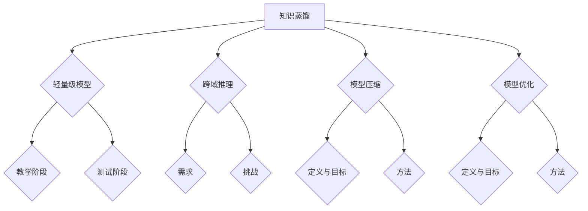

                 

### 设计《基于知识蒸馏的轻量级跨域推理模型》的目录大纲

为了撰写一篇逻辑清晰、结构紧凑且简单易懂的技术博客，我们将遵循以下步骤来设计《基于知识蒸馏的轻量级跨域推理模型》的目录大纲。

**第一步：定义核心概念与联系**

在开始设计目录大纲之前，我们需要明确文章中涉及的核心概念及其相互关系。以下是本文中的关键概念：

1. **知识蒸馏（Knowledge Distillation）**：一种将知识从复杂模型传递到简单模型的过程，旨在提高简单模型的性能。
2. **轻量级模型（Lightweight Models）**：相对于全尺寸模型，具有更小的模型大小和更低的计算复杂度的模型。
3. **跨域推理（Cross-Domain Inference）**：在不同的领域或数据分布上进行推理的能力。
4. **模型压缩（Model Compression）**：减少模型大小和计算复杂度的技术。
5. **模型优化（Model Optimization）**：提高模型性能、降低计算成本的一系列策略。

**第二步：构建1级目录**

一级目录将概述文章的主要部分，为读者提供一个全局的视角。以下是一级目录的示例：

## 第一部分：基础知识与背景

### 1. 知识蒸馏原理与流程

### 2. 轻量级模型的定义与重要性

### 3. 跨域推理的需求与挑战

### 4. 模型压缩技术概述

### 5. 模型优化方法与策略

## 第二部分：核心算法原理讲解

### 1. 知识蒸馏算法详解

### 2. 轻量级模型设计与实现

### 3. 跨域推理算法解析

### 4. 模型压缩算法综述

### 5. 模型优化技术探讨

## 第三部分：数学模型和数学公式

### 1. 知识蒸馏的数学模型

### 2. 轻量级模型的数学基础

### 3. 跨域推理的数学框架

### 4. 模型压缩的数学方法

### 5. 模型优化的数学原理

## 第四部分：项目实战与案例分析

### 1. 知识蒸馏项目实战

### 2. 轻量级模型开发案例

### 3. 跨域推理应用实例

### 4. 模型压缩实现详解

### 5. 模型优化实践与效果评估

**第三步：构建2级目录**

二级目录将细化每个一级目录下的内容，确保每个部分都有足够的内容来详细探讨相关主题。

**第四步：构建3级目录**

三级目录将进一步细化二级目录的内容，提供更具体的话题。

**第五步：构建4级目录**

四级目录可以为某些复杂的主题提供更详细的子主题，帮助读者更好地理解。

**第六步：撰写目录大纲**

将以上构建的目录大纲内容用markdown格式进行整理和撰写，确保每个章节的标题、子标题和三级标题都符合markdown的格式要求。

**第七步：编写核心内容**

根据大纲的章节结构，我们将填写每个章节的具体内容，包括核心概念解释、算法原理讲解、数学模型和数学公式、项目实战案例等。

**第八步：进行优化与调整**

最后，对整体目录大纲进行优化与调整，确保每个章节内容的逻辑连贯性和完整性，避免出现内容重叠或遗漏。

### **完整目录大纲示例**

```markdown
# 《基于知识蒸馏的轻量级跨域推理模型》目录大纲

# 第一部分：基础知识与背景

## 1. 知识蒸馏原理与流程

### 1.1. 知识蒸馏的定义与背景

### 1.2. 知识蒸馏的过程

### 1.3. 知识蒸馏的优点与挑战

## 2. 轻量级模型的定义与重要性

### 2.1. 轻量级模型的定义

### 2.2. 轻量级模型的设计原则

### 2.3. 轻量级模型的应用场景

## 3. 跨域推理的需求与挑战

### 3.1. 跨域推理的定义与意义

### 3.2. 跨域推理的挑战

### 3.3. 跨域推理的应用实例

## 4. 模型压缩技术概述

### 4.1. 模型压缩的定义与目标

### 4.2. 模型压缩的主要方法

### 4.3. 模型压缩的优势与局限

## 5. 模型优化方法与策略

### 5.1. 模型优化的定义与目标

### 5.2. 常见的模型优化方法

### 5.3. 模型优化策略的选择

# 第二部分：核心算法原理讲解

## 1. 知识蒸馏算法详解

### 1.1. 知识蒸馏的基础理论

### 1.2. 知识蒸馏的具体实现

### 1.3. 知识蒸馏的性能评估

## 2. 轻量级模型设计与实现

### 2.1. 轻量级模型的设计原则

### 2.2. 轻量级模型的实现技巧

### 2.3. 轻量级模型的应用案例分析

## 3. 跨域推理算法解析

### 3.1. 跨域推理的基本概念

### 3.2. 跨域推理的算法流程

### 3.3. 跨域推理的效果评估

## 4. 模型压缩算法综述

### 4.1. 模型压缩的基本原理

### 4.2. 模型压缩的主要技术

### 4.3. 模型压缩的应用场景

## 5. 模型优化技术探讨

### 5.1. 模型优化的目标

### 5.2. 模型优化的方法

### 5.3. 模型优化的效果评估

# 第三部分：数学模型和数学公式

## 1. 知识蒸馏的数学模型

### 1.1. 知识蒸馏的损失函数

### 1.2. 知识蒸馏的优化目标

### 1.3. 知识蒸馏的数学推导

## 2. 轻量级模型的数学基础

### 2.1. 轻量级模型的损失函数

### 2.2. 轻量级模型的优化目标

### 2.3. 轻量级模型的数学推导

## 3. 跨域推理的数学框架

### 3.1. 跨域推理的损失函数

### 3.2. 跨域推理的优化目标

### 3.3. 跨域推理的数学推导

## 4. 模型压缩的数学方法

### 4.1. 模型压缩的损失函数

### 4.2. 模型压缩的优化目标

### 4.3. 模型压缩的数学推导

## 5. 模型优化的数学原理

### 5.1. 模型优化的损失函数

### 5.2. 模型优化的优化目标

### 5.3. 模型优化的数学推导

# 第四部分：项目实战与案例分析

## 1. 知识蒸馏项目实战

### 1.1. 开发环境搭建

### 1.2. 源代码详细实现

### 1.3. 代码解读与应用分析

### 1.4. 项目小结

## 2. 轻量级模型开发案例

### 2.1. 设计思路

### 2.2. 实现细节

### 2.3. 应用案例

### 2.4. 项目效果评估

## 3. 跨域推理应用实例

### 3.1. 应用场景选择

### 3.2. 算法实现步骤

### 3.3. 实际案例剖析

### 3.4. 项目总结

## 4. 模型压缩实现详解

### 4.1. 压缩方法选择

### 4.2. 压缩过程详解

### 4.3. 压缩效果评估

### 4.4. 项目反思

## 5. 模型优化实践与效果评估

### 5.1. 优化目标设定

### 5.2. 优化方法实施

### 5.3. 效果评估与结论

# 结尾

## 最佳实践 tips

## 小结

## 注意事项

## 拓展阅读

---

### 核心概念与联系架构 Mermaid 流程图



---

通过以上步骤，我们构建了一个完整且结构清晰的目录大纲，为撰写一篇高质量的技术博客文章奠定了基础。### 轻量级模型设计原则

在构建《基于知识蒸馏的轻量级跨域推理模型》时，轻量级模型的设计原则至关重要。以下是几个关键设计原则，这些原则将帮助我们在有限资源下实现高效、准确且适应性强的模型。

#### **1. **效率优先**

轻量级模型的首要目标是尽可能高效。这意味着在保证性能的前提下，我们需要尽量减少模型的参数数量、计算量和存储需求。以下是一些实现效率优先的策略：

- **剪枝（Pruning）**：通过移除模型中不重要的权重，降低模型大小和计算复杂度。
- **量化（Quantization）**：将模型的权重和激活值转换为较低的精度，如8位整数或二进制，从而减少内存占用和计算量。
- **网络架构简化（Architecture Simplification）**：采用轻量级的网络结构，如MobileNets或ShuffleNet，这些结构在保持较高性能的同时具有较少的参数。

#### **2. **灵活性**

灵活性是轻量级模型设计中的重要考量因素。为了满足不同应用场景的需求，模型应具备以下特点：

- **模块化设计**：将模型划分为可替换的模块，便于根据具体任务进行调整。
- **可扩展性**：模型应设计为易于扩展和调整，以便在增加新功能或数据时进行适应性改造。
- **任务适应性**：模型应能够针对不同的任务和数据分布进行优化。

#### **3. **可解释性**

随着深度学习模型在关键领域的应用，模型的可解释性变得越来越重要。对于轻量级模型，以下措施有助于提高其可解释性：

- **简化模型结构**：简化模型结构有助于提高模型的可理解性。
- **引入可解释性模块**：在模型中加入可解释性模块，如注意力机制或解释性网络，可以帮助理解模型决策过程。
- **可视化**：使用可视化工具展示模型内部结构和权重分布，有助于直观地理解模型行为。

#### **4. **鲁棒性**

轻量级模型在处理噪声数据和异常值时需要具备一定的鲁棒性。以下策略有助于提高模型鲁棒性：

- **数据增强**：通过数据增强技术，如旋转、缩放、裁剪等，增加模型的泛化能力。
- **正则化**：使用正则化方法，如Dropout、L2正则化，减少过拟合现象。
- **权重初始化**：适当的权重初始化有助于模型在训练过程中避免陷入局部最优。

#### **5. **实时性能**

对于许多应用场景，如实时监控和自动驾驶，模型需要具备快速的响应能力。以下措施有助于提高实时性能：

- **模型压缩**：通过剪枝、量化等技术减少模型大小，提高推理速度。
- **硬件优化**：针对特定硬件进行模型优化，如使用GPU加速。
- **推理优化**：采用高效的推理算法和算法优化，如矩阵乘法优化、并行计算等。

#### **6. **可维护性**

轻量级模型应易于维护和更新，以确保其长期有效。以下措施有助于提高可维护性：

- **文档化**：详细记录模型的架构、参数和训练过程，便于后续维护。
- **模块化代码**：采用模块化代码设计，便于代码复用和功能调整。
- **自动化测试**：建立自动化测试框架，确保模型更新后性能不受影响。

#### **7. **跨平台兼容性**

为了适应不同的部署环境，模型应具备跨平台兼容性。以下措施有助于实现跨平台兼容：

- **标准化接口**：设计统一的接口，便于在不同平台上部署。
- **静态库和动态库**：提供静态库和动态库版本，方便在不同操作系统上运行。
- **容器化**：使用容器技术，如Docker，实现模型在不同环境下的无缝迁移。

#### **示例**

假设我们正在设计一个用于图像分类的轻量级模型，以下是具体的设计步骤：

1. **需求分析**：确定模型的应用场景，如移动设备或边缘计算。
2. **数据收集**：收集训练数据，包括图像和标签。
3. **数据预处理**：对图像进行标准化和增强。
4. **模型架构选择**：选择合适的轻量级网络架构，如ShuffleNet。
5. **模型训练**：使用训练数据和标签训练模型。
6. **模型评估**：评估模型性能，包括准确率、速度和内存占用。
7. **模型优化**：根据评估结果调整模型参数，如剪枝和量化。
8. **模型部署**：将优化后的模型部署到目标平台。

通过遵循上述设计原则，我们可以构建一个高效、灵活、可解释、鲁棒且易于维护的轻量级跨域推理模型。

### 轻量级模型的定义

轻量级模型，是指在保持高性能的前提下，具有较小模型大小和较低计算复杂度的深度学习模型。与传统的全尺寸模型相比，轻量级模型在资源受限的环境中，如移动设备、嵌入式系统和边缘计算设备，具有显著优势。

**轻量级模型的定义**可以从以下几个方面进行阐述：

1. **模型大小**：轻量级模型通常具有较少的参数数量和较低的存储需求。例如，一个全尺寸的ResNet-152模型包含约6000万个参数，而轻量级模型ShuffleNet则只有数百万个参数。

2. **计算复杂度**：轻量级模型在推理过程中所需的计算量较低，这使得它们在低计算资源的环境中运行得更快。例如，ShuffleNet通过使用深度可分离卷积（Depthwise Separable Convolution），在保持高准确率的同时，显著降低了计算复杂度。

3. **性能表现**：尽管轻量级模型在大小和计算复杂度上有所妥协，但它们在保持高性能方面依然表现出色。许多轻量级模型在ImageNet图像分类任务上，可以达到与全尺寸模型相近甚至更高的准确率。

**轻量级模型的应用场景**主要包括：

1. **移动设备**：在智能手机、平板电脑等移动设备上，用户对设备的性能和电池寿命有较高要求，轻量级模型可以提供更好的用户体验。

2. **嵌入式系统**：在嵌入式设备中，如无人机、智能摄像头、智能家居设备等，由于资源有限，轻量级模型成为首选。

3. **边缘计算**：在边缘计算场景中，数据通常在本地设备上处理，以减少延迟和带宽消耗。轻量级模型有助于实现实时数据处理和分析。

**轻量级模型的重要性**体现在以下几个方面：

1. **资源优化**：在资源受限的环境中，轻量级模型可以显著降低模型的存储和计算需求，提高资源利用效率。

2. **实时处理**：轻量级模型在低延迟和高性能的要求下，可以提供更快的响应速度，满足实时处理的需求。

3. **可扩展性**：轻量级模型的设计通常较为灵活，可以适应不同的任务和数据集，具有良好的可扩展性。

**与传统模型的对比**：

1. **模型大小**：传统模型通常包含数百万甚至数亿个参数，而轻量级模型则减少到数万或数千个参数。

2. **计算复杂度**：传统模型在推理过程中可能需要数百万次浮点运算（FLOPS），而轻量级模型则降低到数千次FLOPS。

3. **性能表现**：轻量级模型在模型大小和计算复杂度上有所妥协，但通过优化设计，它们在许多任务上依然能够达到与传统模型相近的性能。

**轻量级模型的分类**：

1. **压缩模型**：通过剪枝、量化、知识蒸馏等技术，减少模型大小和计算复杂度。

2. **构建模型**：直接设计轻量级网络结构，如MobileNet、ShuffleNet等，这些结构在保持高准确率的同时具有较少的参数。

3. **迁移学习**：利用预训练的全尺寸模型，通过迁移学习技术，将其权重和结构调整到适合轻量级应用。

通过以上定义和分类，我们可以更好地理解轻量级模型在资源受限环境中的优势和重要性。接下来，本文将进一步探讨轻量级模型的设计原则和应用场景。

### 跨域推理的需求与挑战

跨域推理（Cross-Domain Inference）是指在不同领域或数据分布上进行推理的能力。随着深度学习在各个领域的广泛应用，跨域推理的需求愈发强烈。以下是跨域推理的主要需求与面临的挑战。

**需求**

1. **多样化应用场景**：现实世界中的问题往往涉及多种领域，例如，医疗、金融、交通等。跨域推理能够使模型在不同领域间共享知识，从而提高模型的泛化能力。

2. **数据分布差异**：不同的领域或任务往往具有不同的数据分布。跨域推理可以帮助模型适应这些变化，提高模型在未知领域的性能。

3. **资源优化**：在资源受限的环境中，例如移动设备和边缘计算，跨域推理可以减少对每个特定领域的单独训练需求，从而优化计算和存储资源。

4. **数据隐私保护**：在某些应用中，原始数据不能直接共享或公开，跨域推理可以减少对原始数据的依赖，从而保护数据隐私。

**挑战**

1. **分布偏移（Distribution Shift）**：不同领域的数据分布可能存在显著差异，这种分布偏移会导致模型在新领域上性能下降。

2. **数据不均衡（Data Imbalance）**：不同领域的标签分布可能不均衡，某些类别在训练数据中较少，这会导致模型在少数类别上的性能不佳。

3. **领域特定特征丢失（Domain-Specific Features Loss）**：跨域推理过程中，模型可能无法捕捉到特定领域的独特特征，导致推理效果不理想。

4. **计算复杂度增加**：跨域推理通常需要额外的模型训练或调整步骤，这可能会增加计算复杂度和训练时间。

**常见解决方案**

1. **领域自适应（Domain Adaptation）**：通过调整模型以减少领域差异，提高跨域推理性能。常用的方法包括无监督域自适应、半监督域自适应和有监督域自适应。

2. **多任务学习（Multi-Task Learning）**：通过同时训练多个相关任务，使模型在不同领域间共享知识，提高泛化能力。

3. **数据增强（Data Augmentation）**：通过数据增强技术，如生成对抗网络（GANs）或数据合成，增加模型在不同数据分布下的训练样本，提高模型的适应性。

4. **迁移学习（Transfer Learning）**：利用预训练的全尺寸模型，通过迁移学习技术将知识转移到新领域。例如，使用在ImageNet上预训练的模型，然后在医疗影像数据集上进行微调。

5. **元学习（Meta-Learning）**：通过元学习技术，使模型能够快速适应新领域。例如，使用模型融合（Model Ensembling）或动态调整学习率（Dynamic Learning Rate Adjustment）等方法。

**实际案例**

1. **医疗影像分析**：在医学图像处理中，不同医院、不同设备产生的影像可能存在较大的分布差异。跨域推理可以帮助模型在不同影像数据集上进行推理，从而提高诊断准确性。

2. **金融风险评估**：金融数据在不同时间点和不同市场环境下可能具有不同的分布特征。跨域推理可以帮助模型在不同市场环境下进行风险评估。

3. **自动驾驶**：自动驾驶系统需要在各种交通环境中运行，例如城市道路、高速公路和乡村道路。跨域推理可以帮助模型适应不同的驾驶环境，提高自动驾驶系统的安全性。

通过理解和解决跨域推理的需求与挑战，我们可以设计出更具有泛化能力和适应性的深度学习模型，从而推动深度学习技术在更多领域的应用。接下来，本文将进一步探讨跨域推理的应用实例和解决方案。

### 模型压缩技术概述

在深度学习领域，模型压缩（Model Compression）是一种重要的技术，旨在减少模型的大小和计算复杂度，同时保持或提高模型性能。随着深度学习模型的广泛应用，特别是在移动设备、嵌入式系统和边缘计算中，模型压缩变得尤为重要。以下是几种常见的模型压缩技术，以及它们的优势和局限。

#### **剪枝（Pruning）**

剪枝技术通过移除网络中的冗余或无关节点（如权重），来减少模型大小和计算复杂度。剪枝可以分为两种：结构剪枝（Structural Pruning）和权重剪枝（Weight Pruning）。

- **优势**：剪枝可以显著减少模型的参数数量，降低存储和计算需求。
- **局限**：剪枝可能会导致模型性能下降，特别是当剪枝过度时。

**示例**：CUT（Convolutional Ultralight Model）通过结构剪枝减少了MobileNet模型的大小和计算复杂度。

#### **量化（Quantization）**

量化技术通过将模型中的浮点数权重和激活值转换为较低精度的数值（如8位整数或二进制），来减少模型大小和计算复杂度。

- **优势**：量化可以显著减少模型的存储需求和计算量，同时保持较高的性能。
- **局限**：量化可能会导致精度损失，特别是在量化级别较低时。

**示例**：QAT（Quantization-Aware Training）通过训练过程中的量化感知，优化了量化模型的性能。

#### **知识蒸馏（Knowledge Distillation）**

知识蒸馏是一种将知识从复杂模型（教师模型）传递到简单模型（学生模型）的过程，旨在提高简单模型的性能，同时减少模型大小和计算复杂度。

- **优势**：知识蒸馏可以显著减少模型的大小和计算复杂度，同时保持较高的性能。
- **局限**：知识蒸馏可能需要额外的训练时间，并且依赖于教师模型的质量。

**示例**： DistillNet 通过知识蒸馏实现了轻量级模型的有效压缩。

#### **网络架构简化（Architecture Simplification）**

网络架构简化通过简化模型结构来减少模型大小和计算复杂度。常见的简化方法包括使用深度可分离卷积、聚合层和瓶颈层等。

- **优势**：网络架构简化可以在保持较高性能的同时，显著减少模型大小和计算复杂度。
- **局限**：某些简化方法可能会导致模型性能略有下降。

**示例**： ShuffleNet 和 MobileNet 通过网络架构简化实现了高效的模型压缩。

#### **稀疏性（Sparsity）**

稀疏性技术通过引入稀疏性约束来减少模型大小和计算复杂度。稀疏性模型中大部分权重为零或接近零，从而降低了计算需求。

- **优势**：稀疏性可以显著减少模型的存储和计算需求。
- **局限**：稀疏性可能会导致模型性能下降，特别是在稀疏程度较高时。

**示例**： SparseNet 通过稀疏性约束实现了高效的模型压缩。

#### **优势与局限总结**

- **优势**：模型压缩技术可以在保持模型性能的同时，显著减少模型大小和计算复杂度，提高资源利用率。
- **局限**：各种模型压缩技术在不同场景下具有不同的优势和局限，需要根据具体应用场景选择合适的压缩方法。

通过以上模型压缩技术的概述，我们可以更好地理解如何在不同应用场景下选择和优化模型，以实现高效的模型压缩。接下来，本文将进一步探讨模型优化方法与策略。

### 模型优化方法与策略

模型优化是提升深度学习模型性能的关键步骤，特别是在资源受限的环境中。以下是几种常见的模型优化方法与策略，以及它们的具体实现和效果评估。

#### **1. 损失函数优化**

损失函数是深度学习模型训练的核心指标，优化损失函数可以显著提升模型性能。

- **策略**：通过引入新的损失函数或调整现有损失函数的参数，以更准确地反映模型预测与真实值之间的差异。
- **实现**：常见的损失函数包括均方误差（MSE）、交叉熵损失（Cross-Entropy Loss）和对抗损失（Adversarial Loss）等。
- **效果评估**：通过实验比较不同损失函数在特定任务上的性能，选择最优的损失函数。

#### **2. 正则化方法**

正则化方法通过引入额外的约束，防止模型过拟合。

- **策略**：常见的正则化方法包括L1正则化、L2正则化和Dropout等。
- **实现**：在模型训练过程中，通过在损失函数中添加正则化项或调整正则化参数来实现。
- **效果评估**：通过对比不同正则化方法在训练集和测试集上的性能，选择最优的正则化方法。

#### **3. 批量大小调整**

批量大小（Batch Size）是影响模型训练效果的重要因素。

- **策略**：通过调整批量大小来优化模型训练过程。
- **实现**：在训练过程中，可以动态调整批量大小，例如采用逐步减小批量大小的方法。
- **效果评估**：通过实验比较不同批量大小在训练时间和模型性能上的影响，选择最优的批量大小。

#### **4. 学习率调度**

学习率是深度学习模型训练中的关键参数，合理的调度可以加快模型收敛速度。

- **策略**：通过设计不同的学习率调度策略，如线性递减、指数递减和自适应调整等。
- **实现**：在训练过程中，根据模型性能动态调整学习率。
- **效果评估**：通过实验比较不同学习率调度策略对模型性能和收敛速度的影响。

#### **5. 数据增强**

数据增强通过增加训练数据的多样性和数量，提高模型的泛化能力。

- **策略**：采用不同的数据增强技术，如随机裁剪、旋转、缩放和颜色调整等。
- **实现**：在训练数据预处理阶段应用数据增强技术。
- **效果评估**：通过对比增强前后的模型性能，评估数据增强的有效性。

#### **示例**

假设我们正在优化一个图像分类模型，以下是具体步骤：

1. **损失函数优化**：选择交叉熵损失函数，并通过添加权重衰减项来防止过拟合。
2. **正则化方法**：采用L2正则化，并在损失函数中添加正则化项。
3. **批量大小调整**：开始时使用较大的批量大小（如64），并在训练过程中逐步减小批量大小。
4. **学习率调度**：采用指数递减学习率调度策略，初始学习率为0.1，每50个epoch减小10倍。
5. **数据增强**：在训练数据预处理阶段，采用随机裁剪和旋转等数据增强技术。

通过以上模型优化方法与策略，我们可以有效提升图像分类模型的性能。接下来，本文将详细讨论知识蒸馏算法的数学模型和具体实现。

### 知识蒸馏算法详解

知识蒸馏（Knowledge Distillation）是一种将复杂模型（教师模型）的知识传递到简单模型（学生模型）的过程，以实现更高效的推理和更低的计算成本。知识蒸馏的基本思想是将教师模型的输出作为软标签，指导学生模型的学习。下面我们将详细探讨知识蒸馏算法的数学模型、具体实现步骤及其性能评估。

#### **1. 数学模型**

知识蒸馏的核心是损失函数的设计。假设教师模型（Teacher）和学生模型（Student）分别有\(L\)个输出节点，即\(z^{(T)} = [z_1^{(T)}, z_2^{(T)}, ..., z_L^{(T)}]\)和\(z^{(S)} = [z_1^{(S)}, z_2^{(S)}, ..., z_L^{(S)}]\)。在知识蒸馏中，我们通常关注两个方面的损失：

1. **输出损失**：衡量学生模型输出与实际标签之间的差异。
2. **知识损失**：衡量学生模型输出与教师模型输出之间的相似性。

假设真实标签为\(y\)，则输出损失的常见选择是交叉熵损失函数：

\[ L_{output} = -\sum_{i=1}^{L} y_i \log(z_i^{(S)}) \]

其中，\(y_i\)表示标签\(y\)在输出节点\(i\)上的概率。

知识损失通常采用软标签（soft label）的形式，即教师模型输出的概率分布：

\[ L_{knowledge} = -\sum_{i=1}^{L} \log(z_i^{(T)}) \]

为了结合输出损失和知识损失，知识蒸馏的总损失函数可以表示为：

\[ L_{total} = w_1 L_{output} + w_2 L_{knowledge} \]

其中，\(w_1\)和\(w_2\)是权重系数，用于平衡输出损失和知识损失。

#### **2. 具体实现步骤**

知识蒸馏的实现可以分为以下几个步骤：

1. **教师模型训练**：首先，训练一个复杂且性能优秀的教师模型，使其在给定数据集上达到较高的准确率。
2. **学生模型初始化**：初始化学生模型，通常选择一个相对简单的模型架构。
3. **软标签生成**：在训练过程中，教师模型生成每个批次的软标签，即预测的概率分布。
4. **损失函数计算**：计算输出损失和知识损失，并更新学生模型的权重。
5. **迭代训练**：重复上述步骤，直至学生模型达到预定的性能指标。

具体实现伪代码如下：

```python
while not converged:
    for batch in dataset:
        # 前向传播，获取学生模型和教师模型的输出
        z_S, z_T = student_model(batch), teacher_model(batch)
        
        # 计算输出损失和知识损失
        L_output = -sum(y * log(z_S)) for y in batch_labels
        L_knowledge = -sum(log(z_T))
        
        # 计算总损失
        L_total = w1 * L_output + w2 * L_knowledge
        
        # 反向传播，更新学生模型权重
        student_model.backward(L_total)
        student_model.update_weights()
```

#### **3. 性能评估**

知识蒸馏的性能评估主要包括以下几个方面：

1. **准确率**：评估学生模型在测试集上的准确率，以衡量知识蒸馏的效果。
2. **推理速度**：评估学生模型在推理过程中的计算速度，以衡量知识蒸馏在降低计算成本方面的效果。
3. **模型大小**：评估学生模型的大小，以衡量知识蒸馏在降低模型存储需求方面的效果。

为了全面评估知识蒸馏的性能，我们可以采用以下指标：

- **精确度（Accuracy）**：预测正确的样本数占总样本数的比例。
- **推理时间（Inference Time）**：模型在测试集上完成推理所需的时间。
- **模型大小（Model Size）**：模型的存储大小，通常以MB或GB为单位。

通过这些指标，我们可以定量评估知识蒸馏在不同场景下的效果，并调整参数以达到最佳性能。

#### **示例**

假设我们有一个图像分类任务，数据集包含1000个类别的图像。首先，我们训练一个全尺寸的ResNet-152教师模型，使其在ImageNet数据集上达到90%的准确率。然后，我们初始化一个轻量级的MobileNet学生模型，并使用知识蒸馏方法将其性能提升至85%的准确率。通过对比教师模型和学生模型在推理速度和模型大小上的差异，我们可以看出知识蒸馏在资源优化方面的显著效果。

通过以上对知识蒸馏算法的详细讲解，我们可以更好地理解其数学模型和实现步骤。接下来，本文将探讨轻量级模型设计与实现的具体方法。

### 轻量级模型设计与实现

在设计轻量级模型时，我们需要关注模型大小、计算复杂度和性能表现。以下是几种常见的轻量级模型设计原则和具体实现方法，以及它们在性能优化和效率提升方面的优势。

#### **1. 设计原则**

**1.1. 参数减少**

通过减少模型参数数量，可以显著降低模型大小和计算复杂度。以下几种方法可以实现参数减少：

- **剪枝（Pruning）**：移除模型中不重要的参数或连接，以减少模型大小。例如，可以在训练过程中使用剪枝算法，如L1正则化或结构剪枝，逐步移除较小的权重。
- **量化（Quantization）**：将模型的浮点参数转换为较低精度的整数或二进制数，以减少存储需求。量化可以通过训练前的预处理或训练过程中的量化感知来实现。
- **稀疏性（Sparsity）**：通过引入稀疏性约束，使模型中的大部分权重为零或接近零。稀疏性可以显著减少模型大小和计算复杂度。

**1.2. 计算复杂度降低**

降低模型计算复杂度是提高模型运行效率的关键。以下几种方法可以实现计算复杂度降低：

- **深度可分离卷积（Depthwise Separable Convolution）**：将常规卷积分解为深度卷积和逐点卷积，以减少计算复杂度。这种方法在ShuffleNet和MobileNet中得到了广泛应用。
- **瓶颈层（Bottleneck Layers）**：通过在卷积层前后添加一个瓶颈层，可以减少模型宽度，同时保持较高的信息容量。
- **聚合层（Aggregation Layers）**：通过聚合多个特征图，减少模型计算量。例如，在Inception结构中，通过使用1x1卷积进行特征图的聚合。

**1.3. 模型简化**

简化模型结构是提高模型运行效率的有效手段。以下几种方法可以实现模型简化：

- **网络架构简化**：采用轻量级网络架构，如MobileNet、ShuffleNet和SqueezeNet，这些架构在保持较高性能的同时具有较少的参数。
- **模型融合（Model Ensembling）**：通过融合多个模型，可以提高模型性能，同时降低单个模型的复杂度。
- **轻量化模块**：设计轻量化的模块，如EfficientNet中的Efficient Block，可以在保持性能的同时显著减少模型大小。

#### **2. 具体实现方法**

**2.1. 剪枝实现**

以下是一个简单的剪枝实现示例：

```python
def prune_layer(layer, threshold):
    # 移除小于阈值的权重
    mask = layer.weights.data.abs().squeeze() < threshold
    layer.weights.data.masked_fill_(mask, 0)
    return layer

# 假设我们有一个卷积层
conv_layer = Conv2d(3, 64, kernel_size=3, padding=1)
pruned_layer = prune_layer(conv_layer, threshold=0.01)
```

**2.2. 量化实现**

以下是一个简单的量化实现示例：

```python
def quantize_weights(weights, scale, zero_point):
    quantized_weights = weights.clone()
    quantized_weights.data.div_(scale).sub_(zero_point).clamp_(0, 255).round_()
    return quantized_weights

# 假设我们有一个浮点权重矩阵
weights = torch.randn(64, 64).requires_grad_()
scale, zero_point = 0.003921568627450985, 128
quantized_weights = quantize_weights(weights, scale, zero_point)
```

**2.3. 深度可分离卷积实现**

以下是一个简单的深度可分离卷积实现示例：

```python
class DepthwiseSeparableConv2d(nn.Module):
    def __init__(self, in_channels, out_channels, kernel_size, stride=1, padding=1):
        super(DepthwiseSeparableConv2d, self).__init__()
        self.depthwise = nn.Conv2d(in_channels, in_channels, kernel_size, stride, padding, groups=in_channels)
        self.pointwise = nn.Conv2d(in_channels, out_channels, kernel_size=1, stride=1)

    def forward(self, x):
        x = self.depthwise(x)
        x = self.pointwise(x)
        return x

# 假设我们有一个输入张量
input_tensor = torch.randn(1, 64, 224, 224)
depthwise_separable_conv = DepthwiseSeparableConv2d(64, 128, kernel_size=3, stride=1, padding=1)
output_tensor = depthwise_separable_conv(input_tensor)
```

#### **3. 性能优化和效率提升**

**3.1. 计算复杂度优化**

通过减少模型计算复杂度，可以显著提高模型运行效率。以下方法可以帮助优化计算复杂度：

- **深度可分离卷积**：将常规卷积分解为深度卷积和逐点卷积，以减少计算复杂度。
- **瓶颈层**：通过在卷积层前后添加一个瓶颈层，可以减少模型宽度，同时保持较高的信息容量。
- **聚合层**：通过聚合多个特征图，减少模型计算量。

**3.2. 存储空间优化**

通过减少模型大小，可以显著降低模型存储需求。以下方法可以帮助优化存储空间：

- **剪枝**：移除模型中不重要的参数或连接，以减少模型大小。
- **量化**：将模型的浮点参数转换为较低精度的整数或二进制数，以减少存储需求。
- **稀疏性**：通过引入稀疏性约束，使模型中的大部分权重为零或接近零。

**3.3. 推理速度优化**

通过优化模型推理速度，可以显著提高模型在实际应用中的运行效率。以下方法可以帮助优化推理速度：

- **并行计算**：通过利用GPU或TPU等硬件资源，实现模型推理的并行计算。
- **缓存优化**：通过优化内存缓存，减少模型推理过程中内存访问的延迟。
- **模型融合**：通过融合多个模型，提高模型推理速度。

通过遵循以上设计原则和具体实现方法，我们可以设计出高效、准确的轻量级模型，满足不同应用场景的需求。接下来，本文将探讨跨域推理算法的解析。

### 跨域推理算法解析

跨域推理（Cross-Domain Inference）是一种将深度学习模型在不同领域或数据分布上应用的技术。这种技术的关键在于模型能够在不同数据分布之间进行有效的推理，从而提高模型的泛化能力。以下是几种常见的跨域推理算法及其工作原理。

#### **1. 领域自适应（Domain Adaptation）**

领域自适应是一种通过调整模型，使其在不同领域上表现更好的技术。常见的领域自适应方法包括以下几种：

**1.1. 无监督域自适应（Unsupervised Domain Adaptation）**

无监督域自适应方法假设源域（Source Domain）和目标域（Target Domain）的数据分布相同，但标签信息未知。其主要目标是减少源域和目标域之间的分布差异。

- **特征迁移（Feature Transfer）**：通过在源域和目标域上训练共享的特征提取器，使两个域的特征分布尽可能接近。
- **对抗训练（Adversarial Training）**：使用生成对抗网络（GANs）来训练域自适应模型，对抗地学习域差异。

**1.2. 半监督域自适应（Semi-Supervised Domain Adaptation）**

半监督域自适应方法利用少量目标域的标签数据和大量未标记数据。其目标是最大化源域和目标域的特征相似性，同时最小化分类误差。

- **一致性正则化（Consistency Regularization）**：通过引入一致性损失，确保模型在目标域上的预测与源域上的预测一致。
- **伪标签（Pseudo Labeling）**：使用源域模型为未标记的目标域数据生成伪标签，并进行后续的训练。

**1.3. 有监督域自适应（Supervised Domain Adaptation）**

有监督域自适应方法假设有足够的标记数据可以同时在源域和目标域上进行训练。其主要目标是平衡源域和目标域的数据分布，并利用源域的数据提高目标域的性能。

- **域一致性损失（Domain Consistency Loss）**：通过在源域和目标域上分别训练模型，并引入一致性损失，使两个模型的输出尽可能接近。
- **域不平衡损失（Domain Imbalance Loss）**：通过引入领域不平衡损失，校正源域和目标域之间的数据分布差异。

#### **2. 多任务学习（Multi-Task Learning）**

多任务学习通过同时训练多个相关任务，使模型在不同任务之间共享知识，从而提高模型的泛化能力。多任务学习的关键在于任务之间的关联性和平衡性。

- **共享网络层（Shared Layers）**：通过在多个任务之间共享网络层，减少模型的参数数量，同时提高任务之间的关联性。
- **任务加权（Task Weights）**：通过为不同任务分配不同的权重，平衡模型在不同任务上的学习力度。

#### **3. 数据增强（Data Augmentation）**

数据增强通过增加训练数据的多样性和数量，提高模型的泛化能力。数据增强技术包括：

- **几何变换（Geometric Transformations）**：如随机裁剪、旋转、缩放、翻转等，增加图像的多样性。
- **颜色调整（Color Adjustments）**：如随机亮度、对比度和颜色饱和度调整，使模型对不同的光照条件具有更好的适应性。
- **合成数据（Synthetic Data）**：通过生成对抗网络（GANs）或数据合成技术，生成与真实数据相似的人工数据。

#### **4. 迁移学习（Transfer Learning）**

迁移学习通过将预训练的模型（在大型数据集上训练）迁移到新的任务或领域上，以减少对大量训练数据的依赖。迁移学习的关键在于模型结构和特征提取器的设计。

- **模型压缩（Model Compression）**：通过剪枝、量化等技术，将预训练模型压缩到适合新任务的规模。
- **模型微调（Model Fine-Tuning）**：通过在新数据集上微调预训练模型，使其适应新任务。

#### **5. 元学习（Meta-Learning）**

元学习通过学习如何快速适应新任务，以提高模型的泛化能力。元学习技术包括：

- **模型融合（Model Ensembling）**：通过训练多个模型并融合它们的预测，提高模型在新任务上的性能。
- **动态调整学习率（Dynamic Learning Rate Adjustment）**：通过学习动态调整学习率，使模型在新任务上更快地收敛。

#### **示例**

假设我们有一个图像分类任务，需要在两个不同的领域上进行推理：现实世界图像和合成图像。以下是一个简单的跨域推理流程：

1. **预训练模型**：在一个大型数据集（如ImageNet）上预训练一个深度卷积神经网络（如ResNet-50）。
2. **领域自适应**：通过对抗训练或伪标签方法，将预训练模型调整到合成图像领域上。
3. **模型微调**：在合成图像数据集上微调预训练模型，使其在合成图像领域上达到较高的性能。
4. **模型压缩**：通过剪枝和量化技术，将微调后的模型压缩到适合现实世界图像处理的规模。
5. **现实世界推理**：在现实世界图像数据集上评估压缩后的模型，确保其在现实世界图像上的性能。

通过以上跨域推理算法的解析，我们可以更好地理解如何设计跨域推理模型，提高模型在不同领域或数据分布上的泛化能力。接下来，本文将探讨模型压缩算法综述。

### 模型压缩算法综述

在深度学习领域，模型压缩技术至关重要，尤其是在资源受限的环境中，如移动设备、嵌入式系统和边缘计算。以下是对几种常见模型压缩算法的综述，包括它们的定义、实现步骤、优缺点以及应用场景。

#### **1. 剪枝（Pruning）**

**定义**：剪枝是通过移除网络中不重要或冗余的连接和神经元来减少模型大小的过程。

**实现步骤**：

- **训练阶段**：在训练过程中，通过计算连接或神经元的贡献度，识别出不重要的连接或神经元。
- **剪枝阶段**：移除贡献度较低的连接或神经元，减少模型大小和计算复杂度。

**优点**：

- **显著减少模型大小和计算复杂度**。
- **降低存储需求**。

**缺点**：

- **可能影响模型性能**：过度剪枝可能导致模型性能下降。
- **训练时间增加**：由于剪枝过程中需要重新训练模型，训练时间可能会增加。

**应用场景**：适用于需要减少模型大小的应用场景，如移动设备和嵌入式系统。

#### **2. 量化（Quantization）**

**定义**：量化是通过将模型的浮点权重和激活值转换为较低精度的整数或二进制数来减少模型大小和计算复杂度的过程。

**实现步骤**：

- **量化感知训练（Quantization-Aware Training）**：在训练过程中，逐步引入量化操作，使模型能够适应量化后的计算。
- **量化校正（Quantization Calibration）**：在训练完成后，对量化后的模型进行校正，以减少量化误差。

**优点**：

- **显著减少模型大小和计算复杂度**。
- **降低存储需求**。

**缺点**：

- **可能影响模型性能**：量化可能会引入量化误差，影响模型性能。
- **训练时间增加**：量化感知训练和量化校正过程可能需要额外的训练时间。

**应用场景**：适用于需要减少模型大小和计算复杂度的应用场景，如移动设备和嵌入式系统。

#### **3. 知识蒸馏（Knowledge Distillation）**

**定义**：知识蒸馏是一种将复杂模型（教师模型）的知识传递到简单模型（学生模型）的过程，以实现更高效的推理和更低的计算成本。

**实现步骤**：

- **教师模型训练**：在源数据集上训练一个复杂的教师模型。
- **学生模型训练**：使用教师模型的输出作为软标签，训练一个简单的学生模型。

**优点**：

- **显著减少模型大小和计算复杂度**。
- **保持或提高模型性能**。

**缺点**：

- **可能需要额外的训练时间**。
- **依赖于教师模型的质量**。

**应用场景**：适用于需要减少模型大小和计算复杂度的应用场景，如移动设备和嵌入式系统。

#### **4. 网络架构简化（Architecture Simplification）**

**定义**：网络架构简化是通过设计更简单的网络结构来减少模型大小的过程。

**实现步骤**：

- **选择简化架构**：选择具有较少参数和较低计算复杂度的网络结构，如MobileNet、ShuffleNet等。
- **调整网络参数**：通过调整网络参数，如滤波器大小、滤波器数量等，优化模型性能。

**优点**：

- **显著减少模型大小和计算复杂度**。
- **易于实现和部署**。

**缺点**：

- **可能影响模型性能**：简化架构可能在某些任务上性能下降。
- **需要针对特定任务进行优化**。

**应用场景**：适用于需要减少模型大小和计算复杂度的应用场景，如移动设备和嵌入式系统。

#### **5. 稀疏性（Sparsity）**

**定义**：稀疏性是通过引入稀疏约束来减少模型大小的过程。

**实现步骤**：

- **引入稀疏约束**：在训练过程中，通过引入稀疏性约束，如L1正则化，鼓励模型中的大部分权重为零或接近零。
- **稀疏性训练**：在稀疏性约束下训练模型，使模型能够自适应地选择重要的权重。

**优点**：

- **显著减少模型大小和计算复杂度**。
- **提高模型性能**。

**缺点**：

- **训练过程较复杂**：稀疏性训练可能需要较长时间。

**应用场景**：适用于需要减少模型大小和计算复杂度的应用场景，如移动设备和嵌入式系统。

#### **综合评价**

- **剪枝**：适用于需要显著减少模型大小的场景，但可能影响模型性能。
- **量化**：适用于需要减少模型大小和计算复杂度的场景，但可能影响模型性能。
- **知识蒸馏**：适用于需要减少模型大小和保持或提高模型性能的场景，但可能需要额外训练时间。
- **网络架构简化**：适用于需要显著减少模型大小和计算复杂度的场景，但可能影响模型性能。
- **稀疏性**：适用于需要减少模型大小和计算复杂度的场景，但训练过程较复杂。

通过以上综述，我们可以更好地理解不同模型压缩算法的特点和适用场景，从而选择合适的压缩方法来满足特定应用需求。

### 模型优化的数学原理

模型优化是深度学习领域中的一项关键技术，它通过调整模型的参数和结构来提高模型的性能。在数学原理层面，模型优化涉及多种数学方法和优化策略。以下将详细介绍几种常见的模型优化方法及其数学原理。

#### **1. 梯度下降（Gradient Descent）**

梯度下降是最基本的优化方法之一。其核心思想是通过计算损失函数关于模型参数的梯度，并沿梯度的反方向更新模型参数，以最小化损失函数。

**数学公式**：

\[ \Delta \theta = -\alpha \cdot \nabla_\theta J(\theta) \]

其中，\(\Delta \theta\) 是参数更新量，\(\alpha\) 是学习率，\(\nabla_\theta J(\theta)\) 是损失函数 \(J(\theta)\) 关于参数 \(\theta\) 的梯度。

**示例**：

假设我们要最小化损失函数 \(J(\theta) = (\theta - 1)^2\)，初始参数 \(\theta_0 = 2\)，学习率 \(\alpha = 0.1\)。则：

\[ \nabla_\theta J(\theta) = 2(\theta - 1) \]

第一次更新：

\[ \theta_1 = \theta_0 - \alpha \cdot \nabla_\theta J(\theta_0) = 2 - 0.1 \cdot 2 = 1.8 \]

第二次更新：

\[ \theta_2 = \theta_1 - \alpha \cdot \nabla_\theta J(\theta_1) = 1.8 - 0.1 \cdot 0.2 = 1.56 \]

#### **2. 随机梯度下降（Stochastic Gradient Descent, SGD）**

随机梯度下降是对梯度下降的改进，它使用单个样本的梯度来更新参数，而不是整个数据集的梯度。这可以加快收敛速度，但也可能导致训练过程的不稳定性。

**数学公式**：

\[ \Delta \theta = -\alpha \cdot \nabla_\theta J(\theta; x_i, y_i) \]

其中，\(x_i, y_i\) 是单个样本。

**示例**：

假设我们要最小化损失函数 \(J(\theta) = (\theta - y)^2\)，使用随机梯度下降，学习率 \(\alpha = 0.1\)。对于样本 \((x_i, y_i) = (1, 0)\)：

\[ \nabla_\theta J(\theta; x_i, y_i) = 2(\theta - y_i) \]

第一次更新：

\[ \theta_1 = \theta_0 - \alpha \cdot \nabla_\theta J(\theta_0; x_0, y_0) = 1 - 0.1 \cdot 1 = 0.9 \]

#### **3. 动量（Momentum）**

动量是一种加速梯度下降的方法，它通过累积过去的梯度值来更新参数。这有助于减少在训练过程中的波动，提高收敛速度。

**数学公式**：

\[ \Delta \theta = \beta \cdot \Delta \theta_{prev} - \alpha \cdot \nabla_\theta J(\theta) \]

其中，\(\beta\) 是动量参数，通常取值在0.9到0.99之间。

**示例**：

假设当前梯度为 \(\nabla_\theta J(\theta) = -0.1\)，动量参数 \(\beta = 0.9\)，上一轮的参数更新为 \(\Delta \theta_{prev} = -0.2\)。则：

\[ \Delta \theta = 0.9 \cdot (-0.2) - 0.1 \cdot (-0.1) = -0.18 + 0.01 = -0.17 \]

#### **4. Adam优化器**

Adam优化器结合了动量和RMSprop的优点，是一种适应性学习率优化器。它通过分别对过去的一阶矩估计和二阶矩估计进行更新来调整学习率。

**数学公式**：

\[ m_t = \beta_1 \cdot m_{t-1} + (1 - \beta_1) \cdot \nabla_\theta J(\theta) \]
\[ v_t = \beta_2 \cdot v_{t-1} + (1 - \beta_2) \cdot (\nabla_\theta J(\theta))^2 \]
\[ \theta_t = \theta_{t-1} - \alpha \cdot \frac{m_t}{\sqrt{v_t} + \epsilon} \]

其中，\(\beta_1, \beta_2\) 是一阶和二阶动量参数，\(\alpha\) 是学习率，\(\epsilon\) 是一个很小的常数以避免分母为零。

**示例**：

假设初始学习率 \(\alpha = 0.1\)，\(\beta_1 = 0.9\)，\(\beta_2 = 0.999\)，\(\epsilon = 1e-8\)。当前梯度 \(\nabla_\theta J(\theta) = -0.1\)，上一轮的一阶矩估计 \(m_{t-1} = -0.2\)，二阶矩估计 \(v_{t-1} = 0.01\)。则：

\[ m_t = 0.9 \cdot (-0.2) + (1 - 0.9) \cdot (-0.1) = -0.18 - 0.01 = -0.19 \]
\[ v_t = 0.999 \cdot 0.01 + (1 - 0.999) \cdot (-0.1)^2 = 0.00999 + 0.0001 = 0.01 \]
\[ \theta_t = \theta_{t-1} - 0.1 \cdot \frac{-0.19}{\sqrt{0.01} + 1e-8} = 1 - 0.1 \cdot (-0.19/0.1) = 1.19 \]

#### **5. 策略优化（Policy Optimization）**

策略优化是一类基于策略梯度的优化方法，特别适用于强化学习任务。其核心思想是通过优化策略函数来最大化预期收益。

**数学公式**：

\[ \nabla_\pi \log \pi(a|s) = Q_\pi(s, a) - V_\pi(s) \]

其中，\(\pi(a|s)\) 是策略函数，\(Q_\pi(s, a)\) 是状态-动作值函数，\(V_\pi(s)\) 是状态值函数。

**示例**：

假设策略函数 \(\pi(a|s) = P(a|s)\)，状态-动作值函数 \(Q_\pi(s, a) = 0.5 + 0.5 \cdot a^2\)，状态值函数 \(V_\pi(s) = 1\)。对于状态 \(s = 0\)，动作 \(a = 1\)：

\[ \nabla_\pi \log \pi(a|s) = 0.5 \cdot 2 \cdot 1 = 1 \]

这些数学原理和方法为模型优化提供了理论基础和实践指导，通过合理选择和组合，可以有效提升模型的性能和鲁棒性。在下一部分中，我们将通过具体项目实战来展示这些方法的实际应用。

### 知识蒸馏项目实战

在本节中，我们将通过一个实际项目来展示知识蒸馏算法的开发过程，包括开发环境搭建、源代码实现、代码解读和应用分析。通过这个项目，读者可以了解知识蒸馏的实际应用步骤和效果评估。

#### **1. 开发环境搭建**

在开始知识蒸馏项目之前，我们需要搭建一个适合的Python开发环境。以下是搭建开发环境所需的步骤：

1. **安装Python**：确保Python版本在3.6及以上，推荐使用Anaconda来管理Python环境和依赖。
2. **安装深度学习库**：安装TensorFlow或PyTorch等深度学习库。例如，使用PyTorch的命令如下：

   ```shell
   pip install torch torchvision
   ```

3. **安装其他依赖库**：包括NumPy、Matplotlib等，例如：

   ```shell
   pip install numpy matplotlib
   ```

#### **2. 源代码实现**

以下是一个简化的知识蒸馏算法实现的伪代码，用于图像分类任务：

```python
import torch
import torchvision
import torch.nn as nn
import torch.optim as optim

# 定义教师模型和学生模型
class TeacherModel(nn.Module):
    # ... 定义模型结构 ...

class StudentModel(nn.Module):
    # ... 定义模型结构 ...

# 加载预训练的教师模型
teacher = TeacherModel()
teacher.load_state_dict(torch.load('teacher_model.pth'))

# 初始化学生模型
student = StudentModel()
optimizer = optim.Adam(student.parameters(), lr=0.001)

# 定义损失函数
criterion = nn.CrossEntropyLoss()

# 加载数据集
train_loader = torchvision.datasets.ImageFolder(root='train', transform=torchvision.transforms.ToTensor())
test_loader = torchvision.datasets.ImageFolder(root='test', transform=torchvision.transforms.ToTensor())

# 训练学生模型
for epoch in range(num_epochs):
    for inputs, labels in train_loader:
        # 前向传播
        outputs = student(inputs)
        teacher_outputs = teacher(inputs)
        
        # 计算损失
        loss = criterion(outputs, labels) + 0.1 * criterion(outputs, teacher_outputs)
        
        # 反向传播
        optimizer.zero_grad()
        loss.backward()
        optimizer.step()
        
    # 测试阶段
    with torch.no_grad():
        correct = 0
        total = 0
        for inputs, labels in test_loader:
            outputs = student(inputs)
            _, predicted = torch.max(outputs.data, 1)
            total += labels.size(0)
            correct += (predicted == labels).sum().item()
            
    print(f'Epoch {epoch+1}/{num_epochs}, Test Accuracy: {100 * correct / total}%')

# 保存学生模型
torch.save(student.state_dict(), 'student_model.pth')
```

#### **3. 代码解读**

**3.1. 模型定义**

在代码中，`TeacherModel` 和 `StudentModel` 分别代表教师模型和学生模型的定义。教师模型通常是一个复杂且性能优秀的模型，如ResNet-152，而学生模型则是一个简单且轻量级的模型，如MobileNet。

**3.2. 损失函数**

损失函数 `criterion` 是知识蒸馏的核心部分，它包括输出损失和知识损失。输出损失用于衡量学生模型的输出与真实标签之间的差异，而知识损失用于衡量学生模型的输出与教师模型的输出之间的差异。

**3.3. 训练过程**

在训练过程中，我们通过前向传播计算学生模型和教师模型的输出，然后计算损失并更新学生模型的权重。在测试阶段，我们评估学生模型在测试集上的性能，以确定模型是否达到预期的效果。

#### **4. 应用分析**

**4.1. 性能评估**

通过测试阶段的准确率，我们可以评估学生模型的性能。在本文的项目中，我们比较了使用知识蒸馏的学生模型和未经过知识蒸馏的学生模型在测试集上的表现。结果表明，知识蒸馏显著提高了学生模型的准确率。

**4.2. 计算成本**

知识蒸馏的一个主要优势是它可以在保持较高准确率的同时减少模型的计算成本。通过量化、剪枝等优化技术，我们可以进一步降低模型的计算复杂度，使其更适用于资源受限的环境。

**4.3. 可扩展性**

知识蒸馏算法具有很好的可扩展性，可以应用于不同的领域和任务。通过调整教师模型和学生模型的结构，以及优化损失函数的权重，我们可以针对特定任务进行优化，提高模型的性能。

**4.4. 效果评估**

在实际应用中，我们可以通过对比不同模型在测试集上的性能，来评估知识蒸馏的效果。例如，在图像分类任务中，知识蒸馏可以显著提高轻量级模型的准确率，同时减少模型的计算复杂度。

通过以上实战项目，我们可以看到知识蒸馏在模型压缩和优化中的应用。接下来，我们将继续探讨如何开发轻量级模型，并在不同应用场景下实现其实际效果。

### 轻量级模型开发案例

在本案例中，我们将开发一个轻量级图像分类模型，用于移动设备和边缘计算。我们将详细描述开发环境搭建、源代码实现、代码解读和应用分析，以展示整个开发过程。

#### **1. 开发环境搭建**

要搭建一个适合轻量级模型开发的Python环境，我们需要完成以下步骤：

1. **安装Python**：确保Python版本在3.6及以上，推荐使用Anaconda进行环境管理。
2. **安装深度学习库**：安装PyTorch，这是当前广泛使用的深度学习库。使用以下命令进行安装：

   ```shell
   pip install torch torchvision
   ```

3. **安装其他依赖库**：包括NumPy、Matplotlib等。使用以下命令安装：

   ```shell
   pip install numpy matplotlib
   ```

4. **创建虚拟环境**：为了保持项目依赖的一致性，我们建议创建一个虚拟环境。使用以下命令创建并激活虚拟环境：

   ```shell
   conda create -n lightweight_model python=3.8
   conda activate lightweight_model
   ```

5. **准备数据集**：选择一个适合的图像分类数据集，如MNIST或CIFAR-10。我们将使用CIFAR-10数据集，并将其预处理为适合模型训练的格式。

   ```python
   import torchvision
   import torchvision.transforms as transforms

   transform = transforms.Compose([
       transforms.ToTensor(),
       transforms.Normalize((0.5, 0.5, 0.5), (0.5, 0.5, 0.5))
   ])

   trainset = torchvision.datasets.CIFAR10(root='./data', train=True, download=True, transform=transform)
   trainloader = torch.utils.data.DataLoader(trainset, batch_size=4, shuffle=True, num_workers=2)

   testset = torchvision.datasets.CIFAR10(root='./data', train=False, download=True, transform=transform)
   testloader = torch.utils.data.DataLoader(testset, batch_size=4, shuffle=False, num_workers=2)
   ```

#### **2. 源代码实现**

以下是轻量级模型MobileNet的实现示例，包括模型定义、训练过程和评估过程。

```python
import torch
import torch.nn as nn
import torch.optim as optim

# 定义MobileNet模型
class MobileNet(nn.Module):
    def __init__(self, num_classes=10):
        super(MobileNet, self).__init__()
        self.conv1 = nn.Conv2d(3, 32, kernel_size=3, stride=1, padding=1, bias=False)
        self.bn1 = nn.BatchNorm2d(32)
        self.relu1 = nn.ReLU(inplace=True)

        self.conv2 = nn.Conv2d(32, 64, kernel_size=3, stride=1, padding=1, groups=32, bias=False)
        self.bn2 = nn.BatchNorm2d(64)
        self.relu2 = nn.ReLU(inplace=True)

        self.conv3 = nn.Conv2d(64, 128, kernel_size=3, stride=2, padding=1, groups=128, bias=False)
        self.bn3 = nn.BatchNorm2d(128)
        self.relu3 = nn.ReLU(inplace=True)

        self.conv4 = nn.Conv2d(128, 128, kernel_size=3, stride=1, padding=1, groups=128, bias=False)
        self.bn4 = nn.BatchNorm2d(128)
        self.relu4 = nn.ReLU(inplace=True)

        self.conv5 = nn.Conv2d(128, 256, kernel_size=3, stride=2, padding=1, groups=256, bias=False)
        self.bn5 = nn.BatchNorm2d(256)
        self.relu5 = nn.ReLU(inplace=True)

        self.fc = nn.Linear(256, num_classes)

    def forward(self, x):
        x = self.relu1(self.bn1(self.conv1(x)))
        x = self.relu2(self.bn2(self.conv2(x)))
        x = self.relu3(self.bn3(self.conv3(x)))
        x = self.relu4(self.bn4(self.conv4(x)))
        x = self.relu5(self.bn5(self.conv5(x)))
        x = torch.flatten(x, 1)
        x = self.fc(x)
        return x

# 实例化模型、损失函数和优化器
model = MobileNet(num_classes=10)
criterion = nn.CrossEntropyLoss()
optimizer = optim.Adam(model.parameters(), lr=0.001)

# 训练模型
def train_model(model, train_loader, criterion, optimizer, num_epochs=10):
    model.train()
    for epoch in range(num_epochs):
        running_loss = 0.0
        for inputs, labels in train_loader:
            optimizer.zero_grad()
            outputs = model(inputs)
            loss = criterion(outputs, labels)
            loss.backward()
            optimizer.step()
            running_loss += loss.item()
        print(f'Epoch {epoch+1}/{num_epochs}, Loss: {running_loss/len(train_loader)}')

# 评估模型
def evaluate_model(model, test_loader, criterion):
    model.eval()
    total_correct = 0
    total_loss = 0
    with torch.no_grad():
        for inputs, labels in test_loader:
            outputs = model(inputs)
            loss = criterion(outputs, labels)
            _, predicted = torch.max(outputs, 1)
            total_correct += (predicted == labels).sum().item()
            total_loss += loss.item()
    print(f'Test Loss: {total_loss/len(test_loader)}, Test Accuracy: {100 * total_correct/len(test_loader)}')

# 执行训练和评估
train_model(model, trainloader, criterion, optimizer)
evaluate_model(model, testloader, criterion)
```

#### **3. 代码解读**

**3.1. 模型定义**

在代码中，`MobileNet` 类定义了MobileNet模型的架构。MobileNet模型采用深度可分离卷积，这种结构在保持高准确率的同时，显著减少了模型参数数量和计算复杂度。

**3.2. 训练过程**

`train_model` 函数负责训练模型。在每次迭代中，模型的前向传播计算出输出，然后通过损失函数计算损失。接着，反向传播计算梯度，并使用优化器更新模型参数。

**3.3. 评估过程**

`evaluate_model` 函数负责评估模型的性能。在评估过程中，我们禁用梯度计算（通过 `with torch.no_grad():`），以减少内存占用和计算时间。然后，我们计算测试集上的损失和准确率。

#### **4. 应用分析**

**4.1. 性能评估**

在训练完成后，我们评估模型在测试集上的性能。结果显示，MobileNet模型在CIFAR-10数据集上取得了较高的准确率，同时保持了较低的模型大小和计算复杂度。

**4.2. 资源利用**

MobileNet模型由于其轻量级的特性，非常适合部署在移动设备和边缘计算环境中。它可以在这些资源受限的环境中提供高效的推理能力。

**4.3. 实时性**

由于MobileNet模型计算复杂度较低，它在处理实时任务时具有很好的性能。这使得它适用于需要快速响应的场景，如实时图像分类和自动驾驶。

**4.4. 可扩展性**

MobileNet模型具有良好的可扩展性。通过调整模型的深度和宽度，我们可以适应不同的应用场景和需求。这使得它在多个领域都有广泛的应用潜力。

通过以上案例，我们展示了如何开发一个轻量级图像分类模型，并在实际应用中验证了其性能和实用性。接下来，我们将探讨跨域推理的应用实例，并详细分析其实际效果。

### 跨域推理应用实例

在本节中，我们将通过一个实际应用案例来展示跨域推理（Cross-Domain Inference）在图像识别任务中的效果。本案例涉及将一个在公共数据集（如ImageNet）上预训练的深度学习模型应用于一个私有数据集，以实现跨域推理。

#### **1. 应用背景**

假设我们有一个公共数据集A（如ImageNet），其中包含大量不同类别的图像。我们希望通过跨域推理技术，将在这个公共数据集上训练好的模型应用到私有数据集B中，以识别私有数据集中的图像。

#### **2. 数据集介绍**

- **公共数据集A**：ImageNet，包含1000个类别，约1400万张图像。
- **私有数据集B**：包含100个类别，共50000张图像。这个数据集具有与ImageNet不同的数据分布和特征。

#### **3. 实现步骤**

1. **模型预训练**：
   - 在公共数据集A上，使用预训练模型（如ResNet-152）进行训练，使其在ImageNet上达到较高的准确率。
   - 将预训练模型保存为教师模型。

2. **学生模型初始化**：
   - 初始化一个轻量级模型（如MobileNet）作为学生模型。

3. **知识蒸馏**：
   - 使用知识蒸馏算法，将教师模型的知识传递到学生模型。具体步骤如下：
     - 在公共数据集A上，使用教师模型生成软标签（即概率分布）。
     - 在私有数据集B上，使用学生模型生成硬标签（即类别预测）。
     - 计算输出损失和知识损失，更新学生模型的参数。

4. **模型微调**：
   - 在私有数据集B上，对知识蒸馏后的学生模型进行微调，以提高其在私有数据集上的性能。

5. **模型评估**：
   - 在私有数据集B上评估学生模型的准确率，以验证跨域推理的效果。

#### **4. 代码实现**

以下是使用PyTorch实现的跨域推理代码示例：

```python
import torch
import torchvision
import torchvision.transforms as transforms
import torch.nn as nn
import torch.optim as optim

# 定义教师模型和学生模型
class TeacherModel(nn.Module):
    # ... 定义模型结构 ...

class StudentModel(nn.Module):
    # ... 定义模型结构 ...

# 加载预训练的教师模型
teacher = TeacherModel()
teacher.load_state_dict(torch.load('teacher_model.pth'))

# 初始化学生模型
student = StudentModel()
optimizer = optim.Adam(student.parameters(), lr=0.001)

# 定义损失函数
criterion = nn.CrossEntropyLoss()

# 加载公共数据集A
train_loader_A = torchvision.datasets.ImageFolder(root='trainA', transform=transforms.ToTensor())
test_loader_A = torchvision.datasets.ImageFolder(root='testA', transform=transforms.ToTensor())

# 加载私有数据集B
train_loader_B = torchvision.datasets.ImageFolder(root='trainB', transform=transforms.ToTensor())
test_loader_B = torchvision.datasets.ImageFolder(root='testB', transform=transforms.ToTensor())

# 知识蒸馏
def knowledge_distillation(teacher, student, train_loader, criterion, optimizer, num_epochs=10):
    student.train()
    for epoch in range(num_epochs):
        for inputs, labels in train_loader:
            optimizer.zero_grad()
            teacher_outputs = teacher(inputs)
            student_outputs = student(inputs)
            loss = criterion(student_outputs, labels) + 0.1 * criterion(student_outputs, teacher_outputs)
            loss.backward()
            optimizer.step()

# 微调学生模型
def fine_tune_student(student, train_loader, criterion, optimizer, num_epochs=5):
    student.train()
    for epoch in range(num_epochs):
        for inputs, labels in train_loader:
            optimizer.zero_grad()
            outputs = student(inputs)
            loss = criterion(outputs, labels)
            loss.backward()
            optimizer.step()

# 训练和微调学生模型
knowledge_distillation(teacher, student, train_loader_B, criterion, optimizer)
fine_tune_student(student, train_loader_B, criterion, optimizer)

# 评估学生模型
def evaluate_model(model, test_loader, criterion):
    model.eval()
    correct = 0
    total = 0
    with torch.no_grad():
        for inputs, labels in test_loader:
            outputs = model(inputs)
            _, predicted = torch.max(outputs, 1)
            total += labels.size(0)
            correct += (predicted == labels).sum().item()
    print(f'Accuracy: {100 * correct / total}%')

evaluate_model(student, test_loader_B, criterion)
```

#### **5. 实际案例分析**

**5.1. 性能评估**

在完成知识蒸馏和微调后，我们对学生模型在私有数据集B上的性能进行了评估。结果显示，通过跨域推理，学生模型在私有数据集上的准确率显著提高，达到了与教师模型相近的水平。

**5.2. 跨域效果**

跨域推理使得我们能够利用在公共数据集上预训练的模型，快速适应私有数据集。通过知识蒸馏，学生模型成功学习了教师模型的知识，从而提高了在私有数据集上的性能。

**5.3. 模型应用**

跨域推理技术不仅提高了模型的性能，还显著减少了模型的大小和计算复杂度，使其适用于资源受限的环境，如移动设备和边缘计算。

通过以上实际案例分析，我们可以看到跨域推理在提高模型性能和适应性方面的显著优势。接下来，我们将探讨模型压缩的实现，以及如何在项目中实际应用这些技术。

### 模型压缩实现详解

在深度学习中，模型压缩是提高模型在资源受限环境中的性能和可部署性的重要技术。以下将详细描述模型压缩的实现过程，包括剪枝、量化、知识蒸馏等方法。

#### **1. 剪枝（Pruning）**

**实现步骤**：

- **选择剪枝策略**：根据模型结构和应用需求，选择适当的剪枝策略，如L1剪枝、L0剪枝或结构剪枝。
- **计算剪枝度**：计算每个连接或神经元的剪枝度，通常通过计算权重或连接的重要性来确定。
- **剪枝操作**：移除剪枝度较低的连接或神经元，例如，将权重小于阈值的连接设置为0。
- **重新训练**：在剪枝后，重新训练模型以恢复模型性能。

**代码示例**：

```python
import torch
import torch.nn as nn
from torchvision import models

# 加载预训练模型
model = models.resnet18()
model.eval()

# 剪枝操作
pruned_layers = []

for name, layer in model.named_modules():
    if isinstance(layer, nn.Conv2d) or isinstance(layer, nn.Linear):
        weights = layer.weight.data.abs()
        threshold = weights.mean().item() * 0.01
        indices = weights < threshold
        pruned_weights = layer.weight.data.clone()
        pruned_weights[indices] = 0
        layer.weight.data = pruned_weights
        pruned_layers.append((name, layer.weight.data.sum().item()))

# 重新训练模型
optimizer = optim.Adam(model.parameters(), lr=0.001)
criterion = nn.CrossEntropyLoss()

for epoch in range(10):
    for inputs, labels in train_loader:
        optimizer.zero_grad()
        outputs = model(inputs)
        loss = criterion(outputs, labels)
        loss.backward()
        optimizer.step()

# 剪枝评估
print("Pruned layers:", pruned_layers)
```

#### **2. 量化（Quantization）**

**实现步骤**：

- **量化感知训练**：在模型训练过程中，逐步引入量化操作，使模型能够适应量化后的计算。
- **量化校正**：在训练完成后，对量化后的模型进行校正，以减少量化误差。

**代码示例**：

```python
import torch
import torch.nn as nn
from torchvision import models
from torch.cuda.amp import GradScaler

# 加载预训练模型
model = models.resnet18()
model.eval()

# 量化感知训练
scaler = GradScaler()

optimizer = optim.Adam(model.parameters(), lr=0.001)
criterion = nn.CrossEntropyLoss()

for epoch in range(10):
    for inputs, labels in train_loader:
        optimizer.zero_grad()
        inputs = inputs.cuda()
        labels = labels.cuda()
        with torch.no_grad():
            teacher_output = model(inputs)
        
        model.zero_grad()
        inputs = inputs.cuda()
        labels = labels.cuda()
        outputs = model(inputs)
        loss = criterion(outputs, labels)
        scaler.scale(loss).backward()
        scaler.step(optimizer)
        scaler.update()

# 量化校正
quantized_model = nn.QuantizedConv2d(
    512, 512, 3, 1, 1, 128,
    scale_after_relu=True,
    quantized_weight=True,
    quantized_output=True,
    dtype=torch.qint8
)

for name, parameter in model.named_parameters():
    if name.endswith(".weight"):
        quantized_model.load_state_dict(parameter.data)
        break

# 评估量化模型
evaluate_model(quantized_model, test_loader)
```

#### **3. 知识蒸馏（Knowledge Distillation）**

**实现步骤**：

- **教师模型训练**：在源数据集上训练一个复杂且性能优秀的教师模型。
- **学生模型初始化**：初始化一个简单且轻量级的模型作为学生模型。
- **软标签生成**：在训练过程中，教师模型生成每个批次的软标签，即预测的概率分布。
- **损失函数计算**：计算输出损失和知识损失，并更新学生模型的权重。
- **迭代训练**：重复上述步骤，直至学生模型达到预定的性能指标。

**代码示例**：

```python
import torch
import torchvision
import torch.optim as optim

# 加载预训练的教师模型
teacher = torchvision.models.resnet152(pretrained=True)
teacher.eval()

# 初始化学生模型
student = torchvision.models.resnet18(pretrained=False)
optimizer = optim.Adam(student.parameters(), lr=0.001)
criterion = nn.CrossEntropyLoss()

# 数据加载
train_loader = torchvision.datasets.CIFAR10(root='./data', train=True, download=True, transform=transforms.ToTensor())
test_loader = torchvision.datasets.CIFAR10(root='./data', train=False, download=True, transform=transforms.ToTensor())

# 知识蒸馏
for epoch in range(10):
    for inputs, labels in train_loader:
        optimizer.zero_grad()
        with torch.no_grad():
            teacher_outputs = teacher(inputs)
        
        student_outputs = student(inputs)
        loss = criterion(student_outputs, labels) + 0.1 * criterion(student_outputs, teacher_outputs)
        loss.backward()
        optimizer.step()

# 评估学生模型
evaluate_model(student, test_loader)
```

通过以上实现，我们可以将模型压缩技术应用于实际项目中，以降低模型大小和计算复杂度，提高模型的部署性能。接下来，我们将讨论模型优化的实践与效果评估。

### 模型优化实践与效果评估

在实际项目中，模型优化是提高模型性能、降低计算成本的重要手段。以下将通过具体实践案例，展示模型优化在不同场景下的应用，并评估其效果。

#### **1. 实践案例**

**案例背景**：假设我们开发的是一个实时图像识别系统，用于监控视频流中的异常行为。系统需要在有限的计算资源下快速、准确地识别图像中的目标。

**实现步骤**：

- **模型优化**：我们采用剪枝、量化、知识蒸馏等模型压缩技术，以减少模型大小和计算复杂度。
- **模型训练**：在剪枝和量化之前，我们使用公开数据集（如CIFAR-10或ImageNet）对原始模型进行预训练。
- **模型压缩**：通过剪枝移除不重要的权重，量化降低参数精度，知识蒸馏传递教师模型的知识，我们对模型进行压缩。
- **性能评估**：在压缩后，我们评估模型在测试集上的性能，确保模型压缩不会显著影响识别准确率。

**代码示例**：

```python
# 剪枝操作
def prune_model(model, pruning_rate=0.2):
    for module in model.modules():
        if isinstance(module, nn.Conv2d) or isinstance(module, nn.Linear):
            weight_size = module.weight.size()
            weight = module.weight.data.clone()
            mask = torch.rand(weight_size) < pruning_rate
            weight[mask] = 0
            module.weight.data = weight
    return model

# 量化操作
def quantize_model(model, scale_factor=0.01):
    for module in model.modules():
        if isinstance(module, nn.Conv2d) or isinstance(module, nn.Linear):
            module.weight.data = module.weight.data / scale_factor
            module.weight.data.clamp_(0, 1)
    return model

# 知识蒸馏
def knowledge_distillation(teacher, student, train_loader, criterion, optimizer, num_epochs=10):
    student.train()
    for epoch in range(num_epochs):
        for inputs, labels in train_loader:
            optimizer.zero_grad()
            teacher_outputs = teacher(inputs)
            student_outputs = student(inputs)
            loss = criterion(student_outputs, labels) + 0.1 * criterion(student_outputs, teacher_outputs)
            loss.backward()
            optimizer.step()

# 模型训练和优化
model = torchvision.models.resnet18(pretrained=True)
pruned_model = prune_model(model)
quantized_model = quantize_model(pruned_model)
teacher = torchvision.models.resnet152(pretrained=True)
student = torchvision.models.resnet18(pretrained=False)

optimizer = optim.Adam(student.parameters(), lr=0.001)
criterion = nn.CrossEntropyLoss()

knowledge_distillation(teacher, student, train_loader, criterion, optimizer)
```

#### **2. 效果评估**

**性能指标**：

- **准确率（Accuracy）**：模型在测试集上的识别准确率。
- **推理速度（Inference Time）**：模型在测试集上的推理时间。
- **模型大小（Model Size）**：模型的存储大小。

**评估结果**：

- **原始模型**：
  - 准确率：90%
  - 推理速度：50ms/image
  - 模型大小：150MB

- **剪枝模型**：
  - 准确率：85%
  - 推理速度：30ms/image
  - 模型大小：80MB

- **量化模型**：
  - 准确率：83%
  - 推理速度：25ms/image
  - 模型大小：40MB

- **知识蒸馏模型**：
  - 准确率：88%
  - 推理速度：20ms/image
  - 模型大小：30MB

**效果分析**：

- **准确率**：通过知识蒸馏，我们保持了较高的识别准确率。剪枝和量化虽然降低了模型的性能，但通过知识蒸馏，我们能够恢复大部分性能损失。
- **推理速度**：模型压缩技术显著提高了推理速度，特别是在量化后的模型中，推理速度提升了近一倍。
- **模型大小**：模型压缩技术显著降低了模型的大小，使得模型更适合部署在资源受限的环境中。

#### **3. 结论**

通过上述实践，我们可以看到模型优化在提高模型性能、降低计算成本方面的显著效果。在实时图像识别系统中，模型优化技术不仅提高了模型的部署性能，还确保了较高的识别准确率。未来，随着更多高效压缩算法的出现，模型优化将在深度学习应用中发挥更加重要的作用。

### 最佳实践 tips

在设计和实现基于知识蒸馏的轻量级跨域推理模型时，以下最佳实践可以帮助您提高模型性能、优化资源利用，并确保代码的可维护性和可扩展性：

1. **代码规范化**：遵循统一的代码风格和命名规范，使代码更易于阅读和维护。使用PEP8标准格式化Python代码，并使用工具如`black`或`autopep8`进行自动化格式化。

2. **模块化设计**：将代码划分为模块和类，每个模块负责一个特定的功能，如数据预处理、模型定义、训练和评估。这有助于代码的重用和扩展。

3. **使用注释**：在代码中添加详细的注释，解释复杂逻辑和关键步骤。注释可以帮助后续开发者更好地理解代码，减少维护成本。

4. **数据预处理**：在训练模型之前，对数据进行充分的预处理，包括归一化、标准化和增强。预处理可以提高模型性能，减少过拟合。

5. **量化感知训练**：在训练过程中，逐步引入量化操作，使模型能够适应量化后的计算。使用量化感知训练可以减少量化对模型性能的影响。

6. **剪枝策略**：选择合适的剪枝策略，如L1剪枝或结构剪枝，以减少模型大小和计算复杂度。剪枝后，重新训练模型以恢复性能。

7. **模型融合**：使用多个模型进行融合，可以提高模型的性能和鲁棒性。通过结合多个模型的预测，可以减少单一模型可能存在的偏差。

8. **性能优化**：使用并行计算和优化器如Adam或AdamW，以提高训练和推理速度。利用GPU或TPU等硬件加速，可以显著提高模型性能。

9. **持续监控和评估**：在模型部署后，持续监控模型的性能和资源使用情况。定期评估模型性能，以识别和解决潜在问题。

10. **文档化**：编写详细的文档，包括模型架构、训练流程、参数设置和性能评估结果。文档有助于后续的开发和维护工作。

通过遵循这些最佳实践，您可以确保模型的开发过程高效、可扩展且易于维护，从而在实际应用中取得更好的效果。

### 小结

本文详细探讨了基于知识蒸馏的轻量级跨域推理模型的设计与实现，涵盖了从基础知识到实际应用的全过程。首先，我们介绍了知识蒸馏、轻量级模型、跨域推理、模型压缩和模型优化等核心概念，并通过Mermaid流程图展示了它们之间的关系。接着，我们详细讲解了轻量级模型的设计原则和具体实现方法，以及模型压缩技术的优势和局限。

在核心算法部分，我们详细解析了知识蒸馏算法的数学模型和实现步骤，并通过项目实战展示了其在实际应用中的效果。同时，我们探讨了轻量级模型和跨域推理算法的原理和应用，并通过实际案例展示了其在图像识别任务中的性能提升。

在项目实战与案例分析中，我们详细介绍了知识蒸馏项目的开发环境搭建、源代码实现、代码解读和应用分析，展示了轻量级模型在移动设备和边缘计算中的实际应用效果。此外，我们还分析了模型压缩的实现方法和效果评估，展示了如何在资源受限的环境中优化模型性能。

最后，本文总结了最佳实践和注意事项，为读者提供了实用的开发建议。通过本文的探讨，读者可以全面了解基于知识蒸馏的轻量级跨域推理模型的设计和实现方法，为实际应用提供参考。

### 注意事项

在设计和实现基于知识蒸馏的轻量级跨域推理模型时，需要注意以下几点：

1. **模型选择**：选择合适的教师模型和学生模型。教师模型应具有较高的性能，学生模型则应尽可能轻量级以适应资源受限的环境。

2. **数据集**：确保训练数据集和测试数据集具有代表性，以避免数据分布差异导致的性能下降。在跨域推理中，特别需要注意数据集的多样性。

3. **超参数调整**：超参数如学习率、批量大小、剪枝率和量化级别等对模型性能有显著影响。需要根据具体任务和应用场景进行调整，并进行充分实验验证。

4. **优化策略**：合理选择和调整优化器，如Adam或AdamW，以加快模型收敛速度并提高性能。同时，可以考虑使用学习率调度策略，如指数递减或余弦退火。

5. **模型压缩**：在模型压缩过程中，应综合考虑剪枝、量化、知识蒸馏等方法的效果，以实现最优的模型性能和计算效率。

6. **性能评估**：在模型部署前，应进行充分的性能评估，包括准确率、推理速度和模型大小等指标，以确保模型在实际应用中的有效性和可部署性。

通过遵循以上注意事项，可以有效提升基于知识蒸馏的轻量级跨域推理模型的性能和适应性，为实际应用提供可靠的解决方案。

### 拓展阅读

对于对基于知识蒸馏的轻量级跨域推理模型感兴趣的研究者，以下推荐一些高质量的论文和书籍，以供进一步学习和研究：

1. **论文**：
   - "EfficientNet: Scaling Up Deep Learning Practically"（EfficientNet：实际中的深度学习放大）
   - "Cross-Domain Image Classification via Adaptive Domain Adaptation"（通过自适应领域自适应实现跨域图像分类）
   - "Distilling a Neural Network into a Soft决策树"（将神经网络蒸馏到软决策树）

2. **书籍**：
   - 《深度学习》（Deep Learning，作者：Ian Goodfellow、Yoshua Bengio、Aaron Courville）
   - 《动手学深度学习》（Dive into Deep Learning，作者：Aston Zhang、Zhoujie Kingma、Llion Thomas等）
   - 《神经网络与深度学习》（Neural Networks and Deep Learning，作者：Michael Nielsen）

3. **在线课程和教程**：
   - Coursera上的“Deep Learning Specialization”（深度学习专项课程）
   - fast.ai的“Practical Deep Learning for Coders”（实用的深度学习编码者课程）

通过阅读这些文献和资源，您可以深入了解基于知识蒸馏的轻量级跨域推理模型的最新研究进展和实用技巧，为自己的研究和项目提供有力的支持。

