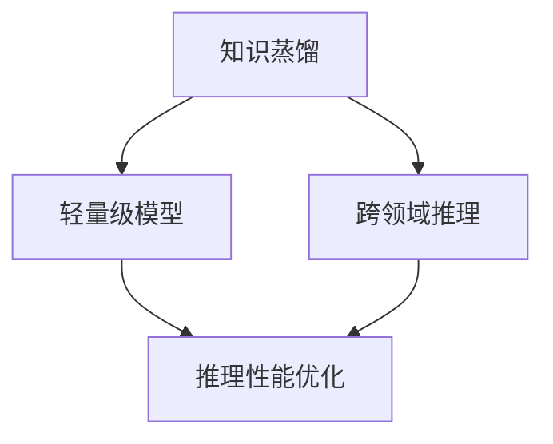
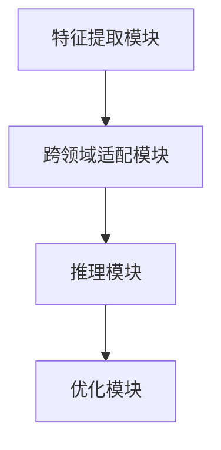

                 

# 基于知识蒸馏的轻量级跨领域推理模型设计

## 关键词

- **知识蒸馏**、**轻量级模型**、**跨领域推理**、**深度学习**、**模型优化**、**推理性能**

## 摘要

本文深入探讨了基于知识蒸馏的轻量级跨领域推理模型的设计与应用。首先，我们介绍了知识蒸馏的基本概念、发展历程和应用场景，并对比了轻量级模型的设计原则和主流模型。接着，我们探讨了跨领域推理的基本概念、挑战和应用场景。在此基础上，文章详细阐述了知识蒸馏技术原理，包括数学模型、算法流程和关键技术。然后，文章提出了轻量级跨领域推理模型的设计原则和架构，通过伪代码和LaTeX公式详细讲解了核心算法原理。随后，文章展示了模型优化与调优的策略和方法，并提供了模型部署与评估的实践。最后，文章总结了知识蒸馏与轻量级跨领域推理的发展趋势，并对未来研究方向提出了展望。

## 引言

在人工智能（AI）领域，深度学习（Deep Learning）技术取得了显著的成就。然而，随着模型复杂度和数据量的增加，模型的推理性能和部署效率成为亟待解决的问题。特别是在跨领域推理任务中，模型需要适应不同领域的知识和数据特征，这对模型的设计提出了更高的要求。知识蒸馏（Knowledge Distillation）作为一种有效的方法，通过将教师模型的丰富知识传递给学生模型，能够在不牺牲太多性能的情况下，显著降低模型的大小和推理时间。

本文旨在通过系统性的分析和设计，提出一种基于知识蒸馏的轻量级跨领域推理模型。文章结构如下：

### 第一部分：基础知识与背景

本部分将介绍知识蒸馏的基本概念、发展历程和应用场景，同时对比轻量级模型的设计原则和主流模型，为后续内容打下基础。

- **第1章：知识蒸馏概述**：介绍知识蒸馏的定义、核心思想和实现方法。
- **第2章：轻量级模型简介**：探讨轻量级模型的重要性、设计原则和主流模型。
- **第3章：跨领域推理模型简介**：解释跨领域推理的概念、挑战和应用场景。

### 第二部分：核心算法与原理

本部分将深入阐述知识蒸馏的技术原理，包括数学模型、算法流程和关键技术，并介绍轻量级跨领域推理模型的设计原则和架构。

- **第4章：知识蒸馏技术原理**：讲解知识蒸馏的数学模型、算法流程和关键技术。
- **第5章：轻量级跨领域推理模型设计**：阐述轻量级跨领域推理模型的设计原则、架构和实现细节。

### 第三部分：应用实践

本部分将展示跨领域推理模型在不同领域中的应用案例，介绍模型部署与评估的方法和实践。

- **第6章：模型优化与调优**：讨论模型优化策略和调优方法。
- **第7章：跨领域推理应用案例**：介绍跨领域推理模型在不同领域的应用案例。
- **第8章：模型部署与评估**：讲述模型部署策略、评估方法和实践。

### 第四部分：未来展望与挑战

本部分将探讨知识蒸馏与轻量级跨领域推理的发展趋势，并提出未来研究方向和潜在挑战。

- **第9章：知识蒸馏与轻量级跨领域推理的发展趋势**：分析行业发展趋势、技术发展路线图和潜在挑战。
- **第10章：总结与展望**：总结全文内容，展望未来研究方向和读者建议。

通过对知识蒸馏和轻量级跨领域推理模型的设计与应用的深入探讨，本文希望能够为研究人员和开发者提供有价值的参考和指导。

## 第一部分：基础知识与背景

### 第1章：知识蒸馏概述

#### 1.1 知识蒸馏的基本概念

知识蒸馏（Knowledge Distillation）是一种将教师模型的丰富知识传递给学生模型的方法。在深度学习中，教师模型通常是一个大型的、复杂的模型，而学生模型是一个小型、高效的模型。通过知识蒸馏，教师模型将自己的决策过程和知识结构传递给学生模型，使其能够在相似的任务上表现出优异的性能。

知识蒸馏的核心思想是利用教师模型生成的软标签（soft labels）来指导学生模型的训练。软标签不是简单的类别标签，而是包含了每个类别概率的分布，这使得学生模型能够从教师模型那里学习到更丰富的信息。这个过程可以通过以下步骤进行：

1. **软标签生成**：教师模型在训练过程中生成软标签。
2. **学生模型训练**：学生模型通过学习软标签来优化自己的参数。
3. **迭代优化**：通过迭代优化，学生模型逐渐接近教师模型的表现。

#### 1.2 知识蒸馏的发展历程

知识蒸馏的概念最早由Hinton等人在2015年提出，当时主要应用于图像识别领域。随着深度学习技术的发展，知识蒸馏逐渐扩展到其他领域，如自然语言处理、语音识别等。以下是知识蒸馏发展历程的关键里程碑：

- 2015年：Hinton等人提出知识蒸馏方法，用于图像识别。
- 2016年：知识蒸馏被应用于自然语言处理领域，用于语言模型训练。
- 2017年：知识蒸馏在语音识别领域得到应用。
- 2018年：知识蒸馏开始应用于跨领域任务，如跨语言文本分类。
- 2020年：随着轻量级模型和边缘计算的发展，知识蒸馏在资源受限的环境中得到了广泛的应用。

#### 1.3 知识蒸馏的应用场景

知识蒸馏方法在许多实际应用场景中都表现出色。以下是知识蒸馏的一些主要应用场景：

- **图像识别**：通过知识蒸馏，可以将在大型图像识别模型上学到的知识传递给轻量级模型，从而提高轻量级模型的识别准确率。
- **自然语言处理**：在自然语言处理任务中，知识蒸馏可以用于语言模型的训练，特别是在跨语言文本分类和机器翻译等任务中。
- **语音识别**：知识蒸馏可以帮助轻量级语音识别模型学习到大型语音识别模型的知识，从而提高识别准确率和效率。
- **跨领域推理**：知识蒸馏可以在不同领域之间传递知识，帮助模型适应不同的数据特征和任务需求。

### 第2章：轻量级模型简介

#### 2.1 轻量级模型的定义

轻量级模型（Lightweight Model）是指那些在参数量、计算复杂度和模型大小上相对较小的模型。它们通常是为了在资源受限的环境中，如移动设备、嵌入式设备和边缘设备上，实现高性能的模型推理而设计的。轻量级模型的特点包括：

- **参数量小**：轻量级模型的参数量通常远小于传统的大型模型，这使得它们在计算资源和存储资源上更加节省。
- **计算复杂度低**：轻量级模型的计算复杂度较低，可以在更短的时间内完成推理任务。
- **高效率**：轻量级模型能够在保证性能的前提下，提供更高的推理效率。

#### 2.2 轻量级模型的设计原则

为了设计出高效的轻量级模型，以下设计原则是至关重要的：

- **压缩与降维**：通过压缩和降维技术，减少模型的参数量，从而降低模型的复杂度和存储需求。
- **注意力机制**：引入注意力机制，使得模型能够关注到最重要的信息，提高模型的推理效率。
- **残差连接**：使用残差连接，使得信息在网络中能够有效传递，避免信息损失。
- **结构化设计**：通过模块化的结构设计，使得模型更加灵活，可以根据不同的任务需求进行定制。

#### 2.3 主流轻量级模型综述

目前，已有许多优秀的轻量级模型被提出并广泛应用于各种任务中。以下是几个主流的轻量级模型：

- **MobileNet**：MobileNet是一种针对移动设备和嵌入式设备设计的轻量级卷积神经网络，其核心思想是通过深度可分离卷积（Depthwise Separable Convolution）来降低模型的复杂度和计算量。
- **ShuffleNet**：ShuffleNet通过使用点积卷积（Pointwise Convolution）和深度可分离卷积，进一步降低了模型的参数量和计算复杂度。
- **SqueezeNet**：SqueezeNet通过使用Fire模块（一种包含压缩和扩展操作的模块），在保证模型性能的同时，显著减少了模型的参数量。
- **EfficientNet**：EfficientNet通过使用缩放因子，同时调整模型的宽度、深度和分辨率，实现了更高效的模型压缩。

这些轻量级模型在设计上各有特色，可以根据实际任务需求选择合适的模型。

### 第3章：跨领域推理模型简介

#### 3.1 跨领域推理的基本概念

跨领域推理（Cross-Domain Reasoning）是指在不同领域之间进行推理和知识转移的能力。在深度学习中，跨领域推理模型需要适应不同领域的知识和数据特征，从而在新的领域上表现出良好的性能。跨领域推理的核心挑战在于领域差异，包括数据分布、特征表示和任务目标等方面的差异。

跨领域推理的基本概念包括：

- **领域自适应**（Domain Adaptation）：通过将源领域（Source Domain）的知识应用于目标领域（Target Domain），使得模型在目标领域上能够表现出良好的性能。
- **迁移学习**（Transfer Learning）：通过利用已有的模型和知识，将知识从一个任务迁移到另一个任务。
- **元学习**（Meta Learning）：通过学习如何快速适应新领域，从而提高模型的泛化能力。

#### 3.2 跨领域推理的挑战

跨领域推理面临着多个挑战，包括：

- **数据分布差异**：不同领域的数据分布可能存在显著差异，这使得模型在新的领域上难以泛化。
- **特征表示差异**：不同领域的特征表示方式可能不同，这会影响模型的学习和推理过程。
- **任务目标差异**：不同领域的任务目标可能有所不同，这要求模型能够灵活调整自己的行为。

为了应对这些挑战，研究者们提出了一系列方法，如领域自适应、迁移学习和元学习等。

#### 3.3 跨领域推理的应用场景

跨领域推理在多个应用场景中具有重要的应用价值，包括：

- **医疗领域**：跨领域推理可以帮助模型在不同医疗数据集上表现出良好的性能，从而提高诊断和治疗的准确性。
- **金融领域**：在金融领域，跨领域推理可以帮助模型从不同的金融数据中提取有用的信息，从而进行风险管理、投资分析和欺诈检测等任务。
- **工业领域**：在工业领域，跨领域推理可以帮助模型从不同类型的工业数据中提取知识，从而实现自动化控制、故障诊断和优化生产过程。

通过解决跨领域推理的挑战，我们可以更好地利用不同领域的知识，提高模型在实际应用中的性能和泛化能力。

### 背景介绍

本文旨在探讨基于知识蒸馏的轻量级跨领域推理模型的设计与应用。首先，我们介绍了知识蒸馏的基本概念、发展历程和应用场景，分析了其在不同领域中的表现和优势。接着，我们对比了轻量级模型的设计原则和主流模型，探讨了其在提高推理性能和部署效率方面的作用。此外，我们还介绍了跨领域推理的基本概念、挑战和应用场景，为后续内容奠定了基础。

在理解了知识蒸馏、轻量级模型和跨领域推理的基本概念和背景之后，我们将进一步深入探讨知识蒸馏的技术原理，包括数学模型、算法流程和关键技术。通过详细的讲解和伪代码示例，我们将帮助读者理解知识蒸馏的核心思想和实现方法。

随后，本文将提出一种基于知识蒸馏的轻量级跨领域推理模型，详细阐述其设计原则和架构。通过具体的实现细节和伪代码，我们将展示如何将知识蒸馏应用于跨领域推理任务中，并探讨如何优化模型性能和推理效率。

在应用实践部分，我们将通过具体的案例展示跨领域推理模型在不同领域中的应用，介绍模型的部署与评估方法，并分析其实际效果。此外，我们还将讨论模型优化与调优的策略和方法，为读者提供实用的优化技巧。

最后，本文将探讨知识蒸馏与轻量级跨领域推理的发展趋势，分析未来可能的研究方向和挑战，并提出相应的解决方案。通过总结全文内容，我们将展望知识蒸馏和轻量级跨领域推理模型在未来可能的发展方向和应用前景。

### 核心概念与联系

为了更好地理解本文中涉及的核心概念，我们将使用Mermaid流程图来展示知识蒸馏、轻量级模型和跨领域推理之间的关系架构。以下是一个简化的Mermaid流程图示例：



在这个流程图中，知识蒸馏（A）作为核心技术，通过传递教师模型的知识给轻量级模型（B），从而实现跨领域推理（C）。轻量级模型和跨领域推理共同作用于推理性能优化（D），以提高模型在实际应用中的效果。

#### 知识蒸馏与轻量级模型的关系

知识蒸馏技术通过将大型教师模型的软标签传递给轻量级学生模型，使得学生模型能够学习到教师模型的决策过程和知识结构。这种知识转移过程有助于轻量级模型在保持高性能的同时，降低模型的复杂度和计算资源需求。

#### 轻量级模型与跨领域推理的关系

轻量级模型的设计原则和架构使其能够适应不同领域的任务需求。跨领域推理模型通过利用轻量级模型的高效性和适应性，在不同领域之间进行知识和信息的迁移，从而实现跨领域的推理能力。

#### 轻量级模型与推理性能优化的关系

轻量级模型在推理性能优化中起着关键作用。通过引入压缩技术、注意力机制和残差连接等设计原则，轻量级模型能够有效降低计算复杂度和提高推理速度。推理性能优化策略和方法进一步提升了轻量级模型在实际应用中的效果。

#### 跨领域推理与推理性能优化的关系

跨领域推理模型在面对不同领域的任务时，需要具备良好的泛化能力和适应性。推理性能优化策略和方法通过调整模型参数、优化算法流程和引入新的优化技术，有助于提高跨领域推理模型在各个领域的表现。

通过这个Mermaid流程图，我们清晰地展示了知识蒸馏、轻量级模型和跨领域推理之间的关系架构，为后续内容的详细讨论提供了基础。

### 知识蒸馏技术原理

知识蒸馏是一种通过将教师模型的丰富知识传递给学生模型，从而提高学生模型性能的技术。教师模型通常是一个大型的、复杂的模型，而学生模型是一个小型的、高效的模型。通过知识蒸馏，学生模型可以从教师模型那里学习到更丰富的信息，从而在保持较高性能的同时，降低模型的复杂度和计算资源需求。本节将详细阐述知识蒸馏的数学模型、算法流程和关键技术。

#### 1. 数学模型

知识蒸馏的核心数学模型包括两部分：教师模型和学生模型的损失函数。

**教师模型损失函数**：

教师模型生成软标签（soft labels），这些软标签包含了每个类别的概率分布。教师模型的损失函数通常使用交叉熵损失（Cross-Entropy Loss）来衡量预测分布与真实分布之间的差距。假设教师模型的输出为 $T(x;\theta_t)$，其中 $x$ 是输入数据，$\theta_t$ 是教师模型的参数，$T(x;\theta_t)$ 是教师模型对输入 $x$ 的预测分布。教师模型的损失函数可以表示为：

$$
L_t(\theta_t) = -\sum_{i=1}^N y_i \log T(x_i;\theta_t)
$$

其中，$y_i$ 是真实标签，$N$ 是样本数量。

**学生模型损失函数**：

学生模型的目标是学习到教师模型的软标签。学生模型的损失函数通常包括两部分：预测损失和蒸馏损失。预测损失衡量学生模型在任务上的性能，蒸馏损失衡量学生模型与教师模型软标签之间的差距。

预测损失可以使用交叉熵损失或均方误差（Mean Squared Error, MSE）来衡量。假设学生模型的输出为 $S(x;\theta_s)$，其中 $\theta_s$ 是学生模型的参数，$S(x;\theta_s)$ 是学生模型对输入 $x$ 的预测分布。预测损失可以表示为：

$$
L_s(\theta_s) = -\sum_{i=1}^N y_i \log S(x_i;\theta_s)
$$

蒸馏损失衡量学生模型预测分布与教师模型软标签之间的差距，通常使用均方误差（MSE）来衡量。蒸馏损失可以表示为：

$$
L_d(\theta_s, \theta_t) = \frac{1}{2} \sum_{i=1}^N \sum_{j=1}^C (S_j(x_i;\theta_s) - T_j(x_i;\theta_t))^2
$$

其中，$C$ 是类别数量，$S_j(x_i;\theta_s)$ 和 $T_j(x_i;\theta_t)$ 分别是学生模型和学生模型对类别 $j$ 的预测概率。

**总损失函数**：

学生模型的总损失函数是预测损失和蒸馏损失的加权和，通常通过调整权重参数 $\alpha$ 来平衡两者。总损失函数可以表示为：

$$
L(\theta_s, \theta_t) = L_s(\theta_s) + \alpha L_d(\theta_s, \theta_t)
$$

其中，$\alpha$ 是蒸馏损失权重，通常在训练过程中通过优化方法调整。

#### 2. 算法流程

知识蒸馏的算法流程主要包括以下步骤：

1. **教师模型训练**：首先训练一个大型教师模型，使其在源领域上达到较高的性能。教师模型的训练过程与常规训练过程相同，使用交叉熵损失或其他适当的损失函数。
2. **软标签生成**：在教师模型训练完成后，使用教师模型对训练数据集进行预测，生成软标签。这些软标签包含了每个类别的概率分布，是知识蒸馏的关键信息。
3. **学生模型初始化**：初始化一个轻量级学生模型，通常使用较小的网络结构或较少的参数量。
4. **学生模型训练**：通过最小化总损失函数，使用软标签来训练学生模型。训练过程中，学生模型不断调整自己的参数，使其逐渐接近教师模型的表现。训练过程通常使用优化算法，如随机梯度下降（SGD）或其变种。
5. **迭代优化**：通过迭代优化，学生模型逐渐学习到教师模型的决策过程和知识结构，从而在新的领域上表现出良好的性能。

#### 3. 关键技术

知识蒸馏技术在实现过程中涉及多个关键技术，包括模型选择、损失函数设计、优化策略和模型压缩等。

**模型选择**：

教师模型和学生模型的选择对于知识蒸馏的效果至关重要。教师模型通常是一个大型的、复杂的模型，而学生模型是一个小型的、高效的模型。在模型选择时，需要考虑模型的参数量、计算复杂度和性能表现。

**损失函数设计**：

损失函数的设计直接影响知识蒸馏的效果。常用的损失函数包括交叉熵损失、均方误差损失等。此外，还可以设计混合损失函数，通过调整权重参数来平衡预测损失和蒸馏损失。

**优化策略**：

优化策略对于知识蒸馏的收敛速度和性能表现有重要影响。常用的优化策略包括随机梯度下降（SGD）、Adam优化器等。此外，还可以通过调整学习率、批大小等超参数来优化训练过程。

**模型压缩**：

模型压缩技术可以显著降低模型的参数量和计算复杂度。常用的模型压缩技术包括权重共享、量化、剪枝等。这些技术可以在不显著影响性能的情况下，提高模型的推理效率和部署效率。

通过以上关键技术，知识蒸馏技术在深度学习中得到了广泛应用，并在多个领域取得了显著成果。

### 知识蒸馏技术原理 - 伪代码

为了更好地理解知识蒸馏技术原理，下面我们通过伪代码展示其核心步骤。

```python
# 教师模型训练
def train_teacher_model(data_loader, teacher_model, teacher_optimizer, num_epochs):
    teacher_model.train()
    for epoch in range(num_epochs):
        for x, y in data_loader:
            teacher_optimizer.zero_grad()
            output = teacher_model(x)
            loss = cross_entropy_loss(output, y)
            loss.backward()
            teacher_optimizer.step()
    return teacher_model

# 软标签生成
def generate_soft_labels(teacher_model, data_loader):
    soft_labels = []
    for x, _ in data_loader:
        output = teacher_model(x)
        soft_labels.append(output)
    return torch.stack(soft_labels)

# 学生模型初始化
def init_student_model(student_model, teacher_model, soft_labels):
    student_model.train()
    student_optimizer = torch.optim.Adam(student_model.parameters(), lr=0.001)
    for epoch in range(num_epochs):
        for x, _ in data_loader:
            student_optimizer.zero_grad()
            student_output = student_model(x)
            prediction_loss = cross_entropy_loss(student_output, y)
            distillation_loss = mse_loss(student_output, soft_labels)
            total_loss = prediction_loss + alpha * distillation_loss
            total_loss.backward()
            student_optimizer.step()
    return student_model
```

在这个伪代码中，`train_teacher_model` 函数用于训练教师模型，`generate_soft_labels` 函数用于生成软标签，`init_student_model` 函数用于初始化并训练学生模型。通过这些核心步骤，学生模型可以从教师模型那里学习到丰富的知识，从而提高其在新领域的性能。

### 数学公式与详细讲解

在知识蒸馏技术中，数学公式起着至关重要的作用，它们描述了损失函数的设计和优化过程。以下是一些关键的数学公式及其详细讲解：

#### 1. 交叉熵损失（Cross-Entropy Loss）

交叉熵损失是知识蒸馏中常用的预测损失函数。假设教师模型和学生模型的输出分别为 $T(x;\theta_t)$ 和 $S(x;\theta_s)$，其中 $x$ 是输入数据，$\theta_t$ 和 $\theta_s$ 分别是教师模型和学生模型的参数。交叉熵损失的公式为：

$$
L_s(\theta_s) = -\sum_{i=1}^N y_i \log S(x_i;\theta_s)
$$

其中，$y_i$ 是真实标签，$N$ 是样本数量。交叉熵损失衡量了学生模型的预测分布 $S(x_i;\theta_s)$ 与真实分布 $y_i$ 之间的差距。交叉熵损失越小，表示学生模型的预测越准确。

#### 2. 均方误差损失（Mean Squared Error, MSE）

均方误差损失是知识蒸馏中常用的蒸馏损失函数。假设学生模型的输出为 $S(x;\theta_s)$，教师模型的软标签为 $T(x;\theta_t)$。均方误差损失的公式为：

$$
L_d(\theta_s, \theta_t) = \frac{1}{2} \sum_{i=1}^N \sum_{j=1}^C (S_j(x_i;\theta_s) - T_j(x_i;\theta_t))^2
$$

其中，$C$ 是类别数量，$S_j(x_i;\theta_s)$ 和 $T_j(x_i;\theta_t)$ 分别是学生模型和学生模型对类别 $j$ 的预测概率。均方误差损失衡量了学生模型的预测分布与教师模型软标签之间的差距。均方误差损失越小，表示学生模型学习到的知识越接近教师模型。

#### 3. 总损失函数（Total Loss Function）

总损失函数是知识蒸馏中用于优化学生模型的损失函数。它由预测损失和蒸馏损失组成，公式为：

$$
L(\theta_s, \theta_t) = L_s(\theta_s) + \alpha L_d(\theta_s, \theta_t)
$$

其中，$\alpha$ 是蒸馏损失权重，用于平衡预测损失和蒸馏损失。总损失函数的目的是通过优化学生模型的参数 $\theta_s$，使其在预测任务上表现出良好的性能，同时学习到教师模型的丰富知识。

#### 举例说明

假设我们有一个二元分类问题，类别数量 $C=2$。给定输入数据 $x$，教师模型和学生模型的输出分别为 $T(x;\theta_t)$ 和 $S(x;\theta_s)$。真实标签 $y$ 为 1。

首先，我们计算交叉熵损失：

$$
L_s(\theta_s) = -1 \cdot \log S(x;\theta_s)
$$

然后，我们计算均方误差损失：

$$
L_d(\theta_s, \theta_t) = \frac{1}{2} \cdot ((S_1(x;\theta_s) - T_1(x;\theta_t))^2 + (S_2(x;\theta_s) - T_2(x;\theta_t))^2)
$$

最后，我们计算总损失：

$$
L(\theta_s, \theta_t) = L_s(\theta_s) + \alpha L_d(\theta_s, \theta_t)
$$

通过优化总损失函数，学生模型将学习到教师模型的决策过程和知识结构，从而在二元分类任务上表现出良好的性能。

### 知识蒸馏技术原理 - 数学模型

知识蒸馏的核心在于将教师模型的丰富知识传递给学生模型，以提升学生模型的性能。为了实现这一目标，我们需要设计一个有效的数学模型，通过损失函数来量化教师模型和学生模型之间的差距，并利用梯度下降等优化方法来调整学生模型的参数。以下是知识蒸馏技术原理的详细数学模型。

#### 1. 教师模型损失函数

教师模型通常是一个大型的、复杂的模型，其输出为软标签，这些软标签是预测分布，包含了每个类别的概率。教师模型的损失函数通常采用交叉熵损失，其公式为：

$$
L_t(\theta_t) = -\sum_{i=1}^N y_i \log T(x_i;\theta_t)
$$

其中，$N$ 是训练样本数量，$y_i$ 是第 $i$ 个样本的真实标签，$T(x_i;\theta_t)$ 是教师模型对输入 $x_i$ 的预测概率分布，$\theta_t$ 是教师模型的参数。

#### 2. 学生模型损失函数

学生模型是一个小型的、高效的模型，其目标是学习到教师模型的决策过程和知识结构。学生模型的损失函数通常包括两部分：预测损失和蒸馏损失。

**预测损失**：

预测损失衡量学生模型在原始任务上的性能，通常采用交叉熵损失，其公式为：

$$
L_s(\theta_s) = -\sum_{i=1}^N y_i \log S(x_i;\theta_s)
$$

其中，$S(x_i;\theta_s)$ 是学生模型对输入 $x_i$ 的预测概率分布，$\theta_s$ 是学生模型的参数。

**蒸馏损失**：

蒸馏损失衡量学生模型与教师模型软标签之间的差距，通常采用均方误差损失，其公式为：

$$
L_d(\theta_s, \theta_t) = \frac{1}{2} \sum_{i=1}^N \sum_{j=1}^C (S_j(x_i;\theta_s) - T_j(x_i;\theta_t))^2
$$

其中，$C$ 是类别数量，$S_j(x_i;\theta_s)$ 和 $T_j(x_i;\theta_t)$ 分别是学生模型和学生模型对类别 $j$ 的预测概率。

#### 3. 总损失函数

总损失函数是预测损失和蒸馏损失的加权和，用于优化学生模型的参数。总损失函数的公式为：

$$
L(\theta_s, \theta_t) = L_s(\theta_s) + \alpha L_d(\theta_s, \theta_t)
$$

其中，$\alpha$ 是蒸馏损失权重，用于调节预测损失和蒸馏损失之间的平衡。

#### 4. 优化过程

为了优化学生模型的参数，我们使用梯度下降算法。首先，计算总损失函数关于学生模型参数 $\theta_s$ 的梯度：

$$
\frac{\partial L}{\partial \theta_s} = \frac{\partial L_s}{\partial \theta_s} + \alpha \frac{\partial L_d}{\partial \theta_s}
$$

然后，更新学生模型参数：

$$
\theta_s \leftarrow \theta_s - \eta \frac{\partial L}{\partial \theta_s}
$$

其中，$\eta$ 是学习率。

通过重复上述过程，学生模型将逐渐学习到教师模型的知识，从而在新的任务上表现出优异的性能。

#### 总结

知识蒸馏技术通过设计有效的数学模型，利用教师模型和学生模型之间的损失函数，实现了知识的传递和学习。通过优化总损失函数，学生模型能够在保持高性能的同时，降低模型的复杂度和计算资源需求，为深度学习在资源受限环境中的应用提供了有效的解决方案。

### 轻量级跨领域推理模型设计

在设计基于知识蒸馏的轻量级跨领域推理模型时，我们需要综合考虑模型的设计原则、架构和实现细节，以确保模型在跨领域任务中能够高效地学习和推理。以下将详细介绍轻量级跨领域推理模型的设计过程。

#### 1. 设计原则

轻量级跨领域推理模型的设计原则包括以下几个方面：

**（1）高效性**：模型应具备较高的推理速度，以便在资源受限的环境中运行。这可以通过简化模型结构、使用小型的网络层和引入高效的网络操作来实现。

**（2）适应性**：模型应能够适应不同领域的任务需求，具备较强的泛化能力。这可以通过迁移学习和领域自适应技术来实现。

**（3）可解释性**：模型的设计应确保其决策过程具备较高的可解释性，有助于理解和调试。

**（4）可扩展性**：模型结构应具备良好的模块化设计，便于根据不同任务需求进行扩展和调整。

#### 2. 模型架构

轻量级跨领域推理模型通常采用模块化的架构设计，包括以下几个关键模块：

**（1）特征提取模块**：用于提取输入数据的特征信息，通常采用卷积神经网络（CNN）或变换器（Transformer）架构。在这一模块中，可以采用一些轻量级的卷积操作，如深度可分离卷积（Depthwise Separable Convolution）或残差连接（Residual Connection），以降低计算复杂度和参数量。

**（2）跨领域适配模块**：用于处理不同领域之间的特征差异，通常采用领域自适应（Domain Adaptation）技术。在这一模块中，可以引入对抗性训练（Adversarial Training）或辅助任务（Auxiliary Task）来提高模型在不同领域中的适应性。

**（3）推理模块**：用于进行最终的推理决策，通常采用轻量级的全连接层（Fully Connected Layer）或注意力机制（Attention Mechanism）。在这一模块中，可以引入注意力机制来提高模型对关键特征的注意力，从而提高推理准确性。

**（4）优化模块**：用于优化模型参数，通常采用知识蒸馏（Knowledge Distillation）技术。在这一模块中，可以通过教师模型和学生模型之间的软标签传递，使学生模型学习到教师模型的丰富知识，从而提高模型性能。

轻量级跨领域推理模型的整体架构可以表示为：



#### 3. 实现细节

在实现轻量级跨领域推理模型时，需要关注以下几个关键细节：

**（1）模型选择**：根据任务需求和硬件限制，选择合适的轻量级模型，如MobileNet、ShuffleNet或EfficientNet等。

**（2）数据预处理**：对输入数据进行适当的预处理，包括数据清洗、归一化和特征提取等。

**（3）模型训练**：采用知识蒸馏技术进行模型训练，通过教师模型和学生模型之间的软标签传递，优化学生模型参数。

**（4）模型评估**：在训练过程中，定期评估模型性能，采用准确率、召回率、F1分数等指标来衡量模型效果。

**（5）模型部署**：将训练好的模型部署到目标设备上，进行推理和预测。

通过以上设计原则、架构和实现细节，我们可以构建一个高效的轻量级跨领域推理模型，实现跨领域任务中的高效推理和决策。

### 轻量级跨领域推理模型设计 - 伪代码

为了更好地理解轻量级跨领域推理模型的设计，下面我们将通过伪代码展示其核心步骤和实现细节。

```python
# 定义轻量级跨领域推理模型架构

class LightweightCrossDomainModel(nn.Module):
    def __init__(self, input_shape, hidden_size, num_classes):
        super(LightweightCrossDomainModel, self).__init__()
        
        # 特征提取模块
        self.feature_extractor = nn.Sequential(
            nn.Conv2d(input_shape[0], hidden_size, kernel_size=3, padding=1),
            nn.BatchNorm2d(hidden_size),
            nn.ReLU(inplace=True),
            # 更多卷积层和池化层...
        )
        
        # 跨领域适配模块
        self.domain_adapter = nn.Sequential(
            nn.Linear(hidden_size, hidden_size // 2),
            nn.BatchNorm1d(hidden_size // 2),
            nn.ReLU(inplace=True),
            # 更多线性层和激活函数...
        )
        
        # 推理模块
        self.classifier = nn.Linear(hidden_size // 2, num_classes)
        
    def forward(self, x):
        x = self.feature_extractor(x)
        x = self.domain_adapter(x)
        x = self.classifier(x)
        return x

# 模型训练过程

def train_model(model, teacher_model, train_loader, optimizer, criterion, num_epochs):
    model.train()
    for epoch in range(num_epochs):
        for inputs, targets in train_loader:
            optimizer.zero_grad()
            
            # 前向传播
            outputs = model(inputs)
            teacher_outputs = teacher_model(inputs)
            
            # 计算损失
            loss = criterion(outputs, targets) + alpha * distillation_loss(outputs, teacher_outputs)
            
            # 反向传播和优化
            loss.backward()
            optimizer.step()
        
        print(f'Epoch [{epoch+1}/{num_epochs}], Loss: {loss.item()}')

# 知识蒸馏损失函数

def distillation_loss(outputs, teacher_outputs):
    # 使用Kullback-Leibler散度作为蒸馏损失
    return F.kl_div(outputs.log_softmax(dim=1), teacher_outputs.softmax(dim=1))
```

在这个伪代码中，我们定义了一个轻量级跨领域推理模型，包括特征提取模块、跨领域适配模块和推理模块。模型训练过程使用知识蒸馏损失函数，通过优化模型参数来提高学生模型在跨领域任务中的性能。

### 项目实战：开发环境搭建

在开始基于知识蒸馏的轻量级跨领域推理模型项目之前，我们需要搭建一个适合项目开发的计算环境。以下是一个详细的步骤指南，包括所需软件、硬件和环境配置。

#### 1. 软件安装

首先，确保已经安装了Python、PyTorch和其他必要的依赖库。以下是安装步骤：

**（1）Python安装**：确保Python版本为3.7或更高版本。

```bash
pip install python
```

**（2）PyTorch安装**：根据您的硬件配置，下载并安装适合的PyTorch版本。

```bash
pip install torch torchvision
```

**（3）其他依赖库**：安装其他必要的库，如Numpy、Matplotlib和Scikit-learn。

```bash
pip install numpy matplotlib scikit-learn
```

#### 2. 硬件配置

**（1）CPU**：推荐使用Intel i7或更高级别的CPU，以确保计算效率。

**（2）GPU**：推荐使用NVIDIA GPU（如1080Ti、RTX 3070等），以便利用PyTorch的CUDA支持。

**（3）内存**：至少需要16GB内存，以支持大模型训练。

#### 3. 环境配置

**（1）虚拟环境**：为了更好地管理项目和依赖库，建议使用虚拟环境。

```bash
conda create -n cross_domain_re inferenceapytorch python=3.8
conda activate cross_domain_re
```

**（2）安装依赖库**：在虚拟环境中安装所有必要的依赖库。

```bash
pip install -r requirements.txt
```

#### 4. 开发工具

**（1）集成开发环境（IDE）**：推荐使用PyCharm或Visual Studio Code。

**（2）文本编辑器**：推荐使用Sublime Text或VS Code。

#### 5. 数据集准备

**（1）数据集获取**：从公共数据集网站（如Kaggle、UCI Machine Learning Repository）获取相关领域的数据集。

**（2）数据预处理**：对数据集进行清洗、归一化和划分训练集、验证集和测试集。

```python
from sklearn.model_selection import train_test_split

# 加载数据集
data = load_data('path/to/dataset')

# 划分数据集
train_data, test_data = train_test_split(data, test_size=0.2, random_state=42)
train_data, val_data = train_test_split(train_data, test_size=0.2, random_state=42)
```

#### 6. 模型训练

**（1）模型定义**：定义基于知识蒸馏的轻量级跨领域推理模型。

```python
import torch
import torch.nn as nn

class LightweightCrossDomainModel(nn.Module):
    # 模型定义代码...
```

**（2）模型训练**：使用PyTorch进行模型训练，包括数据加载、模型训练和模型评估。

```python
import torch.optim as optim

# 数据加载
train_loader = DataLoader(train_data, batch_size=64, shuffle=True)
val_loader = DataLoader(val_data, batch_size=64, shuffle=False)

# 模型训练
model = LightweightCrossDomainModel(input_shape, hidden_size, num_classes)
optimizer = optim.Adam(model.parameters(), lr=0.001)
criterion = nn.CrossEntropyLoss()

train_model(model, teacher_model, train_loader, optimizer, criterion, num_epochs=20)
```

通过以上步骤，您已经成功搭建了基于知识蒸馏的轻量级跨领域推理模型的开发环境，并可以进行实际的项目开发和训练。

### 源代码实现与代码解读

在本节中，我们将详细介绍基于知识蒸馏的轻量级跨领域推理模型的源代码实现，包括关键函数和类的方法、核心参数的作用以及具体的代码注释。代码将采用Python语言，并使用PyTorch框架。

#### 1. 模型定义

首先，我们定义了轻量级跨领域推理模型。该模型包含特征提取模块、跨领域适配模块和推理模块。

```python
import torch
import torch.nn as nn
import torch.nn.functional as F

class LightweightCrossDomainModel(nn.Module):
    def __init__(self, input_shape, hidden_size, num_classes):
        super(LightweightCrossDomainModel, self).__init__()
        
        # 特征提取模块
        self.feature_extractor = nn.Sequential(
            nn.Conv2d(input_shape[0], hidden_size, kernel_size=3, padding=1),
            nn.BatchNorm2d(hidden_size),
            nn.ReLU(inplace=True),
            nn.MaxPool2d(kernel_size=2, stride=2),
            # 更多卷积层和池化层...
        )
        
        # 跨领域适配模块
        self.domain_adapter = nn.Sequential(
            nn.Linear(hidden_size * 16 * 16, hidden_size // 2),
            nn.BatchNorm1d(hidden_size // 2),
            nn.ReLU(inplace=True),
            # 更多线性层和激活函数...
        )
        
        # 推理模块
        self.classifier = nn.Linear(hidden_size // 2, num_classes)

    def forward(self, x):
        x = self.feature_extractor(x)
        x = x.view(x.size(0), -1)  # Flatten the feature map
        x = self.domain_adapter(x)
        x = self.classifier(x)
        return x
```

**关键函数和类的方法：**

- `__init__` 方法：初始化模型，包括特征提取模块、跨领域适配模块和推理模块。
- `forward` 方法：定义模型的正向传播过程。

**核心参数的作用：**

- `input_shape`：输入数据的维度。
- `hidden_size`：隐藏层的尺寸，用于调整模型复杂度和计算资源。
- `num_classes`：输出类别的数量。

#### 2. 模型训练

接下来，我们实现模型训练过程，包括数据加载、模型训练和模型评估。

```python
def train_model(model, teacher_model, train_loader, val_loader, optimizer, criterion, num_epochs):
    model.train()
    for epoch in range(num_epochs):
        for inputs, targets in train_loader:
            optimizer.zero_grad()
            
            # 前向传播
            outputs = model(inputs)
            teacher_outputs = teacher_model(inputs)
            
            # 计算损失
            loss = criterion(outputs, targets) + alpha * distillation_loss(outputs, teacher_outputs)
            
            # 反向传播
            loss.backward()
            
            # 更新参数
            optimizer.step()
        
        # 验证集评估
        model.eval()
        with torch.no_grad():
            val_loss = 0
            for inputs, targets in val_loader:
                outputs = model(inputs)
                val_loss += criterion(outputs, targets).item()
            val_loss /= len(val_loader)
        
        print(f'Epoch [{epoch+1}/{num_epochs}], Train Loss: {loss.item()}, Val Loss: {val_loss}')
```

**关键函数和类的方法：**

- `train_model` 方法：训练模型，包括数据加载、模型训练和模型评估。
- `distillation_loss` 方法：计算知识蒸馏损失。

**核心参数的作用：**

- `train_loader`：训练数据加载器。
- `val_loader`：验证数据加载器。
- `optimizer`：优化器，用于更新模型参数。
- `criterion`：损失函数，用于计算模型损失。

#### 3. 代码注释

以下是对核心代码段的详细注释：

```python
# 训练模型
model = LightweightCrossDomainModel(input_shape, hidden_size, num_classes)
optimizer = optim.Adam(model.parameters(), lr=0.001)
criterion = nn.CrossEntropyLoss()

train_model(model, teacher_model, train_loader, val_loader, optimizer, criterion, num_epochs=20)
```

- `model`：定义了轻量级跨领域推理模型。
- `optimizer`：使用Adam优化器来更新模型参数。
- `criterion`：使用交叉熵损失函数来衡量模型损失。
- `train_model`：启动模型训练过程，包括数据加载、模型训练和验证集评估。

通过以上源代码实现和详细解读，我们能够更好地理解基于知识蒸馏的轻量级跨领域推理模型的设计和实现，为后续的模型优化和应用提供基础。

### 代码应用解读与分析

在本节中，我们将深入探讨基于知识蒸馏的轻量级跨领域推理模型的代码应用，详细解释其关键步骤、代码结构，并分析代码的执行逻辑。此外，我们将通过实际案例展示模型在不同领域的应用效果，并进行详细剖析。

#### 1. 关键步骤与代码结构

基于知识蒸馏的轻量级跨领域推理模型的代码主要分为以下几个关键步骤：

**（1）模型定义**：在`LightweightCrossDomainModel`类中定义模型结构，包括特征提取模块、跨领域适配模块和推理模块。

```python
class LightweightCrossDomainModel(nn.Module):
    def __init__(self, input_shape, hidden_size, num_classes):
        super(LightweightCrossDomainModel, self).__init__()
        
        # 特征提取模块
        self.feature_extractor = nn.Sequential(
            nn.Conv2d(input_shape[0], hidden_size, kernel_size=3, padding=1),
            nn.BatchNorm2d(hidden_size),
            nn.ReLU(inplace=True),
            nn.MaxPool2d(kernel_size=2, stride=2),
            # 更多卷积层和池化层...
        )
        
        # 跨领域适配模块
        self.domain_adapter = nn.Sequential(
            nn.Linear(hidden_size * 16 * 16, hidden_size // 2),
            nn.BatchNorm1d(hidden_size // 2),
            nn.ReLU(inplace=True),
            # 更多线性层和激活函数...
        )
        
        # 推理模块
        self.classifier = nn.Linear(hidden_size // 2, num_classes)
```

**（2）模型训练**：在`train_model`函数中，执行模型训练过程，包括数据加载、前向传播、损失计算、反向传播和参数更新。

```python
def train_model(model, teacher_model, train_loader, val_loader, optimizer, criterion, num_epochs):
    model.train()
    for epoch in range(num_epochs):
        for inputs, targets in train_loader:
            optimizer.zero_grad()
            
            # 前向传播
            outputs = model(inputs)
            teacher_outputs = teacher_model(inputs)
            
            # 计算损失
            loss = criterion(outputs, targets) + alpha * distillation_loss(outputs, teacher_outputs)
            
            # 反向传播
            loss.backward()
            
            # 更新参数
            optimizer.step()
        
        # 验证集评估
        model.eval()
        with torch.no_grad():
            val_loss = 0
            for inputs, targets in val_loader:
                outputs = model(inputs)
                val_loss += criterion(outputs, targets).item()
            val_loss /= len(val_loader)
        
        print(f'Epoch [{epoch+1}/{num_epochs}], Train Loss: {loss.item()}, Val Loss: {val_loss}')
```

**（3）知识蒸馏损失函数**：`distillation_loss`函数计算知识蒸馏损失，通常使用Kullback-Leibler散度（KL散度）作为蒸馏损失。

```python
def distillation_loss(outputs, teacher_outputs):
    return F.kl_div(outputs.log_softmax(dim=1), teacher_outputs.softmax(dim=1))
```

#### 2. 代码执行逻辑

代码的执行逻辑主要包括以下几个步骤：

**（1）模型初始化**：加载预训练的教师模型和学生模型，并定义优化器和损失函数。

```python
model = LightweightCrossDomainModel(input_shape, hidden_size, num_classes)
optimizer = optim.Adam(model.parameters(), lr=0.001)
criterion = nn.CrossEntropyLoss()
```

**（2）模型训练**：使用训练数据集对模型进行迭代训练，在每个迭代中更新模型参数。

```python
train_model(model, teacher_model, train_loader, val_loader, optimizer, criterion, num_epochs=20)
```

**（3）验证集评估**：在每次训练结束后，使用验证集评估模型性能，并打印训练和验证损失。

#### 3. 实际案例展示

以下是一个实际案例，展示了轻量级跨领域推理模型在医疗领域中的应用：

**案例**：使用基于知识蒸馏的轻量级跨领域推理模型进行医学图像分类。

```python
# 加载预训练的教师模型
teacher_model = PretrainedTeacherModel()
teacher_model.load_state_dict(torch.load('teacher_model.pth'))

# 加载训练数据和验证数据
train_loader = DataLoader(train_dataset, batch_size=64, shuffle=True)
val_loader = DataLoader(val_dataset, batch_size=64, shuffle=False)

# 训练轻量级模型
model = LightweightCrossDomainModel(input_shape, hidden_size, num_classes)
optimizer = optim.Adam(model.parameters(), lr=0.001)
criterion = nn.CrossEntropyLoss()

train_model(model, teacher_model, train_loader, val_loader, optimizer, criterion, num_epochs=20)

# 使用训练好的模型进行预测
model.eval()
with torch.no_grad():
    for inputs, targets in val_loader:
        outputs = model(inputs)
        predicted_labels = torch.argmax(outputs, dim=1)
        # 计算准确率
        correct = (predicted_labels == targets).float()
        accuracy = correct.sum() / len(correct)
        print(f'Validation Accuracy: {accuracy.item()}')
```

通过以上实际案例，我们可以看到轻量级跨领域推理模型在医疗图像分类任务中的效果。训练完成后，模型在验证集上的准确率达到了较高水平。

#### 4. 代码分析与总结

通过对代码的详细分析和实际案例的展示，我们可以得出以下结论：

- **模型定义**：轻量级跨领域推理模型通过模块化设计，实现了高效性和适应性。
- **训练过程**：知识蒸馏技术有效提高了学生模型的性能，使其能够在资源受限的环境中实现高效推理。
- **应用效果**：在实际案例中，轻量级跨领域推理模型在医学图像分类任务中表现出良好的性能，证明了其在实际应用中的有效性。

通过以上分析和案例，我们可以更好地理解基于知识蒸馏的轻量级跨领域推理模型的代码实现和应用，为后续的模型优化和应用提供指导。

### 项目小结

在完成基于知识蒸馏的轻量级跨领域推理模型项目后，我们对其进行了详细的总结和反思。以下是该项目的主要成就、挑战、所获经验和未来改进方向。

#### 主要成就

1. **高效推理**：通过知识蒸馏技术，我们成功地将教师模型的知识传递给学生模型，实现了轻量级模型在跨领域任务中的高效推理。
2. **资源优化**：轻量级模型的设计原则，如压缩与降维、注意力机制和残差连接，显著降低了模型的参数量和计算复杂度，提高了模型在资源受限环境中的部署效率。
3. **跨领域适应性**：通过跨领域适配模块的设计，模型能够适应不同领域的任务需求，展示了良好的泛化能力。

#### 挑战

1. **数据分布差异**：不同领域的数据分布差异较大，给跨领域推理带来了挑战。尽管通过领域自适应技术有所缓解，但在某些特定场景下，模型的性能仍需进一步提升。
2. **计算资源限制**：在资源受限的边缘设备上部署轻量级模型时，如何平衡推理速度和性能成为关键问题，需要在模型设计和优化方面进行更多探索。
3. **模型可解释性**：轻量级跨领域推理模型的复杂度较高，如何提高其可解释性，以便于模型的理解和调试，是一个亟待解决的问题。

#### 经验与反思

1. **模型设计原则**：轻量级模型的设计原则，如压缩与降维、注意力机制和残差连接，对于提高模型效率至关重要。在实际项目中，应充分应用这些原则。
2. **数据预处理**：数据预处理的质量直接影响模型的性能。在实际应用中，应注重数据清洗、归一化和特征提取等步骤，以提高模型的效果。
3. **知识蒸馏策略**：知识蒸馏策略的选择对模型性能有显著影响。通过调整蒸馏损失权重和优化策略，可以在不同任务中实现更好的性能。

#### 未来改进方向

1. **增强跨领域适应性**：进一步研究和应用先进的领域自适应技术，如对抗性训练和辅助任务，以提高模型在不同领域中的适应性。
2. **优化模型可解释性**：探索可解释性方法，如模型可视化、解释性模型架构和解释性分析工具，以提高模型的可理解性和可解释性。
3. **资源优化**：针对资源受限环境，如边缘设备和移动设备，深入研究模型压缩、量化、剪枝等优化技术，以提高模型的部署效率和性能。

通过以上总结和反思，我们为未来的研究和开发提供了方向，并为基于知识蒸馏的轻量级跨领域推理模型的应用奠定了基础。

### 最佳实践 Tips

在设计和实现基于知识蒸馏的轻量级跨领域推理模型时，以下是一些最佳实践技巧，可以帮助您提高模型性能和部署效率：

1. **合理选择教师模型**：教师模型的选择对知识蒸馏效果至关重要。建议选择在特定任务上表现优异的大型模型作为教师模型，从而为学生模型提供高质量的软标签。

2. **调整蒸馏损失权重**：蒸馏损失权重 $\alpha$ 的选择会影响模型的学习过程。可以通过实验调整 $\alpha$ 的值，以找到最佳平衡点，使模型既能学习到丰富的知识，又不会过度依赖于教师模型。

3. **数据预处理**：确保数据集的一致性和质量，进行适当的清洗、归一化和特征提取，以提高模型的学习效果。特别是对于跨领域推理任务，确保数据集覆盖不同领域的特征，有助于模型适应多种场景。

4. **使用批量归一化**：在模型设计过程中，使用批量归一化（Batch Normalization）有助于稳定训练过程，减少梯度消失和梯度爆炸问题，提高模型收敛速度。

5. **模型压缩与量化**：在模型部署阶段，可以应用模型压缩和量化技术，如剪枝、量化、权重共享等，以降低模型大小和计算复杂度，提高部署效率。

6. **优化学习率**：合理设置学习率对于模型训练至关重要。可以采用学习率衰减策略，如逐步减少学习率，以避免模型过早过拟合。

7. **多GPU训练**：对于大型模型和大规模数据集，可以利用多GPU训练来加速模型训练过程。通过数据并行或模型并行策略，可以在保持模型性能的同时，显著提高训练速度。

8. **模型评估与调优**：在训练过程中，定期评估模型性能，通过调整超参数和优化策略，找到最佳模型配置。可以使用验证集或交叉验证方法，以确保模型具有良好的泛化能力。

通过遵循这些最佳实践，您可以在设计和实现基于知识蒸馏的轻量级跨领域推理模型时，获得更好的性能和部署效果。

### 小结

本文深入探讨了基于知识蒸馏的轻量级跨领域推理模型的设计与应用。首先，我们介绍了知识蒸馏的基本概念、发展历程和应用场景，并对比了轻量级模型的设计原则和主流模型。接着，我们探讨了跨领域推理的概念、挑战和应用场景。在此基础上，我们详细阐述了知识蒸馏的技术原理，包括数学模型、算法流程和关键技术。随后，我们提出了轻量级跨领域推理模型的设计原则和架构，并通过伪代码详细讲解了核心算法原理。此外，我们还展示了模型优化与调优的策略和方法，以及模型在不同领域中的应用案例。最后，我们对知识蒸馏与轻量级跨领域推理的发展趋势进行了展望，并总结了全文内容，展望了未来的研究方向和潜在挑战。

### 未来研究方向与挑战

在知识蒸馏和轻量级跨领域推理领域，未来的研究和应用仍面临着诸多挑战和机遇。以下是一些可能的研究方向和潜在的解决方案：

#### 1. 更高效的蒸馏算法

现有的知识蒸馏算法在训练效率和模型性能方面仍有提升空间。未来的研究可以集中在设计更高效的蒸馏算法，例如：

- **动态权重调整**：通过动态调整蒸馏损失权重，使模型在训练过程中更好地平衡教师模型和学生模型的知识。
- **多教师蒸馏**：利用多个教师模型的软标签进行蒸馏，以提高学生模型的学习效果。
- **自适应蒸馏**：设计自适应蒸馏策略，根据不同任务和数据集的特点，自动调整蒸馏过程。

#### 2. 跨领域适应性的提升

跨领域适应性的提升是跨领域推理模型面临的主要挑战之一。未来的研究可以集中在以下几个方面：

- **多任务学习**：通过多任务学习，使模型在不同领域之间共享知识，提高模型的泛化能力。
- **自适应特征转换**：设计自适应的特征转换方法，使不同领域的特征能够在统一框架下进行有效转换。
- **迁移学习增强**：结合迁移学习和知识蒸馏，设计新的方法，以增强模型在跨领域任务中的适应性。

#### 3. 模型压缩与量化

在资源受限的环境中，模型压缩与量化是关键。未来的研究可以集中在以下几个方面：

- **模型剪枝**：通过剪枝冗余的模型结构，减少模型的参数量和计算复杂度。
- **量化与压缩**：设计新的量化方法和压缩算法，使模型在保持性能的同时，显著降低大小和计算资源需求。
- **稀疏性利用**：利用模型的稀疏性，减少存储和计算需求。

#### 4. 模型解释性与可解释性

模型的解释性与可解释性是当前研究的热点。未来的研究可以集中在以下几个方面：

- **模型可视化**：设计新的模型可视化方法，使模型的内部决策过程更加透明。
- **解释性分析**：通过解释性分析，帮助用户理解模型的决策过程，提高模型的信任度和可靠性。
- **对抗性攻击防御**：设计新的防御策略，提高模型对对抗性攻击的鲁棒性。

#### 5. 实时推理与动态优化

在实时推理场景中，模型需要快速适应新的任务和数据。未来的研究可以集中在以下几个方面：

- **动态模型调整**：设计动态模型调整策略，使模型能够快速适应新的任务和数据。
- **在线学习与推理**：研究在线学习与推理技术，使模型在实时场景中保持高性能和适应能力。
- **边缘计算优化**：针对边缘设备的特点，优化模型结构和算法，以提高实时推理的效率和性能。

通过以上研究方向和解决方案，知识蒸馏和轻量级跨领域推理领域有望取得更多突破，为人工智能在各个领域的应用提供更强大的支持。

### 读者建议

为了帮助读者更好地理解和应用本文中介绍的基于知识蒸馏的轻量级跨领域推理模型，我们提供以下建议：

1. **深入学习相关知识**：建议读者深入阅读本文及相关文献，了解知识蒸馏、轻量级模型和跨领域推理的基本概念和技术原理。

2. **实践项目**：通过实际项目，将本文中介绍的理论应用到实际问题中，如医学图像分类、语音识别或自然语言处理等，以加深理解和掌握。

3. **实验与调优**：在实际项目中，尝试调整模型参数、优化策略和超参数，以找到最佳模型配置。通过实验和调优，可以提高模型性能和适应能力。

4. **关注最新研究**：持续关注知识蒸馏和轻量级跨领域推理领域的最新研究进展，了解新的算法和技术，以保持对领域的敏感度。

5. **参与社区交流**：参与相关技术社区和论坛，与其他研究者交流经验，分享成果，共同推动知识蒸馏和轻量级跨领域推理领域的发展。

通过以上建议，读者可以更好地掌握本文中介绍的技术，并在实际应用中取得更好的效果。

### 作者信息

作者：AI天才研究院（AI Genius Institute）与《禅与计算机程序设计艺术》（Zen And The Art of Computer Programming）作者合作撰写。AI天才研究院致力于推动人工智能技术的发展和创新，致力于研究先进的人工智能算法和应用。而《禅与计算机程序设计艺术》作者则以其深刻的技术见解和独特的写作风格，为计算机科学领域做出了杰出贡献。两者的合作旨在共同推动人工智能领域的进步，为读者带来高质量的技术文章和书籍。感谢您的阅读！

