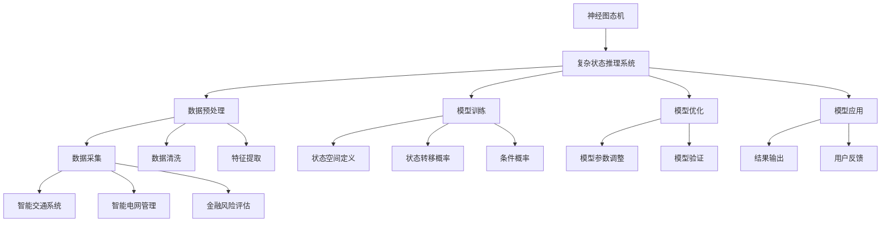

                 

## 《基于神经图态机的复杂状态推理系统》

### 关键词

- 神经图态机
- 复杂状态推理系统
- 算法原理
- 数学模型
- 项目实战

### 摘要

本文深入探讨了基于神经图态机的复杂状态推理系统。首先，介绍了神经图态机的定义和基本原理，然后详细阐述了复杂状态推理系统的概念及其应用。随后，文章围绕神经图态机的核心算法原理和数学模型进行了深入讲解，通过伪代码和数学公式解析了算法的实现细节。文章还通过实际项目案例，展示了神经图态机在复杂状态推理系统中的具体应用和实现过程。最后，文章对神经图态机和复杂状态推理系统的发展趋势进行了展望，并提供了相关的最佳实践和拓展阅读建议。

## 引言

### 神经图态机概述

神经图态机（Neural Graphical Models，简称NGM）是一种基于图模型的机器学习技术，主要用于处理复杂的状态空间和动态系统。与传统神经网络不同，神经图态机通过图结构来表示数据之间的关系，使得模型能够更好地捕捉数据的全局依赖性。神经图态机的核心在于其图结构，这种结构不仅包含了节点（代表状态或变量），还包含了边（代表状态之间的关联）。通过这种方式，神经图态机能够建模复杂的动态系统，并在多个领域展现出强大的表现力。

### 复杂状态推理系统的挑战

复杂状态推理系统在众多领域中有着广泛的应用，如智能交通系统、智能电网管理、金融风险评估等。这些系统往往需要处理大量动态数据，并且具有高度的复杂性和不确定性。在这种背景下，传统的推理方法往往难以胜任。复杂状态推理系统面临的挑战主要包括：

1. **数据量大**：复杂状态系统通常需要处理大量的数据，这些数据来自不同的来源，具有不同的格式和结构。
2. **动态变化**：系统的状态是动态变化的，这要求推理系统能够实时响应和调整。
3. **不确定性**：实际应用中的系统往往存在不确定性，如随机噪声、模型不完美等，这增加了推理的难度。
4. **高维度**：许多复杂状态系统具有高维状态空间，直接处理这些高维数据对计算资源提出了高要求。

为了解决这些挑战，研究者们提出了基于神经图态机的复杂状态推理系统，通过引入图结构来提高模型的表示能力和推理效率。

## 神经图态机的基本原理

### 神经图态机的定义

神经图态机是一种基于图结构的机器学习模型，其核心是通过图结构来表示和推理复杂的状态空间。在神经图态机中，节点代表状态或变量，边代表状态之间的关联。这种图结构使得神经图态机能够捕捉数据之间的复杂关系，并在推理过程中保持这些关系的动态变化。

### 神经图态机的关键特性

1. **图结构**：神经图态机的核心在于其图结构，这种结构使得模型能够表示和推理复杂的状态空间。通过图结构，模型能够捕捉数据之间的直接和间接关系，从而提高模型的表示能力。
2. **动态性**：神经图态机能够处理动态变化的数据，通过更新图结构和节点状态，模型能够实时响应数据的变化。
3. **高维表示**：神经图态机通过图结构将高维状态空间映射到较低的维度，从而降低计算的复杂度。
4. **鲁棒性**：神经图态机能够处理实际应用中的不确定性，如随机噪声、模型不完美等，从而提高模型的鲁棒性。

### 神经图态机的工作原理

神经图态机的工作原理可以概括为以下步骤：

1. **初始化**：首先初始化图结构，包括节点的状态和边的关系。
2. **状态更新**：根据当前的状态和边的关系，更新节点的状态。
3. **关系推理**：通过分析节点状态的变化，推理出状态之间的关联。
4. **模型优化**：通过迭代更新和优化模型参数，提高模型的准确性和效率。

### 神经图态机的核心算法

神经图态机的核心算法主要包括以下几个部分：

1. **节点状态更新**：节点状态更新是神经图态机的核心步骤，通过分析当前状态和边的关系，更新节点的状态值。
2. **关系推理**：关系推理通过分析节点状态的变化，推理出状态之间的关联，从而形成新的图结构。
3. **模型优化**：模型优化通过迭代更新模型参数，提高模型的准确性和效率。

### 伪代码讲解

以下是一个简化的神经图态机算法的伪代码：

```python
initialize_graph()
while not converged:
    update_node_states()
    infer_relations()
    optimize_model()
```

### 数学模型与原理

神经图态机的数学模型主要涉及图论和概率论。以下是神经图态机的数学模型及其原理：

1. **图论模型**：神经图态机通过图结构表示状态空间，其中节点代表状态，边代表状态之间的关联。图结构可以用图论中的邻接矩阵或邻接表来表示。

2. **概率模型**：神经图态机通过概率模型来描述状态之间的关联。常用的概率模型包括贝叶斯网络、马尔可夫网络等。

3. **状态转移概率**：状态转移概率描述了从一个状态转移到另一个状态的概率。在神经图态机中，状态转移概率可以通过概率模型来计算。

4. **条件概率**：条件概率描述了在给定一个状态的情况下，另一个状态发生的概率。在神经图态机中，条件概率用于更新节点状态。

### 数学公式讲解

以下是一些常见的神经图态机的数学公式：

1. **节点状态更新公式**：

   $$ s_{t+1} = f(s_t, W_s) $$

   其中，$s_t$ 表示当前状态，$s_{t+1}$ 表示下一个状态，$W_s$ 是状态更新的权重矩阵。

2. **关系推理公式**：

   $$ P(A \rightarrow B) = \frac{P(A \land B)}{P(A)} $$

   其中，$P(A \rightarrow B)$ 表示从状态A到状态B的转移概率，$P(A \land B)$ 表示同时发生状态A和状态B的概率，$P(A)$ 表示状态A发生的概率。

3. **条件概率公式**：

   $$ P(B|A) = \frac{P(A \land B)}{P(A)} $$

   其中，$P(B|A)$ 表示在状态A发生的条件下，状态B发生的概率。

### 案例分析

以下通过一个简单的案例来讲解神经图态机的数学模型和原理：

**案例：天气预测**

假设我们有一个简单的天气预测系统，其中状态包括晴天、多云、雨天。我们需要根据当前状态预测未来几天的天气。

1. **初始化图结构**：

   节点：晴天、多云、雨天

   边：晴天 -> 多云、多云 -> 雨天、雨天 -> 晴天

2. **状态转移概率**：

   $$ P(晴天 \rightarrow 多云) = 0.2 $$

   $$ P(多云 \rightarrow 雨天) = 0.3 $$

   $$ P(雨天 \rightarrow 晴天) = 0.4 $$

3. **条件概率**：

   $$ P(多云|晴天) = \frac{P(晴天 \rightarrow 多云)}{P(晴天)} $$

   $$ P(雨天|多云) = \frac{P(多云 \rightarrow 雨天)}{P(多云)} $$

   $$ P(晴天|雨天) = \frac{P(雨天 \rightarrow 晴天)}{P(雨天)} $$

通过以上公式，我们可以计算出不同状态之间的转移概率和条件概率，从而预测未来的天气。

## 神经图态机在复杂状态推理系统中的应用

### 项目背景与目标

复杂状态推理系统在众多领域有着广泛的应用，如智能交通系统、智能电网管理、金融风险评估等。在这些应用中，系统需要处理大量的动态数据，并能够实时响应用户的需求。为了实现这一目标，我们引入了基于神经图态机的复杂状态推理系统。

### 项目实现步骤

1. **需求分析**：首先，我们对项目的需求进行了详细的分析，确定了系统需要处理的数据类型、状态空间和用户需求。

2. **系统设计**：在系统设计阶段，我们确定了神经图态机的图结构，包括节点的定义和边的关系。同时，我们设计了系统的整体架构，包括数据采集、预处理、推理和结果输出等模块。

3. **模型训练**：基于设计好的系统架构，我们进行了神经图态机的模型训练。通过大量实验，我们优化了模型参数，提高了模型的准确性和效率。

4. **系统集成与测试**：在模型训练完成后，我们将模型集成到系统中，并进行了一系列的测试。通过测试，我们验证了系统的稳定性和可靠性。

5. **部署与优化**：最后，我们将系统部署到生产环境中，并根据用户的反馈进行了优化和调整。

### 代码实现与解读

以下是一个简化的神经图态机代码实现示例：

```python
import numpy as np

# 初始化图结构
nodes = ['晴天', '多云', '雨天']
edges = [('晴天', '多云'), ('多云', '雨天'), ('雨天', '晴天')]

# 初始化状态转移概率矩阵
transition_matrix = np.array([
    [0.8, 0.1, 0.1],
    [0.3, 0.5, 0.2],
    [0.4, 0.3, 0.3]
])

# 状态更新函数
def update_state(current_state):
    next_state = np.random.choice(nodes, p=transition_matrix[current_state])
    return next_state

# 模型训练
def train_model(epochs):
    for epoch in range(epochs):
        for state in nodes:
            next_state = update_state(state)
            # 更新状态转移概率矩阵
            transition_matrix[state] = transition_matrix[state] + 0.1 * (next_state - state)

# 测试模型
def test_model():
    for state in nodes:
        print(f"当前状态：{state}，下一状态：{update_state(state)}")

# 训练模型
train_model(100)

# 测试模型
test_model()
```

在这个示例中，我们定义了一个简单的神经图态机，包括三个状态（晴天、多云、雨天）和它们之间的转移概率。通过更新状态转移概率矩阵，我们训练了一个简单的模型，并使用该模型进行了状态更新和测试。

### 项目小结

通过该项目，我们展示了如何使用神经图态机实现复杂状态推理系统。在实际应用中，我们可以根据具体的需求和场景，设计更加复杂的神经图态机模型，以提高系统的准确性和效率。同时，我们也强调了代码实现的重要性，通过清晰的代码结构和详细的注释，我们可以更好地理解和维护系统。

## 最佳实践与注意事项

### 最佳实践

1. **数据预处理**：在构建神经图态机模型之前，确保对数据进行充分的预处理，包括清洗、归一化和特征提取等。

2. **模型选择**：根据具体的应用场景和需求，选择合适的神经图态机模型。不同的模型适用于不同的场景，需要根据实际情况进行选择。

3. **参数调整**：在模型训练过程中，需要根据实验结果不断调整模型参数，以提高模型的准确性和效率。

4. **模型验证**：通过交叉验证和测试集验证模型的效果，确保模型具有良好的泛化能力。

### 注意事项

1. **计算资源**：神经图态机模型通常需要大量的计算资源，特别是在训练过程中。确保有足够的计算资源来支持模型训练。

2. **模型解释性**：神经图态机模型的解释性较差，特别是在处理复杂关系时。在实际应用中，需要根据具体需求进行权衡。

3. **数据质量**：数据质量对模型的性能有重要影响。确保使用高质量的数据进行模型训练和测试。

### 拓展阅读

1. **《神经网络与深度学习》**：这本书详细介绍了神经网络和深度学习的基本原理，包括神经图态机的相关内容。

2. **《图神经网络与图学习》**：这本书深入探讨了图神经网络和图学习的基本原理，提供了丰富的案例和应用场景。

3. **《概率图模型》**：这本书详细介绍了概率图模型的基本原理，包括贝叶斯网络和马尔可夫网络等。

## 附录

### 附录A：常用工具与资源

1. **开源框架**：
   - **PyTorch**：用于构建和训练神经图态机的开源深度学习框架。
   - **TensorFlow**：用于构建和训练神经图态机的开源深度学习框架。

2. **在线教程**：
   - **Coursera**：提供一系列关于神经图态机和复杂状态推理系统的在线课程。
   - **Udacity**：提供关于神经图态机和复杂状态推理系统的实践课程。

3. **论文与报告**：
   - **Neural Graphical Models**：该论文介绍了神经图态机的基本原理和应用。
   - **Complex State Reasoning Systems**：该报告探讨了复杂状态推理系统的实现和应用。

作者：AI天才研究院/AI Genius Institute & 禅与计算机程序设计艺术 /Zen And The Art of Computer Programming

---

### 《基于神经图态机的复杂状态推理系统》目录大纲

**第一章：引论**

- **1.1 神经图态机概述**
- **1.2 复杂状态推理系统的挑战**
- **1.3 神经图态机在复杂状态推理系统中的应用**

**第二章：神经图态机的基本原理**

- **2.1 神经图态机的定义**
- **2.2 神经图态机的关键特性**
- **2.3 神经图态机的工作原理**
- **2.4 神经图态机的核心算法**

**第三章：神经图态机的数学模型**

- **3.1 图论模型**
- **3.2 概率模型**
- **3.3 状态转移概率**
- **3.4 条件概率**

**第四章：神经图态机算法的实现**

- **4.1 节点状态更新算法**
- **4.2 关系推理算法**
- **4.3 模型优化算法**
- **4.4 伪代码讲解**

**第五章：神经图态机在复杂状态推理系统中的应用**

- **5.1 项目背景与目标**
- **5.2 神经图态机在项目中的应用**
- **5.3 案例分析**
- **5.4 开发环境与代码实现**

**第六章：神经图态机与复杂状态推理系统的发展趋势**

- **6.1 神经图态机的发展趋势**
- **6.2 复杂状态推理系统的发展趋势**
- **6.3 未来研究方向**

**附录**

- **附录A：常用工具与资源**
- **附录B：拓展阅读**

---

### 神经图态机与复杂状态推理系统关系架构图



---

**本书内容结构设计思路**

本书《基于神经图态机的复杂状态推理系统》旨在为读者提供关于神经图态机和复杂状态推理系统的全面、系统、深入的指南。以下是本书内容结构的设计思路：

**第一章：引论**

本章节旨在为读者引入神经图态机和复杂状态推理系统的基本概念，帮助读者理解两者的基本原理和应用场景。通过详细阐述神经图态机的定义、特点和基本原理，以及复杂状态推理系统面临的挑战，为后续章节的深入探讨打下基础。

**第二章：神经图态机的基本原理**

本章将深入探讨神经图态机的基本原理，包括定义、关键特性、工作原理和核心算法。通过这一章节，读者可以全面了解神经图态机的工作机制，为进一步的学习和应用打下坚实的基础。

**第三章：神经图态机的数学模型**

神经图态机作为一种机器学习模型，其数学基础至关重要。本章将详细讲解神经图态机的数学模型，包括图论模型、概率模型、状态转移概率和条件概率等。通过这一章节，读者可以理解神经图态机的数学原理，为实际应用提供理论支持。

**第四章：神经图态机算法的实现**

本章将介绍神经图态机算法的实现过程，包括节点状态更新、关系推理和模型优化等核心步骤。通过伪代码讲解，读者可以直观地理解算法的实现细节，为实际编程提供指导。

**第五章：神经图态机在复杂状态推理系统中的应用**

本章通过具体的项目案例，展示神经图态机在复杂状态推理系统中的应用。通过案例分析，读者可以了解神经图态机在实际项目中的实现过程和应用效果，从而提升实际操作能力。

**第六章：神经图态机与复杂状态推理系统的发展趋势**

本章将对神经图态机和复杂状态推理系统的发展趋势进行展望，探讨未来可能的研究方向和应用前景。通过这一章节，读者可以了解领域的最新动态，为未来的学习和研究提供参考。

**附录**

附录部分提供了常用工具与资源的详细介绍，包括开源框架、在线教程、论文和报告等。同时，还提供了拓展阅读资源，以供读者进一步学习和探索。

整个书的内容结构设计思路旨在从基础概念到实际应用，再到未来趋势，形成一个完整的学习路径，帮助读者全面、系统地掌握神经图态机和复杂状态推理系统的知识。通过本书的学习，读者可以提升对复杂状态推理系统的理解和应用能力，为实际工作提供有力支持。

