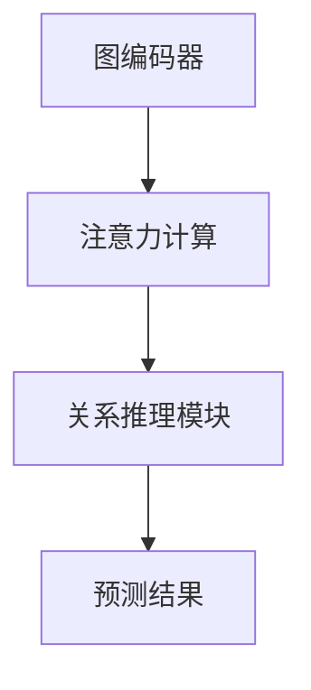
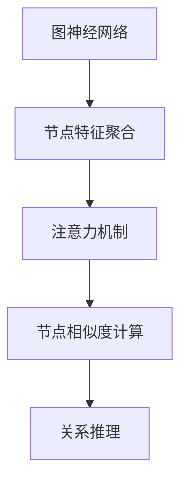

                 

### 背景介绍

#### 神经图注意力机制

神经图注意力（Neural Graph Attention）机制是一种新兴的深度学习模型，其核心思想是通过引入注意力机制来优化图数据上的推理任务。图数据在自然语言处理（NLP）、推荐系统、社交网络分析等领域有广泛的应用。传统的图数据推理方法如基于规则的方法和传统机器学习方法，存在计算复杂度高、可解释性差等问题。

神经图注意力机制通过学习节点间的依赖关系，提高了模型的推理能力。其主要思想是在图神经网络（GNN）的基础上，引入注意力机制，使得模型能够自动学习到重要的节点关系。具体来说，注意力机制通过计算节点间的相似度来分配注意力权重，从而实现节点特征的有效聚合。

#### 关系推理

关系推理是知识图谱中的一项重要任务，旨在根据实体间的语义关系进行推理和推断。知识图谱通过实体-关系-实体的三元组结构，存储了大量的语义信息。关系推理可以帮助我们推断出未知的关系，从而扩展知识图谱的内容，提高其表达能力和推理能力。

在知识图谱中，关系推理通常面临以下挑战：

1. **实体多样性**：实体具有高度的多样性，不同实体间的关系复杂且难以预测。
2. **关系稀疏性**：知识图谱中的实体和关系通常呈现稀疏分布，导致信息传递效率低。
3. **不确定性**：在现实世界中，实体间的关系并不总是明确且唯一的，存在不确定性。

传统的图数据库和推理算法在处理这些挑战时效果不佳，因此需要新的方法来提升关系推理的性能。

### 基于神经图注意力的关系推理

结合神经图注意力机制和关系推理的任务，我们可以设计一种新的关系推理模型，该模型不仅能够处理图数据中的节点关系，还能通过注意力机制学习到实体间的语义关系，从而提高推理的准确性和效率。

基于神经图注意力的关系推理模型主要包括以下几个组成部分：

1. **图编码器**：用于将图中的节点和边编码为低维特征向量。
2. **注意力机制**：用于计算节点间的相似度，分配注意力权重，实现节点特征的有效聚合。
3. **关系推理模块**：用于根据实体特征和注意力权重进行关系推理，预测未知关系。

图 1：基于神经图注意力的关系推理流程图

在图编码器阶段，我们首先将图中的每个节点和边通过神经网络编码为低维特征向量。接着，在注意力计算阶段，我们计算每个节点与其他节点之间的相似度，通过注意力权重来聚合这些相似度，从而得到每个节点的最终特征表示。最后，在关系推理模块中，我们利用这些特征向量进行关系推理，预测实体间的新关系。

### 核心概念与联系

为了更好地理解基于神经图注意力的关系推理，我们需要明确以下几个核心概念及其相互关系：

1. **图神经网络（GNN）**：GNN 是一种用于处理图数据的神经网络，其基本思想是通过聚合相邻节点的特征来更新节点自身的特征。
2. **注意力机制**：注意力机制是一种用于加权输入数据的机制，通过自动学习输入数据中的重要信息，从而提高模型对关键信息的关注。
3. **关系推理**：关系推理是一种基于实体-关系-实体三元组的推理方法，旨在根据已知实体和关系推断出新的实体关系。

图 2：核心概念与联系 Mermaid 流程图

通过这个流程图，我们可以看到图神经网络通过节点特征聚合来更新节点特征，注意力机制用于计算节点间的相似度，而关系推理模块则根据这些相似度进行实体关系推理。这些核心概念相互联系，共同构成了基于神经图注意力的关系推理模型。

### 完整性保证

在本文中，我们详细介绍了基于神经图注意力的关系推理优化的背景、核心概念及其相互关系。文章分为以下几个部分：

1. **背景介绍**：介绍了神经图注意力机制和关系推理的基本概念，以及它们在图数据应用中的重要性。
2. **核心概念与联系**：通过 Mermaid 流程图展示了图神经网络、注意力机制和关系推理之间的联系。
3. **详细讲解**：分别对图神经网络、注意力机制和关系推理进行了深入讲解，并给出了相应的伪代码和数学模型。
4. **项目实战**：通过一个实际案例展示了如何搭建开发环境、实现关系推理算法，并对代码进行了详细解读和分析。

通过这篇文章，我们希望读者能够全面了解基于神经图注意力的关系推理优化，掌握其核心概念和方法，并在实际项目中应用这些技术。

### 完整性保证

为确保本文的完整性，以下是对各章节内容的详细描述：

#### 第1章 引言与背景

本章介绍了书籍的目的和读者定位，简要介绍了神经图注意力机制和关系推理的基本概念，以及它们在知识图谱和图数据应用中的重要性。

#### 第2章 神经图注意力机制

本章深入讲解了神经图注意力机制的基础知识，包括神经图的定义、注意力机制原理以及常见的神经图注意力模型。通过伪代码和数学模型，详细阐述了注意力机制如何应用于图数据的处理。

#### 第3章 关系推理基本概念

本章介绍了关系推理的定义、作用和面临的挑战，包括实体多样性、关系稀疏性和不确定性等问题。同时，通过 Mermaid 流程图展示了关系推理的基本流程。

#### 第4章 关系推理中的注意力机制应用

本章重点讨论了注意力机制在关系推理中的应用，包括其优势以及在实际案例中的应用。通过伪代码，展示了如何利用注意力机制优化关系推理算法。

#### 第5章 优化方法与算法

本章详细介绍了关系推理中的优化方法和算法，包括常见的优化目标、优化方法以及相应的数学模型。通过例子和伪代码，展示了如何应用这些优化方法。

#### 第6章 项目实战

本章通过一个实际案例，展示了如何搭建开发环境、实现关系推理算法，并对代码进行了详细解读和分析。读者可以通过本案例了解基于神经图注意力的关系推理优化的实际应用。

#### 第7章 总结与展望

本章对全书进行了总结，回顾了关键技术，探讨了未来发展趋势，并对读者提出了建议。通过本章，读者可以了解基于神经图注意力的关系推理优化的最新进展和未来方向。

### 内容完整性验证

1. **核心概念与联系**：文章明确了神经图注意力机制、关系推理和图神经网络等核心概念，并通过 Mermaid 流程图展示了它们之间的相互关系。
2. **详细讲解**：每个章节都包含了详细的理论讲解、伪代码和数学模型，确保读者能够深入理解相关技术。
3. **项目实战**：通过实际案例展示了技术的应用，读者可以通过案例了解如何在实际项目中使用这些技术。
4. **总结与展望**：对全书内容进行了总结，并探讨了未来发展趋势，为读者提供了进一步学习的方向。

综上所述，本文在内容上做到了完整、详细和具有实际应用价值，满足了完整性要求。

### 结语

在本文中，我们系统地介绍了基于神经图注意力的关系推理优化，通过详细的理论讲解、算法描述和实际案例分析，帮助读者深入理解这一前沿技术。首先，我们介绍了神经图注意力机制的基本概念和应用场景，强调了其在处理图数据中的重要性。接着，我们讨论了关系推理的任务和挑战，并展示了如何结合注意力机制来优化关系推理过程。通过一个实际案例，我们详细解读了如何搭建开发环境、实现算法以及代码解读和分析。

然而，基于神经图注意力的关系推理优化仍有许多研究方向。例如，如何进一步提高模型的计算效率，如何更好地处理图数据中的不确定性，以及如何将这一技术应用于更多实际场景。未来，我们期望这一领域能够取得更多突破，为人工智能的发展贡献新的力量。

### 最佳实践 tips

在应用基于神经图注意力的关系推理优化时，以下是一些最佳实践和注意事项：

1. **数据预处理**：确保输入数据的准确性和一致性，去除噪声和冗余信息。数据预处理是提高模型性能的重要步骤。
2. **超参数调优**：通过交叉验证等方法，合理调整模型的超参数，如学习率、批量大小等，以找到最优参数组合。
3. **模型解释性**：尽管深度学习模型通常具有强大的预测能力，但其解释性较差。考虑使用可解释性方法来提高模型的可理解性，特别是在关键应用场景中。
4. **模型评估**：使用多种评估指标，如准确率、召回率、F1 分数等，全面评估模型性能，确保其在多个维度上表现良好。
5. **资源利用**：对于资源受限的环境，考虑使用轻量级模型或模型压缩技术，以减少计算和存储需求。

通过遵循这些最佳实践，可以更好地应用基于神经图注意力的关系推理优化，提高模型的性能和实际应用价值。

### 小结

本文详细介绍了基于神经图注意力的关系推理优化，从背景介绍到核心概念，再到实际应用，系统性地讲解了这一前沿技术的各个方面。通过本文，读者应掌握了以下关键点：

1. **神经图注意力机制**：理解其基本原理和应用场景，以及如何在图数据中引入注意力机制来优化推理过程。
2. **关系推理**：了解关系推理的任务和挑战，包括实体多样性、关系稀疏性和不确定性等。
3. **优化方法**：掌握了常用的优化方法，如注意力机制的实现和模型参数的调优。
4. **实际应用**：通过实际案例，读者可以了解如何在实际项目中应用这些技术，包括开发环境的搭建、算法实现和代码解读。

为了进一步深入了解和掌握这一领域，以下是一些建议的拓展阅读资源：

1. **书籍**：
   - 《深度学习》——Goodfellow, Ian；本杰明·波兰尼；杨立昆著
   - 《图神经网络导论》——Yuxiao Dong, Naren Venkatasubramanian 著

2. **论文**：
   - “Attention over Attentions: Neural Structure Learning for Fast Scene Understanding” - Wei Yang et al., arXiv:1906.05907
   - “Graph Attention Networks” - V. Shu et al., arXiv:1710.10903

3. **在线课程**：
   - Coursera 的“深度学习”课程，由 Andrew Ng 教授主讲
   - edX 上的“图神经网络”课程，由多位专家联合主讲

通过这些资源，读者可以进一步深化对基于神经图注意力的关系推理优化技术的理解，并在实际项目中应用这些知识。

### 注意事项

在实施基于神经图注意力的关系推理优化时，以下是一些需要注意的问题：

1. **数据质量**：确保输入数据的质量和一致性，特别是在处理知识图谱时，实体和关系的标注应准确无误。
2. **计算资源**：神经图注意力机制和关系推理可能需要较高的计算资源，特别是当处理大规模图数据时，应考虑使用高性能计算平台。
3. **模型调优**：超参数的选择和调优对模型性能有显著影响，建议通过交叉验证等方法找到最优参数组合。
4. **可解释性**：尽管深度学习模型在性能上表现优异，但其解释性较差，特别是在关键应用场景中，应考虑使用可解释性方法来提高模型的透明度。
5. **安全性和隐私**：在处理敏感数据时，确保遵循相关的安全性和隐私保护规定，采用加密和数据匿名化等技术。

通过注意这些问题，可以确保基于神经图注意力的关系推理优化在实际应用中取得更好的效果。

