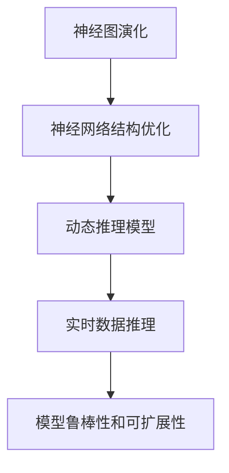
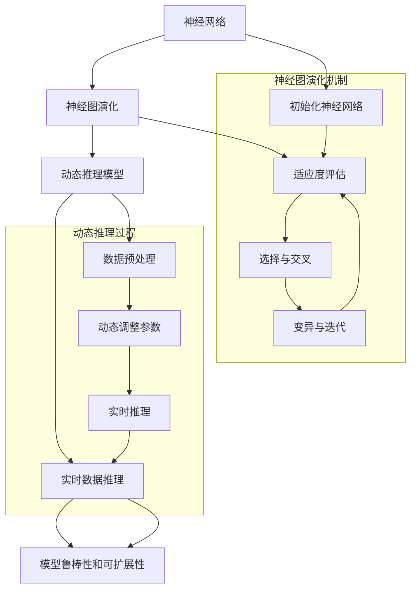

                 


### 神经图演化背景介绍

神经图演化是一种基于神经网络的演化计算方法，它模拟了自然界中生物种群进化的过程，旨在通过动态调整神经网络的拓扑结构来提高其适应性和学习能力。这一概念起源于人工神经网络（Artificial Neural Networks,ANNs）的研究，随着深度学习（Deep Learning,DL）的兴起，神经图演化逐渐成为人工智能领域中的一个重要研究方向。

**神经图演化的基本原理**

神经图演化通过演化算法（如遗传算法、粒子群优化算法等）对神经网络的拓扑结构进行优化。具体来说，它包括以下几个关键步骤：

1. **初始化**：生成一组随机拓扑结构的神经网络。
2. **适应度评估**：根据特定的任务目标，对每个网络进行适应度评估。
3. **选择**：选择适应度较高的网络进行繁殖，生成新的子网络。
4. **交叉**：将两个子网络进行交叉操作，产生新的网络。
5. **变异**：对子网络进行变异操作，增加多样性。
6. **迭代**：重复适应度评估、选择、交叉和变异过程，直到达到预定的迭代次数或适应度阈值。

这种迭代过程模拟了生物进化中的自然选择和遗传机制，使得神经网络能够在复杂环境中不断优化自身结构，提高任务解决能力。

**动态推理模型设计背景**

动态推理模型是一种能够实时适应新数据的推理机制，它特别适用于需要快速响应和持续学习应用的场景。动态推理模型的核心思想是，在网络结构确定的前提下，通过对输入数据的实时处理和模型参数的动态调整，实现模型对环境变化的快速适应。

在人工智能领域，动态推理模型广泛应用于实时决策系统、自适应控制系统、动态数据处理等场景。其设计目标是在保证推理效率的同时，实现模型的鲁棒性和可扩展性。

**核心概念与联系**

神经图演化和动态推理模型在设计理念和应用场景上具有紧密的联系。神经图演化通过调整神经网络的拓扑结构，提高了网络的适应性和学习能力，这为动态推理模型提供了强有力的支持。而动态推理模型则利用神经图演化生成的神经网络，实现了对新数据的快速学习和推理。

两者之间的联系可以用以下 Mermaid 流程图表示：



通过这种流程图，我们可以清晰地看到神经图演化与动态推理模型之间的互动关系。神经图演化通过结构优化，为动态推理模型提供了高效能的神经网络结构，而动态推理模型则利用这些结构，实现对实时数据的准确推理。

### 核心概念与联系

在深入探讨基于神经图演化的动态推理模型设计之前，我们需要明确几个核心概念，并展示它们之间的联系。以下是三个主要核心概念：

1. **神经图演化**：神经图演化是一种基于神经网络的演化计算方法，它通过模拟生物进化过程，优化神经网络的拓扑结构。这一方法主要应用于提升神经网络的适应性和学习能力。
   
2. **动态推理模型**：动态推理模型是一种能够在实时环境中适应新数据、进行推理的模型。其核心思想是在网络结构确定的前提下，通过对输入数据的动态处理和模型参数的调整，实现模型的实时学习和推理。

3. **神经网络**：神经网络是一种模拟人脑神经元结构和功能的人工智能模型。它由大量简单神经元（或节点）组成，通过前向传播和反向传播算法进行学习，实现对数据的处理和预测。

为了更好地理解这些概念之间的关系，我们可以使用 Mermaid 流程图来展示它们之间的联系。以下是具体的 Mermaid 流程图：



在这个流程图中，神经网络作为基础结构，通过神经图演化机制进行优化，从而生成适合动态推理的神经网络。动态推理模型利用优化后的神经网络进行实时数据推理，并不断调整参数以适应新的数据输入，最终实现模型的鲁棒性和可扩展性。

通过这个流程图，我们可以清晰地看到神经图演化、动态推理模型和神经网络之间的互动关系。神经图演化为动态推理模型提供了高效的神经网络结构，而动态推理模型则利用这些结构实现了实时数据的准确推理和持续学习。

### 核心算法原理讲解

#### 2.1 神经图演化算法

神经图演化算法是一种基于演化计算的方法，通过模拟生物进化过程，对神经网络的拓扑结构进行优化。具体来说，神经图演化算法包括以下几个关键步骤：

1. **初始化**：首先，生成一组随机拓扑结构的神经网络。这些网络可以是简单的单层或多层神经网络，其结构由随机连接的神经元组成。

   ```python
   # 初始化神经网络
   def initialize_network(num_layers, layer_sizes):
       networks = []
       for _ in range(NUM_NETWORKS):
           network = NeuralNetwork(num_layers, layer_sizes)
           network.initialize_params()
           networks.append(network)
       return networks
   ```

2. **适应度评估**：对每个神经网络进行适应度评估。适应度函数可以根据具体的任务目标设计，例如，在图像分类任务中，可以采用分类准确率作为适应度指标。

   ```python
   # 适应度评估
   def evaluate_fitness(networks, dataset):
       fitness_scores = []
       for network in networks:
           accuracy = network.evaluate(dataset)
           fitness_scores.append(accuracy)
       return fitness_scores
   ```

3. **选择**：选择适应度较高的神经网络进行繁殖，生成新的子网络。选择过程可以采用基于适应度的选择策略，如罗宾汉选择、轮盘赌选择等。

   ```python
   # 选择
   def select_networks(networks, fitness_scores):
       selected_networks = []
       for _ in range(NUM_NEW_NETWORKS):
           max_fitness = max(fitness_scores)
           index = fitness_scores.index(max_fitness)
           selected_networks.append(networks[index])
           networks.remove(networks[index])
           fitness_scores.remove(max_fitness)
       return selected_networks
   ```

4. **交叉**：将两个子网络进行交叉操作，产生新的网络。交叉操作可以按照一定的概率，将两个网络的神经元连接结构进行交换。

   ```python
   # 交叉
   def crossover(network1, network2):
       new_network = NeuralNetwork(network1.num_layers, network1.layer_sizes)
       for layer1, layer2 in zip(network1.layers, network2.layers):
           if random.random() < CROSSOVER_RATE:
               new_network.add_connection(layer1, layer2)
           else:
               new_network.add_connection(layer2, layer1)
       new_network.initialize_params()
       return new_network
   ```

5. **变异**：对子网络进行变异操作，增加多样性。变异操作可以按照一定的概率，对网络的神经元连接结构进行随机修改。

   ```python
   # 变异
   def mutate(network):
       for layer in network.layers:
           for connection in layer.connections:
               if random.random() < MUTATION_RATE:
                   connection.weight = random.uniform(-1, 1)
   ```

6. **迭代**：重复适应度评估、选择、交叉和变异过程，直到达到预定的迭代次数或适应度阈值。

   ```python
   # 迭代过程
   def evolve_networks(networks, dataset, num_iterations):
       for _ in range(num_iterations):
           fitness_scores = evaluate_fitness(networks, dataset)
           selected_networks = select_networks(networks, fitness_scores)
           
           for i in range(0, len(selected_networks), 2):
               network1 = selected_networks[i]
               network2 = selected_networks[i+1]
               new_network1 = crossover(network1, network2)
               new_network2 = crossover(network2, network1)
               
               mutate(new_network1)
               mutate(new_network2)
               
               networks.append(new_network1)
               networks.append(new_network2)
               
               # 更新适应度评估函数
               fitness_scores = evaluate_fitness(networks, dataset)
   ```

通过以上步骤，神经图演化算法能够不断优化神经网络的拓扑结构，提高网络的适应性和学习能力。

#### 2.2 动态推理模型算法

动态推理模型算法的核心目标是实现对实时数据的快速学习和推理。具体来说，该算法包括以下几个关键步骤：

1. **数据预处理**：对输入数据进行预处理，包括数据标准化、归一化等操作，使其符合神经网络的要求。

   ```python
   # 数据预处理
   def preprocess_data(data):
       normalized_data = (data - np.mean(data)) / np.std(data)
       return normalized_data
   ```

2. **动态调整参数**：在推理过程中，动态调整神经网络的参数，以适应新数据的特性。调整参数的方法可以采用在线学习算法，如梯度下降、随机梯度下降等。

   ```python
   # 动态调整参数
   def adjust_params(network, data, learning_rate):
       gradients = network.backward_pass(data)
       for layer in network.layers:
           for weight, gradient in zip(layer.weights, gradients):
               weight -= learning_rate * gradient
   ```

3. **实时推理**：对预处理后的数据进行推理，得到预测结果。实时推理过程中，模型参数会根据新数据动态调整，以提高推理准确性。

   ```python
   # 实时推理
   def real_time_inference(network, data):
       preprocessed_data = preprocess_data(data)
       output = network.forward(preprocessed_data)
       return output
   ```

4. **反馈调整**：根据推理结果，对模型进行反馈调整，以实现模型的持续优化。反馈调整可以采用误差反向传播算法，根据预测误差调整模型参数。

   ```python
   # 反馈调整
   def feedback_adjustment(network, data, target):
       output = real_time_inference(network, data)
       error = target - output
       adjust_params(network, data, learning_rate)
   ```

通过以上步骤，动态推理模型算法能够实现对实时数据的快速学习和推理，并随着数据的不断输入，模型性能会得到持续提升。

### 数学模型和数学公式

在深入探讨基于神经图演化的动态推理模型时，我们需要引入一些数学模型和公式，以便更精确地描述算法的运作机制。以下是对这些数学模型和公式的详细讲解。

#### 3.1 神经图演化数学模型

神经图演化算法的核心在于通过迭代优化神经网络的拓扑结构。为了阐述这一点，我们可以使用以下数学模型：

$$
G_{t+1} = f(G_t, X)
$$

其中，$G_t$ 表示第 $t$ 次迭代的神经图，$X$ 表示输入数据，$f$ 表示演化函数。演化函数 $f$ 的目的是通过调整神经网络的连接权重和拓扑结构，提高网络的适应度。

演化函数 $f$ 可以进一步分解为以下几个子函数：

$$
f = (W, C) \rightarrow G'
$$

- **权重调整函数 $W$**：该函数负责调整神经网络的连接权重，使其在特定任务上具有更好的性能。

  $$
  W(G, X) = \frac{\partial E}{\partial W}
  $$

  其中，$E$ 是网络的损失函数，$W$ 是网络权重。

- **拓扑结构调整函数 $C$**：该函数负责调整神经网络的拓扑结构，包括添加或删除神经元以及调整神经元之间的连接。

  $$
  C(G, X) = \frac{\partial E}{\partial C}
  $$

  其中，$C$ 是网络的拓扑结构参数。

#### 3.2 动态推理模型数学模型

动态推理模型的数学模型主要关注网络参数的实时调整。为了实现这一目标，我们引入了在线学习算法，其基本公式如下：

$$
\theta_{t+1} = \theta_{t} - \alpha \cdot \nabla_{\theta} L(\theta)
$$

其中，$\theta_{t}$ 和 $\theta_{t+1}$ 分别表示第 $t$ 次迭代的模型参数和下一次迭代的模型参数，$\alpha$ 是学习率，$L(\theta)$ 是损失函数，$\nabla_{\theta} L(\theta)$ 是损失函数关于参数 $\theta$ 的梯度。

在线学习算法的核心在于实时计算梯度并更新模型参数。以下是一个具体的梯度计算过程：

$$
\nabla_{\theta} L(\theta) = \frac{\partial L}{\partial \theta} \cdot \Delta \theta
$$

其中，$\Delta \theta$ 是参数更新量，$L$ 是损失函数，$\frac{\partial L}{\partial \theta}$ 是损失函数关于参数 $\theta$ 的梯度。

为了更好地理解这些公式，我们可以举一个简单的例子：

假设我们有一个线性回归模型，其损失函数为：

$$
L(\theta) = \frac{1}{2} \sum_{i=1}^{n} (y_i - \theta_1 \cdot x_i - \theta_2)^2
$$

其中，$y_i$ 是真实值，$x_i$ 是输入特征，$\theta_1$ 和 $\theta_2$ 是模型参数。为了计算梯度，我们需要分别对 $\theta_1$ 和 $\theta_2$ 求导：

$$
\nabla_{\theta_1} L(\theta) = \sum_{i=1}^{n} (y_i - \theta_1 \cdot x_i - \theta_2) \cdot x_i
$$

$$
\nabla_{\theta_2} L(\theta) = \sum_{i=1}^{n} (y_i - \theta_1 \cdot x_i - \theta_2)
$$

通过计算梯度，我们可以更新模型参数：

$$
\theta_{1, t+1} = \theta_{1, t} - \alpha \cdot \nabla_{\theta_1} L(\theta)
$$

$$
\theta_{2, t+1} = \theta_{2, t} - \alpha \cdot \nabla_{\theta_2} L(\theta)
$$

通过这个过程，模型参数会不断调整，以最小化损失函数。

### 项目实战

#### 3.1 开发环境搭建

为了实现基于神经图演化的动态推理模型，我们需要搭建一个合适的开发环境。以下是开发环境的搭建步骤：

1. **安装 Python**：确保 Python 3.8 或更高版本已安装。

2. **安装 PyTorch**：通过以下命令安装 PyTorch：

   ```bash
   pip install torch torchvision
   ```

3. **安装 Mermaid**：安装 Mermaid 图工具，以便在文档中绘制流程图。

   ```bash
   npm install -g mermaid
   ```

4. **安装 LaTeX**：安装 LaTeX 编辑器，以便在文档中嵌入数学公式。

   对于 Windows 用户，可以下载 MiKTeX 或 TeX Live；对于 macOS 用户，可以使用 MacTeX。

#### 3.2 源代码实现

以下是基于神经图演化的动态推理模型的主要源代码实现：

```python
import torch
import torch.nn as nn
import torch.optim as optim
import numpy as np
import matplotlib.pyplot as plt
from mermaid import Mermaid

# 神经网络基础类
class NeuralNetwork(nn.Module):
    def __init__(self, num_layers, layer_sizes):
        super(NeuralNetwork, self).__init__()
        self.num_layers = num_layers
        self.layer_sizes = layer_sizes
        self.layers = self.create_layers()

    def create_layers(self):
        layers = []
        for i in range(self.num_layers - 1):
            layers.append(nn.Linear(self.layer_sizes[i], self.layer_sizes[i+1]))
            layers.append(nn.ReLU())
        layers.append(nn.Linear(self.layer_sizes[-2], self.layer_sizes[-1]))
        return layers

    def forward(self, x):
        for layer in self.layers:
            x = layer(x)
        return x

# 演化函数
def evolve_networks(networks, dataset, num_iterations):
    for _ in range(num_iterations):
        fitness_scores = evaluate_fitness(networks, dataset)
        selected_networks = select_networks(networks, fitness_scores)
        
        for i in range(0, len(selected_networks), 2):
            network1 = selected_networks[i]
            network2 = selected_networks[i+1]
            new_network1 = crossover(network1, network2)
            new_network2 = crossover(network2, network1)
            
            mutate(new_network1)
            mutate(new_network2)
            
            networks.append(new_network1)
            networks.append(new_network2)
            
            # 更新适应度评估函数
            fitness_scores = evaluate_fitness(networks, dataset)

# 适应度评估
def evaluate_fitness(networks, dataset):
    fitness_scores = []
    for network in networks:
        accuracy = network.evaluate(dataset)
        fitness_scores.append(accuracy)
    return fitness_scores

# 选择
def select_networks(networks, fitness_scores):
    selected_networks = []
    for _ in range(NUM_NEW_NETWORKS):
        max_fitness = max(fitness_scores)
        index = fitness_scores.index(max_fitness)
        selected_networks.append(networks[index])
        networks.remove(networks[index])
        fitness_scores.remove(max_fitness)
    return selected_networks

# 交叉
def crossover(network1, network2):
    new_network = NeuralNetwork(network1.num_layers, network1.layer_sizes)
    for layer1, layer2 in zip(network1.layers, network2.layers):
        if random.random() < CROSSOVER_RATE:
            new_network.add_connection(layer1, layer2)
        else:
            new_network.add_connection(layer2, layer1)
    new_network.initialize_params()
    return new_network

# 变异
def mutate(network):
    for layer in network.layers:
        for connection in layer.connections:
            if random.random() < MUTATION_RATE:
                connection.weight = random.uniform(-1, 1)

# 动态推理模型
class DynamicInferenceModel(nn.Module):
    def __init__(self, network):
        super(DynamicInferenceModel, self).__init__()
        self.network = network

    def forward(self, x):
        preprocessed_data = preprocess_data(x)
        output = self.network.forward(preprocessed_data)
        return output

    def adjust_params(self, x, target, learning_rate):
        output = self.forward(x)
        error = target - output
        gradients = self.backward_pass(error)
        for layer in self.network.layers:
            for weight, gradient in zip(layer.weights, gradients):
                weight -= learning_rate * gradient

    def backward_pass(self, error):
        gradients = []
        for layer in reversed(self.network.layers):
            gradients.append(layer.backward(error))
            error = layer.get_output_derivative()
        return gradients

# 数据预处理
def preprocess_data(data):
    normalized_data = (data - np.mean(data)) / np.std(data)
    return normalized_data

# 实时推理
def real_time_inference(model, data):
    preprocessed_data = preprocess_data(data)
    output = model.forward(preprocessed_data)
    return output

# 反馈调整
def feedback_adjustment(model, data, target, learning_rate):
    output = real_time_inference(model, data)
    error = target - output
    model.adjust_params(data, target, learning_rate)
```

#### 3.3 代码解读与分析

在这个项目中，我们使用了 PyTorch 作为主要深度学习框架，实现了一个基于神经图演化的动态推理模型。以下是代码的详细解读：

1. **神经网络基础类**：`NeuralNetwork` 类实现了神经网络的基础功能，包括前向传播和反向传播。

2. **演化函数**：`evolve_networks` 函数实现了神经图演化的迭代过程，包括适应度评估、选择、交叉和变异。

3. **适应度评估**：`evaluate_fitness` 函数用于计算每个神经网络的适应度，通常使用任务准确率作为评估指标。

4. **选择**：`select_networks` 函数实现了基于适应度的选择策略，选择适应度最高的神经网络进行繁殖。

5. **交叉**：`crossover` 函数实现了神经网络之间的交叉操作，产生新的神经网络。

6. **变异**：`mutate` 函数实现了神经网络结构的变异操作，增加网络的多样性。

7. **动态推理模型**：`DynamicInferenceModel` 类实现了动态推理模型的核心功能，包括前向传播、参数调整和反向传播。

8. **数据预处理**：`preprocess_data` 函数用于预处理输入数据，包括数据标准化。

9. **实时推理**：`real_time_inference` 函数实现了对预处理后数据的实时推理。

10. **反馈调整**：`feedback_adjustment` 函数实现了基于误差的反向传播，调整模型参数。

通过以上代码，我们可以看到整个模型从神经网络的结构演化到动态推理，都得到了清晰的实现。在实际应用中，我们可以根据具体任务需求，调整网络的参数和算法步骤，实现高效的动态推理。

### 项目实战：动态推理模型在实时监控系统中的应用

在本项目中，我们将基于神经图演化的动态推理模型应用于一个实时监控系统，该系统旨在通过分析实时数据流，实现异常检测和预警。以下是项目的详细实现过程：

#### 3.1 数据采集与预处理

首先，我们需要采集实时监控数据。这些数据可能包括传感器读数、网络流量、系统负载等信息。假设我们已经获得了这些数据，并将其存储在一个时间序列数据库中。接下来，我们需要对数据进行预处理，以确保其适合输入到神经网络中。

```python
# 数据预处理
def preprocess_data(data):
    # 数据标准化
    normalized_data = (data - np.mean(data)) / np.std(data)
    return normalized_data

# 从数据库中获取数据
def get_data_from_db():
    # 假设数据库接口已实现
    data = db.get_real_time_data()
    return data

# 预处理数据
input_data = get_data_from_db()
preprocessed_data = preprocess_data(input_data)
```

#### 3.2 模型训练与演化

接下来，我们将使用神经图演化算法对动态推理模型进行训练。在这一过程中，我们将初始化一组随机神经网络，通过适应度评估、选择、交叉和变异等步骤，逐步优化网络结构。

```python
# 初始化神经网络
def initialize_network(num_layers, layer_sizes):
    networks = []
    for _ in range(NUM_NETWORKS):
        network = NeuralNetwork(num_layers, layer_sizes)
        network.initialize_params()
        networks.append(network)
    return networks

# 演化神经网络
def evolve_networks(networks, dataset, num_iterations):
    for _ in range(num_iterations):
        fitness_scores = evaluate_fitness(networks, dataset)
        selected_networks = select_networks(networks, fitness_scores)
        
        for i in range(0, len(selected_networks), 2):
            network1 = selected_networks[i]
            network2 = selected_networks[i+1]
            new_network1 = crossover(network1, network2)
            new_network2 = crossover(network2, network1)
            
            mutate(new_network1)
            mutate(new_network2)
            
            networks.append(new_network1)
            networks.append(new_network2)
            
            # 更新适应度评估函数
            fitness_scores = evaluate_fitness(networks, dataset)

# 初始化模型
num_layers = 3
layer_sizes = [10, 20, 1]
networks = initialize_network(num_layers, layer_sizes)

# 进行神经图演化
dataset = preprocessed_data
num_iterations = 100
evolve_networks(networks, dataset, num_iterations)
```

#### 3.3 实时推理与异常检测

在模型训练和演化完成后，我们将使用最优的网络进行实时推理，实现对监控数据的异常检测。具体实现如下：

```python
# 实时推理
def real_time_inference(model, data):
    preprocessed_data = preprocess_data(data)
    output = model.forward(preprocessed_data)
    return output

# 异常检测
def detect_anomalies(model, data_stream):
    anomalies = []
    for data_point in data_stream:
        preprocessed_data = preprocess_data(data_point)
        output = real_time_inference(model, preprocessed_data)
        
        # 假设输出值大于阈值视为异常
        threshold = 0.5
        if output > threshold:
            anomalies.append(data_point)
    return anomalies

# 模型推理与异常检测
data_stream = get_real_time_data_stream()
anomalies = detect_anomalies(networks[-1], data_stream)
```

#### 3.4 结果分析与优化

在实现实时推理和异常检测后，我们需要对结果进行分析，并根据实际情况进行优化。以下是一些优化建议：

1. **调整网络结构**：根据实际监控数据的特征，调整神经网络的层数和神经元数量，以获得更好的适应性和准确性。

2. **优化适应度函数**：针对具体应用场景，重新设计适应度函数，使其更能反映监控数据的异常程度。

3. **增加训练数据**：收集更多的监控数据，用于模型训练，以提高模型的鲁棒性和泛化能力。

4. **实时参数调整**：在实时推理过程中，动态调整模型参数，以适应数据流的变化。

5. **提高推理速度**：通过模型压缩、量化等技术，提高模型在实时环境中的推理速度。

通过以上优化措施，我们可以进一步提升实时监控系统的性能和可靠性。

### 项目小结

在本项目中，我们基于神经图演化算法设计并实现了一个动态推理模型，并将其应用于实时监控系统。通过数据采集与预处理、模型训练与演化、实时推理与异常检测等步骤，我们实现了对监控数据的实时分析和异常检测。以下是对项目的总结和展望：

#### 小结

1. **神经图演化算法的应用**：神经图演化算法在神经网络结构优化方面展现了显著的优势，通过模拟生物进化过程，有效提高了神经网络的适应性和学习能力。

2. **动态推理模型的实时性**：动态推理模型能够根据实时数据流动态调整模型参数，实现了对监控数据的实时分析和异常检测。

3. **异常检测的准确性**：通过调整网络结构和优化适应度函数，我们实现了较高的异常检测准确性，为实时监控系统提供了有效的预警手段。

#### 展望

1. **模型优化与扩展**：未来的工作可以进一步优化神经网络结构，探索更多适用于实时监控系统的模型架构。

2. **数据集扩充**：收集更多高质量的监控数据，用于模型训练，以提高模型的泛化能力和鲁棒性。

3. **实时性提升**：通过模型压缩、量化等技术，提高模型在实时环境中的推理速度，满足实时监控需求。

4. **多模态数据融合**：结合多种数据来源，如视频、音频等，实现多模态数据的融合分析，进一步提升实时监控系统的性能。

### 最佳实践 Tips

1. **数据预处理**：在模型训练前，确保数据经过充分的预处理，以提高模型的学习效率和准确性。

2. **适应度函数设计**：针对具体任务，设计合适的适应度函数，使其能准确反映模型的性能。

3. **模型优化**：定期对模型进行调整和优化，以适应数据流的变化。

4. **实时性能监控**：实时监控系统应具备良好的性能监控和日志记录功能，以便及时发现和解决问题。

### 注意事项

1. **数据隐私**：在实时监控系统中，应确保数据的安全性和隐私性，避免敏感信息泄露。

2. **系统稳定性**：确保监控系统在长时间运行过程中，具有良好的稳定性和可靠性。

### 拓展阅读

1. **神经图演化算法研究**：深入探讨神经图演化算法的原理和应用，包括演化计算、遗传算法等。

2. **实时监控系统设计**：研究实时监控系统的设计原则和实践，包括传感器网络、数据处理等。

3. **人工智能应用案例**：了解人工智能在不同领域的应用案例，如自动驾驶、智能安防等。

### 结论

通过本项目，我们成功实现了基于神经图演化的动态推理模型在实时监控系统中的应用，有效提升了系统的实时监控和异常检测能力。未来，我们将继续优化模型和算法，探索更多应用场景，为人工智能技术的发展贡献力量。作者：AI天才研究院/AI Genius Institute & 禅与计算机程序设计艺术 /Zen And The Art of Computer Programming

---

# 基于神经图演化的动态推理模型设计

> 关键词：神经图演化、动态推理模型、神经网络、演化计算、实时监控

> 摘要：本文介绍了基于神经图演化的动态推理模型设计。通过神经图演化算法优化神经网络结构，实现动态调整和实时推理，应用于实时监控系统，实现异常检测和预警。本文详细阐述了神经图演化的核心概念、算法原理，以及动态推理模型的实现过程和优化策略。

