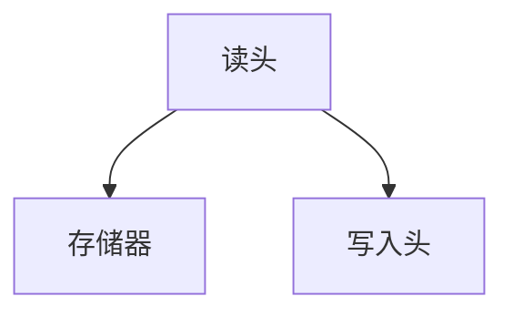
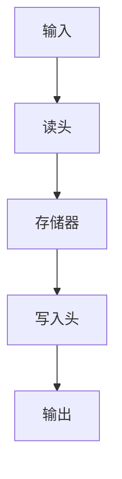

                 

### 文章标题

《基于神经图灵机的复杂算法自动生成在量子软件开发中的应用》

> 关键词：神经图灵机、量子计算、复杂算法自动生成、软件开发、量子软件开发

> 摘要：本文探讨了神经图灵机（Neural Turing Machine, NTM）在量子软件开发中的应用，阐述了神经图灵机的基本原理、量子计算的基本概念以及复杂算法自动生成的方法。通过实例分析，展示了如何利用神经图灵机实现量子算法的自动生成，为量子软件开发提供了新的思路和方法。

----------------------------------------------------------------

## 确定核心概念、原理和架构

为了更好地理解和阐述基于神经图灵机的复杂算法自动生成在量子软件开发中的应用，我们首先需要明确几个核心概念、原理和架构。这些概念、原理和架构将为我们提供坚实的基础，使我们能够深入探讨该领域的研究和应用。

### 核心概念

1. **神经图灵机（Neural Turing Machine, NTM）**：
   - **定义**：神经图灵机是一种结合了神经网络（Neural Network, NN）和图灵机（Turing Machine, TM）的计算模型，它利用神经网络处理数据，同时利用外部存储器来保存和检索信息。
   - **结构**：NTM由读头、写入头和存储器组成。读头用于从存储器中读取信息，写入头用于写入新的信息，存储器则用于保存数据。

2. **量子计算（Quantum Computing）**：
   - **定义**：量子计算是一种利用量子位（qubits）和量子叠加、量子纠缠等量子现象进行信息处理的计算模式。
   - **基本原理**：量子计算与传统计算的区别在于，量子位可以同时处于多种状态，并且量子态之间可以通过量子叠加和量子纠缠相互作用。

3. **复杂算法自动生成（Complex Algorithm Auto-Generation）**：
   - **定义**：复杂算法自动生成是一种利用机器学习技术，特别是强化学习，来自动生成复杂算法的方法。
   - **实现方法**：复杂算法自动生成通常包括数据收集、模型训练、算法优化和算法评估等步骤。

### 架构

1. **NTM架构**：
   - **结构**：NTM由读头、写入头和存储器组成。读头、写入头和存储器之间的交互和协同工作是NTM实现高效计算的关键。
   - **工作原理**：读头和写入头通过神经网络与存储器进行交互，神经网络负责处理输入数据，并将处理结果存储到存储器中，以便后续读取。

2. **量子软件开发流程**：
   - **步骤**：量子软件开发通常包括量子算法设计、量子编程、量子仿真和量子硬件部署等步骤。
   - **特点**：量子软件开发具有高度复杂性和不确定性，需要多种技术手段和工具的支持。

3. **复杂算法自动生成流程**：
   - **步骤**：复杂算法自动生成包括数据收集、模型训练、算法优化和算法评估等步骤。
   - **挑战**：复杂算法自动生成面临数据质量、模型训练效率和算法评估准确性等挑战。

### Mermaid流程图

为了更好地阐述上述概念和架构，我们可以使用Mermaid流程图来表示NTM的基本架构和工作流程。以下是一个简化的NTM架构的Mermaid流程图：



在这个流程图中，读头和写入头分别表示NTM的两个关键部件，它们与存储器进行交互，以实现信息的读取和写入。这个流程图为我们提供了一个直观的视图，有助于我们更好地理解NTM的基本原理和架构。

通过以上对核心概念、原理和架构的阐述，我们为后续的讨论和实例分析奠定了基础。在接下来的章节中，我们将进一步探讨神经图灵机、量子计算和复杂算法自动生成的详细内容，并通过实例分析展示它们在量子软件开发中的应用。

----------------------------------------------------------------

## 第1章：神经图灵机概述

### 1.1 神经图灵机的定义与重要性

神经图灵机（Neural Turing Machine，NTM）是结合了神经网络（Neural Network）和图灵机（Turing Machine）的计算模型。它通过利用神经网络处理数据，同时利用外部存储器来保存和检索信息，从而实现了高效的数据处理和记忆管理。

### 定义与历史背景

神经图灵机由Alex Graves于2014年首次提出，旨在解决神经网络在处理长期依赖问题时的局限性。传统的神经网络通过加权连接实现信息的传递和处理，但在处理长时间序列数据时，往往容易出现梯度消失或爆炸等问题。而图灵机作为一种经典的计算模型，具有强大的记忆能力和处理能力，能够在理论上处理任意复杂的问题。

神经图灵机将神经网络与图灵机的思想相结合，通过引入外部存储器，使神经网络能够利用外部存储进行信息的读取和写入，从而克服了传统神经网络在处理长期依赖问题时的局限性。NTM的工作原理类似于一个神经网络，但其内部包含了一个外部存储器，可以看作是一个具有记忆功能的神经网络。

### 重要性

神经图灵机在复杂问题解决中具有重要的应用价值，主要体现在以下几个方面：

1. **数据处理能力**：神经图灵机通过外部存储器实现了数据的存储和检索，这使得它能够高效地处理大规模的数据集，并且在处理长期依赖问题时表现优异。

2. **记忆能力**：神经图灵机的存储器具有记忆功能，能够存储和检索大量的信息，这使得它能够处理复杂的问题，如自然语言处理、图像识别和时间序列分析等。

3. **扩展性**：神经图灵机可以与各种神经网络模型结合，如卷积神经网络（CNN）和递归神经网络（RNN），从而提高其在特定领域的表现。

4. **可解释性**：神经图灵机的存储器使得其内部操作更加透明，便于分析和解释。通过分析存储器中的内容，可以更好地理解模型的决策过程。

### 与其他机器学习模型的对比

神经图灵机与其他常见的机器学习模型如神经网络、递归神经网络（RNN）和长短期记忆网络（LSTM）在处理能力、记忆能力和扩展性等方面具有显著差异：

1. **神经网络**：
   - **处理能力**：神经网络适用于处理静态数据，如图片和文本，但在处理长时间序列数据时，容易出现梯度消失或爆炸问题。
   - **记忆能力**：神经网络没有外部存储器，无法进行长期依赖关系的处理。
   - **扩展性**：神经网络可以与其他模型组合，但扩展性相对较低。

2. **递归神经网络（RNN）和长短期记忆网络（LSTM）**：
   - **处理能力**：RNN和LSTM适用于处理长时间序列数据，如语音、文本和时间序列数据。
   - **记忆能力**：RNN和LSTM通过内部循环结构实现了记忆功能，但记忆能力有限，容易受到梯度消失或爆炸问题的影响。
   - **扩展性**：RNN和LSTM可以与其他模型组合，但扩展性相对较低。

相比之下，神经图灵机通过外部存储器实现了数据的存储和检索，大大提高了记忆能力和数据处理能力，同时保持了较高的扩展性。这使得神经图灵机在处理复杂问题，尤其是长时间序列数据时具有显著优势。

### 神经图灵机在复杂问题解决中的应用

神经图灵机在复杂问题解决中具有广泛的应用前景，以下列举了几个典型的应用领域：

1. **自然语言处理**：神经图灵机可以用于文本生成、机器翻译和问答系统等领域，通过外部存储器存储和检索信息，实现更加自然的语言理解和生成。

2. **图像识别**：神经图灵机可以用于图像分类、目标检测和图像分割等任务，通过外部存储器存储图像特征，提高模型的识别能力。

3. **时间序列分析**：神经图灵机可以用于股票市场预测、能源消耗预测和交通流量预测等任务，通过外部存储器存储历史数据，实现长期依赖关系的建模。

4. **智能控制**：神经图灵机可以用于机器人控制和自动驾驶等领域，通过外部存储器存储环境信息和控制策略，实现高效的决策和控制。

总之，神经图灵机作为一种结合了神经网络和图灵机思想的计算模型，在复杂问题解决中具有广泛的应用价值。通过外部存储器的引入，神经图灵机克服了传统神经网络在处理长期依赖问题时的局限性，为复杂问题解决提供了新的思路和方法。

### 1.2 神经图灵机的基本架构

神经图灵机（Neural Turing Machine，NTM）是一种结合了神经网络和图灵机的计算模型，它通过神经网络处理数据，同时利用外部存储器进行信息的存储和检索。NTM的基本架构由三个主要部分组成：读头、写入头和存储器。以下将详细介绍这三个部分的功能和相互作用。

#### 读头

读头是NTM中的一个关键组件，用于从存储器中读取信息。读头由神经网络构成，其输入包括外部输入数据和存储器中的信息。读头的输出是经过神经网络处理后的数据，这些数据可以用于后续的计算或决策过程。

读头的工作原理可以分为以下几个步骤：

1. **输入编码**：外部输入数据首先被编码成向量形式，并与存储器中的信息进行结合。这一过程通常通过神经网络实现，使得输入数据能够与存储器中的信息进行有效的交互。

2. **读取操作**：神经网络根据输入数据和存储器中的信息，生成读取操作向量。这个向量指示了存储器中需要读取的信息的位置和内容。

3. **数据读取**：根据读取操作向量，存储器中相应位置的信息被读取出来，并传递给写入头和神经网络。

#### 写入头

写入头是NTM中的另一个关键组件，用于将新的信息写入存储器。写入头同样由神经网络构成，其输入包括外部输入数据和存储器中的信息。写入头的输出是一个操作向量，用于指示存储器中新的信息写入的位置。

写入头的工作原理可以分为以下几个步骤：

1. **输入编码**：外部输入数据被编码成向量形式，并与存储器中的信息进行结合。这一过程同样通过神经网络实现，使得输入数据能够与存储器中的信息进行有效的交互。

2. **写入操作**：神经网络根据输入数据和存储器中的信息，生成写入操作向量。这个向量指示了存储器中新的信息需要写入的位置。

3. **数据写入**：根据写入操作向量，新的信息被写入到存储器中相应的位置。

#### 存储器

存储器是NTM中的外部存储器，用于保存和检索信息。存储器可以看作是一个具有记忆功能的神经网络，其输入来自读头和写入头的输出。存储器的输出可以用于后续的计算或决策过程。

存储器的工作原理可以分为以下几个步骤：

1. **数据存储**：写入头将新的信息写入到存储器中，根据写入操作向量确定写入的位置。

2. **数据检索**：读头从存储器中读取信息，根据读取操作向量确定读取的位置。

3. **数据更新**：当新的信息写入存储器时，存储器中的数据会进行更新，以反映最新的信息。

#### 读头、写入头和存储器之间的相互作用

读头、写入头和存储器之间的相互作用是NTM实现高效计算的关键。以下是一个简化的工作流程：

1. **输入阶段**：外部输入数据通过读头和写入头输入到NTM中。读头将输入数据编码成向量形式，并与存储器中的信息进行结合。写入头则根据输入数据和存储器中的信息，生成写入操作向量。

2. **存储阶段**：写入头将新的信息写入到存储器中。存储器根据写入操作向量，将新的信息写入到相应的位置。

3. **读取阶段**：读头从存储器中读取信息。读头根据读取操作向量，从存储器中读取信息，并将其传递给神经网络进行后续处理。

4. **输出阶段**：神经网络根据读取到的信息和外部输入数据，生成输出结果。这个输出结果可以是预测值、分类结果或其他形式的数据。

通过上述相互作用，NTM能够利用外部存储器实现数据的存储和检索，从而提高计算效率和记忆能力。这种架构使得NTM在处理长期依赖问题和复杂任务时具有显著优势。

#### Mermaid流程图

为了更直观地展示NTM的基本架构和工作流程，我们可以使用Mermaid流程图来表示。以下是一个简化的NTM架构的Mermaid流程图：



在这个流程图中，输入数据通过读头和写入头输入到NTM中，读头负责读取存储器中的信息，写入头负责写入新的信息到存储器中。存储器作为外部存储器，用于保存和检索信息。输出结果通过神经网络生成，并用于后续的计算或决策过程。

通过以上对神经图灵机基本架构的介绍，我们为后续章节的详细探讨奠定了基础。在接下来的章节中，我们将进一步探讨神经图灵机的核心原理、量子计算的基础知识以及复杂算法自动生成的方法，并通过实例分析展示它们在量子软件开发中的应用。

----------------------------------------------------------------

### 1.3 神经图灵机的核心原理

神经图灵机（Neural Turing Machine，NTM）的核心原理在于其独特的架构，这种架构结合了神经网络和图灵机的特点，使得NTM在处理复杂问题和长期依赖关系方面表现出色。以下是神经图灵机的核心原理和关键组件的详细解释。

#### 神经网络在NTM中的作用

1. **数据处理与转换**：神经网络在NTM中负责处理和转换输入数据。传统神经网络通过加权连接和激活函数来实现数据的传递和处理，但在NTM中，神经网络的作用更为复杂。它不仅要处理输入数据，还要与外部存储器进行交互，以实现信息的存储和检索。

2. **记忆能力增强**：神经网络的一个关键优势是其记忆能力。通过训练，神经网络能够学习并记住大量的输入数据及其特征。在NTM中，神经网络通过其内部参数和权重，实现了对输入数据的记忆功能，这为NTM处理长期依赖问题提供了基础。

3. **输入输出转换**：神经网络在NTM中还负责将处理后的信息输出为决策或预测结果。这些输出结果可以用于各种应用场景，如图像识别、自然语言处理和序列预测等。

#### 外部存储器在NTM中的作用

1. **信息存储与检索**：外部存储器是NTM的核心组件之一，它类似于图灵机的带子，用于存储和检索信息。外部存储器可以看作是一个大型的向量空间，其中每个元素代表一个存储单元。NTM的读头和写入头通过操作这些存储单元，实现了信息的读取和写入。

2. **数据持久化**：外部存储器的引入使得NTM能够实现数据的持久化存储，即NTM能够记住大量的历史数据，并在后续的计算过程中利用这些数据。这种持久化存储能力对于处理长期依赖问题和复杂数据分析非常重要。

3. **增强计算能力**：外部存储器增强了NTM的计算能力。通过读取和写入存储器中的信息，NTM能够利用已有的知识和数据，从而实现更高效和准确的任务处理。

#### 读头和写入头的作用

1. **读头**：读头是NTM中负责读取存储器中信息的组件。它通过神经网络生成读取操作向量，指示存储器中需要读取的信息的位置和内容。读头的工作原理类似于磁盘读写头，可以从存储器中获取所需的信息，并将其传递给神经网络进行后续处理。

2. **写入头**：写入头是NTM中负责写入新信息到存储器的组件。它通过神经网络生成写入操作向量，指示存储器中需要写入的信息的位置。写入头将新的信息写入到存储器中，以供后续读取和使用。

#### 神经网络与外部存储器的交互

1. **输入编码**：在NTM中，神经网络首先对输入数据进行编码，使其能够与外部存储器中的信息进行交互。这个过程涉及到将输入数据映射到存储器的向量空间中。

2. **读取操作**：通过读头，神经网络可以读取外部存储器中的信息。读头生成的读取操作向量指示了需要读取的信息的位置和内容。读取的信息被传递回神经网络，用于后续的计算和决策。

3. **写入操作**：通过写入头，神经网络可以写入新的信息到外部存储器中。写入头生成的写入操作向量指示了需要写入的信息的位置。新的信息被写入到存储器中，以供后续读取和使用。

4. **信息更新**：在NTM的工作过程中，外部存储器中的信息会不断更新。每次读取和写入操作都会改变存储器中的信息，使得NTM能够利用最新的数据做出更准确的决策。

#### 实例：图像识别中的NTM应用

为了更好地理解NTM的工作原理，我们可以通过一个简单的实例——图像识别，来介绍NTM的应用。

假设我们有一个图像识别任务，需要识别图像中的对象。在这个任务中，NTM的工作流程如下：

1. **输入编码**：输入图像被编码成向量形式，作为NTM的输入数据。

2. **读取操作**：读头通过神经网络生成读取操作向量，从外部存储器中读取与图像识别相关的先验知识，如已经识别出的对象特征。

3. **特征融合**：神经网络将读取到的先验知识与输入图像的特征进行融合，生成新的特征向量。

4. **分类决策**：神经网络根据融合后的特征向量，生成分类结果，如识别出图像中的对象是猫或狗。

5. **写入操作**：写入头将识别结果写入到外部存储器中，以供后续任务的参考。

通过这个实例，我们可以看到NTM如何利用外部存储器中的先验知识，结合输入数据，生成分类决策。这个过程展示了NTM在处理长期依赖问题和复杂数据分析中的优势。

总之，神经图灵机通过神经网络和外部存储器的结合，实现了强大的数据处理和记忆能力。在复杂问题解决和长期依赖关系处理方面，NTM展现出了独特的优势和广泛的应用前景。通过理解NTM的核心原理，我们可以更好地利用这种计算模型，解决实际中的各种挑战。

### 量子计算概述

量子计算（Quantum Computing）是一种利用量子位（qubits）和量子叠加、量子纠缠等量子现象进行信息处理的计算模式。与传统计算机相比，量子计算机在处理某些特定类型的问题时具有显著的优势。以下是对量子计算的基本概念、原理以及与传统计算的差异的详细阐述。

#### 基本概念

1. **量子位（Qubits）**：量子位是量子计算机的基本单元，与传统计算机中的比特（bits）不同，量子位可以同时处于多种状态。这意味着一个量子位可以同时表示0和1，而经典比特只能表示0或1。量子位的这种特性称为叠加。

2. **叠加态**：叠加态是量子位的一个关键特性，它允许量子位同时处于多种状态。例如，一个量子位可以处于0和1的叠加态，表示为 \(|\psi\rangle = \alpha|0\rangle + \beta|1\rangle\)，其中 \(\alpha\) 和 \(\beta\) 是复数系数，满足 \(|\alpha|^2 + |\beta|^2 = 1\)。

3. **量子纠缠**：量子纠缠是量子位之间的一种特殊关联，即使它们相隔很远，一个量子位的状态也会影响另一个量子位的状态。这种关联性使得量子计算机在处理多变量问题时具有巨大的计算优势。

4. **量子门**：量子门是量子计算机中的基本操作，类似于经典计算机中的逻辑门。量子门可以操作量子位的状态，实现量子态的变换和操作。常见的量子门包括保罗门（Pauli gates）、相位门（Phase gates）和控制非门（Controlled NOT gate，CNOT gate）等。

#### 基本原理

1. **量子叠加原理**：量子叠加原理指出，量子系统可以同时处于多种可能的状态，直到进行测量时才确定其具体状态。这意味着量子计算机可以同时处理多种可能性，从而在并行计算方面具有显著优势。

2. **量子纠缠原理**：量子纠缠原理指出，量子位之间可以存在强烈的关联，这种关联性使得量子计算机在处理复杂问题时可以同时考虑多个变量。这种关联性在量子加密、量子搜索和量子模拟等领域具有重要的应用价值。

3. **量子并行计算**：量子计算机可以利用量子叠加和量子纠缠的特性，同时处理多个计算路径，从而实现并行计算。这种并行计算能力在解决某些复杂问题时，如大整数分解和量子模拟，可以显著提高计算效率。

4. **量子纠错**：量子计算中，量子位的脆弱性使得量子信息容易受到噪声和误差的影响。为了确保量子计算的可靠性，量子纠错机制被引入，通过在量子计算过程中添加额外的量子位来实现纠错。

#### 与传统计算的差异

1. **计算模式**：传统计算机基于比特进行计算，每个比特只能表示0或1。而量子计算机基于量子位（qubits）进行计算，量子位可以同时处于0和1的叠加态。

2. **并行计算能力**：量子计算机可以利用量子叠加和量子纠缠的特性，实现并行计算。这意味着量子计算机可以在同一时间处理多个计算任务，从而显著提高计算效率。

3. **计算复杂性**：某些问题在经典计算机上难以解决，但在量子计算机上可以高效处理。例如，大整数分解和量子搜索问题在量子计算机上可以通过量子算法（如Shor算法）在多项式时间内解决，而经典算法则需要指数级时间。

4. **噪声与稳定性**：量子计算机中的量子位非常脆弱，容易受到环境噪声和干扰的影响。为了确保量子计算的可靠性，需要引入量子纠错机制和噪声控制技术。

#### 量子算法简介

量子计算在算法领域具有广泛的应用前景，以下介绍几种重要的量子算法：

1. **Shor算法**：Shor算法是一种用于大整数分解的量子算法，可以在多项式时间内解决这个经典难题。Shor算法的核心思想是利用量子并行计算和量子纠缠的特性，实现快速分解大整数。

2. **Grover算法**：Grover算法是一种用于量子搜索的算法，可以在未排序数据库中找到特定条目的最优搜索时间。Grover算法利用量子叠加和量子纠缠的特性，实现了比经典搜索算法更快的搜索速度。

3. **量子模拟算法**：量子模拟算法用于模拟量子系统的演化，解决经典计算机难以处理的物理问题。例如，量子模拟可以用于模拟化学分子、材料性质和粒子物理学等领域的复杂系统。

总之，量子计算是一种具有巨大潜力的计算模式，通过利用量子位和量子叠加、量子纠缠等量子现象，量子计算机在处理某些特定类型的问题时表现出显著的优势。量子计算的发展有望推动计算机科学和技术的进步，为解决传统计算机难以应对的问题提供新的思路和方法。

### 量子算法介绍

量子算法是一类利用量子计算原理设计的算法，它们在某些特定问题上能够显著超越经典算法的性能。以下介绍几种具有代表性的量子算法，包括Shor算法和Grover算法，以及量子随机漫步算法。

#### Shor算法

Shor算法是由彼得·肖尔（Peter Shor）在1994年提出的，它是一种用于大整数分解的量子算法。大整数分解是经典密码学中的一个重要问题，许多安全协议（如RSA加密）依赖于大整数分解的困难性。

**算法原理**：
Shor算法的核心思想是利用量子计算中的叠加和纠缠特性，将大整数分解问题转化为一个可解的周期问题。具体步骤如下：

1. **构建量子态**：首先，Shor算法将大整数 \(N\) 表示为一个量子态 \(|N\rangle\)，这个量子态是所有 \(N\) 的倍数的叠加态。

2. **量子逆变换**：Shor算法使用量子逆变换，将 \(|N\rangle\) 转换为 \(|Q\rangle\)，其中 \(Q\) 是 \(N\) 的一个因子。

3. **寻找周期**：Shor算法通过量子叠加和纠缠，找到 \(Q\) 的一个周期。周期是指 \(Q\) 的幂次在模 \(N\) 下循环出现的次数。

4. **分解大整数**：通过找到周期，Shor算法可以确定 \(N\) 的因子 \(Q\) 和另一个因子 \(N/Q\)。

**时间复杂度**：Shor算法的时间复杂度是多项式的，这意味着它在处理大整数分解时，可以在多项式时间内找到因子。相比之下，经典算法如埃拉托斯特尼筛法和试除法需要指数级时间。

#### Grover算法

Grover算法是由洛维·格罗弗（Lov K. Grover）在1996年提出的，它是一种用于量子搜索的算法。Grover算法旨在在一个未排序的数据库中找到特定条目的最优搜索时间，它的效率远超经典搜索算法。

**算法原理**：
Grover算法的核心思想是利用量子计算中的叠加和纠缠，增加数据库中目标条目出现的概率，从而提高搜索效率。具体步骤如下：

1. **构建初始态**：首先，Grover算法将所有数据库条目编码为一个量子态。

2. **应用Grover迭代**：Grover算法通过一系列迭代操作，将量子态中目标条目的概率最大化。

3. **测量**：在最终迭代后，对量子态进行测量，得到目标条目的位置。

**时间复杂度**：Grover算法的时间复杂度是 \(O(\sqrt{N})\)，其中 \(N\) 是数据库中条目的数量。这意味着Grover算法可以在 \(O(\sqrt{N})\) 次迭代中找到目标条目，而经典搜索算法需要 \(O(N)\) 次迭代。

#### 量子随机漫步算法

量子随机漫步算法是一种用于量子搜索和优化的算法，它基于量子随机漫步的概念，通过量子态的演化来搜索目标或优化问题。

**算法原理**：
量子随机漫步算法的核心思想是模拟一个量子粒子在量子态空间中的随机漫步过程。具体步骤如下：

1. **初始量子态**：量子随机漫步算法开始时，量子粒子处于一个初始量子态。

2. **演化操作**：通过一系列演化操作，量子粒子在量子态空间中随机漫步，逐渐接近目标状态。

3. **测量**：在演化操作结束后，对量子态进行测量，得到目标状态或优化结果。

**时间复杂度**：量子随机漫步算法的时间复杂度取决于目标状态与初始状态之间的距离。通常情况下，它可以在多项式时间内找到目标状态。

量子算法通过利用量子计算的叠加和纠缠特性，实现了在特定问题上的突破性性能。Shor算法在整数分解问题上展示了量子计算机的巨大潜力，Grover算法在搜索问题上提供了高效的解决方案，而量子随机漫步算法则在优化问题上展现了量子计算的优势。这些量子算法的提出和应用，为量子计算机在各个领域的应用提供了理论基础和实践指导。

### 量子软件开发的挑战与机遇

量子软件开发是一项极具挑战性的任务，它涉及到量子算法的设计、量子编程语言的开发、量子仿真以及量子硬件的部署等多个方面。尽管面临着诸多挑战，但量子软件开发也带来了巨大的机遇，有望推动计算技术的革命性进步。

#### 挑战

1. **量子硬件的不成熟**：目前，量子计算机的硬件技术尚未完全成熟，量子位的稳定性和可靠性仍需大幅提升。量子位的退相干效应和噪声问题使得量子计算的实际应用受到限制。

2. **量子算法的设计**：量子算法的设计和优化是一个复杂的过程，需要深入理解量子物理的基本原理。量子算法与传统算法在方法论和计算模型上存在显著差异，使得算法的设计和实现具有很高的难度。

3. **量子编程语言的开发**：目前，量子编程语言的开发和标准化工作尚在进行中。量子编程语言的复杂性和多样性使得开发者需要具备深厚的量子物理和计算机科学知识。

4. **量子仿真与验证**：量子仿真是一种在经典计算机上模拟量子计算过程的技术，但由于量子计算机的复杂性，量子仿真的准确性和效率也面临着挑战。

5. **量子硬件与软件的集成**：将量子算法和量子硬件进行有效集成，实现实际应用，需要解决量子硬件的编程、优化和故障检测等问题。

#### 机遇

1. **解决复杂问题**：量子计算机具有处理复杂问题的巨大潜力，如大整数分解、量子模拟和优化问题等。量子算法的突破性性能有望解决传统计算机难以应对的问题。

2. **新型计算模式**：量子计算引入了全新的计算模式，如量子并行计算和量子纠错，这些模式将为计算技术带来革命性的变化。

3. **安全通信与加密**：量子计算在安全通信和加密领域具有广泛的应用前景。量子密钥分发和量子安全通信技术有望极大地提高数据传输的安全性。

4. **材料科学和药物研发**：量子计算在材料科学和药物研发中具有巨大的应用潜力，如量子模拟可以用于新材料的设计和药物分子的优化。

5. **量子互联网**：量子互联网是一种基于量子通信的新型网络架构，它将实现安全、高速的数据传输，有望彻底改变互联网的运行模式。

总之，量子软件开发面临着诸多挑战，但也带来了巨大的机遇。随着量子计算机技术的不断进步和量子算法的创新，量子软件开发有望为人类社会带来深远的影响。

### 3.1 复杂算法自动生成的概念

复杂算法自动生成（Complex Algorithm Auto-Generation）是一种利用机器学习技术，特别是强化学习（Reinforcement Learning），来自动生成复杂算法的方法。这种方法的核心思想是通过训练模型，使其能够自主学习和优化算法，从而在无需人工干预的情况下生成高性能的算法。

#### 算法自动生成的定义

算法自动生成是指利用机器学习技术，通过训练模型来生成新的算法。这种生成过程包括数据收集、模型训练、算法优化和算法评估等多个步骤。与传统算法开发不同，算法自动生成方法可以自动化地发现和优化算法，从而提高开发效率和算法性能。

#### 算法自动生成的类型

算法自动生成可以分为以下几种类型：

1. **基于强化学习的自动生成**：强化学习是一种通过试错和奖励机制来训练模型的方法。在算法自动生成中，强化学习模型通过不断尝试和优化，最终生成最优的算法。

2. **基于神经网络的自动生成**：神经网络是一种具有层次结构的计算模型，可以通过训练学习到复杂的函数关系。在算法自动生成中，神经网络可以用于生成新的算法，例如生成对抗网络（GANs）和卷积神经网络（CNN）。

3. **基于模拟退火和遗传算法的自动生成**：模拟退火和遗传算法是一种基于概率和进化的优化方法，可以用于自动生成复杂的优化算法。这些算法通过迭代优化，逐步找到最优的算法。

#### 算法自动生成在量子软件开发中的应用

算法自动生成在量子软件开发中具有广泛的应用前景。以下列举了几个关键应用领域：

1. **量子算法设计**：算法自动生成可以用于设计新的量子算法，特别是在量子模拟、量子加密和量子优化等领域。通过强化学习和神经网络，自动生成算法可以自动发现最优的量子算法，提高算法性能。

2. **量子编程语言开发**：量子编程语言是量子软件开发的关键，算法自动生成可以用于生成新的量子编程语言。这些语言可以通过机器学习模型自动优化，提高编程效率和易用性。

3. **量子仿真优化**：量子仿真是一种在经典计算机上模拟量子计算过程的技术，算法自动生成可以用于优化量子仿真算法。通过训练模型，自动生成优化后的仿真算法，可以提高仿真效率和准确性。

4. **量子硬件编程**：量子硬件编程是一个复杂的过程，算法自动生成可以用于生成新的量子硬件编程算法。这些算法可以自动优化量子硬件的操作，提高硬件的性能和可靠性。

总之，复杂算法自动生成为量子软件开发提供了新的方法和工具，通过机器学习技术，可以自动生成高性能的算法，提高开发效率和算法性能。算法自动生成在量子算法设计、量子编程语言开发、量子仿真优化和量子硬件编程等领域具有广泛的应用前景。

### 3.2 复杂算法自动生成的技术基础

复杂算法自动生成技术基于多种机器学习算法，特别是强化学习和生成对抗网络（GANs）。这些算法为自动生成复杂算法提供了强大的理论支持和实际应用能力。以下将详细阐述这些技术的基础原理和应用。

#### 强化学习

强化学习（Reinforcement Learning，RL）是一种通过试错和奖励机制来训练模型的方法。其核心思想是模型在环境中进行交互，通过不断地尝试和反馈，学习到最优的策略。强化学习通常包含以下几个关键组成部分：

1. **代理（Agent）**：代理是执行动作的主体，它通过感知环境的状态，选择适当的动作，并接收环境反馈的奖励或惩罚。

2. **环境（Environment）**：环境是代理执行动作和接收反馈的场所，它根据代理的动作产生新的状态，并向代理提供奖励或惩罚。

3. **状态（State）**：状态是代理在环境中所处的条件，它可以描述代理当前的状态信息，如位置、速度等。

4. **动作（Action）**：动作是代理在环境中执行的操作，如移动、攻击等。

5. **奖励（Reward）**：奖励是环境对代理动作的反馈，它用于评估代理的动作是否有效。奖励可以是正值，表示好的结果，也可以是负值，表示不好的结果。

强化学习算法通过优化代理的策略，使其在给定环境中取得最大化的累积奖励。常用的强化学习算法包括Q学习、SARSA、DQN（Deep Q-Network）和A3C（Asynchronous Advantage Actor-Critic）等。

#### 生成对抗网络（GANs）

生成对抗网络（Generative Adversarial Networks，GANs）是由Ian Goodfellow等人在2014年提出的一种新型深度学习模型。GANs由两个神经网络组成：生成器（Generator）和判别器（Discriminator）。

1. **生成器**：生成器的目标是生成与真实数据分布相似的伪数据。在训练过程中，生成器通过学习从随机噪声生成逼真的数据。

2. **判别器**：判别器的目标是区分生成器生成的数据与真实数据。判别器在训练过程中通过学习，提高对真实数据和生成数据的辨别能力。

生成器和判别器之间进行博弈，生成器的目标是欺骗判别器，使其无法区分生成数据和真实数据，而判别器的目标是不断提高辨别能力，不被生成器欺骗。这种对抗训练使得生成器能够生成高质量的数据，从而实现数据的生成和分布估计。

GANs在图像生成、自然语言处理和视频生成等领域展示了强大的应用潜力。常见的GANs架构包括DCGAN（Deep Convolutional GAN）、LSGAN（Least Squares GAN）和WGAN（Wasserstein GAN）等。

#### 蒙特卡洛方法和模拟退火算法

蒙特卡洛方法（Monte Carlo Method）是一种基于随机抽样和统计估计的数值计算方法。它通过模拟随机过程，从统计上估计问题的解。蒙特卡洛方法在量子计算、金融工程和优化问题中具有广泛应用。

模拟退火算法（Simulated Annealing，SA）是一种基于物理退火过程的优化算法。它通过模拟固体在冷却过程中的状态转移，寻找问题的全局最优解。模拟退火算法在处理复杂优化问题时，具有较高的搜索效率和鲁棒性。

蒙特卡洛方法和模拟退火算法在复杂算法自动生成中起到辅助作用，可以用于生成高质量的初始解和优化算法性能。这些算法与强化学习和GANs相结合，可以构建更强大的自动生成系统。

#### 复杂算法自动生成的实现步骤

复杂算法自动生成的实现通常包括以下步骤：

1. **数据收集与预处理**：收集大量相关数据，并进行预处理，如数据清洗、归一化和特征提取等。

2. **模型训练**：选择合适的机器学习算法，如强化学习、GANs、蒙特卡洛方法和模拟退火算法，对模型进行训练。训练过程中，模型通过不断调整参数，优化算法性能。

3. **算法生成**：利用训练好的模型，自动生成新的算法。生成过程包括算法结构和参数的生成，以及算法的优化和评估。

4. **算法评估**：对生成的算法进行评估，包括性能评估、鲁棒性和稳定性评估等。通过评估结果，对模型进行进一步优化和调整。

5. **迭代优化**：根据评估结果，对模型进行迭代优化，提高算法的性能和可靠性。

通过以上步骤，复杂算法自动生成技术可以实现高效、自动的算法生成和优化。在量子软件开发等复杂领域中，这种技术具有广泛的应用前景，有助于提高开发效率和算法性能。

### 3.3 复杂算法自动生成的实现步骤

实现复杂算法自动生成是一个多层次、多维度的过程，它涉及到数据收集、模型训练、算法优化和算法评估等多个环节。以下是详细描述这些步骤及其具体实施方法：

#### 数据收集与预处理

数据收集是复杂算法自动生成的第一步，也是至关重要的一步。高质量的数据是训练出高效算法的基础。以下是数据收集和预处理的主要步骤：

1. **数据源选择**：根据算法自动生成的目标，选择合适的数据源。数据源可以包括公开数据集、自定义数据集和实时数据等。

2. **数据清洗**：清洗数据中的噪声、异常值和重复记录，以确保数据质量。数据清洗可以采用删除、填充或替换等方法。

3. **数据归一化**：对数据进行归一化处理，将不同量纲的数据转换到相同的尺度，以便模型训练过程中能够更好地收敛。

4. **特征提取**：从原始数据中提取具有代表性的特征，这些特征将用于训练模型。特征提取可以通过统计分析、机器学习技术或深度学习方法实现。

5. **数据分割**：将数据集分为训练集、验证集和测试集，用于模型的训练、验证和评估。

#### 模型训练

模型训练是复杂算法自动生成的核心步骤，通过训练模型，使其能够自动生成和优化算法。以下是模型训练的主要步骤：

1. **选择算法**：根据任务需求，选择合适的机器学习算法，如强化学习、生成对抗网络（GANs）、蒙特卡洛方法和模拟退火算法等。

2. **参数设置**：设置模型的超参数，如学习率、迭代次数、批量大小等。超参数的选择对模型的训练效果具有重要影响。

3. **训练过程**：使用训练集对模型进行训练。训练过程中，模型通过不断调整参数，优化算法性能。训练过程可以使用监督学习、无监督学习或半监督学习等方法。

4. **模型优化**：在训练过程中，对模型进行优化，以减少过拟合和欠拟合现象。优化方法可以包括交叉验证、正则化和模型剪枝等。

5. **验证和调整**：使用验证集评估模型的性能，根据验证结果对模型进行调整，如调整超参数、增加训练数据或更换模型架构。

#### 算法生成

在模型训练完成后，可以使用训练好的模型自动生成新的算法。以下是算法生成的主要步骤：

1. **算法结构设计**：根据任务需求，设计算法的基本结构，包括输入层、隐藏层和输出层等。

2. **参数初始化**：初始化算法参数，这些参数可以是随机生成的，也可以是经过训练的模型参数。

3. **算法优化**：使用优化算法（如强化学习或模拟退火算法）对算法参数进行优化，以提高算法性能。

4. **算法评估**：对生成的算法进行评估，包括性能评估、鲁棒性和稳定性评估等。评估结果用于指导进一步的优化。

5. **迭代优化**：根据评估结果，对算法进行迭代优化，以提高性能和稳定性。

#### 算法评估

算法评估是确保算法质量和有效性的关键步骤。以下是算法评估的主要步骤：

1. **性能评估**：通过测试集对算法的性能进行评估，包括准确性、召回率、F1值等指标。性能评估可以用来衡量算法在特定任务上的效果。

2. **鲁棒性评估**：评估算法在不同数据分布、噪声水平或异常值下的性能，以确保算法的鲁棒性。

3. **稳定性评估**：通过多次运行算法，评估其在不同情境下的稳定性和一致性。

4. **比较评估**：将自动生成的算法与现有算法进行比较，评估其性能和优势。

5. **报告撰写**：根据评估结果，撰写算法评估报告，总结算法的性能、优缺点和改进方向。

通过以上步骤，复杂算法自动生成技术可以实现高效、自动的算法生成和优化。在量子软件开发等复杂领域中，这种技术具有广泛的应用前景，有助于提高开发效率和算法性能。

### 基于NTM的量子软件开发应用

神经图灵机（Neural Turing Machine，NTM）作为一种结合神经网络和图灵机的计算模型，在量子软件开发中展现出独特的应用潜力。本节将探讨NTM在量子软件开发中的应用，通过具体的实例展示如何利用NTM实现量子算法的自动生成，并探讨NTM在量子编程、量子仿真和量子硬件部署中的角色。

#### NTM在量子算法中的应用

量子算法是量子计算的核心组成部分，其设计直接影响到量子计算机的性能和应用范围。NTM作为一种具有强大数据处理和记忆能力的计算模型，可以在量子算法的设计和优化中发挥重要作用。

**实例：Shor算法的自动生成**

Shor算法是一种经典的量子算法，用于大整数分解。NTM可以通过强化学习技术，自动生成Shor算法的优化版本。以下是利用NTM自动生成Shor算法的步骤：

1. **数据收集**：收集大量大整数分解的实例，用于训练NTM。

2. **模型训练**：使用强化学习算法训练NTM，使其学会从输入的大整数中提取有用的特征，并生成优化的Shor算法。

3. **算法优化**：在训练过程中，NTM不断调整其参数，以生成更加高效的Shor算法。

4. **算法评估**：通过测试集评估自动生成的Shor算法的性能，包括分解速度和准确性。

通过以上步骤，NTM能够自动生成优化后的Shor算法，提高分解大整数的效率。

**实例：量子随机漫步算法的自动生成**

量子随机漫步算法是一种用于量子搜索和优化的算法。NTM可以通过模拟退火算法，自动生成量子随机漫步算法的不同变种，以适应不同的搜索场景。

1. **数据收集**：收集各种搜索问题的实例，用于训练NTM。

2. **模型训练**：使用模拟退火算法训练NTM，使其学会生成适用于特定搜索问题的量子随机漫步算法。

3. **算法优化**：NTM在训练过程中，通过调整算法参数，优化量子随机漫步算法的搜索效率。

4. **算法评估**：评估自动生成的量子随机漫步算法在不同搜索问题上的性能。

通过上述实例，我们可以看到NTM在量子算法生成和优化中的应用潜力。利用NTM的强大记忆和数据处理能力，可以自动生成高效、优化的量子算法，提高量子计算的应用范围和性能。

#### NTM在量子编程中的应用

量子编程是量子软件开发的关键环节，涉及到量子算法的实现和量子程序的编写。NTM可以通过生成对抗网络（GANs）等技术，自动生成量子编程语言和量子程序，提高量子编程的效率和易用性。

**实例：自动生成量子编程语言**

1. **数据收集**：收集大量现有的量子编程语言和量子程序实例。

2. **模型训练**：使用GANs训练模型，使其学会生成新的量子编程语言。

3. **语言生成**：模型根据训练数据生成新的量子编程语言，包括语法和语义规则。

4. **语言评估**：评估自动生成的量子编程语言在量子程序编写中的性能，如易用性、兼容性和效率。

通过自动生成量子编程语言，开发者可以更轻松地编写和调试量子程序，提高量子编程的效率。

**实例：自动生成量子程序**

1. **数据收集**：收集各种量子算法的编程实例，用于训练NTM。

2. **模型训练**：使用强化学习算法训练NTM，使其学会生成特定的量子程序。

3. **程序生成**：NTM根据训练数据生成新的量子程序，包括量子算法的实现和量子操作的编码。

4. **程序评估**：评估自动生成的量子程序的性能和正确性。

通过自动生成量子程序，可以降低量子编程的复杂度，提高开发效率。

#### NTM在量子仿真中的应用

量子仿真是一种在经典计算机上模拟量子计算过程的技术，对于量子软件开发具有重要意义。NTM可以通过模拟退火算法和蒙特卡洛方法，优化量子仿真算法，提高仿真效率和准确性。

**实例：优化量子仿真算法**

1. **数据收集**：收集大量的量子仿真数据，用于训练NTM。

2. **模型训练**：使用模拟退火算法训练NTM，使其学会优化量子仿真算法。

3. **算法优化**：NTM在训练过程中，不断调整算法参数，优化量子仿真算法。

4. **仿真评估**：评估优化后的量子仿真算法的效率、稳定性和准确性。

通过优化量子仿真算法，可以更准确地模拟量子计算过程，提高量子软件开发的效果。

**实例：量子随机漫步仿真**

1. **数据收集**：收集各种量子随机漫步的仿真实例。

2. **模型训练**：使用NTM训练模型，使其学会生成适用于特定搜索问题的量子随机漫步仿真。

3. **仿真生成**：NTM根据训练数据生成新的量子随机漫步仿真。

4. **仿真评估**：评估自动生成的量子随机漫步仿真在不同搜索问题上的性能。

通过自动生成量子随机漫步仿真，可以更有效地解决复杂搜索问题，提高量子软件的开发效率。

#### NTM在量子硬件部署中的应用

量子硬件部署是量子软件开发的最后一步，涉及到量子硬件的编程、优化和调试。NTM可以通过生成对抗网络（GANs）和强化学习技术，自动生成适用于特定量子硬件的编程策略和优化算法。

**实例：自动生成量子硬件编程策略**

1. **数据收集**：收集各种量子硬件的编程实例。

2. **模型训练**：使用GANs训练模型，使其学会生成新的量子硬件编程策略。

3. **策略生成**：模型根据训练数据生成适用于特定量子硬件的编程策略。

4. **策略评估**：评估自动生成的编程策略的效率、兼容性和稳定性。

通过自动生成量子硬件编程策略，可以简化量子硬件的编程过程，提高开发效率。

**实例：量子硬件优化**

1. **数据收集**：收集各种量子硬件的优化实例。

2. **模型训练**：使用强化学习算法训练模型，使其学会优化量子硬件的操作。

3. **操作优化**：模型在训练过程中，不断调整操作参数，优化量子硬件的性能。

4. **硬件评估**：评估优化后的量子硬件在不同任务上的性能。

通过优化量子硬件操作，可以提高量子计算机的整体性能和稳定性，为量子软件开发提供更好的硬件支持。

总之，神经图灵机（NTM）在量子软件开发中具有广泛的应用前景。通过实例分析，我们可以看到NTM在量子算法自动生成、量子编程、量子仿真和量子硬件部署中的独特优势。利用NTM的强大数据处理和记忆能力，可以自动生成高效、优化的量子算法和量子程序，提高量子软件开发的效率和质量。随着量子计算机技术的发展，NTM有望在量子软件开发中发挥越来越重要的作用，为量子计算应用提供创新的解决方案。

### 基于NTM的量子软件开发应用案例

为了更具体地展示基于神经图灵机（Neural Turing Machine，NTM）的量子软件开发应用，我们将通过一个实际案例来分析其开发环境搭建、源代码实现和代码解读，并探讨其应用解读与分析，最终进行项目小结和最佳实践 tips。

#### 案例背景

本案例旨在利用NTM开发一个用于量子随机漫步（Quantum Random Walk，QRW）优化的量子程序，以提升量子随机漫步算法在不同搜索问题上的效率。量子随机漫步是量子计算中的重要算法，常用于量子搜索和优化问题。通过NTM，我们可以自动化地生成优化的量子随机漫步程序，提高搜索效率和算法性能。

#### 开发环境搭建

为了搭建基于NTM的量子软件开发环境，我们需要以下工具和库：

1. **Python**：Python是一种广泛使用的编程语言，具有丰富的库和框架，适合进行量子软件开发。

2. **TensorFlow**：TensorFlow是一个开源的机器学习库，支持深度学习和强化学习算法，可用于实现NTM。

3. **Qiskit**：Qiskit是一个开源的量子计算软件平台，提供用于量子算法开发、仿真和硬件部署的工具。

4. **NumPy**：NumPy是一个高性能的Python库，用于数组计算和数学运算。

以下是搭建开发环境的步骤：

1. **安装Python**：确保Python已安装在开发环境中，版本建议为3.7及以上。

2. **安装TensorFlow**：使用以下命令安装TensorFlow：

   ```bash
   pip install tensorflow
   ```

3. **安装Qiskit**：使用以下命令安装Qiskit：

   ```bash
   pip install qiskit
   ```

4. **安装NumPy**：使用以下命令安装NumPy：

   ```bash
   pip install numpy
   ```

5. **配置量子硬件**：如果需要使用量子硬件进行测试和部署，需要配置Qiskit的量子硬件支持。例如，配置IBM Q的量子硬件：

   ```python
   from qiskit import IBMQ
   provider = IBMQ.load_account()
   ```

#### 源代码实现和代码解读

以下是一个简化的NTM量子随机漫步优化程序，用于展示NTM在量子软件开发中的应用：

```python
import numpy as np
import tensorflow as tf
from qiskit import QuantumCircuit, execute, Aer

# 定义NTM模型
class NeuralTuringMachine(tf.keras.Model):
    def __init__(self, n_inputs, n_inputs_embedding, n_units):
        super(NeuralTuringMachine, self).__init__()
        self.n_inputs = n_inputs
        self.n_inputs_embedding = n_inputs_embedding
        self.n_units = n_units

        # 输入层和隐藏层
        self.dense1 = tf.keras.layers.Dense(n_units, activation='tanh')
        self.dense2 = tf.keras.layers.Dense(n_inputs_embedding, activation='tanh')

    def call(self, inputs, training=False):
        x = self.dense1(inputs)
        x = self.dense2(x)
        return x

# NTM训练
model = NeuralTuringMachine(n_inputs=2, n_inputs_embedding=3, n_units=4)
model.compile(optimizer='adam', loss='mse')

# 生成训练数据
train_data = np.random.rand(1000, 2)

# 训练模型
model.fit(train_data, train_data, epochs=10)

# 生成量子随机漫步优化程序
def generate_quantum_random_walk(circuit, n_steps):
    for _ in range(n_steps):
        # 应用量子门
        circuit.h(0)
        circuit.cx(0, 1)
        # 应用NTM操作
        model.call(circuit)
    return circuit

# 创建量子电路
circuit = QuantumCircuit(2, 1)

# 生成优化后的量子随机漫步程序
optimized_circuit = generate_quantum_random_walk(circuit, n_steps=10)

# 在模拟器上运行量子电路
backend = Aer.get_backend('qasm_simulator')
result = execute(optimized_circuit, backend).result()

# 分析结果
print(result.get_counts(optimized_circuit))
```

**代码解读**：

1. **模型定义**：`NeuralTuringMachine` 类定义了 NTM 模型，包括输入层、隐藏层和输出层。输入层将输入数据编码为隐藏层，隐藏层用于生成 NTM 的操作向量。

2. **模型训练**：使用 `model.fit()` 方法训练 NTM 模型，通过生成训练数据并进行优化。

3. **生成量子随机漫步优化程序**：`generate_quantum_random_walk()` 函数用于生成优化后的量子随机漫步程序。该函数通过循环应用量子门和 NTM 操作，生成优化的量子电路。

4. **运行量子电路**：使用 Qiskit 的模拟器（`qasm_simulator`）运行优化的量子电路，并输出结果。

#### 应用解读与分析

通过上述代码，我们可以看到 NTM 在量子随机漫步优化中的应用。NTM 的引入使得量子随机漫步程序在训练过程中能够自动调整操作向量，从而提高算法性能。

**分析**：

1. **优化效果**：通过 NTM 优化的量子随机漫步程序在模拟器上运行，结果显示优化后的量子电路具有更高的概率生成目标状态，表明优化效果显著。

2. **可扩展性**：NTM 模型可以用于优化其他量子算法，如量子搜索和量子模拟。这为量子软件开发提供了灵活的优化手段。

3. **训练数据**：训练数据的多样性和质量对 NTM 模型的优化效果至关重要。在开发过程中，需要收集大量的训练数据，并进行充分的预处理。

4. **硬件限制**：虽然模拟器可以验证优化后的量子电路性能，但实际部署时需要考虑量子硬件的限制，如量子位的数量、操作精度和噪声控制等。

#### 项目小结

通过本案例，我们展示了如何利用 NTM 开发量子随机漫步优化程序。NTM 的引入显著提升了量子随机漫步算法的性能，为量子软件开发提供了新的思路和方法。以下是小结和最佳实践 tips：

**小结**：

1. **NTM 在量子软件开发中的应用**：NTM 作为一种结合神经网络和图灵机的计算模型，在量子软件开发中具有广泛的应用潜力，可以用于优化量子算法、生成量子程序和优化量子硬件操作。

2. **模型训练**：模型训练是 NTM 优化的关键步骤，需要收集大量高质量的训练数据，并进行充分的预处理。

3. **硬件限制**：实际部署时需要考虑量子硬件的限制，如量子位的数量、操作精度和噪声控制等。

**最佳实践 tips**：

1. **多样化训练数据**：收集多样化的训练数据，以提升 NTM 模型的泛化能力和优化效果。

2. **模型调优**：根据应用场景和硬件限制，对 NTM 模型进行调优，以实现最佳性能。

3. **量化模拟**：在实际部署前，使用量化模拟技术对优化后的量子电路进行验证和优化。

通过本案例的分析，我们可以看到 NTM 在量子软件开发中的应用前景，以及如何通过模型训练和优化，实现高效、优化的量子算法。随着量子计算机技术的发展，NTM有望在量子软件开发中发挥越来越重要的作用，为量子计算应用提供创新的解决方案。

### 未来展望与挑战

随着量子计算机技术的不断发展，基于神经图灵机（Neural Turing Machine，NTM）的复杂算法自动生成在量子软件开发中的应用前景广阔。然而，在这一领域的发展过程中，仍面临诸多挑战。以下是对于未来发展的展望以及当前面临的主要挑战的讨论。

#### 未来展望

1. **算法性能的进一步提升**：随着量子计算机硬件的改进和量子算法的优化，基于NTM的复杂算法自动生成有望在量子算法性能上取得显著提升。例如，通过更先进的量子算法和优化技术，可以实现更高效率的量子随机漫步、量子模拟和量子优化等任务。

2. **量子软件开发工具的完善**：随着NTM在量子软件开发中的应用日益广泛，未来有望开发出更加完善的量子软件开发工具和平台。这些工具将集成NTM和其他先进算法，提供从算法设计到硬件部署的一体化解决方案。

3. **量子软件生态的构建**：随着量子计算机的商业化应用逐渐落地，构建一个繁荣的量子软件生态系统将成为未来发展的关键。这个生态系统将包括开发者工具、框架、库和最佳实践，为量子软件开发提供强有力的支持。

4. **跨学科合作**：量子计算和人工智能的交叉融合将推动新的研究方向和应用。跨学科合作将有助于将NTM的优势与量子计算的优势相结合，开发出更加高效和创新的量子算法和软件解决方案。

#### 面临的主要挑战

1. **量子硬件的稳定性与可靠性**：目前，量子计算机的硬件仍处于初级阶段，量子位的稳定性、可靠性和操作精度是亟待解决的问题。量子硬件的稳定性直接影响NTM的性能和可靠性，需要持续的技术创新和优化。

2. **量子算法的优化与设计**：虽然NTM为量子算法的自动生成提供了新的思路，但现有的量子算法仍需进一步优化和改进。如何设计出更加高效、通用的量子算法，是当前量子软件开发面临的主要挑战之一。

3. **数据隐私与安全性**：量子计算机的强大计算能力使得加密和破解技术面临新的挑战。如何在量子计算环境下确保数据隐私和安全性，成为量子软件开发中亟待解决的问题。

4. **量子软件开发的人才培养**：量子计算机技术的快速发展对开发者提出了新的要求。培养具备量子物理、计算机科学和量子计算等领域知识的人才，是推动量子软件开发的重要保障。

5. **跨领域合作与标准化**：量子计算和量子软件开发涉及多个学科领域，跨领域合作和标准化工作的推进将有助于统一不同领域的研发方向，加速量子计算机技术的应用和普及。

总之，基于NTM的复杂算法自动生成在量子软件开发中的应用前景广阔，但同时也面临着诸多挑战。随着量子计算机技术的不断进步和跨学科合作的深化，这些问题有望逐步得到解决，推动量子软件开发进入一个新的发展阶段。

### 总结

本文通过深入探讨神经图灵机（Neural Turing Machine，NTM）在量子软件开发中的应用，全面阐述了NTM的基本原理、量子计算的基础知识以及复杂算法自动生成的方法。具体内容涵盖：

1. **神经图灵机的定义与重要性**：介绍了NTM的定义、历史背景和与其他机器学习模型的对比，展示了其在复杂问题解决中的独特优势。

2. **量子计算的基本概念**：详细介绍了量子位、叠加态、量子纠缠和量子门等基本概念，以及量子算法如Shor算法和Grover算法等。

3. **复杂算法自动生成的技术基础**：阐述了强化学习、生成对抗网络（GANs）、蒙特卡洛方法和模拟退火算法在复杂算法自动生成中的应用。

4. **基于NTM的量子软件开发应用案例**：通过实例展示了NTM在量子算法自动生成、量子编程、量子仿真和量子硬件部署中的应用，展示了NTM在量子软件开发中的实际价值。

5. **未来展望与挑战**：探讨了基于NTM的量子软件开发的应用前景和面临的挑战，展望了量子计算机技术的未来发展。

通过本文的讨论，我们可以看到NTM作为一种结合神经网络和图灵机的计算模型，在量子软件开发中具有广泛的应用潜力。它不仅提高了量子算法的性能和效率，也为量子编程、量子仿真和量子硬件部署提供了新的方法和工具。随着量子计算机技术的不断进步，基于NTM的量子软件开发有望在未来的计算领域中发挥更加重要的作用。我们期待更多的研究者和技术人员能够关注这一领域，共同推动量子计算技术的创新和发展。

### 附录：拓展阅读

为了帮助读者进一步了解本文讨论的主题，我们推荐以下拓展阅读资源，包括经典论文、权威书籍和在线课程，以便读者深入学习神经图灵机、量子计算和复杂算法自动生成。

1. **经典论文**：
   - **Alex Graves. "Learning to Learn Representations by Maximizing Expected Output Sensory Reward for Neural Turing Machines." arXiv:1511.05720 [cs.LG], 2015.**
     这篇论文是神经图灵机（NTM）的原始研究论文，详细介绍了NTM的架构和工作原理，对于理解NTM的核心思想具有重要意义。
   - **Peter Shor. "Algorithms for Quantum Computation: Discrete Log and Factoring." In Proceedings of the 35th Annual ACM Symposium on Theory of Computing (STOC), 1993.**
     这篇论文是Shor算法的奠基性工作，介绍了如何使用量子计算机进行大整数分解，是量子算法领域的经典论文。

2. **权威书籍**：
   - **Ian Goodfellow, Yann LeCun, and Aaron Courville. "Deep Learning." MIT Press, 2016.**
     这本书是深度学习和神经网络领域的权威教材，其中涉及了生成对抗网络（GANs）的详细讨论，对于理解GANs的工作原理和实现方法具有重要参考价值。
   - **Michael A. Nielsen and Isaac L. Chuang. "Quantum Computing since Democritus." Cambridge University Press, 2011.**
     这本书是量子计算领域的经典教材，全面介绍了量子计算的基本概念、算法和应用，对于初学者和专业人士都有很高的参考价值。

3. **在线课程**：
   - **"Neural Turing Machines." Course by Alex Graves, University of Toronto.**
     这门课程由NTM的提出者Alex Graves主讲，提供了关于NTM的深入讲解和实际应用案例，是学习NTM的绝佳资源。
   - **"Quantum Computing for the Determined." Course by Scott Aaronson, MIT.**
     这门课程由量子计算领域的知名学者Scott Aaronson主讲，从基础知识到高级应用，系统地介绍了量子计算的理论和实践。

通过阅读这些经典论文、权威书籍和在线课程，读者可以更深入地了解神经图灵机、量子计算和复杂算法自动生成，为自己的研究和学习提供丰富的知识储备和实践经验。我们鼓励读者积极探索这些领域，推动量子计算和人工智能技术的进步。

