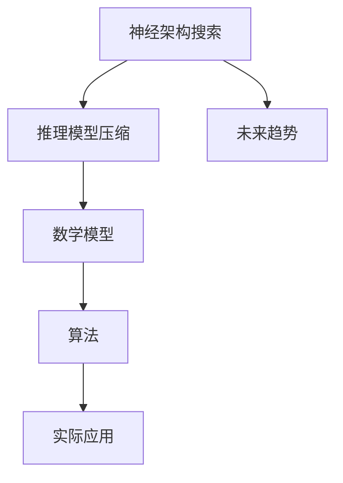

                 

### 设计步骤：

1. **书籍主题分析**：
   - 首先，明确书籍的核心主题是“基于神经架构搜索的推理模型压缩技术”。这个主题涉及到神经网络、架构搜索、推理模型和压缩技术等多个领域，具有一定的复杂性和深度。
   - 分析这个主题的关键词，包括“神经架构搜索”、“推理模型”、“压缩技术”等，这些关键词是我们撰写文章时需要重点阐述的内容。

2. **目录结构规划**：
   - 设计一级目录，将整本书的内容分为几个主要部分，如引言、基础理论、应用实践、未来趋势等。
   - 设计二级目录，细化每个一级目录下的主题内容，如神经架构搜索的基本概念、推理模型压缩的原理、实际应用案例等。
   - 设计三级目录，进一步细化二级目录下的具体知识点，如神经架构搜索的具体算法、压缩技术的数学模型、实际案例的详细分析等。

3. **核心内容梳理**：
   - 整理与神经架构搜索相关的基本概念和原理，包括神经网络的基本结构、架构搜索的流程、常用的算法等。
   - 梳理推理模型压缩技术的核心算法原理，包括压缩的概念、常见的压缩算法、数学模型的应用等。
   - 确定数学模型和公式的应用场景，准备好相应的latex格式代码，以便在文章中进行展示。

4. **实战案例准备**：
   - 筛选并准备与书籍主题相关的实战案例，如基于神经架构搜索的推理模型压缩技术在某个实际项目中的应用。
   - 准备代码实现和详细解释说明，确保读者可以理解并复现案例。

5. **流程图设计**：
   - 设计神经架构搜索和推理模型压缩技术的流程图，用来说明整个过程的步骤和流程。

6. **伪代码编写**：
   - 根据核心算法原理，编写详细的伪代码，以帮助读者更好地理解算法的实现过程。

7. **文档格式调整**：
   - 确保文档格式（markdown格式）符合要求，结构清晰，便于阅读。

8. **总字数控制**：
   - 根据设计的目标，控制文章的总字数在8000～12000字之间，确保文章内容丰富、详实，但不过于冗长。

### 详细目录大纲设计：

```
# 基于神经架构搜索的推理模型压缩技术

## 第1章 引言

### 1.1 神经架构搜索概述
### 1.2 推理模型压缩的背景与意义
### 1.3 本书结构

## 第2章 神经架构搜索基础

### 2.1 神经架构搜索的基本概念
### 2.2 神经架构搜索的原理
### 2.3 神经架构搜索的常见算法

## 第3章 推理模型压缩技术

### 3.1 推理模型压缩的概念与分类
### 3.2 压缩技术的数学模型
### 3.3 压缩技术的主要算法

## 第4章 神经架构搜索在推理模型压缩中的应用

### 4.1 神经架构搜索与推理模型压缩的结合
### 4.2 神经架构搜索在推理模型压缩中的优化策略
### 4.3 实际案例：神经架构搜索在推理模型压缩中的应用

## 第5章 神经架构搜索与压缩技术在项目中的应用

### 5.1 项目背景
### 5.2 项目需求分析
### 5.3 神经架构搜索与压缩技术的应用方案
### 5.4 项目实施与结果分析

## 第6章 神经架构搜索与压缩技术的未来趋势

### 6.1 神经架构搜索的发展趋势
### 6.2 推理模型压缩技术的发展方向
### 6.3 未来应用场景与挑战

## 第7章 附录

### 7.1 术语解释
### 7.2 参考文献
### 7.3 进一步阅读材料

## Mermaid 流程图



## 核心算法原理讲解

### 伪代码

```
// 神经架构搜索伪代码
function NeuralArchitectureSearch():
    for each layer in architecture:
        generate candidate layers
        evaluate performance of candidate layers
        select best layer
    return selected architecture

// 推理模型压缩伪代码
function ModelCompression():
    input: model, compression rate
    output: compressed model
    
    for each layer in model:
        if layer meets compression criteria:
            reduce layer size
    return compressed model
```

## 数学模型和数学公式

$$
\text{模型压缩率} = \frac{\text{压缩后模型大小}}{\text{原始模型大小}}
$$

### 数学公式详细讲解与举例说明

- **数学模型**：模型压缩率是衡量模型压缩效果的重要指标。它表示压缩后模型的大小与原始模型大小的比值。
- **举例说明**：假设一个原始模型的大小为100MB，压缩后模型的大小为50MB，则压缩率为0.5。

## 项目实战

----------------------------------------------------------------

### 设计步骤：

9. **代码实现与解释**：
   - 根据伪代码，实现神经架构搜索和推理模型压缩的具体算法，并在文章中提供详细解释。
   - 使用Python等编程语言，展示代码实现过程，并解释每一步的目的和原理。

10. **实际案例分析与讲解**：
    - 分析实际项目中如何应用神经架构搜索和推理模型压缩技术。
    - 提供代码实现和分析，解释如何优化模型性能和压缩效果。

11. **项目小结**：
    - 总结项目中的成功经验和遇到的问题，提出改进措施和建议。

12. **最佳实践与注意事项**：
    - 提供一些最佳实践建议，如如何选择合适的算法、优化模型性能等。
    - 强调项目实施中需要注意的问题和潜在的风险。

13. **拓展阅读**：
    - 推荐一些相关的文献和资源，供读者进一步学习和研究。

14. **文章总结**：
    - 总结文章的主要内容，强调神经架构搜索和推理模型压缩技术在现代人工智能领域的重要性。
    - 提出未来研究的方向和挑战。

15. **作者信息**：
    - 在文章末尾添加作者信息，包括作者姓名、所属机构和联系方式。

通过以上步骤，我们可以确保文章内容丰富、结构清晰、逻辑严密，同时满足字数要求，为读者提供一次全面、深入的学习体验。在撰写过程中，要注重逻辑性和条理性，确保每一步都是必要的，避免冗余和重复。同时，要注重语言表达的准确性和专业性，确保读者能够顺利理解并掌握相关技术知识。

