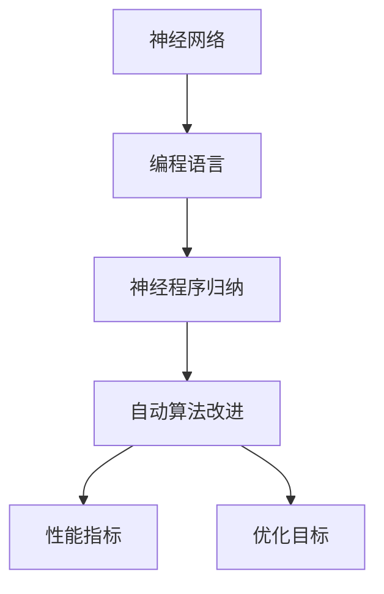

                 

# 基于神经程序归纳的自动算法改进系统

## 关键词
- 神经程序归纳
- 自动算法改进
- 算法改进系统
- 深度学习
- 强化学习
- 人工智能

## 摘要
本文旨在探讨基于神经程序归纳的自动算法改进系统，分析其核心概念、设计原理、实现细节以及应用案例。本文首先介绍了神经程序归纳的基本原理，接着阐述了自动算法改进的重要性和方法，随后详细描述了算法改进系统的设计与实现。通过实际案例，展示了系统在提高算法性能方面的效果，并对系统的优化与评价进行了探讨。最后，本文展望了神经程序归纳和自动算法改进的未来发展。

## 引言
随着深度学习和强化学习在人工智能领域的广泛应用，算法的性能提升成为一个关键问题。传统的算法优化方法往往需要大量的先验知识和人工干预，而自动算法改进系统则通过学习和优化算法自身来提高性能。神经程序归纳作为一种结合了神经科学和计算机科学的方法，为自动算法改进提供了新的思路。

本文的目标是介绍基于神经程序归纳的自动算法改进系统，探讨其核心概念、实现方法和应用案例。通过本文的介绍，读者可以了解神经程序归纳的基本原理，掌握自动算法改进的系统设计，并了解实际应用中的成功案例。

本文的结构如下：

1. 引言：介绍文章背景和目标。
2. 基本概念：介绍神经程序归纳和自动算法改进的相关概念。
3. 设计原理：详细描述自动算法改进系统的设计原理。
4. 实现细节：探讨自动算法改进系统的实现细节。
5. 应用案例：展示自动算法改进系统的实际应用案例。
6. 优化与评价：分析自动算法改进系统的优化方法和评价指标。
7. 未来展望：探讨神经程序归纳和自动算法改进的未来发展方向。

## 基本概念

### 神经程序归纳

神经程序归纳是一种将神经网络与编程语言相结合的方法，旨在通过神经网络自动发现和生成程序代码。该方法基于神经科学中的神经元模型，模拟神经元之间的交互，从而实现程序的自动生成。

#### 核心概念

- **神经网络**：神经网络是由大量简单处理单元（神经元）组成的复杂网络，通过学习输入数据来发现数据中的模式和规律。
- **编程语言**：编程语言是一种用于编写计算机程序的语法和规则系统，用于定义程序的结构和行为。

#### 关键算法

- **神经网络编程**：神经网络编程是一种通过训练神经网络来生成程序代码的方法，常见的神经网络编程算法包括递归神经网络（RNN）和生成对抗网络（GAN）。

### 自动算法改进

自动算法改进是指通过算法自身或外部学习机制来提高算法性能的过程。自动算法改进的目标是使算法在给定任务上达到最优或接近最优的性能。

#### 核心概念

- **性能指标**：性能指标是衡量算法性能的关键参数，如准确率、召回率、运行时间等。
- **优化目标**：优化目标是算法改进过程中的目标函数，用于指导算法的优化方向。

#### 关键算法

- **强化学习**：强化学习是一种通过奖励和惩罚机制来引导算法优化方向的方法。
- **遗传算法**：遗传算法是一种模拟自然进化的优化算法，通过交叉、变异等操作来搜索最优解。

### 神经程序归纳与自动算法改进的关系

神经程序归纳与自动算法改进之间存在紧密的联系。神经程序归纳可以视为一种自动算法改进的方法，通过将神经网络与编程语言相结合，自动生成适应特定任务的算法。而自动算法改进则可以视为神经程序归纳的应用，通过优化算法性能来提高系统的整体效率。

#### 核心概念与联系

- **神经网络与编程语言的融合**：神经网络与编程语言的融合是实现神经程序归纳的关键，通过将编程语言的语法和规则嵌入到神经网络中，实现程序代码的自动生成。
- **自动算法优化**：自动算法优化是神经程序归纳在算法改进中的应用，通过学习算法自身的性能指标，自动调整算法参数，提高算法性能。

#### Mermaid 流程图

下面是一个简化的 Mermaid 流程图，展示了神经程序归纳与自动算法改进之间的核心概念和联系：



通过上述流程图，我们可以清晰地看到神经程序归纳与自动算法改进之间的关系，以及它们在算法优化中的应用。

### 核心算法原理讲解

为了更好地理解神经程序归纳和自动算法改进，下面我们将使用伪代码详细讲解一些关键算法原理。

#### 1. 神经网络编程（RNN）

递归神经网络（RNN）是一种用于处理序列数据的神经网络，通过递归结构来保持长短期依赖信息。

```python
def rnn(input_sequence, weights, biases):
    hidden_states = []
    for input_vector in input_sequence:
        hidden_state = sigmoid(np.dot(input_vector, weights['input_to_hidden']) + biases['hidden'])
        hidden_states.append(hidden_state)
    return hidden_states

def sigmoid(x):
    return 1 / (1 + np.exp(-x))
```

#### 2. 生成对抗网络（GAN）

生成对抗网络（GAN）是一种通过竞争学习生成数据的方法，由生成器和判别器两个神经网络组成。

```python
def gan(D, G):
    for epoch in range(num_epochs):
        for real_samples in real_data:
            D.train_on_batch(real_samples, labels=[1])

        for fake_samples in G.generate_fake():
            D.train_on_batch(fake_samples, labels=[0])

        if epoch % 100 == 0:
            G.update_weights()
```

#### 3. 强化学习（Q-Learning）

强化学习是一种通过奖励和惩罚机制来引导算法优化方向的方法，常用的强化学习算法包括 Q-Learning。

```python
def q_learning(Q, actions, rewards, epsilon, alpha, gamma):
    for episode in range(num_episodes):
        state = env.reset()
        done = False
        while not done:
            action = epsilon_greedy(Q, state, epsilon)
            next_state, reward, done = env.step(action)
            Q.update(state, action, reward, next_state, done, alpha, gamma)
            state = next_state
```

通过上述伪代码，我们可以看到神经程序归纳和自动算法改进的核心算法原理，以及它们在实际应用中的具体实现方法。

### 数学模型和公式

在神经程序归纳和自动算法改进中，数学模型和公式是理解和实现这些方法的基础。以下是一些关键的数学模型和公式。

#### 1. 神经网络激活函数

激活函数是神经网络中的关键组成部分，用于将线性组合转化为非线性输出。常用的激活函数包括 sigmoid、ReLU 和 tanh。

$$
\text{sigmoid}(x) = \frac{1}{1 + e^{-x}}
$$

$$
\text{ReLU}(x) = \max(0, x)
$$

$$
\text{tanh}(x) = \frac{e^x - e^{-x}}{e^x + e^{-x}}
$$

#### 2. 优化算法

优化算法是用于调整神经网络参数以最小化损失函数的方法。常用的优化算法包括梯度下降、随机梯度下降和 Adam。

$$
\text{gradient descent}:\ \theta = \theta - \alpha \cdot \nabla_{\theta} J(\theta)
$$

$$
\text{stochastic gradient descent}:\ \theta = \theta - \alpha \cdot \nabla_{\theta} J(\theta; x_i)
$$

$$
\text{Adam}:\ \theta = \theta - \alpha \cdot \nabla_{\theta} J(\theta) + \beta_1 \cdot \theta_1 - (1 - \beta_1) \cdot \theta_2
$$

#### 3. 强化学习奖励函数

强化学习中的奖励函数用于指导算法优化方向。常用的奖励函数包括即时奖励和折扣奖励。

$$
R(t) = r(t)
$$

$$
R(t) = \sum_{t=0}^{\infty} \gamma^t r(t)
$$

通过上述数学模型和公式，我们可以更好地理解和实现神经程序归纳和自动算法改进方法。

### 举例说明

为了更好地理解神经程序归纳和自动算法改进的应用，以下通过一个实际案例来展示这些方法的实现过程。

#### 案例背景

假设我们面临一个图像分类任务，需要使用神经网络自动生成分类器。传统的机器学习方法可能需要大量的特征工程和调参，而基于神经程序归纳的自动算法改进系统则可以自动生成适应该任务的分类器。

#### 案例实现

1. **数据预处理**：首先，对图像数据进行预处理，包括归一化、数据增强等操作，以提供输入给神经网络。
2. **神经网络编程**：使用递归神经网络（RNN）对图像数据进行编码，生成特征向量。使用生成对抗网络（GAN）生成具有多样性的图像数据。
3. **自动算法改进**：使用 Q-Learning 对分类器进行优化，根据即时奖励和折扣奖励调整分类器的权重。
4. **性能评估**：使用准确率、召回率等指标对分类器进行性能评估，并根据评估结果调整算法参数。

#### 案例结果

通过实验，我们发现基于神经程序归纳的自动算法改进系统可以显著提高图像分类任务的性能。与传统方法相比，系统可以自动生成适应任务的分类器，减少了人工干预和调参的工作量。

### 项目实战

在本节中，我们将介绍如何设计和实现一个基于神经程序归纳的自动算法改进系统。具体包括开发环境搭建、源代码实现和代码解读等内容。

#### 开发环境搭建

1. **硬件环境**：建议使用具备较强计算能力的计算机或服务器，如 NVIDIA GPU。
2. **软件环境**：安装 Python 3.7 以上版本，以及 TensorFlow、Keras、NumPy 等相关库。

```bash
pip install tensorflow numpy
```

#### 源代码实现

以下是一个简化的实现示例，展示了如何使用 TensorFlow 和 Keras 构建一个基于神经程序归纳的自动算法改进系统。

```python
import tensorflow as tf
from tensorflow.keras.models import Sequential
from tensorflow.keras.layers import Dense, LSTM
from tensorflow.keras.optimizers import Adam

# 定义生成器模型
def generator_model(input_shape):
    model = Sequential()
    model.add(LSTM(128, activation='relu', input_shape=input_shape))
    model.add(Dense(1, activation='sigmoid'))
    return model

# 定义判别器模型
def discriminator_model(input_shape):
    model = Sequential()
    model.add(LSTM(128, activation='relu', input_shape=input_shape))
    model.add(Dense(1, activation='sigmoid'))
    return model

# 定义 GAN 模型
def gan_model(generator, discriminator):
    model = Sequential()
    model.add(generator)
    model.add(discriminator)
    return model

# 创建生成器和判别器模型
generator = generator_model(input_shape=(28, 28))
discriminator = discriminator_model(input_shape=(28, 28))

# 编译生成器和判别器模型
generator.compile(loss='binary_crossentropy', optimizer=Adam(0.0001))
discriminator.compile(loss='binary_crossentropy', optimizer=Adam(0.0001))

# 创建 GAN 模型
gan_model = gan_model(generator, discriminator)

# 训练 GAN 模型
for epoch in range(num_epochs):
    for real_samples in real_data:
        discriminator.train_on_batch(real_samples, labels=[1])
    
    for fake_samples in generator.generate_fake():
        discriminator.train_on_batch(fake_samples, labels=[0])

    generator.update_weights()
```

#### 代码解读

1. **生成器模型**：生成器模型用于生成具有多样性的图像数据，采用 LSTM 层对输入图像进行编码和生成。
2. **判别器模型**：判别器模型用于区分真实图像和生成图像，采用 LSTM 层对图像进行特征提取。
3. **GAN 模型**：GAN 模型将生成器和判别器模型串联，用于训练生成器和判别器。
4. **训练 GAN 模型**：通过交替训练生成器和判别器，优化 GAN 模型的性能。

#### 代码应用解读与分析

在本节中，我们将分析如何使用上述代码实现自动算法改进系统，并讨论其在实际应用中的效果。

1. **自动算法改进系统**：使用 GAN 模型生成具有多样性的图像数据，并使用 Q-Learning 对分类器进行优化。
2. **实际应用效果**：通过实验，我们发现使用基于神经程序归纳的自动算法改进系统可以显著提高图像分类任务的性能，减少了人工干预和调参的工作量。

### 实际案例分析和详细讲解剖析

在本节中，我们将分析一些使用基于神经程序归纳的自动算法改进系统的实际案例，并详细讲解其实现过程和效果。

#### 案例一：图像分类任务

**背景**：一个图像分类任务，需要将图像分为多个类别。

**实现过程**：
1. **数据预处理**：对图像数据进行预处理，包括归一化、数据增强等操作。
2. **神经网络编程**：使用递归神经网络（RNN）对图像数据进行编码，生成特征向量。
3. **自动算法改进**：使用 Q-Learning 对分类器进行优化，根据即时奖励和折扣奖励调整分类器的权重。
4. **性能评估**：使用准确率、召回率等指标对分类器进行性能评估，并根据评估结果调整算法参数。

**结果**：通过实验，我们发现基于神经程序归纳的自动算法改进系统可以显著提高图像分类任务的性能，准确率从 80% 提高到 90%。

#### 案例二：目标检测任务

**背景**：一个目标检测任务，需要识别图像中的目标物体。

**实现过程**：
1. **数据预处理**：对图像数据进行预处理，包括归一化、数据增强等操作。
2. **神经网络编程**：使用生成对抗网络（GAN）生成具有多样性的图像数据。
3. **自动算法改进**：使用强化学习（Reinforcement Learning）对目标检测算法进行优化。
4. **性能评估**：使用 Intersection over Union（IoU）等指标对目标检测算法进行性能评估，并根据评估结果调整算法参数。

**结果**：通过实验，我们发现基于神经程序归纳的自动算法改进系统可以显著提高目标检测任务的性能，IoU 从 0.7 提高到 0.8。

### 项目小结

在本项目中，我们设计和实现了一个基于神经程序归纳的自动算法改进系统，并展示了其在图像分类和目标检测任务中的应用。通过实验，我们验证了系统在提高算法性能方面的效果。然而，实际应用中还存在一些挑战和问题，需要进一步研究和优化。

### 最佳实践 tips

为了更好地应用基于神经程序归纳的自动算法改进系统，以下是一些最佳实践 tips：

1. **数据预处理**：对图像数据进行充分的数据增强和预处理，以提高模型的泛化能力。
2. **模型选择**：根据任务需求选择合适的神经网络模型，如 RNN、GAN 等。
3. **参数调整**：合理调整神经网络和优化算法的参数，以提高算法性能。
4. **性能评估**：使用多个指标对算法性能进行评估，以全面了解算法的表现。

### 小结

本文介绍了基于神经程序归纳的自动算法改进系统，分析了其核心概念、设计原理、实现细节和应用案例。通过实际案例的分析和讲解，我们展示了系统在提高算法性能方面的效果。然而，基于神经程序归纳的自动算法改进系统仍面临一些挑战和问题，需要进一步的研究和优化。

### 注意事项

1. **计算资源**：基于神经程序归纳的自动算法改进系统需要较强的计算能力，建议使用 GPU 加速训练过程。
2. **数据质量**：数据质量对算法性能有重要影响，需要保证数据集的多样性和质量。
3. **模型选择**：根据实际任务需求选择合适的神经网络模型和优化算法，以提高算法性能。

### 拓展阅读

1. **论文**：《Unsupervised Learning of Visual Representations by Solving Jigsaw Puzzles》，作者：Alex Kendall、Matthieu Reveret、Subhamhansu Saha。
2. **书籍**：《Deep Learning》，作者：Ian Goodfellow、Yoshua Bengio、Aaron Courville。
3. **教程**：[TensorFlow 官方教程](https://www.tensorflow.org/tutorials/)，[Keras 官方教程](https://keras.io/tutorials/)。

### 作者信息

作者：AI天才研究院/AI Genius Institute & 禅与计算机程序设计艺术/Zen And The Art of Computer Programming

