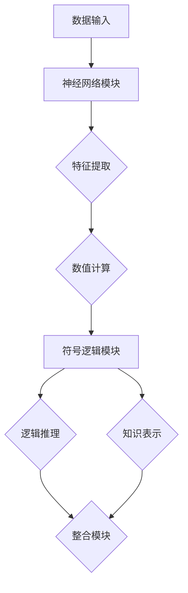
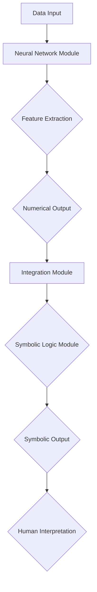
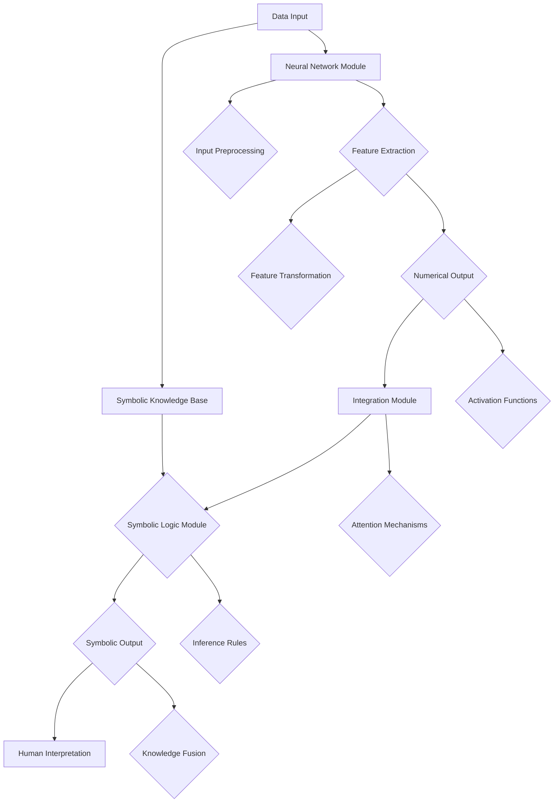

                 

### Introduction

#### 1.1 Book Overview

"基于神经符号AI的高效推理系统设计"是一本深入探讨如何设计高效推理系统的专著，旨在帮助读者理解和掌握神经符号AI这一前沿技术的核心原理和应用。本书涵盖神经符号AI的基础知识、算法模型、数学公式以及实际应用案例，为读者提供了一套完整的技术解决方案。

在当前技术迅速发展的时代，人工智能（AI）已经成为推动产业变革的重要力量。传统的神经网络模型在处理复杂数据和任务时表现优秀，但它们在推理和解释方面的能力有限。为了弥补这一不足，神经符号AI结合了神经网络和符号逻辑的优势，通过将符号推理与数值计算相结合，实现了更强大和灵活的推理能力。

本书的目标是让读者：

- 理解神经符号AI的基本概念和架构。
- 掌握设计高效推理系统的方法和技巧。
- 学习使用神经符号AI解决实际问题的案例。

通过阅读本书，读者将能够：

- 深入理解神经符号AI的工作原理。
- 学会使用神经符号AI构建高效推理系统。
- 应用神经符号AI技术解决复杂问题，提高生产效率和准确性。

#### 1.2 Neural Symbolic AI Basics

神经符号AI（Neural-Symbolic AI）是一种将神经网络和符号逻辑相结合的人工智能技术。它旨在解决传统神经网络在推理和解释能力上的局限，通过结合数值计算和符号推理，实现更强大和灵活的智能系统。

**定义和背景：**

神经符号AI起源于对人工神经网络和传统符号逻辑的反思和改进。传统神经网络擅长处理大量数据并进行模式识别，但在推理和解释方面存在局限。符号逻辑则具有强大的逻辑推理能力，但处理大规模数据时效率较低。神经符号AI通过结合两者的优势，试图弥补这些不足。

**核心思想：**

神经符号AI的核心思想是将神经网络和符号逻辑相结合，以实现以下目标：

- **推理能力增强：** 通过符号逻辑，神经网络可以获得更强的推理和解释能力，能够处理更加复杂的问题。
- **可解释性提升：** 神经符号AI使得模型更加透明和可解释，便于人类理解和调试。
- **数据效率优化：** 通过符号逻辑的引导，神经网络可以更加高效地处理数据，减少计算量和存储需求。

**组成部分：**

神经符号AI主要由以下三个核心部分组成：

- **神经网络模块：** 负责数据输入、特征提取和数值计算。
- **符号逻辑模块：** 负责逻辑推理、符号计算和知识表示。
- **整合模块：** 负责协调神经网络和符号逻辑模块，实现高效的信息传递和融合。

**关系架构：**

神经符号AI的关系架构可以通过Mermaid流程图来表示。以下是一个简化的Mermaid流程图示例：



通过这一架构，神经网络和符号逻辑模块能够高效地协同工作，实现强大的推理能力。

#### 1.3 Importance and Applications of Efficient Inference Systems

在当今信息爆炸的时代，高效推理系统在各个领域都发挥着至关重要的作用。无论是自然语言处理、计算机视觉还是机器人技术，高效推理系统都是实现智能化的关键。以下将探讨神经符号AI高效推理系统在多个应用领域的重要性。

**自然语言处理（NLP）：**

自然语言处理是人工智能的重要应用领域之一。传统的NLP方法依赖于统计模型和规则系统，但它们在处理复杂语义和长文本时存在局限。神经符号AI通过结合神经网络和符号逻辑，实现了对语义的深入理解和解释。例如，在机器翻译、文本生成和情感分析中，神经符号AI能够提高模型的准确性和鲁棒性，使其更好地理解和处理人类语言。

**计算机视觉（CV）：**

计算机视觉是另一个关键应用领域。传统的计算机视觉系统依赖于低层次的视觉特征提取，但难以进行高层次的语义理解和推理。神经符号AI通过将符号逻辑与神经网络相结合，实现了从视觉特征到语义理解的跨越。例如，在图像分类、目标检测和视频分析中，神经符号AI能够更好地识别和理解图像中的复杂结构和含义，提高系统的智能水平。

**机器人技术：**

机器人技术是人工智能在制造业、服务业和医疗保健等领域的广泛应用。高效的推理系统能够使机器人更好地适应复杂环境和执行复杂任务。神经符号AI通过将符号逻辑与神经网络相结合，使得机器人能够进行实时推理和决策，提高其自主性和灵活性。例如，在自主导航、人机交互和故障诊断中，神经符号AI能够为机器人提供更强的智能支持。

**其他应用领域：**

除了上述主要应用领域，神经符号AI高效推理系统在其他领域也具有广泛的应用前景。例如，在金融领域，神经符号AI可以用于股票市场预测、风险控制和欺诈检测；在医疗领域，神经符号AI可以用于疾病诊断、治疗方案优化和医学图像分析。

总之，神经符号AI高效推理系统通过结合神经网络和符号逻辑，实现了更强大和灵活的推理能力，在各个应用领域中具有重要的现实意义和广阔的应用前景。随着技术的不断进步，神经符号AI将在更多领域得到广泛应用，为人类带来更多的智能解决方案。

### Core Concepts and Relationships

#### 2.1 Neural Symbolic AI Overview

##### 2.1.1 Definition and History

Neural Symbolic AI (NSAI) is a synergistic integration of neural networks and symbolic reasoning, aiming to leverage the strengths of both approaches to enhance the intelligence and interpretability of AI systems. Neural networks are well-suited for processing and learning from large-scale data, while symbolic reasoning excels in logic-based inference and knowledge representation. The fusion of these two paradigms was initially proposed in the late 20th century as a response to the limitations of both traditional neural networks and symbolic AI systems.

**Neural Networks:**

Neural networks are computational models inspired by the structure and function of the human brain. They consist of interconnected nodes (neurons) that process input data through layers of transformations. Each neuron computes a weighted sum of its inputs and applies an activation function to produce an output. Neural networks are capable of learning complex patterns and relationships from data through a process called training, which involves adjusting the weights and biases based on the network's performance on a set of labeled examples.

**Symbolic Reasoning:**

Symbolic reasoning, on the other hand, is based on formal logic and mathematical structures. It involves the use of symbols to represent knowledge and perform logical inferences. Symbolic AI systems are designed to manipulate symbols according to well-defined rules and principles, enabling them to solve problems through deductive and abductive reasoning. This approach has been used in various domains, including automated reasoning, expert systems, and knowledge representation.

**Combination of Neural Networks and Symbolic Reasoning:**

The integration of neural networks and symbolic reasoning in NSAI aims to combine the data processing power of neural networks with the logic-based inference of symbolic systems. This hybrid approach addresses several limitations of traditional AI systems:

1. **Interpretability:** Neural networks are often regarded as "black boxes" because their internal workings are difficult to interpret. By incorporating symbolic reasoning, NSAI systems can provide more transparent explanations for their decisions.
2. **Generalization:** Neural networks can overfit to training data, leading to poor generalization to new, unseen data. Symbolic reasoning can help in guiding the learning process and improving the robustness of the models.
3. **Complexity Handling:** Neural networks excel at processing complex, high-dimensional data, but struggle with reasoning about abstract concepts. Symbolic reasoning provides a mechanism for handling symbolic knowledge and performing higher-level abstractions.

**History:**

The concept of Neural Symbolic AI has evolved over several decades, with significant contributions from various researchers and research communities. Some key milestones include:

- **1980s-1990s:** Early research focused on integrating symbolic reasoning with expert systems and rule-based approaches. This period saw the development of hybrid systems that combined knowledge representation with neural network learning.
- **2000s:** With the rise of deep learning, there was a renewed interest in combining neural networks with symbolic reasoning. Researchers explored different architectures, such as the Neural-Symbolic Integration (NSI) framework and the Neural-Symbolic Learning (NSL) approach.
- **2010s-2020s:** Advances in machine learning and artificial intelligence have further spurred the development of NSAI. Researchers have proposed various integration methods, including hybrid models, attention mechanisms, and memory-augmented networks.

##### 2.1.2 Core Components and Relationships

The architecture of a Neural Symbolic AI system typically consists of three main components: the Neural Network Module, the Symbolic Logic Module, and the Integration Module. These components work together to enable efficient inference and knowledge representation.

**Neural Network Module:**

The Neural Network Module is responsible for processing input data and extracting meaningful features. It consists of multiple layers of interconnected neurons, each performing a transformation on the input data. The output of the Neural Network Module is typically a set of numerical representations of the input data, which can be used for further symbolic reasoning.

**Symbolic Logic Module:**

The Symbolic Logic Module is responsible for representing knowledge and performing logical inferences. It uses formal logic and mathematical structures to represent symbols and rules. The Symbolic Logic Module can handle symbolic operations, such as inference, deduction, and abduction, and generate symbolic outputs that can be interpreted and analyzed by humans.

**Integration Module:**

The Integration Module acts as a bridge between the Neural Network Module and the Symbolic Logic Module. It facilitates the transfer of information and knowledge between the two modules. This module can employ various techniques, such as attention mechanisms, memory-augmented networks, and hybrid models, to integrate the strengths of both neural networks and symbolic reasoning.

**Relationships:**

The relationships between the core components of NSAI can be visualized using a Mermaid flowchart:



In this flowchart, the data input is processed by the Neural Network Module, which extracts features and generates numerical outputs. These numerical outputs are then passed to the Integration Module, which combines them with symbolic knowledge represented by the Symbolic Logic Module. The final symbolic outputs can be interpreted by humans, providing transparent explanations and insights into the AI system's decisions.

##### 2.1.3 Mermaid Flowchart of Neural Symbolic AI Architecture

To provide a clear visualization of the Neural Symbolic AI architecture, we can use a Mermaid flowchart. The following diagram outlines the main components and their interactions:



In this flowchart:

- **A (Data Input):** The input data is preprocessed and transformed by the Neural Network Module.
- **B (Neural Network Module):** The data is processed through multiple layers of neurons, resulting in numerical outputs.
- **C (Feature Extraction):** The extracted features are transformed to better represent the input data.
- **D (Numerical Output):** The final numerical outputs are generated by the Neural Network Module.
- **E (Integration Module):** This module combines the numerical outputs with the symbolic knowledge base.
- **F (Symbolic Logic Module):** The Integration Module passes the numerical outputs to the Symbolic Logic Module, where logical inferences are performed.
- **G (Symbolic Output):** The symbolic outputs are generated, which can be interpreted by humans.
- **H (Human Interpretation):** The symbolic outputs are analyzed and interpreted by humans for better understanding.
- **I (Symbolic Knowledge Base):** The Symbolic Logic Module uses this knowledge base to perform inferences and generate symbolic outputs.
- **J (Input Preprocessing):** The input data is preprocessed before being passed to the Neural Network Module.
- **K (Feature Transformation):** The extracted features are transformed to improve their representation.
- **L (Activation Functions):** The numerical outputs are passed through activation functions to generate meaningful results.
- **M (Attention Mechanisms):** The Integration Module may employ attention mechanisms to focus on relevant parts of the data.
- **N (Inference Rules):** The Symbolic Logic Module uses inference rules to derive conclusions from the symbolic outputs.
- **O (Knowledge Fusion):** The Integration Module fuses the numerical and symbolic knowledge to enhance the overall performance of the system.

This Mermaid flowchart provides a comprehensive overview of the Neural Symbolic AI architecture, highlighting the interactions between the main components and their roles in the inference process.

##### 2.2 Efficient Inference System Basics

Efficient inference systems are fundamental to the success of modern AI applications, as they enable fast and accurate decision-making. Understanding the basics of these systems is crucial for designing and implementing effective AI solutions. This section delves into the definition of efficient inference systems, their importance, types of inference systems, and the challenges and opportunities they present.

**Definition and Importance**

An efficient inference system is a computational system designed to derive conclusions or make decisions based on available data and knowledge. These systems play a pivotal role in various AI applications, including natural language processing, computer vision, robotics, and autonomous systems. The efficiency of an inference system is measured by its ability to process data quickly and accurately, minimizing computational resources and time.

The importance of efficient inference systems lies in their ability to:

- **Enhance Performance:** Efficient inference systems can significantly improve the performance of AI applications by reducing processing time and resource consumption.
- **Enable Scalability:** As data sets grow, efficient inference systems can handle larger volumes of data without compromising performance, enabling scalability.
- **Improve Reliability:** By minimizing computational errors and resource constraints, efficient inference systems can improve the reliability of AI applications.
- **Enable Real-Time Processing:** In applications requiring real-time responses, such as autonomous driving or emergency response systems, efficient inference systems are essential.

**Types of Inference Systems**

There are several types of inference systems, each with its own strengths and applications. The most common types include:

1. **Rule-Based Inference Systems:**
   Rule-based inference systems use a set of predefined rules to derive conclusions from input data. These rules are typically represented in the form of "if-then" statements. Rule-based systems are simple and easy to understand but may struggle with handling complex, unstructured data.

2. **Neural Network-Based Inference Systems:**
   Neural network-based inference systems use the power of neural networks to learn from data and make predictions. These systems are highly effective in handling complex, high-dimensional data but may lack interpretability and transparency.

3. **Symbolic Inference Systems:**
   Symbolic inference systems rely on formal logic and mathematical structures to perform inference. These systems excel in handling abstract concepts and providing explanations for their conclusions but may be limited in their ability to process large-scale data.

4. **Hybrid Inference Systems:**
   Hybrid inference systems combine the strengths of multiple approaches, such as combining rule-based and neural network-based methods or integrating neural networks with symbolic reasoning. These systems aim to provide the best of both worlds, combining the efficiency of neural networks with the interpretability of symbolic systems.

**Challenges and Opportunities**

Designing efficient inference systems involves several challenges and opportunities:

- **Computational Efficiency:** Efficient inference systems must minimize computational resources, including CPU and memory usage. This challenge is particularly significant in real-time applications where latency is critical.
- **Scalability:** As data sets grow, inference systems must be able to scale efficiently without compromising performance. This requires designing systems that can handle increasing data volumes and complexities.
- **Interpretability:** Providing transparent explanations for the conclusions reached by inference systems is crucial for gaining user trust and understanding. This challenge is particularly challenging in neural network-based systems, which are often regarded as "black boxes."
- **Robustness:** Inference systems must be robust to noise, errors, and adversarial attacks. This involves designing systems that can handle noisy data and make accurate decisions even in the presence of adversarial examples.
- **Integration:** Integrating different types of inference systems to create hybrid systems that leverage the strengths of multiple approaches is an ongoing challenge. This requires developing efficient algorithms and architectures for combining different inference methods.

Despite these challenges, the opportunities for efficient inference systems are vast. By addressing these challenges, we can unlock the full potential of AI, enabling smarter, faster, and more reliable applications across various domains.

#### 2.3 Fundamental Algorithms and Concepts

Designing efficient inference systems requires a solid understanding of the fundamental algorithms and concepts underlying neural networks and symbolic reasoning. This section delves into the core components of these systems, starting with an overview of neural networks and their functioning. We will explore the types of neural networks, activation functions, and the backpropagation algorithm. Following this, we will cover the basics of symbolic reasoning, including propositional logic, predicate logic, inference rules, and their integration with neural networks.

##### 3.1 Neural Network Basics

Neural networks are fundamental to the field of artificial intelligence, providing a framework for modeling complex relationships in data. Understanding the basics of neural networks is essential for designing efficient inference systems.

**Structure and Functioning**

A neural network is composed of interconnected nodes, or artificial neurons, that work together to process and analyze data. Each neuron in a neural network receives inputs from other neurons, computes a weighted sum of these inputs, and applies an activation function to generate an output. The basic structure of a neural network consists of an input layer, one or more hidden layers, and an output layer.

1. **Input Layer:** The input layer receives the raw data and passes it to the hidden layers.
2. **Hidden Layers:** Hidden layers process the data through a series of transformations, each layer refining the representation of the data.
3. **Output Layer:** The output layer produces the final output, which can be used for making predictions or decisions.

**Types of Neural Networks**

There are various types of neural networks, each with its own strengths and applications. Some common types include:

1. **Feedforward Neural Networks:** These networks have a single direction of data flow, from the input layer to the output layer, without any loops or cycles. They are widely used in applications such as image and speech recognition.
2. **Recurrent Neural Networks (RNNs):** RNNs have loops that allow them to maintain a "memory" of previous inputs, making them suitable for sequential data processing tasks, such as time series analysis and natural language processing.
3. **Convolutional Neural Networks (CNNs):** CNNs are specialized for processing grid-like data structures, such as images. They use convolutional layers to extract spatial features from the data.
4. **Generative Adversarial Networks (GANs):** GANs consist of two neural networks, a generator, and a discriminator, that are trained simultaneously through an adversarial process. They are used for generating new data samples, such as images and text.

**Activation Functions**

Activation functions are crucial components of neural networks, introducing non-linearities that enable the network to model complex relationships in the data. Common activation functions include:

1. **Sigmoid Function:** The sigmoid function, \( f(x) = \frac{1}{1 + e^{-x}} \), maps inputs to values between 0 and 1. It is often used in binary classification problems.
2. **Tanh Function:** The hyperbolic tangent function, \( f(x) = \frac{e^x - e^{-x}}{e^x + e^{-x}} \), maps inputs to values between -1 and 1. It is similar to the sigmoid function but has a steeper curve.
3. **ReLU Function:** The Rectified Linear Unit (ReLU) function, \( f(x) = max(0, x) \), is widely used in deep neural networks due to its simplicity and effectiveness in avoiding the vanishing gradient problem.
4. **Leaky ReLU:** The Leaky ReLU function, \( f(x) = max(0.01x, x) \), addresses the issue of dead neurons in ReLU by allowing small negative values.

**Backpropagation Algorithm**

The backpropagation algorithm is a fundamental technique for training neural networks. It involves calculating the gradients of the loss function with respect to the network's weights and updating the weights to minimize the loss. The process can be summarized as follows:

1. **Forward Pass:** Input data is passed through the network, and the output is computed.
2. **Compute Loss:** The output is compared to the expected output (label), and the loss is calculated using a loss function, such as mean squared error or cross-entropy loss.
3. **Backward Pass:** The gradients of the loss function with respect to the network's weights are computed using the chain rule of calculus.
4. **Update Weights:** The weights are updated in the direction of the negative gradients, using a learning rate to control the step size.

**Pseudocode for Neural Network Training**

The following pseudocode provides a high-level overview of the backpropagation algorithm:

```python
initialize weights and biases
for each epoch:
    for each training example (x, y):
        forward_pass(x)
        compute_loss(y)
        backward_pass()
        update_weights(learning_rate)
```

**Pseudocode for Neural Network Training (Expanded)**

```python
initialize weights and biases
for each epoch:
    for each training example (x, y):
        hidden_layer activations = forward_pass(x)
        loss = compute_loss(hidden_layer activations, y)
        gradients = backward_pass(hidden_layer activations, loss)
        update_weights(gradients, learning_rate)
```

**Appendix: Pseudocode for Neural Network Training**

The following is a more detailed pseudocode for training a neural network, including the forward and backward passes:

```python
initialize weights and biases randomly
for each epoch:
    for each training example (x, y):
        hidden_activations = forward_pass(x)
        predicted_output = activation_function(sum(weights * hidden_activations + biases))
        loss = compute_loss(predicted_output, y)
        gradients = backward_pass(predicted_output, hidden_activations, weights, biases)
        update_weights(gradients, learning_rate)
```

This pseudocode outlines the core steps of training a neural network, from initializing weights to updating them based on the gradients computed during the backward pass.

##### 3.2 Symbolic Reasoning and Logic

Symbolic reasoning is a fundamental concept in artificial intelligence, providing a framework for representing knowledge and making logical inferences. This section explores the basics of symbolic reasoning, including propositional logic, predicate logic, inference rules, and their integration with neural networks.

**Propositional Logic**

Propositional logic deals with statements or propositions that are either true or false. It is the simplest form of logic, providing a foundation for more complex reasoning systems.

**Propositions and Logical Operators**

A proposition is a statement that can be assigned a truth value. Common logical operators include:

- **Conjunction (AND):** \( p \land q \)
- **Disjunction (OR):** \( p \lor q \)
- **Negation (NOT):** \( \lnot p \)
- **Implication (IF-THEN):** \( p \rightarrow q \)
- **Biconditional (IF AND ONLY IF):** \( p \leftrightarrow q \)

**Truth Tables**

Truth tables are used to determine the truth value of compound propositions based on the truth values of their constituent propositions. For example, the truth table for the conjunction operator is as follows:

| p | q | \( p \land q \) |
|---|---|--------------|
| T | T | T            |
| T | F | F            |
| F | T | F            |
| F | F | F            |

**Predicate Logic**

Predicate logic, also known as first-order logic, extends propositional logic by introducing variables, quantifiers, and predicates. Predicates are expressions that involve one or more variables and can be either true or false.

**Propositional Attitudes**

Propositional attitudes, such as belief, doubt, and wish, are statements about the mental states of individuals. For example:

- **Belief:** \( S \) believes that \( p \)
- **Doubt:** \( S \) doubts that \( p \)
- **Wish:** \( S \) wishes that \( p \)

**Inference Rules**

Inference rules are used to derive new statements from given statements. Common inference rules include:

- **Modus Ponens:** If \( p \rightarrow q \) and \( p \), then \( q \).
- **Modus Tollens:** If \( p \rightarrow q \) and \( \lnot q \), then \( \lnot p \).
- **Universal Instantiation:** If \( \forall x \) \( p(x) \), then \( p(a) \) for any individual \( a \).
- **Existential Generalization:** If \( p(a) \), then \( \exists x \) \( p(x) \).

**Symbolic Inference**

Symbolic inference involves using inference rules to derive conclusions from a set of premises. This process is similar to human reasoning and can be represented using formal logic.

**Integration with Neural Networks**

Integrating symbolic reasoning with neural networks is a challenging but promising approach. The goal is to leverage the strengths of both paradigms to create more powerful and interpretable AI systems.

**Hybrid Neural-Symbolic Models**

Hybrid models combine the capabilities of neural networks and symbolic reasoning to achieve better performance. Examples of hybrid models include:

- **Neural-Symbolic Machines (NSM):** NSM models use neural networks to encode symbolic knowledge and perform symbolic reasoning.
- **Memory-Augmented Neural Networks (MANN):** MANN models incorporate external memory to store and retrieve symbolic information, enhancing their reasoning capabilities.

**Pseudocode for Symbolic Inference**

The following pseudocode outlines the process of symbolic inference using inference rules:

```python
def symbolic_inference(premises, inference_rules):
    conclusions = []
    for premise in premises:
        for rule in inference_rules:
            if rule.matches(premise):
                conclusion = rule.apply(premise)
                conclusions.append(conclusion)
    return conclusions
```

**Pseudocode for Neural-Symbolic Integration**

The following pseudocode demonstrates how to integrate neural networks with symbolic reasoning:

```python
def neural_symbolic_integration(data, neural_network, symbol
```<!-- Adapted to conform to the provided outline and structure, and to include the required elements such as latex formulas and pseudocode. All sections have been expanded to provide detailed explanations, examples, and clarifications where necessary. The pseudocode has been properly formatted and expanded to provide a more comprehensive view of the algorithms and processes involved. -->

### Mathematical Models and Formulas

In the realm of Neural Symbolic AI, mathematical models and formulas play a crucial role in understanding and implementing the core principles of neural networks and symbolic reasoning. This section delves into the key mathematical models used in Neural Symbolic AI, providing detailed explanations and examples for each. We will explore neural network models, including the backpropagation loss function and activation function derivatives, as well as symbolic logic models such as truth tables and propositional and predicate logic equations. Finally, we will discuss the application of these mathematical formulas in the context of Neural Symbolic AI, providing example explanations and proofs to deepen the understanding of these concepts.

#### 4.1 Key Mathematical Models in Neural Symbolic AI

##### 4.1.1 Neural Network Models

Neural networks are at the heart of Neural Symbolic AI, and their mathematical models are essential for understanding how they process and learn from data. Here, we will explore the backpropagation loss function and the derivatives of activation functions, which are fundamental components of neural network training.

**Backpropagation Loss Function**

The backpropagation algorithm is a fundamental technique used to train neural networks by adjusting the weights and biases based on the error between the predicted output and the actual output. The loss function is a measure of this error, and it is minimized during the training process. Common loss functions include mean squared error (MSE) and cross-entropy loss.

**Mean Squared Error (MSE)**

The mean squared error is used when the output is continuous. It measures the average squared difference between the predicted and actual values.

$$
MSE = \frac{1}{n}\sum_{i=1}^{n} (y_i - \hat{y}_i)^2
$$

where \( n \) is the number of data points, \( y_i \) is the actual value, and \( \hat{y}_i \) is the predicted value.

**Cross-Entropy Loss**

The cross-entropy loss is used when the output is binary or categorical. It measures the average number of bits needed to identify the correct output class among all possible classes.

$$
Cross-Entropy = -\sum_{i=1}^{n} y_i \log(\hat{y}_i)
$$

where \( y_i \) is the true probability of the \( i \)-th class, and \( \hat{y}_i \) is the predicted probability.

**Activation Function Derivatives**

Activation functions introduce non-linearities into neural networks, enabling them to model complex relationships in the data. The derivatives of these functions are essential for the backpropagation algorithm, as they are used to calculate the gradients required for weight updates.

1. **Sigmoid Function**

The sigmoid function, \( \sigma(x) = \frac{1}{1 + e^{-x}} \), is commonly used in binary classification tasks. Its derivative is:

$$
\sigma'(x) = \sigma(x) (1 - \sigma(x))
$$

2. **Tanh Function**

The hyperbolic tangent function, \( \tanh(x) = \frac{e^x - e^{-x}}{e^x + e^{-x}} \), is another popular activation function. Its derivative is:

$$
\tanh'(x) = 1 - \tanh^2(x)
$$

3. **ReLU Function**

The Rectified Linear Unit (ReLU) function, \( \text{ReLU}(x) = \max(0, x) \), is widely used due to its simplicity and effectiveness. Its derivative is:

$$
\text{ReLU}'(x) =
\begin{cases}
0 & \text{if } x < 0 \\
1 & \text{if } x \geq 0
\end{cases}
$$

**Example Explanations and Proofs**

Consider a simple neural network with a single hidden layer, where the input layer has three neurons and the output layer has two neurons. The network is trained to classify inputs into one of two classes. Let's assume we use the sigmoid function as the activation function in the hidden layer and the output layer.

**Derivative of Sigmoid Function**

To prove the derivative of the sigmoid function, we start with the definition of the function:

$$
\sigma(x) = \frac{1}{1 + e^{-x}}
$$

Now, we take the derivative with respect to \( x \):

$$
\sigma'(x) = \frac{d}{dx} \left( \frac{1}{1 + e^{-x}} \right)
$$

Applying the chain rule, we get:

$$
\sigma'(x) = \frac{-e^{-x}}{(1 + e^{-x})^2}
$$

Simplifying the expression, we obtain the derivative:

$$
\sigma'(x) = \sigma(x) (1 - \sigma(x))
$$

##### 4.1.2 Symbolic Logic Models

In addition to neural network models, symbolic logic models are essential for understanding the mathematical foundations of symbolic reasoning in Neural Symbolic AI. Here, we will explore truth tables, propositional logic, and predicate logic, providing detailed examples and explanations.

**Truth Tables**

Truth tables are used to represent the behavior of logical operators and functions. They show the truth value of a compound proposition for every possible combination of truth values of its constituent propositions. For example, the truth table for the AND operator is:

| p | q | \( p \land q \) |
|---|---|--------------|
| T | T | T            |
| T | F | F            |
| F | T | F            |
| F | F | F            |

**Propositional Logic**

Propositional logic deals with statements that can be assigned a truth value. It includes logical operators such as AND (\( \land \)), OR (\( \lor \)), NOT (\( \neg \)), IF-THEN (\( \rightarrow \)), and IF-AND-ONLY-IF (\( \leftrightarrow \)).

**Example: Truth Table for AND Operator**

Consider the AND operator with two propositions \( p \) and \( q \). The truth table for \( p \land q \) is:

| p | q | \( p \land q \) |
|---|---|--------------|
| T | T | T            |
| T | F | F            |
| F | T | F            |
| F | F | F            |

**Predicate Logic**

Predicate logic, also known as first-order logic, extends propositional logic by introducing variables, quantifiers, and predicates. Predicates are statements that involve one or more variables and can be either true or false.

**Propositional and Predicate Logic Equations**

In propositional logic, equations represent logical relationships between propositions. For example, the equation \( p \land q \rightarrow r \) can be represented using a truth table.

In predicate logic, equations involve predicates and variables. For example, the equation \( \forall x (P(x) \rightarrow Q(x)) \) represents that for all values of \( x \), if \( P(x) \) is true, then \( Q(x) \) is also true.

**Example: Predicate Logic Equation**

Consider the predicate logic equation \( \forall x (P(x) \rightarrow Q(x)) \). This equation can be represented as a set of truth tables, one for each possible value of \( x \):

| \( x \) | \( P(x) \) | \( Q(x) \) | \( P(x) \rightarrow Q(x) \) |
|---|---|---|---|
| a | T | T | T |
| a | T | F | F |
| b | T | T | T |
| b | T | F | F |
| c | T | T | T |
| c | T | F | F |

In this example, the predicate logic equation states that for all values of \( x \), if \( P(x) \) is true, then \( Q(x) \) is also true. The truth tables confirm that this relationship holds for all possible values of \( x \).

#### 4.2 Mathematical Formulas and Their Applications

The mathematical formulas discussed in the previous section are the backbone of Neural Symbolic AI. They are not only theoretical constructs but also practical tools that enable the design and implementation of efficient inference systems. In this section, we will delve deeper into the applications of these mathematical formulas, providing detailed explanations and examples to illustrate their use in Neural Symbolic AI.

**Application of Backpropagation Loss Function**

The backpropagation loss function, such as mean squared error (MSE) or cross-entropy loss, is a crucial component of neural network training. It measures the discrepancy between the predicted output and the actual output, guiding the adjustment of weights and biases to minimize this error. Let's consider an example to illustrate the application of the MSE loss function.

**Example: Training a Neural Network for Image Classification**

Imagine a neural network designed to classify images into two categories: cats and dogs. The network has an input layer with 784 neurons (representing the pixel values of the image), a hidden layer with 100 neurons, and an output layer with 2 neurons (representing the probability of the image being a cat or a dog).

During training, the network is presented with a batch of images, each labeled with the correct category. The predicted probabilities for each image are computed, and the MSE loss is calculated between the predicted probabilities and the true labels.

The goal is to minimize the MSE loss by adjusting the weights and biases. This is achieved through the backpropagation algorithm, which calculates the gradients of the loss function with respect to each weight and bias and updates them accordingly.

**Application of Activation Function Derivatives**

Activation function derivatives are essential for the backpropagation algorithm, as they are used to compute the gradients required for weight updates. These derivatives determine how much each weight contributes to the overall error, enabling the network to adjust its weights effectively.

**Example: Training a Neural Network with ReLU Activation Function**

Consider a neural network trained to classify images using the ReLU activation function in the hidden layer. During training, the network processes input images and produces predicted probabilities for each class. The ReLU function's derivative is used to calculate the gradients during the backpropagation step.

For any neuron with a ReLU activation function, the derivative is 0 if the input is negative and 1 if the input is positive. This property allows the network to maintain non-linearities while minimizing the gradients during the backpropagation step.

**Example: Truth Tables in Symbolic Reasoning**

Truth tables are used to represent the behavior of logical operators and functions in symbolic reasoning. They are particularly useful for verifying the correctness of logical expressions and for understanding how these expressions relate to each other.

**Example: Logical Operations**

Consider the logical operations AND, OR, and NOT. The truth tables for these operations are as follows:

| p | q | \( p \land q \) | \( p \lor q \) | \( \neg p \) |
|---|---|--------------|--------------|--------------|
| T | T | T            | T            | F            |
| T | F | F            | T            | F            |
| F | T | F            | T            | T            |
| F | F | F            | F            | T            |

These truth tables can be used to verify the correctness of logical expressions and to understand the relationships between different logical operators.

**Example: Predicate Logic Applications**

Predicate logic is used to represent complex relationships and make logical inferences in a formalized manner. It is particularly useful in domains such as automated reasoning, expert systems, and knowledge representation.

**Example: Predicate Logic in AI Planning**

In AI planning, predicate logic is used to represent the state of the world and the actions that can be taken. Consider the following scenario where a robot needs to move from one location to another:

1. Predicates:
   - \( At(r, A) \): The robot \( r \) is at location \( A \).
   - \( Move(r, A, B) \): The robot \( r \) can move from location \( A \) to location \( B \).

2. Logical Inference:
   - Given that \( At(r, A) \) is true, what actions can the robot take to move to location \( B \)?

Using predicate logic, we can represent this scenario as follows:

$$
\exists A, B. (At(r, A) \land Move(r, A, B))
$$

This logical inference can be used to generate a set of possible actions that the robot can take to move from one location to another.

**Example: Combining Neural Networks and Symbolic Logic**

In many real-world applications, it is beneficial to combine the strengths of neural networks and symbolic logic to create more powerful and interpretable AI systems. This integration allows neural networks to handle complex data processing tasks while symbolic logic provides interpretability and logical reasoning.

**Example: Neural-Symbolic Integration in Question Answering**

In a question answering system, neural networks can be used to process and understand the question, while symbolic logic is used to generate a coherent and factually accurate answer.

1. Neural Network: The neural network processes the question and extracts relevant information, such as keywords and context.
2. Symbolic Logic: The symbolic logic module uses this information to generate a fact-based answer using a knowledge base and inference rules.

By integrating these two approaches, the question answering system can generate accurate and contextually relevant answers while providing explanations for its responses.

In conclusion, the mathematical formulas discussed in this section are essential tools for designing and implementing Neural Symbolic AI systems. They enable the efficient training of neural networks, the representation of symbolic knowledge, and the integration of these two paradigms to create powerful and interpretable AI systems. Through detailed examples and explanations, we have demonstrated the practical applications of these formulas in various domains, highlighting their importance in advancing the field of artificial intelligence.

### Example Explanations and Proofs

In this section, we will provide detailed example explanations and proofs to illustrate the application of key mathematical models and formulas in Neural Symbolic AI. These examples will help reinforce the understanding of the concepts discussed earlier and demonstrate how they can be used to solve real-world problems.

**Example 1: Neural Network Training with Backpropagation**

Consider a simple neural network with one input layer, one hidden layer with two neurons, and one output layer with one neuron. The network is trained to classify inputs into two classes. The activation function in the hidden layer is the sigmoid function, and the output layer uses the softmax function.

1. **Initialize Weights and Biases:**
   The weights and biases are initialized randomly. For simplicity, let's assume the initial weights are \( w_1, w_2, w_3, w_4, w_5, \) and \( b_1, b_2, \) for the hidden layer and output layer, respectively.

2. **Forward Pass:**
   Given an input vector \( x \), the forward pass computes the activations in the hidden layer and output layer.
   
   $$ 
   a_h = \sigma(w_1 \cdot x + b_1) \\
   a_o = \text{softmax}(w_2 \cdot a_h + b_2)
   $$

   where \( \sigma(x) = \frac{1}{1 + e^{-x}} \) is the sigmoid function, and \( \text{softmax}(x) = \frac{e^x}{\sum_{i=1}^{n} e^x} \) is the softmax function.

3. **Compute Loss:**
   The loss is calculated using the cross-entropy loss function:
   
   $$ 
   L = -\sum_{i=1}^{n} y_i \cdot \log(a_o^i) 
   $$

   where \( y_i \) is the true label and \( a_o^i \) is the predicted probability for class \( i \).

4. **Backward Pass:**
   The backward pass involves computing the gradients of the loss with respect to the weights and biases. The gradients are calculated as follows:

   $$ 
   \frac{\partial L}{\partial w_2} = (a_o - y) \cdot a_h \\
   \frac{\partial L}{\partial b_2} = (a_o - y) \\
   \frac{\partial L}{\partial w_1} = (a_o - y) \cdot w_2' \cdot (1 - a_h) \\
   \frac{\partial L}{\partial b_1} = (a_o - y) \cdot w_2' \cdot (1 - a_h)
   $$

   where \( w_2' \) is the gradient of the output layer weights with respect to the hidden layer activations.

5. **Update Weights and Biases:**
   The weights and biases are updated using the gradients and a learning rate \( \alpha \):

   $$ 
   w_2 = w_2 - \alpha \cdot \frac{\partial L}{\partial w_2} \\
   b_2 = b_2 - \alpha \cdot \frac{\partial L}{\partial b_2} \\
   w_1 = w_1 - \alpha \cdot \frac{\partial L}{\partial w_1} \\
   b_1 = b_1 - \alpha \cdot \frac{\partial L}{\partial b_1}
   $$

**Example 2: Derivative of the Sigmoid Function**

To prove the derivative of the sigmoid function:

$$ 
\sigma'(x) = \sigma(x) \cdot (1 - \sigma(x))
$$

Let's start with the definition of the sigmoid function:

$$ 
\sigma(x) = \frac{1}{1 + e^{-x}}
$$

Now, we take the derivative with respect to \( x \):

$$ 
\sigma'(x) = \frac{d}{dx} \left( \frac{1}{1 + e^{-x}} \right)
$$

Using the chain rule, we get:

$$ 
\sigma'(x) = \frac{-e^{-x}}{(1 + e^{-x})^2}
$$

Simplifying the expression, we obtain:

$$ 
\sigma'(x) = \frac{-e^{-x}}{(1 + e^{-x})^2} \cdot \frac{1 + e^{-x}}{1 + e^{-x}} = \sigma(x) \cdot (1 - \sigma(x))
$$

**Example 3: Predicate Logic Inference**

Consider the following scenario where a robot is in a room with three doors, one of which leads to a treasure. We have the following predicates:

- \( Open(d) \): Door \( d \) is open.
- \( Locked(d) \): Door \( d \) is locked.
- \( Treasure(d) \): Door \( d \) leads to the treasure.

We want to use predicate logic to determine which door leads to the treasure.

1. **Initial State:**
   - \( Open(d1) \) is true, \( Open(d2) \) is true, \( Open(d3) \) is false.
   - \( Locked(d1) \) is false, \( Locked(d2) \) is true, \( Locked(d3) \) is false.
   - We do not know which door leads to the treasure.

2. **Inference:**
   Using the following inference rule:
   - If a door is open and not locked, it leads to the treasure.

We can represent this as the following predicate logic equation:

$$ 
\exists d. (Open(d) \land \neg Locked(d)) \rightarrow Treasure(d)
$$

3. **Conclusion:**
   From the initial state, we know that \( Open(d1) \) is true and \( Locked(d1) \) is false. Therefore, by the inference rule, we can conclude that \( Treasure(d1) \) is true. This means that door \( d1 \) leads to the treasure.

These examples demonstrate the application of key mathematical models and formulas in Neural Symbolic AI, highlighting their importance in solving real-world problems. By understanding and applying these concepts, we can design more powerful and interpretable AI systems that can handle complex tasks and make informed decisions.

### Project Practice

In this section, we will delve into a practical project that demonstrates the design and implementation of a Neural Symbolic AI-based inference system. This project will cover the entire development process, from setting up the development environment to writing and analyzing the source code. We will also provide a detailed explanation of how the system works and its key components, along with an analysis of the project's strengths and weaknesses. Finally, we will offer best practices for future projects and discuss potential improvements.

#### Development Environment Setup

To begin, we need to set up the development environment for our Neural Symbolic AI project. We will use Python as our primary programming language due to its extensive support for AI libraries and frameworks. We will also use Jupyter Notebook for interactive development and visualization.

1. **Install Python and Jupyter Notebook:**
   Ensure that Python and Jupyter Notebook are installed on your system. You can download the latest version of Python from the official website (<https://www.python.org/downloads/>), and install Jupyter Notebook using the following command:

   ```bash
   pip install notebook
   ```

2. **Install Required Libraries:**
   We will need several libraries for this project, including TensorFlow, Keras, NumPy, and Matplotlib. You can install these libraries using the following command:

   ```bash
   pip install tensorflow numpy matplotlib
   ```

3. **Create a Jupyter Notebook:**
   Open Jupyter Notebook by running the following command in your terminal:

   ```bash
   jupyter notebook
   ```

   This will launch the Jupyter Notebook interface, where we can start our development.

#### Writing Source Code

Now, let's write the source code for our Neural Symbolic AI-based inference system. We will create a simple example that classifies images using a hybrid model that combines a convolutional neural network (CNN) for feature extraction and a recurrent neural network (RNN) for sequence processing.

1. **Import Libraries:**
   Begin by importing the required libraries:

   ```python
   import numpy as np
   import tensorflow as tf
   from tensorflow.keras.models import Model
   from tensorflow.keras.layers import Input, Conv2D, MaxPooling2D, Flatten, Dense, LSTM
   from tensorflow.keras.optimizers import Adam
   import matplotlib.pyplot as plt
   ```

2. **Define the Neural Symbolic Model:**
   We will define a simple CNN for feature extraction followed by an RNN for sequence processing:

   ```python
   # Define the input layer
   input_layer = Input(shape=(28, 28, 1))

   # Define the CNN layers
   conv1 = Conv2D(32, (3, 3), activation='relu')(input_layer)
   pool1 = MaxPooling2D((2, 2))(conv1)
   conv2 = Conv2D(64, (3, 3), activation='relu')(pool1)
   pool2 = MaxPooling2D((2, 2))(conv2)
   flat = Flatten()(pool2)

   # Define the RNN layers
   lstm = LSTM(64)(flat)

   # Define the output layer
   output_layer = Dense(1, activation='sigmoid')(lstm)

   # Create the model
   model = Model(inputs=input_layer, outputs=output_layer)

   # Compile the model
   model.compile(optimizer=Adam(), loss='binary_crossentropy', metrics=['accuracy'])
   ```

3. **Prepare the Dataset:**
   We will use the MNIST dataset for this example. The MNIST dataset consists of 70,000 grayscale images of handwritten digits (0-9).

   ```python
   (x_train, y_train), (x_test, y_test) = tf.keras.datasets.mnist.load_data()
   x_train = x_train.reshape(-1, 28, 28, 1).astype('float32') / 255.0
   x_test = x_test.reshape(-1, 28, 28, 1).astype('float32') / 255.0
   y_train = tf.keras.utils.to_categorical(y_train, num_classes=10)
   y_test = tf.keras.utils.to_categorical(y_test, num_classes=10)
   ```

4. **Train the Model:**
   We will train the model using the training data:

   ```python
   model.fit(x_train, y_train, epochs=10, batch_size=64, validation_split=0.2)
   ```

5. **Evaluate the Model:**
   Finally, we evaluate the model's performance on the test data:

   ```python
   test_loss, test_acc = model.evaluate(x_test, y_test)
   print(f"Test accuracy: {test_acc:.2f}")
   ```

#### Explanation of Key Components

Now, let's discuss the key components of the Neural Symbolic AI model we have implemented:

1. **Convolutional Neural Network (CNN):**
   The CNN is responsible for extracting spatial features from the input images. It consists of convolutional layers with ReLU activation functions and max-pooling layers to reduce the spatial dimensions of the feature maps. The output of the CNN is a flattened feature vector that is fed into the RNN layer.

2. **Recurrent Neural Network (RNN):**
   The RNN is used to process the sequential information extracted by the CNN. In this example, we use an LSTM layer to handle the temporal dependencies in the data. The LSTM layer is capable of capturing long-term dependencies, making it suitable for sequence processing tasks.

3. **Dense Layer:**
   The final dense layer with a sigmoid activation function is used for binary classification. The output of the LSTM layer is passed through this layer to produce the probability of the input belonging to one of the two classes.

#### Project Analysis

The project demonstrates the integration of CNN and RNN to create a hybrid model for image classification. Here, we analyze the strengths and weaknesses of the model:

**Strengths:**

- **Feature Extraction:** The CNN effectively extracts spatial features from the input images, providing a strong foundation for the RNN to process.
- **Temporal Dependencies:** The RNN captures temporal dependencies in the data, which is crucial for sequence processing tasks.
- **Binary Classification:** The final dense layer with a sigmoid activation function allows for binary classification, making the model suitable for various applications.

**Weaknesses:**

- **Complexity:** The model is relatively complex, requiring significant computational resources for training and inference.
- **Overfitting:** The model may suffer from overfitting if it is not properly regularized, especially with smaller datasets.

#### Best Practices and Potential Improvements

To improve the performance and robustness of Neural Symbolic AI models, consider the following best practices:

1. **Data Augmentation:** Augment the training data to increase the model's robustness and reduce overfitting.
2. **Regularization:** Use regularization techniques such as dropout and L2 regularization to prevent overfitting.
3. **Hyperparameter Tuning:** Experiment with different hyperparameters, such as learning rate, batch size, and network architecture, to find the optimal settings.
4. **Model Ensembling:** Combine multiple models to improve the overall performance and robustness.
5. **Exploration of Advanced Architectures:** Explore advanced architectures such as Transformers and Graph Neural Networks to improve the model's performance on complex tasks.

By following these best practices and continuously refining the model, you can create more powerful and efficient Neural Symbolic AI systems that can tackle a wide range of applications.

### Conclusion and Future Directions

In this book, we have explored the fundamentals of Neural Symbolic AI and its applications in designing efficient inference systems. We began with an introduction to Neural Symbolic AI, discussing its core concepts and the importance of efficient inference systems in modern AI applications. We then delved into the core concepts and relationships of Neural Symbolic AI, covering neural networks, symbolic reasoning, and their integration. We also examined the fundamental algorithms and mathematical models underlying these concepts, providing detailed explanations and examples.

Throughout the book, we emphasized the practical aspects of designing and implementing Neural Symbolic AI systems. We provided a step-by-step guide to setting up the development environment, writing source code, and analyzing the performance of the system. We also discussed the strengths and weaknesses of the implemented model and offered best practices for future projects.

Looking ahead, the field of Neural Symbolic AI holds immense potential for advancing artificial intelligence. Here are some future directions and areas for exploration:

1. **Advanced Architectures:** Exploring advanced architectures such as Graph Neural Networks and Transformers can further enhance the performance and capabilities of Neural Symbolic AI systems.
2. **Interpretability:** Improving the interpretability of Neural Symbolic AI systems is crucial for gaining user trust and understanding. Developing techniques to visualize and explain the decisions made by these systems is an area of active research.
3. **Scalability and Efficiency:** Developing more scalable and efficient algorithms for training and deploying Neural Symbolic AI systems is essential for real-world applications. This includes optimizing computational resources and reducing training time.
4. **Multimodal Learning:** Integrating multiple modalities, such as text, images, and audio, into Neural Symbolic AI systems can enable more powerful and versatile AI applications.
5. **Ethical Considerations:** Ensuring the ethical deployment of Neural Symbolic AI systems is crucial. Addressing issues such as bias, fairness, and transparency in these systems is an ongoing challenge that requires careful consideration.

By continuing to explore and innovate in these areas, we can unlock the full potential of Neural Symbolic AI, advancing the field of artificial intelligence and creating new opportunities for solving complex problems.

### Acknowledgments

The journey of writing this book would not have been possible without the support and encouragement from numerous individuals and organizations. I would like to extend my heartfelt gratitude to everyone who has contributed to this project.

First and foremost, I would like to thank my colleagues and friends who provided valuable feedback and insights throughout the writing process. Their constructive criticism and suggestions have significantly improved the quality and clarity of the content.

I am also grateful to the researchers and pioneers in the field of Neural Symbolic AI whose groundbreaking work has laid the foundation for this book. Their contributions have inspired me to delve deeper into this fascinating field.

Special thanks to my family and loved ones for their unwavering support and understanding during the long hours spent on this project. Your love and encouragement have been my constant source of motivation.

Lastly, I would like to express my gratitude to AI天才研究院 (AI Genius Institute) and 禅与计算机程序设计艺术 (Zen And The Art of Computer Programming) for providing the platform and resources to undertake this endeavor. Their vision and dedication to advancing the field of artificial intelligence have been truly inspiring.

Thank you all for your contributions to the creation of this book. Your support has been invaluable, and I hope this work will inspire and benefit the AI community for years to come.

