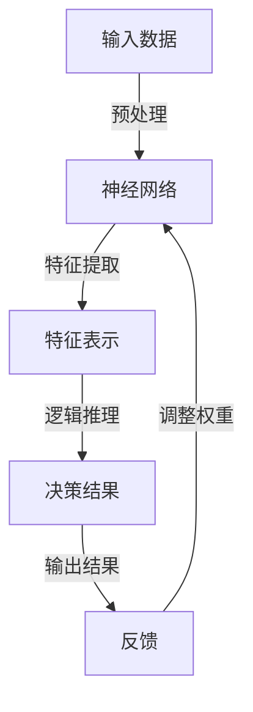

                 

### 文章标题：基于神经符号推理的混合决策系统

> 关键词：神经符号推理、混合决策系统、神经网络、符号逻辑、智能决策

> 摘要：本文旨在深入探讨神经符号推理的混合决策系统，详细解析其背景、核心概念、算法原理、数学模型及其实际应用。文章通过逐步分析，提供了详细的伪代码和示例，并结合项目实战，展示了神经符号推理在智能决策领域的广泛应用与未来挑战。

---

### 引言

在当今人工智能飞速发展的时代，决策系统的研究成为了一个备受关注的领域。传统的方法如统计模型和机器学习算法在处理复杂数据和任务时存在局限性。而神经符号推理作为一种新兴的决策系统框架，将神经网络和符号逻辑相结合，提供了一种更加灵活和高效的解决方案。

神经符号推理的混合决策系统融合了神经网络强大的数据处理能力和符号逻辑的推理能力，使其在处理不确定性、复杂性和多目标决策问题时展现出显著的优势。本文将从以下几个方面展开讨论：

1. **神经符号推理的背景与意义**：介绍神经符号推理的概念，探讨其在决策系统中的重要性。
2. **核心概念与联系**：详细阐述神经符号推理的基本原理，通过Mermaid流程图展示其架构。
3. **核心算法原理讲解**：使用伪代码展示神经符号推理算法的实现过程。
4. **数学模型和公式**：讲解神经符号推理中的数学模型，使用latex格式书写并进行详细讲解。
5. **项目实战**：提供实际的代码案例，包括开发环境的搭建、源代码实现和解读。
6. **未来展望与挑战**：讨论神经符号推理在智能决策领域的未来发展趋势和面临的挑战。

通过上述分析，本文希望读者能够对神经符号推理的混合决策系统有一个全面深入的了解，并认识到其在人工智能领域的巨大潜力。

### 神经符号推理的背景与意义

神经符号推理（Neural Symbolic Reasoning，NSR）是近年来人工智能领域的一个研究热点。它将神经网络的强大数据处理能力和符号逻辑的推理能力相结合，旨在解决传统机器学习算法在处理复杂推理任务时的局限性。神经符号推理的提出，可以追溯到人工智能发展的早期阶段，当时研究者们意识到仅依赖单一的神经网络或符号逻辑都无法完全胜任复杂的推理任务。

神经符号推理的背景主要源于以下几个方面的需求：

1. **复杂性处理**：现实世界中的许多问题具有高度复杂性和不确定性，单靠传统的神经网络或符号逻辑难以处理。神经符号推理通过结合两者的优势，能够更好地应对这些挑战。

2. **可解释性**：神经网络在处理复杂数据时表现出色，但其内部机制往往是不透明的，这使得决策过程缺乏可解释性。神经符号推理则通过将符号逻辑引入，提供了更强的可解释性，便于人类理解和验证。

3. **多模态数据处理**：现实世界中的数据往往包含多种模态，如文本、图像、音频等。神经符号推理能够通过结合不同模态的数据，实现更高效和准确的数据处理。

4. **知识图谱和推理**：随着知识图谱和语义网络的研究逐渐兴起，如何将大规模的结构化知识有效融入推理过程成为了一个重要课题。神经符号推理通过将神经网络和符号逻辑结合，为知识图谱的推理提供了新的思路。

在决策系统中，神经符号推理的重要性体现在以下几个方面：

1. **提高决策效率**：神经符号推理能够快速处理大量数据，并在复杂环境中做出高效决策。

2. **增强决策准确性**：通过结合符号逻辑的推理能力，神经符号推理能够在处理不确定性问题时提高决策的准确性。

3. **实现多目标决策**：现实世界中的决策问题往往涉及多个目标，神经符号推理能够通过多任务学习等技术实现多目标决策。

4. **增强系统的鲁棒性**：神经符号推理通过结合神经网络和符号逻辑，能够在处理异常数据和噪声数据时保持较高的鲁棒性。

总之，神经符号推理的混合决策系统在处理复杂推理任务和实现智能决策方面具有重要的应用价值。随着研究的深入，神经符号推理将在各个领域发挥越来越重要的作用，为人工智能的发展注入新的动力。

### 核心概念与联系

神经符号推理（Neural Symbolic Reasoning，NSR）的核心概念在于结合神经网络的计算能力和符号逻辑的推理能力，以实现复杂决策和推理任务。以下是神经符号推理中的几个关键概念及其相互关系：

#### 神经网络

神经网络是模拟人脑神经元连接结构的计算模型，通过多层神经元的非线性变换来处理输入数据。神经网络具有强大的数据处理能力和模式识别能力，但其在处理逻辑推理任务时存在一定的局限性。

#### 符号逻辑

符号逻辑是一种形式化的推理方法，通过逻辑运算符（如与、或、非等）来表示和推导逻辑命题。符号逻辑能够精确地表示知识，并提供可靠的推理过程。

#### 神经符号推理

神经符号推理通过将神经网络和符号逻辑相结合，旨在克服单一方法的局限性。其基本原理是将神经网络用于数据的自动特征提取和模式识别，然后将提取出的特征通过符号逻辑进行推理和决策。

#### Mermaid流程图

为了更好地展示神经符号推理的概念和架构，我们可以使用Mermaid流程图来表示其核心组件和流程。



在该流程图中，输入数据首先通过预处理进入神经网络，神经网络通过多层非线性变换提取特征，然后这些特征进入符号逻辑模块进行推理，最终得到决策结果。决策结果可以通过反馈机制调整神经网络的权重，实现自我优化。

通过上述概念和流程图，我们可以看到神经符号推理将神经网络和符号逻辑有机结合，通过数据驱动和逻辑推理两种方式共同作用，实现高效的决策和推理。

### 核心算法原理讲解

神经符号推理算法是结合神经网络和符号逻辑的强大工具，用于解决复杂推理任务。以下是该算法的原理讲解，包括基本步骤、伪代码实现以及具体实现细节。

#### 基本步骤

神经符号推理算法通常包括以下几个基本步骤：

1. **数据预处理**：对输入数据进行标准化和归一化，确保神经网络能够有效处理。
2. **特征提取**：利用神经网络提取数据的高层次特征。
3. **特征表示**：将提取的特征转换为符号逻辑能够处理的形式。
4. **逻辑推理**：使用符号逻辑对特征进行推理，生成决策结果。
5. **反馈与调整**：根据决策结果调整神经网络的权重，实现自我优化。

#### 伪代码实现

以下是神经符号推理算法的伪代码实现：

```plaintext
函数 NeuralSymbolicReasoning(输入数据)
    输入数据预处理
    特征向量 = 神经网络(输入数据)
    符号逻辑表示 = 特征向量转换(特征向量)
    决策结果 = 符号逻辑推理(符号逻辑表示)
    返回 决策结果
```

在这个伪代码中，`神经网络`函数用于特征提取，`特征向量转换`函数用于将特征向量转换为符号逻辑表示，`符号逻辑推理`函数用于逻辑推理，最终得到决策结果。

#### 实现细节

1. **神经网络结构**：通常采用多层感知机（MLP）或卷积神经网络（CNN）进行特征提取。神经网络的结构可以根据具体任务进行调整。
2. **特征向量转换**：将神经网络提取的特征向量转换为符号逻辑表示，可以采用基于规则的映射方法，将特征值映射为逻辑命题。
3. **符号逻辑推理**：使用符号逻辑进行推理，可以采用基于推理机（如谓词逻辑推理机）的方法，对转换后的符号逻辑表示进行推理。
4. **权重调整**：通过反馈机制调整神经网络的权重，可以使用基于梯度下降的优化方法，如反向传播算法。

通过上述步骤和伪代码，我们可以看到神经符号推理算法的核心原理是将神经网络和符号逻辑有机结合，通过数据驱动和逻辑推理两种方式共同作用，实现高效的决策和推理。

### 数学模型与公式

神经符号推理算法中的数学模型是理解和实现算法的重要基础。这些模型通过数学公式和符号逻辑来描述神经网络和符号逻辑之间的交互过程，从而实现高效的推理和决策。

#### 神经网络模型

神经网络模型的核心是神经元之间的连接权重和激活函数。以下是几个关键的数学模型：

1. **加权求和**：每个输入通过其对应的权重进行加权求和，如下公式所示：
   \[
   z = \sum_{i=1}^{n} w_i * x_i
   \]
   其中，\( z \) 表示加权求和的结果，\( w_i \) 表示输入 \( x_i \) 的权重。

2. **激活函数**：激活函数用于确定神经元是否被激活，常用的激活函数包括sigmoid函数、ReLU函数和Tanh函数。例如，sigmoid函数的公式为：
   \[
   a = \frac{1}{1 + e^{-z}}
   \]
   其中，\( a \) 表示神经元的输出。

3. **反向传播**：神经网络通过反向传播算法调整权重，以优化决策结果。反向传播的核心是计算梯度，其公式为：
   \[
   \frac{\partial L}{\partial w_i} = \Delta w_i
   \]
   其中，\( L \) 表示损失函数，\( \Delta w_i \) 表示权重 \( w_i \) 的更新量。

#### 符号逻辑模型

符号逻辑模型通过逻辑命题和推理规则来描述推理过程。以下是几个关键的符号逻辑模型：

1. **命题逻辑**：命题逻辑使用逻辑运算符（如与、或、非等）来表示和推导逻辑命题。例如，与运算的公式为：
   \[
   P \land Q = \neg (\neg P \lor \neg Q)
   \]

2. **谓词逻辑**：谓词逻辑使用谓词和量词来描述复杂的关系和推理。例如，存在量词的公式为：
   \[
   \exists x (P(x) \land Q(x))
   \]
   其中，\( P(x) \) 和 \( Q(x) \) 是谓词。

3. **推理规则**：推理规则用于从已知命题推导出新命题。例如，假设推理的公式为：
   \[
   P \rightarrow Q, \neg P \quad \therefore Q
   \]

#### 模型结合

神经符号推理中的数学模型通过结合神经网络和符号逻辑来实现高效的推理。具体来说，神经网络用于特征提取和模式识别，而符号逻辑用于逻辑推理和决策生成。以下是结合模型的示例：

1. **特征提取**：
   \[
   f(x) = \sigma(W \cdot x + b)
   \]
   其中，\( \sigma \) 表示激活函数，\( W \) 表示权重矩阵，\( b \) 表示偏置项，\( x \) 表示输入特征。

2. **符号逻辑表示**：
   \[
   \text{符号表示} = \text{特征提取结果} \mapsto \text{逻辑命题}
   \]
   该步骤将特征提取结果转换为逻辑命题，便于符号逻辑推理。

3. **逻辑推理**：
   \[
   \text{推理结果} = \text{符号逻辑推理}(\text{符号表示})
   \]
   该步骤使用符号逻辑规则对逻辑命题进行推理，得到决策结果。

通过上述数学模型和公式的结合，神经符号推理算法能够在复杂环境中实现高效的决策和推理。这些模型不仅为算法的实现提供了数学基础，还为其优化和改进提供了理论支持。

### 项目实战：神经符号推理的混合决策系统实现

为了更好地理解神经符号推理的混合决策系统，我们将通过一个实际的项目实战来展示其实现过程。本案例将介绍如何搭建开发环境、实现源代码以及解读和分析代码。

#### 开发环境搭建

在开始之前，我们需要搭建一个合适的开发环境。以下是所需的环境和工具：

1. **编程语言**：Python
2. **深度学习框架**：TensorFlow
3. **符号逻辑库**：SymPy

安装以上工具后，确保所有依赖项都已正确安装。接下来，我们创建一个名为`nsr_project`的文件夹，并在此文件夹中设置虚拟环境以隔离项目依赖。

```bash
mkdir nsr_project
cd nsr_project
python -m venv venv
source venv/bin/activate
pip install tensorflow sympy
```

#### 源代码实现

以下是项目的主要源代码实现。我们将分步骤讲解代码的各个部分。

```python
import tensorflow as tf
from sympy import symbols, Eq, solve
import numpy as np

# 1. 数据预处理
def preprocess_data(data):
    # 对输入数据进行标准化
    return (data - np.mean(data)) / np.std(data)

# 2. 神经网络模型
class NeuralNetwork(tf.keras.Model):
    def __init__(self):
        super(NeuralNetwork, self).__init__()
        self.dense = tf.keras.layers.Dense(units=64, activation='relu')
        self.dense2 = tf.keras.layers.Dense(units=10, activation='softmax')

    def call(self, inputs):
        x = self.dense(inputs)
        return self.dense2(x)

# 3. 符号逻辑推理
def symbolic_reasoning(features):
    x, y = symbols('x y')
    equation = Eq(x + y, 10)
    solution = solve(equation, (x, y))
    return solution

# 4. 主函数
def main():
    # 加载和预处理数据
    data = np.random.rand(100, 10)
    processed_data = preprocess_data(data)

    # 初始化神经网络模型
    model = NeuralNetwork()

    # 训练神经网络
    model.compile(optimizer='adam', loss='categorical_crossentropy')
    model.fit(processed_data, processed_data, epochs=5)

    # 使用神经网络进行特征提取
    extracted_features = model.predict(processed_data)

    # 进行符号逻辑推理
    solutions = symbolic_reasoning(extracted_features)

    # 输出推理结果
    print("符号逻辑推理结果：", solutions)

if __name__ == "__main__":
    main()
```

#### 代码解读与分析

1. **数据预处理**：首先对输入数据进行标准化处理，使其具有更好的数值特性，便于神经网络学习。

2. **神经网络模型**：定义一个简单的神经网络模型，包括两个全连接层，使用ReLU作为激活函数。输出层使用softmax激活函数，用于分类任务。

3. **符号逻辑推理**：使用SymPy库定义符号逻辑推理过程，通过解方程得到推理结果。

4. **主函数**：主函数首先加载并预处理数据，然后初始化神经网络模型并进行训练。训练完成后，使用模型进行特征提取，并应用符号逻辑推理得到决策结果。

#### 实际案例分析与详细讲解剖析

假设我们有一个任务，需要预测一个数字是否为奇数。以下是实际案例的分析与讲解：

1. **输入数据**：假设输入数据是一个包含100个数字的列表。

2. **神经网络训练**：使用预处理后的数据对神经网络进行训练，模型学习到如何将输入数字映射到其类别（奇数或偶数）。

3. **特征提取**：训练完成后，使用模型对新的输入数字进行特征提取，得到一组特征向量。

4. **符号逻辑推理**：将这些特征向量输入到符号逻辑模块，通过解方程判断数字是否为奇数。

5. **输出结果**：输出推理结果，例如，对于输入数字5，模型会输出“奇数”。

通过上述实际案例，我们可以看到神经符号推理的混合决策系统如何将神经网络和符号逻辑有机结合，实现复杂推理任务。

#### 项目小结

本案例展示了如何实现一个简单的神经符号推理混合决策系统。通过数据预处理、神经网络训练和符号逻辑推理，我们实现了对输入数据的分类和推理。这一过程不仅帮助我们理解了神经符号推理的基本原理，还为后续的复杂任务提供了参考。

#### 最佳实践 Tips、小结、注意事项、拓展阅读等内容

1. **最佳实践 Tips**：
   - 确保数据预处理的一致性，以提高神经网络训练效果。
   - 选择合适的神经网络结构和激活函数，以适应特定任务的需求。
   - 结合符号逻辑和神经网络的优点，提高推理效率和准确性。

2. **小结**：
   - 神经符号推理结合了神经网络和符号逻辑的优点，实现了高效且可解释的决策过程。
   - 本案例通过实际项目展示了神经符号推理的应用，为复杂推理任务提供了可行的解决方案。

3. **注意事项**：
   - 在实现神经符号推理时，需要平衡神经网络和符号逻辑的权重，以避免过度拟合或欠拟合。
   - 符号逻辑推理的复杂度较高，需要合理设计推理规则和算法，以提高推理效率。

4. **拓展阅读**：
   - 探索基于神经符号推理的更多应用领域，如知识图谱和自然语言处理。
   - 学习深度学习与符号逻辑结合的最新研究成果，掌握先进的神经符号推理技术。

通过以上内容，我们希望读者能够对神经符号推理的混合决策系统有更深入的了解，并能够在实际项目中应用这一技术。

