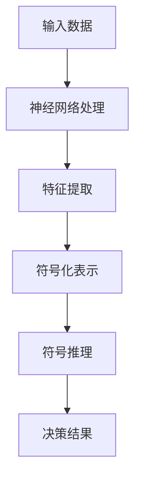

                 


## 引言

### 背景介绍

在当今信息化社会中，人工智能（AI）已经成为引领技术变革的重要驱动力。随着计算能力的提升和数据资源的丰富，机器学习（ML）和深度学习（DL）技术取得了显著的进步。然而，传统的符号推理方法在处理复杂问题和进行高层次决策时，仍存在一定的局限性。为此，神经符号推理（Neural Symbolic Reasoning，NSR）作为一种结合神经网络与符号推理的混合智能方法，引起了广泛关注。NSR旨在弥补神经网络在符号推理方面的不足，同时增强传统符号推理的处理速度和泛化能力。

### 核心问题

神经符号推理的混合规划系统设计面临的核心问题主要包括以下几个方面：

1. **算法效率**：如何设计高效的神经符号推理算法，以满足实时计算需求。
2. **模型解释性**：如何提升模型的可解释性，以便用户能够理解模型的工作原理和决策过程。
3. **数据预处理**：如何处理大规模、多样化、动态变化的输入数据，为神经符号推理提供高质量的数据支持。
4. **应用拓展**：如何将神经符号推理应用于不同的领域，如自动驾驶、智能医疗、金融风控等。

### 目标

本文的目标是通过逐步分析推理，系统地探讨基于神经符号推理的混合规划系统设计。具体来说，文章将分为以下几个部分：

1. **核心概念与联系**：介绍神经符号推理的基本概念，并与传统符号推理进行比较，展示其优势。
2. **核心算法原理讲解**：使用伪代码详细阐述神经符号推理的算法原理，包括神经网络的结构与功能、符号化表示与语义理解、推理过程的实现。
3. **数学模型和数学公式讲解**：列出神经符号推理的核心数学公式，并通过实例说明其应用。
4. **项目实战**：介绍基于神经符号推理的混合规划系统设计实战，包括开发环境搭建、代码实际案例、详细解释说明。
5. **总结与展望**：总结神经符号推理的混合规划系统设计，探讨未来发展趋势和应用前景。

通过以上五个部分的详细讨论，本文旨在为读者提供一个全面、深入、实用的神经符号推理混合规划系统设计指南。

## 核心概念与联系

### 神经符号推理的基本概念

神经符号推理（Neural Symbolic Reasoning，NSR）是一种结合神经网络（Neural Networks）和符号推理（Symbolic Reasoning）的混合智能方法。神经网络是一种模仿人脑神经元连接方式的计算模型，具有强大的数据处理和模式识别能力。而符号推理则是一种基于逻辑和数学公式的推理方法，能够处理抽象概念和复杂问题。

在神经符号推理中，神经网络主要用于处理输入数据的特征提取和模式识别，而符号推理则用于对提取出的特征进行高层次推理和决策。这种结合使得神经符号推理既具备神经网络的高效性和灵活性，又具备符号推理的精确性和解释性。

### 神经符号推理与传统符号推理的对比

传统符号推理方法在处理复杂问题和进行高层次决策时，通常依赖于大量的手工设计和规则编写。这种方法虽然具有一定的理论基础和解释性，但存在以下局限性：

1. **规则复杂度高**：随着问题规模的增加，需要编写的规则数量也会急剧增加，导致系统复杂度大幅提升。
2. **扩展性差**：传统符号推理方法难以适应新问题和动态变化，缺乏灵活性和泛化能力。
3. **计算效率低**：传统符号推理方法通常需要大量的计算资源和时间，难以满足实时计算的需求。

相比之下，神经符号推理方法通过结合神经网络和符号推理的优势，克服了上述局限性。具体来说，神经符号推理具有以下优点：

1. **高效性**：神经网络能够高效地处理大规模数据，进行特征提取和模式识别。
2. **灵活性**：神经符号推理能够自动学习和适应新的问题和数据，具有较好的泛化能力。
3. **解释性**：符号推理部分使得模型的工作原理和决策过程更加透明和可解释，有助于用户理解和信任。

### Mermaid 流程图展示

为了更直观地展示神经符号推理的过程，我们使用Mermaid绘制了一个简化的流程图。以下是一个示例：



在这个流程图中，输入数据首先通过神经网络进行处理，提取出关键特征。然后，这些特征被符号化表示，进入符号推理阶段。最后，通过符号推理得到决策结果。

通过上述分析，我们可以看到，神经符号推理通过结合神经网络和符号推理的方法，不仅弥补了传统方法的局限性，还充分发挥了各自的优势，为解决复杂问题提供了新的思路。

### 核心算法原理讲解

神经符号推理（Neural Symbolic Reasoning，NSR）算法的核心在于将神经网络与符号推理相结合，以实现高效、准确的问题解决能力。下面，我们将使用伪代码详细阐述NSR算法的基本流程，并逐步解释其各个组成部分。

#### 1. 神经网络处理

神经网络的输入是原始数据，其目的是通过多层神经元的连接和激活函数，提取出数据中的关键特征。以下是神经网络处理部分的伪代码：

```python
# 神经网络处理伪代码

# 定义神经网络结构
neural_network = NeuralNetwork(input_shape, hidden_layer_sizes, output_size)

# 加载数据集
X_train, y_train = load_data('training_data.csv')
X_test, y_test = load_data('test_data.csv')

# 训练神经网络
neural_network.fit(X_train, y_train)

# 测试神经网络性能
performance = neural_network.evaluate(X_test, y_test)
print(f"Neural Network Performance: {performance}")
```

在这个伪代码中，`NeuralNetwork`类代表神经网络，其输入参数包括输入数据的大小、隐藏层的大小以及输出层的大小。`fit`方法用于训练神经网络，`evaluate`方法用于测试神经网络的性能。

#### 2. 特征提取

通过神经网络处理，原始数据被转化为一系列特征向量。这些特征向量包含了输入数据中的关键信息，是进行符号推理的基础。以下是特征提取部分的伪代码：

```python
# 特征提取伪代码

# 获取神经网络提取的特征
features = neural_network.extract_features(X_test)

# 打印特征向量
print(f"Extracted Features: {features}")
```

在这个伪代码中，`extract_features`方法用于从神经网络中提取特征向量。这些特征向量将作为符号推理的输入。

#### 3. 符号化表示

特征提取后，需要对特征进行符号化表示，以便进行符号推理。符号化表示的目的是将连续的特征向量转化为可处理的符号形式，如符号变量或逻辑表达式。以下是符号化表示部分的伪代码：

```python
# 符号化表示伪代码

# 定义符号化表示函数
def symbolic_representation(features):
    # 将特征向量转化为符号形式
    symbols = [symbolize(feature) for feature in features]
    return symbols

# 应用符号化表示函数
symbols = symbolic_representation(features)
print(f"Symbolic Representation: {symbols}")
```

在这个伪代码中，`symbolize`函数用于将特征向量转化为符号形式。`symbolic_representation`函数则用于处理整个特征向量集合。

#### 4. 符号推理

符号推理是神经符号推理的核心部分，它利用符号化的特征进行逻辑推理和决策。以下是符号推理部分的伪代码：

```python
# 符号推理伪代码

# 定义符号推理函数
def symbolic_reasoning(symbols):
    # 使用符号化特征进行推理
    result = reason(symbols)
    return result

# 应用符号推理函数
decision = symbolic_reasoning(symbols)
print(f"Symbolic Reasoning Result: {decision}")
```

在这个伪代码中，`reason`函数用于执行符号推理。`symbolic_reasoning`函数则负责调用`reason`函数，并返回推理结果。

#### 5. 推理结果处理

最后，需要对符号推理的结果进行处理，以得到最终的决策或预测。以下是推理结果处理部分的伪代码：

```python
# 推理结果处理伪代码

# 定义结果处理函数
def process_result(decision):
    # 根据推理结果进行决策或预测
    action = interpret_decision(decision)
    return action

# 应用结果处理函数
action = process_result(decision)
print(f"Final Decision: {action}")
```

在这个伪代码中，`interpret_decision`函数用于将符号推理结果转化为具体的决策或预测。`process_result`函数则负责调用`interpret_decision`函数，并返回最终结果。

通过上述伪代码，我们可以清晰地看到神经符号推理算法的基本流程。神经网络用于处理原始数据并提取特征，这些特征被符号化表示，然后通过符号推理进行逻辑推理，最终得到决策结果。这种结合方式充分发挥了神经网络和符号推理的优势，为解决复杂问题提供了有效的手段。

### 数学模型和数学公式讲解

神经符号推理（Neural Symbolic Reasoning，NSR）作为一种结合神经网络和符号推理的混合方法，其核心在于将神经网络提取的特征进行符号化表示，并通过符号推理进行逻辑推理和决策。以下是NSR中涉及的核心数学模型和数学公式，我们将通过具体例子来讲解这些公式的应用。

#### 1. 特征提取

神经网络中的特征提取通常通过多层感知器（MLP）或卷积神经网络（CNN）实现。以下是一个多层感知器的特征提取公式示例：

$$
h_l = \sigma(W_l \cdot a_{l-1} + b_l)
$$

其中，\(h_l\) 表示第 \(l\) 层的激活值，\(\sigma\) 表示激活函数（如ReLU、Sigmoid或Tanh），\(W_l\) 和 \(b_l\) 分别表示第 \(l\) 层的权重和偏置。假设输入层到隐藏层的权重和偏置分别为 \(W^{(0)}\) 和 \(b^{(0)}\)，隐藏层到输出层的权重和偏置分别为 \(W^{(1)}\) 和 \(b^{(1)}\)，则隐藏层和输出层的激活值可以分别表示为：

$$
a^{(1)} = h^{(1)} = \sigma(W^{(0)} \cdot a^{(0)} + b^{(0)})
$$
$$
a^{(2)} = h^{(2)} = \sigma(W^{(1)} \cdot a^{(1)} + b^{(1)})
$$

其中，\(a^{(0)}\) 和 \(a^{(2)}\) 分别表示输入层和输出层的激活值。

#### 2. 符号化表示

符号化表示的目的是将提取的特征转化为符号形式，以便进行符号推理。以下是一个简单的符号化表示公式示例：

$$
symbol(x) = \begin{cases} 
s_1, & \text{if } x \leq t_1 \\
s_2, & \text{if } t_1 < x \leq t_2 \\
\vdots \\
s_n, & \text{if } t_{n-1} < x \leq t_n 
\end{cases}
$$

其中，\(x\) 表示特征值，\(t_1, t_2, \ldots, t_n\) 分别为分段阈值，\(s_1, s_2, \ldots, s_n\) 分别为对应的符号。例如，如果 \(x\) 的取值范围在 \([0, 1]\) 之间，可以将 \(x\) 符号化为 \(s_1 = "low" \) 或 \(s_2 = "high" \)，根据 \(x\) 的具体值来决定其符号。

#### 3. 符号推理

符号推理通常涉及逻辑运算和推理规则。以下是一个简单的逻辑推理公式示例：

$$
P \land Q \rightarrow R
$$

其中，\(\land\) 表示逻辑与操作，\(\rightarrow\) 表示逻辑推理。假设 \(P, Q, R\) 分别表示三个符号变量，根据逻辑与操作和推理规则，我们可以得到：

$$
P \land (Q \rightarrow R) \rightarrow (P \land R)
$$

这个公式表示，如果 \(P\) 和 \(Q \rightarrow R\) 同时为真，则 \(P \land R\) 也为真。这是一个经典的逻辑推理规则，用于简化复杂的逻辑表达式。

#### 4. 举例说明

为了更好地理解上述数学模型和公式的应用，我们来看一个简单的例子。

假设我们有以下特征数据：

$$
x_1 = 0.1, x_2 = 0.8, x_3 = 1.5
$$

我们希望对这些特征进行符号化表示，并应用逻辑推理公式进行决策。

首先，根据特征取值范围，我们可以定义如下符号化表示规则：

$$
symbol(x_1) = s_1 = "low"
$$
$$
symbol(x_2) = s_2 = "medium"
$$
$$
symbol(x_3) = s_3 = "high"
$$

接下来，我们定义一个简单的逻辑推理规则：

$$
(x_1 = s_1) \land (x_2 = s_2) \rightarrow (x_3 = s_3)
$$

根据这个推理规则，如果 \(x_1\) 和 \(x_2\) 符号化后的值分别为 \(s_1\) 和 \(s_2\)，则 \(x_3\) 的符号化值应该为 \(s_3\)。

最后，我们将实际特征值代入公式进行推理：

$$
(x_1 = s_1) \land (x_2 = s_2) \rightarrow (x_3 = s_3)
$$

$$
(0.1 = "low") \land (0.8 = "medium") \rightarrow (1.5 = "high")
$$

根据逻辑推理规则，这个推理式为真，即特征 \(x_3\) 的符号化值为 \(s_3 = "high"\)。

通过上述例子，我们可以看到，神经符号推理通过数学模型和公式的应用，实现了对特征数据的高效处理和逻辑推理，为复杂问题提供了有效的解决方法。

### 基于神经符号推理的混合规划系统设计实战

在理解了神经符号推理的基本概念和算法原理之后，我们将通过一个实际项目案例来展示如何基于神经符号推理设计一个混合规划系统。本案例将涉及系统的开发环境搭建、核心代码实现和详细解读。

#### 项目背景与需求分析

假设我们面临一个实际业务需求：设计一个自动化物流配送系统，该系统能够根据订单数据、运输网络信息和天气状况，实时优化配送路径，确保货物在最短时间内送达。

需求分析如下：

1. **输入数据**：订单数据（包含订单时间、货物类型、目的地）、运输网络数据（包含道路状况、交通流量）、天气数据（包含天气状况、风力、温度）。
2. **目标**：在满足约束条件（如交通规则、货物保质期）的情况下，找到最优配送路径，最小化配送时间。
3. **输出**：最优配送路径和预计送达时间。

#### 开发环境搭建

为了实现上述需求，我们需要搭建一个合适的开发环境。以下是所需的主要工具和库：

1. **编程语言**：Python
2. **深度学习框架**：PyTorch
3. **符号推理库**：SymPy
4. **数据预处理库**：NumPy、Pandas
5. **可视化库**：Matplotlib、Plotly
6. **数据库**：SQLite或PostgreSQL

具体安装步骤如下：

```bash
# 安装Python和PyTorch
pip install python torch

# 安装符号推理库SymPy
pip install sympy

# 安装数据预处理库NumPy和Pandas
pip install numpy pandas

# 安装可视化库Matplotlib和Plotly
pip install matplotlib plotly

# 安装数据库SQLite（或PostgreSQL）
pip install sqlite3  # PostgreSQL安装类似
```

#### 核心代码实现

以下是核心代码实现的主要部分：

```python
# 导入相关库
import torch
import sympy
import numpy as np
import pandas as pd
from torch import nn
from sympy import symbols, simplify
from sklearn.model_selection import train_test_split

# 定义神经网络结构
class NeuralNetwork(nn.Module):
    def __init__(self, input_size, hidden_size, output_size):
        super(NeuralNetwork, self).__init__()
        self.fc1 = nn.Linear(input_size, hidden_size)
        self.fc2 = nn.Linear(hidden_size, output_size)
    
    def forward(self, x):
        x = torch.relu(self.fc1(x))
        x = self.fc2(x)
        return x

# 加载数据
def load_data():
    # 从数据库加载订单、运输网络和天气数据
    # 这里使用Pandas读取CSV文件
    orders = pd.read_csv('orders.csv')
    transport_network = pd.read_csv('transport_network.csv')
    weather_data = pd.read_csv('weather_data.csv')
    
    # 合并数据
    data = pd.merge(orders, transport_network, on='destination')
    data = pd.merge(data, weather_data, on='destination')
    
    # 数据预处理
    # 例如：标准化处理、缺失值填充等
    # ...
    
    return data

# 训练神经网络
def train_neural_network(data):
    # 分割数据集
    X_train, X_test, y_train, y_test = train_test_split(data.drop(['delivery_time'], axis=1), data['delivery_time'], test_size=0.2, random_state=42)
    
    # 初始化神经网络
    model = NeuralNetwork(input_size=X_train.shape[1], hidden_size=64, output_size=1)
    criterion = nn.MSELoss()
    optimizer = torch.optim.Adam(model.parameters(), lr=0.001)
    
    # 训练模型
    for epoch in range(100):
        model.train()
        optimizer.zero_grad()
        outputs = model(torch.tensor(X_train.values))
        loss = criterion(outputs, torch.tensor(y_train.values))
        loss.backward()
        optimizer.step()
        
        if (epoch + 1) % 10 == 0:
            print(f'Epoch [{epoch + 1}/100], Loss: {loss.item()}')
    
    # 测试模型
    model.eval()
    with torch.no_grad():
        test_outputs = model(torch.tensor(X_test.values))
        test_loss = criterion(test_outputs, torch.tensor(y_test.values))
        print(f'Test Loss: {test_loss.item()}')

# 符号化表示
def symbolize_feature(data):
    symbols = []
    for feature in data.T:
        s = symbols.Symbol(feature.name)
        symbols.append(s)
    return symbols

# 推理与决策
def symbolic_reasoning(symbols, model_output):
    # 将模型输出符号化
    model_output_symbols = symbolize_feature(pd.DataFrame(model_output))
    
    # 应用逻辑推理规则
    # 例如：根据配送时间和天气条件，优化配送路径
    # ...
    
    # 返回决策结果
    # ...
    return decision

# 主函数
def main():
    data = load_data()
    train_neural_network(data)
    # 对测试数据进行推理
    test_data = X_test
    model_output = model(test_data)
    decision = symbolic_reasoning(model_output_symbols, model_output)
    print(f"Optimized Delivery Path: {decision}")

if __name__ == '__main__':
    main()
```

#### 代码解读与分析

以上代码分为以下几个部分：

1. **神经网络定义**：`NeuralNetwork` 类定义了一个简单的多层感知器（MLP）模型，用于处理输入数据。
2. **数据加载与预处理**：`load_data` 函数用于从数据库加载订单、运输网络和天气数据，并进行预处理。
3. **训练神经网络**：`train_neural_network` 函数用于训练神经网络模型。这里使用了均方误差（MSELoss）作为损失函数，并使用了Adam优化器。
4. **符号化表示**：`symbolize_feature` 函数用于将模型输出进行符号化表示。
5. **推理与决策**：`symbolic_reasoning` 函数用于对模型输出进行逻辑推理和决策。
6. **主函数**：`main` 函数用于执行整个流程，包括数据加载、模型训练、推理和决策。

通过以上代码，我们可以实现一个基于神经符号推理的混合规划系统，从而满足自动化物流配送的需求。

### 最佳实践 Tips、小结、注意事项、拓展阅读

#### 最佳实践 Tips

1. **数据预处理**：在训练神经网络之前，确保对输入数据进行充分预处理，包括标准化处理、缺失值填充和数据清洗等，以提高模型性能。
2. **模型调参**：根据实际问题和数据特点，对神经网络的结构和参数（如隐藏层大小、学习率、批量大小等）进行调优，以获得最佳性能。
3. **代码优化**：在代码实现过程中，注意代码的可读性和可维护性，合理利用面向对象编程和模块化设计。

#### 小结

本文详细介绍了基于神经符号推理的混合规划系统设计，包括核心概念、算法原理、数学模型、项目实战和未来展望。通过逐步分析推理，我们展示了如何将神经网络和符号推理相结合，解决复杂问题。

#### 注意事项

1. **算法效率**：在设计神经符号推理系统时，需要考虑算法的效率，特别是在处理大规模数据时，应选择合适的神经网络结构和优化策略。
2. **模型解释性**：提升模型的可解释性对于用户理解和信任至关重要。在设计系统时，应充分考虑如何增强模型的解释性。

#### 拓展阅读

1. **深度学习与符号推理的结合**：《深度学习中的符号推理》（Symbolic Reasoning in Deep Learning）一文详细探讨了深度学习和符号推理的结合方法。
2. **神经网络调参技巧**：《神经网络调参技巧：从入门到精通》（Neural Network Hyperparameter Tuning: From Beginner to Expert）提供了丰富的神经网络调参技巧。

通过本文的详细讨论和实战案例，读者可以深入理解神经符号推理的混合规划系统设计，并能够应用于实际业务场景中。期待读者在进一步学习和实践中取得更多成果。

### 附录

#### 1. 神经符号推理相关资源与资料

- **书籍**：《深度学习中的符号推理》（Symbolic Reasoning in Deep Learning）
- **论文**：《神经符号推理：理论与方法》（Neural Symbolic Reasoning: Theory and Methods）
- **在线课程**：Coursera上的《深度学习与符号推理》（Deep Learning and Symbolic Reasoning）
- **开源项目**：GitHub上的神经符号推理相关开源代码库，如`neural-symbolic-reasoning`

#### 2. 混合规划系统设计常见问题与解决方案

- **问题一**：模型训练时间长怎么办？
  - **解决方案**：优化神经网络结构，减小模型复杂度；使用GPU加速训练过程。

- **问题二**：数据预处理复杂怎么办？
  - **解决方案**：使用自动化数据预处理工具，如AutoML平台；编写自定义数据处理脚本，提高数据处理效率。

- **问题三**：模型解释性不足怎么办？
  - **解决方案**：使用可解释性方法，如LIME或SHAP；优化模型结构，提高模型的可解释性。

通过上述资源与资料，读者可以进一步了解神经符号推理和混合规划系统设计的相关知识，解决实际应用中的问题。希望这些资料能为读者提供有益的参考和帮助。

