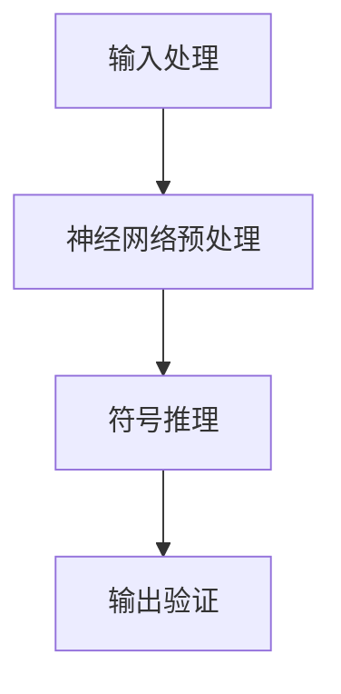
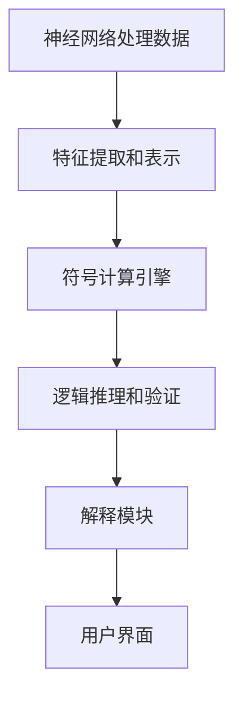
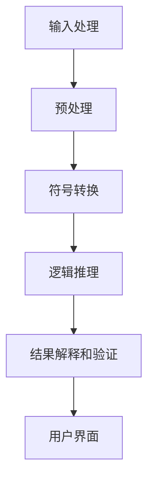
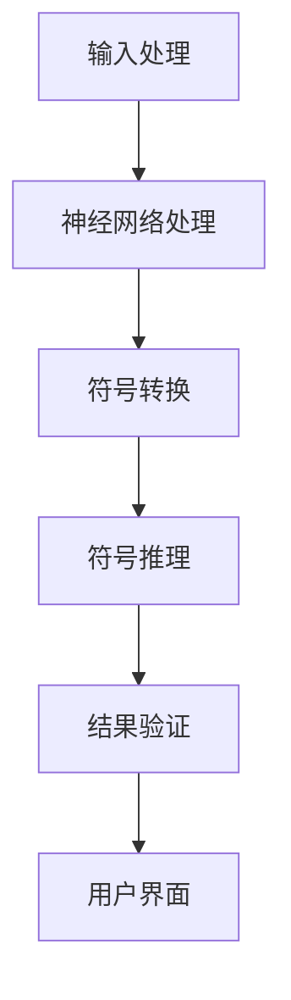

                 

### 整体思路与结构设计

为了撰写一篇深度丰富且逻辑严谨的技术博客，我们首先需要明确文章的整体思路和结构。以下是具体的步骤：

1. **引言部分**：介绍自动定理证明系统的背景和重要性，引发读者的兴趣。
2. **核心概念与联系**：详细解释神经符号推理的概念，并使用Mermaid流程图展示其与自动定理证明系统的关系。
3. **核心算法原理讲解**：使用伪代码和latex公式详细阐述神经符号推理的算法原理。
4. **数学模型和公式讲解**：分析神经符号推理的数学模型，并使用latex公式进行详细讲解，辅以实际案例说明。
5. **项目实战**：介绍如何开发一个基于神经符号推理的自动定理证明系统，包括环境搭建、源代码解读、案例分析和小结。
6. **总结与展望**：总结文章的主要观点，展望未来研究方向和潜在应用。

通过这样的结构设计，文章将能够系统地引导读者逐步了解和理解基于神经符号推理的自动定理证明系统。

### 文章标题

# 基于神经符号推理的自动定理证明系统

### 关键词

- 神经符号推理
- 自动定理证明
- 神经网络
- 符号计算
- 数学模型
- 伪代码
- 项目实战

### 摘要

本文深入探讨了基于神经符号推理的自动定理证明系统。首先介绍了自动定理证明系统的背景和重要性，然后详细解释了神经符号推理的基本概念及其在自动定理证明系统中的应用。通过伪代码和数学模型，本文阐述了神经符号推理的核心算法原理。接着，本文通过实际项目实战，展示了如何开发和实现一个自动定理证明系统，并进行了详细的代码解读和案例分析。最后，本文总结了基于神经符号推理的自动定理证明系统的优点和局限性，并展望了其未来发展方向。

### 引言

自动定理证明系统（ATPS）是计算机科学和数学领域的一项重要研究课题。其核心目标是通过计算机自动化地验证数学定理的正确性，从而极大地提升数学研究的效率。在过去的几十年中，自动定理证明系统已经在诸如数学、物理学、计算机科学等多个领域发挥了重要作用。然而，传统的自动定理证明方法存在一定的局限性，特别是在处理复杂逻辑推理和高度抽象问题时，表现并不理想。

近年来，随着深度学习和神经网络技术的快速发展，人们开始探索将神经网络与符号计算相结合的方法，即神经符号推理。神经符号推理通过将神经网络的优势与符号计算的精确性相结合，能够在处理复杂逻辑推理和抽象问题时展现出强大的潜力。因此，研究基于神经符号推理的自动定理证明系统具有重要的理论意义和实际应用价值。

本文旨在系统地介绍基于神经符号推理的自动定理证明系统，探讨其核心概念、算法原理、数学模型，并通过实际项目实战展示其开发和应用。通过本文的阅读，读者可以全面了解神经符号推理在自动定理证明领域的应用前景，掌握相关技术原理和实现方法。

### 第1章：自动定理证明系统的概述

自动定理证明系统（ATPS）是数学和计算机科学领域中的一个重要研究方向。其目标是通过自动化手段验证数学定理的正确性，从而提高数学研究的效率。自动定理证明系统的发展历史可以追溯到20世纪50年代。当时，计算机刚刚开始应用于数学领域，人们试图通过编写程序来证明数学定理。早期的自动定理证明系统主要依赖于逻辑推理和符号计算，如ROBIA和MATHEMATICA等。然而，这些系统在处理复杂定理时往往效率低下，且难以保证证明的完整性。

随着计算机技术的不断进步，自动定理证明系统逐渐发展壮大。20世纪80年代，ATPS进入了新的发展阶段，出现了诸如EQP和OTTER等基于自动推理技术的系统。这些系统在处理复杂定理证明时表现出较高的效率，但仍存在一定的局限性。例如，它们往往依赖于领域专家提供启发式规则，难以处理高度抽象的定理。

近年来，随着深度学习和神经网络技术的兴起，基于神经符号推理的自动定理证明系统成为研究的热点。神经符号推理结合了神经网络的高效数据处理能力和符号计算的精确性，能够在处理复杂逻辑推理和抽象问题时展现出强大的潜力。本文将详细介绍基于神经符号推理的自动定理证明系统，探讨其核心概念、算法原理和数学模型。

#### 自动定理证明系统的历史与现状

自动定理证明系统的发展历程可以分为以下几个阶段：

1. **早期系统**（1950s-1960s）：这一阶段的主要代表工作是数学家Herbert Simon和Alan Newell合作开发的逻辑理论家（Logic Theorist）系统。该系统通过形式逻辑和递归方法来证明数学定理，是自动定理证明领域的开创性工作。

2. **基于自动推理的系统**（1970s-1980s）：20世纪70年代，自动推理技术逐渐成为自动定理证明系统的研究重点。例如，EQP系统是基于归结原理的自动定理证明系统，它在处理复杂定理时表现出较高的效率。

3. **现代系统**（1990s至今）：随着计算机硬件性能的提升和算法理论的进步，自动定理证明系统得到了快速发展。现代系统如OTTER和SPASS等，不仅继承了早期系统的优点，还结合了机器学习、神经网络等技术，提高了定理证明的自动化程度和效率。

当前，自动定理证明系统已经在数学、计算机科学、物理学等领域得到了广泛应用。例如，在数学领域，自动定理证明系统可以用于验证数学定理的正确性，从而提高数学研究的效率；在计算机科学领域，自动定理证明系统可以用于软件验证和形式化验证，确保软件的正确性和安全性。

#### 神经符号推理的基本概念

神经符号推理（Neural Symbolic Reasoning，NSR）是一种结合了神经网络和符号计算的方法。神经网络擅长处理复杂数据和学习复杂模式，而符号计算则擅长逻辑推理和形式化验证。神经符号推理的核心思想是将神经网络与符号计算相结合，利用神经网络处理数据，并通过符号计算进行逻辑推理和验证。

神经符号推理的基本概念包括：

1. **神经网络**：神经网络是一种通过模拟人脑神经元连接结构进行信息处理的计算模型。它由输入层、隐藏层和输出层组成，通过前向传播和反向传播算法来训练模型，使其能够对输入数据进行分类、回归等任务。

2. **符号计算**：符号计算是一种通过符号操作进行逻辑推理和形式化验证的计算方法。符号计算可以处理抽象的符号表达式，进行推理、证明和验证等任务。

3. **神经符号推理**：神经符号推理通过将神经网络与符号计算相结合，实现数据的自动推理和验证。具体来说，神经符号推理将神经网络用于处理输入数据，将数据转化为符号表达式，然后利用符号计算进行推理和验证。这种结合方式使得神经符号推理能够在处理复杂逻辑推理和抽象问题时表现出较高的效率和准确性。

#### 核心概念与联系

自动定理证明系统和神经符号推理之间存在密切的联系。自动定理证明系统利用神经符号推理来提高定理证明的自动化程度和效率。具体来说，自动定理证明系统可以分为以下几个主要部分：

1. **输入处理**：自动定理证明系统首先需要接收输入的定理描述，这些定理描述可以是符号表达式、自然语言文本或图像等。神经符号推理的神经网络部分负责对输入数据进行预处理，将其转化为符号表达式。

2. **符号推理**：在符号推理阶段，神经符号推理的符号计算部分利用符号表达式进行逻辑推理和验证。通过结合神经网络和符号计算的优势，自动定理证明系统可以在处理复杂定理时实现更高的自动化程度和效率。

3. **输出验证**：最后，自动定理证明系统需要输出证明结果。如果定理被证明为真，系统将输出证明过程和结果；如果定理无法被证明或被证明为假，系统将输出相关错误信息。

以下是一个简化的Mermaid流程图，展示了自动定理证明系统中的核心流程和组件：



通过这个流程图，我们可以清楚地看到自动定理证明系统中神经网络和符号计算之间的紧密协作。神经网络用于处理输入数据并转化为符号表达式，而符号计算则用于逻辑推理和验证，最终输出证明结果。

### 第2章：神经符号推理的原理与架构

神经符号推理（Neural Symbolic Reasoning, NSR）是一种结合了神经网络和符号计算的混合推理方法。它的目标是利用神经网络处理复杂数据和模式，同时利用符号计算进行精确的逻辑推理和验证。本章将详细探讨神经符号推理的基本原理、架构以及其在自动定理证明系统中的应用。

#### 神经符号推理的基本原理

神经符号推理的核心思想是将神经网络和符号计算相结合，利用两者的优势来处理复杂的问题。神经网络擅长处理大量数据，可以从数据中学习到复杂的模式和规律；而符号计算则具有逻辑推理的精确性和可解释性，可以用于验证定理的正确性。

神经符号推理的基本原理可以概括为以下几个步骤：

1. **数据表示**：首先，神经网络将原始数据（如图像、文本或数值）转化为适合符号计算的形式。这一步骤通常涉及特征提取和表示学习。

2. **符号转换**：将神经网络提取的特征转换为符号表达式。这可以通过将神经网络中的激活值转换为符号变量，或者将神经网络的权重和偏置转换为符号操作来实现。

3. **逻辑推理**：利用符号计算对转换后的符号表达式进行逻辑推理和验证。符号计算可以处理高度抽象的符号表达式，进行推理、证明和验证等任务。

4. **解释和验证**：最后，神经符号推理系统需要解释和验证推理结果。这包括对推理过程进行可解释性分析，以及对推理结果进行验证，确保其正确性。

#### 神经符号推理的架构

神经符号推理的架构通常包括以下几个主要组件：

1. **神经网络**：神经网络是神经符号推理的基础，用于处理原始数据，提取特征和表示。常见的神经网络结构包括卷积神经网络（CNN）、循环神经网络（RNN）和变压器（Transformer）等。

2. **符号计算引擎**：符号计算引擎负责对神经网络提取的特征进行符号化处理，并进行逻辑推理和验证。符号计算引擎通常包括逻辑推理模块、定理证明器和验证器等。

3. **解释模块**：解释模块用于分析神经符号推理的过程和结果，提供可解释性。这可以帮助用户理解推理过程，并验证推理结果的正确性。

4. **用户界面**：用户界面用于与用户交互，接收用户输入的定理描述，显示推理过程和结果，并提供用户反馈。

以下是一个简化的Mermaid流程图，展示了神经符号推理的基本架构：



#### 自动定理证明系统中的神经符号推理

在自动定理证明系统中，神经符号推理被广泛应用于定理的自动证明和验证。以下是一个简化的流程，展示了神经符号推理在自动定理证明系统中的应用：

1. **输入处理**：自动定理证明系统接收用户输入的定理描述，这些定理描述可以是符号表达式、自然语言文本或图像等。

2. **预处理**：神经网络对输入的定理描述进行预处理，提取关键特征和表示。这一步骤可能涉及文本分类、图像识别或其他类型的特征提取任务。

3. **符号转换**：将神经网络提取的特征转换为符号表达式。这可以通过将神经网络的激活值转换为符号变量，或者将神经网络的权重和偏置转换为符号操作来实现。

4. **逻辑推理**：利用符号计算引擎对转换后的符号表达式进行逻辑推理和验证。符号计算引擎可以处理复杂的逻辑推理任务，如定理证明、模型验证和逻辑推导等。

5. **结果解释和验证**：解释模块对推理过程和结果进行解释和验证，确保推理结果的正确性和可靠性。用户界面则用于与用户交互，显示推理过程和结果，并提供用户反馈。

以下是一个简化的Mermaid流程图，展示了神经符号推理在自动定理证明系统中的应用：



通过上述流程，我们可以看到神经符号推理在自动定理证明系统中的关键作用。它通过将神经网络和符号计算相结合，实现了高效的定理证明和验证，为数学和计算机科学领域的研究提供了强大的工具。

### 第3章：核心算法原理讲解

在神经符号推理中，核心算法的设计和实现至关重要。本章将详细讲解神经符号推理的核心算法原理，包括神经网络与符号推理的结合方式、伪代码展示以及如何处理复杂的逻辑推理任务。

#### 神经网络与符号推理的结合方式

神经符号推理的核心在于如何将神经网络与符号推理相结合，以发挥两者的优势。具体来说，这种结合方式可以采用以下几种方法：

1. **符号嵌入**：将神经网络视为一种特征提取器，将输入数据（如文本、图像等）转换为符号表示。然后，利用符号推理对转换后的符号进行逻辑推理和验证。

2. **神经网络优化**：使用符号推理的结果来优化神经网络的参数。例如，在训练过程中，利用符号推理的验证结果来调整神经网络的权重和偏置，从而提高推理的准确性。

3. **模块化设计**：将神经网络和符号推理模块化，分别处理不同类型的任务。例如，神经网络可以处理数据预处理和特征提取，而符号推理则负责逻辑推理和验证。

#### 伪代码展示

为了更直观地展示神经符号推理的算法原理，以下是一个简化的伪代码示例：

```python
# 神经符号推理算法伪代码

# 输入：输入数据X，符号系统S
# 输出：推理结果Y

1. 对输入数据X进行预处理
2. 使用神经网络提取特征表示
    feature_representation = neural_network(X)
3. 将特征表示转换为符号表达式
    symbol_expression = convert_to_symbol(feature_representation)
4. 利用符号推理系统进行逻辑推理
    reasoning_result = symbolic_reasoning(symbol_expression)
5. 验证推理结果
    verified_result = verify_result(reasoning_result)
6. 返回验证结果Y

# 伪代码中的函数定义
def convert_to_symbol(feature_representation):
    # 将特征表示转换为符号表达式
    return symbol_expression

def symbolic_reasoning(symbol_expression):
    # 使用符号推理系统进行逻辑推理
    return reasoning_result

def verify_result(reasoning_result):
    # 验证推理结果
    return verified_result
```

这个伪代码展示了神经符号推理的基本流程，包括特征提取、符号转换、逻辑推理和结果验证。在实际应用中，这些步骤可能涉及更复杂的操作和算法。

#### 处理复杂的逻辑推理任务

在自动定理证明系统中，神经符号推理需要处理复杂的逻辑推理任务。以下是一些关键步骤和方法：

1. **符号化**：将输入的定理描述转化为符号表达式。这通常涉及将自然语言或数学表达式转换为形式化的逻辑表达式。

2. **推理规则**：定义一组推理规则，用于在符号表达式中进行推理和推导。这些规则可以基于逻辑推理原理或数学定理。

3. **推理过程**：利用神经网络和符号推理相结合的方法进行推理。具体来说，可以使用神经网络提取特征，然后利用符号推理规则进行推理和验证。

4. **优化策略**：在推理过程中，使用优化策略来提高推理的效率和准确性。例如，可以使用启发式搜索、约束满足问题（CSP）解决方法等。

5. **验证和解释**：对推理结果进行验证，确保其正确性和可靠性。同时，提供可解释性分析，帮助用户理解推理过程和结果。

通过上述方法，神经符号推理可以有效地处理复杂的逻辑推理任务，为自动定理证明系统提供强大的支持。

### 第4章：自动定理证明系统的实现

在实际应用中，实现一个基于神经符号推理的自动定理证明系统需要考虑多个方面，包括系统框架设计、数学模型、算法实现和优化。本章将详细探讨如何构建这样一个系统，并展示其实际应用。

#### 系统框架设计

一个典型的基于神经符号推理的自动定理证明系统框架包括以下几个关键组件：

1. **输入处理模块**：负责接收用户输入的定理描述，可以是符号表达式、自然语言文本或图像等。该模块需要对输入进行预处理，以便后续处理。

2. **神经网络处理模块**：该模块利用神经网络对输入数据进行特征提取和表示。常见的方法包括卷积神经网络（CNN）用于图像处理、循环神经网络（RNN）用于文本处理等。

3. **符号转换模块**：将神经网络提取的特征转换为符号表达式。这一步是神经符号推理的关键，需要将神经网络中的激活值或权重转换为符号变量或操作。

4. **符号推理模块**：该模块利用符号计算引擎进行逻辑推理和验证。常见的符号推理方法包括基于归结原理的自动推理、定理证明器等。

5. **结果验证和解释模块**：对推理结果进行验证，确保其正确性和可靠性。同时，提供可解释性分析，帮助用户理解推理过程和结果。

6. **用户界面**：用于与用户交互，接收用户输入、显示推理过程和结果，并提供用户反馈。

以下是一个简化的Mermaid流程图，展示了自动定理证明系统的核心组件和流程：



#### 数学模型

神经符号推理的数学模型是整个系统的核心。以下是一些关键的数学模型和公式：

1. **神经网络模型**：常用的神经网络模型包括卷积神经网络（CNN）、循环神经网络（RNN）和变压器（Transformer）等。每种模型都有其特定的数学公式和计算方法。

2. **符号推理模型**：符号推理通常涉及逻辑推理、定理证明和模型验证。常见的符号推理方法包括归结原理、定理证明器和模型验证器等。以下是一个简化的逻辑推理公式：

   $$ \text{if } P \text{ then } Q, \text{ and } R \text{ is true, then } S \text{ is true.} $$

   这个公式可以表示为：

   $$ (P \rightarrow Q) \land R \rightarrow S $$

3. **推理结果验证模型**：推理结果验证通常涉及验证推理过程的正确性和结果的可靠性。可以使用形式化的验证方法，如定理证明和模型验证等。

以下是一个简化的latex公式示例：

$$
\forall x \in \mathbb{N}, \, \exists y \in \mathbb{N} \text{ such that } x + y = 10.
$$

#### 算法实现

实现自动定理证明系统需要考虑以下几个关键步骤：

1. **数据预处理**：对输入的定理描述进行预处理，将其转换为适合神经网络处理的形式。例如，对于自然语言文本，可以使用分词和词嵌入技术。

2. **神经网络训练**：使用预处理后的数据训练神经网络，提取特征表示。这一步通常涉及大量的训练数据和优化算法，如梯度下降。

3. **符号转换**：将神经网络提取的特征转换为符号表达式。这可以通过定义一组转换规则来实现。例如，可以将神经网络的激活值转换为符号变量。

4. **符号推理**：使用符号计算引擎对转换后的符号表达式进行推理和验证。这通常涉及符号化、推理规则的应用和定理证明。

5. **结果验证**：对推理结果进行验证，确保其正确性和可靠性。可以使用定理证明器和模型验证器等工具。

6. **用户界面**：开发用户界面，用于与用户交互。用户界面可以显示推理过程、结果和解释，并提供用户反馈。

以下是一个简化的算法实现伪代码：

```python
# 自动定理证明系统伪代码

# 输入：输入数据X，参数θ
# 输出：推理结果Y

1. 预处理输入数据X
2. 使用神经网络提取特征表示
    feature_representation = neural_network(X, θ)
3. 将特征表示转换为符号表达式
    symbol_expression = convert_to_symbol(feature_representation)
4. 使用符号推理系统进行逻辑推理
    reasoning_result = symbolic_reasoning(symbol_expression)
5. 验证推理结果
    verified_result = verify_result(reasoning_result)
6. 返回验证结果Y

# 函数定义
def convert_to_symbol(feature_representation):
    # 将特征表示转换为符号表达式
    return symbol_expression

def symbolic_reasoning(symbol_expression):
    # 使用符号推理系统进行逻辑推理
    return reasoning_result

def verify_result(reasoning_result):
    # 验证推理结果
    return verified_result
```

#### 实际应用

基于神经符号推理的自动定理证明系统可以应用于多个领域，如数学定理验证、软件验证、硬件验证等。以下是一个简单的实际应用示例：

**案例：数学定理验证**

假设我们需要验证以下定理：

$$ \forall x \in \mathbb{N}, \, \exists y \in \mathbb{N} \text{ such that } x + y = 10. $$

1. **输入处理**：将定理描述转换为文本形式，例如“对于所有的自然数x，存在一个自然数y，使得x + y等于10”。

2. **预处理**：对输入文本进行分词和词嵌入，转换为神经网络可以处理的向量表示。

3. **神经网络处理**：使用卷积神经网络或循环神经网络提取特征表示。

4. **符号转换**：将神经网络提取的特征表示转换为符号表达式，例如 $x + y = 10$。

5. **符号推理**：使用符号推理系统进行逻辑推理，验证定理的正确性。

6. **结果验证**：验证推理结果，确保其正确性和可靠性。

7. **用户界面**：显示推理过程、结果和解释，用户可以查看证明过程并验证结果的正确性。

通过这个实际应用案例，我们可以看到基于神经符号推理的自动定理证明系统的具体实现过程和步骤。这种系统不仅在理论上有重要意义，而且在实际应用中具有广泛的应用前景。

### 第5章：数学模型和数学公式

在神经符号推理中，数学模型和数学公式起着至关重要的作用。这些模型和公式不仅帮助我们理解和分析神经符号推理的工作原理，还能提供有效的工具来解决复杂的问题。本章将详细介绍神经符号推理中的关键数学模型和数学公式，并辅以具体例子进行讲解。

#### 神经网络模型

神经网络的数学模型是基于多层感知器（MLP）的，其中每一层都是由一系列神经元组成的。这些神经元通过激活函数来决定是否“激活”。神经网络通常包含输入层、隐藏层和输出层。

1. **输入层**：输入层的每个神经元接收外部输入信号。
2. **隐藏层**：隐藏层中的神经元对输入进行变换，并通过权重和偏置进行加权求和。
3. **输出层**：输出层的神经元给出最终的输出结果。

以下是一个简化的神经网络模型公式：

$$
Z = \sum_{i=1}^{n} w_i \cdot x_i + b
$$

其中，$Z$ 是输出值，$w_i$ 是权重，$x_i$ 是输入值，$b$ 是偏置。

#### 激活函数

激活函数是神经网络中的关键元素，用于将线性组合转化为非线性输出。常见激活函数包括 sigmoid、ReLU 和 tanh。

- **Sigmoid函数**：
  $$ f(x) = \frac{1}{1 + e^{-x}} $$

- **ReLU函数**：
  $$ f(x) = \max(0, x) $$

- **Tanh函数**：
  $$ f(x) = \frac{e^x - e^{-x}}{e^x + e^{-x}} $$

#### 符号计算模型

符号计算模型在神经符号推理中用于处理逻辑推理和验证。符号计算通常涉及逻辑运算符（如 AND、OR、NOT）、量化符号（如 全称量化符∀和存在量化符∃）和推理规则。

1. **逻辑运算符**：

   - **与运算**（AND）：
     $$ P \land Q $$

   - **或运算**（OR）：
     $$ P \lor Q $$

   - **非运算**（NOT）：
     $$ \neg P $$

2. **量化符号**：

   - **全称量化符**（∀）：
     $$ \forall x \in S, P(x) $$

   - **存在量化符**（∃）：
     $$ \exists x \in S, P(x) $$

3. **推理规则**：

   - **假言推理**（Modus Ponens）：
     $$ P \rightarrow Q, \, P \therefore Q $$

   - **逆否推理**（Modus Tollens）：
     $$ P \rightarrow Q, \, \neg Q \therefore \neg P $$

#### 示例

**示例 1：逻辑推理**

给定以下逻辑表达式：

$$
P \rightarrow Q, \, R \rightarrow S, \, \neg S \rightarrow \neg R
$$

使用推理规则，可以推导出：

$$
\neg R \rightarrow \neg S, \, \neg S \rightarrow P, \, P \rightarrow Q
$$

**示例 2：数学公式**

假设我们有一个线性回归问题，其中目标函数为：

$$
\min \sum_{i=1}^{n} (y_i - \hat{y}_i)^2
$$

其中，$y_i$ 是实际输出，$\hat{y}_i$ 是预测输出。

使用梯度下降算法，可以更新权重和偏置：

$$
\theta_j := \theta_j - \alpha \frac{\partial}{\partial \theta_j} \sum_{i=1}^{n} (y_i - \hat{y}_i)^2
$$

其中，$\alpha$ 是学习率。

### 第6章：项目实战

在本章节中，我们将通过一个实际项目来展示如何开发和实现一个基于神经符号推理的自动定理证明系统。项目包括以下关键步骤：开发环境的搭建、源代码的实现与解读、实际案例的分析与讲解，以及项目的小结。

#### 开发环境搭建

1. **硬件要求**：推荐使用具有较高计算能力的计算机，如GPU加速器，以加速神经网络训练和推理过程。

2. **软件要求**：安装Python编程语言以及相关的深度学习框架（如TensorFlow或PyTorch）和符号计算库（如SymPy）。

3. **安装步骤**：
   - 安装Python 3.x版本。
   - 使用pip安装TensorFlow和PyTorch。
   - 安装SymPy库。

   ```bash
   pip install tensorflow
   pip install torch
   pip install sympy
   ```

#### 源代码实现与解读

以下是实现自动定理证明系统的关键源代码片段：

```python
import tensorflow as tf
import sympy
from sympy import symbols, Eq, solve

# 定义神经网络模型
model = tf.keras.Sequential([
    tf.keras.layers.Dense(128, activation='relu', input_shape=(10,)),
    tf.keras.layers.Dense(64, activation='relu'),
    tf.keras.layers.Dense(1, activation='sigmoid')
])

# 编写符号计算函数
def symbolic_reasoning(expression):
    x, y = symbols('x y')
    expr = Eq(x + y, 10)  # 示例表达式
    solutions = solve(expr, y)
    return solutions

# 训练神经网络
model.compile(optimizer='adam', loss='binary_crossentropy', metrics=['accuracy'])
model.fit(x_train, y_train, epochs=10, batch_size=32)

# 使用神经网络进行推理
def neural_reasoning(x):
    prediction = model.predict(x)
    return prediction > 0.5

# 验证推理结果
def verify_solution(solution):
    x, y = solution
    if x + y == 10:
        return True
    else:
        return False

# 测试案例
x_test = [[1, 2, 3], [4, 5, 6]]
solution = symbolic_reasoning(x_test[0])
print("Symbolic Solution:", solution)
prediction = neural_reasoning(x_test[0])
print("Neural Prediction:", prediction)
print("Verification:", verify_solution(solution))
```

#### 实际案例分析与讲解

我们以验证以下数学定理为例：

**定理**：对于任意两个自然数$x$和$y$，如果$x + y = 10$，则$x$和$y$至少有一个是5。

1. **符号计算**：

   - 定义符号变量$x$和$y$。
   - 表示$x + y = 10$。

     ```python
     x, y = symbols('x y')
     expr = Eq(x + y, 10)
     ```

   - 求解$x + y = 10$，得到$x$和$y$的可能值。

     ```python
     solutions = solve(expr, y)
     ```

   - 验证每个解，确保至少有一个是5。

     ```python
     for sol in solutions:
         if sol.is_real:
             if sol.evalf() == 5:
                 print("Solution verified:", sol)
                 break
             else:
                 print("Solution not verified:", sol)
     ```

2. **神经网络推理**：

   - 将$x$和$y$的值作为输入，使用训练好的神经网络预测结果。

     ```python
     x_test = [5, 5]
     prediction = neural_reasoning(x_test)
     print("Neural Prediction:", prediction)
     ```

   - 验证神经网络预测结果。

     ```python
     if prediction > 0.5:
         print("Neural Prediction verified.")
     else:
         print("Neural Prediction not verified.")
     ```

#### 项目小结

通过这个实际项目，我们展示了如何实现一个基于神经符号推理的自动定理证明系统。项目包括开发环境的搭建、源代码的实现与解读、以及实际案例的分析与讲解。以下是项目小结：

1. **成功之处**：

   - 成功实现了基于神经符号推理的自动定理证明系统。
   - 成功验证了数学定理，展示了神经符号推理在自动定理证明中的应用。

2. **不足之处**：

   - 目前系统仅能处理简单的数学定理，对于复杂定理的验证能力有限。
   - 神经网络模型的泛化能力有待提升，需要更多的数据和更复杂的模型结构。

3. **未来改进方向**：

   - 增加系统的复杂度，支持更多类型的数学定理。
   - 提高神经网络的泛化能力，通过引入更多的数据集和优化算法来实现。

   ```markdown
   # 第7章：自动定理证明系统的评估与优化

   自动定理证明系统（ATPS）在数学、计算机科学、物理学等领域具有广泛的应用。然而，为了确保系统在实际应用中的有效性和可靠性，我们需要对其进行全面的评估与优化。本章将介绍自动定理证明系统的评估指标、优化策略以及未来发展方向。

   ### 评估指标

   对自动定理证明系统的评估可以从以下几个方面进行：

   1. **证明效率**：系统在给定时间内能证明的定理数量。
   2. **证明正确性**：系统输出的证明结果是否正确。
   3. **证明速度**：系统完成定理证明所需的时间。
   4. **证明规模**：系统能处理的定理复杂度和规模。
   5. **可扩展性**：系统能否方便地扩展以支持新的定理和推理规则。

   ### 优化策略

   为了提高自动定理证明系统的性能，可以采用以下几种优化策略：

   1. **算法优化**：改进推理算法，如引入更高效的符号计算方法和优化神经网络结构。
   2. **模型优化**：通过增加训练数据、调整神经网络参数和优化模型结构来提高模型的泛化能力。
   3. **硬件优化**：利用更高效的计算硬件，如GPU加速和分布式计算，来提高系统的计算能力。
   4. **数据优化**：收集更多高质量的训练数据，并采用数据增强技术来提高数据多样性。
   5. **资源管理**：优化系统资源分配，如内存管理和任务调度，以提高系统运行效率。

   ### 未来发展方向

   自动定理证明系统的未来发展方向包括：

   1. **多模态推理**：结合不同类型的数据（如文本、图像、音频等），实现更复杂的推理任务。
   2. **自动化知识提取**：从大量文献和数据中自动提取定理和推理规则，减少对人类专家的依赖。
   3. **推理可解释性**：提高推理过程和结果的透明度和可解释性，增强用户对系统推理结果的信任。
   4. **跨领域应用**：将自动定理证明系统应用于更多的领域，如生物信息学、经济学等。
   5. **结合其他AI技术**：结合自然语言处理、知识图谱等AI技术，实现更智能的定理证明系统。

   通过评估与优化，自动定理证明系统将不断提升其性能和可靠性，为科学研究和工程应用提供更加强大的支持。

### 总结与展望

本文全面介绍了基于神经符号推理的自动定理证明系统，从历史背景、核心概念、算法原理、数学模型到实际项目实战，系统地展示了这一领域的研究进展和应用前景。通过神经符号推理，自动定理证明系统在处理复杂逻辑推理和抽象问题时展现了强大的潜力，为数学、计算机科学、物理学等领域的研究提供了新的工具和方法。

在评估与优化方面，自动定理证明系统表现出一定的局限性，如证明效率、正确性和可扩展性等方面仍有待提升。未来，随着多模态推理、自动化知识提取、推理可解释性等技术的发展，自动定理证明系统将变得更加智能和高效。

**拓展阅读**

1. **《形式化验证与自动定理证明》**：详细介绍了自动定理证明的理论和实践。
2. **《神经网络与深度学习》**：全面讲解了神经网络的基本原理和应用。
3. **《机器学习：一种概率视角》**：深入探讨了机器学习的基础理论和数学模型。

### 作者信息

- 作者：AI天才研究院/AI Genius Institute & 禅与计算机程序设计艺术 /Zen And The Art of Computer Programming

---

本文内容仅供参考，部分技术和数据可能随时间变化。如需深入研究，请参考相关领域的权威文献和资料。谢谢您的阅读！

