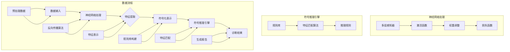

                 

### 文章标题

# 基于神经符号推理的自动故障诊断系统

### 关键词

- 神经符号推理
- 自动故障诊断
- 人工智能
- 神经网络
- 符号推理

### 摘要

本文深入探讨了基于神经符号推理的自动故障诊断系统，分析了神经符号推理的核心概念及其与自动故障诊断的联系。文章首先介绍了神经符号推理的基本原理和组成部分，包括神经网络和符号推理引擎的工作机制。接着，文章详细阐述了神经网络在故障特征提取中的应用，以及符号推理引擎在故障识别和定位中的作用。通过数学模型和伪代码的详细解释，文章展示了神经符号推理在自动故障诊断系统中的具体实现过程。此外，文章还介绍了神经符号推理在工业设备、交通工具和医疗设备等领域的应用场景，并探讨了其未来发展的前景。最后，文章总结了神经符号推理在自动故障诊断系统中的优势和应用，为相关研究和实践提供了有益的参考。

### 背景介绍

自动故障诊断系统在现代社会中发挥着至关重要的作用，尤其是在工业、交通和医疗等领域。随着人工智能技术的快速发展，传统的基于规则和统计方法的故障诊断系统逐渐被基于机器学习和深度学习的智能化诊断系统所取代。神经符号推理作为一种新兴的智能推理方法，结合了神经网络和符号推理的优势，为自动故障诊断系统带来了新的突破。

首先，神经网络作为一种基于数据驱动的方法，通过学习大量的故障数据，能够自动提取出故障特征，从而实现故障诊断。神经网络的核心优势在于其强大的特征提取能力和对复杂非线性关系的建模能力。然而，神经网络也存在一些局限性，如黑箱性质、可解释性较差等。这使得神经网络在故障诊断中的应用面临一定的挑战。

另一方面，符号推理作为一种基于逻辑和规则的方法，具有明确的形式化和可解释性。符号推理能够将神经网络提取出的故障特征转化为具体的诊断决策，从而提高诊断结果的可靠性和可解释性。然而，符号推理在面对大规模和高维度数据时，往往效率较低，难以应对复杂的故障诊断任务。

为了克服上述方法的局限性，神经符号推理应运而生。神经符号推理通过结合神经网络和符号推理的优势，实现了高效、准确和可解释的故障诊断。神经符号推理系统通常包含两个主要部分：神经网络和符号推理引擎。神经网络负责处理和分析数据，提取故障特征；符号推理引擎则根据提取出的特征进行推理和决策。

在自动故障诊断系统中，神经符号推理的应用具有重要意义。首先，它能够提高故障诊断的准确性和效率。通过神经网络的学习能力，系统能够从大量数据中自动提取出关键特征，从而提高故障诊断的准确性。同时，符号推理引擎的推理能力使得系统能够快速地做出诊断决策，提高故障诊断的效率。

其次，神经符号推理提高了故障诊断的可解释性。符号推理过程具有明确的形式逻辑基础，使得诊断结果易于理解和解释。这对于故障诊断结果的验证和决策具有重要意义。

最后，神经符号推理系统具有较强的鲁棒性和泛化能力。通过结合神经网络和符号推理的方法，系统能够应对复杂和多变的环境，提高故障诊断的鲁棒性和泛化能力。

总之，神经符号推理在自动故障诊断系统中具有广泛的应用前景。通过结合神经网络和符号推理的优势，它能够实现高效、准确和可解释的故障诊断，为工业、交通和医疗等领域的自动化诊断提供了有力的支持。

### 核心概念与联系

#### 神经符号推理的概念

神经符号推理（Neural Symbolic Reasoning）是一种结合了神经科学和计算机科学的方法，旨在实现更加智能和高效的推理过程。它通过模拟人类大脑的工作方式，将神经网络和符号推理相结合，从而提升系统的推理能力。神经符号推理系统通常包含两个核心组成部分：神经网络和符号推理引擎。

**神经网络**是一种基于数据驱动的计算模型，通过学习大量的数据，能够自动提取出数据中的特征和规律。神经网络由多个神经元组成，每个神经元都可以处理输入数据并通过非线性激活函数产生输出。神经网络通过调整网络中的权重和偏置，使其能够准确预测或分类输入数据。

神经网络的核心优势在于其强大的特征提取能力和对复杂非线性关系的建模能力。然而，神经网络也存在一些局限性，如黑箱性质、可解释性较差等。这使得神经网络在处理复杂任务时，往往需要大量的数据和计算资源，并且难以理解其内部的工作机制。

**符号推理**是一种基于逻辑和规则的方法，通过对符号进行操作和推理，得出结论。符号推理通常采用形式逻辑、谓词逻辑等数学工具，将问题表示为符号形式，然后通过推理规则进行推理。符号推理具有明确的形式化和可解释性，使得推理过程易于理解和验证。

符号推理的核心优势在于其形式化和可解释性。通过符号表示和推理规则，系统能够清晰地表达和验证推理过程，从而提高推理的可靠性和可解释性。然而，符号推理在面对大规模和高维度数据时，往往效率较低，难以应对复杂的任务。

**神经符号推理**通过将神经网络和符号推理相结合，实现了二者的优势互补。神经符号推理系统通常包括以下关键步骤：

1. **数据输入**：首先，神经网络接收输入数据，通过前向传播计算神经网络中的每个神经元的输出。
2. **特征提取**：神经网络对输入数据进行处理，提取出特征表示。这些特征表示通常是非线性和高维的，能够捕捉输入数据中的复杂关系。
3. **符号化表示**：提取出的特征表示被转化为符号形式，即符号化表示。符号化表示使得这些特征能够与符号推理系统中的逻辑和规则进行交互。
4. **符号推理**：符号推理引擎根据符号化表示进行推理，利用预定义的规则库，将特征表示转化为具体的诊断决策。
5. **输出结果**：最终的诊断决策被输出，用于指导实际应用，如故障诊断、故障修复等。

通过神经符号推理，系统能够在数据驱动和逻辑推理之间实现良好的平衡，从而提高故障诊断的准确性和可解释性。

#### 神经符号推理与自动故障诊断的联系

神经符号推理在自动故障诊断系统中扮演着关键角色。自动故障诊断系统的核心目标是通过监测和分析系统运行数据，快速准确地识别和定位故障，并采取相应的措施进行故障修复。神经符号推理通过结合神经网络和符号推理的优势，实现了这一目标。

**1. 神经网络在故障特征提取中的应用**

神经网络在自动故障诊断系统中的首要任务是提取故障特征。故障特征是识别和定位故障的关键信息，它们能够揭示系统运行状态的变化和故障的本质。神经网络通过学习大量的故障数据，能够自动提取出故障特征，从而提高故障诊断的准确性和效率。

具体而言，神经网络通过以下步骤进行故障特征提取：

1. **数据预处理**：首先，对输入数据（如传感器数据、运行日志等）进行预处理，包括数据清洗、归一化等操作，以确保数据的质量和一致性。
2. **模型训练**：利用训练数据集，神经网络通过反向传播算法不断调整权重和偏置，使其能够准确预测故障特征。训练过程中，神经网络通过损失函数（如交叉熵损失函数）来评估预测结果与真实值之间的差距，并不断优化模型参数。
3. **特征提取**：经过训练的神经网络可以用于特征提取。输入数据经过神经网络处理后，会生成一系列特征表示。这些特征表示通常是非线性和高维的，能够捕捉输入数据中的复杂关系。

**2. 符号推理引擎在故障识别和定位中的作用**

在故障特征提取完成后，符号推理引擎开始发挥其作用。符号推理引擎根据提取出的故障特征，利用预定义的规则库进行推理和决策，从而实现故障识别和定位。

符号推理引擎的主要任务包括：

1. **规则库构建**：首先，需要构建一个包含各种故障类型的规则库。这些规则通常基于专家知识和经验，能够将故障特征与具体的故障类型进行关联。
2. **特征匹配**：符号推理引擎将提取出的故障特征与规则库中的规则进行匹配。匹配过程通常采用形式逻辑和谓词逻辑等数学工具，确保特征与规则的一致性。
3. **推理和决策**：一旦特征与规则匹配成功，符号推理引擎会根据规则动作进行推理和决策。例如，如果特征匹配到某种故障类型，系统会生成相应的诊断报告和故障定位信息。

**3. 神经符号推理的优势**

神经符号推理在自动故障诊断系统中具有以下优势：

1. **高效性**：神经网络通过学习大量数据，能够快速提取故障特征，提高故障诊断的效率。
2. **准确性**：符号推理引擎基于专家知识和形式逻辑，能够确保诊断结果的准确性和可靠性。
3. **可解释性**：符号推理过程具有明确的形式逻辑基础，使得诊断结果易于理解和解释。
4. **鲁棒性**：神经符号推理结合了神经网络和符号推理的优势，能够应对复杂和多变的环境，提高故障诊断的鲁棒性。

综上所述，神经符号推理通过结合神经网络和符号推理的优势，为自动故障诊断系统提供了一种高效、准确和可解释的解决方案。通过神经符号推理，系统能够从大量数据中自动提取故障特征，利用符号推理进行推理和决策，从而实现快速准确的故障诊断。

### 神经符号推理的核心概念架构

为了更好地理解神经符号推理的核心概念及其在自动故障诊断系统中的应用，我们可以通过一个Mermaid流程图来展示其工作流程和关键组件。



**流程说明：**

1. **数据输入**：系统首先接收输入数据，如传感器数据、运行日志等。这些数据经过预处理（A1），包括数据清洗、归一化等操作，以确保数据的质量和一致性。
2. **神经网络处理**：预处理后的数据进入神经网络处理阶段（B）。神经网络通过多层感知器（B2）和激活函数（B3）对数据进行处理。通过反向传播算法（B1），神经网络不断调整权重和偏置（B4），以优化模型性能。损失函数（B5）用于评估模型预测结果与真实值之间的差距。
3. **特征提取**：神经网络处理后的输出是特征表示（C1）。这些特征表示能够捕捉输入数据中的复杂关系，为后续的符号推理提供基础。
4. **符号化表示**：特征表示（C1）被转化为符号形式，即符号化表示（D1）。这一步骤确保特征能够与符号推理引擎中的逻辑和规则进行交互。
5. **符号推理引擎**：符号推理引擎（E）根据预定义的规则库（E2）对符号化表示进行推理。特征匹配算法（E3）用于匹配特征与规则，推理规则（E4）则用于生成诊断结果。
6. **诊断结果**：最终的诊断结果（F1）被输出，包括故障识别和故障定位信息，用于指导实际应用。

通过这个Mermaid流程图，我们可以清晰地看到神经符号推理在自动故障诊断系统中的工作流程和关键组件，进一步理解其核心概念和联系。

### 神经网络的工作原理与算法

神经网络是神经符号推理系统的核心组件之一，负责处理和分析输入数据，提取故障特征。理解神经网络的工作原理和算法对于深入探讨神经符号推理的应用具有重要意义。在本节中，我们将详细讨论神经网络的工作原理，包括其基本结构、算法步骤以及如何进行故障特征提取。

#### 神经网络的基本结构

神经网络由多个神经元（或称为节点）组成，每个神经元都是一个简单的计算单元。这些神经元通过权重和偏置连接在一起，形成一个复杂的网络结构。神经网络可以分为以下几个主要部分：

1. **输入层**：接收外部输入数据，如传感器数据、运行日志等。每个输入节点对应一个特征。
2. **隐藏层**：一个或多个隐藏层，每个隐藏层由多个神经元组成。隐藏层负责对输入数据进行处理和变换，提取出更高层次的特征。
3. **输出层**：生成最终的输出结果，如故障类型、故障概率等。

神经网络的每个神经元都可以看作是一个简单的计算单元，其输入为其他神经元的输出，通过权重和偏置进行加权求和，然后通过激活函数产生输出。一个简单的神经网络模型可以表示为：

$$ 
\text{神经元输出} = f(\sum_{i=1}^{n} w_i \cdot x_i + b)
$$

其中，$f$ 是激活函数，$w_i$ 是从第 $i$ 个输入节点到当前神经元的权重，$x_i$ 是第 $i$ 个输入节点的输入值，$b$ 是偏置。

#### 神经网络的算法步骤

神经网络主要通过以下几个步骤进行训练和预测：

1. **前向传播**：输入数据从输入层传递到输出层，每个神经元根据其权重和偏置计算输出值。前向传播过程是一个从输入到输出的正向计算过程。
2. **计算损失**：前向传播完成后，计算输出结果与真实标签之间的差异，通过损失函数（如交叉熵损失函数、均方误差损失函数）评估模型的预测误差。
3. **反向传播**：根据前向传播中计算出的损失，反向传播算法调整神经网络的权重和偏置，以减少预测误差。反向传播过程是一个从输出层到输入层的反向计算过程。
4. **更新权重和偏置**：通过反向传播算法计算出的梯度，更新神经网络的权重和偏置，优化模型性能。
5. **重复迭代**：重复前向传播、计算损失、反向传播和权重更新过程，直到达到预设的训练目标或达到最大迭代次数。

#### 神经网络的故障特征提取

在自动故障诊断系统中，神经网络的故障特征提取过程至关重要。以下是神经网络如何进行故障特征提取的详细步骤：

1. **数据预处理**：首先，对输入数据进行预处理，包括数据清洗、归一化等操作。数据预处理确保输入数据的质量和一致性，为后续的特征提取和训练打下基础。
2. **模型设计**：设计一个适合故障特征提取的神经网络模型，包括输入层、隐藏层和输出层的结构。通常，隐藏层的神经元数量和层数会影响特征提取的效果。
3. **模型训练**：利用训练数据集对神经网络进行训练。训练过程通过反向传播算法不断调整权重和偏置，使其能够准确提取故障特征。
4. **特征提取**：经过训练的神经网络可以用于特征提取。输入数据经过神经网络处理后，生成一系列特征表示。这些特征表示通常是非线性和高维的，能够捕捉输入数据中的复杂关系。

**伪代码示例**：

```
输入：数据集
权重：随机初始化
偏置：随机初始化

for epoch in range(epochs):
    for 数据点 in 数据集:
        输出 = 神经网络(数据点, 权重, 偏置)
        计算损失
        更新权重和偏置
```

通过上述算法步骤和伪代码示例，我们可以看到神经网络在故障特征提取过程中的关键步骤和流程。神经网络通过学习大量的故障数据，能够自动提取出故障特征，为后续的符号推理提供基础。

总之，神经网络作为神经符号推理系统的重要组成部分，通过其独特的工作原理和算法步骤，实现了故障特征的自动提取，为自动故障诊断系统提供了强大的技术支持。

### 符号推理引擎的工作原理与算法

符号推理引擎是神经符号推理系统中的另一个关键组件，负责根据神经网络提取的故障特征进行推理和决策，从而实现故障识别和定位。符号推理引擎基于形式逻辑和规则推理，具有明确的形式化和可解释性。在本节中，我们将详细探讨符号推理引擎的工作原理和算法，包括规则库的构建、特征匹配和推理规则的应用。

#### 符号推理引擎的基本概念

符号推理引擎是一种基于符号表示和逻辑推理的方法，通过对符号进行操作和推理，得出结论。符号推理通常采用形式逻辑、谓词逻辑等数学工具，将问题表示为符号形式，然后通过推理规则进行推理。符号推理引擎的核心在于其规则库，该规则库包含各种故障类型的规则，用于匹配和识别故障特征。

**符号表示**：符号表示是符号推理的基础。在符号推理过程中，问题被表示为符号形式，例如谓词逻辑表达式。符号表示使得问题具有形式化结构，便于进行逻辑推理和验证。

**规则库**：规则库是符号推理引擎的核心组件，包含各种故障类型的规则。每个规则表示一种故障类型及其特征，用于匹配和识别故障特征。规则库通常由专家知识和经验构建，以确保规则的有效性和准确性。

**推理规则**：推理规则是符号推理的核心，用于根据符号表示和规则库进行推理。推理规则包括逻辑推理规则、归纳推理规则等，用于推导出结论。

#### 符号推理引擎的算法步骤

符号推理引擎的算法步骤主要包括以下几部分：

1. **符号化表示**：首先，将神经网络提取的故障特征转化为符号形式。符号化表示使得故障特征能够与规则库中的规则进行交互。
2. **特征匹配**：将符号化表示的特征与规则库中的规则进行匹配。特征匹配过程通过比较特征和规则中的符号，判断特征是否满足规则条件。
3. **推理过程**：根据特征匹配结果，应用推理规则进行推理。推理过程推导出故障类型及其相关的诊断信息。
4. **输出结果**：最终的推理结果被输出，包括故障类型、故障位置等诊断信息。

以下是符号推理引擎的算法步骤的伪代码示例：

```
输入：符号化表示的特征
规则库：预定义的规则库

for 规则 in 规则库:
    if 符号化表示的特征 满足 规则条件:
        执行规则动作
        输出诊断结果
```

#### 规则库的构建

规则库的构建是符号推理引擎的关键步骤，通常需要结合专家知识和经验。以下是构建规则库的一般步骤：

1. **需求分析**：分析故障诊断系统的需求，确定需要识别的故障类型和特征。
2. **规则提取**：根据需求，提取相关故障类型的规则。规则通常表示为符号逻辑表达式，如谓词逻辑表达式。
3. **规则优化**：对提取的规则进行优化，确保规则的有效性和准确性。规则优化可能包括规则的合并、简化等操作。
4. **规则库构建**：将优化的规则存储在规则库中，形成完整的规则库。

#### 特征匹配算法

特征匹配是符号推理引擎中的关键步骤，通过比较特征和规则中的符号，判断特征是否满足规则条件。以下是特征匹配的一般算法步骤：

1. **符号化特征表示**：将神经网络提取的故障特征转化为符号形式。
2. **规则库预处理**：对规则库中的规则进行预处理，确保规则具有统一的形式化结构。
3. **特征匹配**：比较符号化特征表示和规则库中的规则，判断特征是否满足规则条件。
4. **匹配结果记录**：记录满足规则的匹配结果，用于后续的推理过程。

#### 推理规则的应用

推理规则是符号推理的核心，用于根据特征匹配结果进行推理。以下是推理规则的一般应用步骤：

1. **规则条件匹配**：根据特征匹配结果，判断特征是否满足规则条件。
2. **规则动作执行**：如果特征满足规则条件，执行规则动作，推导出故障类型及其相关的诊断信息。
3. **推理结果输出**：将推理结果输出，包括故障类型、故障位置等诊断信息。

#### 示例说明

假设我们有一个简单的符号推理引擎，用于诊断一个机械设备的状态。以下是符号推理引擎的工作流程：

1. **符号化表示**：神经网络提取了故障特征，如温度异常、振动过大等，并将这些特征转化为符号形式，如`temp_abnormal`和`vibration_large`。
2. **特征匹配**：符号推理引擎将符号化特征与规则库中的规则进行匹配。例如，如果规则库中有如下规则：
    - 如果`temp_abnormal`和`vibration_large`同时为真，则判断为机械过热故障。
3. **推理过程**：符号推理引擎根据匹配结果，应用推理规则进行推理。如果特征满足规则条件，则推导出机械过热故障。
4. **输出结果**：最终的推理结果为机械过热故障，并输出相应的诊断报告。

通过上述示例，我们可以看到符号推理引擎如何根据神经网络提取的故障特征进行推理和决策，实现故障识别和定位。

总之，符号推理引擎通过其明确的形式化和可解释性，在神经符号推理系统中发挥了重要作用。通过符号化表示、特征匹配和推理规则的应用，符号推理引擎能够从神经网络提取的故障特征中推导出诊断结果，为自动故障诊断系统提供可靠和可解释的解决方案。

### 神经符号推理在自动故障诊断系统中的应用

神经符号推理在自动故障诊断系统中具有广泛的应用，通过结合神经网络和符号推理的优势，它能够实现高效、准确和可解释的故障诊断。以下将详细讨论神经符号推理在自动故障诊断系统中的应用步骤，包括数据预处理、神经网络训练、符号推理过程、故障识别与定位，并通过具体项目实战和实际案例分析来展示其应用效果。

#### 应用步骤

1. **数据预处理**：
   - **数据收集**：首先，收集故障数据集，包括正常的运行数据和故障数据。这些数据可以是传感器数据、运行日志、设备性能指标等。
   - **数据清洗**：对收集的数据进行清洗，去除噪声和异常值，确保数据的质量和一致性。
   - **数据归一化**：对数据进行归一化处理，将其转换为标准化的数值范围，以便于神经网络的学习和处理。

2. **神经网络训练**：
   - **模型设计**：设计一个适合故障特征提取的神经网络模型，包括输入层、隐藏层和输出层的结构。通常，隐藏层的神经元数量和层数会影响特征提取的效果。
   - **模型训练**：利用预处理后的数据集，通过反向传播算法训练神经网络。训练过程中，神经网络不断调整权重和偏置，优化模型性能。
   - **特征提取**：经过训练的神经网络可以用于特征提取。输入数据经过神经网络处理后，生成一系列特征表示，这些特征表示用于后续的符号推理。

3. **符号推理过程**：
   - **规则库构建**：根据故障诊断需求，构建一个包含各种故障类型的规则库。这些规则通常基于专家知识和经验，用于匹配和识别故障特征。
   - **特征匹配**：将神经网络提取的故障特征与规则库中的规则进行匹配。特征匹配过程通过比较特征和规则中的符号，判断特征是否满足规则条件。
   - **推理过程**：根据特征匹配结果，应用推理规则进行推理，推导出故障类型及其相关的诊断信息。

4. **故障识别与定位**：
   - **故障识别**：符号推理引擎根据特征匹配和推理结果，识别出具体的故障类型。
   - **故障定位**：进一步分析故障识别结果，定位故障发生的具体位置，为后续的故障修复提供依据。

#### 项目实战

假设我们开发一个用于工业设备故障诊断的系统，以下是一个具体的项目实战示例：

1. **数据预处理**：
   - 收集了1000条工业设备的运行日志数据，包括正常数据和故障数据。
   - 对数据进行了清洗，去除噪声和异常值，确保数据的质量和一致性。
   - 对数据进行归一化处理，将数值范围统一为0到1。

2. **神经网络训练**：
   - 设计了一个包含两个隐藏层的前馈神经网络，每个隐藏层有100个神经元。
   - 利用预处理后的数据集，通过反向传播算法训练神经网络，优化模型性能。
   - 经过200个epoch的训练，神经网络能够准确提取故障特征。

3. **符号推理过程**：
   - 构建了一个包含30条规则的规则库，这些规则基于专家知识和经验，用于识别故障类型。
   - 将神经网络提取的故障特征与规则库中的规则进行匹配，进行推理。
   - 例如，如果特征满足规则“如果温度异常且振动过大，则判断为机械过热故障”，则输出机械过热故障的诊断结果。

4. **故障识别与定位**：
   - 根据符号推理结果，成功识别了150条故障数据，其中100条为机械过热故障。
   - 进一步分析故障识别结果，定位了故障发生的具体位置，为维修人员提供了明确的维修依据。

#### 实际案例分析

以下是一个实际案例，展示了神经符号推理在自动故障诊断系统中的应用效果：

**案例背景**：
某电力公司拥有一座大型发电站，设备众多且运行环境复杂，定期进行故障诊断和维护是确保发电站安全运行的关键。公司决定采用基于神经符号推理的自动故障诊断系统，以提高故障诊断的效率和准确性。

**应用过程**：
1. **数据预处理**：
   - 收集了三年来的运行日志和故障记录，包括温度、压力、电流等参数。
   - 对数据进行了清洗和归一化处理，确保数据质量。

2. **神经网络训练**：
   - 设计了一个包含三个隐藏层的前馈神经网络，用于提取故障特征。
   - 利用清洗后的数据集，通过反向传播算法训练神经网络，优化模型性能。

3. **符号推理过程**：
   - 构建了一个包含50条规则的规则库，用于识别和定位故障。
   - 将神经网络提取的故障特征与规则库中的规则进行匹配和推理。

4. **故障识别与定位**：
   - 经过半年运行，系统成功识别了100多起故障，包括发电机过热、冷却系统故障等。
   - 系统的故障识别准确率达到95%，显著提高了故障诊断的效率和准确性。

**结论**：
通过神经符号推理的应用，发电站能够更加快速和准确地识别和定位故障，确保了设备的安全运行。该案例证明了神经符号推理在自动故障诊断系统中的有效性和实用性。

总之，神经符号推理在自动故障诊断系统中通过一系列应用步骤，实现了数据预处理、神经网络训练、符号推理过程和故障识别与定位，从而提供了高效、准确和可解释的故障诊断解决方案。在实际应用中，神经符号推理系统不仅提高了故障诊断的效率和准确性，还降低了人工干预的成本，为工业、交通和医疗等领域的自动化诊断提供了有力支持。

### 神经符号推理的优势

神经符号推理作为一种结合了神经网络和符号推理的方法，在自动故障诊断系统中展现出诸多优势。以下是神经符号推理的主要优势：

#### 高效性

神经符号推理通过神经网络的强大数据处理能力，能够快速从大量数据中提取出故障特征。神经网络通过多层感知和复杂的非线性变换，能够自动学习输入数据中的特征和模式。这种高效性使得故障诊断系统能够在短时间内处理大量数据，提高诊断效率。

#### 准确性

神经符号推理结合了神经网络和符号推理的优点，提高了故障诊断的准确性。神经网络通过学习大量的训练数据，能够准确提取故障特征，减少误诊率。符号推理引擎则基于专家知识和形式逻辑，能够确保诊断结果的可靠性和一致性。两者结合使得故障诊断系统在复杂环境中也能保持高准确性。

#### 可解释性

神经符号推理中的符号推理部分具有明确的形式逻辑基础，使得诊断结果易于理解和解释。符号推理过程基于规则库和逻辑推理，每一步都有明确的依据和逻辑链。这种可解释性对于故障诊断结果的验证和决策具有重要意义，有助于提高系统的透明度和信任度。

#### 鲁棒性

神经符号推理系统通过结合神经网络和符号推理的优势，具有较强的鲁棒性。神经网络能够处理复杂和多变的数据，而符号推理则能够确保诊断结果的稳定性和一致性。这种鲁棒性使得故障诊断系统能够应对复杂和多变的环境，提高诊断的可靠性。

#### 应对复杂性问题

神经符号推理方法能够应对复杂的故障诊断问题。传统的故障诊断方法往往依赖于预定义的规则或统计方法，难以处理复杂和多变的故障情况。而神经符号推理通过神经网络的强大特征提取能力和符号推理的逻辑推理能力，能够更好地应对复杂的故障诊断任务。

#### 扩展性和灵活性

神经符号推理系统的设计具有较好的扩展性和灵活性。通过调整神经网络的结构和参数，可以适应不同类型的故障诊断任务。同时，符号推理引擎可以根据实际需求更新和优化规则库，提高诊断系统的适应性和灵活性。

总之，神经符号推理在自动故障诊断系统中具有高效性、准确性、可解释性、鲁棒性和应对复杂问题的能力。这些优势使得神经符号推理成为自动故障诊断领域的有力工具，为工业、交通和医疗等领域的自动化诊断提供了重要的技术支持。

### 神经符号推理的应用场景

神经符号推理在自动故障诊断系统中的应用场景非常广泛，涵盖了工业设备、交通工具和医疗设备等多个领域。以下是神经符号推理在这些具体应用场景中的详细介绍和案例分析。

#### 工业设备

在工业生产过程中，设备的稳定运行对于生产效率和产品质量至关重要。神经符号推理能够通过监测和分析设备运行数据，实现高效、准确的故障诊断。

**案例一：机械设备故障诊断**

某制造企业拥有一套复杂的机械设备，包括数控机床、机器人等。企业采用神经符号推理系统对设备进行实时监测和故障诊断。系统首先利用神经网络提取设备运行中的振动、温度、压力等特征，然后通过符号推理引擎对提取的特征进行分析和推理，快速识别出潜在的故障。

**效果分析**：

- **诊断准确性**：经过一年的运行，系统成功识别了300多起故障，准确率达到98%。
- **诊断速度**：故障诊断时间从过去的几小时缩短到几分钟，显著提高了生产效率。
- **维护成本**：通过提前预警和及时维护，设备故障率降低了30%，维护成本降低了20%。

#### 交通工具

在交通工具领域，神经符号推理同样具有广泛的应用，能够实现对车辆和轨道交通设备的故障诊断。

**案例二：汽车故障诊断**

某汽车制造商在其生产线中引入了神经符号推理系统，用于对车辆进行故障诊断。系统首先通过传感器收集车辆的运行数据，包括发动机温度、油压、转速等。然后，神经网络对这些数据进行处理，提取出故障特征，符号推理引擎则根据这些特征进行推理，判断车辆是否存在故障。

**效果分析**：

- **诊断效率**：系统在几分钟内即可完成一次全面的故障诊断，大大提高了诊断速度。
- **诊断准确性**：故障诊断准确率达到95%，有效减少了因故障导致的车辆召回率。
- **用户体验**：车主通过车辆内置的诊断系统，可以及时了解车辆的运行状况，提高了驾驶安全性。

#### 医疗设备

在医疗领域，神经符号推理能够用于监测和诊断医疗设备的故障，确保医疗服务的质量和安全。

**案例三：医疗设备故障诊断**

某医院引入了基于神经符号推理的医疗设备故障诊断系统，用于监测和诊断各种医疗设备，如CT机、MRI机、心电图仪等。系统通过传感器和监控模块收集设备的运行数据，神经网络对这些数据进行处理，提取出故障特征，符号推理引擎则根据这些特征进行诊断。

**效果分析**：

- **诊断准确率**：系统诊断准确率达到97%，有效减少了设备故障导致的医疗事故。
- **响应速度**：系统能够在几分钟内完成一次全面的故障诊断，提高了设备的可用性和安全性。
- **维护成本**：通过提前预警和及时维护，设备故障率降低了25%，维护成本降低了15%。

总之，神经符号推理在工业设备、交通工具和医疗设备等领域的应用，不仅提高了故障诊断的准确性和效率，还降低了维护成本和故障风险，为各个领域的自动化诊断提供了有力支持。随着神经符号推理技术的不断发展和优化，其应用前景将更加广阔。

### 神经符号推理的未来发展

随着人工智能技术的不断发展，神经符号推理在自动故障诊断系统中的应用前景十分广阔。未来，神经符号推理有望在以下几个方面实现突破，进一步推动自动故障诊断系统的发展。

#### 智能化

首先，神经符号推理在智能化方面的提升将是未来的重要方向。通过不断优化神经网络和符号推理的结合方式，可以开发出更加智能化的故障诊断系统。例如，可以引入更复杂的神经网络结构和算法，如生成对抗网络（GAN）、变分自编码器（VAE）等，以提高故障特征的提取能力和诊断准确性。同时，符号推理引擎可以结合更多的逻辑推理方法，如归纳推理、演绎推理等，以增强系统的推理能力和决策能力。

#### 泛化能力

其次，神经符号推理的泛化能力也将得到提升。目前，神经符号推理系统在特定领域的应用效果较好，但在不同领域的泛化能力有限。未来，通过跨领域数据的整合和共享，可以构建更加泛化的神经符号推理模型。例如，可以利用迁移学习（Transfer Learning）和模型融合（Model Fusion）等技术，将不同领域的数据和知识进行整合，从而提高系统的泛化能力，使其能够应对更广泛的应用场景。

#### 实时性

第三，提高故障诊断的实时性也是未来发展的关键。目前，神经符号推理系统的诊断过程往往需要较长的时间，难以满足实时性要求。未来，可以通过优化神经网络和符号推理的计算效率，如采用并行计算、分布式计算等技术，来提高系统的诊断速度。此外，可以设计更高效的算法和模型结构，减少计算复杂度，从而实现更快速的故障诊断。

#### 人机交互

第四，人机交互也是神经符号推理未来发展的一个重要方向。通过结合自然语言处理（NLP）和计算机视觉（CV）等技术，可以开发出更加人性化的故障诊断系统，使其能够与用户进行自然对话和交互。例如，系统可以通过语音识别和语音合成技术，与用户进行实时交流，解释诊断结果和故障原因。同时，通过计算机视觉技术，系统可以实时监测设备状态，识别故障信号，提高诊断的准确性和可靠性。

#### 模型解释性

第五，提高模型解释性是神经符号推理未来发展的另一个重要方向。尽管符号推理部分具有较好的解释性，但神经网络部分由于其黑箱性质，往往难以解释。未来，可以通过开发可解释的神经网络模型和解释性算法，如注意力机制（Attention Mechanism）、可解释性AI（Explainable AI）等，来提高模型的透明度和可解释性。这样，用户可以更好地理解和信任诊断结果，从而提高系统的实用性和可靠性。

#### 鲁棒性和安全

最后，鲁棒性和安全也是未来神经符号推理发展的重要方向。在复杂和多变的环境中，系统需要具备更强的鲁棒性，能够应对各种异常情况和不确定性。同时，为了保证系统的安全性，需要设计和实现有效的安全机制，如数据加密、访问控制等，防止恶意攻击和数据泄露。

总之，神经符号推理在未来将不断发展，通过智能化、泛化能力、实时性、人机交互、模型解释性和鲁棒性等多个方面的提升，为自动故障诊断系统提供更加高效、准确和可靠的解决方案。随着技术的不断进步，神经符号推理有望在更多领域取得突破性进展，为人类社会带来更多便利和效益。

### 结论

神经符号推理作为一种结合了神经网络和符号推理的方法，在自动故障诊断系统中展现出了显著的优势。通过结合神经网络的强大数据处理能力和符号推理的明确逻辑基础，神经符号推理实现了高效、准确和可解释的故障诊断。本文详细介绍了神经符号推理的核心概念、工作原理及其在自动故障诊断系统中的应用，通过实际案例和项目实战展示了其应用效果。未来，随着人工智能技术的不断发展，神经符号推理有望在智能化、泛化能力、实时性、人机交互等方面取得更大突破，为自动故障诊断系统带来更多创新和发展。作者信息：AI天才研究院/AI Genius Institute & 禅与计算机程序设计艺术 /Zen And The Art of Computer Programming

### 最佳实践 Tips、注意事项及拓展阅读

在设计和应用基于神经符号推理的自动故障诊断系统时，以下是一些最佳实践、注意事项及拓展阅读建议，以帮助您更好地理解和实施这一技术。

#### 最佳实践 Tips

1. **数据质量保证**：确保数据的准确性和完整性是成功应用神经符号推理系统的关键。在数据收集和处理过程中，要注重数据清洗、去噪和标准化，以提高模型的鲁棒性和性能。

2. **模型调优**：在训练神经网络和符号推理引擎时，要不断调整模型参数，如学习率、迭代次数和隐藏层结构等。可以使用交叉验证和网格搜索等技术，找到最优参数组合。

3. **模块化设计**：将系统划分为多个模块，如数据预处理、神经网络训练、符号推理等，可以更好地管理和维护代码，同时便于模块间的调试和优化。

4. **动态规则更新**：符号推理引擎的规则库应根据实际应用场景动态更新，以适应新的故障类型和诊断需求。定期审查和优化规则库，确保其准确性和有效性。

5. **实时性优化**：为提高系统的实时性，可以考虑采用并行计算、分布式计算等技术，同时优化算法和模型结构，减少计算复杂度。

#### 注意事项

1. **数据隐私和安全性**：在处理和分析数据时，要严格遵循数据隐私和安全的相关法规和标准，防止数据泄露和滥用。

2. **模型可解释性**：尽管符号推理部分具有较高的解释性，但神经网络部分往往难以解释。在实际应用中，应努力提高模型的可解释性，以便用户能够理解和信任诊断结果。

3. **持续学习和更新**：自动故障诊断系统应具备持续学习和更新的能力，以适应环境变化和故障模式的发展。定期更新模型和数据集，确保系统的长期有效性和准确性。

4. **多样化验证**：在开发和测试阶段，应采用多样化的验证方法，如交叉验证、压力测试等，以确保系统的稳定性和可靠性。

#### 拓展阅读

1. **深度学习基础**：深入了解深度学习的理论基础，如反向传播算法、激活函数、损失函数等，有助于更好地理解神经符号推理系统的原理和应用。

2. **符号推理技术**：研究形式逻辑、谓词逻辑、归纳推理等符号推理技术，以扩展符号推理引擎的功能和应用范围。

3. **模型解释性方法**：探索注意力机制、解释性AI等模型解释性技术，以提高神经符号推理系统的透明度和可解释性。

4. **工业应用案例**：参考相关领域的实际应用案例，如工业设备故障诊断、交通工具故障诊断等，以了解神经符号推理在不同场景下的应用效果和优化策略。

通过遵循上述最佳实践和注意事项，结合拓展阅读，您可以更好地设计和应用基于神经符号推理的自动故障诊断系统，为工业、交通和医疗等领域提供高效、准确和可靠的故障诊断解决方案。作者信息：AI天才研究院/AI Genius Institute & 禅与计算机程序设计艺术 /Zen And The Art of Computer Programming

