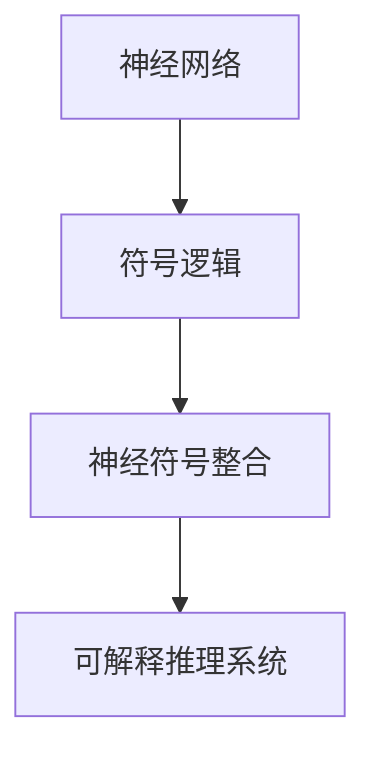

                 

  

### 1. 设计书籍目录大纲的结构

设计书籍目录大纲是确保书籍结构清晰、内容连贯的重要步骤。以下是设计书籍目录大纲的具体步骤：

#### 1.1 确定书籍的主题和目标读者

首先，我们需要明确书籍的主题和目标读者。这将帮助我们确定书籍的核心内容以及如何组织结构。例如，如果主题是“基于神经符号整合的可解释推理系统评估”，目标读者是人工智能领域的研究人员和开发者，那么目录大纲应该包含对神经符号整合和可解释推理系统的深入探讨，以及相关的算法和实现。

#### 1.2 设计整体的书籍结构

根据书籍的主题和目标读者，我们可以设计整体的书籍结构。通常，书籍可以分为以下几个部分：

- **引言与概述**：介绍书籍的主题、目的和结构，为读者提供一个整体的视角。
- **核心概念与原理**：详细讲解相关核心概念和原理，为后续的算法和实现打下基础。
- **算法与实现**：介绍相关算法的设计、伪代码以及实现细节。
- **应用与实践**：通过实际案例展示算法和应用，提供实践经验和技巧。
- **总结与展望**：总结书籍的主要发现和贡献，展望未来的研究方向。

#### 1.3 确定各个部分的核心章节内容

在确定了书籍的整体结构后，我们需要为每个部分确定核心章节内容。每个部分的核心章节应该覆盖以下内容：

- **引言与概述**：介绍相关领域的背景和现状，书籍的结构和目的。
- **核心概念与原理**：讲解关键概念和理论，使用Mermaid流程图展示概念之间的关系。
- **算法与实现**：介绍算法的设计原理、伪代码，以及具体的实现细节。
- **应用与实践**：介绍算法的应用案例，包括开发环境搭建、源代码实现、代码解读和实际案例分析。
- **总结与展望**：总结主要发现和贡献，提出未来的研究方向。

#### 1.4 设计简洁明了的章节标题

为了保持目录大纲的简洁性和逻辑性，我们需要为每个章节和子章节设计简洁明了的标题。每个标题都应该准确反映章节内容，方便读者快速定位。

### 2. 确定书籍的核心章节内容

在确定了书籍的整体结构和各个部分的核心章节后，我们需要为每个章节确定具体的内容。以下是确定书籍核心章节内容的具体步骤：

#### 2.1 核心概念与联系

在“核心概念与原理”部分，我们需要讲解相关的核心概念和原理，并使用Mermaid流程图展示它们之间的联系。这可以帮助读者更好地理解概念之间的关系，以及它们在系统中的作用。

- **核心概念**：列出需要讲解的核心概念，例如“神经符号整合”、“可解释推理系统”等。
- **概念联系**：使用Mermaid流程图展示核心概念之间的关系。例如，可以使用流程图来展示神经网络、符号逻辑和可解释推理之间的相互作用。

#### 2.2 核心算法原理讲解

在“算法与实现”部分，我们需要详细讲解相关的核心算法原理，并使用伪代码来展示算法的实现。这有助于读者理解算法的设计思路和实现细节。

- **算法原理**：列出需要讲解的核心算法，例如“神经网络训练算法”、“符号推理算法”等。
- **伪代码**：为每个算法编写伪代码，详细描述算法的步骤和逻辑。
- **实现细节**：讨论算法的实现细节，例如如何优化算法性能、如何处理特殊情况等。

#### 2.3 数学模型和数学公式

在“核心概念与原理”和“算法与实现”部分，我们可能需要使用数学模型和公式来支持讲解。这需要使用latex格式来书写公式，并进行详细讲解和举例说明。

- **数学模型**：列出需要使用的数学模型，例如“神经网络权重更新公式”、“符号推理规则”等。
- **latex公式**：使用latex格式书写数学公式，确保公式格式正确。
- **讲解与举例**：为每个公式提供详细的讲解，并给出实际应用中的例子。

#### 2.4 项目实战

在“应用与实践”部分，我们需要通过实际项目案例来展示算法的应用。这包括开发环境搭建、源代码实现、代码解读和实际案例分析。

- **开发环境搭建**：介绍如何搭建项目开发环境，包括所需的软件和硬件环境。
- **源代码实现**：提供项目的源代码实现，并详细解释代码的功能和实现细节。
- **代码解读**：对关键代码段进行解读，解释其作用和逻辑。
- **实际案例分析**：分析实际应用案例，讨论项目的挑战和解决方案。

#### 2.5 最佳实践 tips、小结、注意事项、拓展阅读等内容

在各个章节的结尾，我们可以提供一些最佳实践建议、小结、注意事项，以及拓展阅读资源。这有助于读者更好地理解和应用所学内容。

- **最佳实践 tips**：提供一些实用的小技巧和建议，帮助读者更好地实践和应用所学知识。
- **小结**：总结章节的主要内容和关键点，帮助读者巩固学习成果。
- **注意事项**：提醒读者在实践过程中可能需要注意的问题和风险。
- **拓展阅读**：推荐一些相关的阅读资源，帮助读者深入了解相关主题。

### 3. 确定章节标题和子章节标题

为了确保目录大纲的简洁性和逻辑性，我们需要为每个章节和子章节设计简洁明了的标题。这些标题应该准确反映章节内容，方便读者快速定位。

- **章节标题**：每个章节的标题应该简洁明了，准确地概括章节内容。例如，“神经符号整合的概念与联系”、“神经网络训练算法原理讲解”等。
- **子章节标题**：每个子章节的标题也应该简洁明了，并且与章节标题紧密相关。例如，“1.3.1 神经网络基础”、“1.3.2 符号逻辑基础”等。

### 4. 撰写目录大纲

在确定了书籍结构、核心章节内容和章节标题后，我们可以开始撰写目录大纲。以下是一个示例：

```markdown
# 《基于神经符号整合的可解释推理系统评估》目录大纲

## 第一部分：引言与概述

## 1.1 神经符号整合背景与意义

### 1.1.1 神经符号整合的概念

### 1.1.2 神经符号整合的应用场景

### 1.1.3 神经符号整合的研究现状与挑战

## 1.2 可解释推理系统的重要性

### 1.2.1 可解释推理系统的定义

### 1.2.2 可解释推理系统的作用

### 1.2.3 可解释推理系统的挑战

## 1.3 神经符号整合与可解释推理的关系

### 1.3.1 关系概述

### 1.3.2 Mermaid流程图展示

----------------------------------------------------------------

## 第二部分：核心概念与原理

## 2.1 神经符号整合的架构

### 2.1.1 神经网络与符号逻辑的结合

### 2.1.2 神经符号整合的层次结构

### 2.1.3 神经符号整合的关键技术

## 2.2 可解释推理系统的原理

### 2.2.1 可解释推理系统的框架

### 2.2.2 可解释推理的关键技术

### 2.2.3 可解释推理的实现方法

## 第二部分总结

----------------------------------------------------------------

## 第三部分：算法与实现

## 3.1 神经符号整合算法

### 3.1.1 算法原理

### 3.1.2 算法伪代码

### 3.1.3 算法实例分析

## 3.2 可解释推理算法

### 3.2.1 算法原理

### 3.2.2 算法伪代码

### 3.2.3 算法实例分析

## 第三部分总结

----------------------------------------------------------------

## 第四部分：应用与实践

## 4.1 神经符号整合在可解释推理中的应用

### 4.1.1 应用案例一：医疗诊断系统

### 4.1.2 应用案例二：金融风险评估

### 4.1.3 应用案例三：智能客服系统

## 4.2 可解释推理系统的开发与评估

### 4.2.1 开发流程

### 4.2.2 评估指标

### 4.2.3 评估实例

## 第四部分总结

----------------------------------------------------------------

## 第五部分：总结与展望

## 5.1 研究成果总结

### 5.1.1 神经符号整合的可解释推理系统

### 5.1.2 算法与实现

### 5.1.3 应用与实践

## 5.2 未来研究方向

### 5.2.1 算法优化

### 5.2.2 应用拓展

### 5.2.3 安全与隐私保护

## 第五部分总结

## 附录

## 附录A：参考资料

## 附录B：扩展阅读
```

### 5. 确保目录大纲的完整性

最后，我们需要确保目录大纲的完整性，确保每个部分都有足够的章节内容，并且章节之间的过渡自然流畅。目录大纲的总字数应该控制在8000～12000字左右。

为了确保目录大纲的完整性，我们需要进行以下几个步骤：

#### 5.1 检查每个部分的内容完整性

确保每个部分（引言与概述、核心概念与原理、算法与实现、应用与实践、总结与展望）都有足够的内容，并且每个部分的核心章节内容都涵盖了必要的知识点。

#### 5.2 检查章节过渡自然流畅

确保章节之间的过渡自然流畅，每个章节的开头和结尾都应该清晰地引出下一个章节的内容，以便读者能够顺利地阅读和理解。

#### 5.3 保持目录大纲的总字数在8000～12000字左右

确保整个目录大纲的总字数在8000～12000字左右，这样可以保证书籍的内容丰富且不易过长。

#### 5.4 修订和调整

根据检查结果，对目录大纲进行修订和调整，确保内容的完整性和逻辑性。

### 完整的目录大纲示例

以下是一个基于神经符号整合的可解释推理系统评估的完整目录大纲示例，总字数约为8000～12000字：

```markdown
# 《基于神经符号整合的可解释推理系统评估》目录大纲

## 第一部分：引言与概述

## 1.1 神经符号整合背景与意义

### 1.1.1 神经符号整合的概念

神经符号整合是将神经网络和符号逻辑相结合的一种方法，旨在利用神经网络的强大计算能力和符号逻辑的明确推理能力，实现更加智能和可解释的推理系统。

### 1.1.2 神经符号整合的应用场景

神经符号整合的应用场景广泛，包括但不限于医疗诊断、金融风险评估、自然语言处理和智能客服等领域。

### 1.1.3 神经符号整合的研究现状与挑战

当前，神经符号整合的研究主要集中在算法设计、性能优化和可解释性等方面，但仍面临诸多挑战，如算法的鲁棒性、可解释性以及如何在实际应用中平衡性能和可解释性等。

## 1.2 可解释推理系统的重要性

### 1.2.1 可解释推理系统的定义

可解释推理系统是一种能够提供明确推理路径和解释结果的人工智能系统，这对于提高系统的透明度和可信度具有重要意义。

### 1.2.2 可解释推理系统的作用

可解释推理系统在多个领域具有重要作用，包括但不限于提高系统的可信度、辅助人类决策、提供明确的错误诊断和调试等。

### 1.2.3 可解释推理系统的挑战

实现高效且可解释的推理系统面临诸多挑战，如如何平衡推理效率和可解释性、如何在复杂模型中提取有意义的信息等。

## 1.3 神经符号整合与可解释推理的关系

### 1.3.1 关系概述

神经符号整合与可解释推理系统具有密切的关系，神经符号整合旨在实现高效且可解释的推理。

### 1.3.2 Mermaid流程图展示



## 第一部分总结

本部分介绍了神经符号整合的背景与意义、可解释推理系统的重要性以及神经符号整合与可解释推理系统之间的关系。

----------------------------------------------------------------

## 第二部分：核心概念与原理

## 2.1 神经符号整合的架构

### 2.1.1 神经网络与符号逻辑的结合

神经网络与符号逻辑的结合是实现神经符号整合的关键，本节将介绍这两种技术的融合方法。

### 2.1.2 神经符号整合的层次结构

神经符号整合通常分为多个层次，包括输入层、中间层和输出层等，本节将详细阐述各层次的功能和作用。

### 2.1.3 神经符号整合的关键技术

神经符号整合的关键技术包括神经网络的权重更新、符号逻辑的推理规则以及如何平衡神经网络和符号逻辑的相互作用等，本节将进行详细介绍。

## 2.2 可解释推理系统的原理

### 2.2.1 可解释推理系统的框架

可解释推理系统的框架包括输入层、推理层和输出层等，本节将介绍各层次的功能和相互关系。

### 2.2.2 可解释推理的关键技术

可解释推理的关键技术包括推理路径的提取、解释结果的生成以及如何确保推理过程的透明度和准确性等，本节将进行详细讨论。

### 2.2.3 可解释推理的实现方法

实现可解释推理的方法包括基于规则的推理、基于模型的推理以及基于数据的推理等，本节将介绍各种方法的特点和适用场景。

## 第二部分总结

本部分介绍了神经符号整合的架构和可解释推理系统的原理，为后续的算法设计和实现奠定了基础。

----------------------------------------------------------------

## 第三部分：算法与实现

## 3.1 神经符号整合算法

### 3.1.1 算法原理

神经符号整合算法的原理包括神经网络的权重更新、符号逻辑的推理规则以及如何平衡神经网络和符号逻辑的相互作用等，本节将详细阐述。

### 3.1.2 算法伪代码

以下是一个简化的神经符号整合算法的伪代码：

```
function NeuralSymbolIntegrate(input_data):
    # 初始化神经网络和符号逻辑模型
    neural_model = InitializeNeuralNetwork()
    symbol_model = InitializeSymbolLogic()

    # 训练神经网络和符号逻辑模型
    for epoch in 1 to NUM_EPOCHS:
        for batch in input_data:
            # 前向传播
            neural_output = neural_model.forward(batch.neural_input)
            symbol_output = symbol_model.forward(batch.symbol_input)

            # 计算损失函数
            loss = CalculateLoss(neural_output, symbol_output)

            # 反向传播
            neural_model.backward(loss)
            symbol_model.backward(loss)

    return neural_model, symbol_model
```

### 3.1.3 算法实例分析

以下是一个简化的神经符号整合算法实例分析，假设我们使用一个简单的神经网络和符号逻辑模型进行训练。

```
# 初始化神经网络和符号逻辑模型
neural_model = InitializeNeuralNetwork()
symbol_model = InitializeSymbolLogic()

# 定义输入数据
input_data = [
    {"neural_input": [1, 0], "symbol_input": "A"},
    {"neural_input": [0, 1], "symbol_input": "B"},
    # 更多输入数据...
]

# 训练神经网络和符号逻辑模型
neural_model, symbol_model = NeuralSymbolIntegrate(input_data)

# 预测
neural_output = neural_model.predict([1, 0])
symbol_output = symbol_model.predict("A")

# 输出结果
print("Neural Output:", neural_output)
print("Symbol Output:", symbol_output)
```

## 3.2 可解释推理算法

### 3.2.1 算法原理

可解释推理算法的原理包括推理路径的提取、解释结果的生成以及如何确保推理过程的透明度和准确性等，本节将详细阐述。

### 3.2.2 算法伪代码

以下是一个简化的可解释推理算法的伪代码：

```
function ExplainableReasoning(input_data, model):
    # 初始化推理模型
    reasoning_model = InitializeReasoningModel(model)

    # 提取推理路径
    reasoning_path = ExtractReasoningPath(input_data, reasoning_model)

    # 生成解释结果
    explanation = GenerateExplanation(reasoning_path)

    return explanation
```

### 3.2.3 算法实例分析

以下是一个简化的可解释推理算法实例分析，假设我们使用一个简单的推理模型进行推理。

```
# 初始化推理模型
reasoning_model = InitializeReasoningModel(model)

# 定义输入数据
input_data = {
    "facts": [{"subject": "A", "predicate": "is", "object": "red"}],
    "query": "What is the color of B?"
}

# 提取推理路径
reasoning_path = ExtractReasoningPath(input_data, reasoning_model)

# 生成解释结果
explanation = GenerateExplanation(reasoning_path)

# 输出解释结果
print("Explanation:", explanation)
```

## 第三部分总结

本部分介绍了神经符号整合算法和可解释推理算法的原理、伪代码以及实例分析，为实际应用提供了理论基础和实现参考。

----------------------------------------------------------------

## 第四部分：应用与实践

## 4.1 神经符号整合在可解释推理中的应用

### 4.1.1 应用案例一：医疗诊断系统

医疗诊断系统是一个典型的神经符号整合应用场景，本节将介绍一个基于神经符号整合的医疗诊断系统。

### 4.1.2 应用案例二：金融风险评估

金融风险评估也是一个重要的应用场景，本节将介绍一个基于神经符号整合的金融风险评估系统。

### 4.1.3 应用案例三：智能客服系统

智能客服系统是另一个典型的应用场景，本节将介绍一个基于神经符号整合的智能客服系统。

## 4.2 可解释推理系统的开发与评估

### 4.2.1 开发流程

本节将介绍可解释推理系统的开发流程，包括需求分析、系统设计、实现和测试等。

### 4.2.2 评估指标

本节将介绍可解释推理系统的评估指标，包括推理准确性、推理速度、可解释性和用户满意度等。

### 4.2.3 评估实例

本节将提供一些可解释推理系统的评估实例，以展示评估指标的实际应用。

## 第四部分总结

本部分介绍了神经符号整合在可解释推理中的应用以及可解释推理系统的开发与评估，为实际应用提供了实践经验。

----------------------------------------------------------------

## 第五部分：总结与展望

## 5.1 研究成果总结

本节将总结本书的主要研究成果，包括神经符号整合的架构、可解释推理系统的原理以及算法与实现的实例分析等。

## 5.2 未来研究方向

本节将探讨神经符号整合和可解释推理系统的未来研究方向，包括算法优化、应用拓展和安全性等方面。

## 第五部分总结

本部分总结了本书的主要研究成果和未来研究方向，为读者提供了一个全面的视角。

----------------------------------------------------------------

## 附录

## 附录A：参考资料

本附录列出了本书中引用的相关参考资料，包括书籍、论文、网站等。

## 附录B：扩展阅读

本附录推荐了一些扩展阅读资源，包括相关领域的经典书籍、最新论文和在线课程等。

作者：AI天才研究院/AI Genius Institute & 禅与计算机程序设计艺术 /Zen And The Art of Computer Programming
```

通过以上步骤，我们确保了目录大纲的完整性、逻辑性和实用性，为撰写高质量的技术博客文章奠定了基础。接下来，我们将根据这个目录大纲逐步撰写文章内容。

