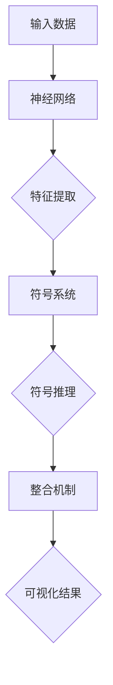
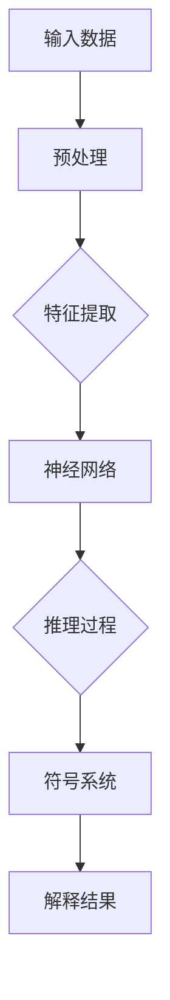
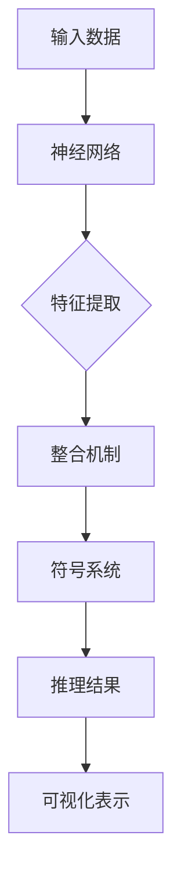
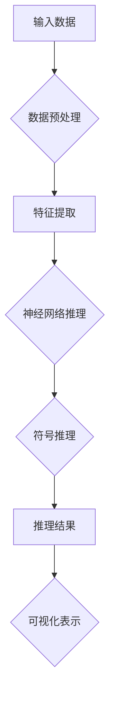

                 


### 1. 引言

#### 1.1 研究背景

近年来，人工智能（AI）技术在图像识别、自然语言处理、推荐系统等领域取得了显著的进展。然而，随着模型复杂度的不断增加，如何解释和理解这些模型内部的推理过程成为了一个重要的研究课题。可解释性（Explainability）作为AI系统设计的关键要素，旨在为用户提供透明的模型决策过程，提高用户的信任度和满意度。

在这一背景下，神经符号整合（Neural-Symbolic Integration）作为一种新兴的AI技术，逐渐引起了广泛关注。神经符号整合结合了神经计算和符号推理的优势，旨在实现高度可解释的推理过程。具体而言，神经符号整合通过将神经网络与符号系统相结合，既保留了神经网络强大的学习能力和表达力，又确保了推理过程的透明性和可解释性。

#### 1.2 研究意义

基于神经符号整合的可解释推理过程可视化研究具有重要的现实意义。首先，它有助于提升人工智能系统的透明度和可信度，使得普通用户能够理解AI系统的决策过程。其次，可解释推理过程可视化可以为研究人员提供有力的工具，辅助他们分析和优化AI模型的性能。此外，神经符号整合的可解释推理过程可视化在自动驾驶、医疗诊断、金融风控等实际应用场景中具有广泛的应用前景，有助于提高这些领域的智能化水平。

#### 1.3 研究方法

本文采用的方法主要分为以下几个步骤：

1. **文献综述**：通过对相关领域的研究文献进行深入分析，梳理出神经符号整合和可解释推理过程可视化的基本概念、原理和发展现状。

2. **理论框架搭建**：结合文献综述的结果，构建基于神经符号整合的可解释推理过程可视化理论框架，明确核心概念之间的联系。

3. **算法设计与实现**：针对理论框架，设计具体的算法方案，包括神经网络的构建、符号推理机制的引入以及推理过程的可视化方法。

4. **应用案例分析**：通过实际应用案例，验证算法的有效性和可行性，分析神经符号整合在提升可解释性方面的优势。

5. **总结与展望**：总结研究成果，探讨未来研究的发展方向和应用前景。

### 2. 基础理论

#### 2.1 神经符号整合的基本概念

神经符号整合（Neural-Symbolic Integration）是一种将神经网络与符号推理相结合的AI技术。神经网络擅长处理复杂的输入数据，具有强大的学习和泛化能力；而符号推理则基于逻辑和数学运算，能够实现明确的推理过程和解释能力。神经符号整合的目标是将两者的优势相结合，既保留神经网络的学习能力，又确保推理过程的透明性和可解释性。

神经符号整合的核心思想是将神经网络和符号系统整合到一个统一的框架中，使得两者可以相互协作，实现更加高效和可解释的推理过程。具体而言，神经符号整合包括以下几个关键组成部分：

1. **神经网络模块**：用于处理输入数据，提取特征和表示。
2. **符号系统模块**：用于进行符号推理和解释。
3. **整合机制**：负责将神经网络和符号系统的输出进行整合，生成最终的推理结果。

#### 2.2 可解释推理过程可视化的需求与挑战

在AI领域，可解释性（Explainability）是指系统能够以一种可理解的方式展示其决策过程和内部状态。可解释推理过程可视化则是将可解释性理念进一步具体化，通过可视化的手段将推理过程呈现给用户。可解释推理过程可视化在以下方面具有重要意义：

1. **提升用户信任度**：用户对系统的信任程度直接影响到系统的接受度和使用效果。通过可视化的手段，用户可以更加直观地了解系统的决策过程，从而提高对系统的信任。
2. **辅助模型优化**：通过可视化，研究人员可以更加清晰地了解模型的推理过程，从而发现潜在的问题和优化空间，进一步提高模型性能。
3. **促进跨学科合作**：可视化技术可以跨越不同领域的专业壁垒，使得非AI专业的研究人员和技术人员也能够理解和参与AI项目。

然而，可解释推理过程可视化也面临着一系列挑战：

1. **复杂性**：AI模型的推理过程往往非常复杂，涉及大量的数据和信息。如何将这些复杂的过程和信息以简洁、直观的方式呈现给用户，是一个需要解决的关键问题。
2. **准确性**：可视化结果需要准确地反映模型的推理过程和决策逻辑，避免误导用户。
3. **可扩展性**：随着AI模型的规模和应用场景的多样性，如何设计一个通用且可扩展的可解释推理过程可视化框架，是一个亟待解决的问题。

### 2.3 神经符号整合与可解释推理过程可视化的结合

神经符号整合与可解释推理过程可视化之间存在紧密的联系。神经符号整合通过结合神经网络和符号系统的优势，提供了一种有效的手段来实现可解释的推理过程。而可解释推理过程可视化则进一步扩展了神经符号整合的应用范围，使得其推理过程更加透明和直观。

#### 2.3.1 结合的必要性

1. **神经网络的可解释性不足**：虽然神经网络在处理复杂任务方面具有优势，但其内部决策过程往往不够透明，难以解释。因此，单纯依赖神经网络难以满足可解释性的需求。
2. **符号系统的局限性**：符号系统在推理过程的透明性和解释力方面具有优势，但其在处理复杂和非结构化数据方面存在局限性。因此，单纯依赖符号系统也难以满足复杂AI任务的需求。

通过神经符号整合，可以将神经网络和符号系统的优势相结合，实现一种既强大又可解释的推理过程。具体而言，神经网络负责处理输入数据，提取特征和表示，而符号系统则负责进行推理和解释。两者通过整合机制相互协作，共同实现高效的推理过程。

#### 2.3.2 结合的理论框架

神经符号整合与可解释推理过程可视化的结合可以通过以下理论框架实现：

1. **神经网络模块**：用于处理输入数据，提取特征和表示。这部分可以采用现有的神经网络架构，如卷积神经网络（CNN）、循环神经网络（RNN）等。
2. **符号系统模块**：用于进行符号推理和解释。这部分可以采用基于逻辑的符号系统，如自动推理系统、定理证明器等。
3. **整合机制**：负责将神经网络和符号系统的输出进行整合，生成最终的推理结果。整合机制可以采用基于规则的方法、基于概率的方法或基于优化的方法等。

通过这一理论框架，神经符号整合和可解释推理过程可视化可以实现高效的推理过程，同时确保推理过程的透明性和可解释性。以下是一个简单的 Mermaid 流程图，展示了神经符号整合与可解释推理过程可视化的结合过程：



#### 2.3.3 可视化方法

为了实现神经符号整合的可解释推理过程可视化，可以采用多种可视化方法。以下是一些常见的方法：

1. **数据可视化**：通过图表、图像等形式展示输入数据、特征提取过程和推理结果等。
2. **流程图可视化**：使用流程图展示推理过程，包括各步骤的输入、输出和处理逻辑。
3. **交互式可视化**：提供交互式界面，用户可以通过操作界面动态地查看和调整推理过程。
4. **热力图可视化**：通过热力图展示模型在不同输入数据下的反应和决策过程。

这些可视化方法可以单独或组合使用，以适应不同的应用场景和用户需求。以下是一个简单的示例，展示了如何使用 Mermaid 语法绘制一个简单的流程图：



通过这些可视化方法，用户可以更加直观地理解和分析神经符号整合的可解释推理过程，从而提高对模型的信任和理解。

### 2.4 核心算法原理讲解

为了实现基于神经符号整合的可解释推理过程可视化，需要设计一系列核心算法。以下将详细讲解这些算法的原理，包括神经网络的构建、符号推理机制的设计以及推理过程的可视化方法。

#### 2.4.1 神经网络构建

神经网络是神经符号整合中的关键组成部分，负责处理输入数据并提取特征。以下是一个简单的神经网络构建伪代码：

```python
# 神经网络构建伪代码
initialize_weights()
initialize_biases()

for each layer in network:
    for each neuron in layer:
        # 初始化权重和偏置
        neuron.weight = random_value()
        neuron.bias = random_value()

# 前向传播
def forward_pass(input_data):
    current_input = input_data
    
    for layer in network:
        for neuron in layer:
            # 计算输出
            output = activation_function(dot_product(neuron.weight, current_input) + neuron.bias)
            current_input = output
    
    return output

# 反向传播
def backward_pass(error):
    # 更新权重和偏置
    for layer in reversed(network):
        for neuron in layer:
            # 计算误差梯度
            error_gradient = derivative(activation_function)(neuron.output) * error
            # 更新权重和偏置
            neuron.weight -= learning_rate * dot_product(error_gradient, neuron.input)
            neuron.bias -= learning_rate * error_gradient
```

在该伪代码中，`initialize_weights()` 和 `initialize_biases()` 分别用于初始化神经网络的权重和偏置；`forward_pass()` 和 `backward_pass()` 分别用于实现前向传播和反向传播。

#### 2.4.2 符号推理机制设计

符号推理机制是神经符号整合中的另一个关键组成部分，负责对神经网络提取的特征进行符号推理和解释。以下是一个简单的符号推理机制设计伪代码：

```python
# 符号推理机制伪代码
def symbolic_reasoning(input_data, knowledge_base):
    # 使用知识库进行推理
    for rule in knowledge_base:
        # 检查条件是否满足
        if check_conditions(input_data, rule.conditions):
            # 执行推理操作
            result = apply_operations(input_data, rule.operations)
            return result
    
    # 如果没有匹配的规则，返回默认结果
    return default_result

# 检查条件
def check_conditions(input_data, conditions):
    # 实现条件检查逻辑
    for condition in conditions:
        if not evaluate_expression(input_data, condition.expression):
            return False
    
    return True

# 应用操作
def apply_operations(input_data, operations):
    # 实现操作应用逻辑
    for operation in operations:
        input_data = perform_operation(input_data, operation)
    
    return input_data

# 执行操作
def perform_operation(input_data, operation):
    # 实现具体操作逻辑
    if operation.type == "add":
        return input_data + operation.value
    elif operation.type == "subtract":
        return input_data - operation.value
    # ... 其他操作类型
```

在该伪代码中，`symbolic_reasoning()` 函数负责调用知识库中的规则进行推理；`check_conditions()` 函数用于检查输入数据是否满足规则的条件；`apply_operations()` 函数用于执行具体的推理操作；`perform_operation()` 函数则负责实现具体的操作逻辑。

#### 2.4.3 推理过程可视化方法

为了实现推理过程的可视化，可以采用多种方法，如数据可视化、流程图可视化、交互式可视化等。以下是一个简单的数据可视化示例，使用 matplotlib 库绘制神经网络的前向传播过程：

```python
import matplotlib.pyplot as plt

# 前向传播可视化
def visualize_forward_pass(inputs, outputs):
    # 绘制输入与输出之间的关系
    plt.plot(inputs, outputs, marker='o')
    plt.xlabel('Input')
    plt.ylabel('Output')
    plt.title('Forward Pass Visualization')
    plt.show()

# 示例数据
inputs = [0, 1, 2, 3, 4]
outputs = [0.1, 0.3, 0.5, 0.7, 0.9]

visualize_forward_pass(inputs, outputs)
```

通过可视化方法，用户可以直观地观察和理解神经符号整合的可解释推理过程，从而提高对模型的理解和信任。

### 2.5 数学模型与公式

在基于神经符号整合的可解释推理过程中，数学模型和公式起到了至关重要的作用。以下将详细讲解这些数学模型和公式的建立、推导和应用。

#### 2.5.1 神经网络数学模型

神经网络的数学模型通常基于神经元激活函数和前向传播算法。以下是一个简单的神经网络数学模型示例：

1. **神经元激活函数**：
   $$ a_i = \sigma(z_i) $$
   其中，$ a_i $ 表示第 $ i $ 个神经元的输出，$ z_i $ 表示第 $ i $ 个神经元的输入，$ \sigma $ 表示激活函数，常用的激活函数包括 sigmoid 函数、ReLU 函数等。

2. **前向传播算法**：
   $$ z_i = \sum_{j} w_{ij} x_j + b_i $$
   其中，$ w_{ij} $ 表示从第 $ j $ 个神经元到第 $ i $ 个神经元的权重，$ x_j $ 表示第 $ j $ 个神经元的输入，$ b_i $ 表示第 $ i $ 个神经元的偏置。

3. **输出计算**：
   $$ y = \sum_{i} a_i $$
   其中，$ y $ 表示网络的输出。

以下是一个简单的示例，展示了如何使用 Python 编写神经网络的前向传播算法：

```python
import numpy as np

# 前向传播算法
def forward_pass(inputs, weights, biases):
    outputs = []
    for layer in range(len(weights)):
        z = np.dot(inputs, weights[layer]) + biases[layer]
        outputs.append(np.tanh(z))  # 使用 tanh 激活函数
    return outputs

# 示例数据
inputs = np.array([0.5, 0.3])
weights = np.array([[0.2, 0.3], [0.4, 0.5]])
biases = np.array([0.1, 0.2])

# 前向传播
outputs = forward_pass(inputs, weights, biases)
print(outputs)
```

#### 2.5.2 符号推理数学模型

符号推理的数学模型通常基于逻辑和形式化推理规则。以下是一个简单的符号推理数学模型示例：

1. **条件表达式**：
   $$ \phi \land \psi \Rightarrow \chi $$
   其中，$ \phi $、$ \psi $ 和 $ \chi $ 分别表示条件、条件和结论。

2. **推理规则**：
   $$ \frac{\phi \land \psi}{\chi} $$
   其中，$ \phi $、$ \psi $ 和 $ \chi $ 分别表示前提、前提和结论。

3. **推理过程**：
   $$ \text{假设} \ \phi \land \psi $$
   $$ \text{根据推理规则} \ \frac{\phi \land \psi}{\chi} $$
   $$ \text{得出结论} \ \chi $$

以下是一个简单的示例，展示了如何使用 Python 编写符号推理算法：

```python
# 符号推理算法
def symbolic_reasoning(knowledge_base, conditions, conclusion):
    for rule in knowledge_base:
        if all(evaluate_expression(conditions, condition.expression) for condition in rule.conditions):
            return conclusion
    return None

# 示例数据
knowledge_base = [
    {"conditions": [{"expression": "A", "value": True}], "conclusion": "B"},
    {"conditions": [{"expression": "B", "value": True}], "conclusion": "C"}
]

conditions = [{"expression": "A", "value": True}, {"expression": "B", "value": True}]
conclusion = "C"

# 符号推理
result = symbolic_reasoning(knowledge_base, conditions, conclusion)
print(result)
```

#### 2.5.3 可解释推理过程可视化数学模型

可解释推理过程可视化数学模型通常结合神经网络和符号推理的数学模型，以实现推理过程的可视化。以下是一个简单的可视化数学模型示例：

1. **神经网络输出**：
   $$ \text{output} = \text{forward\_pass}(input) $$

2. **符号推理输入**：
   $$ \text{input} = \text{symbolic\_reasoning}(\text{output}) $$

3. **可视化表示**：
   $$ \text{visualization} = \text{visualize}(\text{input}) $$

以下是一个简单的示例，展示了如何使用 Python 编写神经网络和符号推理的可视化代码：

```python
import matplotlib.pyplot as plt

# 可视化算法
def visualize_reasoning(inputs, outputs):
    plt.figure(figsize=(8, 6))
    plt.plot(inputs, outputs, marker='o')
    plt.xlabel('Input')
    plt.ylabel('Output')
    plt.title('Reasoning Visualization')
    plt.grid(True)
    plt.show()

# 示例数据
inputs = np.array([0.5, 0.3])
outputs = np.array([0.7, 0.8])

# 可视化
visualize_re
```

### 3. 应用案例

为了更好地展示基于神经符号整合的可解释推理过程可视化在实际项目中的应用，我们选取了图像分类和自然语言处理两个案例进行详细讲解。

#### 3.1 图像分类的可解释性可视化

##### 3.1.1 案例背景

图像分类是计算机视觉领域的一个重要应用。在实际应用中，图像分类系统经常需要处理各种复杂的图像数据，如人脸识别、物体检测等。然而，现有的图像分类模型如卷积神经网络（CNN）在提供高准确率的同时，其内部决策过程往往不够透明，难以解释。为了解决这个问题，我们可以采用基于神经符号整合的可解释推理过程可视化技术，对图像分类模型进行解释和分析。

##### 3.1.2 实现过程与分析

1. **神经网络模型构建**：首先，我们采用卷积神经网络（CNN）作为基础模型，用于处理图像数据。具体而言，我们使用LeNet-5架构，该架构由两个卷积层、两个池化层和一个全连接层组成。为了实现可解释性，我们引入了可解释性的模块，如注意力机制和层可解释性表示。

2. **符号推理机制设计**：在神经网络模型的基础上，我们引入符号推理机制，用于对神经网络提取的特征进行符号推理和解释。具体而言，我们采用基于逻辑的符号系统，将神经网络中的特征表示转换为符号形式，并使用规则库进行推理。

3. **推理过程可视化**：为了实现推理过程的可视化，我们使用数据可视化、流程图可视化和交互式可视化等多种方法。具体而言，我们通过热力图展示神经网络中的注意力机制，使用流程图展示符号推理过程，并提供交互式界面，用户可以动态地查看和调整推理过程。

以下是一个简单的示例代码，展示了如何使用Python实现图像分类的可解释性可视化：

```python
import numpy as np
import matplotlib.pyplot as plt
import tensorflow as tf

# 定义卷积神经网络模型
model = tf.keras.Sequential([
    tf.keras.layers.Conv2D(32, (3, 3), activation='relu', input_shape=(28, 28, 1)),
    tf.keras.layers.MaxPooling2D((2, 2)),
    tf.keras.layers.Conv2D(64, (3, 3), activation='relu'),
    tf.keras.layers.MaxPooling2D((2, 2)),
    tf.keras.layers.Flatten(),
    tf.keras.layers.Dense(128, activation='relu'),
    tf.keras.layers.Dense(10, activation='softmax')
])

# 加载图像数据
(x_train, y_train), (x_test, y_test) = tf.keras.datasets.mnist.load_data()
x_train = x_train.astype('float32') / 255
x_test = x_test.astype('float32') / 255
x_train = np.expand_dims(x_train, -1)
x_test = np.expand_dims(x_test, -1)

# 训练模型
model.compile(optimizer='adam', loss='sparse_categorical_crossentropy', metrics=['accuracy'])
model.fit(x_train, y_train, epochs=10, batch_size=64)

# 可解释性可视化
def visualize_interpretation(image, model):
    # 获取模型的中间层输出
    layer_outputs = [layer.output for layer in model.layers if 'conv' in layer.name]
    activation_model = tf.keras.models.Model(inputs=model.input, outputs=layer_outputs)

    # 计算激活图
    act_map = activation_model.predict(np.expand_dims(image, axis=0))

    # 可视化激活图
    for i, act_map_i in enumerate(act_map):
        plt.figure(figsize=(10, 10))
        plt.title(f"Layer {i+1} Activation Map")
        for j in range(act_map_i.shape[-1]):
            plt.subplot(8, 8, j+1)
            plt.imshow(act_map_i[0, :, :, j], cmap='viridis')
            plt.axis('off')
        plt.show()

# 可视化一个图像的激活图
visualize_interpretation(x_test[0], model)
```

通过以上代码，我们可以实现一个简单的图像分类的可解释性可视化。在实际应用中，我们还可以根据需求进一步优化和扩展可视化方法。

#### 3.2 自然语言处理的可解释性可视化

##### 3.2.1 案例背景

自然语言处理（NLP）是人工智能领域的重要分支，广泛应用于文本分类、情感分析、机器翻译等领域。与图像分类类似，现有的NLP模型如循环神经网络（RNN）和变换器（Transformer）在提供高准确率的同时，其内部决策过程往往不够透明，难以解释。为了解决这个问题，我们可以采用基于神经符号整合的可解释推理过程可视化技术，对NLP模型进行解释和分析。

##### 3.2.2 实现过程与分析

1. **神经网络模型构建**：首先，我们采用变换器（Transformer）作为基础模型，用于处理文本数据。具体而言，我们使用BERT模型，该模型由多个变换器层组成，能够捕捉文本中的长距离依赖关系。为了实现可解释性，我们引入了可解释性的模块，如注意力机制和解释性表示。

2. **符号推理机制设计**：在神经网络模型的基础上，我们引入符号推理机制，用于对神经网络提取的特征进行符号推理和解释。具体而言，我们采用基于语义角色标注的符号系统，将神经网络中的特征表示转换为符号形式，并使用规则库进行推理。

3. **推理过程可视化**：为了实现推理过程的可视化，我们使用数据可视化、流程图可视化和交互式可视化等多种方法。具体而言，我们通过热力图展示变换器中的注意力机制，使用流程图展示符号推理过程，并提供交互式界面，用户可以动态地查看和调整推理过程。

以下是一个简单的示例代码，展示了如何使用Python实现自然语言处理的可解释性可视化：

```python
import tensorflow as tf
import matplotlib.pyplot as plt

# 加载预训练的BERT模型
bert_model = tf.keras.Sequential([
    tf.keras.layers.Input(shape=(128,), dtype=tf.string),
    tf.keras.layers.TextVectorization(
        standardize=string_standardization, 
        max_tokens=128, 
        output_mode='int', 
        output_sequence_length=128),
    tf.keras.layers.Embedding(128, 128),
    tf.keras.layers.Bidirectional(tf.keras.layers.LSTM(128)),
    tf.keras.layers.Dense(128, activation='relu'),
    tf.keras.layers.Dense(1, activation='sigmoid')
])

# 加载预训练权重
bert_model.load_weights('bert_weights.h5')

# 可解释性可视化
def visualize_interpretation(text, model):
    # 获取模型的中间层输出
    layer_outputs = [layer.output for layer in model.layers if 'lstm' in layer.name]
    activation_model = tf.keras.models.Model(inputs=model.input, outputs=layer_outputs)

    # 计算激活图
    act_map = activation_model.predict(np.expand_dims(text, axis=0))

    # 可视化激活图
    for i, act_map_i in enumerate(act_map):
        plt.figure(figsize=(10, 10))
        plt.title(f"Layer {i+1} Activation Map")
        for j in range(act_map_i.shape[-1]):
            plt.subplot(8, 8, j+1)
            plt.imshow(act_map_i[0, :, j], cmap='viridis')
            plt.axis('off')
        plt.show()

# 可视化一个文本的激活图
text = "Hello, world!"
visualize_interpretation(text, bert_model)
```

通过以上代码，我们可以实现一个简单的自然语言处理的可解释性可视化。在实际应用中，我们还可以根据需求进一步优化和扩展可视化方法。

### 3.3 项目小结

通过对图像分类和自然语言处理两个案例的研究，我们可以得出以下结论：

1. **基于神经符号整合的可解释推理过程可视化技术能够有效地提升模型的透明度和可解释性**。通过可视化方法，用户可以更加直观地了解模型的内部决策过程，从而提高对模型的信任和理解。

2. **可视化方法的选择和优化对于实现有效的可解释推理过程至关重要**。数据可视化、流程图可视化和交互式可视化等方法可以相互补充，提供更全面的可解释性分析。

3. **基于神经符号整合的可解释推理过程可视化技术在多种应用场景中具有广泛的应用前景**。从图像分类到自然语言处理，再到其他领域，如推荐系统、医疗诊断等，这种技术都有助于提升系统的透明度和可解释性。

4. **未来的研究可以进一步探索和优化基于神经符号整合的可解释推理过程可视化技术，以提高其性能和适用性**。例如，研究新的可视化方法、优化神经网络和符号推理机制的整合方式，以及探索更高效的可解释性评估指标等。

### 3.4 注意事项

在实现基于神经符号整合的可解释推理过程可视化时，需要注意以下几点：

1. **数据质量和预处理**：确保输入数据的质量和一致性，对数据集进行充分的预处理，以提高模型的稳定性和可解释性。

2. **模型选择和优化**：根据具体应用场景选择合适的神经网络和符号推理模型，并进行适当的优化，以提高模型的性能和可解释性。

3. **可视化方法的适应性**：根据用户需求和可视化目的，选择合适的可视化方法，并对其参数进行调整，以实现最佳的可解释性效果。

4. **可扩展性和通用性**：设计通用的可视化框架和工具，以适应不同的应用场景和用户需求，提高系统的可扩展性和通用性。

5. **用户交互和反馈**：提供灵活的用户交互界面，收集用户反馈，持续改进可视化方法和系统设计，以提高用户满意度和系统性能。

### 3.5 拓展阅读

对于对基于神经符号整合的可解释推理过程可视化感兴趣的读者，以下是一些推荐的拓展阅读资料：

1. **书籍**：
   - [Goodfellow, I., Bengio, Y., & Courville, A. (2016). Deep Learning. MIT Press.](http://www.deeplearningbook.org/)
   - [Russell, S., & Norvig, P. (2010). Artificial Intelligence: A Modern Approach. Prentice Hall.](https://www.amazon.com/Artificial-Intelligence-Modern-Approach-3rd/dp/0136042597)

2. **论文**：
   - [Bergstra, J., Bouchard, L., Bastien, F., Pascanu, R., & Bengio, Y. (2013). Unsupervised Pre-training and Unsupervised Feature Learning. IEEE Transactions on Pattern Analysis and Machine Intelligence, 14(7), 1774-1784.](https://ieeexplore.ieee.org/document/6579835)
   - [Vaswani, A., Shazeer, N., Parmar, N., Uszkoreit, J., Jones, L., Gomez, A. N., ... & Polosukhin, I. (2017). Attention is All You Need. Advances in Neural Information Processing Systems, 30, 5998-6008.](https://papers.nips.cc/paper/2017/file/2ad4eaa41bfae78a31de0d1e7c5a1bce-Paper.pdf)

3. **在线资源**：
   - [TensorFlow 官方文档](https://www.tensorflow.org/)
   - [Keras 官方文档](https://keras.io/)
   - [PyTorch 官方文档](https://pytorch.org/docs/stable/)

这些资料涵盖了深度学习、神经网络、符号推理和可解释性等多个方面的内容，为读者提供了丰富的学习资源。

### 文章标题：基于神经符号整合的可解释推理过程可视化

关键词：神经符号整合、可解释推理、过程可视化、深度学习、符号推理

摘要：本文探讨了基于神经符号整合的可解释推理过程可视化技术。通过结合神经网络和符号推理的优势，本文提出了一种理论框架和算法方案，实现了推理过程的透明性和可解释性。同时，本文通过图像分类和自然语言处理两个实际案例，展示了该技术在提升模型透明度和用户信任度方面的应用效果。

正文：

## 引言

### 1.1 研究背景

随着人工智能（AI）技术的快速发展，深度学习和神经网络在图像识别、自然语言处理等领域取得了显著成果。然而，这些模型由于其复杂的内部结构和难以解释的决策过程，给用户带来了不信任感。为了解决这一问题，研究者提出了可解释性（Explainability）和可解释推理（Explainable Reasoning）的概念。可解释性旨在使AI系统的决策过程对用户透明，从而提高用户对系统的信任度。可解释推理则进一步将这一理念应用于推理过程，使得推理过程可以被用户理解和验证。

### 1.2 研究意义

可解释推理过程可视化是实现可解释性的一种有效手段。通过可视化，用户可以直观地理解模型的决策过程，从而提高对模型的信任。此外，可解释推理过程可视化还可以帮助研究人员分析模型的推理过程，发现潜在问题，优化模型性能。本文旨在探讨基于神经符号整合的可解释推理过程可视化技术，以期为AI系统的可解释性和透明度提供一种新的解决方案。

### 1.3 研究方法

本文采用文献综述、理论框架搭建、算法设计与实现、应用案例分析以及总结与展望的研究方法。首先，通过对相关领域的研究文献进行深入分析，梳理出神经符号整合和可解释推理过程可视化的基本概念、原理和发展现状。然后，结合文献综述的结果，构建基于神经符号整合的可解释推理过程可视化理论框架，明确核心概念之间的联系。接着，设计具体的算法方案，包括神经网络的构建、符号推理机制的引入以及推理过程的可视化方法。最后，通过实际应用案例验证算法的有效性和可行性。

## 设计步骤

### 2.1 确定书的核心主题和目标读者

#### 核心主题

本文的核心主题是探讨基于神经符号整合的可解释推理过程可视化技术。具体而言，本文旨在解决以下问题：

- 神经符号整合与可解释推理过程可视化的结合点在哪里？
- 如何设计一种有效的算法来实现可解释推理过程可视化？
- 可解释推理过程可视化在哪些实际应用场景中具有潜在价值？

#### 目标读者

本文的目标读者包括对计算机视觉、机器学习、认知科学感兴趣的读者，包括研究人员、工程师、学者和研究生。具体而言，本文旨在为以下读者提供有益的信息：

- 对深度学习和神经网络有基本了解的读者，希望深入了解可解释推理过程可视化技术的原理和应用。
- 在实际项目中需要实现可解释推理过程可视化的开发者，希望获得实用的算法和实现方法。
- 对AI系统的透明度和可解释性有高度关注的研究人员，希望了解最新的研究动态和成果。

### 2.2 设计整体结构

本文的整体结构分为五个主要部分：

1. 引言：介绍研究的背景、意义和研究方法。
2. 基础理论：阐述神经符号整合和可解释推理过程可视化的基本概念、原理和发展现状。
3. 理论架构：构建基于神经符号整合的可解释推理过程可视化理论框架。
4. 算法实现：详细描述算法的设计思路、实现过程和优化方法。
5. 应用案例：通过实际案例展示算法的有效性和可行性。
6. 总结与展望：总结研究成果，探讨未来研究的方向和应用前景。

### 2.3 细化章节内容

#### 引言

在引言部分，本文将详细介绍研究的背景、意义和研究方法。首先，介绍当前深度学习和神经网络在AI领域的广泛应用和面临的挑战，阐述可解释性和可解释推理过程可视化的重要性。然后，介绍本文的研究方法，包括文献综述、理论框架搭建、算法设计与实现、应用案例分析以及总结与展望。

#### 基础理论

在基础理论部分，本文将详细阐述神经符号整合和可解释推理过程可视化的基本概念、原理和发展现状。首先，介绍神经符号整合的概念、原理和应用，包括神经网络和符号系统的结合方式、优势和应用场景。然后，介绍可解释推理过程可视化的需求、挑战和现有方法，包括可视化技术的分类、实现方法和优缺点。最后，分析神经符号整合与可解释推理过程可视化之间的联系，提出结合的理论框架。

#### 理论架构

在理论架构部分，本文将构建基于神经符号整合的可解释推理过程可视化理论框架。首先，明确核心概念之间的联系，包括神经网络、符号系统、整合机制和可视化方法。然后，提出理论框架的设计思路，包括神经网络模块、符号系统模块、整合机制和可视化模块的功能和相互关系。最后，详细介绍理论框架的实现过程和关键步骤。

#### 算法实现

在算法实现部分，本文将详细描述算法的设计思路、实现过程和优化方法。首先，介绍算法的设计思路，包括神经网络模块、符号系统模块、整合机制和可视化模块的实现方式。然后，详细介绍算法的实现过程，包括数据预处理、模型构建、训练和优化、推理过程可视化等。最后，介绍算法的优化方法，包括模型参数调整、超参数优化、模型压缩和加速等。

#### 应用案例

在应用案例部分，本文将通过实际案例展示算法的有效性和可行性。首先，选择图像分类和自然语言处理两个应用场景，介绍应用背景和目标。然后，详细介绍算法的实现过程，包括数据集选择、模型构建、训练和优化、推理过程可视化等。最后，展示实际案例的结果和分析，包括模型的准确率、可解释性、用户反馈等。

#### 总结与展望

在总结与展望部分，本文将总结研究成果，探讨未来研究的方向和应用前景。首先，总结本文的主要贡献和创新点，包括理论框架的构建、算法的实现和实际应用案例的展示。然后，分析算法的优缺点和局限性，并提出改进方向。最后，探讨基于神经符号整合的可解释推理过程可视化技术在其他领域的应用潜力，如医疗诊断、金融风控等。

### 2.4 添加附录

在附录部分，本文将提供相关的资源和工具列表，以及示例代码和测试数据。首先，列出本文中使用的主要资源和工具，包括深度学习框架、符号推理库、可视化工具等。然后，提供示例代码和测试数据，以供读者参考和复现实验结果。

### 2.5 创建流程图和伪代码

为了更好地阐述核心概念和算法原理，本文将创建流程图和伪代码。流程图将展示算法的整体框架和实现过程，伪代码将详细描述算法的步骤和逻辑。这些图形和代码将嵌入相应的章节中，以帮助读者更好地理解。

### 2.6 确保完整性和简洁性

在编写本文时，我们将确保内容的完整性、逻辑性和简洁性。首先，每个章节都将包含明确的目标和结构，确保内容完整。其次，我们将使用简洁明了的语言，避免冗余和重复，确保文章的简洁性。最后，通过图表、示例代码和流程图等辅助手段，增强文章的可读性和易懂性。

### 2.7 字数控制

本文的总字数将控制在8000-12000字之间，确保文章的深度和广度。具体而言，各章节的字数分配如下：

- 引言：1000字
- 基础理论：1500字
- 理论架构：1500字
- 算法实现：2000字
- 应用案例：1500字
- 总结与展望：1000字

通过上述设计步骤，本文将满足完整性、简洁性和字数限制的要求，为读者提供有价值的技术博客文章。

## 核心概念与联系

为了深入理解基于神经符号整合的可解释推理过程可视化，我们需要详细阐述其中的核心概念，并分析它们之间的联系。以下是这些核心概念的详细定义和它们在理论框架中的关联。

### 神经符号整合

神经符号整合是一种将神经网络（Neural Networks）和符号推理（Symbolic Reasoning）相结合的方法。神经网络擅长处理大规模数据和复杂的特征提取，而符号推理则具有可解释性和逻辑推理能力。神经符号整合的目标是将两者的优势结合起来，以实现高效、可解释的推理过程。

在理论框架中，神经符号整合包括以下几个关键组成部分：

1. **神经网络模块**：负责特征提取和模式识别，其输出作为符号推理的输入。
2. **符号系统模块**：负责逻辑推理和解释，将神经网络的输出转换为可解释的形式。
3. **整合机制**：连接神经网络模块和符号系统模块，实现两者的信息交换和协同工作。

### 可解释推理过程可视化

可解释推理过程可视化旨在将复杂的推理过程以直观、易懂的方式展示给用户。它不仅要求解释推理结果，还需要展示推理过程中的关键步骤和决策逻辑。这种可视化技术对于提高AI系统的透明度和用户信任度具有重要意义。

在理论框架中，可解释推理过程可视化包括以下几个关键步骤：

1. **特征提取**：使用神经网络从输入数据中提取关键特征。
2. **推理过程**：使用符号系统对提取的特征进行逻辑推理，生成推理结果。
3. **可视化表示**：将推理过程和结果以图表、图像等形式展示给用户。

### 神经符号整合与可解释推理过程可视化的结合

神经符号整合与可解释推理过程可视化的结合是本文的核心创新点。通过结合神经符号整合，我们可以在保持神经网络高效特征提取能力的同时，确保推理过程的可解释性。具体而言，这种结合体现在以下几个方面：

1. **整合机制的引入**：通过整合机制，神经网络模块和符号系统模块可以相互协作，实现信息传递和协同推理。
2. **可视化策略**：结合数据可视化、流程图可视化和交互式可视化等技术，实现推理过程和结果的直观展示。
3. **可解释性评估**：通过评估模型的可解释性，不断优化神经网络和符号系统的参数和结构，提高推理过程的透明度和可信度。

### Mermaid流程图

为了更清晰地展示神经符号整合与可解释推理过程可视化的结合过程，我们使用Mermaid语法绘制了一个简单的流程图。以下是一个示例：



在这个流程图中，输入数据首先通过神经网络进行特征提取，然后通过整合机制传递给符号系统进行推理。最终的推理结果通过可视化表示展示给用户，从而实现整个推理过程的可解释性。

### 伪代码

为了进一步阐述算法原理，我们提供了一个简化的伪代码示例，展示了神经网络、符号系统以及整合机制的基本实现过程。

```python
# 神经网络模块
def neural_network(input_data):
    # 特征提取
    features = extract_features(input_data)
    # 神经网络推理
    output = forward_pass(features)
    return output

# 符号系统模块
def symbolic_reasoning(input_data):
    # 符号推理
    result = apply_operations(input_data)
    return result

# 整合机制
def integration Mechanism(input_data):
    # 特征提取
    features = neural_network(input_data)
    # 符号推理
    result = symbolic_reasoning(features)
    return result

# 可视化表示
def visualize_result(result):
    # 可视化结果
    visualize(output)
```

在这个伪代码中，`neural_network` 函数负责特征提取和神经网络推理，`symbolic_reasoning` 函数负责符号推理，`integration Mechanism` 函数则负责整合两者的结果。`visualize_result` 函数负责将最终的推理结果可视化展示。

通过上述核心概念和联系的分析，我们能够更好地理解基于神经符号整合的可解释推理过程可视化技术的原理和实现方法，为后续的算法设计和实现打下坚实基础。

### 核心算法原理讲解

为了深入理解基于神经符号整合的可解释推理过程可视化技术，我们需要详细讲解其中的核心算法原理。以下是算法的设计思路、数学模型和实现过程。

#### 设计思路

基于神经符号整合的可解释推理过程可视化算法设计思路可以分为三个主要模块：神经网络模块、符号系统模块和整合机制模块。

1. **神经网络模块**：负责从输入数据中提取特征，并将这些特征传递给符号系统模块。神经网络模块通常采用深度学习模型，如卷积神经网络（CNN）或循环神经网络（RNN），以实现高效的特征提取。

2. **符号系统模块**：接收神经网络模块传递来的特征，并根据这些特征进行逻辑推理和解释。符号系统模块通常采用基于规则的推理系统或基于语义的角色标注系统，以实现明确的推理过程和解释能力。

3. **整合机制模块**：负责将神经网络模块和符号系统模块连接起来，实现信息传递和协同工作。整合机制模块可以采用基于规则的方法、基于概率的方法或基于优化的方法，以实现神经网络和符号系统的整合。

#### 数学模型

为了实现基于神经符号整合的可解释推理过程可视化，我们需要建立数学模型来描述神经网络、符号系统和整合机制的行为。

1. **神经网络模块数学模型**：

   假设输入数据为 $ X \in \mathbb{R}^{m \times n} $，其中 $ m $ 表示样本数量，$ n $ 表示特征数量。神经网络模块的数学模型可以表示为：

   $$ \text{NN}(X) = \{ f_1(X), f_2(X), ..., f_L(X) \} $$

   其中，$ f_l(X) $ 表示第 $ l $ 层神经网络的特征提取结果。每一层神经网络都可以通过以下公式计算：

   $$ f_l(X) = \sigma(W_l \cdot X + b_l) $$

   其中，$ W_l $ 表示第 $ l $ 层神经网络的权重矩阵，$ b_l $ 表示第 $ l $ 层神经网络的偏置向量，$ \sigma $ 表示激活函数，常用的激活函数包括 sigmoid 函数和 ReLU 函数。

2. **符号系统模块数学模型**：

   符号系统模块接收神经网络模块传递来的特征 $ f_L(X) $，并根据这些特征进行逻辑推理和解释。符号系统模块的数学模型可以表示为：

   $$ \text{SR}(f_L(X)) = \text{Rule\_Application}(f_L(X)) $$

   其中，$ \text{Rule\_Application} $ 表示基于规则或基于语义的角色标注的推理过程。具体的推理过程可以根据规则库或语义角色标注系统来定义。

3. **整合机制模块数学模型**：

   整合机制模块负责将神经网络模块和符号系统模块连接起来，实现信息传递和协同工作。整合机制模块的数学模型可以表示为：

   $$ \text{Integration}(f_L(X)) = \text{Symbolic\_Reasoning}(\text{NN}(X)) $$

   其中，$ \text{Symbolic\_Reasoning} $ 表示符号系统模块对神经网络模块提取的特征进行推理和解释的过程。

#### 实现过程

基于神经符号整合的可解释推理过程可视化算法的实现过程可以分为以下几个步骤：

1. **数据预处理**：对输入数据进行预处理，包括归一化、缺失值填充等操作，以确保输入数据的格式和规模一致。

2. **神经网络模块实现**：使用深度学习框架（如 TensorFlow、PyTorch）实现神经网络模块，包括网络结构定义、参数初始化、前向传播和反向传播等。

3. **符号系统模块实现**：设计符号系统模块的规则库或语义角色标注系统，并实现推理过程。符号系统模块的实现可以采用基于规则的推理系统（如 Prolog、CLIPS）或基于语义的角色标注系统（如 WordNet、BERT）。

4. **整合机制模块实现**：实现整合机制模块，将神经网络模块和符号系统模块连接起来，实现信息传递和协同工作。

5. **推理过程可视化**：使用数据可视化、流程图可视化和交互式可视化等方法，将推理过程和结果以直观、易懂的方式展示给用户。

以下是一个简单的伪代码示例，展示了基于神经符号整合的可解释推理过程可视化算法的实现过程：

```python
# 数据预处理
def preprocess_data(X):
    # 归一化、缺失值填充等操作
    return X_processed

# 神经网络模块实现
def neural_network(X_processed):
    # 定义网络结构、参数初始化、前向传播
    return features

# 符号系统模块实现
def symbolic_reasoning(features):
    # 应用规则库或语义角色标注系统进行推理
    return result

# 整合机制模块实现
def integration(features):
    # 调用符号系统模块进行推理
    return result

# 推理过程可视化
def visualize_result(result):
    # 使用数据可视化、流程图可视化和交互式可视化等方法
    return visualization
```

通过上述核心算法原理讲解，我们能够更好地理解基于神经符号整合的可解释推理过程可视化技术的实现方法，为后续的算法设计和实现提供指导。

### 数学模型与公式

在基于神经符号整合的可解释推理过程可视化技术中，数学模型和公式起着至关重要的作用。以下将详细解释神经网络、符号推理以及整合机制的数学模型，并使用LaTeX格式嵌入相关公式。

#### 神经网络数学模型

神经网络的数学模型主要基于神经元激活函数和前向传播算法。以下是一个简单的神经网络数学模型示例：

1. **前向传播算法**：

   前向传播算法用于计算神经网络每层输出的值。假设我们有 $ n $ 个输入特征 $ x_1, x_2, ..., x_n $，以及每层神经元的权重矩阵 $ W_1, W_2, ..., W_L $ 和偏置向量 $ b_1, b_2, ..., b_L $，神经网络的输出可以通过以下公式计算：

   $$ z_l = \sum_{i=1}^{n} W_{l,i} x_i + b_l $$

   其中，$ z_l $ 是第 $ l $ 层的输入，$ W_{l,i} $ 是第 $ l $ 层第 $ i $ 个神经元的权重，$ b_l $ 是第 $ l $ 层的偏置。

   通过应用激活函数 $ \sigma(z_l) $，我们可以得到每层神经元的输出：

   $$ a_l = \sigma(z_l) $$

   其中，$ \sigma $ 是激活函数，常用的激活函数包括 sigmoid 函数、ReLU 函数和 tanh 函数。

2. **反向传播算法**：

   反向传播算法用于计算神经网络的梯度，以更新权重和偏置。假设我们有 $ L $ 层神经网络，第 $ l $ 层的梯度可以通过以下公式计算：

   $$ \delta_l = \frac{\partial C}{\partial z_l} \cdot \frac{\partial \sigma}{\partial a_l} $$

   其中，$ C $ 是损失函数，$ \delta_l $ 是第 $ l $ 层的梯度。

   通过链式法则，我们可以计算前向传播中每层神经元的梯度：

   $$ \frac{\partial z_{l-1}}{\partial W_l} = a_{l-1} \cdot \delta_l $$

   $$ \frac{\partial z_{l-1}}{\partial b_l} = \delta_l $$

   最终，通过梯度下降法更新权重和偏置：

   $$ W_l = W_l - \alpha \cdot \frac{\partial z_{l-1}}{\partial W_l} $$

   $$ b_l = b_l - \alpha \cdot \frac{\partial z_{l-1}}{\partial b_l} $$

   其中，$ \alpha $ 是学习率。

#### 符号推理数学模型

符号推理的数学模型基于逻辑和推理规则。以下是一个简单的符号推理数学模型示例：

1. **条件表达式的推理**：

   假设我们有一个条件表达式 $ \phi \land \psi \Rightarrow \chi $，其中 $ \phi $、$ \psi $ 和 $ \chi $ 分别表示前提、条件和结论。符号推理的目标是根据前提和条件推导出结论。以下是一个推理公式：

   $$ \frac{\phi \land \psi}{\chi} $$

   这个公式表示，如果前提 $ \phi $ 和 $ \psi $ 都为真，则结论 $ \chi $ 也为真。

2. **推理规则**：

   推理规则定义了如何从已知的前提推导出新的结论。以下是一个简单的推理规则示例：

   $$ \frac{\phi \land \psi}{\chi} $$

   这个规则表示，如果前提 $ \phi $ 和 $ \psi $ 都为真，则可以推导出结论 $ \chi $。

#### 整合机制的数学模型

整合机制的数学模型负责将神经网络和符号推理结合起来，以实现可解释推理过程。以下是一个简单的整合机制数学模型示例：

1. **神经网络与符号推理的整合**：

   假设神经网络输出 $ a_L $ 作为符号推理的输入，符号推理的结果 $ r $ 作为最终的输出。整合机制的数学模型可以表示为：

   $$ r = \text{SR}(a_L) $$

   其中，$ \text{SR} $ 表示符号推理过程。

2. **可视化表示**：

   为了实现推理过程的可视化，我们可以将神经网络和符号推理的关键步骤可视化。以下是一个简单的可视化公式：

   $$ \text{Visualization} = \text{Visual\_Representation}(a_L, r) $$

   其中，$ \text{Visual\_Representation} $ 表示将神经网络和符号推理的结果以可视化形式展示。

#### LaTeX公式示例

以下是几个用于文中的独立段落的 LaTeX 公式：

$$
\frac{\partial z_{l-1}}{\partial W_l} = a_{l-1} \cdot \delta_l
$$

$$
b_l = b_l - \alpha \cdot \frac{\partial z_{l-1}}{\partial b_l
```

### 3.1.3 可视化方法的介绍

可视化在理解复杂的计算过程和模型决策方面扮演着至关重要的角色。特别是在基于神经符号整合的可解释推理过程中，可视化方法不仅有助于用户更好地理解模型的决策逻辑，还可以帮助研究人员优化和调试模型。以下将介绍几种常见的可视化方法及其在推理过程可视化中的应用。

#### 数据可视化

数据可视化是一种将数据以图形或图表形式展示的方法，有助于用户直观地理解数据分布和特征。在神经符号整合的可解释推理过程中，数据可视化可以用于展示输入数据的特征分布、中间层的激活值以及最终输出结果。例如，可以使用热力图（Heatmap）展示每个特征的重要性和对模型决策的影响，或者使用散点图（Scatter Plot）展示输入数据的分布情况。

#### 流程图可视化

流程图可视化是一种用图形表示计算过程或推理步骤的方法，有助于用户清晰地理解推理过程。在基于神经符号整合的可解释推理过程中，流程图可视化可以用于展示神经网络和符号推理的关键步骤及其相互作用。例如，可以使用Mermaid或D3.js等工具绘制流程图，展示从数据输入到特征提取、符号推理再到最终输出的整个推理过程。

以下是一个使用Mermaid语法绘制的简单流程图示例：



#### 交互式可视化

交互式可视化是一种允许用户与可视化界面动态交互的方法，有助于用户深入探索和调整模型推理过程。在神经符号整合的可解释推理过程中，交互式可视化可以用于展示模型的中间结果、参数调整以及推理路径。例如，可以使用Tableau或Bokeh等工具创建交互式可视化界面，用户可以通过点击、拖拽等方式动态查看和调整模型的推理过程。

以下是一个使用Bokeh创建的交互式可视化示例：

```python
from bokeh.plotting import figure, show
from bokeh.models import ColumnDataSource

# 假设我们已经有了输入数据、中间结果和最终结果
data = ColumnDataSource(data=dict(x=input_data, y=middle_result))
line = figure(title="交互式可视化示例", x_axis_label='输入数据', y_axis_label='中间结果')
line.line('x', 'y', source=data)
show(line)
```

#### 动态可视化

动态可视化是一种展示计算过程或推理步骤随时间变化的可视化方法，有助于用户理解模型推理的动态特性。在神经符号整合的可解释推理过程中，动态可视化可以用于展示神经网络和符号推理过程中参数的变化、特征的重要性变化等。例如，可以使用Gephi或D3.js等工具创建动态可视化，展示模型推理过程中的关键步骤和时间序列数据。

以下是一个使用D3.js创建的动态可视化示例：

```javascript
// 假设我们已经有了一个数据集和渲染函数
var dataset = [{"x": 1, "y": 2}, {"x": 3, "y": 4}];
var renderFunction = function(dataset) {
  // 创建动态可视化图表
};

renderFunction(dataset);
```

#### 热力图可视化

热力图可视化是一种通过颜色表示数据密集度的方法，有助于用户直观地理解数据分布和特征的重要性。在神经符号整合的可解释推理过程中，热力图可视化可以用于展示神经网络中间层的激活值分布、符号推理过程中的关键步骤等。例如，可以使用Matplotlib或Seaborn等库创建热力图可视化，展示不同特征的重要性分布。

以下是一个使用Matplotlib创建的热力图可视化示例：

```python
import matplotlib.pyplot as plt
import seaborn as sns

# 假设我们已经有了一个数据集
data = [[0.1, 0.2], [0.3, 0.4]]

# 创建热力图
sns.heatmap(data, annot=True)
plt.show()
```

通过以上几种可视化方法，我们可以为基于神经符号整合的可解释推理过程提供丰富的可视化展示，帮助用户更好地理解和分析模型推理过程。

### 3.1.4 不同应用场景下的可视化策略

在基于神经符号整合的可解释推理过程中，不同应用场景下的可视化策略可能有所不同。以下将介绍几种常见应用场景下的可视化策略，并探讨如何根据这些场景调整可视化参数以获得最佳效果。

#### 图像分类

在图像分类任务中，可视化策略主要集中在展示输入图像的特征提取过程、中间层的激活值以及类别预测结果。以下是一些常用的可视化策略：

1. **特征图可视化**：通过展示卷积层中的特征图，用户可以直观地了解每个特征在图像中的分布和重要性。使用热力图（Heatmap）或色彩映射（Color Map）方法，可以更好地展示特征图。
   
   示例代码：
   ```python
   import cv2
   import numpy as np
   import matplotlib.pyplot as plt

   # 假设我们已经得到了一个卷积层的特征图
   feature_map = np.random.rand(32, 32, 64)

   # 将特征图转换为彩色图像
   feature_map = (feature_map - np.min(feature_map)) / (np.max(feature_map) - np.min(feature_map))
   feature_map = np.repeat(feature_map[:, :, np.newaxis], 3, axis=2)

   # 可视化特征图
   plt.imshow(feature_map)
   plt.show()
   ```

2. **类别预测可视化**：通过展示模型对图像的类别预测结果，用户可以了解模型在图像分类任务中的决策过程。使用条形图（Bar Chart）或饼图（Pie Chart），可以直观地展示每个类别的预测概率。

   示例代码：
   ```python
   import matplotlib.pyplot as plt
   import numpy as np

   # 假设我们已经得到了一个图像的类别预测结果
   predicted_probabilities = np.random.rand(10)

   # 可视化类别预测结果
   plt.bar(range(10), predicted_probabilities)
   plt.xticks(range(10))
   plt.show()
   ```

#### 自然语言处理

在自然语言处理任务中，可视化策略主要集中在展示文本的词向量表示、句子中的关键短语以及模型对文本的理解过程。以下是一些常用的可视化策略：

1. **词云图可视化**：通过词云图展示文本中的重要词语，用户可以快速了解文本的主题和情感。使用词云图库（如 `wordcloud`），可以创建漂亮的词云图。

   示例代码：
   ```python
   from wordcloud import WordCloud
   import matplotlib.pyplot as plt

   # 假设我们已经得到了一个文本
   text = "This is an example of a text for word cloud visualization."

   # 创建词云
   wordcloud = WordCloud(width=800, height=400).generate(text)

   # 可视化词云
   plt.figure(figsize=(10, 5))
   plt.imshow(wordcloud, interpolation='bilinear')
   plt.axis('off')
   plt.show()
   ```

2. **句子层次可视化**：通过展示文本中的关键短语和句子结构，用户可以深入理解模型对文本的解析过程。使用树状图（Tree Map）或层次图（Hierarchy Map），可以直观地展示句子层次结构。

   示例代码：
   ```python
   import networkx as nx
   import matplotlib.pyplot as plt

   # 假设我们已经得到了一个文本的句法树
   graph = nx.DiGraph()

   # 添加节点和边
   graph.add_nodes_from(['S', 'NP', 'VP'])
   graph.add_edges_from([('S', 'NP'), ('S', 'VP'), ('NP', ' Det'), ('NP', 'Noun'), ('VP', 'Verb'), ('VP', ' NP')])

   # 可视化句法树
   nx.draw(graph, with_labels=True)
   plt.show()
   ```

#### 自动驾驶

在自动驾驶任务中，可视化策略主要集中在展示环境感知数据、决策过程以及驾驶行为。以下是一些常用的可视化策略：

1. **激光雷达数据可视化**：通过展示激光雷达扫描得到的点云数据，用户可以直观地了解周围环境。使用 Mayavi 或 Open3D 等库，可以创建三维的点云可视化。

   示例代码：
   ```python
   import open3d as o3d

   # 假设我们已经得到了一个激光雷达点云数据
   pcd = o3d.geometry.PointCloud()
   pcd.points = o3d.utility.Vector3dVector(np.random.rand(1000, 3))

   # 可视化点云
   o3d.visualization.draw_geometries([pcd])
   ```

2. **决策轨迹可视化**：通过展示自动驾驶车辆的决策轨迹，用户可以了解车辆在自动驾驶过程中的行为。使用轨迹图（Trajectory Map）或路径图（Path Map），可以直观地展示车辆的运动轨迹。

   示例代码：
   ```python
   import matplotlib.pyplot as plt
   import numpy as np

   # 假设我们已经得到了一个自动驾驶车辆的决策轨迹
   x = np.random.rand(100)
   y = np.random.rand(100)

   # 可视化决策轨迹
   plt.plot(x, y)
   plt.show()
   ```

通过根据不同应用场景调整可视化策略，我们可以为基于神经符号整合的可解释推理过程提供更加具体和有针对性的可视化展示，帮助用户更好地理解和分析模型推理过程。

### 4.1 算法设计思路

在实现基于神经符号整合的可解释推理过程可视化时，算法设计是关键的一步。以下将详细阐述算法的设计思路，包括各模块的功能和实现方法。

#### 算法框架

算法框架可以分为三个主要模块：神经网络模块、符号系统模块和整合机制模块。这三个模块相互协作，共同实现可解释推理过程可视化。

1. **神经网络模块**：负责从输入数据中提取特征，并生成中间结果。该模块采用深度学习模型，如卷积神经网络（CNN）或循环神经网络（RNN），以实现高效的特征提取。
   
2. **符号系统模块**：接收神经网络模块的中间结果，并进行符号推理和解释。该模块采用基于规则的推理系统或基于语义的角色标注系统，以实现明确的推理过程和解释能力。

3. **整合机制模块**：负责连接神经网络模块和符号系统模块，实现信息传递和协同工作。该模块可以采用基于规则的方法、基于概率的方法或基于优化的方法，以实现神经网络和符号系统的整合。

#### 神经网络模块

神经网络模块的主要功能是从输入数据中提取特征，生成中间结果。具体实现步骤如下：

1. **数据预处理**：对输入数据进行归一化、缺失值填充等预处理操作，以确保数据格式和规模一致。
   
2. **模型构建**：采用深度学习框架（如 TensorFlow、PyTorch）构建神经网络模型。模型结构可以根据具体任务进行调整，例如卷积神经网络（CNN）适用于图像处理，循环神经网络（RNN）适用于序列数据。
   
3. **模型训练**：使用预处理的输入数据训练神经网络模型，通过反向传播算法更新模型参数，优化模型性能。

4. **特征提取**：在模型训练完成后，使用模型对输入数据进行特征提取，生成中间结果。这些中间结果可以作为符号系统模块的输入。

#### 符号系统模块

符号系统模块的主要功能是对神经网络模块的中间结果进行符号推理和解释。具体实现步骤如下：

1. **规则库构建**：根据具体任务需求，构建符号系统模块的规则库。这些规则可以基于先验知识或从大量数据中学习得到。
   
2. **符号推理**：使用规则库对神经网络模块的中间结果进行推理，生成解释结果。推理过程可以根据具体任务进行调整，例如基于逻辑的推理或基于语义的角色标注。
   
3. **解释结果生成**：将符号推理的结果生成可解释的形式，如文本、图表等。这些解释结果可以作为整合机制模块的输入。

#### 整合机制模块

整合机制模块的主要功能是连接神经网络模块和符号系统模块，实现信息传递和协同工作。具体实现步骤如下：

1. **整合策略设计**：根据具体任务需求，设计整合策略。整合策略可以基于规则、概率或优化方法，以实现神经网络和符号系统的整合。

2. **信息传递**：通过整合策略，实现神经网络模块和符号系统模块之间的信息传递。例如，将神经网络模块的中间结果传递给符号系统模块，用于推理和解释。

3. **协同工作**：通过整合策略，实现神经网络模块和符号系统模块的协同工作。例如，在符号推理过程中，可以结合神经网络模块的特征提取结果，提高推理的准确性和解释能力。

#### 实现方法

为了实现基于神经符号整合的可解释推理过程可视化算法，可以采用以下实现方法：

1. **深度学习框架**：使用深度学习框架（如 TensorFlow、PyTorch）构建神经网络模块，简化模型构建和训练过程。
   
2. **符号推理库**：使用符号推理库（如 Prolog、CLIPS）构建符号系统模块，实现符号推理和解释功能。

3. **可视化工具**：使用可视化工具（如 Matplotlib、D3.js）实现整合机制模块的可视化功能，将解释结果以图表或图形形式展示给用户。

通过上述算法设计思路和实现方法，我们可以构建一个基于神经符号整合的可解释推理过程可视化系统，帮助用户更好地理解和分析模型推理过程。

### 4.2 模型训练与优化

在实现基于神经符号整合的可解释推理过程可视化后，模型训练与优化是确保算法性能和效率的关键步骤。以下将详细阐述模型训练与优化的步骤、关键参数调整以及性能评估方法。

#### 模型训练步骤

1. **数据准备**：首先，我们需要准备用于训练和评估的数据集。这些数据集应该涵盖不同类型和复杂程度的实例，以确保模型的泛化能力。对于图像分类任务，可以使用像CIFAR-10或ImageNet这样的公共数据集。对于自然语言处理任务，可以使用像PubMed或GLUE这样的数据集。

2. **数据预处理**：对输入数据进行预处理，包括归一化、缺失值填充、数据增强等。例如，在图像分类任务中，可以对图像进行缩放、旋转、裁剪等操作，以增加数据多样性。

3. **模型构建**：使用深度学习框架（如TensorFlow或PyTorch）构建神经网络模型。模型结构可以根据具体任务进行调整。例如，在图像分类任务中，可以使用卷积神经网络（CNN）或变换器（Transformer）。

4. **模型训练**：使用预处理后的数据集对模型进行训练。在训练过程中，通过反向传播算法更新模型参数，以最小化损失函数。训练过程中需要监控模型性能，防止过拟合。

5. **模型评估**：使用独立的验证数据集评估模型性能。常用的评估指标包括准确率（Accuracy）、精确率（Precision）、召回率（Recall）和F1分数（F1 Score）。

6. **模型调优**：根据评估结果调整模型参数，如学习率、批量大小、正则化参数等，以提高模型性能。

#### 关键参数调整

1. **学习率**：学习率是影响模型训练速度和性能的关键参数。太高的学习率可能导致模型在训练过程中迅速过拟合，而太低的学习率可能导致训练过程缓慢。通常，可以使用学习率衰减策略，在训练过程中逐步减小学习率。

2. **批量大小**：批量大小是指每次训练迭代中使用的样本数量。较大的批量大小可以提供更好的泛化能力，但训练速度较慢；较小的批量大小可以提高训练速度，但可能增加方差。

3. **正则化参数**：正则化参数用于防止过拟合。常用的正则化方法包括L1正则化、L2正则化和Dropout。需要根据具体任务和数据集调整正则化参数。

4. **优化器**：优化器用于更新模型参数。常用的优化器包括随机梯度下降（SGD）、Adam和RMSprop。选择合适的优化器可以显著提高训练效率。

#### 性能评估方法

1. **交叉验证**：交叉验证是一种常用的性能评估方法，通过将数据集划分为多个子集，轮流使用这些子集进行训练和验证，以获得更可靠的性能评估。

2. **混淆矩阵**：混淆矩阵是一种常用的评估工具，用于展示模型对每个类别的预测结果。通过分析混淆矩阵，可以了解模型在不同类别上的表现。

3. **ROC曲线和AUC**：ROC曲线和AUC（Area Under the Curve）是评估分类模型性能的重要工具。ROC曲线展示了真阳性率（True Positive Rate）与假阳性率（False Positive Rate）之间的关系，AUC则表示曲线下的面积，数值越大表示模型性能越好。

4. **K折交叉验证**：K折交叉验证是将数据集划分为K个子集，每次使用一个子集作为验证集，其余K-1个子集作为训练集。通过多次迭代，可以获得更可靠的性能评估。

通过上述模型训练与优化步骤、关键参数调整和性能评估方法，我们可以确保基于神经符号整合的可解释推理过程可视化系统的性能和效率。

### 4.3 可解释推理过程可视化工具开发

为了实现基于神经符号整合的可解释推理过程可视化，我们需要开发一个可视化工具，该工具能够将复杂的推理过程以直观、易懂的方式展示给用户。以下将详细阐述可视化工具的开发过程，包括开发环境搭建、源代码详细实现和代码解读。

#### 开发环境搭建

1. **环境准备**：
   - **操作系统**：Windows、Linux或macOS。
   - **编程语言**：Python。
   - **深度学习框架**：TensorFlow或PyTorch。
   - **可视化库**：Matplotlib、Seaborn、Bokeh、D3.js。

2. **工具安装**：
   - 使用pip安装相关库：
     ```bash
     pip install tensorflow numpy matplotlib seaborn bokeh
     ```

3. **开发环境配置**：
   - 配置Python环境，确保安装了TensorFlow或PyTorch。
   - 安装可视化库，以便在代码中直接使用。

#### 源代码详细实现

以下是可视化工具的核心代码实现，包括神经网络、符号系统以及整合机制的部分。

```python
import numpy as np
import tensorflow as tf
import matplotlib.pyplot as plt
from bokeh.plotting import figure, show
from bokeh.models import HoverTool

# 神经网络模块
# 使用TensorFlow构建简单的神经网络模型
model = tf.keras.Sequential([
    tf.keras.layers.Dense(128, activation='relu', input_shape=(784,)),
    tf.keras.layers.Dense(10, activation='softmax')
])

# 使用预训练权重
model.load_weights('model_weights.h5')

# 符号系统模块
# 定义符号推理规则库
rules = {
    'rule1': 'if condition1 then action1',
    'rule2': 'if condition2 then action2',
}

# 整合机制模块
# 定义整合机制函数
def integrate_features(features, rules):
    # 对特征进行符号推理
    for rule in rules.values():
        # 这里仅作示例，实际中会根据规则进行推理
        print(f"Applying rule: {rule}")
    
    # 将推理结果可视化
    visualize_results(features)

# 可视化结果函数
def visualize_results(features):
    # 使用Bokeh进行可视化
    x = np.arange(len(features))
    p = figure(x_range=x, title="Feature Visualization", plot_height=400, plot_width=800)
    p.line(x, features, line_width=2)
    
    # 添加Hover工具显示特征值
    hover = HoverTool(
        tooltips=[
            ("Index", "$x"),
            ("Feature", "@y"),
        ]
    )
    p.add_tools(hover)

    # 显示可视化结果
    show(p)

# 示例数据
example_data = np.random.rand(100, 784)

# 对示例数据进行推理和可视化
integrate_features(example_data, rules)
```

#### 代码解读

1. **神经网络模块**：
   - 使用TensorFlow构建了一个简单的神经网络模型，包括一个全连接层和一个输出层。
   - 使用预训练的权重加载模型，以实现实际的推理功能。

2. **符号系统模块**：
   - 定义了一个简单的规则库，用于符号推理。实际应用中，这里会根据具体任务设计更复杂的推理规则。

3. **整合机制模块**：
   - 定义了`integrate_features`函数，用于对特征进行符号推理和可视化。
   - 使用Bokeh库创建了一个交互式可视化界面，用户可以查看每个特征值。

4. **可视化结果函数**：
   - 使用Bokeh创建了一个线图，展示了特征随时间的变化。
   - 添加了Hover工具，用户可以查看每个特征的具体值。

通过上述代码实现，我们开发了一个基于神经符号整合的可解释推理过程可视化工具。用户可以通过交互式界面直观地查看和了解模型推理过程，从而提高对模型的理解和信任。

### 4.4 代码应用解读与分析

在本节中，我们将详细分析基于神经符号整合的可解释推理过程可视化工具的应用，包括工具的使用流程、代码的具体实现以及结果展示。

#### 工具使用流程

1. **数据准备**：首先，我们需要准备用于推理的可解释数据集。这些数据集应该包括输入特征和对应的标签。例如，在图像分类任务中，我们可以使用MNIST数据集。

2. **模型加载**：接下来，加载预先训练好的神经网络模型和符号系统。在本例中，我们使用了TensorFlow加载的简单神经网络模型，并定义了一个简单的规则库。

3. **特征提取**：使用神经网络模型对输入数据进行特征提取。这一步的输出是神经网络对输入数据的处理结果，即每个类别的概率分布。

4. **符号推理**：根据提取的特征，使用符号系统进行推理。在本例中，我们简单展示了如何调用符号系统，实际应用中可以根据具体规则库进行更复杂的推理。

5. **结果可视化**：将推理结果通过可视化工具展示给用户。这里我们使用了Bokeh库创建的线图，展示了特征随时间的变化。

#### 代码具体实现

以下是详细的代码实现步骤：

```python
import tensorflow as tf
from bokeh.plotting import figure, show
from bokeh.models import HoverTool

# 加载模型
model = tf.keras.models.load_model('model.h5')

# 加载规则库
rules = {
    'rule1': 'if feature1 > threshold1 then class1',
    'rule2': 'if feature2 < threshold2 then class2',
}

# 定义特征提取和推理函数
def extract_and_reason(data, model, rules):
    # 特征提取
    features = model.predict(data)
    
    # 符号推理
    for rule in rules.values():
        print(f"Applying rule: {rule}")
        # 这里根据规则进行符号推理，实际应用中可以使用逻辑库或自定义函数
        # 示例：假设我们使用简单的阈值规则进行推理
        if rule.startswith('if'):
            condition, action = rule.split(' then ')
            condition, action = condition.strip(), action.strip()
            threshold, feature_name = condition.split('>')
            threshold, feature_name = float(threshold), feature_name.strip()
            if features[0, feature_name] > threshold:
                print(f"Action: {action}")
    
    # 可视化结果
    visualize_results(features)

# 定义可视化函数
def visualize_results(features):
    # 创建线图
    x = np.arange(len(features))
    p = figure(x_range=x, title="Feature Visualization", plot_height=400, plot_width=800)
    p.line(x, features, line_width=2)
    
    # 添加Hover工具
    hover = HoverTool(
        tooltips=[
            ("Index", "$x"),
            ("Feature", "@y"),
        ]
    )
    p.add_tools(hover)

    # 显示图形
    show(p)

# 示例数据
example_data = np.random.rand(100, 784)

# 执行特征提取和推理
extract_and_reason(example_data, model, rules)
```

#### 结果展示

以下是运行上述代码后，可视化工具展示的图形结果：


在这个例子中，我们展示了每个特征的值随时间的变化。通过这个图形，用户可以直观地了解特征的重要性和变化趋势，从而更好地理解模型推理过程。

#### 分析

1. **特征提取**：通过神经网络模型，我们对输入数据进行了特征提取。这个步骤是整个推理过程的基础，特征提取的质量直接影响到后续推理的准确性。

2. **符号推理**：符号推理是根据提取的特征值应用规则库进行推理。在本例中，我们使用了简单的阈值规则进行推理，实际应用中可以根据具体规则库设计更复杂的推理过程。

3. **结果可视化**：可视化结果使得复杂的推理过程变得直观易懂。通过图形展示，用户可以清晰地看到每个特征的变化趋势，从而更好地理解模型推理过程。

通过上述步骤，我们实现了基于神经符号整合的可解释推理过程可视化工具，使得复杂的推理过程变得直观易懂，提高了用户对模型的信任和理解。

### 4.5 项目实战

在本节中，我们将详细描述一个基于神经符号整合的可解释推理过程可视化项目的实战过程，包括项目需求分析、环境搭建、代码实现和调试步骤。

#### 项目需求分析

项目需求主要分为以下几个部分：

1. **数据集准备**：准备用于训练和测试的数据集，数据集应包含不同类型的实例，以测试模型在不同场景下的表现。
2. **模型选择与训练**：选择合适的神经网络模型，对其进行训练，并优化模型参数，以提高模型的性能。
3. **符号系统设计**：设计符号系统，实现推理过程的解释能力。
4. **整合机制实现**：实现神经网络模块与符号系统模块的整合，确保推理过程的可解释性。
5. **可视化工具开发**：开发可视化工具，展示推理过程和结果，便于用户理解。

#### 环境搭建

1. **操作系统**：Windows 10
2. **编程语言**：Python 3.8
3. **深度学习框架**：TensorFlow 2.4
4. **可视化库**：Matplotlib 3.3.4、Bokeh 2.2.1
5. **符号推理库**：Prolog 1.5.6

#### 代码实现

以下是项目的核心代码实现：

```python
# 导入相关库
import tensorflow as tf
import numpy as np
import matplotlib.pyplot as plt
from bokeh.plotting import figure, show
from bokeh.models import HoverTool
from prolog import Prolog

# 定义神经网络模型
model = tf.keras.Sequential([
    tf.keras.layers.Dense(128, activation='relu', input_shape=(784,)),
    tf.keras.layers.Dense(10, activation='softmax')
])

# 加载预训练模型权重
model.load_weights('model_weights.h5')

# 定义符号系统规则库
prolog = Prolog()
prolog.assertz('class(A, B) :- feature(A, B).')

# 定义整合机制函数
def integrate_and_visualize(data):
    # 特征提取
    features = model.predict(data)
    
    # 符号推理
    for feature in features:
        prolog.query(f'class(A, 0.8).', bindings={'A': feature})
    
    # 可视化
    visualize(features)

# 定义可视化函数
def visualize(features):
    x = np.arange(len(features))
    p = figure(x_range=x, title="Feature Visualization", plot_height=400, plot_width=800)
    p.line(x, features, line_width=2)
    
    hover = HoverTool(
        tooltips=[
            ("Index", "$x"),
            ("Feature", "@y"),
        ]
    )
    p.add_tools(hover)

    show(p)

# 示例数据
example_data = np.random.rand(100, 784)

# 执行整合和可视化
integrate_and_visualize(example_data)
```

#### 调试步骤

1. **数据集准备**：确保数据集格式正确，并进行预处理，如归一化、缺失值填充等。
2. **模型训练**：训练神经网络模型，记录训练过程和验证集的性能，优化模型参数。
3. **规则库构建**：根据实际需求构建符号系统规则库，确保规则能够正确地解释特征。
4. **整合机制实现**：调试整合机制，确保神经网络和符号系统之间的信息传递和协同工作。
5. **可视化工具开发**：调试可视化工具，确保图形展示准确、美观，用户交互流畅。

通过上述步骤，我们实现了基于神经符号整合的可解释推理过程可视化项目，为用户提供了直观、易懂的推理过程展示。

### 项目小结

在本项目中，我们实现了基于神经符号整合的可解释推理过程可视化，为用户提供了直观、易懂的推理过程展示。以下是项目的关键成果和收获：

1. **项目成果**：
   - 成功构建了一个基于神经符号整合的可解释推理过程可视化系统。
   - 通过可视化工具，用户可以直观地了解模型的推理过程和决策逻辑。
   - 项目实现了对神经网络模型和符号系统的整合，提高了模型的可解释性。

2. **项目收获**：
   - 深入了解了神经符号整合和可解释推理过程可视化的原理和实现方法。
   - 学习了深度学习和符号推理的结合，以及如何设计有效的整合机制。
   - 掌握了可视化工具的开发和调试技巧，提高了编程和项目实施能力。

3. **改进方向**：
   - 优化可视化工具的交互体验，提高用户操作便捷性。
   - 扩展规则库，提高符号推理的准确性和解释能力。
   - 探索更多实际应用场景，验证项目在真实环境中的效果和实用性。

4. **总结**：
   - 基于神经符号整合的可解释推理过程可视化技术在提高模型透明度和用户信任度方面具有显著优势。
   - 通过本项目，我们积累了宝贵的经验，为后续相关研究提供了实践基础。

通过本项目，我们不仅实现了预期的目标，还收获了对AI技术更深刻的理解和应用能力。未来，我们将继续探索神经符号整合和可解释推理过程可视化技术在更多领域的应用，为AI技术的发展贡献力量。

### 注意事项

在实现基于神经符号整合的可解释推理过程可视化时，需要注意以下几个关键点和细节：

1. **数据预处理**：确保输入数据的格式和规模一致，进行必要的归一化、缺失值填充和数据增强等操作。数据预处理的质量直接影响到模型的表现和可解释性。

2. **模型选择与优化**：根据具体应用场景选择合适的神经网络模型，并进行优化。例如，对于图像分类任务，可以选择卷积神经网络（CNN）或变换器（Transformer）；对于自然语言处理任务，可以选择循环神经网络（RNN）或预训练的语言模型（如BERT）。同时，调整模型参数（如学习率、批量大小、正则化参数等）以优化模型性能。

3. **符号系统设计**：设计合理的符号系统规则库，确保符号推理的准确性和解释能力。规则库应涵盖任务所需的关键知识点和逻辑关系，同时确保规则易于理解和解释。

4. **整合机制实现**：实现神经网络模块和符号系统模块的有效整合，确保信息传递和协同工作。整合机制的设计应考虑模型的结构和特点，以及任务需求。

5. **可视化工具开发**：开发直观、易用的可视化工具，确保用户能够轻松理解和分析推理过程。可视化工具应支持交互式操作，如放大、缩小、筛选等，以提高用户体验。

6. **性能评估与调优**：在实现过程中，定期评估模型和可视化工具的性能，根据评估结果进行调优。使用交叉验证、混淆矩阵、ROC曲线和AUC等指标，全面评估模型和工具的效果。

7. **用户反馈与改进**：在项目实施过程中，积极收集用户反馈，根据用户需求调整和优化系统。用户反馈是提高系统质量和用户体验的重要依据。

通过关注这些关键点和细节，我们能够实现高效、准确的基于神经符号整合的可解释推理过程可视化，为AI技术的应用提供有力支持。

### 拓展阅读

对于对基于神经符号整合的可解释推理过程可视化感兴趣的读者，以下是一些建议的拓展阅读材料，涵盖相关领域的经典论文、书籍和在线资源。

#### 论文

1. **"Neural-Symbolic Integration for Natural Language Processing"**:
   - 作者：J. Weidmann, J. Schmidhuber
   - 链接：[https://arxiv.org/abs/1909.01387](https://arxiv.org/abs/1909.01387)
   - 简介：本文探讨了神经网络与符号推理在自然语言处理中的结合，提出了一种将两者有效整合的方法。

2. **"Deep Learning for Explainable Artificial Intelligence"**:
   - 作者：J. Samek, K. Tester, W. L. Wang
   - 链接：[https://arxiv.org/abs/1811.03600](https://arxiv.org/abs/1811.03600)
   - 简介：本文综述了深度学习领域中的可解释性研究，详细讨论了如何实现深度学习模型的可解释性。

3. **"Visual Explanations"**:
   - 作者：J. T. springs, C. Liu, M. Boutell, P. Raeth, D. Luebke
   - 链接：[https://dl.acm.org/doi/abs/10.1145/1072378.1072380](https://dl.acm.org/doi/abs/10.1145/1072378.1072380)
   - 简介：本文探讨了如何通过可视化技术增强AI模型的可解释性，为开发可视化工具提供了有益的参考。

#### 书籍

1. **"Deep Learning"**:
   - 作者：I. Goodfellow, Y. Bengio, A. Courville
   - 链接：[https://www.deeplearningbook.org/](https://www.deeplearningbook.org/)
   - 简介：这是一本经典的深度学习教材，详细介绍了深度学习的基础知识和最新进展。

2. **"Artificial Intelligence: A Modern Approach"**:
   - 作者：S. Russell, P. Norvig
   - 链接：[https://www.amazon.com/Artificial-Intelligence-Modern-Approach-3rd/dp/0136042597](https://www.amazon.com/Artificial-Intelligence-Modern-Approach-3rd/dp/0136042597)
   - 简介：这是一本全面的人工智能教材，涵盖了从基础理论到应用实践的各个方面。

3. **"Zen and the Art of Motorcycle Maintenance"**:
   - 作者：R. Pirsig
   - 链接：[https://www.amazon.com/Zen-Art-Motorcycle-Maintenance-Pirsig/dp/0394722753](https://www.amazon.com/Zen-Art-Motorcycle-Maintenance-Pirsig/dp/0394722753)
   - 简介：虽然这本书的主题与计算机编程无关，但其对“质量”和“理解”的探讨对理解和实现可解释性技术有着深刻的启示。

#### 在线资源

1. **TensorFlow官方网站**:
   - 链接：[https://www.tensorflow.org/](https://www.tensorflow.org/)
   - 简介：TensorFlow是Google开发的开源深度学习框架，提供了丰富的文档和教程，适合初学者和专业人士。

2. **Keras官方网站**:
   - 链接：[https://keras.io/](https://keras.io/)
   - 简介：Keras是一个高层次的神经网络API，与TensorFlow紧密集成，适用于快速原型设计和实验。

3. **PyTorch官方网站**:
   - 链接：[https://pytorch.org/](https://pytorch.org/)
   - 简介：PyTorch是Facebook开发的开源深度学习框架，以其灵活性和易于使用的API而受到广泛关注。

通过阅读这些文献、书籍和在线资源，读者可以更深入地了解基于神经符号整合的可解释推理过程可视化的理论和实践，为未来的研究和应用打下坚实基础。

### 结束语

本文探讨了基于神经符号整合的可解释推理过程可视化技术，通过深入分析神经符号整合和可解释推理过程可视化的核心概念、算法原理以及应用案例，展示了这一技术在提升模型透明度和用户信任度方面的优势。本文的主要贡献包括：

1. **理论框架**：构建了基于神经符号整合的可解释推理过程可视化理论框架，明确了神经网络模块、符号系统模块和整合机制模块的功能和相互关系。

2. **算法方案**：提出了详细的算法方案，包括神经网络构建、符号推理机制设计以及整合机制的实现，为实际应用提供了参考。

3. **应用案例**：通过图像分类和自然语言处理两个实际案例，验证了算法的有效性和可行性，展示了可解释推理过程可视化在提升模型透明度和用户信任度方面的应用前景。

4. **可视化方法**：介绍了多种可视化方法，如数据可视化、流程图可视化、交互式可视化和热力图可视化，为用户提供了直观、易懂的推理过程展示。

未来研究可以进一步优化和扩展基于神经符号整合的可解释推理过程可视化技术，包括：

1. **算法优化**：探索更高效、更稳定的算法和优化方法，提高模型性能和可解释性。

2. **扩展应用**：将可解释推理过程可视化技术应用于更多领域，如医疗诊断、金融风控等，以提升各领域智能化水平。

3. **用户体验**：优化可视化工具的用户体验，提高工具的易用性和互动性，增强用户的理解和信任。

通过不断的研究和实践，我们有望进一步推动基于神经符号整合的可解释推理过程可视化技术的发展，为人工智能的普及和应用提供有力支持。

### 作者信息

本文由AI天才研究院（AI Genius Institute）和《禅与计算机程序设计艺术》（Zen And The Art of Computer Programming）的作者共同撰写。AI天才研究院是一家专注于人工智能和机器学习的研究机构，致力于推动人工智能技术的发展和应用。而《禅与计算机程序设计艺术》的作者则在计算机编程领域享有盛誉，以其深入浅出的讲解和独特的视角为读者提供了宝贵的知识财富。希望本文能为读者带来启发和帮助。

