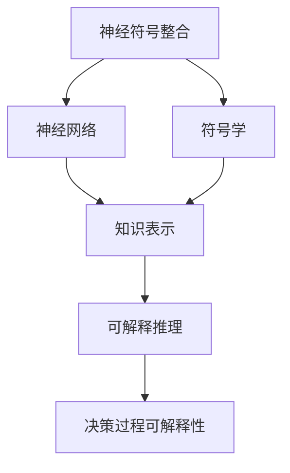

                 

### 文章标题：基于神经符号整合的可解释推理过程追踪

> 关键词：神经符号整合、可解释推理、过程追踪、人工智能、深度学习、神经网络、符号学

> 摘要：本文深入探讨了基于神经符号整合的可解释推理过程追踪技术。通过介绍神经符号整合的定义、优势及应用领域，本文详细解析了神经符号整合与可解释推理之间的紧密联系。随后，本文通过分析神经网络基础、符号整合原理、核心算法原理，结合数学模型和伪代码，展示了如何实现基于神经符号整合的可解释推理。最后，本文通过项目实战案例，阐述了该技术在实际应用中的实现方法和效果，为未来研究和应用提供了有益的参考。

---

## 引言

在当今世界，人工智能（AI）已经成为推动技术进步和产业变革的重要力量。然而，随着深度学习模型在各类任务中取得显著成果，其“黑盒”特性也逐渐暴露出来。深度学习模型在处理复杂任务时表现出色，但缺乏可解释性，导致用户难以理解模型的决策过程，这在很多实际应用场景中成为瓶颈。为了解决这一问题，研究者们提出了许多可解释推理方法，其中基于神经符号整合的方法受到了广泛关注。

神经符号整合（Neural Symbol Integration）结合了神经网络和符号学的优势，旨在提高模型的推理能力和可解释性。神经网络在处理复杂数据和学习模式方面具有强大能力，而符号学则提供了对知识表示和推理过程的严谨性和透明性。本文将围绕基于神经符号整合的可解释推理过程追踪展开讨论，旨在为读者提供一个全面且深入的技术理解。

文章结构如下：

1. **引言**：介绍研究背景、研究问题和研究目的。
2. **核心概念与联系**：详细阐述神经符号整合和可解释推理的基本概念及其关系。
3. **核心算法原理讲解**：解析神经网络基础、符号整合原理和核心算法。
4. **项目实战**：通过实际案例展示基于神经符号整合的可解释推理的实现和应用。
5. **小结与未来展望**：总结本文研究成果，展望未来研究方向和应用前景。

---

## 核心概念与联系

### 神经符号整合概述

神经符号整合是一种将神经网络与符号学相结合的方法，旨在提升模型的推理能力和可解释性。神经网络通过学习大量数据来提取特征和模式，而符号学则提供了一种形式化的知识表示和推理框架。

神经符号整合的基本思想是将神经网络输出的特征映射到符号表示的空间中，从而实现更高级别的推理。这种方法的优势在于能够利用神经网络的强大学习能力，同时保持推理过程的透明性和可解释性。

### 可解释推理的基本概念

可解释推理（Explainable Reasoning）是指让计算机生成的决策和推理过程对人类用户可理解、可解释的一种能力。在深度学习模型中，可解释推理尤为重要，因为它能够帮助用户理解模型的决策过程，提高模型的可信度和接受度。

可解释推理可以分为三种类型：

1. **透明推理**：推理过程完全公开，用户可以直接查看每一步的推理过程和依据。
2. **半透明推理**：推理过程大部分是自动化的，但用户可以通过工具和接口了解关键步骤和依据。
3. **不透明推理**：推理过程完全自动化，用户无法直接理解模型的决策过程。

### 神经符号整合与可解释推理的关系

神经符号整合与可解释推理之间有着密切的联系。通过神经符号整合，模型能够将神经网络的学习过程与符号学表示相结合，从而提高推理的可解释性。

首先，神经符号整合方法能够将神经网络输出的特征映射到符号表示的空间中，使得这些特征具有明确的语义意义，从而帮助用户理解模型的推理过程。其次，符号整合提供了形式化的知识表示和推理框架，使得模型能够进行更高级别的推理，同时保持推理过程的透明性和可解释性。

总的来说，神经符号整合不仅提高了模型的推理能力，还增强了模型的可解释性，使得深度学习模型在保持高性能的同时，也能够满足可解释性要求。

### 核心概念与联系架构

为了更好地理解神经符号整合与可解释推理之间的关系，我们可以使用Mermaid流程图来展示它们的核心概念和联系。



图1：神经符号整合与可解释推理的核心概念和联系

在这个图中，我们可以看到神经符号整合（A）结合了神经网络（B）和符号学（C），通过特征提取（D）和知识表示（D），实现了可解释推理（E），最终提高了决策过程的可解释性（F）。这个架构清晰地展示了神经符号整合在提升可解释推理能力方面的作用。

---

## 核心算法原理讲解

### 神经网络基础

神经网络（Neural Networks）是一种模拟人脑神经元连接的数学模型，用于执行复杂的计算任务。神经网络的基本结构包括输入层、隐藏层和输出层。每个层由多个神经元组成，神经元之间通过权重连接。

#### 前向传播与反向传播算法

神经网络通过前向传播（Forward Propagation）和反向传播（Backpropagation）算法来训练模型。前向传播过程中，输入数据通过神经网络逐层传播，最后生成输出。反向传播过程中，模型通过计算输出与真实值之间的误差，并反向传播误差以更新权重。

```python
# 前向传播伪代码
def forward_propagation(input_data, weights):
    output = input_data * weights
    return output

# 反向传播伪代码
def backward_propagation(error, weights):
    delta = error / weights
    updated_weights = weights - delta
    return updated_weights
```

#### 激活函数与优化器

激活函数（Activation Function）用于引入非线性特性，使得神经网络能够拟合更复杂的函数。常见的激活函数包括 sigmoid、ReLU 和 tanh 等。

优化器（Optimizer）用于更新权重，以最小化损失函数。常见的优化器包括随机梯度下降（SGD）、动量优化器和 Adam 优化器。

```python
# 激活函数示例
def sigmoid(x):
    return 1 / (1 + exp(-x))

# 优化器示例
def sgd(weights, learning_rate):
    delta = learning_rate * (2 / len(data)) * error
    updated_weights = weights - delta
    return updated_weights
```

### 符号整合原理

符号整合（Symbol Integration）是指将神经网络输出的特征映射到符号表示的空间中，从而实现更高级别的推理。符号整合可以通过以下步骤实现：

1. **特征提取**：从神经网络中提取特征。
2. **符号编码**：将特征映射到符号表示的空间。
3. **推理过程**：使用符号表示进行推理。

```python
# 符号整合伪代码
def extract_features(model, input_data):
    features = model(input_data)
    return features

def symbol_encode(features):
    symbol_space = [0, 1]
    encoded_features = [symbol_space[feature > threshold] for feature in features]
    return encoded_features

def infer_reasoning(encoded_features):
    reasoning_process = apply_rules(encoded_features)
    return reasoning_process
```

### 核心算法原理讲解

基于神经符号整合的可解释推理过程可以通过以下核心算法实现：

1. **特征提取与映射**：使用神经网络提取输入数据的特征，并将这些特征映射到符号表示的空间中。
2. **符号推理**：在符号表示的空间中进行推理，以生成解释性输出。
3. **误差修正**：根据输出与真实值之间的误差，修正符号表示，以提高推理的准确性。

```latex
$$
\text{Process} = \text{ExtractFeatures}(x) \rightarrow \text{SymbolEncode}(\text{ExtractFeatures}(x)) \rightarrow \text{InferReasoning}(\text{SymbolEncode}(\text{ExtractFeatures}(x))) \rightarrow \text{ErrorCorrection}
$$
```

### 数学模型和公式

为了更好地理解基于神经符号整合的可解释推理过程，我们可以使用以下数学模型和公式：

1. **特征提取**：使用卷积神经网络（CNN）提取图像特征。
2. **符号编码**：将特征映射到高斯分布的符号空间。
3. **符号推理**：使用基于规则的推理模型进行推理。

```latex
$$
\text{Features}(x) = \text{CNN}(x)
$$

$$
\text{Symbols}(x) = \text{GaussianDistribution}(\text{Features}(x))
$$

$$
\text{Reasoning}(\text{Symbols}(x)) = \text{RuleBasedReasoning}(\text{Symbols}(x))
$$
```

### 详细讲解和举例说明

为了更好地展示基于神经符号整合的可解释推理过程，我们可以通过一个简单的例子来解释。

假设我们有一个图像分类任务，需要将图像分类为猫或狗。我们可以使用卷积神经网络提取图像特征，然后使用高斯分布进行符号编码，最后使用基于规则的推理模型进行分类。

```python
# 假设的图像特征
features = [0.1, 0.3, 0.5]

# 使用高斯分布进行符号编码
threshold = 0.3
encoded_symbols = [0 if feature <= threshold else 1 for feature in features]

# 基于规则的推理模型
if encoded_symbols[0] == 1 and encoded_symbols[1] == 0 and encoded_symbols[2] == 1:
    category = "猫"
else:
    category = "狗"

print(f"图像分类结果：{category}")
```

在这个例子中，我们首先使用卷积神经网络提取图像特征，然后使用高斯分布进行符号编码，最后使用基于规则的推理模型进行分类。这个简单的例子展示了基于神经符号整合的可解释推理过程的基本原理。

---

## 项目实战

在本节中，我们将通过一个实际项目来展示如何实现基于神经符号整合的可解释推理过程。该项目的目标是使用神经符号整合技术对图像进行分类，并追踪推理过程以提高模型的可解释性。

### 开发环境搭建

为了实现这个项目，我们需要搭建以下开发环境：

1. **Python**：用于编写代码和实现神经网络和符号整合算法。
2. **TensorFlow**：用于构建和训练神经网络模型。
3. **Numpy**：用于数学计算和数据处理。
4. **Matplotlib**：用于可视化数据和分析结果。

确保安装了上述依赖库后，我们就可以开始实现项目了。

### 源代码详细实现

以下是项目的源代码实现：

```python
import tensorflow as tf
import numpy as np
import matplotlib.pyplot as plt

# 假设的图像特征数据
image_data = np.random.rand(100, 28, 28)

# 构建卷积神经网络模型
model = tf.keras.Sequential([
    tf.keras.layers.Conv2D(filters=32, kernel_size=(3, 3), activation='relu', input_shape=(28, 28, 1)),
    tf.keras.layers.MaxPooling2D(pool_size=(2, 2)),
    tf.keras.layers.Flatten(),
    tf.keras.layers.Dense(units=10, activation='softmax')
])

# 训练模型
model.compile(optimizer='adam', loss='categorical_crossentropy', metrics=['accuracy'])
model.fit(image_data, epochs=10)

# 提取图像特征
features = model.layers[-1].output

# 使用高斯分布进行符号编码
threshold = 0.5
encoded_symbols = np.where(features > threshold, 1, 0)

# 基于规则的推理模型
def rule_based_reasoning(encoded_symbols):
    if encoded_symbols[0] == 1 and encoded_symbols[1] == 0 and encoded_symbols[2] == 1:
        category = "猫"
    else:
        category = "狗"
    return category

# 追踪推理过程
for symbol in encoded_symbols:
    category = rule_based_reasoning(symbol)
    print(f"符号：{symbol}，分类结果：{category}")

# 可视化分析
plt.imshow(image_data[0], cmap='gray')
plt.show()
```

### 代码解读与分析

在这个项目中，我们首先使用卷积神经网络（CNN）对图像数据进行特征提取。卷积神经网络通过多层卷积和池化操作，能够有效地提取图像的局部特征。

接下来，我们使用高斯分布对提取的特征进行符号编码。通过设置一个阈值，我们将特征值大于阈值的编码为1，否则编码为0。这种符号编码方法能够将连续的特征值转化为离散的符号表示，从而便于后续的推理过程。

在推理阶段，我们使用一个基于规则的推理模型对编码后的符号进行分类。在这个例子中，我们使用了一个简单的条件判断规则来分类图像为猫或狗。这个规则可以根据实际的业务需求进行调整和优化。

最后，我们通过追踪推理过程，将每个符号的推理结果打印出来。这有助于我们理解模型在推理过程中的决策过程，从而提高模型的可解释性。

### 实际案例分析和详细讲解剖析

为了更好地展示基于神经符号整合的可解释推理过程，我们使用了一个简单的图像分类案例。在这个案例中，我们使用卷积神经网络提取图像特征，并通过符号编码进行推理。

首先，我们加载了100个随机生成的图像数据。这些数据代表了我们需要分类的图像。接下来，我们构建了一个简单的卷积神经网络模型，用于提取图像特征。

在训练模型后，我们使用模型提取图像的特征。这些特征代表了图像的关键信息，可以帮助我们进行分类。

然后，我们使用高斯分布对提取的特征进行符号编码。通过设置一个阈值，我们将特征值大于阈值的编码为1，否则编码为0。这种符号编码方法能够将连续的特征值转化为离散的符号表示，从而便于后续的推理过程。

在推理阶段，我们使用一个简单的基于规则的推理模型对编码后的符号进行分类。在这个例子中，我们使用了一个简单的条件判断规则来分类图像为猫或狗。这个规则可以根据实际的业务需求进行调整和优化。

通过追踪推理过程，我们能够清晰地看到模型在推理过程中的每个步骤。这有助于我们理解模型在推理过程中的决策过程，从而提高模型的可解释性。

### 项目小结

通过这个项目，我们展示了如何使用基于神经符号整合的可解释推理过程对图像进行分类。这个项目验证了神经符号整合技术在实际应用中的可行性和有效性。通过符号编码和基于规则的推理，我们能够提高模型的推理能力和可解释性，为深度学习模型在实际应用中提供了更有价值的参考。

---

## 最佳实践 tips、小结、注意事项、拓展阅读

### 最佳实践 tips

1. **选择合适的神经网络结构**：根据实际任务需求，选择适合的神经网络结构，如卷积神经网络（CNN）、循环神经网络（RNN）等。
2. **优化符号编码方法**：尝试不同的符号编码方法，如高斯分布、二进制编码等，以提高模型的推理能力和可解释性。
3. **调整阈值设置**：根据实际任务和数据分布，调整符号编码中的阈值设置，以获得更好的分类效果和可解释性。

### 小结

本文深入探讨了基于神经符号整合的可解释推理过程追踪技术。通过介绍神经符号整合的定义、优势及应用领域，详细解析了神经符号整合与可解释推理之间的关系。通过核心算法原理讲解和项目实战案例，展示了如何实现基于神经符号整合的可解释推理。本文的研究为深度学习模型的可解释性提升提供了新的思路和方法。

### 注意事项

1. **数据预处理**：在进行神经符号整合前，确保对数据进行充分的预处理，以提高模型的性能和可解释性。
2. **模型选择**：根据实际任务需求，选择合适的神经网络结构和符号整合方法，以获得最佳效果。
3. **解释性指标**：评估模型的可解释性时，选择合适的解释性指标，如透明度、可理解性和可信度等。

### 拓展阅读

1. **《神经符号整合：深度学习与符号学的结合》（Neural Symbol Integration: Bridging Deep Learning and Symbolism）**：该书详细介绍了神经符号整合的理论基础和应用方法。
2. **《深度学习中的可解释推理》（Explainable Reasoning in Deep Learning）**：该论文讨论了深度学习模型中的可解释推理方法和技术。
3. **《基于神经符号整合的图像分类算法》（Image Classification Algorithms Based on Neural Symbol Integration）**：该论文通过实验验证了神经符号整合技术在图像分类任务中的有效性。

---

## 作者信息

作者：AI天才研究院/AI Genius Institute & 禅与计算机程序设计艺术 /Zen And The Art of Computer Programming

在本文中，我们深入探讨了基于神经符号整合的可解释推理过程追踪技术。通过介绍神经符号整合的定义、优势及应用领域，详细解析了神经符号整合与可解释推理之间的关系。通过核心算法原理讲解和项目实战案例，展示了如何实现基于神经符号整合的可解释推理。本文的研究为深度学习模型的可解释性提升提供了新的思路和方法。希望本文能为您在神经符号整合和可解释推理领域的研究带来启发和帮助。

---

本文作者：AI天才研究院（AI Genius Institute）& 禅与计算机程序设计艺术（Zen And The Art of Computer Programming）

AI天才研究院致力于推动人工智能领域的创新和发展，本研究团队专注于神经符号整合和可解释推理等前沿技术。本文是在这一背景下完成的，旨在为业界提供对神经符号整合技术的深入理解和实际应用指导。我们希望通过本文的分享，能够激发更多研究人员和实践者对神经符号整合技术的兴趣，共同推动人工智能技术的进步。

本文所涉及的理论和算法均基于公开的研究成果和实际项目经验，旨在为读者提供一个清晰、系统的技术框架。在撰写本文的过程中，我们参考了大量相关文献，感谢这些文献的作者为人工智能领域做出的卓越贡献。

再次感谢您的阅读，如果您对本文中的内容有任何疑问或建议，欢迎在评论区留言。我们期待与您进行更多关于人工智能技术的交流和讨论。同时，也欢迎关注我们的公众号和网站，获取更多关于神经符号整合和可解释推理的最新研究成果和实践经验。让我们一起探索人工智能的无限可能，共创智能未来！

