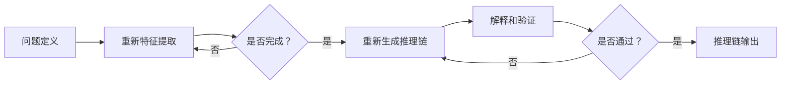

                 

### 文章标题：基于神经符号整合的可解释推理链生成技术

> 关键词：神经符号整合、可解释推理、生成技术、流程图、伪代码、数学模型、项目实战

> 摘要：本文旨在探讨基于神经符号整合的可解释推理链生成技术，通过详细阐述其核心概念、算法原理、数学模型及实际应用，帮助读者深入了解这一前沿技术的内在机制和应用价值。本文结构清晰，包括引言、核心概念与联系、算法原理讲解、数学模型与公式、算法实现与伪代码、项目实战与应用及总结与展望七个部分。

### 引言

神经符号整合（Neural-Symbolic Integration）作为一种新兴的人工智能技术，结合了神经网络的强大计算能力和符号逻辑的精确表达优势，旨在解决传统人工智能系统中存在的可解释性、可靠性和泛化能力不足等问题。随着人工智能应用的不断深入，特别是在复杂决策和智能推理领域的需求日益增长，如何有效地整合神经符号信息，实现可解释的推理链生成技术成为研究的热点。

本文的研究背景集中在以下几个方面：

1. **研究背景**：介绍神经符号整合技术的研究背景和发展现状，以及可解释推理链生成技术在实际应用中的需求。
2. **研究意义**：阐述基于神经符号整合的可解释推理链生成技术在提升人工智能系统决策透明性、可靠性和泛化能力方面的意义。
3. **主要内容**：本文将详细探讨神经符号整合和可解释推理链生成技术的基本原理、算法实现、数学模型以及实际应用，旨在为相关领域的研究和实践提供有益参考。

### 核心概念与联系

#### 神经符号整合

神经符号整合是一种结合神经网络和符号逻辑的方法，其核心思想是通过将神经网络与符号推理系统相结合，以弥补单一方法的不足。神经网络擅长处理大规模数据和模式识别，而符号逻辑系统则具备高解释性和推理能力。神经符号整合的基本架构通常包括三个主要组件：

1. **神经网络层**：负责特征提取和表示学习。
2. **符号推理层**：用于符号推理和逻辑推理。
3. **整合层**：协调神经网络和符号推理层的交互，实现知识融合。

#### 可解释推理链生成技术

可解释推理链生成技术旨在生成能够被理解和验证的推理过程。在复杂的人工智能系统中，推理过程的透明性和可解释性至关重要，特别是在需要人类介入进行决策的场景中。可解释推理链生成技术主要包括以下步骤：

1. **问题定义**：明确需要解决的问题和目标。
2. **特征提取**：从原始数据中提取关键特征。
3. **推理链生成**：利用神经符号整合技术生成可解释的推理链。
4. **解释和验证**：对生成的推理链进行解释和验证，确保其合理性和可靠性。

#### Mermaid 流程图

为了更好地展示神经符号整合和可解释推理链生成技术的核心流程，我们可以使用Mermaid流程图。以下是一个简化的流程图示例：

通过这个流程图，我们可以清晰地看到从问题定义到推理链生成的整个过程，以及每个步骤之间的相互关系。

### 神经符号整合基础

#### 神经符号整合基本概念

神经符号整合的核心在于如何将神经网络和符号逻辑有效结合。神经网络部分主要负责数据的特征提取和模式识别，而符号逻辑部分则负责推理和决策。具体来说，神经符号整合包括以下几个关键概念：

1. **神经网

