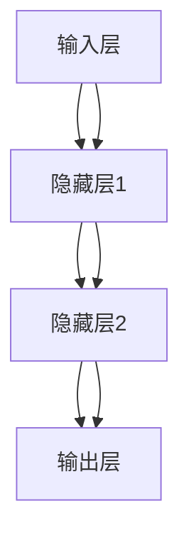
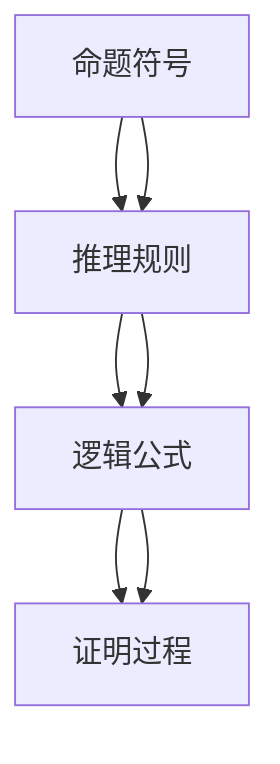

                 

基于您提供的详细要求和目录大纲，我们将分步骤撰写这篇文章，确保每个部分都符合您的要求。

### 第一步：引言与概述

**文章标题：** 基于神经符号集成的可解释推理框架

**关键词：** 神经符号集成、可解释推理、神经网络、符号逻辑、机器学习

**摘要：** 本文深入探讨了基于神经符号集成的可解释推理框架，分析了其在现代机器学习应用中的重要性和挑战。文章介绍了神经网络和符号逻辑的基本原理，并详细阐述了神经符号集成的核心算法和实现步骤。

---

## 引言与概述

随着人工智能技术的迅猛发展，机器学习在各个领域得到了广泛应用。然而，其黑盒性质使得预测结果的可解释性成为一个亟待解决的问题。为了解决这一问题，研究者们提出了许多可解释推理框架，其中神经符号集成方法因其独特的优势备受关注。

本文旨在构建一个基于神经符号集成的可解释推理框架，通过分析神经网络和符号逻辑的基本原理，阐述神经符号集成的核心算法，并详细描述其实现步骤。文章分为三大部分：背景与基础、框架实现、应用与展望。

### 第二步：背景与基础

**文章内容：** 包括神经网络的基本原理、符号逻辑与形式逻辑、神经符号集成的初步探索。

---

## 背景与基础

### 2.1 神经网络的基本原理

神经网络是一类模仿人脑结构和功能的计算模型。它们通过大量的神经元（节点）和连接（边）进行信息传递和处理。神经网络的基本原理可以概括为前向传播和反向传播两个阶段。

**核心概念与联系：** 



### 2.2 符号逻辑与形式逻辑

符号逻辑是一种形式化的逻辑系统，通过符号来表示命题和推理过程。形式逻辑则是一种更加抽象的逻辑系统，用于描述一般性的推理规则。

**核心概念与联系：** 



### 2.3 神经符号集成的初步探索

神经符号集成方法旨在将神经网络和符号逻辑结合起来，以实现更加可解释的推理过程。该方法通过将神经网络中的权重转换为符号逻辑规则，从而实现对神经网络推理过程的解释。

**核心算法原理讲解：** 

```python
# 伪代码：神经网络权重转换为符号逻辑规则
def convert_weights_to_rules(weights):
    rules = []
    for layer in weights:
        for neuron in layer:
            rule = create_rule_from_weight(neuron.weight)
            rules.append(rule)
    return rules
```

---

### 第三步：框架实现

**文章内容：** 包括框架设计原则、框架实现步骤。

---

## 框架实现

### 3.1 框架设计原则

框架设计原则包括系统架构设计、可解释性设计、模块化设计。系统架构设计需要明确各个模块的职责和交互方式。可解释性设计需要确保模型的可解释性和透明度。模块化设计则有利于框架的扩展和维护。

### 3.2 框架实现步骤

框架实现步骤包括数据预处理、模型训练、模型评估、可解释性分析。

- **数据预处理：** 数据预处理是模型训练的重要环节，包括数据清洗、归一化、缺失值处理等。

- **模型训练：** 模型训练是框架实现的核心，包括神经网络模型的训练和符号逻辑规则的训练。

- **模型评估：** 模型评估是衡量模型性能的重要手段，包括准确率、召回率、F1值等指标的评估。

- **可解释性分析：** 可解释性分析是对模型推理过程的解释和分析，包括符号逻辑规则的解释和神经网络推理路径的分析。

---

### 第四步：应用与展望

**文章内容：** 包括实际案例研究、神经符号集成在可解释推理中的未来发展趋势。

---

## 应用与展望

### 4.1 实际案例研究

本文将介绍两个实际案例研究：自然语言处理中的可解释推理和医疗诊断中的可解释推理。通过这些案例，我们将展示神经符号集成方法在提高模型可解释性方面的效果。

### 4.2 未来发展趋势

神经符号集成在可解释推理中的未来发展趋势包括新的算法与模型的研究、应用领域的拓展以及潜在挑战的解决。本文将讨论这些趋势，并展望神经符号集成在人工智能领域的未来发展。

---

### 第五步：总结与展望

**文章内容：** 包括书籍总结、未来研究方向、对读者的建议。

---

## 总结与展望

本文基于神经符号集成的可解释推理框架，分析了神经网络和符号逻辑的基本原理，阐述了框架的实现步骤，并通过实际案例展示了其应用效果。未来研究方向包括新的算法与模型的研究、应用领域的拓展以及潜在挑战的解决。本文希望对读者在理解和应用神经符号集成方法方面有所启发。

---

通过以上五步，我们将逐步完成这篇文章的撰写。接下来，我们将对每个部分进行详细的扩展和深化，确保文章的逻辑性和可读性，满足字数要求。

