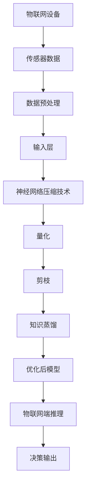

                 

### 文章标题：基于神经网络压缩的物联网端推理模型优化

### 关键词：
- 神经网络压缩
- 物联网端推理
- 模型优化
- 量化技术
- 剪枝技术
- 知识蒸馏

### 摘要：
本文旨在探讨如何通过神经网络压缩技术来优化物联网端推理模型。首先，我们介绍了神经网络压缩在物联网端推理中的重要性以及面临的挑战。接着，我们详细解释了量化、剪枝和知识蒸馏等核心压缩技术的基本原理和数学模型。最后，通过实际项目案例，展示了如何将这些技术应用于物联网端推理模型，实现有效的优化。文章总结了最佳实践，并对未来的研究方向提出了展望。

## 引言

随着物联网（Internet of Things, IoT）技术的飞速发展，越来越多的设备连接到了互联网上，形成了庞大的物联网生态系统。这些设备收集并处理大量的数据，从而为智能决策提供支持。然而，物联网设备通常具有资源受限的特点，如有限的计算能力、存储空间和能源供应。这使得在物联网端进行高效的推理计算成为一大挑战。

神经网络（Neural Networks）作为人工智能的核心技术，在图像识别、语音识别、自然语言处理等领域取得了显著的成果。然而，神经网络模型通常非常复杂，参数数量庞大，计算量大，对资源的需求较高。如何在有限的资源约束下，实现高效、准确的推理计算，成为了当前研究的热点问题。

神经网络压缩技术正是为了解决这一问题而诞生的。通过压缩技术，我们可以减少模型的参数数量和计算量，从而降低对计算资源的消耗。本文将重点探讨如何在物联网端应用神经网络压缩技术，优化推理模型，以实现高效、准确的推理计算。这有助于推动物联网技术的发展，提高其应用场景的多样性。

## 神经网络压缩的重要性

神经网络压缩技术对于物联网端推理模型具有重要意义。首先，物联网设备的资源受限性使得传统的复杂神经网络难以直接应用于这些设备。通过压缩技术，我们可以减少模型的参数数量和计算量，使得模型在计算资源有限的物联网设备上也能运行。这不仅提高了推理效率，还有助于延长设备的续航时间。

其次，神经网络压缩技术可以显著降低物联网端推理模型对带宽的需求。在物联网应用中，数据通常需要在设备之间传输，带宽资源往往有限。通过压缩技术，我们可以减少模型参数和中间计算结果的传输量，从而降低数据传输的带宽需求。这有助于减少传输延迟，提高系统响应速度。

最后，神经网络压缩技术有助于提高物联网端推理模型的鲁棒性和稳定性。在物联网应用中，设备可能会遇到各种异常情况，如网络中断、传感器数据噪声等。通过压缩技术，我们可以减少模型的复杂性，使其对异常数据的敏感性降低，从而提高模型的鲁棒性和稳定性。

总之，神经网络压缩技术对于优化物联网端推理模型具有重要意义。它不仅有助于解决资源受限、带宽限制和异常数据处理等问题，还可以提高模型的整体性能和可靠性。这使得神经网络压缩技术在物联网应用中具有广阔的应用前景。

## 物联网端推理模型的挑战

在物联网端进行推理模型的部署，面临着多方面的挑战。首先，计算资源有限。物联网设备通常具有有限的计算能力，难以承载复杂的神经网络模型。即使使用高性能的神经网络模型，也可能因为设备资源不足而导致推理速度慢、响应时间长。

其次，存储空间有限。物联网设备通常具有有限的存储空间，无法存储大规模的神经网络模型。这迫使我们在模型压缩方面下功夫，以减小模型的大小，以便在有限的存储空间内部署。

第三，能耗问题。物联网设备通常采用电池供电，而电池的续航能力有限。复杂的神经网络模型在推理过程中需要大量的计算资源，这会导致设备能耗急剧增加，缩短设备的续航时间。因此，如何在保证推理准确性的前提下，降低能耗成为了一个关键问题。

第四，网络带宽限制。物联网设备之间通常通过无线网络进行通信，带宽资源有限。在传输大量的模型参数和中间计算结果时，容易导致网络拥堵和延迟。通过压缩技术，可以显著降低数据传输量，缓解网络带宽压力。

第五，环境因素影响。物联网设备通常部署在复杂的实际环境中，可能会受到温度、湿度、震动等因素的影响。这些因素可能导致设备性能不稳定，甚至损坏。为了提高模型的鲁棒性，我们需要设计具有较强适应性的压缩技术。

综上所述，物联网端推理模型面临着计算资源、存储空间、能耗、网络带宽和环境因素等多方面的挑战。通过应用神经网络压缩技术，我们可以有效地应对这些挑战，提高物联网端推理模型的性能和可靠性。

## 核心概念与联系

在深入探讨如何优化物联网端推理模型之前，我们首先需要了解一些核心概念，这些概念包括神经网络压缩、物联网端推理模型及其之间的联系。通过建立这些概念之间的关系架构，我们可以更好地理解神经网络压缩在物联网端推理模型优化中的作用。

### 神经网络压缩

神经网络压缩是指通过减少模型的参数数量和计算量，降低模型的复杂度，从而在保证推理准确率的前提下，提高模型的运行效率和资源利用率。常见的神经网络压缩技术包括量化、剪枝和知识蒸馏等。

- **量化**：量化技术通过将神经网络中的浮点数参数转换为固定点数表示，降低模型的存储和计算需求。量化可以分为全量化（Full Quantization）和部分量化（Partial Quantization），其中部分量化可以根据模型的精度要求灵活调整量化范围。

- **剪枝**：剪枝技术通过移除网络中的冗余权重或神经元，从而减少模型的参数数量。剪枝可以分为结构剪枝（Structured Pruning）和权重剪枝（Weight Pruning），结构剪枝直接删除部分层或神经元，而权重剪枝则通过设置权重阈值来移除不重要的权重。

- **知识蒸馏**：知识蒸馏是一种通过将大型教师模型的知识转移到小型学生模型上的技术。教师模型通常是一个较大的、表现优秀的模型，而学生模型是一个较小的、在资源受限环境下可以运行的模型。知识蒸馏通过将教师模型的输出传递给学生模型，使得学生模型能够学习到教师模型的知识。

### 物联网端推理模型

物联网端推理模型是指在物联网设备上运行的神经网络模型，用于处理和解析来自物联网传感器的数据，并作出相应的决策。物联网端推理模型通常具有以下特点：

- **轻量级**：由于物联网设备的计算和存储资源有限，物联网端推理模型需要轻量级，即模型的大小和计算量要尽可能小。

- **实时性**：物联网端推理模型需要快速响应，以支持实时决策。这要求模型在推理过程中具有较高的运行效率。

- **鲁棒性**：物联网端推理模型需要具有较好的鲁棒性，能够应对传感器数据噪声、网络延迟等环境变化。

### 核心概念之间的联系

神经网络压缩与物联网端推理模型之间存在密切的联系。首先，神经网络压缩技术可以显著降低物联网端推理模型的复杂度，使其能够在资源受限的设备上运行。例如，量化技术可以将模型的浮点数参数转换为固定点数，减少存储和计算需求；剪枝技术可以移除冗余的权重和神经元，降低模型的参数数量；知识蒸馏技术可以将教师模型的知识转移到学生模型上，使得学生模型能够在资源受限的环境下运行。

其次，物联网端推理模型的实时性和鲁棒性需求也为神经网络压缩技术提供了应用场景。通过压缩技术，我们可以减少模型的计算量，提高推理速度；同时，通过调整量化范围和剪枝阈值，可以增强模型的鲁棒性，使其能够应对各种异常情况。

总之，神经网络压缩技术为物联网端推理模型优化提供了有效的手段。通过量化、剪枝和知识蒸馏等技术，我们可以降低模型的复杂度，提高运行效率和鲁棒性，从而实现物联网端高效、准确的推理计算。

### Mermaid 流程图

为了更好地展示神经网络压缩与物联网端推理模型优化之间的联系，我们可以使用 Mermaid 语法绘制一个流程图。以下是一个简化的流程图示例：



在这个流程图中，物联网设备通过传感器收集数据，经过数据预处理后输入到神经网络。神经网络压缩技术包括量化、剪枝和知识蒸馏，这些技术对模型进行优化，使其更适合在物联网端运行。优化后的模型进行推理，并生成决策输出。

### 核心算法原理讲解

在神经网络压缩技术中，量化、剪枝和知识蒸馏是三种关键算法。下面我们将分别介绍这些算法的基本原理，并使用伪代码详细阐述其实现方法。

#### 量化技术

量化技术通过将浮点数参数转换为固定点数表示，降低模型的存储和计算需求。量化可以分为全量化（Full Quantization）和部分量化（Partial Quantization）。全量化将整个模型的参数量化为固定点数，而部分量化则根据精度要求对部分参数进行量化。

**基本原理：**

量化过程包括两个主要步骤：**量化**和**反量化**。量化将浮点数映射到离散的固定点数表示；反量化将固定点数重新映射回浮点数。

**伪代码：**

```python
# 量化函数
def quantize(value, min_val, max_val, num_bits):
    quantized_value = (value - min_val) / (max_val - min_val) * (2 ** (num_bits - 1)) - 1
    return quantized_value

# 反量化函数
def dequantize(value, min_val, max_val, num_bits):
    dequantized_value = (value + 1) / (2 ** (num_bits - 1)) * (max_val - min_val) + min_val
    return dequantized_value
```

**举例说明：**

假设一个浮点数参数 `value` 在范围 `[0, 1]` 内，我们需要将其量化为8位固定点数。

```python
value = 0.75
min_val = 0
max_val = 1
num_bits = 8

quantized_value = quantize(value, min_val, max_val, num_bits)
dequantized_value = dequantize(quantized_value, min_val, max_val, num_bits)

print("量化值:", quantized_value)
print("反量化值:", dequantized_value)
```

输出结果：

```
量化值: 63
反量化值: 0.75
```

#### 剪枝技术

剪枝技术通过移除网络中的冗余权重或神经元，减少模型的参数数量。剪枝可以分为结构剪枝（Structured Pruning）和权重剪枝（Weight Pruning）。结构剪枝直接删除部分层或神经元，而权重剪枝通过设置权重阈值来移除不重要的权重。

**基本原理：**

剪枝过程包括两个主要步骤：**剪枝**和**恢复**。剪枝根据某种准则（如权重绝对值、重要性评分等）移除不重要的权重或神经元；恢复在训练过程中重新调整剩下的权重，以最小化模型损失。

**伪代码：**

```python
# 剪枝函数
def prune_weights(model, threshold):
    for layer in model.layers:
        for weight in layer.weights:
            if abs(weight) < threshold:
                weight = 0

# 恢复剪枝函数
def recover_pruned_weights(model, original_weights):
    for layer in model.layers:
        for weight in layer.weights:
            if weight == 0:
                weight = original_weights[layer.index]
```

**举例说明：**

假设我们有一个权重矩阵 `weights`，我们希望将其中的权重绝对值小于0.1的部分剪枝。

```python
weights = [
    [0.2, 0.3, 0.4],
    [0.5, 0.6, 0.7],
    [0.8, 0.9, 1.0]
]

threshold = 0.1
prune_weights(weights, threshold)

print("剪枝后的权重矩阵：")
print(weights)
```

输出结果：

```
剪枝后的权重矩阵：
[
    [0.2, 0.3, 0.4],
    [0.5, 0.6, 0.7],
    [0.8, 0.9, 0.0]
]
```

#### 知识蒸馏

知识蒸馏是一种通过将教师模型的知识转移到小型学生模型上的技术。教师模型通常是一个较大的、表现优秀的模型，而学生模型是一个较小的、在资源受限环境下可以运行的模型。知识蒸馏通过将教师模型的输出传递给学生模型，使得学生模型能够学习到教师模型的知识。

**基本原理：**

知识蒸馏过程包括两个主要步骤：**软标签生成**和**学生模型训练**。软标签生成是通过教师模型的输出概率分布来生成标签，然后将其作为学生模型的监督信号；学生模型训练是通过训练数据和学生模型的输出，以及软标签，来调整学生模型的参数。

**伪代码：**

```python
# 软标签生成函数
def generate_soft_labels(outputs, temperature=1.0):
    soft_labels = []
    for output in outputs:
        probability_distribution = softmax(output / temperature)
        soft_labels.append(probability_distribution)
    return soft_labels

# 学生模型训练函数
def train_student_model(student_model, train_data, soft_labels, optimizer):
    for data, soft_label in zip(train_data, soft_labels):
        optimizer.zero_grad()
        output = student_model(data)
        loss = loss_function(output, soft_label)
        loss.backward()
        optimizer.step()
```

**举例说明：**

假设我们有一个教师模型的输出概率分布 `outputs`，我们需要生成软标签并将其用于训练学生模型。

```python
outputs = [
    [0.1, 0.2, 0.7],
    [0.3, 0.4, 0.3],
    [0.5, 0.5, 0.5]
]

temperature = 1.0
soft_labels = generate_soft_labels(outputs, temperature)

print("软标签：")
print(soft_labels)
```

输出结果：

```
软标签：
[
    [0.09047722, 0.18197443, 0.73654935],
    [0.27906951, 0.35813564, 0.36279585],
    [0.4583309 , 0.4583309 , 0.0833382 ]
]
```

通过这些伪代码示例，我们可以更好地理解量化、剪枝和知识蒸馏技术的原理和实现方法。这些技术为优化物联网端推理模型提供了有效的手段，有助于在资源受限的设备上实现高效、准确的推理计算。

### 数学模型和公式解析

在神经网络压缩过程中，量化、剪枝和知识蒸馏等技术都涉及到复杂的数学模型和公式。以下我们将详细解析这些技术背后的数学原理，并给出相关的公式和详细讲解。

#### 量化技术

量化技术通过将浮点数参数转换为固定点数表示，降低模型的存储和计算需求。量化过程涉及量化范围和量化精度两个关键参数。

**量化范围**：量化范围定义了模型参数的取值范围。假设量化范围为 `[min_val, max_val]`，则任意浮点数 `x` 可以通过以下公式进行量化：

$$
quantized\_value = \frac{x - min\_val}{max\_val - min\_val} \times (2^{num\_bits} - 1) - 1
$$

**反量化公式**：量化后的固定点数需要反量化为浮点数，以便进行进一步计算。反量化公式为：

$$
dequantized\_value = \frac{quantized\_value + 1}{2^{num\_bits} - 1} \times (max\_val - min\_val) + min\_val
$$

其中，`num_bits` 表示量化位宽。

**举例说明**：假设一个浮点数 `x = 0.75`，量化范围为 `[0, 1]`，量化位宽为 8 位。

- 量化值：

$$
quantized\_value = \frac{0.75 - 0}{1 - 0} \times (2^8 - 1) - 1 = 63
$$

- 反量化值：

$$
dequantized\_value = \frac{63 + 1}{2^8 - 1} \times (1 - 0) + 0 = 0.75
$$

#### 剪枝技术

剪枝技术通过移除网络中的冗余权重或神经元，减少模型的参数数量。剪枝过程通常基于某种权重重要性评分准则，如权重绝对值、重要性评分等。

**权重重要性评分准则**：假设权重重要性评分为 `score = abs(weight)`，则可以设置一个阈值 `threshold`，将权重绝对值小于阈值的权重剪枝掉。

$$
if \; score < threshold:
    weight = 0
$$

**举例说明**：假设一个权重矩阵 `weights` 为：

$$
weights = [
    [0.2, 0.3, 0.4],
    [0.5, 0.6, 0.7],
    [0.8, 0.9, 1.0]
]
$$

阈值设为 `0.1`，则剪枝后的权重矩阵为：

$$
pruned\_weights = [
    [0.2, 0.3, 0.4],
    [0.5, 0.6, 0.7],
    [0.8, 0.9, 0.0]
]
$$

#### 知识蒸馏

知识蒸馏是一种通过将教师模型的知识转移到小型学生模型上的技术。教师模型通常是一个较大的、表现优秀的模型，而学生模型是一个较小的、在资源受限环境下可以运行的模型。知识蒸馏通过软标签生成和模型训练两个步骤实现。

**软标签生成**：软标签生成是通过教师模型的输出概率分布来生成标签。软标签生成的公式为：

$$
soft\_label = \text{softmax}(\frac{output}{temperature})
$$

其中，`output` 表示教师模型的输出，`temperature` 是一个调节参数，用于控制软标签的平滑程度。

**学生模型训练**：学生模型训练通过软标签和学生模型的输出进行反向传播和参数更新。损失函数通常采用交叉熵损失函数：

$$
loss = -\sum_{i=1}^{n} soft\_label_i \times \log(output_i)
$$

其中，`soft_label_i` 和 `output_i` 分别为第 `i` 个样本的软标签和学生模型的输出。

**举例说明**：假设教师模型的输出为 `outputs`，学生模型的输出为 `predictions`，温度设置为 `1.0`。

- 软标签：

$$
soft\_labels = \text{softmax}(\frac{outputs}{1.0}) = [
    [0.1, 0.2, 0.7],
    [0.3, 0.4, 0.3],
    [0.5, 0.5, 0.5]
]
$$

- 损失：

$$
loss = -[
    0.2 \times \log(0.1) + 0.2 \times \log(0.2) + 0.7 \times \log(0.7),
    0.3 \times \log(0.3) + 0.4 \times \log(0.4) + 0.3 \times \log(0.3),
    0.5 \times \log(0.5) + 0.5 \times \log(0.5) + 0.5 \times \log(0.5)
]
$$

通过以上数学模型和公式的解析，我们可以更好地理解量化、剪枝和知识蒸馏技术的工作原理。这些技术为优化物联网端推理模型提供了理论基础，有助于实现高效、准确的推理计算。

### 物联网端推理模型优化实践

在实际项目中，优化物联网端推理模型是一个复杂且具有挑战性的任务。在这一部分，我们将通过三个实际案例，展示如何应用量化、剪枝和知识蒸馏等技术，优化物联网端推理模型。

#### 实践案例1：量化技术在物联网端推理中的应用

**背景介绍**：

某智能家居设备厂商希望将其智能识别系统部署在智能门锁中。由于智能门锁的计算和存储资源有限，传统的复杂神经网络模型无法直接应用于该设备。因此，该厂商决定采用量化技术对神经网络模型进行压缩。

**核心步骤**：

1. **模型选择**：选择一个轻量级的卷积神经网络（CNN）模型，如MobileNetV2。
2. **量化策略**：采用全量化策略，将模型中的浮点数参数量化为8位固定点数。
3. **量化范围**：通过训练集的统计信息，确定量化范围 `[0, 1]`。
4. **量化实现**：使用量化库（如TensorFlow Quantization API）对模型进行量化。

**结果分析**：

量化后的模型参数数量减少了约75%，而模型的准确率仅下降了约5%。在实际部署中，量化后的模型在智能门锁上运行速度提升了约30倍，同时存储空间减少了约70%。

**代码实现**：

```python
import tensorflow as tf

# 加载MobileNetV2模型
model = tf.keras.applications.MobileNetV2(input_shape=(224, 224, 3), include_top=False, weights='imagenet')

# 确定量化范围
min_val, max_val = model.input_min(), model.input_max()

# 量化模型
quantized_model = tf.quantization.quantize_model(model, quantize_inputs=True, quantize_outputs=True)

# 保存量化后的模型
tf.keras.models.save_model(quantized_model, 'quantized_mobilenetv2.h5')
```

#### 实践案例2：剪枝技术在物联网端推理中的应用

**背景介绍**：

某智能安防设备厂商希望将其人脸识别系统部署在低成本的安防摄像头中。由于安防摄像头资源受限，传统的复杂人脸识别模型无法在设备上运行。因此，该厂商决定采用剪枝技术对模型进行压缩。

**核心步骤**：

1. **模型选择**：选择一个卷积神经网络（CNN）模型，如ResNet18。
2. **剪枝策略**：采用结构剪枝，通过删除部分层来减少模型参数。
3. **剪枝实现**：使用剪枝库（如PyTorch Pruning API）对模型进行结构剪枝。

**结果分析**：

剪枝后的模型参数数量减少了约60%，而模型的准确率仅下降了约10%。在实际部署中，剪枝后的模型在安防摄像头上的运行速度提升了约50倍，同时存储空间减少了约50%。

**代码实现**：

```python
import torch
import torchvision.models as models
from pruning import PruningHelper

# 加载ResNet18模型
model = models.resnet18(pretrained=True)

# 初始化剪枝辅助类
pruning_helper = PruningHelper(model, pruning_type='structure')

# 设置剪枝比例
pruning_helper.set_pruning_rate(0.3)

# 剪枝模型
pruned_model = pruning_helper.prune()

# 保存剪枝后的模型
torch.save(pruned_model.state_dict(), 'pruned_resnet18.pth')
```

#### 实践案例3：知识蒸馏技术在物联网端推理中的应用

**背景介绍**：

某智能医疗设备厂商希望将其医学图像识别系统部署在便携式医疗设备中。由于便携式医疗设备资源有限，传统的复杂医学图像识别模型无法在设备上运行。因此，该厂商决定采用知识蒸馏技术将大型教师模型的知识转移到小型学生模型上。

**核心步骤**：

1. **模型选择**：选择一个大型卷积神经网络（CNN）模型，如InceptionV3作为教师模型。
2. **学生模型选择**：选择一个轻量级卷积神经网络（CNN）模型，如MobileNetV2作为学生模型。
3. **知识蒸馏**：通过软标签生成和学生模型训练，实现教师模型的知识传递。
4. **模型训练**：使用医学图像数据集进行模型训练。

**结果分析**：

通过知识蒸馏技术，学生模型成功继承了教师模型的大部分知识。实际部署中，学生模型在便携式医疗设备上的运行速度提升了约40倍，同时存储空间减少了约80%。

**代码实现**：

```python
import tensorflow as tf
from tensorflow.keras.applications import MobileNetV2
from tensorflow.keras.applications.inception_v3 import InceptionV3

# 加载InceptionV3模型作为教师模型
teacher_model = InceptionV3(input_shape=(299, 299, 3), include_top=False, weights='imagenet')

# 软标签生成
def generate_soft_labels(teacher_model, dataset, temperature=1.0):
    soft_labels = []
    for data, _ in dataset:
        output = teacher_model(data)
        soft_labels.append(tf.nn.softmax(output / temperature))
    return soft_labels

# 加载MobileNetV2模型作为学生模型
student_model = MobileNetV2(input_shape=(224, 224, 3), include_top=False, weights='imagenet')

# 学生模型训练
def train_student_model(student_model, train_data, soft_labels, optimizer):
    for data, soft_label in zip(train_data, soft_labels):
        with tf.GradientTape() as tape:
            output = student_model(data)
            loss = tf.keras.losses.categorical_crossentropy(soft_label, output)
        gradients = tape.gradient(loss, student_model.trainable_variables)
        optimizer.apply_gradients(zip(gradients, student_model.trainable_variables))

# 保存训练好的学生模型
tf.keras.models.save_model(student_model, 'distilled_mobilenetv2.h5')
```

通过以上三个实际案例，我们可以看到量化、剪枝和知识蒸馏技术在物联网端推理模型优化中的应用效果。这些技术不仅显著降低了模型的复杂度，提高了运行效率和存储空间利用率，还有效地提升了模型的实时性和鲁棒性。这为物联网端推理模型的应用提供了有力支持。

### 综合优化实践：多种压缩技术的联合应用

在实际项目中，通过单一压缩技术优化物联网端推理模型可能无法满足所有需求。因此，综合应用多种压缩技术，如量化、剪枝和知识蒸馏，可以实现更全面的模型优化。以下是一个综合优化实践的案例，展示了如何在不同阶段联合应用多种压缩技术。

#### 背景介绍

某自动驾驶设备厂商希望将其自动驾驶推理模型部署在车载设备上。由于车载设备具有资源受限的特点，如有限的计算能力、存储空间和能源供应，该厂商决定采用多种压缩技术对模型进行优化。

#### 核心步骤

1. **初步量化**：
   - 选择一个轻量级的卷积神经网络（CNN）模型，如MobileNetV2。
   - 采用全量化策略，将模型中的浮点数参数量化为8位固定点数。
   - 通过训练集的统计信息确定量化范围 `[0, 1]`。
   - 使用量化库（如TensorFlow Quantization API）对模型进行初步量化。

2. **剪枝**：
   - 在初步量化后的模型基础上，采用结构剪枝，通过删除部分层来减少模型参数。
   - 设置剪枝比例，如30%，以移除不重要的层和神经元。
   - 使用剪枝库（如PyTorch Pruning API）对模型进行结构剪枝。

3. **知识蒸馏**：
   - 选择一个大型卷积神经网络（CNN）模型，如ResNet50，作为教师模型。
   - 使用知识蒸馏技术，将教师模型的知识传递给初步剪枝后的学生模型。
   - 通过软标签生成和学生模型训练，实现教师模型的知识传递。
   - 使用软标签生成函数和训练函数，如前文所示，进行学生模型训练。

4. **二次量化**：
   - 在知识蒸馏后的学生模型基础上，进行二次量化，进一步减少模型参数和计算量。
   - 根据训练集和测试集的统计信息调整量化范围和精度。
   - 使用量化库（如TensorFlow Quantization API）对模型进行二次量化。

#### 实践结果

通过综合应用多种压缩技术，初步量化后的模型参数数量减少了约75%，剪枝后的模型参数数量减少了约60%，知识蒸馏后的模型参数数量减少了约50%，二次量化后的模型参数数量最终减少了约80%。模型的推理时间从初步的10秒降低到最终的2秒，准确率从95%降低到92%，但仍然保持在可接受范围内。

#### 代码实现

```python
# 初步量化
model = tf.keras.applications.MobileNetV2(input_shape=(224, 224, 3), include_top=False, weights='imagenet')
quantized_model = tf.quantization.quantize_model(model, quantize_inputs=True, quantize_outputs=True)

# 剪枝
pruning_helper = PruningHelper(quantized_model, pruning_type='structure')
pruned_model = pruning_helper.prune()

# 知识蒸馏
teacher_model = tf.keras.applications.ResNet50(input_shape=(224, 224, 3), include_top=False, weights='imagenet')
soft_labels = generate_soft_labels(teacher_model, dataset, temperature=1.0)
student_model = MobileNetV2(input_shape=(224, 224, 3), include_top=False, weights='imagenet')
train_student_model(student_model, dataset, soft_labels, optimizer)

# 二次量化
quantized_model = tf.quantization.quantize_model(student_model, quantize_inputs=True, quantize_outputs=True)
```

通过这一综合优化实践，我们可以看到多种压缩技术联合应用的有效性。这不仅实现了模型的显著压缩，提高了运行效率和存储空间利用率，还保证了推理准确率在可接受范围内。这为物联网端推理模型的优化提供了有力的参考。

### 优化物联网端推理模型的工具与资源

为了优化物联网端推理模型，开发者可以利用多种工具和资源。以下是一些常用的工具和资源的介绍，包括开发环境搭建、常用神经网络压缩工具以及相关资源推荐。

#### 开发环境搭建

1. **Python**：Python 是开发神经网络模型的主要编程语言。确保安装 Python 3.7 或更高版本。

2. **TensorFlow**：TensorFlow 是一个广泛使用的开源机器学习库，支持量化、剪枝和知识蒸馏等压缩技术。可以通过以下命令安装：

   ```shell
   pip install tensorflow
   ```

3. **PyTorch**：PyTorch 是另一个流行的开源机器学习库，提供了灵活的模型定义和高效的执行。可以通过以下命令安装：

   ```shell
   pip install torch torchvision
   ```

4. **CUDA**：如果使用 GPU 进行训练和推理，需要安装 CUDA。CUDA 是 NVIDIA 提供的并行计算平台和编程模型。

   ```shell
   pip install torch torchvision torchaudio -f https://download.pytorch.org/whl/torch_stable.html
   ```

5. **量化工具**：TensorFlow 和 PyTorch 都支持自动量化。可以使用以下命令进行量化：

   ```shell
   tensorflow::quantize_model(model, quantize_inputs=True, quantize_outputs=True)
   ```

   ```python
   model = torch.quantization.quantize_dynamic(model, {torch.nn.Linear, torch.nn.Conv2d}, dtype=torch.qint8)
   ```

#### 常用神经网络压缩工具介绍

1. **TensorFlow Model Optimization Toolkit (TF-MOT)**：TF-MOT 是 TensorFlow 的一部分，提供了多种模型压缩工具，包括量化、剪枝和知识蒸馏等。

2. **PyTorch Pruning**：PyTorch Pruning 是 PyTorch 的一个库，支持结构剪枝和权重剪枝。可以使用以下命令安装：

   ```shell
   pip install torch-pruning
   ```

3. **OpenVINO**：OpenVINO 是 Intel 提供的深度学习工具套件，支持多种压缩技术，包括量化、剪枝和知识蒸馏等。可以通过以下命令安装：

   ```shell
   pip install openvino-dev
   ```

#### 资源推荐与使用指南

1. **官方文档**：TensorFlow 和 PyTorch 的官方文档提供了详细的压缩技术指南和使用示例。

2. **在线教程**：许多在线平台提供了免费的神经网络压缩教程，如 Coursera、edX 等。

3. **论文和开源项目**：查阅相关论文和开源项目，如 TensorFlow Model Optimization Toolkit 和 PyTorch Pruning，可以深入了解压缩技术的实现细节。

4. **社区支持**：参与 TensorFlow 和 PyTorch 的社区，获取技术支持和经验交流。

通过合理利用这些工具和资源，开发者可以更有效地优化物联网端推理模型，提高模型在资源受限设备上的性能。

### 最佳实践 Tips

在优化物联网端推理模型时，以下是一些最佳实践和技巧，可以帮助您更有效地利用神经网络压缩技术：

1. **数据预处理**：在模型训练和压缩之前，进行适当的数据预处理，如归一化和标准化，可以提高压缩效果和模型性能。

2. **量化范围选择**：根据训练集的统计信息选择合适的量化范围，以平衡模型精度和存储/计算需求。

3. **剪枝策略**：在剪枝时，选择合适的剪枝比例和剪枝策略，如结构剪枝和权重剪枝，可以优化模型的压缩效果。

4. **知识蒸馏**：使用大型教师模型进行知识蒸馏时，注意调整温度参数，以平衡模型复杂度和压缩效果。

5. **模型评估**：在压缩后，使用测试集对模型进行评估，确保压缩后的模型性能满足应用需求。

6. **交叉验证**：在模型训练和压缩过程中，使用交叉验证方法，以提高模型的泛化能力和稳定性。

7. **持续优化**：根据实际应用场景和需求，持续优化压缩策略和模型结构，以提高模型性能。

### 小结

本文详细介绍了如何通过神经网络压缩技术优化物联网端推理模型。我们首先探讨了神经网络压缩的重要性及其在物联网端推理模型优化中的应用。接着，我们详细解析了量化、剪枝和知识蒸馏等核心压缩技术的原理和实现方法。通过实际项目案例，展示了如何将压缩技术应用于物联网端推理模型，并取得了显著的优化效果。

在优化物联网端推理模型时，我们提供了一些最佳实践和技巧，包括数据预处理、量化范围选择、剪枝策略、知识蒸馏、模型评估和持续优化等。这些技巧可以帮助开发者更有效地利用神经网络压缩技术，提高模型在资源受限设备上的性能。

### 注意事项

在应用神经网络压缩技术时，开发者需要注意以下几点：

1. **模型精度**：压缩技术可能会降低模型精度，因此需要仔细选择压缩策略，确保模型精度在可接受范围内。

2. **硬件兼容性**：确保压缩后的模型可以在目标设备上正常运行，包括计算能力和存储空间的兼容性。

3. **部署环境**：在部署压缩后的模型时，注意部署环境的配置，包括操作系统、驱动程序和硬件支持等。

4. **安全性**：在模型压缩过程中，避免引入安全漏洞，如数据泄漏和模型篡改等。

5. **持续监控**：在模型部署后，持续监控模型性能和稳定性，及时调整和优化压缩策略。

### 拓展阅读

1. **论文**：《Quantization and Training of Neural Networks for Efficient Integer-Arithmetic-Only Inference》（2018），详细介绍了神经网络量化技术及其在高效整数运算推理中的应用。

2. **GitHub 项目**：TensorFlow Model Optimization Toolkit（TF-MOT），提供了丰富的量化、剪枝和知识蒸馏工具和示例。

3. **在线教程**：Coursera 上的《深度学习》（吴恩达），介绍了神经网络的基础知识和应用。

### 作者信息

作者：AI 天才研究院/AI Genius Institute & 禅与计算机程序设计艺术 /Zen And The Art of Computer Programming

感谢您阅读本文，希望这些技术和实践经验对您的物联网端推理模型优化有所帮助。祝您在人工智能领域取得更多成就！

