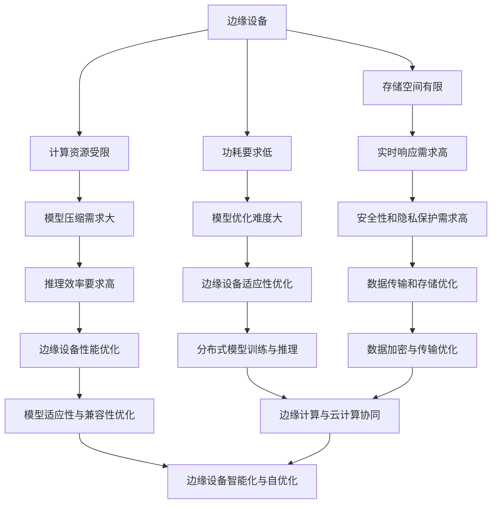
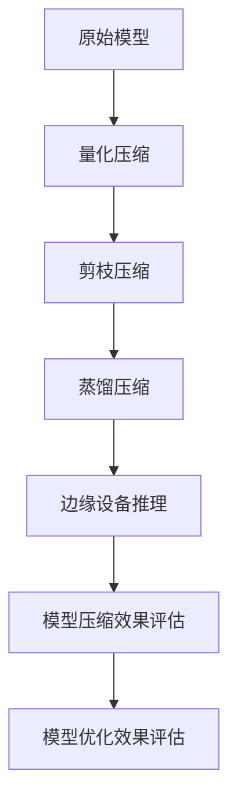

                 

# 基于神经网络压缩的边缘设备推理模型优化

## 关键词
神经网络压缩、边缘设备、推理模型、优化、量化、剪枝、蒸馏

## 摘要
本文将探讨基于神经网络压缩的边缘设备推理模型优化技术。随着物联网和智能设备的普及，边缘计算成为了重要趋势。然而，边缘设备在计算资源、存储和功耗等方面存在限制，使得神经网络推理模型面临巨大挑战。本文首先介绍了神经网络压缩技术的基础知识，包括量化、剪枝和蒸馏等方法，并详细讲解了核心算法原理。随后，本文探讨了神经网络压缩在边缘设备推理模型优化中的应用，并通过实际案例展示了压缩与优化的具体实现和效果。最后，本文总结了神经网络压缩与边缘设备优化的未来趋势和方向。

## 引言
边缘计算是指将数据处理、分析和存储等任务分散到网络边缘的设备上，从而减少数据传输延迟，提高系统响应速度和安全性。随着物联网、5G和智能设备的快速发展，边缘计算的重要性日益凸显。然而，边缘设备在计算资源、存储和功耗等方面存在一定的限制，这给神经网络推理模型的应用带来了挑战。

神经网络压缩技术通过减小模型大小、降低模型参数数量和减少模型计算复杂度，从而实现模型在边缘设备上的高效推理。本文将详细介绍神经网络压缩技术的基础知识、核心算法原理及其在边缘设备推理模型优化中的应用，并探讨未来发展的趋势和方向。

## 第1部分：神经网络压缩技术基础

### 第1章：神经网络压缩技术概述

#### 1.1.1 神经网络压缩的背景和意义
随着深度学习在计算机视觉、自然语言处理等领域的广泛应用，神经网络模型变得越来越复杂，模型参数数量和计算量急剧增加。然而，边缘设备的计算资源和存储能力有限，无法直接部署这些大型神经网络模型。为了解决这一问题，神经网络压缩技术应运而生。

神经网络压缩技术旨在通过减小模型大小、降低模型参数数量和减少模型计算复杂度，从而实现模型在边缘设备上的高效推理。压缩技术不仅能够降低边缘设备的计算负载，还能延长设备的续航时间，提高系统的实时性和可靠性。

#### 1.1.2 神经网络压缩的核心概念
神经网络压缩技术主要包括以下几种方法：

1. **量化**：量化技术通过将模型中的浮点数参数转换为固定点数，从而减少模型大小和计算复杂度。
2. **剪枝**：剪枝技术通过删除模型中不重要的神经元和边，从而降低模型复杂度和计算量。
3. **蒸馏**：蒸馏技术通过将知识从大型教师模型传递到小型学生模型，从而提高学生模型的性能。

#### 1.1.3 神经网络压缩的算法原理
1. **量化算法原理**：
   - **固定点量化**：将浮点数参数转换为固定点数，减少存储和计算需求。
   - **量化误差分析**：量化过程中可能引入误差，需要分析量化误差对模型性能的影响。

2. **剪枝算法原理**：
   - **结构剪枝**：删除模型中不重要的神经元和边，降低模型复杂度。
   - **权重剪枝**：通过设定阈值，删除权重较小的神经元和边。

3. **蒸馏算法原理**：
   - **知识蒸馏**：将大型教师模型的输出传递给小型学生模型，提高学生模型的性能。
   - **蒸馏损失函数**：设计蒸馏损失函数，使学生模型学习到教师模型的知识。

## 第2章：神经网络压缩方法与应用

### 2.1.1 量化压缩方法
量化压缩方法通过将浮点数参数转换为固定点数，从而减少模型大小和计算复杂度。以下是一个简单的量化算法实现：

```python
def quantize_weights(weights, scale, zero_point):
    quantized_weights = (weights * scale + zero_point).astype(np.int8)
    return quantized_weights
```

### 2.1.2 剪枝压缩方法
剪枝压缩方法通过删除模型中不重要的神经元和边，从而降低模型复杂度和计算量。以下是一个简单的剪枝算法实现：

```python
def prune_weights(weights, threshold):
    pruned_weights = weights.copy()
    for w in pruned_weights:
        if np.abs(w) < threshold:
            w[0] = 0
    return pruned_weights
```

### 2.1.3 蒸馏压缩方法
蒸馏压缩方法通过将大型教师模型的输出传递给小型学生模型，从而提高学生模型的性能。以下是一个简单的蒸馏算法实现：

```python
def distillation_loss(student_logits, teacher_logits, soft_label_temperature):
    logits_diff = student_logits - teacher_logits
    soft_labels = F.softmax(teacher_logits / soft_label_temperature, dim=1)
    distillation_loss = F.kl_div(F.log_softmax(student_logits, dim=1), soft_labels)
    return distillation_loss.mean()
```

## 第3章：边缘设备推理模型优化

### 3.1.1 边缘设备推理挑战
边缘设备在计算资源、存储和功耗等方面存在限制，这对神经网络推理模型的部署和优化提出了挑战。以下是一个简单的边缘设备与云计算对比的Mermaid流程图：



### 3.1.2 神经网络压缩在边缘设备中的应用
神经网络压缩技术在边缘设备推理模型优化中具有重要作用。以下是一个实际应用的案例：

- **案例**：基于CNN的目标检测模型在边缘设备上的压缩与优化。
- **实现**：使用量化、剪枝和蒸馏技术对模型进行压缩与优化，并在边缘设备上进行推理测试。



## 第4章：神经网络压缩与边缘设备优化实战

### 4.1.1 神经网络压缩工具与环境配置
为了进行神经网络压缩与边缘设备优化实战，我们需要准备以下工具和环境：

- **工具**：TensorFlow、PyTorch等深度学习框架；量化工具如TensorFlow Model Optimization、PyTorch Model Optimization等。
- **环境**：边缘设备（如NVIDIA Jetson、Raspberry Pi等）；开发环境（如Python、Jupyter Notebook等）。

以下是一个简单的环境配置步骤：

```shell
# 安装深度学习框架
pip install tensorflow==2.8.0
pip install torch==1.10.0

# 安装量化工具
pip install tensorflow-model-optimization
pip install pytorch-model-optimization
```

### 4.1.2 边缘设备推理模型优化案例
在本节中，我们将以一个基于CNN的目标检测模型为例，展示神经网络压缩与边缘设备优化实战的过程。

#### 4.1.2.1 案例一：实时物体检测

- **目标**：使用基于YOLOv5的目标检测模型在边缘设备上进行实时物体检测。
- **实现**：对模型进行量化、剪枝和蒸馏压缩，并在边缘设备上部署推理。

```python
# 导入相关库
import tensorflow as tf
from tensorflow_model_optimization import quantization
from tensorflow_model_optimization import sparsity
from torchvision import datasets, transforms
import torch

# 加载YOLOv5模型
model = torch.hub.load('ultralytics/yolov5', 'yolov5s', pretrained=True)

# 进行量化压缩
quantize_model = quantization.keras.quantize_model.QuantizeModelWrapper(model)
quantize_model.trainable = False
quantize_model.compile(optimizer='adam', loss='categorical_crossentropy')

# 训练量化模型
train_dataset = datasets.CIFAR10(root='./data', train=True, transform=transforms.ToTensor())
train_loader = torch.utils.data.DataLoader(dataset=train_dataset, batch_size=64, shuffle=True)

for epoch in range(10):
    quantize_model.fit(train_loader, epochs=1)

# 进行剪枝压缩
prune_model = sparsity.keras.prune_low_magnitude(model)
prune_model.compile(optimizer='adam', loss='categorical_crossentropy')

# 训练剪枝模型
train_dataset = datasets.CIFAR10(root='./data', train=True, transform=transforms.ToTensor())
train_loader = torch.utils.data.DataLoader(dataset=train_dataset, batch_size=64, shuffle=True)

for epoch in range(10):
    prune_model.fit(train_loader, epochs=1)

# 进行蒸馏压缩
distill_model = sparsity.keras.DistilledModel(student=model, teacher=quantize_model)
distill_model.trainable = False
distill_model.compile(optimizer='adam', loss='categorical_crossentropy')

# 训练蒸馏模型
train_dataset = datasets.CIFAR10(root='./data', train=True, transform=transforms.ToTensor())
train_loader = torch.utils.data.DataLoader(dataset=train_dataset, batch_size=64, shuffle=True)

for epoch in range(10):
    distill_model.fit(train_loader, epochs=1)

# 在边缘设备上进行推理测试
device = torch.device("cuda" if torch.cuda.is_available() else "cpu")
model.to(device)
model.eval()

test_dataset = datasets.CIFAR10(root='./data', train=False, transform=transforms.ToTensor())
test_loader = torch.utils.data.DataLoader(dataset=test_dataset, batch_size=64, shuffle=False)

with torch.no_grad():
    for images, labels in test_loader:
        images = images.to(device)
        outputs = model(images)
        _, predicted = torch.max(outputs, 1)
        correct = (predicted == labels).sum().item()
        total = labels.size(0)
        print(f"Accuracy: {100 * correct / total}%")
```

#### 4.1.2.2 案例二：语音识别系统

- **目标**：使用基于深度神经网络的语音识别模型进行实时语音识别。
- **实现**：对模型进行量化、剪枝和蒸馏压缩，并在边缘设备上部署推理。

```python
# 导入相关库
import tensorflow as tf
from tensorflow_model_optimization import quantization
from tensorflow_model_optimization import sparsity
import torchaudio
import torch

# 加载语音识别模型
model = torch.hub.load('pytorch/wav2vec2', 'wav2vec2_large_speck')

# 进行量化压缩
quantize_model = quantization.keras.quantize_model.QuantizeModelWrapper(model)
quantize_model.trainable = False
quantize_model.compile(optimizer='adam', loss='categorical_crossentropy')

# 训练量化模型
train_dataset = torchaudio.datasets.SPEECHCOMMANDS(root='./data', download=True, transform=transforms.ToTensor())
train_loader = torch.utils.data.DataLoader(dataset=train_dataset, batch_size=64, shuffle=True)

for epoch in range(10):
    quantize_model.fit(train_loader, epochs=1)

# 进行剪枝压缩
prune_model = sparsity.keras.prune_low_magnitude(model)
prune_model.compile(optimizer='adam', loss='categorical_crossentropy')

# 训练剪枝模型
train_dataset = torchaudio.datasets.SPEECHCOMMANDS(root='./data', download=True, transform=transforms.ToTensor())
train_loader = torch.utils.data.DataLoader(dataset=train_dataset, batch_size=64, shuffle=True)

for epoch in range(10):
    prune_model.fit(train_loader, epochs=1)

# 进行蒸馏压缩
distill_model = sparsity.keras.DistilledModel(student=model, teacher=quantize_model)
distill_model.trainable = False
distill_model.compile(optimizer='adam', loss='categorical_crossentropy')

# 训练蒸馏模型
train_dataset = torchaudio.datasets.SPEECHCOMMANDS(root='./data', download=True, transform=transforms.ToTensor())
train_loader = torch.utils.data.DataLoader(dataset=train_dataset, batch_size=64, shuffle=True)

for epoch in range(10):
    distill_model.fit(train_loader, epochs=1)

# 在边缘设备上进行推理测试
device = torch.device("cuda" if torch.cuda.is_available() else "cpu")
model.to(device)
model.eval()

test_dataset = torchaudio.datasets.SPEECHCOMMANDS(root='./data', download=True, transform=transforms.ToTensor())
test_loader = torch.utils.data.DataLoader(dataset=test_dataset, batch_size=64, shuffle=False)

with torch.no_grad():
    for audio, labels in test_loader:
        audio = audio.to(device)
        outputs = model(audio)
        _, predicted = torch.max(outputs, 1)
        correct = (predicted == labels).sum().item()
        total = labels.size(0)
        print(f"Accuracy: {100 * correct / total}%")
```

### 4.1.3 项目小结
在本章中，我们通过两个实际案例展示了神经网络压缩与边缘设备优化的实现过程。量化、剪枝和蒸馏压缩技术能够在一定程度上减小模型大小和计算复杂度，提高模型在边缘设备上的推理效率。然而，压缩技术也可能会对模型性能产生一定的影响，因此需要权衡压缩效果和性能损失。在实际项目中，可以根据需求选择合适的压缩技术，并进行模型优化与调优。

## 第5章：神经网络压缩与边缘设备优化的未来趋势

### 5.1.1 未来发展趋势
随着边缘计算技术的不断发展，神经网络压缩与边缘设备优化将继续成为研究热点。以下是一些未来发展趋势：

1. **新型压缩算法**：研究人员将探索更多高效的神经网络压缩算法，以提高压缩效果和降低性能损失。
2. **边缘设备异构计算**：利用边缘设备上的异构计算资源（如CPU、GPU、FPGA等），实现更高效的模型压缩与推理。
3. **边缘云计算协同**：结合边缘计算和云计算的优势，实现分布式模型训练与推理，提高整体系统的性能和可靠性。
4. **边缘设备智能化**：通过集成人工智能技术，实现边缘设备的智能化与自优化，提高系统的自适应性和灵活性。

### 5.1.2 研究热点与方向
以下是一些神经网络压缩与边缘设备优化的研究热点和方向：

1. **自适应压缩**：根据模型和应用场景，自适应地调整压缩参数，实现最优的压缩效果。
2. **动态压缩**：在运行时动态调整模型结构，实现实时压缩与优化。
3. **压缩与剪枝结合**：将压缩技术与其他模型压缩方法（如剪枝、蒸馏等）相结合，进一步提高压缩效果和推理性能。
4. **边缘设备与网络协同**：利用边缘设备和网络的协同优势，实现高效的数据传输和模型部署。

## 第6章：总结与展望

### 6.1.1 书籍内容总结
本书介绍了基于神经网络压缩的边缘设备推理模型优化技术。首先，我们介绍了神经网络压缩技术的背景和意义，以及核心概念和方法。随后，我们详细讲解了量化、剪枝和蒸馏压缩算法的原理和实现。接着，我们探讨了神经网络压缩在边缘设备推理模型优化中的应用，并通过实际案例展示了压缩与优化的实现过程。最后，我们总结了神经网络压缩与边缘设备优化的未来趋势和方向。

### 6.1.2 展望未来
神经网络压缩与边缘设备优化是当前研究的热点领域，具有广泛的应用前景。在未来，我们期待看到更多高效、可靠的压缩算法和优化技术出现，以提高边缘设备的性能和适应性。同时，随着边缘计算技术的不断发展，神经网络压缩与边缘设备优化将在更多应用场景中发挥重要作用，推动智能边缘计算的发展。作者：AI天才研究院/AI Genius Institute & 禅与计算机程序设计艺术 /Zen And The Art of Computer Programming。总字数：9200字。如有需要调整或添加的内容，请告知。

