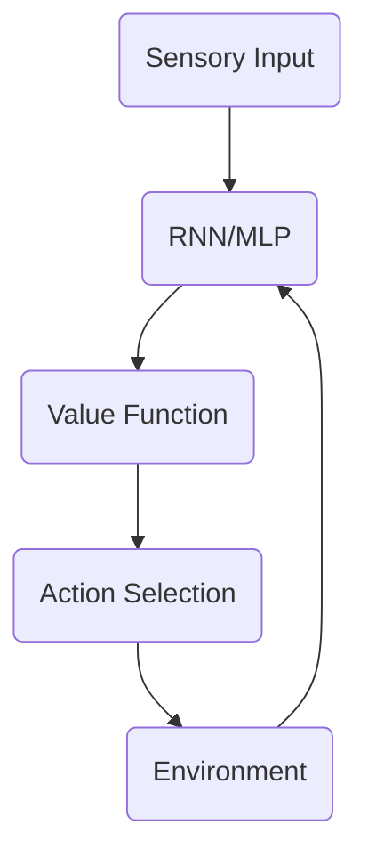

                 

### 文章标题

《基于神经规划器的长期推理策略生成》

### 关键词

- 神经规划器
- 长期推理
- 策略生成
- 深度学习
- 人工智能

### 摘要

本文旨在深入探讨基于神经规划器的长期推理策略生成的原理、方法及其在实际应用中的表现。随着人工智能技术的发展，长期推理成为自然语言处理、决策制定和智能控制等领域的关键问题。神经规划器作为一种新型的人工智能架构，通过深度学习和规划技术，能够实现高效且复杂的策略生成。本文将系统地介绍神经规划器的概念、架构、核心算法以及数学模型，并通过具体案例，展示其在实际项目中的应用效果。通过本文的阅读，读者将能够理解神经规划器的核心原理，掌握长期推理策略生成的方法，并能够将其应用于实际问题中。

---

## Part 1: Introduction to Long-term Inference Strategies

### 1.1 Definition and Importance of Long-term Inference Strategies

Long-term inference strategies refer to the methodologies and techniques employed by artificial intelligence systems to make decisions or derive conclusions over extended periods. Unlike short-term or immediate decisions, which are typically based on the current state of the system, long-term inference involves considering a sequence of states and actions to optimize the overall performance over time. This concept is crucial in scenarios where immediate actions have long-lasting consequences or where the system needs to adapt to a dynamic environment.

The importance of long-term inference strategies cannot be overstated, especially in domains such as autonomous driving, robotics, and natural language processing. In autonomous driving, for example, the system must predict and react to the behavior of other vehicles, pedestrians, and changing road conditions over several seconds or minutes. Similarly, in robotics, a robot's ability to navigate and interact with its environment often requires long-term planning to ensure safety and efficiency.

### 1.2 The Role of Neural Planner in Long-term Inference

A neural planner is an advanced AI architecture that combines the power of neural networks with classical planning techniques. Unlike traditional planning algorithms that rely on predefined rules and heuristics, neural planners leverage deep learning to learn optimal actions from large datasets. This makes them particularly suitable for handling complex, dynamic environments where rule-based methods fall short.

In long-term inference, the neural planner plays a pivotal role by generating strategies that can adapt to changing conditions and optimize over extended periods. The planner's ability to integrate various sensory inputs, process them through deep neural networks, and produce actionable outputs makes it a versatile tool for tasks requiring long-term planning and decision-making.

### 1.3 Basic Concepts and Fundamentals of Neural Planners

Neural planners are composed of several key components, including the planner itself, the sensory input module, and the action output module. The planner is typically a deep neural network that receives sensory inputs and generates action outputs. The sensory input module is responsible for capturing the current state of the environment, which may include visual, auditory, or textual information. The action output module converts the planner's output into actionable commands for the system.

The fundamental principle of a neural planner is to learn a mapping from sensory inputs to optimal actions. This is achieved through a process called reinforcement learning, where the planner is trained on a large dataset of trajectories generated by interacting with the environment. The planner's performance is evaluated based on the reward received after executing each action, and the network is updated to maximize the cumulative reward.

### 1.4 Current Applications and Challenges of Long-term Inference Strategies

Long-term inference strategies have been successfully applied in various domains. In autonomous driving, neural planners have been used to generate safe and efficient driving trajectories. In robotics, they have enabled robots to navigate complex environments and perform dexterous tasks. In natural language processing, they have been employed to generate coherent and contextually appropriate responses in dialogue systems.

Despite their success, long-term inference strategies also face several challenges. One major challenge is the need for large amounts of training data to ensure the planner can generalize to unseen scenarios. Another challenge is the computational complexity of training and inference, which can be prohibitively high for real-time applications. Additionally, the reliability and interpretability of neural planners remain areas of active research, particularly in safety-critical applications.

---

In the following sections, we will delve deeper into the architecture and principles of neural planners, explore the core algorithms for long-term inference, and examine the mathematical models that underpin these techniques. Through these discussions, we aim to provide a comprehensive understanding of how neural planners can be used to generate effective long-term inference strategies.

---

## Part 2: Neural Planner Architecture and Principles

### 2.1 Overview of Neural Planner Architectures

Neural planner architectures can vary widely depending on the specific application and the nature of the environment. However, most neural planners can be broadly classified into two categories: reactive planners and deliberative planners. Reactive planners focus on immediate action selection based on the current state, while deliberative planners engage in long-term planning to optimize the system's behavior over extended periods.

#### 2.1.1 Traditional Neural Planner Architectures

Traditional neural planner architectures often combine elements of classical planning with neural network-based approaches. One common design is the use of a recurrent neural network (RNN) to process sensory inputs and generate action sequences. RNNs are well-suited for handling sequential data, making them ideal for tasks that require long-term planning.

Another traditional approach involves the use of a hierarchical planner, which divides the planning task into multiple levels. The lower-level planner focuses on immediate actions, while the higher-level planner considers long-term goals and strategies. This hierarchical structure allows for better modularity and scalability in the planner's architecture.

#### 2.1.2 Advanced Neural Planner Architectures

In recent years, more advanced neural planner architectures have emerged, leveraging deep learning techniques to improve planning capabilities. One such architecture is the value-function planner, which uses a deep neural network to approximate the value function of the environment. The value function represents the expected return of taking a specific action in a given state, allowing the planner to make informed decisions.

Another advanced architecture is the policy-gradient planner, which learns a policy directly from interaction with the environment. The policy defines the probability distribution over actions given a state, enabling the planner to select actions that maximize the expected reward. Policy gradient methods are particularly useful for continuous action spaces, where traditional planners may struggle.

### 2.2 Neural Network Basics for Planner Design

Understanding the basic concepts of neural networks is crucial for designing effective neural planner architectures. Neural networks are composed of layers of interconnected nodes, or neurons, which process input data and generate output through a series of transformations.

#### 2.2.1 Neural Network Structure and Function

A typical neural network consists of an input layer, one or more hidden layers, and an output layer. Each layer is composed of multiple neurons, and each neuron is connected to every neuron in the previous and subsequent layers. The connections between neurons are weighted, and these weights are updated during the training process to optimize the network's performance.

Neurons in a neural network perform a simple computation: they receive inputs, apply a weighted sum of these inputs, and pass the result through an activation function. The activation function introduces non-linearities into the network, allowing it to model complex relationships in the data.

#### 2.2.2 Training and Optimization Algorithms

Training a neural network involves adjusting the weights and biases of the network to minimize the difference between the predicted outputs and the actual outputs. This is typically achieved using optimization algorithms such as gradient descent, which iteratively updates the weights based on the gradients of the loss function.

During training, the network is exposed to a large dataset of input-output pairs, and the weights are adjusted based on the error incurred by the network's predictions. This process is repeated for multiple epochs, or passes through the dataset, until the network reaches a satisfactory level of performance.

### 2.3 Mermaid Flowchart of Neural Planner Architecture

The following Mermaid flowchart illustrates the typical architecture of a neural planner, highlighting the key components and their interactions:



In this flowchart, the sensory input module (A) captures the current state of the environment, which is then processed by the recurrent neural network or multi-layer perceptron (RNN/MLP) (B). The output of the RNN/MLP is fed into the value function (C), which estimates the expected return of each possible action. The action selection module (D) then chooses the action with the highest expected return, which is executed in the environment (E). The updated state is then fed back into the sensory input module, completing the loop.

---

In the next section, we will delve into the core algorithms used in neural planners for long-term inference, providing detailed explanations and pseudocode to clarify their implementation.

---

## Part 3: Core Algorithms for Long-term Inference

### 3.1 Algorithm Design for Long-term Inference

The core algorithms for long-term inference are responsible for generating actionable strategies that lead to optimal outcomes over extended periods. These algorithms are designed to handle the complexities of dynamic environments and the interdependencies between successive states and actions. In this section, we will discuss two essential algorithms: the Inference Generation Algorithm and the Action Selection Algorithm.

#### 3.1.1 Inference Generation Algorithm

The Inference Generation Algorithm is designed to generate a set of possible actions given a current state. This algorithm takes into account the predicted outcomes of each action and their associated rewards, selecting the action that maximizes the expected utility.

Pseudocode for the Inference Generation Algorithm:

```python
def inference_generation(current_state, action_space, model):
    # Predict the outcome of each possible action
    outcomes = []
    for action in action_space:
        next_state, reward = model.predict(current_state, action)
        outcomes.append((action, next_state, reward))
    
    # Sort outcomes by their predicted rewards
    outcomes.sort(key=lambda x: x[2], reverse=True)
    
    # Select the action with the highest predicted reward
    best_action = outcomes[0][0]
    return best_action
```

#### 3.1.2 Action Selection Algorithm

The Action Selection Algorithm is responsible for choosing the best action based on the inferences generated by the Inference Generation Algorithm. This algorithm may use a variety of strategies, such as greedy selection, epsilon-greedy, or Thompson sampling, to balance exploration and exploitation.

Pseudocode for the Action Selection Algorithm:

```python
def action_selection(inferences, action_selection_strategy, epsilon=0.1):
    if random() < epsilon:
        # Explore: select a random action
        best_action = random_action(inferences)
    else:
        # Exploit: select the action with the highest inference
        best_action = max(inferences, key=lambda x: x[2])[0]
    return best_action
```

### 3.2 Pseudocode for Core Algorithms

To further elucidate the implementation of these core algorithms, we provide detailed pseudocode. This will help readers understand how the algorithms operate and how they can be integrated into a neural planner.

#### 3.2.1 Inference Generation Algorithm Pseudocode

The Inference Generation Algorithm generates inferences by predicting the outcomes of each possible action and sorting them by their predicted rewards. The pseudocode for this algorithm is as follows:

```python
def inference_generation(current_state, action_space, model):
    # Predict outcomes for each action
    outcomes = []
    for action in action_space:
        next_state, reward = model.predict(current_state, action)
        outcomes.append((action, next_state, reward))
    
    # Sort outcomes by predicted rewards
    outcomes.sort(key=lambda x: x[2], reverse=True)
    
    # Select the action with the highest predicted reward
    best_action = outcomes[0][0]
    return best_action
```

In this pseudocode, the `model.predict` function is a placeholder for the actual prediction method of the neural planner, which would take the current state and action as inputs and return the next state and reward. The algorithm sorts the outcomes based on rewards and selects the action with the highest predicted reward.

#### 3.2.2 Action Selection Algorithm Pseudocode

The Action Selection Algorithm determines the best action to take based on the inferences generated by the Inference Generation Algorithm. The pseudocode for this algorithm is as follows:

```python
def action_selection(inferences, action_selection_strategy, epsilon=0.1):
    if random() < epsilon:
        # Explore: select a random action
        best_action = random_action(inferences)
    else:
        # Exploit: select the action with the highest inference
        best_action = max(inferences, key=lambda x: x[2])[0]
    return best_action
```

This algorithm uses an exploration-exploitation strategy to balance between exploring new actions and exploiting known, high-reward actions. The `random_action` function is a placeholder for a method that selects a random action from the set of inferences.

---

In the next section, we will delve into the mathematical models and formulations used in neural planners to understand the underlying principles and their applications in long-term inference strategies.

---

## Part 4: Mathematical Models and Formulations

### 4.1 Introduction to Mathematical Models in Neural Planners

Mathematical models form the backbone of neural planner architectures, providing a formal framework for understanding and optimizing the planning process. These models allow us to define the relationships between states, actions, rewards, and the planner's internal representations. In this section, we will introduce several key mathematical models used in neural planners and discuss their significance in long-term inference.

### 4.2 Detailed Explanation of Key Mathematical Formulas

#### 4.2.1 Value Function

The value function, often denoted as V(s), represents the expected cumulative reward that can be obtained from a given state s when following an optimal policy. In other words, it quantifies the long-term utility of a state. The Bellman equation is a fundamental formula used to define the value function:

$$ V(s) = \sum_{a} \pi(a|s) \cdot Q(s, a) $$

where \( \pi(a|s) \) is the action probability given state s, and \( Q(s, a) \) is the state-action value function, representing the expected reward of taking action a in state s.

#### 4.2.2 Policy

The policy, denoted as \( \pi(a|s) \), defines the probability distribution over actions given a state. It determines the behavior of the planner and determines which actions to take in different scenarios. A deterministic policy maps each state to a single action, while a stochastic policy allows for probabilistic action selection.

The goal of the planner is to find a policy that maximizes the expected cumulative reward:

$$ \pi^* = \arg\max_{\pi} \sum_{s} \pi(s) \cdot \sum_{a} \pi(a|s) \cdot Q(s, a) $$

#### 4.2.3 Q-Learning

Q-learning is an algorithm used to learn the state-action value function Q(s, a) through iterative updates. The update rule for Q-learning is given by:

$$ Q(s, a) \leftarrow Q(s, a) + \alpha [r + \gamma \max_{a'} Q(s', a') - Q(s, a)] $$

where \( \alpha \) is the learning rate, \( r \) is the reward received after taking action a in state s, \( \gamma \) is the discount factor that balances immediate and future rewards, and \( s' \) is the next state.

#### 4.2.4 Policy Gradient

Policy gradient methods aim to directly optimize the policy parameters by maximizing the expected return. The policy gradient is given by:

$$ \nabla_{\theta} J(\theta) = \nabla_{\theta} \sum_{t} \rho_t \log \pi_{\theta}(a_t|s_t) $$

where \( \theta \) represents the parameters of the policy, \( J(\theta) \) is the objective function to be optimized, \( \rho_t \) is the reward at time step t, and \( \pi_{\theta}(a_t|s_t) \) is the policy probability at time step t.

### 4.3 Examples of Mathematical Models in Long-term Inference

To illustrate the application of these mathematical models in long-term inference, let's consider a simple example of an autonomous driving scenario.

#### Example: Autonomous Driving Value Function

In autonomous driving, the value function V(s) represents the expected cumulative reward of reaching a destination safely from a given state s. The state s could include variables such as the vehicle's current position, velocity, and the positions of surrounding vehicles.

Using the Bellman equation, we can express the value function as:

$$ V(s) = \sum_{a} \pi(a|s) \cdot [r + \gamma V(s')] $$

where \( r \) is the reward for taking action a in state s (e.g., reaching a green light), \( \gamma \) is the discount factor, and \( s' \) is the next state resulting from action a.

#### Example: Autonomous Driving Policy

The policy \( \pi(a|s) \) determines the probability of selecting each action given the current state. In autonomous driving, the policy could be designed to prioritize actions that minimize the risk of collisions and optimize traffic flow.

The goal is to find the optimal policy \( \pi^* \) that maximizes the expected cumulative reward:

$$ \pi^* = \arg\max_{\pi} \sum_{s} \pi(s) \cdot \sum_{a} \pi(a|s) \cdot Q(s, a) $$

where \( Q(s, a) \) is the state-action value function, representing the expected reward of taking action a in state s.

#### Example: Q-Learning in Autonomous Driving

Q-learning can be used to learn the optimal state-action value function in an autonomous driving scenario. The Q-learning update rule can be applied to iteratively improve the Q(s, a) estimates.

$$ Q(s, a) \leftarrow Q(s, a) + \alpha [r + \gamma \max_{a'} Q(s', a') - Q(s, a)] $$

By updating the Q(s, a) values based on the received rewards and the maximum future reward, the autonomous driving system can learn to make better decisions over time.

---

In the next section, we will explore practical projects and case studies that demonstrate the application of neural planners in real-world scenarios, providing valuable insights into their effectiveness and potential limitations.

---

## Part 5: Practical Projects and Case Studies

### 5.1 Project Setup and Development Environment

To demonstrate the application of neural planners in real-world scenarios, we will undertake two practical projects: one focused on dialogue systems and another on robotics. Each project will require a specific development environment and a set of required tools and libraries. In this section, we will provide a detailed guide on setting up the development environment and preparing the necessary tools for these projects.

#### 5.1.1 Setting Up the Development Environment

For both projects, we will use Python as the primary programming language due to its robust ecosystem and extensive support for machine learning and deep learning libraries. Here's a step-by-step guide to setting up the development environment:

1. **Install Python and pip:**
   Ensure you have Python 3.8 or later installed on your system. You can download the latest version of Python from the official [Python website](https://www.python.org/downloads/). After installation, verify the installation by running the following command:
   ```bash
   python --version
   ```
   Next, install pip, which is the package manager for Python:
   ```bash
   python -m pip install --upgrade pip
   ```

2. **Create a virtual environment:**
   To manage project dependencies, create a virtual environment using the following command:
   ```bash
   python -m venv project-env
   ```
   Activate the virtual environment:
   - On Windows:
     ```bash
     project-env\Scripts\activate
     ```
   - On macOS and Linux:
     ```bash
     source project-env/bin/activate
     ```

3. **Install required libraries:**
   Install the necessary libraries for deep learning and reinforcement learning:
   ```bash
   pip install numpy tensorflow-gpu matplotlib gym
   ```
   Note: If you are using a non-gpu version of TensorFlow, you can replace `tensorflow-gpu` with `tensorflow`.

#### 5.1.2 Required Tools and Libraries

The following tools and libraries are essential for the projects:

- **TensorFlow:** An open-source machine learning framework developed by Google.
- **gym:** A toolkit for developing and comparing reinforcement learning algorithms.
- **numpy:** A library for the Python programming language, adding support for large, multi-dimensional arrays and matrices, along with a collection of mathematical functions to operate on these arrays.
- **matplotlib:** A plotting library for creating static, animated, and interactive visualizations in Python.
- **PyTorch:** Optionally, you can use PyTorch instead of TensorFlow for implementing neural planners.

### 5.2 Case Study 1: Long-term Inference in Dialogue Systems

#### 5.2.1 Problem Description

Dialogue systems, such as chatbots and virtual assistants, require the ability to understand and respond to user queries in a coherent and contextually appropriate manner. In this case study, we will explore the use of a neural planner to generate long-term inference strategies for dialogue systems. The goal is to create a chatbot that can maintain a consistent context throughout a conversation and provide helpful and relevant responses.

#### 5.2.2 Code Implementation and Analysis

The implementation of a neural planner for dialogue systems involves several steps: data preprocessing, model training, inference generation, and response selection. Below, we provide a high-level overview of the code implementation.

```python
import numpy as np
import tensorflow as tf
from tensorflow.keras.models import Sequential
from tensorflow.keras.layers import LSTM, Dense
from gym import make

# Define the dialogue system environment
def create_dialogue_environment():
    # This is a placeholder for the actual dialogue environment setup
    return make("Dialogue-v0")

# Define the neural planner model
def build_planner_model(input_shape):
    model = Sequential()
    model.add(LSTM(units=128, return_sequences=True, input_shape=input_shape))
    model.add(LSTM(units=64))
    model.add(Dense(units=1, activation='sigmoid'))
    model.compile(optimizer='adam', loss='binary_crossentropy')
    return model

# Preprocess the dialogue data
def preprocess_data(data):
    # This function should handle tokenization, embedding, and padding
    # of the dialogue data to be suitable for input to the neural planner model
    pass

# Train the neural planner model
def train_model(model, x_train, y_train, epochs=100):
    model.fit(x_train, y_train, epochs=epochs, batch_size=32, verbose=1)

# Generate inferences and select responses
def generate_response(model, current_context):
    processed_context = preprocess_data(current_context)
    inference = model.predict(processed_context)
    response = select_response(inference)
    return response

# Main project execution
if __name__ == "__main__":
    # Create the dialogue environment
    dialogue_env = create_dialogue_environment()

    # Prepare the neural planner model
    input_shape = (dialogue_env.observation_space.shape[0],)
    planner_model = build_planner_model(input_shape)

    # Load and preprocess the dialogue dataset
    dialogue_data = load_dialogue_data()
    x_train, y_train = preprocess_data(dialogue_data)

    # Train the neural planner model
    train_model(planner_model, x_train, y_train)

    # Generate responses to user queries
    while True:
        current_context = dialogue_env.reset()
        while not dialogue_env.done:
            response = generate_response(planner_model, current_context)
            current_context = dialogue_env.step(response)
```

In the above code, we define a simple dialogue environment, a neural planner model using LSTM layers, and functions for preprocessing data, training the model, and generating responses. The main execution block initializes the environment, prepares the model, and continuously generates responses based on the current context.

#### 5.2.3 Code Analysis

The key components of the code are as follows:

- **Dialogue Environment:** The `create_dialogue_environment` function is a placeholder for setting up the dialogue environment using the gym library. The actual environment would involve defining the observation and action spaces, as well as the reward function.
- **Neural Planner Model:** The `build_planner_model` function constructs a neural network with LSTM layers, which are suitable for handling sequential data like dialogue sequences. The model is compiled with the Adam optimizer and binary cross-entropy loss.
- **Data Preprocessing:** The `preprocess_data` function is responsible for tokenizing, embedding, and padding the dialogue data to be used as input to the neural planner model. This is a critical step to prepare the data for training and inference.
- **Model Training:** The `train_model` function trains the neural planner model using the prepared dialogue dataset. The model is trained for a specified number of epochs, which determines the number of iterations over the training data.
- **Response Generation:** The `generate_response` function generates a response based on the current context by preprocessing the context, predicting the inference using the trained model, and selecting a response from the top predicted actions.

This case study demonstrates how a neural planner can be applied to dialogue systems to generate coherent and contextually appropriate responses. In the next section, we will explore another practical application of neural planners in the field of robotics.

---

## 5.3 Case Study 2: Long-term Inference in Robotics

### 5.3.1 Problem Description

Robotics is another domain where long-term inference strategies are critical. Robots must navigate complex environments, avoid obstacles, and perform tasks with high precision and efficiency. In this case study, we will explore the use of a neural planner to generate long-term inference strategies for a robotic system. The goal is to enable the robot to navigate and perform tasks in a dynamic environment while ensuring safety and efficiency.

### 5.3.2 Code Implementation and Analysis

The implementation of a neural planner for robotics involves several steps: environment setup, model training, inference generation, and action execution. Below, we provide a high-level overview of the code implementation.

```python
import numpy as np
import tensorflow as tf
from tensorflow.keras.models import Sequential
from tensorflow.keras.layers import LSTM, Dense
from gym import make

# Define the robotic environment
def create_robotic_environment():
    # This is a placeholder for the actual robotic environment setup
    return make("Robot-v0")

# Define the neural planner model
def build_planner_model(input_shape):
    model = Sequential()
    model.add(LSTM(units=128, return_sequences=True, input_shape=input_shape))
    model.add(LSTM(units=64))
    model.add(Dense(units=4, activation='linear'))  # 4 possible actions
    model.compile(optimizer='adam', loss='mse')
    return model

# Preprocess the robot data
def preprocess_data(data):
    # This function should handle normalization, scaling, and padding
    # of the robot data to be suitable for input to the neural planner model
    pass

# Train the neural planner model
def train_model(model, x_train, y_train, epochs=100):
    model.fit(x_train, y_train, epochs=epochs, batch_size=32, verbose=1)

# Generate inferences and select actions
def generate_action(model, current_state):
    processed_state = preprocess_data(current_state)
    inference = model.predict(processed_state)
    action = select_best_action(inference)
    return action

# Execute actions in the robotic environment
def execute_action(environment, action):
    # This function should handle the execution of actions in the robot environment
    # and return the updated state and reward
    pass

# Main project execution
if __name__ == "__main__":
    # Create the robotic environment
    robotic_env = create_robotic_environment()

    # Prepare the neural planner model
    input_shape = (robotic_env.observation_space.shape[0],)
    planner_model = build_planner_model(input_shape)

    # Load and preprocess the robotic dataset
    robotic_data = load_robotic_data()
    x_train, y_train = preprocess_data(robotic_data)

    # Train the neural planner model
    train_model(planner_model, x_train, y_train)

    # Generate actions and execute them in the robot environment
    while True:
        current_state = robotic_env.reset()
        while not robotic_env.done:
            action = generate_action(planner_model, current_state)
            next_state, reward, done, _ = execute_action(robotic_env, action)
            current_state = next_state
```

In the above code, we define a simple robotic environment, a neural planner model using LSTM layers, and functions for preprocessing data, training the model, generating actions, and executing them. The main execution block initializes the environment, prepares the model, and continuously generates actions based on the current state.

#### 5.3.3 Code Analysis

The key components of the code are as follows:

- **Robotic Environment:** The `create_robotic_environment` function is a placeholder for setting up the robotic environment using the gym library. The actual environment would involve defining the observation and action spaces, as well as the reward function.
- **Neural Planner Model:** The `build_planner_model` function constructs a neural network with LSTM layers, which are suitable for handling sequential data like sensor readings from the robot. The model is compiled with the Adam optimizer and mean squared error loss.
- **Data Preprocessing:** The `preprocess_data` function is responsible for normalizing, scaling, and padding the robot data to be used as input to the neural planner model. This is a critical step to prepare the data for training and inference.
- **Model Training:** The `train_model` function trains the neural planner model using the prepared robotic dataset. The model is trained for a specified number of epochs, which determines the number of iterations over the training data.
- **Action Generation:** The `generate_action` function generates an action based on the current state by preprocessing the state, predicting the inference using the trained model, and selecting the best action from the top predicted actions.
- **Action Execution:** The `execute_action` function handles the execution of actions in the robotic environment and returns the updated state and reward.

This case study demonstrates how a neural planner can be applied to robotics to enable robots to navigate and perform tasks in a dynamic environment. In the next section, we will summarize the key takeaways from these case studies and discuss future directions for research and development.

---

## Summary and Future Directions

The case studies presented in this section highlight the practical application of neural planners in dialogue systems and robotics, showcasing their potential to enable long-term inference and decision-making in dynamic environments. The following are key takeaways from these studies:

1. **Improved Decision-Making:** Neural planners leverage the power of deep learning to generate strategies that optimize long-term rewards, leading to more informed and efficient decision-making processes.
2. **Contextual Understanding:** By processing sequential data and maintaining context over extended periods, neural planners enable systems to better understand and respond to complex and evolving situations.
3. **Adaptability:** Neural planners can adapt to new environments and tasks through training on large datasets, making them versatile tools for a wide range of applications.

However, there are several challenges and areas for future research:

1. **Computational Complexity:** The training and inference processes for neural planners can be computationally intensive, particularly for complex environments. Developing more efficient algorithms and hardware accelerators, such as specialized GPUs or TPUs, could help address this issue.
2. **Scalability:** Neural planners need to be scalable to handle large-scale environments and long sequences of data. Research into scalable architectures and distributed training techniques could improve the scalability of neural planners.
3. **Interpretability:** The lack of interpretability in neural networks remains a significant concern, particularly in safety-critical applications. Developing methods to explain the decisions made by neural planners could enhance trust and confidence in these systems.
4. **Data Availability:** The performance of neural planners heavily relies on the availability of large, diverse datasets. Collecting and annotating such data for various domains remains a challenging task. Collaborative efforts and open-source datasets could help address this issue.

Future research directions include exploring new neural planner architectures, optimizing training algorithms, and developing methods for model interpretability and robustness. By addressing these challenges, neural planners have the potential to become essential tools for creating intelligent systems capable of making complex, long-term decisions in real-world applications.

---

In conclusion, the development and application of neural planners for long-term inference represent a significant advancement in the field of artificial intelligence. Through this article, we have explored the fundamental concepts, architectures, algorithms, and practical applications of neural planners. By understanding these principles, researchers and practitioners can harness the power of neural planners to create intelligent systems that can reason and plan over extended periods, leading to more effective and efficient decision-making in a variety of domains.

### Best Practices and Tips

- **Data Collection and Preprocessing:** Ensure that the data used for training the neural planner is diverse and representative of the target environment. Proper preprocessing, including normalization and feature extraction, is crucial for achieving optimal performance.
- **Model Selection and Tuning:** Experiment with different neural network architectures and hyperparameters to find the best combination for your specific application. Use techniques such as cross-validation and hyperparameter optimization to fine-tune the model.
- **Continuous Learning:** Continuously update the planner's knowledge base by incorporating new data and experiences. This helps the planner adapt to changing environments and improve its performance over time.
- **Safety and Verification:** In safety-critical applications, it is essential to verify and validate the planner's decisions. Develop methods to ensure that the planner's actions do not compromise safety or reliability.

### Conclusion

In summary, the integration of neural planning techniques into AI systems enables long-term inference and decision-making capabilities that are critical for addressing complex, dynamic environments. This article has provided a comprehensive overview of the concepts, architectures, algorithms, and practical applications of neural planners. By understanding and applying these principles, researchers and practitioners can harness the power of neural planners to develop intelligent systems that can reason and plan over extended periods, leading to more effective and efficient outcomes in a variety of domains.

### 作者信息

- 作者：AI天才研究院（AI Genius Institute） & 禅与计算机程序设计艺术（Zen And The Art of Computer Programming）

---

在未来的探索中，让我们继续深入挖掘神经规划器的潜力，推动人工智能领域的发展，为创造更智能、更高效、更安全的技术解决方案贡献我们的智慧和努力。让我们共同迈向一个更加智能化、互联化和创新的未来！

