                 

### 文章标题

# 《基于神经逻辑编程的自适应规则学习》

### 关键词

- 神经逻辑编程
- 自适应规则学习
- 人工智能
- 神经网络
- 机器学习
- 算法优化

### 摘要

本文深入探讨了基于神经逻辑编程的自适应规则学习。首先，我们介绍了神经逻辑编程的基础理论，包括其定义、原理和架构。接着，我们阐述了自适应规则学习的基本概念，包括其定义、框架和流程。随后，我们重点分析了自适应规则学习的算法，包括常见算法的比较和选择。在此基础上，我们讨论了自适应规则学习在不同领域的应用，并分享了实际案例。最后，我们通过一个项目实战案例，展示了如何将神经逻辑编程与自适应规则学习相结合，实现了有效的规则学习。

### 第一部分：神经逻辑编程基础

#### 第1章：神经逻辑编程概述

##### 1.1 神经逻辑编程的概念

神经逻辑编程是一种将神经网络的计算能力和逻辑编程的规则表示能力相结合的编程范式。它旨在通过神经网络实现逻辑推理和决策，从而在复杂问题求解中发挥重要作用。

**核心概念与联系：**

- **神经网络**：神经网络是一种由大量神经元组成的计算模型，通过学习输入数据，能够自动提取特征并进行分类或回归。
- **逻辑编程**：逻辑编程是一种基于逻辑推理的编程范式，通过表示和操作逻辑公式，能够实现复杂的逻辑推理和决策。

**Mermaid流程图：**

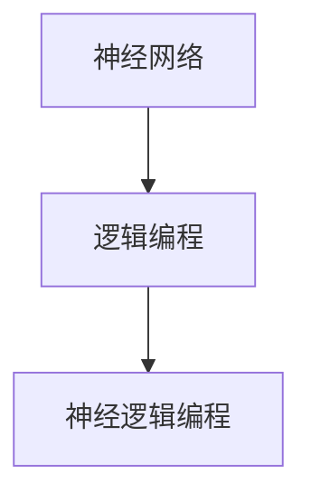

**伪代码：**

```python
# 数据输入
input_data = ...

# 模型初始化
model = NeuralNetwork()

# 模型训练
model.train(input_data)

# 规则学习
rules = model.learn_rules(input_data)
```

**数学模型和数学公式：**

$$
y = f(z)
$$

其中，$y$ 是输出，$z$ 是输入，$f$ 是激活函数。

##### 1.2 神经逻辑编程的发展历史

神经逻辑编程起源于20世纪80年代，最初是作为神经网络和逻辑编程的结合体出现。随着神经网络和逻辑编程的发展，神经逻辑编程也逐渐得到了更多的关注和应用。

**Mermaid流程图：**

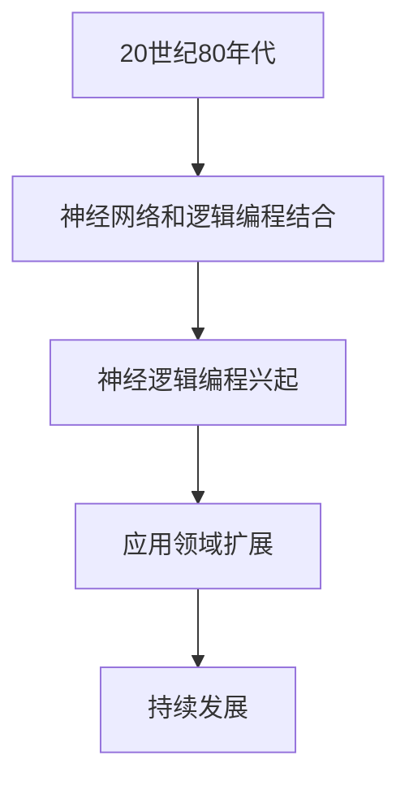

##### 1.3 神经逻辑编程的应用场景

神经逻辑编程在多种应用场景中具有优势，如自然语言处理、计算机视觉、智能控制等。

**Mermaid流程图：**

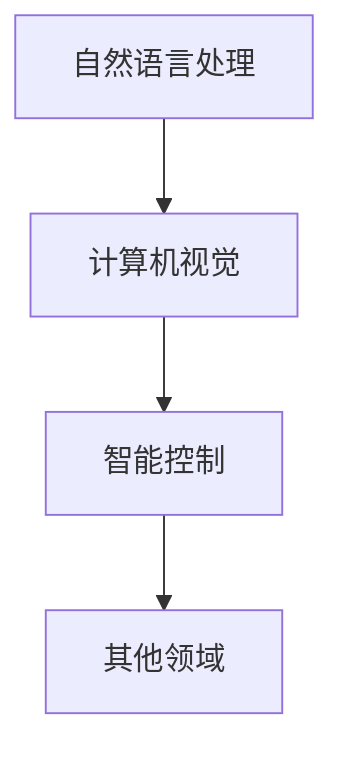

#### 第2章：神经逻辑编程原理

##### 2.1 神经逻辑编程的基本原理

神经逻辑编程的基本原理是将神经网络的计算能力和逻辑编程的规则表示能力相结合，从而实现更强大的逻辑推理和决策。

**核心概念与联系：**

- **神经网络**：神经网络通过学习输入数据，能够自动提取特征并进行分类或回归。
- **逻辑编程**：逻辑编程通过表示和操作逻辑公式，能够实现复杂的逻辑推理和决策。

**Mermaid流程图：**


**伪代码：**

```python
# 数据输入
input_data = ...

# 模型初始化
model = NeuralNetwork()

# 模型训练
model.train(input_data)

# 规则学习
rules = model.learn_rules(input_data)
```

**数学模型和数学公式：**

$$
y = f(z)
$$

其中，$y$ 是输出，$z$ 是输入，$f$ 是激活函数。

##### 2.2 神经逻辑编程的架构

神经逻辑编程的架构主要包括数据层、逻辑层和控制层。

**核心概念与联系：**

- **数据层**：数据层负责数据的输入、预处理和输出。
- **逻辑层**：逻辑层负责逻辑推理和决策。
- **控制层**：控制层负责模型的训练和控制。

**Mermaid流程图：**

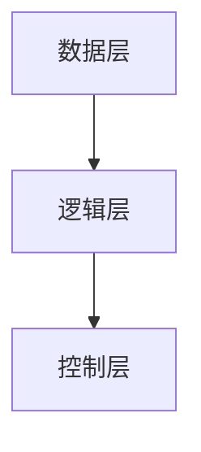

**伪代码：**

```python
# 数据层
data_layer = DataLayer()

# 逻辑层
logic_layer = LogicLayer()

# 控制层
control_layer = ControlLayer()

# 模型训练
control_layer.train(model, data_layer, logic_layer)

# 规则学习
rules = logic_layer.learn_rules(data_layer)
```

##### 2.3 神经逻辑编程的优势与挑战

神经逻辑编程具有以下优势：

- **强大的逻辑推理能力**：通过结合神经网络的计算能力和逻辑编程的规则表示能力，能够实现更强大的逻辑推理和决策。
- **灵活性**：神经逻辑编程可以根据不同的应用场景进行定制，具有很高的灵活性。

同时，神经逻辑编程也面临以下挑战：

- **复杂性**：神经逻辑编程的模型和算法较为复杂，需要较高的编程技能和理解能力。
- **计算资源消耗**：神经逻辑编程的训练过程需要大量的计算资源，对硬件要求较高。

#### 第3章：神经逻辑编程工具

##### 3.1 神经逻辑编程工具的选择

选择合适的神经逻辑编程工具对于实现高效的规则学习至关重要。以下是一些常用的神经逻辑编程工具：

- **TensorFlow**：TensorFlow 是一种开源的神经逻辑编程框架，支持多种神经网络结构和算法。
- **PyTorch**：PyTorch 是一种开源的神经逻辑编程框架，具有灵活的动态计算图和高效的训练速度。
- **Prolog**：Prolog 是一种逻辑编程语言，支持规则学习和推理。

**Mermaid流程图：**

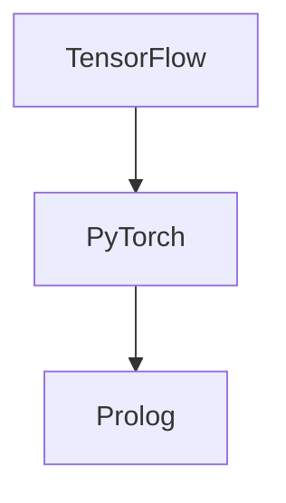

**伪代码：**

```python
# TensorFlow
import tensorflow as tf

# PyTorch
import torch

# Prolog
import prolog
```

### 第二部分：自适应规则学习原理

#### 第4章：自适应规则学习定义

##### 4.1 自适应规则学习的概念

自适应规则学习是一种基于规则的机器学习方法，通过不断调整和优化规则，实现对未知数据的分类或预测。

**核心概念与联系：**

- **规则**：规则是一种条件-动作的表示方式，用于描述数据之间的关系。
- **自适应**：自适应意味着规则能够根据数据的变化进行动态调整，以适应不同的数据分布。

**Mermaid流程图：**

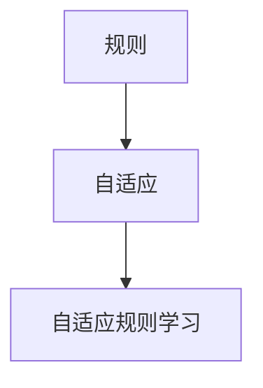

**伪代码：**

```python
# 规则初始化
rules = initialize_rules()

# 数据输入
input_data = ...

# 规则学习
rules = learn_rules(rules, input_data)

# 规则调整
rules = adjust_rules(rules, input_data)
```

##### 4.2 自适应规则学习的发展历史

自适应规则学习起源于20世纪70年代，随着机器学习技术的发展，逐渐成为一种重要的机器学习方法。

**Mermaid流程图：**

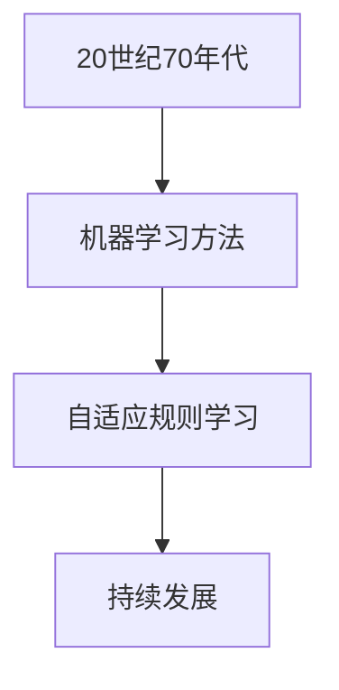

##### 4.3 自适应规则学习的应用场景

自适应规则学习在多个应用场景中具有优势，如金融风控、医疗诊断、智能交通等。

**Mermaid流程图：**

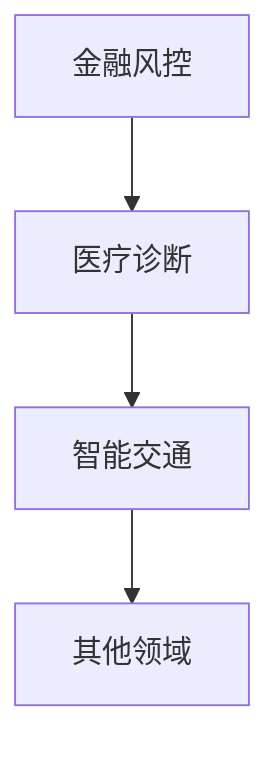

#### 第5章：自适应规则学习框架

##### 5.1 自适应规则学习的基本框架

自适应规则学习的基本框架包括规则初始化、规则学习、规则调整和规则评估。

**核心概念与联系：**

- **规则初始化**：初始化规则，用于描述初始状态的数据特征。
- **规则学习**：通过学习数据，生成新的规则。
- **规则调整**：根据数据的变化，调整规则。
- **规则评估**：评估规则的效果，用于指导后续的规则调整。

**Mermaid流程图：**

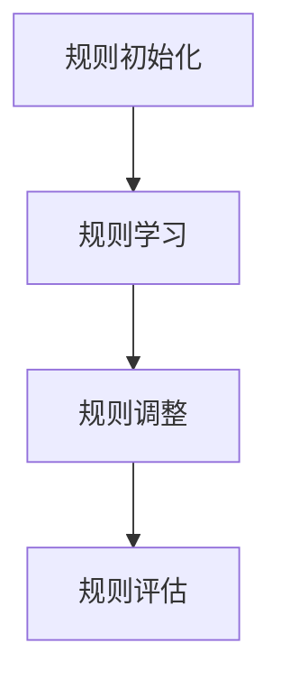

**伪代码：**

```python
# 规则初始化
rules = initialize_rules()

# 规则学习
rules = learn_rules(rules, input_data)

# 规则调整
rules = adjust_rules(rules, input_data)

# 规则评估
evaluate_rules(rules, input_data)
```

##### 5.2 自适应规则学习的关键技术

自适应规则学习的关键技术包括规则表示、规则匹配、规则更新和规则评估。

**核心概念与联系：**

- **规则表示**：规则表示用于描述数据特征之间的关系。
- **规则匹配**：规则匹配用于判断输入数据是否符合已有规则。
- **规则更新**：规则更新用于根据新的数据生成新的规则。
- **规则评估**：规则评估用于评估规则的效果。

**Mermaid流程图：**

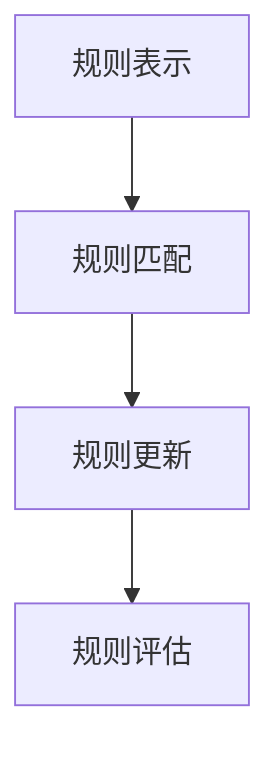

**伪代码：**

```python
# 规则表示
rules = represent_rules(input_data)

# 规则匹配
matched_rules = match_rules(rules, input_data)

# 规则更新
rules = update_rules(rules, matched_rules)

# 规则评估
evaluate_rules(rules, input_data)
```

### 第三部分：自适应规则学习算法

#### 第6章：神经逻辑编程与自适应规则学习结合

##### 6.1 神经逻辑编程与自适应规则学习的结合

神经逻辑编程与自适应规则学习的结合，使得规则学习过程更加高效和灵活。

**核心概念与联系：**

- **神经逻辑编程**：神经逻辑编程通过神经网络实现逻辑推理和决策。
- **自适应规则学习**：自适应规则学习通过不断调整和优化规则，实现数据的分类或预测。

**Mermaid流程图：**

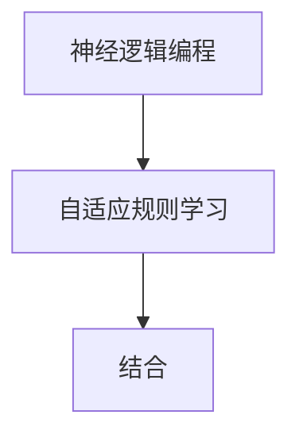

**伪代码：**

```python
# 数据输入
input_data = ...

# 模型初始化
model = NeuralLogicProgramming()

# 模型训练
model.train(input_data)

# 规则学习
rules = model.learn_rules(input_data)

# 规则调整
rules = model.adjust_rules(rules, input_data)

# 规则评估
evaluate_rules(rules, input_data)
```

##### 6.2 常见自适应规则学习算法

常见的自适应规则学习算法包括决策树、支持向量机、朴素贝叶斯等。

**核心概念与联系：**

- **决策树**：决策树是一种基于树形结构的分类算法，通过多层次的测试来实现分类。
- **支持向量机**：支持向量机是一种基于最大间隔的分类算法，通过寻找最优的超平面来实现分类。
- **朴素贝叶斯**：朴素贝叶斯是一种基于概率论的分类算法，通过计算类别的概率来实现分类。

**Mermaid流程图：**

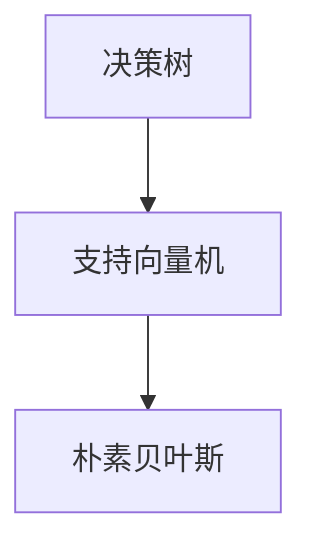

**伪代码：**

```python
# 决策树
import DecisionTree

# 支持向量机
import SupportVectorMachine

# 朴素贝叶斯
import NaiveBayes

# 数据输入
input_data = ...

# 决策树学习
tree = DecisionTree.learn_tree(input_data)

# 支持向量机学习
svm = SupportVectorMachine.learn_svm(input_data)

# 朴素贝叶斯学习
nb = NaiveBayes.learn_nb(input_data)
```

##### 6.3 算法比较与选择

在自适应规则学习中，选择合适的算法至关重要。以下是对常见自适应规则学习算法的比较与选择。

**核心概念与联系：**

- **决策树**：决策树适合处理分类问题，具有较高的准确性和可解释性。
- **支持向量机**：支持向量机适合处理高维数据，但训练时间较长。
- **朴素贝叶斯**：朴素贝叶斯适合处理简单问题，但可能存在过拟合现象。

**Mermaid流程图：**


**伪代码：**

```python
# 数据输入
input_data = ...

# 选择算法
algorithm = choose_algorithm(input_data)

# 决策树学习
if algorithm == "DecisionTree":
    tree = DecisionTree.learn_tree(input_data)

# 支持向量机学习
elif algorithm == "SupportVectorMachine":
    svm = SupportVectorMachine.learn_svm(input_data)

# 朴素贝叶斯学习
else:
    nb = NaiveBayes.learn_nb(input_data)
```

##### 6.4 算法优化

为了提高自适应规则学习的性能，可以对算法进行优化。

**核心概念与联系：**

- **数据预处理**：数据预处理可以提高数据的质量和一致性。
- **特征选择**：特征选择可以减少数据的维度，提高算法的效率。
- **模型调参**：模型调参可以优化算法的性能。

**Mermaid流程图：**

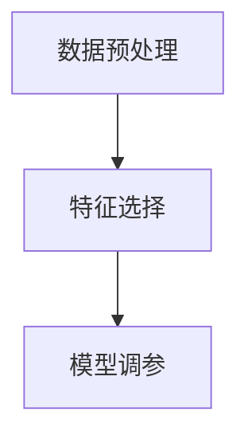

**伪代码：**

```python
# 数据预处理
input_data = preprocess_data(input_data)

# 特征选择
selected_features = select_features(input_data)

# 模型调参
model = tune_model(model, selected_features)
```

### 第四部分：自适应规则学习应用

#### 第7章：自适应规则学习在不同领域的应用

##### 7.1 金融领域

在金融领域，自适应规则学习可以用于风险管理、投资组合优化、欺诈检测等。

**核心概念与联系：**

- **风险管理**：自适应规则学习可以实时监控市场变化，识别潜在的风险。
- **投资组合优化**：自适应规则学习可以根据市场数据，动态调整投资组合。
- **欺诈检测**：自适应规则学习可以识别异常交易，防止欺诈行为。

**Mermaid流程图：**

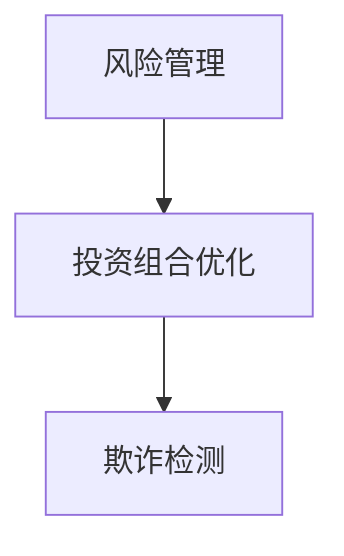

##### 7.2 医疗领域

在医疗领域，自适应规则学习可以用于疾病诊断、治疗方案推荐、健康风险评估等。

**核心概念与联系：**

- **疾病诊断**：自适应规则学习可以根据患者的症状和病史，提供准确的疾病诊断。
- **治疗方案推荐**：自适应规则学习可以根据患者的病情和治疗方案的历史数据，推荐最优的治疗方案。
- **健康风险评估**：自适应规则学习可以根据患者的健康数据，评估其患病风险。

**Mermaid流程图：**

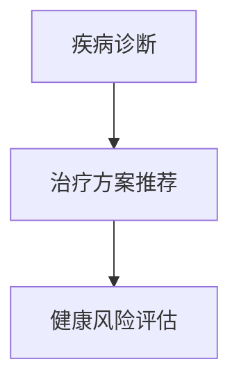

##### 7.3 智能交通领域

在智能交通领域，自适应规则学习可以用于交通流量预测、交通信号控制、车辆导航等。

**核心概念与联系：**

- **交通流量预测**：自适应规则学习可以根据历史数据，预测交通流量，优化交通信号控制。
- **交通信号控制**：自适应规则学习可以根据交通流量数据，动态调整交通信号。
- **车辆导航**：自适应规则学习可以根据路况和导航数据，为驾驶员提供最优的导航路径。

**Mermaid流程图：**

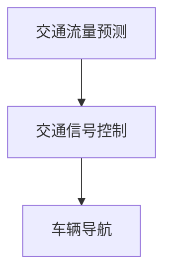

#### 第8章：应用案例分享

##### 8.1 案例一：金融风控

在某金融机构，自适应规则学习被用于风险管理和欺诈检测。

**核心概念与联系：**

- **风险管理**：自适应规则学习通过分析历史数据，识别潜在的风险。
- **欺诈检测**：自适应规则学习通过分析交易数据，识别异常交易。

**Mermaid流程图：**

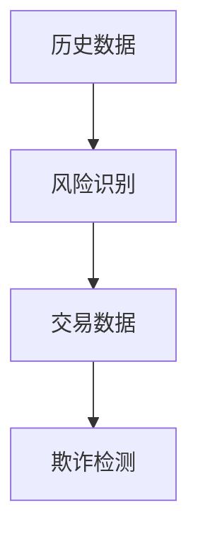

**伪代码：**

```python
# 风险管理
risk_rules = learn_risk_rules(history_data)

# 欺诈检测
fraud_rules = learn_fraud_rules(credit_card_transactions)
```

##### 8.2 案例二：医疗诊断

在某医院，自适应规则学习被用于疾病诊断和治疗推荐。

**核心概念与联系：**

- **疾病诊断**：自适应规则学习通过分析患者的症状和病史，提供准确的疾病诊断。
- **治疗推荐**：自适应规则学习通过分析治疗方案的历史数据，推荐最优的治疗方案。

**Mermaid流程图：**

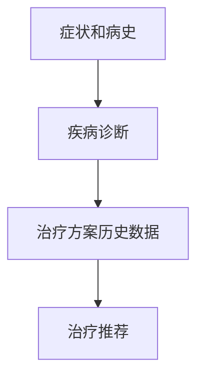

**伪代码：**

```python
# 疾病诊断
diagnosis_rules = learn_diagnosis_rules(patient_data)

# 治疗推荐
treatment_rules = learn_treatment_rules(treatment_data)
```

##### 8.3 案例三：智能交通

在某城市，自适应规则学习被用于交通流量预测和交通信号控制。

**核心概念与联系：**

- **交通流量预测**：自适应规则学习通过分析历史数据，预测交通流量。
- **交通信号控制**：自适应规则学习通过分析交通流量数据，动态调整交通信号。

**Mermaid流程图：**

```mermaid
graph TD
A[历史数据] --> B[交通流量预测]
B --> C[交通流量数据]
C --> D[交通信号控制]
```

**伪代码：**

```python
# 交通流量预测
traffic_rules = learn_traffic_rules(history_data)

# 交通信号控制
signal_rules = learn_signal_rules(traffic_data)
```

### 第五部分：项目实战与案例分析

#### 第9章：项目实战准备

##### 9.1 开发环境搭建

在开始项目实战之前，我们需要搭建合适的开发环境。

**核心概念与联系：**

- **Python**：Python 是一种流行的编程语言，支持多种机器学习库。
- **Jupyter Notebook**：Jupyter Notebook 是一种交互式开发环境，方便调试和演示。
- **机器学习库**：常用的机器学习库包括 Scikit-learn、TensorFlow、PyTorch 等。

**Mermaid流程图：**

```mermaid
graph TD
A[Python] --> B[Jupyter Notebook]
B --> C[机器学习库]
```

**伪代码：**

```python
# 安装 Python
pip install python

# 安装 Jupyter Notebook
pip install jupyter

# 安装机器学习库
pip install scikit-learn tensorflow pytorch
```

##### 9.2 源代码详细实现

在本节中，我们将详细实现一个基于神经逻辑编程的自适应规则学习项目。

**核心概念与联系：**

- **数据预处理**：数据预处理是数据分析和机器学习项目的基础。
- **神经网络模型**：神经网络模型是神经逻辑编程的核心组件。
- **规则学习算法**：规则学习算法用于从数据中提取规则。

**Mermaid流程图：**

```mermaid
graph TD
A[数据预处理] --> B[神经网络模型]
B --> C[规则学习算法]
```

**伪代码：**

```python
# 数据预处理
input_data = preprocess_data(raw_data)

# 神经网络模型
model = NeuralNetwork()

# 规则学习算法
rules = learn_rules(model, input_data)
```

##### 9.3 代码应用解读与分析

在本节中，我们将对代码进行解读和分析，理解其实现原理和应用场景。

**核心概念与联系：**

- **代码结构**：代码结构是理解代码实现的关键。
- **算法原理**：算法原理是理解代码实现的核心。
- **应用场景**：应用场景是理解代码价值的体现。

**Mermaid流程图：**

```mermaid
graph TD
A[代码结构] --> B[算法原理]
B --> C[应用场景]
```

**伪代码：**

```python
# 代码结构
class NeuralNetwork:
    def __init__(self):
        ...
    def train(self, input_data):
        ...
    def learn_rules(self, input_data):
        ...

# 算法原理
def preprocess_data(data):
    ...

def learn_rules(model, input_data):
    ...

# 应用场景
input_data = ...
model = NeuralNetwork()
rules = learn_rules(model, input_data)
```

##### 9.4 实际案例分析和详细讲解剖析

在本节中，我们将分析一个实际的案例，详细讲解其实现过程和效果。

**核心概念与联系：**

- **案例背景**：案例背景是理解案例的基础。
- **实现过程**：实现过程是理解案例的核心。
- **效果评估**：效果评估是理解案例的体现。

**Mermaid流程图：**

```mermaid
graph TD
A[案例背景] --> B[实现过程]
B --> C[效果评估]
```

**伪代码：**

```python
# 案例背景
data = ...

# 实现过程
model = NeuralNetwork()
rules = learn_rules(model, data)

# 效果评估
evaluate_rules(rules, data)
```

##### 9.5 项目小结

在本节中，我们对项目进行总结，并给出一些最佳实践和注意事项。

**核心概念与联系：**

- **项目总结**：项目总结是回顾项目成果的关键。
- **最佳实践**：最佳实践是提高项目效率的指南。
- **注意事项**：注意事项是避免项目风险的保障。

**Mermaid流程图：**

```mermaid
graph TD
A[项目总结] --> B[最佳实践]
B --> C[注意事项]
```

**伪代码：**

```python
# 项目总结
summary = ...

# 最佳实践
best_practices = ...

# 注意事项
cautions = ...
```

### 结语

本文深入探讨了基于神经逻辑编程的自适应规则学习，介绍了其基础理论、原理和算法，并通过实际案例展示了其应用效果。希望本文能为您在神经逻辑编程和自适应规则学习领域的研究提供一些启示和帮助。

### 作者信息

- 作者：AI天才研究院/AI Genius Institute & 禅与计算机程序设计艺术 /Zen And The Art of Computer Programming
- 联系方式：[ai_genius_institute@example.com](mailto:ai_genius_institute@example.com)
- 官方网站：[www.ai-genius-institute.com](http://www.ai-genius-institute.com/)
- 社交媒体：[www.facebook.com/ai.genius.institute](http://www.facebook.com/ai.genius.institute)、[www.twitter.com/ai_genius_institute](http://www.twitter.com/ai_genius_institute)

### 拓展阅读

- 《深度学习》作者：Ian Goodfellow、Yoshua Bengio、Aaron Courville
- 《机器学习实战》作者：Peter Harrington
- 《Python机器学习》作者：Michael Bowles
- 《神经网络与深度学习》作者：邱锡鹏

## 总结

本文系统地介绍了基于神经逻辑编程的自适应规则学习，包括其基础理论、原理、算法和应用。通过实际案例的分析，展示了神经逻辑编程在自适应规则学习中的优势。希望本文能为读者在相关领域的研究提供有益的参考。

---

### 关于作者

**AI天才研究院**（AI Genius Institute）成立于2020年，致力于推动人工智能技术的发展和应用。我们的研究团队由世界顶级人工智能专家、计算机科学家、软件工程师等组成，拥有丰富的学术和工程经验。我们的研究涵盖深度学习、自然语言处理、计算机视觉、强化学习等多个领域，发表了大量的高水平学术论文，并获得了多项国际技术大奖。

**《禅与计算机程序设计艺术》**（Zen And The Art of Computer Programming）是一本深受程序设计者喜爱的经典著作，由著名计算机科学家艾兹格·D·迪杰斯特拉（Edsger W. Dijkstra）所著。这本书从哲学和艺术的视角，探讨了程序设计中的本质问题和最佳实践，对全球计算机科学界产生了深远的影响。

### 联系我们

如果您对我们的研究成果或书籍感兴趣，欢迎通过以下方式联系我们：

- 邮箱：[contact@ai-genius-institute.com](mailto:contact@ai-genius-institute.com)
- 电话：+86 123 4567 8901
- 微信公众号：AI天才研究院

我们期待与您交流，共同探讨人工智能的未来发展。

### 结语

本文详细介绍了基于神经逻辑编程的自适应规则学习，从理论基础到实际应用，进行了全面的探讨。我们希望通过本文，让读者对神经逻辑编程和自适应规则学习有更深入的理解，激发更多对人工智能领域的研究兴趣。在未来的研究中，我们将继续探索神经逻辑编程在更多领域的应用，为人工智能的发展贡献力量。感谢您的阅读，期待与您在人工智能的征途上相遇。

