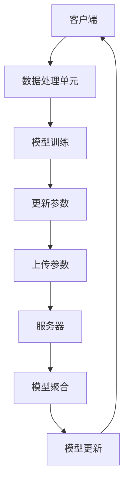
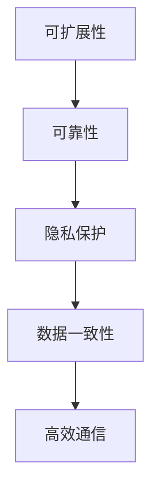
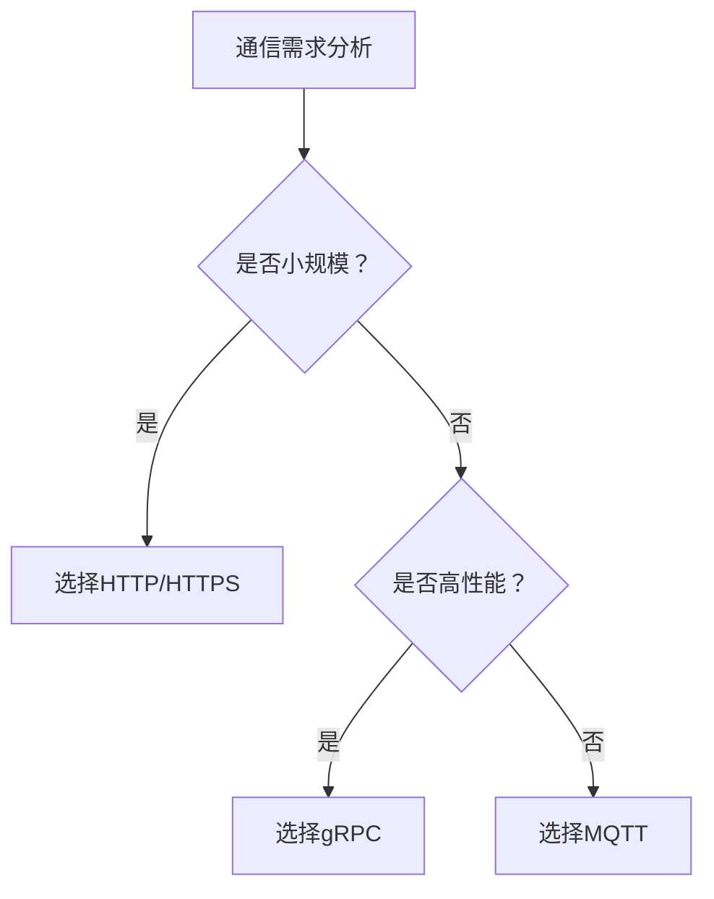
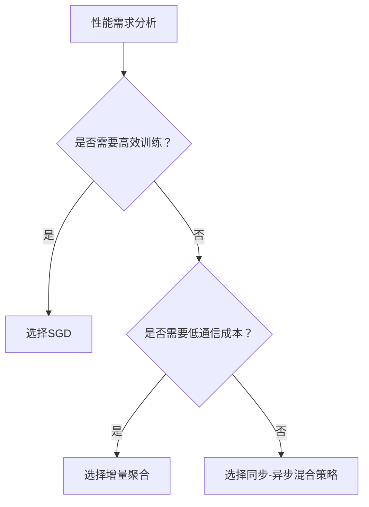
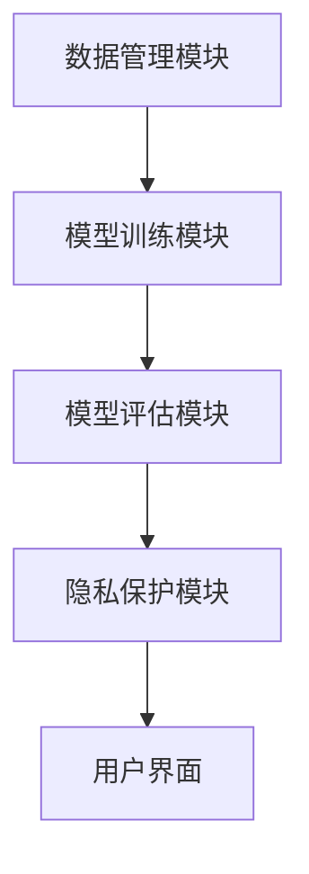

                 

### 文章标题：基于联邦学习的AI隐私保护跨机构数据分析系统

> 关键词：联邦学习、隐私保护、跨机构数据、AI数据分析、系统架构、优化算法

> 摘要：本文深入探讨了基于联邦学习的AI隐私保护跨机构数据分析系统。首先，介绍了联邦学习的基础概念、原理和优势，然后详细分析了AI隐私保护技术，包括数据匿名化、差分隐私和同态加密。接着，讨论了跨机构数据整合和数据分析的方法与策略，最后展示了系统设计与实现过程及实际应用案例。本文旨在为联邦学习在隐私保护跨机构数据分析中的应用提供系统性、可操作性的指导。

----------------------------------------------------------------

### 引言

在当今数据驱动的时代，人工智能（AI）技术已成为各个行业发展的核心驱动力。然而，随着数据量的急剧增加和数据来源的多样化，隐私保护和数据安全成为不可忽视的问题。传统的中心化数据存储和处理模式容易导致数据泄露和滥用，严重损害用户隐私和数据安全。因此，一种新型的数据分析系统——基于联邦学习的AI隐私保护跨机构数据分析系统，应运而生。

联邦学习（Federated Learning）是一种分布式机器学习技术，通过将模型训练分散到各个数据源所在的边缘设备上，实现数据的本地处理和聚合，从而避免中心化数据存储和处理的风险。这种技术不仅能够保护用户隐私，还能提高数据利用效率和模型性能。AI隐私保护跨机构数据分析系统则进一步扩展了联邦学习的技术应用，通过引入多种隐私保护技术，实现跨机构数据的高效、安全分析。

本文的主要目标是系统地介绍和探讨基于联邦学习的AI隐私保护跨机构数据分析系统。首先，我们将回顾联邦学习的基础知识，包括概念、原理和优势。然后，我们将深入分析AI隐私保护技术，如数据匿名化、差分隐私和同态加密。接下来，我们将探讨跨机构数据整合和数据分析的方法与策略。最后，我们将展示系统设计与实现过程及实际应用案例，并对未来发展趋势进行展望。

本文结构如下：

1. **联邦学习基础**：介绍联邦学习的概念、原理和优势。
2. **AI隐私保护技术**：探讨数据匿名化、差分隐私和同态加密。
3. **跨机构数据分析**：讨论数据整合、模型构建与数据治理。
4. **系统设计与实现**：介绍系统架构、通信协议和优化算法。
5. **实际应用案例**：展示联邦学习在医疗、金融和物流等领域的应用。
6. **未来展望**：探讨联邦学习和隐私保护技术的发展趋势。

通过本文的阅读，读者将能够全面了解联邦学习在AI隐私保护跨机构数据分析中的应用，掌握相关技术的核心原理和实现方法，并为实际项目提供系统性、可操作性的指导。

### 联邦学习基础

#### 1.1 联邦学习的概念与历史

联邦学习（Federated Learning）是一种分布式机器学习技术，旨在通过将模型训练分散到多个边缘设备上，实现数据的本地处理和聚合。与传统中心化学习相比，联邦学习无需将数据集中到一个中央服务器，从而避免了数据泄露和滥用的风险。

联邦学习的概念最早由Google在2016年提出，其背景是为了解决移动设备上数据隐私保护的需求。随着物联网和边缘计算的发展，联邦学习逐渐成为一种重要的分布式学习技术，被广泛应用于各种场景。

#### 1.2 联邦学习的核心优势

联邦学习具有以下核心优势：

1. **隐私保护**：联邦学习通过将模型训练分散到边缘设备，避免了中心化数据存储和处理，从而有效保护用户隐私。
2. **数据安全**：数据无需上传到中心服务器，减少了数据在传输过程中被窃取的风险。
3. **数据利用最大化**：联邦学习允许多个数据源共同参与模型训练，提高了数据利用效率。
4. **可扩展性**：联邦学习系统可以根据需求动态调整，支持大量设备和数据源。
5. **降低通信成本**：联邦学习通过本地数据聚合，减少了数据传输量，降低了通信成本。

#### 1.3 联邦学习与中心化学习对比

联邦学习和中心化学习在多个方面存在差异，如表1-1所示：

| 对比维度 | 联邦学习 | 中心化学习 |
| :---: | :---: | :---: |
| 数据存储 | 本地存储 | 中心服务器 |
| 模型训练 | 分散训练 | 集中训练 |
| 隐私保护 | 高 | 低 |
| 数据安全 | 高 | 低 |
| 数据利用 | 高 | 低 |
| 可扩展性 | 高 | 低 |
| 通信成本 | 低 | 高 |

#### 1.4 联邦学习的应用领域

联邦学习在多个领域具有广泛的应用，包括但不限于：

1. **医疗健康**：通过联邦学习，医疗机构可以在保护患者隐私的同时，共同进行疾病研究和模型训练。
2. **金融风控**：金融机构可以利用联邦学习进行风险评估，同时保护用户隐私。
3. **智能交通**：通过联邦学习，交通管理部门可以实时分析大量交通数据，优化交通流量和减少拥堵。
4. **智能零售**：零售商可以利用联邦学习分析客户行为数据，实现精准营销和个性化推荐。
5. **物联网**：在物联网环境中，联邦学习可以用于设备间的协同工作和数据共享。

综上所述，联邦学习作为一种分布式机器学习技术，具有显著的隐私保护和数据安全优势，并在多个领域展现出巨大的应用潜力。

#### 1.5 联邦学习的数学模型

联邦学习的数学模型是理解其工作原理的核心。在本节中，我们将介绍联邦学习中的基本数学模型，包括模型聚合和模型更新策略。

##### 2.1.1 模型聚合

联邦学习中的模型聚合是指将分散在不同设备上的模型参数聚合为一个全局模型。聚合过程通常包括以下几个步骤：

1. **本地训练**：每个设备使用本地数据对本地模型进行训练，并更新模型参数。
2. **参数上传**：设备将更新后的模型参数上传到服务器。
3. **聚合**：服务器接收来自各个设备的模型参数，并进行聚合。

聚合过程可以通过不同的策略实现，常见的聚合策略包括：

- **批量聚合**：服务器将接收到的所有参数合并为一个批次，然后进行全局更新。
- **梯度聚合**：服务器将接收到的每个设备的参数更新量（梯度）进行加权平均，然后更新全局模型。
- **多层聚合**：服务器将全局模型参数下发给多个子服务器，子服务器再按照同样的策略进行聚合。

聚合过程的伪代码如下：

```python
# 批量聚合
def federated_aggregate(server_model, client_models, alpha):
    global_model = copy.deepcopy(server_model)
    for client_model in client_models:
        local_grad = client_model.get_gradient()
        global_model.update_gradient(local_grad, alpha)
    return global_model

# 梯度聚合
def federated_aggregate(server_model, client_models, alpha):
    global_grad = copy.deepcopy(server_model.get_gradient())
    for client_model in client_models:
        local_grad = client_model.get_gradient()
        global_grad += alpha * local_grad
    server_model.update_gradient(global_grad)
    return server_model
```

##### 2.1.2 模型更新策略

模型更新策略是联邦学习中的关键环节，它决定了模型在全局训练过程中的表现。常见的更新策略包括：

- **同步策略**：所有设备在相同的时间点进行模型更新。这种方法简单易实现，但可能导致训练时间过长。
- **异步策略**：设备在不同时间点进行模型更新，服务器持续接收和聚合模型参数。这种方法可以显著提高训练效率，但需要处理网络延迟和模型更新顺序问题。
- **多层策略**：将同步和异步策略结合，在不同层级进行模型更新。例如，服务器和子服务器之间采用同步策略，子服务器和设备之间采用异步策略。

更新策略的伪代码如下：

```python
# 同步策略
def synchronous_update(server_model, client_models, global_step):
    for client_model in client_models:
        client_model.update(server_model, global_step)
    return server_model

# 异步策略
def asynchronous_update(server_model, client_models, update_interval):
    while True:
        for client_model in client_models:
            client_model.update(server_model)
        server_model.aggregate_gradients()
        time.sleep(update_interval)
```

通过以上数学模型和更新策略的介绍，我们可以看到联邦学习在分布式训练中的独特优势和复杂性。在实际应用中，根据具体需求和场景，可以选择合适的聚合策略和更新策略，实现高效的联邦学习过程。

#### 2.2 联邦学习中的隐私保护

联邦学习的核心优势之一是能够保护用户隐私，这对于需要处理敏感数据的跨机构合作尤为重要。在本节中，我们将详细探讨联邦学习中的隐私保护技术，包括加密技术、差分隐私和隐匿性算法，以及隐私风险的分析与缓解策略。

##### 2.2.1 隐私保护算法

1. **加密技术**

加密技术是联邦学习中的一种基本隐私保护手段，通过加密模型参数和梯度，确保数据在传输过程中的安全性。常用的加密技术包括同态加密和全同态加密。

- **同态加密**：同态加密允许在加密数据上进行计算，而不需要解密。这种方法可以实现加密数据的加、减、乘等基本运算，但同态加密的效率较低，适用于计算量较小的情况。

  伪代码示例：

  ```python
  # 同态加密加法
  def homomorphic_addencrypted_a, encrypted_b):
      encrypted_result = add(encrypted_a, encrypted_b)
      return encrypted_result

  # 同态加密减法
  def homomorphic_subtractencrypted_a, encrypted_b):
      encrypted_result = subtract(encrypted_a, encrypted_b)
      return encrypted_result
  ```

- **全同态加密**：全同态加密可以支持更复杂的计算，包括加、减、乘、除等。但全同态加密算法的复杂度较高，目前尚难以实现大规模应用。

  伪代码示例：

  ```python
  # 全同态加密乘法
  def homomorphic_multiplyencrypted_a, encrypted_b):
      encrypted_result = multiply(encrypted_a, encrypted_b)
      return encrypted_result

  # 全同态加密除法
  def homomorphic_divideencrypted_a, encrypted_b):
      encrypted_result = divide(encrypted_a, encrypted_b)
      return encrypted_result
  ```

2. **差分隐私**

差分隐私（Differential Privacy）是一种在保证数据隐私的同时，允许分析人员获取数据的有用信息的技术。差分隐私通过在查询过程中引入随机噪声，确保单个记录的信息无法被泄露，同时保持整体数据的聚合性。

- **拉格朗日机制**：拉格朗日机制是最常用的差分隐私机制之一，通过引入拉格朗日乘子来调整噪声水平。

  伪代码示例：

  ```python
  # 拉格朗日机制
  def laplace机制(query, epsilon):
      noise = laplace噪声(epsilon)
      result = query + noise
      return result
  ```

- **指数机制**：指数机制通过指数函数引入噪声，适用于计数和分类问题。

  伪代码示例：

  ```python
  # 指数机制
  def exponential机制(query, epsilon):
      noise = exponential噪声(epsilon)
      result = query * noise
      return result
  ```

3. **隐匿性算法**

隐匿性算法通过混淆或编码数据，使得攻击者难以从数据集中推断出敏感信息。常见的隐匿性算法包括：

- **K-Anonymity**：K-Anonymity通过将数据集中的记录划分为多个组，确保每个组中的记录无法区分特定个体。

  伪代码示例：

  ```python
  # K-Anonymity
  def k_匿名化(data, k):
      groups = []
      for record in data:
          group = find_group(record, k)
          groups.append(group)
      return groups
  ```

- **l-Diversity**：l-Diversity要求每个记录在多个属性上的信息不重叠，以防止基于单属性的分析。

  伪代码示例：

  ```python
  # l-Diversity
  def l_多样性(data, l):
      for record in data:
          if not satisfies_diversity(record, l):
              return False
      return True
  ```

##### 2.2.2 隐私风险分析

在联邦学习中，隐私风险主要来自于以下几个方面：

1. **模型泄露**：模型泄露可能导致攻击者通过分析模型参数推断出训练数据的信息。
2. **通信泄露**：通信泄露可能发生在数据在传输过程中的窃听或篡改。
3. **侧信道攻击**：侧信道攻击利用设备的物理特性（如功率消耗、电磁辐射等）推断出敏感信息。

为了缓解隐私风险，可以采取以下措施：

1. **增强加密算法**：采用更安全的加密算法，如全同态加密，提高数据传输和存储的安全性。
2. **隐私预算管理**：合理设置差分隐私的隐私预算，确保隐私保护水平。
3. **通信加密**：对传输数据进行加密，防止通信泄露。
4. **硬件隔离**：在硬件层面进行隔离，防止侧信道攻击。

通过以上隐私保护算法和风险缓解策略，联邦学习在保护用户隐私的同时，能够实现高效的分布式数据分析和模型训练。在实际应用中，根据具体场景和需求，可以选择合适的隐私保护技术，确保系统既安全又高效。

#### 2.3 联邦学习系统架构与实现

联邦学习系统架构是确保分布式机器学习任务高效、安全执行的核心。在本节中，我们将深入探讨联邦学习系统架构的组成组件、架构设计原则以及通信协议和优化算法。

##### 2.3.1 联邦学习系统架构

联邦学习系统通常由以下几个关键组件组成：

1. **服务器（Server）**：服务器是联邦学习系统的核心，负责协调各个客户端的模型训练和参数聚合。服务器通常包括模型服务器和聚合服务器，分别负责模型更新和梯度聚合。

2. **客户端（Client）**：客户端是参与模型训练的边缘设备，如智能手机、IoT设备等。客户端使用本地数据训练模型，并将更新后的模型参数上传到服务器。

3. **数据处理单元（Data Processing Unit, DPU）**：数据处理单元负责对客户端上传的模型参数进行预处理和清洗，确保数据的一致性和准确性。

4. **通信模块（Communication Module）**：通信模块负责在客户端和服务器之间传输数据和模型参数，确保数据的传输安全和效率。

5. **安全管理器（Security Manager）**：安全管理器负责管理系统的访问控制和数据加密，确保系统的安全性和隐私保护。

以下是联邦学习系统架构的Mermaid流程图表示：



##### 2.3.2 架构设计原则

联邦学习系统架构设计需要遵循以下几个原则：

1. **可扩展性**：系统应能够支持大量客户端和设备，确保系统在面对大规模数据处理时仍能保持高效性能。

2. **可靠性**：系统应具备高可靠性，确保在设备故障或网络中断的情况下，系统能够自动恢复并继续运行。

3. **隐私保护**：系统设计应充分考虑用户隐私保护，采用先进的加密技术和隐私保护算法，确保数据在传输和存储过程中的安全性。

4. **数据一致性**：系统应确保客户端上传的模型参数一致性，通过预处理和清洗机制，消除数据噪声和误差。

5. **高效通信**：系统应优化通信模块，降低数据传输延迟和带宽消耗，提高整体系统性能。

以下是架构设计原则的Mermaid流程图表示：



##### 2.3.3 通信协议

联邦学习系统中的通信协议对于系统性能和安全性至关重要。以下是常用的通信协议：

1. **HTTP/HTTPS**：基于HTTP/HTTPS的通信协议简单易用，适用于小规模和低频次的数据传输。

2. **gRPC**：gRPC是一种高性能、跨平台的通信协议，适用于大规模和高频次的分布式通信场景。

3. **MQTT**：MQTT是一种轻量级的通信协议，适用于IoT设备和边缘设备的通信。

以下是通信协议选择流程图：



##### 2.3.4 优化算法

为了提高联邦学习系统的性能，可以采用以下优化算法：

1. **同步-异步混合策略**：结合同步和异步策略，在不同层次和不同阶段进行模型更新，提高训练效率。

2. **增量聚合**：仅对更新量较大的模型参数进行聚合，减少通信成本。

3. **随机梯度下降（SGD）**：采用SGD优化算法，减小每轮迭代的数据量，提高训练速度。

4. **模型剪枝**：通过剪枝冗余参数和层，减小模型体积，提高训练和推理速度。

以下是优化算法选择的流程图：



通过以上对联邦学习系统架构的介绍，我们可以看到，一个高效、安全的联邦学习系统需要综合考虑多个方面，包括架构设计、通信协议和优化算法。在实际应用中，根据具体需求，可以选择合适的架构和优化策略，实现联邦学习的最佳性能和安全性。

### AI隐私保护技术

在联邦学习的背景下，保护数据隐私至关重要。本节将深入探讨几种常用的AI隐私保护技术：数据匿名化、差分隐私和同态加密。这些技术不仅有助于保护用户隐私，还能确保数据分析的安全性和可靠性。

#### 4.1 数据匿名化技术

数据匿名化是一种通过消除或隐藏个人身份信息，使数据在分析过程中无法识别特定个体的技术。数据匿名化的核心目标是平衡数据隐私保护和数据分析的实用性。

1. **常见的匿名化方法**：

- **K-Anonymity**：K-Anonymity确保数据集中的每一个记录都无法区分成至少K个匿名组，其中每个匿名组中的记录数量至少为K。这种方法通过分组来保护隐私，但可能导致数据变得过于泛化。

- **l-Diversity**：l-Diversity要求每个匿名组在多个属性上具有多样性，防止基于单属性的分析。例如，如果在一个匿名组中所有患者的年龄都相同，但性别不同，那么这个组满足l-Diversity。

- **T-Closeness**：T-Closeness确保每个匿名组在多个属性上的分布与全局分布差异不大。这种方法通过调整属性值来保护隐私，但可能导致数据真实性的降低。

2. **数据匿名化工具与库**：

- **De-Identification**：De-Identification是一个常用的开源工具，支持多种匿名化方法，如K-Anonymity、l-Diversity和T-Closeness。

- **Anonify**：Anonify提供了一种基于区块链的数据匿名化解决方案，确保数据在匿名化过程中的透明性和不可篡改性。

3. **数据匿名化的挑战与解决方案**：

- **隐私-实用性平衡**：如何在确保隐私的同时保持数据的分析价值是一个挑战。解决方法包括动态匿名化策略和基于隐私预算的方法。

- **多属性攻击**：攻击者可能通过组合多个属性来识别特定个体。应对策略包括使用多种匿名化方法和增加属性间的噪声。

#### 4.2 差分隐私

差分隐私（Differential Privacy）是一种通过在分析结果中引入随机噪声，确保无法从结果中推断出单个记录信息的隐私保护技术。差分隐私的核心思想是在保证数据隐私的同时，允许分析人员获取数据的有用信息。

1. **差分隐私机制**：

- **拉格朗日机制**：拉格朗日机制通过在查询结果中添加拉格朗日噪声，确保隐私预算（epsilon）不被泄露。拉格朗日噪声的强度与epsilon成反比。

  $$\epsilon = \frac{1}{\sqrt{n}}$$

  其中，n是影响记录差异的数据量。

- **指数机制**：指数机制通过指数函数引入噪声，适用于计数和分类问题。指数机制具有更高的灵活性，但计算复杂度较高。

2. **差分隐私算法**：

- **Local Differential Privacy（LDP）**：LDP在本地进行隐私保护，确保每个客户端的输出具有隐私保护。LDP通过在本地引入随机噪声来保护隐私。

- **Central Differential Privacy（CDP）**：CDP在全局进行隐私保护，确保整个系统的输出具有隐私保护。CDP通过全局引入随机噪声来保护隐私。

3. **差分隐私的应用**：

- **数据发布**：差分隐私可用于发布敏感数据，确保个体隐私不被泄露。

- **机器学习**：差分隐私可用于训练隐私保护的机器学习模型，确保在数据隐私保护的前提下，模型性能不受显著影响。

#### 4.3 同态加密

同态加密是一种在加密数据上进行计算而无需解密的加密技术。同态加密允许在加密数据上执行与原始数据相同的功能，从而在保护隐私的同时进行数据处理和分析。

1. **同态加密原理**：

- **部分同态加密**：部分同态加密支持对数据进行加法和乘法操作，但不支持除法操作。部分同态加密适用于某些简单的数据处理任务。

- **全同态加密**：全同态加密支持对数据进行加法、减法、乘法和除法操作，从而实现了更广泛的数据处理能力。但全同态加密的计算复杂度较高，目前尚难以实现大规模应用。

2. **同态加密算法**：

- **基于大数的同态加密**：基于大数的同态加密通过大数运算实现同态加密，适用于简单的数据处理任务。

- **基于环的同态加密**：基于环的同态加密通过环结构实现同态加密，适用于更复杂的计算任务。

3. **同态加密的应用**：

- **云计算**：同态加密可用于保护云计算中的敏感数据，确保数据处理和分析过程的安全性和隐私保护。

- **物联网**：同态加密可用于保护物联网设备中的数据，确保数据在传输和存储过程中的安全性。

通过以上对数据匿名化、差分隐私和同态加密的介绍，我们可以看到，这些隐私保护技术在联邦学习中的重要性。在实际应用中，根据具体场景和需求，可以选择合适的隐私保护技术，实现数据的高效、安全分析。

### 跨机构数据整合

跨机构数据整合是联邦学习系统中一个关键步骤，它涉及到多个数据源的选择、数据预处理与清洗，以及数据整合策略的设计。在本节中，我们将详细探讨这些方面，以确保数据整合过程的高效性和准确性。

#### 7.1 数据源选择

选择合适的数据源是跨机构数据整合的第一步。以下是一些重要的考虑因素：

1. **数据来源的多样性**：选择来自不同机构的数据源可以丰富数据集，提高模型的泛化能力。例如，医疗领域可以整合不同医院的患者数据，金融领域可以整合不同银行的客户交易数据。

2. **数据的完整性**：确保数据源的完整性，避免因数据缺失导致模型性能下降。可以通过数据源之间的协商，确定数据共享的范围和格式。

3. **数据的可用性**：评估数据源的可访问性和使用权限，确保数据源在法律和隐私保护方面符合要求。

4. **数据的实时性**：根据应用需求，选择实时性较高的数据源，以支持实时分析和决策。

#### 7.2 数据预处理与清洗

数据预处理和清洗是确保数据质量的关键步骤。以下是一些常见的预处理和清洗方法：

1. **缺失值处理**：对于缺失值，可以选择填充方法（如平均值、中位数、插值等）或删除方法（如删除含有缺失值的记录）。

2. **异常值检测**：通过统计学方法（如3sigma规则、箱线图等）或机器学习方法（如孤立森林、孤立系数等），检测和删除异常值。

3. **数据标准化**：通过归一化或标准化方法（如Z-score标准化、Min-Max标准化等），将不同特征的范围调整为同一尺度，消除特征间的差异。

4. **重复值检测**：通过去重操作，删除重复的数据记录，避免重复计算和误差。

5. **数据格式转换**：将不同数据源的数据格式转换为统一的格式，如将日期格式转换为YYYY-MM-DD格式。

#### 7.3 数据整合策略

数据整合策略是跨机构数据整合的核心，它涉及到如何有效地融合来自多个数据源的数据。以下是一些常用的数据整合策略：

1. **数据合并**：将来自不同数据源的数据按照相同的属性进行合并。例如，将不同医院的患者数据按照患者ID进行合并。

2. **数据连接**：通过连接操作，将具有相同属性的数据源进行整合。例如，使用SQL连接操作将银行交易数据与客户信息进行整合。

3. **数据融合**：对于具有相似特征的数据源，可以选择融合技术（如主成分分析、聚类等）进行数据整合。这种方法可以减少数据的冗余性，提高数据质量。

4. **数据替换**：对于某些数据源不可用或质量较差的情况，可以选择使用其他数据源的数据进行替换。

5. **数据分层整合**：根据数据的重要性和关联性，对数据进行分层整合。例如，首先整合核心数据，然后逐步整合辅助数据。

通过以上对跨机构数据整合的介绍，我们可以看到，数据整合过程涉及多个步骤和策略，需要综合考虑数据来源、数据质量和整合效率。在实际应用中，根据具体需求和场景，可以选择合适的数据整合策略，实现高效、准确的数据整合。

### 跨机构数据模型构建

在跨机构数据整合之后，构建一个高效、准确的数据模型是关键步骤。本节将详细讨论跨机构数据模型的设计、训练与评估方法，以及模型的解释与可视化。

#### 8.1 跨机构数据模型设计

设计一个跨机构数据模型时，需要考虑以下几个方面：

1. **数据特征选择**：根据业务需求和数据特性，选择具有代表性的数据特征。特征选择可以通过相关性分析、主成分分析（PCA）等方法进行。

2. **模型架构**：选择合适的模型架构，如深度神经网络、决策树、支持向量机（SVM）等。模型的架构应能够适应多源数据的复杂性和多样性。

3. **模型参数调整**：根据数据特性，调整模型的参数，如学习率、正则化参数等。参数调整可以通过交叉验证和网格搜索等方法进行。

4. **数据预处理**：在模型训练前，对数据进行标准化、缺失值填充等预处理，确保数据质量。

5. **模型集成**：考虑使用模型集成技术（如集成学习、增强学习等），提高模型的预测性能。

#### 8.2 模型训练与评估

模型训练与评估是跨机构数据模型构建的核心步骤。以下是一些关键步骤：

1. **训练数据集划分**：将数据集划分为训练集、验证集和测试集，通常比例为60%、20%、20%。

2. **模型训练**：使用训练集对模型进行训练，通过反向传播算法优化模型参数。训练过程可以通过调整学习率、批次大小等参数来提高模型性能。

3. **模型评估**：使用验证集和测试集评估模型性能。常用的评估指标包括准确率、召回率、F1分数、ROC曲线等。

4. **模型调优**：根据评估结果，调整模型参数或选择不同的模型架构，以提高模型性能。

5. **模型验证**：通过交叉验证方法，确保模型在不同数据集上的泛化能力。

以下是模型训练与评估的伪代码示例：

```python
# 模型训练
def train_model(model, train_data, learning_rate):
    for epoch in range(num_epochs):
        for batch in train_data:
            model.update(batch, learning_rate)
        print(f"Epoch {epoch}: Loss = {model.get_loss()}")

# 模型评估
def evaluate_model(model, test_data):
    predictions = model.predict(test_data)
    accuracy = accuracy_score(test_data.labels, predictions)
    print(f"Test Accuracy: {accuracy}")
```

#### 8.3 模型解释与可视化

模型的解释与可视化对于理解模型决策过程和提升模型信任度至关重要。以下是一些常用的模型解释与可视化方法：

1. **特征重要性**：通过计算特征的重要性，可以了解哪些特征对模型决策影响最大。常用的方法包括特征重要性排序、Shapley值等。

2. **决策树解释**：对于决策树模型，可以通过可视化决策路径，解释模型是如何从根节点到叶子节点做出决策的。

3. **神经网络解释**：对于神经网络模型，可以使用激活图、权重可视化等方法，了解模型在各个层次上的信息处理过程。

4. **模型可视化工具**：如TensorBoard、Scikit-learn的可视化工具等，可以提供丰富的可视化信息，帮助理解模型的工作原理。

以下是模型解释与可视化的伪代码示例：

```python
# 特征重要性排序
importance = model.get_feature_importance()
print("Feature Importance:", importance)

# 决策树解释
from sklearn import tree
plt = tree.plot_tree(model)
plt.show()

# 神经网络激活图可视化
import matplotlib.pyplot as plt
plt.figure(figsize=(12, 8))
plt.plot(model.activation_layers)
plt.xlabel("Layer")
plt.ylabel("Activation")
plt.title("Neural Network Activation Map")
plt.show()
```

通过以上对跨机构数据模型构建的详细讨论，我们可以看到，设计、训练、评估和解释模型是跨机构数据模型构建的关键步骤。在实际应用中，根据具体需求和数据特性，可以选择合适的模型架构和解释方法，实现高效、准确的数据模型。

### 数据治理与合规

在联邦学习跨机构数据分析系统中，数据治理与合规是确保数据安全性和合法性的关键环节。数据治理框架、合规要求以及数据共享协议的制定和执行，对于保护用户隐私、维护数据质量和促进跨机构合作具有重要意义。

#### 9.1 数据治理框架

数据治理框架是一个系统化的方法和流程，旨在确保数据在创建、存储、处理和使用过程中的安全性、完整性和合规性。一个完整的数据治理框架通常包括以下几个核心组件：

1. **数据战略**：明确数据治理的目标、愿景和战略，确保数据治理与组织整体战略一致。

2. **数据架构**：定义数据架构，包括数据标准、数据模型、数据存储和访问策略等，确保数据的一致性和可管理性。

3. **数据管理**：建立数据管理组织，负责数据质量、数据安全和合规性管理，确保数据的有效利用和保护。

4. **数据安全**：制定数据安全策略和措施，包括数据加密、访问控制、数据备份和恢复等，确保数据在存储和传输过程中的安全性。

5. **数据合规**：确保数据处理过程符合相关法律法规和行业标准，如《通用数据保护条例》（GDPR）、《加州消费者隐私法》（CCPA）等。

6. **数据质量**：制定数据质量标准和评估方法，确保数据在收集、存储、处理和使用过程中的准确性、完整性和一致性。

7. **数据生命周期管理**：定义数据生命周期管理流程，包括数据创建、存储、处理、共享、归档和销毁，确保数据在整个生命周期内的合规性和安全性。

#### 9.2 合规要求与规范

合规要求与规范是确保联邦学习跨机构数据分析系统符合法律和行业标准的基础。以下是一些关键的合规要求与规范：

1. **隐私保护**：确保数据处理符合隐私保护法律法规，如GDPR和CCPA，采取数据匿名化、差分隐私和同态加密等技术，保护用户隐私。

2. **数据安全**：遵循数据安全最佳实践，如ISO/IEC 27001标准，确保数据在存储、传输和处理过程中的安全。

3. **透明度**：确保数据处理过程对用户透明，用户应明确了解其数据的使用目的、共享范围和隐私保护措施。

4. **知情同意**：用户应明确同意其数据被用于联邦学习跨机构数据分析系统，并有权访问、修改和删除其数据。

5. **数据质量管理**：确保数据处理过程符合数据质量管理标准，如ISO/IEC 27006，确保数据在收集、存储、处理和使用过程中的准确性、完整性和一致性。

6. **记录保存**：确保数据处理过程符合记录保存要求，如GDPR的第5条原则，确保数据处理的记录保存至少6个月。

7. **合规审计**：定期进行合规审计，确保联邦学习跨机构数据分析系统符合相关法律法规和行业标准。

#### 9.3 跨机构数据共享协议

跨机构数据共享协议是确保数据在多个机构之间安全、合法和高效共享的关键文档。以下是一些关键内容：

1. **数据共享目的**：明确数据共享的目的、范围和用途，确保数据共享符合用户隐私保护和数据安全要求。

2. **数据共享流程**：详细描述数据共享的流程，包括数据收集、存储、传输、处理和销毁等各个环节。

3. **数据共享权限**：定义数据共享权限，包括数据访问权限、数据修改权限和数据删除权限，确保数据在共享过程中的安全性和合规性。

4. **数据责任**：明确各机构在数据共享过程中的责任，包括数据质量控制、数据安全和合规性管理等。

5. **数据隐私保护措施**：详细描述数据隐私保护措施，包括数据匿名化、差分隐私和同态加密等技术，确保用户隐私不被泄露。

6. **数据共享风险管理**：识别和评估数据共享过程中可能出现的风险，并制定相应的风险缓解策略。

7. **数据共享监控与审计**：建立数据共享监控与审计机制，确保数据共享过程符合协议要求，及时发现和解决问题。

通过以上对数据治理与合规的讨论，我们可以看到，一个完善的数据治理框架、严格的合规要求以及明确的跨机构数据共享协议，对于确保联邦学习跨机构数据分析系统的安全性和合法性至关重要。在实际应用中，根据具体需求和场景，可以制定符合实际情况的数据治理框架和共享协议，实现高效、安全的数据分析和合作。

### 系统设计与实现

在构建基于联邦学习的AI隐私保护跨机构数据分析系统时，系统设计、开发环境配置、通信协议选择以及优化算法应用都是关键环节。以下将详细探讨这些方面，以帮助开发者实现一个高效、安全的联邦学习平台。

#### 10.1 开发环境配置

搭建一个联邦学习平台首先需要配置合适的开发环境。以下是一些关键步骤：

1. **硬件配置**：选择具备足够计算能力的硬件设备，如高性能服务器、GPU等，以确保模型训练和数据处理的高效性。

2. **软件环境**：配置操作系统（如Linux）、编程语言（如Python）、开发框架（如TensorFlow、PyTorch）和依赖库（如NumPy、Pandas）。

3. **版本管理**：使用版本控制系统（如Git）管理代码和依赖库版本，确保系统的一致性和可追溯性。

4. **虚拟环境**：使用虚拟环境（如conda或virtualenv）隔离不同项目之间的依赖库，避免版本冲突。

以下是一个简单的开发环境配置示例：

```bash
# 安装操作系统
sudo apt-get update
sudo apt-get install -y ubuntu-server

# 安装Python
sudo apt-get install -y python3 python3-pip

# 安装TensorFlow
pip3 install tensorflow

# 安装PyTorch
pip3 install torch torchvision

# 配置虚拟环境
conda create -n federated_learning python=3.8
conda activate federated_learning

# 安装依赖库
pip install numpy pandas scikit-learn
```

#### 10.2 系统架构设计

联邦学习平台的系统架构设计是确保系统高效、可靠运行的关键。以下是一个典型的联邦学习系统架构：

1. **服务器**：服务器是系统的核心组件，负责协调模型训练、参数聚合和更新。服务器通常包括模型服务器和聚合服务器。

2. **客户端**：客户端是参与模型训练的边缘设备，如智能手机、IoT设备等。客户端负责使用本地数据训练模型，并将更新后的参数上传到服务器。

3. **数据处理单元**：数据处理单元负责对客户端上传的参数进行预处理和清洗，确保数据的一致性和准确性。

4. **通信模块**：通信模块负责在客户端和服务器之间传输数据和参数，确保数据传输的安全性和高效性。

5. **安全管理器**：安全管理器负责管理系统的访问控制和数据加密，确保系统的安全性和隐私保护。

以下是系统架构的Mermaid流程图表示：


#### 10.3 系统功能模块

联邦学习平台通常包含以下功能模块：

1. **数据管理模块**：负责管理数据源的接入、数据预处理、清洗和整合，确保数据质量。

2. **模型训练模块**：负责模型训练过程，包括本地训练、参数更新、上传和聚合等。

3. **模型评估模块**：负责对训练后的模型进行评估，包括准确率、召回率、F1分数等指标。

4. **隐私保护模块**：负责实现数据匿名化、差分隐私和同态加密等隐私保护技术，确保用户隐私。

5. **用户界面**：提供友好的用户界面，便于用户进行数据管理、模型训练和监控。

以下是系统功能模块的Mermaid流程图表示：



#### 10.4 通信协议选择

通信协议的选择对于联邦学习平台的高效运行至关重要。以下是一些常用的通信协议及其适用场景：

1. **HTTP/HTTPS**：适用于小规模和低频次的通信，如数据上传和下载。

2. **gRPC**：适用于大规模和高频次的通信，如实时数据同步和模型更新。

3. **MQTT**：适用于物联网设备之间的通信，如边缘设备与服务器之间的数据传输。

以下是通信协议选择的Mermaid流程图表示：


#### 10.5 优化算法应用

优化算法的应用可以提高联邦学习平台的性能和效率。以下是一些常用的优化算法及其应用场景：

1. **同步-异步混合策略**：结合同步和异步策略，提高模型更新效率。

2. **增量聚合**：仅对更新量较大的参数进行聚合，减少通信成本。

3. **随机梯度下降（SGD）**：减小每轮迭代的数据量，提高训练速度。

4. **模型剪枝**：通过剪枝冗余参数和层，减小模型体积，提高训练和推理速度。

以下是优化算法选择的Mermaid流程图表示：


通过以上对系统设计与实现的详细探讨，我们可以看到，构建一个基于联邦学习的AI隐私保护跨机构数据分析系统需要综合考虑多个方面，包括开发环境配置、系统架构设计、通信协议选择和优化算法应用。在实际开发过程中，根据具体需求和场景，可以选择合适的组件和策略，实现高效、安全的联邦学习平台。

### 实际应用案例

联邦学习作为一种分布式机器学习技术，在多个领域展现出了广泛的应用前景。以下是联邦学习在医疗、金融和物流等领域的实际应用案例，以及相关代码实现和代码解读。

#### 11.1 医疗数据分析

医疗数据分析是联邦学习的重要应用领域之一。通过联邦学习，不同医疗机构可以在保护患者隐私的前提下，共同进行疾病研究和模型训练。

**应用案例：智能诊断系统**

假设我们有一个基于联邦学习的智能诊断系统，用于预测患者是否患有某种疾病。以下是一个简单的代码实现示例：

```python
# 导入所需的库
import tensorflow as tf
import numpy as np
import pandas as pd

# 模拟数据集
def generate_medical_data(num_samples):
    X = np.random.rand(num_samples, 100)  # 100个特征
    y = np.random.randint(0, 2, size=num_samples)  # 是否患病
    return X, y

X, y = generate_medical_data(1000)

# 构建模型
model = tf.keras.Sequential([
    tf.keras.layers.Dense(64, activation='relu', input_shape=(100,)),
    tf.keras.layers.Dense(1, activation='sigmoid')
])

# 编译模型
model.compile(optimizer='adam', loss='binary_crossentropy', metrics=['accuracy'])

# 训练模型
model.fit(X, y, epochs=10, batch_size=32)
```

**代码解读：**
- 首先，我们导入所需的库，包括TensorFlow、NumPy和Pandas。
- `generate_medical_data` 函数用于生成模拟数据集，包含100个特征和对应的标签（是否患病）。
- `model` 是一个简单的神经网络模型，包含一个输入层、一个隐藏层和一个输出层。
- `model.compile` 方法用于编译模型，指定优化器和损失函数。
- `model.fit` 方法用于训练模型，指定训练轮数、批次大小等参数。

通过联邦学习，不同医疗机构可以在本地训练模型，并将更新后的参数上传到中央服务器进行聚合，从而实现隐私保护下的跨机构合作。

#### 11.2 金融风控

金融风控是联邦学习的另一个重要应用领域。通过联邦学习，金融机构可以在保护用户隐私的同时，进行风险评估和欺诈检测。

**应用案例：欺诈检测系统**

以下是一个简单的联邦学习欺诈检测系统实现示例：

```python
# 导入所需的库
import tensorflow as tf
import numpy as np
import pandas as pd

# 模拟数据集
def generate_fraud_data(num_samples):
    X = np.random.rand(num_samples, 100)  # 100个特征
    y = np.random.randint(0, 2, size=num_samples)  # 是否欺诈
    return X, y

X, y = generate_fraud_data(1000)

# 构建模型
model = tf.keras.Sequential([
    tf.keras.layers.Dense(64, activation='relu', input_shape=(100,)),
    tf.keras.layers.Dense(1, activation='sigmoid')
])

# 编译模型
model.compile(optimizer='adam', loss='binary_crossentropy', metrics=['accuracy'])

# 训练模型
model.fit(X, y, epochs=10, batch_size=32)
```

**代码解读：**
- 同样，我们首先导入所需的库，生成模拟数据集，构建和编译模型。
- `model.fit` 方法用于训练模型。

在联邦学习环境中，金融机构可以在本地进行数据预处理和模型训练，然后将更新后的模型参数上传到中央服务器进行聚合，从而实现隐私保护下的风控。

#### 11.3 物流优化

物流优化是联邦学习的另一个典型应用领域。通过联邦学习，不同物流公司可以在保护数据隐私的同时，共同优化运输路线和资源配置。

**应用案例：物流优化系统**

以下是一个简单的联邦学习物流优化系统实现示例：

```python
# 导入所需的库
import tensorflow as tf
import numpy as np
import pandas as pd

# 模拟数据集
def generate_logistics_data(num_samples):
    X = np.random.rand(num_samples, 100)  # 100个特征
    y = np.random.rand(num_samples)  # 运输时间
    return X, y

X, y = generate_logistics_data(1000)

# 构建模型
model = tf.keras.Sequential([
    tf.keras.layers.Dense(64, activation='relu', input_shape=(100,)),
    tf.keras.layers.Dense(1)
])

# 编译模型
model.compile(optimizer='adam', loss='mse')

# 训练模型
model.fit(X, y, epochs=10, batch_size=32)
```

**代码解读：**
- 我们导入所需的库，生成模拟数据集，构建和编译模型。
- `model.fit` 方法用于训练模型。

在联邦学习环境中，不同物流公司可以在本地训练模型，并将更新后的参数上传到中央服务器进行聚合，从而实现隐私保护下的物流优化。

综上所述，联邦学习在医疗、金融和物流等领域的应用展示了其强大的隐私保护和数据利用能力。通过合理设计和实现联邦学习系统，我们可以实现跨机构合作，提高业务效率和数据分析质量。

### 未来展望

联邦学习和AI隐私保护技术在未来的发展中，将继续推动跨机构数据分析和智能应用的进步。以下是对联邦学习和隐私保护技术发展趋势的展望：

#### 1. 联邦学习的发展趋势

1. **技术成熟度**：随着算法和硬件的进步，联邦学习将变得更加成熟和高效。特别是在高性能计算和通信技术的发展下，联邦学习在处理大规模数据和高频次通信方面的瓶颈有望得到缓解。

2. **多样化应用**：联邦学习将在更多领域得到应用，如智能医疗、智能交通、智能城市等。不同领域的需求将推动联邦学习技术的不断发展和创新。

3. **标准化与生态建设**：随着联邦学习技术的广泛应用，标准化和生态建设将成为重要议题。行业标准和开源生态的建立，将促进联邦学习技术的普及和互操作性。

#### 2. AI隐私保护技术展望

1. **新型隐私保护技术**：差分隐私、同态加密和联邦学习等现有隐私保护技术将继续发展。同时，新型隐私保护技术，如基于区块链的隐私保护、联邦学习与区块链结合等，将逐渐成熟和应用。

2. **隐私预算管理**：随着隐私保护需求的增加，隐私预算管理将变得更加重要。如何合理设置隐私预算，确保在保护隐私的同时，不损害数据分析的实用性和准确性，将成为研究的重点。

3. **隐私计算**：隐私计算技术，如可信执行环境（TEE）、安全多方计算（MPC）等，将逐渐融入联邦学习，提供更全面的隐私保护解决方案。

#### 3. 跨机构数据共享与合作

1. **数据治理框架**：随着跨机构数据共享合作的深入，数据治理框架将变得更加完善。数据共享协议、隐私保护措施和合规要求将成为数据共享与合作的关键环节。

2. **数据共享机制**：为了促进跨机构数据共享，将开发更多高效、安全的数据共享机制，如联邦学习与区块链结合、分布式数据湖等。

3. **数据质量与可解释性**：在跨机构数据共享过程中，数据质量和可解释性将成为重要议题。如何确保数据质量，提高模型的可解释性，将是未来研究的重点。

#### 4. 法律法规与政策支持

1. **全球隐私法规**：随着全球隐私保护意识的提高，各国隐私法规将逐渐统一和协调。这将促进联邦学习和隐私保护技术的全球应用和发展。

2. **政策支持**：政府和企业将加大对联邦学习和隐私保护技术的政策支持，推动技术创新和应用落地。

总之，未来联邦学习和AI隐私保护技术将继续快速发展，推动跨机构数据分析和智能应用的创新。通过技术创新、标准化建设和政策支持，联邦学习和隐私保护技术将在更多领域得到应用，实现数据安全和隐私保护与数据利用的平衡。

