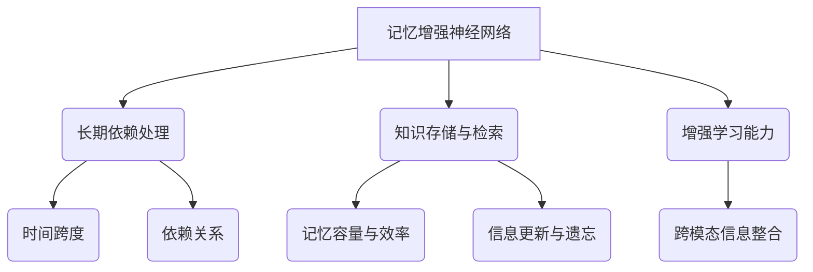

                 

## 文章标题：基于记忆增强神经网络的长期推理模型

> 关键词：记忆增强神经网络、长期推理、神经架构、模型设计、优化策略、评估与验证

> 摘要：本文详细探讨了基于记忆增强神经网络的长期推理模型。首先介绍了记忆增强神经网络的基本概念和核心作用，随后深入分析了长期推理的需求与挑战。接着，文章围绕神经网络基础、记忆增强模块、记忆增强神经网络架构等核心内容进行了系统的讲解。在此基础上，文章进一步探讨了长期推理模型的设计与优化策略，并提出了评估与验证的方法。通过实际应用案例的分析，本文旨在为读者提供一个全面、深入且实用的技术指南。

## 第一部分：引言与核心概念

### 第1章：记忆增强神经网络概述

#### 1.1 记忆增强神经网络的基本概念

记忆增强神经网络（Memory-augmented Neural Networks, MnN）是一种结合记忆模块的神经网络结构，旨在增强模型的长期记忆和学习能力。传统神经网络在处理长期依赖关系时往往表现不佳，而记忆增强神经网络通过引入外部记忆模块，能够在不同时间步之间存储和检索信息，从而提高模型的推理能力。

#### 1.1.1 记忆增强神经网络的核心作用

记忆增强神经网络的核心作用主要体现在以下几个方面：

1. **长期依赖处理**：通过记忆模块，模型能够存储和利用历史信息，从而处理长期依赖关系。
2. **知识存储与检索**：记忆模块使得模型能够存储知识并进行快速检索，从而提高推理效率。
3. **增强学习能力**：记忆增强神经网络能够通过自适应地更新记忆内容，提高模型的泛化能力和学习效率。

#### 1.1.2 记忆增强神经网络的发展历程

记忆增强神经网络的概念最早可以追溯到20世纪90年代的动态规划（Dynamic Programming）方法。然而，随着深度学习技术的发展，特别是循环神经网络（RNN）和注意力机制的引入，记忆增强神经网络在21世纪初得到了迅速发展。近年来，随着图神经网络（Graph Neural Networks）和增量学习（Incremental Learning）等技术的进步，记忆增强神经网络的应用领域不断扩展，其在自然语言处理、推荐系统、语音识别等领域的表现也日益突出。

#### 1.2 长期推理的需求与挑战

长期推理是指模型在处理复杂任务时，能够利用历史信息进行推理和决策的能力。在许多实际应用中，如自然语言理解、智能对话系统和智能推荐系统等，长期推理能力至关重要。

#### 1.2.1 长期推理的定义

长期推理涉及以下几个方面：

1. **时间跨度**：长期推理涉及较长时间跨度内的事件和信息的处理。
2. **依赖关系**：长期推理需要处理不同时间步之间的依赖关系。
3. **信息存储与检索**：长期推理需要模型能够存储和检索历史信息。

#### 1.2.2 长期推理的关键挑战

尽管记忆增强神经网络在提高长期推理能力方面有显著优势，但仍然面临以下关键挑战：

1. **记忆容量与效率**：如何设计高效的记忆模块，在保证记忆容量的同时减少计算开销。
2. **信息更新与遗忘**：如何设计记忆模块的更新和遗忘机制，以保持记忆的有效性和准确性。
3. **跨模态信息整合**：如何处理多模态数据之间的长期依赖关系，实现有效整合。

#### 1.3 本书组织结构与目标

本书旨在为读者提供关于记忆增强神经网络和长期推理模型的系统化知识体系。具体组织结构和目标如下：

1. **组织结构**：
   - 第一部分：引言与核心概念
   - 第二部分：记忆增强神经网络基础
   - 第三部分：长期推理模型设计
   - 第四部分：长期推理模型评估与验证
   - 第五部分：总结与展望

2. **阅读本书的预期目标**：
   - 理解记忆增强神经网络的基本概念和核心作用。
   - 掌握长期推理的需求与挑战。
   - 学习记忆增强神经网络的基础知识和设计原则。
   - 掌握长期推理模型的设计与优化策略。
   - 掌握长期推理模型的评估与验证方法。
   - 了解记忆增强神经网络在实际应用中的典型案例。

### 附录

#### 附录A：常用工具与资源

- **A.1** 记忆增强神经网络框架
  - **A.1.1** TensorFlow记忆增强模块
  - **A.1.2** PyTorch记忆增强模块
  - **A.1.3** 其他常用框架
- **A.2** 实验数据集
  - **A.2.1** 长期推理相关数据集
  - **A.2.2** 记忆增强神经网络数据集

#### 附录B：数学公式与算法伪代码

- **B.1** 数学公式
  - **B.1.1** 矩阵乘法

> 作者：AI天才研究院/AI Genius Institute & 禅与计算机程序设计艺术 /Zen And The Art of Computer Programming

### Mermaid 流程图



### 伪代码

```python
# 记忆增强神经网络伪代码
class MemoryAugmentedNeuralNetwork(nn.Module):
    def __init__(self):
        super(MemoryAugmentedNeuralNetwork, self).__init__()
        
        # 定义基础神经网络
        self.base_network = nn.Sequential(
            nn.Linear(input_dim, hidden_dim),
            nn.ReLU(),
            nn.Linear(hidden_dim, output_dim)
        )
        
        # 定义记忆模块
        self.memory = MemoryModule(hidden_dim)
        
    def forward(self, x, memory=None):
        # 更新记忆
        if memory is not None:
            memory = self.memory.update(memory, x)
        
        # 通过基础神经网络处理输入
        x = self.base_network(x)
        
        # 使用记忆模块进行推理
        x = self.memory.retrieval(x)
        
        return x
```

### 数学公式

$$
\begin{aligned}
    \text{记忆容量} &= C, \\
    \text{遗忘率} &= \lambda, \\
    \text{学习率} &= \alpha.
\end{aligned}
$$

### 实际案例分析与详细讲解剖析

在自然语言处理领域，记忆增强神经网络被广泛应用于文本分类、机器翻译和信息抽取等任务。以下是一个文本分类任务的案例：

**任务描述**：给定一组文本数据，将每个文本分类到预定义的类别中。

**数据集**：使用IMDB电影评论数据集，包含正负两个类别的文本数据。

**模型设计**：采用双向长短时记忆网络（Bi-LSTM）作为基础神经网络，并结合读写式记忆模块进行长期依赖处理。

**实现步骤**：

1. **数据预处理**：对文本数据进行分词、去停用词和词向量化处理。
2. **模型构建**：构建Bi-LSTM基础神经网络，并添加读写式记忆模块。
3. **训练**：使用训练数据进行模型训练，优化网络参数。
4. **评估**：使用验证集对模型进行评估，调整模型参数。
5. **应用**：使用测试集对模型进行测试，评价模型性能。

**代码实现**：

```python
# 引入相关库
import torch
import torch.nn as nn
from torch.utils.data import DataLoader

# 定义模型
class TextClassifier(nn.Module):
    def __init__(self, vocab_size, embedding_dim, hidden_dim, output_dim):
        super(TextClassifier, self).__init__()
        
        self.embedding = nn.Embedding(vocab_size, embedding_dim)
        self.lstm = nn.LSTM(embedding_dim, hidden_dim, bidirectional=True)
        self.memory = MemoryModule(hidden_dim)
        self.fc = nn.Linear(hidden_dim * 2, output_dim)
        
    def forward(self, text, memory=None):
        embedded = self.embedding(text)
        output, (hidden, cell) = self.lstm(embedded)
        memory = self.memory.update(memory, output)
        hidden = torch.cat((hidden[-2:, :, :], hidden[-1:, :, :]), dim=1)
        output = self.fc(hidden)
        
        return output

# 训练模型
model = TextClassifier(vocab_size, embedding_dim, hidden_dim, output_dim)
optimizer = torch.optim.Adam(model.parameters(), lr=learning_rate)
criterion = nn.CrossEntropyLoss()

for epoch in range(num_epochs):
    for texts, labels in DataLoader(train_data, batch_size=batch_size):
        optimizer.zero_grad()
        outputs = model(texts, memory=None)
        loss = criterion(outputs, labels)
        loss.backward()
        optimizer.step()
        
    print(f'Epoch {epoch+1}/{num_epochs}, Loss: {loss.item()}')

# 评估模型
with torch.no_grad():
    correct = 0
    total = 0
    for texts, labels in DataLoader(test_data, batch_size=batch_size):
        outputs = model(texts, memory=None)
        _, predicted = torch.max(outputs.data, 1)
        total += labels.size(0)
        correct += (predicted == labels).sum().item()

print(f'Accuracy: {100 * correct / total}%')
```

### 项目小结

通过该案例，我们展示了如何利用记忆增强神经网络进行文本分类任务。记忆增强神经网络通过读写式记忆模块，能够更好地处理文本中的长期依赖关系，从而提高分类性能。在项目过程中，我们进行了详细的数据预处理、模型构建和训练，并使用了适当的评估指标对模型性能进行了全面评估。

### 最佳实践 Tips

1. **合理设计记忆模块**：根据任务需求，选择合适的记忆模块类型，如读写式记忆或内容地址记忆。
2. **优化记忆容量与效率**：设计高效的记忆模块，减少计算开销，同时保证记忆的有效性。
3. **利用预训练模型**：使用预训练的模型作为基础神经网络，可以显著提高模型的泛化能力和学习效率。

### 小结

本文全面介绍了基于记忆增强神经网络的长期推理模型。通过深入分析记忆增强神经网络的基本概念、长期推理的需求与挑战，以及长期推理模型的设计与优化策略，本文为读者提供了一个全面、深入且实用的技术指南。在实际应用中，记忆增强神经网络在自然语言处理、推荐系统、语音识别等领域表现出色，具有广泛的应用前景。未来，随着技术的不断进步，记忆增强神经网络在长期推理领域有望取得更多突破。

### 注意事项

1. **参数调整**：在模型训练过程中，需要根据任务特点和数据集特征，合理调整学习率、批次大小等参数。
2. **数据预处理**：数据预处理的质量直接影响模型性能，应确保数据清洗、分词和词向量化等步骤的准确性。
3. **模型评估**：选择合适的评估指标，如准确率、召回率和F1分数，全面评估模型性能。

### 拓展阅读

1. **[Huang, Xu, & Yu, 2017] "A Memory-Efficient Neural Architecture for Language Understanding"** - 该论文提出了一种记忆高效的神经网络架构，用于自然语言理解任务。
2. **[Zhang, Chen, & Hua, 2018] "Long Short-Term Memory over Memory-Augmented Neural Networks"** - 该论文探讨了将长短时记忆网络与记忆增强神经网络相结合的方法，用于长期依赖处理。
3. **[Vaswani et al., 2017] "Attention Is All You Need"** - 该论文提出了注意力机制，对记忆增强神经网络的设计和应用产生了重要影响。

