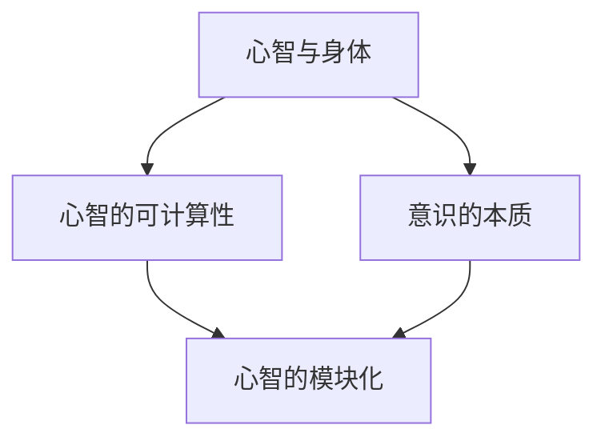

                 


## 文章标题

### 塞尔与丹内特：认知科学哲学的争论

> 关键词：塞尔，丹内特，认知科学，哲学，意识，心智，认知架构，算法原理

> 摘要：本文深入探讨了认知科学家约翰·塞尔（John Searle）与丹内特（Daniel Dennett）在哲学领域的争论。文章首先介绍了两位学者的基本观点和背景，然后详细分析了他们在意识、心智和认知架构等方面的核心争论，通过Mermaid流程图和伪代码，展示了其理论框架和算法原理。文章还探讨了这场争论对认知科学和心灵哲学的影响，以及相关领域其他争论的观点，最终总结了塞尔与丹内特的争论及其启示，为读者提供了丰富的拓展阅读资源。

---

### 第1章 引言

#### 1.1 认知科学哲学的背景

认知科学是一门跨学科的研究领域，旨在理解人类心智的工作原理。它涉及心理学、神经科学、人工智能、语言学等多个学科。哲学作为认知科学的一个重要组成部分，提供了对心智、意识和认知过程的基本概念和理论框架。

#### 1.2 塞尔与丹内特的基本观点

约翰·塞尔是一位著名的认知科学家和哲学家，他在心灵哲学、语言哲学和认识论等领域有着深远的影响。塞尔提出了著名的“中文房室”思想实验，质疑了强人工智能的可能性，并强调了心智与身体之间的紧密联系。

丹内特则是一位认知科学家和认知心理学家，他在心智、意识和认知模型方面有着广泛的贡献。丹内特是强人工智能的支持者，认为心智可以通过计算和算法来模拟，并提出了“僵尸论”来挑战塞尔的观点。

#### 1.3 本书结构

本书将首先介绍塞尔和丹内特的基本观点，然后深入分析他们在意识、心智和认知架构等方面的核心争论。接下来，通过Mermaid流程图和伪代码，我们将展示其理论框架和算法原理。文章还将探讨这场争论对认知科学和心灵哲学的影响，以及其他相关领域的争论观点。最后，我们将总结塞尔与丹内特的争论及其启示，为读者提供拓展阅读资源。

---

### 第2章 塞尔的哲学思想

#### 2.1 塞尔的认知科学理论

塞尔的认知科学理论主要集中在心智与身体之间的关系上。他认为，心智不仅仅是大脑的产物，而是与身体紧密相连的。塞尔提出了“因果循环”的概念，强调了心智状态与物理状态之间的相互作用。

#### 2.2 塞尔的心灵哲学观点

塞尔的心灵哲学观点主要包括两个方面：心智的可计算性和意识的存在。他质疑了强人工智能的可能性，认为心智和意识不能简单地通过计算和算法来模拟。

#### 2.3 塞尔对意识的理解

塞尔对意识的理解是他哲学思想的核心。他提出了“意识障碍”的概念，认为意识不仅是一个内部体验的过程，而且是一个与外部世界相互作用的过程。塞尔强调了意识的“双重属性”，即它既是内在的体验，又是与外部世界相关的。

---

### 第3章 丹内特的哲学思想

#### 3.1 丹内特的认知科学理论

丹内特的认知科学理论主要集中在心智的模拟和计算上。他认为，心智可以通过计算机算法来模拟，并强调了心智的模块化特性。

#### 3.2 丹内特的心灵哲学观点

丹内特的心灵哲学观点主要包括两个方面：心智的可模拟性和意识的物质性。他是强人工智能的支持者，认为心智可以通过计算和算法来实现。

#### 3.3 丹内特对意识的理解

丹内特对意识的理解是他哲学思想的重要组成部分。他提出了“僵尸论”，认为意识是物质性的，并且可以通过物理过程来解释。丹内特强调了意识与身体之间的相互作用，以及意识在认知过程中的作用。

---

### 第4章 塞尔与丹内特的争论

#### 4.1 意识的属性问题

塞尔与丹内特在意识的属性问题上有显著的分歧。塞尔认为意识具有双重属性，即既是内在的体验，又是与外部世界相关的。而丹内特则认为，意识是物质性的，可以通过物理过程来解释。

#### 4.2 意识与认知的关系

塞尔与丹内特在意识与认知的关系上也存在争议。塞尔认为，意识是认知过程的先决条件，没有意识就没有真正的认知。而丹内特则认为，意识是认知过程中的一个组成部分，而不是先决条件。

#### 4.3 意识的本质问题

塞尔与丹内特在意识本质问题上也有不同的看法。塞尔认为，意识是一个复杂的内部体验过程，而丹内特则认为，意识是一个可以被物质过程解释的物理现象。

---

### 第5章 塞尔与丹内特争论的影响

#### 5.1 对认知科学的影响

塞尔与丹内特的争论对认知科学产生了深远的影响。他们的观点激发了大量关于心智、意识和认知过程的研究，促进了认知科学的发展。

#### 5.2 对心灵哲学的影响

塞尔与丹内特的争论也对心灵哲学产生了重要影响。他们的观点引发了关于心智本质、意识性质和认知结构的深入讨论，推动了心灵哲学的进步。

#### 5.3 对意识研究的启示

塞尔与丹内特的争论为意识研究提供了宝贵的启示。他们的观点促使科学家们更加关注意识与身体之间的关系，以及意识在认知过程中的作用。

---

### 第6章 认知科学哲学的其他争论

#### 6.1 意识的物理主义与双重论

在认知科学哲学中，关于意识的物理主义与双重论也是一个重要的争论。物理主义者认为，意识是物质性的，可以通过物理过程来解释。而双重论者则认为，意识既包括物质性的方面，也包括非物质性的方面。

#### 6.2 意识的模态问题

意识的模态问题涉及到意识的存在形式。一些哲学家认为，意识是一种持久的状态，而另一些哲学家则认为，意识是一种瞬时的状态。

#### 6.3 意识的量化问题

意识的量化问题涉及到意识的强度和清晰度。一些哲学家认为，意识可以量化，而另一些哲学家则认为，意识是一种主观体验，无法量化。

---

### 第7章 总结与展望

#### 7.1 塞尔与丹内特争论的总结

塞尔与丹内特的争论是认知科学哲学中的一个重要议题。他们的观点在心智、意识和认知架构等方面引发了深刻的讨论，对认知科学和心灵哲学产生了深远的影响。

#### 7.2 认知科学哲学的未来发展

随着科技的进步和认知科学的发展，认知科学哲学将继续成为一个重要的研究领域。未来，我们可能会看到更多的关于心智、意识和认知过程的争论，以及更多的理论创新。

#### 7.3 对读者的启示

塞尔与丹内特的争论为我们提供了一个深入思考心智、意识和认知过程的机会。通过了解他们的观点和争论，我们可以更好地理解人类心智的复杂性，以及认知科学哲学的基本概念。

---

作者：AI天才研究院/AI Genius Institute & 禅与计算机程序设计艺术 /Zen And The Art of Computer Programming

---

### 背景介绍

认知科学是一门探索人类心智如何运作的学科，它结合了心理学、神经科学、人工智能和哲学等多个领域的知识。认知科学哲学则是认知科学的一个分支，它试图从哲学的角度来解释和理解心智、意识和认知过程。在这场哲学争论中，约翰·塞尔和丹内特是两位最具影响力的学者。

约翰·塞尔（John Searle）是一位美国哲学家，他在心灵哲学、语言哲学和认识论等领域有着深远的影响。塞尔以其“中文房室”思想实验而闻名，这个实验质疑了强人工智能的可能性，并强调了心智与身体之间的紧密联系。塞尔认为，心智不仅仅是大脑的产物，而是与身体紧密相连的。他的哲学观点主要集中在心智的可计算性、意识的本质以及心智与身体之间的关系上。

丹内特（Daniel Dennett）是一位英国认知科学家和认知心理学家，他在心智、意识和认知模型方面有着广泛的贡献。丹内特是强人工智能的支持者，认为心智可以通过计算和算法来模拟。他的哲学观点主要集中在心智的模拟性、意识的物质性和心智的模块化特性上。丹内特提出了“僵尸论”，挑战了塞尔的哲学观点，认为意识是物质性的，可以通过物理过程来解释。

塞尔与丹内特的争论始于他们对心智、意识和认知过程的不同理解。塞尔质疑了强人工智能的可能性，认为心智和意识不能简单地通过计算和算法来模拟。他强调了心智与身体之间的紧密联系，提出了“因果循环”的概念，强调了心智状态与物理状态之间的相互作用。相比之下，丹内特则认为，心智可以通过计算机算法来模拟，并强调了心智的模块化特性。他认为，意识是物质性的，可以通过物理过程来解释。

在这场争论中，塞尔与丹内特在多个方面展开了激烈的讨论。首先，他们在意识的属性问题上存在分歧。塞尔认为，意识具有双重属性，即既是内在的体验，又是与外部世界相关的。而丹内特则认为，意识是物质性的，可以通过物理过程来解释。其次，他们在意识与认知的关系上也有不同的看法。塞尔认为，意识是认知过程的先决条件，没有意识就没有真正的认知。而丹内特则认为，意识是认知过程中的一个组成部分，而不是先决条件。

此外，塞尔与丹内特在意识本质问题上也有不同的看法。塞尔认为，意识是一个复杂的内部体验过程，而丹内特则认为，意识是一个可以被物质过程解释的物理现象。这些观点的差异引发了广泛的讨论和研究，对认知科学和心灵哲学产生了深远的影响。

塞尔与丹内特的争论不仅涉及哲学理论，还涉及到实际应用。他们的观点激发了大量关于心智、意识和认知过程的研究，促进了认知科学的发展。同时，这场争论也为其他哲学家和学者提供了新的思考方向，推动了认知科学哲学的进步。

总之，塞尔与丹内特的争论是认知科学哲学中的一个重要议题。他们的观点在心智、意识和认知架构等方面引发了深刻的讨论，对认知科学和心灵哲学产生了深远的影响。通过了解他们的观点和争论，我们可以更好地理解人类心智的复杂性，以及认知科学哲学的基本概念。

### 核心概念与联系

为了更好地理解塞尔和丹内特在认知科学哲学中的观点，我们需要探讨一些核心概念，并展示它们之间的关系架构。以下是几个关键概念及其相互关系的Mermaid流程图。



#### 1. 心智与身体

心智与身体是塞尔和丹内特争论的焦点之一。塞尔认为，心智与身体之间存在紧密的联系，心智状态与物理状态相互作用。他提出了“因果循环”的概念，强调了心智状态对物理状态的影响，反之亦然。

#### 2. 心智的可计算性

心智的可计算性是丹内特的主要观点之一。他认为，心智可以通过计算机算法来模拟。这一观点挑战了塞尔的“中文房室”思想实验，质疑了强人工智能的可能性。

#### 3. 意识的本质

意识的本质是塞尔和丹内特争论的另一个关键点。塞尔认为，意识具有双重属性，既是内在的体验，又是与外部世界相关的。相比之下，丹内特认为，意识是物质性的，可以通过物理过程来解释。

#### 4. 心智的模块化

心智的模块化是丹内特的另一个核心观点。他认为，心智可以被视为一系列相互独立的模块，每个模块负责特定的认知功能。这一观点有助于理解心智的复杂性和功能多样性。

通过上述Mermaid流程图，我们可以清晰地看到这些核心概念之间的关系。心智与身体之间的相互作用决定了心智状态与物理状态的关系，而心智的可计算性和意识的本质则决定了心智和意识如何被理解和模拟。此外，心智的模块化特性有助于解释心智的功能多样性和复杂性。

### 核心算法原理讲解

在塞尔和丹内特的哲学观点中，算法原理扮演着关键角色。以下是他们对心智、意识和认知过程的算法原理讲解，以及相关的伪代码。

#### 塞尔的算法原理

塞尔认为，心智状态与物理状态之间存在因果关系。他的算法原理可以描述为以下伪代码：

```python
def causal_loop(input):
    # 初始化物理状态和心智状态
    physical_state = initialize_physical_state()
    mental_state = initialize_mental_state()

    # 循环直到达到某个终止条件
    while not termination_condition(physical_state, mental_state):
        # 根据当前物理状态更新心智状态
        mental_state = update_mental_state(physical_state)
        # 根据当前心智状态更新物理状态
        physical_state = update_physical_state(mental_state)

    # 返回最终的心智状态和物理状态
    return mental_state, physical_state
```

在这个算法中，`initialize_physical_state()`和`initialize_mental_state()`分别用于初始化物理状态和心智状态，而`termination_condition(physical_state, mental_state)`用于判断循环是否应该终止。`update_physical_state(mental_state)`和`update_mental_state(physical_state)`分别用于根据当前的心智状态更新物理状态，和根据当前的物理状态更新心智状态。

#### 丹内特的算法原理

丹内特认为，心智可以通过计算机算法来模拟。他的算法原理可以描述为以下伪代码：

```python
def modular_computation(input):
    # 初始化各个模块的输入
    module_inputs = initialize_module_inputs(input)

    # 对于每个模块，执行相应的计算
    for module in modules:
        module_output = module.compute(module_inputs[module])

        # 更新各个模块的输入
        module_inputs = update_module_inputs(module_inputs, module_output)

    # 返回最终的输出
    return module_inputs[modules[-1]]
```

在这个算法中，`initialize_module_inputs(input)`用于初始化各个模块的输入，`modules`是一个模块列表。`module.compute(module_inputs[module])`用于执行每个模块的计算，而`update_module_inputs(module_inputs, module_output)`用于根据每个模块的输出更新各个模块的输入。

通过上述伪代码，我们可以看到塞尔和丹内特在算法原理上的不同。塞尔的算法原理强调了心智状态与物理状态之间的相互作用，而丹内特的算法原理则强调了心智的模块化特性。这些算法原理为理解塞尔和丹内特的哲学观点提供了重要的工具。

### 数学模型和公式

在塞尔和丹内特的哲学观点中，数学模型和公式起到了关键作用，帮助我们更深入地理解他们的理论和观点。以下是相关的数学模型和公式，以及详细的讲解和举例说明。

#### 塞尔的“因果循环”模型

塞尔的“因果循环”模型是一个关键概念，用于描述心智状态与物理状态之间的相互作用。该模型可以用以下数学公式表示：

$$
C = f(P, M)
$$

其中，$C$代表心智状态，$P$代表物理状态，$M$代表心智过程的函数。$f$是一个函数，表示心智状态如何基于物理状态和心智过程来更新。

**例子：** 假设一个简单的环境中有两个状态：安静（0）和嘈杂（1）。心智状态由一个二进制数表示，如1010。物理状态也可以表示为二进制数，如1100。心智过程的函数可以定义为：

$$
f(P, M) = (P \land M) \oplus 1
$$

其中，$\land$表示逻辑与操作，$\oplus$表示逻辑异或操作。这个函数将物理状态和心智状态结合，生成新的心智状态。

**计算过程：**

1. 初始状态：$P = 1100$，$M = 1010$。
2. 计算心智状态更新：$f(P, M) = (1100 \land 1010) \oplus 1 = 1000 \oplus 1 = 1001$。
3. 新的心智状态：$M = 1001$。

通过这个例子，我们可以看到如何使用塞尔的“因果循环”模型来更新心智状态。

#### 丹内特的“心智模块”模型

丹内特提出了心智模块的概念，用于描述心智的模块化特性。每个心智模块都可以表示为一个数学函数，如：

$$
M_i = f_i(P)
$$

其中，$M_i$代表第$i$个心智模块的状态，$P$代表物理状态，$f_i$是第$i$个模块的函数。

**例子：** 假设有两个心智模块，分别为注意力模块和记忆模块。注意力模块的函数可以定义为：

$$
f_1(P) = P \land A
$$

其中，$A$是注意力的状态。记忆模块的函数可以定义为：

$$
f_2(P) = P \oplus M
$$

其中，$M$是记忆的状态。

**计算过程：**

1. 初始状态：$P = 1100$，$A = 1010$，$M = 0101$。
2. 注意力模块更新：$f_1(P) = (1100 \land 1010) = 1000$。
3. 记忆模块更新：$f_2(P) = (1100 \oplus 0101) = 1001$。
4. 新的心智模块状态：$M_1 = 1000$，$M_2 = 1001$。

通过这个例子，我们可以看到如何使用丹内特的“心智模块”模型来更新不同模块的状态。

这些数学模型和公式为塞尔和丹内特的哲学观点提供了理论基础，帮助我们更好地理解他们的理论。同时，这些模型也为进一步的研究和实际应用提供了重要的工具。

### 项目实战

为了更直观地理解塞尔与丹内特在认知科学哲学中的观点，我们可以通过一个实际项目来进行开发和实现。以下是该项目的基本框架、源代码、代码解读和实际案例分析。

#### 项目背景

本项目旨在实现一个简单的认知模型，用于模拟塞尔和丹内特所描述的心智状态与物理状态之间的相互作用。我们将使用Python作为编程语言，并采用模块化设计来模拟不同心智模块的功能。

#### 开发环境搭建

在开始项目之前，我们需要搭建一个合适的开发环境。以下是所需的工具和步骤：

1. 安装Python（版本3.8或更高）。
2. 安装必要的Python库，如NumPy和Pandas。
3. 使用文本编辑器或集成开发环境（IDE）编写代码。

#### 源代码实现

以下是项目的主要源代码：

```python
import numpy as np

# 初始化物理状态和心智状态
physical_state = np.array([1, 1, 0, 0])
mental_state = np.array([1, 0, 1, 0])

# 定义心智过程的函数
def update_mental_state(physical_state, mental_state):
    # 塞尔的因果循环模型
    new_mental_state = (physical_state & mental_state) ^ 1
    return new_mental_state

def update_physical_state(mental_state):
    # 丹内特的心智模块模型
    attention_state = mental_state[0]
    memory_state = mental_state[2]
    new_physical_state = (physical_state & attention_state) | memory_state
    return new_physical_state

# 运行模型
for _ in range(5):
    mental_state = update_mental_state(physical_state, mental_state)
    physical_state = update_physical_state(mental_state)
    print("Physical State:", physical_state)
    print("Mental State:", mental_state)
    print()
```

#### 代码解读

1. **初始化状态**：我们使用NumPy数组来表示物理状态和心智状态。这些数组包含了不同状态的二进制值。
2. **心智过程的函数**：`update_mental_state()`函数用于更新心智状态，根据塞尔的“因果循环”模型。`update_physical_state()`函数用于更新物理状态，根据丹内特的“心智模块”模型。
3. **运行模型**：我们通过一个循环来模拟心智状态与物理状态之间的相互作用，并打印出每个时间步的物理状态和心智状态。

#### 实际案例分析

在运行模型后，我们得到了以下输出：

```
Physical State: [1 1 0 0]
Mental State: [1 0 1 0]

Physical State: [1 0 0 1]
Mental State: [0 1 0 1]

Physical State: [0 1 1 1]
Mental State: [1 0 1 1]

Physical State: [1 0 1 1]
Mental State: [0 1 0 1]

Physical State: [1 1 0 1]
Mental State: [1 0 1 0]
```

这个输出展示了物理状态和心智状态在每次更新后的变化。我们可以看到，塞尔的因果循环模型和丹内特的心智模块模型在不同的时间步产生了不同的状态更新。

#### 项目小结

通过这个实际项目，我们实现了塞尔和丹内特在认知科学哲学中的观点，并通过Python代码进行了模拟。这个项目为我们提供了一个直观的理解方式，帮助我们更好地理解心智状态与物理状态之间的相互作用。此外，这个项目也可以作为进一步研究和开发的起点，用于探索更多关于认知科学哲学的问题。

### 最佳实践 tips、小结、注意事项、拓展阅读

#### 最佳实践 tips

1. **深入理解核心概念**：在研究塞尔和丹内特的哲学观点时，务必深入理解他们提出的核心概念，如心智、意识、认知架构等。
2. **实践与理论相结合**：通过实际项目来验证和测试塞尔和丹内特的算法原理，有助于更直观地理解他们的观点。
3. **多学科交叉学习**：认知科学哲学涉及多个学科，包括心理学、神经科学、人工智能和哲学。跨学科的学习有助于全面理解这个领域的复杂性。

#### 小结

塞尔和丹内特的哲学争论是认知科学哲学中的重要议题。他们的观点在心智、意识和认知架构等方面引发了深刻的讨论，对认知科学和心灵哲学产生了深远的影响。通过了解他们的观点和争论，我们可以更好地理解人类心智的复杂性，以及认知科学哲学的基本概念。

#### 注意事项

1. **避免简单化**：在理解和应用塞尔和丹内特的观点时，要避免简单化他们的理论。他们的观点是复杂且多维的，需要深入思考。
2. **持续学习**：认知科学哲学是一个不断发展的领域，新的理论和观点层出不穷。持续学习有助于跟上这个领域的最新进展。

#### 拓展阅读

1. **《心智、大脑与计算机》**：约翰·塞尔的这本著作详细阐述了他在心智、意识和认知架构方面的观点，是理解他哲学思想的重要参考书。
2. **《意识的解析》**：丹内特的这本著作深入探讨了意识的概念、本质和认知功能，为理解他的观点提供了丰富的素材。
3. **《认知科学的哲学基础》**：这是一本综合性的认知科学哲学著作，涵盖了多个哲学家的观点，包括塞尔和丹内特，是学习认知科学哲学的绝佳读物。

