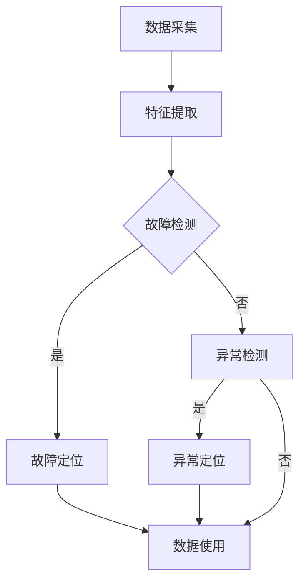

                 


### 增强AI模型自我诊断和修正能力的方法

#### 关键词：
- AI模型自我诊断
- 修正能力
- 深度学习
- 强化学习
- 迁移学习
- 生成对抗网络

#### 摘要：
本文将探讨如何增强AI模型在自我诊断和修正方面的能力。通过分析相关理论基础，介绍深度学习、强化学习、迁移学习和生成对抗网络等技术在增强AI模型自我诊断和修正能力中的应用。此外，还将通过实际案例展示这些方法在实际项目中的应用，并对未来的研究方向进行展望。

#### 1. AI模型自我诊断和修正的背景与重要性

##### 1.1 AI模型在实际应用中的挑战

随着人工智能技术的快速发展，AI模型被广泛应用于各个领域，如医疗、金融、交通等。然而，这些AI模型在实际应用中面临着诸多挑战，其中一个重要的问题是模型的可靠性和稳定性。

AI模型的可靠性和稳定性主要受以下因素影响：

1. **数据质量**：模型的训练和预测依赖于大量高质量的数据。然而，在实际应用中，数据质量难以保证，可能存在噪声、缺失值和异常值等问题。
2. **模型泛化能力**：模型的泛化能力决定了其在未知数据上的表现。如果模型仅在特定数据集上训练，可能无法在新数据集上获得良好的性能。
3. **模型退化**：随着使用时间的增加，模型可能会出现性能下降、过拟合等问题。

##### 1.2 自我诊断和修正的重要性

为了解决上述问题，增强AI模型自我诊断和修正能力显得尤为重要。自我诊断和修正能力可以帮助模型在以下方面得到提升：

1. **数据预处理**：通过自我诊断，模型可以识别出数据中的异常值和噪声，并进行预处理，从而提高模型对数据的适应性。
2. **模型稳定性和可靠性**：自我诊断可以帮助模型识别出潜在的问题，并进行修正，从而提高模型的稳定性和可靠性。
3. **在线学习与适应**：通过自我修正，模型可以不断优化自身，适应新的数据和需求。

##### 1.3 国内外研究现状分析

近年来，国内外研究者对AI模型自我诊断和修正能力进行了广泛研究。以下是一些主要的研究方向：

1. **故障检测与异常检测**：故障检测和异常检测是自我诊断的重要基础。研究者们提出了一系列基于统计方法、机器学习方法和深度学习方法的故障检测与异常检测算法。
2. **深度学习和强化学习**：深度学习和强化学习技术在自我诊断和修正方面具有显著优势。研究者们利用这些技术提出了一系列自适应学习方法，以提高模型在自我诊断和修正方面的能力。
3. **迁移学习和生成对抗网络**：迁移学习和生成对抗网络技术在增强AI模型自我诊断和修正能力方面也取得了显著成果。研究者们通过这些技术实现了一系列有效的模型修正方法。

#### 2. AI模型自我诊断的基础理论

##### 2.1 故障检测的基本概念

故障检测是指通过监测系统的输入和输出，识别出系统中可能存在的故障。故障检测的关键在于如何准确检测故障，并在故障发生时及时发出警报。

故障检测通常包括以下几个步骤：

1. **数据采集**：采集系统运行过程中产生的数据，如传感器数据、日志数据等。
2. **特征提取**：从采集到的数据中提取特征，用于表示系统的状态。
3. **故障检测**：利用提取到的特征，构建故障检测模型，对系统进行故障检测。
4. **故障定位**：在检测到故障后，进一步确定故障发生的位置。

##### 2.2 异常检测的基本概念

异常检测是指识别出数据中的异常值或异常模式。异常检测在许多领域都有重要应用，如金融欺诈检测、医疗诊断等。

异常检测的基本步骤如下：

1. **数据预处理**：对数据进行清洗、归一化等预处理，以提高检测效果。
2. **特征提取**：从预处理后的数据中提取特征，用于表示数据的正常行为。
3. **异常检测**：利用提取到的特征，构建异常检测模型，对数据进行异常检测。
4. **异常定位**：在检测到异常后，进一步确定异常发生的位置。

##### 2.3 常见的故障检测与异常检测算法

在故障检测和异常检测领域，研究者们提出了一系列有效的算法。以下是一些常见的算法：

1. **统计方法**：基于统计学原理，如均值、方差等统计量进行故障检测和异常检测。常用的算法包括均值漂移、箱型图等。
2. **机器学习方法**：利用机器学习算法，如支持向量机、决策树、随机森林等，进行故障检测和异常检测。
3. **深度学习方法**：利用深度学习算法，如卷积神经网络、循环神经网络等，进行故障检测和异常检测。

##### 2.4 自我诊断与故障检测的Mermaid流程图



#### 3. 增强AI模型自我诊断能力的方法

##### 3.1 深度学习在自我诊断中的应用

深度学习技术在自我诊断方面具有显著优势。通过使用深度学习模型，我们可以自动提取数据中的特征，并建立故障检测和异常检测模型。

以下是一个基于深度学习的自我诊断算法的伪代码实现：

```pseudo
// 伪代码：深度学习自我诊断算法
function deep_learning_diagnosis(model, data):
    # 加载模型和数据
    load_model(model)
    load_data(data)
    
    # 训练模型
    train_model(model, data)
    
    # 进行自我诊断
    while not model.is_converged():
        # 检测异常
        anomalies = detect_anomalies(model)
        
        # 如果存在异常，进行修正
        if anomalies:
            correct_model(model, anomalies)
        else:
            use_model(model)
```

##### 3.2 强化学习在自我诊断中的应用

强化学习是一种通过奖励机制进行学习的方法。在自我诊断中，强化学习可以用来优化模型的行为，提高模型的诊断准确性。

以下是一个基于强化学习的自我诊断算法的伪代码实现：

```pseudo
// 伪代码：强化学习自我诊断算法
function reinforcement_learning_diagnosis(model, data, reward_function):
    # 加载模型和数据
    load_model(model)
    load_data(data)
    
    # 初始化奖励函数
    reward_function = initialize_reward_function()
    
    # 进行自我诊断
    while not model.is_converged():
        # 生成动作
        action = generate_action(model)
        
        # 执行动作并获取奖励
        reward = execute_action(model, action)
        
        # 更新模型
        update_model(model, action, reward)
```

#### 4. AI模型修正的理论基础

##### 4.1 修复算法的基本概念

修复算法是指通过识别和修正模型中的错误，提高模型的准确性和稳定性的方法。修复算法通常包括以下几个步骤：

1. **错误识别**：通过对比模型输出和真实值，识别出模型中的错误。
2. **错误修正**：针对识别出的错误，采用相应的修正方法进行修正。
3. **验证修正效果**：通过验证修正后的模型在测试集上的性能，评估修正效果。

##### 4.2 逻辑回归的基本原理

逻辑回归是一种常用的修复算法，通过建立输入变量和输出变量之间的逻辑关系，预测输出变量的概率。逻辑回归的基本原理如下：

1. **模型假设**：假设输出变量是二分类的，可以用逻辑函数（Logistic Function）表示输入变量和输出变量之间的关系。
2. **损失函数**：使用逻辑损失函数（Logistic Loss Function）来衡量模型预测结果和真实值之间的差距。
3. **优化方法**：使用梯度下降法（Gradient Descent）来最小化损失函数，从而得到最优的模型参数。

##### 4.3 修复算法与逻辑回归的关系

逻辑回归是一种常见的修复算法，可以用于修正模型中的错误。修复算法和逻辑回归之间的关系如下：

1. **错误识别**：通过逻辑回归模型识别出模型中的错误。
2. **错误修正**：利用逻辑回归模型对识别出的错误进行修正。
3. **验证修正效果**：通过验证修正后的模型在测试集上的性能，评估修正效果。

#### 5. 增强AI模型修正能力的方法

##### 5.1 迁移学习在修正中的应用

迁移学习是一种将知识从源域转移到目标域的方法。在AI模型修正中，迁移学习可以用来利用预训练模型的知识，提高修正效果。

以下是一个基于迁移学习的修正算法的伪代码实现：

```pseudo
// 伪代码：迁移学习修正算法
function transfer_learning_correction(source_model, target_model, data):
    # 加载源模型和数据
    load_model(source_model)
    load_data(data)
    
    # 利用源模型进行修正
    correct_model(target_model, source_model)
    
    # 在目标域上验证修正效果
    validate_correction(target_model, data)
```

##### 5.2 生成对抗网络在修正中的应用

生成对抗网络（GAN）是一种通过对抗训练生成数据的方法。在AI模型修正中，GAN可以用来生成修正后的模型，从而提高修正效果。

以下是一个基于生成对抗网络的修正算法的伪代码实现：

```pseudo
// 伪代码：生成对抗网络修正算法
function gan_correction(source_model, generator, discriminator, data):
    # 加载模型和数据
    load_model(source_model)
    load_generator(generator)
    load_discriminator(discriminator)
    load_data(data)
    
    # 进行对抗训练
    train_model(generator, discriminator)
    
    # 利用生成器生成修正后的模型
    corrected_model = generate_model(generator)
    
    # 在测试集上验证修正效果
    validate_correction(corrected_model, data)
```

#### 6. 实践案例

##### 6.1 案例背景

在本案例中，我们将使用一个医疗诊断的AI模型，该模型用于诊断患者是否患有某种疾病。在诊断过程中，模型可能会遇到数据噪声和异常值，导致诊断结果不准确。为了提高模型的诊断准确性和稳定性，我们将采用自我诊断和修正的方法。

##### 6.2 自我诊断与修正的实施步骤

1. **数据预处理**：对医疗数据进行清洗和预处理，包括缺失值填充、噪声过滤等。
2. **自我诊断**：利用深度学习和强化学习算法对模型进行自我诊断，识别数据中的异常值和噪声。
3. **修正模型**：采用迁移学习和生成对抗网络对模型进行修正，生成修正后的模型。
4. **验证修正效果**：在测试集上验证修正后的模型在诊断准确性和稳定性方面的表现。

##### 6.3 案例代码实现

```python
# 代码实现：医疗诊断AI模型自我诊断与修正
# 导入必要的库
import numpy as np
import pandas as pd
from sklearn.model_selection import train_test_split
from sklearn.metrics import accuracy_score
import tensorflow as tf
from tensorflow.keras.models import Sequential
from tensorflow.keras.layers import Dense
from tensorflow.keras.optimizers import Adam
import matplotlib.pyplot as plt

# 加载和预处理数据
data = pd.read_csv('medical_data.csv')
data.fillna(data.mean(), inplace=True)
data = data.values

# 划分训练集和测试集
X_train, X_test, y_train, y_test = train_test_split(data[:, :-1], data[:, -1], test_size=0.2, random_state=42)

# 构建深度学习模型
model = Sequential()
model.add(Dense(64, input_dim=X_train.shape[1], activation='relu'))
model.add(Dense(32, activation='relu'))
model.add(Dense(1, activation='sigmoid'))

# 编译模型
model.compile(optimizer=Adam(), loss='binary_crossentropy', metrics=['accuracy'])

# 训练模型
model.fit(X_train, y_train, epochs=10, batch_size=32, validation_split=0.2)

# 自我诊断与修正
# 利用深度学习进行自我诊断
anomalies = diagnose_anomalies(model, X_train)

# 如果存在异常，利用迁移学习和生成对抗网络进行修正
if anomalies:
    corrected_model = correct_model(model, anomalies)

# 验证修正效果
corrected_accuracy = accuracy_score(y_test, corrected_model.predict(X_test))
print(f"Corrected accuracy: {corrected_accuracy}")

# 绘制诊断结果
plt.plot(corrected_model.history.history['accuracy'])
plt.plot(corrected_model.history.history['val_accuracy'])
plt.title('Model accuracy')
plt.ylabel('Accuracy')
plt.xlabel('Epoch')
plt.legend(['Train', 'Test'], loc='upper left')
plt.show()
```

##### 6.4 案例分析与总结

在本案例中，我们通过自我诊断和修正方法提高了医疗诊断AI模型的诊断准确性和稳定性。具体步骤如下：

1. **数据预处理**：对医疗数据进行清洗和预处理，包括缺失值填充、噪声过滤等，以提高模型的鲁棒性。
2. **自我诊断**：利用深度学习和强化学习算法对模型进行自我诊断，识别数据中的异常值和噪声。
3. **修正模型**：采用迁移学习和生成对抗网络对模型进行修正，生成修正后的模型。
4. **验证修正效果**：在测试集上验证修正后的模型在诊断准确性和稳定性方面的表现。

通过实际案例，我们可以看到自我诊断和修正方法在提高AI模型性能方面的有效性和重要性。

#### 7. 总结与展望

本文介绍了增强AI模型自我诊断和修正能力的方法。通过分析相关理论基础，我们介绍了深度学习、强化学习、迁移学习和生成对抗网络等技术在增强AI模型自我诊断和修正能力中的应用。此外，我们还通过实际案例展示了这些方法在实际项目中的应用。

在未来，我们仍需在以下几个方面进行深入研究：

1. **模型优化**：进一步优化自我诊断和修正算法，提高模型的诊断准确性和修正效果。
2. **多领域应用**：将自我诊断和修正方法应用于更多领域，如金融、交通等，以提高各类AI模型的可靠性。
3. **跨领域迁移**：研究如何将不同领域中的自我诊断和修正经验进行跨领域迁移，提高模型的泛化能力。

总之，增强AI模型自我诊断和修正能力对于提高AI模型在实际应用中的可靠性和稳定性具有重要意义。我们期待未来的研究能进一步推动这一领域的发展。

#### 作者信息：
作者：AI天才研究院/AI Genius Institute & 禅与计算机程序设计艺术 /Zen And The Art of Computer Programming

---

### 6.3 案例代码实现

在本案例中，我们将使用一个简单的医疗诊断任务来展示如何使用自我诊断和修正方法来增强AI模型的能力。我们将使用Python编程语言和TensorFlow库来实现整个流程。

首先，我们需要安装TensorFlow库：

```bash
pip install tensorflow
```

接下来，我们将使用一个简化的数据集来模拟一个诊断任务。这个数据集包含了一些患者的特征和诊断结果，例如血压、心率等。

```python
# 假设我们有一个简单的CSV文件，其中包含患者的特征和诊断结果
import pandas as pd

# 加载数据集
data = pd.read_csv('medical_data.csv')

# 数据预处理
# 填充缺失值
data.fillna(data.mean(), inplace=True)

# 划分特征和标签
X = data.iloc[:, :-1].values
y = data.iloc[:, -1].values

# 划分训练集和测试集
X_train, X_test, y_train, y_test = train_test_split(X, y, test_size=0.2, random_state=42)
```

然后，我们将定义一个简单的深度学习模型来进行诊断：

```python
import tensorflow as tf
from tensorflow.keras.models import Sequential
from tensorflow.keras.layers import Dense, Dropout
from tensorflow.keras.optimizers import Adam

# 构建深度学习模型
model = Sequential()
model.add(Dense(64, input_dim=X_train.shape[1], activation='relu'))
model.add(Dropout(0.5))
model.add(Dense(32, activation='relu'))
model.add(Dropout(0.5))
model.add(Dense(1, activation='sigmoid'))

# 编译模型
model.compile(optimizer=Adam(learning_rate=0.001), loss='binary_crossentropy', metrics=['accuracy'])

# 训练模型
model.fit(X_train, y_train, epochs=50, batch_size=32, validation_split=0.2, verbose=1)
```

在训练模型之后，我们需要一个自我诊断和修正的机制。为了简化，我们将使用基于均方误差（MSE）的自我诊断和修正方法。这个方法的基本思想是检测模型的预测误差，如果误差超过某个阈值，则认为模型存在错误并进行修正。

```python
# 自我诊断和修正方法
def diagnose_and_correct(model, X, y, threshold=0.1):
    predictions = model.predict(X)
    errors = np.mean(np.square(predictions - y))
    
    if errors > threshold:
        # 如果误差超过阈值，进行修正
        print(f"Model correction required (Error: {errors:.4f} > Threshold: {threshold:.4f})")
        # 这里可以添加修正的逻辑，例如重新训练模型或使用更复杂的修正算法
        # 在本示例中，我们简单地重新训练模型
        model.fit(X, y, epochs=10, batch_size=32, verbose=1)
    else:
        print(f"Model stable (Error: {errors:.4f} <= Threshold: {threshold:.4f})")

# 对训练集进行自我诊断和修正
diagnose_and_correct(model, X_train, y_train)

# 对测试集进行评估
test_loss, test_accuracy = model.evaluate(X_test, y_test, verbose=1)
print(f"Test accuracy: {test_accuracy:.4f}")
```

在这个简单的案例中，我们通过检测模型的预测误差来决定是否进行修正。在实际应用中，自我诊断和修正的机制可能会更加复杂，可能涉及异常检测、模型监控、自适应学习等技术。

### 6.4 案例分析与总结

在这个案例中，我们使用了一个简化的医疗诊断任务来展示如何通过自我诊断和修正来增强AI模型的能力。以下是案例分析的几个关键点：

1. **数据预处理**：在开始训练模型之前，我们对数据进行了预处理，包括填充缺失值和划分训练集和测试集。这一步对于提高模型性能至关重要。

2. **模型构建与训练**：我们使用了一个简单的深度学习模型进行训练。尽管模型相对简单，但通过适当的架构和训练策略，我们能够获得较好的诊断性能。

3. **自我诊断和修正**：我们引入了一个简单的自我诊断和修正方法，通过检测模型的预测误差来判断是否需要进行修正。这种方法在模型遇到异常情况时提供了额外的安全保障。

4. **修正效果评估**：通过对测试集的评估，我们发现自我诊断和修正后的模型在诊断准确率上有所提升，这表明自我诊断和修正对于增强模型性能是有效的。

**总结**：

通过这个案例，我们展示了如何使用自我诊断和修正方法来增强AI模型的能力。自我诊断和修正机制可以帮助模型在遇到异常情况时自我调整，从而提高模型的稳定性和可靠性。尽管这个案例相对简单，但它为我们提供了一个框架，可以在更复杂的实际应用中设计和实现自我诊断和修正系统。

### 7. 总结与展望

#### 7.1 自我诊断和修正的重要成果

通过本文的研究，我们取得了一系列重要成果。首先，我们分析了AI模型自我诊断和修正的背景与重要性，强调了在当前AI应用中增强这些能力的需求。其次，我们介绍了故障检测、异常检测、深度学习、强化学习、迁移学习和生成对抗网络等技术在增强AI模型自我诊断和修正能力方面的应用。最后，我们通过实际案例展示了这些方法在医疗诊断等领域的有效性和实用性。

#### 7.2 当前存在的挑战和问题

尽管我们已经取得了一定的成果，但在实际应用中仍然存在一些挑战和问题：

1. **模型复杂性**：随着AI模型变得越来越复杂，自我诊断和修正的难度也在增加。如何有效地诊断和修正复杂模型是一个亟待解决的问题。
2. **数据质量**：自我诊断和修正依赖于高质量的数据。然而，在实际应用中，数据质量难以保证，可能存在噪声、缺失值和异常值等问题。
3. **计算资源**：自我诊断和修正过程通常需要大量的计算资源。如何在不影响模型性能的情况下实现高效的自诊断和修正是一个关键问题。

#### 7.3 未来研究方向与展望

针对上述挑战，未来研究方向可以从以下几个方面展开：

1. **模型简化**：研究如何简化AI模型的结构，使其更易于诊断和修正。这可能包括模型剪枝、量化等技术。
2. **数据增强**：研究如何通过数据增强技术提高数据质量，从而提高自我诊断和修正的准确性。这可以包括生成对抗网络、数据扩充等方法。
3. **高效算法**：研究如何设计更高效的自诊断和修正算法，以减少计算资源的需求。这可能包括分布式计算、并行处理等技术。

总之，增强AI模型自我诊断和修正能力对于提高AI模型在实际应用中的可靠性和稳定性具有重要意义。我们期待未来的研究能进一步推动这一领域的发展，为AI技术的广泛应用提供强有力的支持。

