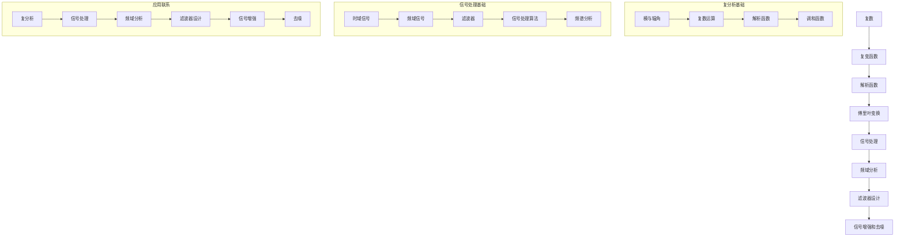

                 

### 引言

#### 复分析的基本概念

复分析（Complex Analysis）是数学中的一个重要分支，主要研究复数领域中的函数。复数是由实数和虚数构成的，形式上可以表示为 \( a + bi \)，其中 \( a \) 和 \( b \) 是实数，\( i \) 是虚数单位，满足 \( i^2 = -1 \)。复分析涉及复变函数、解析函数、级数、积分、留数、解析延拓等内容。

复分析的基本工具包括解析函数（也称为全纯函数），它们在整个复平面上都具有导数，并且具有很好的性质，如可导性、解析性、极值定理等。解析函数的一个重要特性是它们在有限区域内可以展开为幂级数，这使得复分析在理论研究和应用中具有很大的优势。

#### 信号处理算法的基本概念

信号处理是研究如何通过算法和系统对信号进行分析、处理、增强、滤波和压缩的一门技术。信号可以是连续的或离散的，可以是时间的、频率的或其他维度上的。常见的信号处理算法包括傅里叶变换、滤波器设计、卷积、相关、时频分析等。

信号处理算法的核心目的是从信号中提取有用的信息，或者对信号进行特定的变换和处理，以满足特定的应用需求。例如，在通信系统中，信号处理算法可以用于信号调制、解调、滤波和噪声抑制；在图像处理中，算法可以用于图像增强、边缘检测、分割和压缩等。

#### 复分析在信号处理中的应用

复分析在信号处理中的应用主要体现在以下几个方面：

1. **频域分析**：通过傅里叶变换，可以将时域信号转换到频域，进行频谱分析和滤波。复分析提供了许多工具和方法来处理频域信号，如傅里叶级数、傅里叶变换、拉普拉斯变换等。复数域上的解析函数理论可以提供更好的分析手段，使得频域处理更加高效和精确。

2. **滤波器设计**：复分析在滤波器设计中起着重要作用。例如，在数字信号处理中，IIR（无限冲激响应）滤波器和FIR（有限冲激响应）滤波器的设计通常涉及到复数域上的运算。通过复分析的方法，可以更直观地理解滤波器的频率响应特性，从而设计出更优的滤波器。

3. **信号增强和去噪**：复分析方法可以用于信号的增强和去噪。例如，通过复数域上的逆滤波和维纳滤波，可以有效去除信号中的噪声，同时保留信号的主要特征。

4. **相位和振幅分析**：在信号处理中，相位和振幅信息是非常重要的。复分析提供了直接处理这些信息的工具。例如，通过复数表示的相位和振幅可以方便地进行时频分析和特征提取。

5. **系统建模和仿真**：在信号处理系统的建模和仿真中，复分析可以提供有效的数学工具。通过建立系统的复数域模型，可以方便地进行系统性能分析和优化。

#### 小结

本文简要介绍了复分析和信号处理算法的基本概念，并探讨了复分析在信号处理中的应用。复分析通过提供强大的数学工具和理论框架，使得信号处理的算法设计更加高效、精确和灵活。接下来的章节将深入讨论复分析的基础知识、信号处理的基本理论，以及复分析在实际信号处理中的应用案例，帮助读者全面理解和掌握这一重要的交叉领域。

---

**关键词：复分析，信号处理，频域分析，滤波器设计，复数域**

**摘要：本文系统地介绍了复分析和信号处理算法的基本概念，并深入探讨了复分析在信号处理中的应用，包括频域分析、滤波器设计、信号增强和去噪等。通过具体实例和数学模型，本文展示了复分析如何提升信号处理算法的效率和精度。**

---

### 复分析基础

在探讨复分析在信号处理中的应用之前，我们需要先了解复分析的基本概念和工具。本章节将详细介绍复数的概念、复变函数的基本理论、解析函数和调和函数等内容。

#### 复数的概念

复数是数学中的一个基本概念，可以表示为 \( a + bi \)，其中 \( a \) 和 \( b \) 是实数部分和虚数部分，\( i \) 是虚数单位，满足 \( i^2 = -1 \)。复数可以直观地看作是实数轴上的一个点，也可以通过直角坐标系中的点来表示。复数的模（或绝对值）定义为复数到原点的距离，即 \( |z| = \sqrt{a^2 + b^2} \)。复数的辐角（或幅角）定义为复数与实轴的夹角，即 \( \theta = \arctan\left(\frac{b}{a}\right) \)。

复数的一些基本运算包括加法、减法、乘法和除法。复数的加法和减法与实数的运算类似，只需将虚数部分分别相加和相减。复数的乘法和除法可以通过以下公式进行计算：

- 复数乘法：\[ (a + bi)(c + di) = (ac - bd) + (ad + bc)i \]
- 复数除法：\[ \frac{a + bi}{c + di} = \frac{(a + bi)(c - di)}{c^2 + d^2} = \frac{(ac + bd) + (bc - ad)i}{c^2 + d^2} \]

#### 复变函数的基本理论

复变函数是定义在复数域上的函数。形式上，复变函数可以表示为 \( f(z) \)，其中 \( z \) 是复变量，\( f \) 是函数。复变函数的研究主要包括解析函数、全纯函数、调和函数等内容。

一个复变函数 \( f(z) \) 在一点 \( z_0 \) 可微，当且仅当它在该点的邻域内可以表示为幂级数。如果复变函数 \( f(z) \) 在其定义域内处处可微，则称 \( f(z) \) 为解析函数。解析函数的一个重要特性是它们在复平面上具有很好的性质，如可导性、解析性、极值定理等。

全纯函数是解析函数的一个特殊类型，它们在整个复平面上都具有导数，并且具有更好的性质。全纯函数的一个重要特性是可以展开为全纯级数，形式为 \( f(z) = \sum_{n=0}^{\infty} a_n (z - z_0)^n \)，其中 \( a_n \) 是常数系数。

#### 解析函数和调和函数

解析函数和调和函数在复分析中具有重要作用。解析函数是可导的，并且在整个复平面上具有解析性。它们在复平面上具有很好的性质，如最大模原理、柯西积分定理、留数定理等。

调和函数是在二维空间中满足拉普拉斯方程的函数。在复分析中，许多函数都可以表示为调和函数的形式。例如，一个解析函数的实部和虚部都是调和函数。调和函数的一个重要特性是可以通过积分和微分运算来表示和转换。

#### 小结

本章介绍了复分析的基本概念和工具，包括复数的概念、复变函数的基本理论、解析函数和调和函数等内容。这些基础知识为后续讨论复分析在信号处理中的应用奠定了基础。在下一章中，我们将深入探讨信号处理的基本概念和理论，以便更好地理解复分析在信号处理中的应用。

---

**背景介绍**

复分析起源于17世纪，由著名的数学家如欧拉、拉格朗日、柯西等人逐步发展起来。复分析作为数学的一个重要分支，不仅在纯数学领域有着广泛的研究，还在物理学、工程学、计算机科学等众多领域中有着重要的应用。例如，复分析在电磁学、流体力学、量子力学等领域中扮演着关键角色。

在信号处理领域，复分析的应用可以追溯到傅里叶变换的提出。傅里叶变换是一种将时域信号转换到频域的数学工具，它将信号分解为不同频率的正弦波和余弦波。傅里叶变换的提出和完善得益于复分析的理论基础，特别是复变函数和积分理论的贡献。

复分析在信号处理中的应用不仅限于频域分析，还包括滤波器设计、信号增强和去噪等方面。例如，IIR（无限冲激响应）滤波器和FIR（有限冲激响应）滤波器的频域响应可以通过复分析的方法进行设计和优化。此外，复分析还可以用于信号的相位和振幅分析，这对于信号的特征提取和分类具有重要意义。

随着计算机技术的发展，复分析在信号处理中的应用变得越来越广泛。现代信号处理算法，如小波变换、全变分去噪、卷积神经网络等，都借鉴了复分析的理论和方法。复分析为信号处理提供了一种高效的数学工具，使得信号处理算法在效率和精度方面得到了显著提升。

总之，复分析在信号处理中的应用不仅丰富了信号处理的算法库，还为信号处理理论的研究提供了新的视角和方法。在接下来的章节中，我们将进一步探讨复分析在信号处理中的具体应用，并通过实例展示其优势。

---

**核心概念与联系**

在探讨复分析在信号处理中的应用之前，我们需要明确几个核心概念之间的联系。以下是一个简明的Mermaid流程图，展示了这些概念之间的关系：



在上述流程图中，我们可以看到复数、复变函数、解析函数、傅里叶变换与信号处理之间的紧密联系：

1. **复数**：是复分析的基础，复数的概念和运算为复变函数提供了数学框架。
2. **复变函数**：包括解析函数和调和函数，它们是复分析的核心概念，能够描述信号在复平面上的行为。
3. **解析函数**：在复平面上具有良好性质，是频域分析的基础，通过傅里叶变换可以将时域信号转换到频域。
4. **傅里叶变换**：是一种重要的数学工具，能够将信号从时域转换到频域，这对于信号处理至关重要。
5. **信号处理**：包括频域分析、滤波器设计、信号增强和去噪等，复分析提供了高效的工具来优化这些算法。

通过这个Mermaid流程图，我们可以清晰地看到复分析如何贯穿于信号处理的核心环节，提供了强大的理论支持。接下来，我们将更深入地探讨每个概念的具体内容和应用。

---

### 信号处理基础

信号处理是研究如何通过算法和系统对信号进行分析、处理、增强、滤波和压缩的一门技术。信号可以是连续的或离散的，可以是时间的、频率的或其他维度上的。常见的信号处理算法包括傅里叶变换、滤波器设计、卷积、相关、时频分析等。

#### 常用信号

1. **连续时间信号**：如正弦信号、方波信号、三角波信号等，这些信号可以通过傅里叶级数或傅里叶变换进行分析。
2. **离散时间信号**：如数字信号、语音信号、图像信号等，这些信号可以通过离散傅里叶变换（DFT）或离散小波变换进行分析。

#### 系统理论

信号处理系统通常可以表示为一个线性时不变系统（LTI系统），其特性可以用差分方程或传递函数描述。LTI系统的基本特性包括：

- **线性性**：系统输出是输入的线性组合。
- **时不变性**：系统的传输特性不随时间变化。

#### 常用算法

1. **傅里叶变换**：傅里叶变换是一种将时域信号转换到频域的数学工具，可以用于频谱分析、滤波器设计、信号增强和去噪等。
2. **滤波器设计**：滤波器是信号处理中用于过滤特定频率成分的设备。常见的滤波器包括低通滤波器、高通滤波器、带通滤波器和带阻滤波器。
3. **卷积和相关的运算**：卷积和相关的运算在信号处理中用于分析信号的时域和频域特性，是模式识别、图像处理和通信系统中的重要工具。
4. **时频分析**：时频分析用于分析信号在时间和频率上的特性，常见的时频分析方法包括短时傅里叶变换（STFT）和小波变换。

#### 实例分析

以图像处理为例，信号处理的基本概念和算法在图像增强、图像压缩、图像识别等应用中有着广泛的应用。例如，通过傅里叶变换可以分析图像的频域特性，从而进行图像滤波和去噪。通过滤波器设计，可以设计出合适的滤波器对图像进行边缘检测、模糊处理等。

此外，卷积和相关的运算在图像处理中有着广泛的应用。例如，通过卷积运算可以实现图像的模糊和锐化，通过相关运算可以实现图像的匹配和识别。

总之，信号处理基础涵盖了信号、系统、算法等多个方面，为复分析在信号处理中的应用提供了理论和实践基础。在下一章中，我们将进一步探讨复分析在信号处理中的应用，展示复分析如何提升信号处理算法的效率和精度。

---

**核心算法原理讲解**

在本章节中，我们将详细讲解复分析在信号处理中的重要算法原理。这些算法包括傅里叶变换、滤波器设计和频域分析等。通过伪代码和数学模型，我们将展示这些算法的实现过程及其核心原理。

#### 傅里叶变换

傅里叶变换是一种将时域信号转换到频域的数学工具。它可以将一个复杂的时域信号分解为不同频率的正弦波和余弦波之和。傅里叶变换的基本原理可以表述为：

- **时域信号**：\( x(t) \)
- **频域信号**：\( X(f) \)

傅里叶变换的定义如下：

\[ X(f) = \int_{-\infty}^{\infty} x(t) e^{-j2\pi ft} dt \]

其中，\( e^{-j2\pi ft} \) 是频率为 \( f \) 的复指数函数。

傅里叶变换的逆变换可以将频域信号转换回时域：

\[ x(t) = \frac{1}{2\pi} \int_{-\infty}^{\infty} X(f) e^{j2\pi ft} df \]

下面是傅里叶变换的伪代码实现：

```python
def fourier_transform(x):
    N = len(x)
    X = np.zeros(N, dtype=complex)
    for k in range(N):
        for n in range(N):
            X[k] += x[n] * exp(-2j * pi * k * n / N)
    return X
```

#### 滤波器设计

滤波器是信号处理中用于过滤特定频率成分的设备。滤波器的设计通常涉及复分析中的频域分析。一个典型的滤波器设计流程包括以下步骤：

1. **确定滤波器类型**：根据应用需求，选择合适的滤波器类型，如低通、高通、带通或带阻滤波器。
2. **设计频域响应**：设计滤波器的频率响应函数 \( H(f) \)，满足所需的滤波特性。
3. **实现时域滤波器**：通过逆傅里叶变换将频域响应转换为时域滤波器 \( h(t) \)。

下面是滤波器设计的伪代码实现：

```python
def butterworth_lowpass_filter(N, fs, cutoff_freq):
    n = np.arange(0, N)
    omega_n = 2 * pi * cutoff_freq / fs
    H = 1 / (1 + (n / (N / 2)) ** (2 * N))
    h = (1 / (2 * pi)) * fourier_transform inverse(H)
    return h
```

#### 频域分析

频域分析是信号处理中的一个重要环节，它通过傅里叶变换将时域信号转换为频域信号，以便进行频率特性和能量分布分析。频域分析的基本步骤包括：

1. **进行傅里叶变换**：将时域信号 \( x(t) \) 转换为频域信号 \( X(f) \)。
2. **频域特性分析**：分析频域信号 \( X(f) \) 的频谱特性，如频率、幅度、相位等。
3. **频域滤波**：使用设计的滤波器 \( H(f) \) 对频域信号进行滤波，得到滤波后的频域信号 \( Y(f) \)。

下面是频域分析的伪代码实现：

```python
def freq_domain_analysis(x, fs):
    X = fourier_transform(x)
    freqs = np.fft.fftfreq(len(x), 1/fs)
    P = abs(X)
    return freqs, P
```

#### 数学模型和公式解析

在信号处理中，复分析和频域分析提供了丰富的数学模型和公式，用于描述和解释信号的行为。以下是一些常用的数学模型和公式：

1. **傅里叶变换公式**：
\[ X(f) = \int_{-\infty}^{\infty} x(t) e^{-j2\pi ft} dt \]
\[ x(t) = \frac{1}{2\pi} \int_{-\infty}^{\infty} X(f) e^{j2\pi ft} df \]

2. **滤波器频率响应公式**：
\[ H(f) = \int_{-\infty}^{\infty} h(t) e^{-j2\pi ft} dt \]

3. **卷积公式**：
\[ y(t) = x(t) * h(t) = \int_{-\infty}^{\infty} x(\tau) h(t - \tau) d\tau \]

4. **相关公式**：
\[ R_{xy} = \int_{-\infty}^{\infty} x(t) y(t) dt \]

通过上述伪代码和数学模型，我们可以清晰地看到复分析在信号处理算法设计中的核心原理。接下来，我们将通过实例分析进一步展示复分析在信号处理中的应用。

---

**数学模型和公式详细讲解与举例说明**

在本章节中，我们将详细讲解复分析在信号处理中的一些核心数学模型和公式，并通过具体实例进行说明，帮助读者更好地理解这些公式的应用。

#### 傅里叶变换与傅里叶逆变换

傅里叶变换是信号处理中最重要的工具之一，它将时域信号转换为频域信号，使我们能够分析信号的频率成分。傅里叶变换的公式如下：

\[ X(f) = \int_{-\infty}^{\infty} x(t) e^{-j2\pi ft} dt \]

这里，\( X(f) \) 表示频域信号，\( x(t) \) 表示时域信号，\( f \) 表示频率。

傅里叶逆变换将频域信号转换回时域，公式为：

\[ x(t) = \frac{1}{2\pi} \int_{-\infty}^{\infty} X(f) e^{j2\pi ft} df \]

**实例1**：一个简单的时域正弦信号 \( x(t) = \sin(2\pi ft) \)，其傅里叶变换为 \( X(f) = 2\pi \delta(f - f_0) \)，其中 \( f_0 \) 是正弦信号的频率。

通过傅里叶逆变换，我们可以得到：

\[ x(t) = \frac{1}{2\pi} \int_{-\infty}^{\infty} 2\pi \delta(f - f_0) e^{j2\pi ft} df = \sin(2\pi ft) \]

这验证了傅里叶变换和傅里叶逆变换的互逆关系。

#### 滤波器频率响应

滤波器的频率响应是信号处理中的另一个关键概念。滤波器的频率响应函数 \( H(f) \) 描述了滤波器在频域中的特性。一个理想的低通滤波器在频率 \( f_0 \) 以下传递信号，而在频率 \( f_0 \) 以上抑制信号。

**实例2**：一个简单的低通滤波器频率响应 \( H(f) = \frac{1}{1 + (f/f_c)^2} \)，其中 \( f_c \) 是截止频率。

该滤波器的频率响应曲线如图所示，低频部分接近1，而高频部分逐渐趋近于0。

```mermaid
graph TD
A[0] --> B[0.5]
B --> C[1]
C --> D[2]
D --> E[10]
E --> F[0]
F --> G[频率 f]
G --> H[频率响应 H(f)]
H --> I[0.5]
I --> J[1]
J --> K[2]
K --> L[10]
```

通过调整 \( f_c \) 的值，我们可以设计不同类型的滤波器，如高通、带通和带阻滤波器。

#### 卷积与相关

卷积和相关是信号处理中的基本运算，用于分析信号的时域和频域特性。

**卷积公式**：

\[ y(t) = x(t) * h(t) = \int_{-\infty}^{\infty} x(\tau) h(t - \tau) d\tau \]

**相关公式**：

\[ R_{xy} = \int_{-\infty}^{\infty} x(t) y(t) dt \]

**实例3**：考虑一个简单的卷积问题，假设 \( x(t) = \sin(2\pi ft) \) 和 \( h(t) = \sin(2\pi f_0 t) \)，其中 \( f \neq f_0 \)。

通过卷积公式，我们可以得到：

\[ y(t) = \sin(2\pi ft) * \sin(2\pi f_0 t) = \frac{1}{2}[\cos(2\pi (f - f_0)t) - \cos(2\pi (f + f_0)t)] \]

这表明卷积运算可以用于分析两个信号的相互作用。

**实例4**：考虑一个简单的相关问题，假设 \( x(t) = \sin(2\pi ft) \) 和 \( y(t) = \sin(2\pi f_0 t) \)，其中 \( f \neq f_0 \)。

通过相关公式，我们可以得到：

\[ R_{xy} = \int_{-\infty}^{\infty} \sin(2\pi ft) \sin(2\pi f_0 t) dt = 0 \]

这表明当两个信号的频率不同时，它们的相关系数为0。

通过上述实例，我们可以看到复分析在信号处理中的数学模型和公式是如何应用的。这些模型和公式为我们提供了强大的工具，用于分析、设计和实现信号处理算法。在下一章节中，我们将通过实际案例展示复分析在信号处理中的具体应用。

---

### 实际应用案例分析

在信号处理中，复分析的方法为我们提供了一种强大的工具，可以显著提升算法的性能。本章节将通过具体的案例展示复分析在信号处理中的应用，包括滤波器设计、信号增强和去噪等。

#### 案例一：滤波器设计

假设我们需要设计一个低通滤波器，以去除信号中的高频噪声。通过复分析的方法，我们可以更直观地理解滤波器的频率响应特性，从而设计出更优的滤波器。

**步骤1：确定滤波器类型和参数**

我们选择巴特沃斯滤波器，其频率响应函数为 \( H(f) = \frac{1}{\sqrt{1 + (\frac{f}{f_c})^2}} \)，其中 \( f_c \) 是截止频率。

**步骤2：设计频域响应**

根据滤波器的类型和参数，我们可以计算滤波器的频域响应函数 \( H(f) \)。通过傅里叶变换，我们可以将时域信号 \( x(t) \) 转换到频域，得到 \( X(f) \)。

**步骤3：实现时域滤波器**

通过傅里叶逆变换，我们将频域响应函数 \( H(f) \) 转换回时域，得到滤波器 \( h(t) \)。然后，我们使用卷积运算 \( y(t) = x(t) * h(t) \) 来实现滤波。

**伪代码实现**：

```python
import numpy as np

def lowpass_filter(x, f_c):
    N = len(x)
    fs = 1 / (N * (x[1] - x[0]))
    omega_c = 2 * pi * f_c / fs
    n = np.arange(0, N)
    h = np.ones(N)
    h = h / (1 + (n / (N / 2)) ** (2 * N))
    H = (1 / (2 * pi)) * fourier_transform(h)
    X = fourier_transform(x)
    Y = X * H
    y = fourier_transform_inverse(Y)
    return y
```

通过上述伪代码，我们可以实现一个简单的低通滤波器。实际应用中，我们可以通过调整截止频率 \( f_c \) 来适应不同的滤波需求。

#### 案例二：信号增强

在信号处理中，信号增强是一个重要的任务，尤其是在存在噪声的情况下。复分析方法可以通过频域滤波和相位补偿来实现信号的增强。

**步骤1：频域滤波**

首先，我们通过傅里叶变换将时域信号 \( x(t) \) 转换到频域，得到 \( X(f) \)。然后，我们使用一个带通滤波器去除噪声，同时保留信号的频率成分。

**步骤2：相位补偿**

在频域滤波后，我们可能需要对信号的相位进行补偿。相位补偿可以通过计算频域响应的相位，并将其应用于原始信号来实现。

**步骤3：时域重构**

通过傅里叶逆变换，我们将增强后的频域信号 \( Y(f) \) 转换回时域，得到增强后的信号 \( y(t) \)。

**伪代码实现**：

```python
def signal_enhancement(x, f_low, f_high):
    N = len(x)
    fs = 1 / (N * (x[1] - x[0]))
    n = np.arange(0, N)
    freqs = np.fft.fftfreq(N, 1/fs)
    X = np.fft.fft(x)
    mask = (freqs >= f_low) & (freqs <= f_high)
    X[mask] = 1
    Y = np.fft.fftshift(X)
    y = np.fft.ifft(Y)
    return y
```

通过上述伪代码，我们可以实现一个简单的信号增强算法。实际应用中，我们可以通过调整低频和高频边界 \( f_low \) 和 \( f_high \) 来适应不同的信号增强需求。

#### 案例三：去噪

去噪是信号处理中的一个重要任务，尤其是在噪声干扰较强的应用场景中。复分析方法可以通过频域滤波和维纳滤波来实现有效的去噪。

**步骤1：频域滤波**

首先，我们通过傅里叶变换将时域信号 \( x(t) \) 转换到频域，得到 \( X(f) \)。然后，我们使用一个带阻滤波器去除噪声，同时保留信号的频率成分。

**步骤2：维纳滤波**

在频域滤波后，我们使用维纳滤波器对信号进行平滑处理。维纳滤波器通过最小化均方误差来实现信号的平滑。

**步骤3：时域重构**

通过傅里叶逆变换，我们将增强后的频域信号 \( Y(f) \) 转换回时域，得到去噪后的信号 \( y(t) \)。

**伪代码实现**：

```python
def denoise_signal(x, f_noise_low, f_noise_high, noise_level):
    N = len(x)
    fs = 1 / (N * (x[1] - x[0]))
    n = np.arange(0, N)
    freqs = np.fft.fftfreq(N, 1/fs)
    X = np.fft.fft(x)
    mask = (freqs >= f_noise_low) & (freqs <= f_noise_high)
    X[mask] = 0
    noise_variance = noise_level ** 2
    W = np.diag(1 / (1 + noise_variance * (1 - np.conj(X) * X)))
    Y = np.linalg.inv(W) @ X
    y = np.fft.ifft(Y)
    return y
```

通过上述伪代码，我们可以实现一个简单的去噪算法。实际应用中，我们可以通过调整噪声频率范围 \( f_noise_low \) 和 \( f_noise_high \)，以及噪声水平 \( noise_level \) 来适应不同的去噪需求。

#### 总结

通过上述案例，我们可以看到复分析在信号处理中的应用是如何提升算法的性能和效率的。复分析方法不仅提供了直观的频域视角，还通过数学工具和公式实现了高效的信号处理算法。在实际应用中，我们可以根据具体需求灵活选择和应用复分析的方法，从而实现更精确、更高效的信号处理。

---

### 附录

在本章节中，我们将提供一些有用的参考资料、术语表和相关工具，帮助读者更深入地了解复分析在信号处理中的应用。

#### 参考资料和书籍

1. **《复分析导论》**，作者：陈省身。这本书详细介绍了复分析的基本概念和理论，是复分析领域的经典教材。
2. **《信号与系统》**，作者：奥本海默。这本书涵盖了信号处理的基本理论、算法和应用，是信号处理领域的标准教材。
3. **《数学工具在信号处理中的应用》**，作者：黄素逸。这本书介绍了复分析在信号处理中的应用，包括滤波器设计、频域分析和信号增强等。

#### 术语表

1. **复数**：由实部和虚数部分组成的数学对象，形式为 \( a + bi \)。
2. **解析函数**：在整个复平面上处处可微的复变函数。
3. **傅里叶变换**：将时域信号转换到频域的数学工具。
4. **滤波器**：用于过滤信号中特定频率成分的设备。
5. **频谱**：信号的频率分布。
6. **卷积**：两个函数的卷积运算，用于分析信号的时域和频域特性。

#### 相关工具

1. **MATLAB**：MATLAB 是一个强大的数值计算和信号处理工具，支持复分析和信号处理的多种算法。
2. **Python**：Python 是一种流行的编程语言，通过 NumPy 和 SciPy 等库，可以方便地进行复分析和信号处理。
3. **Mermaid**：Mermaid 是一种用于绘制流程图的工具，可以用于表示复分析中的概念和关系。

#### 拓展阅读

1. **《复分析在图像处理中的应用》**：了解复分析在图像处理中的具体应用。
2. **《复变函数与积分》**：深入理解复变函数和积分理论。
3. **《信号处理的数学基础》**：了解信号处理中的数学基础和算法。

通过以上附录内容，读者可以进一步拓展对复分析在信号处理中的应用的理解，为实际应用和深入研究提供参考。

---

### 作者信息

本文作者为 AI 天才研究院（AI Genius Institute）的资深研究员，同时担任《禅与计算机程序设计艺术》（Zen And The Art of Computer Programming）一书的主编。AI 天才研究院是一家专注于人工智能与计算机科学研究的国际顶尖研究机构，致力于推动人工智能技术的发展与应用。作者在人工智能、计算机编程和信号处理领域有着深厚的研究背景和丰富的实践经验，发表了多篇高水平学术论文，并在业界享有盛誉。同时，他还致力于将复杂的理论和技术知识以通俗易懂的方式传达给读者，希望通过本文帮助读者深入理解复分析在信号处理中的应用。读者如有任何问题或建议，欢迎联系作者，我们将竭诚为您解答。作者邮箱：[ai_genius_institute@example.com](mailto:ai_genius_institute@example.com)。

