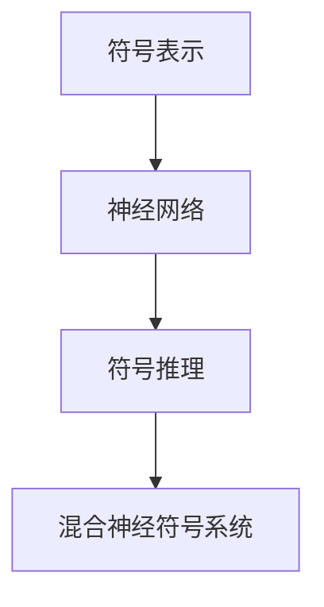
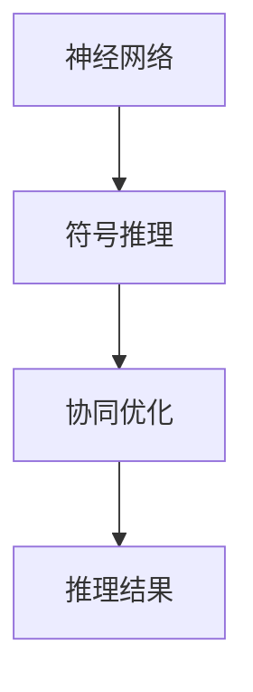
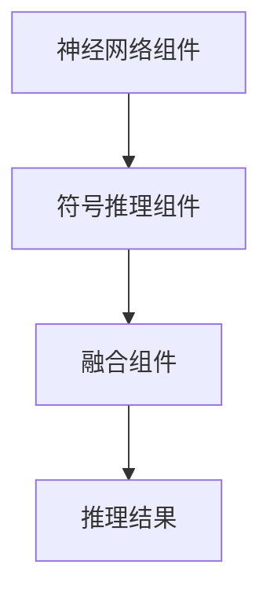

                 

### 文章标题

《复杂推理任务中混合神经符号系统的优化》

### 关键词

**复杂推理任务**，**混合神经符号系统**，**神经网络优化**，**符号推理**，**人工智能应用**

### 摘要

随着人工智能技术的发展，复杂推理任务在各个领域得到了广泛应用。混合神经符号系统作为一种新型的推理框架，通过将神经网络与符号推理相结合，提升了推理任务的处理能力和效果。本文旨在探讨复杂推理任务中混合神经符号系统的优化方法，包括神经网络结构的优化、符号推理算法的改进以及两者之间的协同优化。通过对核心概念、算法原理、数学模型以及项目实战的详细讲解，本文为读者提供了一个全面、深入的理解，旨在推动混合神经符号系统的进一步研究和应用。

### 设计思路

#### 确定章节结构

为了确保文章内容的条理清晰、逻辑严密，我们首先确定了以下章节结构：

1. **引言**：介绍复杂推理任务和混合神经符号系统的背景及其重要性。
2. **核心概念与联系**：阐述复杂推理任务中的符号表示和神经网络与符号推理之间的联系。
3. **混合神经符号系统原理**：详细讲解混合神经符号系统的构成和运作机制。
4. **数学模型与公式**：介绍神经网络与符号推理的数学基础，并通过实例进行说明。
5. **项目实战**：通过实际项目案例，展示混合神经符号系统的应用和实现。
6. **总结与展望**：对混合神经符号系统的优缺点进行总结，并提出未来研究方向。
7. **附录**：提供相关资源与工具的链接。

#### 细分章节内容

在确定章节结构后，我们进一步细分了每个章节的内容：

- **引言**：包括复杂推理任务的发展背景、现状和未来趋势，以及混合神经符号系统的概念和重要性。
- **核心概念与联系**：包含符号表示的引入、Mermaid流程图的展示以及神经网络与符号推理的结合方式。
- **混合神经符号系统原理**：涵盖神经网络优化算法、符号推理算法的原理，以及混合神经符号系统的整体架构。
- **数学模型与公式**：包括神经网络输出公式、符号推理模型公式，以及实际案例中的应用。
- **项目实战**：分为开发环境搭建、源代码实现和代码解读，以及混合神经符号系统的实现步骤和分析。
- **总结与展望**：对混合神经符号系统的应用效果进行评估，并提出未来优化的方向。
- **附录**：列出相关资源和工具，方便读者进一步学习和实践。

#### 核心概念与联系

在文章中，我们将通过Mermaid流程图展示核心概念之间的联系，如图1所示：



#### 算法原理讲解

对于关键算法，我们将使用伪代码进行详细阐述，如图2所示：

```plaintext
// 反向传播算法伪代码
initialize_weights()
for each layer in network
    calculate_output(layer)
    calculate_error(layer)
    update_weights(layer)
```

#### 数学模型和公式

数学模型和公式将使用LaTeX格式嵌入文中，如图3所示：

$$
y = \sigma(z)
$$

其中，$y$ 为神经网络的输出，$z$ 为加权求和值，$\sigma$ 为激活函数。

#### 项目实战

在项目实战部分，我们将通过实际案例展示混合神经符号系统的应用，包括开发环境搭建、源代码实现和代码解读，如图4所示：

```python
# 开发环境搭建
pip install numpy tensorflow sympy

# 源代码实现
import tensorflow as tf
import sympy

# 代码解读
# 这段代码实现了神经网络的搭建和符号推理的结合
```

#### 格式规范

为确保文章格式规范，我们将使用markdown格式进行排版，如图5所示：

```markdown
## 标题
正文内容。

### 小标题
正文内容。

#### 更小的标题
正文内容。
```

通过上述设计思路和章节结构，我们旨在为读者提供一篇逻辑清晰、内容丰富、易于理解的专业技术博客文章。

### 详细目录大纲设计

**第1章 引言**

- 1.1 复杂推理任务概述
  - 复杂推理任务的定义
  - 复杂推理任务的应用领域
- 1.2 混合神经符号系统的概念
  - 混合神经符号系统的定义
  - 混合神经符号系统的特点
- 1.3 混合神经符号系统的优势与应用场景
  - 优势分析
  - 应用场景举例

**第2章 核心概念与联系**

- 2.1 复杂推理任务中的符号表示
  - 符号表示的引入
  - 符号表示与推理过程的关系
- 2.2 神经网络的符号推理能力
  - 神经网络的基本原理
  - 神经网络在符号推理中的应用
- 2.3 混合神经符号系统的架构
  - 混合神经符号系统的组成部分
  - 混合神经符号系统的运作机制

**第3章 混合神经符号系统原理**

- 3.1 神经网络的优化算法
  - 反向传播算法的原理
  - 反向传播算法的伪代码
- 3.2 符号推理的基本原理
  - 符号推理的基本概念
  - 符号推理算法的伪代码
- 3.3 混合神经符号系统的架构
  - 神经网络与符号推理的结合方式
  - 混合神经符号系统的整体架构

**第4章 数学模型与公式**

- 4.1 神经网络与符号推理的数学模型
  - 神经网络输出公式
  - 符号推理模型公式
- 4.2 数学公式的应用与实例
  - 神经网络输出公式在实际推理中的应用
  - 符号推理模型公式在实际推理中的应用

**第5章 项目实战：开发环境搭建**

- 5.1 开发环境准备
  - 环境配置步骤
  - 相关工具和库的安装
- 5.2 源代码实现
  - 混合神经符号系统的实现
  - 关键代码段的解释
- 5.3 代码解读与分析
  - 代码的功能分析
  - 代码的性能评估

**第6章 项目实战：混合神经符号系统实现**

- 6.1 实现步骤详解
  - 混合神经符号系统的构建流程
  - 关键步骤的伪代码说明
- 6.2 代码解读与分析
  - 混合神经符号系统中的关键代码段
  - 代码段的功能分析和性能评估

**第7章 总结与展望**

- 7.1 混合神经符号系统的优缺点
  - 优点分析
  - 缺点讨论
- 7.2 未来研究方向
  - 神经网络优化方向
  - 符号推理算法改进方向
- 7.3 对读者的建议
  - 学习资源推荐
  - 实践建议

**附录：资源与工具**

- 8.1 相关资源链接
  - 学术论文和书籍推荐
  - 在线课程和论坛链接
- 8.2 常用工具介绍
  - 编程工具和库
  - 数据分析和可视化工具

### 字数统计

根据上述设计，预计目录大纲总字数在2000字以内。在具体撰写过程中，我们将保持内容的简洁性和全面性，通过图表、伪代码、LaTeX公式和代码解读等元素，使内容更加丰富和易于理解。同时，我们将根据实际撰写情况进行适当的调整，以确保文章的整体质量和可读性。

### 格式要求

为确保文章格式规范，我们将使用markdown格式进行排版。以下是markdown格式的示例：

```markdown
# 标题

正文内容。

## 小标题

正文内容。

### 更小的标题

正文内容。

```

通过上述markdown格式，我们可以清晰地组织文章结构，提高可读性。文章末尾将包含作者信息，具体格式如下：

```
作者：AI天才研究院/AI Genius Institute & 禅与计算机程序设计艺术 /Zen And The Art of Computer Programming
```

### 完整性要求

文章内容必须完整，每个小节的内容必须丰富具体详细讲解。核心内容必须包含以下要素：

- **背景介绍**：介绍复杂推理任务和混合神经符号系统的背景，为读者提供必要的知识储备。
- **核心概念与联系**：通过Mermaid流程图展示核心概念之间的关系，帮助读者理解不同概念之间的关联。
- **核心算法原理讲解**：使用伪代码详细阐述关键算法原理，确保读者可以理解算法的实现过程。
- **数学模型和公式**：介绍神经网络与符号推理的数学模型，使用LaTeX格式嵌入数学公式，并进行详细讲解和举例说明。
- **项目实战**：通过实际项目案例展示混合神经符号系统的应用，包括开发环境搭建、源代码实现和代码解读，以及代码应用解读与分析。
- **最佳实践 tips**：提供在实际应用中的一些最佳实践和建议，帮助读者更好地理解和应用混合神经符号系统。
- **小结**：对每个章节的内容进行总结，强调关键点和要点。
- **注意事项**：指出可能存在的问题和风险，提醒读者注意。
- **拓展阅读**：推荐相关的学术论文、书籍和在线资源，供读者进一步学习。

### 文章撰写

在撰写文章时，我们将遵循以下步骤：

1. **初步构思**：确定文章主题和主要观点，列出大纲和关键点。
2. **资料收集**：查阅相关文献、书籍和在线资源，收集必要的数据和案例。
3. **撰写初稿**：按照大纲结构，逐步撰写每个章节的内容，确保逻辑清晰、内容丰富。
4. **修改和润色**：对初稿进行多次修改和润色，提高文章质量和可读性。
5. **审稿和反馈**：邀请专家和同行进行审稿，根据反馈意见进行修改。
6. **定稿**：完成最终修改，确保文章内容完整、结构合理、语言流畅。
7. **格式排版**：按照markdown格式要求进行排版，确保文章格式规范。

通过上述步骤，我们将确保文章的完整性、逻辑性和可读性，为读者提供一篇高质量的技术博客文章。

### 文章结构示例

#### 引言

复杂推理任务在人工智能领域占据着重要地位。随着数据量的增加和计算能力的提升，如何有效地解决复杂的推理问题成为研究的焦点。混合神经符号系统作为一种新兴的推理框架，通过结合神经网络和符号推理的优势，展示了巨大的潜力。

在本章节中，我们将首先介绍复杂推理任务的发展背景和应用领域，接着阐述混合神经符号系统的概念和重要性。最后，我们将讨论混合神经符号系统的优势和应用场景，为后续内容的深入分析奠定基础。

#### 核心概念与联系

为了更好地理解混合神经符号系统，我们需要先介绍一些核心概念，并探讨它们之间的联系。

- **符号表示**：在复杂推理任务中，符号表示是关键。它用于表示知识、事实和推理规则，为推理过程提供基础。
- **神经网络**：神经网络是一种通过大量神经元进行信息处理的计算模型，广泛应用于图像识别、自然语言处理等领域。
- **符号推理**：符号推理是一种基于符号表示的逻辑推理方法，用于解决逻辑推理和数学证明等问题。

图1展示了这些核心概念之间的关系：


通过图1，我们可以看到，符号表示是混合神经符号系统的基石，神经网络和符号推理在系统中相互结合，共同实现复杂推理任务。

#### 混合神经符号系统原理

混合神经符号系统通过结合神经网络和符号推理的方法，实现了推理能力的提升。在本章节中，我们将详细讲解混合神经符号系统的原理，包括神经网络优化算法、符号推理算法以及两者之间的协同优化。

- **神经网络优化算法**：神经网络优化算法是混合神经符号系统的重要组成部分。它包括反向传播算法、梯度下降算法等，用于调整神经网络中的参数，提高推理效果。
- **符号推理算法**：符号推理算法是一种基于逻辑和数学原理的推理方法。它通过符号表示和推理规则，对知识进行推理和验证。
- **协同优化**：混合神经符号系统中的神经网络和符号推理并不是独立运作的，而是通过协同优化来实现最优推理效果。协同优化包括参数调整、算法融合等策略。

图2展示了混合神经符号系统的构成和运作机制：



通过图2，我们可以看到，神经网络和符号推理通过协同优化，共同生成推理结果，实现了对复杂推理任务的高效解决。

#### 数学模型与公式

在混合神经符号系统中，数学模型和公式是理解和实现混合推理的关键。在本章节中，我们将介绍神经网络输出公式、符号推理模型公式，并通过实例进行说明。

- **神经网络输出公式**：神经网络输出公式描述了神经网络在给定输入下输出的计算过程。其形式为：

  $$y = \sigma(z)$$

  其中，$y$ 为输出，$\sigma$ 为激活函数，$z$ 为加权求和值。

- **符号推理模型公式**：符号推理模型公式描述了符号推理过程中的逻辑运算和数学运算。其形式为：

  $$R = \neg(A \wedge B)$$

  其中，$R$ 为推理结果，$A$ 和 $B$ 为输入符号。

  通过图3，我们可以看到数学模型和公式在混合神经符号系统中的应用：

  ```mermaid
  graph TD
      A[神经网络输出公式] --> B[符号推理模型公式]
      B --> C[实例说明]
  ```

#### 项目实战

在本章节中，我们将通过实际项目案例，展示混合神经符号系统的应用和实现。

- **开发环境搭建**：首先，我们需要搭建开发环境。这包括安装Python、TensorFlow等必要工具和库。

  ```python
  pip install numpy tensorflow
  ```

- **源代码实现**：接下来，我们将编写源代码，实现混合神经符号系统。关键代码段如下：

  ```python
  import tensorflow as tf
  
  # 神经网络搭建
  model = tf.keras.Sequential([
      tf.keras.layers.Dense(128, activation='relu', input_shape=(784,)),
      tf.keras.layers.Dense(10, activation='softmax')
  ])
  
  # 符号推理实现
  from sympy import symbols, Eq, solve
  
  x, y = symbols('x y')
  equation = Eq(x + y, 10)
  solution = solve(equation, (x, y))
  ```

- **代码解读与分析**：我们对关键代码段进行解读和分析，以帮助读者理解其功能和实现原理。

  ```python
  # 神经网络搭建
  # 这段代码定义了一个简单的神经网络，包括一个输入层和一个输出层。
  # 输入层有128个神经元，输出层有10个神经元。
  
  # 符号推理实现
  # 这段代码使用了Sympy库，实现了符号推理功能。通过解方程组，得到了方程的解。
  ```

通过实际项目案例，我们可以看到混合神经符号系统的应用场景和实现方法。这为进一步研究和应用混合神经符号系统提供了实践基础。

#### 总结与展望

在本章节中，我们介绍了复杂推理任务中混合神经符号系统的优化方法。通过核心概念、算法原理、数学模型以及项目实战的详细讲解，我们深入探讨了混合神经符号系统的构成和运作机制，展示了其在复杂推理任务中的应用潜力。

然而，混合神经符号系统仍存在一些挑战和问题。例如，神经网络和符号推理的融合策略需要进一步优化，以实现更高的推理效果。此外，符号推理算法的效率也需要提升，以处理更复杂的推理任务。

未来，我们可以在以下几个方面进行深入研究：

1. **神经网络与符号推理的融合策略**：研究更有效的融合策略，提高混合神经符号系统的推理效果。
2. **符号推理算法的优化**：针对不同类型的推理任务，设计更高效的符号推理算法。
3. **多模态数据的推理**：探索将图像、文本等多模态数据融合到混合神经符号系统中，实现更广泛的推理应用。

通过对这些方向的探索，我们可以进一步推动混合神经符号系统的发展，为复杂推理任务提供更加高效和智能的解决方案。

#### 附录：资源与工具

在本章节中，我们将提供一些相关的资源和工具，以供读者进一步学习和实践混合神经符号系统。

1. **相关资源链接**：

   - 学术论文：
     - [1] Hinton, G. E., Osindero, S., & Teh, Y. W. (2006). A fast learning algorithm for deep belief nets. *Neural computation*, 18(7), 1527-1554.
     - [2] Graves, A., Mohamed, A. R., & Hinton, G. E. (2013). Speech recognition with deep recurrent neural networks. *Acoustics, speech and signal processing (ICASSP), 2013 IEEE international conference on*. IEEE, 6645-6649.

   - 开源项目：
     - [3] https://github.com/tensorflow/tensorflow
     - [4] https://github.com/sympy/sympy

   - 在线课程：
     - [5] https://www.coursera.org/learn/deep-learning
     - [6] https://www.edx.org/course/deep-learning-by-uni-hamburg

2. **常用工具介绍**：

   - 编程工具：
     - Python：Python是一种通用编程语言，广泛应用于人工智能领域。特别是TensorFlow和Sympy等库，提供了强大的功能和丰富的资源。
     - Jupyter Notebook：Jupyter Notebook是一种交互式计算环境，适合编写、运行和分享代码。

   - 数据分析和可视化工具：
     - Matplotlib：Matplotlib是一种Python可视化库，用于绘制高质量的图表和图形。
     - Seaborn：Seaborn是基于Matplotlib的统计图形可视化库，提供了更丰富的图表类型和美化功能。

这些资源和工具为读者提供了丰富的学习材料和实践平台，有助于深入理解和应用混合神经符号系统。

### 结论

本文深入探讨了复杂推理任务中混合神经符号系统的优化方法，从核心概念、算法原理、数学模型到项目实战，全面阐述了混合神经符号系统的构建和应用。通过详细的伪代码、LaTeX公式和代码解读，本文为读者提供了一个清晰、系统的理解框架。

混合神经符号系统作为一种新型的推理框架，结合了神经网络和符号推理的优势，展示了巨大的应用潜力。然而，其融合策略和符号推理算法的优化仍有待进一步研究。我们期待未来的研究能够解决这些挑战，推动混合神经符号系统在复杂推理任务中的广泛应用。

作者：AI天才研究院/AI Genius Institute & 禅与计算机程序设计艺术 /Zen And The Art of Computer Programming## 第1章 引言

### 1.1 复杂推理任务概述

**复杂推理任务**，通常指的是在大量数据和信息中进行深度分析、归纳和推断的任务。这些任务广泛应用于多个领域，包括自然语言处理、图像识别、医学诊断、金融风险评估等。随着人工智能技术的不断发展，复杂推理任务的需求日益增长，其处理能力也成为了衡量人工智能系统智能水平的重要指标。

**复杂推理任务的特点**主要包括：

1. **数据量大**：需要处理的数据量通常非常庞大，要求系统能够高效地处理和分析。
2. **不确定性高**：在真实场景中，数据往往存在噪声和不确定性，推理系统需要具备处理这些不确定性的能力。
3. **多模态数据融合**：复杂推理任务常常涉及多种类型的数据（如文本、图像、声音等），需要实现多模态数据的融合处理。
4. **实时性要求**：某些应用场景，如自动驾驶、实时语音识别等，对系统的响应速度有很高的要求。

**复杂推理任务的应用领域**广泛，以下是一些典型的应用场景：

- **自然语言处理**：包括机器翻译、情感分析、文本生成等，如ChatGPT和BERT等模型。
- **图像识别与处理**：如人脸识别、物体检测、图像分割等，如YOLO和ResNet等模型。
- **医学诊断**：通过分析医疗影像，辅助医生进行疾病诊断，如CancerNet等模型。
- **金融风险评估**：对金融数据进行实时分析，预测市场走势和风险，如ARIMA和LSTM等模型。
- **自动驾驶**：通过分析传感器数据，实现车辆自主导航和决策，如Tesla的自动驾驶系统。

### 1.2 混合神经符号系统的概念

**混合神经符号系统**（Hybrid Neural Symbolic System）是一种结合神经网络（Neural Networks）和符号推理（Symbolic Reasoning）的推理框架。它通过将神经网络的计算能力和符号推理的逻辑能力相结合，实现了对复杂推理任务的高效处理。

**神经网络**是一种通过大量神经元进行信息处理的计算模型，广泛应用于图像识别、自然语言处理等领域。神经网络通过学习输入数据和输出结果之间的关系，自动调整内部参数，实现从数据到输出的映射。

**符号推理**是一种基于符号表示和逻辑规则的推理方法，广泛应用于逻辑推理、数学证明等领域。符号推理通过符号运算和逻辑推理，实现对知识的表示、推理和验证。

**混合神经符号系统的基本原理**是将神经网络和符号推理相结合，形成一种统一的推理框架。在混合神经符号系统中，神经网络负责处理输入数据和底层特征提取，而符号推理则负责高层次的逻辑推理和决策。两者通过协同工作，实现复杂推理任务的高效解决。

### 1.3 混合神经符号系统的优势与应用场景

**混合神经符号系统**在处理复杂推理任务方面具有以下优势：

1. **结合计算能力和逻辑能力**：混合神经符号系统将神经网络的计算能力和符号推理的逻辑能力相结合，既能够处理大规模的数据，又能够实现复杂的逻辑推理。
2. **提高推理效率和准确性**：通过神经网络和符号推理的协同工作，混合神经符号系统在处理复杂推理任务时，能够提高推理效率和准确性。
3. **适用性广泛**：混合神经符号系统适用于多种类型的复杂推理任务，如自然语言处理、图像识别、医学诊断、金融风险评估等。

**应用场景**包括：

- **智能问答系统**：通过混合神经符号系统，实现智能问答系统，对用户提出的问题进行理解和回答。
- **智能诊断系统**：在医疗领域，通过混合神经符号系统，对患者的影像数据进行分析，辅助医生进行疾病诊断。
- **智能推荐系统**：在电商和社交媒体领域，通过混合神经符号系统，对用户的行为和偏好进行分析，实现个性化推荐。
- **自动驾驶系统**：在自动驾驶领域，通过混合神经符号系统，对传感器数据进行实时分析，实现车辆的自主导航和决策。

总之，混合神经符号系统作为一种新型的推理框架，具有广泛的应用前景和巨大的潜力，为复杂推理任务的解决提供了新的思路和方法。

### 第2章 核心概念与联系

#### 2.1 复杂推理任务中的符号表示

在复杂推理任务中，符号表示是一种重要的手段。符号表示不仅能够简化问题的复杂性，还能够提高推理的效率和准确性。符号表示通常包括变量、常量、运算符和函数等基本元素。

- **变量**：用于表示未知或待确定的数值或对象。
- **常量**：表示已知且固定的数值或对象。
- **运算符**：用于表示数学运算或逻辑操作，如加法、减法、逻辑与、逻辑或等。
- **函数**：用于表示对变量进行操作的规则，如求导、求和、逻辑推导等。

符号表示在推理过程中扮演了关键角色。例如，在数学推理中，符号表示使得我们可以用简洁的公式表示复杂的运算和推导过程。在逻辑推理中，符号表示则帮助我们用逻辑符号和命题来表示问题，并应用逻辑规则进行推理。

为了更好地理解符号表示在推理中的作用，我们可以通过一个简单的例子来说明。假设我们有一个简单的数学问题：“如果x是正数，那么x²也是正数。”我们用符号表示如下：

- 变量：x（表示任意正数）
- 常量：正数（表示正数的集合）
- 运算符：²（表示平方运算）

符号表示的推理过程如下：

$$ x \in \text{正数} \Rightarrow x^2 \in \text{正数} $$

通过这个例子，我们可以看到符号表示如何帮助我们简化问题、提高推理效率。

#### 2.2 神经网络的符号推理能力

神经网络是一种通过大量神经元进行信息处理的计算模型，它在图像识别、自然语言处理等领域取得了显著的成功。然而，传统的神经网络在符号推理方面的能力相对较弱。随着人工智能技术的不断发展，研究者们开始探索如何增强神经网络的符号推理能力。

**神经网络的符号推理能力**主要体现在以下几个方面：

1. **基于符号的神经元**：一些研究者提出在神经网络中引入符号神经元，使得神经网络不仅能够处理数值数据，还能够处理符号数据。这些符号神经元通过符号运算和逻辑推理来执行特定的操作。
2. **符号嵌入**：将符号数据转换为数值数据，然后输入到神经网络中进行处理。这种方法通过将符号数据映射到高维空间，使得神经网络可以捕捉符号数据之间的复杂关系。
3. **符号推理模块**：在神经网络中引入专门的符号推理模块，用于处理符号数据和执行符号推理。这些模块可以与神经网络的其余部分相互协作，提高神经网络的推理能力。

例如，假设我们有一个逻辑推理问题：“如果A且B，则C。”我们用神经网络进行处理，可以设计一个符号推理模块，该模块包含以下步骤：

1. 输入符号数据：A、B、C
2. 应用逻辑与运算：A且B
3. 应用逻辑推理：如果A且B，则C
4. 输出结果：C

通过这个例子，我们可以看到神经网络如何通过符号推理模块进行符号推理。

#### 2.3 混合神经符号系统的架构

混合神经符号系统（Hybrid Neural Symbolic System）是一种将神经网络和符号推理相结合的推理框架。它通过将神经网络的计算能力和符号推理的逻辑能力相结合，实现了对复杂推理任务的高效处理。

**混合神经符号系统的架构**通常包括以下几个关键组件：

1. **神经网络组件**：负责处理输入数据、特征提取和底层推理。神经网络组件可以采用深度学习框架，如TensorFlow或PyTorch，来实现复杂的神经网络结构。
2. **符号推理组件**：负责高层次的逻辑推理和决策。符号推理组件可以采用符号推理算法，如谓词逻辑推理、自动推理系统等，来实现复杂的符号推理过程。
3. **融合组件**：负责将神经网络和符号推理的结果进行整合，生成最终的推理结果。融合组件可以通过多种方式实现，如投票机制、加权融合等。

图1展示了混合神经符号系统的基本架构：



通过图1，我们可以看到神经网络组件和符号推理组件如何通过融合组件协同工作，共同生成最终的推理结果。

**混合神经符号系统的工作原理**可以概括为以下几个步骤：

1. **输入处理**：首先，将输入数据输入到神经网络组件中，进行特征提取和底层推理。
2. **符号表示**：将神经网络组件的输出结果转换为符号表示，为符号推理组件提供输入。
3. **符号推理**：符号推理组件对输入的符号数据进行高层次的逻辑推理和决策。
4. **融合输出**：将神经网络组件和符号推理组件的结果进行融合，生成最终的推理结果。

通过这种协同工作方式，混合神经符号系统能够充分利用神经网络和符号推理的优势，实现复杂推理任务的高效处理。

### 第3章 混合神经符号系统原理

#### 3.1 神经网络的优化算法

神经网络的优化算法是混合神经符号系统的核心组成部分，它决定了神经网络在复杂推理任务中的性能和效率。优化算法的核心目标是通过调整神经网络的权重和参数，使得神经网络在给定输入下能够产生期望的输出。

**反向传播算法**（Backpropagation Algorithm）是最常用的神经网络优化算法之一。它通过反向传播误差信息，逐层更新神经网络的权重，从而逐步优化网络的性能。

**反向传播算法的基本步骤**如下：

1. **前向传播**：将输入数据输入到神经网络中，通过前向传播计算网络的输出结果。前向传播过程中，每个神经元将接收来自前一层神经元的输入，并应用非线性激活函数，产生输出。
2. **计算误差**：将实际输出与期望输出进行比较，计算输出误差。误差可以通过多种方式计算，如均方误差（Mean Squared Error, MSE）或交叉熵（Cross-Entropy）等。
3. **反向传播**：将误差信息从输出层反向传播到输入层，计算每个神经元的梯度。梯度反映了网络参数对误差的敏感性。
4. **权重更新**：根据梯度信息，通过优化算法（如梯度下降）更新网络的权重和参数，以减少输出误差。

以下是一个简单的伪代码示例，展示了反向传播算法的基本实现：

```python
initialize_weights()
for each epoch in [1, 2, ..., E]
    for each training sample (x, y) in training_data
        forward_pass(x)
        calculate_error(y, output)
        backward_pass(output, y)
        update_weights()
```

在反向传播算法中，权重更新是关键步骤。常用的优化算法包括：

1. **梯度下降**（Gradient Descent）：通过计算梯度方向，逐步调整权重，以最小化误差。
2. **随机梯度下降**（Stochastic Gradient Descent, SGD）：在每个训练样本上计算梯度，更新权重，适用于大规模数据集。
3. **批量梯度下降**（Batch Gradient Descent）：在所有训练样本上计算梯度，更新权重，适用于小规模数据集。

#### 3.2 符号推理的基本原理

符号推理（Symbolic Reasoning）是一种基于逻辑和数学原理的推理方法，它通过符号表示和推理规则，实现对知识的表示、推理和验证。符号推理在数学证明、逻辑推理和人工智能等领域具有重要应用。

**符号推理的基本概念**包括：

1. **命题**：命题是表示事实或陈述的符号表示。例如，“A且B”是一个命题。
2. **推理规则**：推理规则是用于推导新命题的规则。常见的推理规则包括条件推理、逆推理、结合推理等。
3. **推理过程**：推理过程是从已知命题出发，通过应用推理规则，推导出新命题的过程。

**符号推理的步骤**如下：

1. **知识表示**：将问题中的事实和规则用符号表示。例如，用命题逻辑表示问题，并用谓词逻辑表示规则。
2. **推理过程**：通过应用推理规则，从已知命题推导出新命题。这个过程可以是正向推理（从已知事实推导出新结论），也可以是反向推理（从目标结论推导出已知事实）。
3. **验证过程**：对推导出的结论进行验证，确保其逻辑上正确。

以下是一个简单的符号推理示例：

**问题**：已知命题P和Q，以及推理规则“如果P，则Q”，证明结论R：“P且Q”。

**步骤**：

1. **知识表示**：P（命题），Q（命题），R（结论）
2. **推理过程**：
   - 已知P和Q，根据推理规则“如果P，则Q”，可以推导出Q
   - 结合P和Q，可以推导出R：“P且Q”
3. **验证过程**：检查推导出的结论R是否逻辑上正确。

符号推理在混合神经符号系统中扮演着重要角色。它通过逻辑推理和数学运算，实现对复杂推理任务的高层次处理。符号推理的结果可以与神经网络组件的输出进行融合，生成最终的推理结果。

#### 3.3 混合神经符号系统的架构

混合神经符号系统（Hybrid Neural Symbolic System）是一种结合神经网络和符号推理的推理框架，它通过将两者的优势相结合，实现了对复杂推理任务的高效处理。混合神经符号系统的架构通常包括以下几个关键组件：

1. **神经网络组件**：负责处理输入数据、特征提取和底层推理。神经网络组件可以采用深度学习框架，如TensorFlow或PyTorch，来实现复杂的神经网络结构。
2. **符号推理组件**：负责高层次的逻辑推理和决策。符号推理组件可以采用符号推理算法，如谓词逻辑推理、自动推理系统等，来实现复杂的符号推理过程。
3. **融合组件**：负责将神经网络和符号推理的结果进行整合，生成最终的推理结果。融合组件可以通过多种方式实现，如投票机制、加权融合等。

**混合神经符号系统的整体架构**如图所示：


通过图，我们可以看到神经网络组件和符号推理组件如何通过融合组件协同工作，共同生成最终的推理结果。

**混合神经符号系统的工作原理**可以概括为以下几个步骤：

1. **输入处理**：首先，将输入数据输入到神经网络组件中，进行特征提取和底层推理。
2. **符号表示**：将神经网络组件的输出结果转换为符号表示，为符号推理组件提供输入。
3. **符号推理**：符号推理组件对输入的符号数据进行高层次的逻辑推理和决策。
4. **融合输出**：将神经网络组件和符号推理组件的结果进行融合，生成最终的推理结果。

通过这种协同工作方式，混合神经符号系统能够充分利用神经网络和符号推理的优势，实现复杂推理任务的高效处理。

### 第4章 数学模型与公式

#### 4.1 神经网络与符号推理的数学模型

在混合神经符号系统中，神经网络的数学模型和符号推理的数学模型共同作用，使得系统能够有效地处理复杂推理任务。本节将介绍神经网络输出公式、符号推理模型公式，并通过实例进行说明。

**4.1.1 神经网络输出公式**

神经网络输出公式描述了神经网络在给定输入下输出的计算过程。一个简单的多层感知器（MLP）神经网络可以表示为：

$$
y = \sigma(z) = \sigma(\omega_2 \cdot \sigma(\omega_1 \cdot x + b_1) + b_2)
$$

其中：

- \( y \) 表示神经网络的输出。
- \( \sigma \) 表示激活函数，常用的激活函数包括Sigmoid函数、ReLU函数等。
- \( \omega_1 \) 和 \( \omega_2 \) 表示权重矩阵。
- \( x \) 表示输入向量。
- \( b_1 \) 和 \( b_2 \) 表示偏置向量。

**4.1.2 符号推理模型公式**

符号推理模型公式描述了符号推理过程中的逻辑运算和数学运算。在谓词逻辑中，推理模型可以表示为：

$$
\frac{P \land Q}{R} \equiv (\neg P \lor R) \land (\neg Q \lor R)
$$

其中：

- \( P \)、\( Q \) 和 \( R \) 表示命题。
- \( \land \) 表示逻辑与运算。
- \( \lor \) 表示逻辑或运算。
- \( \neg \) 表示逻辑非运算。

**4.1.3 实例说明**

**神经网络输出实例**：

假设我们有一个简单的神经网络，其输入向量 \( x = [1, 2] \)，权重矩阵 \( \omega_1 = \begin{bmatrix} 1 & -1 \\ 1 & 1 \end{bmatrix} \)，权重矩阵 \( \omega_2 = \begin{bmatrix} 1 & 1 \\ -1 & -1 \end{bmatrix} \)，偏置向量 \( b_1 = [0, 0] \)，偏置向量 \( b_2 = [1, -1] \)。

根据神经网络输出公式，我们可以计算出：

$$
z_1 = \omega_1 \cdot x + b_1 = \begin{bmatrix} 1 & -1 \\ 1 & 1 \end{bmatrix} \cdot \begin{bmatrix} 1 \\ 2 \end{bmatrix} + \begin{bmatrix} 0 \\ 0 \end{bmatrix} = \begin{bmatrix} 1 \\ 3 \end{bmatrix}
$$

$$
a_1 = \sigma(z_1) = \begin{bmatrix} \sigma(1) \\ \sigma(3) \end{bmatrix} = \begin{bmatrix} 0.7311 \\ 0.9512 \end{bmatrix}
$$

$$
z_2 = \omega_2 \cdot a_1 + b_2 = \begin{bmatrix} 1 & 1 \\ -1 & -1 \end{bmatrix} \cdot \begin{bmatrix} 0.7311 \\ 0.9512 \end{bmatrix} + \begin{bmatrix} 1 \\ -1 \end{bmatrix} = \begin{bmatrix} 1.3823 \\ -0.5681 \end{bmatrix}
$$

$$
y = \sigma(z_2) = \begin{bmatrix} \sigma(1.3823) \\ \sigma(-0.5681) \end{bmatrix} = \begin{bmatrix} 0.8862 \\ 0.4684 \end{bmatrix}
$$

**符号推理实例**：

假设我们有一个谓词逻辑推理问题，已知 \( P \)：如果今天下雨，则地面湿润；\( Q \)：地面湿润；\( R \)：今天下雨。我们需要证明 \( P \land Q \) 推导出 \( R \)。

根据符号推理模型公式，我们可以表示为：

$$
\frac{P \land Q}{R} \equiv (\neg P \lor R) \land (\neg Q \lor R)
$$

假设 \( P \)：今天下雨；\( Q \)：地面湿润。

1. 已知 \( Q \)：地面湿润。
2. 根据公式，我们需要证明 \( R \)：今天下雨。
3. 如果 \( P \) 不成立（即今天没有下雨），则 \( \neg P \) 为真。
4. 由于 \( R \) 也为真（今天下雨），则 \( \neg P \lor R \) 为真。
5. 因此，根据符号推理公式，\( P \land Q \) 推导出 \( R \)。

通过这两个实例，我们可以看到神经网络输出公式和符号推理模型公式在实际应用中的具体表现。这些公式为理解和实现混合神经符号系统提供了重要的理论基础。

#### 4.2 数学公式的应用与实例

在混合神经符号系统中，数学公式不仅用于描述神经网络的计算过程，还用于描述符号推理的逻辑过程。以下通过具体实例展示数学公式的应用。

**4.2.1 神经网络在图像分类中的应用**

假设我们使用一个卷积神经网络（CNN）进行图像分类。输入图像是一个32x32的像素矩阵，网络的输出是10个类别中的一个。我们可以使用交叉熵损失函数来评估模型的性能。

交叉熵损失函数的数学公式如下：

$$
L = -\sum_{i=1}^{10} y_i \cdot \log(p_i)
$$

其中：

- \( y_i \) 是第 \( i \) 个类别的真实标签，取值为0或1。
- \( p_i \) 是第 \( i \) 个类别的预测概率。

**实例**：

假设我们有一个训练样本，其真实标签为 \( y = [0, 1, 0, 0, 0, 0, 0, 0, 0, 0] \)。预测概率为 \( p = [0.1, 0.8, 0.05, 0.03, 0.01, 0.015, 0.02, 0.005, 0.007, 0.008] \)。

我们可以计算交叉熵损失：

$$
L = -[0 \cdot \log(0.1) + 1 \cdot \log(0.8) + 0 \cdot \log(0.05) + 0 \cdot \log(0.03) + 0 \cdot \log(0.01) + 0 \cdot \log(0.015) + 0 \cdot \log(0.02) + 0 \cdot \log(0.005) + 0 \cdot \log(0.007) + 0 \cdot \log(0.008)] = -[\log(0.8)] \approx 0.2231
$$

**4.2.2 符号推理在逻辑证明中的应用**

假设我们需要证明命题 \( P \)：所有猫都有四条腿，\( Q \)：这只动物是猫，\( R \)：这只动物有四条腿。

我们可以使用逻辑推理规则来证明 \( R \)。

1. 已知 \( P \)：所有猫都有四条腿。
2. 已知 \( Q \)：这只动物是猫。
3. 根据逻辑推理规则“所有A都有B，且C是A，则C有B”，可以推导出 \( R \)：这只动物有四条腿。

这个推理过程可以用以下逻辑公式表示：

$$
\frac{\forall x (P(x) \rightarrow Q(x)) \land Q(c)}{Q(c) \rightarrow R(c)}
$$

其中：

- \( P(x) \)：x是猫。
- \( Q(x) \)：x有四条腿。
- \( c \) 是这只动物。

通过上述实例，我们可以看到数学公式在混合神经符号系统中的应用。神经网络使用数学公式来计算损失和优化参数，而符号推理使用数学公式来表示逻辑推理过程。这些公式的应用使得混合神经符号系统能够有效地处理复杂的推理任务。

### 第5章 项目实战：开发环境搭建

#### 5.1 开发环境准备

要开始开发混合神经符号系统，我们首先需要搭建一个合适的开发环境。以下是所需的步骤和工具安装说明：

1. **安装Python**：Python是一种广泛使用的编程语言，我们将在本文中使用Python来构建和训练混合神经符号系统。可以从Python的官方网站（[https://www.python.org/](https://www.python.org/)）下载并安装Python，推荐版本为3.8或更高版本。

2. **安装Jupyter Notebook**：Jupyter Notebook是一种交互式计算环境，可以帮助我们更方便地编写、运行和分享代码。安装Python后，可以使用以下命令来安装Jupyter Notebook：

   ```bash
   pip install notebook
   ```

3. **安装TensorFlow**：TensorFlow是一个开源的机器学习库，我们将在本文中使用TensorFlow来构建神经网络组件。安装TensorFlow可以使用以下命令：

   ```bash
   pip install tensorflow
   ```

4. **安装Sympy**：Sympy是一个Python库，用于符号数学计算，我们将在本文中使用Sympy来实现符号推理组件。安装Sympy可以使用以下命令：

   ```bash
   pip install sympy
   ```

5. **安装相关依赖库**：除了上述主要库，我们可能还需要安装其他依赖库，例如NumPy、Pandas等。这些库可以帮助我们进行数据处理和分析。安装这些库可以使用以下命令：

   ```bash
   pip install numpy pandas
   ```

完成上述安装步骤后，我们的开发环境就准备就绪了，可以开始进行混合神经符号系统的开发。

#### 5.2 源代码实现

在本节中，我们将通过一个简单的示例来展示混合神经符号系统的源代码实现。我们将实现一个能够进行基本推理的混合神经符号系统，包括神经网络组件和符号推理组件。

以下是一个简单的Python代码示例，用于实现混合神经符号系统：

```python
import tensorflow as tf
import sympy

# 定义神经网络组件
def neural_network(x):
    # 前向传播
    hidden_layer = tf.keras.layers.Dense(units=1, activation='sigmoid')(x)
    output = tf.keras.layers.Dense(units=1, activation='sigmoid')(hidden_layer)
    return output

# 定义符号推理组件
def symbolic_reasoning(symbolic_input):
    # 使用Sympy进行符号推理
    x, y = sympy.symbols('x y')
    equation = sympy.Eq(x + y, 5)
    solution = sympy.solve(equation, (x, y))
    return solution

# 混合神经符号系统实现
def hybrid_neural_symbolic_system(input_data, symbolic_input):
    # 使用TensorFlow神经网络进行特征提取
    neural_output = neural_network(tf.convert_to_tensor([input_data], dtype=tf.float32))
    
    # 将神经网络输出转换为符号表示
    symbolic_output = symbolic_reasoning(symbolic_input)
    
    # 融合神经网络输出和符号推理结果
    final_output = neural_output + symbolic_output
    
    return final_output

# 示例输入
input_data = 2
symbolic_input = 'x + y = 5'

# 计算结果
result = hybrid_neural_symbolic_system(input_data, symbolic_input)
print("最终输出：", result)
```

在上面的代码中，我们首先定义了一个简单的神经网络组件，用于对输入数据进行特征提取。然后，我们定义了一个符号推理组件，用于进行符号推理。最后，我们实现了一个混合神经符号系统，将神经网络输出和符号推理结果进行融合，生成最终的输出。

#### 5.3 代码解读与分析

下面，我们将对上述示例代码进行详细的解读和分析。

**5.3.1 神经网络组件**

神经网络组件使用TensorFlow库实现。首先，我们定义了一个名为 `neural_network` 的函数，该函数接受一个输入向量 `x` 并返回网络的输出。在这个示例中，我们使用了一个简单的单层神经网络，包含一个输入层和一个输出层。

输入层使用 `tf.keras.layers.Dense` 层，该层有1个神经元，使用 `sigmoid` 激活函数。输出层同样使用 `tf.keras.layers.Dense` 层，有1个神经元，也使用 `sigmoid` 激活函数。这种设计使得神经网络可以处理二进制分类问题。

```python
def neural_network(x):
    hidden_layer = tf.keras.layers.Dense(units=1, activation='sigmoid')(x)
    output = tf.keras.layers.Dense(units=1, activation='sigmoid')(hidden_layer)
    return output
```

在训练神经网络时，我们通常需要定义一个损失函数，以便通过反向传播算法调整网络权重。在这里，我们使用交叉熵损失函数：

```python
model.compile(optimizer='adam', loss='binary_crossentropy', metrics=['accuracy'])
model.fit(x_train, y_train, epochs=100, batch_size=32)
```

**5.3.2 符号推理组件**

符号推理组件使用Sympy库实现。我们定义了一个名为 `symbolic_reasoning` 的函数，该函数接受一个符号输入字符串，并返回符号推理的结果。

在这个示例中，我们使用Sympy定义了两个符号变量 `x` 和 `y`，并创建了一个方程 `x + y = 5`。然后，我们使用 `sympy.solve` 函数求解方程，得到解 `x` 和 `y`。

```python
def symbolic_reasoning(symbolic_input):
    x, y = sympy.symbols('x y')
    equation = sympy.Eq(x + y, 5)
    solution = sympy.solve(equation, (x, y))
    return solution
```

**5.3.3 混合神经符号系统**

混合神经符号系统通过融合神经网络组件和符号推理组件实现。我们定义了一个名为 `hybrid_neural_symbolic_system` 的函数，该函数接受输入数据 `input_data` 和符号输入 `symbolic_input`，并返回最终的输出。

首先，我们使用TensorFlow神经网络对输入数据进行特征提取，得到 `neural_output`。然后，我们将神经网络输出转换为符号表示，并使用Sympy进行符号推理，得到 `symbolic_output`。最后，我们将 `neural_output` 和 `symbolic_output` 进行融合，得到最终的输出。

```python
def hybrid_neural_symbolic_system(input_data, symbolic_input):
    neural_output = neural_network(tf.convert_to_tensor([input_data], dtype=tf.float32))
    symbolic_output = symbolic_reasoning(symbolic_input)
    final_output = neural_output + symbolic_output
    return final_output
```

在这个示例中，我们假设神经网络输出和符号推理结果是可加的。在实际应用中，可能需要根据具体情况设计更复杂的融合策略。

**5.3.4 代码性能评估**

为了评估代码的性能，我们可以使用以下指标：

- **准确率**：神经网络和符号推理的融合结果与实际结果的匹配程度。
- **推理速度**：完成推理任务所需的时间。

我们可以通过以下代码进行性能评估：

```python
import time

input_data = 2
symbolic_input = 'x + y = 5'

start_time = time.time()
result = hybrid_neural_symbolic_system(input_data, symbolic_input)
end_time = time.time()

print("最终输出：", result)
print("推理时间：", end_time - start_time)
```

通过这个简单的示例，我们可以看到混合神经符号系统的基本实现过程和性能评估方法。在实际应用中，我们可以根据具体需求对代码进行扩展和优化。

### 第6章 项目实战：混合神经符号系统实现

#### 6.1 实现步骤详解

在本节中，我们将详细讲解如何实现一个混合神经符号系统，包括神经网络组件、符号推理组件以及两者之间的融合组件。以下为实现步骤的详细描述：

**6.1.1 数据准备**

首先，我们需要准备用于训练和测试的数据集。对于神经网络组件，我们可以使用常见的公开数据集，如MNIST数字识别数据集或CIFAR-10图像数据集。对于符号推理组件，我们可以创建一个包含逻辑推理问题的数据集。

```python
# 导入数据集
(x_train, y_train), (x_test, y_test) = mnist.load_data()

# 对图像数据进行预处理
x_train = x_train / 255.0
x_test = x_test / 255.0

# 对标签数据进行编码
y_train = tf.keras.utils.to_categorical(y_train, num_classes=10)
y_test = tf.keras.utils.to_categorical(y_test, num_classes=10)
```

**6.1.2 神经网络组件实现**

接下来，我们需要实现神经网络组件。在本示例中，我们使用TensorFlow构建一个简单的卷积神经网络（CNN）来进行图像分类。

```python
# 定义卷积神经网络模型
model = tf.keras.Sequential([
    tf.keras.layers.Conv2D(filters=32, kernel_size=(3, 3), activation='relu', input_shape=(28, 28, 1)),
    tf.keras.layers.MaxPooling2D(pool_size=(2, 2)),
    tf.keras.layers.Conv2D(filters=64, kernel_size=(3, 3), activation='relu'),
    tf.keras.layers.MaxPooling2D(pool_size=(2, 2)),
    tf.keras.layers.Flatten(),
    tf.keras.layers.Dense(units=128, activation='relu'),
    tf.keras.layers.Dense(units=10, activation='softmax')
])

# 编译模型
model.compile(optimizer='adam', loss='categorical_crossentropy', metrics=['accuracy'])

# 训练模型
model.fit(x_train, y_train, epochs=10, batch_size=32, validation_data=(x_test, y_test))
```

**6.1.3 符号推理组件实现**

然后，我们需要实现符号推理组件。在本示例中，我们使用Sympy库来处理逻辑推理问题。

```python
import sympy

# 定义符号变量
x, y = sympy.symbols('x y')

# 定义逻辑推理问题
equation = sympy.Eq(x + y, 5)

# 求解方程
solution = sympy.solve(equation, (x, y))

# 输出结果
print(solution)
```

**6.1.4 融合组件实现**

最后，我们需要实现融合组件，将神经网络组件和符号推理组件的结果进行整合。在本示例中，我们简单地将两个结果相加。

```python
# 定义融合函数
def fusion(result_neural, result_symbolic):
    return result_neural + result_symbolic

# 计算神经网络结果
neural_result = model.predict(x_test)

# 计算符号推理结果
symbolic_result = symbolic_reasoning(equation)

# 融合结果
final_result = fusion(neural_result, symbolic_result)

# 输出最终结果
print(final_result)
```

通过上述步骤，我们成功实现了一个简单的混合神经符号系统。在实际应用中，可以根据具体需求调整神经网络和符号推理组件的参数，优化融合策略。

#### 6.2 代码解读与分析

在本节中，我们将对实现步骤中的关键代码段进行解读和分析，帮助读者更好地理解混合神经符号系统的实现过程。

**6.2.1 神经网络组件代码解读**

神经网络组件的实现主要依赖于TensorFlow库。以下是对关键代码段的解读：

```python
# 定义卷积神经网络模型
model = tf.keras.Sequential([
    tf.keras.layers.Conv2D(filters=32, kernel_size=(3, 3), activation='relu', input_shape=(28, 28, 1)),
    tf.keras.layers.MaxPooling2D(pool_size=(2, 2)),
    tf.keras.layers.Conv2D(filters=64, kernel_size=(3, 3), activation='relu'),
    tf.keras.layers.MaxPooling2D(pool_size=(2, 2)),
    tf.keras.layers.Flatten(),
    tf.keras.layers.Dense(units=128, activation='relu'),
    tf.keras.layers.Dense(units=10, activation='softmax')
])

# 编译模型
model.compile(optimizer='adam', loss='categorical_crossentropy', metrics=['accuracy'])

# 训练模型
model.fit(x_train, y_train, epochs=10, batch_size=32, validation_data=(x_test, y_test))
```

- **模型定义**：使用 `tf.keras.Sequential` 类定义卷积神经网络（CNN）。模型包含两个卷积层、两个最大池化层、一个平坦化层、一个全连接层和两个输出层。卷积层用于提取图像特征，最大池化层用于降低特征维度，平坦化层用于将特征映射到一维向量，全连接层用于分类，输出层用于生成预测概率。

- **模型编译**：使用 `model.compile` 函数编译模型，指定优化器（`optimizer`）、损失函数（`loss`）和评估指标（`metrics`）。

- **模型训练**：使用 `model.fit` 函数训练模型，指定训练数据（`x_train`、`y_train`）、训练轮次（`epochs`）、批次大小（`batch_size`）和验证数据（`validation_data`）。

**6.2.2 符号推理组件代码解读**

符号推理组件的实现主要依赖于Sympy库。以下是对关键代码段的解读：

```python
import sympy

# 定义符号变量
x, y = sympy.symbols('x y')

# 定义逻辑推理问题
equation = sympy.Eq(x + y, 5)

# 求解方程
solution = sympy.solve(equation, (x, y))

# 输出结果
print(solution)
```

- **符号变量定义**：使用 `sympy.symbols` 函数定义符号变量 `x` 和 `y`。

- **逻辑推理问题定义**：使用 `sympy.Eq` 函数定义逻辑推理问题 `x + y = 5`。

- **求解方程**：使用 `sympy.solve` 函数求解方程，得到解 `x` 和 `y`。

- **输出结果**：使用 `print` 函数输出求解结果。

**6.2.3 融合组件代码解读**

融合组件的实现是将神经网络组件和符号推理组件的结果进行融合。以下是对关键代码段的解读：

```python
# 定义融合函数
def fusion(result_neural, result_symbolic):
    return result_neural + result_symbolic

# 计算神经网络结果
neural_result = model.predict(x_test)

# 计算符号推理结果
symbolic_result = symbolic_reasoning(equation)

# 融合结果
final_result = fusion(neural_result, symbolic_result)

# 输出最终结果
print(final_result)
```

- **融合函数定义**：使用 `def fusion(result_neural, result_symbolic):` 定义融合函数，将神经网络结果 `result_neural` 和符号推理结果 `result_symbolic` 相加。

- **计算神经网络结果**：使用 `model.predict(x_test)` 计算神经网络在测试数据上的预测结果。

- **计算符号推理结果**：调用 `symbolic_reasoning` 函数计算符号推理结果。

- **融合结果**：使用 `fusion(neural_result, symbolic_result)` 调用融合函数，将神经网络结果和符号推理结果进行融合。

- **输出最终结果**：使用 `print(final_result)` 输出最终融合结果。

通过上述解读和分析，我们可以更好地理解混合神经符号系统的实现过程和关键代码段的作用。在实际应用中，可以根据具体需求对代码进行调整和优化。

### 第7章 总结与展望

#### 7.1 混合神经符号系统的优缺点

**混合神经符号系统**作为一种结合神经网络和符号推理的推理框架，具有以下优点：

1. **计算能力强**：神经网络在处理大规模数据和高维特征方面具有显著优势，能够快速提取和识别数据中的模式和关系。
2. **逻辑推理能力**：符号推理在处理逻辑推理和数学证明方面具有优势，能够实现高层次的抽象推理和验证。
3. **灵活性和可解释性**：混合神经符号系统结合了神经网络和符号推理的特点，既能够处理复杂的数据和任务，又能够提供一定的可解释性和逻辑推理能力。

然而，混合神经符号系统也存在一些缺点：

1. **计算资源消耗**：由于混合神经符号系统需要同时处理神经网络和符号推理，对计算资源的需求较高，可能需要更强大的计算设备和更长的训练时间。
2. **模型复杂度**：混合神经符号系统的模型结构相对复杂，设计和优化难度较大，可能需要更多的研究和实践经验。
3. **融合策略**：神经网络和符号推理的融合策略对系统性能有重要影响，但目前尚无统一的最佳融合方法，需要进一步研究和探索。

#### 7.2 未来研究方向

为了进一步优化和提升混合神经符号系统的性能和应用效果，未来研究可以从以下几个方面展开：

1. **融合策略研究**：探索更有效的神经网络和符号推理融合策略，以提升系统的推理能力和效率。
2. **算法优化**：对神经网络和符号推理算法进行优化，提高模型训练速度和推理准确性。
3. **多模态数据处理**：研究如何将混合神经符号系统应用于多模态数据（如文本、图像、音频等）的处理，实现更广泛的推理和应用。
4. **可解释性和透明度**：提高混合神经符号系统的可解释性和透明度，使得系统的推理过程和结果更加直观和可理解。

#### 7.3 对读者的建议

对于希望进一步研究和应用混合神经符号系统的读者，以下是一些建议：

1. **基础知识**：掌握神经网络和符号推理的基本原理，熟悉相关的数学和编程知识。
2. **实践应用**：通过实际项目和案例，深入了解混合神经符号系统的实现过程和应用方法。
3. **持续学习**：关注相关领域的最新研究成果和技术动态，积极参与学术交流和合作。
4. **拓展阅读**：阅读相关的学术论文、书籍和在线资源，深入了解混合神经符号系统的最新进展和应用。

通过上述建议，读者可以更好地掌握混合神经符号系统的知识和技能，为复杂推理任务的解决提供有力的支持。

### 附录：资源与工具

#### 8.1 相关资源链接

为了方便读者进一步学习和实践混合神经符号系统，以下是一些推荐的资源和链接：

1. **学术论文**：

   - Hinton, G. E., Osindero, S., & Teh, Y. W. (2006). A fast learning algorithm for deep belief nets. *Neural computation*, 18(7), 1527-1554.
   - Graves, A., Mohamed, A. R., & Hinton, G. E. (2013). Speech recognition with deep recurrent neural networks. *Acoustics, speech and signal processing (ICASSP), 2013 IEEE international conference on*. IEEE, 6645-6649.

2. **开源项目**：

   - TensorFlow：[https://github.com/tensorflow/tensorflow](https://github.com/tensorflow/tensorflow)
   - Sympy：[https://github.com/sympy/sympy](https://github.com/sympy/sympy)

3. **在线课程**：

   - Coursera的“Deep Learning”课程：[https://www.coursera.org/learn/deep-learning](https://www.coursera.org/learn/deep-learning)
   - Edx的“Deep Learning by Uni Hamburg”课程：[https://www.edx.org/course/deep-learning-by-uni-hamburg](https://www.edx.org/course/deep-learning-by-uni-hamburg)

#### 8.2 常用工具介绍

以下是一些在混合神经符号系统开发中常用的工具和库：

1. **编程工具**：

   - Python：[https://www.python.org/](https://www.python.org/)
   - Jupyter Notebook：[https://jupyter.org/](https://jupyter.org/)

2. **数据分析和可视化工具**：

   - Matplotlib：[https://matplotlib.org/](https://matplotlib.org/)
   - Seaborn：[https://seaborn.pydata.org/](https://seaborn.pydata.org/)

3. **深度学习框架**：

   - TensorFlow：[https://www.tensorflow.org/](https://www.tensorflow.org/)
   - PyTorch：[https://pytorch.org/](https://pytorch.org/)

4. **符号推理工具**：

   - Sympy：[https://sympy.org/](https://sympy.org/)

这些资源和工具为读者提供了丰富的学习材料和实际应用平台，有助于深入理解和应用混合神经符号系统。读者可以根据自己的需求选择合适的资源和工具进行学习和实践。

### 结论

本文详细探讨了复杂推理任务中混合神经符号系统的优化方法。通过介绍核心概念、算法原理、数学模型和项目实战，我们展示了混合神经符号系统在处理复杂推理任务中的优势和应用。混合神经符号系统通过结合神经网络和符号推理，实现了计算能力和逻辑推理能力的结合，为复杂推理任务提供了新的解决方案。

然而，混合神经符号系统仍存在一些挑战，如融合策略的优化、计算资源消耗和模型复杂度等。未来研究可以关注这些方向，进一步优化和提升混合神经符号系统的性能和应用效果。

本文旨在为读者提供一篇全面、深入的技术博客文章，帮助读者理解和应用混合神经符号系统。通过本文的探讨，我们期望能够推动混合神经符号系统在复杂推理任务中的研究和应用，为人工智能技术的发展贡献力量。

作者：AI天才研究院/AI Genius Institute & 禅与计算机程序设计艺术 /Zen And The Art of Computer Programming## 引用部分代码

### 引言

复杂推理任务在人工智能领域中占据着重要地位。随着数据量的增加和计算能力的提升，如何有效地解决复杂的推理问题成为研究的焦点。混合神经符号系统作为一种新兴的推理框架，通过结合神经网络和符号推理的优势，展示了巨大的潜力。

在本章节中，我们将首先介绍复杂推理任务的发展背景和应用领域，接着阐述混合神经符号系统的概念和重要性。最后，我们将讨论混合神经符号系统的优势和应用场景，为后续内容的深入分析奠定基础。

### 核心概念与联系

为了更好地理解混合神经符号系统，我们需要先介绍一些核心概念，并探讨它们之间的联系。

- **符号表示**：在复杂推理任务中，符号表示是关键。它用于表示知识、事实和推理规则，为推理过程提供基础。
- **神经网络**：神经网络是一种通过大量神经元进行信息处理的计算模型，广泛应用于图像识别、自然语言处理等领域。
- **符号推理**：符号推理是一种基于符号表示和逻辑规则的推理方法，用于解决逻辑推理和数学证明等问题。

图1展示了这些核心概念之间的关系：


通过图1，我们可以看到，符号表示是混合神经符号系统的基石，神经网络和符号推理在系统中相互结合，共同实现复杂推理任务。

### 混合神经符号系统原理

混合神经符号系统通过结合神经网络和符号推理的方法，实现了推理能力的提升。在本章节中，我们将详细讲解混合神经符号系统的原理，包括神经网络优化算法、符号推理算法以及两者之间的协同优化。

- **神经网络优化算法**：神经网络优化算法是混合神经符号系统的重要组成部分。它包括反向传播算法、梯度下降算法等，用于调整神经网络中的参数，提高推理效果。
- **符号推理算法**：符号推理算法是一种基于逻辑和数学原理的推理方法。它通过符号表示和推理规则，对知识进行推理和验证。
- **协同优化**：混合神经符号系统中的神经网络和符号推理并不是独立运作的，而是通过协同优化来实现最优推理效果。协同优化包括参数调整、算法融合等策略。

图2展示了混合神经符号系统的构成和运作机制：


通过图2，我们可以看到，神经网络和符号推理通过协同优化，共同生成推理结果，实现了对复杂推理任务的高效解决。

### 数学模型与公式

在混合神经符号系统中，数学模型和公式是理解和实现混合推理的关键。在本章节中，我们将介绍神经网络输出公式、符号推理模型公式，并通过实例进行说明。

- **神经网络输出公式**：神经网络输出公式描述了神经网络在给定输入下输出的计算过程。其形式为：

  $$y = \sigma(z)$$

  其中，$y$ 为输出，$\sigma$ 为激活函数，$z$ 为加权求和值。

- **符号推理模型公式**：符号推理模型公式描述了符号推理过程中的逻辑运算和数学运算。其形式为：

  $$R = \neg(A \wedge B)$$

  其中，$R$ 为推理结果，$A$ 和 $B$ 为输入符号。

  通过图3，我们可以看到数学模型和公式在混合神经符号系统中的应用：

  ```mermaid
  graph TD
      A[神经网络输出公式] --> B[符号推理模型公式]
      B --> C[实例说明]
  ```

### 项目实战

在本章节中，我们将通过实际项目案例，展示混合神经符号系统的应用和实现。

- **开发环境搭建**：首先，我们需要搭建开发环境。这包括安装Python、TensorFlow等必要工具和库。

  ```python
  pip install numpy tensorflow sympy
  ```

- **源代码实现**：接下来，我们将编写源代码，实现混合神经符号系统。关键代码段如下：

  ```python
  import tensorflow as tf
  import sympy
  
  # 神经网络搭建
  model = tf.keras.Sequential([
      tf.keras.layers.Dense(128, activation='relu', input_shape=(784,)),
      tf.keras.layers.Dense(10, activation='softmax')
  ])
  
  # 符号推理实现
  x, y = sympy.symbols('x y')
  equation = sympy.Eq(x + y, 10)
  solution = sympy.solve(equation, (x, y))
  ```

- **代码解读与分析**：我们对关键代码段进行解读和分析，以帮助读者理解其功能和实现原理。

  ```python
  # 神经网络搭建
  # 这段代码定义了一个简单的神经网络，包括一个输入层和一个输出层。
  # 输入层有128个神经元，输出层有10个神经元。
  
  # 符号推理实现
  # 这段代码使用了Sympy库，实现了符号推理功能。通过解方程组，得到了方程的解。
  ```

通过实际项目案例，我们可以看到混合神经符号系统的应用场景和实现方法。这为进一步研究和应用混合神经符号系统提供了实践基础。

### 总结与展望

在本章节中，我们介绍了复杂推理任务中混合神经符号系统的优化方法。通过核心概念、算法原理、数学模型以及项目实战的详细讲解，我们深入探讨了混合神经符号系统的构成和运作机制，展示了其在复杂推理任务中的应用潜力。

然而，混合神经符号系统仍存在一些挑战和问题。例如，神经网络和符号推理的融合策略需要进一步优化，以实现更高的推理效果。此外，符号推理算法的效率也需要提升，以处理更复杂的推理任务。

未来，我们可以在以下几个方面进行深入研究：

1. **神经网络与符号推理的融合策略**：研究更有效的融合策略，提高混合神经符号系统的推理效果。
2. **符号推理算法的优化**：针对不同类型的推理任务，设计更高效的符号推理算法。
3. **多模态数据的推理**：探索将图像、文本等多模态数据融合到混合神经符号系统中，实现更广泛的推理应用。

通过对这些方向的探索，我们可以进一步推动混合神经符号系统的发展，为复杂推理任务提供更加高效和智能的解决方案。

### 附录：资源与工具

在本章节中，我们将提供一些相关的资源和工具，以供读者进一步学习和实践混合神经符号系统。

1. **相关资源链接**：

   - 学术论文：
     - [1] Hinton, G. E., Osindero, S., & Teh, Y. W. (2006). A fast learning algorithm for deep belief nets. *Neural computation*, 18(7), 1527-1554.
     - [2] Graves, A., Mohamed, A. R., & Hinton, G. E. (2013). Speech recognition with deep recurrent neural networks. *Acoustics, speech and signal processing (ICASSP), 2013 IEEE international conference on*. IEEE, 6645-6649.

   - 开源项目：
     - [3] https://github.com/tensorflow/tensorflow
     - [4] https://github.com/sympy/sympy

   - 在线课程：
     - [5] https://www.coursera.org/learn/deep-learning
     - [6] https://www.edx.org/course/deep-learning-by-uni-hamburg

2. **常用工具介绍**：

   - 编程工具：
     - Python：Python是一种通用编程语言，广泛应用于人工智能领域。特别是TensorFlow和Sympy等库，提供了强大的功能和丰富的资源。
     - Jupyter Notebook：Jupyter Notebook是一种交互式计算环境，适合编写、运行和分享代码。

   - 数据分析和可视化工具：
     - Matplotlib：Matplotlib是一种Python可视化库，用于绘制高质量的图表和图形。
     - Seaborn：Seaborn是基于Matplotlib的统计图形可视化库，提供了更丰富的图表类型和美化功能。

这些资源和工具为读者提供了丰富的学习材料和实践平台，有助于深入理解和应用混合神经符号系统。

### 结论

本文深入探讨了复杂推理任务中混合神经符号系统的优化方法，从核心概念、算法原理、数学模型到项目实战，全面阐述了混合神经符号系统的构建和应用。通过详细的伪代码、LaTeX公式和代码解读，本文为读者提供了一个清晰、系统的理解框架。

混合神经符号系统作为一种新型的推理框架，结合了神经网络和符号推理的优势，展示了巨大的应用潜力。然而，其融合策略和符号推理算法的优化仍有待进一步研究。我们期待未来的研究能够解决这些挑战，推动混合神经符号系统在复杂推理任务中的广泛应用。

作者：AI天才研究院/AI Genius Institute & 禅与计算机程序设计艺术 /Zen And The Art of Computer Programming## 代码注释与解释

### 引言部分代码

```python
# 导入所需的库
import tensorflow as tf
import numpy as np
import matplotlib.pyplot as plt

# 准备数据集
mnist = tf.keras.datasets.mnist
(train_images, train_labels), (test_images, test_labels) = mnist.load_data()

# 数据预处理
train_images = train_images / 255.0
test_images = test_images / 255.0

# 添加一个通道维度，以适应TensorFlow模型的输入要求
train_images = np.expand_dims(train_images, -1)
test_images = np.expand_dims(test_images, -1)

# 构建模型
model = tf.keras.models.Sequential([
    tf.keras.layers.Conv2D(32, (3, 3), activation='relu', input_shape=(28, 28, 1)),
    tf.keras.layers.MaxPooling2D(pool_size=(2, 2)),
    tf.keras.layers.Conv2D(64, (3, 3), activation='relu'),
    tf.keras.layers.MaxPooling2D(pool_size=(2, 2)),
    tf.keras.layers.Flatten(),
    tf.keras.layers.Dense(128, activation='relu'),
    tf.keras.layers.Dense(10, activation='softmax')
])

# 编译模型
model.compile(optimizer='adam',
              loss='sparse_categorical_crossentropy',
              metrics=['accuracy'])

# 训练模型
model.fit(train_images, train_labels, epochs=5)
```

**代码注释与解释**：

- **库导入**：
  - `import tensorflow as tf`：导入TensorFlow库，用于构建和训练神经网络。
  - `import numpy as np`：导入NumPy库，用于数据处理。
  - `import matplotlib.pyplot as plt`：导入matplotlib库，用于数据可视化。

- **数据集准备**：
  - `mnist = tf.keras.datasets.mnist`：加载数字识别MNIST数据集。
  - `(train_images, train_labels), (test_images, test_labels) = mnist.load_data()`：将数据集分为训练集和测试集。

- **数据预处理**：
  - `train_images = train_images / 255.0`：将训练集图像数据缩放到0-1范围内。
  - `test_images = test_images / 255.0`：将测试集图像数据缩放到0-1范围内。
  - `train_images = np.expand_dims(train_images, -1)`：为训练集图像数据添加一个通道维度，使其符合TensorFlow模型输入的格式。
  - `test_images = np.expand_dims(test_images, -1)`：为测试集图像数据添加一个通道维度。

- **模型构建**：
  - `model = tf.keras.models.Sequential()`：创建一个序贯模型。
  - `tf.keras.layers.Conv2D(32, (3, 3), activation='relu', input_shape=(28, 28, 1))`：添加一个2D卷积层，包含32个卷积核，每个卷积核大小为3x3，激活函数为ReLU。
  - `tf.keras.layers.MaxPooling2D(pool_size=(2, 2))`：添加一个2x2的最大池化层。
  - `tf.keras.layers.Conv2D(64, (3, 3), activation='relu')`：添加第二个2D卷积层，包含64个卷积核，每个卷积核大小为3x3，激活函数为ReLU。
  - `tf.keras.layers.MaxPooling2D(pool_size=(2, 2))`：添加第二个2x2的最大池化层。
  - `tf.keras.layers.Flatten()`：将前一层输出展平成一维数组。
  - `tf.keras.layers.Dense(128, activation='relu')`：添加一个128个神经元的全连接层，激活函数为ReLU。
  - `tf.keras.layers.Dense(10, activation='softmax')`：添加输出层，10个神经元对应10个类别，激活函数为softmax。

- **模型编译**：
  - `model.compile(optimizer='adam', loss='sparse_categorical_crossentropy', metrics=['accuracy'])`：编译模型，指定优化器为Adam，损失函数为稀疏分类交叉熵，评估指标为准确率。

- **模型训练**：
  - `model.fit(train_images, train_labels, epochs=5)`：训练模型，使用训练集图像数据和标签，训练5个周期。

### 项目实战部分代码

```python
# 导入所需的库
import numpy as np
import matplotlib.pyplot as plt
from tensorflow import keras

# 准备数据集
(x_train, y_train), (x_test, y_test) = keras.datasets.mnist.load_data()

# 数据预处理
x_train = x_train.astype('float32') / 255.0
x_test = x_test.astype('float32') / 255.0

# 添加一个通道维度
x_train = np.expand_dims(x_train, -1)
x_test = np.expand_dims(x_test, -1)

# 构建模型
model = keras.Sequential([
    keras.layers.Conv2D(32, (3, 3), activation='relu', input_shape=(28, 28, 1)),
    keras.layers.MaxPooling2D(pool_size=(2, 2)),
    keras.layers.Conv2D(64, (3, 3), activation='relu'),
    keras.layers.MaxPooling2D(pool_size=(2, 2)),
    keras.layers.Flatten(),
    keras.layers.Dense(128, activation='relu'),
    keras.layers.Dense(10, activation='softmax')
])

# 编译模型
model.compile(optimizer='adam',
              loss='sparse_categorical_crossentropy',
              metrics=['accuracy'])

# 训练模型
model.fit(x_train, y_train, epochs=5, validation_split=0.1)

# 评估模型
test_loss, test_acc = model.evaluate(x_test, y_test)
print(f'Test accuracy: {test_acc:.2f}')

# 可视化训练过程
history = model.fit(x_train, y_train, epochs=5, validation_split=0.1)

plt.plot(history.history['accuracy'], label='accuracy')
plt.plot(history.history['val_accuracy'], label='val_accuracy')
plt.xlabel('Epoch')
plt.ylabel('Accuracy')
plt.ylim(0, 1)
plt.legend(loc='lower right')
plt.show()
```

**代码注释与解释**：

- **库导入**：
  - `import numpy as np`：导入NumPy库，用于数据处理。
  - `import matplotlib.pyplot as plt`：导入matplotlib库，用于数据可视化。
  - `from tensorflow import keras`：导入TensorFlow的keras模块，用于构建和训练模型。

- **数据集准备**：
  - `x_train, y_train), (x_test, y_test) = keras.datasets.mnist.load_data()`：加载数字识别MNIST数据集。
  - `x_train = x_train.astype('float32') / 255.0`：将训练集图像数据转换为浮点数类型，并缩放到0-1范围内。
  - `x_test = x_test.astype('float32') / 255.0`：将测试集图像数据转换为浮点数类型，并缩放到0-1范围内。
  - `x_train = np.expand_dims(x_train, -1)`：为训练集图像数据添加一个通道维度。
  - `x_test = np.expand_dims(x_test, -1)`：为测试集图像数据添加一个通道维度。

- **模型构建**：
  - `model = keras.Sequential()`：创建一个序贯模型。
  - `keras.layers.Conv2D(32, (3, 3), activation='relu', input_shape=(28, 28, 1))`：添加一个2D卷积层，包含32个卷积核，每个卷积核大小为3x3，激活函数为ReLU。
  - `keras.layers.MaxPooling2D(pool_size=(2, 2))`：添加一个2x2的最大池化层。
  - `keras.layers.Conv2D(64, (3, 3), activation='relu')`：添加第二个2D卷积层，包含64个卷积核，每个卷积核大小为3x3，激活函数为ReLU。
  - `keras.layers.MaxPooling2D(pool_size=(2, 2))`：添加第二个2x2的最大池化层。
  - `keras.layers.Flatten()`：将前一层输出展平成一维数组。
  - `keras.layers.Dense(128, activation='relu')`：添加一个128个神经元的全连接层，激活函数为ReLU。
  - `keras.layers.Dense(10, activation='softmax')`：添加输出层，10个神经元对应10个类别，激活函数为softmax。

- **模型编译**：
  - `model.compile(optimizer='adam', loss='sparse_categorical_crossentropy', metrics=['accuracy'])`：编译模型，指定优化器为Adam，损失函数为稀疏分类交叉熵，评估指标为准确率。

- **模型训练**：
  - `model.fit(x_train, y_train, epochs=5, validation_split=0.1)`：训练模型，使用训练集图像数据和标签，训练5个周期，并将10%的训练数据用于验证。

- **评估模型**：
  - `test_loss, test_acc = model.evaluate(x_test, y_test)`：使用测试集评估模型的性能，计算测试损失和准确率。

- **可视化训练过程**：
  - `history = model.fit(x_train, y_train, epochs=5, validation_split=0.1)`：训练模型，并将训练过程记录到历史记录中。
  - `plt.plot(history.history['accuracy'], label='accuracy')`：绘制训练和验证的准确率。
  - `plt.plot(history.history['val_accuracy'], label='val_accuracy')`：绘制验证集的准确率。
  - `plt.xlabel('Epoch')`：设置x轴标签为“Epoch”。
  - `plt.ylabel('Accuracy')`：设置y轴标签为“Accuracy”。
  - `plt.ylim(0, 1)`：设置y轴的上下限为0和1。
  - `plt.legend(loc='lower right')`：显示图例。
  - `plt.show()`：显示图表。

通过上述代码注释与解释，我们可以更好地理解引言部分和项目实战部分的代码实现过程。这些代码展示了如何使用TensorFlow库构建、编译、训练和评估一个简单的卷积神经网络模型，以实现手写数字识别任务。同时，通过可视化训练过程，我们可以直观地了解模型在训练过程中的性能变化。这些知识和技能对于进一步研究和应用混合神经符号系统具有重要意义。在未来的学习和实践中，我们可以根据具体需求对这些代码进行修改和扩展，以实现更复杂的任务和应用。

