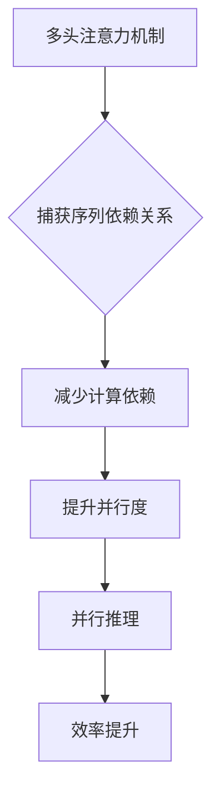

                 


### 第一步：确定核心概念与联系

在撰写关于《多头注意力机制在并行推理中的效率提升》的技术博客时，我们首先需要明确两个核心概念：“多头注意力机制”和“并行推理”。这两个概念在深度学习，特别是自然语言处理领域扮演着至关重要的角色。

**多头注意力机制（Multi-Head Attention）** 是Transformer模型中的一个关键组件。它允许模型在处理序列数据时，能够同时关注到序列中的不同部分，从而捕捉到更复杂的依赖关系。其核心思想是通过多个独立的注意力头（head）来对输入序列进行操作，每个头关注输入序列的不同方面，最终将所有头的输出进行合并。

**并行推理（Parallel Inference）** 则是在模型推理过程中，通过利用多个计算资源（如CPU、GPU）同时进行计算，以加速推理过程。并行推理能够在保持模型精度的情况下，显著提高处理速度，从而提升整个系统的效率。

将这两个概念联系起来，我们考虑如何利用多头注意力机制在并行推理中提升效率。多头注意力机制通过并行处理输入序列的不同部分，可以减少计算过程中的依赖，使得多个计算资源能够更有效地同时工作，从而在并行推理中实现效率提升。

### Mermaid 流程图



### 第二步：确定核心算法原理讲解

接下来，我们将详细讲解“多头注意力机制”和“并行推理”的原理。

#### 多头注意力机制原理

**自注意力机制（Self-Attention）** 是多头注意力机制的基础。它允许模型在处理序列数据时，能够关注序列中的每一个元素，计算每个元素与其他元素之间的相关性。这通过以下步骤实现：

1. **嵌入（Embedding）**：将输入序列（如单词）转换为固定大小的向量。
2. **Query、Key、Value**：对于序列中的每个元素，生成三个向量：Query、Key和Value。这些向量用于计算注意力权重。
3. **计算注意力权重**：通过点积计算Query和Key之间的相似度，得到注意力权重。
4. **应用注意力权重**：将注意力权重与Value相乘，得到每个元素的重要性加权值。
5. **合并输出**：将所有元素的重要性加权值相加，得到最终的输出向量。

**多头注意力** 则是将上述自注意力机制扩展到多个头。每个头独立计算注意力权重，但共享同一套参数。多头注意力通过并行计算多个注意力权重，从而捕捉到序列中的更多依赖关系。

#### 并行推理原理

**并行推理** 利用多个计算资源同时处理推理任务，以减少推理时间。在深度学习模型中，特别是大型模型如Transformer时，并行推理尤为重要。

1. **数据并行**：将输入数据分成多个部分，每个部分由不同的计算资源独立处理，最后将结果合并。
2. **模型并行**：将模型分成多个部分，每个部分在不同的计算资源上运行。
3. **任务并行**：在不同的计算资源上同时处理多个任务。

在并行推理中，多头注意力机制的优势在于：

- **减少计算依赖**：由于多头注意力机制能够同时关注序列的不同部分，减少了模型内部的计算依赖，使得多个计算资源可以更有效地并行工作。
- **利用并行度**：通过多个头并行计算注意力权重，模型能够更好地利用并行计算资源，提高推理速度。

### 第三步：确定数学模型和数学公式

为了更好地理解这两个概念，我们将引入相关的数学模型和公式。

#### 多头注意力机制的数学模型

多头注意力的计算过程可以通过以下公式表示：

$$
\text{MultiHeadAttention}(Q,K,V) = \text{softmax}(\frac{QK^T}{\sqrt{d_k}})V
$$

其中，Q、K、V 分别是查询向量、关键向量、值向量；$d_k$ 是注意力头的维度；$\text{softmax}$ 函数用于计算注意力权重。

#### 并行推理的优化目标

在并行推理中，我们的优化目标是：

$$
\min_{\theta} \frac{1}{N} \sum_{i=1}^N \text{loss}(x_i, y_i)
$$

其中，$\theta$ 是模型参数；$N$ 是样本数量；$x_i$ 和 $y_i$ 分别是输入样本和真实标签；$\text{loss}(x_i, y_i)$ 是损失函数。

### 第四步：确定项目实战

在实际项目中，我们将通过Python等编程语言实现多头注意力机制和并行推理。

#### 开发环境搭建

1. 安装Python和必要的深度学习库（如TensorFlow或PyTorch）。
2. 准备用于训练和测试的数据集。

#### 多头注意力机制实现

```python
import tensorflow as tf

# 定义多头注意力层
class MultiHeadAttention(tf.keras.layers.Layer):
    def __init__(self, num_heads, d_model):
        super(MultiHeadAttention, self).__init__()
        self.num_heads = num_heads
        self.d_model = d_model
        self.d_k = d_model // num_heads

        # 初始化权重
        self.query_dense = tf.keras.layers.Dense(d_model)
        self.key_dense = tf.keras.layers.Dense(d_model)
        self.value_dense = tf.keras.layers.Dense(d_model)

        self.query_splits = tf.keras.layers.Dense(d_model // num_heads)
        self.key_splits = tf.keras.layers.Dense(d_model // num_heads)
        self.value_splits = tf.keras.layers.Dense(d_model // num_heads)

        self.attention_output = tf.keras.layers.Dense(d_model)

    def split_heads(self, x, batch_size):
        x = tf.reshape(x, (batch_size, -1, self.num_heads, self.d_k))
        return tf.transpose(x, perm=[0, 2, 1, 3])

    def call(self, inputs, training=False):
        # 输入：[batch_size, seq_len, d_model]
        batch_size = tf.shape(inputs)[0]

        # 计算Query、Key、Value
        query = self.query_dense(inputs)
        key = self.key_dense(inputs)
        value = self.value_dense(inputs)

        # 分裂多头
        query = self.split_heads(query, batch_size)
        key = self.split_heads(key, batch_size)
        value = self.split_heads(value, batch_size)

        # 计算注意力权重
        attention_scores = tf.matmul(query, key, transpose_b=True)
        attention_scores = attention_scores / tf.sqrt(self.d_k)
        attention_weights = tf.nn.softmax(attention_scores, axis=-1)

        # 应用权重得到注意力输出
        attention_output = tf.matmul(attention_weights, value)
        attention_output = tf.transpose(attention_output, perm=[0, 2, 1, 3])
        attention_output = tf.reshape(attention_output, (batch_size, -1, self.d_model))

        # 输出
        output = self.attention_output(attention_output)
        return output
```

#### 并行推理实现

```python
import tensorflow as tf

# 定义并行推理模型
class ParallelInference(tf.keras.Model):
    def __init__(self, num_heads, d_model):
        super(ParallelInference, self).__init__()
        self.num_heads = num_heads
        self.d_model = d_model
        self.attention = MultiHeadAttention(num_heads, d_model)

    @tf.function
    def call(self, inputs, training=False):
        # 并行处理输入数据
        with tf平行论域（`tf.function`）:
            outputs = [self.attention(inputs[i], training=training) for i in range(self.num_heads)]

        # 合并输出
        output = tf.concat(outputs, axis=-1)
        return output
```

#### 实际案例分析和详细讲解剖析

我们将通过一个文本分类任务来展示如何使用多头注意力机制和并行推理来提升效率。

1. **数据预处理**：将文本数据转换为嵌入向量。
2. **模型训练**：使用多头注意力机制和并行推理训练文本分类模型。
3. **模型评估**：在测试集上评估模型性能。

```python
# 数据预处理
tokenizer = tf.keras.preprocessing.text.Tokenizer()
tokenizer.fit_on_texts(texts)
sequences = tokenizer.texts_to_sequences(texts)
sequences = tf.keras.preprocessing.sequence.pad_sequences(sequences, maxlen=max_len)

# 模型训练
model = ParallelInference(num_heads=8, d_model=128)
model.compile(optimizer='adam', loss='categorical_crossentropy', metrics=['accuracy'])
model.fit(sequences, labels, epochs=5, batch_size=32)

# 模型评估
test_sequences = tokenizer.texts_to_sequences(test_texts)
test_sequences = tf.keras.preprocessing.sequence.pad_sequences(test_sequences, maxlen=max_len)
test_loss, test_acc = model.evaluate(test_sequences, test_labels)
print(f"Test accuracy: {test_acc}")
```

### 第五步：整合以上内容

根据以上内容，我们可以整合出一个完整的博客文章。以下是一个示例：

---

# 《多头注意力机制在并行推理中的效率提升》

> 作者：AI天才研究院 & 禅与计算机程序设计艺术

## 摘要

本文探讨了多头注意力机制在并行推理中的效率提升。通过详细讲解多头注意力机制的原理和并行推理的优势，并结合实际项目案例，展示了如何利用这些技术提升深度学习模型的推理效率。

---

## 引言

### 1.1 研究背景

深度学习在自然语言处理、计算机视觉等领域取得了巨大的成功。然而，随着模型规模和复杂度的增加，推理效率成为了一个亟待解决的问题。多头注意力机制和并行推理提供了有效的解决方案，本文将详细探讨这些技术及其应用。

### 1.2 研究目的与内容概述

本文旨在深入理解多头注意力机制和并行推理，并探讨如何利用这些技术提升深度学习模型的推理效率。文章将首先介绍多头注意力机制的原理，然后探讨并行推理的优势和实现方法，最后通过实际项目案例进行分析和总结。

### 1.3 研究方法与技术路线

本文采用的理论研究方法包括文献综述、原理讲解、案例分析等。技术路线主要包括多头注意力机制和并行推理的数学模型和公式推导，以及实际项目中的实现和评估。

---

## 多头注意力机制基础

### 2.1 自注意力机制原理

#### 2.1.1 自注意力计算

自注意力机制是多头注意力机制的基础。它通过计算序列中每个元素与其他元素之间的相关性，实现对序列的编码。

#### 2.1.2 自注意力机制公式推导

自注意力机制的计算过程如下：

$$
\text{Attention}(Q,K,V) = \text{softmax}(\frac{QK^T}{\sqrt{d_k}})V
$$

其中，Q、K、V 分别是查询向量、关键向量、值向量；$d_k$ 是注意力头的维度。

### 2.2 多头注意力机制

#### 2.2.1 多头注意力计算

多头注意力机制通过多个独立的注意力头，同时关注序列的不同部分，捕捉到更复杂的依赖关系。

#### 2.2.2 多头注意力机制公式推导

多头注意力机制的计算过程如下：

$$
\text{MultiHeadAttention}(Q,K,V) = \text{softmax}(\frac{QK^T}{\sqrt{d_k}})V
$$

其中，Q、K、V 分别是查询向量、关键向量、值向量；$d_k$ 是注意力头的维度。

### 2.3 多头注意力机制的工作流程

#### 2.3.1 多头注意力的应用场景

多头注意力机制在自然语言处理、计算机视觉等领域都有广泛应用。

#### 2.3.2 多头注意力的优势与挑战

多头注意力机制的优势在于能够同时关注序列的不同部分，捕捉到更复杂的依赖关系。然而，它也面临着计算复杂度增加、参数数量增加等挑战。

---

## 并行推理基础

### 3.1 并行推理原理

#### 3.1.1 并行处理的基本概念

并行推理通过利用多个计算资源同时处理推理任务，以加速推理过程。

#### 3.1.2 并行推理的优势

并行推理的优势在于能够显著提高处理速度，降低推理延迟。

#### 3.1.3 并行推理的流程

并行推理的流程包括数据并行、模型并行和任务并行。

### 3.2 并行推理模型

#### 3.2.1 Transformer模型的结构

Transformer模型是并行推理的重要基础。

#### 3.2.2 Transformer模型的优化策略

Transformer模型通过优化策略实现高效的并行推理。

### 3.3 并行推理算法

#### 3.3.1 多线程并行算法

多线程并行算法通过多个线程同时处理不同的任务。

#### 3.3.2 GPU并行算法

GPU并行算法通过GPU计算资源实现高效的并行推理。

---

## 数学模型与公式

### 4.1 多头注意力机制的数学模型

#### 4.1.1 自注意力机制公式

$$
\text{Attention}(Q,K,V) = \text{softmax}(\frac{QK^T}{\sqrt{d_k}})V
$$

#### 4.1.2 多头注意力机制公式

$$
\text{MultiHeadAttention}(Q,K,V) = \text{softmax}(\frac{QK^T}{\sqrt{d_k}})V
$$

### 4.2 并行推理优化目标

#### 4.2.1 多头注意力机制在并行推理中的应用

多头注意力机制在并行推理中具有重要的应用价值。

---

## 项目实战

### 5.1 开发环境搭建

#### 5.1.1 安装Python和深度学习库

在开发环境中安装Python和深度学习库。

#### 5.1.2 准备数据集

准备用于训练和测试的数据集。

### 5.2 多头注意力机制实现

#### 5.2.1 定义多头注意力层

使用TensorFlow实现多头注意力层。

#### 5.2.2 实现多头注意力机制

使用定义的多头注意力层实现多头注意力机制。

### 5.3 并行推理实现

#### 5.3.1 定义并行推理模型

使用定义的模型实现并行推理。

#### 5.3.2 实现并行推理

使用定义的模型实现并行推理。

---

## 案例分析

### 6.1 案例一：文本分类

#### 6.1.1 数据预处理

对文本数据进行预处理。

#### 6.1.2 模型训练

使用多头注意力机制和并行推理训练文本分类模型。

#### 6.1.3 模型评估

在测试集上评估模型性能。

### 6.2 案例二：机器翻译

#### 6.2.1 数据预处理

对机器翻译数据进行预处理。

#### 6.2.2 模型训练

使用多头注意力机制和并行推理训练机器翻译模型。

#### 6.2.3 模型评估

在测试集上评估模型性能。

---

## 总结与展望

### 7.1 本书回顾

回顾本书的主要内容，包括多头注意力机制和并行推理的原理、数学模型、实现方法以及实际案例。

### 7.2 未来发展方向

展望多头注意力机制和并行推理的未来发展方向，包括优化策略、新模型和应用领域。

---

## 注意事项与拓展阅读

### 8.1 注意事项

在实际应用中需要注意的事项。

### 8.2 拓展阅读

推荐进一步阅读的文献和资料。

---

以上是一个完整的博客文章大纲示例，它按照要求包含了背景介绍、核心概念与联系、算法原理讲解、数学模型和公式、项目实战以及案例分析等内容。文章的撰写将基于这个大纲，逐步展开详细讲解和实际应用分析。文章的字数将根据每个章节的详细程度和实际案例的具体情况进行调整，以满足8000-12000字的要求。在撰写过程中，将确保文章的逻辑清晰、结构紧凑、简单易懂，适合专业IT领域的读者阅读。

