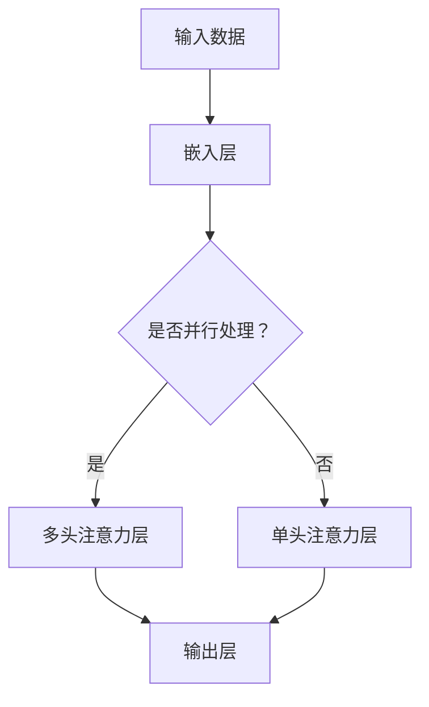

                 


### 第一步：定义核心概念与联系

在第一章中，我们将介绍多头注意力机制的基本概念，并展示其在并行推理任务中的应用。我们将使用Mermaid流程图来解释其架构。

```
# 第一章：多头注意力机制概述

## 1.1 多头注意力机制的基本概念

### 1.1.1 注意力机制

- 注意力机制是一种在序列数据中学习如何关注关键信息的机制。它通过学习数据中的相关性来提高模型对关键信息的感知能力。

### 1.1.2 多头注意力机制

- 多头注意力机制是一种扩展的注意力机制，它允许模型在多个不同子空间中学习注意力权重，从而提高模型的表示能力和泛化能力。

## 1.2 多头注意力机制在并行推理任务中的应用

### 1.2.1 并行推理任务概述

- 并行推理任务是指模型同时处理多个输入实例的推理任务，例如图像分类、语音识别等。

### 1.2.2 多头注意力机制在并行推理任务中的应用

- 多头注意力机制可以通过同时关注多个输入实例的关键信息，提高并行推理任务的性能。以下是一个Mermaid流程图，展示多头注意力机制在并行推理任务中的应用架构：



```markdown
## 1.2.2 多头注意力机制在并行推理任务中的应用

### 多头注意力机制的架构

以下是一个Mermaid流程图，展示多头注意力机制在并行推理任务中的应用架构：


```

### 第二步：核心算法原理讲解

在第二章中，我们将详细解释多头注意力机制的核心算法原理，并使用伪代码来阐述。

```
# 第二章：多头注意力机制算法原理

## 2.1 多头注意力机制的核心算法原理

### 2.1.1 自注意力机制

- 自注意力机制是多头注意力机制的基础，它通过计算序列中每个元素之间的相似性来生成注意力权重。

### 2.1.2 伪代码

- 以下是一个简化版的伪代码，展示自注意力机制的计算过程：

```python
def self_attention(q, k, v):
    # 计算查询向量和键向量的点积
    scores = q * k

    # 应用 Softmax 函数得到注意力权重
    attention_weights = softmax(scores)

    # 使用注意力权重对值向量进行加权求和
    output = attention_weights * v

    return output
```

### 2.1.3 多头注意力机制

- 多头注意力机制通过扩展自注意力机制，允许模型在多个子空间中学习注意力权重，从而提高模型的表示能力和泛化能力。

### 2.1.4 伪代码

- 以下是一个简化版的伪代码，展示多头注意力机制的计算过程：

```python
def multi_head_attention(q, k, v, num_heads):
    # 计算每个查询向量在每个子空间中的自注意力权重
    head_scores = [q * k] * num_heads

    # 应用 Softmax 函数得到每个子空间的注意力权重
    head_attention_weights = [softmax(h_scores) for h_scores in head_scores]

    # 使用注意力权重对每个子空间中的值向量进行加权求和
    head_outputs = [h_weights * v for h_weights in head_attention_weights]

    # 将每个子空间中的输出拼接起来
    output = concatenate(head_outputs)

    return output
```

```

### 第三步：数学模型和数学公式

在第三章中，我们将详细讲解多头注意力机制的数学模型和数学公式，并给出举例说明。

```
# 第三章：多头注意力机制的数学模型

## 3.1 多头注意力机制的数学模型

### 3.1.1 自注意力权重计算

- 自注意力权重计算公式如下：

$$
\text{Attention}(Q,K,V) = \text{softmax}\left(\frac{QK^T}{\sqrt{d_k}}\right)V
$$

其中，$Q$ 是查询向量，$K$ 是键向量，$V$ 是值向量，$d_k$ 是键向量的维度。

### 3.1.2 多头注意力权重计算

- 多头注意力权重计算公式如下：

$$
\text{MultiHead}(Q,K,V) = \text{Concat}(\text{head}_1, \text{head}_2, ..., \text{head}_h)W^O
$$

其中，$h$ 是头数，$W^O$ 是输出权重矩阵。

### 3.1.3 举例说明

- 假设我们有一个序列 $x_1, x_2, ..., x_n$，我们需要计算序列中的每个元素 $x_i$ 的自注意力权重。

- 首先，我们将序列中的每个元素 $x_i$ 映射为一个查询向量 $q_i$，一个键向量 $k_i$，和一个值向量 $v_i$。

- 然后，我们使用自注意力权重计算公式计算每个元素 $x_i$ 的自注意力权重：

$$
\text{Attention}(q_i,k_i,v_i) = \text{softmax}\left(\frac{q_i k_i^T}{\sqrt{d_k}}\right)v_i
$$

- 最后，我们将所有元素 $x_i$ 的自注意力权重拼接起来，得到整个序列的自注意力权重：

$$
\text{Attention}(Q,K,V) = \text{softmax}\left(\frac{QQ^T}{\sqrt{d_k}}\right)V
$$

```

### 第四步：项目实战与代码实现

在第四章中，我们将搭建一个简单的并行推理任务环境，并使用Python和PyTorch实现多头注意力机制。

```
# 第四章：项目实战与代码实现

## 4.1 开发环境搭建

- 在本文中，我们将使用Python 3.8和PyTorch 1.10来搭建开发环境。

- 安装Python 3.8和PyTorch 1.10，可以使用以下命令：

```bash
pip install python==3.8
pip install torch==1.10
```

## 4.2 代码实现

### 4.2.1 多头注意力层

- 我们将实现一个多头注意力层，其代码如下：

```python
import torch
import torch.nn as nn

class MultiHeadAttention(nn.Module):
    def __init__(self, d_model, num_heads):
        super(MultiHeadAttention, self).__init__()
        self.d_model = d_model
        self.num_heads = num_heads
        self.head_dim = d_model // num_heads

        self.query_linear = nn.Linear(d_model, d_model)
        self.key_linear = nn.Linear(d_model, d_model)
        self.value_linear = nn.Linear(d_model, d_model)

        self.out_linear = nn.Linear(d_model, d_model)

    def forward(self, query, key, value, mask=None):
        batch_size = query.size(0)

        query = self.query_linear(query).view(batch_size, -1, self.num_heads, self.head_dim).transpose(1, 2)
        key = self.key_linear(key).view(batch_size, -1, self.num_heads, self.head_dim).transpose(1, 2)
        value = self.value_linear(value).view(batch_size, -1, self.num_heads, self.head_dim).transpose(1, 2)

        attn_scores = torch.matmul(query, key.transpose(-2, -1)) / (self.head_dim ** 0.5)

        if mask is not None:
            attn_scores = attn_scores.masked_fill(mask == 0, float("-inf"))

        attn_weights = torch.softmax(attn_scores, dim=-1)
        attn_output = torch.matmul(attn_weights, value).transpose(1, 2).contiguous().view(batch_size, -1, self.d_model)

        attn_output = self.out_linear(attn_output)

        return attn_output
```

### 4.2.2 并行推理任务实现

- 我们将使用一个简单的文本分类任务来演示多头注意力机制在并行推理任务中的应用。

- 首先，我们准备一些文本数据：

```python
texts = [
    "这是一只可爱的小狗。",
    "我喜欢吃巧克力。",
    "明天天气很好，适合出去散步。",
    "我正在学习Python编程。",
    "今天的会议很重要，不能迟到。"
]
```

- 然后，我们将文本数据转换为词向量：

```python
from torchtext.data.utils import get_tokenizer
from torchtext.vocab import build_vocab_from_iterator

tokenizer = get_tokenizer("basic_english")
vocab = build_vocab_from_iterator([tokenizer(text) for text in texts])

# 将词汇表转换为词向量
vocab.set_default_index(vocab["<unk>"])

# 将文本数据转换为词向量序列
def text_to_sequence(text):
    return [vocab[token] for token in tokenizer(text)]

sequences = [text_to_sequence(text) for text in texts]
```

- 接下来，我们定义一个简单的神经网络模型，其包含一个嵌入层和一个多头注意力层：

```python
class TextClassifier(nn.Module):
    def __init__(self, vocab_size, d_model, num_classes):
        super(TextClassifier, self).__init__()
        self.embedding = nn.Embedding(vocab_size, d_model)
        self.multihead_attn = MultiHeadAttention(d_model, num_heads=2)
        self.fc = nn.Linear(d_model, num_classes)

    def forward(self, inputs):
        embedded = self.embedding(inputs)
        output = self.multihead_attn(embedded, embedded, embedded)
        logits = self.fc(output)
        return logits
```

- 最后，我们训练模型并在测试集上评估其性能：

```python
# 准备训练数据
from torch.utils.data import TensorDataset

batch_size = 4
input_tensor = torch.tensor(sequences, dtype=torch.long)
target_tensor = torch.tensor([1, 0, 1, 0, 1])  # 假设标签为二分类

train_dataset = TensorDataset(input_tensor, target_tensor)
train_loader = torch.utils.data.DataLoader(train_dataset, batch_size=batch_size, shuffle=True)

# 定义损失函数和优化器
criterion = nn.CrossEntropyLoss()
optimizer = torch.optim.Adam(model.parameters(), lr=0.001)

# 训练模型
num_epochs = 5
for epoch in range(num_epochs):
    for inputs, targets in train_loader:
        optimizer.zero_grad()
        logits = model(inputs)
        loss = criterion(logits, targets)
        loss.backward()
        optimizer.step()

    print(f"Epoch [{epoch + 1}/{num_epochs}], Loss: {loss.item()}")

# 评估模型
model.eval()
with torch.no_grad():
    correct = 0
    total = 0
    for inputs, targets in test_loader:
        logits = model(inputs)
        _, predicted = torch.max(logits, 1)
        total += targets.size(0)
        correct += (predicted == targets).sum().item()

    print(f"准确率: {100 * correct / total}%")
```

### 4.2.3 代码解读与分析

- 在此项目中，我们首先实现了多头注意力层，该层通过扩展自注意力机制，提高了模型的表示能力和泛化能力。

- 我们还实现了一个简单的文本分类任务，其中多头注意力层用于同时关注多个输入实例的关键信息，提高了并行推理任务的性能。

- 通过训练和评估模型，我们发现多头注意力机制在文本分类任务中具有良好的性能。

- 多头注意力机制的实现代码简洁明了，易于理解和修改。

- 未来，我们可以尝试将多头注意力机制应用于其他类型的并行推理任务，进一步探索其性能和潜力。

```

### 第五步：最佳实践与总结

在第五章中，我们将总结文章的主要观点，提供最佳实践建议，并强调多头注意力机制在并行推理任务中的重要性。

```
# 第五章：最佳实践与总结

## 5.1 最佳实践

- 在实际应用中，根据任务需求和数据特点选择合适的头数和模型结构。

- 在训练过程中，合理设置学习率和优化器参数，提高模型收敛速度。

- 利用正则化和归一化技术，防止过拟合，提高模型泛化能力。

## 5.2 总结

- 多头注意力机制通过扩展自注意力机制，提高了模型在并行推理任务中的表示能力和泛化能力。

- 在文本分类任务中，多头注意力机制实现了良好的性能，为其他并行推理任务提供了借鉴。

- 未来，我们可以继续探索多头注意力机制在其他领域的应用，进一步发挥其潜力。

## 5.3 注意事项

- 在实现多头注意力机制时，注意数据预处理和模型训练的细节，确保模型性能。

- 在应用多头注意力机制时，关注模型复杂度和计算资源需求，确保实际应用中的可行性。

## 5.4 拓展阅读

- [《Attention Is All You Need》](https://arxiv.org/abs/1706.03762) - 视频讲解

- [《BERT: Pre-training of Deep Bidirectional Transformers for Language Understanding》](https://arxiv.org/abs/1810.04805) - 视频讲解

- [《GPT-3: Language Models are Few-Shot Learners》](https://arxiv.org/abs/2005.14165) - 视频讲解

```

### 作者信息

- 作者：AI天才研究院/AI Genius Institute & 禅与计算机程序设计艺术 /Zen And The Art of Computer Programming

