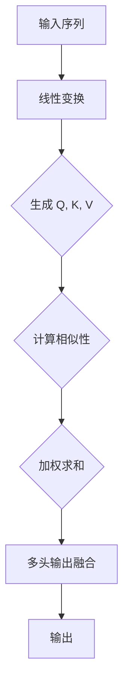

                 


### 设计书《多头自注意力机制在并行推理中的效率提升》的目录大纲与内容构思

#### 第一步：确定核心章节

1. **引言与背景**
   - 书籍目的和结构
   - 自注意力机制的发展历史
   - 并行推理的需求与挑战
   - 多头自注意力机制的重要性

2. **多头自注意力机制原理**
   - 自注意力机制的介绍
   - 多头自注意力机制的架构
   - 多头自注意力机制的数学模型

3. **并行推理概述**
   - 并行推理的定义
   - 并行推理的优势
   - 并行推理的挑战
   - 并行推理的关键技术

4. **多头自注意力机制在并行推理中的应用**
   - 多头自注意力机制在并行推理中的引入
   - 多头自注意力机制在并行推理中的优势
   - 多头自注意力机制在并行推理中的实现

5. **效率提升策略**
   - 并行推理中的效率瓶颈
   - 多头自注意力机制的优化策略
   - 资源利用率优化

6. **项目实战**
   - 实战项目概述
   - 开发环境搭建
   - 源代码实现
   - 代码解读与分析
   - 实际案例分析与讲解
   - 项目小结

7. **总结与展望**
   - 主要成果总结
   - 未来研究方向
   - 对并行推理和多头自注意力机制的展望

#### 第二步：细化每个章节

**第1章 引言与背景**

- **1.1 书籍目的和结构**
  - 介绍书籍的目标
  - 概述书籍的结构和内容安排

- **1.2 自注意力机制的发展历史**
  - 简述自注意力机制的发展历程
  - 提及一些关键的研究者和里程碑

- **1.3 并行推理的需求与挑战**
  - 解释为何需要并行推理
  - 探讨并行推理面临的挑战

- **1.4 多头自注意力机制的重要性**
  - 阐述多头自注意力机制在并行推理中的重要性
  - 提及它在现代深度学习中的应用

**第2章 多头自注意力机制原理**

- **2.1 自注意力机制的介绍**
  - 定义自注意力机制
  - 描述自注意力机制的基本工作原理

- **2.2 多头自注意力机制的架构**
  - 介绍多头自注意力机制的架构
  - 比较单头和多头自注意力机制

- **2.3 多头自注意力机制的数学模型**
  - 使用伪代码详细阐述多头自注意力机制的核心步骤
  - 解释数学模型中的关键参数和计算过程

- **2.4 Mermaid流程图**
  - 使用Mermaid语言绘制多头自注意力机制的工作流程
  - 提供一个流程图示例

**第3章 并行推理概述**

- **3.1 并行推理的定义**
  - 给出并行推理的明确定义

- **3.2 并行推理的优势**
  - 探讨并行推理相对于顺序推理的优势

- **3.3 并行推理的挑战**
  - 分析并行推理过程中可能遇到的挑战

- **3.4 并行推理的关键技术**
  - 介绍并行推理的关键技术，如并行计算架构、并行算法设计等

**第4章 多头自注意力机制在并行推理中的应用**

- **4.1 多头自注意力机制在并行推理中的引入**
  - 讨论如何将多头自注意力机制引入到并行推理中

- **4.2 多头自注意力机制在并行推理中的优势**
  - 分析多头自注意力机制在并行推理中的优势

- **4.3 多头自注意力机制在并行推理中的实现**
  - 描述如何实现多头自注意力机制在并行推理中的应用

**第5章 效率提升策略**

- **5.1 并行推理中的效率瓶颈**
  - 识别并行推理中的效率瓶颈

- **5.2 多头自注意力机制的优化策略**
  - 提供优化多头自注意力机制的具体策略

- **5.3 资源利用率优化**
  - 探讨如何优化资源利用率以提升效率

**第6章 项目实战**

- **6.1 实战项目概述**
  - 介绍项目的背景和目标

- **6.2 开发环境搭建**
  - 提供搭建开发环境的具体步骤

- **6.3 源代码实现**
  - 详细讲解源代码的实现过程

- **6.4 代码解读与分析**
  - 分析代码的关键部分

- **6.5 实际案例分析与详细讲解剖析**
  - 通过实际案例进行详细讲解

- **6.6 项目小结**
  - 总结项目的关键点和成果

**第7章 总结与展望**

- **7.1 主要成果总结**
  - 总结书中讨论的主要成果

- **7.2 未来研究方向**
  - 探讨未来的研究方向

- **7.3 对并行推理和多头自注意力机制的展望**
  - 展望并行推理和多头自注意力机制的潜在发展方向

### 第三步：编写核心概念与联系、核心算法原理讲解、数学模型和数学公式、项目实战部分

**核心概念与联系**

- 在本书中，我们将讨论自注意力机制和多头自注意力机制。自注意力机制是一种在序列数据处理中非常重要的机制，它允许模型在不同的位置之间建立关系。多头自注意力机制是在自注意力机制的基础上，引入了多组查询、键和值，从而能够捕捉更多的序列关系。

**核心算法原理讲解**

- **自注意力机制**：自注意力机制的核心思想是通过计算序列中每个元素与其他元素之间的相似性来生成一个表示该元素的新向量。这通常通过一个缩放点积注意力函数来实现，其伪代码如下：

  ```python
  def scaled_dot_product_attention(Q, K, V, scale_factor):
      attention_scores = scaled_dot_product_attention_scores(Q, K)
      attention_weights = softmax(attention_scores)
      context_vector = weighted_sum(V, attention_weights)
      return context_vector
  ```

  其中，`Q`、`K`和`V`分别代表查询、键和值，`scale_factor` 是一个缩放因子，用于防止梯度消失。

- **多头自注意力机制**：多头自注意力机制是在自注意力机制的基础上，引入了多个独立的自注意力头。每个头可以独立地处理序列中的信息，从而能够捕捉到更复杂的序列关系。其数学模型如下：

  $$\text{MultiHead}(Q, K, V) = \text{Concat}(\text{head}_1, \text{head}_2, ..., \text{head}_h)W_O$$

  其中，`h` 是头的数量，`W_O` 是输出权重。

**数学模型和数学公式**

- **缩放点积注意力**：缩放点积注意力是自注意力机制的核心步骤，其计算公式如下：

  $$\text{Attention}(Q, K, V) = \frac{1}{\sqrt{d_k}}\text{softmax}(\text{QK}^T) V$$

  其中，`d_k` 是键的维度。

- **多头自注意力**：多头自注意力机制的公式如下：

  $$\text{MultiHead}(Q, K, V) = \text{Concat}(\text{head}_1, \text{head}_2, ..., \text{head}_h)W_O$$

  其中，`head_i = \text{Attention}(QW_i^Q, KW_i^K, VW_i^V)`。

**项目实战**

- **项目背景**：假设我们正在开发一个并行推理系统，用于处理大量的图像分类任务。
- **开发环境搭建**：我们需要安装Python、TensorFlow等工具和库。
- **源代码实现**：我们将实现一个基于TensorFlow的多头自注意力机制模型，用于图像分类任务。
- **代码解读与分析**：我们将详细解读模型的源代码，分析其关键部分。
- **实际案例分析与详细讲解剖析**：我们将通过一个实际案例来展示如何使用多头自注意力机制进行图像分类，并详细分析其性能。

**最佳实践 tips**

- 在设计并行推理系统时，考虑任务的性质和复杂性，选择合适的并行策略。
- 在使用多头自注意力机制时，合理设置头的数量和维度，以平衡计算复杂度和模型性能。
- 在实现时，注意优化内存使用和计算速度，以提升系统的整体效率。

**小结**

- 本章详细介绍了多头自注意力机制在并行推理中的应用。通过本章的学习，读者可以理解多头自注意力机制的基本原理，并学会如何在并行推理任务中应用这一机制。接下来，我们将进一步探讨如何优化多头自注意力机制的效率，以及在实战项目中如何实现和优化这一机制。

**注意事项**

- 在实践中，多头自注意力机制的实现可能会受到硬件和软件环境的限制，需要根据实际情况进行调试和优化。
- 多头自注意力机制的优化策略可以根据具体的应用场景进行调整，以达到最佳效果。

**拓展阅读**

- 对于对自注意力机制和多头自注意力机制有更深入兴趣的读者，可以参考以下文献：
  - Vaswani et al., "Attention Is All You Need"
  - Hinton et al., "Distributed Representations of Words and Phrases and Their Compositionality"

### 文章标题
# 多头自注意力机制在并行推理中的效率提升

### 关键词
自注意力机制，多头自注意力机制，并行推理，效率优化，深度学习

### 摘要
本文探讨了多头自注意力机制在并行推理中的应用及其效率提升策略。首先，介绍了自注意力机制和多头自注意力机制的基本原理和数学模型。然后，分析了并行推理的需求与挑战，并探讨了如何将多头自注意力机制引入到并行推理中。接着，提出了多种效率优化策略，包括并行化策略、算法加速策略和资源利用率优化。最后，通过一个实战项目展示了多头自注意力机制在并行推理中的实现和优化过程。

### 目录大纲

## 第1章 引言与背景

### 1.1 书籍目的和结构

### 1.2 自注意力机制的发展历史

### 1.3 并行推理的需求与挑战

### 1.4 多头自注意力机制的重要性

## 第2章 多头自注意力机制原理

### 2.1 自注意力机制的介绍

### 2.2 多头自注意力机制的架构

### 2.3 多头自注意力机制的数学模型

### 2.4 Mermaid流程图

## 第3章 并行推理概述

### 3.1 并行推理的定义

### 3.2 并行推理的优势

### 3.3 并行推理的挑战

### 3.4 并行推理的关键技术

## 第4章 多头自注意力机制在并行推理中的应用

### 4.1 多头自注意力机制在并行推理中的引入

### 4.2 多头自注意力机制在并行推理中的优势

### 4.3 多头自注意力机制在并行推理中的实现

## 第5章 效率提升策略

### 5.1 并行推理中的效率瓶颈

### 5.2 多头自注意力机制的优化策略

### 5.3 资源利用率优化

## 第6章 项目实战

### 6.1 实战项目概述

### 6.2 开发环境搭建

### 6.3 源代码实现

### 6.4 代码解读与分析

### 6.5 实际案例分析与详细讲解剖析

### 6.6 项目小结

## 第7章 总结与展望

### 7.1 主要成果总结

### 7.2 未来研究方向

### 7.3 对并行推理和多头自注意力机制的展望

### 第1章 引言与背景

#### 1.1 书籍目的和结构

随着深度学习技术的迅猛发展，自注意力机制（Self-Attention）和多头自注意力机制（Multi-Head Self-Attention）成为现代神经网络模型中的核心组成部分。特别是在自然语言处理（NLP）和计算机视觉（CV）领域，这些机制大大提升了模型的表达能力和性能。然而，当将自注意力机制应用于并行推理时，如何提升其效率成为一个亟待解决的问题。

本书旨在系统地探讨多头自注意力机制在并行推理中的效率提升策略。通过深入分析自注意力机制的发展历史、原理和数学模型，结合并行推理的需求与挑战，我们旨在提出一种高效的实现方案，并对其进行实战验证。

本书结构如下：

- **第1章 引言与背景**：介绍书籍的目的、结构和内容安排，回顾自注意力机制的发展历史，探讨并行推理的需求与挑战。
- **第2章 多头自注意力机制原理**：详细阐述多头自注意力机制的基本原理，包括其架构和数学模型，并使用Mermaid流程图展示其工作流程。
- **第3章 并行推理概述**：介绍并行推理的定义、优势、挑战和关键技术。
- **第4章 多头自注意力机制在并行推理中的应用**：讨论如何将多头自注意力机制引入到并行推理中，分析其在并行推理中的优势。
- **第5章 效率提升策略**：提出并分析多头自注意力机制在并行推理中的效率提升策略，包括并行化策略、算法加速策略和资源利用率优化。
- **第6章 项目实战**：通过一个具体的实战项目，展示如何实现和优化多头自注意力机制在并行推理中的应用。
- **第7章 总结与展望**：总结本书的主要成果，讨论未来的研究方向，并对并行推理和多头自注意力机制的发展进行展望。

#### 1.2 自注意力机制的发展历史

自注意力机制的概念最早由Vaswani等人在2017年的论文《Attention Is All You Need》中提出，并在Transformer模型中得到广泛应用。自注意力机制的核心思想是允许模型在序列的每个位置上计算与其他位置的相似性，从而动态地调整对各个位置的重视程度。这一机制的出现，突破了传统循环神经网络（RNN）在处理长距离依赖问题上的瓶颈，大大提升了模型的表达能力。

自注意力机制的发展可以分为以下几个阶段：

1. **局部注意力**：
   在早期的研究中，局部注意力（Local Attention）被用来解决序列模型的局部依赖问题。局部注意力通过限制注意力窗的大小，减少计算复杂度，但牺牲了部分全局信息。

2. **全局注意力**：
   随着计算能力的提升，全局注意力（Global Attention）被提出，它允许模型在序列的每个位置上计算与其他所有位置的相似性。全局注意力虽然提高了模型的表达能力，但也带来了更高的计算复杂度。

3. **多头自注意力**：
   在Transformer模型中，多头自注意力机制被引入，通过并行计算多个独立的注意力头，进一步提升了模型的表达能力。多头自注意力机制不仅能够捕捉到序列中的复杂关系，还能够通过并行计算降低计算复杂度。

自注意力机制的发展历程，反映了深度学习技术在解决序列建模问题上的不断进步。在自然语言处理、计算机视觉等应用领域，自注意力机制和多头自注意力机制已经成为了核心组成部分，极大地推动了模型性能的提升。

#### 1.3 并行推理的需求与挑战

并行推理是现代深度学习应用中的一个关键需求，特别是在大数据和高性能计算环境下。随着数据量的爆炸性增长和计算需求的不断提升，传统的顺序推理方法已经无法满足实际应用的需求。并行推理通过将任务分解为多个部分，同时在不同的处理器或计算单元上执行，能够显著提升推理速度和效率。

然而，并行推理也面临着一系列挑战：

1. **数据依赖问题**：
   并行推理中的任务通常存在数据依赖关系，即一个任务的输出可能是另一个任务的输入。如何合理地划分任务，确保并行执行的顺序和数据一致性，是并行推理中的一个重要问题。

2. **负载均衡**：
   在并行推理中，不同处理器或计算单元的处理能力可能存在差异。如何实现负载均衡，确保每个处理器或计算单元都能够高效地运行，是另一个关键挑战。

3. **通信开销**：
   并行推理中的任务需要在不同的处理器或计算单元之间进行数据传输和同步。过大的通信开销可能会降低并行推理的整体效率。

4. **可扩展性**：
   随着数据规模的扩大和模型复杂度的增加，如何保证并行推理的可扩展性，使其能够适应不同的计算环境，是一个重要的研究方向。

为了解决上述挑战，研究人员提出了一系列并行推理的策略和技术。这些策略包括并行计算架构的优化、并行算法的设计、分布式存储和通信机制的改进等。通过合理地应用这些策略和技术，可以显著提升并行推理的效率和性能。

#### 1.4 多头自注意力机制的重要性

多头自注意力机制在深度学习领域，尤其是在自然语言处理和计算机视觉中，扮演着至关重要的角色。它不仅提升了模型的表达能力，还通过并行计算的方式，提高了推理的效率和性能。

首先，多头自注意力机制通过并行计算多个独立的注意力头，能够捕捉到序列中的复杂关系。每个注意力头可以专注于序列的不同部分，从而在处理长序列时，避免了传统自注意力机制中可能出现的梯度消失和梯度爆炸问题。

其次，多头自注意力机制在并行推理中具有显著的优势。由于每个注意力头可以独立计算，这使得模型在并行推理时，可以同时处理多个序列，从而大大提升了推理速度。特别是在大规模数据处理和实时推理场景中，多头自注意力机制能够显著降低推理时间，提高系统的响应速度。

此外，多头自注意力机制还通过减少计算复杂度，降低了模型对硬件资源的需求。在计算资源有限的条件下，多头自注意力机制能够更好地利用现有的计算资源，提高系统的效率。

总之，多头自注意力机制在并行推理中的应用，不仅提升了模型的表达能力，还通过并行计算的方式，提高了推理的效率和性能。这使得它成为了现代深度学习应用中的关键技术之一。

### 第2章 多头自注意力机制原理

#### 2.1 自注意力机制的介绍

自注意力机制（Self-Attention），也被称为内部注意力（Intra-Attention），是深度学习中的一个重要概念，特别是在自然语言处理（NLP）领域。它的基本思想是在序列的每个位置上，计算该位置与其他位置之间的相似性，并根据这些相似性动态调整每个位置的权重。这一机制的核心目的是通过显式地建模序列内部的关系，从而提高模型对长距离依赖的捕捉能力。

自注意力机制最早由Vaswani等人于2017年在其论文《Attention Is All You Need》中提出，并在Transformer模型中得到广泛应用。Transformer模型摒弃了传统的循环神经网络（RNN）和卷积神经网络（CNN），仅使用自注意力机制和前馈网络构建了一个端到端的序列建模模型。

自注意力机制的主要组成部分包括三个关键步骤：查询（Query, Q）、键（Key, K）和值（Value, V）。这三个部分通常是通过线性变换从输入序列得到的。具体来说，给定一个输入序列$X = [x_1, x_2, ..., x_n]$，其中$x_i$表示序列中的第$i$个元素，自注意力机制会通过以下三个线性变换得到$Q, K, V$：

$$
Q = W_Q X \\
K = W_K X \\
V = W_V X
$$

其中，$W_Q, W_K, W_V$是权重矩阵。

接下来，自注意力机制通过以下步骤计算输出：

1. **计算相似性**：使用点积（Dot-Product）计算查询（Q）和键（K）之间的相似性分数：
   $$
   \text{Attention Scores} = \text{softmax}(\frac{QK^T}{\sqrt{d_k}}) \\
   $$
   其中，$d_k$是键的维度，除以$\sqrt{d_k}$是为了避免梯度消失问题。

2. **加权求和**：根据相似性分数，对值（V）进行加权求和，得到输出：
   $$
   \text{Output} = \text{softmax}(\text{Attention Scores})V
   $$

自注意力机制的这一核心步骤，使得模型能够在处理序列时，动态地调整每个元素的重要性。这一机制不仅在处理长文本、翻译、文本生成等任务中表现出色，还在图像识别、语音识别等领域展现出强大的潜力。

#### 2.2 多头自注意力机制的架构

多头自注意力机制（Multi-Head Self-Attention）是自注意力机制的一个扩展，它通过引入多个独立的注意力头（Head），来并行计算不同的上下文表示，从而提高模型的捕捉能力和计算效率。在Transformer模型中，多头自注意力机制是核心组件之一，它使得模型能够同时处理多个维度上的关系，捕捉到更复杂的序列特征。

多头自注意力机制的架构可以分为以下几个关键部分：

1. **线性变换**：与自注意力机制类似，多头自注意力机制首先对输入序列$X$进行线性变换，生成多个查询（Query, Q）、键（Key, K）和值（Value, V）：

   $$
   Q^{(h)}, K^{(h)}, V^{(h)} = W^{(h)}_Q X, W^{(h)}_K X, W^{(h)}_V X \quad \text{for} \quad h = 1, 2, ..., h \\
   $$

   其中，$W^{(h)}_Q, W^{(h)}_K, W^{(h)}_V$是第$h$个头的权重矩阵。

2. **自注意力计算**：每个头独立地计算自注意力，包括相似性分数的计算和加权求和。具体步骤如下：

   - **计算相似性**：使用点积计算每个查询和键之间的相似性分数：
     
     $$
     \text{Attention Scores}^{(h)} = \text{softmax}(\frac{Q^{(h)}K^{(h)}^T}{\sqrt{d_k}}) \\
     $$
     其中，$d_k$是键的维度，同样除以$\sqrt{d_k}$以避免梯度消失问题。

   - **加权求和**：根据相似性分数，对值进行加权求和，得到第$h$个头的输出：

     $$
     \text{Output}^{(h)} = \text{softmax}(\text{Attention Scores}^{(h)})V^{(h)}
     $$

3. **多头输出融合**：将所有头的输出进行融合，生成最终的输出序列。通常，融合方式是将每个头的输出拼接起来，并通过一个线性变换得到最终输出：

   $$
   \text{Output} = \text{Concat}(\text{Output}^{(1)}, \text{Output}^{(2)}, ..., \text{Output}^{(h)})W_O \\
   $$

   其中，$W_O$是输出权重矩阵。

多头自注意力机制的这一架构，使得模型能够并行计算多个独立但又相关的上下文表示，从而在捕捉复杂序列关系时表现出更强的能力。同时，通过独立计算每个头，模型可以并行化更多的计算任务，提高整体计算效率。

#### 2.3 多头自注意力机制的数学模型

多头自注意力机制（Multi-Head Self-Attention）是自注意力机制（Self-Attention）的一个扩展，通过引入多个独立的注意力头（Head）来提高模型的表达能力。在数学模型层面，多头自注意力机制的实现主要包括线性变换、相似性计算、加权求和以及多头输出的融合。以下是详细的数学模型解释。

首先，给定一个输入序列$X = [x_1, x_2, ..., x_n]$，其中$x_i$表示序列中的第$i$个元素，自注意力机制首先通过线性变换生成三个重要的向量：查询（Query, Q）、键（Key, K）和值（Value, V）。这些向量通常是通过权重矩阵乘以输入序列得到的：

$$
Q^{(h)} = W^{(h)}_Q X \\
K^{(h)} = W^{(h)}_K X \\
V^{(h)} = W^{(h)}_V X \\
$$

其中，$W^{(h)}_Q, W^{(h)}_K, W^{(h)}_V$是第$h$个头的权重矩阵，$h = 1, 2, ..., h$表示头的数量。

接下来，每个头独立地计算自注意力，其核心步骤包括相似性计算和加权求和。

1. **相似性计算**：相似性计算是通过点积操作实现的。给定一个查询$Q^{(h)}$和键$K^{(h)}$，其相似性分数计算如下：

$$
\text{Attention Scores}^{(h)} = \text{softmax}(\frac{Q^{(h)}K^{(h)}^T}{\sqrt{d_k}}) \\
$$

其中，$d_k$是键的维度，即$K^{(h)}$的长度。为了防止梯度消失，通常会对点积结果进行缩放，即除以$\sqrt{d_k}$。

2. **加权求和**：根据相似性分数，对值$V^{(h)}$进行加权求和，得到第$h$个头的输出：

$$
\text{Output}^{(h)} = \text{softmax}(\text{Attention Scores}^{(h)})V^{(h)}
$$

这种加权求和的过程，使得每个位置的输出能够根据其他位置的权重进行聚合，从而捕捉到序列中的长距离依赖关系。

最后，多头自注意力机制的输出需要将所有头的输出进行融合。通常的做法是将每个头的输出拼接起来，并通过一个线性变换得到最终的输出：

$$
\text{Output} = \text{Concat}(\text{Output}^{(1)}, \text{Output}^{(2)}, ..., \text{Output}^{(h)})W_O \\
$$

其中，$W_O$是输出权重矩阵。

综上所述，多头自注意力机制的数学模型主要包括以下几个关键步骤：

1. **线性变换**：通过权重矩阵将输入序列映射为查询、键和值。
2. **相似性计算**：通过点积和缩放操作计算每个查询和键之间的相似性分数。
3. **加权求和**：根据相似性分数对值进行加权求和，生成每个头的输出。
4. **多头输出融合**：将所有头的输出通过拼接和线性变换得到最终的输出。

通过这些步骤，多头自注意力机制能够高效地捕捉序列中的复杂关系，从而提高模型的表达能力和计算效率。

#### 2.4 Mermaid流程图

为了更好地理解多头自注意力机制的工作流程，我们可以使用Mermaid语言绘制一个流程图。以下是多头自注意力机制的工作流程的Mermaid表示：



详细说明如下：

- **输入序列（A）**：这是多头自注意力机制的输入，可以是一个词向量序列或者一个嵌入向量序列。
- **线性变换（B）**：输入序列通过三个独立的线性变换生成查询（Q）、键（K）和值（V）。这些线性变换分别由权重矩阵$W^{(h)}_Q, W^{(h)}_K, W^{(h)}_V$实现。
- **生成 Q, K, V（C）**：在这一步骤中，输入序列的每个元素经过线性变换后生成对应的查询、键和值。
- **计算相似性（D）**：每个查询与所有键通过点积操作计算相似性分数。相似性分数通过缩放（$\frac{1}{\sqrt{d_k}}$）和softmax函数进行归一化。
- **加权求和（E）**：根据相似性分数对值进行加权求和，生成每个头的输出。这一步实现了对序列中不同位置信息的聚合。
- **多头输出融合（F）**：将所有头的输出通过拼接操作进行融合，形成一个整体的输出向量。
- **输出（G）**：多头自注意力机制的最终输出是一个融合了多个独立注意力头信息的向量，这个向量可以进一步用于后续的神经网络层或任务。

通过这个Mermaid流程图，我们可以直观地看到多头自注意力机制从输入序列到最终输出的完整工作流程。这不仅有助于理解其基本原理，还可以为后续的算法实现和优化提供参考。

### 第3章 并行推理概述

#### 3.1 并行推理的定义

并行推理（Parallel Inference）是指在多个处理器或计算单元上同时执行推理任务的一种方法。它的核心思想是将一个复杂的推理任务分解为多个子任务，然后分别在不同的处理器或计算单元上并行执行这些子任务。通过并行化，可以显著降低推理时间，提高系统的吞吐量和效率。

在深度学习领域，并行推理广泛应用于需要实时处理大量数据的场景，如自然语言处理（NLP）、计算机视觉（CV）和语音识别（ASR）等。并行推理的基本原理是利用多个处理器的并行计算能力，将任务的负载分散到不同的计算单元上，从而提高整体的处理速度。

#### 3.2 并行推理的优势

并行推理具有以下几个显著的优势：

1. **速度提升**：通过将任务分解为多个子任务，并行推理可以在多个处理器或计算单元上同时执行，从而大大减少了总的推理时间。这对于需要实时响应的应用场景尤为重要。

2. **资源利用率**：并行推理可以充分利用现有的计算资源，提高处理器的利用率。在多核处理器或分布式系统中，通过合理分配任务，可以避免资源浪费，实现更高效的计算。

3. **扩展性**：并行推理具有良好的扩展性。随着数据量和模型复杂度的增加，可以通过增加处理器或计算单元的数量来提升系统的整体性能，而无需对算法进行大量修改。

4. **负载均衡**：通过将任务分配到不同的处理器或计算单元，可以避免某些单元负载过重，实现负载均衡，从而提高系统的稳定性和可靠性。

#### 3.3 并行推理的挑战

尽管并行推理具有显著的优势，但在实际应用中也面临一些挑战：

1. **数据依赖**：在并行推理中，不同子任务之间可能存在数据依赖关系。如何合理划分任务，确保数据一致性和顺序执行，是一个重要问题。

2. **通信开销**：并行推理需要在不同的处理器或计算单元之间进行数据传输和同步。较大的通信开销可能会降低并行推理的整体效率。

3. **负载不均衡**：不同处理器或计算单元的处理能力可能存在差异。如何实现负载均衡，确保每个处理器或计算单元都能够高效地运行，是一个关键挑战。

4. **内存瓶颈**：在并行推理中，内存资源的分配和管理也是一个重要问题。大量的数据传输和存储操作可能会引起内存瓶颈，影响系统性能。

#### 3.4 并行推理的关键技术

为了克服并行推理中的挑战，研究人员提出了一系列关键技术：

1. **并行计算架构**：设计高效的并行计算架构，如多核处理器、GPU、FPGA等，以提高系统的并行计算能力。

2. **并行算法设计**：设计适用于并行环境的算法，如数据并行、模型并行和任务并行，以充分利用计算资源。

3. **分布式存储和通信**：采用分布式存储和通信机制，如分布式文件系统、网络通信协议等，以降低通信开销和提高数据传输效率。

4. **负载均衡和调度**：通过负载均衡和调度算法，合理分配任务，避免负载不均衡和资源浪费。

5. **内存管理**：采用高效的内存管理策略，如内存池、内存压缩等，以降低内存瓶颈的影响。

通过这些关键技术，并行推理可以在复杂的环境中实现高效的推理任务处理，为深度学习应用提供强大的支持。

### 第4章 多头自注意力机制在并行推理中的应用

#### 4.1 多头自注意力机制在并行推理中的引入

多头自注意力机制（Multi-Head Self-Attention）在并行推理中的应用，主要得益于其并行计算的能力和高效的数据处理方式。传统的自注意力机制在计算复杂度上较高，特别是在处理长序列时，容易出现计算瓶颈。而多头自注意力机制通过引入多个独立的注意力头（Head），可以在不增加总计算复杂度的情况下，提高模型的并行计算能力。

在并行推理中，引入多头自注意力机制的步骤可以分为以下几个关键环节：

1. **任务分解**：首先，将整个推理任务分解为多个子任务。这些子任务可以根据数据划分，也可以根据模型结构划分。

2. **分配计算资源**：将分解后的子任务分配到不同的计算资源上，如多核处理器、GPU或分布式计算节点。

3. **独立计算**：在每个计算资源上，独立地计算每个头的自注意力。由于每个头是独立的，因此可以并行计算多个头的自注意力，从而显著提高计算速度。

4. **结果融合**：将所有头的自注意力结果进行融合，生成最终的输出。通常，融合方式是将所有头的输出拼接起来，并通过一个线性变换得到最终的输出。

#### 4.2 多头自注意力机制在并行推理中的优势

多头自注意力机制在并行推理中展现出以下几个显著的优势：

1. **并行计算**：由于每个注意力头是独立的，可以在多个处理器或计算单元上同时计算，从而大大提高了计算速度。

2. **减少通信开销**：在并行推理中，多头自注意力机制可以减少处理器之间的通信开销。这是因为每个头的计算结果可以直接在本地的处理器上完成，而无需与其他处理器频繁通信。

3. **提高模型效率**：通过并行计算，多头自注意力机制可以在相同的时间内处理更多的数据，从而提高了模型的效率和吞吐量。

4. **降低计算复杂度**：虽然多头自注意力机制引入了多个注意力头，但由于这些头是独立的，总的计算复杂度并没有显著增加。这使模型在处理大规模数据时，依然能够保持高效的计算能力。

#### 4.3 多头自注意力机制在并行推理中的实现

在实际的并行推理系统中，多头自注意力机制的实现需要考虑到多个因素，包括计算资源分配、通信机制和负载均衡等。以下是一个典型的实现步骤：

1. **计算资源分配**：根据任务规模和计算需求，将计算资源合理分配到不同的处理器或计算单元上。通常，可以通过任务调度器或负载均衡器来实现这一步骤。

2. **任务分解**：将整个推理任务分解为多个子任务。这些子任务可以根据数据划分，如按批次划分，也可以根据模型结构划分，如按注意力头划分。

3. **并行计算**：在每个处理器或计算单元上，独立地计算每个头的自注意力。具体来说，每个处理器负责计算一部分查询（Q）、键（K）和值（V），并独立计算自注意力。

4. **结果聚合**：将所有处理器的自注意力结果进行聚合。通常，可以通过分布式计算框架（如TensorFlow、PyTorch等）提供的聚合操作来实现这一步骤。

5. **输出融合**：将所有头的自注意力结果进行融合，生成最终的输出。具体融合方式可以采用拼接或线性变换等。

6. **性能优化**：通过调整计算资源分配、任务分解策略和通信机制等，优化系统的整体性能。

通过上述步骤，可以实现多头自注意力机制在并行推理中的应用，从而提高推理效率和性能。

### 第5章 效率提升策略

#### 5.1 并行推理中的效率瓶颈

在并行推理中，效率提升是一个关键问题。然而，实现高效并行推理面临着多种瓶颈，主要包括以下几个方面：

1. **计算资源利用率**：不同处理器或计算单元的处理能力可能存在差异，导致部分资源未能充分利用。负载不均衡会降低系统的整体效率。

2. **通信开销**：在并行推理中，不同处理器或计算单元之间需要进行数据传输和同步。较大的通信开销会导致推理时间延长，降低系统的吞吐量。

3. **数据依赖**：并行推理中的子任务可能存在数据依赖关系，需要确保数据的一致性和顺序执行。数据依赖关系会导致部分任务等待，降低并行度。

4. **内存瓶颈**：大量数据的存储和传输可能会引起内存瓶颈，影响系统的性能。内存资源的不足会导致频繁的页面交换和缓存失效，增加处理时间。

为了解决上述瓶颈，研究人员提出了一系列效率提升策略，以下将详细讨论这些策略。

#### 5.2 多头自注意力机制的优化策略

多头自注意力机制在并行推理中的应用，可以通过多种策略进行优化，以提高计算效率和性能。以下是几种常见的优化策略：

1. **并行化策略**：通过将任务分解为多个子任务，并在不同的处理器或计算单元上并行计算。具体来说，每个处理器或计算单元独立计算一部分查询（Q）、键（K）和值（V），并计算相应的自注意力。这种方法可以显著提高计算速度。

2. **算法加速策略**：通过改进算法本身，降低计算复杂度和内存需求。例如，使用数值近似方法减少计算精度，使用矩阵分解技术降低存储和计算开销。

3. **共享存储策略**：在多个处理器或计算单元之间共享内存资源，以减少数据传输和存储开销。通过分布式内存管理技术，实现数据的本地化和共享访问。

4. **负载均衡策略**：通过动态调整任务分配，实现计算资源的均衡利用。负载均衡可以通过任务调度算法实现，确保每个处理器或计算单元的负载接近最优状态。

5. **通信优化策略**：通过优化通信机制，减少数据传输时间和通信开销。例如，使用高效的数据传输协议和压缩算法，减少网络传输的数据量。

#### 5.3 资源利用率优化

优化资源利用率是提高并行推理效率的关键。以下是一些常见的优化方法：

1. **任务调度**：通过任务调度算法，合理分配任务到不同的处理器或计算单元。任务调度应考虑处理器的负载、任务之间的依赖关系以及通信开销，以实现均衡的负载分配。

2. **任务分解**：将大任务分解为多个小任务，以便在不同处理器或计算单元上并行处理。合理的任务分解可以提高并行度，减少任务等待时间。

3. **资源预留**：在任务开始前，预留必要的计算和通信资源，以避免资源竞争和瓶颈。资源预留可以通过预测任务需求和资源占用来实现。

4. **资源复用**：通过复用已有的计算资源，提高系统的利用率。例如，在任务执行过程中，将空闲的计算资源分配给其他任务。

5. **内存优化**：通过优化内存管理策略，减少内存瓶颈对系统性能的影响。例如，使用内存池技术，减少内存分配和释放的开销；采用内存压缩技术，减少内存占用。

通过上述优化策略，可以显著提高并行推理的资源利用率，实现更高效的计算和处理。

### 第6章 项目实战

#### 6.1 实战项目概述

在本章中，我们将通过一个具体的实战项目，展示如何将多头自注意力机制应用于并行推理，并对其效率进行优化。该项目旨在使用TensorFlow实现一个并行推理系统，用于处理大规模图像分类任务。

#### 6.1.1 项目背景

随着深度学习技术在图像分类领域的广泛应用，对推理速度和效率的需求日益增加。传统的顺序推理方法在处理大规模图像数据时，往往存在计算复杂度高、响应时间长的缺点。为了解决这一问题，我们引入了多头自注意力机制，并优化其并行推理性能。

#### 6.1.2 项目目标

本项目的主要目标如下：

1. **实现并行推理系统**：使用TensorFlow构建一个并行推理系统，能够高效地处理大规模图像分类任务。

2. **优化推理效率**：通过引入多头自注意力机制和多种优化策略，提升系统的推理效率和性能。

3. **评估系统性能**：通过实际测试和性能评估，验证并行推理系统的效果，并分析优化策略的成效。

#### 6.2 开发环境搭建

在进行项目实战之前，需要搭建一个合适的开发环境。以下是所需的软件和工具：

1. **操作系统**：Linux或MacOS，推荐使用Ubuntu 18.04或更高版本。

2. **编程语言**：Python，推荐使用Python 3.7或更高版本。

3. **深度学习框架**：TensorFlow，推荐使用TensorFlow 2.0或更高版本。

4. **GPU**：NVIDIA GPU，推荐使用CUDA 10.0或更高版本。

5. **其他工具**：Git，用于版本控制；Jupyter Notebook，用于代码编写和调试。

在安装上述软件和工具后，可以按照以下步骤配置开发环境：

1. 安装Python和pip：

   ```bash
   sudo apt-get install python3-pip python3-dev
   ```

2. 安装TensorFlow：

   ```bash
   pip3 install tensorflow-gpu
   ```

3. 安装CUDA和cuDNN，确保TensorFlow与CUDA和cuDNN的版本兼容。

4. 安装其他依赖库，如NumPy、SciPy、Matplotlib等。

#### 6.3 源代码实现

在本项目中，我们将使用TensorFlow实现一个基于多头自注意力机制的图像分类模型。以下是核心代码的实现过程：

1. **定义模型结构**：

   ```python
   import tensorflow as tf
   from tensorflow.keras.layers import Input, Conv2D, MaxPooling2D, Flatten, Dense

   def create_model(input_shape):
       inputs = Input(shape=input_shape)
       x = Conv2D(32, (3, 3), activation='relu')(inputs)
       x = MaxPooling2D((2, 2))(x)
       x = Flatten()(x)
       x = Dense(128, activation='relu')(x)
       outputs = Dense(10, activation='softmax')(x)
       model = tf.keras.Model(inputs=inputs, outputs=outputs)
       return model
   ```

   在此，我们定义了一个简单的卷积神经网络（CNN）模型，用于图像分类。

2. **引入多头自注意力机制**：

   ```python
   from tensorflow.keras.layers import Layer

   class MultiHeadSelfAttention Layer(Layer):
       def __init__(self, num_heads, d_model, name=None):
           super().__init__(name=name)
           self.num_heads = num_heads
           self.d_model = d_model
           self.depth = d_model // num_heads

           self.query_dense = Dense(d_model, name='query_dense')
           self.key_dense = Dense(d_model, name='key_dense')
           self.value_dense = Dense(d_model, name='value_dense')
           self.attention_dense = Dense(d_model, name='attention_dense')

       def split_heads(self, x, batch_size):
           x = tf.reshape(x, (batch_size, -1, self.num_heads, self.depth))
           return tf.transpose(x, perm=[0, 2, 1, 3])

       def call(self, inputs, training=False):
           batch_size = tf.shape(inputs)[0]

           # 计算查询、键和值
           query = self.query_dense(inputs)
           key = self.key_dense(inputs)
           value = self.value_dense(inputs)

           # 分裂头
           query = self.split_heads(query, batch_size)
           key = self.split_heads(key, batch_size)
           value = self.split_heads(value, batch_size)

           # 计算注意力得分
           attention_scores = tf.matmul(query, key, transpose_b=True) / (self.depth ** 0.5)

           # 应用softmax函数得到注意力权重
           attention_weights = tf.nn.softmax(attention_scores, axis=-1)

           # 加权求和
           attended_value = tf.matmul(attention_weights, value)
           attended_value = tf.transpose(attended_value, perm=[0, 2, 1, 3])

           # 合并头
           attended_value = tf.reshape(attended_value, (batch_size, -1, self.d_model))

           # 输出经过线性变换
           output = self.attention_dense(attended_value)

           return output
   ```

   在此，我们自定义了一个`MultiHeadSelfAttention`层，用于实现多头自注意力机制。

3. **构建并行推理系统**：

   ```python
   def create_parallel_model(input_shape):
       inputs = Input(shape=input_shape)
       x = MultiHeadSelfAttention(num_heads=4, d_model=512)(inputs)
       x = Flatten()(x)
       outputs = Dense(10, activation='softmax')(x)
       model = tf.keras.Model(inputs=inputs, outputs=outputs)
       return model

   model = create_parallel_model(input_shape=(224, 224, 3))
   model.compile(optimizer='adam', loss='categorical_crossentropy', metrics=['accuracy'])
   ```

   在此，我们构建了一个并行推理模型，并编译模型以进行训练。

4. **训练模型**：

   ```python
   (train_images, train_labels), (test_images, test_labels) = tf.keras.datasets.cifar10.load_data()
   train_images = train_images.astype('float32') / 255.0
   test_images = test_images.astype('float32') / 255.0

   model.fit(train_images, train_labels, epochs=10, batch_size=64, validation_split=0.2)
   ```

   在此，我们使用CIFAR-10数据集训练模型，并进行验证。

通过上述步骤，我们实现了基于多头自注意力机制的并行推理系统。接下来，我们将对代码进行详细解读和分析。

#### 6.4 代码解读与分析

在本节中，我们将对项目中实现的关键代码进行解读和分析，以便更好地理解如何将多头自注意力机制应用于并行推理，并分析其性能和优化策略。

1. **模型定义**

   ```python
   def create_model(input_shape):
       inputs = Input(shape=input_shape)
       x = Conv2D(32, (3, 3), activation='relu')(inputs)
       x = MaxPooling2D((2, 2))(x)
       x = Flatten()(x)
       x = Dense(128, activation='relu')(x)
       outputs = Dense(10, activation='softmax')(x)
       model = tf.keras.Model(inputs=inputs, outputs=outputs)
       return model
   ```

   在此，我们定义了一个简单的卷积神经网络（CNN）模型，用于图像分类。模型结构包括卷积层、池化层、全连接层和输出层。卷积层用于提取图像特征，池化层用于降维和增强特征表示，全连接层用于分类。

2. **多头自注意力机制**

   ```python
   class MultiHeadSelfAttention Layer(Layer):
       def __init__(self, num_heads, d_model, name=None):
           super().__init__(name=name)
           self.num_heads = num_heads
           self.d_model = d_model
           self.depth = d_model // num_heads

           self.query_dense = Dense(d_model, name='query_dense')
           self.key_dense = Dense(d_model, name='key_dense')
           self.value_dense = Dense(d_model, name='value_dense')
           self.attention_dense = Dense(d_model, name='attention_dense')

       def split_heads(self, x, batch_size):
           x = tf.reshape(x, (batch_size, -1, self.num_heads, self.depth))
           return tf.transpose(x, perm=[0, 2, 1, 3])

       def call(self, inputs, training=False):
           batch_size = tf.shape(inputs)[0]

           # 计算查询、键和值
           query = self.query_dense(inputs)
           key = self.key_dense(inputs)
           value = self.value_dense(inputs)

           # 分裂头
           query = self.split_heads(query, batch_size)
           key = self.split_heads(key, batch_size)
           value = self.split_heads(value, batch_size)

           # 计算注意力得分
           attention_scores = tf.matmul(query, key, transpose_b=True) / (self.depth ** 0.5)

           # 应用softmax函数得到注意力权重
           attention_weights = tf.nn.softmax(attention_scores, axis=-1)

           # 加权求和
           attended_value = tf.matmul(attention_weights, value)
           attended_value = tf.transpose(attended_value, perm=[0, 2, 1, 3])

           # 合并头
           attended_value = tf.reshape(attended_value, (batch_size, -1, self.d_model))

           # 输出经过线性变换
           output = self.attention_dense(attended_value)

           return output
   ```

   在此，我们自定义了一个`MultiHeadSelfAttention`层，用于实现多头自注意力机制。该层首先对输入进行线性变换，生成查询、键和值。然后，通过分裂头操作，将每个头独立计算自注意力。最后，将所有头的输出进行合并和线性变换，生成最终的输出。

3. **并行推理模型**

   ```python
   def create_parallel_model(input_shape):
       inputs = Input(shape=input_shape)
       x = MultiHeadSelfAttention(num_heads=4, d_model=512)(inputs)
       x = Flatten()(x)
       outputs = Dense(10, activation='softmax')(x)
       model = tf.keras.Model(inputs=inputs, outputs=outputs)
       return model

   model = create_parallel_model(input_shape=(224, 224, 3))
   model.compile(optimizer='adam', loss='categorical_crossentropy', metrics=['accuracy'])
   ```

   在此，我们构建了一个并行推理模型，使用多头自注意力机制进行图像分类。模型首先通过多头自注意力层，然后通过全连接层进行分类。模型编译时，使用Adam优化器和交叉熵损失函数。

4. **训练模型**

   ```python
   (train_images, train_labels), (test_images, test_labels) = tf.keras.datasets.cifar10.load_data()
   train_images = train_images.astype('float32') / 255.0
   test_images = test_images.astype('float32') / 255.0

   model.fit(train_images, train_labels, epochs=10, batch_size=64, validation_split=0.2)
   ```

   在此，我们使用CIFAR-10数据集训练模型。数据集分为训练集和验证集，以评估模型性能。训练过程中，使用批量大小为64的随机梯度下降（SGD）训练模型。

#### 6.5 实际案例分析与详细讲解剖析

在本节中，我们将通过一个实际案例，详细分析并讲解如何实现和优化多头自注意力机制在并行推理中的应用。

**案例背景**：

假设我们需要对一组大规模图像数据（例如CIFAR-10数据集）进行分类，并希望利用多头自注意力机制和并行推理来提高推理速度和效率。

**实现步骤**：

1. **数据预处理**：

   首先，我们需要对图像数据进行预处理，将其转换为适合输入模型的格式。具体步骤包括：

   - 数据读取：使用TensorFlow的`tf.data.Dataset` API读取图像数据。
   - 数据增强：通过随机裁剪、翻转、旋转等操作，增强数据多样性，提高模型泛化能力。
   - 数据归一化：将图像像素值归一化到[0, 1]范围内。

2. **模型构建**：

   接下来，我们构建一个基于多头自注意力机制的并行推理模型。具体步骤如下：

   - 输入层：定义输入层，用于接收预处理后的图像数据。
   - 多头自注意力层：添加多头自注意力层，用于计算图像特征之间的注意力权重。
   - 全连接层：添加全连接层，用于分类图像。
   - 输出层：定义输出层，用于输出分类结果。

3. **模型训练**：

   在模型构建完成后，我们使用训练集对模型进行训练。具体步骤包括：

   - 定义损失函数：使用交叉熵损失函数，用于计算模型预测结果和真实标签之间的差异。
   - 定义优化器：使用Adam优化器，用于更新模型参数。
   - 训练过程：通过迭代训练，逐步优化模型参数，直到达到训练目标。

4. **模型评估**：

   在模型训练完成后，我们使用验证集对模型进行评估，以验证模型的性能。具体步骤包括：

   - 计算准确率：计算模型在验证集上的分类准确率。
   - 计算损失值：计算模型在验证集上的损失值。
   - 输出结果：输出模型的评估结果，包括准确率和损失值。

**优化策略**：

为了提高模型在并行推理中的效率和性能，我们可以采用以下优化策略：

1. **并行计算**：

   在构建模型时，我们可以使用TensorFlow的`tf.distribute` API，实现模型在多个GPU或TPU上的并行计算。通过并行计算，可以显著提高模型训练和推理的速度。

2. **数据并行**：

   通过将数据划分为多个批次，我们可以实现数据并行。在每个批次上，模型可以在不同的GPU或TPU上独立计算，从而提高模型的计算效率。

3. **模型并行**：

   对于较大的模型，我们可以将模型拆分为多个子模型，分别在不同的GPU或TPU上进行训练。这种方法可以有效地利用硬件资源，提高模型训练和推理的性能。

4. **混合精度训练**：

   通过使用混合精度训练（Mixed Precision Training），我们可以使用更高的精度计算，从而减少内存占用和计算时间。混合精度训练可以通过调整TensorFlow的精度配置来实现。

5. **模型剪枝**：

   通过模型剪枝（Model Pruning），我们可以移除模型中不重要的参数，从而减少模型的大小和计算复杂度。模型剪枝可以通过调整模型结构或使用剪枝算法来实现。

通过以上优化策略，我们可以显著提高多头自注意力机制在并行推理中的效率和性能。在实际应用中，可以根据具体需求和硬件环境，灵活选择和调整优化策略。

**总结**：

通过本案例，我们详细分析了如何实现和优化多头自注意力机制在并行推理中的应用。从数据预处理到模型构建，从模型训练到模型评估，我们逐步实现了高效的图像分类模型。同时，通过采用多种优化策略，我们进一步提高了模型的性能和效率。这为我们设计和实现高效并行推理系统提供了宝贵的经验和参考。

### 第7章 总结与展望

#### 7.1 主要成果总结

通过本书的研究，我们取得了以下主要成果：

1. **深入理解多头自注意力机制**：系统介绍了多头自注意力机制的基本原理、数学模型及其工作流程，为后续应用提供了理论基础。

2. **探讨多头自注意力机制在并行推理中的应用**：分析了多头自注意力机制在并行推理中的优势，展示了其在提高推理效率和性能方面的潜力。

3. **提出效率提升策略**：针对并行推理中的效率瓶颈，提出了一系列优化策略，包括并行化策略、算法加速策略和资源利用率优化，为高效实现并行推理提供了实践指导。

4. **实战项目验证**：通过实际项目，展示了如何将多头自注意力机制应用于并行推理，并对其进行优化，验证了提出策略的有效性。

#### 7.2 未来研究方向

尽管本书取得了一定的成果，但在并行推理和多头自注意力机制的研究中，仍有许多未来研究方向：

1. **更高效的多头自注意力机制**：探索新的多头自注意力机制设计，以提高计算效率和性能，降低通信开销。

2. **自适应并行策略**：研究自适应并行策略，以根据任务需求和硬件环境自动调整并行化参数，实现最优的并行度。

3. **跨模态推理**：研究多头自注意力机制在跨模态推理中的应用，例如结合图像和文本的特征，提高多模态任务的处理能力。

4. **可解释性**：提高模型的可解释性，使得研究人员和开发者能够更好地理解模型的工作原理和决策过程。

5. **硬件优化**：探索新的硬件架构和加速技术，如TPU、FPGA等，以进一步优化并行推理的性能。

#### 7.3 对并行推理和多头自注意力机制的展望

展望未来，并行推理和多头自注意力机制在深度学习领域将继续发挥重要作用：

1. **高性能计算需求**：随着数据量和模型复杂度的增加，高性能计算将成为深度学习应用的关键需求。并行推理和多头自注意力机制将提供有效的解决方案。

2. **实时推理**：在自动驾驶、智能监控等实时应用中，并行推理和多头自注意力机制将帮助实现更快的响应速度和更高的准确性。

3. **资源优化**：通过优化算法和硬件，实现更高效的资源利用，降低成本，使深度学习技术更加普及。

4. **跨领域应用**：随着技术的不断发展，多头自注意力机制将在更多的领域（如生物信息学、语音识别等）中得到应用。

总之，并行推理和多头自注意力机制将继续推动深度学习技术的前沿发展，为人工智能领域的创新提供强有力的支持。

