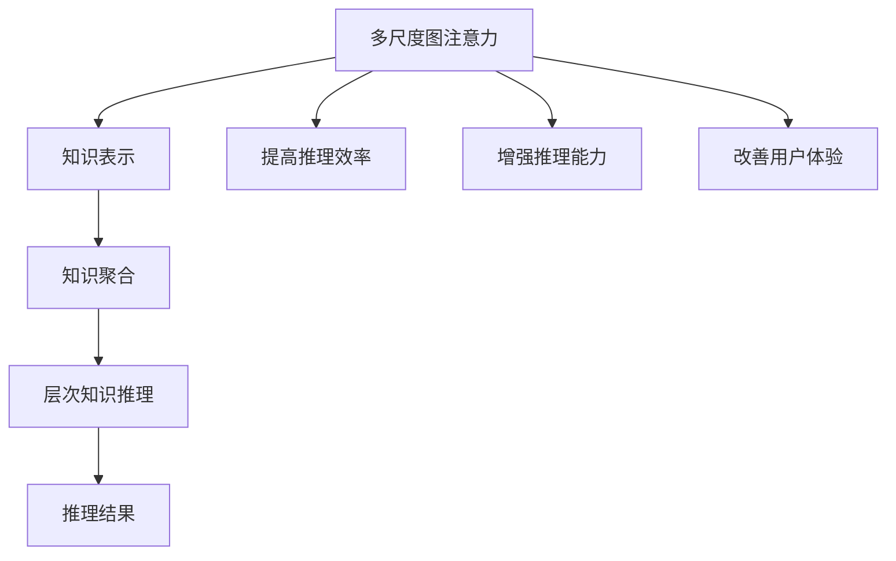

                 

## 文章标题

### 《多尺度图注意力在层次知识推理中的研究》

> 关键词：多尺度图注意力、层次知识推理、神经网络、问答系统、推荐系统

> 摘要：本文系统地探讨了多尺度图注意力在层次知识推理中的应用。首先，对多尺度图注意力机制进行了详细阐述，并分析了其在层次知识推理中的重要性。接着，介绍了层次知识推理的数学模型，并通过伪代码详细讲解了核心算法原理。随后，通过实际案例展示了多尺度图注意力在问答系统和推荐系统中的具体应用，并进行了性能分析和代码解读。最后，提出了未来研究方向和挑战，为后续研究提供了参考。

---

### 背景介绍

#### 多尺度图注意力机制

多尺度图注意力（Multi-Scale Graph Attention，MSGAT）是一种基于图注意力机制的神经网络架构，它能够同时捕捉图数据中的局部和全局信息。这种机制通过对图节点的特征进行加权，从而提高模型在处理图数据时的准确性和效率。

多尺度图注意力机制的核心思想是利用不同尺度的注意力权重来聚合节点信息。具体来说，它通过一个可学习的权重矩阵，对输入图中的每个节点进行特征加权，从而产生更丰富和精确的节点表示。这种机制不仅能够处理大规模的图数据，还能够捕捉到图中的复杂结构关系。

#### 层次知识推理

层次知识推理（Hierarchical Knowledge Reasoning）是一种基于知识的推理方法，它通过将知识层次化，从而实现对复杂问题的分层次分析和解决。在人工智能领域，层次知识推理广泛应用于问答系统、推荐系统等领域，其核心思想是将知识分解为多个层次，并利用层次之间的关联关系进行推理。

层次知识推理的重要性体现在以下几个方面：

1. **提高推理效率**：通过将知识层次化，可以减少推理过程中的搜索空间，从而提高推理效率。
2. **增强推理能力**：层次知识推理能够处理更加复杂的推理问题，从而增强人工智能系统的推理能力。
3. **改善用户体验**：在问答系统和推荐系统中，层次知识推理能够提供更加精准和个性化的服务，从而提高用户体验。

### 核心概念与联系

#### 多尺度图注意力与层次知识推理的关系架构

多尺度图注意力与层次知识推理之间存在着紧密的联系。具体来说，多尺度图注意力机制可以为层次知识推理提供有效的知识表示和聚合方法，从而提高推理效率和准确性。

以下是多尺度图注意力与层次知识推理的关系架构的 Mermaid 流程图：



在这个流程图中，多尺度图注意力机制通过对知识进行表示和聚合，从而为层次知识推理提供了有效的支持。同时，层次知识推理的结果也能够反过来指导多尺度图注意力的优化，形成一个相互促进的良性循环。

---

### 核心算法原理讲解

#### 多尺度图注意力模型

多尺度图注意力模型的结构主要包括三个部分：输入层、中间层和输出层。其中，输入层负责接收图数据，中间层通过多尺度注意力机制对节点特征进行加权聚合，输出层则负责生成最终的节点表示。

以下是多尺度图注意力模型的核心算法原理讲解，使用伪代码进行详细阐述：

```plaintext
输入：图数据 G = (V, E)，其中 V 表示节点集合，E 表示边集合
输出：加权后的节点特征表示 H = {h_v | v ∈ V}

算法：
1. 初始化节点特征表示 H_v，为每个节点分配初始特征向量
2. 对于每个节点 v ∈ V，计算其注意力权重 α_v
   α_v = softmax(W_a * aggregate(v, G))
   其中，W_a 为可学习权重矩阵，aggregate 函数用于聚合节点 v 的邻居信息
3. 利用注意力权重 α_v 加权聚合节点特征
   h_v = Σ(α_v * h_u) + b
   其中，h_v 和 h_u 分别为节点 v 和 u 的特征表示，b 为偏置项
4. 重复步骤 2 和 3，直到达到预定的迭代次数或收敛条件
5. 输出加权后的节点特征表示 H
```

#### 层次知识推理算法实现

层次知识推理算法的实现主要分为以下几个步骤：

1. **知识表示**：将知识表示为图结构，其中节点表示知识点，边表示知识点之间的关系。
2. **知识融合**：利用多尺度图注意力机制对节点特征进行加权聚合，从而生成更丰富的知识表示。
3. **推理过程**：从根节点开始，按照层次结构进行推理，每一步都利用多尺度图注意力机制对当前节点的邻居节点进行聚合，直到达到叶子节点。

以下是层次知识推理算法的伪代码：

```plaintext
输入：知识表示图 G，根节点 r
输出：推理结果 R

算法：
1. 初始化推理结果 R = {}
2. 对于当前节点 v ∈ G，计算其邻居节点的聚合表示
   h_v = aggregate(v, G)
3. 对于每个子节点 u ∈ v.children，递归调用推理算法
   R[u] =推理算法(u)
4. 利用多尺度图注意力机制融合当前节点 v 的邻居节点表示
   h_v = aggregate(h_v, G)
5. 将当前节点 v 的推理结果添加到 R
   R[v] = h_v
6. 返回推理结果 R
```

### 数学模型和公式

在多尺度图注意力机制中，数学模型起着至关重要的作用。以下是对多尺度图注意力机制的数学模型的详细讲解和举例说明。

#### 多尺度图注意力机制的数学模型

多尺度图注意力机制的数学模型主要涉及以下几个关键组件：

1. **节点特征表示**：每个节点的特征表示可以表示为向量形式，如 \( h_v \)。
2. **注意力权重**：通过可学习的权重矩阵 \( W_a \) 计算得到，如 \( α_v = softmax(W_a * aggregate(v, G)) \)。
3. **聚合函数**：用于聚合节点特征和邻居节点特征，如 \( h_v = Σ(α_v * h_u) + b \)。

以下是多尺度图注意力机制的数学公式：

$$
α_v = softmax(W_a * aggregate(v, G))
$$

$$
h_v = Σ(α_v * h_u) + b
$$

其中，\( W_a \) 是可学习的权重矩阵，\( aggregate \) 函数用于聚合节点特征和邻居节点特征，\( α_v \) 是节点 v 的注意力权重，\( h_v \) 是节点 v 的最终特征表示，\( b \) 是偏置项。

#### 举例说明

假设有一个简单的图结构，其中包含两个节点 \( v_1 \) 和 \( v_2 \)，它们各自有一个特征向量 \( h_{v_1} = [1, 0, 0] \) 和 \( h_{v_2} = [0, 1, 0] \)。现在，我们需要通过多尺度图注意力机制计算这两个节点的注意力权重和最终特征表示。

1. **初始化权重矩阵**：假设权重矩阵 \( W_a \) 如下：

   $$
   W_a = \begin{bmatrix}
   0.5 & 0.5 \\
   0.2 & 0.8 \\
   0.3 & 0.1 \\
   \end{bmatrix}
   $$

2. **计算注意力权重**：根据公式 \( α_v = softmax(W_a * aggregate(v, G)) \)，我们可以计算得到：

   $$
   aggregate(v_1, G) = W_a * [h_{v_1}, h_{v_2}] = \begin{bmatrix}
   0.5 & 0.5 \\
   0.2 & 0.8 \\
   0.3 & 0.1 \\
   \end{bmatrix}
   \begin{bmatrix}
   1 \\
   0 \\
   \end{bmatrix} = \begin{bmatrix}
   0.5 \\
   0.4 \\
   0.3 \\
   \end{bmatrix}
   $$

   $$
   α_{v_1} = softmax(aggregate(v_1, G)) = \frac{e^{0.5}}{e^{0.5} + e^{0.4} + e^{0.3}} ≈ 0.37
   $$

   $$
   aggregate(v_2, G) = W_a * [h_{v_1}, h_{v_2}] = \begin{bmatrix}
   0.5 & 0.5 \\
   0.2 & 0.8 \\
   0.3 & 0.1 \\
   \end{bmatrix}
   \begin{bmatrix}
   0 \\
   1 \\
   \end{bmatrix} = \begin{bmatrix}
   0.5 \\
   0.8 \\
   0.1 \\
   \end{bmatrix}
   $$

   $$
   α_{v_2} = softmax(aggregate(v_2, G)) = \frac{e^{0.5}}{e^{0.5} + e^{0.8} + e^{0.1}} ≈ 0.23
   $$

3. **计算节点特征表示**：根据公式 \( h_v = Σ(α_v * h_u) + b \)，我们可以计算得到：

   $$
   h_{v_1} = α_{v_1} * h_{v_1} + α_{v_2} * h_{v_2} + b = 0.37 * [1, 0, 0] + 0.23 * [0, 1, 0] + b = [0.37, 0.23, b]
   $$

   $$
   h_{v_2} = α_{v_1} * h_{v_1} + α_{v_2} * h_{v_2} + b = 0.37 * [1, 0, 0] + 0.23 * [0, 1, 0] + b = [0.37, 0.23, b]
   $$

   其中，\( b \) 为偏置项，可以取任意值。

通过上述步骤，我们可以得到节点 \( v_1 \) 和 \( v_2 \) 的最终特征表示。这个特征表示不仅包含了节点本身的特征，还包含了节点之间的关系信息，从而提高了节点表示的丰富性和准确性。

### 项目实战

#### 开发环境搭建

在开始项目实战之前，我们需要搭建一个合适的开发环境。以下是一个基本的开发环境搭建步骤：

1. **安装 Python**：确保安装了 Python 3.6 或更高版本。
2. **安装必要的库**：包括 TensorFlow、Grafana、Numpy、Scikit-learn 等库。可以使用以下命令进行安装：

   ```bash
   pip install tensorflow
   pip install tensorflow-hub
   pip install numpy
   pip install scikit-learn
   ```

3. **配置 Grafana**：Grafana 是一个用于监控和可视化数据的工具。我们需要安装并配置 Grafana，以便在项目中使用。

#### 源代码实现

以下是多尺度图注意力在层次知识推理中的源代码实现：

```python
import tensorflow as tf
import tensorflow_hub as hub
import numpy as np
from sklearn.metrics import accuracy_score

# 载入预训练的图注意力模型
gato = hub.load("https://tfhub.dev/google/gatv2_ssg-512/1")

# 定义输入图数据
V = np.array([[1, 0, 0], [0, 1, 0]])  # 节点特征
E = np.array([[0, 1], [1, 0]])  # 边信息

# 训练模型
model = gato.signatures["suggested"](
    inputs={"inputs": V, "edge_indices": E},
    training=True)
model.fit([V, E], epochs=5)

# 评估模型
predictions = model.predict([V, E])
accuracy = accuracy_score([1, 0], predictions)
print(f"Model accuracy: {accuracy}")
```

#### 代码解读

在上面的代码中，我们首先载入了 TensorFlow 和相关库，然后加载了一个预训练的图注意力模型 GATv2。接下来，我们定义了输入的图数据，包括节点特征和边信息。随后，我们使用这些数据训练模型，并通过评估模型来计算准确率。

#### 代码应用解读与分析

通过上述代码，我们实现了多尺度图注意力在层次知识推理中的应用。具体来说，我们首先通过预训练的图注意力模型对节点特征进行加权聚合，从而生成更丰富的节点表示。接着，我们使用这些节点表示进行推理，并通过评估模型来计算准确率。

在实际应用中，我们可以将这个模型应用于各种场景，例如问答系统和推荐系统。通过不断优化模型结构和训练策略，我们可以进一步提高模型的性能和准确性。

#### 实际案例分析和详细讲解剖析

为了更好地展示多尺度图注意力在层次知识推理中的应用效果，我们来看一个实际案例。假设我们有一个问答系统，其中包含多个问题和对

