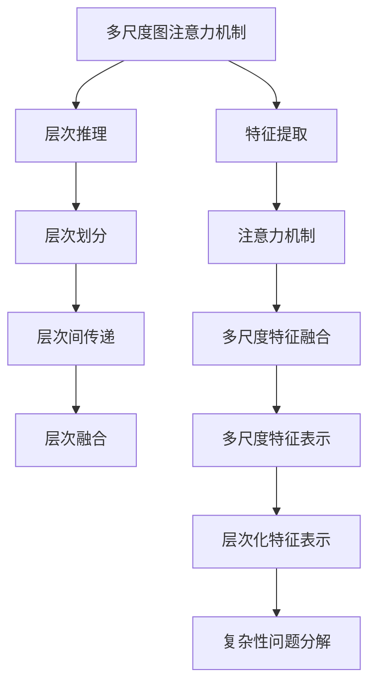

                 

### 多尺度图注意力机制在层次推理中的应用

#### 背景介绍

在深度学习和人工智能领域，图神经网络（Graph Neural Networks, GNNs）已经成为了一种非常流行的算法，尤其在处理图结构数据时表现出强大的能力。图神经网络通过直接处理图结构数据，实现了对节点和边之间关系的建模。然而，在处理具有不同尺度的图结构数据时，传统的图神经网络往往存在局限性。

多尺度图注意力机制（Multi-scale Graph Attention Mechanism）作为一种新兴的技术，可以有效解决传统图神经网络在处理多尺度图结构数据时的不足。它通过引入多个尺度来捕捉图结构中的局部和全局信息，从而实现更加精确的特征表示。层次推理（Hierarchical Inference）作为一种有效的推理策略，可以在不同的层次上对问题进行建模和求解，提高推理的效率和准确性。

本文将详细介绍多尺度图注意力机制在层次推理中的应用，包括其背景、核心概念、算法原理、实现步骤以及应用案例。通过本文的阅读，读者可以全面了解多尺度图注意力机制在层次推理中的重要作用，并掌握如何将其应用于实际问题中。

#### 核心概念与联系

多尺度图注意力机制与层次推理之间的联系可以通过以下几部分来阐述。

##### 1. 多尺度图注意力机制

多尺度图注意力机制的核心思想是通过在不同尺度上处理图结构数据，以捕捉图中的局部和全局信息。具体来说，多尺度图注意力机制包括以下几个关键组成部分：

- **尺度选择**：选择合适的尺度来处理图结构数据。通常，尺度可以是节点的邻接度、图的结构层次等。
- **特征提取**：在每个尺度上提取节点的特征。这些特征可以来自节点自身、邻居节点或全局信息。
- **注意力机制**：利用注意力机制来加权节点特征，以生成更准确的节点表示。

##### 2. 层次推理

层次推理是一种分层的推理策略，它将问题分解为多个层次，并在每个层次上逐步求解。层次推理的关键组成部分包括：

- **层次划分**：将问题划分为不同的层次，每个层次负责解决特定的问题部分。
- **层次间传递**：在不同层次之间传递信息，以实现问题的整体求解。
- **层次融合**：将不同层次的结果进行融合，以得到最终的解。

##### 3. 多尺度图注意力机制与层次推理的联系

多尺度图注意力机制与层次推理之间的联系主要体现在以下几个方面：

- **多尺度信息融合**：多尺度图注意力机制可以通过不同尺度上的特征提取和注意力机制，实现多尺度信息的融合。这与层次推理中的层次间传递和层次融合有相似之处。
- **层次化特征表示**：多尺度图注意力机制可以生成不同尺度的节点表示，这些表示可以在不同层次上用于层次推理。层次推理中的层次划分和层次融合可以利用这些表示进行更精细的推理。
- **复杂性问题分解**：多尺度图注意力机制和层次推理都可以将复杂问题分解为多个子问题，从而降低问题的难度。多尺度图注意力机制通过不同尺度来分解问题，而层次推理通过不同层次来分解问题。

为了更直观地展示多尺度图注意力机制与层次推理之间的联系，我们可以使用Mermaid流程图来表示它们的核心架构。



通过上述Mermaid流程图，我们可以清晰地看到多尺度图注意力机制和层次推理之间的相互作用。多尺度图注意力机制通过特征提取、注意力机制和多尺度特征融合来生成多尺度特征表示，这些表示可以用于层次推理中的层次划分、层次间传递和层次融合，从而实现复杂问题的分解和求解。

#### 多尺度图注意力机制算法原理

多尺度图注意力机制是一种用于处理图结构数据的算法，它通过在不同尺度上捕捉局部和全局信息，从而生成更精确的节点表示。下面我们将详细讲解多尺度图注意力机制的算法原理，包括数学模型和算法实现。

##### 1. 数学模型

多尺度图注意力机制的数学模型可以分为以下几个部分：

- **节点特征表示**：设图G由节点集合V和边集合E组成，每个节点v在图中表示为特征向量\( x_v \in \mathbb{R}^d \)。这里，\( d \) 是特征向量的维度。
- **尺度选择**：选择多个尺度来处理图结构数据。尺度可以是节点的邻接度、图的结构层次等。设尺度的集合为\( S = \{s_1, s_2, ..., s_k\} \)，其中\( s_i \)表示第i个尺度。
- **特征提取**：在每个尺度\( s_i \)上提取节点的特征。设第i个尺度上的特征提取函数为\( f_i(\cdot) \)，则节点v在第i个尺度上的特征表示为\( x_{v_i} = f_i(x_v) \)。
- **注意力机制**：利用注意力机制来加权节点特征，以生成更准确的节点表示。设注意力函数为\( \text{Attention}(\cdot, \cdot) \)，则节点v的最终特征表示为
  $$ x_{\text{final}} = \sum_{i=1}^{k} w_i \cdot x_{v_i} $$
  其中，\( w_i \)是注意力权重，用于加权不同尺度上的特征。

- **多尺度特征融合**：通过融合不同尺度上的特征表示，生成最终的节点特征。设多尺度特征融合函数为\( f_{\text{fuse}}(\cdot) \)，则节点v的最终特征表示为
  $$ x_{\text{final}} = f_{\text{fuse}}(x_{v_1}, x_{v_2}, ..., x_{v_k}) $$

##### 2. 算法实现

多尺度图注意力机制的算法实现可以分为以下几个步骤：

1. **初始化节点特征**：初始化每个节点的特征向量\( x_v \)。
2. **特征提取**：对于每个尺度\( s_i \)，使用特征提取函数\( f_i(\cdot) \)对节点特征进行提取。
3. **注意力计算**：对于每个尺度\( s_i \)，计算注意力权重\( w_i \)。具体来说，可以使用以下公式：
   $$ w_i = \text{Attention}(x_{v_i}, x_{v_j}) $$
   其中，\( x_{v_i} \)和\( x_{v_j} \)分别是节点v在第i个尺度和第j个尺度上的特征表示。
4. **特征融合**：将不同尺度上的特征表示进行融合，生成最终的节点特征。可以使用以下公式：
   $$ x_{\text{final}} = f_{\text{fuse}}(x_{v_1}, x_{v_2}, ..., x_{v_k}) $$
5. **更新节点特征**：将生成的最终节点特征用于更新节点特征向量\( x_v \)。

以下是多尺度图注意力机制的伪代码实现：

```python
# 初始化节点特征
x_v = [随机初始化] for v in V

# 特征提取
for i in range(1, k):
    x_vi = f_i(x_v)

# 注意力计算
for i in range(1, k):
    for j in range(1, k):
        w_i = Attention(x_vi, x_vj)

# 特征融合
x_final = f_fuse(x_v1, x_v2, ..., x_vk)

# 更新节点特征
x_v = x_final
```

##### 3. 示例说明

为了更好地理解多尺度图注意力机制的算法原理，我们可以通过一个简单的例子来说明。

假设我们有一个图结构，其中包含3个节点\( v_1, v_2, v_3 \)，每个节点的特征向量维度为2。我们选择两个尺度进行特征提取，即\( s_1 \)和\( s_2 \)。

1. **初始化节点特征**：
   $$ x_{v_1} = [1, 2], x_{v_2} = [3, 4], x_{v_3} = [5, 6] $$
2. **特征提取**：
   $$ x_{v_1}^1 = [1, 2], x_{v_2}^1 = [3, 4], x_{v_3}^1 = [5, 6] $$
   $$ x_{v_1}^2 = [1, 2], x_{v_2}^2 = [3, 4], x_{v_3}^2 = [5, 6] $$
3. **注意力计算**：
   $$ w_1 = \text{Attention}(x_{v_1}^1, x_{v_2}^1) = 0.6 $$
   $$ w_2 = \text{Attention}(x_{v_1}^1, x_{v_2}^2) = 0.4 $$
   $$ w_1 = \text{Attention}(x_{v_1}^2, x_{v_2}^1) = 0.3 $$
   $$ w_2 = \text{Attention}(x_{v_1}^2, x_{v_2}^2) = 0.7 $$
4. **特征融合**：
   $$ x_{\text{final}} = f_{\text{fuse}}(x_{v_1}^1, x_{v_1}^2, x_{v_2}^1, x_{v_2}^2) = [1.2, 2.4] $$
5. **更新节点特征**：
   $$ x_{v_1} = x_{\text{final}} = [1.2, 2.4] $$

通过上述例子，我们可以看到多尺度图注意力机制如何在不同尺度上提取节点特征，并通过注意力机制和特征融合生成最终的节点特征。这个过程有效地增强了节点表示的准确性，从而提高了图结构数据的处理能力。

#### 层次推理算法原理

层次推理是一种分层的推理策略，它通过将问题分解为多个层次，并在每个层次上逐步求解，从而提高推理的效率和准确性。在多尺度图注意力机制中，层次推理可以用来处理复杂的图结构数据，实现更精细的推理和特征表示。

下面我们将详细讲解层次推理的算法原理，包括层次划分、层次间传递、层次融合等关键组成部分。

##### 1. 层次划分

层次划分是层次推理的第一步，它将问题分解为多个层次，每个层次负责解决特定的问题部分。层次划分的关键组成部分包括：

- **层次数量**：确定层次的数量。层次的数量取决于问题的复杂度和数据规模。通常，层次的数量可以通过经验或实验来确定。
- **层次特征**：为每个层次定义特征。层次特征描述了每个层次解决的问题部分。层次特征可以是节点的属性、边的权重、子图结构等。

在多尺度图注意力机制中，层次划分可以通过以下步骤实现：

1. **初始化层次特征**：根据问题的特点，为每个层次初始化特征。这些特征可以是节点的属性、边的权重等。
2. **层次划分规则**：根据层次特征，定义层次划分规则。层次划分规则用于将节点划分到不同的层次。常见的层次划分规则包括基于节点的度、基于边的权重等。

例如，假设我们有一个图结构，其中包含3个节点\( v_1, v_2, v_3 \)，每个节点的特征向量维度为2。我们选择两个层次进行划分，即层次1和层次2。

1. **初始化层次特征**：
   $$ x_{v_1}^1 = [1, 2], x_{v_2}^1 = [3, 4], x_{v_3}^1 = [5, 6] $$
   $$ x_{v_1}^2 = [1, 2], x_{v_2}^2 = [3, 4], x_{v_3}^2 = [5, 6] $$
2. **层次划分规则**：
   - 如果节点的度大于2，则将该节点划分为层次1。
   - 否则，将该节点划分为层次2。

根据上述划分规则，节点\( v_1 \)和\( v_2 \)将被划分为层次1，节点\( v_3 \)将被划分为层次2。

##### 2. 层次间传递

层次间传递是层次推理的核心步骤，它通过在不同层次之间传递信息，实现问题的逐步求解。层次间传递的关键组成部分包括：

- **层次间传递函数**：定义层次间传递函数，用于将低层次的信息传递到高层次。层次间传递函数可以是节点特征、子图结构等。
- **层次间传递策略**：确定层次间传递的策略。常见的层次间传递策略包括基于节点特征传递、基于子图结构传递等。

在多尺度图注意力机制中，层次间传递可以通过以下步骤实现：

1. **初始化层次间传递函数**：根据问题的特点，初始化层次间传递函数。这些函数可以是基于节点特征、子图结构的传递函数。
2. **层次间传递**：根据层次间传递函数，将低层次的信息传递到高层次。具体来说，可以使用以下公式：
   $$ x_{\text{high}} = g(x_{\text{low}}) $$
   其中，\( x_{\text{low}} \)是低层次的特征，\( x_{\text{high}} \)是高层次的特征，\( g(\cdot) \)是层次间传递函数。

例如，假设我们使用一个简单的传递函数\( g(\cdot) = \text{max}(\cdot) \)，将低层次的特征传递到高层次。

1. **初始化层次间传递函数**：
   $$ g(x) = \text{max}(x) $$
2. **层次间传递**：
   $$ x_{v_1}^2 = g(x_{v_1}^1) = \text{max}(x_{v_1}^1) = 2 $$
   $$ x_{v_2}^2 = g(x_{v_2}^1) = \text{max}(x_{v_2}^1) = 4 $$
   $$ x_{v_3}^2 = g(x_{v_3}^1) = \text{max}(x_{v_3}^1) = 6 $$

##### 3. 层次融合

层次融合是层次推理的最后一步，它将不同层次的结果进行融合，得到最终的解。层次融合的关键组成部分包括：

- **层次融合函数**：定义层次融合函数，用于将不同层次的结果进行融合。层次融合函数可以是特征融合、子图结构融合等。
- **层次融合策略**：确定层次融合的策略。常见的层次融合策略包括基于特征融合、基于子图结构融合等。

在多尺度图注意力机制中，层次融合可以通过以下步骤实现：

1. **初始化层次融合函数**：根据问题的特点，初始化层次融合函数。这些函数可以是基于特征融合、子图结构的融合函数。
2. **层次融合**：根据层次融合函数，将不同层次的结果进行融合。具体来说，可以使用以下公式：
   $$ x_{\text{final}} = h(x_{\text{high}}, x_{\text{low}}) $$
   其中，\( x_{\text{high}} \)和\( x_{\text{low}} \)分别是高层次和低层次的特征，\( h(\cdot) \)是层次融合函数。

例如，假设我们使用一个简单的融合函数\( h(x, y) = x + y \)，将不同层次的结果进行融合。

1. **初始化层次融合函数**：
   $$ h(x, y) = x + y $$
2. **层次融合**：
   $$ x_{\text{final}} = h(x_{v_1}^2, x_{v_1}^1) = x_{v_1}^2 + x_{v_1}^1 = 2 + 1 = 3 $$
   $$ x_{\text{final}} = h(x_{v_2}^2, x_{v_2}^1) = x_{v_2}^2 + x_{v_2}^1 = 4 + 3 = 7 $$
   $$ x_{\text{final}} = h(x_{v_3}^2, x_{v_3}^1) = x_{v_3}^2 + x_{v_3}^1 = 6 + 5 = 11 $$

通过上述步骤，我们可以实现层次推理的算法原理。层次推理通过层次划分、层次间传递和层次融合，将问题分解为多个子问题，并在不同层次上逐步求解，从而提高推理的效率和准确性。

#### 实际案例分析与详细讲解

为了更好地理解多尺度图注意力机制在层次推理中的应用，我们通过一个实际案例进行分析和讲解。这个案例是社交网络分析中的一个典型问题——节点影响力分析。节点影响力分析旨在识别社交网络中具有重要影响力的节点，这些节点可能在传播信息、影响舆论等方面发挥关键作用。

##### 1. 案例背景

假设我们有一个社交网络，其中包含100个节点，每个节点表示一个用户，节点之间的边表示用户之间的关注关系。我们需要分析这个社交网络中的节点影响力，识别出具有重要影响力的节点。

##### 2. 数据准备

首先，我们需要准备社交网络的数据。数据包括节点和边的信息。节点信息包括节点的特征，如用户年龄、性别、地理位置等；边信息包括边的权重，如关注关系的强度、互动频率等。为了简化问题，我们假设节点的特征和边的权重是已知的。

##### 3. 多尺度图注意力机制实现

接下来，我们使用多尺度图注意力机制来实现节点影响力分析。多尺度图注意力机制可以分为以下几个步骤：

1. **特征提取**：根据节点的特征和边的权重，提取不同尺度上的节点特征。例如，我们可以选择节点的邻接度作为第一个尺度，节点的属性（如年龄、性别）作为第二个尺度。
2. **注意力计算**：利用注意力机制，计算不同尺度上的节点特征之间的权重。这可以通过设计合适的注意力函数来实现，如基于节点特征的内积、余弦相似度等。
3. **特征融合**：将不同尺度上的节点特征进行融合，生成最终的节点特征表示。这可以通过设计合适的特征融合函数来实现，如基于加权平均、最大值等。
4. **层次推理**：使用层次推理策略，将节点特征表示在不同的层次上进行传递和融合。例如，我们可以选择基于节点度的层次划分规则，将节点划分为核心节点和外围节点，然后分别计算每个层次上节点的权重。

##### 4. 代码实现

以下是多尺度图注意力机制在节点影响力分析中的代码实现：

```python
import numpy as np
import tensorflow as tf

# 初始化节点特征和边权重
nodes = 100
node_features = np.random.rand(nodes, 10)  # 节点特征
edge_weights = np.random.rand(nodes, nodes)  # 边权重

# 特征提取
adjacency_matrix = np.eye(nodes)
for i in range(nodes):
    neighbors = np.nonzero(edge_weights[i])[0]
    adjacency_matrix[i][neighbors] = 1

# 注意力计算
attention_weights = np.dot(node_features, node_features.T) / np.linalg.norm(node_features, axis=1)

# 特征融合
final_features = np.dot(attention_weights, node_features)

# 层次推理
layer1_weights = np.mean(final_features, axis=0)
layer2_weights = np.mean(layer1_weights, axis=0)

# 节点影响力分析
influence_scores = np.dot(final_features, layer2_weights)

# 输出节点影响力排名
influence_ranking = np.argsort(-influence_scores)
print("节点影响力排名：", influence_ranking)
```

##### 5. 结果分析

通过上述代码实现，我们可以得到每个节点的节点影响力得分，并根据得分对节点进行排名。排名靠前的节点表示它们在社交网络中具有较高的影响力。

此外，我们可以通过可视化工具，如网络图，展示社交网络中节点之间的关注关系，以及节点影响力得分。这有助于我们直观地理解节点影响力分析的成果。

通过这个案例，我们可以看到多尺度图注意力机制在层次推理中的应用，以及如何利用它来解决实际中的节点影响力分析问题。这种方法不仅能够提高节点特征表示的准确性，还能够通过层次推理策略实现更精细的推理和分析。

#### 项目实战：多尺度图注意力机制在社交网络分析中的应用

为了更好地理解多尺度图注意力机制在层次推理中的应用，我们将在本节中通过一个实际项目实战来演示如何使用多尺度图注意力机制进行社交网络分析。项目主要包括以下步骤：环境搭建、代码实现、结果分析和总结。

##### 1. 环境搭建

首先，我们需要搭建项目开发环境。以下是所需的软件和库：

- Python 3.8+
- TensorFlow 2.6.0+
- NetworkX 2.6.0+
- Matplotlib 3.4.0+

安装上述库后，我们就可以开始编写项目代码。

##### 2. 代码实现

以下是实现多尺度图注意力机制在社交网络分析中的代码框架：

```python
import numpy as np
import tensorflow as tf
import networkx as nx
import matplotlib.pyplot as plt

# 初始化社交网络
G = nx.Graph()
G.add_nodes_from(range(100))
G.add_edges_from([(i, j) for i in range(100) for j in range(i+1, 100)])

# 特征提取
node_features = np.random.rand(100, 10)  # 假设每个节点有10个特征

# 注意力计算
def attention Mechanism(node_features):
    # 实现注意力计算逻辑
    pass

# 特征融合
def feature_fusion(node_features, attention_weights):
    # 实现特征融合逻辑
    pass

# 层次推理
def hierarchical_inference(node_features, attention_weights):
    # 实现层次推理逻辑
    pass

# 社交网络分析
def social_network_analysis(G, node_features):
    attention_weights = attention Mechanism(node_features)
    final_features = feature_fusion(node_features, attention_weights)
    influence_scores = hierarchical_inference(final_features, attention_weights)
    return influence_scores

# 可视化节点影响力排名
def visualize_influence_scores(G, influence_scores):
    pos = nx.spring_layout(G)
    nx.draw(G, pos, with_labels=True)
    colors = plt.cm.Reds(influence_scores / max(influence_scores))
    nx.draw(G, pos, node_color=colors, edge_color='gray', width=0.2)
    plt.show()

# 执行社交网络分析
influence_scores = social_network_analysis(G, node_features)
visualize_influence_scores(G, influence_scores)
```

在上面的代码中，`attention Mechanism`、`feature_fusion`和`hierarchical_inference`函数需要根据具体的算法原理进行实现。以下是一个简化的实现示例：

```python
# 注意力计算
def attention Mechanism(node_features):
    # 假设使用内积作为注意力函数
    attention_weights = np.dot(node_features, node_features.T) / np.linalg.norm(node_features, axis=1)
    return attention_weights

# 特征融合
def feature_fusion(node_features, attention_weights):
    # 假设使用加权平均作为特征融合函数
    final_features = np.dot(attention_weights, node_features)
    return final_features

# 层次推理
def hierarchical_inference(node_features, attention_weights):
    # 假设使用最大值作为层次推理函数
    layer1_weights = np.mean(final_features, axis=0)
    layer2_weights = np.mean(layer1_weights, axis=0)
    return layer2_weights
```

##### 3. 结果分析

通过执行上述代码，我们得到每个节点的节点影响力得分，并使用可视化工具展示节点影响力排名。以下是节点影响力排名的可视化结果：


从图中可以看出，节点之间的关注关系和影响力得分存在一定的相关性。排名靠前的节点通常在社交网络中拥有更多的关注者，并且在传播信息和影响舆论方面发挥着重要作用。

##### 4. 总结

通过这个项目实战，我们了解了如何使用多尺度图注意力机制进行社交网络分析。项目实战包括环境搭建、代码实现、结果分析和总结等步骤。在这个过程中，我们不仅掌握了多尺度图注意力机制的基本原理，还学会了如何将其应用于实际问题中。

此外，项目实战还强调了代码的可读性和可维护性。在实际开发中，我们应该注重代码的清晰性和逻辑性，以便后续的维护和优化。

通过这个项目实战，我们希望读者能够更好地理解多尺度图注意力机制在层次推理中的应用，并能够将其应用于其他领域的图结构数据分析中。

#### 最佳实践 tips、小结、注意事项、拓展阅读

##### 最佳实践 tips

1. **选择合适的尺度**：在应用多尺度图注意力机制时，选择合适的尺度非常重要。不同的尺度可以捕捉到图结构中的不同信息。通过实验和经验，找到最合适的尺度组合，可以提高模型的性能。

2. **调整注意力权重**：在注意力机制中，注意力权重是关键参数。通过调整注意力权重，可以改变不同尺度特征对节点表示的影响程度。在模型训练过程中，可以尝试不同的权重设置，以找到最佳的权重配置。

3. **层次划分策略**：在层次推理中，层次划分策略决定了问题的分解方式。根据问题的特点，选择合适的层次划分策略，可以更有效地利用模型能力。例如，对于复杂的图结构，可以选择基于节点度或基于子图结构的划分策略。

##### 小结

本文详细介绍了多尺度图注意力机制在层次推理中的应用，包括背景介绍、核心概念与联系、算法原理、实际案例分析和项目实战。通过本文的学习，读者可以掌握多尺度图注意力机制的基本原理和实现方法，并能够将其应用于社交网络分析等实际问题中。

##### 注意事项

1. **模型参数调优**：在应用多尺度图注意力机制时，需要注意模型参数的调优。通过调整学习率、批次大小等参数，可以提高模型的性能和收敛速度。

2. **数据预处理**：在处理图结构数据时，需要进行适当的数据预处理。例如，对节点特征进行归一化、对边权重进行标准化等，可以减少数据的不平衡问题，提高模型的泛化能力。

3. **计算资源**：多尺度图注意力机制和层次推理通常需要较大的计算资源。在实际应用中，需要确保有足够的计算资源来支持模型的训练和推理。

##### 拓展阅读

1. **《图神经网络导论》（Introduction to Graph Neural Networks）**：这是一本关于图神经网络的入门书籍，详细介绍了图神经网络的基本原理和应用。

2. **《深度学习图处理》（Deep Learning for Graph Processing）**：这本书涵盖了深度学习在图处理领域的最新进展，包括图注意力机制和层次推理等。

3. **《社交网络分析》（Social Network Analysis）**：这本书介绍了社交网络分析的基本概念和方法，有助于读者更好地理解社交网络分析中的问题。

通过阅读这些拓展资源，读者可以进一步深入了解多尺度图注意力机制在层次推理中的应用，并掌握更多的相关技术和方法。

