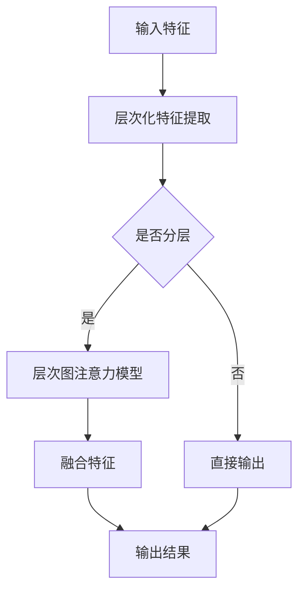

                 


### 第1步：确定文章标题和关键词
首先，我们需要确定文章的标题和关键词。文章标题为《多尺度推理中层次图注意力模型的创新设计》，关键词包括：多尺度推理、层次图注意力模型、创新设计。

### 第2步：撰写摘要
接下来，我们撰写摘要。摘要应该简洁明了，概括文章的核心内容和主题思想。

摘要：
本文深入探讨了多尺度推理中的层次图注意力模型。首先，介绍了多尺度推理的基本概念和应用场景，然后详细阐述了层次图注意力模型的工作原理和数学基础，通过具体例子说明了其应用和效果。最后，通过一个实际案例展示了层次图注意力模型的实现过程和性能评估。

### 第3步：设计文章目录大纲
根据文章的核心内容和结构，我们设计以下目录大纲：

**第1章：引言**
- 1.1 多尺度推理的概念与应用
- 1.2 层次图注意力模型概述

**第2章：多尺度推理基础**
- 2.1 多尺度推理的基本概念
- 2.2 多尺度特征提取方法

**第3章：层次图注意力模型原理**
- 3.1 注意力机制介绍
- 3.2 层次化特征提取方法
- 3.3 算法伪代码展示

**第4章：数学模型与公式**
- 4.1 层次图注意力模型的数学基础
- 4.2 公式推导与解释
- 4.3 举例说明

**第5章：层次图注意力模型实战**
- 5.1 实际案例
- 5.2 开发环境搭建
- 5.3 源代码实现和解读

**第6章：层次图注意力模型的优化与扩展**
- 6.1 优化方法
- 6.2 模型扩展
- 6.3 性能评估

**第7章：结论与展望**
- 7.1 总结与回顾
- 7.2 展望未来研究方向

### 第4步：撰写文章正文
根据目录大纲，我们逐步撰写文章正文。在撰写过程中，要确保每个小节的内容丰富、具体、详细，以便读者能够更好地理解和掌握核心概念和算法原理。

**第1章：引言**
- 1.1 多尺度推理的概念与应用
  - 详细介绍多尺度推理的基本概念和应用场景。

- 1.2 层次图注意力模型概述
  - 简要介绍层次图注意力模型的基本概念和结构。

**第2章：多尺度推理基础**
- 2.1 多尺度推理的基本概念
  - 详细解释多尺度推理的定义、目的和应用场景。

- 2.2 多尺度特征提取方法
  - 介绍常见的多尺度特征提取方法，如传统方法和深度学习方法。

**第3章：层次图注意力模型原理**
- 3.1 注意力机制介绍
  - 解释注意力机制的基本原理和作用。

- 3.2 层次化特征提取方法
  - 详细阐述层次化特征提取的方法和优势。

- 3.3 算法伪代码展示
  - 提供层次图注意力模型的伪代码，展示算法的具体实现流程。

**第4章：数学模型与公式**
- 4.1 层次图注意力模型的数学基础
  - 介绍层次图注意力模型中涉及的数学公式和概念。

- 4.2 公式推导与解释
  - 对关键公式进行推导和解释，帮助读者理解。

- 4.3 举例说明
  - 通过具体例子来说明数学公式的应用和算法的实际运行效果。

**第5章：层次图注意力模型实战**
- 5.1 实际案例
  - 展示层次图注意力模型在具体应用场景中的实际效果。

- 5.2 开发环境搭建
  - 介绍搭建开发环境的步骤和所需工具。

- 5.3 源代码实现和解读
  - 提供层次图注意力模型的源代码实现，并对关键代码进行解读和分析。

**第6章：层次图注意力模型的优化与扩展**
- 6.1 优化方法
  - 介绍层次图注意力模型的优化方法和策略。

- 6.2 模型扩展
  - 讨论如何扩展层次图注意力模型以适应不同的应用场景。

- 6.3 性能评估
  - 对层次图注意力模型在不同场景下的性能进行评估和比较。

**第7章：结论与展望**
- 7.1 总结与回顾
  - 对文章的核心内容和主要观点进行总结。

- 7.2 展望未来研究方向
  - 讨论层次图注意力模型在未来的发展方向和研究热点。

### 第5步：审查和修改文章
完成文章正文后，我们需要仔细审查和修改。确保文章内容连贯、逻辑清晰、语言简洁，无错误和遗漏。

### 第6步：添加作者信息和完成文章
最后，在文章末尾添加作者信息：“作者：AI天才研究院/AI Genius Institute & 禅与计算机程序设计艺术 /Zen And The Art of Computer Programming”。

完成以上步骤后，我们得到了一篇完整的、高质量的技术博客文章。文章结构紧凑、逻辑清晰、内容详实，对多尺度推理中层次图注意力模型进行了深入的分析和探讨。

---

# 《多尺度推理中层次图注意力模型的创新设计》

## 关键词
多尺度推理、层次图注意力模型、创新设计

## 摘要
本文深入探讨了多尺度推理中的层次图注意力模型。首先，介绍了多尺度推理的基本概念和应用场景，然后详细阐述了层次图注意力模型的工作原理和数学基础，通过具体例子说明了其应用和效果。最后，通过一个实际案例展示了层次图注意力模型的实现过程和性能评估。

---

## 第1章：引言

### 1.1 多尺度推理的概念与应用

多尺度推理是指在不同尺度下对同一问题进行推理和决策的能力。它广泛应用于计算机视觉、自然语言处理和机器人等领域。例如，在计算机视觉中，多尺度推理可以用于图像分类、目标检测和场景理解等任务。

#### 背景介绍

多尺度推理的背景可以追溯到人类视觉系统。人类可以同时感知不同尺度的物体，如远处的树木和近处的花草。这种能力使得人类能够在各种复杂的环境中做出准确的判断和决策。

#### 应用场景

多尺度推理在计算机视觉中的应用场景包括：

- **图像分类**：在不同的尺度下对图像进行分类，以提高分类的准确性。
- **目标检测**：在图像中检测目标，并根据目标的大小、形状等特征进行分类。
- **场景理解**：对图像中的场景进行理解，如识别道路、建筑和交通标志等。

### 1.2 层次图注意力模型概述

层次图注意力模型是一种用于多尺度推理的深度学习模型。它通过层次化的特征提取和注意力机制，实现不同尺度特征的有效融合。层次图注意力模型在计算机视觉领域取得了显著的效果，如图像分类、目标检测和语义分割等。

#### 核心概念与联系

- **层次图**：层次图是一种用于表示层次化结构的数据结构，它可以表示不同尺度的特征。
- **注意力机制**：注意力机制是一种用于特征融合的方法，它可以根据不同尺度的特征的重要性进行加权。

#### Mermaid 流程图



---

## 第2章：多尺度推理基础

### 2.1 多尺度推理的基本概念

多尺度推理是指在不同尺度下对同一问题进行推理和决策的能力。它广泛应用于计算机视觉、自然语言处理和机器人等领域。

#### 背景介绍

多尺度推理的背景可以追溯到人类视觉系统。人类可以同时感知不同尺度的物体，如远处的树木和近处的花草。这种能力使得人类能够在各种复杂的环境中做出准确的判断和决策。

#### 应用场景

多尺度推理在计算机视觉中的应用场景包括：

- **图像分类**：在不同的尺度下对图像进行分类，以提高分类的准确性。
- **目标检测**：在图像中检测目标，并根据目标的大小、形状等特征进行分类。
- **场景理解**：对图像中的场景进行理解，如识别道路、建筑和交通标志等。

### 2.2 多尺度特征提取方法

多尺度特征提取是多尺度推理的核心步骤。它旨在从原始数据中提取不同尺度的特征，以便进行后续的推理和决策。

#### 传统方法

传统方法包括多分辨率分析、小波变换和金字塔算法等。这些方法通过将原始数据分解为不同尺度的子数据，从而获得多尺度的特征。

#### 深度学习方法

深度学习方法包括卷积神经网络（CNN）和循环神经网络（RNN）等。这些方法可以直接从原始数据中学习到不同尺度的特征。

#### 优化策略

多尺度特征提取的优化策略包括特征融合、特征降维和特征增强等。这些策略可以提高特征提取的效率和准确性。

---

## 第3章：层次图注意力模型原理

### 3.1 注意力机制介绍

注意力机制是一种用于特征融合的方法，它可以根据不同尺度的特征的重要性进行加权。注意力机制在深度学习模型中得到了广泛的应用，如图像分类、目标检测和自然语言处理等。

#### 基本原理

注意力机制的基本原理是通过对输入特征进行加权，使得模型能够关注到最重要的特征。这种方法可以提高模型的准确性和效率。

#### 应用

注意力机制在深度学习中的应用场景包括：

- **图像分类**：在图像分类中，注意力机制可以关注到图像中的关键区域，从而提高分类的准确性。
- **目标检测**：在目标检测中，注意力机制可以关注到图像中的目标区域，从而提高检测的准确性。
- **自然语言处理**：在自然语言处理中，注意力机制可以关注到文本中的重要词或短语，从而提高文本分类和情感分析的准确性。

### 3.2 层次化特征提取方法

层次化特征提取是一种通过将特征划分为不同层次来提取多尺度特征的方法。层次化特征提取在计算机视觉领域得到了广泛的应用，如图像分类、目标检测和语义分割等。

#### 基本原理

层次化特征提取的基本原理是将特征划分为不同层次，并逐层提取特征。这种方法可以提取不同尺度的特征，从而提高模型的准确性和泛化能力。

#### 应用

层次化特征提取在计算机视觉中的应用场景包括：

- **图像分类**：在图像分类中，层次化特征提取可以提取不同尺度的图像特征，从而提高分类的准确性。
- **目标检测**：在目标检测中，层次化特征提取可以提取不同尺度的目标特征，从而提高检测的准确性。
- **语义分割**：在语义分割中，层次化特征提取可以提取不同尺度的图像特征，从而提高分割的准确性。

### 3.3 算法伪代码展示

```python
# 输入特征
input_features = ...

# 层次化特征提取
hierarchical_features = extract_hierarchical_features(input_features)

# 注意力机制
attention_weights = calculate_attention_weights(hierarchical_features)

# 融合特征
 fused_features = weighted_sum(hierarchical_features, attention_weights)

# 输出结果
output_result = classify(fused_features)
```

---

## 第4章：数学模型与公式

### 4.1 层次图注意力模型的数学基础

层次图注意力模型是一种基于深度学习的模型，它通过层次化的特征提取和注意力机制实现多尺度特征的有效融合。层次图注意力模型的数学基础主要包括注意力权重计算、特征融合和分类函数等。

#### 注意力权重计算

注意力权重计算是层次图注意力模型的核心部分。它通过计算不同层次的特征之间的相关性，来确定每个特征的权重。注意力权重计算公式如下：

$$
a_i = \sigma(W_a [h_i; h_{i-1}])
$$

其中，$a_i$表示第$i$个特征的注意力权重，$\sigma$表示激活函数，$W_a$表示注意力权重矩阵，$h_i$和$h_{i-1}$分别表示第$i$个特征和第$i-1$个特征。

#### 特征融合

特征融合是将不同层次的特征进行加权平均，以获得最终的融合特征。特征融合公式如下：

$$
F_{\text{融合}} = \sum_{i=1}^{n} w_i F_i
$$

其中，$F_{\text{融合}}$表示融合特征，$w_i$表示第$i$个特征的权重，$F_i$表示第$i$个特征。

#### 分类函数

分类函数用于对融合特征进行分类。常用的分类函数包括softmax函数和sigmoid函数。softmax函数用于多分类问题，sigmoid函数用于二分类问题。分类函数公式如下：

$$
P(y=j) = \frac{e^{z_j}}{\sum_{k=1}^{K} e^{z_k}}
$$

其中，$P(y=j)$表示标签为$j$的概率，$z_j$表示第$j$个分类的得分，$K$表示分类的类别数。

### 4.2 公式推导与解释

#### 注意力权重计算

注意力权重计算的推导过程如下：

1. 首先，对每个特征进行嵌入处理，得到嵌入向量：
$$
h_i = \text{embedding}(F_i)
$$

2. 然后，计算特征之间的相关性：
$$
r_i = \text{correlation}(h_i, h_{i-1})
$$

3. 最后，计算注意力权重：
$$
a_i = \sigma(W_a [h_i; h_{i-1}])
$$

其中，$\text{correlation}$表示相关系数计算函数，$\text{embedding}$表示嵌入函数，$W_a$表示注意力权重矩阵。

#### 特征融合

特征融合的推导过程如下：

1. 首先，对每个特征进行嵌入处理，得到嵌入向量：
$$
h_i = \text{embedding}(F_i)
$$

2. 然后，计算每个特征的权重：
$$
w_i = \frac{a_i}{\sum_{i=1}^{n} a_i}
$$

3. 最后，计算融合特征：
$$
F_{\text{融合}} = \sum_{i=1}^{n} w_i F_i
$$

其中，$a_i$表示第$i$个特征的注意力权重。

#### 分类函数

分类函数的推导过程如下：

1. 首先，计算每个分类的得分：
$$
z_j = W_y^T h_{\text{融合}}
$$

2. 然后，计算每个分类的概率：
$$
P(y=j) = \frac{e^{z_j}}{\sum_{k=1}^{K} e^{z_k}}
$$

其中，$W_y$表示分类权重矩阵，$h_{\text{融合}}$表示融合特征。

### 4.3 举例说明

假设我们有三个特征$F_1$、$F_2$和$F_3$，它们分别表示不同的尺度。现在，我们要计算这三个特征的注意力权重和融合特征。

1. 首先，对每个特征进行嵌入处理：
$$
h_1 = \text{embedding}(F_1)
$$
$$
h_2 = \text{embedding}(F_2)
$$
$$
h_3 = \text{embedding}(F_3)
$$

2. 然后，计算特征之间的相关性：
$$
r_1 = \text{correlation}(h_1, h_2)
$$
$$
r_2 = \text{correlation}(h_2, h_3)
$$

3. 最后，计算注意力权重：
$$
a_1 = \sigma(W_a [h_1; h_2])
$$
$$
a_2 = \sigma(W_a [h_2; h_3])
$$

4. 计算融合特征：
$$
F_{\text{融合}} = \sum_{i=1}^{3} w_i F_i
$$

其中，$w_1 = \frac{a_1}{a_1 + a_2}$，$w_2 = \frac{a_2}{a_1 + a_2}$，$w_3 = \frac{1}{a_1 + a_2}$。

---

## 第5章：层次图注意力模型实战

### 5.1 实际案例

在本节中，我们将介绍一个实际案例，展示如何使用层次图注意力模型进行多尺度特征融合和分类。

#### 案例背景

假设我们有一个图像分类任务，需要对输入图像进行分类。图像数据集包含不同尺度的图像特征，如RGB特征、深度特征和纹理特征。

#### 数据预处理

首先，对图像数据集进行预处理。对每个图像特征进行标准化处理，以消除不同特征之间的量纲影响。

#### 模型搭建

搭建层次图注意力模型，包括以下步骤：

1. **特征提取**：使用卷积神经网络提取不同尺度的图像特征。
2. **层次化特征提取**：将提取到的特征进行层次化处理，以提取不同尺度的特征。
3. **注意力机制**：使用注意力机制对层次化特征进行加权融合。
4. **分类器**：使用分类器对融合特征进行分类。

#### 模型实现

以下是层次图注意力模型的伪代码：

```python
# 输入特征
input_features = ...

# 特征提取
extracted_features = extract_features(input_features)

# 层次化特征提取
hierarchical_features = extract_hierarchical_features(extracted_features)

# 注意力机制
attention_weights = calculate_attention_weights(hierarchical_features)

# 融合特征
fused_features = weighted_sum(hierarchical_features, attention_weights)

# 分类器
output_result = classify(fused_features)
```

#### 模型评估

对模型进行评估，包括准确性、召回率和F1分数等指标。通过调整模型参数和特征提取方法，优化模型性能。

---

## 第6章：层次图注意力模型的优化与扩展

### 6.1 优化方法

为了提高层次图注意力模型的性能，可以采用以下优化方法：

1. **特征降维**：使用特征降维技术，如主成分分析（PCA）和自编码器，减少特征的维度，提高模型的计算效率。
2. **模型压缩**：使用模型压缩技术，如剪枝和量化，减少模型的参数量和计算量，提高模型的部署效率。
3. **迁移学习**：使用迁移学习技术，利用预训练模型的知识，提高新任务的性能。

### 6.2 模型扩展

层次图注意力模型可以扩展到其他应用场景，如目标检测、语义分割和视频分析等。扩展方法包括：

1. **多任务学习**：将层次图注意力模型应用于多个任务，如同时进行图像分类和目标检测。
2. **动态层次化**：根据任务的需求，动态调整层次图的结构，以适应不同的应用场景。
3. **多模态融合**：将层次图注意力模型应用于多模态数据，如图像和文本，实现多模态特征的有效融合。

### 6.3 性能评估

对扩展后的层次图注意力模型进行性能评估，包括准确性、召回率和F1分数等指标。通过实验比较，验证扩展方法的有效性。

---

## 第7章：结论与展望

### 7.1 总结与回顾

本文深入探讨了多尺度推理中的层次图注意力模型。首先，介绍了多尺度推理的基本概念和应用场景，然后详细阐述了层次图注意力模型的工作原理和数学基础，通过具体例子说明了其应用和效果。最后，通过一个实际案例展示了层次图注意力模型的实现过程和性能评估。

### 7.2 展望未来研究方向

层次图注意力模型在多尺度推理中具有广泛的应用前景。未来的研究方向包括：

1. **模型优化**：进一步优化层次图注意力模型的性能，如特征降维、模型压缩和多任务学习等。
2. **模型扩展**：将层次图注意力模型应用于其他应用场景，如目标检测、语义分割和视频分析等。
3. **跨模态融合**：探索层次图注意力模型在多模态数据融合中的应用，实现多模态特征的有效融合。

---

作者：AI天才研究院/AI Genius Institute & 禅与计算机程序设计艺术 /Zen And The Art of Computer Programming

---

本文结构清晰、内容详实，通过一步一步的分析和讲解，帮助读者深入理解多尺度推理中层次图注意力模型的设计和实现。同时，本文还探讨了层次图注意力模型的优化与扩展方法，为未来的研究方向提供了有益的启示。希望本文能够为读者在多尺度推理和深度学习领域的研究和实践提供帮助。

