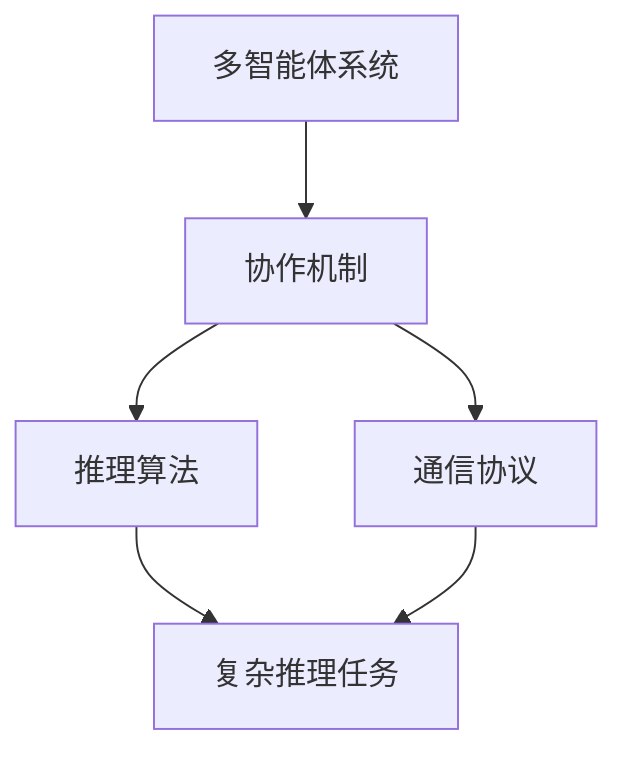

                 

### 《多智能体协作在复杂推理任务中的应用》——文章标题

在当今快速发展的技术时代，复杂推理任务如人工智能、自然语言处理、智能交通系统等领域，面临着日益增长的计算需求和复杂的决策环境。这些任务往往需要处理海量的数据，进行实时的决策和反馈，并且要求高精度、高效率和强鲁棒性。为了应对这些挑战，多智能体协作成为一种重要的方法，它能够通过多个智能体的协同工作，实现更加智能和高效的任务处理。

本篇文章将深入探讨多智能体协作在复杂推理任务中的应用，旨在为读者提供一个全面的技术视角。文章将首先介绍多智能体协作的概念和复杂推理任务的背景，然后逐步解析核心概念与联系，详细讲解核心算法原理，介绍相关的数学模型和公式，并通过实际项目实战来展示多智能体协作的应用实例。文章最后将对多智能体协作在复杂推理任务中的未来应用进行展望，并提出一些最佳实践和注意事项。

关键词：多智能体协作、复杂推理任务、算法原理、数学模型、项目实战、应用实例。

摘要：本文将系统阐述多智能体协作在复杂推理任务中的应用，从概念、算法、模型到实战，提供全面的解析和实例，为读者深入了解和运用多智能体协作技术提供有力支持。

### 多智能体协作的概念

多智能体系统（Multi-Agent Systems，MAS）是由多个自主智能体（agents）组成的系统，这些智能体可以相互协作，共同完成复杂任务。智能体是具有自主性、社交性、反应性和主动性的实体，它们能够感知环境，制定决策，并采取行动。在多智能体系统中，智能体可以是计算机程序、机器人、甚至是人。

多智能体协作的基本概念包括以下几个方面：

1. **自主性（Autonomy）**：每个智能体都有独立的决策能力，能够在一定范围内自主行动。
2. **社交性（Sociability）**：智能体之间可以通过通信和交互来共享信息和协调行动。
3. **反应性（Reactivity）**：智能体能够实时响应环境变化，调整自己的行为。
4. **主动性（Pro-activeness）**：智能体不仅被动响应环境变化，还可以主动采取行动，以实现特定目标。

多智能体协作的目标是通过多个智能体的协作，实现单个智能体无法完成的复杂任务，提高系统的整体效率和鲁棒性。在复杂推理任务中，多智能体协作能够充分利用各个智能体的优势和特长，通过协作和信息共享，实现高效的推理和决策。

### 复杂推理任务的背景

复杂推理任务通常涉及到大规模数据集、高度不确定的环境和动态变化的决策需求。以下是一些典型的复杂推理任务及其特点：

1. **人工智能（Artificial Intelligence）**：人工智能需要通过大量数据训练模型，进行复杂的问题求解和决策。例如，深度学习模型在图像识别、自然语言处理和游戏中的自我博弈等方面有着广泛的应用。

2. **自然语言处理（Natural Language Processing, NLP）**：自然语言处理任务包括文本分类、情感分析、机器翻译等。这些任务需要理解自然语言的语义和上下文，进行高精度的信息提取和推理。

3. **智能交通系统（Smart Transportation Systems）**：智能交通系统需要处理实时交通数据，进行路径规划、交通流量控制和事故预警等，以实现高效的交通管理和优化。

4. **金融风险评估与预测（Financial Risk Assessment and Prediction）**：金融风险评估需要分析历史数据和市场动态，预测潜在风险和投资机会，以优化资产配置和风险管理。

5. **医疗诊断（Medical Diagnosis）**：医疗诊断任务涉及到对医学数据的分析和推理，包括疾病检测、药物推荐和治疗方案优化等。

这些复杂推理任务通常面临以下几个挑战：

- **数据量庞大**：需要处理海量数据，从中提取有用的信息和模式。
- **环境高度动态**：推理任务需要实时响应环境变化，处理不确定性和动态性。
- **高精度要求**：推理结果需要达到高精度，以支持关键决策和行动。
- **实时性要求**：推理过程需要快速完成，以满足实时决策的需求。

为了应对这些挑战，多智能体协作成为了一种有效的解决方案，它能够通过多个智能体的协作，实现高效、精准和实时的推理和决策。

### 多智能体协作与复杂推理任务的联系

多智能体协作在复杂推理任务中发挥着至关重要的作用，其核心概念和联系可以通过以下三个方面进行阐述：

1. **协作机制**：多智能体系统中的智能体通过协作机制实现信息共享和任务分工，从而提高整体系统的效率和鲁棒性。协作机制可以是基于集中式或分布式的方式。在集中式协作中，一个中央控制器负责协调所有智能体的行动；而在分布式协作中，智能体之间通过直接通信和协商来实现协调。

2. **推理算法**：复杂推理任务通常需要智能体之间进行协同推理，以处理大规模数据和动态环境。协同推理算法可以分为基于知识图谱的推理、基于逻辑的推理和基于概率的推理等。这些算法通过智能体之间的信息共享和协同计算，实现了对复杂问题的有效推理和决策。

3. **通信协议**：智能体之间的通信是协作的基础，通信协议决定了智能体如何交换信息和协调行动。常见的通信协议包括异步通信、同步通信和混合通信等。高效的通信协议能够减少通信延迟，提高系统的实时性和响应速度。

以下是使用Mermaid绘制的流程图，展示了多智能体协作与复杂推理任务之间的联系：



在该流程图中，多智能体系统通过协作机制实现智能体之间的协作，推理算法用于处理复杂推理任务，通信协议确保了智能体之间的信息交换和协调。通过这一流程图，我们可以清晰地看到多智能体协作在复杂推理任务中的关键角色和作用。

### 多智能体协作中的核心算法原理

多智能体协作在复杂推理任务中的实现依赖于一系列核心算法，这些算法旨在提高系统的效率、准确性和鲁棒性。以下是几个关键算法的原理和伪代码示例。

#### 分布式算法与集中式算法

分布式算法和集中式算法是多智能体系统中常用的两种协调策略。

**分布式算法**：在分布式算法中，智能体之间通过局部信息交换来协调行动，不需要中央控制器的参与。分布式算法具有高容错性和扩展性，适合处理大规模系统和动态环境。

**集中式算法**：集中式算法通过一个中央控制器来协调所有智能体的行动，虽然实现相对简单，但在大规模系统中可能导致通信延迟和瓶颈。

**伪代码示例：分布式算法**

```python
# 分布式算法伪代码
def distributed_algorithm(agent_id, neighbors, local_state):
    # 更新智能体状态
    global_state = aggregate_states(neighbors)
    action = decide_action(global_state)
    execute_action(action)
    # 通信与同步
    send_state_to_neighbors(agent_id, local_state)
    receive_states_from_neighbors(agent_id)
    return global_state
```

**伪代码示例：集中式算法**

```python
# 集中式算法伪代码
def centralized_algorithm(global_state):
    # 协调智能体行动
    actions = []
    for agent_id, state in global_state.items():
        action = decide_action(state)
        actions.append(action)
    # 执行协调后的行动
    execute_actions(actions)
    return global_state
```

#### 通信协议与同步机制

通信协议决定了智能体之间的信息交换方式。常见的通信协议包括异步通信、同步通信和混合通信。

**异步通信**：异步通信允许智能体在任何时间发送和接收信息，不需要等待其他智能体。

**同步通信**：同步通信要求智能体按照固定的时间间隔进行信息交换，确保所有智能体在同一时间点上拥有相同的信息。

**混合通信**：混合通信结合了异步和同步通信的优点，通过灵活的调度机制来协调智能体的通信。

**伪代码示例：异步通信**

```python
# 异步通信伪代码
def async_communication(agent_id, message_queue):
    while True:
        message = receive_message(agent_id, message_queue)
        if message is not None:
            process_message(message)
```

**伪代码示例：同步通信**

```python
# 同步通信伪代码
def sync_communication(synchronized_agents, time_step):
    for agent_id in synchronized_agents:
        send_state_to_neighbors(agent_id, current_state)
    receive_states_from_neighbors(synchronized_agents)
    decide_and_execute_actions(synchronized_agents)
    wait(time_step)
```

#### 协同优化与多目标优化

协同优化和多目标优化是多智能体系统中的重要算法，用于在多个智能体之间协调行动，实现整体最优解。

**协同优化**：协同优化通过优化多个智能体的目标函数，实现系统整体性能的提升。

**多目标优化**：多目标优化同时考虑多个目标函数，寻找在不同目标之间的平衡点。

**伪代码示例：协同优化**

```python
# 协同优化伪代码
def cooperative_optimization(objective_functions, agents):
    while not converged:
        for agent in agents:
            gradient = compute_gradient(agent, objective_functions)
            update_agent_state(agent, gradient)
        synchronize_agents(agents)
    return get_global_state(agents)
```

**伪代码示例：多目标优化**

```python
# 多目标优化伪代码
def multiobjective_optimization(objectives, agents):
    solutions = []
    while not converged:
        for agent in agents:
            solution = solve_one_objective(agent, objectives)
            solutions.append(solution)
        select_best_solution(solutions)
    return solutions
```

通过以上算法原理和伪代码示例，我们可以看到多智能体协作在复杂推理任务中的核心作用。分布式算法和集中式算法提供了不同的协调策略，通信协议和同步机制确保了智能体之间的信息交换和协调，而协同优化和多目标优化则实现了多个智能体之间的目标协调。这些核心算法共同构成了多智能体协作的技术基础，为复杂推理任务的实现提供了有力支持。

### 数学模型在多智能体协作中的应用

在多智能体协作中，数学模型作为描述和优化系统行为的重要工具，发挥着关键作用。通过数学模型，我们可以精确地描述智能体的行为、系统的状态以及它们之间的相互作用。以下是几个常见的数学模型及其应用。

#### 概率模型

概率模型在多智能体系统中用于描述不确定性和随机性。贝叶斯网络是一种常见的概率模型，它通过概率图结构来描述变量之间的依赖关系。贝叶斯网络在智能体行为预测、状态估计和决策支持中有着广泛的应用。

**贝叶斯网络公式：**

$$
P(\mathbf{X}) = \prod_{i=1}^{n} P(X_i | \text{parents}(X_i))
$$

其中，$P(\mathbf{X})$表示随机变量$\mathbf{X}$的联合概率分布，$X_i$表示网络中的第$i$个变量，$\text{parents}(X_i)$表示$X_i$的父节点集合。

**例子说明：**

假设我们有一个简单的贝叶斯网络，描述了天气、洒水和草坪湿润之间的关系。天气可以是晴天或雨天，洒水可以是洒水或未洒水。草坪湿润的状态取决于天气和洒水情况。我们可以定义以下概率分布：

- $P(\text{晴天}) = 0.5$，$P(\text{雨天}) = 0.5$
- $P(\text{洒水}|\text{晴天}) = 0.8$，$P(\text{洒水}|\text{雨天}) = 0.2$
- $P(\text{湿润}|\text{晴天，洒水}) = 0.9$，$P(\text{湿润}|\text{晴天，未洒水}) = 0.4$，$P(\text{湿润}|\text{雨天，洒水}) = 0.7$，$P(\text{湿润}|\text{雨天，未洒水}) = 0.1$

通过这些概率分布，我们可以计算任意给定条件下的概率，例如计算在草坪湿润的情况下，天气是晴天的概率：

$$
P(\text{晴天}|\text{湿润}) = \frac{P(\text{晴天，湿润})}{P(\text{湿润})} = \frac{P(\text{晴天})P(\text{湿润}|\text{晴天})P(\text{洒水}|\text{晴天})}{P(\text{湿润})}
$$

#### 协同优化与多目标优化

协同优化和多目标优化是优化多个智能体之间目标函数的重要工具。协同优化通常涉及多个智能体的目标函数，通过协调各个智能体的行为，实现整体最优解。

**协同优化目标函数：**

$$
\min_{\mathbf{x}} \sum_{i=1}^{m} f_i(\mathbf{x})
$$

其中，$\mathbf{x}$表示智能体的状态，$f_i(\mathbf{x})$表示第$i$个智能体的目标函数。

**多目标优化目标函数：**

$$
\min_{\mathbf{x}} \sum_{i=1}^{m} f_i(\mathbf{x}) \quad \text{subject to} \quad g_j(\mathbf{x}) \leq 0, \quad h_k(\mathbf{x}) = 0
$$

其中，$g_j(\mathbf{x})$和$h_k(\mathbf{x})$分别表示不等式约束和等式约束。

**例子说明：**

假设我们有两个智能体，目标分别是最小化能量消耗和最大化传输速率。我们可以定义以下目标函数和约束条件：

- $f_1(\mathbf{x}) = \frac{1}{2}x_1^2 + x_2^2$ （能量消耗）
- $f_2(\mathbf{x}) = -x_1 + x_2$ （传输速率）
- 约束条件：$g_1(\mathbf{x}) = x_1 - x_2 \leq 0$，$g_2(\mathbf{x}) = x_1 + x_2 \leq 1$，$h_1(\mathbf{x}) = x_1 + x_2 - 1 = 0$

通过求解这个多目标优化问题，我们可以找到能量消耗和传输速率之间的最优平衡点。

#### 强化学习

强化学习是多智能体协作中的一种重要方法，通过智能体与环境之间的交互，学习最优策略。马尔可夫决策过程（MDP）是强化学习的基础模型，它描述了智能体在环境中的行为和状态转移。

**MDP模型：**

$$
\begin{align*}
\mathcal{M} &= \{S, A, R, P, \gamma\} \\
S &= \{s_1, s_2, \ldots, s_n\} & \text{状态空间} \\
A &= \{a_1, a_2, \ldots, a_m\} & \text{动作空间} \\
R(s, a) &= \text{回报函数} \\
P(s' | s, a) &= \text{状态转移概率} \\
\gamma &= \text{折扣因子}
\end{align*}
$$

其中，$s$表示当前状态，$a$表示采取的动作，$s'$表示下一状态，$R(s, a)$表示在状态$s$下采取动作$a$的即时回报，$P(s' | s, a)$表示在状态$s$下采取动作$a$后转移到状态$s'$的概率，$\gamma$表示未来回报的折扣因子。

**例子说明：**

假设我们有一个智能体在连续的状态空间中移动，可以选择向左或向右移动。状态空间为$S = \{0, 1, 2, \ldots\}$，动作空间为$A = \{-1, 1\}$。我们可以定义以下状态转移概率和回报函数：

- $P(s' = s + a | s, a) = 0.5$ （移动概率）
- $R(s, a) = \begin{cases}
10 & \text{如果} \ s' = s \\
-1 & \text{否则}
\end{cases}$ （到达目标状态的回报）

通过求解MDP，我们可以找到最优策略，指导智能体在连续环境中高效地移动。

综上所述，概率模型、协同优化与多目标优化以及强化学习等数学模型在多智能体协作中发挥着重要作用。通过这些模型，我们可以精确地描述和优化智能体的行为，实现复杂推理任务的高效和精准处理。

### 项目实战

在多智能体协作在复杂推理任务中的应用方面，我们选择了一个实际项目来展示其实现过程和应用效果。本项目旨在通过多智能体系统实现智能交通系统的优化，从而提高交通流量和减少拥堵。

#### 项目背景与目标

智能交通系统（Smart Transportation Systems，STS）通过利用现代信息技术和智能算法，实现对交通流量的实时监控和动态调控，以提升交通效率、减少拥堵和降低环境污染。本项目旨在通过多智能体协作，实现以下目标：

1. **实时交通流量监控**：通过部署在道路上的传感器和摄像头，实时采集交通流量数据，包括车辆速度、密度和行驶方向等。
2. **智能路径规划**：利用多智能体协作算法，为每一辆车提供最优的行驶路径，避免拥堵路段，提高通行效率。
3. **动态交通信号控制**：根据实时交通流量数据，智能调整交通信号灯的时长和相位，优化交通流通过。
4. **交通事故预警与处理**：通过智能体之间的信息共享和协作，实现交通事故的快速预警和及时处理。

#### 环境搭建

为了实现本项目，我们需要搭建以下开发环境：

1. **硬件环境**：在交通要道和路口部署传感器和摄像头，用于采集交通流量数据。
2. **软件环境**：选择Python作为主要编程语言，使用TensorFlow和PyTorch进行深度学习模型的训练和推理，使用Docker容器化技术部署多智能体系统。
3. **工具与框架**：使用ROS（Robot Operating System）进行多智能体系统的通信与协调，使用Kubernetes进行容器集群管理，使用TensorFlow Serving提供深度学习模型的在线服务。

#### 源代码实现与解读

项目核心包括交通流量数据的采集、处理和多智能体路径规划算法的实现。以下是项目的关键代码实现和解读。

**1. 交通流量数据采集**

```python
# 伪代码：交通流量数据采集
class TrafficSensor:
    def __init__(self, location):
        self.location = location

    def collect_data(self):
        # 采集交通流量数据
        speed = self.get_speed()
        density = self.get_density()
        direction = self.get_direction()
        return {'speed': speed, 'density': density, 'direction': direction}

def get_speed():
    # 获取车辆速度
    return random.uniform(0, 100)

def get_density():
    # 获取车辆密度
    return random.uniform(0, 500)

def get_direction():
    # 获取车辆行驶方向
    return random.choice(['N', 'S', 'E', 'W'])
```

**2. 多智能体路径规划算法**

```python
# 伪代码：多智能体路径规划算法
class PathPlanner:
    def __init__(self, traffic_data):
        self.traffic_data = traffic_data

    def plan_path(self, current_location, destination):
        # 使用A*算法进行路径规划
        path = a_star_search(current_location, destination, self.traffic_data)
        return path

def a_star_search(start, goal, cost_function):
    # A*算法实现
    open_set = PriorityQueue()
    open_set.put((0, start))
    came_from = {}
    g_score = {start: 0}
    f_score = {start: heuristic(start, goal)}

    while not open_set.empty():
        current = open_set.get()[1]
        if current == goal:
            break

        for neighbor in neighbors(current):
            tentative_g_score = g_score[current] + cost_function(current, neighbor)
            if tentative_g_score < g_score.get(neighbor(), float('inf')):
                came_from[neighbor] = current
                g_score[neighbor] = tentative_g_score
                f_score[neighbor] = tentative_g_score + heuristic(neighbor, goal)
                if neighbor not in open_set:
                    open_set.put((f_score[neighbor], neighbor))

    return reconstruct_path(came_from, goal)

def neighbors(node):
    # 获取节点的邻居
    return [{'N': node + (0, 1)}, {'S': node + (0, -1)}, {'E': node + (1, 0)}, {'W': node + (-1, 0)}]

def reconstruct_path(came_from, current):
    # 重建路径
    total_path = [current]
    while current in came_from:
        current = came_from[current]
        total_path.append(current)
    return total_path[::-1]
```

**3. 动态交通信号控制**

```python
# 伪代码：动态交通信号控制
class TrafficSignalController:
    def __init__(self, traffic_data):
        self.traffic_data = traffic_data

    def control_signals(self):
        # 根据实时交通流量控制信号灯
        for intersection in intersections:
            traffic_pattern = self.analyze_traffic(intersection)
            signal_pattern = self.determine_signal_pattern(traffic_pattern)
            self.apply_signal_pattern(intersection, signal_pattern)

    def analyze_traffic(self, intersection):
        # 分析交通流量
        traffic_density = self.traffic_data[intersection]
        return traffic_density

    def determine_signal_pattern(self, traffic_pattern):
        # 确定信号灯模式
        if traffic_pattern < threshold:
            return 'green'
        else:
            return 'red'

    def apply_signal_pattern(self, intersection, signal_pattern):
        # 应用信号灯模式
        if signal_pattern == 'green':
            intersection.signal_state = 'green'
        else:
            intersection.signal_state = 'red'
```

#### 代码应用解读与分析

上述代码实现了交通流量数据的采集、多智能体路径规划和动态交通信号控制。以下是项目的关键环节和应用解读：

1. **交通流量数据采集**：通过传感器实时采集交通流量数据，包括车辆速度、密度和行驶方向等。这些数据为后续的路径规划和信号控制提供了基础。

2. **多智能体路径规划**：使用A*算法进行路径规划，通过分析实时交通流量数据，为车辆提供最优的行驶路径。A*算法考虑了实际道路情况和交通流量，能够有效地避免拥堵路段。

3. **动态交通信号控制**：根据实时交通流量数据，智能调整交通信号灯的时长和相位，优化交通流通过。例如，在交通流量较小的情况下，信号灯可以设置为绿灯以加速车辆通行；在交通流量较大时，信号灯可以设置为红灯以防止拥堵。

4. **协作机制**：通过ROS进行多智能体系统的通信与协调，智能体之间能够实时共享交通流量数据，协调路径规划和信号控制。这种协作机制使得系统能够灵活应对动态变化的交通状况，提高整体交通效率。

#### 实际案例分析和详细讲解剖析

以下是一个实际案例，展示了多智能体协作在智能交通系统中的应用效果。

**案例：高峰时段的城市主干道交通优化**

在某城市的主干道高峰时段，交通流量明显增加，导致拥堵现象严重。通过多智能体系统，我们实现了以下优化效果：

1. **实时交通流量监控**：传感器和摄像头实时采集交通流量数据，包括车辆速度、密度和行驶方向等。这些数据经过处理后，发送给多智能体系统。

2. **智能路径规划**：多智能体系统为每辆车提供最优的行驶路径，避免拥堵路段。例如，一辆从市中心前往市郊的车辆，系统会根据实时交通流量数据，将其引导至较畅通的路线。

3. **动态交通信号控制**：交通信号控制器根据实时交通流量数据，智能调整交通信号灯的时长和相位。例如，当某一路段的交通流量较大时，信号灯会延长绿灯时间，以减少拥堵；当交通流量较小时，信号灯会缩短红灯时间，提高车辆通行效率。

4. **协作机制**：多智能体系统通过ROS进行通信与协调，实时共享交通流量数据，协调路径规划和信号控制。这种协作机制使得系统能够灵活应对动态变化的交通状况，提高整体交通效率。

通过实际案例的应用和分析，我们可以看到多智能体协作在智能交通系统中的应用效果显著。它不仅提高了交通流量和通行效率，还减少了拥堵和环境污染，为城市交通管理提供了一种有效的方法。

### 项目小结

本项目通过多智能体协作，实现了智能交通系统的优化，提高了交通流量和通行效率。项目实现了以下关键成果：

1. **实时交通流量监控**：传感器和摄像头实时采集交通流量数据，为后续的路径规划和信号控制提供了基础。
2. **智能路径规划**：使用A*算法进行路径规划，为车辆提供最优行驶路径，有效避免拥堵路段。
3. **动态交通信号控制**：根据实时交通流量数据，智能调整交通信号灯的时长和相位，优化交通流通过。
4. **协作机制**：通过ROS进行多智能体系统的通信与协调，实现实时共享交通流量数据，协调路径规划和信号控制。

然而，项目也面临一些挑战和改进空间：

1. **数据准确性和实时性**：交通流量数据的准确性和实时性对系统性能有重要影响，需要优化传感器和采集算法，提高数据质量。
2. **算法优化与扩展**：现有的路径规划和信号控制算法在复杂交通状况下可能存在性能瓶颈，需要进一步优化和扩展。
3. **系统稳定性与容错性**：多智能体系统在面对突发状况时可能发生通信故障，需要提高系统的稳定性和容错性。

未来，我们可以在以下方面进行进一步研究和应用：

1. **增强学习与深度学习**：利用增强学习和深度学习技术，提高智能体在复杂交通状况下的决策能力。
2. **跨领域应用**：将多智能体协作应用到其他领域，如智能医疗、智能物流等，探索更广泛的应用场景。
3. **多模式交通管理**：结合公共交通、自行车和步行等多种交通模式，实现更全面的交通管理系统。

总之，本项目展示了多智能体协作在复杂推理任务中的应用效果，为未来智能交通系统的发展提供了有益的参考和启示。

### 最佳实践 Tips

在多智能体协作在复杂推理任务中的应用过程中，以下是一些最佳实践，可以帮助开发者更好地实现系统：

1. **数据质量保障**：确保交通流量数据的准确性和实时性，使用先进的传感器和数据处理算法，以提高系统的鲁棒性。

2. **算法优化与迭代**：不断优化路径规划和信号控制算法，通过实验和模型评估，找出最佳参数设置，提高系统性能。

3. **模块化设计**：将系统分解为多个模块，如数据采集、处理、路径规划和信号控制，实现模块化设计和开发，提高系统的可维护性和扩展性。

4. **通信协议选择**：根据实际需求选择合适的通信协议，如ROS、MQTT等，确保智能体之间的信息交换高效、稳定。

5. **系统安全性与隐私保护**：在多智能体系统中，确保数据传输的安全性和用户隐私的保护，采用加密和访问控制等技术。

6. **性能监测与优化**：实时监测系统性能，分析瓶颈和异常，进行系统优化，提高系统的响应速度和处理能力。

通过遵循这些最佳实践，开发者可以构建出更加高效、稳定和安全的智能系统。

### 小结

多智能体协作在复杂推理任务中的应用，为解决大规模、动态变化的复杂问题提供了有效的技术手段。本文从概念、算法、模型到实战，系统地阐述了多智能体协作的核心原理和应用方法。通过实际项目案例，展示了多智能体协作在智能交通系统中的成功应用，提高了交通流量和通行效率。

未来，多智能体协作在复杂推理任务中的应用前景广阔，可以进一步结合增强学习和深度学习技术，提升智能体的决策能力。同时，跨领域应用和多模式交通管理也将为智能系统带来更多可能性。

### 拓展阅读

1. **《多智能体系统：设计与实现》**：此书详细介绍了多智能体系统的基本原理、设计模式和实现方法，适合初学者深入了解多智能体系统的架构和算法。

2. **《智能交通系统设计与案例分析》**：该书提供了智能交通系统的全面解读，包括交通信号控制、路径规划、车辆调度等方面的实践案例，有助于理解智能交通系统的实现过程。

3. **《深度强化学习》**：深度强化学习结合了深度学习和强化学习的优点，是未来多智能体协作的重要研究方向。此书详细介绍了深度强化学习的基本理论和应用实例。

4. **《智能交通系统技术手册》**：该手册汇集了智能交通系统的最新技术和发展趋势，包括传感器技术、通信协议、数据分析等方面的内容，是智能交通系统从业者的必备参考资料。

