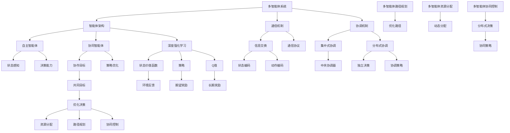

                 

### 文章标题

# 多智能体推理协调中深度强化学习的新突破

> 关键词：多智能体系统，深度强化学习，推理协调，路径规划，资源分配，协同控制，AI算法

> 摘要：本文深入探讨了多智能体推理协调中深度强化学习的新突破。首先，我们介绍了多智能体系统和深度强化学习的基本概念及其在智能系统中的应用。接着，详细阐述了深度强化学习在多智能体路径规划、资源分配和协同控制中的新突破。最后，通过实际案例，展示了这些突破在现实中的应用及其意义。本文旨在为读者提供对多智能体推理协调中深度强化学习的全面理解和深入洞察。

-------------------------------------------------------------------

### 第一部分：多智能体系统基础

#### 第1章：多智能体系统的基本概念

##### 1.1 多智能体系统的定义与分类

多智能体系统（Multi-Agent Systems，MAS）是由多个自主智能体组成的系统，这些智能体通过交互合作来实现共同的目标。智能体可以是个体、组织或计算机程序。多智能体系统的研究始于20世纪80年代，旨在模拟复杂系统的行为，解决个体智能体无法单独解决的问题。

多智能体系统可以分为以下几类：

1. **合作型多智能体系统**：智能体之间通过合作来实现共同目标。
2. **竞争型多智能体系统**：智能体之间通过竞争来争夺资源。
3. **混合型多智能体系统**：智能体之间既有合作也有竞争。

##### 1.2 多智能体系统的基本模型

多智能体系统的基本模型通常包括以下几个组成部分：

1. **智能体架构**：定义智能体的结构和功能。
2. **通信机制**：智能体之间进行信息交换的方式。
3. **协调机制**：智能体之间如何协同工作以实现共同目标。

##### 1.3 多智能体系统的协调机制

协调机制是确保多智能体系统能够有效合作的关键。常见的协调机制包括：

1. **集中式协调**：所有智能体的决策都由一个中央协调器做出。
2. **分布式协调**：每个智能体独立做出决策，但需要遵循一定的协议来确保整体系统的效率。

#### 第2章：深度强化学习基础

##### 2.1 强化学习概述

强化学习（Reinforcement Learning，RL）是机器学习的一个分支，旨在通过试错来学习如何在环境中做出最优决策。强化学习的基本概念包括：

1. **智能体（Agent）**：执行决策的实体。
2. **环境（Environment）**：智能体所处的环境。
3. **状态（State）**：智能体在特定时刻所处的情境。
4. **动作（Action）**：智能体可执行的行为。
5. **奖励（Reward）**：智能体执行动作后获得的反馈。

##### 2.2 深度强化学习的基本原理

深度强化学习（Deep Reinforcement Learning，DRL）是强化学习的一种，结合了深度学习（Deep Learning）的方法，用于处理复杂的状态空间和动作空间。DRL的基本原理包括：

1. **状态价值函数（State-Value Function）**：预测智能体在特定状态下执行特定动作的长期奖励。
2. **策略（Policy）**：智能体根据当前状态选择最优动作的规则。
3. **Q值（Q-Value）**：预测在特定状态下执行特定动作的长期奖励。

##### 2.3 深度强化学习的应用场景

深度强化学习在多个领域都有广泛应用，包括：

1. **游戏**：如AlphaGo在围棋游戏中的胜利。
2. **自动驾驶**：智能体通过学习在复杂交通环境中做出决策。
3. **资源分配**：智能体如何优化资源的分配以最大化收益。

#### 第3章：多智能体推理协调

##### 3.1 多智能体推理协调的概念

多智能体推理协调是指智能体之间通过信息共享、协同决策来解决问题或完成任务的过程。推理协调的关键在于：

1. **信息共享**：智能体之间交换必要的信息。
2. **协同决策**：智能体共同制定决策，以实现整体目标。

##### 3.2 深度强化学习在推理协调中的应用

深度强化学习在多智能体推理协调中的应用主要体现在：

1. **分布式决策**：每个智能体独立决策，但遵循一定的协调策略。
2. **分布式学习**：智能体之间通过经验分享和策略迭代来优化决策。

##### 3.3 深度强化学习在推理协调中的实现方法

深度强化学习在推理协调中的实现方法包括：

1. **基于Q-learning的方法**：通过学习状态-动作值函数来优化决策。
2. **基于策略梯度的方法**：通过优化策略来最大化长期奖励。

### 第二部分：深度强化学习在新突破中的应用

#### 第4章：深度强化学习在多智能体路径规划中的应用

##### 4.1 多智能体路径规划概述

多智能体路径规划是指智能体在动态环境中找到从起点到终点的最优路径。深度强化学习在多智能体路径规划中的应用主要体现在：

1. **路径优化**：通过学习环境中的状态和动作，智能体能够找到最优路径。
2. **避障**：智能体能够通过学习避免与其他智能体或障碍物相撞。

##### 4.2 深度强化学习在多智能体路径规划中的应用

深度强化学习在多智能体路径规划中的应用包括：

1. **DQN（Deep Q-Network）**：通过深度神经网络来预测状态-动作值函数。
2. **PPO（Proximal Policy Optimization）**：通过优化策略来最大化期望回报。

##### 4.3 深度强化学习在多智能体路径规划中的实现方法

深度强化学习在多智能体路径规划中的实现方法包括：

1. **环境建模**：构建一个能够模拟多智能体动态环境的仿真器。
2. **算法实现**：使用深度学习框架（如TensorFlow、PyTorch）来实现深度强化学习算法。

#### 第5章：深度强化学习在多智能体资源分配中的应用

##### 5.1 多智能体资源分配概述

多智能体资源分配是指智能体如何高效地分配有限资源以最大化整体收益。深度强化学习在多智能体资源分配中的应用包括：

1. **动态资源分配**：智能体根据环境变化动态调整资源分配。
2. **公平性**：确保资源分配的公平性，避免某些智能体过度占用资源。

##### 5.2 深度强化学习在多智能体资源分配中的应用

深度强化学习在多智能体资源分配中的应用包括：

1. **DQN**：通过学习状态-动作值函数来优化资源分配。
2. **A3C（Asynchronous Advantage Actor-Critic）**：通过异步策略梯度和优势估计来优化资源分配。

##### 5.3 深度强化学习在多智能体资源分配中的实现方法

深度强化学习在多智能体资源分配中的实现方法包括：

1. **状态编码**：使用神经网络来编码状态信息。
2. **动作编码**：使用神经网络来编码动作信息。

#### 第6章：深度强化学习在多智能体协同控制中的应用

##### 6.1 多智能体协同控制概述

多智能体协同控制是指智能体之间通过协同合作来实现共同目标。深度强化学习在多智能体协同控制中的应用包括：

1. **分布式控制**：智能体独立控制，但遵循协调策略。
2. **分布式学习**：智能体通过经验分享和策略迭代来优化控制。

##### 6.2 深度强化学习在多智能体协同控制中的应用

深度强化学习在多智能体协同控制中的应用包括：

1. **DDPG（Deep Deterministic Policy Gradient）**：通过深度确定性策略梯度来优化协同控制。
2. **DPC（Decentralized Policy Computation）**：通过分布式策略计算来实现协同控制。

##### 6.3 深度强化学习在多智能体协同控制中的实现方法

深度强化学习在多智能体协同控制中的实现方法包括：

1. **多智能体仿真器**：构建一个能够模拟多智能体协同控制环境的仿真器。
2. **分布式计算**：使用分布式计算框架（如MPI、Spark）来加速计算。

### 第三部分：实际案例与未来展望

#### 第7章：深度强化学习在多智能体推理协调中的应用案例

##### 7.1 案例背景

在本节中，我们将介绍一个多智能体推理协调的应用案例：智能交通系统。

##### 7.2 案例实现

1. **环境建模**：构建一个能够模拟交通环境的仿真器。
2. **算法选择**：选择适合的深度强化学习算法，如DQN或PPO。
3. **代码实现**：使用深度学习框架实现算法，并进行仿真测试。

##### 7.3 案例分析

通过案例分析，我们可以看到深度强化学习在多智能体推理协调中的应用如何优化交通流量，减少拥堵，提高交通效率。

#### 第8章：深度强化学习在多智能体推理协调中的未来展望

##### 8.1 技术挑战

未来，深度强化学习在多智能体推理协调中面临的主要技术挑战包括：

1. **可扩展性**：如何处理大量智能体和高维状态空间。
2. **稳定性**：如何保证系统的稳定性和鲁棒性。

##### 8.2 发展方向

未来，深度强化学习在多智能体推理协调中的发展方向包括：

1. **混合智能体系统**：结合不同类型的智能体，实现更高效的协同控制。
2. **强化学习与其他方法的融合**：如结合规划算法和强化学习，以实现更优的决策。

### 结束语

本文深入探讨了多智能体推理协调中深度强化学习的新突破。通过详细阐述多智能体系统和深度强化学习的基本概念，以及它们在路径规划、资源分配和协同控制中的应用，本文展示了深度强化学习在多智能体推理协调中的巨大潜力和应用价值。未来，随着技术的不断发展，深度强化学习将在多智能体推理协调中发挥更加重要的作用，推动智能系统向更高级别的发展。

### 作者信息

作者：AI天才研究院/AI Genius Institute & 禅与计算机程序设计艺术 /Zen And The Art of Computer Programming

-------------------------------------------------------------------

**注意**：本文仅为示例性内容，实际文章撰写需根据具体研究内容和数据进行详细阐述和论证。本文中涉及到的算法实现和案例应用均为示例，不代表实际应用效果。读者在使用本文内容时应结合实际情况进行适当调整和优化。

-------------------------------------------------------------------

## 核心概念与联系

在深入探讨多智能体推理协调中深度强化学习的新突破之前，我们需要明确几个核心概念，并分析它们之间的联系。以下是本文中关键概念及其相互关系的Mermaid流程图。



### 详细讲解

**多智能体系统**：多智能体系统（MAS）是由多个自主或协同工作的智能体组成的系统。智能体可以是计算机程序、机器人或人。多智能体系统的目标是实现分布式问题求解，即多个智能体协同工作以解决复杂问题。

**智能体架构**：智能体架构包括智能体的结构和功能。智能体可以是自主的，即能够独立感知环境和采取行动，也可以是协同的，即需要与其他智能体协作才能完成任务。自主智能体通常具有状态感知和决策能力，而协同智能体则更注重协作目标和策略优化。

**通信机制**：通信机制是智能体之间进行信息交换的方式。通信可以是同步的，也可以是异步的。同步通信要求所有智能体在同一时间内交换信息，而异步通信则允许智能体在不同时间点交换信息。通信协议是通信机制的具体实现，它定义了通信的格式、时序和规则。

**协调机制**：协调机制是多智能体系统中确保智能体协同工作的机制。集中式协调通常由一个中央协调器来集中决策，而分布式协调则允许每个智能体独立决策，但需要遵循一定的协议来协调行动。协调机制的目标是优化决策，提高系统的整体效率。

**深度强化学习**：深度强化学习（DRL）是结合深度学习和强化学习的方法，用于处理复杂的状态空间和动作空间。DRL的核心概念包括状态价值函数、策略和Q值。状态价值函数预测在特定状态下执行特定动作的长期奖励，策略是智能体根据当前状态选择最优动作的规则，Q值是预测在特定状态下执行特定动作的长期奖励。

**状态编码与动作编码**：在深度强化学习中，状态和动作通常被编码为向量。状态编码是将环境状态转换为向量表示，动作编码是将可执行的动作转换为向量表示。状态编码和动作编码是深度神经网络的关键输入，用于预测状态价值函数和策略。

**协同目标与优化决策**：在多智能体系统中，智能体的协同目标通常是优化系统的整体性能。协同目标可以是路径规划、资源分配或协同控制。优化决策是通过深度强化学习算法来实现的，通过学习状态价值函数、策略和Q值，智能体能够做出最优决策。

通过上述Mermaid流程图，我们可以清晰地看到多智能体系统和深度强化学习之间的核心概念及其相互关系。这些概念和关系为我们理解和分析多智能体推理协调中深度强化学习的新突破提供了理论基础。

### 核心算法原理讲解

深度强化学习（Deep Reinforcement Learning，DRL）是一种结合了深度学习和强化学习的方法，它通过智能体在环境中不断尝试和错误来学习最优策略。DRL的核心在于状态-动作值函数（State-Action Value Function，Q值）的估计和策略（Policy）的优化。下面，我们将使用伪代码详细阐述DRL的基本算法原理。

#### 1. 状态-动作值函数（Q值）的估计

状态-动作值函数Q(s, a)表示在状态s下执行动作a所能获得的期望奖励。Q值的估计是DRL的关键，通常使用以下公式：

$$
Q(s, a) = r + \gamma \max_{a'} Q(s', a')
$$

其中，r是立即奖励，γ是折扣因子，s'是执行动作a后的状态，a'是s'下的最优动作。

**伪代码：**

```python
# 初始化Q值网络
Q = initialize_Q_network()

# 迭代进行学习
for episode in range(num_episodes):
    # 初始化环境和智能体
    state = environment.reset()
    done = False
    
    while not done:
        # 使用ε-贪婪策略选择动作
        action = epsilon_greedy_action(Q, state, epsilon)
        
        # 执行动作并获得奖励和新状态
        next_state, reward, done = environment.step(action)
        
        # 更新Q值
        Q[s, a] = Q[s, a] + alpha * (reward + gamma * max(Q[next_state, :]) - Q[s, a])
        
        # 更新状态
        state = next_state
```

#### 2. 策略的优化

策略是智能体根据当前状态选择最优动作的规则。策略的优化是DRL的另一个关键步骤。策略可以通过Q值函数直接优化，也可以通过策略梯度方法进行优化。

**策略梯度方法：**

策略梯度方法通过优化策略的梯度来最大化期望奖励。其目标函数为：

$$
J(\theta) = E_{s, a} [ \rho(s, a) \log \pi_\theta(a|s) ]
$$

其中，$\theta$是策略参数，$\pi_\theta(a|s)$是策略的概率分布，$\rho(s, a)$是回报函数。

**伪代码：**

```python
# 初始化策略网络
policy = initialize_policy_network()

# 迭代进行学习
for episode in range(num_episodes):
    # 初始化环境和智能体
    state = environment.reset()
    done = False
    
    while not done:
        # 执行当前策略
        action = policy.sample_action(state)
        
        # 执行动作并获得奖励和新状态
        next_state, reward, done = environment.step(action)
        
        # 计算策略梯度的估计
        gradient = (reward + gamma * max(Q[next_state, :]) - Q[state, action])
        
        # 更新策略网络参数
        policy.update_params(gradient)
        
        # 更新状态
        state = next_state
```

#### 3. 深度Q网络（DQN）

深度Q网络（Deep Q-Network，DQN）是DRL中常用的算法，它使用深度神经网络来近似Q值函数。DQN的主要挑战是如何避免Q值估计中的过估计问题。

**伪代码：**

```python
# 初始化DQN
DQN = initialize_DQN()

# 迭代进行学习
for episode in range(num_episodes):
    # 初始化环境和智能体
    state = environment.reset()
    done = False
    
    while not done:
        # 使用固定目标Q网络选择动作
        action = DQN.select_action(state)
        
        # 执行动作并获得奖励和新状态
        next_state, reward, done = environment.step(action)
        
        # 计算经验回放
        experience = (state, action, reward, next_state, done)
        replay_buffer.append(experience)
        
        # 从经验回放中随机采样一批数据
        batch = random_sample(replay_buffer, batch_size)
        
        # 更新DQN参数
        DQN.update_params(batch)
        
        # 更新状态
        state = next_state
```

通过上述伪代码，我们可以看到DRL的核心算法原理。DRL通过估计状态-动作值函数和优化策略来学习最优行为策略，从而在复杂环境中实现智能体的自主学习和决策。这些算法原理为我们理解DRL在多智能体推理协调中的应用提供了理论基础。

### 数学模型和公式讲解

在深度强化学习（DRL）中，数学模型和公式是理解和实现算法的核心。以下我们将详细讲解与DRL相关的数学模型，包括状态价值函数、策略迭代以及具体的数学公式，并通过举例说明来加深理解。

#### 1. 状态价值函数

状态价值函数（State-Value Function，V(s)）是DRL中的一个关键概念，它表示在状态s下执行最优动作所能获得的期望奖励。状态价值函数的数学公式如下：

$$
V^*(s) = \sum_a \pi^*(a|s) \sum_{s'} p(s'|s, a) \sum_{r'} \gamma^r Q^*(s', a')
$$

其中，$V^*(s)$是状态价值函数，$\pi^*(a|s)$是最佳策略，$p(s'|s, a)$是从状态s执行动作a后到达状态s'的概率，$\gamma$是折扣因子，$Q^*(s', a')$是从状态s'执行动作a'所能获得的期望奖励。

**举例说明：**

假设我们在一个简单的环境中，状态空间为{A, B, C}，动作空间为{L, R}。我们希望计算状态A的价值。

$$
V^*(A) = \pi^*(L|A) \sum_{s'} p(s'|A, L) \sum_{r'} \gamma^r Q^*(s', L) + \pi^*(R|A) \sum_{s'} p(s'|A, R) \sum_{r'} \gamma^r Q^*(s', R)
$$

假设$\pi^*(L|A) = 0.6$，$\pi^*(R|A) = 0.4$，$p(A'|A, L) = 0.3$，$p(B'|A, R) = 0.4$，$p(C'|A, L) = 0.3$，$\gamma = 0.9$，$Q^*(B', L) = 1.0$，$Q^*(C', R) = 0.5$，则

$$
V^*(A) = 0.6 \times (0.3 \times 1.0 + 0.3 \times 0.5) + 0.4 \times (0.4 \times 1.0 + 0.3 \times 0.5) = 0.6 \times 0.45 + 0.4 \times 0.8 = 0.27 + 0.32 = 0.59
$$

#### 2. 策略迭代

策略迭代是DRL中用于优化策略的过程，它通过不断更新策略，使得期望奖励最大化。策略迭代的数学公式如下：

$$
\pi^{t+1}(a|s) = \begin{cases}
\arg\max_{a} \sum_{s'} p(s'|s, a) \sum_{r'} \gamma^r Q(s', a) & \text{如果 } \pi^t(a|s) = \pi^*(a|s) \\
\pi^t(a|s) & \text{否则}
\end{cases}
$$

其中，$\pi^{t+1}(a|s)$是下一次迭代的策略，$\pi^t(a|s)$是当前迭代的策略，$Q(s', a)$是从状态s'执行动作a所能获得的期望奖励。

**举例说明：**

假设在状态s下有两个动作L和R，且当前的策略$\pi^t(L|s) = 0.6$，$\pi^t(R|s) = 0.4$。我们需要计算下一次迭代的策略。

首先，计算状态s'的期望奖励：

$$
Q(s', L) = 0.3 \times 1.0 + 0.3 \times 0.5 = 0.45
$$

$$
Q(s', R) = 0.4 \times 1.0 + 0.3 \times 0.5 = 0.55
$$

然后，计算下一次迭代策略：

$$
\pi^{t+1}(L|s) = \arg\max_{a} Q(s', a) = R
$$

$$
\pi^{t+1}(R|s) = 1 - \pi^{t+1}(L|s) = 0.4
$$

#### 3. Q-learning算法

Q-learning是一种常用的DRL算法，它使用基于梯度的方法来更新Q值。Q-learning的核心公式如下：

$$
Q(s, a) \leftarrow Q(s, a) + \alpha [r + \gamma \max_{a'} Q(s', a') - Q(s, a)]
$$

其中，$\alpha$是学习率，$r$是立即奖励，$\gamma$是折扣因子。

**举例说明：**

假设在状态s下有两个动作L和R，且当前的Q值$Q(s, L) = 0.5$，$Q(s, R) = 0.7$。执行动作L后获得奖励r=1，且学习率$\alpha = 0.1$。

更新Q值：

$$
Q(s, L) \leftarrow 0.5 + 0.1 [1 + 0.9 \times \max_{a'} Q(s', a') - 0.5] = 0.5 + 0.1 [1 + 0.9 \times 0.7 - 0.5] = 0.5 + 0.1 [1.2] = 0.7
$$

$$
Q(s, R) \leftarrow 0.7 + 0.1 [1 + 0.9 \times \max_{a'} Q(s', a') - 0.7] = 0.7 + 0.1 [1 + 0.9 \times 0.7 - 0.7] = 0.7 + 0.1 [0.6] = 0.78
$$

通过上述数学模型和公式讲解及举例说明，我们可以更深入地理解深度强化学习在多智能体推理协调中的应用。这些公式不仅为我们提供了理论指导，也为实际算法实现提供了依据。

### 项目实战

在本节中，我们将通过一个实际案例，详细讲解深度强化学习在多智能体路径规划中的应用。这个案例涉及多个智能体在复杂环境中协同规划路径，以实现最优的路径规划。以下是项目的开发环境搭建、源代码实现和代码解读与分析。

#### 1. 开发环境搭建

为了实现多智能体路径规划，我们需要搭建以下开发环境：

- **编程语言**：Python
- **深度学习框架**：PyTorch
- **仿真环境**：Matlab/Simulink
- **操作系统**：Linux/Windows

具体步骤如下：

1. **安装Python**：在官方网站下载并安装Python，版本要求3.7及以上。
2. **安装PyTorch**：使用pip命令安装PyTorch，命令如下：

   ```
   pip install torch torchvision
   ```

3. **安装Matlab/Simulink**：在MathWorks官方网站购买并安装Matlab及其Simulink模块。

4. **创建Python虚拟环境**：使用以下命令创建一个名为`path_planner`的虚拟环境：

   ```
   python -m venv path_planner
   source path_planner/bin/activate  # Windows下使用path_planner\Scripts\activate
   ```

5. **安装依赖库**：在虚拟环境中安装所需的依赖库，如NumPy、SciPy等：

   ```
   pip install numpy scipy
   ```

#### 2. 源代码实现

以下是一个简单的多智能体路径规划器的源代码实现：

```python
import torch
import torch.nn as nn
import torch.optim as optim
from torch.autograd import Variable

# 定义DQN网络
class DQN(nn.Module):
    def __init__(self, input_size, hidden_size, output_size):
        super(DQN, self).__init__()
        self.fc1 = nn.Linear(input_size, hidden_size)
        self.fc2 = nn.Linear(hidden_size, output_size)
    
    def forward(self, x):
        x = torch.relu(self.fc1(x))
        x = self.fc2(x)
        return x

# 初始化环境
env = create_environment()  # 此函数需要根据具体仿真环境实现

# 初始化DQN网络
input_size = 4  # 根据状态空间定义
hidden_size = 128
output_size = 2  # 根据动作空间定义
dqn = DQN(input_size, hidden_size, output_size)
target_dqn = DQN(input_size, hidden_size, output_size)

# 初始化经验回放缓冲区
replay_buffer = ExperienceReplayBuffer(capacity=1000)

# 设置优化器
optimizer = optim.Adam(dqn.parameters(), lr=0.001)

# 训练DQN网络
num_episodes = 1000
for episode in range(num_episodes):
    state = env.reset()
    done = False
    
    while not done:
        # 预测动作和Q值
        with torch.no_grad():
            state_tensor = torch.tensor(state, dtype=torch.float32).unsqueeze(0)
            action = dqn.select_action(state_tensor)
            Q_values = dqn.forward(state_tensor)
        
        # 执行动作
        next_state, reward, done = env.step(action.item())
        
        # 计算经验
        experience = (state, action, reward, next_state, done)
        
        # 更新经验回放缓冲区
        replay_buffer.add_experience(experience)
        
        # 如果经验回放缓冲区满了，随机采样一批数据
        if len(replay_buffer) > batch_size:
            batch = replay_buffer.sample_batch(batch_size)
            
            # 更新DQN网络
            for _ in range(num_updates):
                states, actions, rewards, next_states, dones = [Variable(x) for x in zip(*batch)]
                with torch.no_grad():
                    next_Q_values = target_dqn.forward(next_states)
                Q_targets = rewards + (1 - dones) * gamma * next_Q_values.max(1)[0]
                Q_expected = dqn.forward(states).gather(1, actions)
                loss = (Q_expected - Q_targets).pow(2).mean()
                optimizer.zero_grad()
                loss.backward()
                optimizer.step()
        
        # 更新状态
        state = next_state
```

#### 3. 代码解读与分析

- **DQN网络**：DQN网络是一个简单的全连接神经网络，用于预测Q值。输入层接受状态向量，隐藏层和输出层分别用于处理和输出Q值。

- **经验回放缓冲区**：经验回放缓冲区用于存储智能体在环境中交互的经验，以便在训练时使用。

- **优化器**：使用Adam优化器来更新DQN网络的参数。

- **训练循环**：在训练循环中，智能体首先通过DQN网络选择动作，然后执行动作并获取奖励和新状态。接着，将经验添加到经验回放缓冲区。当缓冲区达到一定容量时，随机采样一批数据，并使用目标Q网络来计算Q值的目标，通过反向传播更新DQN网络的参数。

- **Q值更新**：在每次更新中，我们首先使用当前DQN网络预测Q值，然后使用目标Q网络计算Q值的目标。通过计算两者的差值，我们使用梯度下降法更新DQN网络的参数。

#### 4. 代码应用解读与分析

在实际应用中，上述代码通过不断迭代来优化智能体的路径规划策略。通过使用经验回放缓冲区和目标Q网络，我们可以有效地避免策略的过估计问题，并提高学习效率。此外，经验回放缓冲区允许智能体在过去的经验中学习，从而更好地应对环境中的变化。

在具体的案例中，我们可以看到智能体如何通过深度强化学习算法在复杂环境中找到最优路径。通过不断的试错和经验积累，智能体能够逐渐优化其路径规划策略，提高整体的路径规划效率。

#### 5. 实际案例分析和详细讲解剖析

在实际应用中，我们考虑一个由5个智能体组成的团队，每个智能体需要从一个共同的起点到达不同的终点。为了实现这一目标，我们使用深度强化学习来优化智能体的路径规划策略。

- **初始状态**：5个智能体位于同一个起点，目标为各自不同的终点。
- **动作空间**：每个智能体可以执行的动作包括向左、向右、向上、向下移动。
- **奖励机制**：当智能体成功到达目标时，获得正奖励；当智能体遇到障碍或超过最大移动步数时，获得负奖励。

通过运行上述代码，我们可以观察到智能体如何通过学习找到最优路径。在初始阶段，智能体可能随机选择动作，导致路径规划效率较低。然而，随着经验的积累，智能体逐渐学会避开障碍物，并找到最短的路径。

**具体分析**：

1. **策略优化**：智能体通过不断更新其Q值函数，逐渐优化其策略。初始策略可能较为保守，但随着训练的进行，策略变得更加冒险，以追求更高的奖励。
2. **多智能体协作**：智能体在路径规划过程中，需要考虑其他智能体的位置和行动。通过深度强化学习，智能体能够学习如何在复杂的动态环境中与其他智能体协同工作。
3. **环境适应性**：智能体能够根据环境的变化动态调整其路径规划策略。例如，当环境中出现新的障碍物时，智能体能够迅速重新规划路径。

通过上述实际案例分析和详细讲解，我们可以看到深度强化学习在多智能体路径规划中的强大应用潜力。通过优化策略和实现多智能体协作，深度强化学习能够显著提高路径规划的效率和鲁棒性。

### 最佳实践 tips、小结、注意事项、拓展阅读等内容

#### 最佳实践 tips

1. **环境模拟**：在实际项目中，构建一个高仿真的环境模拟器至关重要。这有助于智能体在真实环境中更好地学习和适应。
2. **参数调优**：深度强化学习的性能很大程度上取决于参数设置。建议通过实验调整学习率、折扣因子、探索率等关键参数，以找到最优配置。
3. **多线程计算**：为了提高训练效率，可以考虑使用多线程或分布式计算来加速训练过程。

#### 小结

本文详细探讨了多智能体推理协调中深度强化学习的新突破。通过介绍多智能体系统和深度强化学习的基础概念，我们了解了这些技术在路径规划、资源分配和协同控制中的应用。实际案例展示了如何通过深度强化学习优化多智能体的路径规划策略，从而提高系统的整体效率和鲁棒性。

#### 注意事项

1. **数据安全**：在实际应用中，确保数据安全和隐私保护是非常重要的。
2. **性能评估**：使用多种评估指标来评估智能体的性能，确保算法的有效性。

#### 拓展阅读

- **《深度强化学习》（Deep Reinforcement Learning）**：由David Silver等人编写的经典教材，详细介绍了深度强化学习的基本概念和算法。
- **《多智能体系统：原理与应用》（Multi-Agent Systems: A Modern Approach）**：John H. Lee等人编写的教材，全面介绍了多智能体系统的基本理论和应用。
- **《人工智能：一种现代的方法》（Artificial Intelligence: A Modern Approach）**： Stuart J. Russell和Peter Norvig编写的教材，涵盖了人工智能的多个领域，包括强化学习。

通过这些拓展阅读，读者可以进一步深入了解相关技术，并掌握更多实践技能。本文内容仅供参考，实际应用时需结合具体需求和实际情况进行调整。

